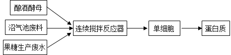
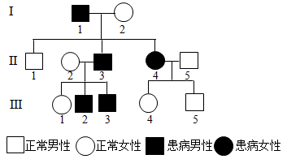
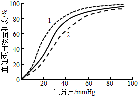
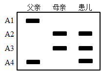
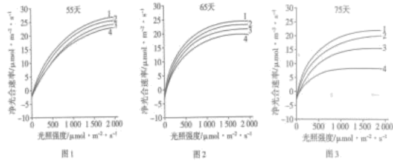
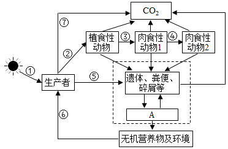
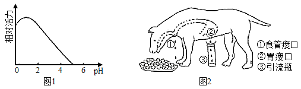
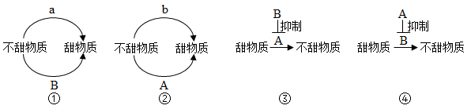
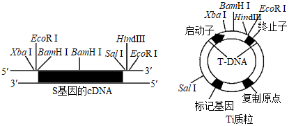

**2022年湖北省普通高中学业水平选择性考试**

**生物学**

**一、选择题：本题共20小题。每小题给出的四个进项中，只有一个选项符合题目要求。**

1\. 水是生命的源泉，节约用水是每个人应尽的责任，下列有关水在生命活动中作用的叙述，错误的是（　　）

A. 水是酶促反应的环境 B. 参与血液中缓冲体系的形成

C. 可作为维生素D等物质的溶剂 D. 可作为反应物参与生物氧化过程

【答案】C

【解析】

【分析】细胞内的水的存在形式是自由水和结合水，结合水是细胞结构的重要组成成分；自由水是良好的溶剂，是许多化学反应的介质，自由水还参与许多化学反应，自由水对于营养物质和代谢废物的运输具有重要作用；自由水与结合水不是一成不变的，可以相互转化，自由水与结合水的比值越高，细胞代谢越旺盛，抗逆性越低，反之亦然。

【详解】A、自由水是化学反应的介质，故水是酶促反应的环境，A正确；

B、血液中的缓冲对是由离子组成的，离子溶解在水中才能形成缓冲体系，B正确；

C、维生素D属于脂质，脂质通常都不溶于水，C错误；

D、自由水能参与化学反应，故水可作为反应物参与生物氧化过程，D正确。

故选C。

2\. 生态环境破坏、过度捕捞等导致长江中下游生态退化，渔业资源锐减，长江江豚、中华鲟等长江特有珍稀动物濒临灭绝。为了挽救长江生态环境，国家制定了“长江10年禁渔”等保护政策，对长江生态环境及生物多样性进行保护和修复。下列有关叙述正确的是（　　）

A. 长江鱼类资源稳定恢复的关键在于长期禁渔

B. 定期投放本土鱼类鱼苗是促进长江鱼类资源快速恢复的手段之一

C. 长江保护应在优先保护地方经济发展的基础上，进行生态修复和生物多样性保护

D. 挽救长江江豚等珍稀濒危动物长期有效的措施是建立人工养殖场，进行易地保护和保种

【答案】B

【解析】

【分析】 就地保护是最有效的措施，比如建立自然保护区；易地保护有建立植物园、动物园等；利用生物技术保护：建立精子库、种子库等。

【详解】A、长江鱼类资源稳定恢复的关键在于对长江生态环境及生物多样性进行保护和修复，并不意味着禁止开发和利用，A错误；

B、定期投放本土鱼类鱼苗是促进长江鱼类资源快速恢复的手段之一，B正确；

C、长江保护应在进行生态修复和生物多样性保护的基础上，进行地方经济发展，C错误；

D、挽救长江江豚等珍稀濒危动物长期有效的措施是建立自然保护区，实行就地保护，D错误。

故选B。

3\. 哺乳动物成熟红细胞的细胞膜含有丰富的水通道蛋白，硝酸银（AgNO3）可使水通道蛋白失去活性。下列叙述错误的是（　　）

A. 经AgNO3处理的红细胞在低渗蔗糖溶液中会膨胀

B. 经AgNO3处理的红细胞在高渗蔗糖溶液中不会变小

C. 未经AgNO3处理红细胞在低渗蔗糖溶液中会迅速膨胀

D. 未经AgNO3处理的红细胞在高渗蔗糖溶液中会迅速变小

【答案】B

【解析】

【分析】水可以通过水通道蛋白以协助扩散的形式进出细胞，也可以直接通过自由扩散的方式进出细胞。

【详解】AB、经AgNO3处理的红细胞，水通道蛋白失去活性，但水可以通过自由扩散的形式进出细胞，故其在低渗蔗糖溶液中会吸水膨胀，在高渗蔗糖溶液中会失水变小，A正确，B错误；

CD、未经AgNO3处理的红细胞，水可通过水通道蛋白快速进出细胞，也可通过自由扩散进出细胞，故其在低渗蔗糖溶液中会迅速吸水膨胀，在高渗蔗糖溶液中会迅速失水变小，CD正确。

故选B。

4\. 灭菌、消毒、无菌操作是生物学实验中常见的操作。下列叙述正确的是（　　）

A. 动、植物细胞DNA的提取必须在无菌条件下进行

B. 微生物、动物细胞培养基中需添加一定量的抗生素以防止污染

C. 为防止蛋白质变性，不能用湿热灭菌法对牛肉膏蛋白胨培养基进行灭菌

D. 可用湿热灭菌法对实验中所使用的微量离心管、细胞培养瓶等进行灭菌

【答案】D

【解析】

【分析】使用强烈的理化因素杀死物体内外一切微生物的细胞、芽孢和孢子的过程称为灭菌，常用的方法有灼烧灭菌、干热灭菌和湿热灭菌。消毒是指用较为温和的物理或化学方法仅杀死物体体表或内部的一部分微生物的过程。

【详解】A、动、植物细胞DNA的提取不需要在无菌条件下进行，A错误；

B、动物细胞培养基中需添加一定量的抗生素以防止污染，保证无菌环境，而微生物的培养不能加入抗生素，B错误；

C、一般用湿热灭菌法对牛肉膏蛋白胨培养基进行灭菌，以防止杂菌污染，C错误；

D、可用湿热灭菌法对实验中所使用的微量离心管、细胞培养瓶等进行灭菌，以防止杂菌污染，D正确。

故选D。

5\. RMI1基因具有维持红系祖细胞分化为成熟红细胞的能力。体外培养实验表明，随着红系祖细胞分化为成熟红细胞，BMI1基因表达量迅速下降。在该基因过量表达的情况下，一段时间后成熟红细胞的数量是正常情况下的1012倍。根据以上研究结果，下列叙述错误的是（　　）

A. 红系祖细胞可以无限增殖分化为成熟红细胞

B. BMI1基因的产物可能促进红系祖细胞的体外增殖

C. 该研究可为解决临床医疗血源不足的问题提供思路

D. 红系祖细胞分化为成熟红细胞与BMI1基因表达量有关

【答案】A

【解析】

【分析】分析题意可知，RMI1基因的表达产物能使红系祖细胞分化为成熟红细胞，RMI1基因大量表达，红系祖细胞能大量增殖分化为成熟红细胞。

【详解】A、红系祖细胞能分化为成熟红细胞，但不具有无限增殖的能力，A错误；

B、BMI1基因过量表达的情况下，一段时间后成熟红细胞的数量是正常情况下的1012倍，推测BMI1基因的产物可能促进红系祖细胞的体外增殖和分化，B正确；

C、若使BMI1基因过量表达，则可在短时间内获得大量成熟红细胞，可为解决临床医疗血源不足的问题提供思路，C正确；

D、当红系祖细胞分化为成熟红细胞后，BMI1基因表达量迅速下降，若使该基因过量表达，则成熟红细胞的数量快速增加，可见红系祖细胞分化为成熟红细胞与BMI1基因表达量有关，D正确。

故选A。

6\. 某兴趣小组开展小鼠原代神经元培养的研究，结果发现其培养的原代神经元生长缓慢，其原因不可能的是（　　）

A. 实验材料取自小鼠胚胎的脑组织 B. 为了防止污染将培养瓶瓶口密封

C. 血清经过高温处理后加入培养基 D. 所使用的培养基呈弱酸性

【答案】A

【解析】

【分析】小鼠原代神经元培养属于动物细胞培养，需要在无菌无毒和培养液提供类似内环境的条件下进行。

【详解】A、小鼠胚胎脑组织中含有丰富的原代神经元，细胞增殖能力强，不会造成生长缓慢，A符合题意；

B、培养瓶瓶口密封会使培养液中缺氧，影响细胞有氧呼吸，造成供能不足，可能使细胞生长缓慢，B不符合题意；

C、血清经过高温处理后，其中活性成分变性，失去原有功能，细胞生存环境严重恶化，可能使细胞生长缓慢，C不符合题意；

D、小鼠内环境为弱碱性，所使用的培养基呈弱酸性，使细胞生存环境恶劣，可能造成细胞生长缓慢，D不符合题意。

故选A。

7\. 奋战在抗击新冠疫情一线的医护人员是最美逆行者。因长时间穿防护服工作，他们汗流浃背，饮水受限，尿量减少。下列关于尿液生成及排放的调节，叙述正确的是（　　）

A. 抗利尿激素可以促进肾小管和集合管对NaCl的重吸收

B. 医护人员紧张工作后大量饮用清水有利于快速恢复水一盐平衡

C. 医护人员工作时高度紧张，排尿反射受到大脑皮层的抑制，排尿减少

D. 医护人员工作时汗流浃背，抗利尿激素的分泌减少，水的重吸收增加

【答案】C

【解析】

【分析】抗利尿激素是由下丘脑神经细胞分泌、由垂体释放的。在渗透压降低时，下丘脑分泌抗利尿激素，并由垂体释放抗利尿激素进入血液，促进肾小管、集合管对水分的重吸收。抗利尿激素增多，重吸收能力增强，排尿减少；反之，重吸收能力减弱，排尿增多。

【详解】A、抗利尿激素可以促进肾小管和集合管对水的重吸收，A错误；

B、医护工作者因长时间穿防护服工作，他们汗流浃背，饮水受限，这个过程丢失了水分和无机盐，故医护人员紧张工作后应适量饮用淡盐水有利于快速恢复水一盐平衡，B错误；

C、排尿反射中枢位于脊髓，排尿反射中枢属于低级中枢，受控于大脑皮层的高级中枢，当医护人员工作时高度紧张，排尿反射受到大脑皮层的抑制，使排尿减少，C正确；

D、医护人员工作时汗流浃背，使细胞外液的渗透压增高，抗利尿激素的分泌增多，水的重吸收增加，排尿减少，D错误。

故选C。

8\. 水稻种植过程中，植株在中后期易倒伏是常见问题。在适宜时期喷施适量的调环酸钙溶液，能缩短水稻基部节间长度，增强植株抗倒伏能力。下列叙述错误的是（　　）

A. 调环酸钙是一种植物生长调节剂

B. 喷施调环酸钙的关键之一是控制施用浓度

C. 若调环酸钙喷施不足，可尽快喷施赤霉素进行补救

D. 在水稻基部节间伸长初期喷施调环酸钙可抑制其伸长

【答案】C

【解析】

【分析】植物生长调节剂：人工合成的，对植物生长发育有调节作用的化学物质。

【详解】A、调环酸钙是一种植物生长调节剂，能缩短水稻基部节间长度，增强植株抗倒伏能力，A正确；

B、喷施调环酸钙的关键之一是控制施用浓度，B正确；

C、赤霉素促进茎秆生长，若调环酸钙喷施不足，不能喷施赤霉素进行补救，C错误；

D、在水稻基部节间伸长初期喷施调环酸钙可抑制其伸长，D正确。

故选C。

9\. 北京冬奥会期间，越野滑雪运动员身着薄比赛服在零下10℃左右的环境中展开激烈角逐，关于比赛中运动员的生理现象，下列叙述正确的是（　　）

A. 血糖分解加快，储存的ATP增加，产热大于散热

B. 血液中肾上腺素含量升高，甲状腺激素含量下降，血糖分解加快

C 心跳加快，呼吸频率增加，温度感受器对低温不敏感而不觉得寒冷

D. 在运动初期骨骼肌细胞主要通过肌糖原分解供能，一定时间后主要通过肝糖原分解供能

【答案】C

【解析】

【分析】运动员在寒冷条件下剧烈运动时体内发生体温调节等生理过程，运动时需要消耗大量能量，骨骼肌细胞分解肌糖原提供能量，在运动后期需要摄取血糖进行氧化分解以满足机体对能量的需要。

【详解】A、运动期间需要大量能量，血糖分解加快，ATP和ADP的转化速率加快，但储存的ATP基本不变，A错误；

B、血液中肾上腺素含量升高，甲状腺激素含量上升，血糖分解加快，细胞代谢速率加快，B错误；

C、心跳加快，呼吸频率增加，细胞代谢速率加快，运动员基本不觉得寒冷，说明温度感受器对低温不敏感而不觉得寒冷，C正确；

D、在运动初期骨骼肌细胞主要通过肌糖原分解供能，一定时间后需要摄取血糖作为能源补充，D错误。

故选C。

10\. 关于白酒、啤酒和果酒的生产，下列叙述错误的是（　　）

A. 在白酒、啤酒和果酒的发酵初期需要提供一定的氧气

B. 白酒、啤酒和果酒酿制的过程也是微生物生长繁殖的过程

C. 葡萄糖转化为乙醇所需的酶既存在于细胞质基质，也存在于线粒体

D. 生产白酒、啤酒和果酒的原材料不同，但发酵过程中起主要作用的都是酵母菌

【答案】C

【解析】

【分析】果酒的制作离不开酵母菌，酵母菌是兼性厌氧型生物，在有氧条件下，酵母菌进行有氧呼吸，大量繁殖，在无氧条件下，酵母菌进行酒精发酵。

【详解】A、在白酒、啤酒和果酒的发酵初期需要提供一定的氧气，让酵母菌大量繁殖，再进行酒精发酵，A正确；

B、白酒、啤酒和果酒酿制的过程也是微生物生长繁殖的过程，如发酵初期酵母菌大量繁殖，B正确；

CD、酒精发酵利用菌种是酵母菌，葡萄糖转化为乙醇所需的酶存在于细胞质基质，不存在线粒体中，C错误，D正确。

故选C。

11\. 某植物的2种黄叶突变体表现型相似，测定各类植株叶片的光合色素含量（单位：μg·g-1），结果如表。下列有关叙述正确的是（　　）

| 植林类型 | 叶绿素a | 叶绿素b | 类胡萝卜素 | 叶绿素/胡萝卜素 |
|:---------|:--------|:--------|:-----------|:----------------|
| 野生型   | 1235    | 519     | 419        | 4．19           |
| 突变体1  | 512     | 75      | 370        | 1．59           |
| 突变体2  | 115     | 20      | 379        | 0．35           |

A. 两种突变体的出现增加了物种多样性

B. 突变体2比突变体1吸收红光的能力更强

C. 两种突变体的光合色素含量差异，是由不同基因的突变所致

D. 叶绿素与类胡萝卜素的比值大幅下降可导致突变体的叶片呈黄色

【答案】D

【解析】

【分析】1、光合色素包括叶绿素和类胡萝卜素，其中叶绿素主要吸收红光和蓝紫光，而类胡萝卜素主要吸收蓝紫光。

2、叶绿体中的色素都能溶解于丙酮、无水乙醇等有机溶剂中，所以用丙酮或无水乙醇提取叶绿体中的色素；色素在层析液中的溶解度不同，在滤纸上扩散速度不同，即溶解度越大，随着层析液扩散的速度越快。

【详解】A、两种突变体之间并无生殖隔离，仍属同一物种，只能体现遗传多样性，A错误；

B、叶绿素主要吸收红光和蓝紫光，突变体2的叶绿素a和叶绿素b的含量比突变体1少，故突变体2比突变体1吸收红光的能力弱，B错误；

C、两种突变体的光合色素含量差异，可能是同一个基因突变方向不同导致的，C错误；

D、野生型的叶绿素与胡萝卜素的比值为4.19，叶绿素含量较高，叶片呈绿色，叶绿素与类胡萝卜素的比值大幅下降，叶绿素含量少，不能掩盖 类胡萝卜素的颜色，此时叶片呈黄色，D正确。

故选D。

12\. 氨基酸在人体内分解代谢时，可以通过脱去羧基生成CO2和含有氨基的有机物（有机胺），有些有机胺能引起较强的生理效应。组氨酸脱去羧基后的产物组胺，可舒张血管；酪氨酸脱去羧基后的产物酪胺，可收缩血管；天冬氨酸脱去羧基后的产物β-丙氨酸是辅酶A的成分之一。下列叙述正确的是（　　）

A. 人体内氨基酸的主要分解代谢途径是脱去羧基生成有机胺

B. 有的氨基酸脱去羧基后的产物可作为生物合成的原料

C. 组胺分泌过多可导致血压上升

D 酪胺分泌过多可导致血压下降

【答案】B

【解析】

【分析】据题意“组氨酸脱去羧基后的产物组胺，可舒张血管”可知，组胺分泌过多可导致血压下降；由“酪氨酸脱去羧基后的产物酪胺，可收缩血管”可知，酪胺分泌过多可导致血压上升。

【详解】A、人体内氨基酸的主要分解代谢途径是经过脱氨基作用，含氮部分转化成尿素，不含氮部分氧化分解产生二氧化碳和水，A错误；

B、有的氨基酸脱去羧基后的产物可作为生物合成的原料，如天冬氨酸脱去羧基后的产物β-丙氨酸是辅酶A的成分之一，B正确；

C、组胺可舒张血管，组胺分泌过多可导致血压下降，C错误；

D、酪胺可收缩血管，酪胺分泌过多可导致血压上升，D错误。

故选B。

13\. 废水、废料经加工可变废为宝。某工厂利用果糖生产废水和沼气池废料生产蛋白质的技术路线如图所示。下列叙述正确的是（　　）

A. 该生产过程中，一定有气体生成

B. 微生物生长所需碳源主要来源于沼气池废料

C. 该生产工艺利用微生物厌氧发酵技术生产蛋白质

D. 沼气池废料和果糖生产废水在加入反应器之前需要灭菌处理

【答案】A

【解析】

【分析】培养基的主要成分有水、无机盐、碳源与氮源，统计微生物的方法有稀释涂布平板法和显微镜直接计数法。

【详解】A、据图可知，该生产过程中有酿酒酵母的参与，酵母菌呼吸作用会产生二氧化碳，故该生产过程中，一定有气体生成，A正确；

B、糖类是主要的能源物质，微生物生长所需的碳源主要来源于果糖生产废水，B错误；

C、分析图示可知，该技术中有连续搅拌反应器的过程，该操作的可以增加微生物与营养物质的接触面积，此外也可增大溶解氧含量，故据此推测该生产工艺利用微生物的有氧发酵技术生产蛋白质，C错误；

D、沼气生产利用的是厌氧微生物，在连续搅拌反应器中厌氧微生物会被抑制，因此沼气池废料无需灭菌，D错误。

故选A。

14\. 某肾病患者需进行肾脏移植手术。针对该患者可能出现的免疫排斥反应，下列叙述错误的是（　　）

A. 免疫排斥反应主要依赖于T细胞的作用

B. 患者在术后需使用免疫抑制剂以抑制免疫细胞的活性

C. 器官移植前可以对患者进行血浆置换，以减轻免疫排斥反应

D. 进行肾脏移植前，无需考虑捐献者与患者的ABO血型是否相同

【答案】D

【解析】

【分析】体液免疫过程为：除少数抗原可以直接刺激B细胞外，大多数抗原被巨噬细胞摄取和处理，并暴露出其抗原决定簇；巨噬细胞将抗原呈递给辅助性T细胞，其产生的细胞因子作用于B细胞，B细胞接受抗原与细胞因子的刺激后，开始进行一系列的增殖、分化，形成记忆细胞和浆细胞；浆细胞分泌抗体与相应的抗原特异性结合，发挥免疫效应。

辅助性T细胞在接受抗原的刺激后，通过分化形成细胞毒性T细胞，细胞毒性T细胞可以与被抗原入侵的宿主细胞密切接触，使这些细胞裂解死亡。病原体失去了寄生的基础，因而能被吞噬、消灭。

【详解】A、器官移植后排斥反应主要是细胞免疫的结果，而细胞免疫是以T细胞为主的免疫反应，即免疫排斥反应主要依赖于T细胞的作用，A正确；

B、免疫抑制剂的作用是抑制与免疫反应有关细胞的增殖和功能，即抑制免疫细胞的活性，所以患者在术后需使用免疫抑制剂，避免引起免疫排斥反应，B正确；

C、血浆置换术可以去除受者体内天然抗体，避免激发免疫反应，所以在器官移植前，可以对对患者进行血浆置换，以减轻免疫排斥反应，C正确；

D、实质脏器移植中，供、受者间ABO血型物质不符可能导致强的移植排斥反应，所以在肾脏移植前，应考虑捐献者与患者是否为同一血型，D错误；

故选D。

15\. 新冠病毒是一种RNA病毒，其基因组含有约3万个核苷酸。该病毒可通过表面S蛋白与人细胞表面的ACE2蛋白结合而进入细胞。在细胞中该病毒的RNA可作为mRNA，指导合成病毒复制所需的RNA聚合酶，该聚合酶催化RNA合成时碱基出错频率为10-5．下列叙述正确的是（　　）

A. 新冠病毒只有在选择压力的作用下才发生基因突变

B. ACE2蛋白的出现是人类抵抗新冠病毒入侵的进化结果

C. 注射新冠病毒疫苗后，人体可产生识别ACE2蛋白的抗体

D. 新冠病毒RNA聚合酶可作为研制治疗新冠肺炎药物的有效靶标

【答案】D

【解析】

【分析】 体液免疫：一些病原体可以和B细胞接触，这为激活B细胞提供了第一个信号；一些病原体被树突状细胞、B细胞等抗原呈递细胞摄取；抗原呈递细胞将抗原处理后呈递在细胞表面，然后传递给辅助性T细胞；辅助性T细胞表面的特定分子发生变化并与B细胞结合，这是激活B细胞的第二个信号；辅助性T细胞开始分裂、繁殖快，并分泌细胞因子；B细胞受到两个信号的刺激后开始分裂、分化，大部分分化为浆细胞，小部分分化为记忆B细胞，细胞因子能促进B细胞的分裂、分化；浆细胞产生和分泌大量抗体，抗体可以随体液在全身循环并与这种病原体结合；抗体与病原体的结合可以抑制病原体的增殖或对人体细胞的黏附。

进化：在自然选择的作用下，具有有利变异的个体有更多机会产生后代，种群中相应的基因频率会不断提高，相反，具有不利变异的个体留下后代的机会少，种群中相应的基因频率会不断降低。

【详解】A、病毒的突变是随机的、不定向的，A错误；

B、人类本身含有ACE2蛋白，并非是人类抵抗新冠病毒入侵的进化结果，B错误；

C、注射新冠病毒疫苗后，人体可产生识别新冠病毒的抗体，C错误；

D、在细胞中该病毒的RNA可作为mRNA，指导合成病毒复制所需的RNA聚合酶，新冠病毒RNA聚合酶可作为研制治疗新冠肺炎药物的有效靶标，D正确。

故选D。

16\. 如图为某单基因遗传病的家系图。据图分析，下列叙述错误的是（　　）

A. 该遗传病可能存在多种遗传方式

B. 若Ⅰ-2为纯合子，则Ⅲ-3是杂合子

C. 若Ⅲ--2为纯合子，可推测Ⅱ-5为杂合子

D. 若Ⅱ-2和Ⅱ-3再生一个孩子，其患病的概率为1/2

【答案】C

【解析】

【分析】 基因分离定律：在杂合子细胞中，位于一对同源染色体上的等位基因，具有一定的独立性；在减数分裂形成配子的过程中，等位基因会随同源染色体分开而分离，分别进入两个配子中，独立地随配子遗传给后代。

【详解】A、可能为常染色体隐性遗传病或常染色体显性遗传病，A正确；

B、若Ⅰ-2为纯合子，则为常染色体显性遗传病，则Ⅲ-3是杂合子，B正确；

C、若Ⅲ--2为纯合子，则为常染色体隐性遗传病，无法推测Ⅱ-5为杂合子，C错误；

D、假设该病由Aa基因控制，若为常染色体显性遗传病，Ⅱ-2为aa和Ⅱ-3Aa，再生一个孩子，其患病的概率为1/2；若为常染色体隐性遗传病，Ⅱ-2为Aa和Ⅱ-3aa，一个孩子，其患病的概率为1/2，D正确。

故选C。

17\. 人体中血红蛋白构型主要有T型和R型，其中R型与氧的亲和力约是T型的500倍，内、外因素的改变会导致血红蛋白一氧亲和力发生变化，如：血液pH升高，温度下降等因素可促使血红蛋白从T型向R型转变。正常情况下，不同氧分压时血红蛋白氧饱和度变化曲线如下图实线所示（血红蛋白氧饱和度与血红蛋白-氧亲和力呈正相关）。下列叙述正确的是（　　）

A. 体温升高时，血红蛋白由R型向T型转变，实线向虚线2方向偏移

B. 在肾脏毛细血管处，血红蛋白由R型向T型转变，实线向虚线1方向偏移

C. 在肺部毛细血管处，血红蛋白由T型向R型转变，实线向虚线2方向偏移

D. 剧烈运动时，骨酪肌毛细血管处血红蛋白由T型向R型转变，有利于肌肉细胞代谢

【答案】A

【解析】

【分析】R型血红蛋白与氧亲和力更高，血红蛋白氧饱和度与血红蛋白-氧亲和力呈正相关，当血红蛋白由R型向T型转变，实线向虚线2方向偏移；当血红蛋白由T型向R型转变，实线向虚线1方向偏移。

【详解】A、由题意可知，R型血红蛋白与氧亲和力更高，血红蛋白氧饱和度与血红蛋白-氧亲和力呈正相关，温度下降可促使血红蛋白从T型向R型转变，故体温升高时，血红蛋白由R型向T型转变时，实线向虚线2方向偏移，A正确；

B、在肾脏毛细血管处血浆要为肾脏细胞提供氧气，血红蛋白由R型向T型转变，实线向虚线2方向偏移，B错误；

C、在肺部毛细血管处需要增加血红蛋白与氧气的亲和力，血红蛋白由T型向R型转变，实线向虚线1方向偏移，C错误；

D、剧烈运动时，骨骼肌细胞氧分压偏低，血红蛋白饱和度偏低，血红蛋白由R型向T型转变，这样便于释放氧气用于肌肉呼吸，D错误。

故选A。

18\. 为了分析某21三体综合征患儿的病因，对该患儿及其父母的21号染色体上的A基因（A1~A4）进行PCR扩增，经凝胶电泳后，结果如图所示。关于该患儿致病的原因叙述错误的是（　　）

A. 考虑同源染色体交叉互换，可能是卵原细胞减数第一次分裂21号染色体分离异常

B. 考虑同源染色体交叉互换，可能卵原细胞减数第二次分裂21号染色体分离异常

C. 不考虑同源染色体交叉互换，可能是卵原细胞减数第一次分裂21号染色体分离异常

D. 不考虑同源染色体交叉互换，可能是卵原细胞减数第二次分裂21号染色体分离异常

【答案】D

【解析】

【分析】 减数分裂过程：1、细胞分裂前的间期：细胞进行DNA复制；2、减一前期：同源染色体联会，形成四分体，形成染色体、纺锤体，核仁核膜消失，同源染色体非姐妹染色单体可能会发生交叉互换；3、减一中期：同源染色体着丝点（粒）对称排列在赤道板两侧；4、减一后期：同源染色体分离，非同源染色体自由组合，移向细胞两极；5、减一末期：细胞一分为二，形成次级精母细胞或形成次级卵母细胞和第一极体；6、减二前期：次级精母细胞中染色体再次聚集，再次形成纺锤体；7、减二中期：染色体着丝点排在赤道板上；8、减二后期：染色体着丝点（粒）分离，染色体移向两极；9、减二末期：细胞一分为二，次级精母细胞形成精细胞，次级卵母细胞形成卵细胞和第二极体。

【详解】A、患儿含有来自母亲的A2、A3，如果发生交叉互换，A2、A3所在的两条染色体可能是同源染色体，卵原细胞减数第一次分裂21号染色体分离异常，A正确；

B、考虑同源染色体交叉互换，也可能曾经是姐妹染色单体发生交叉互换，卵原细胞减数第二次分裂21号染色体分离异常，B正确；

C、不考虑同源染色体交叉互换，可能是卵原细胞减数第一次分裂21号染色体分离异常，C正确。

D、不考虑同源染色体交叉互换，患儿含有三个不同的等位基因，不可能是卵原细胞减数第二次分裂21号染色体分离异常，D错误。

故选D。

**二、非选择题：本题共4小题。**

19\. 不同条件下植物的光合速率和光饱和点（在一定范围内，随光照强度的增加，光合速率增大，达到最大光合速率时的光照强度称为光饱和点）不同，研究证实高浓度臭氧（O3）对植物的光合作用有影响。用某一高浓度O3连续处理甲、乙两种植物75天，在第55天、65天、75天分别测定植物净光合速率，结果如图1、图2和图3所示。

【注】曲线1：甲对照组，曲线2：乙对照组，曲线3：甲实验组，曲线4：乙实验组。

回答下列问题：

（1）图1中，在高浓度O3处理期间，若适当增加环境中的CO2浓度，甲、乙植物的光饱和点会\_\_\_\_（填“减小”、“不变”或“增大”）。

（2）与图3相比，图2中甲的实验组与对照组的净光合速率差异较小，表明\_\_\_\_\_\_\_\_\_\_\_\_\_\_。

（3）从图3分析可得到两个结论：①O3处理75天后，甲、乙两种植物的\_\_\_\_\_\_\_\_\_\_\_\_\_\_\_\_\_\_，表明长时间高浓度的O3对植物光合作用产生明显抑制；②长时间高浓度的O3对乙植物的影响大于甲植物，表明\_\_\_\_\_\_\_\_\_\_\_\_\_。

（4）实验发现，处理75天后甲、乙植物中的基因A表达量都下降，为确定A基因功能与植物对O3耐受力的关系，使乙植物中A基因过量表达，并用高浓度O3处理75天。若实验现象为\_\_\_\_\_\_\_\_\_\_，则说明A基因的功能与乙植物对O3耐受力无关。

【答案】（1）增大 （2）高浓度臭氧处理甲的时间越短，对甲植物光合作用的影响越小

（3） ①. 实验组的净光合速率均明显小于对照组 ②. 长时间高浓度臭氧对不同种类植物光合作用产生的抑制效果有差异

（4）A基因过量表达与表达量下降时，乙植物的净光合速率相同

【解析】

【分析】光饱和点：在一定范围内，随光照强度的增加，光合速率增大，达到最大光合速率时的光照强度为光饱和点。影响光饱和点的环境因素有温度、CO2浓度，内因有叶绿体中色素含量、酶的含量、酶的活性等。

【小问1详解】

限制光饱和点的环境因素有温度、CO2浓度，图1中，在高浓度O3处理期间，当光照强度增大到一定程度时，净光合速率不再增大，出现了光饱和现象，若适当增加环境中的CO2浓度，甲、乙植物的光饱和点会增大。

【小问2详解】

据图可见，用某一高浓度O3连续处理甲植物不同时间，与图3相比，图2中甲的实验组与对照组的净光合速率差异较小，表明高浓度臭氧处理甲的时间越短，对甲植物光合作用的影响越小。

【小问3详解】

据图3可见，O3处理75天后，曲线3净光合速率小于曲线1、曲线4净光合速率小于曲线2，即甲、乙两种植物的实验组的净光合速率均明显小于对照组，表明长时间高浓度的O3对植物光合作用产生明显抑制；曲线4净光合速率比曲线3下降更大，即长时间高浓度O3对乙植物的影响大于甲植物，表明长时间高浓度臭氧对不同种类植物光合作用产生的抑制效果有差异。

【小问4详解】

实验发现，处理75天后甲、乙植物中的基因A表达量都下降，为确定A基因功能与植物对O3耐受力的关系，自变量是A基因功能，因此可以使乙植物中A基因过量表达，并用高浓度O3处理75天，比较A基因过量表达与表达量下降时的净光合速率，若两种条件下乙植物的净光合速率相同，则说明A基因的功能与乙植物对O3耐受力无关。　

20\. 如图为生态系统结构的一般模型，据图回答下列问题：

（1）图中A代表\_\_\_\_\_\_\_\_\_\_\_；肉食动物1的数量\_\_\_\_\_\_\_\_\_\_\_（填“一定”或“不一定”）少于植食性动物的数量。

（2）如果②、③、④代表能量流动过程，④代表的能量大约是②的\_\_\_\_\_\_\_\_\_\_\_。

（3）如果图中生产者是农作物棉花，为了提高棉花产量，从物质或能量的角度分析，针对②的调控措施及理由分别是\_\_\_\_\_\_\_\_\_\_\_；针对⑦的调控措施及理由分别是\_\_\_\_\_\_\_\_\_\_\_\_\_。

【答案】（1） ①. 分解者 ②. 不一定

（2）1%~4% （3） ①. 控制（减少）植食性动物的数量， 使棉花固定的能量尽可能保留在棉花植株；合理密值 改善通风条件，满足光合作用对CO2需求，减少无氧呼吸消耗 ②. 增施有机肥，分解者分解有机物可产生更多无机盐、CO2满足棉花生长需要；喷淋降温，缓解强光照和高温导致的“午休”，满足光合作用对CO2的需求

【解析】

【分析】1、生态系统的结构包括生态系统的成分和食物链、食物网两部分。生态系统的成分包括非生物的物质和能量，生产者，消费者和分解者。食物链和食物网是生态系统的营养结构。

2、能量流动是指生态系统中能量的输入、传递、转化和散失的过程，能量流动特点：①单向流动：生态系统内的能量只能从第一营养级流向第二营养级，再依次流向下一个营养级，不能逆向流动，也不能循环流动，②逐级递减：能量在沿食物链流动的过程中，逐级减少，能量在相邻两个营养级间的传递效率是10%-20%，可用能量金字塔表示。

【小问1详解】

据题意可知，A能将遗体、粪便、碎屑等中的有机物分解形成无机物，返还回无机环境，因此A表示分解者。生态系统的能量流动是单向的、逐级递减的，因此能量金字塔呈正金字塔形，而生物量金字塔和数量金字塔则可能倒置或部分倒置，数量金字塔有时会出现高营养级的生物数量多于低营养级的生物数量，因此肉食动物1的数量不一定少于植食性动物的数量。

【小问2详解】

能量在相邻两个营养级间的传递效率是10%-20%，②表示植食性动物的同化量，③表示肉食动物1的同化量，是②的10%-20%，④表示肉食动物2的同化量，是③的10%-20%，因此④代表的能量大约是②的1%~4%。

【小问3详解】

如果图中生产者是农作物棉花，控制（减少）植食性动物的数量， 使棉花固定的能量尽可能保留在棉花植株；合理密值 改善通风条件，满足光合作用对CO2需求，减少无氧呼吸消耗，可以提高棉花产量。增施有机肥，分解者分解有机物可产生更多无机盐、CO2满足棉花生长需要；喷淋降温，缓解强光照和高温导致的“午休”，满足光合作用对CO2的需求，从而可以增强光合作用，提高棉花产量。

21\. 胃酸由胃壁细胞分泌。已知胃液中H+的浓度大约为150mmo1/L，远高于胃壁细胞中H+浓度，胃液中Cl-的浓度是胃壁细胞中的10倍。回答下列问题：

（1）胃壁细胞分泌C1的方式是\_\_\_\_\_\_\_\_\_\_\_。食用较多的陈醋后，胃壁细胞分泌的H+量将\_\_\_\_\_\_\_\_\_\_\_。

（2）图1是胃蛋白酶的活力随pH变化的曲线。在弥漫性胃黏膜萎缩时，胃壁细胞数量明显减少。此时，胃蛋白的活力将\_\_\_\_\_\_\_\_\_\_\_。

（3）假饲是指让动物进食后，食物从食管接口流出而不能进入胃。常用假饲实验来观察胃液的分泌。假饲动物进食后，用胃痿口相连的引流瓶来收集胃液，如图2所示。科学家观察到假饲动物进食后，引流瓶收集到了较多胃液，且在愉悦环境下给予假饲动物喂食时，动物分泌的胃液量明显增加。根据该实验结果，能够推测出胃液分泌的调节方式是\_\_\_\_\_\_\_\_\_\_\_。为证实这一推测，下一步实验操作应为\_\_\_\_\_\_\_\_\_\_\_\_\_，预期实验现象是\_\_\_\_\_\_\_\_\_\_\_。

【答案】（1） ①. 主动运输 ②. 减少

（2）降低 （3） ①. 神经调节 ②. 切除通向胃壁细胞的神经 ③. 无胃液分泌（收集不到胃液等）

【解析】

【分析】分析题干可知，H+、Cl-在胃壁细胞中的浓度低于胃液中。分析图1可知，随pH的升高，胃蛋白活力先升高后降低，最后完全失活。

【小问1详解】

根据题干信息可知，胃壁细胞分泌C1-是由低浓度到高浓度，方式是主动运输，Cl-在胃壁细胞中的浓度低于胃液中。食用较多的陈醋后，胃液中H+浓度升高，因此为维持胃液中H+浓度的相对稳定，胃壁细服分泌的H+量将减少。

【小问2详解】

图1是胃蛋白酶的活力随pH变化的曲线。在弥漫性胃黏膜萎缩时，胃壁细胞数量明显减少，导致胃液中H+数量减少，pH升高。此时，胃蛋白的活力将降低。

【小问3详解】

在愉悦环境下给予假饲动物喂食时，动物分泌的胃液量明显增加，说明胃液分泌的调节方式是神经调节，即胃液的分泌受到相关神经元的支配。为证实这一推测，下一步实验操作应为切除通向胃壁细胞的神经，使神经系统无法支配胃液的分泌，预期实验现象是无胃液分泌（收集不到胃液等）。

22\. “端稳中国碗，装满中国粮”，为了育好中国种，科研人员在杂交育种与基因工程育种等领域开展了大量的研究。二倍体作物M的品系甲有抗虫、高产等多种优良性状，但甜度不高。为了改良品系甲，增加其甜度，育种工作者做了如下实验；

【实验一】遗传特性及杂交育种的研究

在种质资源库中选取乙、丙两个高甜度的品系，用三个纯合品系进行杂交实验，结果如下表。

| 杂交组合 | F1表现型 | F2表现型 |
|:---------|:--------------------|:--------------------|
| 甲×乙    | 不甜                | 1/4甜、3/4不甜      |
| 甲×丙    | 甜                  | 3/4甜，1/4不甜      |
| 乙×丙    | 甜                  | 13/16甜、3/16不甜   |

【实验二】甜度相关基因的筛选

通过对甲、乙、丙三个品系转录的mRNA分析，发现基因S与作物M的甜度相关。

【实验三】转S基因新品系的培育

提取品系乙的mRNA，通过基因重组技术，以Ti质粒为表达载体，以品系甲的叶片外植体为受体，培有出转S基因的新品系。

根据研究组的实验研究，回答下列问题：

（1）假设不甜植株的基因型为AAbb和Aabb，则乙、丙杂交的F2中表现为甜的植株基因型有\_\_\_\_\_种。品系乙基因型为\_\_\_\_\_\_\_。若用乙×丙中F2不甜的植株进行自交，F3中甜∶不甜比例为\_\_\_\_\_。

（2）下图中，能解释（1）中杂交实验结果的代谢途径有\_\_\_\_\_\_\_\_\_\_\_。

（3）如图是S基因的cDNA和载体的限制性内切核酸酶（限制性核酸内切酶）酶谱。为了成功构建重组表达载体，确保目的基因插入载体中方向正确，最好选用\_\_\_\_\_\_\_\_\_\_\_\_\_酶切割S基因的cDNA和载体。

（4）用农杆菌侵染品系甲叶片外植体，其目的是\_\_\_\_\_\_\_\_。

（5）除了题中所示的杂交育种和基因工程育种外，能获得高甜度品系，同时保持甲的其他优良性状的育种方法还有\_\_\_\_\_\_\_\_\_\_\_（答出2点即可）。

【答案】（1） ①. 7 ②. aabb ③. 1∶5

（2）①③ （3）*Xba*Ⅰ、*Hind*Ⅱ

（4）通过农杆菌的转化作用，使目的基因进入植物细胞

（5）单倍体育种、诱变育种

【解析】

【分析】农杆菌转化法：取Ti质粒和目的基因构建基因表达载体、将基因表达载体转入农杆菌、将农杆菌导入植物细胞、将植物细胞培育为新性状植株。

杂交育种：杂交→自交→选优；诱变育种：物理或化学方法处理生物，诱导突变；单倍体育种：花药离体培养、秋水仙素加倍；多倍体育种：用秋水仙素处理萌发的种子或幼苗；基因工程育种：将一种生物的基因转移到另一种生物体内。

【小问1详解】

甲为纯合不甜品系，基因型为AAbb，根据实验一结果可推得乙基因型为aabb，丙基因型为AABB，乙、丙杂交的F2基因型有3×3=9种，假设不甜植株的基因型为AAbb和Aabb，F2中表现为甜的植株基因型有7种。若用乙×丙中F2不甜的植株进行自交，F3中不甜比例=1/3+2/3×3/4=5/6，F3中甜∶不甜比例为1∶5。

【小问2详解】

不甜植株的基因型为AAbb和Aabb，只有A导致不甜，当A与B同时存在时，表现为甜，故选①③。

【小问3详解】

为了成功构建重组表达载体，不破坏载体关键结构和目的基因，确保目的基因插入载体中方向正确，最好选用XbaⅠ、HindⅡ酶切割S基因的cDNA和载体。

【小问4详解】

用农杆菌侵染品系甲叶片外植体，可以通过农杆菌的转化作用，使目的基因进入植物细胞。

【小问5详解】

除了题中所示的杂交育种和基因工程育种外，能获得高甜度品系，同时保持甲的其他优良性状的育种方法还有单倍体育种、诱变育种。
