**湖南省2022年普通高中学业水平选择性考试**

**生物**

**注意事项:**

**1.答卷前，考生务必将自己的姓名、准考证号填写在本试卷和答题卡上。**

**2.回答选择题时，选出每小题答案后，用铅笔把答题卡上对应题目的答案标号涂黑。如需改动，用橡皮擦干净后，再选涂其他答案标号。回答非选择题时，将答案写在答题卡上。写在本试卷上无效。**

**3.考试结束后，将本试卷和答题卡一并交回。**

**一、选择题:本题共12小题，在每小题给出的四个选项中，只有一项是符合题目要求的。**

1\. 胶原蛋白是细胞外基质的主要成分之一，其非必需氨基酸含量比蛋清蛋白高。下列叙述正确的是（　　）

A. 胶原蛋白的氮元素主要存在于氨基中

B. 皮肤表面涂抹的胶原蛋白可被直接吸收

C. 胶原蛋白的形成与内质网和高尔基体有关

D. 胶原蛋白比蛋清蛋白的营养价值高

2\. T2噬菌体侵染大肠杆菌的过程中，下列哪一项不会发生（　　）

A. 新的噬菌体DNA合成

B. 新的噬菌体蛋白质外壳合成

C. 噬菌体在自身RNA聚合酶作用下转录出RNA

D. 合成的噬菌体RNA与大肠杆菌的核糖体结合

3\. 洗涤剂中的碱性蛋白酶受到其他成分的影响而改变构象，部分解折叠后可被正常碱性蛋白酶特异性识别并降解（自溶）失活。此外，加热也能使碱性蛋白酶失活，如图所示。下列叙述错误的是（　　）

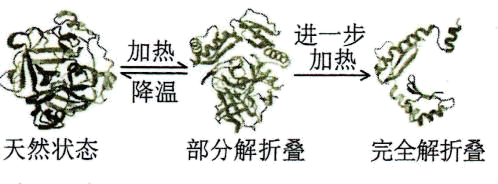

A. 碱性蛋白酶在一定条件下可发生自溶失活

B. 加热导致碱性蛋白酶构象改变是不可逆

C. 添加酶稳定剂可提高加碱性蛋白酶洗涤剂的去污效果

D 添加碱性蛋白酶可降低洗涤剂使用量，减少环境污染

4\. 情绪活动受中枢神经系统释放神经递质调控，常伴随内分泌活动的变化。此外，学习和记忆也与某些神经递质的释放有关。下列叙述错误的是（　　）

A. 剧痛、恐惧时，人表现为警觉性下降，反应迟钝

B. 边听课边做笔记依赖神经元的活动及神经元之间的联系

C. 突触后膜上受体数量的减少常影响神经递质发挥作用

D. 情绪激动、焦虑时，肾上腺素水平升高，心率加速

5\. 关于癌症，下列叙述错误的是（　　）

A. 成纤维细胞癌变后变成球形，其结构和功能会发生相应改变

B. 癌症发生的频率不是很高，大多数癌症的发生是多个基因突变的累积效应

C. 正常细胞生长和分裂失控变成癌细胞，原因是抑癌基因突变成原癌基因

D. 乐观向上的心态、良好的生活习惯，可降低癌症发生的可能性

6\. 洋葱根尖细胞染色体数为8对，细胞周期约12小时。观察洋葱根尖细胞有丝分裂，拍摄照片如图所示。下列分析正确的是（　　）

A. a为分裂后期细胞，同源染色体发生分离

B. b为分裂中期细胞，含染色体16条，核DNA分子32个

C. 根据图中中期细胞数的比例，可计算出洋葱根尖细胞分裂中期时长

D. 根尖培养过程中用DNA合成抑制剂处理，分裂间期细胞所占比例降低

7\. “清明时节雨纷纷，路上行人欲断魂。借问酒家何处有，牧童遥指杏花村。”徜徉古诗意境，思考科学问题。下列观点错误的是（　　）

A. 纷纷细雨能为杏树开花提供必需的水分

B. 杏树开花体现了植物生长发育的季节周期性

C. 花开花落与细胞生长和细胞凋亡相关联

D. “杏花村酒”酿制，酵母菌只进行无氧呼吸

8\. 稻-蟹共作是以水稻为主体、适量放养蟹的生态种养模式，常使用灯光诱虫杀虫。水稻为蟹提供遮蔽场所和氧气，蟹能摄食害虫、虫卵和杂草，其粪便可作为水稻的肥料。下列叙述正确的是（　　）

A. 该种养模式提高了营养级间的能量传递效率

B. 采用灯光诱虫杀虫利用了物理信息的传递

C. 硬壳蟹（非蜕壳）摄食软壳蟹（蜕壳）为捕食关系

D. 该种养模式可实现物质和能量的循环利用

9\. 大鼠控制黑眼/红眼的基因和控制黑毛/白化的基因位于同一条染色体上。某个体测交后代表现型及比例为黑眼黑毛:黑眼白化:红眼黑毛:红眼白化=1:1:1:1。该个体最可能发生了下列哪种染色体结构变异（　　）

A. 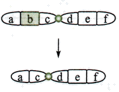 B. 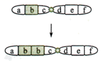 C. 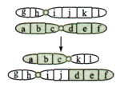 D. 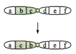

10\. 原生质体（细胞除细胞壁以外的部分）表面积大小的变化可作为质壁分离实验的检测指标。用葡萄糖基本培养基和NaCl溶液交替处理某假单孢菌，其原生质体表面积的测定结果如图所示。下列叙述错误的是（　　）

A. 甲组NaCl处理不能引起细胞发生质壁分离，表明细胞中NaCl浓度≥0.3 mol/L

B. 乙、丙组NaCl处理皆使细胞质壁分离，处理解除后细胞即可发生质壁分离复原

C. 该菌的正常生长和吸水都可导致原生质体表面积增加

D. 若将该菌先65℃水浴灭活后，再用 NaCl溶液处理，原生质体表面积无变化

11\. 病原体入侵引起机体免疫应答，释放免疫活性物质。过度免疫应答造成机体炎症损伤，机体可通过一系列反应来降低损伤，如图所示。下列叙述错误的是（　　）

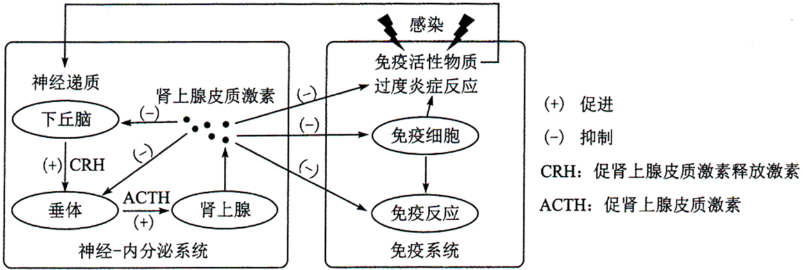

A. 免疫活性物质可与相应受体结合，从而调节神经-内分泌系统功能

B. 适度使用肾上腺皮质激素可缓解某些病原体引起的过度炎症反应

C. 过度炎症反应引起免疫抑制会增加机体肿瘤发生风险

D. 图中神经递质与肾上腺皮质激素对下丘脑分泌CRH有协同促进作用

12\. 稻蝗属的三个近缘物种①日本稻蝗、②中华稻蝗台湾亚种和③小翅稻蝗中，①与②、①与③的分布区域有重叠，②与③的分布区域不重叠。为探究它们之间的生殖隔离机制，进行了种间交配实验，结果如表所示。下列叙述错误的是（　　）

| 交配（♀×♂）  | ①×② | ②×① | ①×③ | ③×① | ②×③ | ③×② |
|:--------:|:---:|:---:|:---:|:---:|:---:|:---:|
| 交配率（%）   | 0   | 8   | 16  | 2   | 46  | 18  |
| 精子传送率（%） | 0   | 0   | 0   | 0   | 100 | 100 |

注:精子传送率是指受精囊中有精子的雌虫占确认交配雌虫的百分比

A. 实验结果表明近缘物种之间也可进行交配

B. 生殖隔离与物种的分布区域是否重叠无关

C. 隔离是物种形成的必要条件

D. ②和③之间可进行基因交流

**二、选择题:本题共4小题，在每小题给出的四个选项中，有的只有一项符合题目要求，有的有多项符合题目要求。**

13\. 在夏季晴朗无云的白天，10时左右某植物光合作用强度达到峰值，12时左右光合作用强度明显减弱。光合作用强度减弱的原因可能是（　　）

A. 叶片蒸腾作用强，失水过多使气孔部分关闭，进入体内的CO2量减少

B. 光合酶活性降低，呼吸酶不受影响，呼吸释放的CO2量大于光合固定的CO2量

C. 叶绿体内膜上的部分光合色素被光破坏，吸收和传递光能的效率降低

D. 光反应产物积累，产生反馈抑制，叶片转化光能的能力下降

14\. 大肠杆菌核糖体蛋白与rRNA分子亲和力较强，二者组装成核糖体。当细胞中缺乏足够的rRNA分子时，核糖体蛋白可通过结合到自身mRNA分子上的核糖体结合位点而产生翻译抑制。下列叙述错误的是（　　）

A. 一个核糖体蛋白的mRNA分子上可相继结合多个核糖体，同时合成多条肽链

B. 细胞中有足够的rRNA分子时，核糖体蛋白通常不会结合自身mRNA分子

C. 核糖体蛋白对自身mRNA翻译的抑制维持了RNA和核糖体蛋白数量上的平衡

D. 编码该核糖体蛋白的基因转录完成后，mRNA才能与核糖体结合进行翻译

15\. 果蝇的红眼对白眼为显性，为伴X遗传，灰身与黑身、长翅与截翅各由一对基因控制，显隐性关系及其位于常染色体或X染色体上未知。纯合红眼黑身长翅雌果蝇与白眼灰身截翅雄果蝇杂交，F1相互杂交，F2中体色与翅型的表现型及比例为灰身长翅:灰身截翅:黑身长翅:黑身截翅=9∶3∶3∶1。F2表现型中不可能出现（　　）

A. 黑身全为雄性 B. 截翅全为雄性 C. 长翅全为雌性 D. 截翅全为白眼

16\. 植物受到创伤可诱导植物激素茉莉酸（JA）的合成，JA在伤害部位或运输到未伤害部位被受体感应而产生蛋白酶抑制剂I（PI-Ⅱ），该现象可通过嫁接试验证明。试验涉及突变体ml和m2，其中一个不能合成JA，但能感应JA而产生PI-Ⅱ；另一个能合成JA，但对JA不敏感。嫁接试验的接穗和砧木叶片中PI-Ⅱ的mRNA相对表达量的检测结果如图表所示。

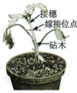

<table style="width:100%;">
<colgroup>
<col style="width: 16%" />
<col style="width: 5%" />
<col style="width: 7%" />
<col style="width: 5%" />
<col style="width: 5%" />
<col style="width: 5%" />
<col style="width: 7%" />
<col style="width: 5%" />
<col style="width: 7%" />
<col style="width: 5%" />
<col style="width: 5%" />
<col style="width: 5%" />
<col style="width: 5%" />
<col style="width: 5%" />
<col style="width: 7%" />
</colgroup>
<thead>
<tr>
<th style="text-align: left;">嫁接类型</th>
<th colspan="2" style="text-align: left;"></th>
<th colspan="2" style="text-align: left;">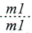</th>
<th colspan="2" style="text-align: left;"></th>
<th colspan="2" style="text-align: left;"></th>
<th colspan="2" style="text-align: left;"></th>
<th colspan="2" style="text-align: left;"></th>
<th colspan="2" style="text-align: left;"></th>
</tr>
</thead>
<tbody>
<tr>
<td style="text-align: left;">砧木叶片创伤</td>
<td style="text-align: left;">否</td>
<td style="text-align: left;">是</td>
<td style="text-align: left;">否</td>
<td style="text-align: left;">是</td>
<td style="text-align: left;">否</td>
<td style="text-align: left;">是</td>
<td style="text-align: left;">否</td>
<td style="text-align: left;">是</td>
<td style="text-align: left;">否</td>
<td style="text-align: left;">是</td>
<td style="text-align: left;">否</td>
<td style="text-align: left;">是</td>
<td style="text-align: left;">否</td>
<td style="text-align: left;">是</td>
</tr>
<tr>
<td style="text-align: left;">接穗叶片</td>
<td style="text-align: left;">++</td>
<td style="text-align: left;">+++</td>
<td style="text-align: left;">-</td>
<td style="text-align: left;">-</td>
<td style="text-align: left;">+</td>
<td style="text-align: left;">+++</td>
<td style="text-align: left;">-</td>
<td style="text-align: left;">-</td>
<td style="text-align: left;">-</td>
<td style="text-align: left;">-</td>
<td style="text-align: left;">+</td>
<td style="text-align: left;">+</td>
<td style="text-align: left;">++</td>
<td style="text-align: left;">+++</td>
</tr>
<tr>
<td style="text-align: left;">砧木叶片</td>
<td style="text-align: left;">++</td>
<td style="text-align: left;">+++</td>
<td style="text-align: left;">-</td>
<td style="text-align: left;">-</td>
<td style="text-align: left;">-</td>
<td style="text-align: left;">-</td>
<td style="text-align: left;">++</td>
<td style="text-align: left;">+++</td>
<td style="text-align: left;">-</td>
<td style="text-align: left;">-</td>
<td style="text-align: left;">-</td>
<td style="text-align: left;">-</td>
<td style="text-align: left;">++</td>
<td style="text-align: left;">+++</td>
</tr>
</tbody>
</table>

注:WT为野生型，ml为突变体1，m2为突变体2;“……”代表嫁接，上方为接穗，下方为砧木:“+”“－”分别表示有无，“+”越多表示表达量越高

下列判断或推测正确的是（　　）

A. ml不能合成JA，但能感应JA而产生PI-Ⅱ

B. 嫁接也产生轻微伤害，可导致少量表达PI-Ⅱ

C. 嫁接类型ml/m2叶片创伤，ml中大量表达PI-Ⅱ

D. 嫁接类型m2/m1叶片创伤，m2中大量表达PI-Ⅱ

**三、非选择题:包括必考题和选考题两部分。第17～20题为必考题，每个试题考生都必须作答。第 21、22题为选考题，考生根据要求作答。**

**（一）必考题:此题包括4小题，共45分。**

17\. 将纯净水洗净的河沙倒入洁净的玻璃缸中制成沙床，作为种子萌发和植株生长的基质。某水稻品种在光照强度为8～10μmol/（s·m2）时，固定的CO2量等于呼吸作用释放的CO2量;日照时长短于12小时才能开花。将新采收并解除休眠的该水稻种子表面消毒，浸种1天后，播种于沙床上。将沙床置于人工气候室中，保湿透气，昼/夜温为35℃/25℃，光照强度为2μmol/（s·m2），每天光照时长为14小时。回答下列问题:

（1）在此条件下，该水稻种子\_\_\_\_（填“能”或“不能”）萌发并成苗（以株高≥2厘米，至少1片绿叶视为成苗），理由是\_\_\_\_\_\_\_\_\_\_\_\_\_\_\_\_\_\_\_\_\_\_\_\_\_\_\_\_\_。

（2）若将该水稻适龄秧苗栽植于上述沙床上，光照强度为10μmol/（s·m2），其他条件与上述实验相同，该水稻\_\_\_（填“能”或“不能”）繁育出新的种子，理由是\_\_\_\_\_\_\_\_\_\_\_\_\_\_\_\_\_\_\_（答出两点即可）。

（3）若该水稻种子用于稻田直播（即将种子直接撒播于农田），为防鸟害、鼠害减少杂草生长，须灌水覆盖，该种子应具有\_\_\_\_\_\_\_\_\_特性。

18\. 当内外环境变化使体温波动时，皮肤及机体内部的温度感受器将信息传入体温调节中枢，通过产热和散热反应，维持体温相对稳定。回答下列问题:

（1）炎热环境下，机体通过体温调节增加散热。写出皮肤增加散热的两种方式\_\_\_\_\_\_\_\_\_\_\_\_\_\_\_\_\_\_。

（2）机体产热和散热达到平衡时的温度即体温调定点，生理状态下人体调定点为37℃。病原体感染后，机体体温升高并稳定在38.5℃时，与正常状态相比，调定点\_\_\_\_（填“上移”“下移”或“不变”），机体产热\_\_\_\_\_\_\_。

（3）若下丘脑体温调节中枢损毁，机体体温不能维持稳定。已知药物A作用于下丘脑体温调节中枢调控体温。现获得A的结构类似物M，为探究M是否也具有解热作用并通过影响下丘脑体温调节中枢调控体温，将A、M分别用生理盐水溶解后，用发热家兔模型进行了以下实验，请完善实验方案并写出实验结论。

| 分组  | 处理方式                                    | 结果  |
|:---:|:--------------------------------------- |:---:|
| 甲   | 发热家兔模型+生理盐水                             | 发热  |
| 乙   | 发热家兔模型+A溶液                              | 退热  |
| 丙   | 发热家兔模型+M溶液                              | 退热  |
| 丁   | ①\_\_\_\_\_\_\_\_\_\_\_\_\_\_\_\_\_\_\_ | 发热  |

②由甲、乙、丙三组实验结果，得出结论\_\_\_\_\_\_\_\_\_\_\_\_\_\_\_\_\_\_\_\_\_。

③由甲、乙、丙、丁四组实验结果，得出结论\_\_\_\_\_\_\_\_\_\_\_\_\_\_\_\_\_\_\_\_\_。

19\. 中国是传统的水稻种植大国，有一半以上人口以稻米为主食。在培育水稻优良品种的过程中，发现某野生型水稻叶片绿色由基因C控制。回答下列问题:

（1）突变型1叶片为黄色，由基因C突变为C1所致，基因C1纯合幼苗期致死。突变型1连续自交3代，F3成年植株中黄色叶植株占\_\_\_\_\_\_。

（2）测序结果表明，突变基因C1转录产物编码序列第727位碱基改变，由5＇-GAGAG-3＇变为5＇-GACAG-3＇，导致第\_\_\_\_\_\_位氨基酸突变为\_\_\_\_\_\_，从基因控制性状的角度解释突变体叶片变黄的机理\_\_\_\_\_\_\_\_\_\_\_\_\_\_\_\_\_\_\_\_\_\_\_\_\_\_\_\_\_\_\_\_\_\_\_\_\_。（部分密码子及对应氨基酸:GAG谷氨酸;AGA精氨酸;GAC天冬氨酸;ACA苏氨酸;CAG谷氨酰胺）

（3）由C突变为C1产生了一个限制酶酶切位点。从突变型1叶片细胞中获取控制叶片颜色的基因片段，用限制酶处理后进行电泳（电泳条带表示特定长度的DNA片段），其结果为图中\_\_\_（填“I”“Ⅱ”或“Ⅲ”）。

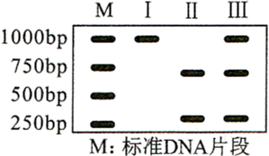

（4）突变型2叶片为黄色，由基因C的另一突变基因C2所致。用突变型2与突变型1杂交，子代中黄色叶植株与绿色叶植株各占50%。能否确定C2是显性突变还是隐性突变?\_\_\_\_\_\_（填“能”或“否”），用文字说明理由\_\_\_\_\_\_\_\_\_\_\_\_\_\_\_\_\_\_\_\_\_\_\_\_\_\_\_\_\_\_\_\_\_\_\_\_\_。

20\. 入侵生物福寿螺适应能力强、种群繁殖速度快。为研究福寿螺与本土田螺的种间关系及福寿螺对水质的影响，开展了以下实验:

实验一:在饲养盒中间放置多孔挡板，不允许螺通过，将两种螺分别置于挡板两侧饲养;单独饲养对照组。结果如图所示。

实验二:在饲养盒中，以新鲜菜叶喂养福寿螺，每天清理菜叶残渣;以清洁自来水为对照组。结果如表所示。

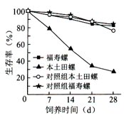

<table>
<colgroup>
<col style="width: 10%" />
<col style="width: 14%" />
<col style="width: 16%" />
<col style="width: 16%" />
<col style="width: 13%" />
<col style="width: 14%" />
<col style="width: 13%" />
</colgroup>
<thead>
<tr>
<th rowspan="2" style="text-align: left;">养殖天数（d）</th>
<th colspan="2" style="text-align: center;">浑浊度（FTU）</th>
<th colspan="2" style="text-align: center;">总氮（mg/L）</th>
<th colspan="2" style="text-align: center;">总磷（mg/L）</th>
</tr>
<tr>
<th style="text-align: center;">实验组</th>
<th style="text-align: center;">对照组</th>
<th style="text-align: center;">实验组</th>
<th style="text-align: center;">对照组</th>
<th style="text-align: center;">实验组</th>
<th style="text-align: center;">对照组</th>
</tr>
</thead>
<tbody>
<tr>
<td style="text-align: center;">1</td>
<td style="text-align: center;">10.81</td>
<td style="text-align: center;">0.58</td>
<td style="text-align: center;">14.72</td>
<td style="text-align: center;">7.73</td>
<td style="text-align: center;">0.44</td>
<td style="text-align: center;">0.01</td>
</tr>
<tr>
<td style="text-align: center;">3</td>
<td style="text-align: center;">15.54</td>
<td style="text-align: center;">0.31</td>
<td style="text-align: center;">33.16</td>
<td style="text-align: center;">8.37</td>
<td style="text-align: center;">1.27</td>
<td style="text-align: center;">0.01</td>
</tr>
<tr>
<td style="text-align: center;">5</td>
<td style="text-align: center;">23.12</td>
<td style="text-align: center;">1.04</td>
<td style="text-align: center;">72.78</td>
<td style="text-align: center;">9.04</td>
<td style="text-align: center;">2.38</td>
<td style="text-align: center;">0.02</td>
</tr>
<tr>
<td style="text-align: center;">7</td>
<td style="text-align: center;">34.44</td>
<td style="text-align: center;">0.46</td>
<td style="text-align: center;">74.02</td>
<td style="text-align: center;">9.35</td>
<td style="text-align: center;">4.12</td>
<td style="text-align: center;">0.01</td>
</tr>
</tbody>
</table>

注：水体浑浊度高表示其杂质含量高

回答下列问题:

（1）野外调查本土田螺的种群密度，通常采用的调查方法是\_\_\_\_\_\_\_\_\_\_\_\_\_\_\_\_\_\_\_\_\_\_\_。

（2）由实验一结果可知，两种螺的种间关系为\_\_\_\_\_\_\_\_。

（3）由实验二结果可知，福寿螺对水体的影响结果表现为\_\_\_\_\_\_\_\_\_\_\_\_\_\_\_。

（4）结合实验一和实验二的结果，下列分析正确的是\_\_\_\_\_\_\_（填序号）。

①福寿螺的入侵会降低本土物种丰富度 ②福寿螺对富营养化水体耐受能力低 ③福寿螺比本土田螺对环境的适应能力更强 ④种群数量达到K/2时，是防治福寿螺的最佳时期

（5）福寿螺入侵所带来的危害警示我们，引种时要注意\_\_\_\_\_\_\_\_\_\_\_\_\_\_\_\_\_\_\_\_\_\_\_\_（答出两点即可）。

**（二）选考题:请考生从给出的两道题中任选一题作答。如果多做，则按所做的第一题计分。**

**\[选修1:生物技术实践\]**

21\. 黄酒源于中国，与啤酒、葡萄酒并称世界三大发酵酒。发酵酒的酿造过程中除了产生乙醇外，也产生不利于人体健康的氨基甲酸乙酯（EC）。EC主要由尿素与乙醇反应形成，各国对酒中的EC含量有严格的限量标准。回答下列问题:

（1）某黄酒酿制工艺流程如图所示，图中加入的菌种a是\_\_\_\_\_\_\_，工艺b是\_\_\_\_\_\_\_（填“消毒”或“灭菌”），采用工艺b的目的是\_\_\_\_\_\_\_\_\_\_\_\_\_\_\_\_\_\_\_\_。

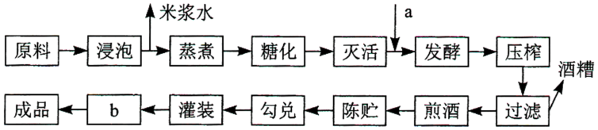

（2）以尿素为唯一氮源的培养基中加入\_\_\_\_\_\_\_\_指示剂，根据颜色变化，可以初步鉴定分解尿素的细菌。尿素分解菌产生的脲酶可用于降解黄酒中的尿素，脲酶固定化后稳定性和利用效率提高，固定化方法有\_\_\_\_\_\_\_\_\_\_\_\_\_\_\_\_\_\_\_\_\_\_\_\_\_（答出两种即可）。

（3）研究人员利用脲酶基因构建基因工程菌L，在不同条件下分批发酵生产脲酶，结果如图所示。推测\_\_\_\_\_\_\_\_是决定工程菌L高脲酶活力的关键因素，理由是\_\_\_\_\_\_\_\_\_\_\_\_\_\_\_\_\_\_。

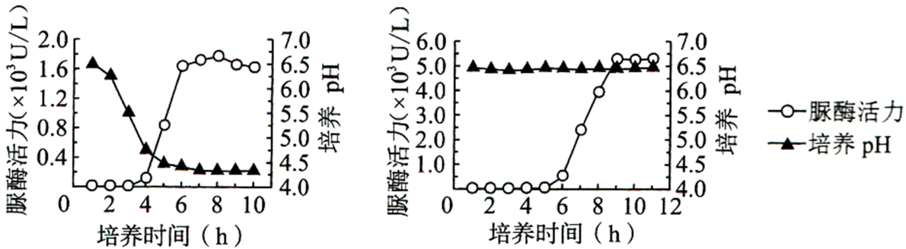

（4）某公司开发了一种新的黄酒产品，发现EC含量超标。简要写出利用微生物降低该黄酒中EC含量的思路\_\_\_\_\_\_\_\_\_\_\_\_\_\_\_\_\_\_\_\_\_\_\_\_\_\_\_\_\_。

**\[选修3:现代生物科技专题\]**

22\. 水蛭是我国的传统中药材，主要药理成分水蛭素为水蛭蛋白中重要成分之一，具有良好的抗凝血作用。拟通过蛋白质工程改造水蛭素结构，提高其抗凝血活性。回答下列问题:

（1）蛋白质工程流程如图所示，物质a是\_\_\_\_\_\_\_，物质b是\_\_\_\_\_\_\_。在生产过程中，物质b可能不同，合成的蛋白质空间构象却相同，原因是\_\_\_\_\_\_\_\_\_\_\_\_\_\_\_\_\_\_\_\_\_\_\_。

（2）蛋白质工程是基因工程的延伸，基因工程中获取目的基因的常用方法有\_\_\_\_\_\_\_\_\_\_\_、\_\_\_\_\_\_\_\_\_\_和利用 PCR 技术扩增。PCR 技术遵循的基本原理是\_\_\_\_\_\_\_\_\_\_\_\_\_\_\_\_\_\_\_\_。

（3）将提取的水蛭蛋白经甲、乙两种蛋白酶水解后，分析水解产物中的肽含量及其抗凝血活性，结果如图所示。推测两种处理后酶解产物的抗凝血活性差异主要与肽的\_\_\_\_\_\_（填“种类”或“含量”）有关，导致其活性不同的原因是\_\_\_\_\_\_\_\_\_\_\_\_\_\_\_\_\_\_\_\_\_\_\_\_\_\_\_\_\_\_。

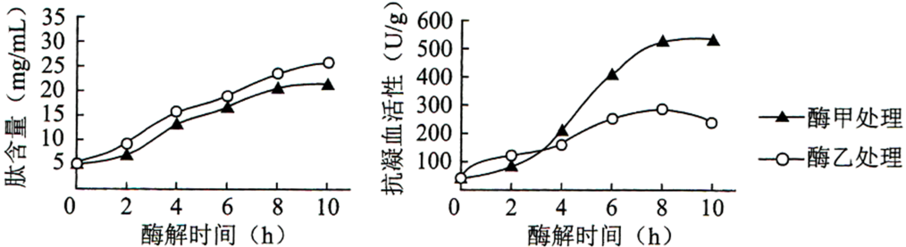

（4）若要比较蛋白质工程改造后的水蛭素、上述水蛭蛋白酶解产物和天然水蛭素的抗凝血活性差异，简要写出实验设计思路\_\_\_\_\_\_\_\_\_\_\_\_\_\_\_\_\_\_\_\_\_\_\_\_\_\_\_\_\_\_\_\_\_\_\_\_\_\_\_\_
