**湖南省2022年普通高中学业水平选择性考试**

**生物**

**注意事项:**

**1.答卷前，考生务必将自己的姓名、准考证号填写在本试卷和答题卡上。**

**2.回答选择题时，选出每小题答案后，用铅笔把答题卡上对应题目的答案标号涂黑。如需改动，用橡皮擦干净后，再选涂其他答案标号。回答非选择题时，将答案写在答题卡上。写在本试卷上无效。**

**3.考试结束后，将本试卷和答题卡一并交回。**

**一、选择题:本题共12小题，在每小题给出的四个选项中，只有一项是符合题目要求的。**

1\. 胶原蛋白是细胞外基质的主要成分之一，其非必需氨基酸含量比蛋清蛋白高。下列叙述正确的是（　　）

A. 胶原蛋白的氮元素主要存在于氨基中

B. 皮肤表面涂抹的胶原蛋白可被直接吸收

C. 胶原蛋白的形成与内质网和高尔基体有关

D. 胶原蛋白比蛋清蛋白的营养价值高

【答案】C

【解析】

【分析】蛋白质是以氨基酸为基本单位构成的生物大分子，氨基酸结构特点是至少含有一个氨基和一个羧基，并且都有一个氨基和羧基连接在同一个碳原子上。氨基酸通过脱水缩合反应形成蛋白质，氨基酸脱水缩合反应时，一个氨基酸的氨基与另一个氨基酸的羧基反应脱去一分子水。

【详解】A、蛋白质的氮元素主要存在于肽键中，A错误；

B、胶原蛋白为生物大分子物质，涂抹于皮肤表面不能被直接吸收，B错误；

C、内质网是蛋白质的合成、加工场所和运输通道，高尔基体主要是对来自内质网的蛋白质进行加工、分类和包装，胶原蛋白的形成与核糖体、内质网、高尔基体有关，C正确；

D、由题胶原蛋白非必需氨基酸含量比蛋清蛋白高，而人体需要从食物中获取必需氨基酸，非必需氨基酸自身可以合成，因此并不能说明胶原蛋白比蛋清蛋白的营养价值高，D错误。

故选C。

2\. T2噬菌体侵染大肠杆菌的过程中，下列哪一项不会发生（　　）

A. 新的噬菌体DNA合成

B. 新的噬菌体蛋白质外壳合成

C. 噬菌体在自身RNA聚合酶作用下转录出RNA

D. 合成的噬菌体RNA与大肠杆菌的核糖体结合

【答案】C

【解析】

【分析】T2噬菌体是一种专门寄生在大肠杆菌体内病毒，它的头部和尾部的外壳都是蛋白质构成的，头部含有DNA。T2噬菌体侵染大肠杆菌后，在自身遗传物质的作用下，利用大肠杆菌体内的物质来合成自身的组成成分，进行大量增殖。

【详解】A、T2噬菌体侵染大肠杆菌后，其DNA会在大肠杆菌体内复制，合成新的噬菌体DNA，A正确；

B、T2噬菌体侵染大肠杆菌的过程中，只有DNA进入大肠杆菌，T2噬菌体会用自身的DNA和大肠杆菌的氨基酸等来合成新的噬菌体蛋白质外壳，B正确；

C、噬菌体在大肠杆菌RNA聚合酶作用下转录出RNA，C错误；

D、合成的噬菌体RNA与大肠杆菌的核糖体结合，合成蛋白质，D正确。

故选C。

3\. 洗涤剂中的碱性蛋白酶受到其他成分的影响而改变构象，部分解折叠后可被正常碱性蛋白酶特异性识别并降解（自溶）失活。此外，加热也能使碱性蛋白酶失活，如图所示。下列叙述错误的是（　　）

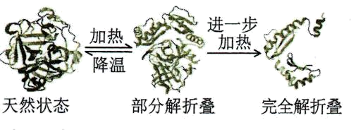

A. 碱性蛋白酶在一定条件下可发生自溶失活

B. 加热导致碱性蛋白酶构象改变是不可逆的

C. 添加酶稳定剂可提高加碱性蛋白酶洗涤剂的去污效果

D. 添加碱性蛋白酶可降低洗涤剂使用量，减少环境污染

【答案】B

【解析】

【分析】碱性蛋白酶能使蛋白质水解成可溶于水的多肽和氨基酸。衣物上附着的血渍、汗渍、奶渍、酱油渍等污物，都会在碱性蛋白酶的作用下，结构松弛、膨胀解体，起到去污的效果。

【详解】A、由题“部分解折叠后可被正常碱性蛋白酶特异性识别并降解（自溶）失活”可知，碱性蛋白酶在一定条件下可发生自溶失活，A正确；

B、由图可知，加热导致碱性蛋白酶由天然状态变为部分解折叠，部分解折叠的碱性蛋白降温后可恢复到天然状态，因此加热导致碱性蛋白酶构象改变是可逆的 ，B错误；

C、碱性蛋白酶受到其他成分的影响而改变构象，而且加热也能使碱性蛋白酶失活，会降低碱性蛋白酶的洗涤剂去污效果，添加酶稳定剂可提高加碱性蛋白酶洗涤剂的去污效果，C正确；

D、加酶洗衣粉可以降低表面活性剂的数量，减少洗涤剂使用量，使洗涤剂朝低磷、无磷的方向发展，减少对环境的污染，D正确。

故选B。

4\. 情绪活动受中枢神经系统释放神经递质调控，常伴随内分泌活动的变化。此外，学习和记忆也与某些神经递质的释放有关。下列叙述错误的是（　　）

A. 剧痛、恐惧时，人表现为警觉性下降，反应迟钝

B. 边听课边做笔记依赖神经元的活动及神经元之间的联系

C. 突触后膜上受体数量的减少常影响神经递质发挥作用

D. 情绪激动、焦虑时，肾上腺素水平升高，心率加速

【答案】A

【解析】

【分析】在神经调节过程中，人在恐惧、严重焦虑、剧痛、失血等紧急情况下，下丘脑兴奋，通过交感神经，其神经末梢会释放神经递质，作用于肾上腺髓质，促使肾上腺髓质细胞分泌肾上腺素。神经递质存在于突触前膜的突触小泡中，由突触前膜释放，进入突触间隙，作用于突触后膜上的特异性受体，引起下一个神经元兴奋或抑制。

【详解】A、人在剧痛、恐惧等紧急情况下，肾上腺素分泌增多，人表现为警觉性提高、反应灵敏、呼吸频率加快、心跳加速等特征，A错误；

B、边听课边做笔记是一系列的反射活动，需要神经元的活动以及神经元之间通过突触传递信息，B正确；

C、突触前膜释放的神经递质与突触后膜上特异性受体结合，引起突触后膜产生兴奋或抑制，突触后膜上受体数量的减少常影响神经递质发挥作用，C正确；

D、情绪激动、焦虑时，引起大脑皮层兴奋，进而促使肾上腺分泌较多的肾上腺素，肾上腺素能够促使人体心跳加快、血压升高、反应灵敏，D正确。

故选A。

5\. 关于癌症，下列叙述错误是（　　）

A. 成纤维细胞癌变后变成球形，其结构和功能会发生相应改变

B. 癌症发生的频率不是很高，大多数癌症的发生是多个基因突变的累积效应

C. 正常细胞生长和分裂失控变成癌细胞，原因是抑癌基因突变成原癌基因

D. 乐观向上的心态、良好的生活习惯，可降低癌症发生的可能性

【答案】C

【解析】

【分析】癌细胞的主要特征：（1）无限增殖；（2）形态结构发生显著改变；（3）细胞表面发生变化，细胞膜上的糖蛋白等物质减少，易转移。

【详解】A、细胞癌变结构和功能会发生相应改变，如成纤维细胞癌变后变成球形，A正确；

B、癌变发生的原因是基因突变，基因突变在自然条件下具有低频性，故癌症发生的频率不是很高，且癌症的发生并不是单一基因突变的结果，而是多个相关基因突变的累积效应，B正确；

C、人和动物细胞中的DNA上本来就存在与癌变相关的基因，其中原癌基因表达的蛋白质是细胞正常的生长和增殖所必需的，抑癌基因表达的蛋白质能抑制细胞的生长和增殖，或者促进细胞凋亡，细胞癌变的原因是原癌基因和抑癌基因发生突变所致，C错误；

D、开朗乐观的心理状态会影响神经系统和内分泌系统的调节功能，良好的生活习惯如远离辐射等，能降低癌症发生的可能性，D正确。

故选C。

6\. 洋葱根尖细胞染色体数为8对，细胞周期约12小时。观察洋葱根尖细胞有丝分裂，拍摄照片如图所示。下列分析正确的是（　　）

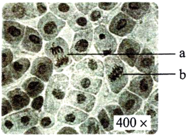

A. a为分裂后期细胞，同源染色体发生分离

B. b为分裂中期细胞，含染色体16条，核DNA分子32个

C. 根据图中中期细胞数的比例，可计算出洋葱根尖细胞分裂中期时长

D. 根尖培养过程中用DNA合成抑制剂处理，分裂间期细胞所占比例降低

【答案】B

【解析】

【分析】据图分析，图示为洋葱根尖细胞的有丝分裂图示，其中a细胞处于有丝分裂后期，b细胞处于有丝分裂中期，据此分析作答。

【详解】A、图示细胞为洋葱根尖细胞的分裂图，有丝分裂过程中无同源染色体的分离现象，A错误；

B、b细胞着丝点整齐排列在赤道板上，细胞处于有丝分裂中期，且洋葱根尖细胞染色体数为8对（16条），有丝分裂中期染色体数目与体细胞相同，但核DNA分子加倍，故b细胞含染色体16条，核DNA分子32个，B正确；

C、各期细胞数目所占比例与其分裂周期所占时间成正相关，故已知细胞周期时间，根据各时期细胞数目所占比例可计算各时期的时间，但应统计多个视野中的比例，图中只有一个视野，无法准确推算，C错误；

D、间期时的S期进行DNA分子复制，若根尖培养过程中用DNA合成抑制剂处理，细胞停滞在间期，故分裂间期细胞所占比例升高，D错误。

故选B。

7\. “清明时节雨纷纷，路上行人欲断魂。借问酒家何处有，牧童遥指杏花村。”徜徉古诗意境，思考科学问题。下列观点错误的是（　　）

A. 纷纷细雨能为杏树开花提供必需的水分

B. 杏树开花体现了植物生长发育的季节周期性

C. 花开花落与细胞生长和细胞凋亡相关联

D. “杏花村酒”的酿制，酵母菌只进行无氧呼吸

【答案】D

【解析】

【分析】细胞凋亡是指由基因控制的细胞自动结束生命的过程，又称细胞编程性死亡，细胞凋亡有利于生物个体完成正常发育，维持内部环境的稳定，抵御外界各种因素的干扰。

【详解】A、生命活动离不开水，纷纷细雨能为杏树开花提供必需的水分，A正确；

B、高等植物的生长发育受到环境因素调节，杏树在特定季节开花，体现了植物生长发育的季节周期性，B正确；

C、细胞开花过程中涉及细胞的体积增大和数目增多等过程，花落是由基因控制的细胞自动结束生命的过程，又称细胞编程性死亡，故花开花落与细胞生长和细胞凋亡相关联，C正确；

D、“杏花村酒”的酿制过程中起主要作用的微生物是酵母菌，酵母菌在发酵过程中需要先在有氧条件下大量繁殖，再在无氧条件下进行发酵，D错误。

故选D。

8\. 稻-蟹共作是以水稻为主体、适量放养蟹的生态种养模式，常使用灯光诱虫杀虫。水稻为蟹提供遮蔽场所和氧气，蟹能摄食害虫、虫卵和杂草，其粪便可作为水稻的肥料。下列叙述正确的是（　　）

A. 该种养模式提高了营养级间的能量传递效率

B. 采用灯光诱虫杀虫利用了物理信息的传递

C. 硬壳蟹（非蜕壳）摄食软壳蟹（蜕壳）为捕食关系

D. 该种养模式可实现物质和能量的循环利用

【答案】B

【解析】

【分析】生态农业：是按照生态学原理和经济学原理，运用现代科学技术成果和现代管理手段，以及传统农业的有效经验建立起来的，能获得较高的经济效益、生态效益和社会效益的现代化农业。生态农业能实现物质和能量的多级利用。

【详解】A、能量传递效率是指相邻两个营养级之间同化量的比值，该模式提高了能量的利用率，但不能提高能量的传递效率，A错误；

B、生态系统的物理信息有光、声、温度、湿度、磁力等，采用灯光诱虫杀虫利用了光，是物理信息的传递，B正确；

C、捕食关系是指群落中两个物种之间的关系，硬壳蟹(非蜕壳)和软壳蟹(蜕壳)属于同一物种，两者之间的摄食关系不属于捕食，C错误；

D、生态系统中的能量传递是单向的，不能循环利用，D错误。

故选B。

9\. 大鼠控制黑眼/红眼的基因和控制黑毛/白化的基因位于同一条染色体上。某个体测交后代表现型及比例为黑眼黑毛:黑眼白化:红眼黑毛:红眼白化=1:1:1:1。该个体最可能发生了下列哪种染色体结构变异（　　）

A. 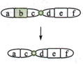 B. 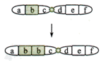 C. 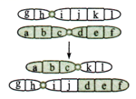 D. 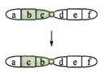

【答案】C

【解析】

【分析】染色体结构变异包括4种类型：缺失、重复、易位和倒位。分析选项可知，A属于缺失、B属于重复、C属于易位，D属于倒位。

【详解】分析题意可知：大鼠控制黑眼/红眼的基因和控制黑毛/白化的基因位于同一条染色体上，两对等位基因为连锁关系，正常情况下，测交结果只能出现两种表现型，但题干中某个体测交后代表现型及比例为黑眼黑毛:黑眼白化:红眼黑毛:红眼白化=1:1:1:1，类似于基因自由组合定律的结果，推测该个体可产生四种数目相等的配子，且控制两对性状的基因遵循自由组合定律，即两对等位基因被易位到两条非同源染色体上，C正确。

故选C。

10\. 原生质体（细胞除细胞壁以外的部分）表面积大小的变化可作为质壁分离实验的检测指标。用葡萄糖基本培养基和NaCl溶液交替处理某假单孢菌，其原生质体表面积的测定结果如图所示。下列叙述错误的是（　　）

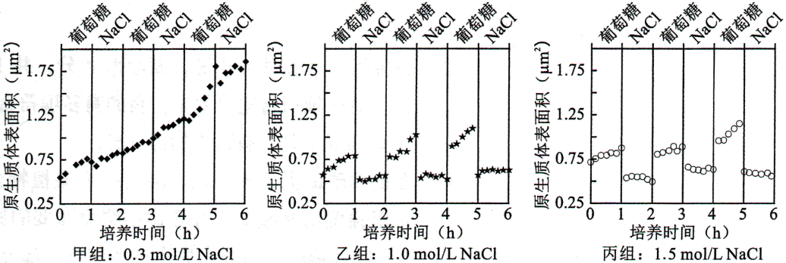

A. 甲组NaCl处理不能引起细胞发生质壁分离，表明细胞中NaCl浓度≥0.3 mol/L

B. 乙、丙组NaCl处理皆使细胞质壁分离，处理解除后细胞即可发生质壁分离复原

C. 该菌的正常生长和吸水都可导致原生质体表面积增加

D. 若将该菌先65℃水浴灭活后，再用 NaCl溶液处理，原生质体表面积无变化

【答案】A

【解析】

【分析】假单孢菌属于真菌，真菌具有细胞壁和液泡，当细胞液的浓度小于外界溶液的浓度时，原生质体中的水分就透过细胞膜进入到外界溶液中，由于原生质层比细胞壁的伸缩性大，当细胞不断失水时，原生质层逐渐缩小，原生质层就会与细胞壁逐渐分离开来，即发生了质壁分离。当细胞液的浓度大于外界溶液的浓度时，外界溶液中的水分就透过细胞膜进入到原生质体中，原生质体逐渐变大，导致原生质体表面积增加。

【详解】A、分析甲组结果可知，随着培养时间延长，与0时（原生质体表面积大约为0.5μm2）相比，原生质体表面积增加逐渐增大，甲组NaCl处理不能引起细胞发生质壁分离，说明细胞吸水，表明细胞中浓度\>0.3 mol/L ，但不一定是细胞内NaCl浓度≥0.3 mol/L，A错误；

B、分析乙、丙组结果可知，与0时（原生质体表面积大约分别为0.6μm2、0.75μm2）相比乙丙组原生质体略有下降，说明乙、丙组NaCl处理皆使细胞质壁分离，处理解除后细胞即可发生质壁分离复原，B正确；

C、该菌的正常生长，细胞由小变大可导致原生质体表面积增加，该菌吸水也会导致原生质体表面积增加，C正确；

D、若将该菌先65℃水浴灭活，细胞死亡，原生质层失去选择透过性，再用 NaCl溶液处理，原生质体表面积无变化，D正确。

故选A。

11\. 病原体入侵引起机体免疫应答，释放免疫活性物质。过度免疫应答造成机体炎症损伤，机体可通过一系列反应来降低损伤，如图所示。下列叙述错误的是（　　）

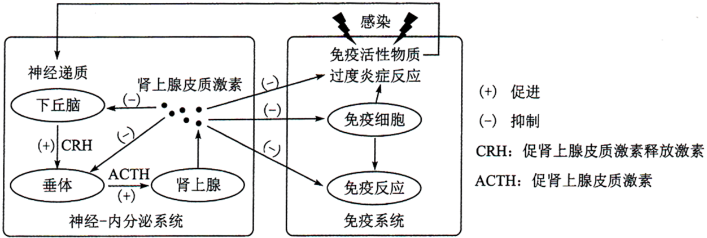

A. 免疫活性物质可与相应受体结合，从而调节神经-内分泌系统功能

B. 适度使用肾上腺皮质激素可缓解某些病原体引起的过度炎症反应

C. 过度炎症反应引起的免疫抑制会增加机体肿瘤发生风险

D. 图中神经递质与肾上腺皮质激素对下丘脑分泌CRH有协同促进作用

【答案】D

【解析】

【分析】分析题图可知，病原体入侵引起机体免疫应答，释放免疫活性物质，刺激机体释放神经递质，作用于下丘脑分泌CRH，促进垂体分泌ACTH，促进肾上腺分泌肾上腺皮质激素，反馈性的抑制下丘脑、垂体的活动，同时抑制机体免疫细胞、免疫反应来降低损伤。

【详解】A、分析题图可知，免疫活性物质可与相应受体结合，从而调节神经-内分泌系统功能，A正确；

B、由图可知，肾上腺分泌肾上腺皮质激素，反馈性抑制下丘脑、垂体的活动，同时抑制机体免疫细胞、免疫反应来降低损伤，可知适度使用肾上腺皮质激素可缓解某些病原体引起的过度炎症反应，B正确；

C、免疫系统可以识别和清除突变的细胞，防止肿瘤的发生，而过度炎症反应引起的免疫抑制可能会增加机体肿瘤发生风险，C正确；

D、图中神经递质作用于下丘脑，促进下丘脑分泌CRH，肾上腺皮质激素对下丘脑分泌CRH具有抑制作用，故两者对下丘脑分泌CRH有拮抗作用，D错误。

故选D。

12\. 稻蝗属的三个近缘物种①日本稻蝗、②中华稻蝗台湾亚种和③小翅稻蝗中，①与②、①与③的分布区域有重叠，②与③的分布区域不重叠。为探究它们之间的生殖隔离机制，进行了种间交配实验，结果如表所示。下列叙述错误的是（　　）

| 交配（♀×♂）  | ①×② | ②×① | ①×③ | ③×① | ②×③ | ③×② |
|:--------:|:---:|:---:|:---:|:---:|:---:|:---:|
| 交配率（%）   | 0   | 8   | 16  | 2   | 46  | 18  |
| 精子传送率（%） | 0   | 0   | 0   | 0   | 100 | 100 |

注:精子传送率是指受精囊中有精子的雌虫占确认交配雌虫的百分比

A. 实验结果表明近缘物种之间也可进行交配

B. 生殖隔离与物种的分布区域是否重叠无关

C. 隔离是物种形成的必要条件

D. ②和③之间可进行基因交流

【答案】D

【解析】

【分析】1、物种是指能够在自然状态下相互交配丙产生可育后代的一群生物。

2、生殖隔离是指不同物种之间一般是不能相互交配的，即使交配成功，也不能产生可育后代的现象。

【详解】A、由表格中的交配率的结果可知，表明近缘物种之间也可进行交配，A正确；

B、已知①与②、①与③的分布区域有重叠，②与③的分布区域不重叠，但从交配率和精子传送率来看，说明生殖隔离与物种的分布区域是否重叠无关，B正确；

C、隔离包括地理隔离和生殖隔离，隔离是物种形成的必要条件，C正确；

D、②和③之间②与③的分布区域不重叠，故存在地理隔离；两者属于两个近缘物种，表中②×③交配精子传送率100%，即使交配成功，由于存在生殖隔离，也不能进行基因交流，D错误。

故选D。

**二、选择题:本题共4小题，在每小题给出的四个选项中，有的只有一项符合题目要求，有的有多项符合题目要求。**

13\. 在夏季晴朗无云的白天，10时左右某植物光合作用强度达到峰值，12时左右光合作用强度明显减弱。光合作用强度减弱的原因可能是（　　）

A. 叶片蒸腾作用强，失水过多使气孔部分关闭，进入体内的CO2量减少

B. 光合酶活性降低，呼吸酶不受影响，呼吸释放的CO2量大于光合固定的CO2量

C. 叶绿体内膜上的部分光合色素被光破坏，吸收和传递光能的效率降低

D. 光反应产物积累，产生反馈抑制，叶片转化光能的能力下降

【答案】AD

【解析】

【分析】影响光合作用的因素：1、光照强度：光照会影响光反应，从而影响光合作用，因此，当光照强度低于光饱和点时，光合速率随光照强度的增加而增加，但达到光饱和点后，光合作用不再随光照强度增加而增加；2、CO2浓度：CO2是光合作用暗反应的原料，当CO2浓度增加至1%时，光合速率会随CO2浓度的增高而增高；3、温度：温度对光合作用的影响主要是影响酶的活性，或午休现象；4、矿质元素：在一定范围内，增大必须矿质元素的供应，以提高光合作用速率；5、水分：水是光合作用的原料，缺水既可直接影响光合作用，植物缺水时又会导致气孔关闭，影响CO2的吸收，使光合作用减弱。

【详解】A、夏季中午叶片蒸腾作用强，失水过多使气孔部分关闭，进入体内的CO2量减少，暗反应减慢，光合作用强度明显减弱，A正确；

B、夏季中午气温过高，导致光合酶活性降低，呼吸酶不受影响（呼吸酶最适温度高于光合酶），光合作用强度减弱，但此时光合作用强度仍然大于呼吸作用强度，即呼吸释放的CO2量小于光合固定的CO2量，B错误；

C、光合色素分布在叶绿体的类囊体薄膜而非叶绿体内膜上，C错误；

D、夏季中午叶片蒸腾作用强，失水过多使气孔部分关闭，进入体内的CO2量减少，暗反应减慢，导致光反应产物积累，产生反馈抑制，使叶片转化光能的能力下降，光合作用强度明显减弱，D正确。

故选AD。

14\. 大肠杆菌核糖体蛋白与rRNA分子亲和力较强，二者组装成核糖体。当细胞中缺乏足够的rRNA分子时，核糖体蛋白可通过结合到自身mRNA分子上的核糖体结合位点而产生翻译抑制。下列叙述错误的是（　　）

A. 一个核糖体蛋白的mRNA分子上可相继结合多个核糖体，同时合成多条肽链

B. 细胞中有足够的rRNA分子时，核糖体蛋白通常不会结合自身mRNA分子

C. 核糖体蛋白对自身mRNA翻译的抑制维持了RNA和核糖体蛋白数量上的平衡

D. 编码该核糖体蛋白的基因转录完成后，mRNA才能与核糖体结合进行翻译

【答案】D

【解析】

【分析】基因表达包括转录和翻译两个过程，其中转录的条件：模板（DNA的一条链）、原料（核糖核苷酸）、酶（RNA聚合酶）和能量；翻译过程的条件：模板（mRNA）、原料（氨基酸）、酶、tRNA和能量。

【详解】A、一个核糖体蛋白的mRNA分子上可相继结合多个核糖体，同时合成多条肽链，以提高翻译效率，A正确；

B、细胞中有足够的rRNA分子时，核糖体蛋白通常不会结合自身mRNA分子，与rRNA分子结合，二者组装成核糖体，B正确；

C、当细胞中缺乏足够的rRNA分子时，核糖体蛋白只能结合到自身mRNA分子上，导致蛋白质合成停止，核糖体蛋白对自身mRNA翻译的抑制维持了rRNA和核糖体蛋白数量上的平衡，C正确；

D、大肠杆菌为原核生物，没有核膜，转录形成的mRNA在转录未结束时即和核糖体结合，开始翻译过程，D错误。

故选D。

15\. 果蝇的红眼对白眼为显性，为伴X遗传，灰身与黑身、长翅与截翅各由一对基因控制，显隐性关系及其位于常染色体或X染色体上未知。纯合红眼黑身长翅雌果蝇与白眼灰身截翅雄果蝇杂交，F1相互杂交，F2中体色与翅型的表现型及比例为灰身长翅:灰身截翅:黑身长翅:黑身截翅=9∶3∶3∶1。F2表现型中不可能出现（　　）

A. 黑身全为雄性 B. 截翅全为雄性 C. 长翅全为雌性 D. 截翅全为白眼

【答案】AC

【解析】

【分析】假设控制红眼和白眼的基因用W、w表示，控制黑身和灰身的基因用A、a表示，控制长翅和截翅的基因用B、b表示，已知F2中灰身：黑身=3:1，长翅：截翅=3:1，可知灰身、长翅为显性性状，控制体色与翅型的基因遵循自由组合定律。

【详解】A、若控制黑身a的基因位于X染色体上，只考虑体色，亲本基因型可写为XaXa、XAY，子二代可以出现XAXa、XaXa、XAY 、XaY，即可出现黑身雌性， A符合题意；

B、若控制截翅的基因b位于X染色体上，只考虑翅型，亲本基因型可写为XBXB、XbY，子二代可以出现XBXB、XBXb、XBY 、XbY，即截翅全为雄性，B不符合题意；

C、若控制长翅基因B位于X染色体上，只考虑翅型，亲本基因型可写为XBXB、XbY，子二代可以出现XBXB、XBXb、XBY 、XbY，即长翅有雌性也有雄性，C符合题意；

D、若控制截翅的基因b位于X染色体上，考虑翅型和眼色，亲本基因型可写为XBWXBW、XbwY，子二代可以出现XBWXBW、XBWXbw、XBWY 、XbwY，即截翅全为白眼，D不符合题意。

故选AC。

16\. 植物受到创伤可诱导植物激素茉莉酸（JA）的合成，JA在伤害部位或运输到未伤害部位被受体感应而产生蛋白酶抑制剂I（PI-Ⅱ），该现象可通过嫁接试验证明。试验涉及突变体ml和m2，其中一个不能合成JA，但能感应JA而产生PI-Ⅱ；另一个能合成JA，但对JA不敏感。嫁接试验的接穗和砧木叶片中PI-Ⅱ的mRNA相对表达量的检测结果如图表所示。

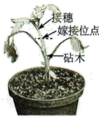

<table style="width:100%;">
<colgroup>
<col style="width: 16%" />
<col style="width: 5%" />
<col style="width: 7%" />
<col style="width: 5%" />
<col style="width: 5%" />
<col style="width: 5%" />
<col style="width: 7%" />
<col style="width: 5%" />
<col style="width: 7%" />
<col style="width: 5%" />
<col style="width: 5%" />
<col style="width: 5%" />
<col style="width: 5%" />
<col style="width: 5%" />
<col style="width: 7%" />
</colgroup>
<thead>
<tr>
<th style="text-align: left;">嫁接类型</th>
<th colspan="2" style="text-align: left;"></th>
<th colspan="2" style="text-align: left;">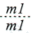</th>
<th colspan="2" style="text-align: left;">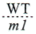</th>
<th colspan="2" style="text-align: left;"></th>
<th colspan="2" style="text-align: left;">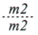</th>
<th colspan="2" style="text-align: left;"></th>
<th colspan="2" style="text-align: left;"></th>
</tr>
</thead>
<tbody>
<tr>
<td style="text-align: left;">砧木叶片创伤</td>
<td style="text-align: left;">否</td>
<td style="text-align: left;">是</td>
<td style="text-align: left;">否</td>
<td style="text-align: left;">是</td>
<td style="text-align: left;">否</td>
<td style="text-align: left;">是</td>
<td style="text-align: left;">否</td>
<td style="text-align: left;">是</td>
<td style="text-align: left;">否</td>
<td style="text-align: left;">是</td>
<td style="text-align: left;">否</td>
<td style="text-align: left;">是</td>
<td style="text-align: left;">否</td>
<td style="text-align: left;">是</td>
</tr>
<tr>
<td style="text-align: left;">接穗叶片</td>
<td style="text-align: left;">++</td>
<td style="text-align: left;">+++</td>
<td style="text-align: left;">-</td>
<td style="text-align: left;">-</td>
<td style="text-align: left;">+</td>
<td style="text-align: left;">+++</td>
<td style="text-align: left;">-</td>
<td style="text-align: left;">-</td>
<td style="text-align: left;">-</td>
<td style="text-align: left;">-</td>
<td style="text-align: left;">+</td>
<td style="text-align: left;">+</td>
<td style="text-align: left;">++</td>
<td style="text-align: left;">+++</td>
</tr>
<tr>
<td style="text-align: left;">砧木叶片</td>
<td style="text-align: left;">++</td>
<td style="text-align: left;">+++</td>
<td style="text-align: left;">-</td>
<td style="text-align: left;">-</td>
<td style="text-align: left;">-</td>
<td style="text-align: left;">-</td>
<td style="text-align: left;">++</td>
<td style="text-align: left;">+++</td>
<td style="text-align: left;">-</td>
<td style="text-align: left;">-</td>
<td style="text-align: left;">-</td>
<td style="text-align: left;">-</td>
<td style="text-align: left;">++</td>
<td style="text-align: left;">+++</td>
</tr>
</tbody>
</table>

注:WT为野生型，ml为突变体1，m2为突变体2;“……”代表嫁接，上方为接穗，下方为砧木:“+”“－”分别表示有无，“+”越多表示表达量越高

下列判断或推测正确的是（　　）

A. ml不能合成JA，但能感应JA而产生PI-Ⅱ

B. 嫁接也产生轻微伤害，可导致少量表达PI-Ⅱ

C. 嫁接类型ml/m2叶片创伤，ml中大量表达PI-Ⅱ

D. 嫁接类型m2/m1叶片创伤，m2中大量表达PI-Ⅱ

【答案】BD

【解析】

【分析】分析题干信息可知，突变体ml和m2，其中一个不能合成JA，但能感应JA而产生PI-Ⅱ；另一个能合成JA，但对JA不敏感。

【详解】A、由于ml做接穗，野生型做砧木，但是接穗叶片不能表达PI-Ⅱ，说明ml对JA不敏感，A错误；

B、分析第一组试验可知，野生型做接穗，野生型做砧木，接穗叶片和砧木叶片都表达PI-Ⅱ，说明嫁接也产生轻微伤害，可导致少量表达PI-Ⅱ，B正确；

C、ml对JA不敏感，m2不产生JA，故嫁接类型ml/m2叶片创伤，ml中不会大量表达PI-Ⅱ，C错误；

D、嫁接类型m2/m1叶片创伤，ml合成JA，运输到m2中感应JA而产生PI-Ⅱ，D正确。

故选BD。

**三、非选择题:包括必考题和选考题两部分。第17～20题为必考题，每个试题考生都必须作答。第 21、22题为选考题，考生根据要求作答。**

**（一）必考题:此题包括4小题，共45分。**

17\. 将纯净水洗净的河沙倒入洁净的玻璃缸中制成沙床，作为种子萌发和植株生长的基质。某水稻品种在光照强度为8～10μmol/（s·m2）时，固定的CO2量等于呼吸作用释放的CO2量;日照时长短于12小时才能开花。将新采收并解除休眠的该水稻种子表面消毒，浸种1天后，播种于沙床上。将沙床置于人工气候室中，保湿透气，昼/夜温为35℃/25℃，光照强度为2μmol/（s·m2），每天光照时长为14小时。回答下列问题:

（1）在此条件下，该水稻种子\_\_\_\_（填“能”或“不能”）萌发并成苗（以株高≥2厘米，至少1片绿叶视为成苗），理由是\_\_\_\_\_\_\_\_\_\_\_\_\_\_\_\_\_\_\_\_\_\_\_\_\_\_\_\_\_。

（2）若将该水稻适龄秧苗栽植于上述沙床上，光照强度为10μmol/（s·m2），其他条件与上述实验相同，该水稻\_\_\_（填“能”或“不能”）繁育出新的种子，理由是\_\_\_\_\_\_\_\_\_\_\_\_\_\_\_\_\_\_\_（答出两点即可）。

（3）若该水稻种子用于稻田直播（即将种子直接撒播于农田），为防鸟害、鼠害减少杂草生长，须灌水覆盖，该种子应具有\_\_\_\_\_\_\_\_\_特性。

【答案】（1） ①. 能 ②. 种子萌发形成幼苗的过程中，消耗的能量主要来自种子胚乳中储存的有机物，且光照有利于叶片叶绿素的形成

（2） ①. 不能 ②. 光照强度为10μmol/(s•m2)，等于光补偿点，每天光照时长为14小时，此时光照时没有有机物的积累，黑暗中细胞呼吸仍需消耗有机物，故全天没有有机物积累；且每天光照时长大于12小时，植株不能开花 （3）耐受酒精毒害

【解析】

【分析】种子萌发初期，消耗的能量主要来自种子胚乳中储存的有机物，有机物含量逐渐减少；当幼苗出土、形成绿叶后，开始通过光合作用合成有机物，但光合作用大于呼吸作用时，植株有机物开始增加。

【小问1详解】

种子萌发形成幼苗的过程中，消耗的能量主要来自种子胚乳中储存的有机物，因此在光照强度为2μmol/(s•m2)，每天光照时长为14小时，虽然光照强度低于光补偿点，但光照有利于叶片叶绿素的形成，种子仍能萌发并成苗。

【小问2详解】

将该水稻适龄秧苗栽植于上述沙床上，光照强度为10μmol/(s•m2)，等于光补偿点，每天光照时长为14小时，此时光照时没有有机物的积累，黑暗中细胞呼吸仍需消耗有机物，且每天光照时长大于12小时，植株不能开花，因此该水稻不能繁育出新的种子。

【小问3详解】

该水稻种子用于稻田直播(即将种子直接撒播于农田)，为防鸟害、鼠害减少杂草生长，须灌水覆盖，此时种子获得氧气较少，可通过无氧呼吸分解有机物供能，无氧呼吸产生的酒精对种子有一定的毒害作用，推测该种子应具有耐受酒精毒害的特性。

18\. 当内外环境变化使体温波动时，皮肤及机体内部的温度感受器将信息传入体温调节中枢，通过产热和散热反应，维持体温相对稳定。回答下列问题:

（1）炎热环境下，机体通过体温调节增加散热。写出皮肤增加散热的两种方式\_\_\_\_\_\_\_\_\_\_\_\_\_\_\_\_\_\_。

（2）机体产热和散热达到平衡时的温度即体温调定点，生理状态下人体调定点为37℃。病原体感染后，机体体温升高并稳定在38.5℃时，与正常状态相比，调定点\_\_\_\_（填“上移”“下移”或“不变”），机体产热\_\_\_\_\_\_\_。

（3）若下丘脑体温调节中枢损毁，机体体温不能维持稳定。已知药物A作用于下丘脑体温调节中枢调控体温。现获得A的结构类似物M，为探究M是否也具有解热作用并通过影响下丘脑体温调节中枢调控体温，将A、M分别用生理盐水溶解后，用发热家兔模型进行了以下实验，请完善实验方案并写出实验结论。

| 分组  | 处理方式                                    | 结果  |
|:---:|:--------------------------------------- |:---:|
| 甲   | 发热家兔模型+生理盐水                             | 发热  |
| 乙   | 发热家兔模型+A溶液                              | 退热  |
| 丙   | 发热家兔模型+M溶液                              | 退热  |
| 丁   | ①\_\_\_\_\_\_\_\_\_\_\_\_\_\_\_\_\_\_\_ | 发热  |

②由甲、乙、丙三组实验结果，得出结论\_\_\_\_\_\_\_\_\_\_\_\_\_\_\_\_\_\_\_\_\_。

③由甲、乙、丙、丁四组实验结果，得出结论\_\_\_\_\_\_\_\_\_\_\_\_\_\_\_\_\_\_\_\_\_。

【答案】（1）汗液的蒸发、皮肤中毛细血管舒张

（2） ①. 上移 ②. 增加

（3） ①. 损毁下丘脑的发热家兔模型+M溶液 ②. M与药物A一样也具有解热作用 ③. M与药物A一样具有解热作用并通过影响下丘脑体温调节中枢调控体温

【解析】

【分析】 1、 体温的恒定对于人体正常的生命活动至关重要，人体热量的来源主要是细胞中有机物的氧化放能（尤以骨骼肌和肝脏产热为多），热量的散出主要通过汗液的蒸发、皮肤内毛细血管的散热，其次还有呼气、排尿和排便等。

2、下丘脑是体温调节中枢，人体体温维持相对稳定的原因是产热量和散热量相等。体温过低或过高都会影响物质代谢的正常进行，使细胞、组织或器官发生功能紊乱，破坏内环境稳态，严重时会危及生命。

3、“探究M是否也具有解热作用并通过影响下丘脑体温调节中枢调控体温”要探究两个问题：①探究M是否也具有解热作用；②探究M是否通过影响下丘脑体温调节中枢调控体温。

小问1详解】

在炎热的环境中时，皮肤中的热觉感受器受到刺激后，将兴奋传递至下丘脑的体温调节中枢，通过中枢的调节，使皮肤中的毛细血管舒张，皮肤血流量增多，同时也使汗液的分泌增多等，从而增加散热。

【小问2详解】

机体产热和散热达到平衡时的温度即体温调定点，此时产热量和散热量相等，生理状态下人体调定点为37℃。病原体感染后，机体体温升高并稳定在38.5℃时，与正常状态相比，调定点上移，但机体产热量和散热量仍然相等，因此，产热量和散热量均增加。

【小问3详解】

由表格中信息可知，甲组为空白对照，发热家兔模型会出现发热的症状；乙组是加了等量用生理盐水溶解的A溶液，已知药物A作用于下丘脑体温调节中枢调控体温，因此发热家兔模型会退热；丙组是加了等量生理盐水溶解的M溶液，也出现退热现象，说明M与药物A一样也具有解热作用；丁组小鼠出现发热症状，由于要探究M通过影响下丘脑体温调节中枢调控体温，实验需要遵循单一变量原则，与丙组相比，丁组的处理是①损毁下丘脑的发热家兔模型+M溶液，损毁了下丘脑体温调节中枢后，M不能起到调控体温的作用。②由甲、乙、丙三组实验结果，得出结论：M与药物A一样也具有解热作用。③由甲、乙、丙、丁四组实验结果，得出结论：M与药物A一样具有解热作用并通过影响下丘脑体温调节中枢调控体温。

19\. 中国是传统的水稻种植大国，有一半以上人口以稻米为主食。在培育水稻优良品种的过程中，发现某野生型水稻叶片绿色由基因C控制。回答下列问题:

（1）突变型1叶片为黄色，由基因C突变为C1所致，基因C1纯合幼苗期致死。突变型1连续自交3代，F3成年植株中黄色叶植株占\_\_\_\_\_\_。

（2）测序结果表明，突变基因C1转录产物编码序列第727位碱基改变，由5＇-GAGAG-3＇变为5＇-GACAG-3＇，导致第\_\_\_\_\_\_位氨基酸突变为\_\_\_\_\_\_，从基因控制性状的角度解释突变体叶片变黄的机理\_\_\_\_\_\_\_\_\_\_\_\_\_\_\_\_\_\_\_\_\_\_\_\_\_\_\_\_\_\_\_\_\_\_\_\_\_。（部分密码子及对应氨基酸:GAG谷氨酸;AGA精氨酸;GAC天冬氨酸;ACA苏氨酸;CAG谷氨酰胺）

（3）由C突变为C1产生了一个限制酶酶切位点。从突变型1叶片细胞中获取控制叶片颜色的基因片段，用限制酶处理后进行电泳（电泳条带表示特定长度的DNA片段），其结果为图中\_\_\_（填“I”“Ⅱ”或“Ⅲ”）。

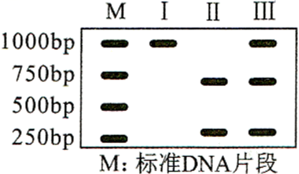

（4）突变型2叶片为黄色，由基因C的另一突变基因C2所致。用突变型2与突变型1杂交，子代中黄色叶植株与绿色叶植株各占50%。能否确定C2是显性突变还是隐性突变?\_\_\_\_\_\_（填“能”或“否”），用文字说明理由\_\_\_\_\_\_\_\_\_\_\_\_\_\_\_\_\_\_\_\_\_\_\_\_\_\_\_\_\_\_\_\_\_\_\_\_\_。

【答案】（1）2/9 （2） ①. 243 ②. 谷氨酰胺 ③. 基因突变影响与色素形成有关酶的合成，导致叶片变黄 （3）Ⅲ

（4） ①. 能 ②. 若C2是隐性突变，则突变型2为纯合子，则子代CC2表现为绿色，C1C2表现为黄色，子代中黄色叶植株与绿色叶植株各占50%。若突变型2为显性突变，突变型2（C2C）与突变型1（CC1）杂交，子代表型及比例应为黄∶绿=3∶1，与题意不符

【解析】

【分析】（1）基因突变具有低频性，一般同一位点的两个基因同时发生基因突变的概率较低；

（2）mRNA中三个相邻碱基决定一个氨基酸，称为一个密码子。

【小问1详解】

突变型1叶片为黄色，由基因C突变为C1所致，基因C1纯合幼苗期致死，说明突变型1应为杂合子，C1对C为显性，突变型1自交1代，子一代中基因型为1/3CC、2/3CC1，子二代中3/5CC、2/5CC1，F3成年植株中黄色叶植株占2/9。

【小问2详解】

突变基因C1转录产物编码序列第727位碱基改变，由5＇-GAGAG-3＇变为5＇-GACAG-3＇，突变位点前对应氨基酸数为726/3=242，则会导致第243位氨基酸由谷氨酸突变为谷氨酰胺。叶片变黄是叶绿体中色素含量变化的结果，而色素不是蛋白质，从基因控制性状的角度推测，基因突变影响与色素形成有关酶的合成，导致叶片变黄。

【小问3详解】

突变型1应为杂合子，由C突变为C1产生了一个限制酶酶切位点。Ⅰ应为C酶切、电泳结果，II应为C1酶切、电泳结果，从突变型1叶片细胞中获取控制叶片颜色的基因片段，用限制酶处理后进行电泳，其结果为图中Ⅲ。

【小问4详解】

用突变型2（C2\_）与突变型1（CC1）杂交，子代中黄色叶植株与绿色叶植株各占50%。若C2是隐性突变，则突变型2为纯合子，则子代CC2表现为绿色，C1C2表现为黄色，子代中黄色叶植株与绿色叶植株各占50%。若突变型2为显性突变，突变型2（C2C）与突变型1（CC1）杂交，子代表型及比例应为黄∶绿=3∶1，与题意不符。故C2是隐性突变。

20\. 入侵生物福寿螺适应能力强、种群繁殖速度快。为研究福寿螺与本土田螺的种间关系及福寿螺对水质的影响，开展了以下实验:

实验一:在饲养盒中间放置多孔挡板，不允许螺通过，将两种螺分别置于挡板两侧饲养;单独饲养为对照组。结果如图所示。

实验二:在饲养盒中，以新鲜菜叶喂养福寿螺，每天清理菜叶残渣;以清洁自来水为对照组。结果如表所示。

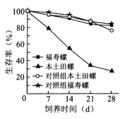

<table>
<colgroup>
<col style="width: 10%" />
<col style="width: 14%" />
<col style="width: 16%" />
<col style="width: 16%" />
<col style="width: 13%" />
<col style="width: 14%" />
<col style="width: 13%" />
</colgroup>
<thead>
<tr>
<th rowspan="2" style="text-align: left;">养殖天数（d）</th>
<th colspan="2" style="text-align: center;">浑浊度（FTU）</th>
<th colspan="2" style="text-align: center;">总氮（mg/L）</th>
<th colspan="2" style="text-align: center;">总磷（mg/L）</th>
</tr>
<tr>
<th style="text-align: center;">实验组</th>
<th style="text-align: center;">对照组</th>
<th style="text-align: center;">实验组</th>
<th style="text-align: center;">对照组</th>
<th style="text-align: center;">实验组</th>
<th style="text-align: center;">对照组</th>
</tr>
</thead>
<tbody>
<tr>
<td style="text-align: center;">1</td>
<td style="text-align: center;">10.81</td>
<td style="text-align: center;">0.58</td>
<td style="text-align: center;">14.72</td>
<td style="text-align: center;">7.73</td>
<td style="text-align: center;">0.44</td>
<td style="text-align: center;">0.01</td>
</tr>
<tr>
<td style="text-align: center;">3</td>
<td style="text-align: center;">15.54</td>
<td style="text-align: center;">0.31</td>
<td style="text-align: center;">33.16</td>
<td style="text-align: center;">8.37</td>
<td style="text-align: center;">1.27</td>
<td style="text-align: center;">0.01</td>
</tr>
<tr>
<td style="text-align: center;">5</td>
<td style="text-align: center;">23.12</td>
<td style="text-align: center;">1.04</td>
<td style="text-align: center;">72.78</td>
<td style="text-align: center;">9.04</td>
<td style="text-align: center;">2.38</td>
<td style="text-align: center;">0.02</td>
</tr>
<tr>
<td style="text-align: center;">7</td>
<td style="text-align: center;">34.44</td>
<td style="text-align: center;">0.46</td>
<td style="text-align: center;">74.02</td>
<td style="text-align: center;">9.35</td>
<td style="text-align: center;">4.12</td>
<td style="text-align: center;">0.01</td>
</tr>
</tbody>
</table>

注：水体浑浊度高表示其杂质含量高

回答下列问题:

（1）野外调查本土田螺的种群密度，通常采用的调查方法是\_\_\_\_\_\_\_\_\_\_\_\_\_\_\_\_\_\_\_\_\_\_\_。

（2）由实验一结果可知，两种螺的种间关系为\_\_\_\_\_\_\_\_。

（3）由实验二结果可知，福寿螺对水体的影响结果表现为\_\_\_\_\_\_\_\_\_\_\_\_\_\_\_。

（4）结合实验一和实验二的结果，下列分析正确的是\_\_\_\_\_\_\_（填序号）。

①福寿螺的入侵会降低本土物种丰富度 ②福寿螺对富营养化水体耐受能力低 ③福寿螺比本土田螺对环境的适应能力更强 ④种群数量达到K/2时，是防治福寿螺的最佳时期

（5）福寿螺入侵所带来的危害警示我们，引种时要注意\_\_\_\_\_\_\_\_\_\_\_\_\_\_\_\_\_\_\_\_\_\_\_\_（答出两点即可）。

【答案】（1）样方法 （2）竞争

（3）水体富营养化，水质被污染 （4）①③

（5）物种对当地环境的适应性，有无敌害及对其他物种形成敌害

【解析】

【分析】分析坐标图形：单独培养时，随培养时间增加，本地田螺生存率较高且持平，福寿螺生存率下降，混合培养时，本地田螺生存率下降，福寿螺生存率上升。

分析表格，随着福寿螺养殖天数增加，水体浊、总N量、总P量均增加。

【小问1详解】

由于本土田螺活动能力弱、活动范围小，故调查本土田螺的种群密度时，常采用的调查方法是样方法。

【小问2详解】

由坐标图形可以看出，随着培养天数增加，单独培养时，本地田螺生存率与福寿螺无明显差异，混合培养时，本地田螺生存率明显下降，福寿螺生存率没有明显变化，两者属于竞争关系。

【小问3详解】

据表中数据可见：随着福寿螺养殖天数增加，水体浊度增加，说明水质被污染，总N量、总P量增加，说明引起了水体富营养化。

【小问4详解】

结合实验一和实验二的结果可知，福寿螺对环境的适应能力比本土强，更适应富营养化水体，竞争中占优势，导致本土田螺数量减少，降低本土物种丰富度，如果治理需在种群数量在K/2前防治，此时种群增长率没有达到最高，容易防控，故选①③。

【小问5详解】

引入外来物种，可能会破坏当地的生物多样性，故需要在引入以前需要考虑物种对当地环境的适应性，有无敌害及对其他物种形成敌害，还需建立外来物种引进的风险评估机制、综合治理机制及跟踪监。

**（二）选考题:请考生从给出的两道题中任选一题作答。如果多做，则按所做的第一题计分。**

**\[选修1:生物技术实践\]**

21\. 黄酒源于中国，与啤酒、葡萄酒并称世界三大发酵酒。发酵酒的酿造过程中除了产生乙醇外，也产生不利于人体健康的氨基甲酸乙酯（EC）。EC主要由尿素与乙醇反应形成，各国对酒中的EC含量有严格的限量标准。回答下列问题:

（1）某黄酒酿制工艺流程如图所示，图中加入的菌种a是\_\_\_\_\_\_\_，工艺b是\_\_\_\_\_\_\_（填“消毒”或“灭菌”），采用工艺b的目的是\_\_\_\_\_\_\_\_\_\_\_\_\_\_\_\_\_\_\_\_。

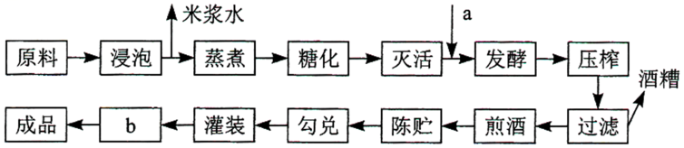

（2）以尿素为唯一氮源的培养基中加入\_\_\_\_\_\_\_\_指示剂，根据颜色变化，可以初步鉴定分解尿素的细菌。尿素分解菌产生的脲酶可用于降解黄酒中的尿素，脲酶固定化后稳定性和利用效率提高，固定化方法有\_\_\_\_\_\_\_\_\_\_\_\_\_\_\_\_\_\_\_\_\_\_\_\_\_（答出两种即可）。

（3）研究人员利用脲酶基因构建基因工程菌L，在不同条件下分批发酵生产脲酶，结果如图所示。推测\_\_\_\_\_\_\_\_是决定工程菌L高脲酶活力的关键因素，理由是\_\_\_\_\_\_\_\_\_\_\_\_\_\_\_\_\_\_。

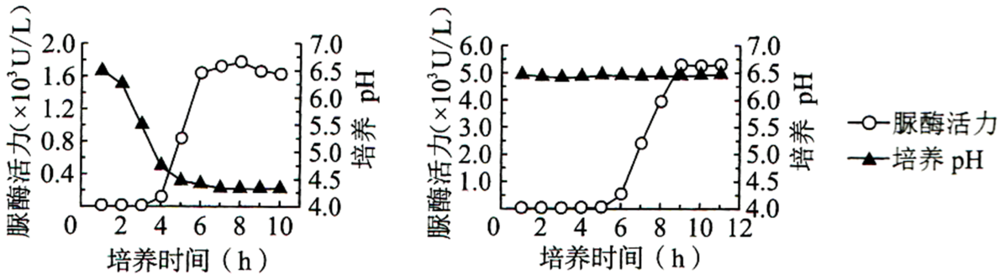

（4）某公司开发了一种新的黄酒产品，发现EC含量超标。简要写出利用微生物降低该黄酒中EC含量的思路\_\_\_\_\_\_\_\_\_\_\_\_\_\_\_\_\_\_\_\_\_\_\_\_\_\_\_\_\_。

【答案】（1） ①. 酵母菌 ②. 消毒 ③. 杀死啤酒中部分微生物，防止杂菌污染，延长其保存期

（2） ①. 酚红指示剂 ②. 化学结合法、包埋法、物理吸附法

（3） ①. pH ②. 随着培养时间延长，两图形中脲酶活力变化曲线基本一致，当pH从6.5降为4.5时，酶活力逐渐下降后保持相对稳定

（4）在发酵环节加入尿素分解菌，使尿素被分解， EC不能形成，从而降低EC含量

【解析】

【分析】由于细菌分解在尿素的过程中合成脲酶，脲酶将尿素分解成氨，会使培养基碱性增强，pH升高，所以可以用检测pH的变化的方法来判断尿素是否被分解，可在培养基中加入酚红指示剂，尿素被分解后产生氨，pH升高，指示剂变红。

【小问1详解】

制造果酒利用的是酵母菌的无氧呼吸，加入的菌种a是酵母菌。过滤能除去啤酒中部分微生物，工艺b是消毒，消毒能杀死啤酒中部分微生物，防止杂菌污染，延长其保存期。

【小问2详解】

由于细菌分解尿素的过程中合成脲酶，脲酶将尿素分解成氨，会使培养基碱性增强，pH升高，所以可以用检测pH的变化的方法来判断尿素是否被分解，故在以尿素为唯一氮源的培养基中加入酚红指示剂可以鉴别尿素分解菌。固定化酶实质上是将相应酶固定在不溶于水的载体上，实现酶的反复利用，并提高酶稳定性，酶的各项特性（如高效性、专一性和作用条件的温和性）依然保持。固定化酶的方法包括化学结合法、包埋法、物理吸附法等。

【小问3详解】

对比两坐标曲线，随着培养时间延长，两图形中脲酶活力先增加后保持相对稳定，两者变化曲线基本一致，所以培养时间不是决定决定工程菌L高脲酶活力的关键因素。左图中当pH从6.5降为4.5时，酶活力由1.6逐渐下降后相对稳定，右图中当pH为6.5时，酶活力可以达到5.0并保持不变，故pH值是决定工程菌L高脲酶活力的关键因素。

【小问4详解】

从坐标图形看，利用脲酶消除其前体物质尿素可降低该黄酒中EC含量。该实验的实验思路为：将分解尿素的细菌，扩大培养后经过酸性培养基的初筛后，在添加酚红的培养基上进行复筛，挑选目标菌株接种到发酵环节，使尿素被分解， EC不能形成，从而降低EC含量。

**\[选修3:现代生物科技专题\]**

22\. 水蛭是我国的传统中药材，主要药理成分水蛭素为水蛭蛋白中重要成分之一，具有良好的抗凝血作用。拟通过蛋白质工程改造水蛭素结构，提高其抗凝血活性。回答下列问题:

（1）蛋白质工程流程如图所示，物质a是\_\_\_\_\_\_\_，物质b是\_\_\_\_\_\_\_。在生产过程中，物质b可能不同，合成的蛋白质空间构象却相同，原因是\_\_\_\_\_\_\_\_\_\_\_\_\_\_\_\_\_\_\_\_\_\_\_。

（2）蛋白质工程是基因工程的延伸，基因工程中获取目的基因的常用方法有\_\_\_\_\_\_\_\_\_\_\_、\_\_\_\_\_\_\_\_\_\_和利用 PCR 技术扩增。PCR 技术遵循的基本原理是\_\_\_\_\_\_\_\_\_\_\_\_\_\_\_\_\_\_\_\_。

（3）将提取的水蛭蛋白经甲、乙两种蛋白酶水解后，分析水解产物中的肽含量及其抗凝血活性，结果如图所示。推测两种处理后酶解产物的抗凝血活性差异主要与肽的\_\_\_\_\_\_（填“种类”或“含量”）有关，导致其活性不同的原因是\_\_\_\_\_\_\_\_\_\_\_\_\_\_\_\_\_\_\_\_\_\_\_\_\_\_\_\_\_\_。

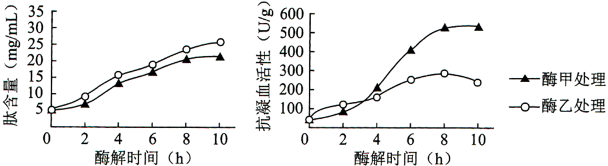

（4）若要比较蛋白质工程改造后的水蛭素、上述水蛭蛋白酶解产物和天然水蛭素的抗凝血活性差异，简要写出实验设计思路\_\_\_\_\_\_\_\_\_\_\_\_\_\_\_\_\_\_\_\_\_\_\_\_\_\_\_\_\_\_\_\_\_\_\_\_\_\_\_\_。

【答案】（1） ①. 氨基酸序列多肽链 ②. mRNA ③. 密码子的简并性

（2） ①. 从基因文库中获取目的基因 ②. 通过DNA合成仪用化学方法直接人工合成 ③. DNA双链复制

（3） ①. 种类 ②. 提取的水蛭蛋白的酶解时间和处理的酶的种类不同，导致水蛭蛋白空间结构有不同程度破坏

（4）取3支试管，分别加入等量的蛋白质工程改造后的水蛭素、上述水蛭蛋白酶解产物和天然水蛭素；用酒精消毒，用注射器取同一种动物（如家兔）血液，立即将等量的血液加入1、2、3号三支试管中，静置相同时间，统计三支试管中血液凝固时间

【解析】

【分析】1、蛋白质工程的基本途径是：从预期的蛋白质功能出发→设计预期的蛋白质的结构→推测应有的氨基酸序列→找到相对应的脱氧核苷酸序列；

2、蛋白质工程是指以蛋白质分子的结构规律及其与生物功能的关系作为基础，通过基因修饰或基因合成，对现有蛋白质进行改造，或制造一种新的蛋白质，以满足人类的生产和生活的需求。也就是说，蛋白质工程是在基因工程的基础上，延伸出来的第二代基因工程，是包含多学科的综合科技工程领域。

【小问1详解】

据分析可知，物质a是氨基酸序列多肽链，物质b是mRNA。在生产过程中，物质b可能不同，合成的蛋白质空间构象却相同，原因是密码子的简并性，即一种氨基酸可能有几个密码子。

【小问2详解】

蛋白质工程是基因工程的延伸，基因工程中获取目的基因的常用方法有从基因文库中获取目的基因、通过DNA合成仪用化学方法直接人工合成和利用 PCR 技术扩增。PCR 技术遵循的基本原理是 DNA双链复制。

【小问3详解】

将提取的水蛭蛋白经甲、乙两种蛋白酶水解后，据图可知，水解产物中的肽含量随着酶解时间的延长均上升，且差别不大；而水解产物中抗凝血活性有差异，经酶甲处理后，随着酶解时间的延长，抗凝血活性先上升后相对稳定，经酶乙处理后，随着酶解时间的延长，抗凝血活性先上升后下降，且酶甲处理后的酶解产物的抗凝血活性最终高于经酶乙处理后的酶解产物的抗凝血活性，差异明显，据此推测两种处理后酶解产物的抗凝血活性差异主要与肽的种类有关，导致其活性不同的原因是提取的水蛭蛋白的酶解时间和酶的种类不同，导致水蛭蛋白空间结构有不同程度破坏。

【小问4详解】

若要比较蛋白质工程改造后的水蛭素、上述水蛭蛋白酶解产物和天然水蛭素的抗凝血活性差异，实验设计思路为：取3支试管，分别加入等量的蛋白质工程改造后的水蛭素、上述水蛭蛋白酶解产物和天然水蛭素；用酒精消毒，用注射器取同一种动物（如家兔）血液，立即将等量的血液加入1、2、3号三支试管中，静置相同时间，统计三支试管中血液凝固时间
