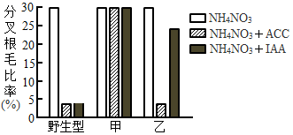
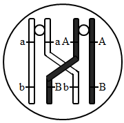
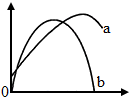
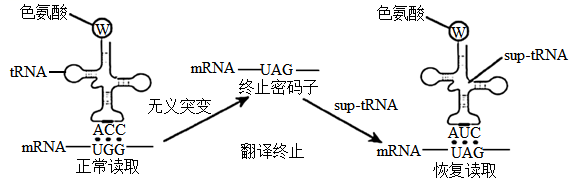
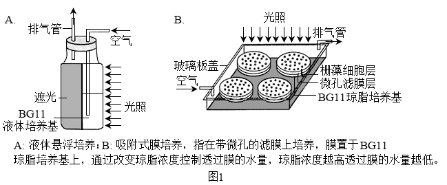
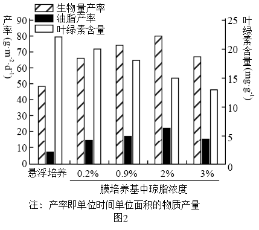
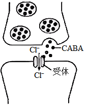
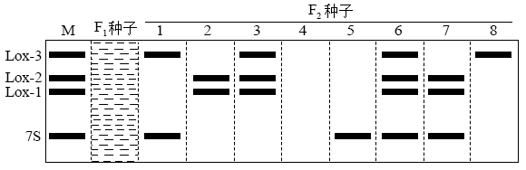
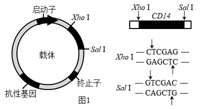
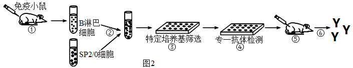

**福建省2022年普通高中学业水平选择性考试**

**生物试题**

**一、单项选择题**

1\. 下列关于黑藻生命活动的叙述，错误的是（ ）

A. 叶片细胞吸水时，细胞液渗透压降低 B. 光合作用时，在类囊体薄膜上合成ATP

C. 有氧呼吸时，在细胞质基质中产生CO2 D. 细胞分裂时，会发生核膜的消失和重建

2\. 科研人员在2003年完成了大部分的人类基因组测序工作，2022年宣布测完剩余的8%序列。这些序列富含高度重复序列，且多位于端粒区和着丝点区。下列叙述错误的是（ ）

A. 通过人类基因组可以确定基因的位置和表达量

B. 人类基因组中一定含有可转录但不翻译的基因

C. 着丝点区的突变可能影响姐妹染色单体的正常分离

D. 人类基因组测序全部完成有助于细胞衰老分子机制的研究

3\. 我国科研人员在航天器微重力环境下对多能干细胞的分化进行了研究，发现与正常重力相比，多能干细胞在微重力环境下加速分化为功能健全的心肌细胞。下列叙述错误的是（ ）

A. 微重力环境下多能干细胞和心肌细胞具有相同的细胞周期

B. 微重力环境下进行人体细胞的体外培养需定期更换培养液

C. 多能干细胞在分化过程中蛋白质种类和数量发生了改变

D. 该研究有助于了解微重力对细胞生命活动的影响

4\. 新冠病毒通过S蛋白与细胞膜上ACE2蛋白结合后侵染人体细胞。病毒的S基因易发生突变，而ORF1a/b和N基因相对保守。奥密克戎变异株S基因多个位点发生突变，传染性增强，加强免疫接种可以降低重症发生率。下列叙述错误的是（ ）

A. 用ORF1a/b和N基因同时作为核酸检测靶标，比仅用S基因作靶标检测的准确率更高

B. 灭活疫苗可诱导产生的抗体种类，比根据S蛋白设计的mRNA疫苗产生的抗体种类多

C. 变异株突变若发生在抗体特异性结合位点，可导致相应抗体药物对变异株效力的下降

D. 变异株S基因的突变减弱了S蛋白与ACE2蛋白的结合能力，有利于病毒感染细胞

5\. 高浓度NH4NO3会毒害野生型拟南芥幼苗，诱导幼苗根毛畸形分叉。为研究高浓度NH4NO3下乙烯和生长素（IAA）在调节拟南芥幼苗根毛发育中的相互作用机制，科研人员进行了相关实验，部分结果如下图。

注：甲是蛋白M缺失的IAA不敏感型突变体，乙是蛋白N缺失的IAA不敏感型突变体；ACC是乙烯合成的前体；分叉根毛比率=分叉根毛数/总根毛数×100%。

下列叙述正确的是（ ）

A. 实验自变量是不同类型的拟南芥突变体、乙烯或IAA

B. 实验结果表明，IAA对根毛分叉的调节作用具有两重性

C. 高浓度 NH4NO3下，外源IAA对甲的根系保护效果比乙的好

D. 高浓度 NH4NO3下，蛋白M在乙烯和IAA抑制根毛分叉中发挥作用

6\. 某哺乳动物的一个初级精母细胞的染色体示意图如下，图中A/a、B/b表示染色体上的两对等位基因。下列叙述错误的是（ ）

A. 该细胞发生的染色体行为是精子多样性形成的原因之一

B. 图中非姐妹染色单体发生交换，基因A和基因B发生了重组

C. 等位基因的分离可发生在减数第一次分裂和减数第二次分裂

D. 该细胞减数分裂完成后产生AB、aB、Ab、ab四种基因型的精细胞

7\. 曲线图是生物学研究中数学模型建构的一种表现形式。下图中的曲线可以表示相应生命活动变化关系的是（　　）

A. 曲线a可表示自然状态下，某植物CO2吸收速率随环境CO2浓度变化的关系

B. 曲线a可表示葡萄糖进入红细胞时，物质运输速率随膜两侧物质浓度差变化的关系

C. 曲线b可表示自然状态下，某池塘草鱼种群增长速率随时间变化的关系

D. 曲线b可表示在晴朗的白天，某作物净光合速率随光照强度变化的关系

8\. 青蒿素是治疗疟疾主要药物。疟原虫在红细胞内生长发育过程中吞食分解血红蛋白，吸收利用氨基酸，血红蛋白分解的其他产物会激活青蒿素，激活的青蒿素能杀死疟原虫。研究表明，疟原虫Kelch13蛋白因基因突变而活性降低时，疟原虫吞食血红蛋白减少，生长变缓。同时血红蛋白的分解产物减少，青蒿素无法被充分激活，疟原虫对青蒿素产生耐药性。下列叙述错误的是（ ）

A. 添加氨基酸可以帮助体外培养的耐药性疟原虫恢复正常生长

B. 疟原虫体内的Kelch13基因发生突变是青蒿素选择作用的结果

C. 在青蒿素存在情况下，Kelch13蛋白活性降低对疟原虫是一个有利变异

D. 在耐药性疟原虫体内补充表达Kelch13蛋白可以恢复疟原虫对青蒿素的敏感性

9\. 无义突变是指基因中单个碱基替换导致出现终止密码子，肽链合成提前终止。科研人员成功合成了一种tRNA（sup—tRNA），能帮助A基因第401位碱基发生无义突变的成纤维细胞表达出完整的A蛋白。该 sup—tRNA对其他蛋白的表达影响不大。过程如下图。

下列叙述正确的是（ ）

A. 基因模板链上色氨酸对应的位点由UGG突变为UAG

B. 该sup—tRNA修复了突变的基因A，从而逆转因无义突变造成的影响

C. 该sup—tRNA能用于逆转因单个碱基发生插入而引起的蛋白合成异常

D. 若A基因无义突变导致出现UGA，则此sup—tRNA无法帮助恢复读取

**二、非选择题**

10\. 栅藻是一种真核微藻，具有生长繁殖快、光合效率高、可产油脂等特点。为提高栅藻的培养效率和油脂含量，科研人员在最适温度下研究了液体悬浮培养和含水量不同的吸附式膜培养（如图1）对栅藻生长和产油量的影响，结果如图2。

回答下列问题：

（1）实验中，悬浮培养和膜培养装置应给予相同的\_\_\_\_\_（答出2点即可）。

（2）为测定两种培养模式栅藻光合速率，有人提出可以向装置中通入C18O2，培养一段时间后检测C18O2释放量。你认为该方法\_\_\_\_\_（填“可行”或“不可行”），理由是\_\_\_\_\_。

（3）由图2的结果可知，膜培养的栅藻虽然叶绿素含量较低，但膜培养仍具一定的优势，体现在 <u>①</u> 。结合图1，从影响光合效率因素的角度分析，膜培养具有这种优势的原因是 <u>②</u> 。

（4）根据图2的结果，对利用栅藻生产油脂的建议是\_\_\_\_\_。

11\. 下丘脑通过整合来自循环系统的激素和消化系统的信号调节食欲，是食欲调节控制中心。下丘脑的食欲调节中枢能调节A神经元直接促进食欲。A神经元还能分泌神经递质GABA，调节B神经元。GABA的作用机制如图。回答下列问题：

（1）下丘脑既是食欲调节中枢，也是\_\_\_\_\_调节中枢（答出1点即可）。

（2）据图分析，GABA与突触后膜的受体结合后，将引发突触后膜\_\_\_\_\_（填“兴奋”或“抑制”），理由是\_\_\_\_\_。

（3）科研人员把小鼠的A神经元剔除，将GABA受体激动剂（可代替GABA直接激活相应受体）注射至小鼠的B神经元区域，能促进摄食。据此可判断B神经元在食欲调节中的功能是\_\_\_\_\_。

（4）科研人员用不同剂量的GABA对小鼠灌胃，发现30 mg·kg-1 GABA能有效促进小鼠的食欲，表明外源的GABA被肠道吸收后也能调节食欲。有人推测外源GABA信号是通过肠道的迷走神经上传到下丘脑继而调节小鼠的食欲。请在上述实验的基础上另设4个组别，验证推测。

①完善实验思路：将生理状态相同的小鼠随机均分成4组。

A组：灌胃生理盐水；

B组：假手术 ＋ 灌胃生理盐水；

C组：假手术 ＋ \_\_\_\_\_；

D组：\_\_\_\_\_＋\_\_\_\_\_；

（说明：假手术是指暴露小鼠腹腔后再缝合。手术后的小鼠均需恢复后再与其他组同时处理。）

连续处理一段时间，测定并比较各组小鼠的摄食量。

②预期结果与结论：若\_\_\_\_\_，则推测成立。

12\. 7S球蛋白是大豆最主要的过敏原蛋白，三种大豆脂氧酶Lox-1，2，3是大豆产生腥臭味的原因。大豆食品深加工过程中需要去除7S球蛋白和三种脂氧酶。科研人员为获得7S球蛋白与三种脂氧酶同时缺失的大豆新品种，将7S球蛋白缺失的大豆植株与脂氧酶完全缺失的植株杂交，获得F1种子。F1植株自交得到F2种子。对F1种子和F2种子的7S球蛋白和脂氧酶进行蛋白质电泳检测，不同表现型的电泳条带示意如下图。

注：图中黑色条带为抗原一抗体杂交带，表示相应蛋白质的存在。M泳道条带为相应标准蛋白所在位置，F1种子泳道的条带待填写。

根据电泳检测的结果，对F2种子表现型进行分类统计如下表。

<table style="width:51%;">
<colgroup>
<col style="width: 21%" />
<col style="width: 23%" />
<col style="width: 6%" />
</colgroup>
<tbody>
<tr>
<td colspan="2" style="text-align: left;">F2种子表现型</td>
<td style="text-align: left;">粒数</td>
</tr>
<tr>
<td rowspan="2" style="text-align: left;">7S球蛋白</td>
<td style="text-align: left;">野生型</td>
<td style="text-align: left;">124</td>
</tr>
<tr>
<td style="text-align: left;">7S球蛋白缺失型</td>
<td style="text-align: left;">377</td>
</tr>
<tr>
<td rowspan="4" style="text-align: left;">脂氧酶Lox-1，2，3</td>
<td style="text-align: left;">野生型</td>
<td style="text-align: left;">282</td>
</tr>
<tr>
<td style="text-align: left;">①</td>
<td style="text-align: left;">94</td>
</tr>
<tr>
<td style="text-align: left;">②</td>
<td style="text-align: left;">94</td>
</tr>
<tr>
<td style="text-align: left;">Lox-1，2，3全缺失型</td>
<td style="text-align: left;">31</td>
</tr>
</tbody>
</table>

回答下列问题：

（1）7S球蛋白缺失型属于\_\_\_\_\_（填“显性”或“隐性”）性状。

（2）表中①②的表现型分别是\_\_\_\_\_、\_\_\_\_\_。脂氧酶 Lox—1，2，3分别由三对等位基因控制，在脂氧酶是否缺失的性状上，F2种子表现型只有四种，原因是\_\_\_\_\_。

（3）在答题卡对应的图中画出F1种子表现型的电泳条带\_\_\_\_\_。

（4）已知Lox基因和7S球蛋白基因独立遗传。图中第\_\_\_\_\_泳道的种子表现型为7S球蛋白与三种脂氧酶同时缺失型，这些种子在F2中的比例是\_\_\_\_\_。利用这些种子选择并获得稳定遗传种子的方法是\_\_\_\_\_。

（5）为提高大豆品质，利用基因工程方法提出一个消除野生型大豆7S球蛋白过敏原设想。\_\_\_\_\_

13\. 美西螈具有很强的再生能力。研究表明，美西螈的巨噬细胞在断肢再生的早期起重要作用。为研究巨噬细胞的作用机制，科研人员制备了抗巨噬细胞表面标志蛋白CD14的单克隆抗体，具体方法如下。回答下列问题：

（一）基因工程抗原的制备

（1）根据美西螈CD14基因的核苷酸序列，合成引物，利用PCR扩增CD14片段。已知DNA聚合酶催化引物的3’—OH与加入的脱氧核苷酸的5’—P形成磷酸二酯键，则新合成链的延伸方向是\_\_\_\_\_（填“ 5’→3’ ”或“ 3’→5’ ”）。

（2）载体和CD14片段的酶切位点及相应的酶切 抗性基因序列如图1所示。用Xho I和Sal 1分别酶切CD14和载体后连接，CD14接入载体时会形成正向连接和反向连接的两种重组DNA．可进一步用这两种限制酶对CD14的连接方向进行鉴定，理由是\_\_\_\_\_。

培养能表达CD14蛋白的大肠杆菌，分离纯化目的蛋白。

（二）抗CD14单克隆抗体的制备流程如图2所示：

（3）步骤①和步骤⑤分别向小鼠注射\_\_\_\_\_和\_\_\_\_\_。

（4）步骤②所用的SP2/0细胞的生长特点是\_\_\_\_\_。

（5）吸取③中的上清液到④的培养孔中，根据抗原—抗体杂交原理，需加入 <u>①</u> 进行专一抗体检测，检测过程发现有些杂交瘤细胞不能分泌抗CD14抗体，原因是 <u>②</u> 。

（6）步骤⑥从\_\_\_\_\_中提取到大量的抗CD14抗体，用于检测巨噬细胞。
