**福建省2022年普通高中学业水平选择性考试**

**生物试题**

**一、单项选择题**

1\. 下列关于黑藻生命活动的叙述，错误的是（ ）

A. 叶片细胞吸水时，细胞液的渗透压降低 B. 光合作用时，在类囊体薄膜上合成ATP

C. 有氧呼吸时，在细胞质基质中产生CO2 D. 细胞分裂时，会发生核膜的消失和重建

【答案】C

【解析】

【分析】黑藻属于植物细胞，有叶绿体和大液泡，能够进行光合作用和呼吸作用，也可进行渗透吸水等活动。

【详解】A、黑藻有大液泡，当叶片细胞吸水时，水分进入细胞内导致细胞液的渗透压降低，A正确；

B、黑藻是真核细胞，有叶绿体，进行光合作用时，类囊体薄膜上的色素将光能转变为ATP中的化学能，合成ATP，B正确；

C、有氧呼吸时，在线粒体基质发生的第二阶段能产生CO2，C错误；

D、真核细胞进行有丝分裂时，会周期性的发生核膜的消失（前期）和重建（末期），D正确。

故选C。

2\. 科研人员在2003年完成了大部分的人类基因组测序工作，2022年宣布测完剩余的8%序列。这些序列富含高度重复序列，且多位于端粒区和着丝点区。下列叙述错误的是（ ）

A. 通过人类基因组可以确定基因的位置和表达量

B. 人类基因组中一定含有可转录但不翻译的基因

C. 着丝点区的突变可能影响姐妹染色单体的正常分离

D. 人类基因组测序全部完成有助于细胞衰老分子机制的研究

【答案】A

【解析】

【分析】人类基因组计划的目的：测定人类基因组的全部DNA序列，解读其中包含的遗传信息。

【详解】A、基因的表达包括转录和翻译，通常是最终翻译为蛋白质，通过人类基因组测序可确定基因的位置，但不能知道表达量，A错误；

B、转录是以DNA一条链为模板翻译出RNA的过程，翻译是以mRNA为模板翻译蛋白质的过程，真核生物的基因编码区都能够转录，但包括外显子和内含子，其中编码蛋白质的序列是外显子，分布在外显子之间的多个只转录但不编码蛋白质的序列是内含子，故人类基因组中一定含有可转录但不翻译的基因，B正确；

C、着丝点（着丝粒）分裂姐妹染色单体可分离为子染色体，染色体数目加倍，着丝点区的突变可能影响姐妹染色单体的正常分离，C正确；

D、细胞的衰老与基因有关，人类基因组测序全部完成有助于细胞衰老分子机制的研究，D正确。

故选A。

3\. 我国科研人员在航天器微重力环境下对多能干细胞的分化进行了研究，发现与正常重力相比，多能干细胞在微重力环境下加速分化为功能健全的心肌细胞。下列叙述错误的是（ ）

A. 微重力环境下多能干细胞和心肌细胞具有相同的细胞周期

B. 微重力环境下进行人体细胞的体外培养需定期更换培养液

C. 多能干细胞在分化过程中蛋白质种类和数量发生了改变

D. 该研究有助于了解微重力对细胞生命活动的影响

【答案】A

【解析】

【分析】1、干细胞的概念：动物和人体内保留着少量具有分裂和分化能力的细胞。

2、细胞分化是指在个体发育中，由一个或一种细胞增殖产生的后代，在形态、结构和生理功能上发生稳定性差异的过程。细胞分化的实质是基因的选择性表达。

【详解】A、连续分裂的细胞才有细胞周期，心肌细胞已经高度分化，不能再分裂，没有细胞周期，A错误；

B、进行细胞的体外培养需定期更换培养液，避免代谢废物对细胞的毒害作用，B正确；

C、分化过程的本质是基因的选择性表达，故多能干细胞在分化过程中蛋白质种类和数量发生了改变，C正确；

D、由题意可知，多能干细胞在微重力环境下能加速分化，所以该研究有助于了解微重力对细胞生命活动的影响，D正确。

故选A。

4\. 新冠病毒通过S蛋白与细胞膜上的ACE2蛋白结合后侵染人体细胞。病毒的S基因易发生突变，而ORF1a/b和N基因相对保守。奥密克戎变异株S基因多个位点发生突变，传染性增强，加强免疫接种可以降低重症发生率。下列叙述错误的是（ ）

A. 用ORF1a/b和N基因同时作为核酸检测靶标，比仅用S基因作靶标检测的准确率更高

B. 灭活疫苗可诱导产生的抗体种类，比根据S蛋白设计的mRNA疫苗产生的抗体种类多

C. 变异株突变若发生在抗体特异性结合位点，可导致相应抗体药物对变异株效力的下降

D. 变异株S基因的突变减弱了S蛋白与ACE2蛋白的结合能力，有利于病毒感染细胞

【答案】D

【解析】

【分析】细胞免疫过程为：

(1)感应阶段：吞噬细胞摄取和处理抗原，并暴露出其抗原决定簇，然后将抗原呈递给T细胞；

(2)反应阶段：T细胞接受抗原刺激后增殖、分化形成记忆细胞和效应T细胞，同时T细胞能合成并分泌淋巴因子，增强免疫功能。

(3)效应阶段：效应T细胞发挥效应。

【详解】A、从题干信息可知：“ORF1a/b和N基因相对保守”，同时作为核酸检测靶标，比仅用容易发生突变的S基因作靶标检测的准确率更高，A正确；

B、灭活疫苗可诱导产生抗S蛋白抗体等多种抗体，而根据S蛋白设计的mRNA疫苗只诱导产生抗S蛋白抗体，B正确；

C、变异株突变若发生在抗体特异性结合位点，则相应抗体药物难以与之结合发挥作用，进而导致抗体药物对变异株效力的下降，C正确；

D、从题干信息可知：“新冠病毒通过S蛋白与细胞膜上的ACE2蛋白结合后侵染人体细胞。”，而变异株S基因的突变减弱了S蛋白与ACE2蛋白的结合能力，不有利于病毒感染细胞，D错误。

故选D。

5\. 高浓度NH4NO3会毒害野生型拟南芥幼苗，诱导幼苗根毛畸形分叉。为研究高浓度NH4NO3下乙烯和生长素（IAA）在调节拟南芥幼苗根毛发育中的相互作用机制，科研人员进行了相关实验，部分结果如下图。

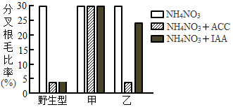

注：甲是蛋白M缺失的IAA不敏感型突变体，乙是蛋白N缺失的IAA不敏感型突变体；ACC是乙烯合成的前体；分叉根毛比率=分叉根毛数/总根毛数×100%。

下列叙述正确的是（ ）

A. 实验自变量是不同类型的拟南芥突变体、乙烯或IAA

B. 实验结果表明，IAA对根毛分叉的调节作用具有两重性

C. 高浓度 NH4NO3下，外源IAA对甲的根系保护效果比乙的好

D. 高浓度 NH4NO3下，蛋白M在乙烯和IAA抑制根毛分叉中发挥作用

【答案】D

【解析】

【分析】分析柱形图，对于野生型拟南芥幼苗而言，ACC和IAA都能抑制高浓度NH4NO2对野生型拟南芥幼苗的毒害作用；甲组缺失蛋白M，且对IAA不敏感，即使添加了ACC和IAA，也不能抵抗高浓度NH4NO2对拟南芥幼苗的毒害作用；乙组缺失蛋白N，对IAA不敏感，但添加了ACC能显著抵抗高浓度NH4NO2对拟南芥幼苗的毒害作用，而添加IAA抵抗效果不明显。

【详解】A、分析题意可知，本实验目的是研究高浓度NH4NO3下乙烯和生长素（IAA）在调节拟南芥幼苗根毛发育中的相互作用机制，结合题图可知，实验的自变量是拟南芥植株的类型、添加的试剂类型，A错误；

B、两重性是指高浓度促进，低浓度抑制，据图可知，在高浓度NH4NO3下，三组实验的添加IAA与不添加激素组相比，IAA调节三种类型的拟南芥幼苗根毛分叉的作用为抑制或不影响，没有促进作用，不能体现两重性，B错误；

C、分析题图可知，乙组的抑制根毛分叉的效果更明显，甲组几乎不起作用，故高浓度NH4NO3下，外源IAA对乙的根系保护效果比甲的好，C错误；

D、对比甲乙可知，高浓度下蛋白M缺失，乙烯和IAA完全不能抵抗高浓度NH4NO2对拟南芥幼苗的毒害作用，说明蛋白M在乙烯和IAA抑制根毛分叉中发挥作用，D正确。

故选D。

6\. 某哺乳动物的一个初级精母细胞的染色体示意图如下，图中A/a、B/b表示染色体上的两对等位基因。下列叙述错误的是（ ）

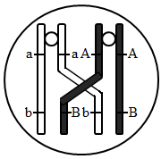

A. 该细胞发生的染色体行为是精子多样性形成的原因之一

B. 图中非姐妹染色单体发生交换，基因A和基因B发生了重组

C. 等位基因的分离可发生在减数第一次分裂和减数第二次分裂

D. 该细胞减数分裂完成后产生AB、aB、Ab、ab四种基因型的精细胞

【答案】B

【解析】

【分析】题图分析，细胞中的同源染色体上的非姐妹染色单体正在进行交换，发生于减数第一次分裂前期。

【详解】A、该细胞正在发生交叉互换，原来该细胞减数分裂只能产生AB和ab两种精细胞，经过交叉互换，可以产生AB、Ab、aB、ab四种精细胞，所以交叉互换是精子多样性形成的原因之一，A正确；

B、图中非姐妹染色单体发生交换，基因A和基因b，基因a和B发生了重组，B错误；

C、由于发生交叉互换，等位基因的分离可发生在减数第一次分裂和减数第二次分裂，C正确；

D、该细胞减数分裂完成后产生AB、aB、Ab、ab四种基因型的精细胞，且比例均等，D正确。

故选B。

7\. 曲线图是生物学研究中数学模型建构的一种表现形式。下图中的曲线可以表示相应生命活动变化关系的是（　　）

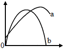

A. 曲线a可表示自然状态下，某植物CO2吸收速率随环境CO2浓度变化的关系

B. 曲线a可表示葡萄糖进入红细胞时，物质运输速率随膜两侧物质浓度差变化的关系

C. 曲线b可表示自然状态下，某池塘草鱼种群增长速率随时间变化的关系

D. 曲线b可表示在晴朗的白天，某作物净光合速率随光照强度变化的关系

【答案】C

【解析】

【分析】净光合速率等于光合作用的速率减去呼吸作用的速率，当夜晚或光照较弱等条件下，呼吸强于光合，净光合速率小于0。

【详解】A、自然状态下，环境CO2浓度变化情况，达不到抑制光合作用的程度，不可能造成曲线下降，不能用a曲线表示自然状态下，某植物CO2吸收速率随环境CO2浓度变化的关系，A错误；

B、葡萄糖以协助扩散的方式进入红细胞，膜两侧葡萄糖浓度差越大，运输速率越大，但是最终受到细胞膜上葡萄糖载体数量的限制，曲线达到最高点后维持水平，a曲线与其不符，B错误；

C、自然状态下，某池塘草鱼种群数量呈S形增长，其增长速率随时间变化先上升后下降至零，曲线b可表示其变化，C正确；

D、在晴朗的白天，某作物净光合速率随光照强度变化，清晨或傍晚可能小于零，b曲线与其不符，D错误。

故选C。

8\. 青蒿素是治疗疟疾的主要药物。疟原虫在红细胞内生长发育过程中吞食分解血红蛋白，吸收利用氨基酸，血红蛋白分解的其他产物会激活青蒿素，激活的青蒿素能杀死疟原虫。研究表明，疟原虫Kelch13蛋白因基因突变而活性降低时，疟原虫吞食血红蛋白减少，生长变缓。同时血红蛋白的分解产物减少，青蒿素无法被充分激活，疟原虫对青蒿素产生耐药性。下列叙述错误的是（ ）

A. 添加氨基酸可以帮助体外培养的耐药性疟原虫恢复正常生长

B. 疟原虫体内的Kelch13基因发生突变是青蒿素选择作用的结果

C. 在青蒿素存在情况下，Kelch13蛋白活性降低对疟原虫是一个有利变异

D. 在耐药性疟原虫体内补充表达Kelch13蛋白可以恢复疟原虫对青蒿素的敏感性

【答案】B

【解析】

【分析】基因突变是指DNA分子中发生碱基对的替换、增添和缺失，从而引起基因结构（基因碱基序列）的改变。

【详解】A、由题意可知，“疟原虫在红细胞内生长发育过程中吞食分解血红蛋白，吸收利用氨基酸”，耐药性的产生是由于基因突变后，疟原虫吞食血红蛋白减少，同时血红蛋白的分解产物减少而不能充分激活青蒿素，故添加氨基酸可以帮助体外培养的耐药性疟原虫恢复正常生长，A正确；

B、疟原虫体内的Kelch13基因发生突变是自发产生的，而基因突变是不定向的，自然选择的作用是选择并保存适应性变异，B错误；

C、分析题意可知，在青蒿素存在情况下，Kelch13蛋白活性降低后，疟原虫能通过一系列变化对青蒿素产生耐药性，适应青蒿素的环境，对疟原虫是一个有利变异，C正确；

D、Kelch13蛋白因基因突变而活性降低时，，青蒿素无法被充分激活，疟原虫对青蒿素产生耐药性，若在耐药性疟原虫体内补充表达Kelch13蛋白，疟原虫恢复正常吞食血红蛋白，血红蛋白分解产物增加，能恢复疟原虫对青蒿素的敏感性，D正确。

故选B。

9\. 无义突变是指基因中单个碱基替换导致出现终止密码子，肽链合成提前终止。科研人员成功合成了一种tRNA（sup—tRNA），能帮助A基因第401位碱基发生无义突变的成纤维细胞表达出完整的A蛋白。该 sup—tRNA对其他蛋白的表达影响不大。过程如下图。

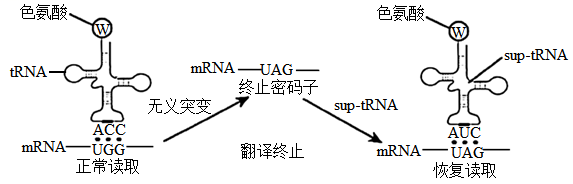

下列叙述正确的是（ ）

A. 基因模板链上色氨酸对应的位点由UGG突变为UAG

B. 该sup—tRNA修复了突变的基因A，从而逆转因无义突变造成的影响

C. 该sup—tRNA能用于逆转因单个碱基发生插入而引起的蛋白合成异常

D. 若A基因无义突变导致出现UGA，则此sup—tRNA无法帮助恢复读取

【答案】D

【解析】

【分析】转录：以DNA的一条链为模板，按照碱基互补配对原则合成mRNA的过程。

翻译：游离在细胞质中的各种氨基酸，以mRNA为模板合成具有一定氨基酸顺序的蛋白质的过程。

【详解】A、基因是有遗传效应DNA片段，DNA中不含碱基U，A错误；

B、由图可知，该sup-tRNA并没有修复突变的基因A，但是在sup-tRNA作用下，能在翻译过程中恢复读取，进而抵消因无义突变造成的影响，B错误；

C、由图可知，该sup-tRNA能用于逆转因单个碱基发生替换而引起的蛋白合成异常，C错误；

D、若A基因无义突变导致出现UGA，由于碱基互补原则，则此sup-tRNA只能帮助AUC恢复读取UAG，无法帮助UGA突变恢复读取，D正确。

故选D。

**二、非选择题**

10\. 栅藻是一种真核微藻，具有生长繁殖快、光合效率高、可产油脂等特点。为提高栅藻的培养效率和油脂含量，科研人员在最适温度下研究了液体悬浮培养和含水量不同的吸附式膜培养（如图1）对栅藻生长和产油量的影响，结果如图2。

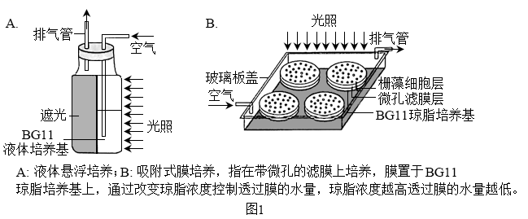

回答下列问题：

（1）实验中，悬浮培养和膜培养装置应给予相同的\_\_\_\_\_（答出2点即可）。

（2）为测定两种培养模式的栅藻光合速率，有人提出可以向装置中通入C18O2，培养一段时间后检测C18O2释放量。你认为该方法\_\_\_\_\_（填“可行”或“不可行”），理由是\_\_\_\_\_。

（3）由图2的结果可知，膜培养的栅藻虽然叶绿素含量较低，但膜培养仍具一定的优势，体现在 <u>①</u> 。结合图1，从影响光合效率因素的角度分析，膜培养具有这种优势的原因是 <u>②</u> 。

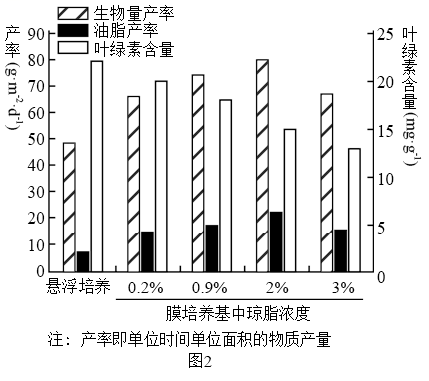

（4）根据图2的结果，对利用栅藻生产油脂的建议是\_\_\_\_\_。

【答案】（1）光照强度、通气量、接种量

（2） ①. 不可行 ②. C18O2中的18O经光合作用可转移到水中，生成物水参与呼吸作用可生成C18O2，释放的二氧化碳也有来自呼吸作用的，因此根据被标记的二氧化碳的减少量不能测定栅藻光合速率

（3） ①. 生物量(产率)和油脂产率较高 ②. 膜培养时栅藻更充分利用光照和CO2/膜培养时栅藻对光照和CO2利用率更高

（4）使用2%琼脂浓度培养基对应含水量的膜培养方式

【解析】

【分析】光合作用包括光反应和暗反应两个阶段，①光合作用的光反应阶段（场所是叶绿体的类囊体膜上）：水的光解产生NADPH与氧气，以及ATP的形成；②光合作用的暗反应阶段（场所是叶绿体的基质中）：CO2被C5固定形成C3，C3在光反应提供的ATP和NADPH的作用下还原生成糖类等有机物。

【小问1详解】

分析题意可知，本实验中科研人员在最适温度下研究了液体悬浮培养和含水量不同的吸附式膜培养，实验的自变量是含水量等不同，实验除了自变量，其他的无关变量要保持相同且适宜，所以悬浮培养和膜培养装置应给予相同的光照强度、通气量、接种量。

【小问2详解】

分析题意，本实验目的是测定两种培养模式的栅藻光合速率，由于C18O2经光合作用可转移到水中，生成物水参与呼吸作用可生成C18O2，释放的二氧化碳也有来自呼吸作用的，因此根据被标记的二氧化碳的减少量不能测定栅藻光合速率。

【小问3详解】

由图2结果可知，与悬浮培养相比，膜培养的栅藻生物量（产率）和油脂产率更高，可能是因为虽然膜培养的栅藻叶绿素含量较低，但栅藻更充分利用光照和CO2。

【小问4详解】

比较图2各组膜培养的栅藻，2%琼脂浓度培养基培养的栅藻油脂产率最高，所以建议对栅藻采用2%琼脂浓度培养基对应含水量的膜培养方式。

11\. 下丘脑通过整合来自循环系统的激素和消化系统的信号调节食欲，是食欲调节控制中心。下丘脑的食欲调节中枢能调节A神经元直接促进食欲。A神经元还能分泌神经递质GABA，调节B神经元。GABA的作用机制如图。回答下列问题：

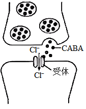

（1）下丘脑既是食欲调节中枢，也是\_\_\_\_\_调节中枢（答出1点即可）。

（2）据图分析，GABA与突触后膜的受体结合后，将引发突触后膜\_\_\_\_\_（填“兴奋”或“抑制”），理由是\_\_\_\_\_。

（3）科研人员把小鼠的A神经元剔除，将GABA受体激动剂（可代替GABA直接激活相应受体）注射至小鼠的B神经元区域，能促进摄食。据此可判断B神经元在食欲调节中的功能是\_\_\_\_\_。

（4）科研人员用不同剂量的GABA对小鼠灌胃，发现30 mg·kg-1 GABA能有效促进小鼠的食欲，表明外源的GABA被肠道吸收后也能调节食欲。有人推测外源GABA信号是通过肠道的迷走神经上传到下丘脑继而调节小鼠的食欲。请在上述实验的基础上另设4个组别，验证推测。

①完善实验思路：将生理状态相同的小鼠随机均分成4组。

A组：灌胃生理盐水；

B组：假手术 ＋ 灌胃生理盐水；

C组：假手术 ＋ \_\_\_\_\_；

D组：\_\_\_\_\_＋\_\_\_\_\_；

（说明：假手术是指暴露小鼠腹腔后再缝合。手术后的小鼠均需恢复后再与其他组同时处理。）

连续处理一段时间，测定并比较各组小鼠的摄食量。

②预期结果与结论：若\_\_\_\_\_，则推测成立。

【答案】（1）体温/水平衡

（2） ①. 抑制 ②. GABA与突触后膜上的受体结合后，引起Cl-内流，静息电位的绝对值增大

（3）抑制食欲/抑制摄食量

（4） ①. ①灌胃30mg•kg-1GABA ②. 切断迷走神经 ③. 灌胃30mg•kg-1GABA ④. A组小鼠摄食量与B组差异不明显，C组小鼠的摄食量比B组高，D组小鼠的摄食量比C组低

【解析】

【分析】1.下丘脑的功能：

①感受：渗透压感受器感受渗透压升降，维持水分代谢平衡。

②传导：可将渗透压感受器产生的兴奋传导至大脑皮层，使之产生渴觉。

③分泌：分泌促激素释放激素，作用于垂体，使之分泌相应的促激素。在外界环境温度低时分泌促甲状腺激素释放激素，在细胞外波渗透压升高时促使垂体分泌抗利尿激素。

④调节，下丘脑中有体温调节中枢、血糖调节中枢、渗透压调节中枢。

2.兴奋在神经纤维上的传导形式是电信号，兴奋在神经元之间的传递是电信号-化学信号-电信号；兴奋在神经纤维上的传导是双向的，在神经元之间的传递是单向的

【小问1详解】

下丘脑既食欲调节中枢，也是体温调节中枢、血糖调节中枢、水平衡调节中枢。

【小问2详解】

由图可知，GABA与突触后膜上的受体结合后，引起Cl-内流，静息电位的绝对值增大，更难兴奋，所以使突触后膜受抑制。

【小问3详解】

由题意可知，（A神经元的）突触前膜释放GABA，突触后膜（B神经元）受抑制；若注射GABA受体激动剂作用于B神经元，B神经元被激活且受到抑制，能促进小鼠摄食，说明B神经元在食欲调节中的作用是抑制小鼠食欲。

【小问4详解】

本实验的目的是验证外源GABA信号是通过肠道的迷走神经上传到下丘脑继而调节小鼠的食欲，因此实验的自变量是信号通路是否被阻断，因变量是食欲变化，据此做出判断：C组与B组对照，单一变量是有无灌胃30mg•kg-1GABA，验证GABA的作用；D组与C组对照，单一变量为是否切断迷走神经，即验证外源GABA信号是通过肠道的迷走神经上传到下丘脑继而调节小鼠的食欲，对实验结果进行两两比较。若最终A组小鼠的摄食量与B组差异不明显，C组小鼠的摄食量比B组高，D组小鼠的摄食量比C组低，则说明外源 GABA 信号是通过肠道的迷走神经上传到下丘脑继而调节小鼠的食欲。

12\. 7S球蛋白是大豆最主要的过敏原蛋白，三种大豆脂氧酶Lox-1，2，3是大豆产生腥臭味的原因。大豆食品深加工过程中需要去除7S球蛋白和三种脂氧酶。科研人员为获得7S球蛋白与三种脂氧酶同时缺失的大豆新品种，将7S球蛋白缺失的大豆植株与脂氧酶完全缺失的植株杂交，获得F1种子。F1植株自交得到F2种子。对F1种子和F2种子的7S球蛋白和脂氧酶进行蛋白质电泳检测，不同表现型的电泳条带示意如下图。

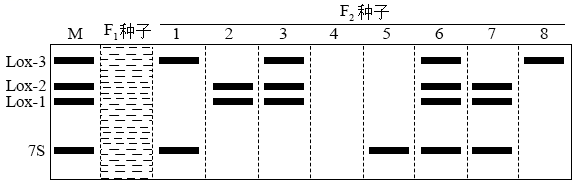

注：图中黑色条带为抗原一抗体杂交带，表示相应蛋白质的存在。M泳道条带为相应标准蛋白所在位置，F1种子泳道的条带待填写。

根据电泳检测的结果，对F2种子表现型进行分类统计如下表。

<table style="width:51%;">
<colgroup>
<col style="width: 21%" />
<col style="width: 23%" />
<col style="width: 6%" />
</colgroup>
<tbody>
<tr>
<td colspan="2" style="text-align: left;">F2种子表现型</td>
<td style="text-align: left;">粒数</td>
</tr>
<tr>
<td rowspan="2" style="text-align: left;">7S球蛋白</td>
<td style="text-align: left;">野生型</td>
<td style="text-align: left;">124</td>
</tr>
<tr>
<td style="text-align: left;">7S球蛋白缺失型</td>
<td style="text-align: left;">377</td>
</tr>
<tr>
<td rowspan="4" style="text-align: left;">脂氧酶Lox-1，2，3</td>
<td style="text-align: left;">野生型</td>
<td style="text-align: left;">282</td>
</tr>
<tr>
<td style="text-align: left;">①</td>
<td style="text-align: left;">94</td>
</tr>
<tr>
<td style="text-align: left;">②</td>
<td style="text-align: left;">94</td>
</tr>
<tr>
<td style="text-align: left;">Lox-1，2，3全缺失型</td>
<td style="text-align: left;">31</td>
</tr>
</tbody>
</table>

回答下列问题：

（1）7S球蛋白缺失型属于\_\_\_\_\_（填“显性”或“隐性”）性状。

（2）表中①②的表现型分别是\_\_\_\_\_、\_\_\_\_\_。脂氧酶 Lox—1，2，3分别由三对等位基因控制，在脂氧酶是否缺失的性状上，F2种子表现型只有四种，原因是\_\_\_\_\_。

（3）在答题卡对应的图中画出F1种子表现型的电泳条带\_\_\_\_\_。

（4）已知Lox基因和7S球蛋白基因独立遗传。图中第\_\_\_\_\_泳道的种子表现型为7S球蛋白与三种脂氧酶同时缺失型，这些种子在F2中的比例是\_\_\_\_\_。利用这些种子选择并获得稳定遗传种子的方法是\_\_\_\_\_。

（5）为提高大豆品质，利用基因工程方法提出一个消除野生型大豆7S球蛋白过敏原的设想。\_\_\_\_\_

【答案】（1）显性 （2） ①. Lox-1，2缺失型 ②. 7S球蛋白、Lox-3缺失型 ③. 控制Lox-1，2的基因在同一对同源染色体上并且不发生互换，控制Lox-3的基因位于另一对同源染色体上

（3）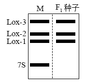 （4） ①. 4 ②. 3/64 ③. 将这些种子长成的植株自交，对单株所得的所有种子进行蛋白质电泳检测，若某植株所有种子均不出现7S球蛋白条带，则该植株的种子能稳定遗传

（5）敲除7S球蛋白基因/导入7S球蛋白的反义基因，使7S球蛋白不能合成

【解析】

【分析】1、基因自由组合定律的实质是:位于非同源染色体上的非等位基因的分离或自由组合是互不干扰的;在减数分裂过程中，同源染色体上的等位基因彼此分离的同时，非同源染色体上的非等位基因自由组合。

2、分析电泳图时，可参考M泳道，与M泳道中相同蛋白质位于同一水平位置的，即表示能分离得到该蛋白质。

【小问1详解】

由题意可知，将7S球蛋白缺失的大豆植株与脂氧酶完全缺失的植株杂交，获得F1种子，F1植株自交得到F2种子，由表中数据可知，F2种子中7S球蛋白缺失型与野生型的比例为3：1，可知7S球蛋白缺失型为显性性状。

【小问2详解】

表中①②表现型需结合杂交过程、表格中性状分离比及电泳条带分析，据电泳条带示意图可是，一共有四种类型：F2种子中泳道3和6表现为野生型，泳道4和5表现为Lox-1，2，3全缺失型，泳道1和8表现为Lox-1，2缺失型，泳道2和7表现为Lox-3缺失型，Lox-1，2始终表现在一起，说明控制脂氧酶Lox-1，2的基因位于一条染色体上，故图中的①②的表现型应为Lox-1，2缺失型、7S蛋白、Lox-3缺失型；脂氧酶由三对等位基因控制，F2种子在脂氧酶的性状上表现型只有四种，结合表中四种表现型比例为9：3：3：1，说明控制Lox-1，2的两对等位基因在同一对同源染色体上并且不发生互换，控制Lox-3的一对等位基因位于另一对同源染色体上。

【小问3详解】

根据题中的杂交育种过程分析，F1应为杂合子，表现出显性性状7S球蛋白缺失型及脂氧酶Lox-1，2，3野生型，电泳条带应为仅有Lox-1，2，3三条电泳条带，故可绘制电泳图如下：

 【小问4详解】

由电泳图可知，第4泳道没有电泳条带，说明其种子表现型为7S球蛋白缺失型与Lox-1，2，3全缺失型；由表格数据可知，7S球蛋白缺失型占3/4，Lox-1，2，3全缺失型占1/16，结合（1）结论，这些种子在F2中的比例是3/4×1/16=3/64；利用这些种子选择并获得稳定遗传种子的方法是：将这些种子长成的植株自交，对单株所得的所有种子进行蛋白质电泳检测，若某植株所有种子均不出现7S球蛋白条带，则该植株的种子能稳定遗传。

【小问5详解】

利用基因工程方法，消除野生型大豆7S球蛋白条带过敏原，以提高大豆品质，可从7S球蛋白基因不存在或不表达方向思考，如敲除7S球蛋白基因或导入7S球蛋白基因的反义基因。

13\. 美西螈具有很强的再生能力。研究表明，美西螈的巨噬细胞在断肢再生的早期起重要作用。为研究巨噬细胞的作用机制，科研人员制备了抗巨噬细胞表面标志蛋白CD14的单克隆抗体，具体方法如下。回答下列问题：

（一）基因工程抗原的制备

（1）根据美西螈CD14基因的核苷酸序列，合成引物，利用PCR扩增CD14片段。已知DNA聚合酶催化引物的3’—OH与加入的脱氧核苷酸的5’—P形成磷酸二酯键，则新合成链的延伸方向是\_\_\_\_\_（填“ 5’→3’ ”或“ 3’→5’ ”）。

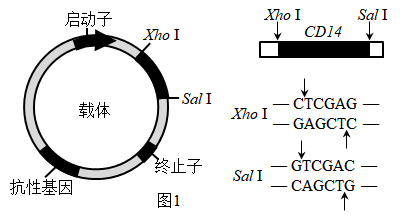

（2）载体和CD14片段的酶切位点及相应的酶切 抗性基因序列如图1所示。用Xho I和Sal 1分别酶切CD14和载体后连接，CD14接入载体时会形成正向连接和反向连接的两种重组DNA．可进一步用这两种限制酶对CD14的连接方向进行鉴定，理由是\_\_\_\_\_。

培养能表达CD14蛋白的大肠杆菌，分离纯化目的蛋白。

（二）抗CD14单克隆抗体的制备流程如图2所示：

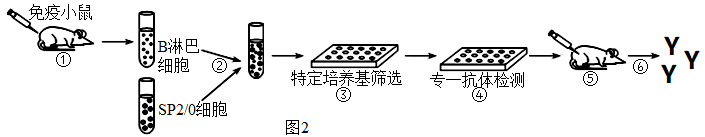

（3）步骤①和步骤⑤分别向小鼠注射\_\_\_\_\_和\_\_\_\_\_。

（4）步骤②所用的SP2/0细胞的生长特点是\_\_\_\_\_。

（5）吸取③中的上清液到④的培养孔中，根据抗原—抗体杂交原理，需加入 <u>①</u> 进行专一抗体检测，检测过程发现有些杂交瘤细胞不能分泌抗CD14抗体，原因是 <u>②</u> 。

（6）步骤⑥从\_\_\_\_\_中提取到大量的抗CD14抗体，用于检测巨噬细胞。

【答案】（1）5'→3'

（2）正向连接的重组DNA有这两种酶切位点（限制酶的识别序列）；而反向连接的重组DNA会形成新的序列，没有这两种酶的酶切位点（没有限制酶的识别序列）

（3） ①. CD14蛋白/CD14抗原 ②. 分泌抗CD14抗体的杂交瘤细胞 （4）能在体外无限增殖

（5） ①. CD14蛋白 ②. 参与形成杂交瘤细胞的B淋巴细胞种类多，有的不能分泌抗CD14抗体 （6）小鼠腹水

【解析】

【分析】1、PCR原理：在解旋酶作用下，打开DNA双链，每条DNA单链作为母链，以4种游离脱氧核苷酸为原料，合成子链，在引物作用下，DNA聚合酶从引物3'端开始延伸DNA链，即DNA的合成方向是从子链的5'端自3'端延伸的。实际上就是在体外模拟细胞内DNA的复制过程。DNA的复制需要引物，其主要原因是DNA聚合酶只能从3′端延伸DNA链。

2、单克隆抗体制备流程：先给小鼠注射特定抗原使之发生免疫反应，之后从小鼠脾脏中获取已经免疫的B淋巴细胞；诱导B细胞和骨髓瘤细胞融合，利用选择培养基筛选出杂交瘤细胞；进行抗体检测，筛选出能产生特定抗体的杂交瘤细胞；进行克隆化培养，即用培养基培养和注入小鼠腹腔中培养；最后从培养液或小鼠腹水中获取单克隆抗体。

【小问1详解】

PCR扩增时，DNA聚合酶催化引物的3'-OH与加入的脱氧核苷酸的5'-P形成磷酸二酯键，因此新链合成的方向是从5'→3'。

【小问2详解】

可进一步用限制酶XhoⅠ和SalⅠ对CD14的连接方向进行鉴定，是因为正向连接的重组DNA有这两种酶切位点（限制酶的识别序列）；而反向连接的重组DNA会形成新的序列，没有这两种酶的酶切位点（没有限制酶的识别序列）。

【小问3详解】

步骤①是注射特定抗原，针对本实验目的可知，要获得抗CD14单克隆抗体，故应该注射CD14蛋白/CD14抗原；步骤⑤是将分泌抗CD14抗体的杂交瘤细胞注入小鼠体内培养，以获得大量单克隆抗体。

【小问4详解】

步骤②所用的SP2/0细胞是骨髓瘤细胞，特点是能在体外无限增殖。

【小问5详解】

根据抗原—抗体杂交原理，应该用CD14蛋白检测其中是否含抗CD14蛋白的抗体。因为形成杂交瘤细胞的B淋巴细胞种类很多，因此有些杂交瘤细胞不能分泌抗CD14抗体。

【小问6详解】

从制备单克隆抗体的流程可知，将杂交瘤细胞注射到小鼠腹腔后，最终要从小鼠的腹水中提取抗CD14抗体。
