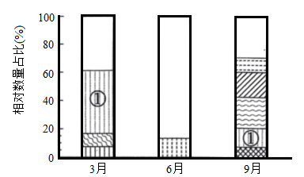
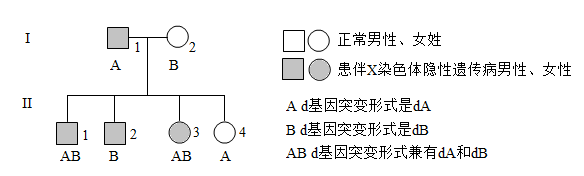
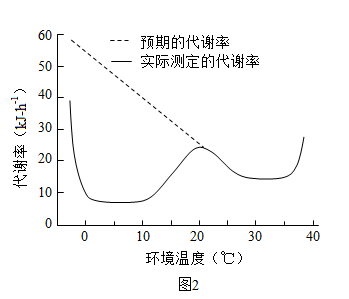
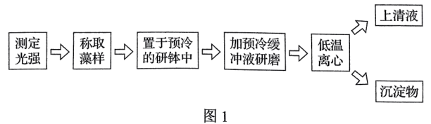
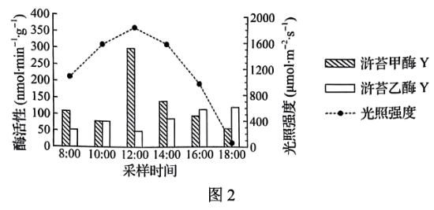

**2022年辽宁省普通高等学校招生选择性考试**

**生物学**

**一、选择题：**

1\. 下列关于硝化细菌的叙述，错误的是（ ）

A. 可以发生基因突变 B. 在核糖体合成蛋白质

C. 可以进行有丝分裂 D. 能以CO2作为碳源

2\. “一粥一饭，当思来之不易；半丝半缕，恒念物力维艰”体现了日常生活中减少生态足迹的理念，下列选项中都能减少生态足迹的是（ ）

①光盘行动②自驾旅游③高效农业④桑基鱼塘⑤一次性餐具使用⑥秸秆焚烧

A. ①③④ B. ①④⑥ C. ②③⑤ D. ②⑤⑥

3\. 下列关于生物进化和生物多样性的叙述，错误的是（ ）

A. 通过杂交育种技术培育出许多水稻新品种，增加了水稻的遗传多样性

B. 人类与黑猩猩基因组序列高度相似，说明人类从黑猩猩进化而来

C. 新物种的形成意味着生物类型和适应方式的增多

D. 生物之间既相互依存又相互制约，生物多样性是协同进化的结果

4\. 选用合适的实验材料对生物科学研究至关重要。下表对教材中相关研究的叙述，错误的是（ ）

|     |       |                                                                                                            |
|:---:|:-----:|:----------------------------------------------------------------------------------------------------------:|
| 选项  | 实验材料  | 生物学研究                                                                                                      |
| A   | 小球藻   | 卡尔文循环                                                                                                      |
| B   | 肺炎链球菌 | DNA半保留复制                                                                                                   |
| C   | 枪乌贼   | 动作电位原理                                                                                                     |
| D   | T2噬菌体 | DNA遗传物质 |

A. A B. B C. C D. D

5\. 下列关于神经系统结构和功能的叙述，正确的是（ ）

A. 大脑皮层H区病变的人，不能看懂文字

B. 手的运动受大脑皮层中央前回下部的调控

C. 条件反射的消退不需要大脑皮层的参与

D. 紧张、焦虑等可能抑制成人脑中的神经发生

6\. 为研究中医名方—柴胡疏肝散对功能性消化不良大鼠胃排空（胃内容物进入小肠）的作用，科研人员设置4组实验，测得大鼠胃排空率见下表。下列叙述错误的是（ ）

|        |            |         |
|:------:|:----------:|:-------:|
| 组别     | 状态         | 胃排空率（%） |
| 正常组    | 健康大鼠       | 55.80   |
| 模型组    | 患病大鼠未给药    | 38.65   |
| 柴胡疏肝散组 | 患病大鼠+柴胡疏肝散 | 51.12   |
| 药物A组   | 患病大鼠+药物A   | 49.92   |

注：药物A为治疗功能性消化不良的常用药物

A. 与正常组相比，模型组大鼠胃排空率明显降低

B. 正常组能对比反映出给药组大鼠恢复胃排空的程度

C. 与正常组相比，柴胡疏肝散具有促进胃排空的作用

D. 柴胡疏肝散与药物A对患病大鼠促进胃排空的效果相似

7\. 下列关于人体免疫系统功能的叙述，错误的是（ ）

A. 抗体能消灭细胞外液中的病原体，细胞毒性T细胞能消灭侵入细胞内的病原体

B. 首次感染新的病原体时，B细胞在辅助性T细胞的辅助下才能被活化

C. 若免疫监视功能低下，机体会有持续的病毒感染或肿瘤发生

D. “预防”胜于“治疗”，保持机体正常的免疫功能对抵抗疾病非常重要

8\. 二甲基亚砜（DMSO）易与水分子结合，常用作细胞冻存的渗透性保护剂。干细胞冻存复苏后指标检测结果见下表。下列叙述错误的是（ ）

<table style="width:86%;">
<colgroup>
<col style="width: 30%" />
<col style="width: 24%" />
<col style="width: 30%" />
</colgroup>
<tbody>
<tr>
<td style="text-align: right;">
冻存剂

指标
</td>
<td style="text-align: center;">合成培养基+DMSO</td>
<td style="text-align: center;">合成培养基+DMSO+血清</td>
</tr>
<tr>
<td style="text-align: center;">G1期细胞数百分比（%）</td>
<td style="text-align: center;">65.78</td>
<td style="text-align: center;">79.85</td>
</tr>
<tr>
<td style="text-align: center;">活细胞数百分比（%）</td>
<td style="text-align: center;">15.29</td>
<td style="text-align: center;">41.33</td>
</tr>
</tbody>
</table>

注：细胞分裂间期分为G1期、S期（DNA复制期）和G2期

A. 冻存复苏后的干细胞可以用于治疗人类某些疾病

B. G1期细胞数百分比上升，导致更多干细胞直接进入分裂期

C. 血清中的天然成分影响G1期，增加干细胞复苏后的活细胞数百分比

D. DMSO的作用是使干细胞中自由水转化为结合水

9\. 水通道蛋白（AQP）是一类细胞膜通道蛋白。检测人睡液腺正常组织和水肿组织中3种AQP基因mRNA含量，发现AQP1和AQP3基因mRNA含量无变化，而水肿组织AQP5基因mRNA含量是正常组织的2.5倍。下列叙述正确的是（ ）

A. 人唾液腺正常组织细胞中AQP蛋白的氨基酸序列相同

B. AQP蛋白与水分子可逆结合，转运水进出细胞不需要消耗ATP

C. 检测结果表明，只有AQP5蛋白参与人唾液腺水肿的形成

D. 正常组织与水肿组织的水转运速率不同，与AQP蛋白的数量有关

10\. 亚麻籽可以榨油，茎秆可以生产纤维。在亚麻生长季节，北方比南方日照时间长，亚麻开花与昼夜长短有关，只有白天短于一定的时长才能开花。赤霉素可以促进植物伸长生长，但对亚麻成花没有影响。烯效唑可抑制植物体内赤霉素的合成。下列在黑龙江省栽培亚麻的叙述，正确的是（ ）

A. 适当使用烯效唑，以同时生产亚麻籽和亚麻纤维

B. 适当使用赤霉素，以同时生产亚麻籽和亚麻纤维

C. 适当使用赤霉素，以提高亚麻纤维产量

D 适当使用烯效唑，以提高亚麻籽产量

11\. 人工草坪物种比较单一，易受外界因素的影响而杂草化。双子叶植物欧亚蔊菜是常见的草坪杂草。下列叙述错误的是（ ）

A. 采用样方法调查草坪中欧亚蔊菜种群密度时，随机取样是关键

B. 喷施高浓度的2，4-D可以杀死草坪中的欧亚蔊菜

C. 欧亚蔊菜入侵人工草坪初期，种群增长曲线呈“S”形

D. 与自然草地相比，人工草坪自我维持结构和功能相对稳定能力较低

12\. 抗虫和耐除草剂玉米双抗12-5是我国自主研发的转基因品种。为给监管转基因生物安全提供依据，采用PC方法进行目的基因监测，反应程序如图所示。下列叙述正确的是（ ）

A. 预变性过程可促进模板DNA边解旋边复制

B. 后延伸过程可使目的基因的扩增更加充分

C. 延伸过程无需引物参与即可完成半保留复制

D. 转基因品种经检测含有目的基因后即可上市

13\. 采用样线法（以一定的速度沿样线前进，同时记录样线两侧一定距离内鸟类的种类及数量）对某地城市公园中鸟类多样性进行调查，结果见下表。下列分析不合理的是（ ）

|        |     |      |      |      |
|:------:|:---:|:----:|:----:|:----:|
| 城市公园类型 | 植物园 | 森林公园 | 湿地公园 | 山体公园 |
| 物种数量   | 41  | 52   | 63   | 38   |

A. 植物园为鸟类提供易地保护的生存空间，一定程度上增加了鸟类物种多样性

B. 森林公园群落结构复杂，能够满足多种鸟类对栖息地的要求，鸟类种类较多

C. 湿地公园为鸟类提供丰富的食物及相对隐蔽的栖息场所，鸟类种类最多

D. 山体公园由于生境碎片化及人类活动频繁的干扰，鸟类物种数量最少

14\. 蓝莓细胞富含花青素等多酚类化合物。在蓝莓组织培养过程中，外植体切口处细胞被破坏，多酚类化合物被氧化成褐色醌类化合物，这一过程称为褐变。褐变会引起细胞生长停滞甚至死亡，导致蓝莓组织培养失败。下列叙述错误的是（ ）

A. 花青素通常存在于蓝莓细胞的液泡中

B. 适当增加培养物转移至新鲜培养基的频率以减少褐变

C. 在培养基中添加合适的抗氧化剂以减少褐变

D. 宜选用蓝莓成熟叶片为材料制备外植体

15\. 为避免航天器在执行载人航天任务时出现微生物污染风险，需要对航天器及洁净的组装车间进行环境微生物检测。下列叙述错误的是（ ）

A. 航天器上存在适应营养物质匮乏等环境的极端微生物

B. 细菌形成菌膜粘附于航天器设备表面产生生物腐蚀

C. 在组装车间地面和设备表面采集环境微生物样品

D 采用平板划线法等分离培养微生物，观察菌落特征

**二、选择题：**

16\. 视网膜病变是糖尿病常见并发症之一。高血糖环境中，在DNA甲基转移酶催化下，部分胞嘧啶加上活化的甲基被修饰为5'-甲基胞嘧啶，使视网膜细胞线粒体DNA碱基甲基化水平升高，可引起视网膜细胞线粒体损伤和功能异常。下列叙述正确的是（ ）

A. 线粒体DNA甲基化水平升高，可抑制相关基因的表达

B. 高血糖环境中，线粒体DNA在复制时也遵循碱基互补配对原则

C. 高血糖环境引起的甲基化修饰改变了患者线粒体DNA碱基序列

D. 糖尿病患者线粒体DNA高甲基化水平可遗传

17\. Fe3+通过运铁蛋白与受体结合被输入哺乳动物生长细胞，最终以Fe2+形式进入细胞质基质，相关过程如图所示。细胞内若Fe2+过多会引发膜脂质过氧化，导致细胞发生铁依赖的程序性死亡，称为铁死亡。下列叙述正确的是（ ）

注：早期内体和晚期内体是溶酶体形成前的结构形式

A. 铁死亡和细胞自噬都受基因调控

B. 运铁蛋白结合与释放Fe3+的环境pH不同

C. 细胞膜的脂质过氧化会导致膜流动性降低

D. 运铁蛋白携带Fe3+进入细胞不需要消耗能量

18\. β-苯乙醇是赋予白酒特征风味的物质。从某酒厂采集并筛选到一株产β-苯乙醇的酵母菌应用于白酒生产。下列叙述正确的是（ ）

A. 所用培养基及接种工具分别采用湿热灭菌和灼烧灭菌

B. 通过配制培养基、灭菌、分离和培养能获得该酵母菌

C. 还需进行发酵实验检测该酵母菌产β-苯乙醇的能力

D. 该酵母菌的应用有利于白酒新产品的开发

19\. 底栖硅藻是河口泥滩潮间带生态系统中的生产者，为底栖动物提供食物。调查分析某河口底栖硅藻群落随季节变化优势种（相对数量占比\>5%）的分布特征，结果如下图。下列叙述错误的是（ ）

注：不同条纹代表不同优势种：空白代表除优势种外的其他底栖硅藻；不同条纹柱高代表每个优势种的相对数量占比

A. 底栖硅藻群落的季节性变化主要体现在优势种的种类和数量变化

B. 影响优势种①从3月到9月数量变化的生物因素包含捕食和竞争

C. 春季和秋季物种丰富度高于夏季，是温度变化影响的结果

D. 底栖硅藻固定的能量是流经河口泥滩潮间带生态系统的总能量

20\. 某伴X染色体隐性遗传病的系谱图如下，基因检测发现致病基因d有两种突变形式，记作dA与dB。Ⅱ1还患有先天性睾丸发育不全综合征（性染色体组成为XXY）。不考虑新的基因突变和染色体变异，下列分析正确的是（ ）

A. Ⅱ1性染色体异常，是因为Ⅰ1减数分裂Ⅱ时X染色体与Y染色体不分离

B. Ⅱ2与正常女性婚配，所生子女患有该伴X染色体隐性遗传病的概率是1/2

C. Ⅱ3与正常男性婚配，所生儿子患有该伴X染色体隐性遗传病

D. Ⅱ4与正常男性婚配，所生子女不患该伴X染色体隐性遗传病

**三、非选择题：**

21\. 小熊猫是我国二级重点保护野生动物，其主要分布区年气温一般在0～25℃之间。测定小熊猫在不同环境温度下静止时的体温、皮肤温度（图1），以及代谢率（即产热速率，图2）。回答下列问题：

（1）由图1可见，在环境温度0~30℃范围内，小熊猫的体温\_\_\_\_\_\_\_\_\_\_\_，皮肤温度随环境温度降低而降低，这是在\_\_\_\_\_\_\_\_\_\_\_调节方式下，平衡产热与散热的结果。皮肤散热的主要方式包括\_\_\_\_\_\_\_\_\_\_\_（答出两点即可）。

（2）图2中，在环境温度由20℃降至10℃的过程中，小熊猫代谢率下降，其中散热的神经调节路径是：皮肤中的\_\_\_\_\_\_\_\_\_\_\_受到环境低温刺激产生兴奋，兴奋沿传入神经传递到位于\_\_\_\_\_\_\_\_\_\_\_的体温调节中枢，通过中枢的分析、综合，使支配血管的\_\_\_\_\_\_\_\_\_\_\_（填“交感神经”或“副交感神经”）兴奋，引起外周血管收缩，皮肤和四肢血流量减少，以减少散热。

（3）图2中，当环境温度下降到0℃以下时，从激素调节角度分析小熊猫产热剧增的原因是\_\_\_\_\_\_\_\_\_\_\_。

（4）通常通过检测尿液中类固醇类激素皮质醇的含量，评估动物园圈养小熊猫的福利情况。皮质醇的分泌是由\_\_\_\_\_\_\_\_\_\_\_轴调节的。使用尿液而不用血液检测皮质醇，是因为血液中的皮质醇可以通过\_\_\_\_\_\_\_\_\_\_\_进入尿液，而且也能避免取血对小熊猫的伤害。

22\. 浒苔是形成绿潮的主要藻类。绿潮时浒苔堆积在一起，形成大量的“藻席”，造成生态灾害。为研究浒苔疯长与光合作用的关系，进行如下实验：

Ⅰ．光合色素的提取、分离和含量测定

（1）在“藻席”的上、中、下层分别选取浒苔甲为实验材料，提取、分离色素，发现浒苔甲的光合色素种类与高等植物相同，包括叶绿素和\_\_\_\_\_\_\_\_\_\_\_。在细胞中，这些光合色素分布在\_\_\_\_\_\_\_\_\_\_\_。

（2）测定三个样品的叶绿素含量，结果见下表。

|     |                         |                         |
|:---:|:-----------------------:|:-----------------------:|
| 样品  | 叶绿素a（mg·g-1） | 叶绿素b（mg·g-1） |
| 上层  | 0.199                   | 0.123                   |
| 中层  | 0.228                   | 0.123                   |
| 下层  | 0.684                   | 0.453                   |

数据表明，取自“藻席”下层的样品叶绿素含量最高，这是因为\_\_\_\_\_\_\_\_\_\_\_。

Ⅱ．光合作用关键酶Y的粗酶液制备和活性测定

（3）研究发现，浒苔细胞质基质中存在酶Y，参与CO2的转运过程，利于对碳的固定。

酶Y粗酶液制备：定时测定光照强度并取一定量的浒苔甲和浒苔乙，制备不同光照强度下样品的粗酶液，流程如图1。

粗酶液制备过程保持低温，目的是防止酶降解和\_\_\_\_\_\_\_\_\_\_\_。研磨时加入缓冲液的主要作用是\_\_\_\_\_\_\_\_\_\_\_稳定。离心后的\_\_\_\_\_\_\_\_\_\_\_为粗酶液。

（4）酶Y活性测定：取一定量的粗酶液加入到酶Y活性测试反应液中进行检测，结果如图2。

在图2中，不考虑其他因素的影响，浒苔甲酶Y活性最高时的光照强度为\_\_\_\_\_\_\_\_\_\_\_μmol·m-2·s-1（填具体数字），强光照会\_\_\_\_\_\_\_\_\_\_\_浒苔乙酶Y的活性。

23\. 碳达峰和碳中和目标的提出是构建人类命运共同体的时代要求，增加碳存储是实现碳中和的重要举措。被海洋捕获的碳称为蓝碳，滨海湿地是海岸带蓝碳生态系统的主体。回答下列问题：

（1）碳存储离不开碳循环。生态系统碳循环是指组成生物体的碳元素在\_\_\_\_\_\_\_\_\_\_\_和\_\_\_\_\_\_\_\_\_\_\_之间循环往复的过程。

（2）滨海湿地单位面积的碳埋藏速率是陆地生态系统的15倍，主要原因是湿地中饱和水环境使土壤微生物处于\_\_\_\_\_\_\_\_\_\_\_条件，导致土壤有机质分解速率\_\_\_\_\_\_\_\_\_\_\_。

（3）为促进受损湿地的次生演替，提高湿地蓝碳储量，辽宁省实施“退养还湿”生态修复工程（如图1）。该工程应遵循\_\_\_\_\_\_\_\_\_\_\_（答出两点即可）生态学基本原理，根据物种在湿地群落中的\_\_\_\_\_\_\_\_\_\_\_差异，适时补种适宜的物种，以加快群落演替速度。

（4）测定盐沼湿地不同植物群落的碳储量，发现翅碱蓬阶段为180.5kg·hm-2、芦苇阶段为3367.2kg·hm-2，说明在\_\_\_\_\_\_\_\_\_\_\_的不同阶段，盐沼湿地植被的碳储量差异很大。

（5）图2是盐沼湿地中两种主要植物翅碱蓬、芦苇的示意图。据图分析可知，对促进海岸滩涂淤积，增加盐沼湿地面积贡献度高的植物是\_\_\_\_\_\_\_\_\_\_\_，原因是\_\_\_\_\_\_\_\_\_\_\_。

24\. 某抗膜蛋白治疗性抗体药物研发过程中，需要表达N蛋白胞外段，制备相应的单克隆抗体，增加其对N蛋白胞外段特异性结合的能力。

Ⅰ．N蛋白胞外段抗原制备，流程如图1

（1）构建重组慢病毒质粒时，选用氨苄青霉素抗性基因作为标记基因，目的是\_\_\_\_\_\_\_\_\_\_\_。用脂质体将重组慢病毒质粒与辅助质粒导入病毒包装细胞，质粒被包在脂质体\_\_\_\_\_\_\_\_\_\_\_（填“双分子层中”或“两层磷脂分子之间”）。

（2）质粒在包装细胞内组装出由\_\_\_\_\_\_\_\_\_\_\_组成的慢病毒，用慢病毒感染海拉细胞进而表达并分离、纯化N蛋白胞外段。

Ⅱ．N蛋白胞外段单克隆抗体制备，流程如图2

（3）用N蛋白胞外段作为抗原对小鼠进行免疫后，取小鼠脾组织用\_\_\_\_\_\_\_\_\_\_\_酶处理，制成细胞悬液，置于含有混合气体的\_\_\_\_\_\_\_\_\_\_\_中培养，离心收集小鼠的B淋巴细胞，与骨髓瘤细胞进行融合。

（4）用选择性培养基对融合后的细胞进行筛选，获得杂交瘤细胞，将其接种到96孔板，进行\_\_\_\_\_\_\_\_\_\_\_培养。用\_\_\_\_\_\_\_\_\_\_\_技术检测每孔中的抗体，筛选既能产生N蛋白胞外段抗体，又能大量增殖的单克隆杂交瘤细胞株，经体外扩大培养，收集\_\_\_\_\_\_\_\_\_\_\_，提取单克隆抗体。

（5）利用N蛋白胞外段抗体与药物结合，形成\_\_\_\_\_\_\_\_\_\_\_，实现特异性治疗。

25\. 某雌雄同株二倍体观赏花卉的抗软腐病与易感软腐病（以下简称“抗病”与“易感病”）由基因R/r控制，花瓣的斑点与非斑点由基因Y/y控制。为研究这两对相对性状的遗传特点，进行系列杂交实验，结果见下表。

<table>
<colgroup>
<col style="width: 7%" />
<col style="width: 31%" />
<col style="width: 15%" />
<col style="width: 12%" />
<col style="width: 17%" />
<col style="width: 15%" />
</colgroup>
<tbody>
<tr>
<td rowspan="2" style="text-align: center;">组别</td>
<td rowspan="2" style="text-align: center;">亲本杂交组合</td>
<td colspan="4" style="text-align: center;">F1表型及数量</td>
</tr>
<tr>
<td style="text-align: center;">抗病非斑点</td>
<td style="text-align: center;">抗病斑点</td>
<td style="text-align: center;">易感病非斑点</td>
<td style="text-align: center;">易感病斑点</td>
</tr>
<tr>
<td style="text-align: center;">1</td>
<td style="text-align: center;">抗病非斑点×易感病非斑点</td>
<td style="text-align: center;">710</td>
<td style="text-align: center;">240</td>
<td style="text-align: center;">0</td>
<td style="text-align: center;">0</td>
</tr>
<tr>
<td style="text-align: center;">2</td>
<td style="text-align: center;">抗病非斑点×易感病斑点</td>
<td style="text-align: center;">132</td>
<td style="text-align: center;">129</td>
<td style="text-align: center;">127</td>
<td style="text-align: center;">140</td>
</tr>
<tr>
<td style="text-align: center;">3</td>
<td style="text-align: center;">抗病斑点×易感病非斑点</td>
<td style="text-align: center;">72</td>
<td style="text-align: center;">87</td>
<td style="text-align: center;">90</td>
<td style="text-align: center;">77</td>
</tr>
<tr>
<td style="text-align: center;">4</td>
<td style="text-align: center;">抗病非斑点×易感病斑点</td>
<td style="text-align: center;">183</td>
<td style="text-align: center;">0</td>
<td style="text-align: center;">172</td>
<td style="text-align: center;">0</td>
</tr>
</tbody>
</table>

（1）上表杂交组合中，第1组亲本的基因型是\_\_\_\_\_\_\_\_\_\_\_，第4组的结果能验证这两对相对性状中\_\_\_\_\_\_\_\_\_\_\_的遗传符合分离定律，能验证这两对相对性状的遗传符合自由组合定律的一组实验是第\_\_\_\_\_\_\_\_\_\_\_组。

（2）将第2组F1中的抗病非斑点植株与第3组F1中的易感病非斑点植株杂交，后代中抗病非斑点、易感病非斑点、抗病斑点、易感病斑点的比例为\_\_\_\_\_\_\_\_\_\_\_。

（3）用秋水仙素处理该花卉，获得了四倍体植株。秋水仙素的作用机理是\_\_\_\_\_\_\_\_\_\_\_。现有一基因型为YYyy的四倍体植株，若减数分裂过程中四条同源染色体两两分离（不考虑其他变异），则产生的配子类型及比例分别为\_\_\_\_\_\_\_\_\_\_\_，其自交后代共有\_\_\_\_\_\_\_\_\_\_\_种基因型。

（4）用X射线对该花卉A基因的显性纯合子进行诱变，当A基因突变为隐性基因后，四倍体中隐性性状的出现频率较二倍体更\_\_\_\_\_\_\_\_\_\_\_。
