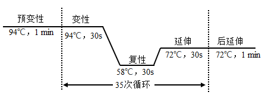
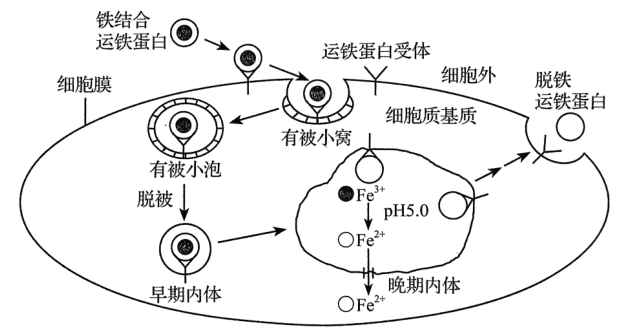
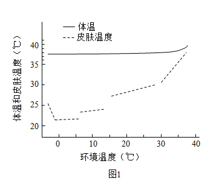
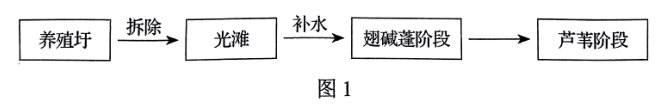
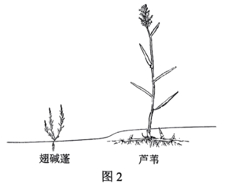
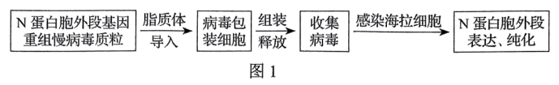
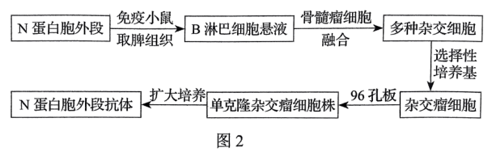

**2022年辽宁省普通高等学校招生选择性考试**

**生物学**

**一、选择题：**

1\. 下列关于硝化细菌的叙述，错误的是（ ）

A. 可以发生基因突变 B. 在核糖体合成蛋白质

C. 可以进行有丝分裂 D. 能以CO2作为碳源

【答案】C

【解析】

【分析】1、硝化细菌是原核生物，原核细胞与真核细胞相比，最大的区别是原核细胞没有被核膜包被的成形的细胞核（没有核膜、核仁和染色体）；原核生物只能进行二分裂生殖。

2、原核细胞只有核糖体一种细胞器，但部分原核细胞也能进行光合作用和有氧呼吸，如蓝细菌。原核生物含有细胞膜、细胞质结构，含有核酸和蛋白质等物质。

【详解】A、硝化细菌的遗传物质是DNA，可发生基因突变，A正确；

B、原核细胞只有核糖体一种细胞器，蛋白质在核糖体合成，B正确；

C、原核生物不能进行有丝分裂，进行二分裂，C错误；

D、硝化细菌可进行化能合成作用，是自养型生物，能以CO2作为碳源，D正确。

故选C。

2\. “一粥一饭，当思来之不易；半丝半缕，恒念物力维艰”体现了日常生活中减少生态足迹的理念，下列选项中都能减少生态足迹的是（ ）

①光盘行动②自驾旅游③高效农业④桑基鱼塘⑤一次性餐具使用⑥秸秆焚烧

A. ①③④ B. ①④⑥ C. ②③⑤ D. ②⑤⑥

【答案】A

【解析】

【分析】生态足迹：（1）概念:在现有技术条件下，维持某一人口单位生存所需的生产资源和吸纳废物的土地及水域的面积。

（2）意义:生态足迹的值越大,代表人类所需的资源越多,对生态和环境的影响就越大。

（3）特点:生态足迹的大小与人类的生活方式有关。生活方式不同,生态足迹的大小可能不同。

【详解】①光盘行动可以避免食物浪费，能够减少生态足迹，①正确；

②自驾旅游会增大生态足迹，②错误；

③④高效农业、桑基鱼塘，能够合理利用资源，提高能量利用率，减少生态足迹，③④正确；

⑤一次性餐具使用，会造成木材浪费，会增大生态足迹，⑤错误；

⑥秸秆焚烧，使秸秆中的能量不能合理利用，造成浪费且空气污染，会增大生态足迹，⑥错误。

综上可知，①③④正确。

故选A。

3\. 下列关于生物进化和生物多样性的叙述，错误的是（ ）

A. 通过杂交育种技术培育出许多水稻新品种，增加了水稻的遗传多样性

B. 人类与黑猩猩基因组序列高度相似，说明人类从黑猩猩进化而来

C. 新物种的形成意味着生物类型和适应方式的增多

D. 生物之间既相互依存又相互制约，生物多样性是协同进化的结果

【答案】B

【解析】

【分析】1、生物多样性包括遗传多样性、物种多样性和生态系统多样性三个层次。

2、遗传多样性是指物种内基因和基因型的多样性。遗传多样性的实质是可遗传变异。检测遗传多样性最简单的方法是聚合酶链反应（简称PCR），最可靠的方法是测定不同亚种、不同种群的基因组全序列。

3、物种多样性是指地球上动物、植物和微生物等生物物种的多样化。

【详解】A、通过杂交育种技术培育出许多水稻新品种，增加了水稻的基因型，即增加了水稻的遗传多样性，A正确；

B、黑猩猩与人类在基因上的相似程度达到96%以上，只能表明人类和黑猩猩的较近的亲缘关系，由于客观环境因素的改变，黑猩猩不能进化成人类，B错误；

C、新物种形成意味着生物能够以新的方式适应环境，为其发展奠定了基础，所以生物类型和适应方式的增多，C正确；

D、生物与生物之间有密切联系，自然界中的动物和其他动物长期生存与发展的过程中，形成了相互依赖，相互制约的关系，生物多样性是协同进化的结果，D正确。

故选B。

4\. 选用合适的实验材料对生物科学研究至关重要。下表对教材中相关研究的叙述，错误的是（ ）

|     |       |          |
|:---:|:-----:|:--------:|
| 选项  | 实验材料  | 生物学研究    |
| A   | 小球藻   | 卡尔文循环    |
| B   | 肺炎链球菌 | DNA半保留复制 |
| C   | 枪乌贼   | 动作电位原理   |
| D   | T2噬菌体 | DNA是遗传物质 |

A. A B. B C. C D. D

【答案】B

【解析】

【分析】1、肺炎链球菌转化实验包括格里菲斯体内转化实验和艾弗里体外转化实验，其中格里菲斯体内转化实验证明S型细菌中存在某种“转化因子”，能将R型细菌转化为S型细菌；艾弗里体外转化实验证明DNA是遗传物质。

2、T2噬菌体侵染细菌的实验步骤：分别用35S或32P标记噬菌体→噬菌体与大肠杆菌混合培养→噬菌体侵染未被标记的细菌→在搅拌器中搅拌，然后离心，检测上清液和沉淀物中的放射性物质。该实验证明DNA是遗传物质。

【详解】A、科学家利用小球藻、运用同位素标记法研究卡尔文循环，A正确；

B、科学家通过培养大肠杆菌，探究DNA半保留复制方式，运用了同位素示踪法和密度梯度离心法，B错误；

C、科学家以枪乌贼离体粗大的神经纤维为实验材料，研究动作电位原理，C正确；

D、赫尔希和蔡斯利用放射性同位素标记法分别用35S或32P标记的噬菌体进行噬菌体侵染细菌的实验，证明DNA是遗传物质，D正确。

故选B。

5\. 下列关于神经系统结构和功能的叙述，正确的是（ ）

A. 大脑皮层H区病变的人，不能看懂文字

B. 手的运动受大脑皮层中央前回下部的调控

C. 条件反射消退不需要大脑皮层的参与

D. 紧张、焦虑等可能抑制成人脑中的神经发生

【答案】D

【解析】

【分析】位于大脑表层的大脑皮层，是整个神经系统中最高级的部位。它能对外部世界的感知以及控制机体的反射活动外，还具有语言、学习、记忆和思维等方面的高级功能。

【详解】A、大脑皮层H区病变的人，听不懂讲话，A错误；

B、刺激大脑皮层中央前回的顶部，可以引起下肢的运动；刺激中央前回的下部，会引起头部器官的运动；刺激中央前回的其他部位，会引起其他相应器官的运动，B错误；

C、条件反射是在大脑皮层的参与下完成的，条件反射是条件刺激与非条件刺激反复多次结合的结果，缺少了条件刺激条件反射会消退，因此条件反射的消退需要大脑皮层的参与，C错误；

D、紧张、焦虑可能会引起突触间隙神经递质的含量减少，所以紧张、焦虑等可能抑制成人脑中的神经发生，D正确。

故选D。

6\. 为研究中医名方—柴胡疏肝散对功能性消化不良大鼠胃排空（胃内容物进入小肠）的作用，科研人员设置4组实验，测得大鼠胃排空率见下表。下列叙述错误的是（ ）

|        |            |         |
|:------:|:----------:|:-------:|
| 组别     | 状态         | 胃排空率（%） |
| 正常组    | 健康大鼠       | 55.80   |
| 模型组    | 患病大鼠未给药    | 38.65   |
| 柴胡疏肝散组 | 患病大鼠+柴胡疏肝散 | 51.12   |
| 药物A组   | 患病大鼠+药物A   | 49.92   |

注：药物A为治疗功能性消化不良的常用药物

A. 与正常组相比，模型组大鼠胃排空率明显降低

B. 正常组能对比反映出给药组大鼠恢复胃排空的程度

C. 与正常组相比，柴胡疏肝散具有促进胃排空的作用

D. 柴胡疏肝散与药物A对患病大鼠促进胃排空的效果相似

【答案】C

【解析】

【分析】对照是实验所控制的手段之一，目的在于消除无关变量对实验结果的影响，增强实验结果的可信度。

【详解】A、由表可知，正常组胃排空率为55.80%，模型组胃排空率为38.65%，与正常组相比，模型组大鼠胃排空率明显降低，A正确；

B、正常组为对照组，将给药之后的胃排空率和正常组比较，能反映出给药组大鼠恢复胃排空的程度，B正确；

C、由表可知，正常组胃排空率为55.80%，柴胡疏肝散组胃排空率为51.12%，正常组胃排空率更高，所以与正常组相比不能表明柴胡疏肝散具有促进胃排空的作用，C错误；

D、由表可知，柴胡疏肝散组与药物A组的胃排空率相似，且均比模型组胃排空率高，柴胡疏肝散与药物A对患病大鼠促进胃排空的效果相似，D正确。

故选C。

7\. 下列关于人体免疫系统功能的叙述，错误的是（ ）

A. 抗体能消灭细胞外液中的病原体，细胞毒性T细胞能消灭侵入细胞内的病原体

B. 首次感染新的病原体时，B细胞在辅助性T细胞的辅助下才能被活化

C. 若免疫监视功能低下，机体会有持续的病毒感染或肿瘤发生

D. “预防”胜于“治疗”，保持机体正常的免疫功能对抵抗疾病非常重要

【答案】A

【解析】

【分析】免疫是指人体的一种生理功能，人体依靠这种功能来识别自己和非己成分，从而破坏和排斥进入体内的抗原物质，或人体本身产生的损伤细胞和肿瘤细胞等，以维持人体内部环境的平衡和稳定。

【详解】A、体液免疫中浆细胞产生抗体，消灭细胞外液中病原体；细胞毒性T细胞与靶细胞密切接触，使靶细胞裂解死亡，使侵入细胞内的病原体释放出来，再被抗体消灭，A错误；

B、首次感染新的病原体时，B细胞活化需要两个信号的刺激，一些病原体可以和B细胞接触，为激活B细胞提供第一个信号，辅助性T细胞表面特定分子发生变化并与B细胞结合，这是激活B细胞的第二个信号，且需要辅助性T细胞分泌的细胞因子的作用，B正确；

C、免疫监视是指监视、识别和清除体内产生的异常细胞的功能，免疫监视功能低下时，机体会有肿瘤发生或持续的病毒感染，C正确；

D、人体的免疫功能包括防御感染、自我稳定、免疫监视，故“预防”胜于“治疗”，保持机体正常的免疫功能对抵抗疾病非常重要，D正确。

故选A。

8\. 二甲基亚砜（DMSO）易与水分子结合，常用作细胞冻存的渗透性保护剂。干细胞冻存复苏后指标检测结果见下表。下列叙述错误的是（ ）

<table style="width:86%;">
<colgroup>
<col style="width: 30%" />
<col style="width: 24%" />
<col style="width: 30%" />
</colgroup>
<tbody>
<tr>
<td style="text-align: right;">
冻存剂

指标
</td>
<td style="text-align: center;">合成培养基+DMSO</td>
<td style="text-align: center;">合成培养基+DMSO+血清</td>
</tr>
<tr>
<td style="text-align: center;">G1期细胞数百分比（%）</td>
<td style="text-align: center;">65.78</td>
<td style="text-align: center;">79.85</td>
</tr>
<tr>
<td style="text-align: center;">活细胞数百分比（%）</td>
<td style="text-align: center;">15.29</td>
<td style="text-align: center;">41.33</td>
</tr>
</tbody>
</table>

注：细胞分裂间期分为G1期、S期（DNA复制期）和G2期

A. 冻存复苏后的干细胞可以用于治疗人类某些疾病

B. G1期细胞数百分比上升，导致更多干细胞直接进入分裂期

C. 血清中的天然成分影响G1期，增加干细胞复苏后的活细胞数百分比

D. DMSO的作用是使干细胞中自由水转化为结合水

【答案】B

【解析】

【分析】细细胞冻存及复苏的基本原则是慢冻快融，实验证明这样可以最大限度的保存细胞活力。目前细胞冻存多采用甘油或二甲基亚矾作保护剂，这两种物质能提高细胞膜对水的通透性，加上缓慢冷冻可使细胞内的水分渗出细胞外，减少细胞内冰晶的形成，从而减少由于冰晶形成造成的细胞损伤。复苏细胞应采用快速融化的方法，这样可以保证细胞外结晶在很短的时间内即融化，避免由于缓慢融化使水分渗入细胞内形成胞内再结晶对细胞造成损伤。

【详解】A、冻存复苏后的干细胞可以经诱导分裂分化形成多种组织器官，用于治疗人类某些疾病，A正确；

B、G1期细胞数百分比上升，说明细胞进入分裂间期，但不会导致干细胞直接进入分裂期，还需经过S和G2期，B错误；

C、分析表格可知，血清中的天然成分影响G1期（该期细胞数百分比增大），能增加干细胞复苏后的活细胞数百分比，C正确；

D、二甲基亚砜（DMSO）易与水分子结合，可以使干细胞中自由水转化为结合水，D正确。

故选B。

9\. 水通道蛋白（AQP）是一类细胞膜通道蛋白。检测人睡液腺正常组织和水肿组织中3种AQP基因mRNA含量，发现AQP1和AQP3基因mRNA含量无变化，而水肿组织AQP5基因mRNA含量是正常组织的2.5倍。下列叙述正确的是（ ）

A. 人唾液腺正常组织细胞中AQP蛋白的氨基酸序列相同

B. AQP蛋白与水分子可逆结合，转运水进出细胞不需要消耗ATP

C. 检测结果表明，只有AQP5蛋白参与人唾液腺水肿的形成

D. 正常组织与水肿组织的水转运速率不同，与AQP蛋白的数量有关

【答案】D

【解析】

【分析】转运蛋白包括通道蛋白和载体蛋白。通道蛋白参与的只是被动运输（易化扩散），在运输过程中并不与被运输的分子或离子相结合，也不会移动，并且是从高浓度向低浓度运输，所以运输时不消耗能量。载体蛋白参与的有主动转运和易化扩散，在运输过程中与相应的分子特异性结合（具有类似于酶和底物结合的饱和效应），自身的构型会发生变化，并且会移动。通道蛋白转运速率与物质浓度成比例，且比载体蛋白介导的转运速度更快。

【详解】A、AQP基因有3种，AQP蛋白应该也有3种，故人唾液腺正常组织细胞中AQP蛋白的氨基酸序列不相同，A错误；

B、AQP蛋白一类细胞膜水通道蛋白，故不能与水分子结合，B错误；

C、根据信息：AQP1和AQP3基因mRNA含量无变化，而水肿组织AQP5基因mRNA含量是正常组织的2.5倍，可知AQP5基因mRNA含量在水肿组织和正常组织有差异，但不能说明只有AQP5蛋白参与人唾液腺水肿的形成，C错误；

D、AQP5基因mRNA含量在水肿组织和正常组织有差异，故形成的AQP蛋白的数量有差异，导致正常组织与水肿组织的水转运速率不同，D正确。

故选D。

10\. 亚麻籽可以榨油，茎秆可以生产纤维。在亚麻生长季节，北方比南方日照时间长，亚麻开花与昼夜长短有关，只有白天短于一定的时长才能开花。赤霉素可以促进植物伸长生长，但对亚麻成花没有影响。烯效唑可抑制植物体内赤霉素的合成。下列在黑龙江省栽培亚麻的叙述，正确的是（ ）

A. 适当使用烯效唑，以同时生产亚麻籽和亚麻纤维

B. 适当使用赤霉素，以同时生产亚麻籽和亚麻纤维

C. 适当使用赤霉素，以提高亚麻纤维产量

D. 适当使用烯效唑，以提高亚麻籽产量

【答案】C

【解析】

【分析】赤霉素：合成部位：幼芽、幼根和未成熟的种子等幼嫩部分 。主要生理功能：促进细胞的伸长；解除种子、块茎的休眠并促进萌发的作用。

【详解】A、已知赤霉素可以促进植物伸长生长，烯效唑可抑制植物体内赤霉素的合成。故适当使用烯效唑，不能生产亚麻纤维，A错误；

B、赤霉素对亚麻成花没有影响，故适当使用赤霉素，不能生产亚麻籽，B错误；

C、已知赤霉素可以促进植物伸长生长，茎秆可以生产纤维故适当使用赤霉素，以提高亚麻纤维产量，C正确；

D、烯效唑可抑制植物体内赤霉素的合成，适当使用烯效唑，不能提高亚麻籽产量，D错误。

故选C。

11\. 人工草坪物种比较单一，易受外界因素的影响而杂草化。双子叶植物欧亚蔊菜是常见的草坪杂草。下列叙述错误的是（ ）

A. 采用样方法调查草坪中欧亚蔊菜的种群密度时，随机取样是关键

B. 喷施高浓度的2，4-D可以杀死草坪中的欧亚蔊菜

C. 欧亚蔊菜入侵人工草坪初期，种群增长曲线呈“S”形

D. 与自然草地相比，人工草坪自我维持结构和功能相对稳定能力较低

【答案】C

【解析】

【分析】估算种群密度时，常用样方法和标记重捕法，其中样方法适用于调查植物或活动能力弱，活动范围小的动物，而标记重捕法适用于调查活动能力强，活动范围大的动物。

【详解】A、采用样方法调查种群密度的关键是随机取样，排除主观因素对调查结果的影响，A正确。

B、欧亚蔊菜是一种双子叶杂草，可喷施高浓度的2，4-D可以杀死草坪中的欧亚蔊菜，B正确；

C、由于环境适宜，欧亚蔊菜入侵人工草坪初期，种群增长曲线呈“J”形，C错误；

D、人工草坪物种比较单一，营养结构简单，故与自然草地相比，人工草坪自我维持结构和功能相对稳定的能力较低，D正确。

故选C。

12\. 抗虫和耐除草剂玉米双抗12-5是我国自主研发的转基因品种。为给监管转基因生物安全提供依据，采用PC方法进行目的基因监测，反应程序如图所示。下列叙述正确的是（ ）

A. 预变性过程可促进模板DNA边解旋边复制

B. 后延伸过程可使目的基因的扩增更加充分

C. 延伸过程无需引物参与即可完成半保留复制

D. 转基因品种经检测含有目的基因后即可上市

【答案】B

【解析】

【分析】PCR过程为：①变性，当温度上升到90℃以上时，氢键断裂，双链DNA解旋为单链；②复性，当温度降低到50℃左右是，两种引物通过碱基互补配对与两条单链DNA结合；③延伸，温度上升到72℃左右，溶液中的四种脱氧核苷酸，在DNA聚合酶的作用下，根据碱基互补配对原则合成新的DNA链。

【详解】A、预变性是使引物完全变性解开，A错误；

B、后延伸过程后延伸是为了让引物延伸完全并让单链产物完全退火形成双链结构，可使目的基因的扩增更加充分，B正确；

C、延伸过程需引物参与，C错误；

D、转基因品种不只需要检测是否含有目的基因，还要检测是否表达，还有安全性问题，D错误；

故选B。

13\. 采用样线法（以一定的速度沿样线前进，同时记录样线两侧一定距离内鸟类的种类及数量）对某地城市公园中鸟类多样性进行调查，结果见下表。下列分析不合理的是（ ）

|        |     |      |      |      |
|:------:|:---:|:----:|:----:|:----:|
| 城市公园类型 | 植物园 | 森林公园 | 湿地公园 | 山体公园 |
| 物种数量   | 41  | 52   | 63   | 38   |

A. 植物园为鸟类提供易地保护的生存空间，一定程度上增加了鸟类物种多样性

B. 森林公园群落结构复杂，能够满足多种鸟类对栖息地的要求，鸟类种类较多

C. 湿地公园为鸟类提供丰富的食物及相对隐蔽的栖息场所，鸟类种类最多

D. 山体公园由于生境碎片化及人类活动频繁的干扰，鸟类物种数量最少

【答案】A

【解析】

【分析】保护生物多样性的措施可以概括为就地保护和易地保护两大类。就地保护是指在原地对被保护的生态系统或物种建立自然保护区以及风景名胜区等，这是对生物多样性最有效的保护。易地保护是指把保护对象从原地迁出，在异地进行专门保护。

【详解】A、植物园为鸟类提供了食物和栖息空间，其中的鸟类不是易地保护迁来的，A错误；

B、森林公园植物种类多样，群落结构复杂，能够满足多种鸟类对栖息地的要求，鸟类种类较多，B正确；

C、湿地公园芦苇、水草繁茂，有机质丰富，为鸟类提供了理想的食物和隐蔽的栖息场所，鸟类种类最多，C正确；

D、山体公园由于生境碎片化及人类活动频繁的干扰，鸟类物种数量最少，D正确。

故选A。

14\. 蓝莓细胞富含花青素等多酚类化合物。在蓝莓组织培养过程中，外植体切口处细胞被破坏，多酚类化合物被氧化成褐色醌类化合物，这一过程称为褐变。褐变会引起细胞生长停滞甚至死亡，导致蓝莓组织培养失败。下列叙述错误的是（ ）

A. 花青素通常存在于蓝莓细胞的液泡中

B. 适当增加培养物转移至新鲜培养基的频率以减少褐变

C. 在培养基中添加合适的抗氧化剂以减少褐变

D. 宜选用蓝莓成熟叶片为材料制备外植体

【答案】D

【解析】

【分析】根据题干信息：在蓝莓组织培养过程中，外植体切口处细胞被破坏，多酚类化合物被氧化成褐色醌类化合物，这一过程称为褐变。减少褐变的措施有：减少氧化剂的浓度，如勤换培养基，或添加抗氧化剂。在植物组织培养的过程中，一般选用代谢旺盛、再生能力强的器官或组织为材料制备外植体。

【详解】A、液泡中含有糖类、无机盐、色素和蛋白质等，其中的色素是指水溶性色素，如花青素，A正确；

B、适当增加培养物转移至新鲜培养基的频率可减少氧化剂的浓度，从而减少褐变，B正确；

C、根据题干信息：在蓝莓组织培养过程中，外植体切口处细胞被破坏，多酚类化合物被氧化成褐色醌类化合物，这一过程称为褐变，可知在培养基中添加合适的抗氧化剂以减少褐变，C正确；

D、一般选用代谢旺盛、再生能力强的器官或组织为材料制备外植体，D错误。

故选D。

15\. 为避免航天器在执行载人航天任务时出现微生物污染风险，需要对航天器及洁净的组装车间进行环境微生物检测。下列叙述错误的是（ ）

A. 航天器上存在适应营养物质匮乏等环境的极端微生物

B. 细菌形成菌膜粘附于航天器设备表面产生生物腐蚀

C. 在组装车间地面和设备表面采集环境微生物样品

D. 采用平板划线法等分离培养微生物，观察菌落特征

【答案】D

【解析】

【分析】微生物常见的接种的方法：①平板划线法：将已经熔化的培养基倒入培养皿制成平板，接种，划线，在恒温箱里培养。在线的开始部分，微生物往往连在一起生长，随着线的延伸，菌数逐渐减少，最后可能形成单个菌落。②稀释涂布平板法：将待分离的菌液经过大量稀释后，均匀涂布在培养皿表面，经培养后可形成单个菌落。

【详解】A、嗜极微生物适应极端环境的特性使它们有在空间暴露环境或地外星球环境中存活的可能，因此航天器上存在适应营养物质匮乏等环境的极端微生物，A正确；

B、细菌形成菌膜粘附于航天器设备表面产生生物腐蚀，会腐蚀舱内材料以及设备线路、元器件，B正确；

C、对航天器及洁净的组装车间进行环境微生物检测，需要在组装车间地面和设备表面采集环境微生物样品，C正确；

D、航天器及洁净的组装车间环境微生物很少，分离培养微生物，观察菌落特征，不需要采用平板划线法，D错误。

故选D。

**二、选择题：**

16\. 视网膜病变是糖尿病常见并发症之一。高血糖环境中，在DNA甲基转移酶催化下，部分胞嘧啶加上活化的甲基被修饰为5'-甲基胞嘧啶，使视网膜细胞线粒体DNA碱基甲基化水平升高，可引起视网膜细胞线粒体损伤和功能异常。下列叙述正确的是（ ）

A. 线粒体DNA甲基化水平升高，可抑制相关基因的表达

B. 高血糖环境中，线粒体DNA在复制时也遵循碱基互补配对原则

C. 高血糖环境引起的甲基化修饰改变了患者线粒体DNA碱基序列

D. 糖尿病患者线粒体DNA高甲基化水平可遗传

【答案】ABD

【解析】

【分析】1、表观遗传学是研究基因的核苷酸序列不发生改变的情况下，基因表达的可遗传的变化的一门遗传学分支学科。表观遗传的现象很多，已知的有DNA甲基化，基因组印记，母体效应，基因沉默，核仁显性，休眠转座子激活和RNA编辑等。

2、基因的碱基序列不变，但表达水平发生可遗传变化，这种现象称为表观遗传。

【详解】A、线粒体DNA甲基化水平升高，可抑制相关基因的表达，可引起视网膜细胞线粒体损伤和功能异常，A正确；

B、线粒体DNA也是双螺旋结构，在复制时也遵循碱基互补配对原则，B正确；

C、基化修饰并不改变患者线粒体DNA碱基序列，C错误；

D、女性糖尿病患者线粒体DNA高甲基化水平可遗传，D正确。

故选ABD。

17\. Fe3+通过运铁蛋白与受体结合被输入哺乳动物生长细胞，最终以Fe2+形式进入细胞质基质，相关过程如图所示。细胞内若Fe2+过多会引发膜脂质过氧化，导致细胞发生铁依赖的程序性死亡，称为铁死亡。下列叙述正确的是（ ）

注：早期内体和晚期内体是溶酶体形成前的结构形式

A. 铁死亡和细胞自噬都受基因调控

B. 运铁蛋白结合与释放Fe3+的环境pH不同

C. 细胞膜的脂质过氧化会导致膜流动性降低

D. 运铁蛋白携带Fe3+进入细胞不需要消耗能量

【答案】ABC

【解析】

【分析】运铁蛋白与铁离子结合后成为铁结合运铁蛋白，该蛋白 与细胞膜上的运铁蛋白受体结合并引起细胞膜内陷，最终运送铁离子进入细胞，该过程表明细胞膜具有识别功能，也说明细胞膜在结构上具有流动性，A正确。

【详解】A、铁死亡是一种铁依赖性的，区别于细胞凋亡、细胞坏死、细胞自噬的新型的细胞程序性死亡方式，受基因调控，A正确；

B、从图中运铁蛋白与铁离子的结合及分离,可以看出环境溶液pH为5.0时，运铁蛋白与铁离子分离，环境溶液pH为7.0时，运铁蛋白与其受体分离，随后与铁离子结合成铁结合运铁蛋白，B正确；

C、细胞器和细胞膜结构的改变和功能障碍是脂质过氧化的最明显后果，包括膜流动性降低，C正确；

D、铁离子进入细胞的方式为胞吞，并非主动运输，运铁蛋白运出细胞的过程为胞吐，胞吞与胞吐过程都需要消耗细胞代谢释放的能量，即需要ATP水解并提供能量，D错误。

故选ABC。

18\. β-苯乙醇是赋予白酒特征风味的物质。从某酒厂采集并筛选到一株产β-苯乙醇的酵母菌应用于白酒生产。下列叙述正确的是（ ）

A. 所用培养基及接种工具分别采用湿热灭菌和灼烧灭菌

B. 通过配制培养基、灭菌、分离和培养能获得该酵母菌

C. 还需进行发酵实验检测该酵母菌产β-苯乙醇的能力

D. 该酵母菌的应用有利于白酒新产品的开发

【答案】ACD

【解析】

【分析】选择培养基是根据某种微生物的特殊营养要求或其对某化学、物理因素的抗性而设计的培养基，使混合菌样中的劣势菌变成优势菌，从而提高该菌的筛选率。

【详解】A、培养基一般选择高压蒸汽灭菌，接种工具一般用灼烧灭菌，A正确；

B、分离纯化酵母菌，操作如下：配制培养基→灭菌→接种→培养→挑选菌落，B错误；

C、为了筛选的到目的菌，应该进行发酵实验检测该酵母菌产β-苯乙醇的能力，C正确；

D、筛选到一株产β-苯乙醇的酵母菌可应用于白酒新产品的开发，D正确。

故选ACD。

19\. 底栖硅藻是河口泥滩潮间带生态系统中的生产者，为底栖动物提供食物。调查分析某河口底栖硅藻群落随季节变化优势种（相对数量占比\>5%）的分布特征，结果如下图。下列叙述错误的是（ ）

注：不同条纹代表不同优势种：空白代表除优势种外的其他底栖硅藻；不同条纹柱高代表每个优势种的相对数量占比

A. 底栖硅藻群落的季节性变化主要体现在优势种的种类和数量变化

B. 影响优势种①从3月到9月数量变化的生物因素包含捕食和竞争

C. 春季和秋季物种丰富度高于夏季，是温度变化影响的结果

D. 底栖硅藻固定的能量是流经河口泥滩潮间带生态系统的总能量

【答案】CD

【解析】

【分析】1、群落的垂直结构：（1）概念：指群落在垂直方向上的分层现象。（2）原因：①植物的分层与对光的利用有关，群落中的光照强度总是随着高度的下降而逐渐减弱，不同植物适于在不同光照强度下生长。如森林中植物由高到低的分布为：乔木层、灌木层、草本层、地被层。②动物分层主要是因群落的不同层次提供不同的食物，其次也与不同层次的微环境有关。如森林中动物的分布由高到低为：猫头鹰（森林上层），大山雀（灌木层），鹿、野猪（地面活动），蚯蚓及部分微生物（落叶层和土壤）。

2、生态系统的组成成分包括非生物的物质和能量、生产者、消费者和分解者。

【详解】A、据图可知，底栖硅藻群落在不同季节优势种的数量和种类都发生了变化，所以底栖硅藻群落的季节性变化主要体现在优势种的种类和数量变化，A正确；

B、底栖硅藻可以为底栖动物提供食物，不同硅藻物种之间也有竞争，所以影响优势种①从3月到9月数量变化的生物因素包含捕食和竞争，B正确；

C、如图只表示了底栖硅藻群落随季节变化优势种的分布特征，没有表示物种丰富度的大小，所以不能判断春季和秋季物种丰富度高于夏季，C错误；

D、底栖硅藻固定的能量及其他生产者固定的能量是流经河口泥滩潮间带生态系统的总能量，D错误。

故选CD。

20\. 某伴X染色体隐性遗传病的系谱图如下，基因检测发现致病基因d有两种突变形式，记作dA与dB。Ⅱ1还患有先天性睾丸发育不全综合征（性染色体组成为XXY）。不考虑新的基因突变和染色体变异，下列分析正确的是（ ）

A. Ⅱ1性染色体异常，是因为Ⅰ1减数分裂Ⅱ时X染色体与Y染色体不分离

B. Ⅱ2与正常女性婚配，所生子女患有该伴X染色体隐性遗传病的概率是1/2

C. Ⅱ3与正常男性婚配，所生儿子患有该伴X染色体隐性遗传病

D. Ⅱ4与正常男性婚配，所生子女不患该伴X染色体隐性遗传病

【答案】C

【解析】

【分析】由题意分析可知，该病为伴X染色体隐性遗传病，其致病基因d有两种突变形式，记作dA与dB，则患病女性基因型为XdAXdA、XdAXdB、XdBXdB，患病男性基因型为XdAY、XdBY。

【详解】A、由题意可知，Ⅱ1患有先天性睾丸发育不全综合征（性染色体组成为XXY），且其是伴X染色体隐性遗传病的患者，结合系谱图可知，其基因型为XdAXdBY，结合系谱图分析可知，Ⅰ1的基因型为XdAY，Ⅰ2的基因型为XDXdB（D为正常基因），不考虑新的基因突变和染色体变异，Ⅱ1性染色体异常，是因为Ⅰ1减数分裂Ⅰ时同源染色体X与Y不分离，形成了XdAY的精子，与基因型为XdB的卵细胞形成了基因型为XdAXdBY的受精卵导致的，A错误；

B、由A项分析可知，Ⅰ1的基因型为XdAY，Ⅰ2的基因型为XDXdB，则Ⅱ2的基因型为XdBY，正常女性的基因型可能是XDXD、XDXdA、XDXdB，故Ⅱ2与正常女性（基因型不确定）婚配，所生子女患有该伴X染色体隐性遗传病的概率不确定，B错误；

C、由A项分析可知，Ⅰ1的基因型为XdAY，Ⅰ2的基因型为XDXdB，则Ⅱ3的基因型为XdAXdB，与正常男性XDY婚配，所生儿子基因型为XdAY或XdBY，均为该伴X染色体隐性遗传病患者，C正确；

D、由A项分析可知，Ⅰ1的基因型为XdAY，Ⅰ2的基因型为XDXdB，则Ⅱ4的基因型为XDXdA，与正常男性XDY婚配，则所生子女中可能有基因型为XdAY的该伴X染色体隐性遗传病的男性患者，D错误。

故选C。

**三、非选择题：**

21\. 小熊猫是我国二级重点保护野生动物，其主要分布区年气温一般在0～25℃之间。测定小熊猫在不同环境温度下静止时的体温、皮肤温度（图1），以及代谢率（即产热速率，图2）。回答下列问题：

（1）由图1可见，在环境温度0~30℃范围内，小熊猫的体温\_\_\_\_\_\_\_\_\_\_\_，皮肤温度随环境温度降低而降低，这是在\_\_\_\_\_\_\_\_\_\_\_调节方式下，平衡产热与散热的结果。皮肤散热的主要方式包括\_\_\_\_\_\_\_\_\_\_\_（答出两点即可）。

（2）图2中，在环境温度由20℃降至10℃的过程中，小熊猫代谢率下降，其中散热的神经调节路径是：皮肤中的\_\_\_\_\_\_\_\_\_\_\_受到环境低温刺激产生兴奋，兴奋沿传入神经传递到位于\_\_\_\_\_\_\_\_\_\_\_的体温调节中枢，通过中枢的分析、综合，使支配血管的\_\_\_\_\_\_\_\_\_\_\_（填“交感神经”或“副交感神经”）兴奋，引起外周血管收缩，皮肤和四肢血流量减少，以减少散热。

（3）图2中，当环境温度下降到0℃以下时，从激素调节角度分析小熊猫产热剧增的原因是\_\_\_\_\_\_\_\_\_\_\_。

（4）通常通过检测尿液中类固醇类激素皮质醇的含量，评估动物园圈养小熊猫的福利情况。皮质醇的分泌是由\_\_\_\_\_\_\_\_\_\_\_轴调节的。使用尿液而不用血液检测皮质醇，是因为血液中的皮质醇可以通过\_\_\_\_\_\_\_\_\_\_\_进入尿液，而且也能避免取血对小熊猫的伤害。

【答案】（1） ①. 保持恒定 ②. 神经-体液 ③. 辐射、传导、对流、蒸发

（2） ①. 冷觉感受器 ②. 下丘脑 ③. 交感神经

（3）寒冷环境中，小熊猫分泌的甲状腺激素和肾上腺素增多，提高细胞代谢速率，使机体产生更多的热量

（4） ①. 下丘脑-垂体-肾上腺皮质 ②. 肾小球的滤过作用

【解析】

【分析】体温调节：（1）体温调节中枢：下丘脑。（2）机理：产热和散热达到动态平衡。（3）寒冷环境下：①增加产热的途径：骨骼肌战栗、甲状腺激素和肾上腺素分泌增加；②减少散热的途径：立毛肌收缩、皮肤血管收缩等。（4）炎热环境下：主要通过增加散热来维持体温相对稳定，增加散热的途径主要有汗液分泌增加、皮肤血管舒张。

【小问1详解】

由图1可见，在环境温度0~30℃范围内，小熊猫的体温处于32℃~33℃之间，保持恒定，皮肤温度随环境温度降低而降低，这是在神经-体液调节方式下，平衡产热与散热的结果。皮肤散热的主要方式包括辐射、传导、蒸发、对流等。

【小问2详解】

在环境温度由20℃降至10℃的过程中，小熊猫代谢率下降，其中散热的神经调节路径是感受器--传入神经--神经中枢--传出神经--效应器，即寒冷环境中，皮肤中的冷觉感受器受到环境低温刺激产生兴奋，兴奋沿传入神经传递到位于下丘脑的体温调节中枢，通过中枢的分析、综合，使支配血管的交感神经兴奋，引起外周血管收缩，皮肤和四肢血流量减少，以减少散热。

【小问3详解】

分析题意可知，从激素调节角度分析当环境温度下降到0℃以下时，小熊猫产热剧增的原因，所以考虑甲状腺激素和肾上腺素的作用，即寒冷环境中，小熊猫分泌的甲状腺激素和肾上腺素增多，提高细胞代谢速率，使机体产生更多的热量。

【小问4详解】

皮质醇是由肾上腺皮质分泌的，受下丘脑和垂体的分级调节，即是由下丘脑-垂体-肾上腺皮质轴调节的。因为血液中的皮质醇可以通过肾小球的滤过作用进入尿液，故使用尿液而不用血液检测皮质醇，而且也能避免取血对小熊猫的伤害。

22\. 浒苔是形成绿潮的主要藻类。绿潮时浒苔堆积在一起，形成大量的“藻席”，造成生态灾害。为研究浒苔疯长与光合作用的关系，进行如下实验：

Ⅰ．光合色素的提取、分离和含量测定

（1）在“藻席”的上、中、下层分别选取浒苔甲为实验材料，提取、分离色素，发现浒苔甲的光合色素种类与高等植物相同，包括叶绿素和\_\_\_\_\_\_\_\_\_\_\_。在细胞中，这些光合色素分布在\_\_\_\_\_\_\_\_\_\_\_。

（2）测定三个样品的叶绿素含量，结果见下表。

|     |                         |                         |
|:---:|:-----------------------:|:-----------------------:|
| 样品  | 叶绿素a（mg·g-1） | 叶绿素b（mg·g-1） |
| 上层  | 0.199                   | 0.123                   |
| 中层  | 0.228                   | 0.123                   |
| 下层  | 0.684                   | 0.453                   |

数据表明，取自“藻席”下层的样品叶绿素含量最高，这是因为\_\_\_\_\_\_\_\_\_\_\_。

Ⅱ．光合作用关键酶Y的粗酶液制备和活性测定

（3）研究发现，浒苔细胞质基质中存在酶Y，参与CO2的转运过程，利于对碳的固定。

酶Y粗酶液制备：定时测定光照强度并取一定量的浒苔甲和浒苔乙，制备不同光照强度下样品的粗酶液，流程如图1。

粗酶液制备过程保持低温，目的是防止酶降解和\_\_\_\_\_\_\_\_\_\_\_。研磨时加入缓冲液的主要作用是\_\_\_\_\_\_\_\_\_\_\_稳定。离心后的\_\_\_\_\_\_\_\_\_\_\_为粗酶液。

（4）酶Y活性测定：取一定量的粗酶液加入到酶Y活性测试反应液中进行检测，结果如图2。

在图2中，不考虑其他因素的影响，浒苔甲酶Y活性最高时的光照强度为\_\_\_\_\_\_\_\_\_\_\_μmol·m-2·s-1（填具体数字），强光照会\_\_\_\_\_\_\_\_\_\_\_浒苔乙酶Y的活性。

【答案】（1） ①. 类胡萝卜素 ②. 叶绿体的类囊体薄膜##类囊体薄膜

（2）下层阳光少，需要大量叶绿素来捕获少量的阳光，

（3） ①. 酶变性 ②. 维持pH值 ③. 上清液

（4） ①. 1800 ②. 抑制

【解析】

【分析】绿叶中色素提取的原理：叶绿体中的色素能够溶解在有机溶剂，所以，可以在叶片被磨碎以后用乙醇提取叶绿体中的色素；

色素分离原理：叶绿体中的色素在层析液中的溶解度不同，溶解度高的随层析液在滤纸上扩散得快，溶解度低的随层析液在滤纸上扩散得慢．根据这个原理就可以将叶绿体中不同的色素分离开来。

【小问1详解】

浒苔甲的光合色素种类与高等植物相同，高等植物的光合色素包括叶绿素和类胡萝卜素。叶绿素包括叶绿素a和叶绿素b；类胡萝卜素包括胡萝卜素和叶黄素。在细胞中，这些光合色素分布在叶绿体的类囊体薄膜上。

【小问2详解】

由于下层阳光少，需要大量叶绿素来捕获少量的阳光，故取自“藻席”下层的样品叶绿素含量最高。

【小问3详解】

粗酶液制备过程保持低温，目的是防止酶降解和酶变性。缓冲液是一种能在加入少量酸或碱时抵抗pH改变的溶液，故研磨时加入缓冲液的主要作用是维持pH值的稳定。由于含有不溶性的细胞碎片，故离心后的上清液为粗酶液。

【小问4详解】

分析题图数据，在图2中，不考虑其他因素的影响，浒苔甲酶Y活性最高时的光照强度为1800μmol·m-2·s-1，中午时浒苔乙酶Y活性最低，说明强光照会抑制浒苔乙酶Y的活性。

23\. 碳达峰和碳中和目标的提出是构建人类命运共同体的时代要求，增加碳存储是实现碳中和的重要举措。被海洋捕获的碳称为蓝碳，滨海湿地是海岸带蓝碳生态系统的主体。回答下列问题：

（1）碳存储离不开碳循环。生态系统碳循环是指组成生物体的碳元素在\_\_\_\_\_\_\_\_\_\_\_和\_\_\_\_\_\_\_\_\_\_\_之间循环往复的过程。

（2）滨海湿地单位面积的碳埋藏速率是陆地生态系统的15倍，主要原因是湿地中饱和水环境使土壤微生物处于\_\_\_\_\_\_\_\_\_\_\_条件，导致土壤有机质分解速率\_\_\_\_\_\_\_\_\_\_\_。

（3）为促进受损湿地的次生演替，提高湿地蓝碳储量，辽宁省实施“退养还湿”生态修复工程（如图1）。该工程应遵循\_\_\_\_\_\_\_\_\_\_\_（答出两点即可）生态学基本原理，根据物种在湿地群落中的\_\_\_\_\_\_\_\_\_\_\_差异，适时补种适宜的物种，以加快群落演替速度。

（4）测定盐沼湿地不同植物群落的碳储量，发现翅碱蓬阶段为180.5kg·hm-2、芦苇阶段为3367.2kg·hm-2，说明在\_\_\_\_\_\_\_\_\_\_\_的不同阶段，盐沼湿地植被的碳储量差异很大。

（5）图2是盐沼湿地中两种主要植物翅碱蓬、芦苇的示意图。据图分析可知，对促进海岸滩涂淤积，增加盐沼湿地面积贡献度高的植物是\_\_\_\_\_\_\_\_\_\_\_，原因是\_\_\_\_\_\_\_\_\_\_\_。

【答案】（1） ①. 生物群落 ②. 无机环境

（2） ①. 无氧##缺氧 ②. 低

（3） ①. 自生、整体 ②. 生态位

（4）群落演替##次生演替

（5） ①. 芦苇 ②. 与翅碱蓬相比，芦苇的根系发达，利于在滩涂环境下立地扎根，快速蔓延

【解析】

【分析】生态系统的碳循环过程为：碳元素在生物群落与无机环境之间是以二氧化碳的形式循环的，在生物群落内是以含碳有机物的形式流动的。物质循环是能量流动的载体，能量流动是物质循环的动力。

【小问1详解】

生态系统碳循环是指组成生物体的碳元素在生物群落和无机环境之间循环往复的过程。

【小问2详解】

由于湿地大部分时间处于静水水淹状态，即湿地中饱和水环境使土壤微生物处于无氧条件，导致土壤有机质分解速率慢，所以滨海湿地单位面积的碳埋藏速率是陆地生态系统的15倍，

【小问3详解】

在湿地修复过程中，应遵循自生、整体等生态学基本原理，选择污染物净化能力较强的多种水生植物，还需要考虑这些植物各自的生态位差异，以及它们之间的种间关系，适时补种适宜的物种，以加快群落演替速度。

【小问4详解】

湿地发生的演替是次生演替，测定盐沼湿地不同植物群落的碳储量，发现翅碱蓬阶段为180.5kg·hm-2、芦苇阶段为3367.2kg·hm-2，说明在次生演替（群落演替）的不同阶段，盐沼湿地植被的碳储量差异很大。

【小问5详解】

分析图2可知，与翅碱蓬相比，芦苇的根系发达，利于在滩涂环境下立地扎根，快速蔓延所以是增加盐沼湿地面积贡献度高的植物。

24\. 某抗膜蛋白治疗性抗体药物研发过程中，需要表达N蛋白胞外段，制备相应的单克隆抗体，增加其对N蛋白胞外段特异性结合的能力。

Ⅰ．N蛋白胞外段抗原制备，流程如图1

（1）构建重组慢病毒质粒时，选用氨苄青霉素抗性基因作为标记基因，目的是\_\_\_\_\_\_\_\_\_\_\_。用脂质体将重组慢病毒质粒与辅助质粒导入病毒包装细胞，质粒被包在脂质体\_\_\_\_\_\_\_\_\_\_\_（填“双分子层中”或“两层磷脂分子之间”）。

（2）质粒在包装细胞内组装出由\_\_\_\_\_\_\_\_\_\_\_组成的慢病毒，用慢病毒感染海拉细胞进而表达并分离、纯化N蛋白胞外段。

Ⅱ．N蛋白胞外段单克隆抗体制备，流程如图2

（3）用N蛋白胞外段作为抗原对小鼠进行免疫后，取小鼠脾组织用\_\_\_\_\_\_\_\_\_\_\_酶处理，制成细胞悬液，置于含有混合气体的\_\_\_\_\_\_\_\_\_\_\_中培养，离心收集小鼠的B淋巴细胞，与骨髓瘤细胞进行融合。

（4）用选择性培养基对融合后的细胞进行筛选，获得杂交瘤细胞，将其接种到96孔板，进行\_\_\_\_\_\_\_\_\_\_\_培养。用\_\_\_\_\_\_\_\_\_\_\_技术检测每孔中的抗体，筛选既能产生N蛋白胞外段抗体，又能大量增殖的单克隆杂交瘤细胞株，经体外扩大培养，收集\_\_\_\_\_\_\_\_\_\_\_，提取单克隆抗体。

（5）利用N蛋白胞外段抗体与药物结合，形成\_\_\_\_\_\_\_\_\_\_\_，实现特异性治疗。

【答案】（1） ①. 检测目的基因是否成功导入受体细胞 ②. 双分子层中

（2）蛋白质外壳和含N蛋白胞外段基因的核酸

（3） ①. 胰蛋白酶或胶原蛋白 ②. CO2培养箱

（4） ①. 克隆化 ②. 抗原抗体杂交 ③. 细胞培养液

（5）抗体-药物偶联物##ADC

【解析】

【分析】1、单克隆抗体制备流程：先给小鼠注射特定抗原使之发生免疫反应，之后从小鼠脾脏中获取已经免疫的B淋巴细胞；诱导B细胞和骨髓瘤细胞融合，利用选择培养基筛选出杂交瘤细胞；进行抗体检测，筛选出能产生特定抗体的杂交瘤细胞；进行克隆化培养，即用培养基培养和注入小鼠腹腔中培养；最后从培养液或小鼠腹水中获取单克隆抗体。

2、两次筛选：①筛选得到杂交瘤细胞（去掉未杂交的细胞以及自身融合的细胞）；②筛选出能够产生特异性抗体的细胞群。

3、杂交瘤细胞的特点：既能大量增殖，又能产生特异性抗体。

【小问1详解】

构建重组慢病毒质粒时，为检测目的基因是否成功导入受体细胞，常选用氨苄青霉素抗性基因作为标记基因。重组慢病毒质粒与辅助质粒导入病毒包装细胞需要依赖膜融合，故质粒被包在脂质体双分子层中（即磷脂双分子层）。

【小问2详解】

由于目的基因为N蛋白胞外段基因，在包装细胞内组装出由蛋白质外壳和含有N蛋白胞外段基因的核酸组成的慢病毒，用慢病毒感染海拉细胞进而表达并分离、纯化N蛋白胞外段。

【小问3详解】

进行动物细胞培养时，需要取小鼠脾组织用胰蛋白酶或胶原蛋白酶处理，制成细胞悬液，置于含有95%空气和5%的CO2混合气体的CO2培养箱中培养。

【小问4详解】

用选择性培养基对融合后的细胞进行筛选，获得杂交瘤细胞，将其接种到96孔板，进行克隆化培养和抗体检测。用抗原抗体杂交技术检测每孔中的抗体，筛选既能产生N蛋白胞外段抗体，又能大量增殖的单克隆杂交瘤细胞株，经体外扩大培养，收集细胞培养液，提取单克隆抗体。

【小问5详解】

利用N蛋白胞外段抗体与药物结合，形成抗体-药物偶联物ADC，实现特异性治疗。

25\. 某雌雄同株二倍体观赏花卉的抗软腐病与易感软腐病（以下简称“抗病”与“易感病”）由基因R/r控制，花瓣的斑点与非斑点由基因Y/y控制。为研究这两对相对性状的遗传特点，进行系列杂交实验，结果见下表。

<table>
<colgroup>
<col style="width: 7%" />
<col style="width: 31%" />
<col style="width: 15%" />
<col style="width: 12%" />
<col style="width: 17%" />
<col style="width: 15%" />
</colgroup>
<tbody>
<tr>
<td rowspan="2" style="text-align: center;">组别</td>
<td rowspan="2" style="text-align: center;">亲本杂交组合</td>
<td colspan="4" style="text-align: center;">F1表型及数量</td>
</tr>
<tr>
<td style="text-align: center;">抗病非斑点</td>
<td style="text-align: center;">抗病斑点</td>
<td style="text-align: center;">易感病非斑点</td>
<td style="text-align: center;">易感病斑点</td>
</tr>
<tr>
<td style="text-align: center;">1</td>
<td style="text-align: center;">抗病非斑点×易感病非斑点</td>
<td style="text-align: center;">710</td>
<td style="text-align: center;">240</td>
<td style="text-align: center;">0</td>
<td style="text-align: center;">0</td>
</tr>
<tr>
<td style="text-align: center;">2</td>
<td style="text-align: center;">抗病非斑点×易感病斑点</td>
<td style="text-align: center;">132</td>
<td style="text-align: center;">129</td>
<td style="text-align: center;">127</td>
<td style="text-align: center;">140</td>
</tr>
<tr>
<td style="text-align: center;">3</td>
<td style="text-align: center;">抗病斑点×易感病非斑点</td>
<td style="text-align: center;">72</td>
<td style="text-align: center;">87</td>
<td style="text-align: center;">90</td>
<td style="text-align: center;">77</td>
</tr>
<tr>
<td style="text-align: center;">4</td>
<td style="text-align: center;">抗病非斑点×易感病斑点</td>
<td style="text-align: center;">183</td>
<td style="text-align: center;">0</td>
<td style="text-align: center;">172</td>
<td style="text-align: center;">0</td>
</tr>
</tbody>
</table>

（1）上表杂交组合中，第1组亲本的基因型是\_\_\_\_\_\_\_\_\_\_\_，第4组的结果能验证这两对相对性状中\_\_\_\_\_\_\_\_\_\_\_的遗传符合分离定律，能验证这两对相对性状的遗传符合自由组合定律的一组实验是第\_\_\_\_\_\_\_\_\_\_\_组。

（2）将第2组F1中的抗病非斑点植株与第3组F1中的易感病非斑点植株杂交，后代中抗病非斑点、易感病非斑点、抗病斑点、易感病斑点的比例为\_\_\_\_\_\_\_\_\_\_\_。

（3）用秋水仙素处理该花卉，获得了四倍体植株。秋水仙素的作用机理是\_\_\_\_\_\_\_\_\_\_\_。现有一基因型为YYyy的四倍体植株，若减数分裂过程中四条同源染色体两两分离（不考虑其他变异），则产生的配子类型及比例分别为\_\_\_\_\_\_\_\_\_\_\_，其自交后代共有\_\_\_\_\_\_\_\_\_\_\_种基因型。

（4）用X射线对该花卉A基因的显性纯合子进行诱变，当A基因突变为隐性基因后，四倍体中隐性性状的出现频率较二倍体更\_\_\_\_\_\_\_\_\_\_\_。

【答案】（1） ①. RRYy、rrYy ②. 抗病与易感病 ③. 2

（2）3:3:1:1 （3） ①. 能够抑制纺锤体的形成，导致染色体不能移向细胞的两极，从而引起细胞内染色体数目加倍 ②. YY:Yy:yy=1:4:1 ③. 5 （4）低

【解析】

【分析】已知抗软腐病与易感软腐病（以下简称“抗病”与“易感病”）由基因R/r控制，花瓣的斑点与非斑点由基因Y/y控制，分析杂交实验结果：

1组：抗病非斑点×易感病非斑点→抗病非斑点:抗病斑点:易感病非斑点:易感病斑点=3:1:0:0；

2组：抗病非斑点×易感病斑点→抗病非斑点:抗病斑点:易感病非斑点:易感病斑点=1:1:1:1；

3组：抗病斑点×易感病非斑点→抗病非斑点:抗病斑点:易感病非斑点:易感病斑点=1:1:1:1；

4组：抗病非斑点×易感病斑点→抗病非斑点:抗病斑点:易感病非斑点:易感病斑点=1:0:1:0；

由1组结果可知：抗病对易感病为显性；非斑点对斑点为显性。

【小问1详解】

分析1组结果：后代全抗病，且非斑点:斑点=3:1，可知抗病对易感病为显性；非斑点对斑点为显性，故第1组的亲本基因型为 RRYy（抗病非斑点）、rrYy（易感病非斑点）。第4组的结果：抗病非斑点:易感病非斑点=1:1；能验证这两对相对性状中“抗病”与“易感病”的遗传符合分离定律，能验证这两对相对性状的遗传符合自由组合定律的一组实验是第2组，测交实验。

【小问2详解】

第2组RrYy×rryy杂交，F1中的抗病非斑点植株基因型为RrYy，第3组Rryy×rrYy杂交，F1中的易感病非斑点植株基因型为rrYy，两者杂交RrYy×rrYy，后代中Rr:rr=1:1，Y-:yy=3:1，故抗病非斑点、易感病非斑点、抗病斑点、易感病斑点的比例为3:3:1:1。

【小问3详解】

当秋水仙素作用于正在分裂细胞时，能够抑制纺锤体的形成，导致染色体不能移向细胞的两极，从而引起细胞内染色体数目加倍。所以用秋水仙素处理该花卉，可以获得四倍体植株。现有一基因型为YYyy的四倍体植株，若减数分裂过程中四条同源染色体两两分离，不考虑其他变异，则产生的配子类型及比例分别为YY:Yy:yy=1:4:1，其自交后代共有YYYY、YYYy、YYyy、Yyyy、yyyy，共5种基因型。

【小问4详解】

用X射线对该花卉A基因的显性纯合子，基因型为AAAA，进行诱变，当A基因突变为隐性基因a后，由于四倍体的A基因更多，则四倍体中隐性性状的出现频率较二倍体更低。
