**2022年重庆市普通高等学校全国统一招生选择性考试**

**生物试卷**

**一、单项选择题：**

1\. 以蚕豆根尖为实验材料，在光学显微镜下不能观察到的是（ ）

A. 中心体 B. 染色体 C. 细胞核 D. 细胞壁

2\. 如图为小肠上皮细胞吸收和释放铜离子的过程。下列关于该过程中铜离子的叙述，错误的是（ ）

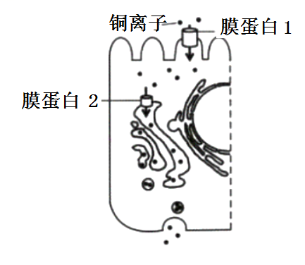

A. 进入细胞需要能量 B. 转运具有方向性

C. 进出细胞的方式相同 D. 运输需要不同的载体

3\. 将人胰岛素A链上1个天冬氨酸替换为甘氨酸，B链末端增加2个精氨酸，可制备出一种人工长效胰岛素。下列关于该胰岛素的叙述，错误的是（ ）

A. 进入人体后需经高尔基体加工 B. 比人胰岛素多了2个肽键

C. 与人胰岛素有相同的靶细胞 D. 可通过基因工程方法生产

4\. 下列发现中，以DNA双螺旋结构模型为理论基础的是（ ）

A. 遗传因子控制性状 B. 基因在染色体上

C. DNA是遗传物质 D. DNA半保留复制

5\. 合理均衡的膳食对维持人体正常生理活动有重要意义。据下表分析，叙述错误的是（ ）

<table style="width:85%;">
<colgroup>
<col style="width: 24%" />
<col style="width: 15%" />
<col style="width: 16%" />
<col style="width: 14%" />
<col style="width: 14%" />
</colgroup>
<thead>
<tr>
<th style="text-align: center;">
项目

食物（100g）
</th>
<th style="text-align: center;">能量（kJ）</th>
<th style="text-align: center;">蛋白质（g）</th>
<th style="text-align: center;">脂肪（g）</th>
<th style="text-align: center;">糖类（g）</th>
</tr>
</thead>
<tbody>
<tr>
<td style="text-align: center;">①</td>
<td style="text-align: center;">880</td>
<td style="text-align: center;">6.2</td>
<td style="text-align: center;">1.2</td>
<td style="text-align: center;">44.2</td>
</tr>
<tr>
<td style="text-align: center;">②</td>
<td style="text-align: center;">1580</td>
<td style="text-align: center;">13.2</td>
<td style="text-align: center;">37.0</td>
<td style="text-align: center;">2.4</td>
</tr>
<tr>
<td style="text-align: center;">③</td>
<td style="text-align: center;">700</td>
<td style="text-align: center;">29.3</td>
<td style="text-align: center;">3.4</td>
<td style="text-align: center;">1.2</td>
</tr>
</tbody>
</table>

A. 含主要能源物质最多的是②

B. 需控制体重的人应减少摄入①和②

C. 青少年应均衡摄入①、②和③

D. 蛋白质、脂肪和糖类都可供能

6\. 某化合物可使淋巴细胞分化为吞噬细胞。实验小组研究了该化合物对淋巴细胞的影响，结果见如表。下列关于实验组的叙述，正确的是（ ）

| 分组  | 细胞特征         | 核DNA含量增加的细胞比例 | 吞噬细菌效率 |
|:---:|:------------:|:-------------:|:------:|
| 对照组 | 均呈球形         | 59.20%        | 4.61%  |
| 实验组 | 部分呈扁平状，溶酶体增多 | 9.57%         | 18.64% |

A. 细胞的形态变化是遗传物质改变引起的

B. 有9.57%的细胞处于细胞分裂期

C. 吞噬细菌效率的提高与溶酶体增多有关

D. 去除该化合物后扁平状细胞会恢复成球形

7\. 植物蛋白酶M和L能使肉类蛋白质部分水解，可用于制作肉类嫩化剂。某实验小组测定并计算了两种酶在37℃、不同pH下的相对活性，结果见如表。下列叙述最合理的是（ ）

| pH酶相对活性 | 3   | 5   | 7   | 9                                                            | 11  |
|:-------:|:---:|:---:|:---:|:------------------------------------------------------------:|:---:|
| M       | 0.7 | 1.0 | 1.0 | 1.0                                                          | 0.6 |
| L       | 0.5 | 1.0 | 0.5 | 02 | 0.1 |

A. 在37℃时，两种酶的最适pH均为3

B. 在37℃长时间放置后，两种酶的活性不变

C. 从37℃上升至95℃，两种酶在pH5时仍有较高活性

D. 在37℃、pH3~11时，M更适于制作肉类嫩化剂

8\. 如图为两种细胞代谢过程的示意图。转运到神经元的乳酸过多会导致其损伤。下列叙述错误的是（ ）

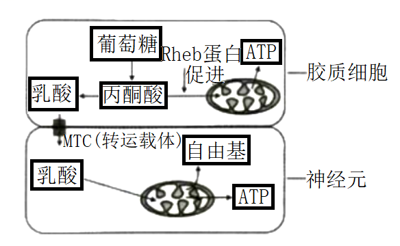

A. 抑制MCT可降低神经元损伤

B. Rheb蛋白失活可降低神经元损伤

C. 乳酸可作为神经元的能源物质

D. 自由基累积可破坏细胞内的生物分子

9\. 双酚A是一种干扰内分泌的环境激素，进入机体后能通过与雌激素相同的方式影响机体功能。下列关于双酚A的叙述，正确的是（ ）

A. 通过体液运输发挥作用

B. 进入机体后会引起雌激素的分泌增加

C. 不能与雌激素受体结合

D. 在体内大量积累后才会改变生理活动

10\. 某同学登山后出现腿部肌肉酸痛，一段时间后缓解。查阅资料得知，肌细胞生成的乳酸可在肝脏转化为葡萄糖被细胞再利用。下列叙述正确的是（ ）

A. 酸痛是因为乳酸积累导致血浆pH显著下降所致

B. 肌细胞生成的乳酸进入肝细胞只需通过组织液

C. 乳酸转化为葡萄糖的过程在内环境中进行

D. 促进乳酸在体内的运输有利于缓解酸痛

11\. 在一定条件下，斐林试剂可与葡萄糖反应生成砖红色沉淀，去除沉淀后的溶液蓝色变浅，测定其吸光值可用于计算葡萄糖含量。下表是用该方法检测不同样本的结果。下列叙述正确的是（ ）

| 样本           | ①     | ②     | ③     | ④     | ⑤     | ⑥     |
|:------------:|:-----:|:-----:|:-----:|:-----:|:-----:|:-----:|
| 吸光值          | 0.616 | 0.606 | 0.595 | 0.583 | 0.571 | 0.564 |
| 葡萄糖含量（mg/mL） | 0     | 0.1   | 0.2   | 0.3   | 0.4   | 0.5   |

A. 斐林试剂与样本混合后立即生成砖红色沉淀

B. 吸光值与样本的葡萄糖含量有关，与斐林试剂的用量无关

C. 若某样本的吸光值为0.578，则其葡萄糖含量大于0.4mg/mL

D. 在一定范围内葡萄糖含量越高，反应液去除沉淀后蓝色越浅

12\. 从如图中选取装置，用于探究酵母菌细胞呼吸方式，正确的组合是（ ）

<table>
<colgroup>
<col style="width: 20%" />
<col style="width: 20%" />
<col style="width: 23%" />
<col style="width: 34%" />
</colgroup>
<thead>
<tr>
<th style="text-align: center;">
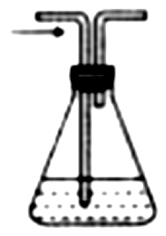

酵母菌培养液①
</th>
<th style="text-align: center;">
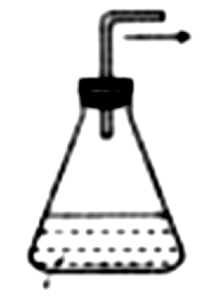

酵母菌培养液②
</th>
<th style="text-align: center;">

澄清的石灰水③
</th>
<th style="text-align: center;">
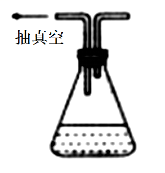

酵母菌培养液④
</th>
</tr>
</thead>
<tbody>
<tr>
<td style="text-align: center;">

酵母菌培养液⑤
</td>
<td style="text-align: center;">
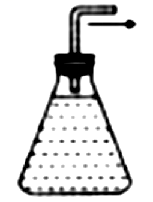

酵母菌培养液⑥
</td>
<td style="text-align: center;">
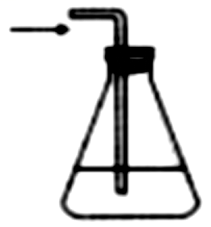

澄清的石灰水⑦
</td>
<td style="text-align: center;">

质量分数为10%的NaOH溶液⑧
</td>
</tr>
</tbody>
</table>

注：箭头表示气流方向

A. ⑤→⑧→⑦和⑥→③ B. ⑧→①→③和②→③

C. ⑤→⑧→③和④→⑦ D. ⑧→⑤→③和⑥→⑦

13\. 如图表示人动脉血压维持相对稳定的一种反射过程。动脉血压正常时，过高过紧的衣领会直接刺激颈动脉窦压力感受器，引起后续的反射过程，使人头晕甚至晕厥，即“衣领综合征”。下列叙述错误的是（ ）

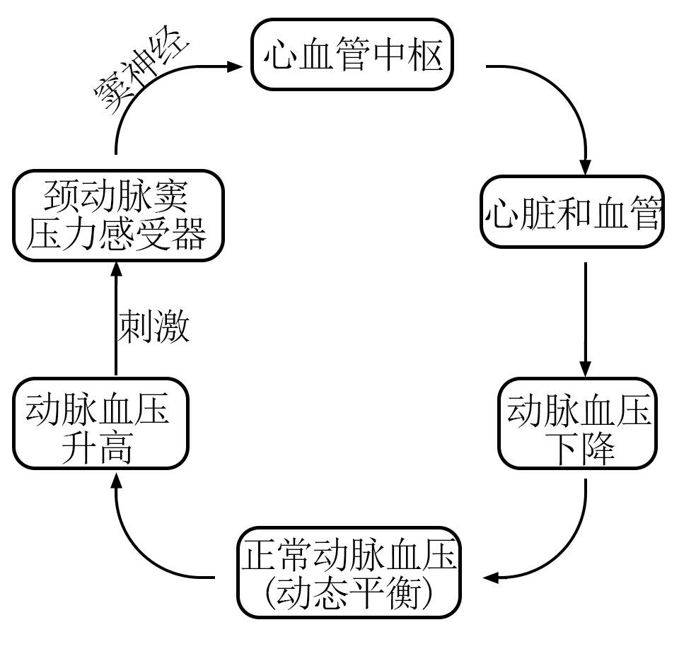

A. 窦神经受损时，颈动脉窦压力感受器仍可产生兴奋

B. 动脉血压的波动可通过神经调节快速恢复正常

C. “衣领综合征”是反射启动后引起血压升高所致

D. 动脉血压维持相对稳定的过程体现了负反馈调节作用

14\. 乔木种群的径级结构（代表年龄组成）可以反映种群与环境之间的相互关系，预测种群未来发展趋势。研究人员调查了甲、乙两地不同坡向某种乔木的径级结构，结果见如图。下列叙述错误的是（ ）

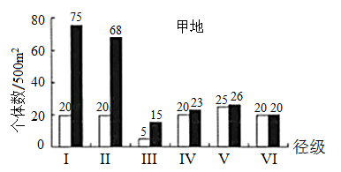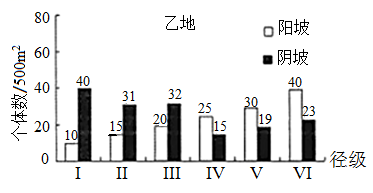

注：I和II为幼年期，III和IV为成年期，V和VI为老年期

A. 甲地III径级个体可能在幼年期经历了干旱等不利环境

B. 乙地阳坡的种群密度比甲地阳坡的种群密度低

C. 甲、乙两地阳坡的种群年龄结构分别为稳定型和衰退型

D. 甲、乙两地阴坡的种群增长曲线均为S型

15\. 植物体细胞通常被诱导为愈伤组织后才能表现全能性。研究发现，愈伤组织的中层细胞是根或芽再生的源头干细胞，其在不同条件下，通过基因的特异性表达调控生长素、细胞分裂素的作用，表现出不同的效应（见如表）。已知生长素的生理作用大于细胞分裂素时有利于根的再生；反之，有利于芽的再生。下列推论不合理的是（ ）

| 条件  | 基因表达产物和相互作用      | 效应      |
|:---:|:----------------:|:-------:|
| ①   | WOX5             | 维持未分化状态 |
| ②   | WOX5+PLT         | 诱导出根    |
| ③   | WOX5+ARR2，抑制ARR5 | 诱导出芽    |

A. WOX5失活后，中层细胞会丧失干细胞特性

B. WOX5+PLT可能有利于愈伤组织中生长素的积累

C. ARR5促进细胞分裂素积累或提高细胞对细胞分裂素的敏感性

D. 体细胞中生长素和细胞分裂素的作用可能相互抑制

16\. 当茎端生长素的浓度高于叶片端时，叶片脱落，反之不脱落；乙烯会促进叶片脱落。为验证生长素和乙烯对叶片脱落的影响，某小组进行了如图所示实验：制备长势和大小一致的外植体，均分为4组，分别将其基部插入培养皿的琼脂中，封严皿盖，培养并观察。根据实验结果分析，下列叙述合理的是（ ）

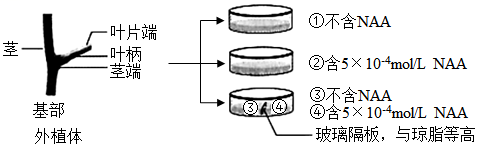

A. ③中的叶柄脱落率大于①，是因为④中NAA扩散至③

B. ④中的叶柄脱落率大于②，是因为④中乙烯浓度小于②

C. ①中的叶柄脱落率小于②，是因为茎端生长素浓度①低于②

D. ①中叶柄脱落率随时间延长而增高，是因为①中茎端生长素浓度逐渐升高

17\. 人的扣手行为属于常染色体遗传，右型扣手（A）对左型扣手（a）为显性。某地区人群中AA、Aa、aa基因型频率分别为0.16、0.20、0.64。下列叙述正确的是（ ）

A. 该群体中两个左型扣手的人婚配，后代左型扣手的概率为3/50

B. 该群体中两个右型扣手的人婚配，后代左型扣手的概率为25/324

C. 该群体下一代AA基因型频率为0.16，aa基因型频率为0.64

D. 该群体下一代A基因频率为0.4，a基因频率为0.6

18\. 研究发现在野生型果蝇幼虫中降低lint基因表达，能影响另一基因inr的表达（如图），导致果蝇体型变小等异常。下列叙述错误的是（ ）

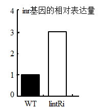

WT：野生型果蝇幼虫

*lint*Ri：降低*lint*基因表达后的幼虫

A. lint基因的表达对inr基因的表达有促进作用

B. 提高幼虫lint基因表达可能使其体型变大

C. 降低幼虫inr基因表达可能使其体型变大

D. 果蝇体型大小是多个基因共同作用的结果

19\. 半乳糖血症是F基因突变导致的常染色体隐性遗传病。研究发现F基因有两个突变位点I和II，任一位点突变或两个位点都突变均可导致F突变成致病基因。如表是人群中F基因突变位点的5种类型。下列叙述正确的是（ ）

| 类型突变位点 | ①   | ②   | ③   | ④   | ⑤   |
|:------:|:---:|:---:|:---:|:---:|:---:|
| I      | +/+ | +/- | +/+ | +/- | -/- |
| Ⅱ      | +/+ | +/- | +/- | +/+ | +/+ |

注：“+”表示未突变，“-”表示突变，“/”左侧位点位于父方染色体，右侧位点位于母方染色体

A. 若①和③类型的男女婚配，则后代患病的概率是1/2

B. 若②和④类型的男女婚配，则后代患病的概率是1/4

C. 若②和⑤类型的男女婚配，则后代患病的概率是1/4

D. 若①和⑤类型的男女婚配，则后代患病的概率是1/2

20\. 人卵细胞形成过程如图所示。在辅助生殖时对极体进行遗传筛查，可降低后代患遗传病的概率。一对夫妻因妻子高龄且是血友病a基因携带者（XAXa），需进行遗传筛查。不考虑基因突变，下列推断正确的是（ ）

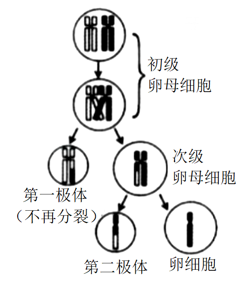

A. 若第二极体的染色体数目为22，则卵细胞染色体数目一定是24

B. 若第一极体的染色体数目为23，则卵细胞染色体数目一定是23

C. 若减数分裂正常，且第二极体X染色体有1个a基因，则所生男孩一定患病

D. 若减数分裂正常，且第一极体X染色体有2个A基因，则所生男孩一定患病

**二、非选择题：**

**必考题：**

21\. 人体内的蛋白可发生瓜氨酸化，部分人的B细胞对其异常敏感，而将其识别为抗原，产生特异性抗体ACPA，攻击人体细胞，导致患类风湿性关节炎。

（1）类风湿性关节炎是由于免疫系统的\_\_\_\_\_\_\_\_功能异常所致。

（2）如图①所示，CD20是所有B细胞膜上共有的受体，人工制备的CD20抗体通过结合CD20，破坏B细胞。推测这种疗法可以\_\_\_\_\_\_\_\_（填“缓解”或“根治”）类风湿性关节炎，其可能的副作用是\_\_\_\_\_\_\_\_。

（3）患者体内部分B细胞的膜上存在蛋白X（如图②）。为了专一破坏该类B细胞，研究人员设计了携带有SCP和药物的复合物。SCP是人工合成的瓜氨酸化蛋白的类似物，推测X应为\_\_\_\_\_\_\_\_。为检测SCP的作用，研究人员对健康小鼠注射了SCP，小鼠出现了类风湿性关节炎症状，原因可能是\_\_\_\_\_\_\_\_。

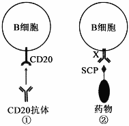

22\. 入侵植物水葫芦曾经在我国多地泛滥成灾。研究人员对某水域水葫芦入侵前后的群落特征进行了研究，结果见如表：

<table style="width:91%;">
<colgroup>
<col style="width: 10%" />
<col style="width: 5%" />
<col style="width: 10%" />
<col style="width: 38%" />
<col style="width: 25%" />
</colgroup>
<thead>
<tr>
<th colspan="2" style="text-align: center;">调查时段</th>
<th style="text-align: center;">物种数</th>
<th style="text-align: center;">植物类型</th>
<th style="text-align: center;">优势种</th>
</tr>
</thead>
<tbody>
<tr>
<td style="text-align: center;">入侵前</td>
<td style="text-align: center;">I</td>
<td style="text-align: center;">100</td>
<td style="text-align: center;">沉水植物、浮水植物、挺水植物</td>
<td style="text-align: center;">龙须眼子菜等多种</td>
</tr>
<tr>
<td rowspan="2" style="text-align: center;">入侵后</td>
<td style="text-align: center;">II</td>
<td style="text-align: center;">22</td>
<td style="text-align: center;">浮水植物、挺水植物</td>
<td style="text-align: center;">水葫芦、龙须眼子菜</td>
</tr>
<tr>
<td style="text-align: center;">Ⅲ</td>
<td style="text-align: center;">10</td>
<td style="text-align: center;">浮水植物</td>
<td style="text-align: center;">水葫芦</td>
</tr>
</tbody>
</table>

（1）I时段，该水域群落具有明显的\_\_\_\_\_\_\_\_结构；II时段，沉水植物消失，可能原因是\_\_\_\_\_\_\_\_。

（2）调查种群密度常用样方法，样方面积应根据种群个体数进行调整III时段群落中仍有龙须眼子菜，调查其种群密度时，取样面积应比II时段\_\_\_\_\_\_\_\_。

（3）在III时段对水葫芦进行有效治理，群落物种数和植物类型会\_\_\_\_\_\_\_\_（填“增加”、“减少”或“不变”），其原因是\_\_\_\_\_\_\_\_。

23\. 科学家发现，光能会被类囊体转化为“某种能量形式”，并用于驱动产生ATP（如图I）。为探寻这种能量形式，他们开展了后续实验。

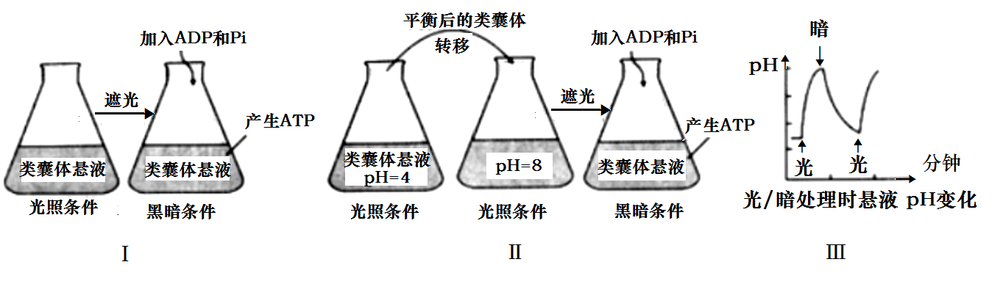

（1）制备类囊体时，提取液中应含有适宜浓度的蔗糖，以保证其结构完整，原因是\_\_\_\_\_\_\_\_；为避免膜蛋白被降解，提取液应保持\_\_\_\_\_\_\_\_（填“低温”或“常温”）。

（2）在图I实验基础上进行图II实验，发现该实验条件下，也能产生ATP。但该实验不能充分证明“某种能量形式”是类囊体膜内外的H+浓度差，原因是\_\_\_\_\_\_\_\_。

（3）为探究自然条件下类囊体膜内外产生H+浓度差的原因，对无缓冲液的类囊体悬液进行光、暗交替处理，结果如图III所示，悬液的pH在光照处理时升高，原因是\_\_\_\_\_\_\_\_。类囊体膜内外的H+浓度差是通过光合电子传递和H+转运形成的，电子的最终来源物质是\_\_\_\_\_\_\_\_。

（4）用菠菜类囊体和人工酶系统组装的人工叶绿体，能在光下生产目标多碳化合物。若要实现黑暗条件下持续生产，需稳定提供的物质有\_\_\_\_\_\_\_\_。生产中发现即使增加光照强度，产量也不再增加，若要增产，可采取的有效措施有\_\_\_\_\_\_\_\_（答两点）。

24\. 科学家用基因编辑技术由野生型番茄（HH）获得突变体番茄（hh），发现突变体中DML2基因的表达发生改变，进而影响乙烯合成相关基因ACS2等的表达及果实中乙烯含量（如图I、II），导致番茄果实成熟期改变。请回答以下问题：

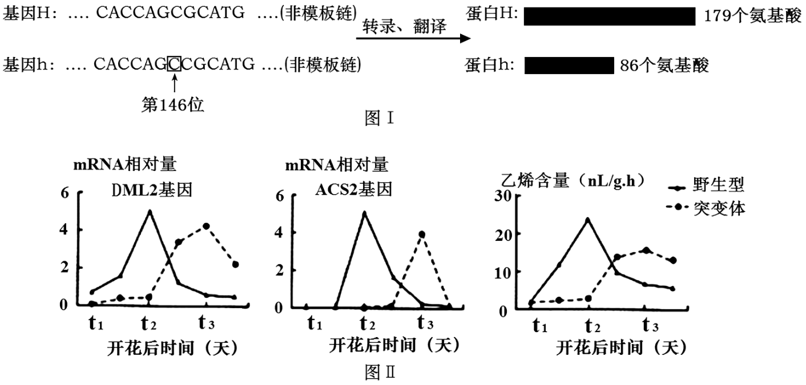

（1）图I中，基因h是由基因H编码区第146位碱基后插入一个C（虚线框所示）后突变产生，致使h蛋白比H蛋白少93个氨基酸，其原因是\_\_\_\_\_\_\_\_。基因h转录形成的mRNA上第49个密码子为\_\_\_\_\_\_\_\_。另有研究发现，基因H发生另一突变后，其转录形成的mRNA上有一密码子发生改变，但翻译的多肽链氨基酸序列和数量不变，原因是\_\_\_\_\_\_\_\_。

（2）图II中，t1～t2时段，突变体番茄中DML2基因转录的mRNA相对量低于野生型，推测在该时间段，H蛋白对DML2基因的作用是\_\_\_\_\_\_\_\_。突变体番茄果实成熟期改变的可能机制为：H突变为h后，由于DML2基因的作用，果实中ACS2基因\_\_\_\_\_\_\_\_，导致果实成熟期\_\_\_\_\_\_\_\_（填“提前”或“延迟”）。

（3）番茄果肉红色（R）对黄色（r）为显性。现用基因型为RrHH和Rrhh番茄杂交，获得果肉为红色、成熟期为突变体性状的纯合体番茄，请写出杂交选育过程（用基因型表示）。

**选考题：**

**\[选修1：生物技术实践\]（新高考为选择性必修三：生物技术与工程）**

25\. 研究发现柑橘精油可抑制大肠杆菌的生长。某兴趣小组采用水蒸气蒸馏法和压榨法提取了某种橘皮的精油（分别简称为HDO和CPO），并研究其抑菌效果的差异。

（1）为便于精油的提取，压榨前需用\_\_\_\_\_\_\_\_浸泡橘皮一段时间。在两种方法收集的油水混合物中均加入NaCl，其作用是\_\_\_\_\_\_\_\_；为除去油层中的水分，需加入\_\_\_\_\_\_\_\_。

（2）无菌条件下，该小组制备了两个大肠杆菌平板，用两片大小相同的无菌滤纸分别蘸取HDO和CPO贴于含菌平板上，37℃培养24h，抑菌效果见如图。有同学提出该实验存在明显不足：①未设置对照，设置本实验对照的做法是\_\_\_\_\_\_\_\_，其作用是\_\_\_\_\_\_\_\_；②不足之处还有\_\_\_\_\_\_\_\_（答两点）。

（3）若HDO的抑菌效果低于CPO，从提取方法的角度分析，主要原因是\_\_\_\_\_\_\_\_。

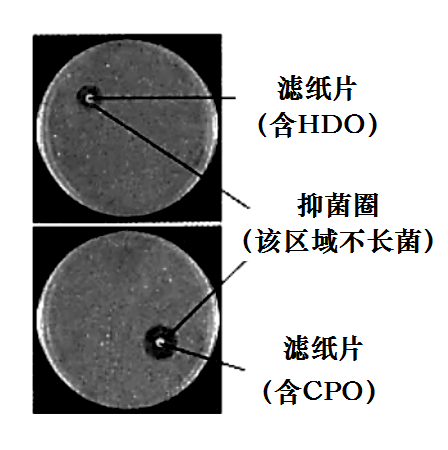

**\[选修3：现代生物科技专题\]（新高考为选择性必修三：生物技术与工程）**

26\. 改良水稻的株高和产量性状是实现袁隆平先生“禾下乘凉梦”的一种可能途径。研究人员克隆了可显著增高和增产的eui基因，并开展了相关探索。

步骤I：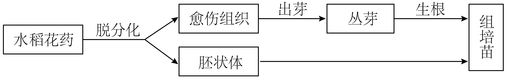

步骤II：

（1）花药培养能缩短育种年限，原因是\_\_\_\_\_\_\_\_。在步骤I的花药培养过程中，可产生单倍体愈伤组织，将其培养于含\_\_\_\_\_\_\_\_的培养基上，可促进产生二倍体愈伤组织。I中能用于制造人工种子的材料是\_\_\_\_\_\_\_\_。

（2）步骤II中，eui基因克隆于cDNA文库而不是基因组文库，原因是\_\_\_\_\_\_\_\_；在构建重组Ti质粒时使用的工具酶有\_\_\_\_\_\_\_\_。为筛选含重组Ti质粒的菌株，需在培养基中添加\_\_\_\_\_\_\_\_。获得的农杆菌菌株经鉴定后，应侵染I中的\_\_\_\_\_\_\_\_，以获得转基因再生植株。再生植株是否含有eui基因的鉴定方法是\_\_\_\_\_\_\_\_，移栽后若发育为更高且丰产的稻株，则可望“禾下乘凉”。
