**2022年重庆市普通高等学校全国统一招生选择性考试**

**生物试卷**

**一、单项选择题：**

1\. 以蚕豆根尖为实验材料，在光学显微镜下不能观察到的是（ ）

A. 中心体 B. 染色体 C. 细胞核 D. 细胞壁

【答案】A

【解析】

【分析】光学显微镜下可以观察到的结构有叶绿体、线粒体、液泡、染色体和细胞壁，光学显微镜下观察到的结构属于显微结构；光学显微镜下不能够观察到核糖体、细胞膜、中心体、叶绿体和线粒体的内部结构等，需要借助于电子显微镜，电子显微镜下观察到的结构属于亚显微结构。

【详解】A、中心体无色且体积小，光学显微镜下无法观察，需要借助于电子显微镜观察，且蚕豆高等植物，其根尖细胞中无中心体，A符合题意；

B、用光学显微镜观察染色体时，利用碱性染料着色，便能够进行观察，B不符合题意；

C、细胞核体积较大，在显微镜下很容易找到，C不符合题意；

D、细胞壁位于细胞的最外面，具有保护、支持细胞的功能，在显微镜下很容易找到，D不符合题意。

故选A。

2\. 如图为小肠上皮细胞吸收和释放铜离子的过程。下列关于该过程中铜离子的叙述，错误的是（ ）

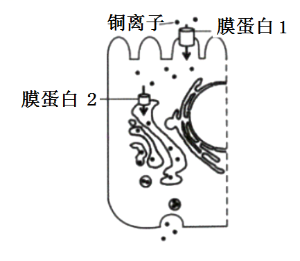

A 进入细胞需要能量 B. 转运具有方向性

C. 进出细胞的方式相同 D. 运输需要不同的载体

【答案】C

【解析】

【分析】物质运输方式的区别：

| 名称 | 运输方向 | 载体 | 能量 | 实例 |
|:--:|:--:|:--:|:--:|:--:|
| 自由扩散 | 高浓度→低浓度 | 不需 | 不需 | 水，CO2，O2，甘油，苯、酒精等 |
| 协助扩散 | 高浓度→低浓度 | 需要 | 不需 | 红细胞吸收葡萄糖 |
| 主动运输 | 低浓度→高浓度 | 需要 | 需要 | 小肠绒毛上皮细胞吸收氨基酸，葡萄糖，K+，Na+等 |

【详解】A、由图示可知，铜离子进入细胞是由低浓度向高浓度运输，需要载体，消耗能量，A正确；B、铜离子转运具有方向性，B正确；

C、铜离子进入细胞是主动运输，运出细胞是先通过协助扩散进入高尔基体，然后由高尔基体膜包裹通过胞吐运出细胞，C错误；

D、由图示可知进入细胞需要膜蛋白1协助，运出细胞需要膜蛋白2协助，D正确。

故选C。

3\. 将人胰岛素A链上1个天冬氨酸替换为甘氨酸，B链末端增加2个精氨酸，可制备出一种人工长效胰岛素。下列关于该胰岛素的叙述，错误的是（ ）

A. 进入人体后需经高尔基体加工 B. 比人胰岛素多了2个肽键

C. 与人胰岛素有相同的靶细胞 D. 可通过基因工程方法生产

【答案】A

【解析】

【分析】基因工程只能生产已有的蛋白质，人工长胰岛素A链有氨基酸的替换，B链增加了两个氨基酸，需要通过蛋白质工程生产。

【详解】A、胰岛素作用于细胞表面的受体，不需要经高尔基体的加工，A错误；

B、人工长效胰岛素比人胰岛素的B链上多了两个精氨酸，氨基酸与氨基酸之间通过肽键连接，故多2个肽键，B正确；

C、人工胰岛素和人胰岛素作用相同，都是降血糖的作用，故靶细胞相同，C正确；

D、人工长效胰岛素是对天然蛋白质的改造，需要通过基因工程生产，D正确。

故选A。

4\. 下列发现中，以DNA双螺旋结构模型为理论基础的是（ ）

A. 遗传因子控制性状 B. 基因在染色体上

C. DNA是遗传物质 D. DNA半保留复制

【答案】D

【解析】

【分析】1、DNA分子复制的特点：半保留复制；边解旋边复制。

2、DNA分子复制的场所：细胞核、线粒体和叶绿体。

3、DNA分子复制的过程：①解旋：在解旋酶的作用下，把两条螺旋的双链解开。②合成子链：以解开的每一条母链为模板，以游离的四种脱氧核苷酸为原料，遵循碱基互补配对原则，在有关酶的作用下，各自合成与母链互补的子链。③形成子代DNA：每条子链与其对应的母链盘旋成双螺旋结构。从而形成2个与亲代DNA完全相同的子代DNA分子。

4、DNA分子复制的时间：有丝分裂的间期和减数第一次分裂前的间期。

【详解】A、孟德尔利用假说—演绎法提出了生物的性状是由遗传因子控制的，总结出了分离定律，并未以DNA双螺旋结构模型为理论基础，A不符合题意；

B、萨顿根据基因与染色体的平行关系，运用类比推理法得出基因位于染色体上的推论，并未以DNA双螺旋结构模型为理论基础，B不符合题意；

C、艾弗里、赫尔希和蔡斯等科学家，设法将DNA和蛋白质分开，单独、直接地研究它们的作用，证明了DNA是遗传物质，并未以DNA双螺旋结构模型为理论基础，C不符合题意；

D、沃森和克里克成功构建DNA双螺旋结构模型，并进一步提出了DNA半保留复制的假说， DNA半保留复制，以DNA双螺旋结构模型为理论基础，D符合题意。

故选D。

5\. 合理均衡的膳食对维持人体正常生理活动有重要意义。据下表分析，叙述错误的是（ ）

<table style="width:85%;">
<colgroup>
<col style="width: 24%" />
<col style="width: 15%" />
<col style="width: 16%" />
<col style="width: 14%" />
<col style="width: 14%" />
</colgroup>
<thead>
<tr>
<th style="text-align: center;">
项目

食物（100g）
</th>
<th style="text-align: center;">能量（kJ）</th>
<th style="text-align: center;">蛋白质（g）</th>
<th style="text-align: center;">脂肪（g）</th>
<th style="text-align: center;">糖类（g）</th>
</tr>
</thead>
<tbody>
<tr>
<td style="text-align: center;">①</td>
<td style="text-align: center;">880</td>
<td style="text-align: center;">6.2</td>
<td style="text-align: center;">1.2</td>
<td style="text-align: center;">44.2</td>
</tr>
<tr>
<td style="text-align: center;">②</td>
<td style="text-align: center;">1580</td>
<td style="text-align: center;">13.2</td>
<td style="text-align: center;">37.0</td>
<td style="text-align: center;">2.4</td>
</tr>
<tr>
<td style="text-align: center;">③</td>
<td style="text-align: center;">700</td>
<td style="text-align: center;">29.3</td>
<td style="text-align: center;">3.4</td>
<td style="text-align: center;">1.2</td>
</tr>
</tbody>
</table>

A. 含主要能源物质最多的是②

B. 需控制体重的人应减少摄入①和②

C. 青少年应均衡摄入①、②和③

D. 蛋白质、脂肪和糖类都可供能

【答案】A

【解析】

【分析】1、蛋白质是生命活动的主要承担者，蛋白质的结构多样，在细胞中承担的功能也多样：①有的蛋白质是细胞结构的重要组成成分，如肌肉蛋白；②有的蛋白质具有催化功能，如大多数酶的本质是蛋白质；③有的蛋白质具有运输功能，如载体蛋白和血红蛋白；④有的蛋白质具有信息传递，能够调节机体的生命活动，如胰岛素；⑤有的蛋白质具有免疫功能，如抗体。

2、糖类分为单糖、二糖和多糖，葡萄糖、核糖、脱氧核糖等不能水解的糖称为单糖，由2个单糖脱水缩合形成的糖称为二糖，多糖有淀粉、纤维素和糖原，糖原是动物细胞的储能物质，淀粉是植物细胞的储能物质，纤维素是植物细胞壁的成分。

3、脂肪是最常见的脂质，是细胞内良好的储能物质，还是一种良好的绝热体，起保温作用，分布在内脏周围的脂肪还具有缓冲和减压的作用，可以保护内脏器官。

【详解】A、人体主要能源物质是糖类，表中主要能源物质最多的是①，A错误；

B、食物①和②中分别富含糖类和脂肪，所以需控制体重的人应减少摄入①和②，B正确；

C、食物①、②和③中分别富含糖类、脂肪和蛋白质，所以青少年应均衡摄入①、②和③有利于身体的发育，C正确；

D、蛋白质、脂肪和糖类都属于储存能量的有机物，因而都可供能，D正确。

故选A。

6\. 某化合物可使淋巴细胞分化为吞噬细胞。实验小组研究了该化合物对淋巴细胞的影响，结果见如表。下列关于实验组的叙述，正确的是（ ）

|  分组  |         细胞特征         | 核DNA含量增加的细胞比例 | 吞噬细菌效率 |
|:------:|:------------------------:|:-----------------------:|:------------:|
| 对照组 |         均呈球形         |         59.20%          |    4.61%     |
| 实验组 | 部分呈扁平状，溶酶体增多 |          9.57%          |    18.64%    |

A. 细胞的形态变化是遗传物质改变引起的

B. 有9.57%的细胞处于细胞分裂期

C. 吞噬细菌效率的提高与溶酶体增多有关

D. 去除该化合物后扁平状细胞会恢复成球形

【答案】C

【解析】

【分析】细胞分化是指在个体发育中，由一个或一种细胞增殖产生的后代，在形态、结构和生理功能上发生稳定性差异的过程。细胞分化的实质是基因的选择性表达，即不同细胞基因表达情况不同，如血红蛋白基因只在红细胞中表达。

【详解】A、细胞的形态变化是基因的选择性表达，遗传物质没有发生改变，A错误；

B、由表格信息可知，核DNA含量增加的细胞比例为9.57%，包括G2期、有丝分裂前期、中期、后期，B错误；

C、吞噬细胞中的溶酶体释放消化酶，可分解进入细胞的细菌，因此吞噬细菌效率的提高与吞噬细胞中溶酶体增多有关，C正确；

D、去除该化合物后扁平状细胞不再分裂分化，扁平状细胞不会恢复成球形，D错误。

故选C。

7\. 植物蛋白酶M和L能使肉类蛋白质部分水解，可用于制作肉类嫩化剂。某实验小组测定并计算了两种酶在37℃、不同pH下的相对活性，结果见如表。下列叙述最合理的是（ ）

| pH酶相对活性 |  3  |  5  |  7  |  9  | 11  |
|:------------:|:---:|:---:|:---:|:---:|:---:|
|      M       | 0.7 | 1.0 | 1.0 | 1.0 | 0.6 |
|      L       | 0.5 | 1.0 | 0.5 | 0.2 | 0.1 |

A. 在37℃时，两种酶的最适pH均为3

B. 在37℃长时间放置后，两种酶的活性不变

C. 从37℃上升至95℃，两种酶在pH为5时仍有较高活性

D. 在37℃、pH为3~11时，M更适于制作肉类嫩化剂

【答案】D

【解析】

【分析】分析表格数据：表中表示两种酶在37°C、不同pH下的相对活性。根据表中数据可知，M的适宜pH为5~9，而L的适宜pH为5左右；在37°C、pH为3~11时，M比L的相对活性高。

【详解】A、根据表格数据可知，在37°C时，M的适宜pH为5~9，而L的适宜pH为5左右，A错误；

B、酶适宜在低温条件下保存，在37°C长时间放置后，两种酶的活性会发生改变，B错误；

C、酶发挥作用需要适宜的温度，高温会导致酶变性失活，因此从37°C上升至95°C，两种酶在pH为5时都已经失活，C错误；

D、在37°C、pH为3~11时，M比L的相对活性高，因此M更适于制作肉类嫩化剂，D正确。

故选D。

8\. 如图为两种细胞代谢过程的示意图。转运到神经元的乳酸过多会导致其损伤。下列叙述错误的是（ ）

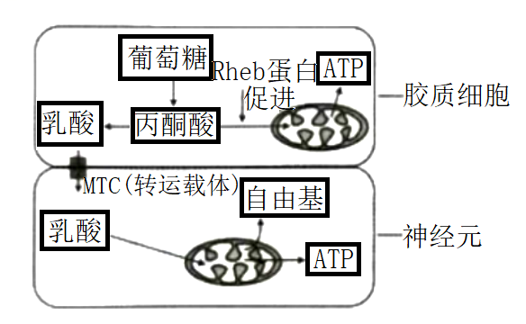

A. 抑制MCT可降低神经元损伤

B. Rheb蛋白失活可降低神经元损伤

C. 乳酸可作为神经元的能源物质

D. 自由基累积可破坏细胞内的生物分子

【答案】B

【解析】

【分析】分析图形：图中胶质细胞中的葡萄糖分解成丙酮酸后一方面在Rheb蛋白的作用下，促进丙酮酸进入线粒体氧化分解供能，另一方面，丙酮酸转变成乳酸，乳酸经MCT运输进入神经元，进入线粒体分解产生自由基和ATP。

【详解】A、抑制MCT，可减少乳酸进入神经元，减少自由基的产生，降低神经元损伤，A正确；

B、Rheb蛋白能促进丙酮酸进入线粒体氧化分解供能，而Rheb蛋白失活会导致乳酸进入神经元的量更多，产生更多的自由基，使神经元损伤增加，B错误；

C、图中乳酸能进入神经元的线粒体分解，产生ATP，故可作为神经元的能源物质，C正确；

D、自由基可使蛋白质活性降低，自由基可攻击DNA分子导致DNA损伤，故自由基累积可破坏细胞内的生物分子，D正确。

故选B。

9\. 双酚A是一种干扰内分泌的环境激素，进入机体后能通过与雌激素相同的方式影响机体功能。下列关于双酚A的叙述，正确的是（ ）

A. 通过体液运输发挥作用

B. 进入机体后会引起雌激素的分泌增加

C. 不能与雌激素受体结合

D. 在体内大量积累后才会改变生理活动

【答案】A

【解析】

【分析】激素的作用：激素种类多、含量极微，既不组成细胞结构，也不提供能量，只起到调节生命活动的作用。

【详解】A、双酚A是一种环境激素，进入机体后能通过与雌激素相同的方式影响机体功能，说明双酚A也是通过体液运输发挥作用，A正确；

B、由题意“双酚A进入机体后能通过与雌激素相同的方式影响机体功能”可知，双酚A进入机体能通过负反馈调节，抑制下丘脑、垂体分泌促性腺激素释放激素、促性腺激素，进而导致雌激素的分泌减少，B错误；

C、由题意“双酚A进入机体后能通过与雌激素相同的方式影响机体功能”可知，双酚A能与雌激素受体特异性结合，C错误；

D、激素的含量极微，但其作用显著，双酚A通过与雌激素相同的方式影响机体功能，说明双酚A的含量极微，但作用显著，D错误。

故选A。

10\. 某同学登山后出现腿部肌肉酸痛，一段时间后缓解。查阅资料得知，肌细胞生成的乳酸可在肝脏转化为葡萄糖被细胞再利用。下列叙述正确的是（ ）

A. 酸痛是因为乳酸积累导致血浆pH显著下降所致

B. 肌细胞生成的乳酸进入肝细胞只需通过组织液

C. 乳酸转化为葡萄糖的过程在内环境中进行

D. 促进乳酸在体内的运输有利于缓解酸痛

【答案】D

【解析】

【分析】人在剧烈运动时，细胞代谢旺盛，氧气供应不足导致肌肉细胞无氧呼吸产生乳酸；内环境的理化性质主要包括温度、pH和渗透压：（1）人体细胞外液的温度一般维持在37°C左右；（2）正常人的血浆接近中性，pH为7.35~7.45，血浆的pH之所以能够保持稳定，与它含有的缓冲物质有关；（3）血浆渗透压的大小主要与无机盐、蛋白质的含量有关。

【详解】A、肌肉酸痛是因机体产生乳酸积累造成的，但由于血浆存在缓冲物质的调节作用，血浆pH下降并不明显，A错误；

B、肌细胞生成的乳酸进入肝细胞需要血液和组织液的运输，B错误；

C、乳酸转化为葡萄糖的过程在肝细胞中进行，C错误；

D、肌细胞生成的乳酸可在肝脏转化为葡萄糖被细胞再利用，该过程促进乳酸在体内的运输，降低内环境中乳酸的含量，有利于缓解酸痛，D正确。

故选D。

11\. 在一定条件下，斐林试剂可与葡萄糖反应生成砖红色沉淀，去除沉淀后的溶液蓝色变浅，测定其吸光值可用于计算葡萄糖含量。下表是用该方法检测不同样本的结果。下列叙述正确的是（ ）

|        样本         |   ①   |   ②   |   ③   |   ④   |   ⑤   |   ⑥   |
|:-------------------:|:-----:|:-----:|:-----:|:-----:|:-----:|:-----:|
|       吸光值        | 0.616 | 0.606 | 0.595 | 0.583 | 0.571 | 0.564 |
| 葡萄糖含量（mg/mL） |   0   |  0.1  |  0.2  |  0.3  |  0.4  |  0.5  |

A. 斐林试剂与样本混合后立即生成砖红色沉淀

B. 吸光值与样本的葡萄糖含量有关，与斐林试剂的用量无关

C. 若某样本的吸光值为0.578，则其葡萄糖含量大于0.4mg/mL

D. 在一定范围内葡萄糖含量越高，反应液去除沉淀后蓝色越浅

【答案】D

【解析】

【分析】斐林试剂可用于鉴定还原糖，在水浴加热的条件下，溶液的颜色变化为砖红色（沉淀）。斐林试剂只能检验生物组织中还原糖（如葡萄糖、麦芽糖、果糖）存在与否，而不能鉴定非还原性糖（如淀粉）。斐林试剂是由甲液（质量浓度为0.1g/mL氢氧化钠溶液）和乙液（质量浓度为0.05g/mL硫酸铜溶液）组成，使用时要将甲液和乙液混合均匀后再加入含样品的试管中，生成的砖红色沉淀是氧化亚铜。

【详解】A、斐林试剂可用于鉴定还原糖，在水浴加热的条件下，会产生砖红色沉淀，A错误；

B、吸光值与溶液的浓度有关，故与样本的葡萄糖含量和斐林试剂的均用量有关，B错误；

C、由表格内容可知，葡萄糖含量越高，吸光值越小，若某样本的吸光值为0.578，则其葡萄糖含量小于0.4mg/mL，即葡萄糖含量在0.3mg/mL～0.4mg/mL，C错误；

D、在一定范围内葡萄糖含量越高，生成的砖红色沉淀（氧化亚铜）越多，反应液去除沉淀后的溶液中游离的Cu2+越少，则蓝色越浅，D正确。

故选D。

12\. 从如图中选取装置，用于探究酵母菌细胞呼吸方式，正确的组合是（ ）

<table>
<colgroup>
<col style="width: 20%" />
<col style="width: 20%" />
<col style="width: 23%" />
<col style="width: 34%" />
</colgroup>
<thead>
<tr>
<th style="text-align: center;">
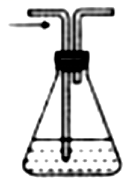

酵母菌培养液①
</th>
<th style="text-align: center;">
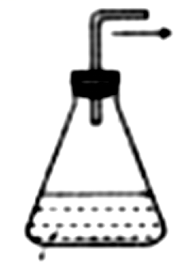

酵母菌培养液②
</th>
<th style="text-align: center;">

澄清的石灰水③
</th>
<th style="text-align: center;">
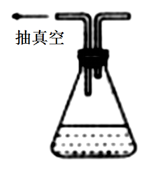

酵母菌培养液④
</th>
</tr>
</thead>
<tbody>
<tr>
<td style="text-align: center;">
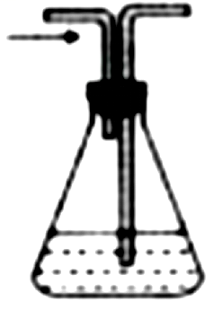

酵母菌培养液⑤
</td>
<td style="text-align: center;">
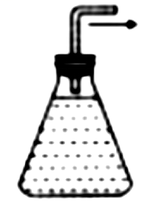

酵母菌培养液⑥
</td>
<td style="text-align: center;">
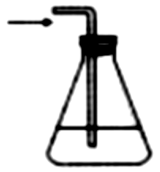

澄清的石灰水⑦
</td>
<td style="text-align: center;">

质量分数为10%的NaOH溶液⑧
</td>
</tr>
</tbody>
</table>

注：箭头表示气流方向

A. ⑤→⑧→⑦和⑥→③ B. ⑧→①→③和②→③

C. ⑤→⑧→③和④→⑦ D. ⑧→⑤→③和⑥→⑦

【答案】B

【解析】

【分析】酵母菌的代谢类型为异养兼性厌氧型。

（1）在有氧条件下，反应式如下：能量；

（2）在无氧条件下，反应式如下：能量。

【详解】酵母菌属于异养兼性厌氧型生物，既能进行有氧呼吸，又能进行无氧呼吸。进行有氧呼吸时，先用NaOH去除空气中的CO2，再将空气通入酵母菌培养液，最后连接澄清石灰水检测CO2的浓度，通气体的管子要注意应该长进短出，装置组合是⑧→①→③；无氧呼吸装置是直接将酵母菌培养液与澄清石灰水相连，装酵母菌溶液的瓶子不能太满，以免溢出，装置组合是②→③，B正确，ACD错误。

故选B。

13\. 如图表示人动脉血压维持相对稳定的一种反射过程。动脉血压正常时，过高过紧的衣领会直接刺激颈动脉窦压力感受器，引起后续的反射过程，使人头晕甚至晕厥，即“衣领综合征”。下列叙述错误的是（ ）

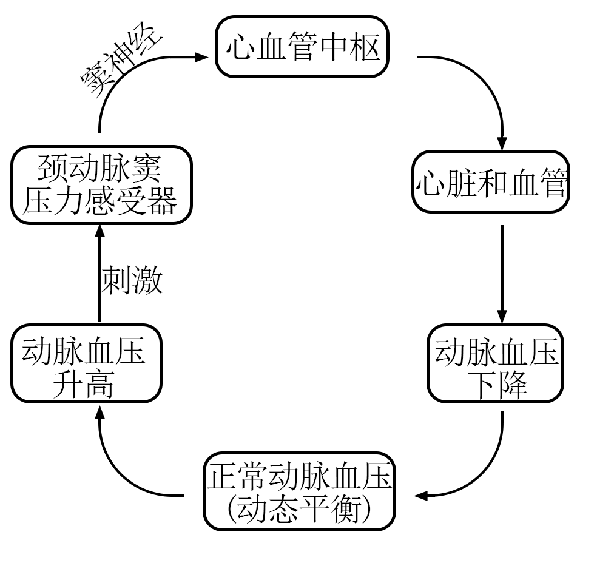

A. 窦神经受损时，颈动脉窦压力感受器仍可产生兴奋

B. 动脉血压的波动可通过神经调节快速恢复正常

C. “衣领综合征”是反射启动后引起血压升高所致

D. 动脉血压维持相对稳定的过程体现了负反馈调节作用

【答案】C

【解析】

【分析】1、反射：在中枢神经系统的参与下，动物体或人体对外界环境变化作出的规律性应答。2、反射弧是反射活动的结构基础，包括5部分：①感受器：感受刺激，将外界刺激的信息转变为神经的兴奋；②传入神经：将兴奋传入神经中枢；③神经中枢：对兴奋进行分析综合；④传出神经：将兴奋由神经中枢传至效应器；⑤效应器：对外界刺激作出反应。

【详解】A、感受器的功能是感受刺激，将外界刺激的信息转变为神经的兴奋，窦神经是传入神经，连接在感受器之后，故窦神经受损时，颈动脉窦压力感受器仍可产生兴奋，A正确；

B、由图可知，动脉血压升高时，可通过反射弧的调节动脉血压下降，最终使动脉血压维持动态平衡，而神经调节具有速度快的特点，B正确；

C、“衣领综合征”是血压升高启动反射，使动脉血压下降所致，C错误；

D、在一个系统中，系统本身工作的效果可以反过来作为信息调节该系统的工作，这种方式叫反馈调节，由图可知，动脉血压维持相对稳定的过程体现了负反馈调节作用，D正确。

故选C。

14\. 乔木种群的径级结构（代表年龄组成）可以反映种群与环境之间的相互关系，预测种群未来发展趋势。研究人员调查了甲、乙两地不同坡向某种乔木的径级结构，结果见如图。下列叙述错误的是（ ）

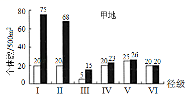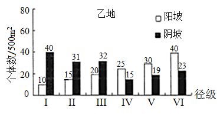

注：I和II为幼年期，III和IV为成年期，V和VI为老年期

A. 甲地III径级个体可能在幼年期经历了干旱等不利环境

B. 乙地阳坡的种群密度比甲地阳坡的种群密度低

C. 甲、乙两地阳坡的种群年龄结构分别为稳定型和衰退型

D. 甲、乙两地阴坡的种群增长曲线均为S型

【答案】B

【解析】

【分析】种群的特征包括种群密度、出生率和死亡率、迁入率和迁出率、年龄组成和性别比例。其中，种群密度是种群最基本的数量特征；出生率和死亡率对种群数量起着决定性作用；年龄组成可以预测一个种群数量发展的变化趋势，年龄组成包括增长型、稳定型和衰退型。

【详解】A、由甲地个体数的柱形图可知，甲地III径级个体数量明显少于其他径级，可能在幼年期经历了干旱等不利环境，A正确；

B、乙地阳坡的种群密度为(10+15+20+25+30+40)=140个/500m2，甲地阳坡的种群密度为(20+20+5+20+25+20)=110个/500m2，故乙地阳坡的种群密度比甲地阳坡的种群密度高，B错误；

C、甲地阳坡各径级的个体数相当，属于稳定型；乙地阳坡的老年期个体数\>中年期个体数\>幼年期个体数，属于衰退型，C正确；

D、甲、乙两地阴坡的种群数量均有幼年时期个体数多（增长快）、老年期数量趋于稳定的特点，故二者种群增长曲线均为S型，D正确。

故选B。

15\. 植物体细胞通常被诱导为愈伤组织后才能表现全能性。研究发现，愈伤组织的中层细胞是根或芽再生的源头干细胞，其在不同条件下，通过基因的特异性表达调控生长素、细胞分裂素的作用，表现出不同的效应（见如表）。已知生长素的生理作用大于细胞分裂素时有利于根的再生；反之，有利于芽的再生。下列推论不合理的是（ ）

| 条件 | 基因表达产物和相互作用 |      效应      |
|:----:|:----------------------:|:--------------:|
|  ①   |          WOX5          | 维持未分化状态 |
|  ②   |        WOX5+PLT        |    诱导出根    |
|  ③   |  WOX5+ARR2，抑制ARR5   |    诱导出芽    |

A. WOX5失活后，中层细胞会丧失干细胞特性

B. WOX5+PLT可能有利于愈伤组织中生长素的积累

C. ARR5促进细胞分裂素积累或提高细胞对细胞分裂素的敏感性

D. 体细胞中生长素和细胞分裂素的作用可能相互抑制

【答案】C

【解析】

【分析】植物细胞一般具有全能性。在一定的激素和营养等条件的诱导下，已经分化的细胞可以经过脱分化，即失去其特有的结构和功能，转变成未分化的细胞，进而形成不定形的薄壁组织团块，这称为愈伤组织。愈伤组织能重新分化成芽、根等器官，该过程称为再分化。植物激素中生长素和细胞分裂素是启动细胞分裂、脱分化和再分化的关键激素。生长素的用量比细胞分裂素用量，比值高时，有利于根的分化、抑制芽的形成；比值低时，有利于芽的分化、抑制根的形成。比值适中时，促进愈伤组织的形成。

【详解】A、根据表格信息可知，WOX5能维持未分化状态，使植物细胞保持分裂能力强、较大的全能性，若WOX5失活后，中层细胞会丧失干细胞分裂能力强、分化程度低的特性，A正确；

B、由题干信息“生长素的生理作用大于细胞分裂素时有利于根的再生”，再结合表格信息，WOX5+PLT可能诱导出根，可推测WOX5+PLT可能有利于愈伤组织中生长素的积累，B正确；

C、由题意可知，生长素的生理作用小于细胞分裂素时有利于芽的再生，而抑制ARR5能诱导出芽，可知ARR5被抑制时细胞分裂素较多，故可推测ARR5抑制细胞分裂素积累或降低细胞对细胞分裂素的敏感性，C错误；

D、由题干信息可知，出芽或出根都是生长素与细胞分裂素含量不均衡时才会发生，故可推测体细胞中生长素和细胞分裂素的作用可能相互抑制，D正确。

故选C。

16\. 当茎端生长素的浓度高于叶片端时，叶片脱落，反之不脱落；乙烯会促进叶片脱落。为验证生长素和乙烯对叶片脱落的影响，某小组进行了如图所示实验：制备长势和大小一致的外植体，均分为4组，分别将其基部插入培养皿的琼脂中，封严皿盖，培养并观察。根据实验结果分析，下列叙述合理的是（ ）

A. ③中的叶柄脱落率大于①，是因为④中NAA扩散至③

B. ④中的叶柄脱落率大于②，是因为④中乙烯浓度小于②

C. ①中的叶柄脱落率小于②，是因为茎端生长素浓度①低于②

D. ①中叶柄脱落率随时间延长而增高，是因为①中茎端生长素浓度逐渐升高

【答案】C

【解析】

【分析】分析题意，当茎端生长素的浓度高于叶片端时，叶片脱落，反之不脱落；乙烯会促进叶片脱落

【详解】A、③和④之间有玻璃隔板，与琼脂等高，④中的NAA不会扩散至③，但④的NAA浓度较高，可促进④生成乙烯，乙烯是气体，可扩散作用于③，导致③中的叶柄脱落率大于①，A错误；

B、乙烯会促进叶片脱落，④中的叶柄脱落率大于②，据此推知④中乙烯浓度不会小于②，B错误；

C、由题意可知，茎端生长素的浓度高于叶片端时，叶片脱落，①中的叶柄脱落率小于②，②中的茎端生长素浓度高于①，C正确；

D、①中叶柄脱落率随时间延长而增高，是因为植物成熟后会释放乙烯，乙烯会促进叶片脱落，D错误。

故选C。

17\. 人的扣手行为属于常染色体遗传，右型扣手（A）对左型扣手（a）为显性。某地区人群中AA、Aa、aa基因型频率分别为0.16、0.20、0.64。下列叙述正确的是（ ）

A. 该群体中两个左型扣手的人婚配，后代左型扣手的概率为3/50

B. 该群体中两个右型扣手人婚配，后代左型扣手的概率为25/324

C. 该群体下一代AA基因型频率为0.16，aa基因型频率为0.64

D. 该群体下一代A基因频率为0.4，a基因频率为0.6

【答案】B

【解析】

【分析】根据AA、Aa、aa基因型频率分别为0.16、0.20、0.64，分别是4/25、1/5、16/25，可知人群中A的基因频率=0.16+0.20×1/2=13/50，则a的基因频率=1－13/50=37/50。

【详解】A、该群体中两个左型扣手的人（基因型均为aa）婚配，后代左型扣手的概率为1，A错误；

B、根据AA、Aa、aa基因型频率分别为0.16、0.20、0.64，分别是4/25、1/5、16/25，可知人群中A的基因频率=0.16+0.20×1/2=13/50，则a的基因频率=1－13/50=37/50，该群体中两个右型扣手的人婚配，人群中右型扣手的杂合子所占概率为1/5÷（4/25+1/5）=5/9 ，二者后代左型扣手（基因型为aa）的概率为5/9×5/9×1/4=25/324 ，B正确；

C、由B选项分析可知，人群中A的基因频率=13/50 ，a的基因频率37/50 ，根据遗传平衡定律，下一代AA基因型频率为（13/50）2=169/2500=0.0676 ，aa基因型频率为（37/50）2=0.5476 ，C错误；

D、根据遗传平衡定律，每一代的基因频率都不变，下一代A基因频率为（0.16+0.20×1/2）=0.26 ，a的基因频率为1－0.26=0.74 ，D错误。

故选B。

18\. 研究发现在野生型果蝇幼虫中降低lint基因表达，能影响另一基因inr的表达（如图），导致果蝇体型变小等异常。下列叙述错误的是（ ）

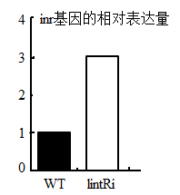

WT：野生型果蝇幼虫

*lint*Ri：降低*lint*基因表达后的幼虫

A. lint基因的表达对inr基因的表达有促进作用

B. 提高幼虫lint基因表达可能使其体型变大

C. 降低幼虫inr基因表达可能使其体型变大

D. 果蝇体型大小是多个基因共同作用的结果

【答案】A

【解析】

【分析】野生型果蝇幼虫inr的相对表达量较低，降低了lint基因表达后的果蝇幼虫，inr基因的相对表达量提高，说明lint基因能抑制int基因的表达；又当int表达量增加时，果蝇体型变小，可知lint基因表达量增加果蝇体型较大。

【详解】A、对比野生型果蝇幼虫的inr的表达量可知，降低lint基因表达后，幼虫体内的inr基因的表达量显著上升，说明lint基因的表达对inr基因的表达有抑制作用，A错误；

BC、根据题干信息可知，inr的表达量增加后“导致果蝇体型变小”，可推测提高幼虫lint基因表达，inr的表达量下降，进而可能使果蝇体型变大，B正确，C正确；

D、由以上分析可知，果蝇体型大小与lint基因和inr基因都有关，说明果蝇体型大小是多个基因共同作用的结果，D正确。

故选A。

19\. 半乳糖血症是F基因突变导致的常染色体隐性遗传病。研究发现F基因有两个突变位点I和II，任一位点突变或两个位点都突变均可导致F突变成致病基因。如表是人群中F基因突变位点的5种类型。下列叙述正确的是（ ）

| 类型突变位点 |  ①  |  ②  |  ③  |  ④  |  ⑤  |
|:------------:|:---:|:---:|:---:|:---:|:---:|
|      I       | +/+ | +/- | +/+ | +/- | -/- |
|      Ⅱ       | +/+ | +/- | +/- | +/+ | +/+ |

注：“+”表示未突变，“-”表示突变，“/”左侧位点位于父方染色体，右侧位点位于母方染色体

A. 若①和③类型的男女婚配，则后代患病的概率是1/2

B. 若②和④类型的男女婚配，则后代患病的概率是1/4

C. 若②和⑤类型的男女婚配，则后代患病的概率是1/4

D. 若①和⑤类型的男女婚配，则后代患病的概率是1/2

【答案】B

【解析】

【分析】根据题意，“F基因突变导致的常染色体隐性遗传病”，“任一位点突变或两个位点都突变均可导致F突变成致病基因”，用F/f表示相关基因，只要有一个突变位点，就能出现f基因，故①②③④的基因型分别是FF、Ff、Ff、Ff，⑤由于父方和母方的染色体都在I位点突变，所以基因型是ff。

【详解】A、若①和③类型的男女婚配，①基因型是FF，③的基因型是Ff，则后代患病的概率是0，A错误；

B、若②和④类型的男女婚配，②的基因型是Ff，④的基因型是Ff，则后代患病（基因型为ff）的概率是1/4，B正确；

C、若②和⑤类型的男女婚配，②的基因型是Ff，⑤的基因型为ff，则后代患病（基因型为ff）的概率是1/2，C错误；

D、若①和⑤类型的男女婚配，①基因型是FF，⑤的基因型为ff，则后代患病的概率是0，D错误。

故选：B。

20\. 人卵细胞形成过程如图所示。在辅助生殖时对极体进行遗传筛查，可降低后代患遗传病的概率。一对夫妻因妻子高龄且是血友病a基因携带者（XAXa），需进行遗传筛查。不考虑基因突变，下列推断正确的是（ ）

A. 若第二极体的染色体数目为22，则卵细胞染色体数目一定是24

B. 若第一极体的染色体数目为23，则卵细胞染色体数目一定是23

C. 若减数分裂正常，且第二极体X染色体有1个a基因，则所生男孩一定患病

D. 若减数分裂正常，且第一极体X染色体有2个A基因，则所生男孩一定患病

【答案】D

【解析】

【分析】减数分裂过程：①细胞分裂前的间期：细胞进行DNA复制；②MI前期：同源染色体联会，形成四分体，形成染色体、纺锤体，核仁核膜消失，同源染色体非姐妹染色单体可能会发生交叉互换；③MI中期：同源染色体着丝粒对称排列在赤道板两侧；④MI后期：同源染色体分离，非同源染色体自由组合，移向细胞两极；⑤MI末期：细胞一分为二，形成次级精母细胞或形成次级卵母细胞和第一极体；⑥MII前期：次级精母细胞形成纺锤体，染色体散乱排布；⑦MII中期：染色体着丝粒排在赤道板上；⑧MII后期：染色体着丝粒分离，姐妹染色单体移向两极；⑨MII末期：细胞一分为二，次级精母细胞形成精细胞，次级卵母细胞形成卵细胞和第二极体。

【详解】A、若在初级卵母细胞进行减数第一次分裂后期时，某对同源染色体没有分离，第一极体有24条染色体，次级卵母细胞有22条染色体，则会出现第二极体和卵细胞的染色体数目都为22，A错误；

B、人类的染色体2N=46，若第一极体的染色体数目为23，则次级卵母细胞染色体数目一定是23，如果次级卵母细胞在减数第二次分裂出现姐妹染色单体不分离、移向细胞同一极，则卵细胞染色体数目可能为22或24，B错误；

C、若减数分裂正常，由于之前的交叉互换有可能使同一条染色体上的姐妹染色单体携带等位基因，故第二极体X染色体有1个a基因，卵细胞中也可能是XA基因，则所生男孩可能不患病，C错误；

D、若减数分裂正常，且第一极体X染色体有2个A基因，不考虑基因突变，则次级卵母细胞中有两个a基因，卵细胞中也会携带a基因，则所生男孩一定患病，D正确。

故选D。

**二、非选择题：**

**必考题：**

21\. 人体内的蛋白可发生瓜氨酸化，部分人的B细胞对其异常敏感，而将其识别为抗原，产生特异性抗体ACPA，攻击人体细胞，导致患类风湿性关节炎。

（1）类风湿性关节炎是由于免疫系统的\_\_\_\_\_\_\_\_功能异常所致。

（2）如图①所示，CD20是所有B细胞膜上共有的受体，人工制备的CD20抗体通过结合CD20，破坏B细胞。推测这种疗法可以\_\_\_\_\_\_\_\_（填“缓解”或“根治”）类风湿性关节炎，其可能的副作用是\_\_\_\_\_\_\_\_。

（3）患者体内部分B细胞的膜上存在蛋白X（如图②）。为了专一破坏该类B细胞，研究人员设计了携带有SCP和药物的复合物。SCP是人工合成的瓜氨酸化蛋白的类似物，推测X应为\_\_\_\_\_\_\_\_。为检测SCP的作用，研究人员对健康小鼠注射了SCP，小鼠出现了类风湿性关节炎症状，原因可能是\_\_\_\_\_\_\_\_。

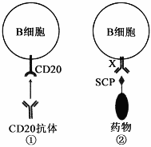

【答案】（1）免疫自稳

（2） ①. 根治 ②. 降低体液免疫能力，机体对外来病原体的免疫能力减弱

（3） ①. 抗体 ②. 其他B细胞识别了SCP，产生ACPA攻击SCP的同时，也攻击人体B细胞

【解析】

【分析】自身免疫病是指机体对自身抗原发生免疫反应而导致自身组织损害所引起的疾病．举例：风湿性心脏病、类风湿性关节炎、系统性红斑狼疮等。

【小问1详解】

类风湿性关节炎属于自身免疫病，免疫自稳是指机体清除衰老或损伤的细胞，进行自身调节，维持内环境稳态的功能，若该功能异常，则容易发生自身免疫病。

【小问2详解】

由题意可知，B细胞由于误将人体内发生瓜氨酸化的蛋白识别为抗原，产生特异性抗体攻击人体细胞，进而引起类风湿性关节炎，B细胞与抗原的识别是通过CD20受体进行的，由于CD20是所有B细胞膜上共有的受体，故人工制备的CD20抗体结合CD20之后，B细胞不再能识别瓜氨酸化的蛋白，也就不再攻击人体细胞，可根治类风湿性关节炎。但B细胞同时也不能识别外来病原体，可能会带来降低体液免疫能力，机体对外来病原体的免疫能力减弱的副作用。

【小问3详解】

SCP是人工合成瓜氨酸化蛋白的类似物，类似于抗原，B细胞膜上的蛋白X能与其结合，推测X应为抗体。研究人员对健康小鼠注射了SCP，小鼠出现了类风湿性关节炎症状，原因可能是其他B细胞识别了SCP，产生ACPA攻击SCP的同时，也攻击B细胞。

22\. 入侵植物水葫芦曾经在我国多地泛滥成灾。研究人员对某水域水葫芦入侵前后的群落特征进行了研究，结果见如表：

<table style="width:91%;">
<colgroup>
<col style="width: 10%" />
<col style="width: 5%" />
<col style="width: 10%" />
<col style="width: 38%" />
<col style="width: 25%" />
</colgroup>
<thead>
<tr>
<th colspan="2" style="text-align: center;">调查时段</th>
<th style="text-align: center;">物种数</th>
<th style="text-align: center;">植物类型</th>
<th style="text-align: center;">优势种</th>
</tr>
</thead>
<tbody>
<tr>
<td style="text-align: center;">入侵前</td>
<td style="text-align: center;">I</td>
<td style="text-align: center;">100</td>
<td style="text-align: center;">沉水植物、浮水植物、挺水植物</td>
<td style="text-align: center;">龙须眼子菜等多种</td>
</tr>
<tr>
<td rowspan="2" style="text-align: center;">入侵后</td>
<td style="text-align: center;">II</td>
<td style="text-align: center;">22</td>
<td style="text-align: center;">浮水植物、挺水植物</td>
<td style="text-align: center;">水葫芦、龙须眼子菜</td>
</tr>
<tr>
<td style="text-align: center;">Ⅲ</td>
<td style="text-align: center;">10</td>
<td style="text-align: center;">浮水植物</td>
<td style="text-align: center;">水葫芦</td>
</tr>
</tbody>
</table>

（1）I时段，该水域群落具有明显的\_\_\_\_\_\_\_\_结构；II时段，沉水植物消失，可能原因是\_\_\_\_\_\_\_\_。

（2）调查种群密度常用样方法，样方面积应根据种群个体数进行调整。III时段群落中仍有龙须眼子菜，调查其种群密度时，取样面积应比II时段\_\_\_\_\_\_\_\_。

（3）在III时段对水葫芦进行有效治理，群落物种数和植物类型会\_\_\_\_\_\_\_\_（填“增加”、“减少”或“不变”），其原因是\_\_\_\_\_\_\_\_。

【答案】（1） ①. 垂直 ②. 水葫芦入侵后争夺光照，沉水植物由于缺乏光照不能进行光合作用而死亡

（2）大 （3） ①. 增加 ②. 水葫芦数量减少，其他植物能获得更多的光照及无机盐等营养物质

【解析】

【分析】群落的物种丰富度是指物种数目的多少，物种组成是区分不同群落的重要特征，群落的空间结构有垂直结构和水平结构，垂直结构呈分层现象，充分利用阳光、空间等资源，动物依据植物提供的食物条件和栖息空间也有分层现象。

【小问1详解】

沉水植物、浮水植物、挺水植物是在垂直方向上有分层现象，属于群落的垂直结构；II时段，沉水植物消失，可能是因为水葫芦入侵后争夺光照，沉水植物由于缺乏光照不能进行光合作用而死亡。

【小问2详解】

III时段群落中仍有龙须眼子菜，但此时水葫芦已经是优势种，龙须眼子菜数量减少，故调查其种群密度时，取样面积应比II时段大。

【小问3详解】

在III时段对水葫芦进行有效治理，水葫芦数量减少，其他植物能获得更多的光照及无机盐等营养物质，所以群落物种数和植物类型会增加。

23\. 科学家发现，光能会被类囊体转化为“某种能量形式”，并用于驱动产生ATP（如图I）。为探寻这种能量形式，他们开展了后续实验。

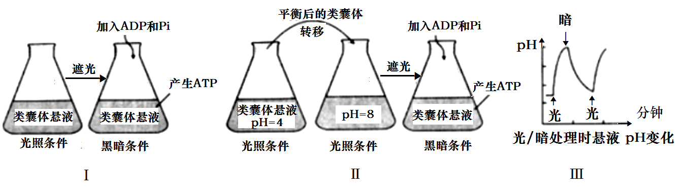

（1）制备类囊体时，提取液中应含有适宜浓度的蔗糖，以保证其结构完整，原因是\_\_\_\_\_\_\_\_；为避免膜蛋白被降解，提取液应保持\_\_\_\_\_\_\_\_（填“低温”或“常温”）。

（2）在图I实验基础上进行图II实验，发现该实验条件下，也能产生ATP。但该实验不能充分证明“某种能量形式”是类囊体膜内外的H+浓度差，原因是\_\_\_\_\_\_\_\_。

（3）为探究自然条件下类囊体膜内外产生H+浓度差的原因，对无缓冲液的类囊体悬液进行光、暗交替处理，结果如图III所示，悬液的pH在光照处理时升高，原因是\_\_\_\_\_\_\_\_。类囊体膜内外的H+浓度差是通过光合电子传递和H+转运形成的，电子的最终来源物质是\_\_\_\_\_\_\_\_。

（4）用菠菜类囊体和人工酶系统组装的人工叶绿体，能在光下生产目标多碳化合物。若要实现黑暗条件下持续生产，需稳定提供的物质有\_\_\_\_\_\_\_\_。生产中发现即使增加光照强度，产量也不再增加，若要增产，可采取的有效措施有\_\_\_\_\_\_\_\_（答两点）。

【答案】（1） ①. 保持类囊体内外的渗透压，避免类囊体破裂 ②. 低温

（2）实验II是在光照条件下对类囊体进行培养，无法证明某种能量是来自于光能还是来自膜内外氢离子浓度差

（3） ①. 类囊体膜外H+被转移到类囊体膜内，造成溶液pH升高 ②. 水

（4） ①. NADPH、ATP和CO2 ②. 增加二氧化碳浓度和适当提高环境温度

【解析】

【分析】1、光合作用的光反应阶段（场所是叶绿体的类囊体膜上）：水的光解产生\[H\]与氧气，以及ATP的形成。

2、光合作用的暗反应阶段（场所是叶绿体的基质中）：二氧化碳被五碳化合物固定形成三碳化合物，三碳化合物在光反应提供的ATP和\[H\]的作用下还原生成糖类等有机物。

【小问1详解】

制备类囊体时，其提取液中需要添加适宜浓度的蔗糖，保持类囊体内外的渗透压，避免类囊体破裂，以保证其结构完整。提取液应该保持低温降低蛋白酶的活性，避免膜蛋白被降解。

【小问2详解】

从图II实验中可知，在光照条件下，将处于pH=4的类囊体转移到pH=8的锥形瓶中，再在遮光的条件下加入ADP和Pi，也产生了ATP，但该实验不能充分证明“某种能量形式”是类囊体膜内外的H+浓度差，因为实验II是在光照条件下对类囊体进行培养，无法证明某种能量是来自于光能还是来自膜内外氢离子浓度差。

【小问3详解】

对无缓冲液的类囊体悬液进行光、暗交替处理，悬液的pH在光照处理时升高，推测可能是类囊体膜外H+被转移到类囊体膜内，造成溶液pH升高。类囊体膜内外的H+浓度差是通过光合电子传递和H+转运形成的，光反应过程中，水的光解伴随着电子的传递，故电子的最终来源是水。

【小问4详解】

人工叶绿体，能在光下生产目标多碳化合物，若要在黑暗条件下持续生产，则需要提供光反应产生的物质NADPH和ATP，以及暗反应的原料CO2。生产中发现即使增加光照强度，产量也不再增加，说明暗反应已经达到最大速率，增加二氧化碳的浓度和适当提高环境温度增加酶的活性，可有效提高光合效率。

24\. 科学家用基因编辑技术由野生型番茄（HH）获得突变体番茄（hh），发现突变体中DML2基因的表达发生改变，进而影响乙烯合成相关基因ACS2等的表达及果实中乙烯含量（如图I、II），导致番茄果实成熟期改变。请回答以下问题：

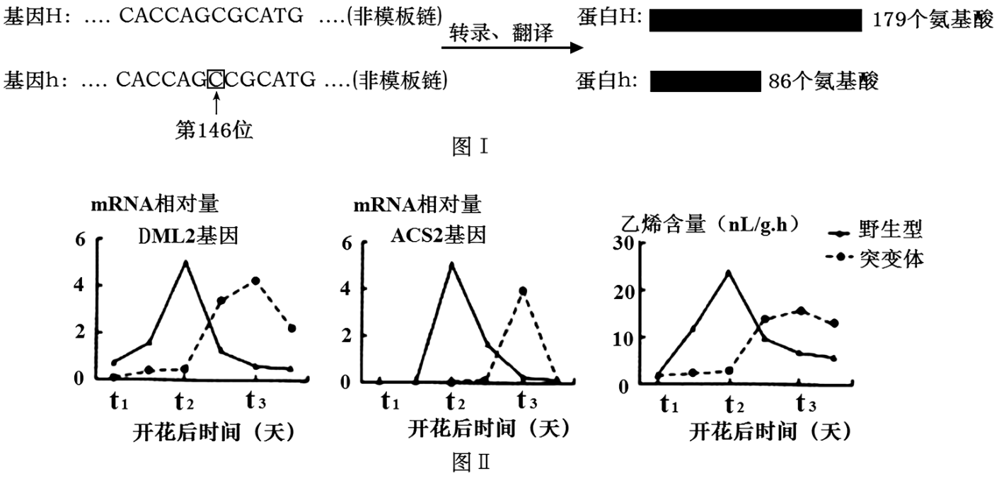

（1）图I中，基因h是由基因H编码区第146位碱基后插入一个C（虚线框所示）后突变产生，致使h蛋白比H蛋白少93个氨基酸，其原因是\_\_\_\_\_\_\_\_。基因h转录形成的mRNA上第49个密码子为\_\_\_\_\_\_\_\_。另有研究发现，基因H发生另一突变后，其转录形成的mRNA上有一密码子发生改变，但翻译的多肽链氨基酸序列和数量不变，原因是\_\_\_\_\_\_\_\_。

（2）图II中，t1～t2时段，突变体番茄中DML2基因转录的mRNA相对量低于野生型，推测在该时间段，H蛋白对DML2基因的作用是\_\_\_\_\_\_\_\_。突变体番茄果实成熟期改变的可能机制为：H突变为h后，由于DML2基因的作用，果实中ACS2基因\_\_\_\_\_\_\_\_，导致果实成熟期\_\_\_\_\_\_\_\_（填“提前”或“延迟”）。

（3）番茄果肉红色（R）对黄色（r）为显性。现用基因型为RrHH和Rrhh的番茄杂交，获得果肉为红色、成熟期为突变体性状的纯合体番茄，请写出杂交选育过程（用基因型表示）。

【答案】（1） ①. 翻译的过程中提前遇见终止密码子 ②. CCG ③. 密码子具有简并性

（2） ①. 促进DML2基因的转录过程 ②. 延迟表达\
③. 延迟

（3）将RrHH×Rrhh的番茄杂交，获得基因型为RRHh、RrHh、rrHh的F1代，然后让红果（RRHh、RrHh）分别自交，基因型RRHh自交，获得RRhh得到RRH\_，从中选出RRhh，红果且成熟期晚的就是RRhh。

【解析】

【分析】基因表达是指将来自基因的遗传信息合成功能性基因产物的过程。基因表达产物通常是蛋白质，所有已知的生命，都利用基因表达来合成生命的大分子；转录过程由RNA聚合酶催化，以DNA为模板，产物为RNA，RNA聚合酶沿着一段DNA移动，留下新合成的RNA链；翻译是以mRNA为模板合成蛋白质的过程，场所在核糖体。

【小问1详解】

由图I可知：基因h是由基因H编码区第146位碱基后插入一个C后突变产生，插入一个C后导致基因h后的碱基排列顺序发生改变，即终止密码子的位置提前，导致翻译过程提前终止，所以致使h蛋白比H蛋白少93个氨基酸；密码子是由位于mRNA上的3个相邻的碱基决定的，基因h是由基因H编码区第146位碱基后插入一个C后突变产生，插入一个C后就变成了147位的碱基，所以基因h转录形成的mRNA（与非模板链碱基序列相似，只是U取代了T）上第49个密码子为CCG；由于密码子具有简并性，当基因H发生另一突变后，其转录形成的mRNA上有一密码子发生改变，但翻译的多肽链氨基酸序列和数量不变。

【小问2详解】

由图II可知：t1~t2时段，野生型番茄（HH）中有H蛋白，促进DML2基因转录的mRNA相对量高，突变体（hh）番茄中没有H蛋白，DML2基因转录的mRNA相对量低，说明H蛋白促进DML2基因的转录过程；H突变为h后，突变体（hh）ACS2基因转录的mRNA相对量下降，所以推测由于DML2基因的作用，导致果实中ACS2基因延迟表达，导致果实成熟期延迟。

【小问3详解】

现用基因型为RrHH和Rrhh的番茄杂交，获得果肉为红色、成熟期为突变体性状的纯合体番茄，可将RrHH×Rrhh的番茄杂交，获得基因型为RRHh、RrHh、rrHh的F1代，让RRHh、RrHh分别自交，基因型RRHh自交，获得RRHh得到RRH\_，从中选出RRhh，红果且成熟期晚的就是RRhh。

**选考题：**

**\[选修1：生物技术实践\]（新高考为选择性必修三：生物技术与工程）**

25\. 研究发现柑橘精油可抑制大肠杆菌的生长。某兴趣小组采用水蒸气蒸馏法和压榨法提取了某种橘皮的精油（分别简称为HDO和CPO），并研究其抑菌效果的差异。

（1）为便于精油的提取，压榨前需用\_\_\_\_\_\_\_\_浸泡橘皮一段时间。在两种方法收集的油水混合物中均加入NaCl，其作用是\_\_\_\_\_\_\_\_；为除去油层中的水分，需加入\_\_\_\_\_\_\_\_。

（2）无菌条件下，该小组制备了两个大肠杆菌平板，用两片大小相同的无菌滤纸分别蘸取HDO和CPO贴于含菌平板上，37℃培养24h，抑菌效果见如图。有同学提出该实验存在明显不足：①未设置对照，设置本实验对照的做法是\_\_\_\_\_\_\_\_，其作用是\_\_\_\_\_\_\_\_；②不足之处还有\_\_\_\_\_\_\_\_（答两点）。

（3）若HDO的抑菌效果低于CPO，从提取方法的角度分析，主要原因是\_\_\_\_\_\_\_\_。

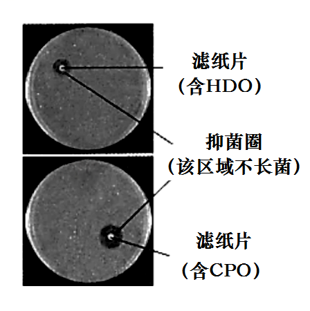

【答案】（1） ①. 石灰水 ②. 增加盐的浓度，利于水油分层 ③. 无水硫酸钠

（2） ①. 用一片大小相同的无菌滤纸蘸取等量的蒸馏水贴于含菌平板上 ②. 排除无关变量对实验结果的影响，增强实验结果的可信度 ③. 违背平行重复原则，每个实验组中的样本太少；实验组精油的含量没有遵循等量原则

（3）橘皮精油的有效成分在用水蒸气蒸馏时会发生部分水解

【解析】

【分析】 1、玫瑰精油的提取：水蒸气蒸馏→油水混合物→（加入NaCl）分离油层→（加入无水Na2SO4）除水→（过滤）得到植物精油。

2、提取橘皮精油：石灰水浸泡→漂洗→压榨→过滤→静置→再次过滤→橘皮油。

【小问1详解】

新鲜柑橘皮中含有大量的果蜡、果胶和水分，如果直接压榨，出油率较低，为了提高出油率，需要将柑橘皮干燥去水，并用石灰水浸泡。为了将水油分层，只需加入氯化钠，增加盐浓度，就会出现明显的分层，再用分液漏斗将这两层分开。分离的油层还会含有一定的水分，一般可以加入一些无水硫酸钠吸水。

【小问2详解】

本实验缺乏对照组，无法排除其他无关变量对实验结果的影响，可用一片大小相同的无菌滤纸蘸取等量的蒸馏水贴于含菌平板上作为对照组。另外，每个实验组中只利用了一张无菌滤纸，样本太少，容易出现偶然性误差；而且两个实验组蘸取的精油没有遵循等量原则。

【小问3详解】

橘皮精油的有效成分在用水蒸气蒸馏时会发生部分水解，所以HDO的抑菌效果低于CPO。

**\[选修3：现代生物科技专题\]（新高考为选择性必修三：生物技术与工程）**

26\. 改良水稻的株高和产量性状是实现袁隆平先生“禾下乘凉梦”的一种可能途径。研究人员克隆了可显著增高和增产的eui基因，并开展了相关探索。

步骤I：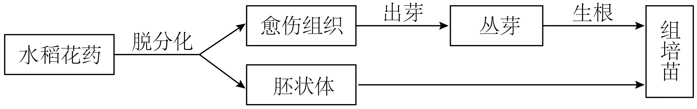

步骤II：

（1）花药培养能缩短育种年限，原因是\_\_\_\_\_\_\_\_。在步骤I的花药培养过程中，可产生单倍体愈伤组织，将其培养于含\_\_\_\_\_\_\_\_的培养基上，可促进产生二倍体愈伤组织。I中能用于制造人工种子的材料是\_\_\_\_\_\_\_\_。

（2）步骤II中，eui基因克隆于cDNA文库而不是基因组文库，原因是\_\_\_\_\_\_\_\_；在构建重组Ti质粒时使用的工具酶有\_\_\_\_\_\_\_\_。为筛选含重组Ti质粒的菌株，需在培养基中添加\_\_\_\_\_\_\_\_。获得的农杆菌菌株经鉴定后，应侵染I中的\_\_\_\_\_\_\_\_，以获得转基因再生植株。再生植株是否含有eui基因的鉴定方法是\_\_\_\_\_\_\_\_，移栽后若发育为更高且丰产的稻株，则可望“禾下乘凉”。

【答案】（1） ①. 单倍体经秋水仙素处理后所得植株为纯合子，后代不会发生性状分离 ②. 秋水仙素 ③. 胚状体

（2） ①. cDNA文库是由编码蛋白质的mRNA逆转录来的基因导入受体菌而形成的，基因工程中只需要转录出编码蛋白质的部分就可以，筛选比较简单易行 ②. 限制酶和 DNA连接酶 ③. 抗生素 ④. 愈伤组织 ⑤. DNA分子杂交技术

【解析】

【分析】1、单倍体育种的原理是染色体变异，方法是用花药离体培养获得单倍体植株，再人工诱导染色体数目加倍；优点是纯合体自交后代不发生性状分离，因而能明显缩短育种年限。2、cDNA是指以mRNA为模板，在逆转录酶的作用下形成的互补DNA。以细胞的全部mRNA逆转录合成的cDNA组成的重组克隆群体称为cDNA文库，基因组文库指的是将某种生物的基因组DNA切割成一定大小的片段，并与合适的载体重组后导入宿主细胞，进行克隆得到的所有重组体内的基因组DNA片段的集合，它包含了该生物的所有基因。

【小问1详解】

单倍体育种过程中，单倍体经秋水仙素处理后所得植株为纯合子，后代不会发生性状分离，所以可以明显缩短育种年限。将水稻花粉进行脱分化处理，可产生单倍体的愈伤组织，秋水仙素能抑制纺锤体的形成，导致染色体不能移向细胞两极，从而引起细胞内染色体数目加倍，故将其培养于含秋水仙素的培养基上，可促进产生二倍体愈伤组织。胚状体可用于制造人工种子。

【小问2详解】

cDNA文库又叫部分基因文库，是由编码蛋白质的mRNA逆转录来的基因导入受体菌而形成的，而基因组文库包含了本物种全部基因，基因工程中只需转录出编码蛋白质的基因部分就即可，故选cDNA文库。在构建重组Ti质粒时，必须使用限制性核酸内切酶(限制酶)切割质粒使其具有与目的基因相同的黏性未端，之后再用DNA连接酶将目的基因和质粒连接成重组质粒。该重组的Ti质粒中含有抗生素抗性基因，故应在培养基中添加抗生素，以便对重组质粒进行筛选和鉴定。将目的基因导入到植物细胞常用农杆菌转化法，即用含eu基因的农杆菌侵染愈伤组织，以便将eui基因导入愈伤组织，获得转基因再生植株。检测植株是否含有eui基因，可采取DNA分子杂交技术的方法。
