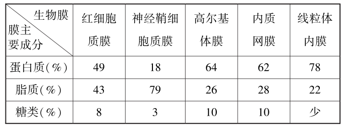
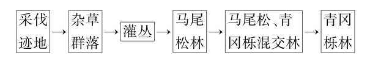
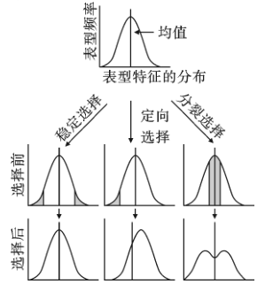
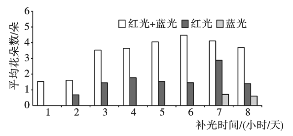
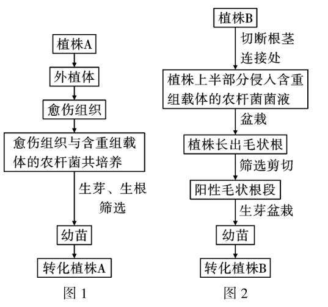

**2023年普通高中学业水平等级考试（海南卷）**

**生　物**

本试卷分选择题和非选择题两部分，满分100分，考试时间90分钟。

**一、选择题:本部分共15题，每题2分，共30分。在每题列出的四个选项中，选出最符合题目要求的一项。**

1.衣藻和大肠杆菌都是单细胞生物。下列有关二者的叙述，正确的是（ ）

A.都属于原核生物

B.都以DNA作为遗传物质

C.都具有叶绿体，都能进行光合作用

D.都具有线粒体，都能进行呼吸作用

2.科学家将编码天然蜘蛛丝蛋白的基因导入家蚕，使其表达出一种特殊的复合纤维蛋白，该复合纤维蛋白的韧性优于天然蚕丝蛋白。下列有关该复合纤维蛋白的叙述，正确的是（ ）

A.该蛋白的基本组成单位与天然蜘蛛丝蛋白的不同

B.该蛋白的肽链由氨基酸通过肽键连接而成

C.该蛋白彻底水解的产物可与双缩脲试剂发生紫色反应

D.高温可改变该蛋白的化学组成，从而改变其韧性

3.不同细胞的几种生物膜主要成分的相对含量见表。

下列有关叙述错误的是（ ）

A.蛋白质和脂质是生物膜不可或缺的成分，二者的运动构成膜的流动性

B.高尔基体和内质网之间的信息交流与二者膜上的糖类有关

C.哺乳动物红细胞的质膜与高尔基体膜之间具有膜融合现象

D.表内所列的生物膜中，线粒体内膜的功能最复杂，神经鞘细胞质膜的功能最简单

4.根边缘细胞是从植物根冠上游离下来的一类特殊细胞，可合成并向胞外分泌多种物质形成黏胶层。用DNA酶或蛋白酶处理黏胶层会使其厚度变薄。将物质A加入某植物的根边缘细胞悬液中，发现根边缘细胞的黏胶层加厚，细胞出现自噬和凋亡现象。下列有关叙述错误的是（ ）

A.根边缘细胞黏胶层中含有DNA和蛋白质

B.物质A可导致根边缘细胞合成胞外物质增多

C.根边缘细胞通过自噬可获得维持生存所需的物质和能量

D.物质A引起的根边缘细胞凋亡，是该植物在胚发育时期基因表达的结果

5.某亚热带地区青冈栎林被采伐后的演替过程如图。

下列有关叙述错误的是（ ）

A.采伐迹地保留了原有青冈栎林的土壤条件和繁殖体，该演替属于次生演替

B.与杂草群落相比，灌丛对阳光的利用更充分

C.与灌丛相比，马尾松林的动物分层现象更明显

D.与马尾松林相比，马尾松、青冈栎混交林乔木层的植物种间竞争减弱

6.海草是一类生长在浅海的单子叶植物，常在不同潮带形成海草床，具有极高的生产力。某海域海草群落的种类及其分布见表。

注:“+”表示存在，“-”表示无。

下列有关叙述错误的是（ ）

A.可用样方法调查某种海草的种群密度

B.海草叶片表面附着的藻类与海草的种间关系是竞争

C.据表可知，海草群落物种丰富度最高的潮带是低潮带和潮下带上部

D.据表可知，生态位最宽的海草是海神草和二药藻

7.某团队通过多代细胞培养，将小鼠胚胎干细胞的Y染色体去除，获得XO胚胎干细胞，再经过一系列处理，使之转变为有功能的卵母细胞。下列有关叙述错误的是（ ）

A.营养供应充足时，传代培养的胚胎干细胞不会发生接触抑制

B.获得XO胚胎干细胞的过程发生了染色体数目变异

C.XO胚胎干细胞转变为有功能的卵母细胞的过程发生了细胞分化

D.若某濒危哺乳动物仅存雄性个体，可用该法获得有功能的卵母细胞用于繁育

8.我国航天员乘坐我国自主研发的载人飞船，顺利进入空间实验室，并在太空中安全地生活与工作。航天服具有生命保障系统，为航天员提供了类似地面的环境。下列有关航天服及其生命保障系统的叙述，错误的是（ ）

A.能清除微量污染，减少航天员相关疾病的发生

B.能阻隔太空中各种射线，避免航天员机体细胞发生诱发突变

C.能调控航天服内的温度，维持航天员的体温恒定不变

D.能控制航天服内的压力，避免航天员的肺由于环境压力变化而发生损伤

9.药物W可激活脑内某种抑制性神经递质的受体，增强该神经递质的抑制作用，可用于治疗癫痫。下列有关叙述错误的是（ ）

A.该神经递质可从突触前膜以胞吐方式释放出来

B.该神经递质与其受体结合后，可改变突触后膜对离子的通透性

C.药物W阻断了突触前膜对该神经递质的重吸收而增强抑制作用

D.药物W可用于治疗因脑内神经元过度兴奋而引起的疾病

10.某学者按选择结果将自然选择分为三种类型，即稳定选择、定向选择和分裂选择，如图。横坐标是按一定顺序排布的种群个体表型特征，纵坐标是表型频率，阴影区是环境压力作用的区域。下列有关叙述错误的是（ ）

A.三种类型的选择对种群基因频率变化的影响是随机的

B.稳定选择有利于表型频率高的个体

C.定向选择的结果是使种群表型均值发生偏移

D.分裂选择对表型频率高的个体不利，使其表型频率降低

11.某植物的叶形与R基因的表达直接相关。现有该植物的植株甲和乙，二者R基因的序列相同。植株甲R基因未甲基化，能正常表达；植株乙R基因高度甲基化，不能表达。下列有关叙述正确的是（ ）

A.植株甲和乙的R基因的碱基种类不同

B.植株甲和乙的R基因的序列相同，故叶形相同

C.植株乙自交，子一代的R基因不会出现高度甲基化

D.植株甲和乙杂交，子一代与植株乙的叶形不同

12.肿瘤相关巨噬细胞（TAM）通过分泌白细胞介素-10（IL-10），促进TAM转变成可抑制T细胞活化和增殖的调节性T细胞，并抑制树突状细胞的成熟，从而影响肿瘤的发生和发展。下列有关叙述正确的是（ ）

A.调节性T细胞参与调节机体的特异性免疫

B.树突状细胞可抑制辅助性T细胞分泌细胞因子

C.TAM使肿瘤细胞容易遭受免疫系统的攻击

D.IL-10是免疫活性物质，可通过TAM间接促进T细胞活化和增殖

13.噬菌体中ΦX174的遗传物质为单链环状DNA分子，部分序列如图。

下列有关叙述正确的是（ ）

A.D基因包含456个碱基，编码152个氨基酸

B.E基因中编码第2个和第3个氨基酸的碱基序列，其互补DNA序列是5′-GCGTAC-3′

C.噬菌体ΦX174的DNA复制需要DNA聚合酶和4种核糖核苷酸

D.E基因和D基因的编码区序列存在部分重叠，且重叠序列编码的氨基酸序列相同

14.禾谷类种子萌发过程中，糊粉层细胞合成蛋白酶以降解其自身贮藏的蛋白质，为幼苗生长提供营养。为探究赤霉素在某种禾谷类种子萌发过程中的作用，某团队设计并实施了A、B、C三组实验，结果如图。下列有关叙述正确的是（ ）

A.本实验中只有A组是对照组

B.赤霉素导致糊粉层细胞中贮藏蛋白质的降解速率下降

C.赤霉素合成抑制剂具有促进种子萌发的作用

D.三组实验中，蛋白酶活性由高到低依次为B组、A组、C组

15.某作物的雄性育性与细胞质基因（P、H）和细胞核基因（D、d）相关。现有该作物的4个纯合品种:①（P）dd（雄性不育）、②（H）dd（雄性可育）、③（H）DD（雄性可育）、④（P）DD（雄性可育），科研人员利用上述品种进行杂交实验，成功获得生产上可利用的杂交种。下列有关叙述错误的是（ ）

A.①和②杂交，产生的后代雄性不育

B.②③④自交后代均为雄性可育，且基因型不变

C.①和③杂交获得生产上可利用的杂交种，其自交后代出现性状分离，故需年年制种

D.①和③杂交后代作父本，②和③杂交后代作母本，二者杂交后代雄性可育和不育的比例为3∶1

**二、非选择题:本部分共5小题，共70分。**

16.海南是我国火龙果的主要种植区之一，由于火龙果是长日照植物，冬季日照时间不足导致其不能正常开花，在生产实践中需要夜间补光，使火龙果提前开花，提早上市。某团队研究了同一光照强度下，不同补光光源和补光时间对火龙果成花的影响，结果如图。

回答下列问题。

（1）光合作用时，火龙果植株能同时吸收红光和蓝光的光合色素是<u>　　　　</u>；用纸层析法分离叶绿体色素获得的4条色素带中，以滤液细线为基准，按照自下而上的次序，该

光合色素的色素带位于第<u>　　　　</u>条。

（2）本次实验结果表明，三种补光光源中最佳的是<u>　　　　</u>，该光源的最佳补光时间是

<u>　</u> 小时/天，判断该光源是最佳补光光源的依据是<u>　　　　　　　　　</u>。

（3）现有可促进火龙果增产的三种不同光照强度的白色光源，设计实验方案探究成花诱导完成后提高火龙果产量的最适光照强度（简要写出实验思路） 。

17.甲状腺分泌的甲状腺激素（TH）可调节人体多种生命活动。双酚A（BPA）是一种有机化合物，若进入人体可导致甲状腺等内分泌腺功能紊乱。下丘脑—垂体—甲状腺（HPT）轴及BPA作用位点如图。回答下列问题。

（1）据图可知，在TH分泌的过程中，过程①②③属于 调节，过程④⑤⑥属于 调节。

（2）TH是亲脂性激素，可穿过特定细胞的质膜并进入细胞核内，与核内的TH受体特异性结合。这一过程体现激素调节的特点是<u>　　　　　　　　　</u>。

（3）垂体分泌的生长激素可促进胸腺分泌胸腺素。胸腺素刺激B细胞增殖分化形成浆细胞，产生抗体。这说明垂体除参与体液调节外，还参与 。

（4）甲状腺过氧化物酶（TPO）是合成TH所必需的酶，且能促进甲状腺上促甲状腺激素（TSH）受体基因的表达。研究发现，进入人体的BPA能抑制TPO活性，可导致血液中TH含量 ，其原因是 。

（5）有研究表明，BPA也能促进皮质醇分泌，抑制睾酮分泌，说明BPA除影响HPT轴外，还可直接或间接影响人体其他内分泌轴的功能。这些内分泌轴包括 。

18.家鸡（2n=78）的性别决定方式为ZW型。慢羽和快羽是家鸡的一对相对性状，且慢羽（D）对快羽（d）为显性。正常情况下，快羽公鸡与慢羽母鸡杂交，子一代的公鸡均为慢羽，母鸡均为快羽；子二代的公鸡和母鸡中，慢羽与快羽的比例均为1∶1。回答下列问题。

（1）正常情况下，公鸡体细胞中含有<u>　 　 　</u> 个染色体组，精子中含有<u>　　　　</u>条 W 染色体。

（2）等位基因D/d位于<u>　　　　</u>染色体上，判断依据是 。

（3）子二代随机交配得到的子三代中，慢羽公鸡所占的比例是 。

（4）家鸡羽毛的有色（A）对白色（a）为显性，这对等位基因位于常染色体上。正常情况下，1只有色快羽公鸡和若干只白色慢羽母鸡杂交，产生的子一代公鸡存在<u>　　　　</u>种表型。

（5）母鸡具有发育正常的卵巢和退化的精巢，产蛋后由于某种原因导致卵巢退化，精巢重新发育，出现公鸡性征并且产生正常精子。某鸡群中有1只白色慢羽公鸡和若干只杂合有色快羽母鸡，设计杂交实验探究这只白色慢羽公鸡的基因型。简要写出实验思路、预期结果及结论（已知WW基因型致死） <u>　</u>。

19.海洋牧场是一种海洋人工生态系统，通过在特定海域投放人工鱼礁等措施，构建或修复海洋生物生长、繁殖、索饵或避敌所需的场所，以实现海洋生态保护和渔业资源持续高效产出，是海洋低碳经济的典型代表。回答下列问题。

（1）海洋牧场改善了海洋生物的生存环境，可使某些经济鱼类种群的环境容纳量<u>　　　　</u>；海洋牧场实现了渔业资源持续高效产出，这体现了生物多样性的<u>　　　　</u>价值。

（2）人工鱼礁投放海底一段时间后，礁体表面会附着大量的藻类等生物。藻类在生态系统组成成分中属于<u>　　　　</u>，能有效降低大气中CO2含量，其主要原因是 。

（3）在同一片海域中，投放人工鱼礁的区域和未投放人工鱼礁的区域出现环境差异，从而引起海洋生物呈现镶嵌分布，这体现出海洋生物群落的<u>　　　　</u>结构。

（4）三亚蜈支洲岛海洋牧场是海南省首个国家级海洋牧场示范区。该牧场某年度重要经济鱼类（A鱼和B鱼）资源量的三次调查结果如图。据图分析，12月没有调查到A鱼的原因可能与其<u>　　 　　</u>的生活习性有关，4月、8月和12月B鱼的平均资源量密度呈<u>　　　　</u>趋势。

（5）三亚蜈支洲岛海洋牧场与邻近海域主要消费者的群落结构指标见表。与邻近海域相比，该牧场的生态系统稳定性较高，据表分析其原因是 。

20. 基因递送是植物遗传改良的重要技术之一，我国多个实验室合作开发了一种新型基因递送系统（切—浸—生芽Cut-Dip-Budding，简称CDB法）。图1与图2分别是利用常规转化法和CDB法在某植物中递送基因的示意图。

    

    回答下列问题。

    （1）图1中，从外植体转变成愈伤组织的过程属于<u>　　　　</u>；从愈伤组织到幼苗的培养过程需要的激素有生长素和 ，该过程还需要光照，其作用是 。

    （2）图1中的愈伤组织，若不经过共培养环节，直接诱导培养得到的植株可以保持植株A的<u>　　　　</u>。图1中，含有外源基因的转化植株A若用于生产种子，其包装需标注 <u>　　　　　　　　　　</u>。

    （3）图1与图2中，农杆菌侵染植物细胞时，可将外源基因递送到植物细胞中的原因是 。

    （4）已知某酶（PDS）缺失会导致植株白化。某团队构建了用于敲除PDS基因的CRISPR/Cas9基因编辑载体（含有绿色荧光蛋白标记基因），利用图2中的CDB法将该重组载体导入植株B，长出毛状根，成功获得转化植株B。据此分析，从毛状根中获得阳性毛状根段的方法

    是 图 2 中，鉴定导入幼苗中的基因编辑载体是否成功发挥作用的方法是 ，依据是 <u>　</u>。

    （5）与常规转化法相比，采用 CDB 法进行基因递送的优点是<u>　　　　　　　　　　　　　　　</u>（答出2点即可）。
