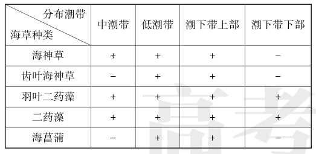
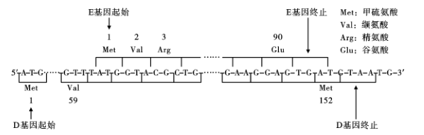
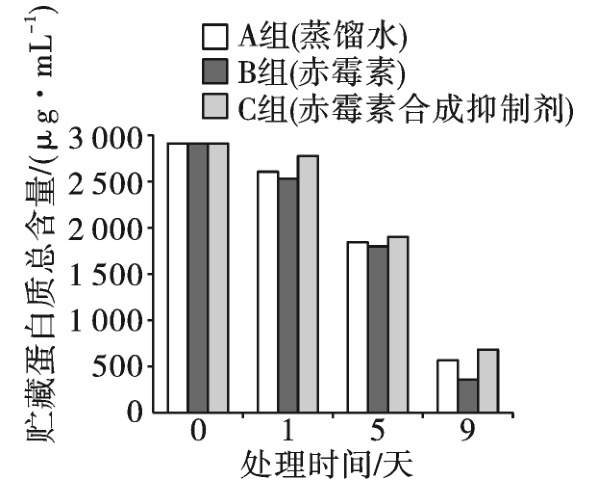
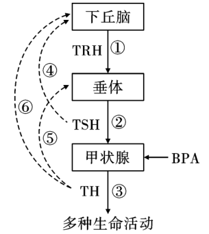
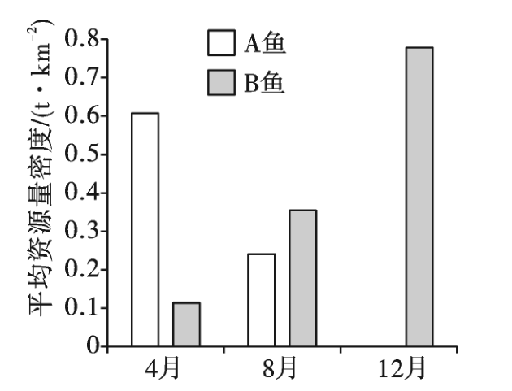
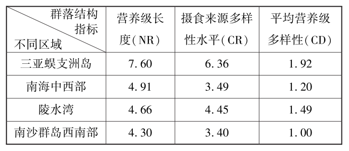

**2023年普通高中学业水平等级考试（海南卷）**

**生　物**

本试卷分选择题和非选择题两部分，满分100分，考试时间90分钟。

**一、选择题:本部分共15题，每题2分，共30分。在每题列出的四个选项中，选出最符合题目要求的一项。**

1.衣藻和大肠杆菌都是单细胞生物。下列有关二者的叙述，正确的是（ ）

A.都属于原核生物

B.都以DNA作为遗传物质

C.都具有叶绿体，都能进行光合作用

D.都具有线粒体，都能进行呼吸作用

【答案】B　

【命题意图】本题考查单细胞生物中衣藻和大肠杆菌的相关知识，意在考查考生的识记能力。

【解析】衣藻属于真核生物，A错误；衣藻和大肠杆菌的遗传物质都是DNA，B正确；大肠杆菌没有叶绿体，也不能进行光合作用，C错误；大肠杆菌不含线粒体，但可以进行呼吸作用，D错误。

2.科学家将编码天然蜘蛛丝蛋白的基因导入家蚕，使其表达出一种特殊的复合纤维蛋白，该复合纤维蛋白的韧性优于天然蚕丝蛋白。下列有关该复合纤维蛋白的叙述，正确的是（ ）

A.该蛋白的基本组成单位与天然蜘蛛丝蛋白的不同

B.该蛋白的肽链由氨基酸通过肽键连接而成

C.该蛋白彻底水解的产物可与双缩脲试剂发生紫色反应

D.高温可改变该蛋白的化学组成，从而改变其韧性

【答案】B　

【命题意图】本题考查蛋白质的相关知识，意在考查考生的识记能力。

【解析】该蛋白的基本组成单位是氨基酸，与天然蜘蛛丝蛋白的基本组成单位相同，A错误；氨基酸是组成蛋白质的基本单位，氨基酸发生脱水缩合反应形成由肽键连接而成的多肽链，进而形成蛋白质，B正确；该蛋白彻底水解的产物为氨基酸，不能与双缩脲试剂发生紫色反应，C错误；高温可通过改变该蛋白的空间结构从而改变其韧性，但不会改变该蛋白的化学组成，D错误。

3.不同细胞的几种生物膜主要成分的相对含量见表。

下列有关叙述错误的是（ ）

A.蛋白质和脂质是生物膜不可或缺的成分，二者的运动构成膜的流动性

B.高尔基体和内质网之间的信息交流与二者膜上的糖类有关

C.哺乳动物红细胞的质膜与高尔基体膜之间具有膜融合现象

D.表内所列的生物膜中，线粒体内膜的功能最复杂，神经鞘细胞质膜的功能最简单

【答案】C　

【命题意图】本题考查生物膜的相关知识，意在考查考生的信息获取能力和识记能力。

【解析】生物膜主要由脂质和蛋白质组成，磷脂双分子层构成膜的基本支架，这个支架是可以流动的，膜中的大多数蛋白质也是可以流动的，因此蛋白质和脂质的运动构成膜的流动性，A叙述正确；糖蛋白与细胞识别作用有密切关系，因此高尔基体和内质网之间的信息交流与二者膜上的糖类有关，B叙述正确；哺乳动物成熟的红细胞没有高尔基体，C叙述错误；功能越复杂的细胞膜，其上蛋白质的种类和数量越多，由题表内容可知，线粒体内膜的蛋白质占比最高，其功能最复杂，神经鞘细胞质膜的蛋白质最少，其功能最简单，D叙述正确。

4.根边缘细胞是从植物根冠上游离下来的一类特殊细胞，可合成并向胞外分泌多种物质形成黏胶层。用DNA酶或蛋白酶处理黏胶层会使其厚度变薄。将物质A加入某植物的根边缘细胞悬液中，发现根边缘细胞的黏胶层加厚，细胞出现自噬和凋亡现象。下列有关叙述错误的是（ ）

A.根边缘细胞黏胶层中含有DNA和蛋白质

B.物质A可导致根边缘细胞合成胞外物质增多

C.根边缘细胞通过自噬可获得维持生存所需的物质和能量

D.物质A引起的根边缘细胞凋亡，是该植物在胚发育时期基因表达的结果

【答案】D　

【命题意图】本题考查细胞自噬和细胞凋亡的相关知识，意在考查考生的信息获取能力和理解能力。

【解析】由题意可知，用DNA酶或蛋白酶处理黏胶层会使其厚度变薄，说明根边缘细胞黏胶层中含有DNA和蛋白质，A叙述正确；将物质A加入某植物的根边缘细胞悬液中，发现根边缘细胞的黏胶层加厚，说明物质A可导致根边缘细胞合成胞外物质增多，B叙述正确；细胞通过自噬，分解部分细胞中的物质和结构，获得维持生存所需的物质和能量，C叙述正确；物质A引起细胞凋亡是在外界不良环境下引起的，不是在胚发育时期基因表达的结果，D叙述错误。

5.某亚热带地区青冈栎林被采伐后的演替过程如图。

下列有关叙述错误的是（ ）

A.采伐迹地保留了原有青冈栎林的土壤条件和繁殖体，该演替属于次生演替

B.与杂草群落相比，灌丛对阳光的利用更充分

C.与灌丛相比，马尾松林的动物分层现象更明显

D.与马尾松林相比，马尾松、青冈栎混交林乔木层的植物种间竞争减弱

【答案】D　

【命题意图】本题考查群落的空间结构、种间关系、群落演替的相关知识，意在考查考生的识记能力和理解能力。

【解析】采伐迹地保留了原有青冈栎林的土壤条件和繁殖体，符合次生演替条件，该演替属于次生演替，A叙述正确；灌丛比杂草群落结构更复杂，对阳光的吸收利用更充分，B叙述正确；马尾松林的植物群落分层现象比灌丛更明显，同时动物以植物为食或作为栖息场所，所以马尾松

林的动物分层现象比灌丛更明显，C叙述正确；马尾松林只有马尾松一种乔木，没有乔木层的植物进行种间竞争，马尾松、青冈栎混交林乔木层的植物是马尾松和青冈栎，二者之间存在种间竞争，所以种间竞争增强，D叙述错误。

6.海草是一类生长在浅海的单子叶植物，常在不同潮带形成海草床，具有极高的生产力。某海域海草群落的种类及其分布见表。

注:“+”表示存在，“-”表示无。

下列有关叙述错误的是（ ）

A.可用样方法调查某种海草的种群密度

B.海草叶片表面附着的藻类与海草的种间关系是竞争

C.据表可知，海草群落物种丰富度最高的潮带是低潮带和潮下带上部

D.据表可知，生态位最宽的海草是海神草和二药藻

【答案】D　

【命题意图】本题考查调查种群密度的方法和群落的相关知识，意在考查考生的识记能力和信息获取能力。

【解析】植物或活动能力弱、活动范围小的动物都可用样方法调查种群密度，A叙述正确；海草叶片表面附着的藻类与海草竞争阳光等资源，二者的种间关系是竞争，B叙述正确；由题表可知，低潮带和潮下带上部分布的海草种类最多，物种丰富度最高，C叙述正确；由题表可知，羽叶二药藻和二药藻分布的范围最广，故生态位最宽的海草是羽叶二药藻和二药藻，D叙述错误。

7.某团队通过多代细胞培养，将小鼠胚胎干细胞的Y染色体去除，获得XO胚胎干细胞，再经过一系列处理，使之转变为有功能的卵母细胞。下列有关叙述错误的是（ ）

A.营养供应充足时，传代培养的胚胎干细胞不会发生接触抑制

B.获得XO胚胎干细胞的过程发生了染色体数目变异

C.XO胚胎干细胞转变为有功能的卵母细胞的过程发生了细胞分化

D.若某濒危哺乳动物仅存雄性个体，可用该法获得有功能的卵母细胞用于繁育

【答案】A　

【命题意图】本题考查染色体变异、动物细胞培养等知识，意在考查考生的信息获取能力和理解能力。

【解析】营养供应充足时，传代培养的胚胎干细胞也会发生接触抑制，A叙述错误；XO胚胎干细胞中丢失了Y染色体，因而该细胞的获得过程发生了染色体数目变异，B叙述正确；XO胚胎干细胞转变为有功能的卵母细胞的过程发生了细胞分化，C叙述正确；若某濒危哺乳动物仅存雄性个体，可用该法获得有功能的卵母细胞，进而用于繁育，实现濒危物种的保护，D叙述正确。

8.我国航天员乘坐我国自主研发的载人飞船，顺利进入空间实验室，并在太空中安全地生活与工作。航天服具有生命保障系统，为航天员提供了类似地面的环境。下列有关航天服及其生命保障系统的叙述，错误的是（ ）

A.能清除微量污染，减少航天员相关疾病的发生

B.能阻隔太空中各种射线，避免航天员机体细胞发生诱发突变

C.能调控航天服内的温度，维持航天员的体温恒定不变

D.能控制航天服内的压力，避免航天员的肺由于环境压力变化而发生损伤

【答案】C　

【命题意图】本题考查内环境稳态的相关知识，意在考查考生的信息获取能力和运用所学知识解决实际问题的能力。

【解析】航天服具有生命保障系统，为航天员提供了类似地面的环境，据此可推测，航天服能清除微量污染，减少航天员相关疾病的发生，A叙述正确；太空中有宇宙射线的存在，而航天服能起到阻隔太空中各种射线，避免航天员机体细胞发生诱发突变的作用，B叙述正确；航天服的生命保障系统能调控航天服内的温度，进而可使航天员的体温维持相对稳定，C叙述错误；航天服及其生命保障系统能控制航天服内的压力，避免航天员的肺由于环境压力变化而出现损伤，D叙述正确。

9.药物W可激活脑内某种抑制性神经递质的受体，增强该神经递质的抑制作用，可用于治疗癫痫。下列有关叙述错误的是（ ）

A.该神经递质可从突触前膜以胞吐方式释放出来

B.该神经递质与其受体结合后，可改变突触后膜对离子的通透性

C.药物W阻断了突触前膜对该神经递质的重吸收而增强抑制作用

D.药物W可用于治疗因脑内神经元过度兴奋而引起的疾病

【答案】C　

【命题意图】本题考查神经递质的相关知识，意在考查考生的识记能力和信息获取能力。

【解析】该神经递质可从突触前膜以胞吐方式释放，胞吐过程依赖膜的流动性实现，A叙述正确；该神经递质与其受体结合后，可改变突触后膜对离子的通透性，导致阴离子内流，进而使静息电位的绝对值更大，表现为抑制作用，B叙述正确；药物W可激活脑内某种抑制性神经递质的受体，而不是通过阻断突触前膜对该神经递质的重吸收来增强其抑制作用，C叙述错误；药物W可增强某种神经递质的抑制作用，可用于治疗因脑内神经元过度兴奋而引起的疾病，D叙述正确。

10.某学者按选择结果将自然选择分为三种类型，即稳定选择、定向选择和分裂选择，如图。横坐标是按一定顺序排布的种群个体表型特征，纵坐标是表型频率，阴影区是环境压力作用的区域。下列有关叙述错误的是（ ）

A.三种类型的选择对种群基因频率变化的影响是随机的

B.稳定选择有利于表型频率高的个体

C.定向选择的结果是使种群表型均值发生偏移

D.分裂选择对表型频率高的个体不利，使其表型频率降低

【答案】A　

【命题意图】本题考查自然选择的相关知识，意在考查考生的信息获取能力和分析能力。

【解析】三种类型的选择都是自然选择，自然选择对种群基因频率的影响是固定的，都使种群基因频率发生定向的改变，A叙述错误；根据题图可知，稳定选择淘汰了表型频率低的个体，有利于表型频率高的个体，B叙述正确；定向选择是在一个方向上改变了种群某些表现性特

征的频率曲线，使表型频率偏离平均值，C叙述正确；分裂选择淘汰了表型频率高的个体，使其频率下降，D叙述正确。

11.某植物的叶形与R基因的表达直接相关。现有该植物的植株甲和乙，二者R基因的序列相同。植株甲R基因未甲基化，能正常表达；植株乙R基因高度甲基化，不能表达。下列有关叙述正确的是（ ）

A.植株甲和乙的R基因的碱基种类不同

B.植株甲和乙的R基因的序列相同，故叶形相同

C.植株乙自交，子一代的R基因不会出现高度甲基化

D.植株甲和乙杂交，子一代与植株乙的叶形不同

【答案】D　

【命题意图】本题考查表观遗传的相关知识，意在考查考生的信息获取能力和分析能力。

【解析】植株甲和乙的R基因序列相同，因此所含的碱基种类也相同，A错误；植株甲和乙的R基因的序列相同，但植株甲R基因未甲基化，能正常表达；植株乙R基因高度甲基化，不能表达，因而叶形不同，B错误；甲基化相关的性状可以遗传，因此，植株乙自交，子一代的R基

因也会高度甲基化，C错误；植株甲含有未甲基化的R基因，故植株甲和乙杂交，子一代与植株乙的叶形不同，与植株甲的叶形相同，D正确。

12.肿瘤相关巨噬细胞（TAM）通过分泌白细胞介素-10（IL-10），促进TAM转变成可抑制T细胞活化和增殖的调节性T细胞，并抑制树突状细胞的成熟，从而影响肿瘤的发生和发展。下列有关叙述正确的是（ ）

A.调节性T细胞参与调节机体的特异性免疫

B.树突状细胞可抑制辅助性T细胞分泌细胞因子

C.TAM使肿瘤细胞容易遭受免疫系统的攻击

D.IL-10是免疫活性物质，可通过TAM间接促进T细胞活化和增殖

【答案】A　

【命题意图】本题考查细胞免疫的相关知识，意在考查考生的信息获取能力和分析能力。

【解析】调节性T细胞可抑制T细胞活化和增殖，进而参与调节机体的特异性免疫，A正确；树突状细胞作为抗原呈递细胞，可促进辅助性T细胞分泌细胞因子，B错误；白细胞介素-10（IL-10）可促进TAM转变成调节性T细胞，进而抑制T细胞的活化和增殖，进而使肿瘤细胞不容易遭受免疫系统的攻击，C错误；IL-10是免疫活性物质，可促进TAM转变成调节性T细胞进而抑制T细胞活化和增殖，D错误。

13.噬菌体中ΦX174的遗传物质为单链环状DNA分子，部分序列如图。

下列有关叙述正确的是（ ）

A.D基因包含456个碱基，编码152个氨基酸

B.E基因中编码第2个和第3个氨基酸的碱基序列，其互补DNA序列是5′-GCGTAC-3′

C.噬菌体ΦX174的DNA复制需要DNA聚合酶和4种核糖核苷酸

D.E基因和D基因的编码区序列存在部分重叠，且重叠序列编码的氨基酸序列相同

【答案】B　

【命题意图】本题考查基因的复制和表达的相关知识，意在考查考生的信息获取能力和理解能力。

【解析】分析题图可知，D基因编码152个氨基酸，但D基因末端包含终止密码子（UAA）的对应序列，故包含459个碱基，A错误；E基因中编码第2个和第3个氨基酸的碱基序列为5′-GTACGC-3′，根据DNA分子两条链反向平行的原则，其互补DNA序列是5′-GCGTAC-3′，B正确；DNA的基本单位是脱氧核糖核酸，噬菌体ΦX174的DNA复制需要DNA聚合酶和4种脱氧核糖核苷酸，C错误；E基因和D基因的编码区序列存在部分重叠，但重叠序列编码的氨基酸序列不相同，D错误。

14.禾谷类种子萌发过程中，糊粉层细胞合成蛋白酶以降解其自身贮藏的蛋白质，为幼苗生长提供营养。为探究赤霉素在某种禾谷类种子萌发过程中的作用，某团队设计并实施了A、B、C三组实验，结果如图。下列有关叙述正确的是（ ）

A.本实验中只有A组是对照组

B.赤霉素导致糊粉层细胞中贮藏蛋白质的降解速率下降

C.赤霉素合成抑制剂具有促进种子萌发的作用

D.三组实验中，蛋白酶活性由高到低依次为B组、A组、C组

【答案】D　

【命题意图】本题考查赤霉素的相关知识，意在考查考生的信息获取能力和分析能力。

【解析】分析题图可知，本实验的自变量是处理方式及时间，A组属于空白对照组，但当自变量为时间时，处理时间为0的B组和C组也是对照组，A错误；添加赤霉素的B组，蛋白质总含量低于未加入赤霉素的A组，更低于用赤霉素合成抑制剂处理的C组，说明赤霉素导致糊粉层细胞中贮藏蛋白质的降解速率增加，B错误；赤霉素可促进蛋白质的分解，为幼苗生长提供营养，促进萌发，而赤霉素合成抑制剂抑制蛋白质的降解，抑制种子萌发，C错误；随着时间变化，贮藏蛋白质总含量C组大于A组大于B组，说明B组蛋白质最少，蛋白酶的活性最高，故蛋白酶活性由高到低依次为B组、A组、C组，D正确。

15.某作物的雄性育性与细胞质基因（P、H）和细胞核基因（D、d）相关。现有该作物的4个纯合品种:①（P）dd（雄性不育）、②（H）dd（雄性可育）、③（H）DD（雄性可育）、④（P）DD（雄性可育），科研人员利用上述品种进行杂交实验，成功获得生产上可利用的杂交种。下列有关叙述错误的是（ ）

A.①和②杂交，产生的后代雄性不育

B.②③④自交后代均为雄性可育，且基因型不变

C.①和③杂交获得生产上可利用的杂交种，其自交后代出现性状分离，故需年年制种

D.①和③杂交后代作父本，②和③杂交后代作母本，二者杂交后代雄性可育和不育的比例为3∶1

【答案】D　

【命题意图】本题考查质基因和基因的分离定律的相关知识，意在考查考生的分析能力和综合运用能力。

【解析】①（P）dd（雄性不育）作为母本和②（H）dd（雄性可育）作为父本杂交，产生的后代的基因型均为（P）dd，表现为雄性不育，A叙述正确；②③④自交后代均为雄性可育，且基因型不变，即表现为稳定遗传，B叙述正确；①（P）dd（雄性不育）作为母本和③（H）DD（雄性可育）作为父本杂交，产生的后代的基因型为（P）Dd，为杂交种，自交后代会表现出性状分离，因此需要年年制种，C叙述正确；①和③杂交后代的基因型为（P）Dd，②和③杂交后代的基因型为（H）Dd，若前者作父本，后者作母本，则二者杂交的后代为（H）\_ \_，均为雄性可育，不会出现雄性不育，D叙述错误。

**二、非选择题:本部分共5小题，共70分。**

16.海南是我国火龙果的主要种植区之一，由于火龙果是长日照植物，冬季日照时间不足导致其不能正常开花，在生产实践中需要夜间补光，使火龙果提前开花，提早上市。某团队研究了同一光照强度下，不同补光光源和补光时间对火龙果成花的影响，结果如图。

回答下列问题。

（1）光合作用时，火龙果植株能同时吸收红光和蓝光的光合色素是<u>　　　　</u>；用纸层析法分离叶绿体色素获得的4条色素带中，以滤液细线为基准，按照自下而上的次序，该

光合色素的色素带位于第<u>　　　　</u>条。

（2）本次实验结果表明，三种补光光源中最佳的是<u>　　　　</u>，该光源的最佳补光时间是

<u>　</u> 小时/天，判断该光源是最佳补光光源的依据是<u>　　　　　　　　　</u>。

3.  现有可促进火龙果增产的三种不同光照强度的白色光源，设计实验方案探究成花诱导完成后提高火龙果产量的最适光照强度（简要写出实验思路） 。

    【答案】（1）叶绿素（或叶绿素a和叶绿素b）　 1和2　

    （2）红光+蓝光　6　不同的补光时间条件下，红光+蓝光光源组平均花朵数均最多　

    （3）将生长状况相同的火龙果分三组，分别用三种不同光照强度的白色光源对火龙果进行夜间补光6小时，其他条件相同且适宜，一段时间后观察记录每组平均花朵数

    【命题意图】本题考查光合色素的吸收光谱、光合色素的提取和分离实验等知识，意在考查考生的信息获取能力和综合运用能力。

    【解析】（1）火龙果植株能同时吸收红光和蓝光的光合色素是叶绿素a和叶绿素b，二者统称为叶绿素。用纸层析法分离叶绿体色素获得的4条色素带中，以滤液细线为基准，按照自下而上的次序，该光合色素的色素带位于第1条和第2条。（2）根据实验结果可知，三种补光光源中最佳的是红光+蓝光，因为在不同补光时间条件下，红光+蓝光组平均花朵数都最多，该光源的补光时间是6小时/天时，平均花朵数最多，所以最佳补光时间是6小时/天。（3）本实验要求对三种不同光照强度的白色光源，探究成花诱导完成后提高火龙果产量的最适光照强度，所以可将生长状况相同的火龙果分三组，分别用三种不同光照强度的白色光源对火龙果进行夜间补光6小时，其他条件相同且适宜，一段时间后观察记录每组平均花朵数。

    17.甲状腺分泌的甲状腺激素（TH）可调节人体多种生命活动。双酚A（BPA）是一种有机化合物，若进入人体可导致甲状腺等内分泌腺功能紊乱。下丘脑—垂体—甲状腺（HPT）轴及BPA作用位点如图。回答下列问题。

    

    （1）据图可知，在TH分泌的过程中，过程①②③属于 调节，过程④⑤⑥属于 调节。

    （2）TH是亲脂性激素，可穿过特定细胞的质膜并进入细胞核内，与核内的TH受体特异性结合。这一过程体现激素调节的特点是<u>　　　　　　　　　</u>。

    （3）垂体分泌的生长激素可促进胸腺分泌胸腺素。胸腺素刺激B细胞增殖分化形成浆细胞，产生抗体。这说明垂体除参与体液调节外，还参与 。

    （4）甲状腺过氧化物酶（TPO）是合成TH所必需的酶，且能促进甲状腺上促甲状腺激素（TSH）受体基因的表达。研究发现，进入人体的BPA能抑制TPO活性，可导致血液中TH含量 ，其原因是 。

    （5）有研究表明，BPA也能促进皮质醇分泌，抑制睾酮分泌，说明BPA除影响HPT轴外，还可直接或间接影响人体其他内分泌轴的功能。这些内分泌轴包括 。

    【答案】（1）分级　 反馈　

    （2）作用于靶细胞、靶器官　

    （3）免疫调节　

    （4）减少　 BPA能抑制TPO活性，导致甲状腺上促甲状腺激素（TSH）受体基因的表达减少，进而表现为促甲状腺激素作用效果下降，TH分泌减少　

    （5）下丘脑—垂体—肾上腺皮质轴和下丘脑—垂体—性腺轴

    【命题意图】本题考查体液调节中的分级调节、反馈调节、体液调节的特点等相关知识，意在考查考生的信息获取能力和综合运用能力。

    【解析】（1）据题图可知，在TH分泌的过程中，过程①②③属于分级调节，分级调节放大激素的调节效应，形成多级反馈，有利于精细调控，从而维持机体的稳态，过程④⑤⑥属于反馈调节，通过该调节过程维持了激素含量的稳定。（2）TH是亲脂性激素，可穿过特定细胞的质膜并进入细胞核内，与核内的TH受体特异性结合。这一过程体现激素调节作用于靶细胞、靶器官的特点。（3）垂体分泌的生长激素可促进胸腺分泌胸腺素。胸腺素刺激B细胞增殖分化形成浆细胞，产生抗体。这说明垂体除参与体液调节外，还参与免疫调节，进而可以提高机体的抵抗力。（4）甲状腺过氧化物酶（TPO）是合成TH所必需的酶，且能促进甲状腺上促甲状腺激素（TSH）受体基因的表达。研究发现，进入人体的BPA能抑制TPO活性，则会导致甲状腺上促甲状腺激素受体减少，进而可导致血液中TH含量减少，引发相关疾病。（5）BPA也能促进皮质醇分泌，抑制睾酮分泌，说明BPA除影响HPT轴外，还可直接或间接影响人体其他内分泌轴的功能。这些内分泌轴包括下丘脑—垂体—肾上腺皮质轴和下丘脑—垂体—性腺轴。

    18.家鸡（2n=78）的性别决定方式为ZW型。慢羽和快羽是家鸡的一对相对性状，且慢羽（D）对快羽（d）为显性。正常情况下，快羽公鸡与慢羽母鸡杂交，子一代的公鸡均为慢羽，母鸡均为快羽；子二代的公鸡和母鸡中，慢羽与快羽的比例均为1∶1。回答下列问题。

    （1）正常情况下，公鸡体细胞中含有<u>　　 　</u> 个染色体组，精子中含有<u>　　　　</u>条W染色体。

    （2）等位基因D/d位于<u>　　　　</u>染色体上，判断依据是 。

    （3）子二代随机交配得到的子三代中，慢羽公鸡所占的比例是 。

    （4）家鸡羽毛的有色（A）对白色（a）为显性，这对等位基因位于常染色体上。正常情况下，1只有色快羽公鸡和若干只白色慢羽母鸡杂交，产生的子一代公鸡存在<u>　　　　</u>种表型。

    （5）母鸡具有发育正常的卵巢和退化的精巢，产蛋后由于某种原因导致卵巢退化，精巢重新发育，出现公鸡性征并且产生正常精子。某鸡群中有1只白色慢羽公鸡和若干只杂合有色快羽母鸡，设计杂交实验探究这只白色慢羽公鸡的基因型。简要写出实验思路、预期结果及结论（已知WW基因型致死） <u>　</u>。

    【答案】 （1）2　0　

    （2）Z　 快羽公鸡与慢羽母鸡杂交，子一代的公鸡均为慢羽，母鸡均为快羽，出现性别差异　

    （3）5/16

    （4）1或2　

    （5）将这只白色慢羽公鸡与多只杂合有色快羽母鸡进行杂交，观察后代的表型及比例。若后代公鸡∶母鸡=1∶1，且无论公鸡还是母鸡都是有色慢羽∶白色慢羽=1∶1，则这只白色慢羽公鸡的基因型是aaZDZD；若后代公鸡∶母鸡=1∶1，且无论公鸡还是母鸡都是有色

    慢羽∶有色快羽∶白色慢羽∶白色快羽=1∶1∶1∶1，则这只白色慢羽公鸡的基因型是aaZDZd；若后代公鸡∶母鸡=1∶2，公鸡全为慢羽，母鸡慢羽∶快羽=1∶1，则这只白色慢羽公鸡的基因型是aaZDW

    【命题意图】本题考查基因的自由组合定律、伴性遗传的相关知识，意在考查考生的分析能力和解决实际问题的能力。

    【解析】（1）家鸡为二倍体，正常情况下，公鸡体细胞中含有2个染色体组，公鸡的性染色体组成为ZZ，产生的精子不含W染色体。（2）由题意可知，快羽公鸡与慢羽母鸡杂交，子一代的公鸡均为慢羽，母鸡均为快羽，出现性别差异，说明控制慢羽和快羽的基因位于Z染色体上，亲本的基因型是ZdZd、ZDW。（3）由第二问可知，子一代的基因型为ZDZd、ZdW，子二代的基因型及比例为ZDZd∶ZdZd∶ZDW∶ZdW=1∶1∶1∶1，子二代随机交配采用配子法，雄性产生的配子为1/4 ZD、3/4 Zd，雌性产生的配子为1/4 ZD、1/4 Zd、1/2 W，则子三代中慢羽公鸡（ZDZ\_）所占的比例为1/4×1/4+1/4×1/4+3/4×1/4=5/16。（4）有色快羽公鸡的基因型是AAZdZd或AaZdZd，白色慢羽母鸡的基因型是aaZDW，当AAZdZd与aaZDW杂交时，产生的公鸡只有1种表型，当基因型为AaZdZd的有色快羽公鸡与基因型为aaZDW的白色慢羽母鸡杂交时，产生的公鸡有2种表型。（5）母鸡的性染色体组成为ZW，这只白色慢羽公鸡的基因型可能是aaZDZD、aaZDZd或aaZDW，欲判断这只白色慢羽公鸡的基因型，可将其与多只杂合有色快羽母鸡（AaZdW）杂交，观察后代的表型及其比例，若后代公鸡∶母鸡=1∶1，且无论雌雄都是有色慢羽∶白色慢羽=1∶1，则这只白色慢羽公鸡的基因型是aaZDZD；若后代公鸡∶母鸡=1∶1，且无论雌雄都是有色慢羽∶有色快羽∶白色慢羽∶白色快羽=1∶1∶1∶1，则这只白色慢羽公鸡的基因型是aaZDZd；若后代公鸡∶母鸡=1∶2，公鸡全为慢羽，母鸡为慢羽∶快羽=1∶1，则这只白色慢羽公鸡的基因型是aaZDW。

    19.海洋牧场是一种海洋人工生态系统，通过在特定海域投放人工鱼礁等措施，构建或修复海洋生物生长、繁殖、索饵或避敌所需的场所，以实现海洋生态保护和渔业资源持续高效产出，是海洋低碳经济的典型代表。回答下列问题。

    （1）海洋牧场改善了海洋生物的生存环境，可使某些经济鱼类种群的环境容纳量<u>　　　　</u>；海洋牧场实现了渔业资源持续高效产出，这体现了生物多样性的<u>　　　　</u>价值。

    （2）人工鱼礁投放海底一段时间后，礁体表面会附着大量的藻类等生物。藻类在生态系统组成成分中属于<u>　　　　</u>，能有效降低大气中CO2含量，其主要原因是 。

    （3）在同一片海域中，投放人工鱼礁的区域和未投放人工鱼礁的区域出现环境差异，从而引起海洋生物呈现镶嵌分布，这体现出海洋生物群落的<u>　　　　</u>结构。

    （4）三亚蜈支洲岛海洋牧场是海南省首个国家级海洋牧场示范区。该牧场某年度重要经济鱼类（A鱼和B鱼）资源量的三次调查结果如图。据图分析，12月没有调查到A鱼的原因可能与其<u>　　 　　</u>的生活习性有关，4月、8月和12月B鱼的平均资源量密度呈<u>　　　　</u>趋势。

    

    （5）三亚蜈支洲岛海洋牧场与邻近海域主要消费者的群落结构指标见表。与邻近海域相比，该牧场的生态系统稳定性较高，据表分析其原因是 。

    

    【答案】（1）增大　直接　

    （2）生产者　 藻类能进行光合作用将CO 2转变为有机物　

    （3）水平　

    （4）喜欢较高温度　上升

    （5）营养级多样性高，食物网复杂

    【命题意图】本题考查群落的空间结构、生态系统的组成成分、生态系统的稳定性等知识，意在考查考生的信息获取能力和综合运用能力。

    【解析】（1）海洋牧场改善了海洋生物的生存环境，为生物提供更多的资源和空间，使得环境容纳量增大；渔业资源持续高效产出，这体现了生物多样性的直接价值。

    （2）藻类可以进行光合作用，在生态系统组成成分中属于生产者；藻类能通过光合作用将CO2转变为有机物，有效降低大气中CO2含量。（3）海洋生物呈现镶嵌分布，这是水平方向上的差异，体现出海洋生物群落的水平结构。（4）12月气温低，在该月没有调查到A鱼的原因可能与其喜欢较高温度的生活习性有关；结合题图可知，4月、8月和12月B鱼的平均资源量密度呈上升趋势。（5）三亚蜈支洲岛的平均营养级多样性最高，生物种类多，食物网复杂，生态系统抵抗力稳定性较高。

<!-- -->

20. 基因递送是植物遗传改良的重要技术之一，我国多个实验室合作开发了一种新型基因递送系统（切—浸—生芽Cut-Dip-Budding，简称CDB法）。图1与图2分别是利用常规转化法和CDB法在某植物中递送基因的示意图。

    

    回答下列问题。

    （1）图1中，从外植体转变成愈伤组织的过程属于<u>　　　　</u>；从愈伤组织到幼苗的培养过程需要的激素有生长素和 ，该过程还需要光照，其作用是 。

    （2）图1中的愈伤组织，若不经过共培养环节，直接诱导培养得到的植株可以保持植株A的<u>　　　　</u>。图1中，含有外源基因的转化植株A若用于生产种子，其包装需标注 <u>　　　　　　　</u>。

    （3）图1与图2中，农杆菌侵染植物细胞时，可将外源基因递送到植物细胞中的原因是 。

    （4）已知某酶（PDS）缺失会导致植株白化。某团队构建了用于敲除PDS基因的CRISPR/Cas9基因编辑载体（含有绿色荧光蛋白标记基因），利用图2中的CDB法将该重组载体导入植株B，长出毛状根，成功获得转化植株B。据此分析，从毛状根中获得阳性毛状根段的方法

    是 图 2 中，鉴定导入幼苗中的基因编辑载体是否成功发挥作用的方法是 ，依据是 <u>　</u>。

    （5）与常规转化法相比，采用CDB法进行基因递送的优点是<u>　　　　　　　　　　　　　　　</u>（答出2点即可）。

    【答案】（1）脱分化　 细胞分裂素　 诱导叶绿素的形成；满足叶绿体利用光能制造有机物的需要　

    （2）遗传特性　 转基因标识　

    （3）Ti质粒中的T-DNA能将外源基因递送到植物细胞中，并与植物细胞的染色体DNA整合到一起

    （4）荧光检测选择带有绿色荧光标记的毛状根　观察幼苗是否表现出白化特征　PDS缺失会导致植株白化，白化苗的出现意味着通过基因编辑技术成功实现PDS基因的敲除　

    （5）操作方法简单，不需要借助植物组织培养技术进行操作，且培养周期较短

    【命题意图】本题考查植物组织培养技术和基因工程的相关知识，意在考查考生的分析能力和综合运用能力。

    【解析】（1）植物从外植体转变成愈伤组织的过程属于脱分化过程，该过程的本质是使细胞失去原来特定的结构和功能；从愈伤组织到幼苗的培养过程需要的激素有生长素和细胞分裂素这两种激素的比值能调控愈伤组织的分化方向，该过程还需要光照，因为叶绿素的形成需要光；且叶绿体可利用光能制造有机物，供试管苗生长发育。（2）愈伤组织若不经过共培养环节，直接诱导培养得到的植株可以保持植株A的遗传特性。含有外源基因的转化植株A若用于生产种子，其包装需标注转基因种子，即进行转基因标识。（3）农杆菌侵染植物细胞时，利用了农杆菌含有的Ti质粒的作用，Ti质粒中的T-DNA能将外源基因递送到植物细胞中，并与植物细胞的染色体DNA整合到一起。（4）已知某酶（PDS）缺失会导致植株白化。某团队构建了用于敲除PDS基因的CRISPR/Cas9基因编辑载体（含有绿色荧光蛋白标记基因），利用CDB法将该重组载体导入植株B，长出毛状根，成功获得转化植株B，该过程中通过荧光检测选择带有绿色荧光标记的毛状根即为阳性毛状根段，鉴定导入幼苗中的基因编辑载体是否成功发挥作用的方法是观察幼苗是否表现出白化特征，因为PDS缺失会导致植株白化，而白化苗的出现意味着通过基因编辑技术成功实现PDS基因的敲除。（5）与常规转化法相比，采用CDB法进行基因递送的优点主要表现在操作方法简单，不需要借助植物组织培养技术进行操作，且培养周期较短。
