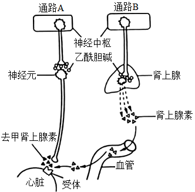
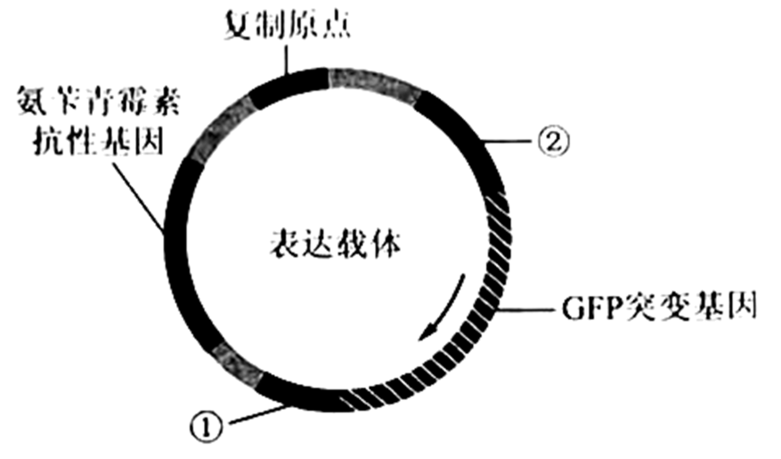

**2023年普通高等学校招生全国统一考试·乙卷**

**生 物**

**一、选择题：**

1\. 生物体内参与生命活动的生物大分子可由单体聚合而成，构成蛋白质等生物大分子的单体和连接键，以及检测生物大分子的试剂等信息如下表。

|        |        |            |                  |
|:------:|:------:|:----------:|:----------------:|
|  单体  | 连接键 | 生物大分子 | 检测试剂或染色剂 |
| 葡萄糖 |   —    |     ①      |        —         |
|   ②    |   ③    |   蛋白质   |        ④         |
|   ⑤    |   —    |    核酸    |        ⑥         |

根据表中信息，下列叙述错误的是（ ）

A. ①可以是淀粉或糖原

B. ②是氨基酸，③是肽键，⑤是碱基

C. ②和⑤都含有C、H、O、N元素

D. ④可以是双缩脲试剂，⑥可以是甲基绿和吡罗红混合染色剂

2\. 植物叶片中色素对植物的生长发育有重要作用。下列有关叶绿体中色素的叙述，错误的是（ ）

A. 氮元素和镁元素是构成叶绿素分子的重要元素

B. 叶绿素和类胡萝卜素存在于叶绿体中类囊体的薄膜上

C. 用不同波长的光照射类胡萝卜素溶液，其吸收光谱在蓝紫光区有吸收峰

D. 叶绿体中色素在层析液中的溶解度越高，随层析液在滤纸上扩散得越慢

3\. 植物可通过呼吸代谢途径的改变来适应缺氧环境。在无氧条件下，某种植物幼苗的根细胞经呼吸作用释放CO2的速率随时间的变化趋势如图所示。下列相关叙述错误的是（ ）

A. 在时间a之前，植物根细胞无CO2释放，只进行无氧呼吸产生乳酸

B. a~b时间内植物根细胞存在经无氧呼吸产生酒精和CO2的过程

C. 每分子葡萄糖经无氧呼吸产生酒精时生成的ATP比产生乳酸时的多

D. 植物根细胞无氧呼吸产生的酒精跨膜运输的过程不需要消耗ATP

4\. 激素调节是哺乳动物维持正常生命活动的重要调节方式。下列叙述错误的是（ ）

A. 甲状腺分泌甲状腺激素受垂体和下丘脑调节

B. 细胞外液渗透压下降可促进抗利尿激素的释放

C. 胸腺可分泌胸腺激素，也是T细胞成熟的场所

D. 促甲状腺激素可经血液运输到靶细胞发挥作用

5\. 已知某种氨基酸（简称甲）是一种特殊氨基酸，迄今只在某些古菌（古细菌）中发现含有该氨基酸的蛋白质。研究发现这种情况出现的原因是，这些古菌含有特异的能够转运甲的tRNA（表示为tRNA甲）和酶E，酶E催化甲与tRNA甲结合生成携带了甲的tRNA甲（表示为甲－tRNA甲），进而将甲带入核糖体参与肽链合成。已知tRNA甲可以识别大肠杆菌mRNA中特定的密码子，从而在其核糖体上参与肽链的合成。若要在大肠杆菌中合成含有甲的肽链，则下列物质或细胞器中必须转入大肠杆菌细胞内的是（ ）

①ATP ②甲 ③RNA聚合酶 ④古菌的核糖体 ⑤酶E的基因 ⑥tRNA甲的基因

A. ②⑤⑥ B. ①②⑤ C. ③④⑥ D. ②④⑤

6\. 某种植物的宽叶/窄叶由等位基因A/a控制，A基因控制宽叶性状：高茎/矮茎由等位基因B/b控制，B基因控制高茎性状。这2对等位基因独立遗传。为研究该种植物的基因致死情况，某研究小组进行了两个实验，实验①：宽叶矮茎植株自交，子代中宽叶矮茎∶窄叶矮茎＝2∶1；实验②：窄叶高茎植株自交，子代中窄叶高茎∶窄叶矮茎＝2∶1。下列分析及推理中错误的是（ ）

A. 从实验①可判断A基因纯合致死，从实验②可判断B基因纯合致死

B. 实验①中亲本的基因型为Aabb，子代中宽叶矮茎的基因型也为Aabb

C. 若发现该种植物中的某个植株表现为宽叶高茎，则其基因型为AaBb

D. 将宽叶高茎植株进行自交，所获得子代植株中纯合子所占比例为1/4

7\. 植物的气孔由叶表皮上两个具有特定结构的保卫细胞构成。保卫细胞吸水体积膨大时气孔打开，反之关闭，保卫细胞含有叶绿体，在光下可进行光合作用。已知蓝光可作为一种信号促进保卫细胞逆浓度梯度吸收K⁺．有研究发现，用饱和红光（只用红光照射时，植物达到最大光合速率所需的红光强度）照射某植物叶片时，气孔开度可达最大开度的60%左右。回答下列问题。

（1）气孔的开闭会影响植物叶片的蒸腾作用、\_\_\_\_\_\_\_（答出2点即可）等生理过程。

（2）红光可通过光合作用促进气孔开放，其原因是\_\_\_\_\_\_\_。

（3）某研究小组发现在饱和红光基础上补加蓝光照射叶片，气孔开度可进一步增大，因此他们认为气孔开度进一步增大的原因是，蓝光促进保卫细胞逆浓度梯度吸收K＋。请推测该研究小组得出这一结论的依据是\_\_\_\_\_\_\_。

（4）已知某种除草剂能阻断光合作用的光反应，用该除草剂处理的叶片在阳光照射下气孔\_\_\_\_\_\_\_（填“能”或“不能”）维持一定的开度。

8\. 人体心脏和肾上腺所受神经支配的方式如图所示。回答下列问题。

（1）神经元未兴奋时，神经元细胞膜两侧可测得静息电位。静息电位产生和维持的主要原因是\_\_\_\_\_\_\_。

（2）当动脉血压降低时，压力感受器将信息由传入神经传到神经中枢，通过通路A和通路B使心跳加快。在上述反射活动中，效应器有\_\_\_\_\_\_\_。通路A中，神经末梢释放的可作用于效应器并使其兴奋的神经递质是\_\_\_\_\_\_\_。

（3）经过通路B调节心血管活动的调节方式有\_\_\_\_\_\_\_。

9\. 农田生态系统和森林生态系统属于不同类型的生态系统。回答下列问题。

（1）某农田生态系统中有玉米、蛇、蝗虫、野兔、青蛙和鹰等生物，请从中选择生物，写出一条具有5个营养级的食物链：\_\_\_\_\_\_\_。

（2）负反馈调节是生态系统自我调节能力的基础。请从负反馈调节的角度分析，森林中害虫种群数量没有不断增加的原因是\_\_\_\_\_\_\_。

（3）从生态系统稳定性的角度来看，一般来说，森林生态系统的抵抗力稳定性高于农田生态系统，原因是\_\_\_\_\_\_\_。

10\. 某种观赏植物的花色有红色和白色两种。花色主要是由花瓣中所含色素种类决定的，红色色素是由白色底物经两步连续的酶促反应形成的，第1步由酶1催化，第2步由酶2催化，其中酶1的合成由A基因控制，酶2的合成由B基因控制。现有甲、乙两个不同的白花纯合子，某研究小组分别取甲、乙的花瓣在缓冲液中研磨，得到了甲、乙花瓣的细胞研磨液，并用这些研磨液进行不同的实验。

实验一：探究白花性状是由A或B基因单独突变还是共同突变引起的

①取甲、乙的细胞研磨液在室温下静置后发现均无颜色变化。

②在室温下将两种细胞研磨液充分混合，混合液变成红色。

③将两种细胞研磨液先加热煮沸，冷却后再混合，混合液颜色无变化

实验二：确定甲和乙植株的基因型

将甲的细胞研磨液煮沸，冷却后与乙的细胞研磨液混合，发现混合液变成了红色。

回答下列问题。

（1）酶在细胞代谢中发挥重要作用，与无机催化剂相比，酶所具有的特性是\_\_\_\_\_\_\_（答出3点即可）；煮沸会使细胞研磨液中的酶失去催化作用，其原因是高温破坏了酶的\_\_\_\_\_\_\_。

（2）实验一②中，两种细胞研磨液混合后变成了红色，推测可能的原因是\_\_\_\_\_\_\_。

（3）根据实验二的结果可以推断甲的基因型是\_\_\_\_\_\_\_，乙的基因型是\_\_\_\_\_\_\_；若只将乙的细胞研磨液煮沸，冷却后与甲的细胞研磨液混合，则混合液呈现的颜色是\_\_\_\_\_\_\_。

**（二）选考题：共45分。请考生从2道物理题、2道化学题、2道生物题中每科任选一题作答。如果多做，则每科按所做的第一题计分。**

**【生物——选修1：生物技术实践】（15分）**

11\. 某研究小组设计了一个利用作物秸秆生产燃料乙醇的小型实验。其主要步骤是：先将粉碎的作物秸秆堆放在底部有小孔的托盘中，喷水浸润、接种菌T，培养一段时间后，再用清水淋洗秸秆堆（清水淋洗时菌T不会流失），在装有淋洗液的瓶中接种酵母菌，进行乙醇发酵（酒精发酵）。实验流程如图所示。

回答下列问题。

（1）在粉碎的秸秆中接种菌T，培养一段时间后发现菌T能够将秸秆中的纤维素大量分解，其原因是\_\_\_\_\_\_\_。

（2）采用液体培养基培养酵母菌，可以用淋洗液为原料制备培养基，培养基中还需要加入氮源等营养成分，氮源的主要作用是\_\_\_\_\_\_\_（答出1点即可）。通常，可采用高压蒸汽灭菌法对培养基进行灭菌。在使用该方法时，为了达到良好的灭菌效果，需要注意的事项有\_\_\_\_\_\_\_（答出2点即可）。

（3）将酵母菌接种到灭菌后的培养基中，拧紧瓶盖，置于适宜温度下培养、发酵。拧紧瓶盖的主要目的是\_\_\_\_\_\_\_。但是在酵母菌发酵过程中，还需适时拧松瓶盖，原因是\_\_\_\_\_\_\_。发酵液中的乙醇可用\_\_\_\_\_\_\_溶液检测。

（4）本实验收集的淋洗液中的\_\_\_\_\_\_\_可以作为酵母菌生产乙醇的原料。与以粮食为原料发酵生产乙醇相比，本实验中乙醇生产方式的优点是\_\_\_\_\_\_\_。

**【生物——选修3：现代生物科技专题】（15分）**

12\. GFP是水母体内存在的能发绿色荧光的一种蛋白。科研人员以GFP基因为材料，利用基因工程技术获得了能发其他颜色荧光的蛋白，丰富了荧光蛋白的颜色种类。回答下列问题。

（1）构建突变基因文库，科研人员将GFP基因的不同突变基因分别插入载体，并转入大肠杆菌制备出GFP基因的突变基因文库。通常，基因文库是指\_\_\_\_\_\_\_。

（2）构建目的基因表达载体。科研人员从构建的GFP突变基因文库中提取目的基因（均为突变基因）构建表达载体，其模式图如下所示（箭头为GFP突变基因的转录方向）。图中①为\_\_\_\_\_\_\_；②为\_\_\_\_\_\_\_，其作用是\_\_\_\_\_\_\_；图中氨苄青霉素抗性基因是一种标记基因，其作用是\_\_\_\_\_\_\_。

（3）目的基因的表达。科研人员将构建好的表达载体导入大肠杆菌中进行表达，发现大肠杆菌有的发绿色荧光，有的发黄色荧光，有的不发荧光。请从密码子特点的角度分析，发绿色荧光的可能原因是\_\_\_\_\_\_\_（答出1点即可）。

（4）新蛋白与突变基因的关联性分析。将上述发黄色荧光的大肠杆菌分离纯化后，对其所含的GFP突变基因进行测序，发现其碱基序列与GFP基因的不同，将该GFP突变基因命名为YFP基因（黄色荧光蛋白基因）。若要通过基因工程的方法探究YFP基因能否在真核细胞中表达，实验思路是\_\_\_\_\_\_\_。
