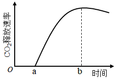
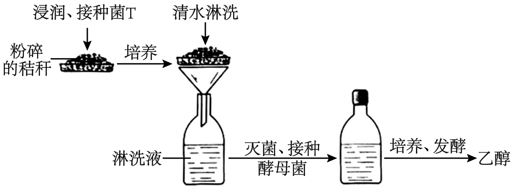

**2023年普通高等学校招生全国统一考试·乙卷**

**生 物**

**一、选择题：**

1\. 生物体内参与生命活动的生物大分子可由单体聚合而成，构成蛋白质等生物大分子的单体和连接键，以及检测生物大分子的试剂等信息如下表。

|        |        |            |                  |
|:------:|:------:|:----------:|:----------------:|
|  单体  | 连接键 | 生物大分子 | 检测试剂或染色剂 |
| 葡萄糖 |   —    |     ①      |        —         |
|   ②    |   ③    |   蛋白质   |        ④         |
|   ⑤    |   —    |    核酸    |        ⑥         |

根据表中信息，下列叙述错误的是（ ）

A. ①可以是淀粉或糖原

B. ②是氨基酸，③是肽键，⑤是碱基

C. ②和⑤都含有C、H、O、N元素

D. ④可以是双缩脲试剂，⑥可以是甲基绿和吡罗红混合染色剂

【答案】B

【解析】

【分析】多糖的单体是葡萄糖，蛋白质的单体是氨基酸，核酸的单体是核苷酸。

【详解】A、葡萄糖是多糖的单体，多糖包括淀粉、糖原和纤维素，故①可以是淀粉或糖原，A正确；

B、蛋白质是由单体②氨基酸通过脱水缩合形成③肽键连接形成的，核酸的单体是核苷酸，故⑤是核苷酸，B错误；

C、②氨基酸的元素组成是C、H、O、N，⑤核苷酸的元素组成是C、H、O、N、P，C正确；

D、检测蛋白质的④可以是双缩脲试剂，检测核酸的⑥可以是甲基绿和吡罗红混合染色剂，D正确。

故选B。

2\. 植物叶片中的色素对植物的生长发育有重要作用。下列有关叶绿体中色素的叙述，错误的是（ ）

A. 氮元素和镁元素是构成叶绿素分子的重要元素

B. 叶绿素和类胡萝卜素存在于叶绿体中类囊体的薄膜上

C. 用不同波长的光照射类胡萝卜素溶液，其吸收光谱在蓝紫光区有吸收峰

D. 叶绿体中的色素在层析液中的溶解度越高，随层析液在滤纸上扩散得越慢

【答案】D

【解析】

【分析】1、叶绿体色素提取色素原理是色素能溶解在酒精或丙酮等有机溶剂中，所以可用无水酒精等提取色素；分离色素原理是各色素随层析液在滤纸上扩散速度不同，从而分离色素，溶解度大，扩散速度快；溶解度小，扩散速度慢。

2、叶绿素主要吸收蓝紫光和红橙光，类胡萝卜素主要吸收蓝紫光。

【详解】A、叶绿素元素组成是C、H、O、N、Mg，所以氮元素和镁元素是构成叶绿素分子的重要元素，A正确；

B、光反应的场所是类囊体的薄膜，需要光合色素吸收光能，所以叶绿素和类胡萝卜素存在于叶绿体中类囊体的薄膜上，B正确；

C、类胡萝卜素主要吸收蓝紫光，所以用不同波长的光照射类胡萝卜素溶液，其吸收光谱在蓝紫光区有吸收峰，C正确；

D、叶绿体中的色素在层析液中的溶解度越高，随层析液在滤纸上扩散得越快，D错误。

故选D。

3\. 植物可通过呼吸代谢途径的改变来适应缺氧环境。在无氧条件下，某种植物幼苗的根细胞经呼吸作用释放CO2的速率随时间的变化趋势如图所示。下列相关叙述错误的是（ ）

A. 在时间a之前，植物根细胞无CO2释放，只进行无氧呼吸产生乳酸

B. a~b时间内植物根细胞存在经无氧呼吸产生酒精和CO2的过程

C. 每分子葡萄糖经无氧呼吸产生酒精时生成的ATP比产生乳酸时的多

D. 植物根细胞无氧呼吸产生的酒精跨膜运输的过程不需要消耗ATP

【答案】C

【解析】

【分析】1、 无氧呼吸分为两个阶段：第一阶段：葡萄糖分解成丙酮酸和\[H\]，并释放少量能量；第二阶段丙酮酸在不同酶的作用下转化成乳酸或酒精和二氧化碳，不释放能量。整个过程都发生在细胞质基质。

2、 有氧呼吸的第一、二、三阶段的场所依次是细胞质基质、线粒体基质和线粒体内膜。有氧呼吸第一阶段是葡萄糖分解成丙酮酸和\[H\]，合成少量ATP；第二阶段是丙酮酸和水反应生成二氧化碳和\[H\]，合成少量ATP；第三阶段是氧气和\[H\]反应生成水，合成大量ATP。

【详解】A、植物进行有氧呼吸或无氧呼吸产生酒精时都有二氧化碳释放，图示在时间a之前，植物根细胞无CO2释放，分析题意可知，植物可通过呼吸代谢途径的改变来适应缺氧环境，据此推知在时间a之前，只进行无氧呼吸产生乳酸，A正确；

B、a阶段无二氧化碳产生，b阶段二氧化碳释放较多，a~b时间内植物根细胞存在经无氧呼吸产生酒精和CO2的过程，是植物通过呼吸途径改变来适应缺氧环境的体现，B正确；

C、无论是产生酒精还是产生乳酸的无氧呼吸，都只在第一阶段释放少量能量，第二阶段无能量释放，故每分子葡萄糖经无氧呼吸产生酒精时生成的ATP和产生乳酸时相同，C错误；

D、酒精跨膜运输方式是自由扩散，该过程不需要消耗ATP，D正确。

故选C。

4\. 激素调节是哺乳动物维持正常生命活动的重要调节方式。下列叙述错误的是（ ）

A. 甲状腺分泌甲状腺激素受垂体和下丘脑调节

B. 细胞外液渗透压下降可促进抗利尿激素的释放

C. 胸腺可分泌胸腺激素，也是T细胞成熟的场所

D. 促甲状腺激素可经血液运输到靶细胞发挥作用

【答案】B

【解析】

【分析】下丘脑分泌的促甲状腺激素释放激素能促进垂体分泌促甲状腺激素，垂体分泌促甲状腺激素能促进甲状腺分泌甲状腺激素。而甲状腺激素对下丘脑和垂体有负反馈作用，当甲状腺激素分泌过多时，会抑制促甲状腺激素释放激素和促甲状腺激素的分泌，进而减少甲状腺激素的分泌；当血液中甲状腺激素的含量增加到一定程度时，就会抑制下丘脑和垂体的活动，使促甲状腺激素释放激素和促甲状腺激素的合成和分泌量减少，从而使血液中的甲状腺激素不致过多；当血液中甲状腺激素的含量降低时，对下丘脑和垂体的抑制作用减弱，使促甲状腺激素释放激素和促甲状腺激素的合成和分泌增加，从而使血液中甲状腺激素不致过少。

【详解】A、甲状腺分泌甲状腺激素受下丘脑分泌的促甲状腺激素释放激素以及垂体分泌的促甲状腺激素的调节，A正确；

B、细胞外液渗透压下降对下丘脑渗透压感受器的刺激作用减弱，因而下丘脑的神经分泌细胞分泌的抗利尿激素减少，同时通过垂体释放的抗利尿激素也减少，B错误；

C、胸腺可分泌胸腺激素，能增强免疫细胞的功能，同时T细胞成熟的场所也在胸腺，C正确；

D、促甲状腺激素作为一种激素由垂体细胞合成和分泌后，经血液运输到靶细胞，即甲状腺细胞发挥作用，D正确。

故选B。

5\. 已知某种氨基酸（简称甲）是一种特殊氨基酸，迄今只在某些古菌（古细菌）中发现含有该氨基酸蛋白质。研究发现这种情况出现的原因是，这些古菌含有特异的能够转运甲的tRNA（表示为tRNA甲）和酶E，酶E催化甲与tRNA甲结合生成携带了甲的tRNA甲（表示为甲－tRNA甲），进而将甲带入核糖体参与肽链合成。已知tRNA甲可以识别大肠杆菌mRNA中特定的密码子，从而在其核糖体上参与肽链的合成。若要在大肠杆菌中合成含有甲的肽链，则下列物质或细胞器中必须转入大肠杆菌细胞内的是（ ）

①ATP ②甲 ③RNA聚合酶 ④古菌的核糖体 ⑤酶E的基因 ⑥tRNA甲的基因

A. ②⑤⑥ B. ①②⑤ C. ③④⑥ D. ②④⑤

【答案】A

【解析】

【分析】分泌蛋白的合成过程大致是：首先在游离的核糖体中以氨基酸为原料开始多肽链的合成。当合成了一段肽链后，这段肽链会与核糖体一起转移到粗面内质网上，继续其合成过程。并且边合成边转移到内质网腔内，再经过加工折叠形成具有一定空间结构的蛋白质。内质网膜鼓出形成囊泡，包裹着蛋白质离开内质网转到达高尔基体，与高尔基体膜融合，囊泡膜成为高尔基体膜的一部分，高尔基体还能对蛋白质进一步的修饰和加工。然后由高尔基体膜形成包裹着蛋白质的囊泡。囊泡转到细胞膜，与细胞膜融合，将蛋白质分泌到细胞外。在分泌蛋白的合成、加工、运输的过程中需要消耗能量，这些能量主要来自于线粒体。

【详解】据题意可知，氨基酸甲是一种特殊氨基酸，迄今只在某些古菌（古细菌）中发现含有该氨基酸的蛋白质，所以要在大肠杆菌中合成含有甲的肽链，必须往大肠杆菌中转入氨基酸甲，②正确；又因古菌含有特异的能够转运甲的tRNA（表示为tRNA甲）和酶E，酶E催化甲与tRNA甲结合生成携带了甲的tRNA甲（表示为甲－tRNA甲），进而将甲带入核糖体参与肽链合成。tRNA甲可以识别大肠杆菌mRNA中特定的密码子，从而在其核糖体上参与肽链的合成。所以大肠杆菌细胞内要含有tRNA甲的基因以便合成tRNA甲，大肠杆菌细胞内也要含有酶E的基因以便合成酶E，催化甲与tRNA甲结合，⑤⑥正确。肽链的合成过程需要能量（ATP），但是大肠杆菌可通过无氧呼吸提供能量。

故选A。

6\. 某种植物的宽叶/窄叶由等位基因A/a控制，A基因控制宽叶性状：高茎/矮茎由等位基因B/b控制，B基因控制高茎性状。这2对等位基因独立遗传。为研究该种植物的基因致死情况，某研究小组进行了两个实验，实验①：宽叶矮茎植株自交，子代中宽叶矮茎∶窄叶矮茎＝2∶1；实验②：窄叶高茎植株自交，子代中窄叶高茎∶窄叶矮茎＝2∶1。下列分析及推理中错误的是（ ）

A. 从实验①可判断A基因纯合致死，从实验②可判断B基因纯合致死

B. 实验①中亲本的基因型为Aabb，子代中宽叶矮茎的基因型也为Aabb

C. 若发现该种植物中的某个植株表现为宽叶高茎，则其基因型为AaBb

D. 将宽叶高茎植株进行自交，所获得子代植株中纯合子所占比例为1/4

【答案】D

【解析】

【分析】实验①：宽叶矮茎植株自交，子代中宽叶矮茎∶窄叶矮茎＝2∶1，亲本为Aabb，子代中原本为AA：Aa：aa=1：2：1，因此推测AA致死；实验②：窄叶高茎植株自交，子代中窄叶高茎∶窄叶矮茎＝2∶1，亲本为aaBb，子代原本为BB：Bb：bb=1：2：1，因此推测BB致死。

【详解】A、实验①：宽叶矮茎植株自交，子代中宽叶矮茎∶窄叶矮茎＝2∶1，亲本为Aabb，子代中原本为AA：Aa：aa=1：2：1，因此推测AA致死；实验②：窄叶高茎植株自交，子代中窄叶高茎∶窄叶矮茎＝2∶1，亲本为aaBb，子代原本为BB：Bb：bb=1：2：1，因此推测BB致死，A正确；

B、实验①中亲本为宽叶矮茎，且后代出现性状分离，所以基因型为Aabb，子代中由于AA致死，因此宽叶矮茎的基因型也为Aabb，B正确；

C、由于AA和BB均致死，因此若发现该种植物中的某个植株表现为宽叶高茎，则其基因型为AaBb ，C正确；

D、将宽叶高茎植株AaBb进行自交，由于AA和BB致死，子代原本的9：3：3：1剩下4：2：2：1，其中只有窄叶矮茎的植株为纯合子，所占比例为1/9，D错误。

故选D。

7\. 植物的气孔由叶表皮上两个具有特定结构的保卫细胞构成。保卫细胞吸水体积膨大时气孔打开，反之关闭，保卫细胞含有叶绿体，在光下可进行光合作用。已知蓝光可作为一种信号促进保卫细胞逆浓度梯度吸收K⁺．有研究发现，用饱和红光（只用红光照射时，植物达到最大光合速率所需的红光强度）照射某植物叶片时，气孔开度可达最大开度的60%左右。回答下列问题。

（1）气孔的开闭会影响植物叶片的蒸腾作用、\_\_\_\_\_\_\_（答出2点即可）等生理过程。

（2）红光可通过光合作用促进气孔开放，其原因是\_\_\_\_\_\_\_。

（3）某研究小组发现在饱和红光的基础上补加蓝光照射叶片，气孔开度可进一步增大，因此他们认为气孔开度进一步增大的原因是，蓝光促进保卫细胞逆浓度梯度吸收K＋。请推测该研究小组得出这一结论的依据是\_\_\_\_\_\_\_。

（4）已知某种除草剂能阻断光合作用的光反应，用该除草剂处理的叶片在阳光照射下气孔\_\_\_\_\_\_\_（填“能”或“不能”）维持一定的开度。

【答案】（1）光合作用和呼吸作用

（2）红光是叶绿体色素主要吸收的光，因而红光照射能促进保卫细胞的叶绿体进行光合作用，保卫细胞的渗透压上升，因而吸水体积膨大，气孔开放。

（3）蓝光作为信号能促进保卫细胞逆浓度梯度吸收K＋，因而保卫细胞渗透压上升，吸水膨胀，气孔张开。 （4）不能

【解析】

【分析】光合作用包括光反应和暗反应两个阶段：光反应发生场所在叶绿体的类囊体薄膜上，色素吸收光能、传递光能，并将一部分光能用于水的光解生成\[H\]和氧气，另一部分光能用于合成ATP；暗反应发生场所是叶绿体基质中，首先发生二氧化碳的固定，即二氧化碳和五碳化合物结合形成两分子的三碳化合物，三碳化合物在光反应产生的\[H\]和ATP的作用下被还原，进而合成有机物。影响光合作用的主要外界因素有光照强度、二氧化碳浓度和温度。

【小问1详解】

植物的蒸腾作用是通过气孔实现的，可见气孔的开闭将直接影响蒸腾作用，同时，蒸腾作用能提供植物吸水和运水的动力，植物体中营养物质的运输过程离不开水分，因此光合作用回因为营养物质运输不畅受到影响，同时气孔关闭也会影响气体与外界环境的交换能力变弱，而光合作用需要通过气孔吸收的二氧化碳作为原料，进而受到影响，同时产生的氧气也需要通过气孔释放出去；呼吸作用需要利用氧气，同时产生的二氧化碳需要释放出去，总之，光合作用和呼吸作用均需要植物通过气孔很好地与外界发生气体交换才能顺利完成，可见气孔的开闭直接影响的生理过程除了蒸腾作用外，还有光合作用和呼吸作用。

【小问2详解】

红光是植物光合色素主要捕获的光，因而能促进保卫细胞中的叶绿体进行光合作用，光合作用制造的有机物能提高植物细胞的渗透压，进而促进保卫细胞吸水，保卫细胞体积膨大而气孔开放。

【小问3详解】

题中显示，蓝光可作为一种信号促进保卫细胞逆浓度梯度吸收K+，进而增加了保卫细胞的渗透压，保卫细胞吸水能力增强，因而体积膨大，气孔开放，因此，在饱和红光的基础上补加蓝光照射叶片，气孔开度可进一步增大。

【小问4详解】

某种除草剂能阻断光合作用的光反应，进而会影响光合作用的暗反应过程，进而导致光合速率下降，合成的有机物减少，因而保卫细胞渗透压下降，吸水能力下降，保卫细胞体积减小，因而在使用除草剂的条件下，即使给与光照也不能使气孔维持一定的开度。

8\. 人体心脏和肾上腺所受神经支配的方式如图所示。回答下列问题。

（1）神经元未兴奋时，神经元细胞膜两侧可测得静息电位。静息电位产生和维持的主要原因是\_\_\_\_\_\_\_。

（2）当动脉血压降低时，压力感受器将信息由传入神经传到神经中枢，通过通路A和通路B使心跳加快。在上述反射活动中，效应器有\_\_\_\_\_\_\_。通路A中，神经末梢释放可作用于效应器并使其兴奋的神经递质是\_\_\_\_\_\_\_。

（3）经过通路B调节心血管活动的调节方式有\_\_\_\_\_\_\_。

【答案】（1）钾离子外流

（2） ①. 传出神经末梢及其支配的肾上腺和心脏\
②. 去甲肾上腺素 （3）神经-体液调节

【解析】

【分析】1、静息时，钾离子大量外流，形成内负外正的静息电位；受到刺激后，神经细胞膜的通透性发生改变，对钠离子的通透性增大，钠离子内流，形成内正外负的动作电位，兴奋部位和非兴奋部位形成电位差，产生局部电流，兴奋传导的方向与膜内电流方向一致。

2、兴奋在神经元之间需要通过突触结构进行传递，突触包括突触前膜、突触间隙、突触后膜，其具体的传递过程为：兴奋以电流的形式传导到轴突末梢时，突触小泡释放递质（化学信号），递质作用于突触后膜，引起突触后膜产生膜电位（电信号），从而将兴奋传递到下一个神经元。

【小问1详解】

静息时，神经细胞膜对钾离子的通透性大，钾离子大量外流，形成内负外正的静息电位。

【小问2详解】

效应器由传出神经末梢及其支配的肌肉或腺体，则图中的效应器为传出神经末梢及其支配的肾上腺和心脏。通路A中，在突触间以乙酰胆碱为神经递质传递兴奋，在神经元与心脏细胞之间以去甲肾上腺素为神经递质传递兴奋，其中只有去甲肾上腺素作用的是效应器（心脏），所以神经末梢释放的可作用于效应器并使其兴奋的神经递质是去甲肾上腺素。

【小问3详解】

通路B神经中枢通过控制肾上腺分泌肾上腺素调节心血管活动，有神经细胞的参与，也有内分泌腺的参与，所以经过通路B调节心血管活动的调节方式为神经-体液调节。

9\. 农田生态系统和森林生态系统属于不同类型的生态系统。回答下列问题。

（1）某农田生态系统中有玉米、蛇、蝗虫、野兔、青蛙和鹰等生物，请从中选择生物，写出一条具有5个营养级的食物链：\_\_\_\_\_\_\_。

（2）负反馈调节是生态系统自我调节能力的基础。请从负反馈调节的角度分析，森林中害虫种群数量没有不断增加的原因是\_\_\_\_\_\_\_。

（3）从生态系统稳定性的角度来看，一般来说，森林生态系统的抵抗力稳定性高于农田生态系统，原因是\_\_\_\_\_\_\_。

【答案】（1）玉米→蝗虫→青蛙→蛇→鹰

（2）在森林中，当害虫数量增加时，食虫鸟增多，害虫种群的增长就受到抑制

（3）森林生态系统的生物种类多，食物网（营养结构）复杂，自我调节能力强

【解析】

【分析】食物链和食物网的分析：

1、每条食物链的起点总是生产者，阳光不能纳入食物链，食物链终点是不能被其他生物所捕食的动物，即最高营养级，食物链中间不能做任何停顿，否则不能算作完整的食物链。

2、食物网中同一环节上所有生物的总和称为一个营养级。

3、同一种生物在不同食物链中可以占有不同的营养级。

4、在食物网中，两种生物之间的种间关系有可能出现不同的类型。

5、食物网中，某种生物因某种原因而大量减少时，对另外一种生物的影响，沿不同食物链分析的结果不同时应以中间环节少为依据。

6、食物网的复杂程度主要取决于有食物联系的生物种类，而非取决于生物的数量。

【小问1详解】

每条食物链的起点总是生产者，食物链终点是不能被其他生物所捕食的动物，即最高营养级，某农田生态系统中有玉米、蛇、蝗虫、野兔、青蛙和鹰等生物，具有5个营养级的食物链为玉米→蝗虫→青蛙→蛇→鹰。

【小问2详解】

在森林中，当害虫数量增加时，食虫鸟也会增多，害虫种群的增长就受到抑制，这属于负反馈调节，它是生态系统自我调节能力的基础。

【小问3详解】

森林生态系统的生物种类多，食物网（营养结构）复杂，自我调节能力强，故森林生态系统的抵抗力稳定性高于农田生态系统。

10\. 某种观赏植物的花色有红色和白色两种。花色主要是由花瓣中所含色素种类决定的，红色色素是由白色底物经两步连续的酶促反应形成的，第1步由酶1催化，第2步由酶2催化，其中酶1的合成由A基因控制，酶2的合成由B基因控制。现有甲、乙两个不同的白花纯合子，某研究小组分别取甲、乙的花瓣在缓冲液中研磨，得到了甲、乙花瓣的细胞研磨液，并用这些研磨液进行不同的实验。

实验一：探究白花性状是由A或B基因单独突变还是共同突变引起的

①取甲、乙的细胞研磨液在室温下静置后发现均无颜色变化。

②在室温下将两种细胞研磨液充分混合，混合液变成红色。

③将两种细胞研磨液先加热煮沸，冷却后再混合，混合液颜色无变化。

实验二：确定甲和乙植株的基因型

将甲的细胞研磨液煮沸，冷却后与乙的细胞研磨液混合，发现混合液变成了红色。

回答下列问题。

（1）酶在细胞代谢中发挥重要作用，与无机催化剂相比，酶所具有的特性是\_\_\_\_\_\_\_（答出3点即可）；煮沸会使细胞研磨液中的酶失去催化作用，其原因是高温破坏了酶的\_\_\_\_\_\_\_。

（2）实验一②中，两种细胞研磨液混合后变成了红色，推测可能的原因是\_\_\_\_\_\_\_。

（3）根据实验二的结果可以推断甲的基因型是\_\_\_\_\_\_\_，乙的基因型是\_\_\_\_\_\_\_；若只将乙的细胞研磨液煮沸，冷却后与甲的细胞研磨液混合，则混合液呈现的颜色是\_\_\_\_\_\_\_。

【答案】（1） ①. 高效性、专一性、作用条件温和 ②. 空间结构

（2）一种花瓣中含有酶1催化产生的中间产物，另一种花瓣中含有酶2，两者混合后形成红色色素

（3） ①. AAbb ②. aaBB ③. 白色

【解析】

【分析】由题干信息可知，甲、乙两个不同的白花纯合子，基因型是AAbb或aaBB。而根据实验一可知，两者基因型不同；根据实验二可知，甲为AAbb，乙为aaBB。

【小问1详解】

与无机催化剂相比，酶所具有的特性是高效性、专一性、作用条件温和。

高温破坏了酶空间结构，导致酶失活而失去催化作用。

【小问2详解】

根据题干可知白花纯合子的基因型可能是AAbb或aaBB，而甲、乙两者细胞研磨液混合后变成了红色，推测两者基因型不同，一种花瓣中含有酶1催化产生的中间产物，另一种花瓣中含有酶2，两者混合后形成红色色素。

【小问3详解】

实验二的结果甲的细胞研磨液煮沸，冷却后与乙的细胞研磨液混合，发现混合液变成了红色，可知甲并不是提供酶2的一方，而是提供酶1催化产生的中间产物，因此基因型为AAbb，而乙则是提供酶2的一方，基因型为aaBB。

若只将乙的细胞研磨液煮沸，冷却后与甲的细胞研磨液混合，由于乙中的酶2失活，无法催化红色色素的形成，因此混合液呈现的颜色是白色。

**（二）选考题：共45分。请考生从2道物理题、2道化学题、2道生物题中每科任选一题作答。如果多做，则每科按所做的第一题计分。**

**【生物——选修1：生物技术实践】（15分）**

11\. 某研究小组设计了一个利用作物秸秆生产燃料乙醇的小型实验。其主要步骤是：先将粉碎的作物秸秆堆放在底部有小孔的托盘中，喷水浸润、接种菌T，培养一段时间后，再用清水淋洗秸秆堆（清水淋洗时菌T不会流失），在装有淋洗液的瓶中接种酵母菌，进行乙醇发酵（酒精发酵）。实验流程如图所示。

回答下列问题。

（1）在粉碎的秸秆中接种菌T，培养一段时间后发现菌T能够将秸秆中的纤维素大量分解，其原因是\_\_\_\_\_\_\_。

（2）采用液体培养基培养酵母菌，可以用淋洗液为原料制备培养基，培养基中还需要加入氮源等营养成分，氮源的主要作用是\_\_\_\_\_\_\_（答出1点即可）。通常，可采用高压蒸汽灭菌法对培养基进行灭菌。在使用该方法时，为了达到良好的灭菌效果，需要注意的事项有\_\_\_\_\_\_\_（答出2点即可）。

（3）将酵母菌接种到灭菌后的培养基中，拧紧瓶盖，置于适宜温度下培养、发酵。拧紧瓶盖的主要目的是\_\_\_\_\_\_\_。但是在酵母菌发酵过程中，还需适时拧松瓶盖，原因是\_\_\_\_\_\_\_。发酵液中的乙醇可用\_\_\_\_\_\_\_溶液检测。

（4）本实验收集的淋洗液中的\_\_\_\_\_\_\_可以作为酵母菌生产乙醇的原料。与以粮食为原料发酵生产乙醇相比，本实验中乙醇生产方式的优点是\_\_\_\_\_\_\_。

【答案】（1）菌T能够分泌纤维素酶

（2） ①. 为合成微生物细胞结构提供原料（微生物细胞中的含氮物质，如核酸、蛋白质、磷脂） ②. ①把锅内的水加热煮沸，将其中原有的冷空气彻底排除后；②为达到良好的灭菌效果，一般在压力为100 kPa，温度为121℃的条件下，维持15~30 min；③无菌包不宜过大，不宜过紧，各包裹间要有间隙，使蒸汽能对流易渗透到包裹中央，有利于蒸汽流通；④灭菌完成后，应使锅内蒸气压力缓慢降低，排气时间不少于10一12分钟。

（3） ①. 制造无氧环境 ②. 排出二氧化碳 ③. 酸性的重铬酸钾溶液

（4） ①. 葡萄糖 ②. 节约粮食、废物利用、清洁环保、不污染环境、生产成本低、原料来源广

【解析】

【分析】果酒的制作离不开酵母菌，酵母菌是兼性厌氧微生物，在有氧条件下，酵母菌进行有氧呼吸，大量繁殖，把糖分解成二氧化碳和水；在无氧条件下，酵母菌能进行酒精发酵。故果酒的制作原理是酵母菌无氧呼吸产生酒精，酵母菌最适宜生长繁殖的温度范围是18～30℃；生产中是否有酒精的产生，可用酸性重铬酸钾来检验，该物质与酒精反应呈现灰绿色。

【小问1详解】

菌T能够分泌纤维素酶，纤维素酶能将纤维素最终分解为葡萄糖，因此在粉碎的秸秆中接种菌T，培养一段时间后发现菌T能够将秸秆中的纤维素大量分解。

【小问2详解】

培养基的主要成分：水、碳源、氮源、无机盐，其中氮源主要为合成微生物的细胞结构提供原料（微生物细胞中的含氮物质，如核酸、蛋白质、磷脂）。 高压蒸汽灭菌法的注意的事项有①把锅内的水加热煮沸，将其中原有的冷空气彻底排除后，将锅密闭，如果高压锅内的空气未排除或未完全排除，则蒸汽不能达到饱和，蒸汽的温度未达到要求的高度，结果导致灭菌的失败；②为达到良好的灭菌效果，一般在压力为100 kPa，温度为121℃的条件下，维持15~30 min；③无菌包不宜过大，不宜过紧，各包裹间要有间隙，使蒸汽能对流易渗透到包裹中央，有利于蒸汽流通；④灭菌完成后，应使锅内蒸气压力缓慢降低，排气时间不少于10一12分钟，否则锅内蒸气压力突然降低，液体突然沸腾，冲走瓶盖，使液体喷出或使容器破裂。

【小问3详解】

果酒的制作原理是酵母菌无氧呼吸产生酒精，将酵母菌接种到灭菌后的培养基中进行酒精发酵，酒精发酵需要在无氧的条件下进行，此时拧紧瓶盖的主要目的是制造无氧环境。酵母菌进行无氧呼吸产生酒精和二氧化碳，在发酵过程中密闭，所以需要根据发酵进程适时拧松瓶盖放出二氧化碳，酒精可用酸性重铬酸钾溶液来检测，该物质与酒精反应呈现灰绿色。

【小问4详解】

与以粮食为原料发酵生产乙醇相比，利用纤维素为原料生产乙醇具有节约粮食、废物利用、清洁环保、不污染环境、生产成本低、原料来源广等优点。

**【生物——选修3：现代生物科技专题】（15分）**

12\. GFP是水母体内存在的能发绿色荧光的一种蛋白。科研人员以GFP基因为材料，利用基因工程技术获得了能发其他颜色荧光的蛋白，丰富了荧光蛋白的颜色种类。回答下列问题。

（1）构建突变基因文库，科研人员将GFP基因的不同突变基因分别插入载体，并转入大肠杆菌制备出GFP基因的突变基因文库。通常，基因文库是指\_\_\_\_\_\_\_。

（2）构建目的基因表达载体。科研人员从构建的GFP突变基因文库中提取目的基因（均为突变基因）构建表达载体，其模式图如下所示（箭头为GFP突变基因的转录方向）。图中①为\_\_\_\_\_\_\_；②为\_\_\_\_\_\_\_，其作用是\_\_\_\_\_\_\_；图中氨苄青霉素抗性基因是一种标记基因，其作用是\_\_\_\_\_\_\_。

（3）目的基因的表达。科研人员将构建好的表达载体导入大肠杆菌中进行表达，发现大肠杆菌有的发绿色荧光，有的发黄色荧光，有的不发荧光。请从密码子特点的角度分析，发绿色荧光的可能原因是\_\_\_\_\_\_\_（答出1点即可）。

（4）新蛋白与突变基因的关联性分析。将上述发黄色荧光的大肠杆菌分离纯化后，对其所含的GFP突变基因进行测序，发现其碱基序列与GFP基因的不同，将该GFP突变基因命名为YFP基因（黄色荧光蛋白基因）。若要通过基因工程的方法探究YFP基因能否在真核细胞中表达，实验思路是\_\_\_\_\_\_\_。

【答案】（1）将含有某种生物不同基因的许多DNA片段，导入受体菌的群体中储存，各个受体菌分别含有这种生物的不同的基因

（2） ①. 终止子 ②. 启动子 ③. RNA聚合酶识别和结合的部位，驱动基因转录 ④. 鉴别受体细胞中是否含有目的基因，从而将含有目的基因的细胞筛选出来 （3）密码子具有简并性

（4）将构建好的表达载体（含有目的基因YFP基因）导入酵母菌中进行表达

【解析】

【分析】有关密码子，考生可从以下几方面把握：

①概念：密码子是mRNA上相邻的3个碱基。

②种类：64种，其中有3种是终止密码子，不编码氨基酸。

③特点：一种密码子只能编码一种氨基酸，但一种氨基酸可能由一种或多种密码子编码；密码子具有通用性，即自然界所有的生物共用一套遗传密码。

【小问1详解】

将含有某种生物不同基因的许多DNA片段，导入受体菌的群体中储存，各个受体菌分别含有这种生物的不同的基因，称为基因文库。

【小问2详解】

一个基因表达载体的组成，除了目的基因外，还必须有启动子，终止子以及标记基因等，且基因的转录方向为从启动子到终止子，故图中①为终止子，②为启动子，启动子是一段有特殊结构的DNA片段，位于基因的首端，它是RNA聚合酶识别和结合的部位，有了它才能驱动基因转录出mRNA，最终获得所需要的蛋白质。标记基因的作用是为了鉴别受体细胞中是否含有目的基因，从而将含有目的基因的细胞筛选出来，如抗生素基因就可以作为这种基因。

【小问3详解】

正常情况下，GFP突变基因应该不发绿色荧光，而大肠杆菌有的发绿色荧光，从密码子特点的角度分析，原因是密码子具有简并性，即一种氨基酸可能由一个或多个密码子决定。

【小问4详解】

基因工程研究中常用的真核表达系统有酵母表达系统、昆虫细胞表达系统和哺乳动物细胞表达系统。要通过基因工程的方法探究YFP基因能否在真核细胞中表达，可将构建好的表达载体（含有目的基因YFP基因）导入酵母菌中进行表达，如果酵母菌发出黄色荧光，说明YFP基因能在真核细胞中表达，反之则不能在真核细胞中表达。
