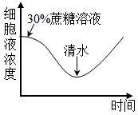
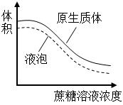

**2023年普通高等学校招生全国统一考试·全国甲卷**

**理科综合（生物部分）**

**一、选择题**

1\. 物质输入和输出细胞都需要经过细胞膜。下列有关人体内物质跨膜运输的叙述，正确的是（ ）

A. 乙醇是有机物，不能通过自由扩散方式跨膜进入细胞

B. 血浆中的K+进入红细胞时需要载体蛋白并消耗ATP

C. 抗体浆细胞内合成时消耗能量，其分泌过程不耗能

D 葡萄糖可通过主动运输但不能通过协助扩散进入细胞

2\. 植物激素是一类由植物体产生的，对植物的生长发育有显著影响的微量有机物，下列关于植物激素的叙述，错误的是（ ）

A. 在植物幼嫩的芽中色氨酸可以转变成生长素

B. 生长素可以从产生部位运输到其他部位发挥作用

C. 生长素和乙烯可通过相互作用共同调节植物的生长发育

D. 植物体内生长素可以作为催化剂直接参与细胞代谢过程

3\. 中枢神经系统对维持人体内环境的稳态具有重要作用。下列关于人体中枢的叙述，错误的是（ ）

A. 大脑皮层是调节机体活动的最高级中枢

B. 中枢神经系统的脑和脊髓中含有大量的神经元

C. 位于脊髓的低级中枢通常受脑中相应的高级中枢调控

D. 人体脊髓完整而脑部受到损伤时，不能完成膝跳反射

4\. 探究植物细胞的吸水和失水实验是高中学生常做的实验。某同学用紫色洋葱鳞片叶外表皮为材料进行实验，探究蔗糖溶液，清水处理外表皮后，外表皮细胞原生质体和液泡的体积及细胞液浓度的变化。图中所提到的原生质体是指植物细胞不包括细胞壁的部分。下列示意图中能够正确表示实验结果的是（ ）

A.  B. 

C.  D. 

5\. 在生态系统中，生产者所固定的能量可以沿着食物链传递，食物链中的每个环节即为一个营养级。下列关于营养级的叙述，错误的是（ ）

A. 同种动物在不同食物链中可能属于不同营养级

B. 作为生产者的绿色植物所固定的能量来源于太阳

C. 作为次级消费者的肉食性动物属于食物链的第二营养级

D. 能量从食物链第一营养级向第二营养级只能单向流动

6\. 水稻的某病害是由某种真菌（有多个不同菌株）感染引起的。水稻中与该病害抗性有关的基因有3个（A1、A2、a）；基因A1控制全抗性状（抗所有菌株），基因A2控制抗性性状（抗部分菌株），基因a控制易感性状（不抗任何菌株），且A1对A2为显性，A1对a为显性、A2对a为显性。现将不同表现型的水稻植株进行杂交，子代可能会出现不同的表现型及其分离比。下列叙述错误的是（ ）

A 全抗植株与抗性植株杂交，子代可能出现全抗：抗性=3：1

B. 抗性植株与易感植株杂交，子代可能出现抗性：易感=1：1

C. 全抗植株与易感植株杂交，子代可能出现全抗：抗性=1：1

D. 全抗植株与抗性植株杂交，子代可能出现全抗：抗性：易感=2：1：1

**二、非选择题：**

7\. 某同学将从菠菜叶中分离到的叶绿体悬浮于缓冲液中，给该叶绿体悬浮液照光后糖产生。回答下列问题。

（1）叶片是分离制备叶绿体的常用材料，若要将叶肉细胞中的叶绿体与线粒体等其他细胞器分离，可以采用的方法是\_\_\_\_\_（答出1种即可）。叶绿体中光合色素分布\_\_\_\_\_上，其中类胡萝卜素主要吸收\_\_\_\_\_（填“蓝紫光”“红光”或“绿光”）。

（2）将叶绿体的内膜和外膜破坏后，加入缓冲液形成悬浮液，发现黑暗条件下悬浮液中不能产生糖，原因是\_\_\_\_\_。

（3）叶片进行光合作用时，叶绿体中会产生淀粉。请设计实验证明叶绿体中有淀粉存在，简要写出实验思路和预期结果。\_\_\_\_\_

8\. 某研究小组以某种哺乳动物（动物甲）为对象研究水盐平衡调节，发现动物达到一定程度时，尿量明显减少并出现主动饮水行为；而大量饮用清水后，尿量增加。回答下列问题。

（1）哺乳动物水盐平衡的调节中枢位于\_\_\_\_\_。

（2）动物甲大量失水后，其单位体积细胞外液中溶质微粒的数目会\_\_\_\_\_，信息被机体内的某种感受器感受后，动物甲便会产生一种感觉即\_\_\_\_\_，进而主动饮水。

（3）请从水盐平衡调节的角度分析，动物甲大量饮水后尿量增加的原因是\_\_\_\_\_。

9\. 某旅游城市加强生态保护和环境治理后，城市环境发生了很大变化，水体鱼明显增多，甚至曾经消失一些水鸟（如水鸟甲）又重新出现。回答下列问题。

（1）调查水鸟甲的种群密度通常使用标志重捕法，原因是\_\_\_\_\_。

（2）从生态系统组成成分的角度来看，水体中的鱼，水鸟属于\_\_\_\_\_。

（3）若要了解该城市某个季节水鸟甲种群的环境容纳量，请围绕除食物外的调查内容有\_\_\_\_\_（答出3点即可）。

10\. 乙烯是植物果实成熟所需的激素，阻断乙烯的合成可使果实不能正常成熟，这一特点可以用于解决果实不耐储存的问题，以达到增加经济效益的目的。现有某种植物的3个纯合子（甲、乙、丙），其中甲和乙表现为果实不能正常成熟（不成熟），丙表现为果实能正常成熟（成熟），用这3个纯合子进行杂交实验，F1自交得F2，结果见下表。

| 实验 | 杂交组合 | F1表现型 | F2表现型及分离比 |
|:-----|:---------|:--------------------|:----------------------------|
| ①    | 甲×丙    | 不成熟              | 不成熟：成熟=3：1           |
| ②    | 乙×丙    | 成熟                | 成熟：不成熟=3：1           |
| ③    | 甲×乙    | 不成熟              | 不成熟：成熟=13：3          |

回答下列问题。

（1）利用物理、化学等因素处理生物，可以使生物发生基因突变，从而获得新品种。通常，基因突变是指\_\_\_\_\_。

（2）从实验①和②的结果可知，甲和乙的基因型不同，判断的依据是\_\_\_\_\_。

（3）已知丙的基因型为aaBB，且B基因控制合成的酶能够催化乙烯的合成，则甲、乙的基因型分别是\_\_\_\_\_；实验③中，F2成熟个体的基因型是\_\_\_\_\_，F2不成熟个体中纯合子所占的比例为\_\_\_\_\_。

11\. 为了研究蛋白质的结构与功能，常需要从生物材料中分离纯化蛋白质。某同学用凝胶色谱法从某种生物材料中分离纯化得到了甲、乙、丙3种蛋白质，并对纯化得到的3种蛋白质进行SDS-聚丙烯酰胺凝胶电泳，结果如图所示（“+”“-”分别代表电泳槽的阳极和阴极）。已知甲的相对分子质量是乙的2倍，且甲、乙均由一条肽链组成。回答下列问题。

（1）图中甲、乙、丙在进行SDS聚丙烯酰胺凝胶电泳时，迁移的方向是\_\_\_\_\_（填“从上向下”或“从下向上”）。

（2）图中丙在凝胶电泳时出现2个条带，其原因是\_\_\_\_\_。

（3）凝胶色谱法可以根据蛋白质\_\_\_\_\_的差异来分离蛋白质。据图判断，甲、乙、丙3种蛋白质中最先从凝胶色谱柱中洗脱出来的蛋白质是\_\_\_\_\_，最后从凝胶色谱柱中洗脱出来的蛋白质是\_\_\_\_\_。

（4）假设甲、乙、丙为3种酶，为了减少保存过程中酶活性的损失，应在\_\_\_\_\_（答出1点即可）条件下保存。

12\. 接种疫苗是预防传染病的一项重要措施，乙肝疫苗的使用可有效阻止乙肝病诗的传播，降低乙型肝炎发病率。乙肝病毒是一种DNA病毒。重组乙肝疫苗的主要成分是利用基因工程技术获得的乙肝病诗表面抗原（一种病毒蛋白）。回答下列问题。

（1）接种上述重组乙肝疫苗不会在人体中产生乙肝病毒，原因是\_\_\_\_\_。

（2）制备重组乙肝疫苗时，需要利用重组表达载体将乙肝病毒表面抗原基因（目的基因）导入酵母细胞中表达。重组表达载体中通常含有抗生素抗性基因，抗生素抗性基因的作用是\_\_\_\_\_。能识别载体中的启动子并驱动目的基因转录的酶是\_\_\_\_\_。

（3）目的基因导入酵母细胞后，若要检测目的基因是否插入染色体中，需要从酵母细胞中提取\_\_\_\_\_进行DNA分子杂交，DNA分子杂交时应使用的探针是\_\_\_\_\_。

（4）若要通过实验检测目的基因在酵母细胞中是否表达出目的蛋白，请简要写出实验思路。\_\_\_\_\_
