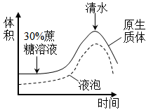
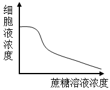
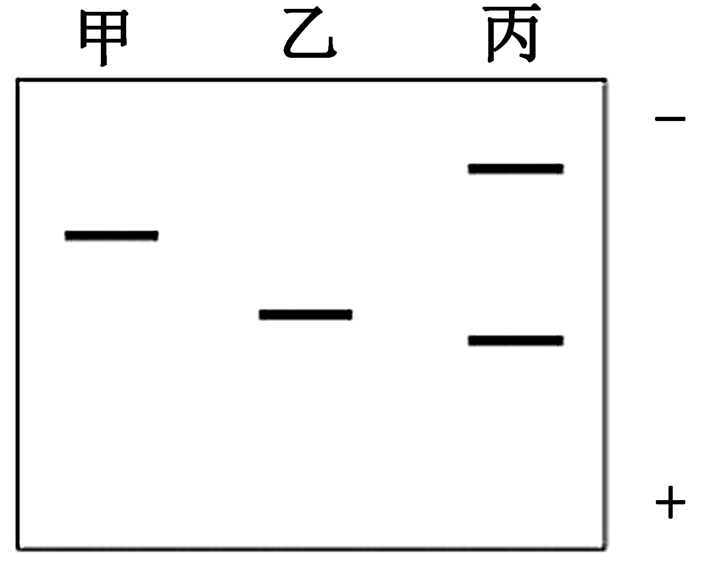

**2023年普通高等学校招生全国统一考试·全国甲卷**

**理科综合（生物部分）**

**一、选择题**

1\. 物质输入和输出细胞都需要经过细胞膜。下列有关人体内物质跨膜运输的叙述，正确的是（ ）

A. 乙醇是有机物，不能通过自由扩散方式跨膜进入细胞

B. 血浆中的K+进入红细胞时需要载体蛋白并消耗ATP

C. 抗体在浆细胞内合成时消耗能量，其分泌过程不耗能

D 葡萄糖可通过主动运输但不能通过协助扩散进入细胞

【答案】B

【解析】

【分析】自由扩散：物质通过简单的扩散进出细胞的方式，如氧气、二氧化碳、脂溶性小分子。

主动运输：逆浓度梯度的运输。消耗能量，需要有载体蛋白。

【详解】A、乙醇是有机物，与细胞膜中磷脂相似相溶，可以通过扩散方式进入细胞，A错误；

B、血浆中K+量低，红细胞内K+含量高，逆浓度梯度为主动运输，需要消耗ATP并需要载体蛋白，B正确；

C、抗体为分泌蛋白，分泌过程为胞吐，需要消耗能量，C错误；

D、葡萄糖进入小肠上皮细胞等为主动运输，进入哺乳动物成熟的红细胞为协助扩散，D错误。

故选B。

2\. 植物激素是一类由植物体产生的，对植物的生长发育有显著影响的微量有机物，下列关于植物激素的叙述，错误的是（ ）

A. 在植物幼嫩的芽中色氨酸可以转变成生长素

B. 生长素可以从产生部位运输到其他部位发挥作用

C. 生长素和乙烯可通过相互作用共同调节植物的生长发育

D. 植物体内生长素可以作为催化剂直接参与细胞代谢过程

【答案】D

【解析】

【分析】植物激素是植物产生的由产生部位运输到作用部位的微量有机物。

【详解】A、生长素的产生位置主要是植物幼嫩的芽、叶和发育中的种子；色氨酸是合成生长素的原料，A正确；

B、植物激素都是由产生部位运输到作用部位的，B正确；

C、植物激素之间相互协调，互相配合共同影响植物生命活动，调节植物生长发育，C正确；

D、生长素是信号分子，不是催化剂，催化剂是酶的作用，D错误。

故选D。

3\. 中枢神经系统对维持人体内环境的稳态具有重要作用。下列关于人体中枢的叙述，错误的是（ ）

A. 大脑皮层是调节机体活动的最高级中枢

B. 中枢神经系统的脑和脊髓中含有大量的神经元

C. 位于脊髓的低级中枢通常受脑中相应的高级中枢调控

D 人体脊髓完整而脑部受到损伤时，不能完成膝跳反射

【答案】D

【解析】

【分析】各级中枢的分布与功能：①大脑：大脑皮层是调节机体活动的最高级中枢，是高级神经活动的结构基础。其上有语言、听觉、视觉、运动等高级中枢。②小脑：有维持身体平衡的中枢。③脑干：有许多重要的生命活动中枢，如心血管中枢、呼吸中枢等。④下丘脑：有体温调节中枢、渗透压感受器（水平衡中枢）、血糖平衡调节中枢，是调节内分泌活动的总枢纽。⑤脊髓：调节躯体运动的低级中枢。

【详解】A、调节机体的最高级中枢是大脑皮层，可调控相应的低级中枢，A正确；

B、脊椎动物和人的中枢神经系统，包括位于颅腔中的脑和脊柱椎管内的脊髓，它们含有大量的神经元这些神经元组合成许多不同的神经中枢，分别负责调控某一特定的生理功能，B正确；

C、脑中的高级中枢可调控位于脊髓的低级中枢，C正确；

D、膝跳反射低级神经中枢位于脊髓，故脊髓完整时即可完成膝跳反射，D错误。

故选D。

4\. 探究植物细胞的吸水和失水实验是高中学生常做的实验。某同学用紫色洋葱鳞片叶外表皮为材料进行实验，探究蔗糖溶液，清水处理外表皮后，外表皮细胞原生质体和液泡的体积及细胞液浓度的变化。图中所提到的原生质体是指植物细胞不包括细胞壁的部分。下列示意图中能够正确表示实验结果的是（ ）

A.  B. 

C.  D. 

【答案】C

【解析】

【分析】1、质壁分离与复原的原理：成熟的植物细胞构成渗透系统，可发生渗透作用。

2、质壁分离的原因分析：外因：外界溶液浓度\>细胞液浓度；内因：原生质层相当于一层半透膜，细胞壁的伸缩性小于原生质层。

【详解】AB、用30%蔗糖处理之后，细胞失水，原生质体和细胞液的体积都会减小，细胞液浓度上升；用清水处理之后，细胞吸水，原生质体和细胞液体积会扩大，细胞液浓度下降，AB错误。

CD、随着所用蔗糖浓度上升，当蔗糖浓度超过细胞液浓度之后，细胞就会开始失水，原生质体和细胞液体积下降，细胞液浓度上升，故C正确，D错误。

故选C。

【点睛】外界溶液浓度高，细胞失水，细胞体积减小，细胞液浓度增大。

5\. 在生态系统中，生产者所固定的能量可以沿着食物链传递，食物链中的每个环节即为一个营养级。下列关于营养级的叙述，错误的是（ ）

A. 同种动物在不同食物链中可能属于不同营养级

B. 作为生产者的绿色植物所固定的能量来源于太阳

C. 作为次级消费者的肉食性动物属于食物链的第二营养级

D. 能量从食物链第一营养级向第二营养级只能单向流动

【答案】C

【解析】

【分析】生态系统的能量流动是单向的、逐级递减的，沿着食物链和食物网流动；生产者为第一营养级，初级消费者为第二营养级，次级消费者为第三营养级。

【详解】A、杂食动物既会捕食植物，又会捕食动物，如果捕食植物，就是第二营养级，捕食动物，就是第三营养级或更高营养级，所以不同食物链中的动物会处于不同的营养级，A正确；

B、绿色植物进行的是光合作用，能量来源于太阳，B正确；

C、次级消费者是第三营养级，初级消费者是第二营养级，第一营养级是生产者，C错误；

D、因为第一营养级是植物，第二营养级是动物，食物链是单向的，能量流动也就是单间的，D正确。

故选C。

6\. 水稻的某病害是由某种真菌（有多个不同菌株）感染引起的。水稻中与该病害抗性有关的基因有3个（A1、A2、a）；基因A1控制全抗性状（抗所有菌株），基因A2控制抗性性状（抗部分菌株），基因a控制易感性状（不抗任何菌株），且A1对A2为显性，A1对a为显性、A2对a为显性。现将不同表现型的水稻植株进行杂交，子代可能会出现不同的表现型及其分离比。下列叙述错误的是（ ）

A. 全抗植株与抗性植株杂交，子代可能出现全抗：抗性=3：1

B. 抗性植株与易感植株杂交，子代可能出现抗性：易感=1：1

C. 全抗植株与易感植株杂交，子代可能出现全抗：抗性=1：1

D. 全抗植株与抗性植株杂交，子代可能出现全抗：抗性：易感=2：1：1

【答案】A

【解析】

【分析】基因分离定律实质:在杂合子细胞中，位于一对同源染色体上的等位基因，具有一定的独立性;当细胞进行减数分裂，等位基因会随着同源染色体的分开而分离，分别进入两个配子当中，独立地随配子遗传给后代。据题干分析可知，全抗植株是A1A1，A1A2，A1a，抗性植株A2A2或者A2a，易感植株是aa。

【详解】AD、全抗植株与抗性植株，有六种交配情况：A1A1与A2A2或者A2a交配，后代全是全抗植株；A1A2与A2A2或者A2a交配，后代全抗：抗性=1：1；A1a与A2A2交配，后代全抗：抗性=1：1；A1a与A2a交配，后代全抗：抗性：易感=2：1：1。A错误，D正确；

B、抗性植株A2A2或者A2a与易感植株aa交配，后代全为抗性，或者为抗性：易感=1：1，B正确

C、全抗与易感植株交，若如果是A1A1与aa，后代全为全抗，若是A1A2与a，后代为全抗：抗性=1：1，若是A1a与aa，后代为全抗:易感=1：1，C正确。

故选A。

**二、非选择题：**

7\. 某同学将从菠菜叶中分离到的叶绿体悬浮于缓冲液中，给该叶绿体悬浮液照光后糖产生。回答下列问题。

（1）叶片是分离制备叶绿体的常用材料，若要将叶肉细胞中的叶绿体与线粒体等其他细胞器分离，可以采用的方法是\_\_\_\_\_（答出1种即可）。叶绿体中光合色素分布\_\_\_\_\_上，其中类胡萝卜素主要吸收\_\_\_\_\_（填“蓝紫光”“红光”或“绿光”）。

（2）将叶绿体的内膜和外膜破坏后，加入缓冲液形成悬浮液，发现黑暗条件下悬浮液中不能产生糖，原因是\_\_\_\_\_。

（3）叶片进行光合作用时，叶绿体中会产生淀粉。请设计实验证明叶绿体中有淀粉存在，简要写出实验思路和预期结果。\_\_\_\_\_

【答案】（1） ①. 差速离心 ②. 类囊体（薄）膜 ③. 蓝紫光

（2）悬液中具有类囊体膜以及叶绿体基质暗反应相关的酶，但黑暗条件下，光反应无法进行，暗反应没有光反应提供的原料ATP和NADPH，所以无法形成糖类。

（3）思路：将生长状况良好且相同的植物叶片分为甲乙两组，甲组放置在有光条件下，乙组放置在其他环境相同的黑暗状态下，一段时间后，用差速离心法提取出甲乙两组的叶绿体，制作成匀浆，分别加入碘液后观察。结果：甲组匀浆出现蓝色，有淀粉产生；乙组无蓝色出现，无淀粉产生。

【解析】

【分析】叶绿体中的光合色素分布在类囊体膜上，光合色素叶绿素主要吸收红光和蓝紫光，类胡萝卜素主要吸收红光。

【小问1详解】

植物细胞器的分离方法可用差速离心法，叶绿体中的光合色素分布在类囊体膜上，光合色素叶绿素主要吸收红光和蓝紫光，类胡萝卜素主要吸收红光。

【小问2详解】

光合作用光反应和暗反应同时进行，黑暗条件下无光，光反应不能进行，无法为暗反应提供原料ATP和NADPH，暗反应无法进行，产物不能生成。

小问3详解】

要验证叶绿体中有光合作用产物淀粉，需要将叶绿体提取出来并检测其中淀粉。因此将生长状况良好且相同的植物叶片分为甲乙两组，甲组放置在有光条件下，乙组放置在其他环境相同的黑暗状态下，一段时间后，用差速离心法提取出甲乙两组的叶绿体，制作成匀浆，分别加入碘液后观察。

预期的结果：甲组匀浆出现蓝色，有淀粉产生；乙组无蓝色出现，无淀粉产生。

8\. 某研究小组以某种哺乳动物（动物甲）为对象研究水盐平衡调节，发现动物达到一定程度时，尿量明显减少并出现主动饮水行为；而大量饮用清水后，尿量增加。回答下列问题。

（1）哺乳动物水盐平衡的调节中枢位于\_\_\_\_\_。

（2）动物甲大量失水后，其单位体积细胞外液中溶质微粒的数目会\_\_\_\_\_，信息被机体内的某种感受器感受后，动物甲便会产生一种感觉即\_\_\_\_\_，进而主动饮水。

（3）请从水盐平衡调节的角度分析，动物甲大量饮水后尿量增加的原因是\_\_\_\_\_。

【答案】（1）下丘脑 （2） ①. 升高 ②. 渴觉

（3）动物甲大量饮水→细胞外液渗透压降低→下丘脑渗透压感受器兴奋→传入神经→下丘脑水平衡调节中枢兴奋→传出神经→肾脏→肾脏水分重吸收减少→尿量增加

【解析】

【分析】1、水盐平衡的调节∶体内水少或吃的食物过咸时→细胞外液渗透压升高→下丘脑感受器受到刺激→垂体释放抗利尿激素多一肾小管、集合管重吸收增加→尿量减少，同时大脑皮层产生渴觉（主动饮水）﹔大量饮水→体内水多→细胞外液渗透压降低→下丘脑感受器受到刺激→垂体释放抗利尿激素少→肾小管、集合管重吸收减少→尿量增加。

2、下丘脑分泌的促甲状腺激素释放激素能促进垂体分泌促甲状腺激素，垂体分泌促甲状腺激素能促进甲状腺分泌甲状腺激素。当血液中甲状腺激素的含量降低时，对下丘脑和垂体的抑制作用减弱，使促甲状腺激素释放激素和促甲状腺激素的合成和分泌增加，从而使血液中甲状腺激素不致过少。

【小问1详解】

哺乳动物水盐平衡调节中枢位于下丘脑。

【小问2详解】

动物大量失水后，细胞外液中溶质微粒数量不变，水减少，单位体积内溶质微粒数会升高，渗透压上升，同时大脑皮层产生渴觉，进而主动饮水。

【小问3详解】

动物大量饮水，细胞外液渗透压下降，下丘脑渗透压感受器兴奋，传至下丘脑，下丘脑水平衡调节中枢兴奋，传出神经，传至肾脏，肾脏重吸收水分减少，尿量增加。

9\. 某旅游城市加强生态保护和环境治理后，城市环境发生了很大变化，水体鱼明显增多，甚至曾经消失的一些水鸟（如水鸟甲）又重新出现。回答下列问题。

（1）调查水鸟甲的种群密度通常使用标志重捕法，原因是\_\_\_\_\_。

（2）从生态系统组成成分的角度来看，水体中的鱼，水鸟属于\_\_\_\_\_。

（3）若要了解该城市某个季节水鸟甲种群的环境容纳量，请围绕除食物外的调查内容有\_\_\_\_\_（答出3点即可）。

【答案】（1）鸟类的运动能力比较强

（2）消费者 （3）环境条件、天敌和竞争者

【解析】

【分析】调查动物的种群密度常用的方法是标记重捕法，计算种群数量时利用公式计算若将该地段种群个体总数记作N，其中标记数为M，重捕个体数为n，重捕中标志个体数为m，假定总数中标记个体的比例与重捕取样中标志个体的比例相同，则N=Mn/m ,

【小问1详解】

水鸟甲的运动能力较强，活动范围较大，通常运用标志重捕法调查其种群密度。

【小问2详解】

生态系统组成成分包括非生物部分的物质和能量、生产者、消费者、分解者，鱼和水鸟均直接或间接以绿色植物为食，属于消费者。

【小问3详解】

环境容纳量是指一定的环境条件所能维持的种群最大数量，该数量的大小由环境条件决定，影响环境容纳量的因素包括食物、天敌、竞争者和环境条件等。

10\. 乙烯是植物果实成熟所需的激素，阻断乙烯的合成可使果实不能正常成熟，这一特点可以用于解决果实不耐储存的问题，以达到增加经济效益的目的。现有某种植物的3个纯合子（甲、乙、丙），其中甲和乙表现为果实不能正常成熟（不成熟），丙表现为果实能正常成熟（成熟），用这3个纯合子进行杂交实验，F1自交得F2，结果见下表。

| 实验 | 杂交组合 | F1表现型 | F2表现型及分离比 |
|:-----|:---------|:--------------------|:----------------------------|
| ①    | 甲×丙    | 不成熟              | 不成熟：成熟=3：1           |
| ②    | 乙×丙    | 成熟                | 成熟：不成熟=3：1           |
| ③    | 甲×乙    | 不成熟              | 不成熟：成熟=13：3          |

回答下列问题。

（1）利用物理、化学等因素处理生物，可以使生物发生基因突变，从而获得新的品种。通常，基因突变是指\_\_\_\_\_。

（2）从实验①和②的结果可知，甲和乙的基因型不同，判断的依据是\_\_\_\_\_。

（3）已知丙的基因型为aaBB，且B基因控制合成的酶能够催化乙烯的合成，则甲、乙的基因型分别是\_\_\_\_\_；实验③中，F2成熟个体的基因型是\_\_\_\_\_，F2不成熟个体中纯合子所占的比例为\_\_\_\_\_。

【答案】（1）DNA分子上发生碱基的增添、替换、缺失导致的基因结构发生改变的过程

（2）实验①和实验②的F1性状不同，F2的性状分离比不相同

（3） ①. AABB、aabb ②. aaBB和aaBb ③. 3/13

【解析】

【分析】分离定律的实质是杂合体内等位基因在减数分裂生成配子时随同源染色体的分开而分离，进入两个不同的配子，独立的随配子遗传给后代。

组合定律的实质是：位于非同源染色体上的非等位基因的分离或自由组合是互不干扰的；在减数分裂过程中，同源染色体上的等位基因彼此分离的同时，非同源染色体上的非等位基因自由组合。

【小问1详解】

基因突变是指DNA分子上发生碱基的增添、替换、缺失导致的基因结构发生改变的过程。

【小问2详解】

甲与丙杂交的F1为不成熟，子二代不成熟：成熟=3：1，所以甲的不成熟相对于成熟为显性，乙与丙杂交的F1为成熟，子二代成熟：不成熟=3：1，所以乙的不成熟相对于成熟为隐性。即实验①和实验②的F1性状不同，F2的性状分离比不相同，故甲和乙的基因型不同。

【小问3详解】

由于甲的不成熟为显性，且丙为aaBB，所以甲是AABB；乙的不成熟为隐性，所以乙为aabb；则实验③的F1为AaBb， F2中成熟个体为aaB\_，包括aaBB和aaBb，不成熟个体占1-（1/4）×（3/4）=13/16；而纯合子为AABB，AAbb，aabb，占3/16，所以不成熟中的纯合子占3/13。

11\. 为了研究蛋白质的结构与功能，常需要从生物材料中分离纯化蛋白质。某同学用凝胶色谱法从某种生物材料中分离纯化得到了甲、乙、丙3种蛋白质，并对纯化得到的3种蛋白质进行SDS-聚丙烯酰胺凝胶电泳，结果如图所示（“+”“-”分别代表电泳槽的阳极和阴极）。已知甲的相对分子质量是乙的2倍，且甲、乙均由一条肽链组成。回答下列问题。

（1）图中甲、乙、丙在进行SDS聚丙烯酰胺凝胶电泳时，迁移的方向是\_\_\_\_\_（填“从上向下”或“从下向上”）。

（2）图中丙在凝胶电泳时出现2个条带，其原因是\_\_\_\_\_。

（3）凝胶色谱法可以根据蛋白质\_\_\_\_\_的差异来分离蛋白质。据图判断，甲、乙、丙3种蛋白质中最先从凝胶色谱柱中洗脱出来的蛋白质是\_\_\_\_\_，最后从凝胶色谱柱中洗脱出来的蛋白质是\_\_\_\_\_。

（4）假设甲、乙、丙为3种酶，为了减少保存过程中酶活性的损失，应在\_\_\_\_\_（答出1点即可）条件下保存。

【答案】（1）从上向下

（2）丙由两条肽链组成

（3） ①. 相对分子质量 ②. 丙 ③. 乙

（4）低温

【解析】

【分析】1.样品纯化的目的是通过凝胶色谱法将相对分子质量大的蛋白质除去；凝胶色谱法是根据相对分子质量大小分离蛋白质的有效方法，相对分子质量较小的蛋白质容易进入凝胶内部的通道，路程长，移动的速度慢；相对分子质量较大的蛋白质不容易进入凝胶内部的通道，路程短，移动的速度快。

2.电泳是指带电粒子在电场的作用下发生迁移的过程。许多重要的生物大分子，如多肽、核酸等都具有可解离的基团，在一定的pH下，这些基团会带上正电或负电。在电场的作用下，这些带电分子会向着与其所带电荷相反的电极移动。电泳利用了待分离样品中各种分子带电性质的差异以及分子本身的大小、形状的不同，使带电分子产生不同的迁移速度，从而实现样品中各种分子的分离。

【小问1详解】

电泳利用了待分离样品中各种分子带电性质的差异以及分子本身的大小、形状的不同，使带电分子产生不同的迁移速度，从而实现样品中各种分子的分离。电泳时，分子质量越大，迁移距离越小，根据题中给出甲蛋白质的分子质量是乙的2倍，故甲的迁移距离相对乙较小，可判断出迁移方向是从上到下。

【小问2详解】

题中给出甲、乙均由一条肽链构成，图示凝胶电泳时甲、乙分别出现1个条带，故丙出现2个条带，说明丙是由2条肽链构成。

【小问3详解】

凝胶色谱法主要根据蛋白质的相对分子质量差异来分离蛋白质，相对分子质量大的蛋白质只能进入孔径较大的凝胶孔隙内，故移动距离较短，会先被洗脱出来，分子质量较小的蛋白质进入较多的凝胶颗粒内，移动距离较长，会后被洗脱出来。据图判断，丙的分子质量最大，最先被洗脱出来，乙的分子质量最小，最后被洗脱出来。

【小问4详解】

为了减少保存过程中酶活性的损失，应在酶的保存在低温条件下进行。

12\. 接种疫苗是预防传染病的一项重要措施，乙肝疫苗的使用可有效阻止乙肝病诗的传播，降低乙型肝炎发病率。乙肝病毒是一种DNA病毒。重组乙肝疫苗的主要成分是利用基因工程技术获得的乙肝病诗表面抗原（一种病毒蛋白）。回答下列问题。

（1）接种上述重组乙肝疫苗不会在人体中产生乙肝病毒，原因是\_\_\_\_\_。

（2）制备重组乙肝疫苗时，需要利用重组表达载体将乙肝病毒表面抗原基因（目的基因）导入酵母细胞中表达。重组表达载体中通常含有抗生素抗性基因，抗生素抗性基因的作用是\_\_\_\_\_。能识别载体中的启动子并驱动目的基因转录的酶是\_\_\_\_\_。

（3）目的基因导入酵母细胞后，若要检测目的基因是否插入染色体中，需要从酵母细胞中提取\_\_\_\_\_进行DNA分子杂交，DNA分子杂交时应使用的探针是\_\_\_\_\_。

（4）若要通过实验检测目基因在酵母细胞中是否表达出目的蛋白，请简要写出实验思路。\_\_\_\_\_

【答案】（1）重组乙肝疫苗成分为蛋白质，无法独立在宿主体内增殖

（2） ①. 筛选 ②. RNA聚合酶

（3） ①. 核染色体DNA ②. 被标记的目的基因的单链DNA片段

（4）①通过使用基因探针，利用分子杂交技术，检测目的基因是否转插入酵母细胞染色体

②通过使用基因探针，利用核酸分子杂交技术，检测目的基因是否转录形成mRNA

③通过使用相应抗体，利用抗原-抗体杂交技术，检测mRNA是否翻译形成蛋白质

【解析】

【分析】基因工程的操作步骤：（1）目的基因的获取；方法有从基因文库中获取、利用PCR技术扩增和人工合成；（2）基因表达载体的构建：是基因工程的核心步骤。基因表达载体包括目的基因、启动子、终止子和标记基因等；（3）将目的基因导入受体细胞；根据受体细胞不同，导入的方法也不一样，将目的基因导入植物细胞的方法有农杆菌转化法、基因枪法和花粉管通道法；将目的基因导入动物细胞最有效的方法是显微注射法；将目的基因导入微生物细胞的方法是感受态细胞法；（4）目的基因的检测与鉴定：分子水平上的检测：①检测转基因生物染色体的DNA是否插入目的基因-DNA分子杂交技术②检测目的基因是否转录出了mRNA-分子杂交技术；③检测目的基因是否翻译成蛋白质：抗原-抗体杂交技术；个体水平上的鉴定：抗虫鉴定、抗病鉴定、活性鉴定等。

【小问1详解】

重组乙肝疫苗的成分是乙肝病毒表面的一种病毒蛋白。蛋白质注入人体后，无法完成病毒遗传物质的复制与蛋白质的合成，无法独立增殖。

【小问2详解】

抗生素抗性基因作为标记基因，用于转化细胞的筛选。

RNA聚合酶结合目的基因启动子并驱动转录。

【小问3详解】

检测的对象是目的基因是否插入染色体中，故提取酵母细胞染色体进行目的基因鉴定。

基因探针是一段带有检测标记，且顺序已知的，与目的基因互补的核酸序列。

【小问4详解】

要检测出目的基因是否表达，除了需要检测目的基因是否插入染色体外，还需要检查目的基因是否转录与表达。检测是否转录，用核酸分子杂交技术，检测是否翻译用抗原-抗体杂交技术。
