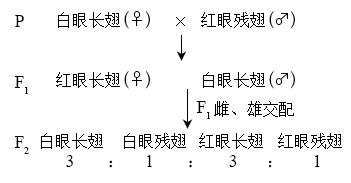
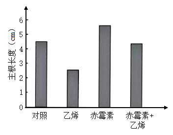
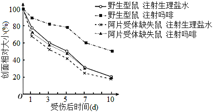
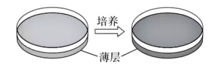
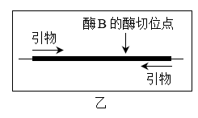
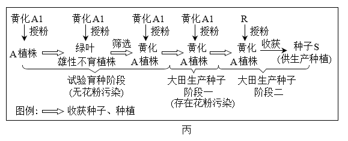

**2023年普通高中学业水平等级性考试（北京卷）**

**生物**

**一、本部分共15题，在每题列出的四个选项中，选出最符合题目要求的一项。**

1\. PET-CT是一种使用示踪剂的影像学检查方法。所用示踪剂由细胞能量代谢的主要能源物质改造而来，进入细胞后不易被代谢，可以反映细胞摄取能源物质的量。由此可知，这种示踪剂是一种改造过的（　　）

A. 维生素 B. 葡萄糖 C. 氨基酸 D. 核苷酸

2\. 运动强度越低，骨骼肌耗氧量越少。如图显示在不同强度体育运动时，骨骼肌消耗的糖类和脂类的相对量。对这一结果正确的理解是（　　）

A. 低强度运动时，主要利用脂肪酸供能

B. 中等强度运动时，主要供能物质是血糖

C. 高强度运动时，糖类中的能量全部转变为ATP

D. 肌糖原在有氧条件下才能氧化分解提供能量

3\. 在两种光照强度下，不同温度对某植物CO2吸收速率的影响如图。对此图理解错误的是（　　）

A. 在低光强下，CO2吸收速率随叶温升高而下降的原因是呼吸速率上升

B. 在高光强下，M点左侧CO2吸收速率升高与光合酶活性增强相关

C. 在图中两个CP点处，植物均不能进行光合作用

D. 图中M点处光合速率与呼吸速率的差值最大

4\. 纯合亲本白眼长翅和红眼残翅果蝇进行杂交，结果如图。F2中每种表型都有雌、雄个体。根据杂交结果，下列推测错误的是（　　）

A. 控制两对相对性状的基因都位于X染色体上

B. F1雌果蝇只有一种基因型

C. F2白眼残翅果蝇间交配，子代表型不变

D. 上述杂交结果符合自由组合定律

5\. 武昌鱼（2n=48）与长江白鱼（2n=48）经人工杂交可得到具有生殖能力的子代。显微观察子代精巢中的细胞，一般不能观察到的是（　　）

A. 含有24条染色体细胞 B. 染色体两两配对的细胞

C. 染色体移到两极的细胞 D. 含有48个四分体的细胞

6\. 抗虫作物对害虫生存产生压力，会使害虫种群抗性基因频率迅速提高，导致作物的抗虫效果逐渐减弱。为使转基因抗虫棉保持抗虫效果，农业生产上会采取一系列措施。以下措施不能实现上述目标（　　）

A. 在转基因抗虫棉种子中混入少量常规种子

B. 大面积种植转基因抗虫棉，并施用杀虫剂

C. 转基因抗虫棉与小面积常规棉间隔种植

D. 转基因抗虫棉大田周围设置常规棉隔离带

7\. 人通过学习获得各种条件反射，这有效提高了对复杂环境变化的适应能力。下列属于条件反射的是（　　）

A. 食物进入口腔引起胃液分泌 B. 司机看见红色交通信号灯踩刹车

C. 打篮球时运动员大汗淋漓 D. 新生儿吸吮放入口中的奶嘴

8\. 水稻种子萌发后不久，主根生长速率开始下降直至停止。此过程中乙烯含量逐渐升高，赤霉素含量逐渐下降。外源乙烯和赤霉素对主根生长的影响如图。以下关于乙烯和赤霉素作用的叙述，不正确的是（　　）

A. 乙烯抑制主根生长

B. 赤霉素促进主根生长

C. 赤霉素和乙烯可能通过不同途径调节主根生长

D. 乙烯增强赤霉素对主根生长的促进作用

9\. 甲状腺激素的分泌受下丘脑-垂体-甲状腺轴的调节，促甲状腺激素能刺激甲状腺增生。如果食物中长期缺乏合成甲状腺激素的原料碘，会导致（　　）

A. 甲状腺激素合成增加，促甲状腺激素分泌降低

B. 甲状腺激素合成降低，甲状腺肿大

C. 促甲状腺激素分泌降低，甲状腺肿大

D. 促甲状腺激素释放激素分泌降低，甲状腺肿大

10\. 有些人吸入花粉等过敏原会引发过敏性鼻炎，以下对过敏的正确理解是（　　）

A. 过敏是对“非己”物质的正常反应 B. 初次接触过敏原就会出现过敏症状

C. 过敏存在明显的个体差异和遗传倾向 D. 抗体与过敏原结合后吸附于肥大细胞

11\. 近期开始对京西地区多个停采煤矿的采矿废渣山进行生态修复。为尽快恢复生态系统的功能，从演替的角度分析，以下对废渣山治理建议中最合理的是（　　）

A. 放养多种禽畜 B. 引入热带速生植物

C. 取周边地表土覆盖 D. 修筑混凝土护坡

12\. 甲状旁腺激素（PTH）水平是人类多种疾病的重要诊断指标。研究者制备单克隆抗体用于快速检测PTH，有关制备过程的叙述不正确的是（　　）

A. 需要使用动物细胞培养技术

B. 需要制备用PTH免疫的小鼠

C. 利用抗原-抗体结合的原理筛选杂交瘤细胞

D. 筛选能分泌多种抗体的单个杂交瘤细胞

13\. 高中生物学实验中，下列实验操作能达成所述目标的是（　　）

A. 用高浓度蔗糖溶液处理成熟植物细胞观察质壁分离

B. 向泡菜坛盖边沿的水槽中注满水形成内部无菌环境

C. 在目标个体集中分布的区域划定样方调查种群密度

D. 对外植体进行消毒以杜绝接种过程中的微生物污染

14\. 研究者检测了长期注射吗啡的小鼠和注射生理盐水的小鼠伤口愈合情况，结果如图。由图可以得出的结论是（　　）

A. 吗啡减缓伤口愈合 B. 阿片受体促进伤口愈合

C. 生理条件下体内也有吗啡产生 D. 阿片受体与吗啡成瘾有关

15\. 有关预防和治疗病毒性疾病的表述，正确的是（　　）

A. 75%的乙醇能破坏病毒结构，故饮酒可预防感染

B. 疫苗接种后可立即实现有效保护，无需其他防护

C. 大多数病毒耐冷不耐热，故洗热水澡可预防病毒感染

D. 吸烟不能预防病毒感染，也不能用于治疗病毒性疾病

**二、非选择题，本部分共6题。**

16\. 自然界中不同微生物之间存在着复杂的相互作用。有些细菌具有溶菌特性，能够破坏其他细菌的结构使细胞内容物释出。科学家试图从某湖泊水样中分离出有溶菌特性的细菌。

（1）用于分离细菌的固体培养基包含水、葡萄糖、蛋白胨和琼脂等成分，其中蛋白胨主要为细菌提供\_\_\_\_\_\_\_\_\_\_\_和维生素等。

（2）A菌通常被用做溶菌对象。研究者将含有一定浓度A菌的少量培养基倾倒在固体培养平板上，凝固形成薄层。培养一段时间后，薄层变浑浊（如图），表明\_\_\_\_\_\_\_\_\_\_\_\_\_\_\_\_\_\_\_\_\_\_。

（3）为分离出具有溶菌作用的细菌，需要合适的菌落密度，因此应将含菌量较高的湖泊水样\_\_\_\_\_\_\_\_\_\_\_后，依次分别涂布于不同的浑浊薄层上。培养一段时间后，能溶解A菌的菌落周围会出现\_\_\_\_\_\_\_\_\_\_\_。采用这种方法，研究者分离、培养并鉴定出P菌。

（4）为探究P菌溶解破坏A菌的方式，请提出一个假设，该假设能用以下材料和设备加以验证（主要实验材料和设备：P菌、A菌、培养基、圆形滤纸小片、离心机和细菌培养箱）\_\_\_\_\_\_\_\_\_\_\_。

17\. 细胞膜的选择透过性与细胞膜的静息电位密切相关。科学家以哺乳动物骨骼肌细胞为材料，研究了静息电位形成的机制。

（1）骨骼肌细胞膜主要成分是\_\_\_\_\_\_\_\_\_\_\_，膜的基本支架是\_\_\_\_\_\_\_\_\_\_\_。

（2）假设初始状态下，膜两侧正负电荷均相等，且膜内K+浓度高于膜外。在静息电位形成过程中，当膜仅对K+具有通透性时，K+顺浓度梯度向膜外流动，膜外正电荷和膜内负电荷数量逐步增加，对K+进一步外流起阻碍作用，最终K+跨膜流动达到平衡，形成稳定的跨膜静电场，此时膜两侧的电位表现是\_\_\_\_\_\_\_\_\_\_\_。K+静电场强度只能通过公式“K+静电场强度（mV）”计算得出。

（3）骨骼肌细胞处于静息状态时，实验测得膜的静息电位为-90mV，膜内、外K+浓度依次为155mmoL/L和4mmoL/L（），此时没有K+跨膜净流动。

①静息状态下，K+静电场强度为\_\_\_\_\_\_\_\_\_\_\_mV，与静息电位实测值接近，推测K+外流形成的静电场可能是构成静息电位的主要因素。

②为证明①中的推测，研究者梯度增加细胞外K+浓度并测量静息电位。如果所测静息电位的值\_\_\_\_\_\_\_\_\_\_\_，则可验证此假设。

18\. 为了研究城市人工光照对节肢动物群落的影响，研究者在城市森林边缘进行了延长光照时间的实验（此实验中人工光源对植物的影响可以忽略；实验期间，天气等环境因素基本稳定）。实验持续15天：1～5天，无人工光照；6～10天，每日黄昏后和次日太阳升起前人为增加光照时间；11～15天，无人工光照。在此期间，每日黄昏前特定时间段，通过多个调查点的装置捕获节肢动物，按食性将其归入三种生态功能团，即植食动物（如蛾类幼虫）、肉食动物（如蜘蛛）和腐食动物（如蚂蚁），结果如图。

（1）动物捕获量直接反映动物的活跃程度。本研究说明人为增加光照时间会影响节肢动物的活跃程度，依据是：与1～5、11～15天相比，\_\_\_\_\_\_\_\_\_\_\_\_\_\_。

（2）光是生态系统中的非生物成分。在本研究中，人工光照最可能作为\_\_\_\_\_\_\_\_\_\_\_对节肢动物产生影响，从而在生态系统中发挥作用。

（3）增加人工光照会对生物群落结构产生多方面的影响，如：肉食动物在黄昏前活动加强，有限的食物资源导致\_\_\_\_\_\_\_\_\_\_\_加剧；群落空间结构在\_\_\_\_\_\_\_\_\_\_\_两个维度发生改变。

（4）有人认为本实验只需进行10天研究即可，没有必要收集11～15天的数据。相比于10天方案，15天方案除了增加对照组数量以降低随机因素影响外，另一个主要优点是\_\_\_\_\_\_\_\_\_\_\_\_\_\_\_\_。

（5）城市是人类构筑的大型聚集地，在进行城市小型绿地生态景观设计时应\_\_\_\_\_\_\_\_\_\_。

A. 不仅满足市民的审美需求，还需考虑对其他生物的影响

B. 设置严密围栏，防止动物进入和植物扩散

C. 以整体和平衡的观点进行设计，追求生态系统的可持续发展

D. 选择长时间景观照明光源时，以有利于植物生长作为唯一标准

19\. 二十大报告提出“种业振兴行动”。油菜是重要的油料作物，筛选具有优良性状的育种材料并探究相应遗传机制，对创制高产优质新品种意义重大。

（1）我国科学家用诱变剂处理野生型油菜（绿叶），获得了新生叶黄化突变体（黄化叶）。突变体与野生型杂交，结果如图甲，其中隐性性状是\_\_\_\_\_\_\_\_\_\_\_。

（2）科学家克隆出导致新生叶黄化的基因，与野生型相比，它在DNA序列上有一个碱基对改变，导致突变基因上出现了一个限制酶B的酶切位点（如图乙）。据此，检测F2基因型的实验步骤为：提取基因组DNA→PCR→回收扩增产物→\_\_\_\_\_\_\_\_\_\_\_→电泳。F2中杂合子电泳条带数目应为\_\_\_\_\_\_\_\_\_\_\_条。

（3）油菜雄性不育品系A作为母本与可育品系R杂交，获得杂交油菜种子S（杂合子），使杂交油菜的大规模种植成为可能。品系A1育性正常，其他性状与A相同，A与A1杂交，子一代仍为品系A，由此可大量繁殖A。在大量繁殖A的过程中，会因其他品系花粉的污染而导致A不纯，进而影响种子S的纯度，导致油菜籽减产。油菜新生叶黄化表型易辨识，且对产量没有显著影响。科学家设想利用新生叶黄化性状来提高种子S的纯度。育种过程中首先通过一系列操作，获得了新生叶黄化的A1，利用黄化A1生产种子S的育种流程见图丙。

①图丙中，A植株的绿叶雄性不育子代与黄化A1杂交，筛选出的黄化A植株占子一代总数的比例约为\_\_\_\_\_\_\_\_\_\_\_\_\_\_\_。

②为减少因花粉污染导致的种子S纯度下降，简单易行的田间操作用\_\_\_\_\_\_\_\_\_\_\_\_\_\_\_\_\_\_\_\_\_\_\_\_\_\_\_\_。

20\. 学习以下材料，回答下面问题。

调控植物细胞活性氧产生机制的新发现，能量代谢本质上是一系列氧化还原反应。在植物细胞中，线粒体和叶绿体是能量代谢的重要场所。叶绿体内氧化还原稳态的维持对叶绿体行使正常功能非常重要。在细胞的氧化还原反应过程中会有活性氧产生，活性氧可以调控细胞代谢，并与细胞凋亡有关。我国科学家发现一个拟南芥突变体m（M基因突变为m基因），在受到长时间连续光照时，植株会出现因细胞凋亡而引起的叶片黄斑等表型。M基因编码叶绿体中催化脂肪酸合成的M酶。与野生型相比，突变体m中M酶活性下降，脂肪酸含量显著降低。为探究M基因突变导致细胞凋亡的原因，研究人员以诱变剂处理突变体m，筛选不表现细胞凋亡，但仍保留m基因的突变株。通过对所获一系列突变体的详细解析，发现叶绿体中pMDH酶、线粒体中mMDH酶和线粒体内膜复合物I（催化有氧呼吸第三阶段的酶）等均参与细胞凋亡过程。由此揭示出一条活性氧产生的新途径（如图）：A酸作为叶绿体中氧化还原平衡的调节物质，从叶绿体经细胞质基质进入到线粒体中，在mMDH酶的作用下产生NADH（\[H\]）和B酸，NADH被氧化会产生活性氧。活性氧超过一定水平后引发细胞凋亡。

在上述研究中，科学家从拟南芥突变体m入手，揭示出在叶绿体和线粒体之间存在着一条A酸-B酸循环途径。对A酸-B酸循环的进一步研究，将为探索植物在不同环境胁迫下生长的调控机制提供新的思路。

（1）叶绿体通过\_\_\_\_\_\_\_\_\_\_\_作用将CO2转化为糖。从文中可知，叶绿体也可以合成脂肪的组分\_\_\_\_\_\_\_\_\_\_\_。

（2）结合文中图示分析，M基因突变为m后，植株在长时间光照条件下出现细胞凋亡的原因是：\_\_\_\_\_，A酸转运到线粒体，最终导致产生过量活性氧并诱发细胞凋亡。

（3）请将下列各项的序号排序，以呈现本文中科学家解析“M基因突变导致细胞凋亡机制”的研究思路：\_\_\_\_\_\_\_\_\_\_\_。

①确定相应蛋白的细胞定位和功能②用诱变剂处理突变体m③鉴定相关基因④筛选保留m基因但不表现凋亡的突变株

（4）本文拓展了高中教材中关于细胞器间协调配合的内容，请从细胞器间协作以维持稳态与平衡的角度加以概括说明\_\_\_\_\_\_\_\_\_\_\_。

21\. 变胖过程中，胰岛B细胞会增加。增加的B细胞可能源于自身分裂（途径I），也可能来自胰岛中干细胞的增殖、分化（途径Ⅱ）。科学家采用胸腺嘧啶类似物标记的方法，研究了L基因缺失导致肥胖的模型小鼠IK中新增B细胞的来源。

（1）EdU和BrdU都是胸腺嘧啶类似物，能很快进入细胞并掺入正在复制的DNA中，掺入DNA的EdU和BrdU均能与\_\_\_\_\_\_\_\_\_\_\_互补配对，并可以被分别检测。未掺入的EdU和BrdU短时间内即被降解。

（2）将处于细胞周期不同阶段的细胞混合培养于多孔培养板中，各孔同时加入EdU，随后每隔一定时间向一组培养孔加入BrdU，再培养十几分钟后收集该组孔内全部细胞，检测双标记细胞占EdU标记细胞的百分比（如图）。图中反映DNA复制所需时长的是从\_\_\_\_\_\_\_\_\_\_\_点到\_\_\_\_\_\_\_\_\_\_\_点。

（3）为研究变胖过程中B细胞的增殖，需使用一批同时变胖的小鼠。为此，本实验使用诱导型基因敲除小鼠，即饲喂诱导物后小鼠的L基因才会被敲除，形成小鼠IK。科学家利用以下实验材料制备小鼠IK：

①纯合小鼠Lx：小鼠L基因两侧已插入特异DNA序列（x），但L的功能正常；②Ce酶基因：源自噬菌体，其编码的酶进入细胞核后作用于x，导致两个x间的DNA片段丢失；③Er基因：编码的Er蛋白位于细胞质，与Er蛋白相连的物质的定位由Er蛋白决定；④口服药T：小分子化合物，可诱导Er蛋白进入细胞核。请完善制备小鼠IK的技术路线：\_\_\_\_\_\_\_\_\_\_\_\_\_\_\_\_\_\_\_\_\_\_→连接到表达载体→转入小鼠Lx→筛选目标小鼠→\_\_\_\_\_\_\_\_\_\_\_\_→获得小鼠IK。

（4）各种细胞DNA复制所需时间基本相同，但途径I的细胞周期时长（t1）是途径Ⅱ细胞周期时长（t2）的三倍以上。据此，科学家先用EdU饲喂小鼠IK，t2时间后换用BrdU饲喂，再过t2时间后检测B细胞被标记的情况。研究表明，变胖过程中增加的B细胞大多数来源于自身分裂，与之相应的检测结果应是\_\_\_\_\_\_\_\_\_\_\_\_\_\_\_\_\_\_\_\_\_\_\_\_\_。
