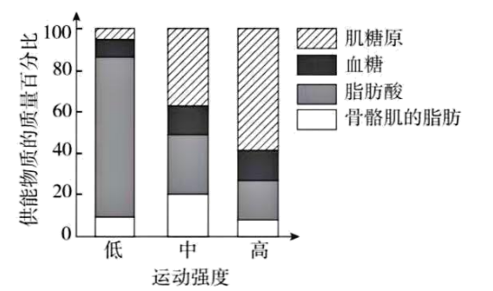
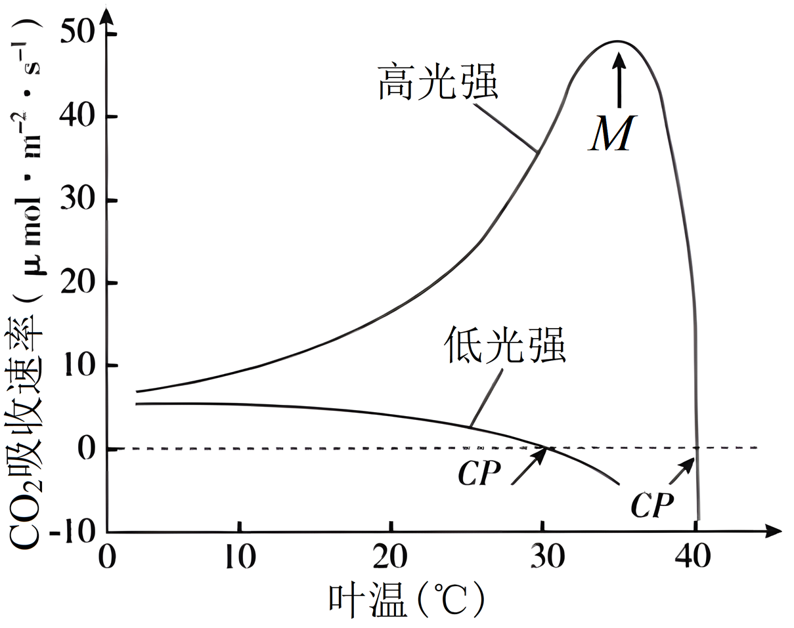
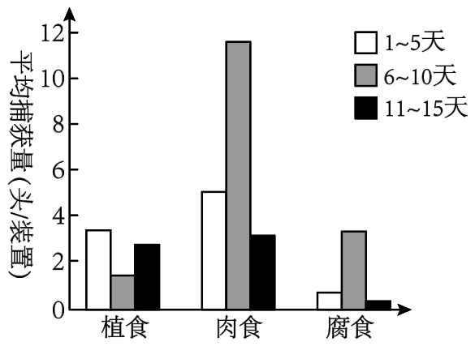
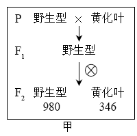
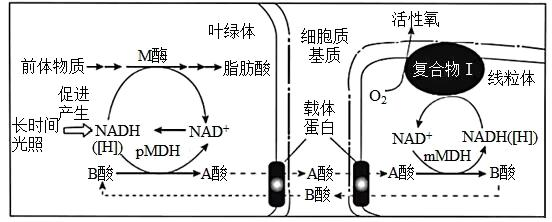
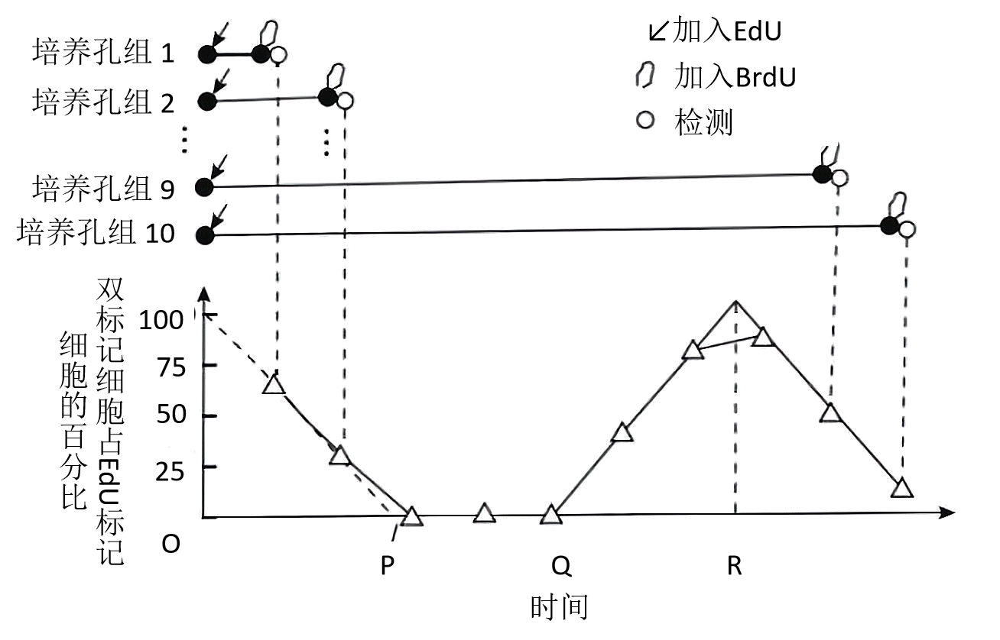

**2023年普通高中学业水平等级性考试（北京卷）**

**生物**

**一、本部分共15题，在每题列出的四个选项中，选出最符合题目要求的一项。**

1\. PET-CT是一种使用示踪剂的影像学检查方法。所用示踪剂由细胞能量代谢的主要能源物质改造而来，进入细胞后不易被代谢，可以反映细胞摄取能源物质的量。由此可知，这种示踪剂是一种改造过的（　　）

A. 维生素 B. 葡萄糖 C. 氨基酸 D. 核苷酸

【答案】B

【解析】

【分析】糖类一般由C、H、O三种元素组成，分为单糖、二糖和多糖，是主要的能源物质。常见的单糖有葡萄糖、果糖、半乳糖、核糖和脱氧核糖等。

【详解】分析题意可知，该示踪剂由细胞能量代谢的主要能源物质改造而来，应是糖类，且又知该物质进入细胞后不易被代谢，可以反映细胞摄取能源物质的量，则该物质应是被称为“生命的燃料”的葡萄糖。B符合题意。

故选B。

2\. 运动强度越低，骨骼肌的耗氧量越少。如图显示在不同强度体育运动时，骨骼肌消耗的糖类和脂类的相对量。对这一结果正确的理解是（　　）

A. 低强度运动时，主要利用脂肪酸供能

B. 中等强度运动时，主要供能物质是血糖

C. 高强度运动时，糖类中的能量全部转变为ATP

D. 肌糖原在有氧条件下才能氧化分解提供能量

【答案】A

【解析】

【分析】如图显示在不同强度体育运动时，骨骼肌消耗的糖类和脂类的相对量，当运动强度较低时，主要利用脂肪酸供能；当中等强度运动时，主要供能物质是肌糖原，其次是脂肪酸；当高强度运动时，主要利用肌糖原供能。

【详解】A、由图可知，当运动强度较低时，主要利用脂肪酸供能，A正确；

B、由图可知，中等强度运动时，主要供能物质是肌糖原，其次是脂肪酸，B错误；

C、高强度运动时，糖类中的能量大部分以热能的形式散失，少部分转变为ATP，C错误；

D、高强度运动时，机体同时进行有氧呼吸和无氧呼吸，肌糖原在有氧条件和无氧条件均能氧化分解提供能量，D错误。

故选A。

3\. 在两种光照强度下，不同温度对某植物CO2吸收速率的影响如图。对此图理解错误的是（　　）

A. 在低光强下，CO2吸收速率随叶温升高而下降的原因是呼吸速率上升

B. 在高光强下，M点左侧CO2吸收速率升高与光合酶活性增强相关

C. 在图中两个CP点处，植物均不能进行光合作用

D. 图中M点处光合速率与呼吸速率的差值最大

【答案】C

【解析】

【分析】本实验的自变量为光照强度和温度，因变量为CO2吸收速率。

【详解】A、CO2吸收速率代表净光合速率，低光强下，CO2吸收速率随叶温升高而下降的原因是呼吸速率上升，需要从外界吸收的CO2减少，A正确；

B、在高光强下，M点左侧CO2吸收速率升高主要原因是光合酶的活性增强，B正确；

C、CP点代表呼吸速率等于光合速率，植物可以进行光合作用，C错误；

D、图中M点处CO2吸收速率最大，即净光合速率最大，也就是光合速率与呼吸速率的差值最大，D正确。

故选C。

4\. 纯合亲本白眼长翅和红眼残翅果蝇进行杂交，结果如图。F2中每种表型都有雌、雄个体。根据杂交结果，下列推测错误的是（　　）

A. 控制两对相对性状的基因都位于X染色体上

B. F1雌果蝇只有一种基因型

C. F2白眼残翅果蝇间交配，子代表型不变

D. 上述杂交结果符合自由组合定律

【答案】A

【解析】

【分析】基因自由组合定律的实质是：位于非同源染色体上的非等位基因的分离或自由组合是互不干扰的；在减数分裂过程中，同源染色体上的等位基因彼此分离的同时，非同源染色体上的非等位基因自由组合。

【详解】A、白眼雌蝇与红眼雄果蝇杂交，产生的F1中白眼均为雄性，红眼均为雌性，说明性状表现与性别有关，则控制眼色的基因位于X染色体上，同时说明红眼对白眼为显性；另一对相对性状的果蝇杂交，无论雌雄均表现为长翅，说明长翅对产残翅为显性，F2中无论雌雄均表现为长翅∶残翅=3∶1，说明控制果蝇翅形的基因位于常染色体上，A错误；

B、若控制长翅和残翅的基因用A/a表示，控制眼色的基因用B/b表示，则亲本的基因型可表示为AAXbXb，aaXBY，二者杂交产生的F1中雌性个体的基因型为AaXBXb，B正确；

C、亲本的基因型可表示为AAXbXb，aaXBY，F1个体的基因型为AaXBXb、AaXbY，则F2白眼残翅果蝇的基因型为aaXbXb、aaXbY，这些雌雄果蝇交配的结果依然为残翅白眼，即子代表型不变，C正确；

D、 根据上述杂交结果可知，控制眼色的基因位于X染色体上，控制翅型的基因位于常染色体上，可见， 上述杂交结果符合自由组合定律，D正确。

故选A。

5\. 武昌鱼（2n=48）与长江白鱼（2n=48）经人工杂交可得到具有生殖能力的子代。显微观察子代精巢中的细胞，一般不能观察到的是（　　）

A. 含有24条染色体的细胞 B. 染色体两两配对的细胞

C. 染色体移到两极的细胞 D. 含有48个四分体的细胞

【答案】D

【解析】

【分析】1、基因突变是基因结构的改变，包括碱基对的增添、缺失或替换。基因突变发生的时间主要是细胞分裂的间期。基因突变的特点是低频性、普遍性、少利多害性、随机性、不定向性。

2、基因重组的方式有同源染色体上非姐妹单体之间的交叉互换和非同源染色体上非等位基因之间的自由组合，另外，外源基因的导入也会引起基因重组。

【详解】A、精原细胞通过减数分裂形成精子，则精子中含有24条染色体，A不符合题意；

B、精原细胞在减数第一次分裂前期将发生染色体两两配对，即联会，B不符合题意；

C、精原细胞在减数第一次分裂后期同源染色体分开并移向两极，在减数第二次分裂后期姐妹染色单体分开并移到两极，C不符合题意；

D、精原细胞在减数第一次分裂前期，能观察到含有24个四分体的细胞，D符合题意。

故选D。

6\. 抗虫作物对害虫的生存产生压力，会使害虫种群抗性基因频率迅速提高，导致作物的抗虫效果逐渐减弱。为使转基因抗虫棉保持抗虫效果，农业生产上会采取一系列措施。以下措施不能实现上述目标（　　）

A. 在转基因抗虫棉种子中混入少量常规种子

B. 大面积种植转基因抗虫棉，并施用杀虫剂

C. 转基因抗虫棉与小面积的常规棉间隔种植

D. 转基因抗虫棉大田周围设置常规棉隔离带

【答案】B

【解析】

【分析】现代生物进化理论的主要内容：种群是生物进化的基本单位；突变和基因重组产生生物进化的原材料；自然选择决定生物进化的方向；隔离是新物种形成的必要条件。达尔文认为生物变异在前，选择在后，适者生存，优胜劣汰。

【详解】A、在转基因抗虫棉种子中混入少量常规种子，非转基因作物的存在不会对害虫生存产生压力，A不符合题意；

B、大面积种植转基因作物并使用杀虫剂会导致害虫大量死亡，抗性基因频率会越来越高，因为能生存的大多数都具有抗性基因，B符合题意；

C、转基因抗虫棉与小面积的常规棉间隔种植也会减少转基因作物的数量，减少对害虫的杀伤力，C不符合题意；

D、转基因抗虫棉大田周围设置常规棉隔离带会使一部分害虫体内的非抗性基因保留下来，不至于抗性基因越来越高，D不符合题意。

故选B。

7\. 人通过学习获得各种条件反射，这有效提高了对复杂环境变化的适应能力。下列属于条件反射的是（　　）

A. 食物进入口腔引起胃液分泌 B. 司机看见红色交通信号灯踩刹车

C. 打篮球时运动员大汗淋漓 D. 新生儿吸吮放入口中的奶嘴

【答案】B

【解析】

【分析】反射一般可以分为两大类：非条件反射和条件反射。非条件反射是指人生来就有的先天性反射，是一种比较低级的神经活动，由大脑皮层以下的神经中枢（如脑干、脊髓）参与即可完成；条件反射是人出生以后在生活过程中逐渐形成的后天性反射，是在非条件反射的基础上，在大脑皮层参与下完成的，是高级神经活动的基本方式。

【详解】A、食物进入口腔引起胃液分泌是人类先天就有的反射，不需要经过大脑皮层，因此属于非条件反射，A错误；

B、司机看到红灯刹车这一反射是在实际生活中习得的，因此受到大脑皮层的控制，属于条件反射，B正确；

C、运动时大汗淋漓来增加散热，这是人类生来就有的反射，属于非条件反射，C错误；

D、新生儿吸吮放入口中的奶嘴是其与生俱来的行为，该反射弧不需要大脑皮层参与，因此属于非条件反射，D错误。

故选B。

8\. 水稻种子萌发后不久，主根生长速率开始下降直至停止。此过程中乙烯含量逐渐升高，赤霉素含量逐渐下降。外源乙烯和赤霉素对主根生长的影响如图。以下关于乙烯和赤霉素作用的叙述，不正确的是（　　）

A 乙烯抑制主根生长

B. 赤霉素促进主根生长

C. 赤霉素和乙烯可能通过不同途径调节主根生长

D. 乙烯增强赤霉素对主根生长的促进作用

【答案】D

【解析】

【分析】赤霉素促进麦芽糖的转化（诱导α—淀粉酶形成）；促进营养生长（对根的生长无促进作用，但显著促进茎叶的生长），防止器官脱落和打破休眠等。赤霉素最突出的作用是加速细胞的伸长（赤霉素可以提高植物体内生长素的含量，而生长素直接调节细胞的伸长），对细胞的分裂也有促进作用，它可以促进细胞的扩大（但不引起细胞壁的酸化）。乙烯促进果实成熟。

【详解】A、与对照相比，外源施加乙烯主根长度反而减少，说明乙烯可以抑制主根生长，A正确；

B、与对照相比，外源施加赤霉素，主根长度增长，说明赤霉素可以促进主根生长，B正确；

C、乙烯可以抑制主根生长，赤霉素可以促进主根生长，说明赤霉素和乙烯可能通过不同途径调节主根生长，C正确；

D、同时施加赤霉素和乙烯，主根长度与对照相比减少，与单独施加赤霉素相比也是减少，说明乙烯抑制赤霉素对主根生长的促进作用，D错误。

故选D。

9\. 甲状腺激素的分泌受下丘脑-垂体-甲状腺轴的调节，促甲状腺激素能刺激甲状腺增生。如果食物中长期缺乏合成甲状腺激素的原料碘，会导致（　　）

A. 甲状腺激素合成增加，促甲状腺激素分泌降低

B. 甲状腺激素合成降低，甲状腺肿大

C. 促甲状腺激素分泌降低，甲状腺肿大

D. 促甲状腺激素释放激素分泌降低，甲状腺肿大

【答案】B

【解析】

【分析】甲状腺激素的分级调节：寒冷等条件下时，下丘脑分泌促甲状腺激素释放激素促进垂体分泌促甲状腺激素，促进甲状腺分泌甲状腺激素，促进代谢增加产热。当甲状腺激素含量过多时，会反过来抑制下丘脑和垂体的分泌活动，这叫做负反馈调节。

【详解】A、碘是甲状腺激素合成的原料，若食物中长期缺碘，则甲状腺激素的分泌减少，对于垂体的抑制减弱，促甲状腺激素分泌增加，A错误；

BC、长期缺碘导致甲状腺含量降低，促甲状腺激素的分泌增加，作用于甲状腺，导致甲状腺肿大，B正确，C错误；

D、由于甲状腺激素的分泌存在反馈调节，当甲状腺激素偏低时，对于下丘脑的抑制减弱，则促甲状腺激素释放激素分泌增加，D错误。

故选B。

10\. 有些人吸入花粉等过敏原会引发过敏性鼻炎，以下对过敏的正确理解是（　　）

A. 过敏是对“非己”物质的正常反应 B. 初次接触过敏原就会出现过敏症状

C. 过敏存在明显的个体差异和遗传倾向 D. 抗体与过敏原结合后吸附于肥大细胞

【答案】C

【解析】

【分析】过敏反应：

1、过敏反应是指已产生免疫的机体在再次接受相同抗原刺激时所发生的组织损伤或功能紊乱的反应。

2、过敏反应的原理：机体第一次接触过敏原时，机体会产生抗体，吸附在某些细胞的表面，当机体再次接触过敏原时，被抗体吸附的细胞会释放组织胺等物质，导致毛细血管扩张、血管通透增强、平滑肌收缩、腺体分泌增加等，进而引起过敏反应。

3、过敏反应的特点是发作迅速，反应强烈、消退较快；一般不会破坏组织细胞，也不会引起组织损伤，有明显的遗传倾向和个体差异。

【详解】A、过敏是对“非己”物质的异常反应，A错误；

B、再次接受相同抗原刺激时才会出现过敏反应，B错误；

C、过敏存在明显的遗传倾向和个体差异，C正确；

D、抗体吸附于某些细胞的表面，D错误。

故选C。

11\. 近期开始对京西地区多个停采煤矿的采矿废渣山进行生态修复。为尽快恢复生态系统的功能，从演替的角度分析，以下对废渣山治理建议中最合理的是（　　）

A. 放养多种禽畜 B. 引入热带速生植物

C. 取周边地表土覆盖 D. 修筑混凝土护坡

【答案】C

【解析】

【分析】群落演替的概念特点和标志：

概念：在生物群落发展变化的过程中，一个群落代替另一个群落的演变现象。

特点：群落的演替长期变化累积的体现，群落的演替是有规律的或有序的。

标志：在物种组成上发生了（质的）变化；或者一定区域内一个群落被另一个群落逐步替代的过程。

类型：次生演替：原来有的植被虽然已经不存在，但是原来有的土壤基本保留，甚至还保留有植物的种子和其他繁殖体的地方发生的演替．次生演替的一般过程是草本植物阶段→灌木阶段→森林阶段。群落演替：随着时间的推移，一个群落被另一个群落代替的过程，人类活动会改变群落演替的速度和方向。

【详解】AB、由于当地的土壤结构被破坏，不适宜植被生长，热带速生植物不能适应当时气候和土壤条件，且当地的植被不能为多种禽畜提供食物，无法形成稳定复杂的食物网，不利于尽快恢复生态系统的功能，AB不符合题意；

C、矿区生态修复首先是要复绿，而复绿的关键是土壤微生物群落的重建，土壤微生物、土壤小动物和植物根系共同具有改良土壤的重要作用，因此取周边地表土覆盖，有利于恢复生态系统的功能，C符合题意；

D、修筑混凝土护坡不利于植被生长，不利于尽快恢复生态系统的功能，D不符合题意。

故选C。

12\. 甲状旁腺激素（PTH）水平是人类多种疾病的重要诊断指标。研究者制备单克隆抗体用于快速检测PTH，有关制备过程的叙述不正确的是（　　）

A. 需要使用动物细胞培养技术

B. 需要制备用PTH免疫的小鼠

C. 利用抗原-抗体结合的原理筛选杂交瘤细胞

D. 筛选能分泌多种抗体的单个杂交瘤细胞

【答案】D

【解析】

【分析】单克隆抗体制备流程：先给小鼠注射特定抗原使之发生免疫反应，之后从小鼠脾脏中获取已经免疫的B淋巴细胞，诱导B细胞和骨髓瘤细胞融合，利用选择培养基筛选出杂交瘤细胞；进行抗体检测，筛选出能产生特定抗体的杂交瘤细胞；进行克隆化培养，即用培养基培养和注入小鼠腹腔中培养；最后从培养液或小鼠腹水中获取单克隆抗体。

【详解】A、单克隆抗体制备过程中需要对骨髓瘤细胞等进行培养，即需要使用动物细胞培养技术，A正确；

B、该操作的目的是制备单克隆抗体用于快速检测PTH，故应用PTH刺激小鼠，使其产生相应的B细胞，B正确；

C、抗原与抗体的结合具有特异性，可利用抗原-抗体结合的原理筛选杂交瘤细胞，C正确；

D、由于一种B细胞经分化形成浆细胞后通常只能产生一种抗体，故筛选出的单个杂交瘤细胞无法分泌多种抗体，D错误。

故选D。

13\. 高中生物学实验中，下列实验操作能达成所述目标的是（　　）

A. 用高浓度蔗糖溶液处理成熟植物细胞观察质壁分离

B. 向泡菜坛盖边沿的水槽中注满水形成内部无菌环境

C. 在目标个体集中分布的区域划定样方调查种群密度

D. 对外植体进行消毒以杜绝接种过程中微生物污染

【答案】A

【解析】

【分析】成熟的植物细胞有一大液泡。当细胞液的浓度小于外界溶液的浓度时，细胞液中的水分就透过原生质层进入到外界溶液中，由于原生质层比细胞壁的伸缩性大，当细胞不断失水时，液泡逐渐缩小，原生质层就会与细胞壁逐渐分离开来，即发生了质壁分离。当细胞液的浓度大于外界溶液的浓度时，外界溶液中的水分就透过原生质层进入到细胞液中，液泡逐渐变大，整个原生质层就会慢慢地恢复成原来的状态，即发生了质壁分离复原。

【详解】A、成熟的植物细胞有中央大液泡，用高浓度蔗糖溶液处理，细胞会失水，成熟植物细胞能发生质壁分离，因此用高浓度蔗糖溶液处理成熟植物细胞观察质壁分离，A正确；

B、向泡菜坛盖边沿的水槽中注满水形成内部无氧环境，不能创造无菌环境，B错误；

C、在用样方法调查种群密度时，应该做到随机取样，而不是在目标个体集中分布的区域划定样方调查种群密度，C错误；

D、对外植体进行消毒可以 减少外植体携带的微生物，但不能杜绝接种过程中的微生物污染，D错误。

故选A。

14\. 研究者检测了长期注射吗啡的小鼠和注射生理盐水的小鼠伤口愈合情况，结果如图。由图可以得出的结论是（　　）

A. 吗啡减缓伤口愈合 B. 阿片受体促进伤口愈合

C 生理条件下体内也有吗啡产生 D. 阿片受体与吗啡成瘾有关

【答案】A

【解析】

【分析】本实验的自变量为受伤后时间、小鼠类型以及注射物质种类；因变量为创伤面积相对大小。

【详解】A、通过野生型鼠注射生理盐水组和注射吗啡组对比，发现注射吗啡组创伤面积相对大小愈合较慢，故得出吗啡减缓伤口愈合的结论，A符合题意；

B、通过野生型鼠注射生理盐水组和阿片受体缺失鼠注射生理盐水组对比，阿片受体缺失鼠与正常鼠创伤面积相对大小愈合相比，阿片受体缺失鼠愈合更快一些，因此阿片受体不能促进伤口愈合，B不符合题意；

C、生理条件下体内没有吗啡产生，C不符合题意；

D、通过阿片受体鼠注射吗啡和阿片受体缺失鼠注射吗啡组对比，阿片受体缺失鼠注射吗啡创伤愈合较快，但不能得出阿片受体与吗啡成瘾有关，D不符合题意。

故选A。

15\. 有关预防和治疗病毒性疾病的表述，正确的是（　　）

A. 75%的乙醇能破坏病毒结构，故饮酒可预防感染

B. 疫苗接种后可立即实现有效保护，无需其他防护

C. 大多数病毒耐冷不耐热，故洗热水澡可预防病毒感染

D. 吸烟不能预防病毒感染，也不能用于治疗病毒性疾病

【答案】D

【解析】

【分析】病毒是非细胞生物，只能寄生在活细胞中进行生命活动。病毒依据宿主细胞的种类可分为植物病毒、动物病毒和噬菌体；根据遗传物质来分，分为DNA病毒和RNA病毒；病毒由核酸和蛋白质组成。

【详解】A、75%的乙醇能破坏病毒结构，但饮酒时一方面因为酒精浓度达不到该浓度，另一方面饮酒后酒精并不一定直接与病毒接触，故饮酒达不到预防感染的效果，A错误；

B、疫苗相当于抗原，进入机体可激发机体产生抗体和相关的记忆细胞，疫苗接种后实现有效保护需要一段时间，且由于病毒的变异性强，疫苗并非长久有效，故还应结合其他防护措施，B错误；

C、洗热水澡的温度通常较低，达不到将病毒杀灭的效果，且病毒入侵后通常进入细胞内，无法通过表面的热水进行杀灭，C错误；

D、吸烟不能预防病毒感染，也不能用于治疗病毒性疾病，且会对人体造成伤害，应避免吸烟，D正确。

故选D。

**二、非选择题，本部分共6题。**

16\. 自然界中不同微生物之间存在着复杂的相互作用。有些细菌具有溶菌特性，能够破坏其他细菌的结构使细胞内容物释出。科学家试图从某湖泊水样中分离出有溶菌特性的细菌。

（1）用于分离细菌的固体培养基包含水、葡萄糖、蛋白胨和琼脂等成分，其中蛋白胨主要为细菌提供\_\_\_\_\_\_\_\_\_\_\_和维生素等。

（2）A菌通常被用做溶菌对象。研究者将含有一定浓度A菌的少量培养基倾倒在固体培养平板上，凝固形成薄层。培养一段时间后，薄层变浑浊（如图），表明\_\_\_\_\_\_\_\_\_\_\_\_\_\_\_\_\_\_\_\_\_\_。

（3）为分离出具有溶菌作用的细菌，需要合适的菌落密度，因此应将含菌量较高的湖泊水样\_\_\_\_\_\_\_\_\_\_\_后，依次分别涂布于不同的浑浊薄层上。培养一段时间后，能溶解A菌的菌落周围会出现\_\_\_\_\_\_\_\_\_\_\_。采用这种方法，研究者分离、培养并鉴定出P菌。

（4）为探究P菌溶解破坏A菌的方式，请提出一个假设，该假设能用以下材料和设备加以验证（主要实验材料和设备：P菌、A菌、培养基、圆形滤纸小片、离心机和细菌培养箱）\_\_\_\_\_\_\_\_\_\_\_。

【答案】（1）氮源、碳源

（2）A菌能在培养平板中生长繁殖

（3） ①. 稀释 ②. 溶菌圈

（4）假设P菌通过分泌某种化学物质使A菌溶解破裂

【解析】

【分析】微生物的营养成分主要有碳源、氮源、水和无机盐等。微生物的培养基按其特殊用途可分为选择性培养基和鉴别培养基，培养基按其物理状态可分为固体培养基、液体培养基和半固体培养基三类。

【小问1详解】

蛋白胨主要为细菌提供氮源、碳源和维生素等。

【小问2详解】

将含有一定浓度A菌的少量培养基倾倒在固体培养平板上，凝固形成薄层。培养一段时间后，薄层变浑浊，表明A菌能在培养平板中生长繁殖。

【小问3详解】

将含菌量较高的湖泊水样稀释后，依次分别涂布于不同的浑浊薄层上。培养一段时间后，能溶解A菌的菌落周围会出现溶菌圈。　

【小问4详解】

根据实验实验材料和设备，圆形滤纸小片可用于吸收某种物质，离心机可用于分离菌体和细菌分泌物，为探究P菌溶解破坏A菌的方式，可假设P菌通过分泌某种化学物质使A菌溶解破裂。

17\. 细胞膜的选择透过性与细胞膜的静息电位密切相关。科学家以哺乳动物骨骼肌细胞为材料，研究了静息电位形成的机制。

（1）骨骼肌细胞膜的主要成分是\_\_\_\_\_\_\_\_\_\_\_，膜的基本支架是\_\_\_\_\_\_\_\_\_\_\_。

（2）假设初始状态下，膜两侧正负电荷均相等，且膜内K+浓度高于膜外。在静息电位形成过程中，当膜仅对K+具有通透性时，K+顺浓度梯度向膜外流动，膜外正电荷和膜内负电荷数量逐步增加，对K+进一步外流起阻碍作用，最终K+跨膜流动达到平衡，形成稳定的跨膜静电场，此时膜两侧的电位表现是\_\_\_\_\_\_\_\_\_\_\_。K+静电场强度只能通过公式“K+静电场强度（mV）”计算得出。

（3）骨骼肌细胞处于静息状态时，实验测得膜的静息电位为-90mV，膜内、外K+浓度依次为155mmoL/L和4mmoL/L（），此时没有K+跨膜净流动。

①静息状态下，K+静电场强度为\_\_\_\_\_\_\_\_\_\_\_mV，与静息电位实测值接近，推测K+外流形成的静电场可能是构成静息电位的主要因素。

②为证明①中的推测，研究者梯度增加细胞外K+浓度并测量静息电位。如果所测静息电位的值\_\_\_\_\_\_\_\_\_\_\_，则可验证此假设。

【答案】（1） ①. 蛋白质和脂质 ②. 磷脂双分子层

（2）外正内负 （3） ①. -95.4 ②. 梯度增大

【解析】

【分析】1、静息电位产生的原因：细胞处于安静状态下，存在于细胞膜两侧的电位差称为静息电位，表现为内正外负。原因是细胞膜对K+的通透性增大，K+外流，表现为外正内负。

2、动作电位产生的原因：细胞膜对Na+的通透性增大，Na+内流，表现为内正外负。

【小问1详解】

肌细胞膜的主要成分是蛋白质和脂质，细胞膜的基本支架是磷脂双分子层。

【小问2详解】

静息状态下，膜仅对K+具有通透性时，K+顺浓度梯度向膜外流动，膜外正电荷和膜内负电荷数量逐步增加，对K+进一步外流起阻碍作用，最终K+跨膜流动达到平衡，形成稳定的跨膜静电场，此时膜两侧的电位表现是外正内负。

【小问3详解】

①静息状态下，K+静电场强度为-95.4mV，与静息电位实测值接近，推测K+外流形成的静电场可能是构成静息电位的主要因素。

②为证明①中的推测，研究者梯度增加细胞外K+浓度并测量静息电位。如果所测静息电位的值梯度增大，则可验证此假设。

18\. 为了研究城市人工光照对节肢动物群落的影响，研究者在城市森林边缘进行了延长光照时间的实验（此实验中人工光源对植物的影响可以忽略；实验期间，天气等环境因素基本稳定）。实验持续15天：1～5天，无人工光照；6～10天，每日黄昏后和次日太阳升起前人为增加光照时间；11～15天，无人工光照。在此期间，每日黄昏前特定时间段，通过多个调查点的装置捕获节肢动物，按食性将其归入三种生态功能团，即植食动物（如蛾类幼虫）、肉食动物（如蜘蛛）和腐食动物（如蚂蚁），结果如图。

（1）动物捕获量直接反映动物的活跃程度。本研究说明人为增加光照时间会影响节肢动物的活跃程度，依据是：与1～5、11～15天相比，\_\_\_\_\_\_\_\_\_\_\_\_\_\_。

（2）光是生态系统中的非生物成分。在本研究中，人工光照最可能作为\_\_\_\_\_\_\_\_\_\_\_对节肢动物产生影响，从而在生态系统中发挥作用。

（3）增加人工光照会对生物群落结构产生多方面的影响，如：肉食动物在黄昏前活动加强，有限的食物资源导致\_\_\_\_\_\_\_\_\_\_\_加剧；群落空间结构在\_\_\_\_\_\_\_\_\_\_\_两个维度发生改变。

（4）有人认为本实验只需进行10天研究即可，没有必要收集11～15天的数据。相比于10天方案，15天方案除了增加对照组数量以降低随机因素影响外，另一个主要优点是\_\_\_\_\_\_\_\_\_\_\_\_\_\_\_\_。

（5）城市是人类构筑的大型聚集地，在进行城市小型绿地生态景观设计时应\_\_\_\_\_\_\_\_\_\_。

A. 不仅满足市民的审美需求，还需考虑对其他生物的影响

B. 设置严密围栏，防止动物进入和植物扩散

C. 以整体和平衡的观点进行设计，追求生态系统的可持续发展

D. 选择长时间景观照明光源时，以有利于植物生长作为唯一标准

【答案】（1）6-10天肉食动物和腐食动物的平均捕获量显著增加，植食动物平均捕获量明显减少

（2）信息（或信号） （3） ①. 种间竞争 ②. 垂直和水平

（4）排除人工光照以外的无关变量的影响（或用于分析人工光照是否会对节肢动物群落产生不可逆影响） （5）AC

【解析】

【分析】1、生态系统的结构包括生态系统的组成成分和营养结构，组成成分又包括非生物的物质和能量，生产者、消费者和分解者，营养结构就是指食物链和食物网。

2、生态系统中信息的种类：（1）物理信息：生态系统中的光、声、温度、湿度、磁力等，通过物理过程传递的信息，如蜘蛛网的振动频率。（2）化学信息：生物在生命活动中，产生了一些可以传递信息的化学物质，如植物的生物碱、有机酸，动物的性外激素等。（3）行为信息：动物的特殊行为，对于同种或异种生物也能够传递某种信息，如孔雀开屏。

【小问1详解】

分析题意可知，本实验中动物的活跃程度是通过动物捕获量进行测定的，结合图示可知，与1～5、11～15天相比，6-10天肉食动物和腐食动物的平均捕获量显著增加，植食动物平均捕获量明显减少，据此推测人为增加光照时间会影响节肢动物的活跃程度。

【小问2详解】

生态系统的组成包括非生物的物质和能量，该研究中人工光照最可能作为信息（物理信息）对节肢动物产生影响，从而在生态系统中发挥作用。

【小问3详解】

不同生物生活在一定的空间中，由于环境资源有限会形成种间竞争，故肉食动物在黄昏前活动加强，有限的食物资源导致种间竞争加剧；群落的空间结构包括垂直结构和水平结构，光照的改变可能通过影响生物的分布而影响两个维度。

【小问4详解】

分析题意可知，1～5天无人工光照，6～10天每日黄昏后和次日太阳升起前人为增加光照时间，11～15天无人工光照，该实验中的光照条件改变可形成前后对照，故相比于10天方案，15天方案除了增加对照组数量以降低随机因素影响外，另一个主要优点是排除人工光照以外的无关变量的影响，用于分析人工光照是否会对节肢动物群落产生不可逆影响：通过观察去除光照因素后的分布情况进行比较。

【小问5详解】

A、进行城市小型绿地生态景观设计时应充分考虑人与自然的协调关系，故不仅满足市民的审美需求，还需考虑对其他生物的影响，A正确；

B、若设置严密围栏，防止动物进入和植物扩散，可能会影响生态系统间正常的物质交换和信息交流，B错误；

C、进行城市小型绿地生态景观设计时应以整体和平衡的观点进行设计，追求生态系统的可持续发展，而不应仅满足短期发展，C正确；

D、选择长时间景观照明光源时，除有利于植物生长外，还应考虑对于其他生物的影响及美观性,D错误。

故选AC。

19\. 二十大报告提出“种业振兴行动”。油菜是重要的油料作物，筛选具有优良性状的育种材料并探究相应遗传机制，对创制高产优质新品种意义重大。

（1）我国科学家用诱变剂处理野生型油菜（绿叶），获得了新生叶黄化突变体（黄化叶）。突变体与野生型杂交，结果如图甲，其中隐性性状是\_\_\_\_\_\_\_\_\_\_\_。

（2）科学家克隆出导致新生叶黄化的基因，与野生型相比，它在DNA序列上有一个碱基对改变，导致突变基因上出现了一个限制酶B的酶切位点（如图乙）。据此，检测F2基因型的实验步骤为：提取基因组DNA→PCR→回收扩增产物→\_\_\_\_\_\_\_\_\_\_\_→电泳。F2中杂合子电泳条带数目应为\_\_\_\_\_\_\_\_\_\_\_条。

（3）油菜雄性不育品系A作为母本与可育品系R杂交，获得杂交油菜种子S（杂合子），使杂交油菜的大规模种植成为可能。品系A1育性正常，其他性状与A相同，A与A1杂交，子一代仍为品系A，由此可大量繁殖A。在大量繁殖A的过程中，会因其他品系花粉的污染而导致A不纯，进而影响种子S的纯度，导致油菜籽减产。油菜新生叶黄化表型易辨识，且对产量没有显著影响。科学家设想利用新生叶黄化性状来提高种子S的纯度。育种过程中首先通过一系列操作，获得了新生叶黄化的A1，利用黄化A1生产种子S的育种流程见图丙。

①图丙中，A植株的绿叶雄性不育子代与黄化A1杂交，筛选出的黄化A植株占子一代总数的比例约为\_\_\_\_\_\_\_\_\_\_\_\_\_\_\_。

②为减少因花粉污染导致的种子S纯度下降，简单易行的田间操作用\_\_\_\_\_\_\_\_\_\_\_\_\_\_\_\_\_\_\_\_\_\_\_\_\_\_\_\_。

【答案】（1）黄化叶 （2） ①. 用限制酶B处理 ②. 3

（3） ①. 50% ②. 在开花前把田间出现的绿叶植株除去

【解析】

【分析】基因突变是DNA分子中碱基对的增添、缺失或替换而引起的基因结构的改变。碱基对的增添、缺失或替换如果发生在基因的非编码区，则控制合成的蛋白质的氨基酸序列不会发生改变；如果发生在编码区，则可能因此基因控制合成的蛋白质的氨基酸序列改变。

【小问1详解】

野生型油菜进行自交，后代中既有野生型又有叶黄化，由此可以推测黄化叶是隐性性状。

小问2详解】

检测F2基因型的实验步骤为：：提取基因组DNA→PCR→回收扩增产物→用限制酶B处理→电泳。野生型基因电泳结果有一条带，叶黄化的基因电泳结果有两条带，则F2中杂合子电泳条带数目应为3条。

【小问3详解】

①油菜雄性不育品系A作为母本与可育品系R杂交，获得杂交油菜种子S（杂合子），可判断雄性不育品系A为显性纯合子（AA），R为隐性纯合子（aa），A植株的绿叶雄性不育子代（AA）与黄化A1（Aa）杂交，后代中一半黄化，一半绿叶，筛选出的黄化A植株占子一代总数的比例约为50%。

②A不纯会影响种子S的纯度，为减少因花粉污染导致的种子S纯度下降，应在开花前把田间出现的绿叶植株除去。

20\. 学习以下材料，回答下面问题。

调控植物细胞活性氧产生机制的新发现，能量代谢本质上是一系列氧化还原反应。在植物细胞中，线粒体和叶绿体是能量代谢的重要场所。叶绿体内氧化还原稳态的维持对叶绿体行使正常功能非常重要。在细胞的氧化还原反应过程中会有活性氧产生，活性氧可以调控细胞代谢，并与细胞凋亡有关。我国科学家发现一个拟南芥突变体m（M基因突变为m基因），在受到长时间连续光照时，植株会出现因细胞凋亡而引起的叶片黄斑等表型。M基因编码叶绿体中催化脂肪酸合成的M酶。与野生型相比，突变体m中M酶活性下降，脂肪酸含量显著降低。为探究M基因突变导致细胞凋亡的原因，研究人员以诱变剂处理突变体m，筛选不表现细胞凋亡，但仍保留m基因的突变株。通过对所获一系列突变体的详细解析，发现叶绿体中pMDH酶、线粒体中mMDH酶和线粒体内膜复合物I（催化有氧呼吸第三阶段的酶）等均参与细胞凋亡过程。由此揭示出一条活性氧产生的新途径（如图）：A酸作为叶绿体中氧化还原平衡的调节物质，从叶绿体经细胞质基质进入到线粒体中，在mMDH酶的作用下产生NADH（\[H\]）和B酸，NADH被氧化会产生活性氧。活性氧超过一定水平后引发细胞凋亡。

在上述研究中，科学家从拟南芥突变体m入手，揭示出在叶绿体和线粒体之间存在着一条A酸-B酸循环途径。对A酸-B酸循环的进一步研究，将为探索植物在不同环境胁迫下生长的调控机制提供新的思路。

（1）叶绿体通过\_\_\_\_\_\_\_\_\_\_\_作用将CO2转化为糖。从文中可知，叶绿体也可以合成脂肪的组分\_\_\_\_\_\_\_\_\_\_\_。

（2）结合文中图示分析，M基因突变为m后，植株在长时间光照条件下出现细胞凋亡的原因是：\_\_\_\_\_，A酸转运到线粒体，最终导致产生过量活性氧并诱发细胞凋亡。

（3）请将下列各项的序号排序，以呈现本文中科学家解析“M基因突变导致细胞凋亡机制”的研究思路：\_\_\_\_\_\_\_\_\_\_\_。

①确定相应蛋白的细胞定位和功能②用诱变剂处理突变体m③鉴定相关基因④筛选保留m基因但不表现凋亡的突变株

（4）本文拓展了高中教材中关于细胞器间协调配合的内容，请从细胞器间协作以维持稳态与平衡的角度加以概括说明\_\_\_\_\_\_\_\_\_\_\_。

【答案】（1） ①. 光合 ②. 脂肪酸

（2）长时间光照促进叶绿体产生NADH，M酶活性降低，pMDH酶催化B酸转化为A酸

（3）②④①③ （4）叶绿体产生的A酸通过载体蛋白运输到线粒体，线粒体代谢产生的B酸，又通过载体蛋白返回到叶绿体，从而维持A酸-B酸的稳态与平衡

【解析】

【分析】本实验为探究M基因突变导致细胞凋亡的原因，由此揭示A酸作为叶绿体中氧化还原平衡的调节物质，从叶绿体经细胞质基质进入到线粒体中，在mMDH酶的作用下产生NADH（\[H\]）和B酸，NADH被氧化会产生活性氧。

【小问1详解】

叶绿体通过光合作用将CO2转化为糖。由于M基因编码叶绿体中催化脂肪酸合成的M酶。可推测叶绿体也可以合成脂肪的组分脂肪酸。

【小问2详解】

M基因突变为m后，植株在长时间光照条件下出现细胞凋亡的原因是：长时间光照促进叶绿体产生NADH，M酶活性降低，pMDH酶催化B酸转化为A酸，A酸转运到线粒体，最终导致产生过量活性氧并诱发细胞凋亡。

【小问3详解】

“M基因突变导致细胞凋亡机制”的研究思路：②用诱变剂处理突变体m，④筛选保留m基因但不表现凋亡的突变株，①确定相应蛋白的细胞定位和功能，③鉴定相关基因，正确顺序为②④①③。

【小问4详解】

细胞器间协作以维持稳态与平衡的过程：叶绿体产生的A酸通过载体蛋白运输到线粒体，线粒体代谢产生的B酸，又通过载体蛋白返回到叶绿体，从而维持A酸-B酸的稳态与平衡。

21\. 变胖过程中，胰岛B细胞会增加。增加的B细胞可能源于自身分裂（途径I），也可能来自胰岛中干细胞的增殖、分化（途径Ⅱ）。科学家采用胸腺嘧啶类似物标记的方法，研究了L基因缺失导致肥胖的模型小鼠IK中新增B细胞的来源。

（1）EdU和BrdU都是胸腺嘧啶类似物，能很快进入细胞并掺入正在复制的DNA中，掺入DNA的EdU和BrdU均能与\_\_\_\_\_\_\_\_\_\_\_互补配对，并可以被分别检测。未掺入的EdU和BrdU短时间内即被降解。

（2）将处于细胞周期不同阶段的细胞混合培养于多孔培养板中，各孔同时加入EdU，随后每隔一定时间向一组培养孔加入BrdU，再培养十几分钟后收集该组孔内全部细胞，检测双标记细胞占EdU标记细胞的百分比（如图）。图中反映DNA复制所需时长的是从\_\_\_\_\_\_\_\_\_\_\_点到\_\_\_\_\_\_\_\_\_\_\_点。

（3）为研究变胖过程中B细胞的增殖，需使用一批同时变胖的小鼠。为此，本实验使用诱导型基因敲除小鼠，即饲喂诱导物后小鼠的L基因才会被敲除，形成小鼠IK。科学家利用以下实验材料制备小鼠IK：

①纯合小鼠Lx：小鼠L基因两侧已插入特异DNA序列（x），但L的功能正常；②Ce酶基因：源自噬菌体，其编码的酶进入细胞核后作用于x，导致两个x间的DNA片段丢失；③Er基因：编码的Er蛋白位于细胞质，与Er蛋白相连的物质的定位由Er蛋白决定；④口服药T：小分子化合物，可诱导Er蛋白进入细胞核。请完善制备小鼠IK的技术路线：\_\_\_\_\_\_\_\_\_\_\_\_\_\_\_\_\_\_\_\_\_\_→连接到表达载体→转入小鼠Lx→筛选目标小鼠→\_\_\_\_\_\_\_\_\_\_\_\_→获得小鼠IK。

（4）各种细胞DNA复制所需时间基本相同，但途径I的细胞周期时长（t1）是途径Ⅱ细胞周期时长（t2）的三倍以上。据此，科学家先用EdU饲喂小鼠IK，t2时间后换用BrdU饲喂，再过t2时间后检测B细胞被标记的情况。研究表明，变胖过程中增加的B细胞大多数来源于自身分裂，与之相应的检测结果应是\_\_\_\_\_\_\_\_\_\_\_\_\_\_\_\_\_\_\_\_\_\_\_\_\_。

【答案】（1）A##腺嘌呤

（2） ①. Q ②. R

（3） ①. 将Ce酶基因和Er基因连接 ②. 饲喂口服药T

（4）大多数B细胞没有被BrdU标记

【解析】

【分析】DNA分子的复制时间：有丝分裂和减数分裂间期；条件：模板（DNA的双链）、能量（ATP水解提供）、酶（解旋酶和DNA聚合酶等）、原料（游离的脱氧核苷酸）；过程：边解旋边复制；结果：一条DNA复制出两条DNA；特点：半保留复制。

小问1详解】

分析题意可知，EdU和BrdU都是胸腺嘧啶（T）类似物，根据碱基互补配对的原则可知，掺入DNA的EdU和BrdU均能与A（腺嘌呤）互补配对，并可以被分别检测。

【小问2详解】

DNA分子复制时会发生模板链与子链的碱基互补配对，据题可知，将处于细胞周期不同阶段的细胞混合培养于多孔培养板中，各孔同时加入EdU，则EdU会与A结合，导致子链出现放射性，随后每隔一定时间向一组培养孔加入BrdU，则BrdU也会与A结合，使放射性增强，最终实现双标记，随复制完成达到峰值，故结合题图可知，图中反映DNA复制所需时长的是从Q点到R点。　

【小问3详解】

分析题意，要制备IK小鼠，需要用诱导型基因敲除小鼠，而饲喂诱导物后小鼠的L基因才会被敲除，结合所给实验材料及药物可知，制备小鼠IK的技术路线为：将Ce酶基因和Er基因连接（Ce酶基因可切除Er基因从而获得只在细胞质表达的Er基因）→连接到表达载体→转入小鼠Lx→筛选目标小鼠→饲喂口服药T（诱导Er蛋白进入细胞核）→获得小鼠IK。

【小问4详解】

据题可知，变胖过程中增加的B细胞可能源于自身分裂（途径I），也可能来自胰岛中干细胞的增殖、分化（途径Ⅱ），由于但途径I的细胞周期时长（t1）是途径Ⅱ细胞周期时长（t2）的三倍以上，若先用EdU饲喂小鼠IK，t2时间已经经过一个细胞周期，所有的细胞应都含有EdU标记，实验假设是变胖过程中增加的B细胞大多数来源于自身分裂，即来源于途径II，该过程已经复制的B细胞直接分裂，不会再有DNA复制过程，故t2时间后用BrdU饲喂则不起作用，即大多数B细胞没有被BrdU标记。
