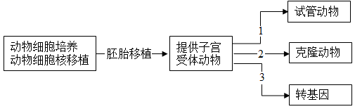
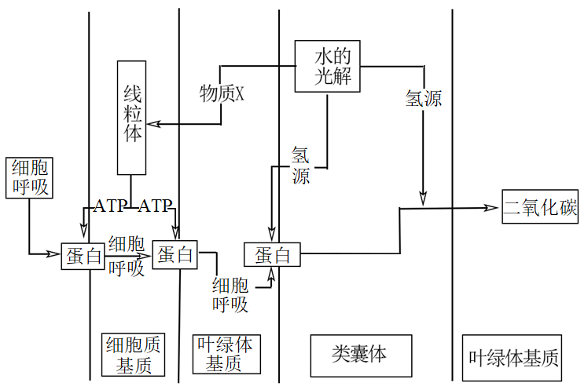
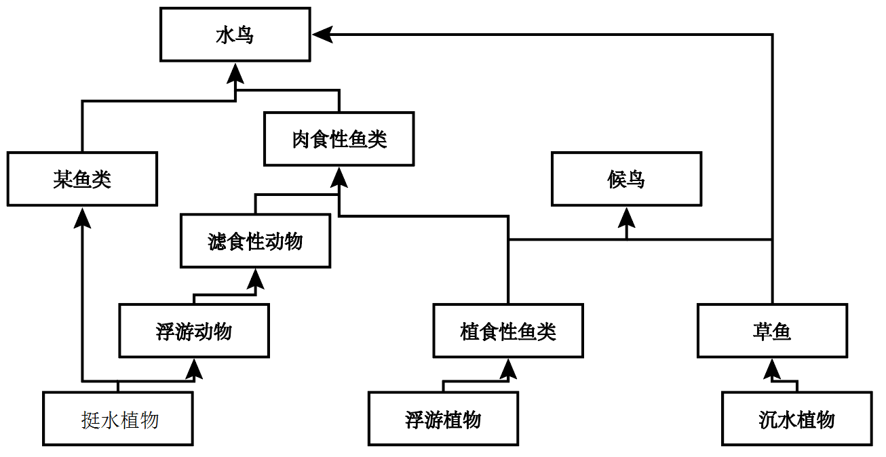
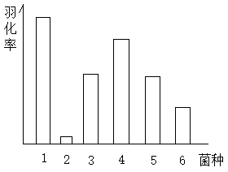
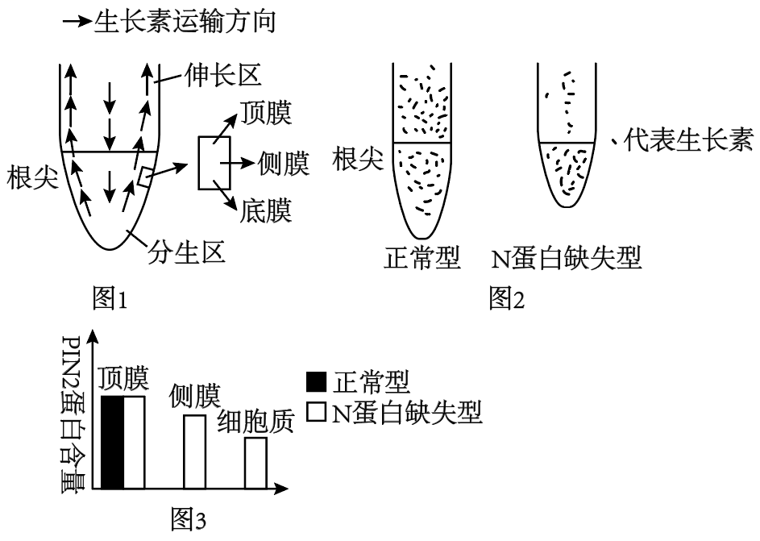
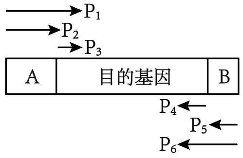
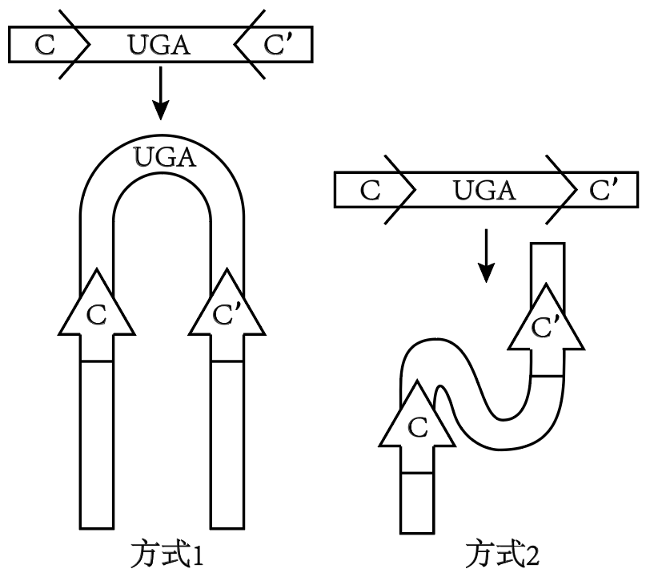
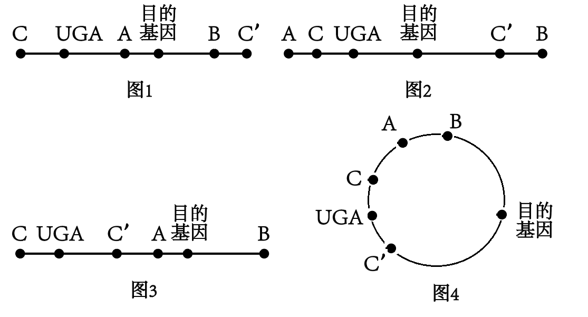

**2023年普通高等学校招生考试生物科目（天津卷）真题**

**一、选择题**

1\. 衣原体缺乏细胞呼吸所需的酶，则其需要从宿主细胞体内摄取的物质是（ ）

A. 葡萄糖 B. 糖原 C. 淀粉 D. ATP

2\. CD4是辅助性T细胞（CD4+）上的一种膜蛋白，CD8是细胞毒性T细胞（CD8+）上的一种膜蛋白，下列过程不能发生的是（ ）

A CD4+参与体液免疫 B. CD4+参与细胞免疫

C. CD8+参与体液免疫 D. CD8+参与细胞免疫

3\. 人口老龄化将对种群密度产生影响，下列数量特征与此无关的是（ ）

A. 出生率 B. 死亡率 C. 年龄结构 D. 性别比例

4\. 在肌神经细胞发育过程中，肌肉细胞需要释放一种蛋白质，其进入肌神经细胞后，促进其发育以及与肌肉细胞的联系；如果不能得到这种蛋白质，肌神经细胞会凋亡。下列说法错误的是（ ）

A. 这种蛋白质是一种神经递质

B. 肌神经细胞可以与肌肉细胞形成突触

C. 凋亡是细胞自主控制的一种程序性死亡

D. 蛋白合成抑制剂可以促进肌神经细胞凋亡

5\. 下列生物实验探究中运用的原理，前后不一致的是（ ）

A. 建立物理模型研究DNA结构－ 研究减数分裂染色体变化

B 运用同位素标记法研究卡尔文循环－ 研究酵母菌呼吸方式

C. 运用减法原理研究遗传物质－ 研究抗生素对细菌选择作用

D. 孟德尔用假说演绎法验证分离定律－ 摩尔根研究伴性遗传

6\. 癌细胞来源的某种酶较正常细胞来源的同种酶活性较低，原因不可能是（ ）

A. 该酶基因突变 B. 该酶基因启动子甲基化

C. 该酶中一个氨基酸发生变化 D. 该酶在翻译过程中肽链加工方式变化

7\. 根据下图，正确的是（ ）

A. 子代动物遗传性状和受体动物完全一致

B. 过程1需要MII期去核卵母细胞

C. 过程2可以大幅改良动物性状

D. 过程2为过程3提供了量产方式，过程3为过程1、2提供了改良性状的方式

8\. 如图甲乙丙是某动物精巢中细胞减数分裂图像，有关说法正确的是（ ）

A. 甲图像中细胞处于减数分裂Ⅱ中期 B. 乙中染色体组是丙中两倍

C. 乙中同源染色体对数是丙中两倍 D. 乙、丙都是从垂直于赤道板方向观察的

9\. 下图是某种植物光合作用及呼吸作用部分过程的图，关于此图说法错误的是（ ）

A. HCO3-经主动运输进入细胞质基质

B. HCO3-通过通道蛋白进入叶绿体基质

C. 光反应生成的H+促进了HCO3-进入类囊体

D. 光反应生成的物质X保障了暗反应的CO2供应

在细胞中，细胞器结构、功能的稳定对于维持细胞的稳定十分重要。真核生物细胞中的核糖体分为两部分，在结构上与原核生物核糖体相差较大。真核细胞中的线粒体、叶绿体内含有基因，并可以在其中表达，因此线粒体、叶绿体同样含有核糖体，这类核糖体与原核生物核糖体较为相似。植物细胞前质体可在光照诱导下变为叶绿体。

内质网和高尔基体在细胞分裂前期会破裂成较小的结构，当细胞分裂完成后，重新组装。

经合成加工后，高尔基体会释放含有溶酶体水解酶的囊泡，与前溶酶体融合，产生最适合溶酶体水解酶的酸性环境，构成溶酶体。溶酶体对于清除细胞内衰老、损伤的细胞器至关重要。

10\. 某种抗生素对细菌核糖体有损伤作用，大量摄入会危害人体，其最有可能危害人类细胞哪个细胞器？（ ）

A. 线粒体 B. 内质网 C. 细胞质核糖体 D. 中心体

11\. 下列说法或推断，正确的是（ ）

A. 叶绿体基质只能合成有机物，线粒体基质只能分解有机物

B. 细胞分裂中期可以观察到线粒体与高尔基体

C. 叶绿体和线粒体内基因表达都遵循中心法则

D. 植物细胞叶绿体均由前质体产生

12\. 下列说法或推断，错误的是（ ）

A. 经游离核糖体合成后，溶酶体水解酶囊泡进入前溶酶体，形成溶酶体

B. 溶酶体分解衰老、损伤的细胞器的产物，可以被再次利用

C. 若溶酶体功能异常，细胞内可能积累异常线粒体

D. 溶酶体水解酶进入细胞质基质后活性降低

**二、简答题**

13\. 为了保护某种候鸟，科学家建立了生态保护区，其中食物网结构如下：

（1）为了保证资源充分利用，应尽量保证生态系统内生物的\_\_\_\_\_不同。

（2）肉食性鱼类不是候鸟的捕食对象，引入它的意义是：\_\_\_\_\_。

（3）肉食性鱼类位于第\_\_\_\_\_营养级。若投放过早，可能会造成低营养级生物\_\_\_\_\_，所以应较晚投放。

（4）经过合理规划布施，该生态系统加快了\_\_\_\_\_。

14\. 某种蜂将幼虫生产在某种寄主动物身体里，研究人员发现幼虫羽化成功率与寄主肠道菌群有关，得到如下表结论

| 菌种      | 1   | 2   | 3   | 4   | 5   | 6   |
|:----------|:----|:----|:----|:----|:----|:----|
| 醋酸杆菌A | \+  | \-  | \+  | \+  | \+  | \+  |
| 芽孢杆菌B | \+  | \-  | \-  | \+  | \-  | \-  |
| 菌C       | \+  | \-  | \-  | \-  | \+  | \-  |
| 菌D       | \+  | \-  | \-  | \-  | \-  | \+  |

注：+代表存这种菌，-代表不存在这种菌

（1）根据第\_\_\_\_\_列，在有菌A的情况下，菌\_\_\_\_\_会进一步促进提高幼蜂羽化率。

（2）研究人员对幼蜂寄生可能造成的影响进行研究。

（i）研究发现幼蜂会分泌一种物质，类似于人体内胰岛素的作用，则其作用可以是促进\_\_\_\_\_物质转化为脂质。

（ii）研究还发现，幼蜂的存在会导致寄主体内脂肪酶活性降低，这是通过\_\_\_\_\_的方式使寄主积累脂质。

（iii）研究还需要知道幼蜂是否对寄主体内脂质合成量有影响，结合以上实验结果，请设计实验探究：\_\_\_\_\_

15 研究人员探究植物根部生长素运输情况，得到了生长素运输方向示意图（图1）

（1）生长素从根尖分生区运输到伸长区的运输类型是\_\_\_\_\_。

（2）图2是正常植物和某蛋白N对应基因缺失型的植物根部大小对比及生长素分布对比，据此回答：

（i）N蛋白基因缺失，会导致根部变短，并导致生长素在根部\_\_\_\_\_处（填“表皮”或“中央”）运输受阻。

（ii）如图3，在正常植物细胞中，PIN2蛋白是一种主要分布在植物顶膜的蛋白，推测其功能是将生长素从细胞\_\_\_\_\_运输到细胞\_\_\_\_\_，根据图3，N蛋白缺失型的植物细胞中，PIN2蛋白分布特点为：\_\_\_\_\_。

（3）根据上述研究，推测N蛋白的作用是：\_\_\_\_\_，从而促进了伸长区细胞伸长。

16\. 某植物四号染色体上面的A基因可以指导植酸合成，不能合成植酸的该种植物会死亡。现有A3-和A25-两种分别由A基因缺失3个和25个碱基对产生的基因，已知前者不影响植酸合成，后者效果未知。

（1）现有基因型为AA25-的植物，这两个基因是\_\_\_\_\_基因。该植物自交后代进行PCR，正向引物与A25-缺失的碱基配对，反向引物在其下游0．5kb处，PCR后进行电泳，发现植物全部后代PCR产物电泳结果均具有明亮条带，原因是\_\_\_\_\_，其中明亮条带分为较明亮和较暗两种，其中较明亮条带代表基因型为\_\_\_\_\_的植物，比例为\_\_\_\_\_。

（2）将一个A基因导入基因型为A3-A25-的植物的6号染色体，构成基因型为A3-A25- A的植物、该植物自交子代中含有A25-A25-的比例是\_\_\_\_\_。

（3）在某逆境中，基因型为A3-A3-的植物生存具有优势，现有某基因型为A3-A的植物，若该种植物严格自交，且基因型为A3-A3-的植物每代数量增加10%，补齐下面的表格中，子一代基因频率数据（保留一位小数）：

| 代                     | 亲代 | 子一代      | 子二代 |
|:-----------------------|:-----|:------------|:-------|
| A基因频率              | 50%  | \_\_\_\_\_% | 46．9% |
| A3-基因频率 | 50%  | \_\_\_\_\_% | 53．1% |

基因频率改变，是\_\_\_\_\_的结果。

17\. 基因工程：制备新型酵母菌

（1）已知酵母菌不能吸收淀粉，若想使新型酵母菌可以直接利用淀粉发酵，则应导入多步分解淀粉所需的多种酶，推测这些酶生效的场所应该是\_\_\_\_\_（填“细胞内”和“细胞外”）

（2）同源切割是一种代替限制酶、DNA连接酶将目的基因导入基因表达载体的方法。当目的基因两侧的小段序列与基因表达载体上某序列相同时，就可以发生同源切割，将目的基因直接插入。研究人员，运用同源切割的方式，在目的基因两端加上一组同源序列A．B，已知酵母菌体内DNA有许多A-B序列位点可以同源切割插入。构建完成的目的基因结构如图，则应选择图中的引物\_\_\_\_\_对目的基因进行PCR。

（3）已知酵母菌不能合成尿嘧啶，因此尿嘧啶合成基因（UGA）常用作标记基因，又知尿嘧啶可以使5-氟乳清酸转化为对酵母菌有毒物质。

（i）导入目的基因的酵母菌应在\_\_\_\_\_的培养基上筛选培养。由于需要导入多种酶基因，需要多次筛选，因此在导入一种目的基因后，要切除UGA基因，再重新导入。研究人员在UGA基因序列两端加上酵母菌DNA中不存在的同源C．C’序列，以便对UGA基因进行切除。C．C’的序列方向将影响切割时同源序列的配对方式，进而决定DNA片段在切割后是否可以顺利重连，如图，则应选择方式\_\_\_\_\_进行连接。

（ii）切去UGA基因的酵母菌应在\_\_\_\_\_的培养基上筛选培养。

（4）综上，目的基因、标记基因和同源序列在导入酵母菌的基因表达载体上的排列方式应该如图\_\_\_\_\_。

