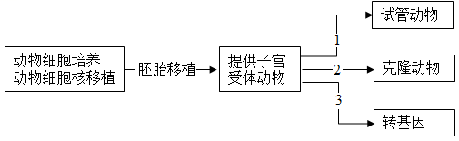
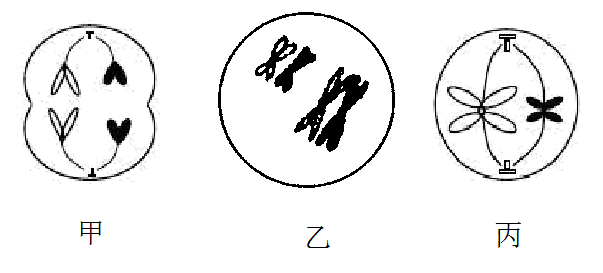
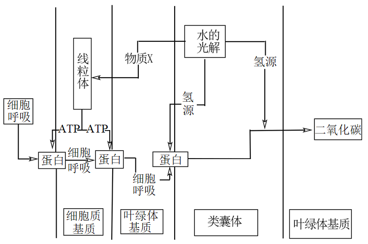
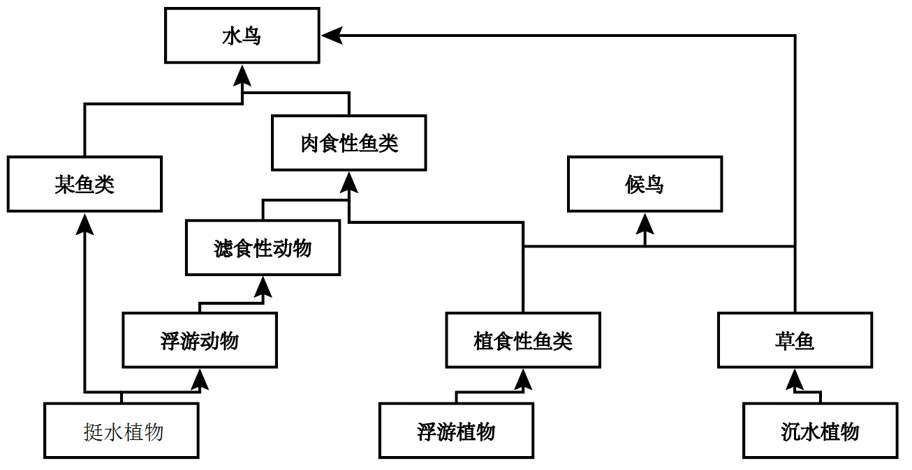
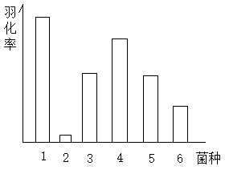
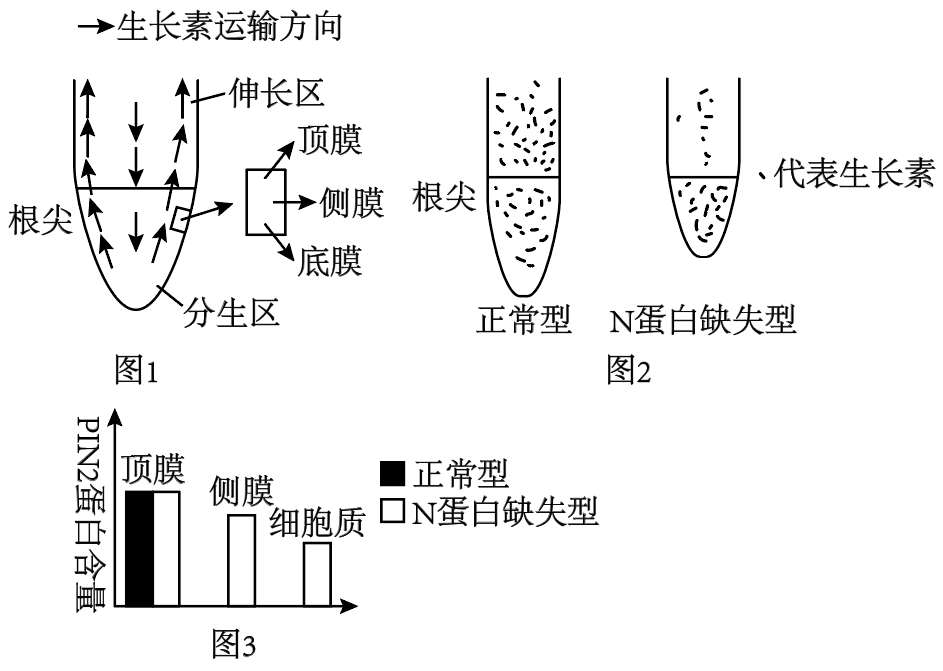
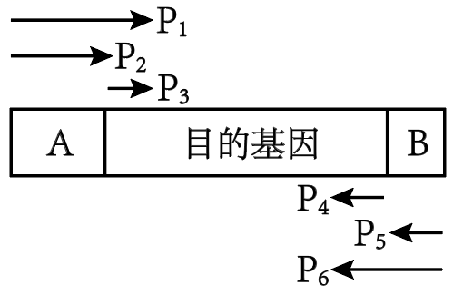
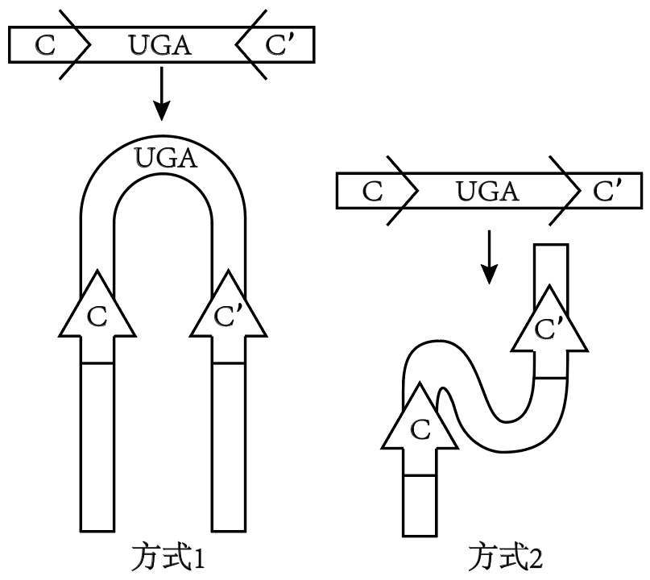
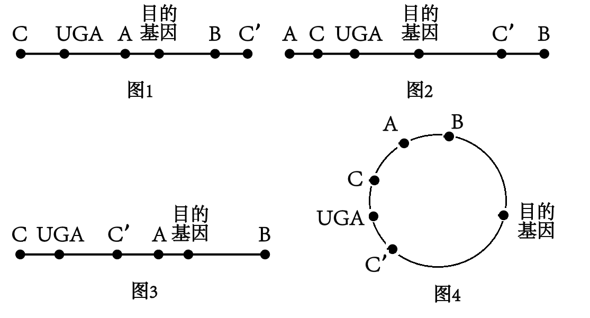

**2023年普通高等学校招生考试生物科目（天津卷）真题**

**一、选择题**

1\. 衣原体缺乏细胞呼吸所需的酶，则其需要从宿主细胞体内摄取的物质是（ ）

A. 葡萄糖 B. 糖原 C. 淀粉 D. ATP

【答案】D

【解析】

【分析】ATP来源于光合作用和呼吸作用，是生物体内直接的能源物质。

【详解】细胞生命活动所需的能量主要是由细胞呼吸提供的，衣原体缺乏细胞呼吸所需的酶，不能进行细胞呼吸，缺乏能量，ATP是直接的能源物质，因此衣原体需要从宿主细胞体内摄取的物质是ATP，D正确，ABC错误。

故选D。

2\. CD4是辅助性T细胞（CD4+）上的一种膜蛋白，CD8是细胞毒性T细胞（CD8+）上的一种膜蛋白，下列过程不能发生的是（ ）

A. CD4+参与体液免疫 B. CD4+参与细胞免疫

C. CD8+参与体液免疫 D. CD8+参与细胞免疫

【答案】C

【解析】

【分析】辅助性T细胞表面的特定分子发生变化并与B细胞结合，是激活B细胞的第二个信号；辅助性T细胞分泌的细胞因子能加速细胞毒性T细胞形成新的细胞毒性T细胞和记忆细胞。

【详解】辅助性T细胞既能参与细胞免疫又能参与体液免疫，细胞毒性T细胞只参与细胞免疫，CD4是辅助性T细胞（CD4+）上的一种膜蛋白，CD8是细胞毒性T细胞（CD8+）上的一种膜蛋白，因此CD4+参与体液免疫和细胞免疫，CD8+只参与细胞免疫，C符合题意，ABD不符合题意。

故选C。

3\. 人口老龄化将对种群密度产生影响，下列数量特征与此无关的是（ ）

A. 出生率 B. 死亡率 C. 年龄结构 D. 性别比例

【答案】D

【解析】

【分析】种群的数量特征包括种群密度、出生率和死亡率、迁入率和迁出率、年龄组成（年龄结构）和性别比例。其中种群密度是最基本的数量特征，出生率和死亡率、迁入率和迁出率决定种群密度的大小，性别比例直接影响种群的出生率，年龄组成（年龄结构）预测种群密度变化。

【详解】AB、人口老龄化会导致出生率降低、死亡率升高，AB不符合题意；

C、老龄化会导致人口的年龄结构成为衰退型，C不符合题意；

D、理论上男女比例是1∶1，人口老龄化一般不会影响性别比例，D符合题意。

故选D。

4\. 在肌神经细胞发育过程中，肌肉细胞需要释放一种蛋白质，其进入肌神经细胞后，促进其发育以及与肌肉细胞的联系；如果不能得到这种蛋白质，肌神经细胞会凋亡。下列说法错误的是（ ）

A. 这种蛋白质是一种神经递质

B. 肌神经细胞可以与肌肉细胞形成突触

C. 凋亡是细胞自主控制的一种程序性死亡

D. 蛋白合成抑制剂可以促进肌神经细胞凋亡

【答案】A

【解析】

【分析】细胞凋亡是由基因决定的细胞编程序死亡的过程。细胞凋亡是生物体正常的生命历程，对生物体是有利的，而且细胞凋亡贯穿于整个生命历程。细胞凋亡是生物体正常发育的基础，能维持组织细胞数目的相对稳定，是机体的一种自我保护机制。

【详解】A、分析题意可知，该蛋白质进入肌神经细胞后，会促进其发育以及与肌肉细胞的联系，而神经递质需要与突触后膜的受体结合后起作用，不进入细胞，故这种蛋白质不是神经递质，A错误；

B、肌神经细胞可以与肌肉细胞形成突触，两者之间通过神经递质传递信息，B正确；

C、凋亡是基因决定的细胞自动结束生命的过程，是一种程序性死亡，C正确；

D、结合题意，如果不能得到这种蛋白质，肌神经细胞会凋亡，故蛋白合成抑制剂可以促进肌神经细胞凋亡，D正确。

故选A。

5\. 下列生物实验探究中运用的原理，前后不一致的是（ ）

A. 建立物理模型研究DNA结构－ 研究减数分裂染色体变化

B. 运用同位素标记法研究卡尔文循环－ 研究酵母菌呼吸方式

C. 运用减法原理研究遗传物质－ 研究抗生素对细菌选择作用

D. 孟德尔用假说演绎法验证分离定律－ 摩尔根研究伴性遗传

【答案】B

【解析】

【分析】1、模型构建法：模型是人们为了某种特定的目的而对认识对象所做的一种简化的概括性的描述，这种描述可以是定性的，也可以是定量的；有的借助具体的实物或其它形象化的手段，有的则抽象的形式来表达。模型的形式很多，包括物理模型、概念模型、数学模型等。

2、同位素标记法：同位素可用于追踪物质运行和变化的规律，例如噬菌体侵染细菌的实验。

【详解】A、模型是人们为了某种特定的目的而对认识对象所做的一种简化的概括性的描述，研究DNA结构时构建了DNA双螺旋的物理模型，研究减数分裂时可通过橡皮泥等工具进行物理模型的构建，A正确；

B、卡尔文循环用14C进行标记探究，但探究酵母菌呼吸方式时用的是对比实验法，分别设置有氧和无氧组进行探究，不涉及同位素标记，B错误；

C、在探究DNA是遗传物质的实验中，肺炎链球菌的体外实验中用对应的酶设法去除相应物质，观察其作用，用到了减法原则，研究抗生素对细菌的选择作用时，也可通过去除抗生素后进行观察，属于减法原则，C正确；

D、孟德尔验证分离定律和摩尔根研究伴性遗传都用到了假说演绎法，D正确。

故选B。

6\. 癌细胞来源的某种酶较正常细胞来源的同种酶活性较低，原因不可能是（ ）

A. 该酶基因突变 B. 该酶基因启动子甲基化

C. 该酶中一个氨基酸发生变化 D. 该酶在翻译过程中肽链加工方式变化

【答案】B

【解析】

【分析】细胞癌变的原因包括外因和内因，外因是各种致癌因子，内因是原癌基因和抑癌基因发生基因突变。癌细胞的特征：能够无限增殖；形态结构发生显著改变；细胞表面发生变化，细胞膜的糖蛋白等物质减少。

【详解】A、基因控制蛋白质的合成，基因突变是指DNA分子中碱基对的增添、替换和缺失而引起基因碱基序列的改变。基因突变后可能导致蛋白质功能发生改变，进而导致酶活性降低，A正确；

B、启动子是RNA聚合酶识别与结合的位点，用于驱动基因的转录，转录出的mRNA可作为翻译的模板翻译出蛋白质。若该酶基因启动子甲基化，可能导致该基因的转录过程无法进行，不能合成酶，B错误；

CD、蛋白质的结构决定其功能，蛋白质结构与氨基酸的种类、数目、排列顺序以及肽链盘曲折叠的方式等有关。故若该酶中一个氨基酸发生变化 （氨基酸种类变化）或该酶在翻译过程中肽链加工方式变化，都可能导致该酶的空间结构变化而导致功能改变，活性降低，CD正确。

故选B。

7\. 根据下图，正确的是（ ）

A. 子代动物遗传性状和受体动物完全一致

B. 过程1需要MII期去核卵母细胞

C. 过程2可以大幅改良动物性状

D. 过程2为过程3提供了量产方式，过程3为过程1、2提供了改良性状的方式

【答案】D

【解析】

【分析】动物核移植是将动物的一个细胞的细胞核移入一个已经去掉细胞核的卵母细胞中，使其重组并发育成一个新的胚胎，这个胚胎最终发育为动物。

【详解】A、子代动物遗传性状与供体基本一致，但与受体无关，A错误；

B、核移植过程中需要处于MII中期的去核卵母细胞，而过程1是培育试管动物，需要培育到适宜时期（桑葚胚或囊胚等时期）进行胚胎移植，B错误；

C、过程2得到的是克隆动物，是无性生殖的一种，不能大幅改良动物性状，C错误；

D、过程2克隆技术可得到大量同种个体，为过程3提供了量产方式；过程3是转基因技术，转基因可导入外源优良基因，为过程1、2提供了改良性状的方式，D正确。

故选D。

8\. 如图甲乙丙是某动物精巢中细胞减数分裂图像，有关说法正确的是（ ）

A. 甲图像中细胞处于减数分裂Ⅱ中期 B. 乙中染色体组是丙中两倍

C. 乙中同源染色体对数是丙中两倍 D. 乙、丙都是从垂直于赤道板方向观察的

【答案】B

【解析】

【分析】据图分析，甲为减数分裂Ⅱ末期，乙为减数分裂Ⅰ前期，丙为减数分裂Ⅱ中期。

【详解】A、甲图像中无同源染色体，无染色单体，染色随机排列，为减数分裂Ⅱ末期，A错误；

B、乙为减数分裂Ⅰ前期，丙为减数分裂Ⅱ中期，乙是丙染色体数目的2倍，B正确；

C、丙为减数分裂Ⅱ中期，无同源染色体，C错误；

D、丙是从平行于赤道板方向观察的，D错误。

故选B。

9\. 下图是某种植物光合作用及呼吸作用部分过程的图，关于此图说法错误的是（ ）

A. HCO3-经主动运输进入细胞质基质

B. HCO3-通过通道蛋白进入叶绿体基质

C. 光反应生成的H+促进了HCO3-进入类囊体

D. 光反应生成的物质X保障了暗反应的CO2供应

【答案】B

【解析】

【分析】光反应阶段在叶绿体囊状结构薄膜上进行，此过程必须有光、色素、光合作用的酶．具体反应步骤：①水的光解，水在光下分解成氧气和还原氢；②ATP生成，ADP与Pi接受光能变成ATP，此过程将光能变为ATP活跃的化学能。

【详解】A、据图可知，HCO3-进入细胞质基质需要线粒体产生的ATP供能，属于主动运输，A正确；

B、HCO3-进入叶绿体基质也需要线粒体产生的ATP供能，属于主动运输，通道蛋白只能参与协助扩散，B错误；

C、据图可知，光反应中水光解产生的H+促进HCO3-进入类囊体，C正确；

D、据图可知，光反应生成的物质X（O2）促进线粒体的有氧呼吸，产生更多的ATP，有利于HCO3-进入叶绿体基质，产生CO2，保证了暗反应的CO2供应，D正确。

故选B。

在细胞中，细胞器结构、功能的稳定对于维持细胞的稳定十分重要。真核生物细胞中的核糖体分为两部分，在结构上与原核生物核糖体相差较大。真核细胞中的线粒体、叶绿体内含有基因，并可以在其中表达，因此线粒体、叶绿体同样含有核糖体，这类核糖体与原核生物核糖体较为相似。植物细胞前质体可在光照诱导下变为叶绿体。

内质网和高尔基体在细胞分裂前期会破裂成较小的结构，当细胞分裂完成后，重新组装。

经合成加工后，高尔基体会释放含有溶酶体水解酶的囊泡，与前溶酶体融合，产生最适合溶酶体水解酶的酸性环境，构成溶酶体。溶酶体对于清除细胞内衰老、损伤的细胞器至关重要。

10\. 某种抗生素对细菌核糖体有损伤作用，大量摄入会危害人体，其最有可能危害人类细胞哪个细胞器？（ ）

A. 线粒体 B. 内质网 C. 细胞质核糖体 D. 中心体

11\. 下列说法或推断，正确的是（ ）

A. 叶绿体基质只能合成有机物，线粒体基质只能分解有机物

B. 细胞分裂中期可以观察到线粒体与高尔基体

C. 叶绿体和线粒体内基因表达都遵循中心法则

D. 植物细胞叶绿体均由前质体产生

12\. 下列说法或推断，错误的是（ ）

A. 经游离核糖体合成后，溶酶体水解酶囊泡进入前溶酶体，形成溶酶体

B. 溶酶体分解衰老、损伤的细胞器的产物，可以被再次利用

C. 若溶酶体功能异常，细胞内可能积累异常线粒体

D. 溶酶体水解酶进入细胞质基质后活性降低

【答案】10. A 11. C 12. A

【解析】

【分析】溶酶体中含有多种水解酶，能够分解很多种物质以及衰老、损伤的细胞器，清除侵入细胞的病毒或病菌，被比喻为细胞内的“酶仓库”“消化系统”。

【10题详解】

据题意可知，线粒体、叶绿体同样含有核糖体，这类核糖体与原核生物核糖体较为相似，某种抗生素对细菌（原核生物）核糖体有损伤作用，因此推测大量摄入会危害人体，其最有可能危害人类细胞线粒体中核糖体，A正确，BCD错误。

故选A。

【11题详解】

A、叶绿体基质可分解ATP，合成糖类、蛋白质、DNA、RNA等有机物；线粒体基质可分解丙酮酸，可以合成蛋白质、DNA、RNA等有机物，所以叶绿体基质和线粒体基质能合成有机物和分解有机物，A错误；

B、内质网和高尔基体在细胞分裂前期会破裂成较小的结构，因此推测细胞分裂中期不可以观察到高尔基体，B错误；

C、叶绿体和线粒体内含有基因，其基因表达包括转录和翻译，都遵循中心法则，C正确；

D、植物细胞前质体可在光照诱导下变为叶绿体，但不能说明植物细胞叶绿体均由前质体产生，D错误。

故选C。

【12题详解】

A、高尔基体释放含有溶酶体水解酶的囊泡，与前溶酶体融合，产生最适合溶酶体水解酶的酸性环境，构成溶酶体，不是囊泡进入前溶酶体，A错误；

B、溶酶体含有大量的水解酶，能分解衰老、损伤的细胞器的产物，可以被再次利用或者排出体外，B正确；

C、溶酶体对于清除细胞内衰老、损伤的细胞器至关重要，若溶酶体功能异常，细胞内可能积累异常线粒体，C正确；

D、溶酶体属于酸性环境，溶酶体水解酶进入细胞质基质后，pH不适宜，水解酶活性降低，D正确。

故选A。

**二、简答题**

13\. 为了保护某种候鸟，科学家建立了生态保护区，其中食物网结构如下：

（1）为了保证资源充分利用，应尽量保证生态系统内生物的\_\_\_\_\_不同。

（2）肉食性鱼类不是候鸟的捕食对象，引入它的意义是：\_\_\_\_\_。

（3）肉食性鱼类位于第\_\_\_\_\_营养级。若投放过早，可能会造成低营养级生物\_\_\_\_\_，所以应较晚投放。

（4）经过合理规划布施，该生态系统加快了\_\_\_\_\_。

【答案】（1）生态位 （2）该生态系统中生物种类，增加生态系统的稳定性，同时避免少数几种生物占优势的局面，增加物种多样性

（3） ①. 第三和第四 ②. 被过度捕食 （4）物质循环的速度

【解析】

【分析】一个物种在群落中的地位或作用，包括所处的空间位置，占用资源的情况，以及与其他物种的关系等，称为这个物种的生态位。

【小问1详解】

群落中每种生物都占据着相对稳定的生态位，这有利于不同生物之间充分利用环境资源，故为了保证资源充分利用，应尽量保证生态系统内生物的生态位的不同。

【小问2详解】

据图可知，候鸟可以捕食草鱼和植食性鱼类，但不捕食肉食性鱼类，引入肉食性鱼类的原因可能是增加该生态系统中生物种类，增加生态系统的稳定性，同时避免少数几种生物占优势的局面，增加物种多样性。

【小问3详解】

据图分析，在食物链浮游植物→植食性鱼类→肉食性动物→水鸟、富水植物→浮游动物→滤食性动物→肉食性动物→水鸟的食物链中，肉食性鱼类位于第三和第四营养级；若投放过早，可能会造成低营养级生物被过度捕食，导致生态系统稳定性被破坏，故以应较晚投放。

【小问4详解】

经过合理规划布施，该生态系统结构合理，加快了物质循环的速度。

14\. 某种蜂将幼虫生产在某种寄主动物身体里，研究人员发现幼虫羽化成功率与寄主肠道菌群有关，得到如下表结论

| 菌种      | 1   | 2   | 3   | 4   | 5   | 6   |
|:----------|:----|:----|:----|:----|:----|:----|
| 醋酸杆菌A | \+  | \-  | \+  | \+  | \+  | \+  |
| 芽孢杆菌B | \+  | \-  | \-  | \+  | \-  | \-  |
| 菌C       | \+  | \-  | \-  | \-  | \+  | \-  |
| 菌D       | \+  | \-  | \-  | \-  | \-  | \+  |

注：+代表存在这种菌，-代表不存在这种菌

（1）根据第\_\_\_\_\_列，在有菌A的情况下，菌\_\_\_\_\_会进一步促进提高幼蜂羽化率。

（2）研究人员对幼蜂寄生可能造成的影响进行研究。

（i）研究发现幼蜂会分泌一种物质，类似于人体内胰岛素的作用，则其作用可以是促进\_\_\_\_\_物质转化为脂质。

（ii）研究还发现，幼蜂的存在会导致寄主体内脂肪酶活性降低，这是通过\_\_\_\_\_的方式使寄主积累脂质。

（iii）研究还需要知道幼蜂是否对寄主体内脂质合成量有影响，结合以上实验结果，请设计实验探究：\_\_\_\_\_

【答案】（1） ①. 1、3、4、5、6 ②. B

（2） ①. 糖类\
②. 减少脂肪的分解 ③. 将生长状况相同的寄主动物随机分为两组，一组让幼蜂寄生，一组不做处理，并分别检测脂质含量；一段时间后，检测、比较两组寄主动物处理前后脂质含量的变化

【解析】

【分析】分析题意，本实验目的是探究幼虫羽化成功率与寄主肠道菌群的关系，实验的自变量是菌种种类，因变量是羽化率，据此分析作答。

【小问1详解】

结合题意可知，菌A是醋酸杆菌，表中第1、 3、 4、 5和6列中均有A存在，与第3列对比，结合羽化率数据可知，在有菌A情况下，菌B会进一步促进提高幼蜂羽化率。

【小问2详解】

（i）研究发现幼蜂会分泌一种物质，类似于人体内胰岛素的作用，由于胰岛素具有降血糖作用，则其作用可以是促进糖类物质转化为脂质。

（ii）研究还发现，幼蜂的存在会导致寄主体内脂肪酶活性降低，这是通过减少脂肪的分解的方式使寄主积累脂质。

（iii）研究幼蜂是否对寄主体内脂质合成量有影响，自变量应为是否有幼蜂寄生，因变量为寄主体内脂质含量变化，可将生长状况相同的寄主动物随机分为两组，一组让幼蜂寄生，一组不做处理，并分别检测脂质含量；一段时间后，检测、比较两组寄主动物处理前后脂质含量的变化。

15\. 研究人员探究植物根部生长素运输情况，得到了生长素运输方向示意图（图1）

（1）生长素从根尖分生区运输到伸长区的运输类型是\_\_\_\_\_。

（2）图2是正常植物和某蛋白N对应基因缺失型的植物根部大小对比及生长素分布对比，据此回答：

（i）N蛋白基因缺失，会导致根部变短，并导致生长素在根部\_\_\_\_\_处（填“表皮”或“中央”）运输受阻。

（ii）如图3，在正常植物细胞中，PIN2蛋白是一种主要分布在植物顶膜的蛋白，推测其功能是将生长素从细胞\_\_\_\_\_运输到细胞\_\_\_\_\_，根据图3，N蛋白缺失型的植物细胞中，PIN2蛋白分布特点为：\_\_\_\_\_。

（3）根据上述研究，推测N蛋白的作用是：\_\_\_\_\_，从而促进了伸长区细胞伸长。

【答案】（1）极性运输（主动运输）

（2） ①. 中央 ②. 顶膜 ③. 侧膜和底膜 ④. 顶膜处最多，侧膜和细胞质中也有分布

（3）促进生长素从细胞质和侧膜等部位向伸长区细胞顶膜集中

【解析】

【分析】生长素的产生:生长素的主要合成部位是幼嫩的芽、叶和发育中的种子，由色氨酸经过一系列反应转变而成。运输:胚芽鞘、芽、幼叶、幼根中:生长素只能从形态学的上端运输到形态学的下端，而不能反过来运输，称为极性运输;在成熟组织中:生长素可以通过韧皮部进行非极性运输。

小问1详解】

据图可知，生长素从根尖分生区运输到伸长区的运输是从形态学的上端向形态学的下端运输，属于极性运输，运输方式是主动运输。

【小问2详解】

（i）分析图2，N蛋白缺失型个体的根部明显缩短，且据生长素的分布情况可知，伸长区中央部分的生长素较少，据此可推测生长素在根部中央运输受阻。

（ii）据图3可知，正常型个体和N蛋白缺失型个体顶膜的PIN2蛋白含量相同，侧膜和细胞质中没有分布，结合图1推测，推测其功能是将生长素从细胞顶膜运输至侧膜和底膜；而N蛋白缺失型的植物细胞中，PIN2蛋白分布特点为：顶膜处最多，侧膜和细胞质中也有分布，但是相等较少，其中细胞质中含量最少。

【小问3详解】

根据上述研究，正常型个体只有顶膜有PIN蛋白分布，而N蛋白缺失型个体则在多处都有分布，推测N蛋白的作用是：促进生长素从细胞质和侧膜等部位向伸长区细胞顶膜集中，从而促进了伸长区细胞伸长。

16\. 某植物四号染色体上面的A基因可以指导植酸合成，不能合成植酸的该种植物会死亡。现有A3-和A25-两种分别由A基因缺失3个和25个碱基对产生的基因，已知前者不影响植酸合成，后者效果未知。

（1）现有基因型为AA25-的植物，这两个基因是\_\_\_\_\_基因。该植物自交后代进行PCR，正向引物与A25-缺失的碱基配对，反向引物在其下游0．5kb处，PCR后进行电泳，发现植物全部后代PCR产物电泳结果均具有明亮条带，原因是\_\_\_\_\_，其中明亮条带分为较明亮和较暗两种，其中较明亮条带代表基因型为\_\_\_\_\_的植物，比例为\_\_\_\_\_。

（2）将一个A基因导入基因型为A3-A25-的植物的6号染色体，构成基因型为A3-A25- A的植物、该植物自交子代中含有A25-A25-的比例是\_\_\_\_\_。

（3）在某逆境中，基因型为A3-A3-的植物生存具有优势，现有某基因型为A3-A的植物，若该种植物严格自交，且基因型为A3-A3-的植物每代数量增加10%，补齐下面的表格中，子一代基因频率数据（保留一位小数）：

| 代                     | 亲代 | 子一代      | 子二代 |
|:-----------------------|:-----|:------------|:-------|
| A基因频率              | 50%  | \_\_\_\_\_% | 46．9% |
| A3-基因频率 | 50%  | \_\_\_\_\_% | 53．1% |

基因频率改变，是\_\_\_\_\_的结果。

【答案】（1） ①. 等位 ②. 自交后代中基因型为A25-A25-的个体死亡，基因型为A25-A和AA的个体由于都至少含有一个A基因，因此可以与正向引物和反向引物结合进而完成PCR，获得明亮条带。 ③. AA ④. 1/3

（2）1/5 （3） ①. 48.8% ②. 51.2% ③. 自然选择

【解析】

【分析】基因突变是指DNA分子中发生碱基对的替换、增添和缺失，而引起的基因结构的改变。基因分离定律的实质：在杂合子的细胞中，位于一对同源染色体上的等位基因，具有一定的独立性；生物体在进行减数分裂形成配子时，等位基因会随着同源染色体的分开而分离，分别进入到两个配子中，独立地随配子遗传给后代。基因自由组合定律实质：位于非同源染色体上的非等位基因的分离或组合是互不干扰的， 在减数分裂形成配子的过程中，同源染色体上的等位基因彼此分离，非同源染色体上的非等位基因自由组合。

生物进化的实质在于种群基因频率的改变。突变和基因重组、自然选择及隔离是物种形成过程的三个基本环节，通过它们的综合作用，种群产生分化，最终导致新物种的形成。其中突变和基因重组产生生物进化的原材料，自然选择使种群的基因频率发生定向的改变并决定生物进化的方向。

【小问1详解】

由题干可知，A25-基因是由A基因缺失25个碱基对产生的基因，即A基因通过基因突变产生A25-基因，因此二者属于等位基因。基因型为AA25-的植物自交后代的基因型及其比例为AA：AA25-：A25-A25-=1:2:1。当对这些后代进行PCR时，正向引物与A25-缺失的碱基配对，反向引物在其下游0.5kb处，可推知缺失这25个碱基对的A25-基因无法与正向引物配对从而不能扩增，因此只含有A25-基因的个体（即A25-A25-）不具有条带；含有这25个碱基对的A基因才能与正向引物和反向引物都进行碱基互补配对从而扩增出条带，因此基因型为AA、AA25-的个体均具有条带，且A基因个数越多，扩增产物越多，条带越明亮，因此基因型为AA的个体具有较明亮的条带，基因型为AA25-的个体具有较暗的条带。由题干可知，该植物的全部后代都具有明亮条带，说明基因型为A25-A25-的个体无法存活，只有基因型为AA和AA25-的个体能够存活下来，并进行了PCR扩增产生了条带，因此较明亮条带代表基因型为AA，占比为1/3。

【小问2详解】

已知基因A3-和A25-都在4号染色体上，再导入一个A基因至6号染色体上，由于它们位于不同对染色体上，故该植物在减数分裂产生配子时，遵循基因自由组合定律，产生配子的基因型为A3-A、A25-A、A3-、A25-，比例各自占1/4；该植物自交后代中基因型为A25-A25-=1/4×1/4=1/16的个体死亡，存活个体占1-1/16=15/16，含有A25-A25-的后代个体基因型有2种，分别是AAA25-A25-=1/4×1/4=1/16，AA25-A25-=1/4×1/4×2=2/16，二者共占3/16，因此该植物自交子代中含有A25-A25-的比例是3/16÷15/16=1/5。

【小问3详解】

基因型为A3-A的植物自交产生子一代的基因型及比例为AA=1/4，A3-A=1/2，A3-A3-=1/4，由题干可知，基因型为A3-A3-的植物每代数量增加10%，则子一代中A3-A3-=1/4+1/4×10%=11/40，因此子一代中AA：A3-A：A3-A3-=1/4：1/2：11/40=10:20:11，可计算出三者的基因型频率分别是AA=10÷（10+20+11）=10/41，A3-A=20÷（10+20+11）=20/41，A3-A3-=11÷（10+20+11）=11/41，可进一步计算出子一代中A基因频率=10/41+1/2×20/41=48.8%，A3-基因频率=11/41+1/2×20/41=51.2%。自然选择导致具有有利变异的个体存活并由更大几率产生更多后代，导致后代中决定有利变异的基因频率增大，而具有不利变异的个体则会被自然选择淘汰，因此决定不利变异的基因频率减小，因此基因频率的改变是自然选择的结果。

17\. 基因工程：制备新型酵母菌

（1）已知酵母菌不能吸收淀粉，若想使新型酵母菌可以直接利用淀粉发酵，则应导入多步分解淀粉所需的多种酶，推测这些酶生效的场所应该是\_\_\_\_\_（填“细胞内”和“细胞外”）

（2）同源切割是一种代替限制酶、DNA连接酶将目的基因导入基因表达载体的方法。当目的基因两侧的小段序列与基因表达载体上某序列相同时，就可以发生同源切割，将目的基因直接插入。研究人员，运用同源切割的方式，在目的基因两端加上一组同源序列A．B，已知酵母菌体内DNA有许多A-B序列位点可以同源切割插入。构建完成的目的基因结构如图，则应选择图中的引物\_\_\_\_\_对目的基因进行PCR。

（3）已知酵母菌不能合成尿嘧啶，因此尿嘧啶合成基因（UGA）常用作标记基因，又知尿嘧啶可以使5-氟乳清酸转化为对酵母菌有毒物质。

（i）导入目的基因的酵母菌应在\_\_\_\_\_的培养基上筛选培养。由于需要导入多种酶基因，需要多次筛选，因此在导入一种目的基因后，要切除UGA基因，再重新导入。研究人员在UGA基因序列两端加上酵母菌DNA中不存在的同源C．C’序列，以便对UGA基因进行切除。C．C’的序列方向将影响切割时同源序列的配对方式，进而决定DNA片段在切割后是否可以顺利重连，如图，则应选择方式\_\_\_\_\_进行连接。

（ii）切去UGA基因的酵母菌应在\_\_\_\_\_的培养基上筛选培养。

（4）综上，目的基因、标记基因和同源序列在导入酵母菌的基因表达载体上的排列方式应该如图\_\_\_\_\_。

【答案】（1）细胞外 （2）P1和P6

（3） ① 缺乏尿嘧啶 ②. 方式二 ③. 含有5-氟乳清酸

（4）图3

【解析】

【分析】 基因工程是指按照人们的愿望，进行严格的设计，通过体外DNA重组和转基因技术，赋予生物以新的遗传特性，创造出更符合人们需要的新的生物类型和生物产品．基因工程是在DNA分子水平上进行设计和施工的，又叫做DNA重组技术。

【小问1详解】

由于酵母菌不能吸收淀粉，所以导入分解淀粉的酶发挥作用的场所在细胞外。

【小问2详解】

根据题干信息“当目的基因两侧的小段序列与基因表达载体上某序列相同时，就可以发生同源切割，将目的基因直接插入”，要保证目的基因两侧的小段序列与基因表达载体上某序列相同，需要选择P1和P6这对引物进行PCR。

【小问3详解】

（i）选择了尿嘧啶合成基因（UGA）常用作标记基因，则应该将酵母菌放在缺乏尿嘧啶的培养基上培养，如果导入成功，则形成菌落；如果没有导入，则缺乏尿嘧啶，不能生存；

方式一，C和C'方向相反，如果切割，则末端在一条链上，不能连接，所以选择方式二，连接方向相同，切割后形成末端，便于连接。

（ii）由于尿嘧啶可以使5-氟乳清酸转化为对酵母菌有毒物质，所以应该在含有5-氟乳清酸的培养基上，如果切割成功，则不含尿嘧啶，形成菌落，如果切割不成功，则会产生有毒物质，不能形成菌落。

【小问4详解】

根据前面分析，C和C'的中间插入UGA，A和B之间插入的目的基因，所以图3正确。
