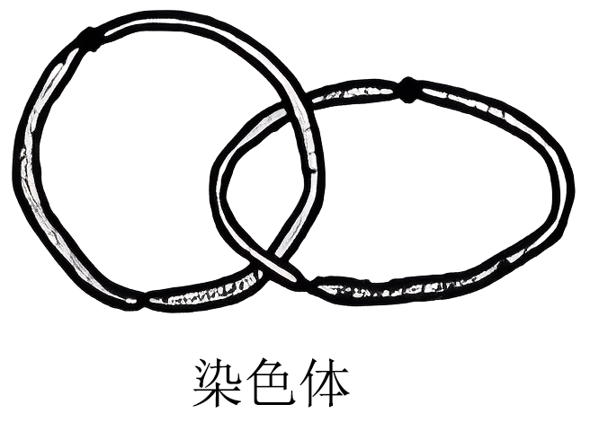
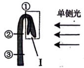
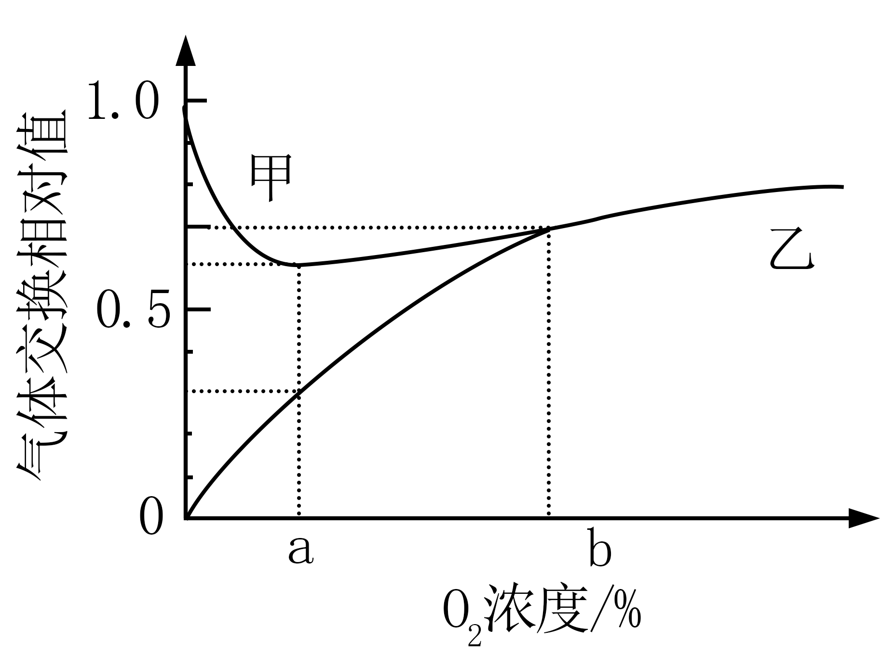
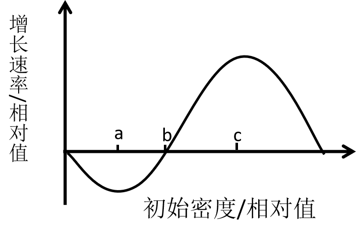
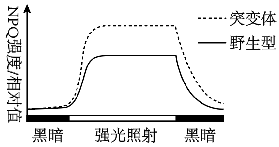
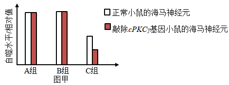
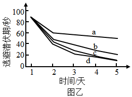
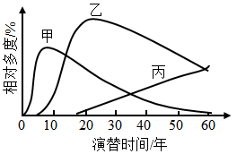
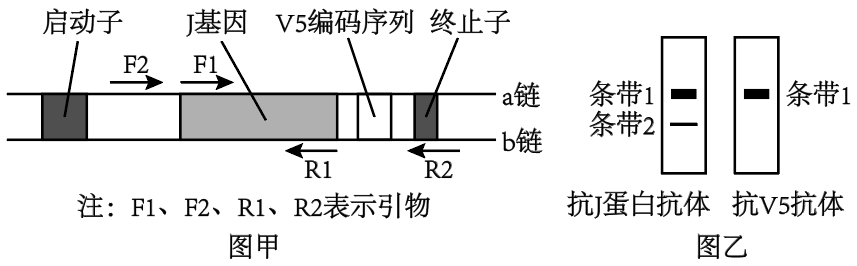

**2023年全省普通高中学业水平等级考试**

**生物**

**注意事项：**

**1．答卷前，考生务必将自己的姓名、考生号等填写在答题卡和试卷指定位置。**

**2．回答选择题时，选出每小题答案后，用铅笔把答题卡上对应题目的答案标号涂黑如需改动、用橡皮擦干净后，再选涂其他答案标号。回答非选择题时，将答案写在答题卡上。写在本试卷上无效。**

**3．考试结束后，将本试卷和答题卡一并交回。**

**一、选择题：本题共15小题，每小题2分，共30分。每小题只有一个选项符合题目要求。**

1\. 细胞中的核糖体由大、小2个亚基组成。在真核细胞的核仁中，由核rDNA转录形成的rRNA与相关蛋白组装成核糖体亚基。下列说法正确的是（ ）

A. 原核细胞无核仁，不能合成rRNA B. 真核细胞核糖体蛋白在核糖体上合成

C. rRNA上3个相邻的碱基构成一个密码子 D. 细胞在有丝分裂各时期都进行核DNA的转录

2\. 溶酶体膜上的H+载体蛋白和Cl-/H+转运蛋白都能运输H+，溶酶体内H+浓度由H+载体蛋白维持，Cl-/H+转运蛋白在H+浓度梯度驱动下，运出H+的同时把Cl-逆浓度梯度运入溶酶体。Cl-/H+转运蛋白缺失突变体的细胞中，因Cl-转运受阻导致溶酶体内的吞噬物积累，严重时可导致溶酶体破裂。下列说法错误的是（ ）

A. H+进入溶酶体的方式属于主动运输

B. H+载体蛋白失活可引起溶酶体内的吞噬物积累

C. 该突变体的细胞中损伤和衰老的细胞器无法得到及时清除

D. 溶酶体破裂后，释放到细胞质基质中的水解酶活性增强

3\. 研究发现，病原体侵入细胞后，细胞内蛋白酶L在无酶活性时作为支架蛋白参与形成特定的复合体，经过一系列过程，最终导致该细胞炎症性坏死，病原体被释放，该过程属于细胞焦亡。下列说法错误的是（ ）

A. 蝌蚪尾的消失不是通过细胞焦亡实现的

B. 敲除编码蛋白酶L的基因不影响细胞焦亡

C. 细胞焦亡释放的病原体可由体内的巨噬细胞吞噬消化

D. 细胞焦亡释放的病原体可刺激该机体B淋巴细胞的增殖与分化

4\. 水淹时，玉米根细胞由于较长时间进行无氧呼吸导致能量供应不足，使液泡膜上的H+转运减缓，引起细胞质基质内H+积累，无氧呼吸产生的乳酸也使细胞质基质pH降低。pH降低至一定程度会引起细胞酸中毒。细胞可通过将无氧呼吸过程中的丙酮酸产乳酸途径转换为丙酮酸产酒精途径，延缓细胞酸中毒。下列说法正确的是（ ）

A. 正常玉米根细胞液泡内pH高于细胞质基质

B. 检测到水淹的玉米根有CO2的产生不能判断是否有酒精生成

C. 转换为丙酮酸产酒精途径时释放的ATP增多以缓解能量供应不足

D. 转换为丙酮酸产酒精途径时消耗的\[H\]增多以缓解酸中毒

5\. 将一个双链DNA分子的一端固定于载玻片上，置于含有荧光标记的脱氧核苷酸的体系中进行复制。甲、乙和丙分别为复制过程中3个时间点的图像，①和②表示新合成的单链，①的5'端指向解旋方向，丙为复制结束时的图像。该DNA复制过程中可观察到单链延伸暂停现象，但延伸进行时2条链延伸速率相等。已知复制过程中严格遵守碱基互补配对原则，下列说法错误的是（ ）

A. 据图分析，①和②延伸时均存在暂停现象

B 甲时①中A、T之和与②中A、T之和可能相等

C. 丙时①中A、T之和与②中A、T之和一定相等

D. ②延伸方向为5'端至3'端，其模板链3'端指向解旋方向

6\. 减数分裂Ⅱ时，姐妹染色单体可分别将自身两端粘在一起，着丝粒分开后，2个环状染色体互锁在一起，如图所示。2个环状染色体随机交换一部分染色体片段后分开，分别进入2个子细胞，交换的部分大小可不相等，位置随机。某卵原细胞的基因组成为Ee，其减数分裂可形成4个子细胞。不考虑其他突变和基因被破坏的情况，关于该卵原细胞所形成子细胞的基因组成，下列说法正确的是（ ）

A. 卵细胞基因组成最多有5种可能

B. 若卵细胞为Ee，则第二极体可能为EE或ee

C. 若卵细胞为E且第一极体不含E，则第二极体最多有4种可能

D. 若卵细胞不含E、e且一个第二极体为E，则第一极体最多有3种可能

7\. 某种XY型性别决定的二倍体动物，其控制毛色的等位基因G、g只位于X染色体上，仅G表达时为黑色，仅g表达时为灰色，二者均不表达时为白色。受表观遗传的影响，G、g来自父本时才表达，来自母本时不表达。某雄性与杂合子雌性个体为亲本杂交，获得4只基因型互不相同的F1。亲本与F1组成的群体中，黑色个体所占比例不可能是（ ）

A. 2/3 B. 1/2 C. 1/3 D. 0

8\. 肾上腺皮质分泌的糖皮质激素（GC）能提高心肌细胞肾上腺素受体的表达水平。体内GC的分泌过程存在负反馈调节。作为药物服用时，血浆中高浓度的GC能抑制淋巴细胞的增殖、分化。下列推断正确的是（ ）

A. GC可用于治疗艾滋病

B. GC分泌增加不利于提高人体的应激能力

C. GC作为药物长期服用可导致肾上腺皮质萎缩

D. 促肾上腺皮质激素释放激素可直接促进GC的分泌

9\. 脊髓、脑干和大脑皮层中都有调节呼吸运动的神经中枢，其中只有脊髓呼吸中枢直接支配呼吸运动的呼吸肌，且只有脑干呼吸中枢具有自主节律性。下列说法错误的是（ ）

A. 只要脑干功能正常，自主节律性呼吸运动就能正常进行

B. 大脑可通过传出神经支配呼吸肌

C. 睡眠时呼吸运动能自主进行体现了神经系统的分级调节

D. 体液中CO2浓度的变化可通过神经系统对呼吸运动进行调节

10\. 拟南芥的向光性是由生长素分布不均引起的，以其幼苗为实验材料进行向光性实验，处理方式及处理后4组幼苗的生长、向光弯曲情况如图表所示。由该实验结果不能得出的是（ ）

<table style="width:66%;">
<colgroup>
<col style="width: 23%" />
<col style="width: 6%" />
<col style="width: 13%" />
<col style="width: 11%" />
<col style="width: 11%" />
</colgroup>
<thead>
<tr>
<th rowspan="5"></th>
<th>分组</th>
<th>处理</th>
<th>生长情况</th>
<th>弯曲情况</th>
</tr>
<tr>
<th>甲</th>
<th>不切断</th>
<th>正常</th>
<th>弯曲</th>
</tr>
<tr>
<th>乙</th>
<th>在①处切断</th>
<th>慢</th>
<th>弯曲</th>
</tr>
<tr>
<th>丙</th>
<th>在②处切断</th>
<th>不生长</th>
<th>不弯曲</th>
</tr>
<tr>
<th>丁</th>
<th>在③处切断</th>
<th>不生长</th>
<th>不弯曲</th>
</tr>
</thead>
<tbody>
</tbody>
</table>

A. 结构Ⅰ中有产生生长素的部位 B. ①②之间有感受单侧光刺激的部位

C. 甲组的①②之间有生长素分布不均的部位 D. ②③之间无感受单侧光刺激的部位

11\. 对某地灰松鼠群体中某年出生的所有个体进行逐年观察，并统计了这些灰松鼠的存活情况，结果如图。下列说法正确的是（ ）

A. 所观察的这些灰松鼠构成一个种群

B. 准确统计该年出生的所有灰松鼠数量需用标记重捕法

C. 据图可推测出该地的灰松鼠种内竞争逐年减弱

D. 对灰松鼠进行保护时应更加关注其幼体

12\. 以下是以泡菜坛为容器制作泡菜时的4个处理：①沸盐水冷却后再倒入坛中；②盐水需要浸没全部菜料；③盖好坛盖后，向坛盖边沿的水槽中注满水；④检测泡菜中亚硝酸盐的含量。下列说法正确的是（ ）

A. ①主要是为了防止菜料表面的醋酸杆菌被杀死

B. ②的主要目的是用盐水杀死菜料表面的杂菌

C. ③是为了使气体只能从泡菜坛排出而不能进入

D. ④可检测到完整发酵过程中亚硝酸盐含量逐渐降低

13\. 某浅水泉微型生态系统中能量情况如表所示，该生态系统中的初级消费者以生产者和来自陆地的植物残体为食。下列说法正确的是（ ）

|  | 生产者固定 | 来自陆地的植物残体 | 初级消费者摄入 | 初级消费者同化 | 初级消费者呼吸消耗 |
|:--:|:--:|:--:|:--:|:--:|:--:|
| 能量［105J/（m2•a）］ | 90 | 42 | 84 | 13.5 | 3 |

A. 流经该生态系统的总能量为90×105J/（m2·a）

B. 该生态系统的生产者有15%的能量流入下一营养级

C. 初级消费者用于生长、发育和繁殖的能量为10.5×105J/（m2•a）

D. 初级消费者粪便中的能量为70.5×105J/（m2·a），该能量由初级消费者流向分解者

14\. 利用植物细胞培养技术在离体条件下对单个细胞或细胞团进行培养使其增殖，可获得植物细胞的某些次生代谢物。下列说法正确的是（ ）

A. 利用该技术可获得某些无法通过化学合成途径得到的产物

B. 植物细胞体积小，故不能通过该技术进行其产物的工厂化生产

C. 次生代谢物是植物所必需的，但含量少，应选择产量高的细胞进行培养

D. 该技术主要利用促进细胞生长的培养条件提高单个细胞中次生代谢物的含量

15\. 平板接种常用在微生物培养中。下列说法正确的是（ ）

A. 不含氮源的平板不能用于微生物培养

B. 平板涂布时涂布器使用前必须进行消毒

C. 接种后未长出菌落的培养基可以直接丢弃

D. 利用以尿素为唯一氮源的平板能分离出合成脲酶的微生物

**二、选择题：本题共5小题，每小题3分，共15分。每小题有一个或多个选项符合题目要求，全部选对得3分，选对但不全的得1分，有选错的得0分。**

16\. 神经细胞的离子跨膜运输除受膜内外离子浓度差影响外，还受膜内外电位差的影响。已知神经细胞膜外的Cl-浓度比膜内高。下列说法正确的是（ ）

A. 静息电位状态下，膜内外电位差一定阻止K+的外流

B. 突触后膜的Cl-通道开放后，膜内外电位差一定增大

C. 动作电位产生过程中，膜内外电位差始终促进Na+的内流

D. 静息电位→动作电位→静息电位过程中，不会出现膜内外电位差为0的情况

17\. 某种植株的非绿色器官在不同O2浓度下，单位时间内O2吸收量和CO2释放量的变化如图所示。若细胞呼吸分解的有机物全部为葡萄糖，下列说法正确的是（ ）

A. 甲曲线表示O2吸收量

B. O2浓度为b时，该器官不进行无氧呼吸

C. O2浓度由0到b的过程中，有氧呼吸消耗葡萄糖的速率逐渐增加

D. O2浓度为a时最适合保存该器官，该浓度下葡萄糖消耗速率最小

18\. 某二倍体动物的性染色体仅有X染色体，其性别有3种，由X染色体条数及常染色体基因T、TR、TD决定。只要含有TD基因就表现为雌性，只要基因型为TRTR就表现为雄性。TT和TTR个体中，仅有1条X染色体的为雄性，有2条X染色体的既不称为雄性也不称为雌性，而称为雌雄同体。已知无X染色体的胚胎致死，雌雄同体可异体受精也可自体受精。不考虑突变，下列推断正确的是（ ）

A. 3种性别均有的群体自由交配，F1的基因型最多有6种可能

B. 两个基因型相同的个体杂交，F1中一定没有雌性个体

C. 多个基因型为TDTR、TRTR的个体自由交配，F1中雌性与雄性占比相等

D. 雌雄同体的杂合子自体受精获得F1，F1自体受精获得到的F2中雄性占比为1/6

19\. 某种动物的种群具有阿利效应，该动物的种群初始密度与种群增长速率之间的对应关系如图所示。其中种群增长速率表示单位时间增加的个体数。下列分析正确的是（ ）

A. 初始密度介于0~a时，种群数量最终会降为0

B. 初始密度介于a~c时，种群出生率大于死亡率

C. 将种群保持在初始密度c所对应的种群数量，有利于持续获得较大的捕获量

D. 若自然状态下该动物种群雌雄数量相等，人提高雄性占比会使b点左移

20\. 果酒的家庭制作与啤酒的工业化生产相比，共同点有（ ）

A. 都利用了酵母菌无氧呼吸产生酒精的原理 B. 都需要一定的有氧环境供发酵菌种繁殖

C. 发酵前都需要对原料进行灭菌 D. 发酵结束后都必须进行消毒以延长保存期

**三、非选择题：本题共5小题，共55分。**

21\. 当植物吸收的光能过多时，过剩的光能会对光反应阶段的PSⅡ复合体（PSⅡ）造成损伤，使PSⅡ活性降低，进而导致光合作用强度减弱。细胞可通过非光化学淬灭（NPQ）将过剩的光能耗散，减少多余光能对PSⅡ的损伤。已知拟南芥的H蛋白有2个功能：①修复损伤的PSⅡ；②参与NPQ的调节。科研人员以拟南芥的野生型和H基因缺失突变体为材料进行了相关实验，结果如图所示。实验中强光照射时对野生型和突变体光照的强度相同，且强光对二者的PSⅡ均造成了损伤。

（1）该实验自变量为\_\_\_\_\_\_。该实验的无关变量中，影响光合作用强度的主要环境因素有\_\_\_\_\_\_\_\_\_（答出2个因素即可）。

（2）根据本实验，\_\_\_\_（填“能”或“不能”）比较出强光照射下突变体与野生型的PSⅡ活性强弱，理由是\_\_\_\_\_\_\_\_\_\_。

（3）据图分析，与野生型相比，强光照射下突变体中流向光合作用的能量\_\_\_\_\_\_\_\_\_\_（填“多”或“少”）。若测得突变体的暗反应强度高于野生型，根据本实验推测，原因是\_\_\_\_\_\_\_\_\_\_。

22\. 研究显示，糖尿病患者由于大脑海马神经元中蛋白Tau过度磷酸化，导致记忆力减退。细胞自噬能促进过度磷酸化的蛋白Tau降解，该过程受蛋白激酶cPKCγ的调控。为探究相关机理，以小鼠等为材料进行了以下实验。

实验I：探究高糖环境和蛋白激酶cPKCγ对离体小鼠海马神经元自噬的影响。配制含有5mmol/L葡萄糖的培养液模拟正常小鼠的体液环境。将各组细胞分别置于等量培养液中，A组培养液不处理，B组培养液中加入75mmol/L的X试剂1mL，C组培养液中加入75mmol/L葡萄糖溶液1mL。实验结果见图甲。

实验Ⅱ：通过水迷宫实验检测小鼠的记忆能力，连续5天测量4组小鼠的逃避潜伏期，结果见图乙。逃避潜伏期与记忆能力呈负相关，实验中的糖尿病记忆力减退模型小鼠（TD小鼠）通过注射药物STZ制备。

（1）人体中血糖的来源有\_\_\_\_\_\_\_\_（答出2个方面的来源即可）。已知STZ是通过破坏某种细胞引起了小鼠血糖升高，据此推测，这种细胞是\_\_\_\_\_\_\_\_\_\_。

（2）实验I的C组中，在含5mmol/L葡萄糖的培养液中加入75mmo/L葡萄糖溶液后，细胞吸水、体积变大，说明加入该浓度葡萄糖溶液后培养液的渗透压\_\_\_\_\_\_\_\_\_\_（填“升高”或“降低”），B组实验结果可说明渗透压的变化对C组结果\_\_\_\_\_\_\_\_\_\_（填“有”或“没有”）干扰。图甲中A组和C组的实验结果说明蛋白激酶cPKCγ对海马神经元自噬水平的影响是\_\_\_\_\_\_\_\_\_\_\_

（3）图乙中a、b两条曲线所对应的实验动物分别是\_\_\_\_\_\_\_\_\_\_\_\_（填标号）。

①正常小鼠 ②敲除cPKCγ基因的小鼠 ③TD小鼠 ④敲除cPKCγ基因的TD小鼠

（4）对TD小鼠进行干预后，小鼠的记忆能力得到显著提高。基于本研究，写出2种可能的干预思路：\_\_\_\_\_\_。

23\. 单个精子的DNA提取技术可解决人类遗传学研究中因家系规模小而难以收集足够数据的问题。为研究4对等位基因在染色体上的相对位置关系，以某志愿者的若干精子为材料，用以上4对等位基因的引物，以单个精子的DNA为模板进行PCR后，检测产物中的相关基因，检测结果如表所示。已知表中该志愿者12个精子的基因组成种类和比例与该志愿者理论上产生的配子的基因组成种类和比例相同；本研究中不存在致死现象，所有个体的染色体均正常，各种配子活力相同。

<table style="width:44%;">
<colgroup>
<col style="width: 4%" />
<col style="width: 6%" />
<col style="width: 4%" />
<col style="width: 4%" />
<col style="width: 3%" />
<col style="width: 3%" />
<col style="width: 4%" />
<col style="width: 4%" />
<col style="width: 3%" />
<col style="width: 3%" />
</colgroup>
<thead>
<tr>
<th colspan="2">等位基因</th>
<th>A</th>
<th>a</th>
<th>B</th>
<th>b</th>
<th>D</th>
<th>d</th>
<th>E</th>
<th>e</th>
</tr>
</thead>
<tbody>
<tr>
<td rowspan="12">
单

个

精

子

编

号
</td>
<td style="text-align: center;">1</td>
<td></td>
<td>+</td>
<td>+</td>
<td></td>
<td></td>
<td>+</td>
<td></td>
<td></td>
</tr>
<tr>
<td style="text-align: center;">2</td>
<td></td>
<td>+</td>
<td>+</td>
<td></td>
<td></td>
<td>+</td>
<td></td>
<td>+</td>
</tr>
<tr>
<td style="text-align: center;">3</td>
<td></td>
<td>+</td>
<td>+</td>
<td></td>
<td></td>
<td>+</td>
<td></td>
<td></td>
</tr>
<tr>
<td style="text-align: center;">4</td>
<td></td>
<td>+</td>
<td>+</td>
<td></td>
<td></td>
<td>+</td>
<td></td>
<td>+</td>
</tr>
<tr>
<td style="text-align: center;">5</td>
<td></td>
<td>+</td>
<td>+</td>
<td></td>
<td>+</td>
<td></td>
<td></td>
<td></td>
</tr>
<tr>
<td style="text-align: center;">6</td>
<td></td>
<td>+</td>
<td>+</td>
<td></td>
<td>+</td>
<td></td>
<td></td>
<td>+</td>
</tr>
<tr>
<td style="text-align: center;">7</td>
<td>+</td>
<td></td>
<td></td>
<td>+</td>
<td></td>
<td>+</td>
<td></td>
<td></td>
</tr>
<tr>
<td style="text-align: center;">8</td>
<td>+</td>
<td></td>
<td></td>
<td>+</td>
<td></td>
<td>+</td>
<td></td>
<td>+</td>
</tr>
<tr>
<td style="text-align: center;">9</td>
<td>+</td>
<td></td>
<td></td>
<td>+</td>
<td>+</td>
<td></td>
<td></td>
<td></td>
</tr>
<tr>
<td style="text-align: center;">10</td>
<td>+</td>
<td></td>
<td></td>
<td>+</td>
<td>+</td>
<td></td>
<td></td>
<td>+</td>
</tr>
<tr>
<td style="text-align: center;">11</td>
<td>+</td>
<td></td>
<td></td>
<td>+</td>
<td>+</td>
<td></td>
<td></td>
<td></td>
</tr>
<tr>
<td style="text-align: center;">12</td>
<td>+</td>
<td></td>
<td></td>
<td>+</td>
<td>+</td>
<td></td>
<td></td>
<td>+</td>
</tr>
</tbody>
</table>

注“+”表示有；空白表示无

（1）表中等位基因A、a和B、b的遗传\_\_\_\_\_\_\_（填“遵循”或“不遵循”）自由组合定律，依据是\_\_\_\_\_。据表分析，\_\_\_\_\_\_\_\_（填“能”或“不能”）排除等位基因A、a位于X、Y染色体同源区段上。

（2）已知人类个体中，同源染色体的非姐妹染色单体之间互换而形成的重组型配子的比例小于非重组型配子的比例。某遗传病受等位基因B、b和D、d控制，且只要有1个显性基因就不患该病。该志愿者与某女性婚配，预期生一个正常孩子的概率为17/18，据此画出该女性的这2对等位基因在染色体上的相对位置关系图：\_\_\_\_\_\_\_\_\_。（注：用“”形式表示，其中横线表示染色体，圆点表示基因在染色体上的位置）。

（3）本研究中，另有一个精子的检测结果是：基因A、a，B、b和D、d都能检测到。已知在该精子形成过程中，未发生非姐妹染色单体互换和染色体结构变异。从配子形成过程分析，导致该精子中同时含有上述6个基因的原因是\_\_\_\_\_\_\_\_\_\_。

（4）据表推断，该志愿者的基因e位于\_\_\_\_\_\_\_\_\_\_染色体上。现有男、女志愿者的精子和卵细胞各一个可供选用，请用本研究的实验方法及基因E和e的引物，设计实验探究你的推断。

①应选用的配子为：\_\_\_\_\_\_\_\_\_\_\_；②实验过程：略；③预期结果及结论：\_\_\_\_\_\_\_。

24\. 研究群落中植物类群的丰富度时；不仅要统计物种数，还要统计物种在群落中的相对数量。群落中某一种植物的个体数占该群落所有植物个体数的百分比可用相对多度表示。在某退耕农田自然演替过程中，植物物种甲、乙和丙分别在不同阶段占据优势，它们的相对多度与演替时间的关系如图所示。

（1）该群落演替与在火山岩上进行的群落演替相比，除了演替起点的不同，区别还在于该群落演替类型\_\_\_\_\_\_\_\_\_\_\_\_\_\_（答出2点区别即可）

（2）在研究该群落植物类群丰富度的过程中，统计丙的相对数量采用了记名计算法。根据记名计算法适用对象的特点分析，丙的特点是\_\_\_\_\_\_\_\_\_\_\_。

（3）据图分析，第30年至第50年乙种群密度的变化是\_\_\_\_\_\_\_\_\_\_\_（填“增大”“减小”或“不能确定”），原因是\_\_\_\_\_\_\_\_\_\_\_\_\_。

（4）该农田退耕前后的变化，说明人类活动对群落演替的影响是\_\_\_\_\_\_\_\_\_\_\_\_。

25\. 科研人员构建了可表达J-V5融合蛋白的重组质粒并进行了检测，该质粒的部分结构如图甲所示，其中V5编码序列表达标签短肽V5。

（1）与图甲中启动子结合的酶是\_\_\_\_\_\_\_\_\_\_\_\_。除图甲中标出的结构外，作为载体，质粒还需具备的结构有\_\_\_\_\_\_\_\_\_\_\_\_\_\_\_\_（答出2个结构即可）。

（2）构建重组质粒后，为了确定J基因连接到质粒中且插入方向正确，需进行PCR检测，若仅用一对引物，应选择图甲中的引物\_\_\_\_\_\_\_\_\_\_\_。已知J基因转录的模板链位于b链，由此可知引物F1与图甲中J基因的\_\_\_\_\_\_\_\_\_\_\_\_\_（填“a链”或“b链”）相应部分的序列相同。

（3）重组质粒在受体细胞内正确表达后，用抗J蛋白抗体和抗V5抗体分别检测相应蛋白是否表达以及表达水平，结果如图乙所示。其中，出现条带1证明细胞内表达了\_\_\_\_\_\_\_\_\_\_，条带2所检出的蛋白\_\_\_\_\_\_\_\_\_\_\_\_\_\_（填“是”或“不是”）由重组质粒上的J基因表达的。
