**2023年全省普通高中学业水平等级考试**

**生物**

**注意事项：**

**1．答卷前，考生务必将自己的姓名、考生号等填写在答题卡和试卷指定位置。**

**2．回答选择题时，选出每小题答案后，用铅笔把答题卡上对应题目的答案标号涂黑如需改动、用橡皮擦干净后，再选涂其他答案标号。回答非选择题时，将答案写在答题卡上。写在本试卷上无效。**

**3．考试结束后，将本试卷和答题卡一并交回。**

**一、选择题：本题共15小题，每小题2分，共30分。每小题只有一个选项符合题目要求。**

1\. 细胞中的核糖体由大、小2个亚基组成。在真核细胞的核仁中，由核rDNA转录形成的rRNA与相关蛋白组装成核糖体亚基。下列说法正确的是（ ）

A. 原核细胞无核仁，不能合成rRNA B. 真核细胞的核糖体蛋白在核糖体上合成

C. rRNA上3个相邻的碱基构成一个密码子 D. 细胞在有丝分裂各时期都进行核DNA的转录

【答案】B

【解析】

【分析】有丝分裂不同时期的特点：（1）间期：进行DNA的复制和有关蛋白质的合成；（2）前期：核膜、核仁逐渐解体消失，出现纺锤体和染色体；（3）中期：染色体形态固定、数目清晰；（4）后期：着丝粒（点）分裂，姐妹染色单体分开成为染色体，并均匀地移向两极；（5）末期：核膜、核仁重建、纺锤体和染色体消失。

【详解】A、原核细胞无核仁，有核糖体，核糖体由rRNA和蛋白质组成，因此原核细胞能合成rRNA，A错误；

B、核糖体是蛋白质合成的场所，真核细胞的核糖体蛋白在核糖体上合成，B正确；

C、mRNA上3个相邻的碱基构成一个密码子，C错误；

D、细胞在有丝分裂分裂期染色质变成染色体，核DNA无法解旋，无法转录，D错误。

故选B。

2\. 溶酶体膜上的H+载体蛋白和Cl-/H+转运蛋白都能运输H+，溶酶体内H+浓度由H+载体蛋白维持，Cl-/H+转运蛋白在H+浓度梯度驱动下，运出H+的同时把Cl-逆浓度梯度运入溶酶体。Cl-/H+转运蛋白缺失突变体的细胞中，因Cl-转运受阻导致溶酶体内的吞噬物积累，严重时可导致溶酶体破裂。下列说法错误的是（ ）

A. H+进入溶酶体的方式属于主动运输

B. H+载体蛋白失活可引起溶酶体内的吞噬物积累

C. 该突变体的细胞中损伤和衰老的细胞器无法得到及时清除

D. 溶酶体破裂后，释放到细胞质基质中的水解酶活性增强

【答案】D

【解析】

【分析】1. 被动运输：简单来说就是小分子物质从高浓度运输到低浓度，是最简单的跨膜运输方式，不需能量。被动运输又分为两种方式：自由扩散：不需要载体蛋白协助，如：氧气，二氧化碳，脂肪，协助扩散：需要载体蛋白协助，如:氨基酸，核苷酸，特例...2.主动运输：小分子物质从低浓度运输到高浓度，如：矿物质离子，葡萄糖进出除红细胞外的其他细胞需要能量和载体蛋白。3.胞吞胞吐：大分子物质的跨膜运输，需能量。

【详解】A、Cl-/H+转运蛋白在H+浓度梯度驱动下，运出H+的同时把Cl-逆浓度梯度运入溶酶体，说明H+浓度为溶酶体内较高，因此H+进入溶酶体为逆浓度运输，方式属于主动运输，A正确；

B、溶酶体内H+浓度由H+载体蛋白维持，若载体蛋白失活，溶酶体内pH改变导致溶酶体酶活性降低，进而导致溶酶体内的吞噬物积累，B正确；

C、Cl-/H+转运蛋白缺失突变体的细胞中，因Cl-转运受阻导致溶酶体内的吞噬物积累，该突变体的细胞中损伤和衰老的细胞器无法得到及时清除，C正确；

D、细胞质基质中的pH与溶酶体内不同，溶酶体破裂后，释放到细胞质基质中的水解酶可能失活，D错误。

故选D。

3\. 研究发现，病原体侵入细胞后，细胞内蛋白酶L在无酶活性时作为支架蛋白参与形成特定的复合体，经过一系列过程，最终导致该细胞炎症性坏死，病原体被释放，该过程属于细胞焦亡。下列说法错误的是（ ）

A. 蝌蚪尾的消失不是通过细胞焦亡实现的

B. 敲除编码蛋白酶L的基因不影响细胞焦亡

C. 细胞焦亡释放的病原体可由体内的巨噬细胞吞噬消化

D. 细胞焦亡释放的病原体可刺激该机体B淋巴细胞的增殖与分化

【答案】B

【解析】

【分析】细胞凋亡是由基因决定的细胞编程序死亡的过程。细胞凋亡是生物体正常的生命历程，对生物体是有利的，而且细胞凋亡贯穿于整个生命历程。细胞凋亡是生物体正常发育的基础，能维持组织细胞数目的相对稳定，是机体的一种自我保护机制。在成熟的生物体内，细胞的自然更新、被病原体感染的细胞的清除，是通过细胞凋亡完成的。

【详解】A、蝌蚪尾的消失是通过细胞凋亡实现的，A正确；

B、根据题干信息“细胞内蛋白酶L在无酶活性时作为支架蛋白参与形成特定的复合体，经过一系列过程，最终导致该细胞炎症性坏死，病原体被释放，该过程属于细胞焦亡”，说明了蛋白酶L基因影响细胞焦亡，所以如果敲除编码蛋白酶L的基因会影响细胞焦亡，B错误；

C、细胞焦亡后，病原体被释放，可以被体内的巨噬细胞吞噬消化，C正确；

D、细胞焦亡释放的病原体可作为抗原刺激该机体B淋巴细胞的增殖与分化，D正确。

故选B。

4\. 水淹时，玉米根细胞由于较长时间进行无氧呼吸导致能量供应不足，使液泡膜上的H+转运减缓，引起细胞质基质内H+积累，无氧呼吸产生的乳酸也使细胞质基质pH降低。pH降低至一定程度会引起细胞酸中毒。细胞可通过将无氧呼吸过程中的丙酮酸产乳酸途径转换为丙酮酸产酒精途径，延缓细胞酸中毒。下列说法正确的是（ ）

A. 正常玉米根细胞液泡内pH高于细胞质基质

B. 检测到水淹的玉米根有CO2的产生不能判断是否有酒精生成

C. 转换为丙酮酸产酒精途径时释放的ATP增多以缓解能量供应不足

D. 转换为丙酮酸产酒精途径时消耗的\[H\]增多以缓解酸中毒

【答案】B

【解析】

【分析】无氧呼吸全过程：（1）第一阶段：在细胞质基质中，一分子葡萄糖形成两分子丙酮酸、少量的\[H\]和少量能量，这一阶段不需要氧的参与。（2）第二阶段：在细胞质基质中，丙酮酸分解为二氧化碳和酒精或乳酸。

【详解】A、玉米根细胞由于较长时间进行无氧呼吸导致能量供应不足，使液泡膜上的H+转运减缓，引起细胞质基质内H+积累，说明细胞质基质内H+转运至液泡需要消耗能量，为主动运输，逆浓度梯度，液泡中H+浓度高，正常玉米根细胞液泡内pH低于细胞质基质，A错误；

B 、玉米根部短时间水淹，根部氧气含量少，部分根细胞可以进行有氧呼吸产生CO2，检测到水淹的玉米根有CO2的产生不能判断是否有酒精生成，B正确；

C、转换为丙酮酸产酒精途径时，无ATP的产生，C错误；

D、丙酮酸产酒精途径时消耗的\[H\]与丙酮酸产乳酸途径时消耗的\[H\]含量相同，D错误。

故选B。

5\. 将一个双链DNA分子的一端固定于载玻片上，置于含有荧光标记的脱氧核苷酸的体系中进行复制。甲、乙和丙分别为复制过程中3个时间点的图像，①和②表示新合成的单链，①的5'端指向解旋方向，丙为复制结束时的图像。该DNA复制过程中可观察到单链延伸暂停现象，但延伸进行时2条链延伸速率相等。已知复制过程中严格遵守碱基互补配对原则，下列说法错误的是（ ）

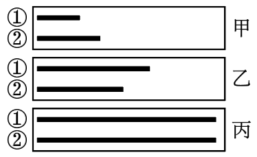

A. 据图分析，①和②延伸时均存在暂停现象

B. 甲时①中A、T之和与②中A、T之和可能相等

C. 丙时①中A、T之和与②中A、T之和一定相等

D. ②延伸方向为5'端至3'端，其模板链3'端指向解旋方向

【答案】D

【解析】

【分析】1、DNA的双螺旋结构：

\(1\) DNA分子是由两条反向平行的脱氧核苷酸长链盘旋而成的。

\(2\) DNA分子中的脱氧核糖和磷酸交替连接，排列在外侧，构成基本骨架，碱基在内侧。

(3)两条链上的碱基通过氢键连接起来，形成碱基对且遵循碱基互补配对原则。

2、 DNA分子复制的特点：半保留复制；边解旋边复制，两条子链的合成方向是相反的。

【详解】A、据图分析，图甲时新合成的单链①比②短，图乙时①比②长，因此可以说明①和②延伸时均存在暂停现象，A正确；

B、①和②两条链中碱基是互补，图甲时新合成的单链①比②短，但②中多出的部分可能不含有A、T，因此①中A、T之和与②中A、T之和可能相等，B正确；

C、①和②两条链中碱基是互补的，丙为复制结束时的图像，新合成的单链①与②等长，图丙时①中A、T之和与②中A、T之和一定相等，C正确；

D、①和②两条单链由一个双链DNA分子复制而来，其中一条母链合成子链时①的5'端指向解旋方向，那么另一条母链合成子链时②延伸方向为5'端至3'端，其模板链5'端指向解旋方向，D错误；

故选D。

6\. 减数分裂Ⅱ时，姐妹染色单体可分别将自身两端粘在一起，着丝粒分开后，2个环状染色体互锁在一起，如图所示。2个环状染色体随机交换一部分染色体片段后分开，分别进入2个子细胞，交换的部分大小可不相等，位置随机。某卵原细胞的基因组成为Ee，其减数分裂可形成4个子细胞。不考虑其他突变和基因被破坏的情况，关于该卵原细胞所形成子细胞的基因组成，下列说法正确的是（ ）

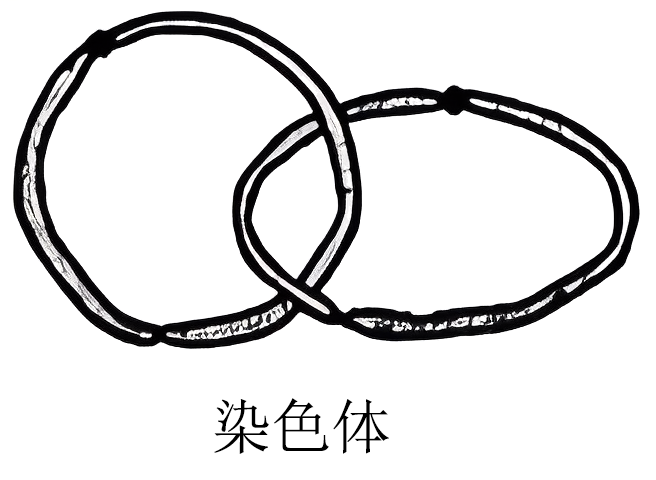

A. 卵细胞基因组成最多有5种可能

B. 若卵细胞为Ee，则第二极体可能为EE或ee

C. 若卵细胞为E且第一极体不含E，则第二极体最多有4种可能

D. 若卵细胞不含E、e且一个第二极体为E，则第一极体最多有3种可能

【答案】C

【解析】

【分析】减数分裂是有性生殖的生物产生生殖细胞时，从原始生殖细胞发展到成熟生殖细胞的过程。这个过程中DNA复制一次，细胞分裂两次，产生的生殖细胞中染色体数目是本物种体细胞中染色体数目的一半。

【详解】A、正常情况下，卵细胞的基因型可能为E或e，减数分裂Ⅱ时，姐妹染色单体上的基因为EE或ee，着丝粒（点）分开后，2个环状染色体互锁在一起，2个环状染色体随机交换一部分染色体片段后分开，卵细胞的基因型可能为EE、ee、\_\_（表示没有相应的基因），若减数第一次分裂时同源染色体中的非姐妹染色单体发生互换，卵细胞的基因组成还可以是Ee，卵细胞基因组成最多有6种可能，A错误；

B、不考虑其他突变和基因被破坏的情况，若卵细胞为Ee，则减数第一次分裂时同源染色体中的非姐妹染色单体发生互换，次级卵母细胞产生的第二极体基因型为\_\_，第一极体产生的第二极体可能为E、e或Ee和\_\_，B错误；

C、卵细胞为E，且第一极体不含E，说明未发生互换，次级卵母细胞产生的第二极体，为E，另外两个极体为e或ee、\_\_，C正确；

D、若卵细胞不含E、e且一个第二极体为E，若不发生交换，则第一极体为EE，若发生交换，则第1极体只能是Ee，综合以上，第一极体为Ee和EE两种，D错误。

故选C。

7\. 某种XY型性别决定的二倍体动物，其控制毛色的等位基因G、g只位于X染色体上，仅G表达时为黑色，仅g表达时为灰色，二者均不表达时为白色。受表观遗传的影响，G、g来自父本时才表达，来自母本时不表达。某雄性与杂合子雌性个体为亲本杂交，获得4只基因型互不相同的F1。亲本与F1组成的群体中，黑色个体所占比例不可能是（ ）

A. 2/3 B. 1/2 C. 1/3 D. 0

【答案】A

【解析】

【分析】生物体基因的碱基序列保持不变，但基因表达和表型发生可遗传变化的现象，叫作表观遗传。表观遗传的特点：①DNA的碱基序列不发生改变；②可以遗传给后代；③容易受环境的影响。

伴性遗传：位于性染色体上的基因所控制的性状，在遗传上总是和性别相关联的现象。

【详解】G、g只位于X染色体上，则该雄性基因型可能是XGY或XgY，杂合子雌性基因型为XGXg。

若该雄性基因型为XGY，与XGXg杂交产生的F1基因型分别为XGXG、XGXg、XGY、XgY，在亲本与F1组成的群体中，父本XGY的G基因来自于其母亲，因此G不表达，该父本呈现白色；当母本XGXg的G基因来自于其母亲，g基因来自于其父亲时，该母本的g基因表达，表现为灰色，当母本XGXg的g基因来自于其母亲，G基因来自于其父亲时，该母本的G基因表达，表现为黑色，因此母本表现型可能为灰色或黑色；F1中基因型为XGXG的个体必定有一个G基因来自于父本，G基因可以表达，因此F1中的XGXG表现为黑色；XGXg个体中G基因来自于父本，g基因来自于母本，因此G基因表达，g基因不表达，该个体表现为黑色；XGY的G基因来自于母本，G基因不表达，因此该个体表现为白色；XgY个体的g基因来自于母本，因此g基因不表达，该个体表现为白色，综上所述，在亲本杂交组合为XGY和XGXg的情况下，F1中的XGXG、XGXg一定表现为黑色，当母本XGXg也为黑色时，该群体中黑色个体比例为3/6，即1/2；当母本XGXg为灰色时，黑色个体比例为2/6，即1/3。

若该雄性基因型为XgY，与XGXg杂交产生的F1基因型分别为XGXg、XgXg、XGY、XgY，在亲本与F1组成的群体中，父本XgY的g基因来自于其母亲，因此不表达，该父本呈现白色；根据上面的分析可知，母本XGXg依然是可能为灰色或黑色；F1中基因型为XGXg的个体G基因来自于母本，g基因来自于父本，因此g表达，G不表达，该个体表现为灰色；XgXg个体的两个g基因必定有一个来自于父本，g可以表达，因此该个体表现为灰色；XGY的G基因来自于母本，G基因不表达，因此该个体表现为白色；XgY个体的g基因来自于母本，因此g基因不表达，该个体表现为白色，综上所述，在亲本杂交组合为XgY和XGXg的情况下，F1中所有个体都不表现为黑色，当母本XGXg为灰色时，该群体中黑色个体比例为0，当母本XGXg为黑色时，该群体中黑色个体比例为1/6。

综合上述两种情况可知，BCD不符合题意，A符合题意。

故选A。

8\. 肾上腺皮质分泌的糖皮质激素（GC）能提高心肌细胞肾上腺素受体的表达水平。体内GC的分泌过程存在负反馈调节。作为药物服用时，血浆中高浓度的GC能抑制淋巴细胞的增殖、分化。下列推断正确的是（ ）

A. GC可用于治疗艾滋病

B. GC分泌增加不利于提高人体的应激能力

C. GC作为药物长期服用可导致肾上腺皮质萎缩

D. 促肾上腺皮质激素释放激素可直接促进GC的分泌

【答案】C

【解析】

【分析】肾上腺皮质激素的分泌，受“下丘脑－垂体－肾上腺轴”的分级调节，即下丘脑分泌促肾上腺皮质激素释放激素，作用于垂体，使其分泌促肾上腺皮质激素，作用于肾上腺皮质，使其分泌肾上腺皮质激素。

【详解】A、艾滋病是由于HIV侵染免疫细胞导致的疾病，而高浓度的GC能抑制淋巴细胞的增殖、分化，因此GC不可用于治疗艾滋病，A错误；

B、GC能提高心肌细胞肾上腺素受体的表达水平，肾上腺素有利于提高人体的应激能力，B错误；

C、GC作为药物长期服用可导致相应的促肾上腺皮质激素释放减少，促肾上腺皮质激素还能促进肾上腺皮质的生长发育，因此长期服用GC会导致肾上腺皮质萎缩，C正确；

D、促肾上腺皮质激素释放激素可作用于垂体，使得垂体释放促肾上腺皮质激素，促肾上腺皮质激素作用于肾上腺皮质促进GC的分泌，D错误。

故选C

9\. 脊髓、脑干和大脑皮层中都有调节呼吸运动的神经中枢，其中只有脊髓呼吸中枢直接支配呼吸运动的呼吸肌，且只有脑干呼吸中枢具有自主节律性。下列说法错误的是（ ）

A. 只要脑干功能正常，自主节律性的呼吸运动就能正常进行

B. 大脑可通过传出神经支配呼吸肌

C. 睡眠时呼吸运动能自主进行体现了神经系统的分级调节

D. 体液中CO2浓度变化可通过神经系统对呼吸运动进行调节

【答案】A

【解析】

【分析】神经系统包括中枢神经系统和外周神经系统，中枢神经系统由脑和脊髓组成，脑分为大脑、小脑和脑干;外周神经系统包括脊神经、脑神经、自主神经，自主神经系统包括交感神经和副交感神经。

【详解】A、分析题意可知，只有脑干呼吸中枢具有自主节律性，而脊髓呼吸中枢直接支配呼吸运动的呼吸肌，故若仅有脑干功能正常而脊髓受损，也无法完成自主节律性的呼吸运动，A错误；

B、脑干和大脑皮层中都有调节呼吸运动的神经中枢，故脑可通过传出神经支配呼吸肌，B正确；

C、正常情况下，呼吸运动既能受到意识的控制，也可以自主进行，这反映了神经系统的分级调节，睡眠时呼吸运动能自主进行体现脑干对脊髓的分级调节，C正确；

D、CO2属于体液调节因子，体液中CO2浓度的变化可通过神经系统对呼吸运动进行调节：如二氧化碳浓度升高时，可刺激脑干加快呼吸频率，从而有助于二氧化碳排出，D正确。

故选A。

10\. 拟南芥的向光性是由生长素分布不均引起的，以其幼苗为实验材料进行向光性实验，处理方式及处理后4组幼苗的生长、向光弯曲情况如图表所示。由该实验结果不能得出的是（ ）

<table style="width:66%;">
<colgroup>
<col style="width: 23%" />
<col style="width: 6%" />
<col style="width: 13%" />
<col style="width: 11%" />
<col style="width: 11%" />
</colgroup>
<thead>
<tr>
<th rowspan="5">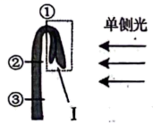</th>
<th>分组</th>
<th>处理</th>
<th>生长情况</th>
<th>弯曲情况</th>
</tr>
<tr>
<th>甲</th>
<th>不切断</th>
<th>正常</th>
<th>弯曲</th>
</tr>
<tr>
<th>乙</th>
<th>在①处切断</th>
<th>慢</th>
<th>弯曲</th>
</tr>
<tr>
<th>丙</th>
<th>在②处切断</th>
<th>不生长</th>
<th>不弯曲</th>
</tr>
<tr>
<th>丁</th>
<th>在③处切断</th>
<th>不生长</th>
<th>不弯曲</th>
</tr>
</thead>
<tbody>
</tbody>
</table>

A. 结构Ⅰ中有产生生长素的部位 B. ①②之间有感受单侧光刺激的部位

C. 甲组的①②之间有生长素分布不均的部位 D. ②③之间无感受单侧光刺激的部位

【答案】D

【解析】

【分析】植物向光性的原因是由于单侧光照射后，生长素发生横向运输，背光侧生长素浓度高于向光侧，导致生长素分布不均匀，背光侧生长速度比向光侧快，因而向光弯曲。

【详解】A、据表格和题图可知，不切断任何部位，该幼苗正常弯曲生长，但在①处切断，即去除结构Ⅰ，生长变慢，推测结构Ⅰ中有产生生长素的部位，A不符合题意；

BC、据表格可知，在①处切断，该幼苗缓慢生长且弯曲，而在②处切断后，该幼苗不能生长，推测①②之间含有生长素，且具有感光部位；推测可能是受到单侧光照射后，①②之间生长素分布不均，最终导致生长不均匀，出现弯曲生长，BC不符合题意；

D、在②处切断和在③处切断，两组实验结果相同：幼苗都不生长、不弯曲，说明此时不能产生生长素，也无法得出有无感受单侧光刺激的部位，D符合题意。

故选D。

11\. 对某地灰松鼠群体中某年出生的所有个体进行逐年观察，并统计了这些灰松鼠的存活情况，结果如图。下列说法正确的是（ ）

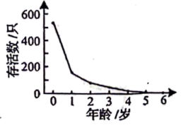

A. 所观察的这些灰松鼠构成一个种群

B. 准确统计该年出生的所有灰松鼠数量需用标记重捕法

C. 据图可推测出该地的灰松鼠种内竞争逐年减弱

D. 对灰松鼠进行保护时应更加关注其幼体

【答案】D

【解析】

【分析】种群是指同一区域内同种生物全部个体；标记重捕法是调查种群密度的一种估算法。

【详解】A、种群是指同一区域内同种生物的全部个体，根据题意“对某地灰松鼠群体中某年出生的所有个体进行逐年观察，并统计了这些灰松鼠的存活情况”可知，观察的并非是该地的全部灰松鼠，A错误；

B、标记重捕法是调查种群密度的一种估算法，若要准确统计该年出生的所有灰松鼠数量可采用逐个计数法，B错误；

C、图示为“某年出生的所有灰松鼠的逐年存活情况”，由图可知，随着灰松鼠年龄的增大，其存活率逐渐下降。但当地灰松鼠的种群数量未知，不能推断其种内竞争的情况，C错误；

D、据图可知幼体存活率下降较高，0-1年死亡个体较多，成年后死亡较少，对灰松鼠进行保护时应更加关注其幼体，D正确。

故选D。

12\. 以下是以泡菜坛为容器制作泡菜时的4个处理：①沸盐水冷却后再倒入坛中；②盐水需要浸没全部菜料；③盖好坛盖后，向坛盖边沿的水槽中注满水；④检测泡菜中亚硝酸盐的含量。下列说法正确的是（ ）

A. ①主要是为了防止菜料表面的醋酸杆菌被杀死

B. ②的主要目的是用盐水杀死菜料表面的杂菌

C. ③是为了使气体只能从泡菜坛排出而不能进入

D. ④可检测到完整发酵过程中亚硝酸盐含量逐渐降低

【答案】C

【解析】

【分析】泡菜的制作原理：泡菜的制作离不开乳酸菌。在无氧条件下，乳酸菌将葡萄糖分解成乳酸。

（1）泡菜的制作流程是：选择原料、配置盐水、调味装坛、密封发酵。

（2）选用火候好、无裂纹、无砂眼、坛沿深、盖子吻合好的泡菜坛。

（3）原料加工：将新鲜蔬菜修整、洗涤、晾晒、切分成条状或片状。

（4）配制盐水：按照比例配制盐水，并煮沸冷却。原因是为了杀灭杂菌，冷却之后使用是为了保证乳酸菌等微生物的生命活动不受影响。

（5）泡菜的制作：将经过预处理的新鲜蔬菜混合均匀，装入泡菜坛内，装至半坛时，放入蒜瓣、生姜及其他香辛料，继续装至八成满，再徐徐注入配制好的盐水，使盐水没过全部菜料，盖好坛盖。在坛盖边沿的水槽中注满水，以保证坛内乳酸菌发酵所需的无氧环境。在发酵过程中要注意经常补充水槽中的水。

【详解】A、盐水煮沸是为了杀灭杂菌，冷却之后使用是为了保证乳酸菌等微生物的生命活动不受影响，A错误；

B、②盐水需要浸没全部菜料，造成无氧环境，有利于乳酸菌无氧呼吸，B错误；

C、③盖好坛盖后，向坛盖边沿的水槽中注满水，是排气减压、隔绝空气、防止杂菌污染等，C正确；

D、④检测泡菜中亚硝酸盐的含量，腌制泡菜过程中亚硝酸盐的含量先增多后减少，D错误。

故选C。

13\. 某浅水泉微型生态系统中能量情况如表所示，该生态系统中的初级消费者以生产者和来自陆地的植物残体为食。下列说法正确的是（ ）

|  | 生产者固定 | 来自陆地的植物残体 | 初级消费者摄入 | 初级消费者同化 | 初级消费者呼吸消耗 |
|:--:|:--:|:--:|:--:|:--:|:--:|
| 能量［105J/（m2•a）］ | 90 | 42 | 84 | 13.5 | 3 |

A. 流经该生态系统的总能量为90×105J/（m2·a）

B. 该生态系统的生产者有15%的能量流入下一营养级

C. 初级消费者用于生长、发育和繁殖的能量为10.5×105J/（m2•a）

D. 初级消费者粪便中的能量为70.5×105J/（m2·a），该能量由初级消费者流向分解者

【答案】C

【解析】

【分析】生物摄入的能量一部分被同化，另一部分以粪便的形式被分解者利用；被同化的能量一部分被用于自身生长和繁殖，另一部分通过呼吸作用以热能的形式散出；被用于自身生长和繁殖的能量一部分以遗体、残骸的形式被分解者利用，另一部分以被下一营养级摄入。

【详解】A、该生态系统中的初级消费者以生产者和来自陆地的植物残体为食，因此可知，流经该生态系统的总能量为生产者固定的太阳能和来自陆地的植物残体中的能量，即90+42=132×105J/（m2·a），A错误；

B、表格中没有显示生产者流入到初级消费者的能量，因此无法计算有多少能量流入下一营养级，B错误；

C、初级消费者同化量为13.5×105J/（m2•a），初级消费者呼吸消耗能量为3×105J/（m2•a），因此初级消费者用于生长、发育和繁殖的能量=同化量-呼吸消耗能量=10.5×105J/（m2•a），C正确；

D、初级消费者摄入量包括粪便量和次级消费者同化量，同化量又包括呼吸作用以热能形式散失的量和用于生长、发育和繁殖的量，生长、发育和繁殖的量又分为流向下一营养级的量和被分解者利用的量，因此初级消费者粪便中的能量不会由初级消费者流向分解者，D错误。

故选C。

14\. 利用植物细胞培养技术在离体条件下对单个细胞或细胞团进行培养使其增殖，可获得植物细胞的某些次生代谢物。下列说法正确的是（ ）

A. 利用该技术可获得某些无法通过化学合成途径得到的产物

B. 植物细胞体积小，故不能通过该技术进行其产物的工厂化生产

C. 次生代谢物是植物所必需的，但含量少，应选择产量高的细胞进行培养

D. 该技术主要利用促进细胞生长的培养条件提高单个细胞中次生代谢物的含量

【答案】A

【解析】

【分析】由于植物细胞的次生代谢物含量很低，从植物组织提取会大量破坏植物资源，有些产物又不能或难以通过化学合成途径得到，因此人们期望利用植物细胞培养来获得目标产物，这个过程就是细胞产物的工厂化生产。

【详解】A、有些产物不能或难以通过化学合成途径得到，故可利用该技术可获得某些无法通过化学合成途径得到的产物，A正确；

B、利用植物细胞培养技术在离体条件下对单个细胞或细胞团进行培养使其增殖，可获得植物细胞的某些次生代谢物，故可通过该技术进行植物细胞产物的工厂化生产，B错误；

C、次生代谢物不是植物生长所必需的，其含量少，可以通过增加细胞的数量来增加次生代谢产物的产量，C错误；

D、细胞产物的工厂化生产主要是利用促进细胞分裂的培养条件，提高了多个细胞中次生代谢物的含量，不能提高单个细胞中次生代谢物的含量，D错误。

故选A。

15\. 平板接种常用在微生物培养中。下列说法正确的是（ ）

A. 不含氮源的平板不能用于微生物培养

B 平板涂布时涂布器使用前必须进行消毒

C. 接种后未长出菌落的培养基可以直接丢弃

D. 利用以尿素为唯一氮源的平板能分离出合成脲酶的微生物

【答案】D

【解析】

【分析】1、培养基是人们按照微生物对营养物质的不同需求，配制出供其生长繁殖的营养基质，是进行微生物培养的物质基础。

2、按照培养基的用途，可将培养基分为选择培养基和鉴定培养基。选择培养基是指在培养基中加入某种化学物质，以抑制不需要的微生物生长，促进所需要的微生物的生长。

3、消毒和灭菌是两个不同的概念，消毒是指使用较为温和的物理、化学或生物的方法杀死物体表面或内部的一部分微生物。灭菌则是指使用强烈的理化方法杀死物体内外所有的微生物，包括芽孢和孢子。

【详解】A、不含氮源的平板可用于固氮菌的培养，A错误；

B、平板涂布时涂布器使用前必须浸在酒精中，然后在火焰上灼烧灭菌，这种操作属于灭菌，不属于消毒，B错误；

C、使用后的培养基即使未长出菌落也要在丢弃前进行灭菌处理，不能直接丢弃，以免污染环境，C错误；

D、脲酶可以催化尿素分解，在以尿素为唯一氮源的平板上，能合成脲酶的微生物可以分解尿素获得氮源而进行生长繁殖，但是不能合成脲酶的微生物因缺乏氮源而无法生长，因此以尿素为唯一氮源的平板能分离出合成脲酶的微生物，D正确。

故选D。

**二、选择题：本题共5小题，每小题3分，共15分。每小题有一个或多个选项符合题目要求，全部选对得3分，选对但不全的得1分，有选错的得0分。**

16\. 神经细胞的离子跨膜运输除受膜内外离子浓度差影响外，还受膜内外电位差的影响。已知神经细胞膜外的Cl-浓度比膜内高。下列说法正确的是（ ）

A. 静息电位状态下，膜内外电位差一定阻止K+的外流

B. 突触后膜的Cl-通道开放后，膜内外电位差一定增大

C. 动作电位产生过程中，膜内外电位差始终促进Na+的内流

D. 静息电位→动作电位→静息电位过程中，不会出现膜内外电位差为0的情况

【答案】AB

【解析】

【分析】1、静息时，神经细胞膜对钾离子的通透性大，钾离子大量外流，形成内负外正的静息电位；受到刺激后，神经细胞膜的通透性发生改变，对钠离子的通透性增大，钠离子内流，形成内正外负的动作电位，兴奋部位和非兴奋部位形成电位差，产生局部电流，兴奋传导的方向与膜内电流方向一致。

2、兴奋在神经元之间需要通过突触结构进行传递，突触包括突触前膜、突触间隙、突触后膜，其具体的传递过程为：兴奋以电流的形式传导到轴突末梢时，突触小泡释放递质（化学信号），递质作用于突触后膜，引起突触后膜产生膜电位（电信号），从而将兴奋传递到下一个神经元。

【详解】A、静息电位状态下，K+外流导致膜外为正电，膜内为负电，膜内外电位差阻止了K+的继续外流，A正确；

B、静息电位时的电位表现为外正内负，突触后膜的Cl-通道开放后，Cl-内流，导致膜内负电位的绝对值增大，则膜内外电位差增大，B正确；

C、动作电位产生过程中，膜内外电位差促进Na+的内流，当膜内变为正电时则抑制Na+的继续内流，C错误；

D、静息电位→动作电位→静息电位过程中，膜电位的变化为，由外正内负变为外负内正，再变为外正内负，则会出现膜内外电位差为0的情况，D错误。

故选AB。

17\. 某种植株的非绿色器官在不同O2浓度下，单位时间内O2吸收量和CO2释放量的变化如图所示。若细胞呼吸分解的有机物全部为葡萄糖，下列说法正确的是（ ）

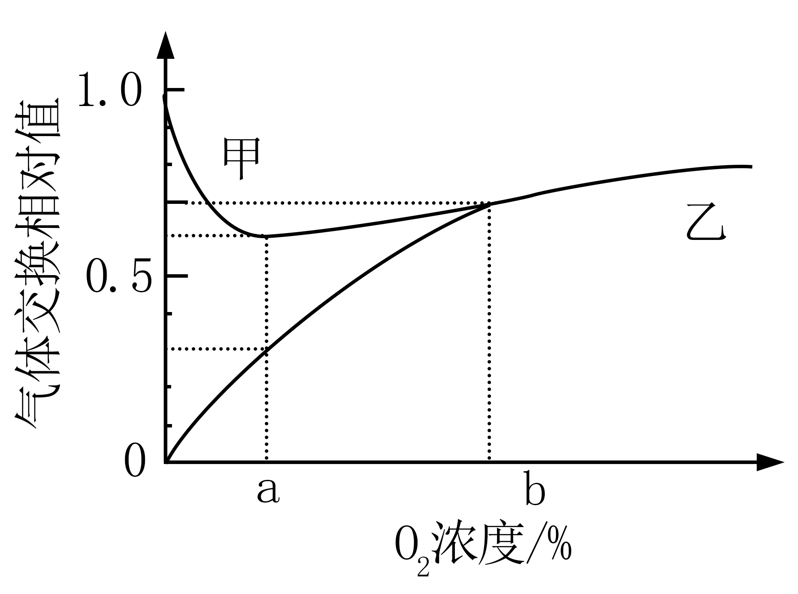

A. 甲曲线表示O2吸收量

B. O2浓度为b时，该器官不进行无氧呼吸

C. O2浓度由0到b的过程中，有氧呼吸消耗葡萄糖的速率逐渐增加

D. O2浓度为a时最适合保存该器官，该浓度下葡萄糖消耗速率最小

【答案】BC

【解析】

【分析】据图分析，甲曲线表示二氧化碳释放量，乙曲线表示氧气吸收量。氧浓度为0时，细胞只释放CO2不吸收O2，说明细胞只进行无氧呼吸；图中氧浓度为a时CO2的释放量大于O2的吸收量，说明既进行有氧呼吸又进行无氧呼吸；贮藏植物器官应选择CO2产生量最少即细胞呼吸最弱时的氧浓度。

【详解】A、分析题意可知，图中横坐标是氧气浓度，据图可知，当氧气浓度为0时，甲曲线仍有释放，说明甲表示二氧化碳的释放量，乙表示氧气吸收量，A错误；

B、O2浓度为b时，两曲线相交，说明此时氧气的吸收量和二氧化碳的释放量相等，细胞呼吸分解的有机物全部为葡萄糖，故此时植物只进行有氧呼吸，不进行无氧呼吸，B正确；

C、O2浓度为0时，植物只进行无氧呼吸，氧气浓度为a时，植物同时进行有氧呼吸和无氧呼吸，氧气浓度为b时植物只进行有氧呼吸，故O2浓度由0到b的过程中，有氧呼吸消耗葡萄糖的速率逐渐增加，C正确；

D、O2浓度为a时并非一定最适合保存该器官，因为无氧呼吸会产生酒精，不一定能满足某些生物组织的储存，且该浓度下葡萄糖的消耗速率一定不是最小， 据图，此时气体交换相对值 CO2为0.6，O2为0.3，其中CO2有0.3是有氧呼吸产生，0.3是无氧呼吸产生。 按有氧C6 : O2 : CO2=1:6:6，无氧呼吸C6:CO2=1:2，算得C6（葡萄糖）的相对消耗量为0.05+0.15=0.2。 而无氧呼吸消失点时，O2和CO2的相对值为0.6，算得C6的相对消耗量为0.1，明显比a点时要低！所以a点时葡萄糖的消耗速率一定不是最小，D错误。

故选BC。

18\. 某二倍体动物的性染色体仅有X染色体，其性别有3种，由X染色体条数及常染色体基因T、TR、TD决定。只要含有TD基因就表现为雌性，只要基因型为TRTR就表现为雄性。TT和TTR个体中，仅有1条X染色体的为雄性，有2条X染色体的既不称为雄性也不称为雌性，而称为雌雄同体。已知无X染色体的胚胎致死，雌雄同体可异体受精也可自体受精。不考虑突变，下列推断正确的是（ ）

A. 3种性别均有的群体自由交配，F1的基因型最多有6种可能

B. 两个基因型相同的个体杂交，F1中一定没有雌性个体

C. 多个基因型为TDTR、TRTR的个体自由交配，F1中雌性与雄性占比相等

D. 雌雄同体的杂合子自体受精获得F1，F1自体受精获得到的F2中雄性占比为1/6

【答案】BCD

【解析】

【分析】假设只有一条X染色体的个体基因型为XO，由题意分析可知：雌性动物的基因型有TDTRX\_、TDTX_4种；雄性动物的基因型有TRTRX\_、TTXO、TTRXO4种；雌雄同体的基因型有TTXX、TTRXX两种。

【详解】A、假设只有一条X染色体的个体基因型为XO，由题意分析可知：雌性动物的基因型有TDTRX\_、TDTX_4种；雄性动物的基因型有TRTRX\_、TTXO、TTRXO4种；雌雄同体的基因型有TTXX、TTRXX两种。若3种性别均有的群体自由交配，F1的基因型最多有10种可能，A错误；

B、雌性动物的基因型有TDTRX\_、TDTX_4种，若后代中有雌性个体，说明亲本一定含有TD，含有TD且基因型相同的两个个体均为雌性，不能产生下一代，B正确；

C、多个基因型为TDTR、TRTR的个体自由交配，雌配子有TD、TR两种；雄配子仅TR一种，F1中雌性（TDTR）与雄性（TRTR）占比相等，C正确；

D、雌雄同体的杂合子（基因型为TTRXX）自体受精获得F1，F1基因型为1/4TTXX（雌雄同体）、1/2TTRXX（雌雄同体）、1/4TRTRXX(雄性)，只有1/4TTXX（雌雄同体）、1/2TTRXX（雌雄同体）才能自体受精获得F2 ，即1/3TTXX（雌雄同体）、2/3TTRXX（雌雄同体）自体受精产生下一代雄性（TRTRXX）的比例为2/3×1/4=1/6，D正确。

故选BCD。

19\. 某种动物的种群具有阿利效应，该动物的种群初始密度与种群增长速率之间的对应关系如图所示。其中种群增长速率表示单位时间增加的个体数。下列分析正确的是（ ）

A. 初始密度介于0~a时，种群数量最终会降为0

B. 初始密度介于a~c时，种群出生率大于死亡率

C. 将种群保持在初始密度c所对应的种群数量，有利于持续获得较大的捕获量

D. 若自然状态下该动物种群雌雄数量相等，人为提高雄性占比会使b点左移

【答案】AC

【解析】

【分析】阿利效应，群聚有利于种群的增长和存活，但过分稀疏和过分拥挤都可阻止生长，并对生殖发生负作用，每种生物都有自己的最适密度。许多小种群不稳定，一旦种群密度低于某一水平，种群的相互作用就会消减。

【详解】A、初始密度介于0~a时，即种群密度小于种群生长的最适密度，对种群的生长起到阻止作用，因而种群数量最终会降为0，A正确；

B、初始密度介于a~c时，应分两段来分析。在种群数量小于b时，其死亡率大于出生率，当种群数量大于b时，其出生率大于死亡率，表现为种群数量上升，B错误；

C、将种群保持在初始密度c所对应的种群数量，此时种群增长率最大，同时在种群密度高于c时进行捕获并保留在c，有利于持续获得较大的捕获量，C正确；

D、自然状态下雌雄数量相等，从性别比例上看最有利于种群繁殖，此时人为提高雄性比例，会造成一定程度上的性别比例失调，不利于种群密度增长，使种群增长速率减小；即人为提高雄性比例时，需要更大的种群密度才能弥补，使种群增长率维持到0而不为负，即此时b点右移，D错误。

故选AC。

20\. 果酒的家庭制作与啤酒的工业化生产相比，共同点有（ ）

A. 都利用了酵母菌无氧呼吸产生酒精的原理 B. 都需要一定的有氧环境供发酵菌种繁殖

C. 发酵前都需要对原料进行灭菌 D. 发酵结束后都必须进行消毒以延长保存期

【答案】AB

【解析】

【分析】果酒与啤酒的发酵原理均是酵母菌在无氧条件下进行无氧呼吸产生酒精。

【详解】A、二者均利用了酵母菌进行无氧呼吸产生酒精的原理，A正确；

B、发酵前期，均需要一定的有氧环境，使酵母菌大量繁殖，B正确；

C、果酒的家庭制作不需对原料进行灭菌，C错误；

D、果酒的家庭制作不需要进行消毒，D错误。

故选AB。

**三、非选择题：本题共5小题，共55分。**

21\. 当植物吸收的光能过多时，过剩的光能会对光反应阶段的PSⅡ复合体（PSⅡ）造成损伤，使PSⅡ活性降低，进而导致光合作用强度减弱。细胞可通过非光化学淬灭（NPQ）将过剩的光能耗散，减少多余光能对PSⅡ的损伤。已知拟南芥的H蛋白有2个功能：①修复损伤的PSⅡ；②参与NPQ的调节。科研人员以拟南芥的野生型和H基因缺失突变体为材料进行了相关实验，结果如图所示。实验中强光照射时对野生型和突变体光照的强度相同，且强光对二者的PSⅡ均造成了损伤。

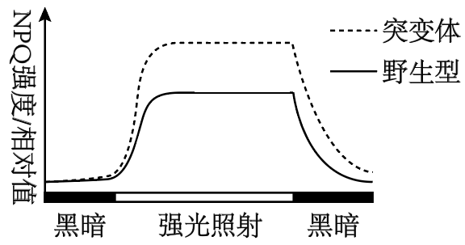

（1）该实验的自变量为\_\_\_\_\_\_。该实验的无关变量中，影响光合作用强度的主要环境因素有\_\_\_\_\_\_\_\_\_（答出2个因素即可）。

（2）根据本实验，\_\_\_\_（填“能”或“不能”）比较出强光照射下突变体与野生型的PSⅡ活性强弱，理由是\_\_\_\_\_\_\_\_\_\_。

（3）据图分析，与野生型相比，强光照射下突变体中流向光合作用的能量\_\_\_\_\_\_\_\_\_\_（填“多”或“少”）。若测得突变体的暗反应强度高于野生型，根据本实验推测，原因是\_\_\_\_\_\_\_\_\_\_。

【答案】（1） ①. 光、H蛋白 ②. CO2浓度、温度

（2） ①. 不能 ②. 突变体PS11系统光损伤小但不能修复，野生型光PS11系统损伤大但能修复

（3） ①. 少\
②. 突变体PNQ高，PS11系统损伤小，虽然损伤不能修复，但是PS11活性高，光反应产物多

【解析】

【分析】光合作用过程：

（1）光反应场所在叶绿体类囊体薄膜，发生水的光解、ATP和NADPH的生成；

（2）暗反应场所在叶绿体的基质，发生CO2的固定和C3的还原，消耗ATP和NADPH。

【小问1详解】

据题意拟南芥的野生型和H基因缺失突变体为材料进行了相关实验，实验中强光照射时对野生型和突变体光照的强度相同，结合题图分析实验的自变量有光照、H蛋白；影响光合作用强度的主要环境因素有CO2浓度、温度、水分等。

【小问2详解】

据图分析，强光照射下突变体的NPQ/相对值比野生型的NPQ/相对值高，能减少强光对PSⅡ复合体造成损伤。但是野生型含有H蛋白，能对损伤后的PSⅡ进行修复，故不能确定强光照射下突变体与野生型的PSⅡ活性强弱。

【小问3详解】

据图分析，强光照射下突变体中NPQ/相对值，而NPQ能将过剩的光能耗散，从而使流向光合作用的能量减少；突变体的NPQ强度大，能够减少强光对PSII的损伤且减少作用大于野生型H蛋白的修复作用，这样导致突变体的PSⅡ活性高，能为暗反应提供较多的NADPH和ATP促进暗反应进行，因此突变体的暗反应强度高于野生型。

22\. 研究显示，糖尿病患者由于大脑海马神经元中蛋白Tau过度磷酸化，导致记忆力减退。细胞自噬能促进过度磷酸化的蛋白Tau降解，该过程受蛋白激酶cPKCγ的调控。为探究相关机理，以小鼠等为材料进行了以下实验。

实验I：探究高糖环境和蛋白激酶cPKCγ对离体小鼠海马神经元自噬的影响。配制含有5mmol/L葡萄糖的培养液模拟正常小鼠的体液环境。将各组细胞分别置于等量培养液中，A组培养液不处理，B组培养液中加入75mmol/L的X试剂1mL，C组培养液中加入75mmol/L葡萄糖溶液1mL。实验结果见图甲。

实验Ⅱ：通过水迷宫实验检测小鼠的记忆能力，连续5天测量4组小鼠的逃避潜伏期，结果见图乙。逃避潜伏期与记忆能力呈负相关，实验中的糖尿病记忆力减退模型小鼠（TD小鼠）通过注射药物STZ制备。

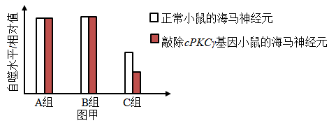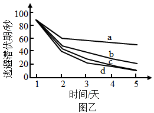

（1）人体中血糖的来源有\_\_\_\_\_\_\_\_（答出2个方面的来源即可）。已知STZ是通过破坏某种细胞引起了小鼠血糖升高，据此推测，这种细胞是\_\_\_\_\_\_\_\_\_\_。

（2）实验I的C组中，在含5mmol/L葡萄糖的培养液中加入75mmo/L葡萄糖溶液后，细胞吸水、体积变大，说明加入该浓度葡萄糖溶液后培养液的渗透压\_\_\_\_\_\_\_\_\_\_（填“升高”或“降低”），B组实验结果可说明渗透压的变化对C组结果\_\_\_\_\_\_\_\_\_\_（填“有”或“没有”）干扰。图甲中A组和C组的实验结果说明蛋白激酶cPKCγ对海马神经元自噬水平的影响是\_\_\_\_\_\_\_\_\_\_\_

（3）图乙中a、b两条曲线所对应的实验动物分别是\_\_\_\_\_\_\_\_\_\_\_\_（填标号）。

①正常小鼠 ②敲除cPKCγ基因的小鼠 ③TD小鼠 ④敲除cPKCγ基因的TD小鼠

（4）对TD小鼠进行干预后，小鼠的记忆能力得到显著提高。基于本研究，写出2种可能的干预思路：\_\_\_\_\_\_。

【答案】（1） ①. 食物中糖类的消化吸收、肝糖原分解、脂肪等非糖物质转化 ②. 胰岛B细胞

（2） ①. 降低 ②. 没有 ③. 在葡萄糖浓度正常时，蛋白激酶cPKr对自噬水平无明显影响；在高浓度葡萄糖条件下，蛋白激酶cPKr能提高细胞自噬水平 （3）④③

（4）①抑制Tau磷酸化\
②提高蛋白激酶cPKr的活性；降低血糖（注射胰岛素）；提高自噬水平

【解析】

【分析】由图乙可知，a曲线变化平缓，应对应正常小鼠，b曲线变化相对快些，应对应TD小鼠，但cPKCγ基因正常，所以缓于cd两曲线。

【小问1详解】

人体中血糖可通过食物中糖类的消化吸收、肝糖原分解、脂肪等非糖物质转化提供。某种细胞破坏而导致血糖升高，说明胰岛素分泌不足，推测这种细胞为胰岛B细胞。

【小问2详解】

在含5mmol/L葡萄糖的培养液中加入75mmo/L葡萄糖溶液后，细胞吸水、体积变大，说明加入该浓度葡萄糖溶液后培养液的渗透压降低。B组较A组而言，自噬水平相对值不变，说明渗透压的变化对C组结果没有干扰。由题意可知，细胞自噬能促进过度磷酸化的蛋白Tau降解，该过程受蛋白激酶cPKCγ的调控，三组的实验结果说明在葡萄糖浓度正常时，蛋白激酶cPKr对自噬水平无明显影响；在高浓度葡萄糖条件下，蛋白激酶cPKr能提高细胞自噬水平。

【小问3详解】

逃避潜伏期与记忆能力呈负相关，图乙中a、b两条曲线逃避潜伏期较长，说明记忆力较差。蛋白Tau过度磷酸化，导致记忆力减退，细胞自噬能促进过度磷酸化的蛋白Tau降解。由（2）可知，蛋白激酶cPKCγ促进海马神经元自噬，所以敲除cPKCγ基因后，细胞自噬过程受阻，记忆力减退。图中a曲线逃避潜伏期最长长，说明记忆力最差，对应敲除cPKCγ基因的TD小鼠，b曲线对应TD小鼠，其cPKCγ基因正常，逃避潜伏期低于敲除cPKCγ基因的TD小鼠。d对应正常小鼠，C组对应敲除cPKCγ基因的小鼠。

【小问4详解】

由题意可知，由于糖尿病导致小鼠记忆力减退，所以可通过注射胰岛素降低血糖使小鼠记忆力得到提高，也可通过抑制Tau磷酸化、提高蛋白激酶cPKr的活性、或使cPKCγ基因过量表达，提高自噬水平达到提升记忆力的作用。

23\. 单个精子的DNA提取技术可解决人类遗传学研究中因家系规模小而难以收集足够数据的问题。为研究4对等位基因在染色体上的相对位置关系，以某志愿者的若干精子为材料，用以上4对等位基因的引物，以单个精子的DNA为模板进行PCR后，检测产物中的相关基因，检测结果如表所示。已知表中该志愿者12个精子的基因组成种类和比例与该志愿者理论上产生的配子的基因组成种类和比例相同；本研究中不存在致死现象，所有个体的染色体均正常，各种配子活力相同。

<table style="width:44%;">
<colgroup>
<col style="width: 4%" />
<col style="width: 6%" />
<col style="width: 4%" />
<col style="width: 4%" />
<col style="width: 3%" />
<col style="width: 3%" />
<col style="width: 4%" />
<col style="width: 4%" />
<col style="width: 3%" />
<col style="width: 3%" />
</colgroup>
<thead>
<tr>
<th colspan="2">等位基因</th>
<th>A</th>
<th>a</th>
<th>B</th>
<th>b</th>
<th>D</th>
<th>d</th>
<th>E</th>
<th>e</th>
</tr>
</thead>
<tbody>
<tr>
<td rowspan="12">
单

个

精

子

编

号
</td>
<td style="text-align: center;">1</td>
<td></td>
<td>+</td>
<td>+</td>
<td></td>
<td></td>
<td>+</td>
<td></td>
<td></td>
</tr>
<tr>
<td style="text-align: center;">2</td>
<td></td>
<td>+</td>
<td>+</td>
<td></td>
<td></td>
<td>+</td>
<td></td>
<td>+</td>
</tr>
<tr>
<td style="text-align: center;">3</td>
<td></td>
<td>+</td>
<td>+</td>
<td></td>
<td></td>
<td>+</td>
<td></td>
<td></td>
</tr>
<tr>
<td style="text-align: center;">4</td>
<td></td>
<td>+</td>
<td>+</td>
<td></td>
<td></td>
<td>+</td>
<td></td>
<td>+</td>
</tr>
<tr>
<td style="text-align: center;">5</td>
<td></td>
<td>+</td>
<td>+</td>
<td></td>
<td>+</td>
<td></td>
<td></td>
<td></td>
</tr>
<tr>
<td style="text-align: center;">6</td>
<td></td>
<td>+</td>
<td>+</td>
<td></td>
<td>+</td>
<td></td>
<td></td>
<td>+</td>
</tr>
<tr>
<td style="text-align: center;">7</td>
<td>+</td>
<td></td>
<td></td>
<td>+</td>
<td></td>
<td>+</td>
<td></td>
<td></td>
</tr>
<tr>
<td style="text-align: center;">8</td>
<td>+</td>
<td></td>
<td></td>
<td>+</td>
<td></td>
<td>+</td>
<td></td>
<td>+</td>
</tr>
<tr>
<td style="text-align: center;">9</td>
<td>+</td>
<td></td>
<td></td>
<td>+</td>
<td>+</td>
<td></td>
<td></td>
<td></td>
</tr>
<tr>
<td style="text-align: center;">10</td>
<td>+</td>
<td></td>
<td></td>
<td>+</td>
<td>+</td>
<td></td>
<td></td>
<td>+</td>
</tr>
<tr>
<td style="text-align: center;">11</td>
<td>+</td>
<td></td>
<td></td>
<td>+</td>
<td>+</td>
<td></td>
<td></td>
<td></td>
</tr>
<tr>
<td style="text-align: center;">12</td>
<td>+</td>
<td></td>
<td></td>
<td>+</td>
<td>+</td>
<td></td>
<td></td>
<td>+</td>
</tr>
</tbody>
</table>

注“+”表示有；空白表示无

（1）表中等位基因A、a和B、b的遗传\_\_\_\_\_\_\_（填“遵循”或“不遵循”）自由组合定律，依据是\_\_\_\_\_。据表分析，\_\_\_\_\_\_\_\_（填“能”或“不能”）排除等位基因A、a位于X、Y染色体同源区段上。

（2）已知人类个体中，同源染色体的非姐妹染色单体之间互换而形成的重组型配子的比例小于非重组型配子的比例。某遗传病受等位基因B、b和D、d控制，且只要有1个显性基因就不患该病。该志愿者与某女性婚配，预期生一个正常孩子的概率为17/18，据此画出该女性的这2对等位基因在染色体上的相对位置关系图：\_\_\_\_\_\_\_\_\_。（注：用“”形式表示，其中横线表示染色体，圆点表示基因在染色体上的位置）。

（3）本研究中，另有一个精子的检测结果是：基因A、a，B、b和D、d都能检测到。已知在该精子形成过程中，未发生非姐妹染色单体互换和染色体结构变异。从配子形成过程分析，导致该精子中同时含有上述6个基因的原因是\_\_\_\_\_\_\_\_\_\_。

（4）据表推断，该志愿者的基因e位于\_\_\_\_\_\_\_\_\_\_染色体上。现有男、女志愿者的精子和卵细胞各一个可供选用，请用本研究的实验方法及基因E和e的引物，设计实验探究你的推断。

①应选用的配子为：\_\_\_\_\_\_\_\_\_\_\_；②实验过程：略；③预期结果及结论：\_\_\_\_\_\_\_。

【答案】（1） ①. 不遵循 ②. 结合表中信息可以看出，基因型为aB∶Ab=1∶1，因而可推测，等位基因A、a和B、b位于一对同源染色体上。 ③. 能

（2）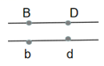 （3）形成该精子的减数第一次分裂后期这三对等位基因所在的染色体没有正常分离而是进入到同一个次级精母细胞中，此后该次级精母细胞进行正常的减数第二次分裂导致的

（4） ①. X或Y ②. 卵细胞 ③. 若检测的卵细胞中有E或e基因，则可得出基因Ee位于X染色体上；若检测的卵细胞中无E或e基因，则可得出基因Ee位于Y染色体上

【解析】

【分析】基因自由组合定律的实质是：位于非同源染色体上的非等位基因的分离或自由组合是互不干扰的；在减数分裂过程中，同源染色体上的等位基因彼此分离的同时，非同源染色体上的非等位基因自由组合。

【小问1详解】

题中显示，表中该志愿者12个精子的基因组成种类和比例与该志愿者理论上产生的配子的基因组成种类和比例相同，结合表中信息可以看出，基因型为aB∶Ab=1∶1，因而可推测，等位基因A、a和B、b位于一对同源染色体上，因而其遗传“不遵循”自由组合定律。表中显示含有e的配子和不含e的配子的比例表现为1∶1，因而可推测e基因位于X或Y染色体上，根据表中精子类型和比例可以看出，A、a与E、e这两对等位基因表现为自由组合，因而能排除等位基因A、a位于X、Y染色体同源区段上。

【小问2详解】

统计结果显示，该志愿者关于B、b和D、d的配子比例为Bd∶bD∶BD∶bd=2∶2∶1∶1，某遗传病受等位基因B、b和D、d控制，且只要有1个显性基因就不患该病。该志愿者与某女性婚配，预期生一个正常孩子的概率为17/18，即生出患病孩子bbdd的概率为1/18=1/6×1/3，说明该女性产生bd的卵细胞的比例为1/3，则BD配子比例也为1/3，二者共占2/3，均属于非重组型配子，说明该女性体内的相关基因处于连锁关系，即应该为B和D连锁，b和d连锁，据此画出该女性的这2对等位基因在染色体上的相对位置关系图如下：

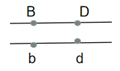 【小问3详解】

根据表中的精子种类和比例可知，等位基因型A/a，B/b和D/d为连锁关系，而异常精子的形成过程中，未发生非姐妹染色单体互换和染色体结构变异。则从配子形成过程分析，导致该精子中同时含有上述6个基因的原因是形成该精子的减数分裂中，减数第一次分裂后期这三对等位基因所在的染色体没有正常分离而是进入到同一个次级精母细胞中，此后该次级精母细胞进行正常的减数第二次分裂导致的。

【小问4详解】

根据题（1）分析，该志愿者的基因e位于X或Y染色体上。现有男、女志愿者的精子和卵细胞各一个可供选用，由于要用本研究的实验方法，且选用男性的精子无法确定等位基因位于X染色体还是Y染色体，因此应该选择女志愿者的卵细胞进行实验。用E和e的引物，以卵细胞的DNA为模板进行PCR后，检测产物中的相关基因。③若检测的卵细胞中有E或e基因，则可得出基因E/e位于X染色体上；若检测的卵细胞中无E或e基因，则可得出基因E/e位于Y染色体上。

24\. 研究群落中植物类群的丰富度时；不仅要统计物种数，还要统计物种在群落中的相对数量。群落中某一种植物的个体数占该群落所有植物个体数的百分比可用相对多度表示。在某退耕农田自然演替过程中，植物物种甲、乙和丙分别在不同阶段占据优势，它们的相对多度与演替时间的关系如图所示。

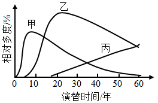

（1）该群落演替与在火山岩上进行的群落演替相比，除了演替起点的不同，区别还在于该群落演替类型\_\_\_\_\_\_\_\_\_\_\_\_\_\_（答出2点区别即可）

（2）在研究该群落植物类群丰富度的过程中，统计丙的相对数量采用了记名计算法。根据记名计算法适用对象的特点分析，丙的特点是\_\_\_\_\_\_\_\_\_\_\_。

（3）据图分析，第30年至第50年乙种群密度的变化是\_\_\_\_\_\_\_\_\_\_\_（填“增大”“减小”或“不能确定”），原因是\_\_\_\_\_\_\_\_\_\_\_\_\_。

（4）该农田退耕前后的变化，说明人类活动对群落演替的影响是\_\_\_\_\_\_\_\_\_\_\_\_。

【答案】（1）时间短，速度较快

（2）个体较大，种群数量有限

（3） ①. 不能确定 ②. 由于30-50年丙的相对多度在增加，故无法确定该群落总的植物个体数的变化，相应的，虽然乙植物占比（相对多度）在减小，但无法确定其具体的种群密度在减小，可能只是丙个体数目增加的更快，占比更多，优势取代

（4）人类活动会使群落演替按照不同于自然演替的方向和速度进行

【解析】

【分析】初生演替：是指一个从来没有被植物覆盖的地面，或者是原来存在过植被，但是被彻底消灭了的地方发生的演替。初生演替的一般过程是裸岩阶段→地衣阶段→苔藓阶段→草本植物阶段→灌木阶段→森林阶段。

次生演替：原来有的植被虽然已经不存在，但是原来有的土壤基本保留，甚至还保留有植物的种子和其他繁殖体的地方发生的演替，次生演替的一般过程是草本植物阶段→灌木阶段→森林阶段。

【小问1详解】

退耕农田自然演替是在有一定植被的基础上进行的，为次生演替，火山岩上进行的群落演替为初生演替。初生演替比次生演替经历的时间长，速度较缓慢，次生演替的影响因素是要是人类活动，而初生演替的影响因素是自然元素。

【小问2详解】

记名计算法是指在一定面积的样地中，直接数出各种群的个体数目，这一般用于个体较大、种群数量有限的群落。

【小问3详解】

群落中某一种植物的个体数占该群落所有植物个体数的百分比可用相对多度表示，第30年至第50年乙种群的相对多度下降，图中纵坐标为相对多度，是该种植物个体数所占百分比，而不是具体的数目，其变化无法直接反映种群密度的变化。由于30-50年丙的相对多度在增加，故无法确定该群落总的植物个体数的变化，相应的，虽然乙植物占比（相对多度）在减小，但无法确定其具体的种群密度在减小，可能只是丙个体数目增加的更快，占比更多，优势取代。

【小问4详解】

该农田退耕前后的变化，说明人类活动往往会使群落演替按照不同于自然演替的方向和速度进行。

25\. 科研人员构建了可表达J-V5融合蛋白的重组质粒并进行了检测，该质粒的部分结构如图甲所示，其中V5编码序列表达标签短肽V5。

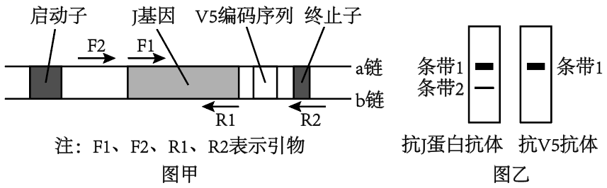

（1）与图甲中启动子结合的酶是\_\_\_\_\_\_\_\_\_\_\_\_。除图甲中标出的结构外，作为载体，质粒还需具备的结构有\_\_\_\_\_\_\_\_\_\_\_\_\_\_\_\_（答出2个结构即可）。

（2）构建重组质粒后，为了确定J基因连接到质粒中且插入方向正确，需进行PCR检测，若仅用一对引物，应选择图甲中的引物\_\_\_\_\_\_\_\_\_\_\_。已知J基因转录的模板链位于b链，由此可知引物F1与图甲中J基因的\_\_\_\_\_\_\_\_\_\_\_\_\_（填“a链”或“b链”）相应部分的序列相同。

（3）重组质粒在受体细胞内正确表达后，用抗J蛋白抗体和抗V5抗体分别检测相应蛋白是否表达以及表达水平，结果如图乙所示。其中，出现条带1证明细胞内表达了\_\_\_\_\_\_\_\_\_\_，条带2所检出的蛋白\_\_\_\_\_\_\_\_\_\_\_\_\_\_（填“是”或“不是”）由重组质粒上的J基因表达的。

【答案】（1） ①. RNA聚合酶 ②. 限制酶切割位点、标记基因、复制原点等

（2） ①. F2和R1或F1与R2\
②. a链

（3） ①. J-V5融合蛋白 ②. 不是

【解析】

【分析】基因工程的关键步骤是构建基因表达载体，基因表达载体主要由启动子、目的基因、标记基因和终止子组成，其中标记基因用于筛选重组DNA分子，可以是四环素、氨苄青霉素等抗性基因，也可以是荧光蛋白基因或产物能显色的基因。

【小问1详解】

基因表达载体的构建启动子是为了启动下游基因的“表达”，表达首先需要转录，因此RNA聚合酶识别和结合的部位才是转录的起始。作为运载体必须具备的条件：①要具有限制酶的切割位点；②要有标记基因（如抗性基因），以便于重组后重组子的筛选；③能在宿主细胞中稳定存在并复制；④是安全的，对受体细胞无害，而且要易从供体细胞分离出来，图中甲有启动子和终止子等，因此质粒还需具备的结构有限制酶的切割位点、标记基因、复制原点等。　

【小问2详解】

据图甲可知，引物F2与R1或F1与R2结合部位包含J基因的碱基序列，因此推测为了确定J基因连接到质粒中且插入方向正确，进行PCR检测时，若仅用一对引物，应选择图甲中的引物F2和R1或F1与R2。b是模板链，而根据图上启动子和终止子的位置可知转录方向是图上从左向右，对应的模板链方向应该是3’-5'，非模板链（也就是a链）是5'-3'；考虑到DNA复制的方向是子链的5’-3'，引物基础上延伸的方向肯定是5'-3'，所以引物结合的单链其方向是3'-5'；图中F1是前引物，在左侧，所以其配对的单链是3’-5'的b链，故其序列应该与a链相应部分的序列相同。

【小问3详解】

据图乙可知，用抗J蛋白抗体和抗V5抗体分别检测，均出现条带1，说明条带1是J-V5融合蛋白。抗J蛋白抗体检测出现条带2，抗V5抗体检测不出现条带2，说明条带2所检出的蛋白不是由重组质粒上的J基因表达的。
