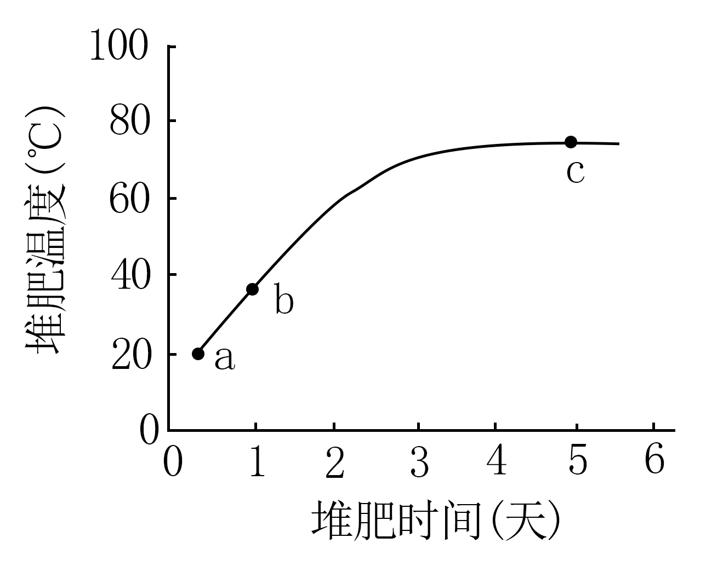
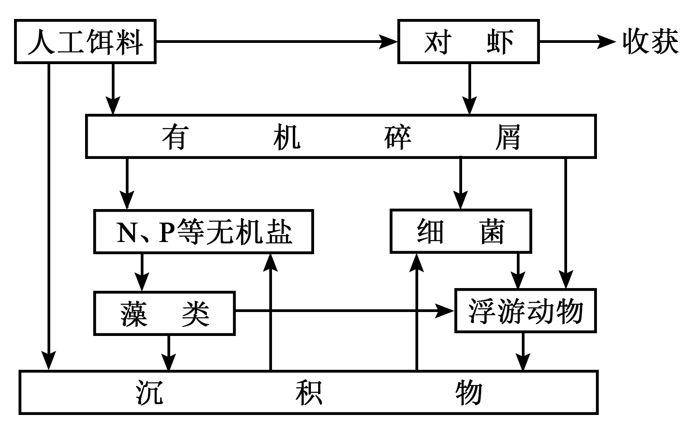
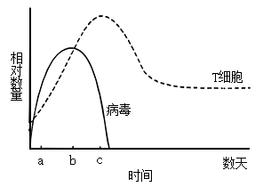
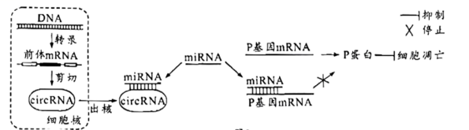
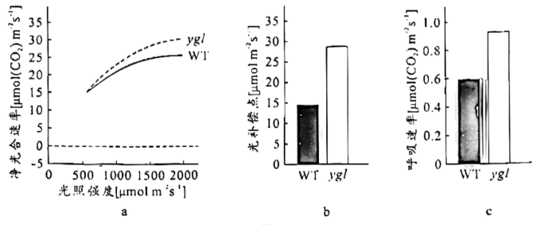
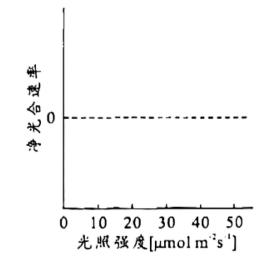
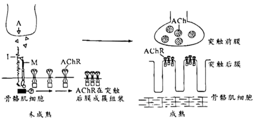
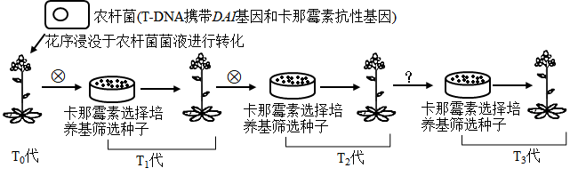
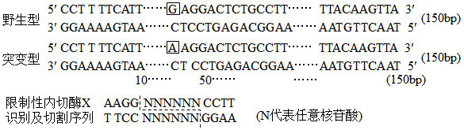

**2023年普通高等学校招生全国统一考试高考真题广东生物试题**

**一、选择题：**

1\. 中国制茶工艺源远流长。红茶制作包括萎凋、揉捻、发酵、高温干燥等工序，其间多酚氧化酶催化茶多酚生成适量茶黄素是红茶风味形成的关键。下列叙述错误的是（ ）

A. 揉捻能破坏细胞结构使多酚氧化酶与茶多酚接触

B. 发酵时保持适宜的温度以维持多酚氧化酶的活性

C 发酵时有机酸含量增加不会影响多酚氧化酶活性

D. 高温灭活多酚氧化酶以防止过度氧化影响茶品质

2\. 中外科学家经多年合作研究，发现circDNMT1（一种RNA分子）通过与抑癌基因*p53*表达的蛋白结合诱发乳腺癌，为解决乳腺癌这一威胁全球女性健康的重大问题提供了新思路。下列叙述错误的是（ ）

A. *p53*基因突变可能引起细胞癌变

B. p53蛋白能够调控细胞的生长和增殖

C. circDNMT1高表达会使乳腺癌细胞增殖变慢

D. circDNMT1的基因编辑可用于乳腺癌的基础研究

3\. 科学家采用体外受精技术获得紫羚羊胚胎，并将其移植到长角羚羊体内，使后者成功妊娠并产仔，该工作有助于恢复濒危紫羚羊的种群数量。此过程不涉及的操作是（ ）

A. 超数排卵 B. 精子获能处理

C. 细胞核移植 D. 胚胎培养

4\. 下列叙述中，能支持将线粒体用于生物进化研究的是（ ）

A. 线粒体基因遗传时遵循孟德尔定律

B. 线粒体DNA复制时可能发生突变

C. 线粒体存在于各地质年代生物细胞中

D. 线粒体通过有丝分裂的方式进行增殖

5\. 科学理论随人类认知的深入会不断被修正和补充，下列叙述错误的是（ ）

A. 新细胞产生方式的发现是对细胞学说的修正

B. 自然选择学说的提出是对共同由来学说的修正

C. RNA逆转录现象的发现是对中心法则的补充

D. 具催化功能RNA的发现是对酶化学本质认识的补充

6\. 某地区蝗虫在秋季产卵后死亡，以卵越冬。某年秋季降温提前，大量蝗虫在产卵前死亡，次年该地区蝗虫的种群密度明显下降。对蝗虫种群密度下降的合理解释是（ ）

A. 密度制约因素导致出生率下降

B. 密度制约因素导致死亡率上升

C. 非密度制约因素导致出生率下降

D 非密度制约因素导致死亡率上升

7\. 在游泳过程中，参与呼吸作用并在线粒体内膜上作为反应物的是（ ）

A. 还原型辅酶Ⅰ B. 丙酮酸

C. 氧化型辅酶Ⅰ D. 二氧化碳

8\. 空腹血糖是糖尿病筛查常用检测指标之一，但易受运动和心理状态等因素干扰，影响筛查结果。下列叙述正确的是（ ）

A 空腹时健康人血糖水平保持恒定

B. 空腹时糖尿病患者胰岛细胞不分泌激素

C. 运动时血液中的葡萄糖只消耗没有补充

D. 紧张时交感神经兴奋使血糖水平升高

9\. 某研学小组参加劳动实践，在校园试验田扦插繁殖药用植物两面针种苗。下列做法正确的是（ ）

A. 插条只能保留1个芽以避免养分竞争

B. 插条均应剪去多数叶片以避免蒸腾作用过度

C. 插条的不同处理方法均应避免使用较高浓度NAA

D. 插条均须在黑暗条件下培养以避免光抑制生根

10\. 研究者拟从堆肥中取样并筛选能高效降解羽毛、蹄角等废弃物中角蛋白的嗜热菌。根据堆肥温度变化曲线（如图）和选择培养基筛选原理来判断，下列最可能筛选到目标菌的条件组合是（ ）

A. a点时取样、尿素氮源培养基

B. b点时取样、角蛋白氮源培养基

C. b点时取样、蛋白胨氮源培养基

D. c点时取样、角蛋白氮源培养基

11\. “DNA粗提取与鉴定”实验的基本过程是：裂解→分离→沉淀→鉴定。下列叙述错误的是（ ）

A. 裂解：使细胞破裂释放出DNA等物质

B. 分离：可去除混合物中的多糖、蛋白质等

C. 沉淀：可反复多次以提高DNA的纯度

D. 鉴定：加入二苯胺试剂后即呈现蓝色

12\. 人参皂苷是人参的主要活性成分。科研人员分别诱导人参根与胡萝卜根产生愈伤组织并进行细胞融合，以提高人参皂苷的产率。下列叙述错误的是（ ）

A. 细胞融合前应去除细胞壁

B. 高Ca2+—高pH溶液可促进细胞融合

C. 融合的细胞即为杂交细胞

D. 杂交细胞可能具有生长快速的优势

13\. 凡纳滨对虾是华南地区养殖规模最大的对虾种类。放苗1周内虾苗取食藻类和浮游动物，1周后开始投喂人工饵料，1个月后对虾完全取食人工饵料。1个月后虾池生态系统的物质循环过程见图。下列叙述正确的是（ ）

A. 1周后藻类和浮游动物增加，水体富营养化程度会减轻

B. 1个月后藻类在虾池的物质循环过程中仍处于主要地位

C. 浮游动物摄食藻类、细菌和有机碎屑，属于消费者

D. 异养细菌依赖虾池生态系统中的沉积物提供营养

14\. 病原体感染可引起人体产生免疫反应。如图表示某人被病毒感染后体内T细胞和病毒的变化。下列叙述错误的是（ ）

A. a-b期间辅助性T细胞增殖并分泌细胞因子

B. b-c期间细胞毒性T细胞大量裂解被病毒感染的细胞

C. 病毒与辅助性T细胞接触为B细胞的激活提供第二个信号

D. 病毒和细菌感染可刺激记忆B细胞和记忆T细胞的形成

15\. 种植和欣赏水仙是广东的春节习俗。当室外栽培的水仙被移入室内后，其体内会发生一系列变化，导致徒长甚至倒伏。下列分析正确的是（ ）

A. 水仙光敏色素感受的光信号发生改变

B. 水仙叶绿素传递的光信号发生改变

C. 水仙转入室内后不能发生向光性弯曲

D. 强光促进了水仙花茎及叶伸长生长

16\. 鸡卷羽（F）对片羽（f）为不完全显性，位于常染色体，Ff表现为半卷羽；体型正常（D）对矮小（d）为显性，位于Z染色体。卷羽鸡适应高温环境，矮小鸡饲料利用率高。为培育耐热节粮型种鸡以实现规模化生产，研究人员拟通过杂交将d基因引入广东特色肉鸡“粤西卷羽鸡”，育种过程见图。下列分析错误的是（ ）

A. 正交和反交获得F1代个体表型和亲本不一样

B. 分别从F1代群体I和II中选择亲本可以避免近交衰退

C. 为缩短育种时间应从F1代群体I中选择父本进行杂交

D. F2代中可获得目的性状能够稳定遗传的种鸡

**二、非选择题：**

17\. 放射性心脏损伤是由电离辐射诱导的大量心肌细胞凋亡产生的心脏疾病。一项新的研究表明，circRNA可以通过miRNA调控P基因表达进而影响细胞凋亡，调控机制见图。miRNA是细胞内一种单链小分子RNA，可与mRNA靶向结合并使其降解。circRNA是细胞内一种闭合环状RNA，可靶向结合miRNA使其不能与mRNA结合，从而提高mRNA的翻译水平。

回答下列问题：

（1）放射刺激心肌细胞产生的\_\_\_\_\_\_\_\_\_会攻击生物膜的磷脂分子，导致放射性心肌损伤。

（2）前体mRNA是通过\_\_\_\_\_\_\_\_\_酶以DNA的一条链为模板合成的，可被剪切成circRNA等多种RNA。circRNA和mRNA在细胞质中通过对\_\_\_\_\_\_\_\_\_的竞争性结合，调节基因表达。

（3）据图分析，miRNA表达量升高可影响细胞凋亡，其可能的原因是\_\_\_\_\_\_\_\_\_。

（4）根据以上信息，除了减少miRNA的表达之外，试提出一个治疗放射性心脏损伤的新思路\_\_\_\_\_\_\_\_\_。

18\. 光合作用机理是作物高产的重要理论基础。大田常规栽培时，水稻野生型（WT）的产量和黄绿叶突变体（ygl）的产量差异不明显，但在高密度栽培条件下ygl产量更高，其相关生理特征见下表和图。（光饱和点：光合速率不再随光照强度增加时的光照强度；光补偿点：光合过程中吸收的CO2与呼吸过程中释放的CO2等量时的光照强度。

| 水稻材料 | 叶绿素（mg/g） | 类胡萝卜素（mg/g） | 类胡萝卜素/叶绿素 |
|:----:|:---------:|:-----------:|:---------:|
| WT   | 4.08      | 0.63        | 0.15      |
| ygl  | 1.73      | 0.47        | 0.27      |

分析图表，回答下列问题：

（1）ygl叶色黄绿的原因包括叶绿素含量较低和\_\_\_\_\_\_\_，叶片主要吸收可见光中的\_\_\_\_\_\_\_光。

（2）光照强度逐渐增加达到2000μmol m-2 s-1时，ygl的净光合速率较WT更高，但两者净光合速率都不再随光照强度的增加而增加，比较两者的光饱和点，可得ygl\_\_\_\_\_\_\_\_WT（填“高于”、“低于”或“等于”）。ygl有较高的光补偿点，可能的原因是叶绿素含量较低和\_\_\_\_\_\_\_\_。

（3）与WT相比，ygl叶绿素含量低，高密度栽培条件下，更多的光可到达下层叶片，且ygl群体的净光合速率较高，表明该群体\_\_\_\_\_\_\_\_，是其高产的原因之一。

（4）试分析在0~50μmol m-2 s-1范围的低光照强度下，WT和ygl净光合速率的变化，在给出的坐标系中绘制净光合速率趋势曲线\_\_\_\_\_\_\_\_\_。在此基础上，分析图a和你绘制的曲线，比较高光照强度和低光照强度条件下WT和ygl的净光合速率，提出一个科学问题\_\_\_\_\_\_\_\_。

19\. 神经肌肉接头是神经控制骨骼肌收缩的关键结构，其形成机制见图。神经末梢释放的蛋白A与肌细胞膜蛋白Ⅰ结合形成复合物，该复合物与膜蛋白M结合触发肌细胞内信号转导，使神经递质乙酰胆碱（ACh）的受体（AChR）在突触后膜成簇组装，最终形成成熟的神经肌肉接头。

回答下列问题：

（1）兴奋传至神经末梢，神经肌肉接头突触前膜\_\_\_\_\_\_\_\_\_内流，随后Ca2+内流使神经递质ACh以\_\_\_\_\_\_\_\_\_的方式释放，ACh结合AChR使骨骼肌细胞兴奋，产生收缩效应。

（2）重症肌无力是一种神经肌肉接头功能异常的自身免疫疾病，研究者采用抗原抗体结合方法检测患者AChR抗体，大部分呈阳性，少部分呈阴性。为何AChR抗体阴性者仍表现出肌无力症状？为探究该问题，研究者作出假设并进行探究。

①假设一：此类型患者AChR基因突变，不能产生\_\_\_\_\_\_\_\_\_，使神经肌肉接头功能丧失，导致肌无力。

为验证该假设，以健康人为对照，检测患者AChR基因，结果显示基因未突变，在此基础上作出假设二。

②假设二：此类型患者存在\_\_\_\_\_\_\_\_\_的抗体，造成\_\_\_\_\_\_\_\_\_，从而不能形成成熟的神经肌肉接头，导致肌无力。

为验证该假设，以健康人为对照，对此类型患者进行抗体检测，抗体检测结果符合预期。

③若想采用实验动物验证假设二提出的致病机制，你的研究思路是\_\_\_\_\_\_\_\_\_。

20\. 种子大小是作物重要的产量性状。研究者对野生型拟南芥（2n=10）进行诱变筛选到一株种子增大的突变体。通过遗传分析和测序，发现野生型DAI基因发生一个碱基G到A的替换，突变后的基因为隐性基因，据此推测突变体的表型与其有关，开展相关实验。

回答下列问题：

（1）拟采用农杆菌转化法将野生型DAI基因转入突变体植株，若突变体表型确由该突变造成，则转基因植株的种子大小应与\_\_\_\_\_\_\_\_\_植株的种子大小相近。

（2）用PCR反应扩增DAI基因，用限制性核酸内切酶对PCR产物和\_\_\_\_\_\_\_\_\_进行切割，用DNA连接酶将两者连接。为确保插入的DAI基因可以正常表达，其上下游序列需具备\_\_\_\_\_\_\_\_\_。

（3）转化后，T-DNA（其内部基因在减数分裂时不发生交换）可在基因组单一位点插入也可以同时插入多个位点。在插入片段均遵循基因分离及自由组合定律的前提下，选出单一位点插入的植株，并进一步获得目的基因稳定遗传的植株（如图），用于后续验证突变基因与表型的关系。

①农杆菌转化T0代植株并自交，将T1代种子播种在选择培养基上，能够萌发并生长的阳性个体即表示其基因组中插入了\_\_\_\_\_\_\_\_\_。

②T1代阳性植株自交所得的T2代种子按单株收种并播种于选择培养基，选择阳性率约\_\_\_\_\_\_\_\_\_%的培养基中幼苗继续培养。

③将②中选出的T2代阳性植株\_\_\_\_\_\_\_\_\_（填“自交”、“与野生型杂交”或“与突变体杂交”）所得的T3代种子按单株收种并播种于选择培养基，阳性率达到\_\_\_\_\_\_\_\_\_%的培养基中的幼苗即为目标转基因植株。为便于在后续研究中检测该突变，研究者利用PCR扩增野生型和突变型基因片段，再使用限制性核酸内切酶X切割产物，通过核酸电泳即可进行突变检测，相关信息见下，在电泳图中将酶切结果对应位置的条带涂黑\_\_\_\_\_\_\_\_\_。

21\. 上世纪70-90年代珠海淇澳岛红树林植被退化，形成的裸滩被外来入侵植物互花米草占据，天然红树林秋茄（乔木）-老鼠簕（灌木）群落仅存32hm2。为保护和恢复红树林植被，科技人员在互花米草侵占的滩涂上成功种植红树植物无瓣海桑，现已营造以无瓣海桑为主的人工红树林600hm2，各林龄群落的相关特征见下表。

| 红树林群落（林龄）       | 群落高度（m） | 植物种类（种） | 树冠层郁闭度（%） | 林下互花米草密度（株/m2） | 林下无瓣海桑更新幼苗密度（株/100m2） | 林下秋茄更新幼苗密度（株/100m2） |
|:---------------:|:-------:|:-------:|:---------:|:-------------------------:|:--------------------------------:|:------------------------------:|
| 无瓣海桑群落（3年）      | 3.2     | 3       | 70        | 30                        | 0                                | 0                              |
| 无瓣海桑群落（8年）      | 11.0    | 3       | 80        | 15                        | 10                               | 0                              |
| 无瓣海桑群落（16年）     | 12.5    | 2       | 90        | 0                         | 0                                | 0                              |
| 秋茄-老鼠簕群落（\>50年） | 5.7     | 4       | 90        | 0                         | 0                                | 19                             |

回答下列问题：

（1）在红树林植被恢复进程中，由裸滩经互花米草群落到无瓣海桑群落的过程称为\_\_\_\_\_\_\_\_\_。恢复的红树林既是海岸的天然防护林，也是多种水鸟栖息和繁殖场所，体现了生物多样性的\_\_\_\_\_\_\_\_\_价值。

（2）无瓣海桑能起到快速实现红树林恢复和控制互花米草的双重效果，其使互花米草消退的主要原因是\_\_\_\_\_\_\_\_\_。

（3）无瓣海桑是引种自南亚地区的大乔木，生长速度快，5年能大量开花结果，现已适应华南滨海湿地。有学者认为无瓣海桑有可能成为新的外来入侵植物。据表分析，提出你的观点和理由\_\_\_\_\_\_\_\_\_。

（4）淇澳岛红树林现为大面积人工种植的无瓣海桑纯林。为进一步提高该生态系统的稳定性，根据生态工程自生原理并考虑不同植物的生态位差异，提出合理的无瓣海桑群落改造建议\_\_\_\_\_\_\_\_\_。
