**2023年普通高等学校招生全国统一考试高考真题广东生物试题**

**一、选择题：**

1\. 中国制茶工艺源远流长。红茶制作包括萎凋、揉捻、发酵、高温干燥等工序，其间多酚氧化酶催化茶多酚生成适量茶黄素是红茶风味形成的关键。下列叙述错误的是（ ）

A. 揉捻能破坏细胞结构使多酚氧化酶与茶多酚接触

B. 发酵时保持适宜的温度以维持多酚氧化酶的活性

C. 发酵时有机酸含量增加不会影响多酚氧化酶活性

D. 高温灭活多酚氧化酶以防止过度氧化影响茶品质

【答案】C

【解析】

【分析】酶是活细胞产生的具有生物催化能力的有机物，大多数是蛋白质，少数是RNA。酶的特性：高效性、专一性以及作用条件温和的特性。

【详解】A、红茶制作时揉捻能破坏细胞结构，使其释放的多酚氧化酶与茶多酚接触，A正确；

B、发酵过程的实质就是酶促反应过程，需要将温度设置在酶的最适温度下，使多酚氧化酶保持最大活性，才能获得更多的茶黄素，B正确；

C、酶的作用条件较温和，发酵时有机酸含量增加会降低多酚氧化酶的活性，C错误；

D、高温条件会使多酚氧化酶的空间结构被破坏而失活，以防止过度氧化影响茶品质，D正确。

故选C。

2\. 中外科学家经多年合作研究，发现circDNMT1（一种RNA分子）通过与抑癌基因*p53*表达的蛋白结合诱发乳腺癌，为解决乳腺癌这一威胁全球女性健康的重大问题提供了新思路。下列叙述错误的是（ ）

A. *p53*基因突变可能引起细胞癌变

B. p53蛋白能够调控细胞的生长和增殖

C. circDNMT1高表达会使乳腺癌细胞增殖变慢

D. circDNMT1的基因编辑可用于乳腺癌的基础研究

【答案】C

【解析】

【分析】人和动物细胞中的DNA上本来就存在与癌变相关的基因：原癌基因和抑癌基因。一般来说，原癌基因表达的蛋白质是细胞正常的生长和增殖所必需的，这类基因一旦突变或过量表达而导致相应蛋白质活性过强，就可能引起细胞癌变。相反，抑癌基因表达的蛋白质能抑制细胞的生长和增殖，或者促进细胞凋亡，这类基因一旦突变而导致相应蛋白质活性减弱或失去活性，也可能引起细胞癌变。

【详解】A、*p53*基因是抑癌基因，这类基因突变可能引起细胞癌变，A正确；

B、*p53*基因是抑癌基因，抑癌基因表达的蛋白质能抑制细胞的生长和增殖，或促进细胞凋亡，B正确；

C、依据题意，circDNMT1通过与抑癌基因p53表达的蛋白结合诱发乳腺癌，则circDNMT1高表达会使乳腺癌细胞增殖变快，C错误；

D、circDNMT1的基因编辑可用于乳腺癌的基础研究，D正确。

故选C。

3\. 科学家采用体外受精技术获得紫羚羊胚胎，并将其移植到长角羚羊体内，使后者成功妊娠并产仔，该工作有助于恢复濒危紫羚羊的种群数量。此过程不涉及的操作是（ ）

A. 超数排卵 B. 精子获能处理

C. 细胞核移植 D. 胚胎培养

【答案】C

【解析】

【分析】体外受精主要包括：卵母细胞的采集和培养、精子的采集和获能、受精。

（1）卵母细胞的采集和培养①主要方法是：用促性腺激素处理，使其超数排卵，然后，从输卵管中冲取卵子。②第二种方法：从已屠宰母畜的卵巢中采集卵母细胞或直接从活体动物的卵巢中吸取卵母细胞。

（2）精子的采集和获能①收集精子的方法：假阴道法、手握法和电刺激法；②对精子进行获能处理：包括培养法和化学诱导法。

（3）受精：在获能溶液或专用的受精溶液中完成受精过程。

【详解】由题干信息可知，该过程通过体外受精获得胚胎，再通过胚胎移植，使长角羚羊成功妊娠并产仔，因此需要进行超数排卵、精子获能处理，并对获得的受精卵进行胚胎培养；由于该过程为有性生殖，因此不需要涉及细胞核移植，所以C正确、ABD错误。

故选C。

4\. 下列叙述中，能支持将线粒体用于生物进化研究的是（ ）

A. 线粒体基因遗传时遵循孟德尔定律

B. 线粒体DNA复制时可能发生突变

C. 线粒体存在于各地质年代生物细胞中

D. 线粒体通过有丝分裂的方式进行增殖

【答案】B

【解析】

【分析】线粒体属于真核细胞的细胞器，有外膜和内膜，内膜向内折叠形成嵴。线粒体中含有DNA和RNA，能合成部分蛋白质，属于半自主细胞器。

【详解】A、孟德尔遗传定律适用于真核生物核基因的遗传，线粒体基因属于质基因，A错误；

B、线粒体DNA复制时可能发生突变，为生物进化提供原材料，B正确；

C、地球上最早的生物是细菌，属于原核生物，没有线粒体，C错误；

D、有丝分裂是真核细胞的分裂方式，线粒体不能通过有丝分裂的方式增殖，D错误。

故选B。

5\. 科学理论随人类认知的深入会不断被修正和补充，下列叙述错误的是（ ）

A. 新细胞产生方式的发现是对细胞学说的修正

B. 自然选择学说的提出是对共同由来学说的修正

C. RNA逆转录现象的发现是对中心法则的补充

D. 具催化功能RNA的发现是对酶化学本质认识的补充

【答案】B

【解析】

【分析】细胞学说是由德植物学家施莱登和动物学家施旺提出的，其内容为：（1）细胞是一个有机体，一切动植物都是由细胞发育而来，并由细胞和细胞的产物所构成；（2）细胞是一个相对独立的单位，既有它自己的生命，又对与其他细胞共同组成的整体的生命起作用；（3）新细胞可以从老细胞中产生。

【详解】A、细胞学说主要由施莱登和施旺建立，魏尔肖总结出“细胞通过分裂产生新细胞”是对细胞学说的修正和补充，A正确；

B、共同由来学说指出地球上所有的生物都是由原始的共同祖先进化来的；自然选择学说揭示了生物进化的机制，揭示了适应的形成和物种形成的原因。共同由来学说为自然选择学说提供了基础，B错误；

C、中心法则最初的内容是遗传信息可以从DNA流向DNA，也可以从DNA流向RNA，进而流向蛋白质，随着研究的不断深入，科学家发现一些RNA病毒的遗传信息可以从RNA流向RNA（RNA的复制）以及从RNA流向DNA（逆转录），对中心法则进行了补充，C正确；

D、最早是美国科学家萨姆纳证明了酶是蛋白质，在20世纪80年代，美国科学家切赫和奥尔特曼发现少数RNA也具有催化功能，这一发现对酶化学本质的认识进行了补充，D正确。

故选B。

6\. 某地区蝗虫在秋季产卵后死亡，以卵越冬。某年秋季降温提前，大量蝗虫在产卵前死亡，次年该地区蝗虫的种群密度明显下降。对蝗虫种群密度下降的合理解释是（ ）

A. 密度制约因素导致出生率下降

B. 密度制约因素导致死亡率上升

C. 非密度制约因素导致出生率下降

D. 非密度制约因素导致死亡率上升

【答案】C

【解析】

【分析】一般来说，食物和天敌等生物因素对种群数量的作用强度与该种群的密度是相关的，这些因素称为密度制约因素；而气温和干旱等气候因素以及地震、火灾等自然灾害，对种群的作用强度与该种群的密度无关，因此被称为非密度制约因素。

【详解】气温对种群的作用强度与该种群的密度无关，因此被称为非密度制约因素；蝗虫原本就会在秋季死亡，降温使它们死亡前没有产生后代，导致出生率下降，所以C正确，ABD错误。

故选C。

7\. 在游泳过程中，参与呼吸作用并在线粒体内膜上作为反应物的是（ ）

A. 还原型辅酶Ⅰ B. 丙酮酸

C. 氧化型辅酶Ⅰ D. 二氧化碳

【答案】A

【解析】

【分析】有氧呼吸过程分三个阶段，第一阶段是葡萄糖分解成2分子丙酮酸和少量的\[H\]，同时释放了少量的能量，发生的场所是细胞质基质；第二阶段丙酮酸和水反应产生二氧化碳\[H\]，同时释放少量的能量，发生的场所是线粒体基质；第三阶段是前两个阶段产生的\[H\]与氧气结合形成水，释放大量的能量，发生的场所是线粒体内膜。

【详解】游泳过程中主要以有氧呼吸提供能量，有氧呼吸的第一阶段和第二阶段都产生了\[H\]，这两个阶段产生的\[H\]在第三阶段经过一系列的化学反应，在线粒体内膜上与氧结合生成水，这里的\[H\]是一种简化的表示方式，实际上指的是还原型辅酶Ⅰ，A正确。\
故选A。

8\. 空腹血糖是糖尿病筛查常用检测指标之一，但易受运动和心理状态等因素干扰，影响筛查结果。下列叙述正确的是（ ）

A. 空腹时健康人血糖水平保持恒定

B. 空腹时糖尿病患者胰岛细胞不分泌激素

C. 运动时血液中的葡萄糖只消耗没有补充

D. 紧张时交感神经兴奋使血糖水平升高

【答案】D

【解析】

【分析】体内血糖平衡调节过程如下：1、当血糖浓度升高时，血糖会直接刺激胰岛B细胞引起胰岛素的合成并释放，同时也会引起下丘脑的某区域的兴奋发出神经支配胰岛B细胞的活动，使胰岛B细胞合成并释放胰岛素，胰岛素促进组织细胞对葡萄糖的摄取、利用和贮存，从而使血糖下降。2、当血糖浓度下降时，血糖会直接刺激胰岛A细胞引起胰高血糖素的合成和释放，同时也会引起下丘脑的另一区域的兴奋发出神经支配胰岛A细胞的活动，使胰高血糖素合成并分泌，胰高血糖素通过促进肝糖原的分解和非糖物质的转化从而使血糖上升，并且下丘脑在这种情况下也会发出神经支配肾上腺的活动，使肾上腺素分泌增强，肾上腺素也能促进血糖上升。

【详解】A、空腹时血糖的重要来源是肝糖原分解为葡萄糖进入血液，非糖物质也可以转化为血糖，使血糖水平保持动态平衡，但不是绝对的恒定，A错误；

B、空腹时糖尿病患者的细胞供能不足，糖尿病患者的胰岛A细胞会分泌胰高血糖素促进肝糖原的分解和非糖物质转化为血糖供能，B错误；

C、运动时血液中的葡萄糖消耗的同时，胰高血糖素促进肝糖原分解和非糖物质转化为葡萄糖，对血糖进行补充，C错误；

D、紧张时交感神经兴奋，会使肾上腺素增多，促进血糖升高，D正确。

故选D。

9\. 某研学小组参加劳动实践，在校园试验田扦插繁殖药用植物两面针种苗。下列做法正确的是（ ）

A. 插条只能保留1个芽以避免养分竞争

B 插条均应剪去多数叶片以避免蒸腾作用过度

C. 插条的不同处理方法均应避免使用较高浓度NAA

D. 插条均须在黑暗条件下培养以避免光抑制生根

【答案】B

【解析】

【分析】在促进扦插枝条生根的实验中，为提高扞插枝条的成活率，常常去掉插条上的多数叶片以降低其蒸腾作用，同时要保留3-4个芽，因为芽能产生生长素，有利于插条生根。用不同浓度的生长素处理插条时，常常选择不同的方法，若生长素浓度较低，则采用浸泡法，若生长素浓度较高，则采用沾蘸法。

【详解】A、为提高扞插枝条的成活率，插条一般保留3-4个芽，因为芽能产生生长素，有利于插条生根，A错误；

B、当插条上叶片较多时，蒸腾作用过于旺盛，导致插条失水过多死亡，因此应剪去多数叶片以降低蒸腾作用，B正确；

C、较高浓度的NAA可以选用沾蘸法，低浓度NAA可以选用浸泡法，C错误；

D、为降低插条的蒸腾作用，同时又可以使其进行光合作用，常常在弱光下进行扦插，D错误。

故选B。

10\. 研究者拟从堆肥中取样并筛选能高效降解羽毛、蹄角等废弃物中角蛋白的嗜热菌。根据堆肥温度变化曲线（如图）和选择培养基筛选原理来判断，下列最可能筛选到目标菌的条件组合是（ ）

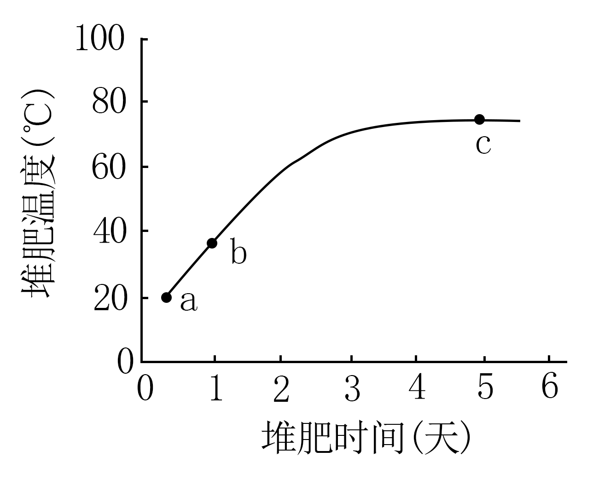

A. a点时取样、尿素氮源培养基

B. b点时取样、角蛋白氮源培养基

C. b点时取样、蛋白胨氮源培养基

D. c点时取样、角蛋白氮源培养基

【答案】D

【解析】

【分析】筛选能高效降解羽毛、蹄角等废弃物中角蛋白的嗜热菌，要用角蛋白氮源培养基。

【详解】研究目的是筛选能高效降解羽毛、蹄角等废弃物中角蛋白的嗜热菌，因此既要耐高温，又要能够高效降解角蛋白，所以在c点取样，并且用角蛋白氮源培养基进行选择培养，所以D正确，ABC错误。

故选D。

11\. “DNA粗提取与鉴定”实验的基本过程是：裂解→分离→沉淀→鉴定。下列叙述错误的是（ ）

A. 裂解：使细胞破裂释放出DNA等物质

B. 分离：可去除混合物中的多糖、蛋白质等

C. 沉淀：可反复多次以提高DNA的纯度

D. 鉴定：加入二苯胺试剂后即呈现蓝色

【答案】D

【解析】

【分析】DNA粗提取和鉴定的原理：

1、DNA的溶解性：DNA和蛋白质等其他成分在不同浓度NaCl溶液中溶解度不同（DNA在0.14mol/L的氯化钠中溶解度最低）；DNA不溶于酒精溶液，但细胞中的某些蛋白质溶于酒精。

2、DNA对酶、高温和洗涤剂的耐受性不同。

3、DNA的鉴定：在沸水浴的条件下，DNA遇二苯胺会被染成蓝色。

【详解】A、裂解是加蒸馏水让细胞吸水涨破，释放出DNA等物质，A正确；

B、DNA在不同浓度的NaCl溶液中溶解度不同，能溶于2mol/L的NaCl溶液， 将溶液过滤，即可将混合物中的多糖、蛋白质等与DNA分离，B正确；

C、DNA不溶于酒精，而某些蛋白质溶于酒精，可以反复多次用酒精沉淀出DNA，提高DNA纯度，C正确；

D、将DNA溶解于NaCl，加入二苯胺试剂，沸水浴五分钟，待冷却后，能呈现蓝色，D错误。

故选D。

12\. 人参皂苷是人参的主要活性成分。科研人员分别诱导人参根与胡萝卜根产生愈伤组织并进行细胞融合，以提高人参皂苷的产率。下列叙述错误的是（ ）

A. 细胞融合前应去除细胞壁

B. 高Ca2+—高pH溶液可促进细胞融合

C. 融合的细胞即为杂交细胞

D. 杂交细胞可能具有生长快速的优势

【答案】C

【解析】

【分析】植物体细胞杂交技术：就是将不同种的植物体细胞原生质体在一定条件下融合成杂种细胞，并把杂种细胞培育成完整植物体的技术。

【详解】A、在细胞融合前，必须先用纤维素酶和果胶酶去除细胞壁，再诱导原生质体融合，A正确；

B、人工诱导原生质体融合有物理法和化学法，用高Ca2+—高pH溶液可促进细胞融合，B正确；

C、融合的细胞中有人参根-人参根细胞、人参根-胡萝卜根细胞、胡萝卜根-胡萝卜根细胞，只有人参根-胡萝卜根细胞才是杂交细胞，C错误；

D、杂交细胞含两种细胞的遗传物质，可能具有生长快速的优势，D正确。

故选C。

13\. 凡纳滨对虾是华南地区养殖规模最大的对虾种类。放苗1周内虾苗取食藻类和浮游动物，1周后开始投喂人工饵料，1个月后对虾完全取食人工饵料。1个月后虾池生态系统的物质循环过程见图。下列叙述正确的是（ ）

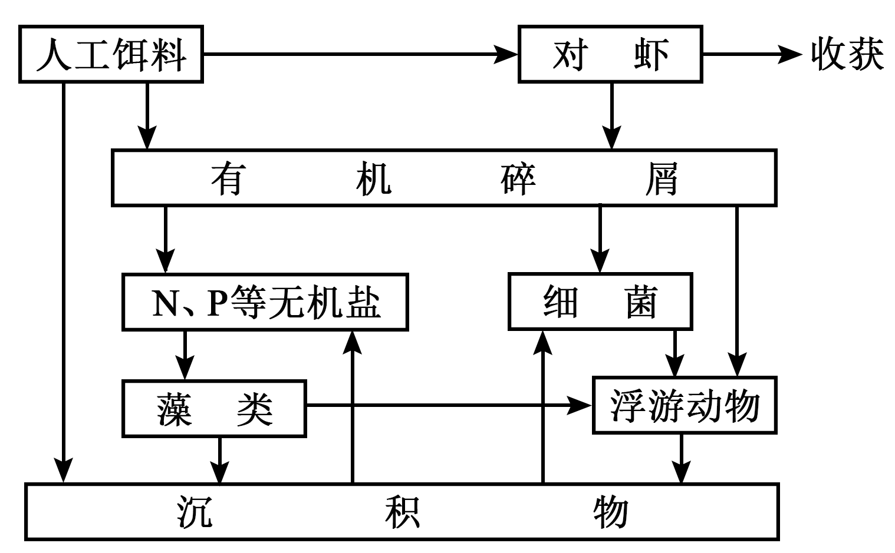

A. 1周后藻类和浮游动物增加，水体富营养化程度会减轻

B. 1个月后藻类在虾池的物质循环过程中仍处于主要地位

C. 浮游动物摄食藻类、细菌和有机碎屑，属于消费者

D. 异养细菌依赖虾池生态系统中沉积物提供营养

【答案】B

【解析】

【分析】生态系统的组成成分有：生产者、消费者、分解者和非生物的物质和能量。

【详解】A、1周后开始投喂人工饵料，虾池中有机碎屑含量增加，水体中N、P等无机盐增多，水体富营养化严重，A错误；

B、藻类作为生产者，在物质循环中占主要地位，B正确；

C、浮游动物摄食藻类，同时浮游动物有摄食细菌和有机碎屑，属于消费者和分解者，C错误；

D、异养细菌依赖虾池生态系统中的沉积物和有机碎屑提供营养，D错误。

故选B

14\. 病原体感染可引起人体产生免疫反应。如图表示某人被病毒感染后体内T细胞和病毒的变化。下列叙述错误的是（ ）

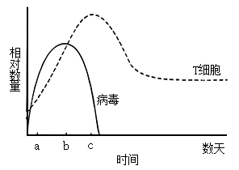

A. a-b期间辅助性T细胞增殖并分泌细胞因子

B. b-c期间细胞毒性T细胞大量裂解被病毒感染的细胞

C. 病毒与辅助性T细胞接触为B细胞的激活提供第二个信号

D. 病毒和细菌感染可刺激记忆B细胞和记忆T细胞的形成

【答案】C

【解析】

【分析】图中a-b段病毒入侵并增殖，同时机体开始进行特异性免疫，T细胞数量增加；随后b-c段病毒数量减少，T细胞数量也减少并趋于稳定。

【详解】A、a-b期间病毒入侵，导致辅助性T细胞开始分裂、分化，并分泌细胞因子，A正确；

B、b-c期间细胞毒性T细胞大量裂解被病毒感染的细胞 ，进而使病毒暴露出来，通过体液免疫产生的抗体使病毒数量减少，B正确；

C、抗原呈递细胞将抗原处理后呈递在细胞表面，然后传递给辅助性T细胞，辅助性T细胞表面的特定分子发生变化并与B细胞结合，这是激活B细胞的第二个信号，C错误；

D、病毒和细菌感染可刺激机体产生细胞免疫和体液免疫，促使记忆B细胞和记忆T细胞的形成 ，D正确。

故选C。

15\. 种植和欣赏水仙是广东的春节习俗。当室外栽培的水仙被移入室内后，其体内会发生一系列变化，导致徒长甚至倒伏。下列分析正确的是（ ）

A. 水仙光敏色素感受的光信号发生改变

B. 水仙叶绿素传递的光信号发生改变

C. 水仙转入室内后不能发生向光性弯曲

D. 强光促进了水仙花茎及叶的伸长生长

【答案】A

【解析】

【分析】光敏色素是一类蛋白质(色素一蛋白复合体)，分布在植物的各个部位，其中在分生组织的细胞内比较丰富。在受到光照射时，光敏色素的结构会发生变化，这一变化的信息会经过信息传递系统传导到细胞核内，影响特定基因的表达，从而表现出生物学效应。

【详解】A、当室外栽培的水仙被移入室内后，光信号发生变化，光敏色素作为光信号的受体感受的光信号发生改变，影响相关基因的表达，进而导致水仙徒长甚至倒伏，A正确；

B、叶绿素可以吸收、传递和转化光能，叶绿素本身不传递光信号，B错误；

C、植物的向光性是指在单侧光的作用下，向光侧生长素浓度低于背光侧，导致背光侧生长快，向光侧生长慢，植物向光弯曲。水仙转入室内后，若给以单侧光，植物仍可以发生向光弯曲，C错误；

D、室外栽培的水仙被移入室内后，光照强度减弱，D错误。

故选A。

16\. 鸡的卷羽（F）对片羽（f）为不完全显性，位于常染色体，Ff表现为半卷羽；体型正常（D）对矮小（d）为显性，位于Z染色体。卷羽鸡适应高温环境，矮小鸡饲料利用率高。为培育耐热节粮型种鸡以实现规模化生产，研究人员拟通过杂交将d基因引入广东特色肉鸡“粤西卷羽鸡”，育种过程见图。下列分析错误的是（ ）

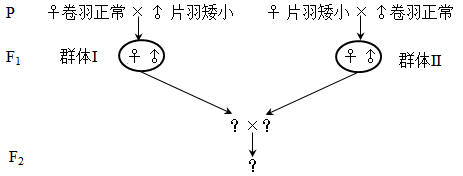

A. 正交和反交获得F1代个体表型和亲本不一样

B. 分别从F1代群体I和II中选择亲本可以避免近交衰退

C. 为缩短育种时间应从F1代群体I中选择父本进行杂交

D. F2代中可获得目的性状能够稳定遗传的种鸡

【答案】C

【解析】

【分析】根据题意，育种的目标是获得目标性状为卷羽矮小鸡（基因型为FFZdW和FFZdZd的个体）。

【详解】A、由于控制体型的基因位于Z染色体上，属于伴性遗传，性状与性别相关联。用♀卷羽正常（FFZDW）与♂片羽矮小（ffZdZd）杂交，F1代是♂FfZDZd和♀FfZdW，子代都是半卷羽；用♀片羽矮小（ffZdW）与♂卷羽正常（FFZDZD）杂交，F1代是♂FfZDZd和♀FfZDW，子代仍然是半卷羽，正交和反交都与亲本表型不同，A正确；

B、F1代群体I和II杂交不是近亲繁殖，可以避免近交衰退，B正确；

CD、为缩短育种时间应从F1代群体I中选择母本（基因型为FfZdW），从F1代群体II中选择父本（基因型为FfZDZd），可以快速获得基因型为FFZdW和FFZdZd的个体，即在F2代中可获得目的性状能够稳定遗传的种鸡，C错误，D正确。

故选C。

**二、非选择题：**

17\. 放射性心脏损伤是由电离辐射诱导大量心肌细胞凋亡产生的心脏疾病。一项新的研究表明，circRNA可以通过miRNA调控P基因表达进而影响细胞凋亡，调控机制见图。miRNA是细胞内一种单链小分子RNA，可与mRNA靶向结合并使其降解。circRNA是细胞内一种闭合环状RNA，可靶向结合miRNA使其不能与mRNA结合，从而提高mRNA的翻译水平。

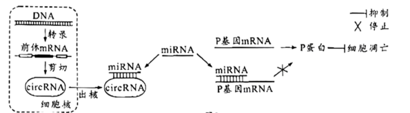

回答下列问题：

（1）放射刺激心肌细胞产生的\_\_\_\_\_\_\_\_\_会攻击生物膜的磷脂分子，导致放射性心肌损伤。

（2）前体mRNA是通过\_\_\_\_\_\_\_\_\_酶以DNA的一条链为模板合成的，可被剪切成circRNA等多种RNA。circRNA和mRNA在细胞质中通过对\_\_\_\_\_\_\_\_\_的竞争性结合，调节基因表达。

（3）据图分析，miRNA表达量升高可影响细胞凋亡，其可能的原因是\_\_\_\_\_\_\_\_\_。

（4）根据以上信息，除了减少miRNA的表达之外，试提出一个治疗放射性心脏损伤的新思路\_\_\_\_\_\_\_\_\_。

【答案】（1）自由基 （2） ①. RNA聚合 ②. miRNA

（3）P蛋白能抑制细胞凋亡，miRNA表达量升高，与P基因的mRNA结合并将其降解的概率上升，导致合成的P蛋白减少，无法抑制细胞凋亡

（4）可通过增大细胞内circRNA的含量，靶向结合miRNA使其不能与P基因的mRNA结合，从而提高P基因的表达量，抑制细胞凋亡

【解析】

【分析】结合题意分析题图可知，miRNA能与mRNA结合，使其降解，降低mRNA的翻译水平。当miRNA与circRNA结合时，就不能与mRNA结合，从而提高mRNA的翻译水平。

【小问1详解】

放射刺激心肌细胞，可产生大量自由基，攻击生物膜的磷脂分子，导致放射性心肌损伤。

【小问2详解】

RNA聚合酶能催化转录过程，以DNA的一条链为模板，通过碱基互补配对原则合成前体mRNA。由图可知，miRNA既能与mRNA结合，降低mRNA的翻译水平，又能与circRNA结合，提高mRNA的翻译水平，故circRNA和mRNA在细胞质中通过对miRNA的竞争性结合，调节基因表达。

【小问3详解】

P蛋白能抑制细胞凋亡，当miRNA表达量升高时，大量的miRNA与P基因的mRNA结合，并将P基因的mRNA降解，导致合成的P蛋白减少，无法抑制细胞凋亡。

【小问4详解】

根据以上信息，除了减少miRNA的表达之外，还能通过增大细胞内circRNA的含量，靶向结合miRNA，使其不能与P基因的mRNA结合，从而提高P基因的表达量，抑制细胞凋亡。

18\. 光合作用机理是作物高产的重要理论基础。大田常规栽培时，水稻野生型（WT）的产量和黄绿叶突变体（ygl）的产量差异不明显，但在高密度栽培条件下ygl产量更高，其相关生理特征见下表和图。（光饱和点：光合速率不再随光照强度增加时的光照强度；光补偿点：光合过程中吸收的CO2与呼吸过程中释放的CO2等量时的光照强度。

| 水稻材料 | 叶绿素（mg/g） | 类胡萝卜素（mg/g） | 类胡萝卜素/叶绿素 |
|:----:|:---------:|:-----------:|:---------:|
| WT   | 4.08      | 0.63        | 0.15      |
| ygl  | 1.73      | 0.47        | 0.27      |

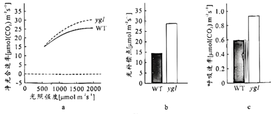

分析图表，回答下列问题：

（1）ygl叶色黄绿的原因包括叶绿素含量较低和\_\_\_\_\_\_\_，叶片主要吸收可见光中的\_\_\_\_\_\_\_光。

（2）光照强度逐渐增加达到2000μmol m-2 s-1时，ygl的净光合速率较WT更高，但两者净光合速率都不再随光照强度的增加而增加，比较两者的光饱和点，可得ygl\_\_\_\_\_\_\_\_WT（填“高于”、“低于”或“等于”）。ygl有较高的光补偿点，可能的原因是叶绿素含量较低和\_\_\_\_\_\_\_\_。

（3）与WT相比，ygl叶绿素含量低，高密度栽培条件下，更多的光可到达下层叶片，且ygl群体的净光合速率较高，表明该群体\_\_\_\_\_\_\_\_，是其高产的原因之一。

（4）试分析在0~50μmol m-2 s-1范围的低光照强度下，WT和ygl净光合速率的变化，在给出的坐标系中绘制净光合速率趋势曲线\_\_\_\_\_\_\_\_\_。在此基础上，分析图a和你绘制的曲线，比较高光照强度和低光照强度条件下WT和ygl的净光合速率，提出一个科学问题\_\_\_\_\_\_\_\_。

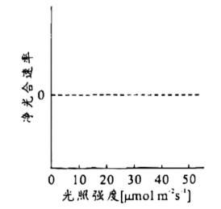

【答案】（1） ①. 类胡萝卜素/叶绿素比例上升 ②. 蓝紫

（2） ①. 高于 ②. 呼吸速率较高\
（3）有机物积累较多

（4） ①. 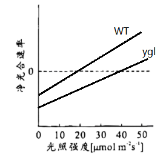 ②. 为什么达到光饱和点时，ygl的净光合速率高于WT？

【解析】

【分析】分析题表和题图：与WT相比，ygl植株的叶绿素和类胡萝卜素含量都较低，但类胡萝卜素/叶绿素较高，光饱和点较高，呼吸速率较高。

【小问1详解】

根据表格信息可知，ygl植株叶绿素含量较低且类胡萝卜素/叶绿素比值比较高，故叶片呈现出黄绿色。叶绿素主要吸收红光和蓝紫光，类胡萝卜素主要吸收蓝紫光，由ygl叶色呈黄绿可推测，主要吸收蓝紫光。

【小问2详解】

根据图a净光合速率曲线变化可知，WT先到达光饱和点，即ygl的光饱和点高于WT。光补偿点是光合速率等于呼吸速率的光照强度，ygl有较高的光补偿点，可能原因是一方面光合速率偏低，另一方面是呼吸速率较高，结合题意可知，ygl有较高的光补偿点是因为叶绿素含量较低导致相同光照强度下光合速率较低，且由图c可知ygl呼吸速率较高。

【小问3详解】

净光合速率较高则有机物的积累量较多，更有利于植株生长发育，因此产量较多。

【小问4详解】

由于ygl呼吸速率较高，且有较高的光补偿点，因此在0~50μmol m-2 s-1范围的低光照强度下，WT和ygl的净光合速率如下图：

根据两图提出问题：为什么达到光饱和点时，ygl的净光合速率高于WT？

19\. 神经肌肉接头是神经控制骨骼肌收缩的关键结构，其形成机制见图。神经末梢释放的蛋白A与肌细胞膜蛋白Ⅰ结合形成复合物，该复合物与膜蛋白M结合触发肌细胞内信号转导，使神经递质乙酰胆碱（ACh）的受体（AChR）在突触后膜成簇组装，最终形成成熟的神经肌肉接头。

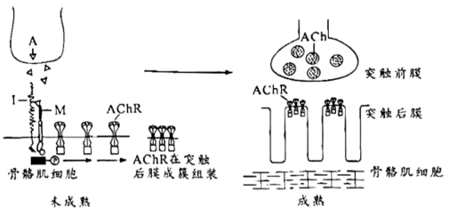

回答下列问题：

（1）兴奋传至神经末梢，神经肌肉接头突触前膜\_\_\_\_\_\_\_\_\_内流，随后Ca2+内流使神经递质ACh以\_\_\_\_\_\_\_\_\_的方式释放，ACh结合AChR使骨骼肌细胞兴奋，产生收缩效应。

（2）重症肌无力是一种神经肌肉接头功能异常的自身免疫疾病，研究者采用抗原抗体结合方法检测患者AChR抗体，大部分呈阳性，少部分呈阴性。为何AChR抗体阴性者仍表现出肌无力症状？为探究该问题，研究者作出假设并进行探究。

①假设一：此类型患者AChR基因突变，不能产生\_\_\_\_\_\_\_\_\_，使神经肌肉接头功能丧失，导致肌无力。

为验证该假设，以健康人为对照，检测患者AChR基因，结果显示基因未突变，在此基础上作出假设二。

②假设二：此类型患者存在\_\_\_\_\_\_\_\_\_的抗体，造成\_\_\_\_\_\_\_\_\_，从而不能形成成熟的神经肌肉接头，导致肌无力。

为验证该假设，以健康人为对照，对此类型患者进行抗体检测，抗体检测结果符合预期。

③若想采用实验动物验证假设二提出的致病机制，你的研究思路是\_\_\_\_\_\_\_\_\_。

【答案】（1） ①. Na+ ②. 胞吐

（2） ①. AChR ②. A ③. A不能与肌细胞膜蛋白Ⅰ结合形成复合物，无法与膜蛋白M结合触发肌细胞内信号转导，使AChR不能在突触后膜成簇组装 ④. 给健康的实验动物及患病的实验动物注射等量的蛋白A，采用抗原抗体结合方法检测，观察患者A抗体是否出现阳性

【解析】

【分析】兴奋在神经元之间需要通过突触结构进行传递，突触包括突触前膜、突触间隙、突触后膜，其具体的传递过程为：兴奋以电流的形式传导到轴突末梢时，突触小泡释放递质（化学信号），递质作用于突触后膜，引起突触后膜产生膜电位（电信号），从而将兴奋传递到下一个神经元。由于递质只能由突触前膜释放，作用于突触后膜，因此神经元之间兴奋的传递只能是单方向的。

小问1详解】

兴奋是以电信号传至神经末梢的，因此神经肌肉接头突触前膜钠离子内流，随后Ca2+内流使神经递质ACh以胞吐的形式释放至突触间隙，与突触后膜上的AChR结合使骨骼肌细胞兴奋，产生收缩效应。

【小问2详解】

①若患者AChR基因突变，不能合成AChR，也就不能在突触后膜成簇组装，使神经肌肉接头功能丧失，导致肌无力。

②若患者AChR基因未突变，即能合成AChR，但又不能形成成熟的神经肌肉接头，很可能是存在A抗体，造成A不能与肌细胞膜蛋白Ⅰ结合形成复合物，无法与膜蛋白M结合触发肌细胞内信号转导，使AChR不能在突触后膜成簇组装。

③该实验目的是验证此类型患者存在A的抗体，可设计实验思路如下：给健康的实验动物及患病的实验动物注射等量的蛋白A，采用抗原抗体结合方法检测，观察患者A抗体是否出现阳性。

20\. 种子大小是作物重要的产量性状。研究者对野生型拟南芥（2n=10）进行诱变筛选到一株种子增大的突变体。通过遗传分析和测序，发现野生型DAI基因发生一个碱基G到A的替换，突变后的基因为隐性基因，据此推测突变体的表型与其有关，开展相关实验。

回答下列问题：

（1）拟采用农杆菌转化法将野生型DAI基因转入突变体植株，若突变体表型确由该突变造成，则转基因植株的种子大小应与\_\_\_\_\_\_\_\_\_植株的种子大小相近。

（2）用PCR反应扩增DAI基因，用限制性核酸内切酶对PCR产物和\_\_\_\_\_\_\_\_\_进行切割，用DNA连接酶将两者连接。为确保插入的DAI基因可以正常表达，其上下游序列需具备\_\_\_\_\_\_\_\_\_。

（3）转化后，T-DNA（其内部基因在减数分裂时不发生交换）可在基因组单一位点插入也可以同时插入多个位点。在插入片段均遵循基因分离及自由组合定律的前提下，选出单一位点插入的植株，并进一步获得目的基因稳定遗传的植株（如图），用于后续验证突变基因与表型的关系。

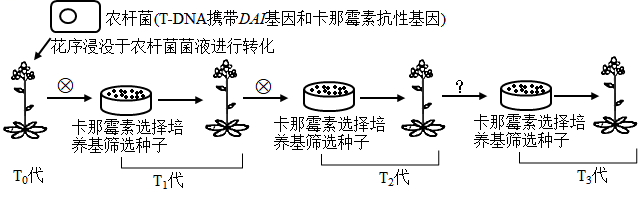

①农杆菌转化T0代植株并自交，将T1代种子播种在选择培养基上，能够萌发并生长的阳性个体即表示其基因组中插入了\_\_\_\_\_\_\_\_\_。

②T1代阳性植株自交所得的T2代种子按单株收种并播种于选择培养基，选择阳性率约\_\_\_\_\_\_\_\_\_%的培养基中幼苗继续培养。

③将②中选出的T2代阳性植株\_\_\_\_\_\_\_\_\_（填“自交”、“与野生型杂交”或“与突变体杂交”）所得的T3代种子按单株收种并播种于选择培养基，阳性率达到\_\_\_\_\_\_\_\_\_%的培养基中的幼苗即为目标转基因植株。为便于在后续研究中检测该突变，研究者利用PCR扩增野生型和突变型基因片段，再使用限制性核酸内切酶X切割产物，通过核酸电泳即可进行突变检测，相关信息见下，在电泳图中将酶切结果对应位置的条带涂黑\_\_\_\_\_\_\_\_\_。

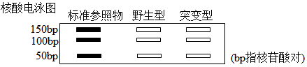

【答案】（1）野生型 （2） ①. 运载体 ②. 启动子和终止子

（3） ①. DAI基因和卡那霉素抗性基因 ②. 75 ③. 自交 ④. 100 ⑤. 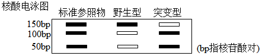

【解析】

【分析】1、基因突变是基因结构的改变，包括碱基对的增添、缺失或替换；基因突变发生的时间主要是细胞分裂的间期；基因突变的特点是低频性、普遍性、少利多害性、随机性、不定向性。

2、基因表达载体的构建：是基因工程的核心步骤，基因表达载体包括目的基因、启动子、终止子和标记基因等。

3、将目的基因导入受体细胞：根据受体细胞不同，导入的方法也不一样。将目的基因导入植物细胞的方法有农杆菌转化法、基因枪法和花粉管通道法；将目的基因导入动物细胞最有效的方法是显微注射法；将目的基因导入微生物细胞的方法是感受态细胞法。

【小问1详解】

根据题干信息可知，突变后的基因为隐性基因，则野生型DAI基因为显性基因，因此采用农杆菌转化法将野生型DAI基因转入突变体植株，若突变体表型确由该突变造成，则转基因植株的种子大小应与野生型植株的种子大小相近。

【小问2详解】

利用PCR技术扩增DAI基因后，应该用同种限制性核酸内切酶对DAI基因和运载体进行切割，再用DNA连接酶将两者连接起来；在基因表达载体中，启动子位于目的基因的首端，终止子位于目的基因的尾端，因此为确保插入的DAI基因可以正常表达，其上下游序列需具备启动子和终止子。

【小问3详解】

①根据题干信息和图形分析，将T0代植株的花序浸没在农杆菌（T-DNA上含有DAI基因和卡那霉素抗性基因）液中转化，再将获得的T1代种子播种在选择培养基（含有卡那霉素）上，若在选择培养基上有能够萌发并生长的阳性个体，则说明含有卡那霉素抗性基因，即表示其基因组中插入DAI基因和卡那霉素抗性基因。

②T1代阳性植株都含有DAI基因，由于T-DNA（其内部基因在减数分裂时不发生交换）可在基因组单一位点插入也可以同时插入多个位点，所以不确定是单一位点插入还是多位点插入，若是单一位点插入，相当于一对等位基因的杂合子，其自交后代应该出现3∶1的性状分离比，而题干要求选出单一位点插入的植株，因此应该选择阳性率约75%的培养基中幼苗继续培养。

③将以上获得的T2代阳性植株自交，再将得到的T3代种子按单株收种并播种于选择培养基上，若某培养基上全部为具有卡那霉素抗性的植株即为需要选择的植株，即阳性率达到100%的培养基中的幼苗即为目标转基因植株。根据图形分析，野生型和突变型基因片段的长度都是150bp，野生型的基因没有限制酶X的切割位点，而突变型的基因有限制酶X的切割位点，结合图中的数据分析可知电泳图中，野生型只有150bp，突变型有50bp和100bp，如图：

 。

21\. 上世纪70-90年代珠海淇澳岛红树林植被退化，形成的裸滩被外来入侵植物互花米草占据，天然红树林秋茄（乔木）-老鼠簕（灌木）群落仅存32hm2。为保护和恢复红树林植被，科技人员在互花米草侵占的滩涂上成功种植红树植物无瓣海桑，现已营造以无瓣海桑为主的人工红树林600hm2，各林龄群落的相关特征见下表。

| 红树林群落（林龄）       | 群落高度（m） | 植物种类（种） | 树冠层郁闭度（%） | 林下互花米草密度（株/m2） | 林下无瓣海桑更新幼苗密度（株/100m2） | 林下秋茄更新幼苗密度（株/100m2） |
|:---------------:|:-------:|:-------:|:---------:|:-------------------------:|:--------------------------------:|:------------------------------:|
| 无瓣海桑群落（3年）      | 3.2     | 3       | 70        | 30                        | 0                                | 0                              |
| 无瓣海桑群落（8年）      | 11.0    | 3       | 80        | 15                        | 10                               | 0                              |
| 无瓣海桑群落（16年）     | 12.5    | 2       | 90        | 0                         | 0                                | 0                              |
| 秋茄-老鼠簕群落（\>50年） | 5.7     | 4       | 90        | 0                         | 0                                | 19                             |

回答下列问题：

（1）在红树林植被恢复进程中，由裸滩经互花米草群落到无瓣海桑群落的过程称为\_\_\_\_\_\_\_\_\_。恢复的红树林既是海岸的天然防护林，也是多种水鸟栖息和繁殖场所，体现了生物多样性的\_\_\_\_\_\_\_\_\_价值。

（2）无瓣海桑能起到快速实现红树林恢复和控制互花米草的双重效果，其使互花米草消退的主要原因是\_\_\_\_\_\_\_\_\_。

（3）无瓣海桑是引种自南亚地区的大乔木，生长速度快，5年能大量开花结果，现已适应华南滨海湿地。有学者认为无瓣海桑有可能成为新的外来入侵植物。据表分析，提出你的观点和理由\_\_\_\_\_\_\_\_\_。

（4）淇澳岛红树林现为大面积人工种植的无瓣海桑纯林。为进一步提高该生态系统的稳定性，根据生态工程自生原理并考虑不同植物的生态位差异，提出合理的无瓣海桑群落改造建议\_\_\_\_\_\_\_\_\_。

【答案】（1） ①. 次生演替 ②. 间接

（2）无瓣海桑生长快，比互花米草高，在竞争中占优势

（3）随着时间的推移，无瓣海桑群落中植物种类逐渐减少，林下没有无瓣海桑和秋茄更新幼苗，可能会被本地物种所替代，所以不会引起新的入侵植物

（4）适当控制引进树种规模，扩大本土树种的种植，增加物种，提高生态系统的稳定性

【解析】

【分析】随时间的推移，一个群落被另一个群落代替的过程，叫做演替。演替的种类有初生演替和次生演替两种。初生演替是指一个从来没有被植物覆盖的地面，或者是原来存在过植被，但是被彻底消灭了的地方发生的演替。次生演替原来有的植被虽然已经不存在，但是原来有的土壤基本保留，甚至还保留有植物的种子和其他繁殖体的地方发生的演替。

【小问1详解】

由题意可知，红树林植被退化形成的裸滩被外来入侵植物互花米草占据，则由裸滩经互花米草群落到无瓣海桑群落的过程称为次生演替。恢复的红树林既是海岸的天然防护林，也是多种水鸟栖息和繁殖场所，这是红树林在生态系统方面的调节作用，体现了生物多样性的间接价值。

【小问2详解】

无瓣海桑是速生乔木，种植后由于其生长速度较快，在与互花米草在阳光等的竞争中占据优势，能有效抑制互花米草的蔓延。

【小问3详解】

根据表格数据可知，随着时间的推移，无瓣海桑群落中植物种类逐渐减少，林下没有无瓣海桑和秋茄更新幼苗，则无瓣海桑的种群数量不再增加，可能会被本地物种所替代，所以不会引起新的入侵植物。

【小问4详解】

通过适当控制引进树种规模，扩大本土树种的种植，增加物种，使营养结构变得复杂，可提高生态系统的稳定性，还能防止新的物种的入侵。
