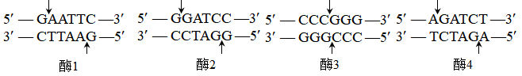

**2023年普通高等学校招生全国统一考试（新课标卷） 理科综合生物学科**

1\. 葡萄糖是人体所需的一种单糖。下列关于人体内葡萄糖的叙述，错误的是（ ）

A. 葡萄糖是人体血浆的重要组成成分，其含量受激素的调节

B. 葡萄糖是机体能量的重要来源，能经自由扩散通过细胞膜

C. 血液中的葡萄糖进入肝细胞可被氧化分解或转化为肝糖原

D. 血液中的葡萄糖进入人体脂肪组织细胞可转变为甘油三酯

2\. 我国劳动人民在漫长的历史进程中，积累了丰富的生产、生活经验，并在实践中应用。生产和生活中常采取的一些措施如下。

①低温储存，即果实、蔬菜等收获后在低温条件下存放

②春化处理，即对某些作物萌发的种子或幼苗进行适度低温处理

③风干储藏，即小麦、玉米等种子收获后经适当风干处理后储藏

④光周期处理，即在作物生长某一时期控制每天光照和黑暗的相对时长

⑤合理密植，即裁种作物时做到密度适当，行距、株距合理

⑥间作种植，即同一生长期内，在同一块土地上隔行种植两种高矮不同的作物

关于这些措施，下列说法合理的是（ ）

A. 措施②④分别反映了低温和昼夜长短与作物开花的关系

B. 措施③⑤的主要目的是降低有机物的消耗

C. 措施②⑤⑥的主要目的是促进作物的光合作用

D. 措施①③④的主要目的是降低作物或种子的呼吸作用强度

3\. 人体内的免疫细胞是体液免疫和细胞免疫过程的重要参与者。下列叙述正确的是（ ）

①免疫细胞表面的受体可识别细菌、病毒等入侵机体的病原体

②树突状细胞能够处理和呈递抗原，淋巴细胞不能呈递抗原

③辅助性T细胞参与体液免疫过程而不参与细胞免疫过程

④体液免疫可产生记忆B细胞，细胞免疫可产生记忆T细胞

⑤某些致病细菌感染人体既可引发体液免疫又可引发细胞免疫

A ①②④ B. ①④⑤ C. ②③⑤ D. ③④⑤

4\. 为了研究和保护我国东北地区某自然保护区内的野生哺乳动物资源，研究人员采用红外触发相机自动拍摄技术获得了该保护区内某些野生哺乳动物资源的相应数据，为生态学研究提供了相关依据。下列叙述错误的是（ ）

A. 通过对数据的分析和处理，可以了解保护区内大型野生哺乳动物的物种丰富度

B. 与标记重捕法相比，采用该技术进行调查对野生哺乳动物的生活干扰相对较小

C. 采用红外触发相机拍摄技术可调查生活在该自然保护区内东北豹的种群密度

D. 该技术能调查保护区内东北豹种群中成年个体数量，不能调查幼年个体数量

5\. 某研究小组从野生型高秆（显性）玉米中获得了2个矮秆突变体，为了研究这2个突变体的基因型，该小组让这2个矮秆突变体（亲本）杂交得F1，F1自交得F2，发现F2中表型及其比例是高秆:矮秆:极矮秆=9:6:1。若用A、B表示显性基因，则下列相关推测错误的是（ ）

A. 亲本的基因型为aaBB和AAbb，F1的基因型为AaBb

B. F2矮秆的基因型有aaBB、AAbb、aaBb、Aabb，共4种

C. 基因型是AABB的个体为高秆，基因型是aabb的个体为极矮秆

D. F2矮秆中纯合子所占比例为1/2，F2高秆中纯合子所占比例为1/16

6\. 某同学拟用限制酶（酶1、酶2、酶3和酶4）、DNA连接酶为工具，将目的基因（两端含相应限制酶的识别序列和切割位点）和质粒进行切割、连接，以构建重组表达载体。限制酶的切割位点如图所示。

下列重组表达载体构建方案合理且效率最高是（ ）

A. 质粒和目的基因都用酶3切割，用*E*. *coli* DNA连接酶连接

B. 质粒用酶3切割、目的基因用酶1切割，用T4 DNA连接酶连接

C. 质粒和目的基因都用酶1和酶2切割，用T4 DNA连接酶连接

D. 质粒和目的基因都用酶2和酶4切割，用*E*. *coli* DNA连接酶连接

7\. 植物的生长发育受多种因素调控。回答下列问题。

（1）细胞增殖是植物生长发育的基础。细胞增殖具有周期性，细胞周期中的分裂间期为分裂期进行物质准备，物质准备过程主要包括\_\_\_\_\_\_\_\_\_\_\_。

（2）植物细胞分裂是由生长素和细胞分裂素协同作用完成。在促进细胞分裂方面，生长素的主要作用是\_\_\_\_\_\_\_\_\_\_，细胞分裂素的主要作用是\_\_\_\_\_\_\_\_\_\_。

（3）给黑暗中生长的幼苗照光后幼苗的形态出现明显变化，在这一过程中感受光信号的受体有\_\_\_\_\_\_\_\_\_\_（答出1点即可），除了光，调节植物生长发育的环境因素还有\_\_\_\_\_\_\_\_\_\_（答出2点即可）。

8\. 人在运动时会发生一系列生理变化，机体可通过神经调节和体液调节维持内环境的稳态。回答下列问题。

（1）运动时，某种自主神经活动占优势使心跳加快，这种自主神经是\_\_\_\_\_\_\_\_\_\_。

（2）剧烈运动时，机体耗氧量增加、葡萄糖氧化分解产生大量CO2，CO2进入血液使呼吸运动加快。CO2使呼吸运动加快的原因是\_\_\_\_\_\_\_\_\_\_。

（3）运动时葡萄糖消耗加快，胰高血糖素等激素分泌增加，以维持血糖相对稳定。胰高血糖素在升高血糖浓度方面所起的作用是\_\_\_\_\_\_\_\_\_\_。

（4）运动中出汗失水导致细胞外液渗透压升高，垂体释放的某种激素增加，促进肾小管、集合管对水的重吸收，该激素是\_\_\_\_\_\_\_\_\_\_。若大量失水使细胞外液量减少以及血钠含量降低时，可使醛固酮分泌增加。醛固酮的主要生理功能是\_\_\_\_\_\_\_\_\_\_。

9\. 现发现一种水鸟主要在某湖区的浅水和泥滩中栖息，以湖区的某些植物为其主要的食物来源。回答下列问题。

（1）湖区的植物、水鸟、细菌等生物成分和无机环境构成了一个生态系统。能量流经食物链上该种水鸟的示意图如下，①、②、③表示生物的生命活动过程，其中①是\_\_\_\_\_\_\_\_\_\_；②是\_\_\_\_\_\_\_\_\_\_；③是\_\_\_\_\_\_\_\_\_\_。

（2）要研究湖区该种水鸟的生态位，需要研究的方面有\_\_\_\_\_\_\_\_\_\_（答出3点即可）。该生态系统中水鸟等各种生物都占据着相对稳定的生态位，其意义是\_\_\_\_\_\_\_\_\_\_。

（3）近年来，一些水鸟离开湖区前往周边稻田，取食稻田中收割后散落的稻谷，羽毛艳丽的水鸟引来一些游客观赏。从保护鸟类的角度来看，游客在观赏水鸟时应注意的事项是\_\_\_\_\_\_\_\_\_\_（答出1点即可）。

10\. 果蝇常用作遗传学研究的实验材料。果蝇翅型的长翅和截翅是一对相对性状，眼色的红眼和紫眼是另一对相对性状，翅型由等位基因T/t控制，眼色由等位基因R/r控制。某小组以长翅红眼、截翅紫眼果蝇为亲本进行正反交实验，杂交子代的表型及其比例分别为，长翅红眼雌蝇：长翅红眼雄蝇=1：1（杂交①的实验结果）；长翅红眼雌蝇：截翅红眼雄蝇=1：1（杂交②的实验结果）。回答下列问题。

（1）根据杂交结果可以判断，翅型的显性性状是\_\_\_\_\_\_\_\_\_\_，判断的依据是\_\_\_\_\_\_\_\_\_\_。

（2）根据杂交结果可以判断，属于伴性遗传的性状是\_\_\_\_\_\_\_\_\_\_，判断的依据是\_\_\_\_\_\_\_\_\_\_。

杂交①亲本的基因型是\_\_\_\_\_\_\_\_\_\_，杂交②亲本的基因型是\_\_\_\_\_\_\_\_\_\_。

（3）若杂交①子代中的长翅红眼雌蝇与杂交②子代中的截翅红眼雄蝇杂交，则子代翅型和眼色的表型及其比例为\_\_\_\_\_\_\_\_\_\_。

11\. 根瘤菌与豆科植物之间是互利共生关系，根瘤菌侵入豆科植物根内可引起根瘤的形成，根瘤中的根瘤菌具有固氮能力。为了寻找抗逆性强的根瘤菌，某研究小组做了如下实验：从盐碱地生长的野生草本豆科植物中分离根瘤菌；选取该植物的茎尖为材料，通过组织培养获得试管苗（生根试管苗）；在实验室中探究试管苗根瘤中所含根瘤菌的固氮能力。回答下列问题。

（1）从豆科植物的根瘤中分离根瘤菌进行培养，可以获得纯培养物，此实验中的纯培养物是\_\_\_\_\_\_\_\_\_\_。

（2）取豆科植物的茎尖作为外植体，通过植物组织培养可以获得豆科植物的试管苗。外植体经诱导形成试管苗的流程是：外植体愈伤组织试管苗。其中①表示的过程是\_\_\_\_\_\_\_\_\_\_，②表示的过程是\_\_\_\_\_\_\_\_\_\_。由外植体最终获得完整的植株，这一过程说明植物细胞具有全能性。细胞的全能性是指\_\_\_\_\_\_\_\_\_\_。

（3）研究小组用上述获得的纯培养物和试管苗为材料，研究接种到试管苗上的根瘤菌是否具有固氮能力，其做法是将生长在培养液中的试管苗分成甲、乙两组，甲组中滴加根瘤菌菌液，让试管苗长出根瘤。然后将甲、乙两组的试管苗分别转入\_\_\_\_\_\_\_\_\_\_的培养液中培养，观察两组试管苗的生长状况，若甲组的生长状况好于乙组，则说明\_\_\_\_\_\_\_\_\_\_\_\_\_\_\_\_\_\_\_\_。

（4）若实验获得一种具有良好固氮能力的根瘤菌，可通过发酵工程获得大量根瘤菌，用于生产根瘤菌肥。根瘤菌肥是一种微生物肥料，在农业生产中使用微生物肥料的作用是\_\_\_\_\_\_\_\_\_\_（答出2点即可）。
