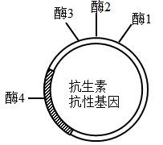
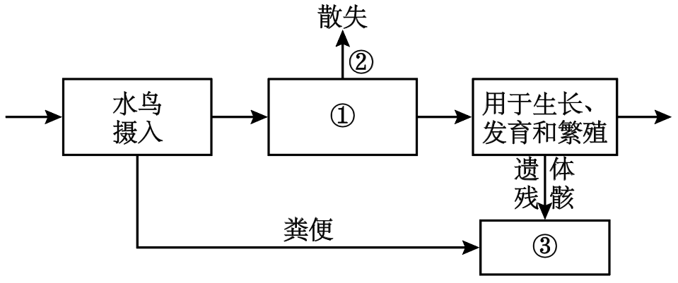

**2023年普通高等学校招生全国统一考试（新课标卷） 理科综合生物学科**

1\. 葡萄糖是人体所需的一种单糖。下列关于人体内葡萄糖的叙述，错误的是（ ）

A. 葡萄糖是人体血浆的重要组成成分，其含量受激素的调节

B. 葡萄糖是机体能量的重要来源，能经自由扩散通过细胞膜

C. 血液中的葡萄糖进入肝细胞可被氧化分解或转化为肝糖原

D. 血液中的葡萄糖进入人体脂肪组织细胞可转变为甘油三酯

【答案】B

【解析】

【分析】葡萄糖是细胞生命活动所需要的主要能源物质，常被形容为“生命的燃料”。

【详解】A、葡萄糖是人体血浆的重要组成成分，血液中的糖称为血糖，血糖含量受胰岛素、胰高血糖素等激素的调节，A正确；

B、葡萄糖是细胞生命活动所需要的主要能源物质，是机体能量的重要来源，葡萄糖通过细胞膜进入红细胞是协助扩散，进入其他细胞一般通过主动运输，B错误；

CD、血糖浓度升高时，在胰岛素作用下，血糖可以进入肝细胞进行氧化分解并合成肝糖原，进入脂肪组织细胞转变为甘油三酯，CD正确。

故选B。

2\. 我国劳动人民在漫长的历史进程中，积累了丰富的生产、生活经验，并在实践中应用。生产和生活中常采取的一些措施如下。

①低温储存，即果实、蔬菜等收获后在低温条件下存放

②春化处理，即对某些作物萌发的种子或幼苗进行适度低温处理

③风干储藏，即小麦、玉米等种子收获后经适当风干处理后储藏

④光周期处理，即在作物生长的某一时期控制每天光照和黑暗的相对时长

⑤合理密植，即裁种作物时做到密度适当，行距、株距合理

⑥间作种植，即同一生长期内，在同一块土地上隔行种植两种高矮不同的作物

关于这些措施，下列说法合理的是（ ）

A. 措施②④分别反映了低温和昼夜长短与作物开花的关系

B. 措施③⑤的主要目的是降低有机物的消耗

C. 措施②⑤⑥的主要目的是促进作物的光合作用

D. 措施①③④的主要目的是降低作物或种子的呼吸作用强度

【答案】A

【解析】

【分析】常考的细胞呼吸原理的应用：1、用透气纱布或“创可贴”包扎伤口：增加通气量，抑制致病菌的无氧呼吸。2、酿酒时：早期通气--促进酵母菌有氧呼吸，利于菌种繁殖，后期密封发酵罐--促进酵母菌无氧呼吸，利于产生酒精。3、做馒头或面包时，加入酵母菌，酵母菌经过发酵可以分解面粉中的葡萄糖，产生二氧化碳，二氧化碳是气体，遇热膨胀而形成小孔，使得馒头或面包暄软多孔。4、食醋、味精制作：向发酵罐中通入无菌空气，促进醋酸杆菌、谷氨酸棒状杆菌进行有氧呼吸。5、土壤松土，促进根细胞呼吸作用，有利于主动运输，为矿质元素吸收供应能量。6、稻田定期排水：促进水稻根细胞有氧呼吸。7、提倡慢跑：促进肌细胞有氧呼吸，防止无氧呼吸产生乳酸使肌肉酸胀。

【详解】A、措施②春化处理是为了促进花芽形成，反映了低温与作物开花的关系，④光周期处理，反映了昼夜长短与作物开花的关系，A正确；

B、措施③风干储藏可以减少自由水，从而减弱细胞呼吸，降低有机物的消耗，⑤合理密植的主要目的是提高能量利用率，促进光合作用，B错误；

C、措施②春化处理是为了促进花芽形成，⑤⑥的主要目的是促进作物的光合作用，C错误；

D、措施①③的主要目的是降低作物或种子的呼吸作用强度，④光周期处理，目的是促进或抑制植物开花，D错误。

故选A。

3\. 人体内的免疫细胞是体液免疫和细胞免疫过程的重要参与者。下列叙述正确的是（ ）

①免疫细胞表面的受体可识别细菌、病毒等入侵机体的病原体

②树突状细胞能够处理和呈递抗原，淋巴细胞不能呈递抗原

③辅助性T细胞参与体液免疫过程而不参与细胞免疫过程

④体液免疫可产生记忆B细胞，细胞免疫可产生记忆T细胞

⑤某些致病细菌感染人体既可引发体液免疫又可引发细胞免疫

A. ①②④ B. ①④⑤ C. ②③⑤ D. ③④⑤

【答案】B

【解析】

【分析】免疫细胞是执行免疫功能的细胞，它们来自骨髓的造血干细胞，包括各种类型的白细胞，如淋巴细胞、树突状细胞和巨噬细胞等。

【详解】①病原体进入机体后，其表面一些特定的蛋白质等物质，能够与免疫细胞表面的受体结合，从而引发免疫反应，故免疫细胞表面的受体可识别细菌、病毒等入侵机体的病原体，①正确；

②B细胞、树突状细胞和巨噬细胞都能够处理和呈递抗原，B细胞属于淋巴细胞，②错误；

③辅助性T细胞在体液免疫过程中，辅助性T细胞表面的特定分子发生变化与B细胞结合作为激活B细胞的第二信号，并且分裂分化，分泌细胞因子促进B细胞的分裂、分化过程；在细胞免疫过程中，辅助性T细胞分泌细胞因子促进细胞毒性T细胞增殖分化。因此辅助性T细胞既参与体液免疫又参与细胞免疫过程，③错误；

④体液免疫过程中，B细胞活化后开始增殖分化，一小部分分化为记忆B细胞；细胞免疫过程中，细胞毒性T细胞分裂并分化，形成新的细胞毒性T细胞和记忆T细胞，④正确；

⑤某些致病细菌是寄生在宿主细胞内的，感染人体时既可引发体液免疫又可引发细胞免疫，⑤正确。

综上所述，①④⑤正确

故选B。

4\. 为了研究和保护我国东北地区某自然保护区内的野生哺乳动物资源，研究人员采用红外触发相机自动拍摄技术获得了该保护区内某些野生哺乳动物资源的相应数据，为生态学研究提供了相关依据。下列叙述错误的是（ ）

A. 通过对数据的分析和处理，可以了解保护区内大型野生哺乳动物的物种丰富度

B. 与标记重捕法相比，采用该技术进行调查对野生哺乳动物的生活干扰相对较小

C. 采用红外触发相机拍摄技术可调查生活在该自然保护区内东北豹的种群密度

D. 该技术能调查保护区内东北豹种群中成年个体数量，不能调查幼年个体数量

【答案】D

【解析】

【分析】1、样方法--估算种群密度最常用的方法之一（1）概念：在被调查种群的分布范围内，随机选取若干个样方，通过计数每个样方内的个体数，求得每个样方的种群密度，以所有样方法种群密度的平均值作为该种群的种群密度估计值。（2）适用范围：植物种群密度，昆虫卵的密度，蚜虫、跳蝻的密度等。

2、标记重捕法（1）前提条件：标志个体与未标志个体重捕的概率相等。调查期内没有新的出生和死亡，无迁入和迁出。（2）适用范围：活动能力强和范围大的动物，如哺乳类、鸟类、爬行类、两栖类、鱼类和昆虫等动物。

【详解】A、红外触发相机监测野生动物方法是一种新型调查手段，特别适用于对活动隐秘的大中型、珍稀兽类、鸟类的记录。通过对数据的分析和处理，可以了解保护区内大型野生哺乳动物的物种数目的多少，即物种丰富度，A正确；

B、标记重捕法需要捕捉动物并标记，后再次捕捉，故与标记重捕法相比，采用该技术进行调查对野生哺乳动物的生活干扰相对较小， B正确；

C、采用红外触发相机拍摄技术可得保护区内东北豹种群数量和分布情况，即可调查生活在该自然保护区内东北豹的种群密度 ，C正确；

D、该技术能调查保护区内东北豹种群中各年龄段的个体数量，D错误。

故选D。

5\. 某研究小组从野生型高秆（显性）玉米中获得了2个矮秆突变体，为了研究这2个突变体的基因型，该小组让这2个矮秆突变体（亲本）杂交得F1，F1自交得F2，发现F2中表型及其比例是高秆:矮秆:极矮秆=9:6:1。若用A、B表示显性基因，则下列相关推测错误的是（ ）

A. 亲本的基因型为aaBB和AAbb，F1的基因型为AaBb

B. F2矮秆的基因型有aaBB、AAbb、aaBb、Aabb，共4种

C. 基因型是AABB的个体为高秆，基因型是aabb的个体为极矮秆

D. F2矮秆中纯合子所占比例为1/2，F2高秆中纯合子所占比例为1/16

【答案】D

【解析】

【分析】由题干信息可知，2个矮秆突变体（亲本）杂交得F1，F1自交得F2，发现F2中表型及其比例是高秆:矮秆:极矮秆=9:6:1，符合9:3:3:1的变式，因此控制两个矮秆突变体的基因遵循基因的自由组合定律。

【详解】A、F2中表型及其比例是高秆:矮秆:极矮秆=9:6:1，符合:9:3:3:1的变式，因此因此控制两个矮秆突变体的基因遵循基因的自由组合定律，即高秆基因型为A_B\_，矮秆基因型为A_bb、aaB\_，极矮秆基因型为aabb，因此可推知亲本的基因型为aaBB和AAbb，F1的基因型为AaBb，A正确；

B、矮秆基因型为A_bb、aaB\_，因此F2矮秆的基因型有aaBB、AAbb、aaBb、Aabb，共4种，B正确；

C、由F2中表型及其比例可知基因型是AABB的个体为高秆，基因型是aabb的个体为极矮秆，C正确；

D、F2矮秆基因型为A_bb、aaB_共6份，纯合子基因型为aaBB、AAbb共2份，因此矮秆中纯合子所占比例为1/3，F2高秆基因型为A_B_共9份，纯合子为AABB共1份，因此高秆中纯合子所占比例为1/9，D错误。

故选D。

6\. 某同学拟用限制酶（酶1、酶2、酶3和酶4）、DNA连接酶为工具，将目的基因（两端含相应限制酶的识别序列和切割位点）和质粒进行切割、连接，以构建重组表达载体。限制酶的切割位点如图所示。

下列重组表达载体构建方案合理且效率最高的是（ ）

A. 质粒和目的基因都用酶3切割，用*E*. *coli* DNA连接酶连接

B. 质粒用酶3切割、目的基因用酶1切割，用T4 DNA连接酶连接

C. 质粒和目的基因都用酶1和酶2切割，用T4 DNA连接酶连接

D. 质粒和目的基因都用酶2和酶4切割，用*E*. *coli* DNA连接酶连接

【答案】C

【解析】

【分析】DNA连接酶：

（1）根据酶的来源不同分为两类：E.coliDNA连接酶、T4DNA连接酶。这二者都能连接黏性末端，此外T4DNA连接酶还可以连接平末端，但连接平末端时的效率比较低。

（2）DNA连接酶连接的是两个核苷酸之间的磷酸二酯键。

【详解】A、酶3切割后得到的是平末端，应该用T4 DNA连接酶连接，A错误；

B、质粒用酶3切割后得到平末端，目的基因用酶1切割后得到的是黏性末端，二者不能连接，B错误；

C、质粒和目的基因都用酶1和酶2切割后得到黏性末端，用T4 DNA连接酶连接后，还能保证目的基因在质粒上的连接方向，此重组表达载体的构建方案最合理且高效，C正确；

D、若用酶2和酶4切割质粒和目的基因，会破坏质粒上的抗生素抗性基因，连接形成的基因表达载体缺少标记基因，无法进行后续的筛选，D错误。

故选C。

7\. 植物的生长发育受多种因素调控。回答下列问题。

（1）细胞增殖是植物生长发育的基础。细胞增殖具有周期性，细胞周期中的分裂间期为分裂期进行物质准备，物质准备过程主要包括\_\_\_\_\_\_\_\_\_\_\_。

（2）植物细胞分裂是由生长素和细胞分裂素协同作用完成的。在促进细胞分裂方面，生长素的主要作用是\_\_\_\_\_\_\_\_\_\_，细胞分裂素的主要作用是\_\_\_\_\_\_\_\_\_\_。

（3）给黑暗中生长的幼苗照光后幼苗的形态出现明显变化，在这一过程中感受光信号的受体有\_\_\_\_\_\_\_\_\_\_（答出1点即可），除了光，调节植物生长发育的环境因素还有\_\_\_\_\_\_\_\_\_\_（答出2点即可）。

【答案】（1）DNA分子复制和有关蛋白质的合成

（2） ①. 促进细胞核的分裂 ②. 促进细胞质的分裂

（3） ①. 光敏色素 ②. 温度、重力

【解析】

【分析】光敏色素是一类蛋白质（色素-蛋白复合体）分布在植物的各个部位，其中在分生组织的细胞内比较丰富。受到光照射后→光敏色素结构会发生变化→这一变化的信息传导到细胞核内→基因选择性表达→表现出生物学效应。

【小问1详解】

细胞周期中的分裂间期为分裂期进行物质准备，物质准备过程主要包括DNA分子复制和有关蛋白质的合成。

【小问2详解】

在促进细胞分裂方面，生长素的主要作用是促进细胞核的分裂，而细胞分裂素主要表现在促进细胞质的分裂，二者协调促进细胞分裂的完成，表现出协同作用。

【小问3详解】

植物能对光作出反应，是因为其具有能接受光信号的分子，给黑暗中生长的幼苗照光后幼苗的形态出现明显变化，在这一过程中感受光信号的受体有光敏色素，光敏色素接受光照后，结构发生改变，该信息传导到细胞核，进而调控基因的表达，表现出生物学效应；除了光，温度（如植物代谢会随温度不同而有旺盛和缓慢之分）、重力等环境因素也会参与调节植物的生长发育。

8\. 人在运动时会发生一系列生理变化，机体可通过神经调节和体液调节维持内环境的稳态。回答下列问题。

（1）运动时，某种自主神经的活动占优势使心跳加快，这种自主神经是\_\_\_\_\_\_\_\_\_\_。

（2）剧烈运动时，机体耗氧量增加、葡萄糖氧化分解产生大量CO2，CO2进入血液使呼吸运动加快。CO2使呼吸运动加快的原因是\_\_\_\_\_\_\_\_\_\_。

（3）运动时葡萄糖消耗加快，胰高血糖素等激素分泌增加，以维持血糖相对稳定。胰高血糖素在升高血糖浓度方面所起的作用是\_\_\_\_\_\_\_\_\_\_。

（4）运动中出汗失水导致细胞外液渗透压升高，垂体释放的某种激素增加，促进肾小管、集合管对水的重吸收，该激素是\_\_\_\_\_\_\_\_\_\_。若大量失水使细胞外液量减少以及血钠含量降低时，可使醛固酮分泌增加。醛固酮的主要生理功能是\_\_\_\_\_\_\_\_\_\_。

【答案】（1）交感神经

（2）人体剧烈运动时，呼吸作用增强，耗氧量增大，同时产生的CO2增多，刺激呼吸中枢，加快呼吸运动的频率

（3）促进肝糖原分解成葡萄糖，促进非糖物质转变成糖

（4） ①. 抗利尿激素 ②. 促进肾小管和集合管对Na＋的重吸收，维持血钠含量的平衡

【解析】

【分析】1、交感神经和副交感神经是调节人体内脏功能的神经装置，所以也叫内脏神经系统，因为其功能不完全受人类的意识支配，所以又叫自主神经系统。

2、剧烈运动时，人体的呼吸频率会加快，呼吸作用增强，血液中二氧化碳增多，刺激呼吸运动中枢，加快呼吸运动频率。

【小问1详解】

自主神经包括交感神经和副交感神经，运动时，交感神经的活动占优势，表现为心跳加快，支气管扩张，但胃肠的蠕动和消化腺的分泌活动减弱；

【小问2详解】

人体的呼吸中枢位于脑干，剧烈运动时，人体的呼吸频率会加快，呼吸作用增强，血液中二氧化碳增多，刺激感受器产生兴奋，传至呼吸中枢，导致呼吸加深加快，肺的通气量增加，排出体内过多的二氧化碳。

【小问3详解】

胰高血糖素是机体中能够升高血糖的激素之一，该激素主要作用于肝，促进肝糖原分解成葡萄糖进入血液，促进非糖物质转变成糖，使血糖回升到正常水平。

【小问4详解】

细胞外液渗透压升高时，抗利尿激素分泌增多，可以促进肾小管、集合管对水的重吸收，使渗透压恢复正常；醛固酮是由肾上腺皮质分泌的一种激素，其主要生理功能是促进肾小管和集合管对Na＋的重吸收，维持血钠含量的平衡。

9\. 现发现一种水鸟主要在某湖区的浅水和泥滩中栖息，以湖区的某些植物为其主要的食物来源。回答下列问题。

（1）湖区的植物、水鸟、细菌等生物成分和无机环境构成了一个生态系统。能量流经食物链上该种水鸟的示意图如下，①、②、③表示生物的生命活动过程，其中①是\_\_\_\_\_\_\_\_\_\_；②是\_\_\_\_\_\_\_\_\_\_；③是\_\_\_\_\_\_\_\_\_\_。

（2）要研究湖区该种水鸟的生态位，需要研究的方面有\_\_\_\_\_\_\_\_\_\_（答出3点即可）。该生态系统中水鸟等各种生物都占据着相对稳定的生态位，其意义是\_\_\_\_\_\_\_\_\_\_。

（3）近年来，一些水鸟离开湖区前往周边稻田，取食稻田中收割后散落的稻谷，羽毛艳丽的水鸟引来一些游客观赏。从保护鸟类的角度来看，游客在观赏水鸟时应注意的事项是\_\_\_\_\_\_\_\_\_\_（答出1点即可）。

【答案】（1） ①. 水鸟的同化量 ②. 水鸟通过呼吸作用以热能散失的能量 ③. 流向分解者的能量

（2） ①. 栖息地、食物、天敌以及与其它物种的关系等 ②. 有利于不同生物之间充分利用环境资源

（3）不破坏水鸟的生存环境；远距离观赏

【解析】

【分析】能量流动的相关计算为：摄入的能量有两个去向：同化量+粪便量（粪便量属于上一个营养级流向分解者的能量）。同化的能量有两个去向：呼吸作用散失的能量+用于生长发育和繁殖的能量。用于生长发育和繁殖的能量有两个去向：传递给下一个营养级+流向分解者。能量传递效率=传递给下一营养级的能量÷该营养级所同化的能量。

【小问1详解】

据图可知，①是水鸟摄入后减去粪便剩余的能量，故表示水鸟的同化量；②是①（水鸟的同化量）减去用于生长发育繁殖的能量，表示水鸟通过呼吸作用以热能散失的能量；③是流向分解者的能量，包括水鸟遗体残骸中的能量和上一营养级的同化量。

【小问2详解】

一个物种在群落中的地位或作用，包括所处的空间位置，占用资源的情况，以及与其他物种的关系等，称为这个物种的生态位，水鸟属于动物，研究其生态位，需要研究的方面有：它的栖息地、食物、天敌以及与其它物种的关系等；群落中每种生物都占据着相对稳定的生态位，这有利于不同生物之间充分利用环境资源。

【小问3详解】

鸟类的生存与环境密切相关，从保护鸟类的角度来看，游客在观赏水鸟时应注意的事项有：不破坏水鸟的生存环境（不丢弃废弃物、不污染水源）；远距离观赏而避免对其造成惊吓等。

10\. 果蝇常用作遗传学研究的实验材料。果蝇翅型的长翅和截翅是一对相对性状，眼色的红眼和紫眼是另一对相对性状，翅型由等位基因T/t控制，眼色由等位基因R/r控制。某小组以长翅红眼、截翅紫眼果蝇为亲本进行正反交实验，杂交子代的表型及其比例分别为，长翅红眼雌蝇：长翅红眼雄蝇=1：1（杂交①的实验结果）；长翅红眼雌蝇：截翅红眼雄蝇=1：1（杂交②的实验结果）。回答下列问题。

（1）根据杂交结果可以判断，翅型的显性性状是\_\_\_\_\_\_\_\_\_\_，判断的依据是\_\_\_\_\_\_\_\_\_\_。

（2）根据杂交结果可以判断，属于伴性遗传的性状是\_\_\_\_\_\_\_\_\_\_，判断的依据是\_\_\_\_\_\_\_\_\_\_。

杂交①亲本的基因型是\_\_\_\_\_\_\_\_\_\_，杂交②亲本的基因型是\_\_\_\_\_\_\_\_\_\_。

（3）若杂交①子代中的长翅红眼雌蝇与杂交②子代中的截翅红眼雄蝇杂交，则子代翅型和眼色的表型及其比例为\_\_\_\_\_\_\_\_\_\_。

【答案】（1） ①. 长翅 ②. 亲代是长翅和截翅果蝇，杂交①子代全是长翅

（2） ①. 翅型 ②. 翅型的正反交实验结果不同 ③. RRXTXT、rrXtY ④. rrXtXt、RRXTY

（3）红眼长翅雌蝇∶红眼截翅雌蝇：红眼长翅雄蝇∶红眼截翅雄蝇∶紫眼长翅雌蝇∶紫眼截翅雌蝇：紫眼长翅雄蝇∶紫眼截翅雄蝇=3∶3∶3∶3∶1∶1∶1∶1

【解析】

【分析】基因分离定律实质:在杂合子的细胞中，位于一对同源染色体上的等位基因，具有一定的独立性;生物体在进行减数分裂形成配子时，等位基因会随着同源染色体的分开而分离，分别进入到两个配子中，独立地随配子遗传给后代。

【小问1详解】

具有相对性状亲本杂交，子一代所表现出的性状是显性性状，分析题意可知，仅考虑翅型，亲代是长翅和截翅果蝇，杂交①子代全是长翅，说明长翅对截翅是显性性状。

【小问2详解】

分析题意，实验①和实验②是正反交实验，两组实验中翅型在子代雌雄果蝇中表现不同（正反交实验结果不同），说明该性状位于X染色体上，属于伴性遗传；根据实验结果可知，翅型的相关基因位于X染色体，且长翅是显性性状，而眼色的正反交结果无差异，说明基因位于常染色体，且红眼为显性性状，杂交①长翅红眼、截翅紫眼果蝇的子代长翅红眼雌蝇（R-XTX-）：长翅红眼雄蝇（R-XTY）=1：1，其中XT来自母本，说明亲本中雌性是长翅红眼RRXTXT，而杂交②长翅红眼、截翅紫眼果蝇的子代长翅红眼雌蝇（R-XTX-）：截翅红眼雄蝇（R-XtY）=1：1，其中的Xt只能来自亲代母本，说明亲本中雌性是截翅紫眼，基因型是rrXtXt，故可推知杂交①亲本的基因型是RRXTXT、rrXtY，杂交②的亲本基因型是rrXtXt、RRXTY。

【小问3详解】

若杂交①子代中的长翅红眼雌蝇（RrXTXt）与杂交②子代中的截翅红眼雄蝇（RrXtY）杂交，两对基因逐对考虑，则Rr×Rr→R-∶rr=3∶1，即红眼∶紫眼=3∶1，XTXt×XtY→XTXt：XtXt：XTY∶XtY=1∶1∶1∶1，即表现为长翅雌蝇∶截翅雌蝇∶长翅雄蝇∶截翅雄蝇=1∶1∶1∶1，则子代中红眼长翅雌蝇∶红眼截翅雌蝇：红眼长翅雄蝇∶红眼截翅雄蝇∶紫眼长翅雌蝇∶紫眼截翅雌蝇：紫眼长翅雄蝇∶紫眼截翅雄蝇=3∶3∶3∶3∶1∶1∶1∶1。

11\. 根瘤菌与豆科植物之间是互利共生关系，根瘤菌侵入豆科植物根内可引起根瘤的形成，根瘤中的根瘤菌具有固氮能力。为了寻找抗逆性强的根瘤菌，某研究小组做了如下实验：从盐碱地生长的野生草本豆科植物中分离根瘤菌；选取该植物的茎尖为材料，通过组织培养获得试管苗（生根试管苗）；在实验室中探究试管苗根瘤中所含根瘤菌的固氮能力。回答下列问题。

（1）从豆科植物的根瘤中分离根瘤菌进行培养，可以获得纯培养物，此实验中的纯培养物是\_\_\_\_\_\_\_\_\_\_。

（2）取豆科植物茎尖作为外植体，通过植物组织培养可以获得豆科植物的试管苗。外植体经诱导形成试管苗的流程是：外植体愈伤组织试管苗。其中①表示的过程是\_\_\_\_\_\_\_\_\_\_，②表示的过程是\_\_\_\_\_\_\_\_\_\_。由外植体最终获得完整的植株，这一过程说明植物细胞具有全能性。细胞的全能性是指\_\_\_\_\_\_\_\_\_\_。

（3）研究小组用上述获得的纯培养物和试管苗为材料，研究接种到试管苗上的根瘤菌是否具有固氮能力，其做法是将生长在培养液中的试管苗分成甲、乙两组，甲组中滴加根瘤菌菌液，让试管苗长出根瘤。然后将甲、乙两组的试管苗分别转入\_\_\_\_\_\_\_\_\_\_的培养液中培养，观察两组试管苗的生长状况，若甲组的生长状况好于乙组，则说明\_\_\_\_\_\_\_\_\_\_\_\_\_\_\_\_\_\_\_\_。

（4）若实验获得一种具有良好固氮能力的根瘤菌，可通过发酵工程获得大量根瘤菌，用于生产根瘤菌肥。根瘤菌肥是一种微生物肥料，在农业生产中使用微生物肥料的作用是\_\_\_\_\_\_\_\_\_\_（答出2点即可）。

【答案】（1）由根瘤菌繁殖形成的单菌落　

（2） ①. 脱分化 ②. 再分化 ③. 细胞经分裂和分化后，仍具有产生完整有机体或分化成其他各种细胞的潜能和特性。

（3） ①. 无氮源 ②. 接种到试管苗上的根瘤菌具有固氮能力

（4）①促讲植物生长，增加作物产量　②能够减少化肥使用，改良土壤，减少污染，保护生态环境

【解析】

【分析】在微生物学中，将接种于培养基内，在合适条件下形成的含特定种类微生物的群体称为培养物。由单一个体繁殖所获得的微生物群体称为纯培养物。获得纯培养物的过程称纯培养，包括配制培养基、灭菌、接种、分离和培养等步骤。

细胞全能性是指细胞经分裂和分化后，仍具有产生完整有机体或分化成其他各种细胞潜能和特性。

植物组织培养是指在无菌和人工控制的环境条件下，利用人工培养基对离体的植物器官、组织、细胞及原生质体等进行培养，使其再生细胞或完整植株的技术。

【小问1详解】

在微生物学中将接种于培养基内，在合适条件下形成的含特定种类微生物的群体成为纯培养物。由单一个体繁殖所获得的微生物群体。对于本实验来说就是根瘤菌繁殖得到的单菌落。

【小问2详解】

植物组织培养的过程先是脱分化形成愈伤组织，后再分化形成试管苗。细胞全能性是指细胞经分裂和分化后，仍具有产生完整有机体或分化成其他各种细胞的潜能和特性。

【小问3详解】

控制变量，因为甲组和乙组的区别是固氮菌，所以要保证培养液中没有氮源，探究的是接种到试管菌上的根瘤菌是否具有固氮能力，如果甲长得好，说明接种到试管菌上的根瘤能具有固氮能力。

【小问4详解】

微生物肥料除了能够促进植物生长，起到肥料的作用之外，能够减少化肥的使用，改良土壤，保护环境。
