**江苏省2023年普通高中学业水平选择性考试**

**生 物**

**一、单项选择题：共14题，每题2分，共28分。每题只有一个选项最符合题意。**

1.下列关于细胞生命历程的叙述错误的是（ ）

A.细胞分裂和凋亡共同维持多细胞生物体的细胞数量

B.抑制细胞端粒酶的活性有助于延缓细胞衰老

C.细胞自噬降解细胞内自身物质，维持细胞内环境稳态

D.DNA甲基化抑制抑癌基因的表达可诱发细胞癌变

2.植物细胞及其部分结构如图所示。下列相关叙述错误的是（ ）

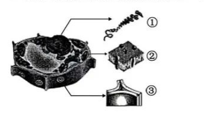

A.主要由DNA和蛋白质组成的①只存在于细胞核中

B.核膜及各种细胞器膜的基本结构都与②相似

C.③的主要成分是多糖，也含有多种蛋白质

D.植物细胞必须具备①、②和③才能存活

3.细胞色素C是一种线粒体内膜蛋白，参与呼吸链中的电子传递，在不同物种间具有高度保

守性。下列关于细胞色素C的叙述正确的是（ ）

A.仅由C、H、O、N四种元素组成

B.是一种能催化ATP合成的蛋白质

C.是由多个氨基酸通过氢键连接而成的多聚体

D.不同物种间氨基酸序列的相似性可作为生物进化的证据

4.我国天然林保护工程等国家重点生态工程不仅在生态恢复、生物多样性保护等方面发挥着

重要作用，还显著增加了生态系统的固碳能力。下列相关叙述正确的是（ ）

A.天然林的抵抗力稳定性强，全球气候变化对其影响不大

B.减少化石燃料的大量使用可消除温室效应的形成

C.碳循环中无机碳通过光合作用和化能合成作用进入生物群落

D.天然林保护是实现碳中和的重要措施，主要体现了生物多样性的直接价值

5.为研究油菜素内酯（BL)和生长素(IAA)对植物侧根形成是否有协同效应，研究者进

行了如下实验：在不含BL、含有lnmol/LBL的培养基中，分别加入不同浓度IAA，培养

拟南芥8天，统计侧根数目，结果如图所示。下列相关叙述正确的是( ）

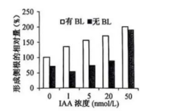

A.0~1 nmol/L IAA浓度范围内，BL对侧根形成无影响

B.1~20nmol/L IAA 浓度范围内，BL与IAA对侧根形成的协同作用显著

C.20~50nmol/L IAA浓度范围内，BL对侧根形成影响更显著

D.0~50 nmol/L IAA浓度范围内，BL与IAA协同作用表现为低浓度抑制、高浓度促进

6.翻译过程如图所示，其中反密码子第1位碱基常为次黄嘌呤（I)，与密码子第3位碱基A、U、C皆可配对。下列相关叙述正确的是（ ）

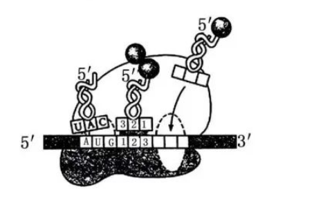

A.tRNA分子内部不发生碱基互补配对

B.反密码子为5'-CAU-3'的tRNA可转运多种氨基酸

C.mRNA的每个密码子都能结合相应的tRNA

D.碱基I与密码子中碱基配对的特点，有利于保持物种遗传的稳定性

7.下列关于细菌和酵母菌实验的叙述正确的是（ ）

A.通常酵母菌培养基比细菌培养基有更高的碳氮比

B.通常细菌的生长速度比酵母菌快，菌落比酵母菌落大

C.通常细菌培养基用高压蒸汽灭菌法灭菌，酵母菌培养基用过滤除菌法除菌

D.血细胞计数板既可用于酵母菌的数量测定，也可用于细菌的数量测定

8.由三条21号染色体引起的唐氏综合征是一种常见遗传病，患者常伴有自身免疫病。下列相

关叙述错误的是（ ）

A.病因主要是母亲的卵母细胞减数分裂时染色体不分离

B.通过分析有丝分裂中期细胞的染色体组型进行产前诊断

C.患者性母细胞减数分裂时联会紊乱不能形成可育配子

D.降低感染可减轻患者的自身免疫病症状

9.某生物社团利用洋葱进行实验。下列相关叙述正确的是（ ）

A.洋葱鳞片叶内表皮可代替半透膜探究质膜的透性

B.洋葱匀浆中加人新配制的斐林试剂，溶液即呈砖红色

C.制作根尖有丝分裂装片时，解离、漂洗、按压盖玻片都能更好地将细胞分散开

D.粗提取的DNA溶于2mol/L NaCl溶液中，加入二苯胺试剂后显蓝色

10.2022年我国科学家发布燕麦基因组，揭示了燕麦的起源与进化，燕麦进化模式如图所示。下列相关叙述正确的是（ ）

A.燕麦是起源于同一祖先的同源六倍体

B.燕麦是由AA和CCDD连续多代杂交形成的

C.燕麦多倍化过程说明染色体数量的变异是可遗传的

D.燕麦中A和D基因组同源性小，D和C同源性大

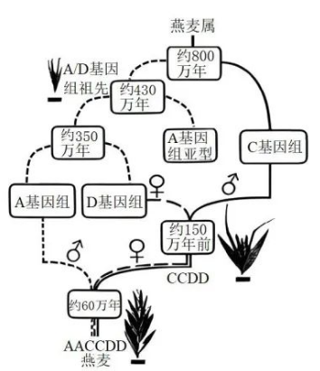

11.人体免疫系统在抵御病原体的侵害中发挥了重要的作用。下列相关叙述正确的是（ ）

A.人体内各种免疫细胞都分布在免疫器官和淋巴液中

B.相同病原体侵入不同人体后激活的B细胞分泌的抗体都相同

C.树突状细胞、辅助性T细胞和B细胞识别相同抗原的受体相同

D.抗原呈递细胞既参与细胞毒性T细胞的活化也参与B细胞的活化

12.下列关于“提取和分离叶绿体色素”实验叙述合理的是（ ）

A.用有机溶剂提取色素时，加入碳酸钙是为了防止类胡萝卜素被破坏

B.若连续多次重复画滤液细线可累积更多的色素，但易出现色素带重叠

C.该实验提取和分离色素的方法可用于测定绿叶中各种色素含量

D.用红色苋菜叶进行实验可得到5条色素带，花青素位于叶绿素a、b之间

13.研究者通过体细胞杂交技术，探索利用条斑紫菜和拟线紫菜培育杂种紫菜。下列相关叙述

正确的是（ ）

A.从食用紫菜的动物消化道内提取蛋白酶，用于去除细胞壁

B.原生质体需在低渗溶液中长期保存，以防止过度失水而死亡

C.检测原生质体活力时可用苯酚品红或甲紫溶液处理，活的原生质体被染色

D.聚乙二醇促进原生质体融合后，以叶绿体颜色等差异为标志可识别杂种细胞

14.在江苏沿海湿地生态系统中，生态位重叠的两种动物甲、乙发生生态位分化，如图所示。甲主要以植物a为食，乙主要以植物b为食，两者又共同以植食性动物c为食。下列相关叙

述错误的是（ ）

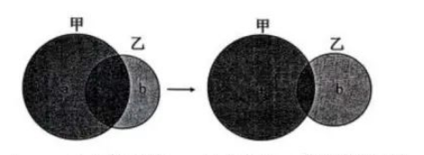.

A.a、c分别处于第一、二营养级，其生态位重叠

B.a、b中的能量沿着食物链单向流动、逐级递减，最终以热能形式散失

C.生物群落中物种的生态位受生物因素影响，也与非生物因素有关

D.生态位分化是经自然选择形成的生物适应性，提高了生物对环境资源的利用率.

**二、多项选择题：共4题，每题3分，共12分。每题有不止一个选项符合题意。每题全选对者得3分，选对但不全的得1分，错选或不答的得0分。**

15.下列中学实验需要使用显微镜观察，相关叙述错误的有（ ）

A.观察细胞中脂肪时，脂肪颗粒被苏丹Ⅲ染液染成橘黄色

B.观察酵母菌时，细胞核、液泡和核糖体清晰可见

C.观察细胞质流动时，黑藻叶肉细胞呈正方形，叶绿体围绕细胞核运动

D.观察植物细胞质壁分离时，在低倍镜下无法观察到质壁分离现象

16.某醋厂和啤酒厂的工艺流程如图所示。酒曲含有霉菌、酵母菌、乳酸菌；醋酪含有醋酸菌；

糖化即淀粉水解过程。下列相关叙述正确的有（ ）

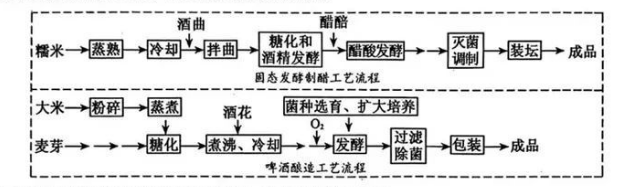

A.糯米“蒸熟”与大米“蒸煮”的目的是利于糖化和灭菌

B.发酵原理是利用真菌的无氧呼吸与细菌的有氧呼吸

C.醋酸发酵过程中经常翻动发酵物，可控制发酵温度和改善通气状况

D.啤酒酿造流程中适当增加溶解氧可缩短发酵时间

17.我国科学家利用猴胚胎干细胞首次创造了人工“猴胚胎”，研究流程如图所示。下列相关叙述正确的有（ ）

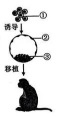

A.猴的成纤维细胞和胚胎干细胞功能不同，但具有相同的基因组

B.囊胚细胞②③都由细胞①分裂分化形成，但表达的基因都不同

C.移植前细胞和囊胚的培养都要放在充满CO2的培养箱中进行

D.移植后胚胎的发育受母体激素影响，也影响母体激素分泌

18.科研团队在某林地（面积：1km²）选取5个样方（样方面积：20m×20m)进行植物多样性调

查，下表为3种乔木的部分调查结果。下列相关叙述正确的有

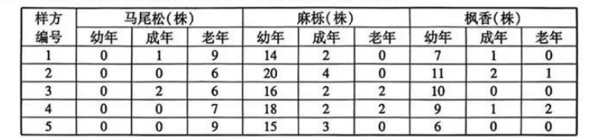

A.估算该林地麻栎种群的个体数量是50000株

B.林木的种群密度越大，林木的总生物量越高

C.该林地马尾松、麻栎种群的年龄结构分别为衰退型、增长型，群落分层现象明显

D.该林地处于森林演替中，采伐部分马尾松能加速演替进程

**三、非选择题：共5题，共60分。除特别说明外，每空1分。**

19.(12分)气孔对植物的气体交换和水分代谢至关重要，气孔运动具有复杂的调控机制。图1

所示为叶片气孔保卫细胞和相邻叶肉细胞中部分的结构和物质代谢途径。①~④表示场所。请回答下列问题：

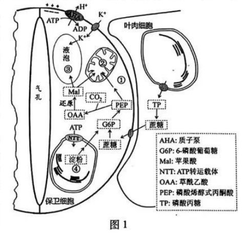

（1)光照下，光驱动产生的NADPH主要出现在 （从①-④中选填）；NADPH可用于CO2固定产物的还原，其场所有 （从①～④中选填）（2分）。液泡中与气孔开闭相

关的主要成分有H2O、 （填写2种）（2分）等。

（2）研究证实气孔运动需要ATP，产生ATP的场所有 (从①～④中选填）。保卫细胞中的糖分解为PEP，PEP再转化为 进入线粒体,经过TCA循环产生的 最终通过电子传递链氧化产生ATP。

（3）蓝光可刺激气孔张开，其机理是蓝光激活质膜上的AHA，消耗ATP将H泵出膜外，形成跨膜的 ,驱动细胞吸收K+等离子。

(4）细胞中的PEP可以在酶作用下合成四碳酸OAA，并进一步转化成Mal，使细胞内水势

下降(溶质浓度提高），导致保卫细胞 ，促进气孔张开。

(5)保卫细胞叶绿体中的淀粉合成和分解与气孔开闭有关，为了研究淀粉合成与细胞质中ATP的关系，对拟南芥野生型WT和NTT突变体nttl（叶绿体失去运人ATP的能力）保卫细胞的淀粉粒进行了研究，其大小的变化如图2。下列相关叙述合理的有 （2分）。

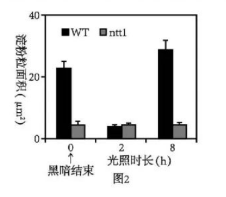

A.淀粉大量合成需要依赖呼吸作用提供ATP

B.光照诱导WT气孔张开与叶绿体淀粉的水解有关

C.光照条件下突变体nttl几乎不能进行光合作用

D.长时间光照可使WT叶绿体积累较多的淀粉

20.(12分）帕金森综合征是一种神经退行性疾病，神经元中a-Synuclein蛋白聚积是主要致病因素。研究发现患者普遍存在溶酶体膜蛋白TMEM175变异，如图所示。为探究TMEM175蛋白在该病发生中的作用，进行了一系列研究。请回答下列问题：

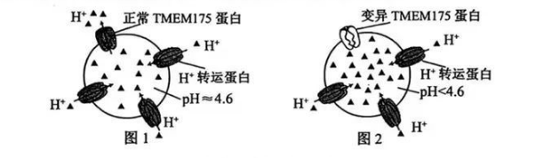

（1）帕金森综合征患者TMEM175蛋白的第41位氨基酸由天冬氨酸突变为丙氨酸，说明TMEM175基因发生 而突变，神经元中发生的这种突变 (从“能”“不能”“不一定”中选填）遗传。

（2）突变的TMEM175基因在细胞核中以 为原料，由RNA聚合酶催化形成 键，不断延伸合成mRNA。

(3）mRNA转移到细胞质中，与 结合，合成一段肽链后转移到粗面内质网上继续合成，再由囊泡包裹沿着细胞质中的 由内质网到达高尔基体。突变的TMEM175基因合成的肽链由于氨基酸之间作用的变化使肽链的 改变，从而影响TMEM175蛋白的功能。

（4）基因敲除等实验发现TMEM175蛋白参与溶酶体内酸碱稳态调节。如图1所示，溶酶体膜的 对H+具有屏障作用，膜上的H+转运蛋白将H+以 的方式运人溶酶体，使溶酶体内pH小于细胞质基质。TMEM175蛋白可将H+运出，维持溶酶体内pH约为4.6。据图2分析，TMEM175蛋白变异将影响溶酶体的功能，原因是 (2分)。

(5）综上推测，TMEM175蛋白变异是引起α-Synuclein蛋白聚积致病的原因，理由是 。

21.（12分）糖尿病显著增加认知障碍发生的风险。研究团队发现在胰岛素抵抗（IR）状态下，

脂肪组织释放的外泌囊泡（AT-EV）中有高含量的miR-9-3p（一种miRNA），使神经细胞结构功能改变，导致认知水平降低。图1示IR鼠脂肪组织与大脑信息交流机制。请回答下列问题：

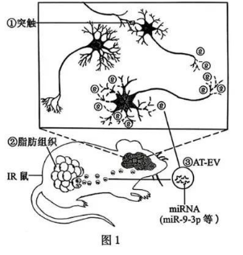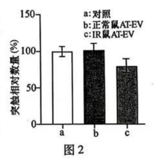

（1）当神经冲动传导至①时，轴突末梢内的 移至突触前膜处释放神经递质，与突触后膜的受体结合，使 打开,突触后膜电位升高。若突触间隙K+浓度升高，则突触后膜静息电位绝对值 。

（2）脂肪组织参与体内血糖调节，在胰岛素调控作用下可以通过 降低血糖浓度，IR状态下由于脂肪细胞的胰岛素受体 (2分)，降血糖作用被削弱。图1中由②释放的③经体液运输至脑部，miR-9-3p进人神经细胞，抑制细胞内 。

（3）为研究miR-9-3p对突触的影响，采集正常鼠和IR鼠的AT-EV置于缓冲液中，分别注人b、e组实验鼠，a组的处理是 。2周后检测实验鼠海马突触数量，结果如图2。

分析图中数据并给出结论： （2分）。

（4)为研究抑制miR-9-3p可否改善IR引起的认知障碍症状，运用腺病毒载体将miR-9-3p抑制剂导入实验鼠。导人该抑制剂后，需测定对照和实验组miR-9-3p含量，还需通过实验检测

(2分)。

22.（12分)为了将某纳米抗体和绿色荧光蛋白基因融合表达，运用重组酶技术构建质粒，如

图1所示。请回答下列问题：

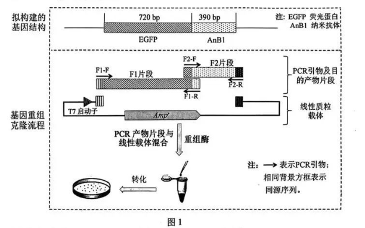

（1)分别进行PCR扩增片段F1与片段F2时，配制的两个反应体系中不同的有 (2分),

扩增程序中最主要的不同是 。

(2）有关基因序列如图2。引物F2-F、F1-R应在下列选项中选用 （2分）。

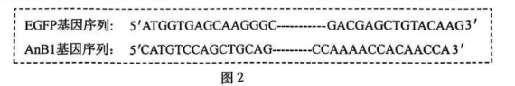

A.ATGGTG----CAACCA C.GACGAG------CTGCAG

B.TGGTTG------CACCAT D.CTGCAG------CTCGTC

(3）将PCR产物片段与线性质粒载体混合后，在重组酶作用下可形成环化质粒，直接用于转

化细菌。这一过程与传统重组质粒构建过程相比，无需使用的酶主要有 (2分)。

(4）转化后的大肠杆菌需采用含有抗生素的培养基筛选，下列叙述错误的有 （2分）。

A.稀释涂布平板需控制每个平板30~300个菌落

B.抗性平板上未长出菌落的原因一般是培养基温度太高

C.抗性平板上常常会出现大量杂菌形成的菌落

D.抗性平板上长出的单菌落无需进一步划线纯化

(5）为了验证平板上菌落中的质粒是否符合设计，用不同菌落的质粒为模板，用引物F1-F和F2-R进行了PCR扩增，质粒P1~P4的扩增产物电泳结果如图3。根据图中结果判断，可以舍弃的质粒有 。

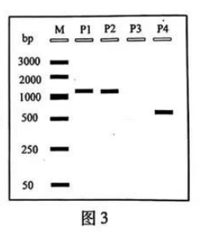

（6）对于PCR产物电泳结果符合预期的质粒，通常需进一步通过基因测序确认，原因是

(2分)。

23.(12分)科学家在果蝇遗传学研究中得到一些突变体。为了研究其遗传特点，进行了一系

列杂交实验。请回答下列问题：

（1)下列实验中控制果蝇体色和刚毛长度的基因位于常染色体上，杂交实验及结果如下：

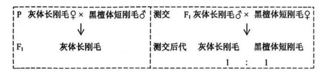

据此分析，F1雄果蝇产生 种配子，这两对等位基因在染色体上的位置关系为 。

（2）果蝇Al、A2、A3为3种不同眼色隐性突变体品系（突变基因位于Ⅱ号染色体上）。为

了研究突变基因相对位置关系，进行两两杂交实验，结果如下：

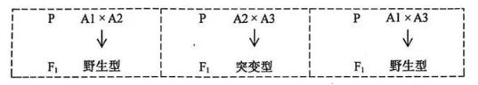

据此分析Al、A2、A3和突变型F1四种突变体的基因型，在答题卡相应的图中标注它们

的突变型基因与野生型基因之间的相对位置(Al、A2、A3隐性突变基因分别用al、a2、

a3表示，野生型基因用“+”表示）。

(3）果蝇的正常刚毛（B)对截刚毛(b)为显性，这一对等位基因位于性染色体上；常染色体

上的隐性基因t纯合时，会使性染色体组成为XX的个体成为不育的雄性个体。杂交实验及结果如下：

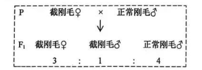

据此分析，亲本的基因型分别为 ，F1中雄性个体的基因型有 种；若F1

自由交配产生F2，其中截刚毛雄性个体所占比例为 （2分），F2雌性个体中纯合

子的比例为 （2分）。
