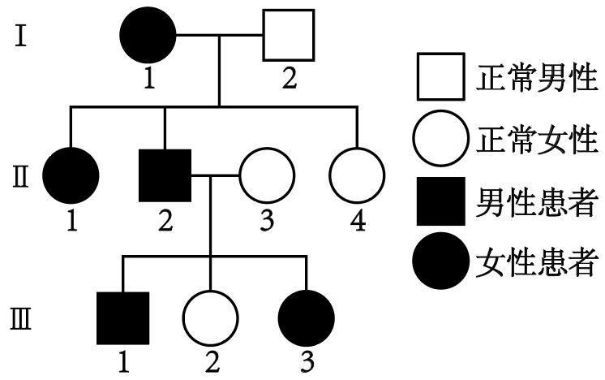
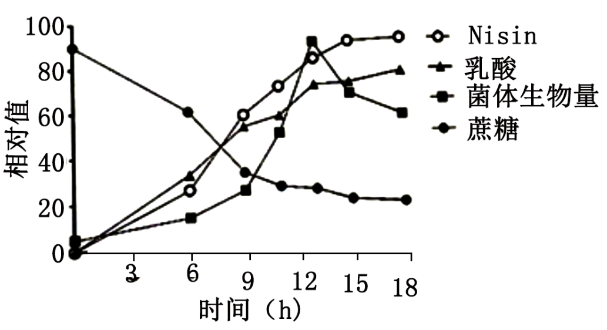
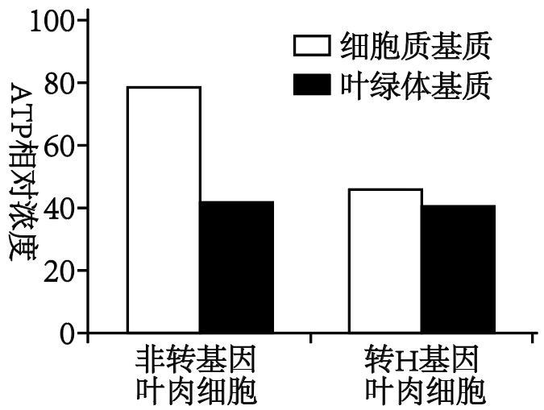
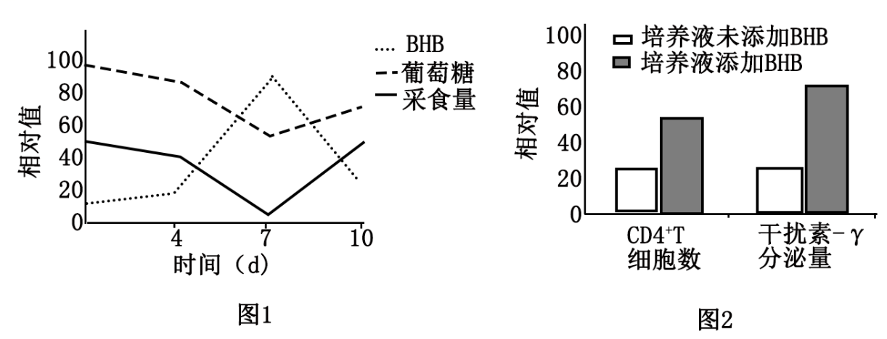
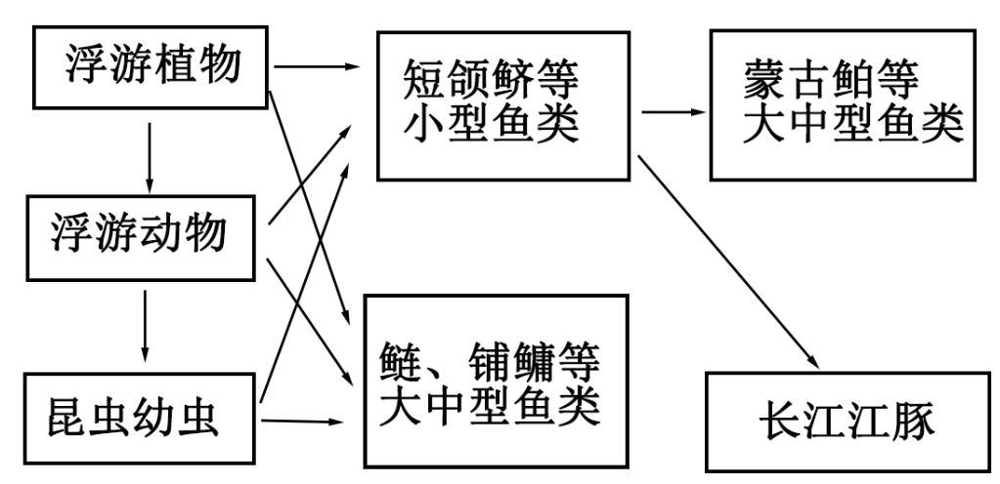
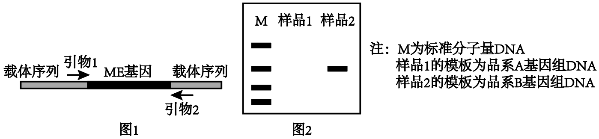
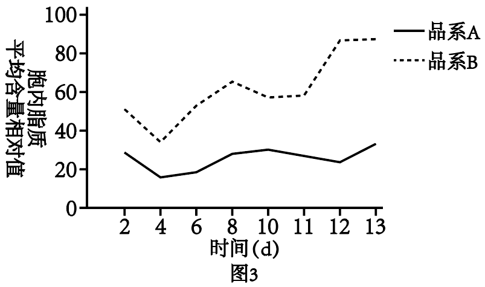
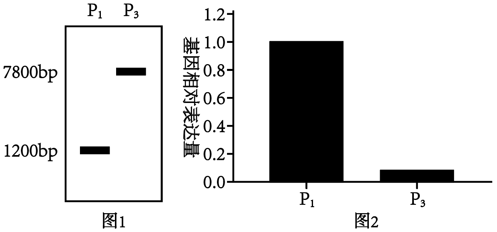

**解题精选**

**试卷原题**

1\. 大量证据表明，地球上所有细胞生命具有共同祖先。下列可推断出此观点的证据是（　　）

A. 蝙蝠和蜻蜓都有适应飞翔器官

B. 猫的前肢和鲸的鳍都有相似的骨骼结构

C. 人和鱼的胚胎发育早期都有鳃裂

D. 真核生物和原核生物的遗传物质都是DNA

**试卷原题**

2\. 某单基因遗传病的系谱图如下，其中Ⅱ-3不携带该致病基因。不考虑基因突变和染色体变异。下列分析错误的是（　　）

A. 若该致病基因位于常染色体，Ⅲ-1与正常女性婚配，子女患病概率相同

B. 若该致病基因位于性染色体，Ⅲ-1患病的原因是性染色体间发生了交换

C. 若该致病基因位于性染色体，Ⅲ-1与正常女性婚配，女儿患病概率高于儿子

D. Ⅲ-3与正常男性婚配，子代患病的概率为1/2

**试卷原题**

3\. 关于基因、DNA、染色体和染色体组的叙述，正确的是（　　）

A. 等位基因均成对排布在同源染色体上

B. 双螺旋DNA中互补配对的碱基所对应的核苷酸方向相反

C. 染色体的组蛋白被修饰造成的结构变化不影响基因表达

D. 一个物种的染色体组数与其等位基因数一定相同

**试卷原题**

4\. 小鼠注射某药物造成肾功能异常，尿中出现大量蛋白质，血浆蛋白减少。下列叙述错误的是（　　）

A. 血浆蛋白丢失可造成血液中抗体减少，机体免疫力下降

B. 血浆蛋白减少造成血浆渗出至组织液的水增多

C. 血浆蛋白形成的渗透压高于血浆Na+和Cl-形成的渗透压

D. 小鼠肾功能衰竭时，血浆中尿素氮升高

**试卷原题**

5\. 某经营性森林有27种植物，林场对其林木采伐后彻底清除地表植物。自然恢复若干年后，该地段上形成了有36种植物的森林。下列叙述正确的是（　　）

A. 采伐后的空地资源丰富，植物种群呈“J”形增长

B. 采伐前的生态系统比恢复后的生态系统抵抗力稳定性高

C. 采伐后的空地上出现新群落的过程属于次生演替

D. 该生态系统恢复过程中，营养级的增多取决于植物种类的增加

**试卷原题**

6\. 哺乳动物的巨噬细胞吞噬、降解衰老的红细胞，获得的Fe2+通过膜上的铁输出蛋白（FPN）进入血液，用于骨髓生成新的红细胞。肝脏分泌的铁调素可靶向降解FPN。炎症可以促进铁调素的合成。下列叙述正确的是（　　）

A. 由Fe参与构成的血红蛋白具有运输功能

B. 衰老的红细胞被吞噬需要膜蛋白的参与

C. 敲除铁调素编码基因，巨噬细胞会出现铁积累

D. 长期炎症可能会减少红细胞生成，进而导致贫血

**试卷原题**

7\. 乳酸链球菌素（Nisin）是乳酸链球菌分泌的一种抗菌肽。研究者对Nisin发酵生产过程相关指标进行了检测，结果如图。下列叙述正确的是（　　）

A. 适度提高乳酸链球菌接种量可缩短Nisin发酵生产周期

B. 发酵的中后期适量补加蔗糖溶液可促进菌体生长

C 向发酵罐内适时适量添加碱溶液可提高Nisin产量

D. 发酵结束后主要通过收获并破碎菌体以分离获得Nisin产品

**试卷原题**

8\. 拟南芥发育早期的叶肉细胞中，未成熟叶绿体发育所需ATP须借助其膜上的转运蛋白H由细胞质基质进入。发育到一定阶段，叶肉细胞H基因表达量下降，细胞质基质ATP向成熟叶绿体转运受阻。

回答下列问题：

（1）未成熟叶绿体发育所需ATP主要在\_\_\_合成，经细胞质基质进入叶绿体。

（2）光照时，叶绿体类囊体膜上的色素捕获光能，将其转化为ATP和\_\_\_中的化学能，这些化学能经\_\_\_阶段释放并转化为糖类中的化学能。

（3）研究者通过转基因技术在叶绿体成熟的叶肉细胞中实现H基因过量表达，对转H基因和非转基因叶肉细胞进行黑暗处理，之后检测二者细胞质基质和叶绿体基质中ATP相对浓度，结果如图。相对于非转基因细胞，转基因细胞的细胞质基质ATP浓度明显\_\_\_。据此推测，H基因的过量表达造成细胞质基质ATP被\_\_\_（填“叶绿体”或“线粒体”）大量消耗，细胞有氧呼吸强度\_\_\_。

（4）综合上述分析，叶肉细胞通过下调\_\_\_阻止细胞质基质ATP进入成熟的叶绿体，从而防止线粒体\_\_\_，以保证光合产物可转运到其他细胞供能。

**试卷原题**

9\. 采食减少是动物被感染后的适应性行为，可促进脂肪分解，产生β-羟基丁酸（BHB）为机体供能。研究者用流感病毒（IAV）感染小鼠，之后统计其采食量并测定血中葡萄糖和BHB水平，结果见图1。测定BHB对体外培养的CD4+T细胞（一种辅助性T细胞）增殖及分泌干扰素-γ水平的影响，结果见图2。已知干扰素-γ具有促免疫作用。

回答下列问题：

（1）小鼠感染IAV后，胰岛\_\_\_细胞分泌的\_\_\_增多，从而促进\_\_\_的分解及非糖物质的转化以维持血糖水平。

（2）IAV感染引发小鼠内环境改变，导致支配胃肠的\_\_\_神经活动占据优势，胃肠蠕动及消化腺分泌减弱，此过程属于\_\_\_反射。

（3）侵入机体的IAV经\_\_\_摄取和加工处理，激活CD4+T细胞。活化的CD4+T细胞促进细胞毒性T细胞生成，增强机体\_\_\_免疫。

（4）小鼠感染期采食量下降有利于提高其免疫力。据图分析，其机理为\_\_\_。

**试卷原题**

10\. 天鹅洲长江故道现为长江江豚自然保护区，是可人为调控的半封闭水域，丰水期能通过闸口将长江干流江水引入。2017年，评估认为该水域最多可保障89头长江江豚健康、稳定地生存。当年该水域开始禁渔。2019-2021年该生态系统的食物网及各类型鱼类的生物量调查结果如图、表所示。2021年该水域长江江豚种群数量为101头，但其平均体重明显低于正常水平。

<table style="width:45%;">
<colgroup>
<col style="width: 14%" />
<col style="width: 14%" />
<col style="width: 17%" />
</colgroup>
<tbody>
<tr>
<td rowspan="2" style="text-align: left;">调查时间</td>
<td colspan="2" style="text-align: left;">生物量（kg·hm-2）</td>
</tr>
<tr>
<td style="text-align: left;">小型鱼类</td>
<td style="text-align: left;">大中型鱼类</td>
</tr>
<tr>
<td style="text-align: left;">2019年</td>
<td style="text-align: left;">30.4</td>
<td style="text-align: left;">30.8</td>
</tr>
<tr>
<td style="text-align: left;">2020 年</td>
<td style="text-align: left;">22.8</td>
<td style="text-align: left;">47.9</td>
</tr>
<tr>
<td style="text-align: left;">2021年</td>
<td style="text-align: left;">5.8</td>
<td style="text-align: left;">547.6</td>
</tr>
</tbody>
</table>

回答下列问题：

（1）该群落中分层分布的各种水生生物形成一定的\_\_\_结构。鲢、鳙等大中型鱼类与短颌鲚等小型鱼类利用相同的食物资源，存在\_\_\_重叠，表现为\_\_\_关系。蒙古鲌等大中型鱼类通过\_\_\_使小型鱼类生物量降低，导致长江江豚食物资源减少。

（2）在此生态系统中，长江江豚占据\_\_\_个营养级，其能量根本上来自于该食物网中的\_\_\_。

（3）为实现对长江江豚的良好保护，可采取以下措施：其一，据表分析，从该水域适度去除\_\_\_，使能量更多流向长江江豚；其二，在丰水期打开闸口，使长江江豚饵料鱼类从干流\_\_\_天鹅洲长江故道，增加长江江豚食物资源。以上措施可提高该水域对长江江豚的\_\_\_。

**试卷原题**

11\. 单细胞硅藻具有生产生物柴油的潜在价值。研究者将硅藻脂质合成相关的苹果酸酶（ME）基因构建到超表达载体，转入硅藻细胞，以期获得高产生物柴油的硅藻品系。

回答下列问题：

（1）根据DNA和蛋白质在特定浓度乙醇溶液中的\_\_\_差异获得硅藻粗提DNA，PCR扩增得到目的基因。

（2）超表达载体的基本组件包括复制原点、目的基因、标记基因、\_\_\_和\_\_\_等。本研究中目的基因为\_\_\_。

（3）PCR扩增时引物通过\_\_\_原则与模板特异性结合。根据表达载体序列设计了图1所示的两条引物，对非转基因硅藻品系A和转ME基因硅藻候选品系B进行PCR检测，扩增产物电泳结果见图2。其中，样品1为本实验的\_\_\_组，样品2有特异性扩增产物，结果表明\_\_\_。

（4）利用单细胞硅藻生产生物柴油的影响因素包括胞内脂质含量和繁殖速率等。图3为硅藻胞内脂质含量检测结果。据图分析，相对于品系A，品系B的胞内脂质含量平均水平明显\_\_\_。同时，还需测定\_\_\_以比较在相同发酵条件下品系A与B的繁殖速率。

（5）胞内脂质合成需要大量ATP。ME催化苹果酸氧化脱羧反应产生NADH。研究表明，品系B线粒体中ME含量显著高于品系A。据此分析，ME基因超表达使线粒体中NADH水平升高，\_\_\_，最终促进胞内脂质合成。

（6）相对于大豆和油菜等油料作物，利用海生硅藻进行生物柴油生产的优势之处为\_\_\_。（答出两点即可）

**试卷原题**

12\. 某家禽等位基因M/m控制黑色素的合成（MM与Mm的效应相同），并与等位基因T/t共同控制喙色，与等位基因R/r共同控制羽色。研究者利用纯合品系P1（黑喙黑羽）、P2（黑喙白羽）和P3（黄喙白羽）进行相关杂交实验，并统计F1和F2的部分性状，结果见表。

|     |                             |               |                            |
|:--- |:--------------------------- |:------------- |:-------------------------- |
| 实验  | 亲本                          | F1 | F2              |
| 1   | P1×P3 | 黑喙            | 9/16黑喙，3/16花喙（黑黄相间），4/16黄喙 |
| 2   | P2×P3 | 灰羽            | 3/16黑羽，6/16灰羽，7/16白羽       |

回答下列问题：

（1）由实验1可判断该家禽喙色的遗传遵循\_\_\_定律，F2的花喙个体中纯合体占比为\_\_\_。

（2）为探究M/m基因的分子作用机制，研究者对P1和P3的M/m基因位点进行PCR扩增后电泳检测，并对其调控的下游基因表达量进行测定，结果见图1和图2。由此推测M基因发生了碱基的\_\_\_而突变为m，导致其调控的下游基因表达量\_\_\_，最终使黑色素无法合成。

（3）实验2中F1灰羽个体的基因型为\_\_\_，F2中白羽个体的基因型有\_\_\_种。若F2的黑羽个体间随机交配，所得后代中白羽个体占比为\_\_\_，黄喙黑羽个体占比为\_\_\_。

（4）利用现有的实验材料设计调查方案，判断基因T/t和R/r在染色体上的位置关系（不考虑染色体交换）。

调查方案：\_\_\_。

结果分析：若\_\_\_（写出表型和比例），则T/t和R/r位于同一对染色体上；否则，T/t和R/r位于两对染色体上。

**参考答案**

**解题精选**

**试卷原题**

|     |     |     |     |     |     |     |     |     |     |
|:--- |:--- |:--- |:--- |:--- |:--- |:--- |:--- |:--- |:--- |
| 1.D |     |     |     |     |     |     |     |     |     |

**试卷原题**

|     |     |     |     |     |     |     |     |     |     |
|:--- |:--- |:--- |:--- |:--- |:--- |:--- |:--- |:--- |:--- |
| 2.C |     |     |     |     |     |     |     |     |     |

**试卷原题**

|     |     |     |     |     |     |     |     |     |     |
|:--- |:--- |:--- |:--- |:--- |:--- |:--- |:--- |:--- |:--- |
| 3.B |     |     |     |     |     |     |     |     |     |

**试卷原题**

|     |     |     |     |     |     |     |     |     |     |
|:--- |:--- |:--- |:--- |:--- |:--- |:--- |:--- |:--- |:--- |
| 4.C |     |     |     |     |     |     |     |     |     |

**试卷原题**

|     |     |     |     |     |     |     |     |     |     |
|:--- |:--- |:--- |:--- |:--- |:--- |:--- |:--- |:--- |:--- |
| 5.C |     |     |     |     |     |     |     |     |     |

**试卷原题**

|       |     |     |     |     |
|:----- |:--- |:--- |:--- |:--- |
| 6.ABD |     |     |     |     |

**试卷原题**

|       |     |     |     |     |
|:----- |:--- |:--- |:--- |:--- |
| 7.ABC |     |     |     |     |

**试卷原题**

8.（1）线粒体（或“线粒体内膜”）

（2） ①. NADPH（或“还原型辅酶Ⅱ”） ②. 暗反应（或“卡尔文循环”）

（3） ①. 降低 ②. 叶绿体 ③. 升高

（4） ①. H基因表达（或“H蛋白数量”） ②. 过多消耗光合产物（或“有氧呼吸增强”）

**试卷原题**

9.（1） ①. A ②. 胰高血糖素 ③. 肝糖原

（2） ①. 交感 ②. 非条件

（3） ①. 抗原呈递细胞（或“APC”或“B细胞”或“树突状细胞”或“巨噬细胞”） ②. 细胞（或“特异性”）

（4）采食量下降，机体产生BHB增多，促进CD4+T细胞增殖，干扰素-γ分泌量增加，机体免疫力提高

**试卷原题**

10.（1） ①. 垂直 ②. 生态位 ③. 种间竞争 ④. 捕食

（2） ①. 3##三 ②. 浮游植物（或“浮游植物固定的太阳能”）

（3） ①. 大中型鱼类（或“鲢、鳙和蒙古鲌等大中型鱼类”） ②. 迁入 ③. 环境容纳量（或“K值”）

**试卷原题**

11.（1）溶解度 （2） ①. 启动子 ②. 终止子（答案“启动子”和“终止子”不分顺序） ③. 苹果酸酶基因（或“ME基因”）

（3） ①. 碱基互补配对 ②. 对照 ③. 引物间的载体序列整合到硅藻细胞基因组中（或“ME基因序列整合到硅藻细胞基因组中”）

（4） ①. 增加 ②. 细胞数量

（5）有氧呼吸生成的ATP增多

（6）节约土地资源、不受季节和气候限制（或“节约粮食资源”或“节约淡水”或“能够通过发酵大量生产”）

**试卷原题**

12.（1） ①. 自由组合（或“孟德尔第二”） ②. 1/3

（2） ①. 增添 ②. 下降

（3） ①. MmRr（或"MmRrTt”） ②. 5 ③. 1/9 ④. 0

（4） ①. 对实验2中F2个体的喙色和羽色进行调查统计 ②. F2中黑喙灰羽：花喙黑羽：黑喙白羽：黄
