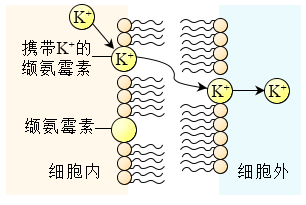
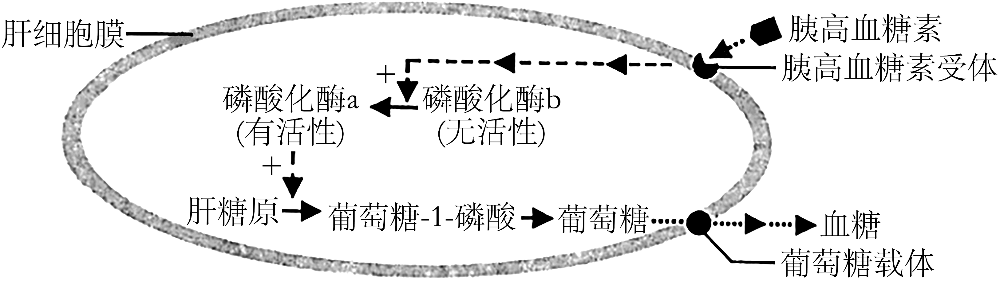
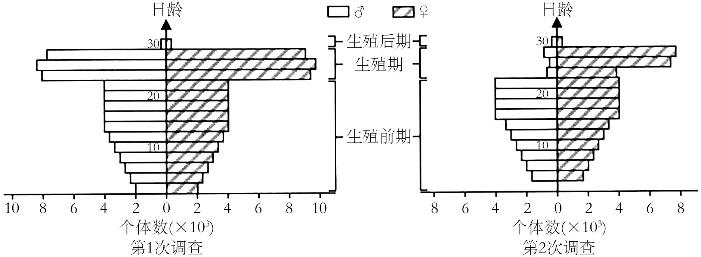
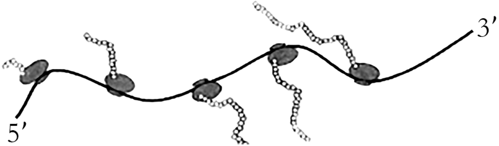
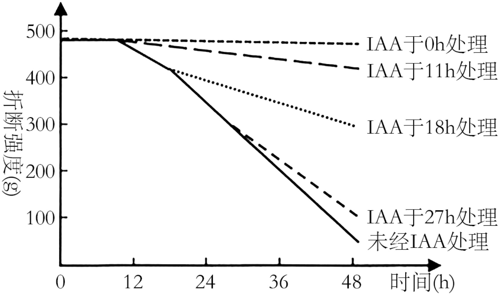
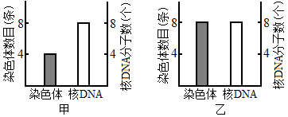
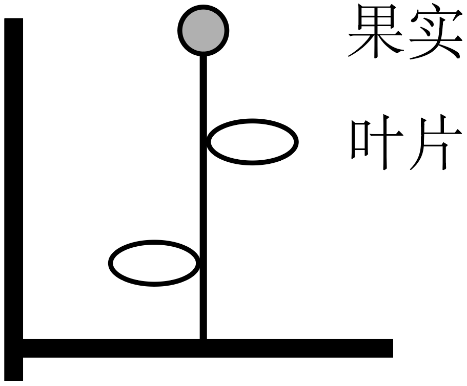
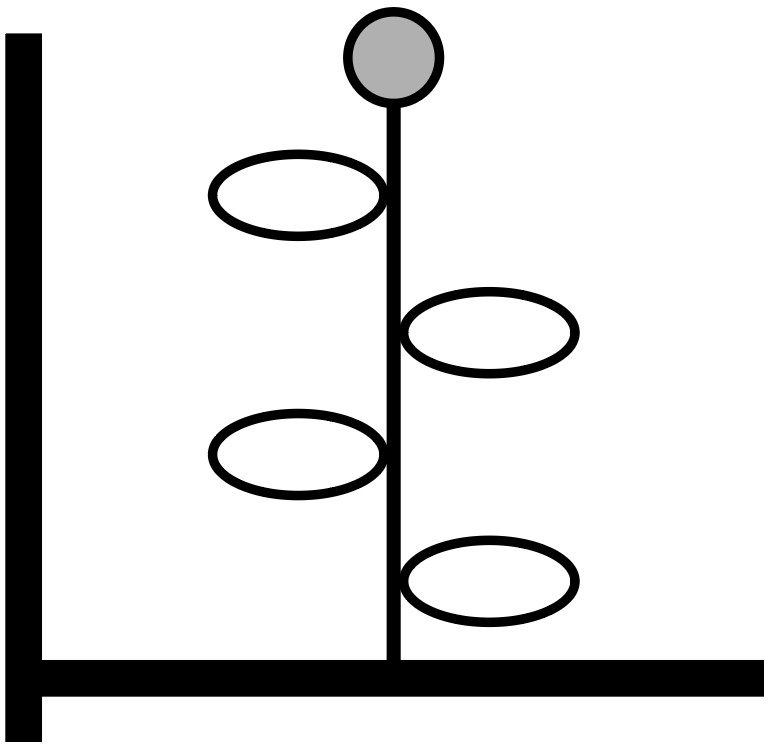
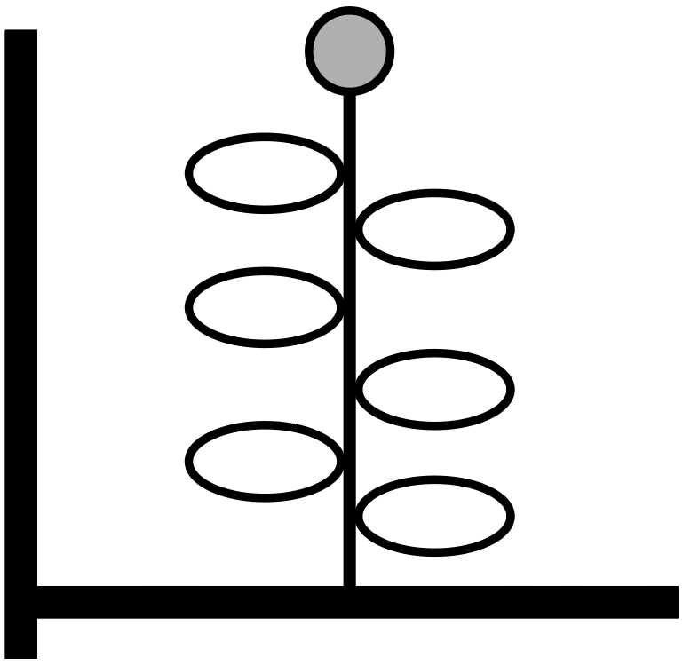
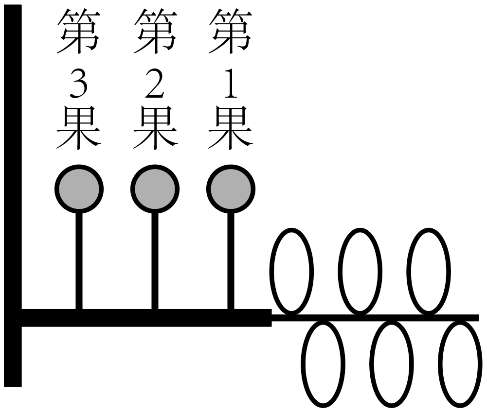

**2023年1月浙江省普通高校招生选考科目考试**

**生物学**

**一、选择题（本大题共20小题，每小题2分，共40分。每小题列出的四个备选项中只有一个是符合题目要求的，不选、多选、错选均不得分）**

1\. 近百年来，随着大气CO2浓度不断增加，全球变暖加剧。为减缓全球变暖，我国政府提出了“碳达峰”和“碳中和”的CO2排放目标，彰显了大国责任。下列措施不利于达成此目标的是（ ）

A. 大量燃烧化石燃料 B. 积极推进植树造林 C. 大力发展风能发电 D. 广泛应用节能技术

2\. 以哺乳动物为研究对象的生物技术已获得了长足的进步。对生物技术应用于人类，在安全与伦理方面有不同的观点，下列叙述正确的是（ ）

A. 试管婴儿技术应全面禁止

B. 治疗性克隆不需要监控和审查

C. 生殖性克隆不存在伦理道德方面的风险

D. 我国不赞成、不允许、不支持、不接受任何生殖性克隆人实验

3\. 性腺细胞的内质网是合成性激素的场所。在一定条件下，部分内质网被包裹后与细胞器X融合而被降解，从而调节了性激素的分泌量。细胞器X是（ ）

A. 溶酶体 B. 中心体 C. 线粒体 D. 高尔基体

4\. 缬氨霉素是一种脂溶性抗生素，可结合在微生物的细胞膜上，将K＋运输到细胞外（如图所示），降低细胞内外的K＋浓度差，使微生物无法维持细胞内离子的正常浓度而死亡。下列叙述正确的是（ ）

A. 缬氨霉素顺浓度梯度运输K＋到膜外 B. 缬氨霉素为运输K＋提供ATP

C. 缬氨霉素运输K＋与质膜结构无关 D. 缬氨霉素可致噬菌体失去侵染能力

阅读下列材料，回答下列问题。

基因启动子区发生DNA甲基化可导致基因转录沉默。研究表明，某植物需经春化作用才能开花，该植物的DNA甲基化水平降低是开花的前提。用5－azaC处理后，该植株开花提前，检测基因组DNA，发现5'胞嘧啶的甲基化水平明显降低，但DNA序列未发生改变，这种低DNA甲基化水平引起的表型改变能传递给后代。

5\. 这种DNA甲基化水平改变引起表型改变，属于（ ）

A. 基因突变 B. 基因重组 C. 染色体变异 D. 表观遗传

6\. 该植物经5－azaC去甲基化处理后，下列各项中会发生显著改变的是（ ）

A. 基因的碱基数量 B. 基因的碱基排列顺序 C. 基因的复制 D. 基因的转录

7\. 在我国西北某地区，有将荒漠成功改造为枸杞园的事例。改造成的枸杞园与荒漠相比，生态系统的格局发生了重大变化。下列叙述错误的是（ ）

A. 防风固沙能力有所显现 B. 食物链和食物网基本不变

C. 土壤的水、肥条件得到很大改善 D. 单位空间内被生产者固定的太阳能明显增多

8\. 某同学研究某因素对酶活性的影响，实验处理及结果如下：己糖激酶溶液置于45℃水浴12min，酶活性丧失50%；己糖激酶溶液中加入过量底物后置于45℃水浴12min，酶活性仅丧失3%。该同学研究的因素是（ ）

A. 温度 B. 底物 C. 反应时间 D. 酶量

阅读下列材料，回答下列问题

纺锤丝由微管构成，微管由微管蛋白组成。有丝分裂过程中，染色体的移动依赖于微管的组装和解聚。紫杉醇可与微管结合，使微管稳定不解聚，阻止染色体移动，从而抑制细胞分裂。

9\. 微管蛋白是构成细胞骨架的重要成分之一，组成微管蛋白的基本单位是（ ）

A. 氨基酸 B. 核苷酸 C. 脂肪酸 D. 葡萄糖

10\. 培养癌细胞时加入一定量的紫杉醇，下列过程受影响最大的是（ ）

A. 染色质复制 B. 染色质凝缩为染色体

C. 染色体向两极移动 D. 染色体解聚为染色质

11\. 胰高血糖素可激活肝细胞中的磷酸化酶，促进肝糖原分解成葡萄糖，提高血糖水平，机理如图所示。

下列叙述正确的是（ ）

A. 胰高血糖素经主动运输进入肝细胞才能发挥作用

B. 饥饿时，肝细胞中有更多磷酸化酶b被活化

C. 磷酸化酶a能为肝糖原水解提供活化能

D. 胰岛素可直接提高磷酸化酶a的活性

12\. 在家畜优良品种培育过程中常涉及胚胎工程的相关技术。下列叙述错误的是（ ）

A. 经获能处理的精子才能用于体外受精 B. 受精卵经体外培养可获得早期胚胎

C. 胚胎分割技术提高了移植胚胎的成活率 D. 胚胎移植前需对受体进行选择和处理

13\. 太平洋某岛上生存着上百个蜗牛物种，但同一区域中只有少数几个蜗牛物种共存。生活在同一区域的不同蜗牛物种之间外壳相似性高，生活在不同区域的不同蜗牛物种之间外壳相似性低。下列叙述正确的是（ ）

A. 该岛上蜗牛物种数就是该岛的物种多样性

B. 该岛上所有蜗牛的全部基因组成了一个基因库

C. 同一区域内的不同蜗牛物种具有相似的外壳是自然选择的结果

D. 仅有少数蜗牛物种生存在同一区域是种间竞争造成生态位重叠的结果

14\. 在我国江南的一片水稻田中生活着某种有害昆虫。为了解虫情，先后两次（间隔3天）对该种群展开了调查，前后两次调查得到的数据统计结果如图所示。

在两次调查间隔期内，该昆虫种群最可能遭遇到的事件为（ ）

A. 受寒潮侵袭 B. 遭杀虫剂消杀 C. 被天敌捕杀 D. 被性外激素诱杀

15\. 核糖体是蛋白质合成的场所。某细菌进行蛋白质合成时，多个核糖体串联在一条mRNA上形成念珠状结构——多聚核糖体（如图所示）。多聚核糖体上合成同种肽链的每个核糖体都从mRNA同一位置开始翻译，移动至相同的位置结束翻译。多聚核糖体所包含的核糖体数量由mRNA的长度决定。下列叙述正确的是（ ）

A. 图示翻译过程中，各核糖体从mRNA的3'端向5'端移动

B. 该过程中，mRNA上的密码子与tRNA上的反密码子互补配对

C. 图中5个核糖体同时结合到mRNA上开始翻译，同时结束翻译

D. 若将细菌的某基因截短，相应的多聚核糖体上所串联的核糖体数目不会发生变化

16\. 为探究酵母菌的细胞呼吸方式，可利用酵母菌、葡萄糖溶液等材料进行实验。下列关于该实验的叙述，正确的是（ ）

A. 酵母菌用量和葡萄糖溶液浓度是本实验的自变量

B. 酵母菌可利用的氧气量是本实验的无关变量

C. 可选用酒精和CO2生成量作为因变量的检测指标

D. 不同方式的细胞呼吸消耗等量葡萄糖所释放的能量相等

17\. 某人的左眼球严重损伤，医生建议立即摘除左眼球，若不及时摘除，右眼会因自身免疫而受损。下列叙述正确的是（ ）

A. 在人体发育过程中，眼球内部的抗原性物质已被完全清除

B. 正常情况下，人体内不存在能识别眼球内部抗原的免疫细胞

C. 眼球损伤后，眼球内部的某些物质释放出来引发特异性免疫

D. 左眼球损伤后释放的抗原性物质运送至右眼球引发自身免疫

18\. 研究人员取带叶的某植物茎段，切去叶片，保留叶柄，然后将茎段培养在含一定浓度乙烯的空气中，分别在不同时间用一定浓度IAA处理切口。在不同时间测定叶柄脱落所需的折断强度，实验结果如图所示。

下列关于本实验叙述，正确的是（ ）

A. 切去叶片可排除叶片内源性IAA对实验结果的干扰

B. 越迟使用IAA处理，抑制叶柄脱落的效应越明显

C. IAA与乙烯对叶柄脱落的作用是相互协同的

D. 不同时间的IAA处理效果体现IAA作用的两重性

19\. 某同学想从泡菜汁中筛选耐高盐乳酸菌，进行了如下实验：取泡菜汁样品，划线接种于一定NaCl浓度梯度的培养基，经培养得到了单菌落。下列叙述正确的是（ ）

A. 培养基pH需偏碱性 B. 泡菜汁需多次稀释后才能划线接种

C. 需在无氧条件下培养 D. 分离得到的微生物均为乳酸菌

20\. 某基因型为AaXDY的二倍体雄性动物（2n＝8），1个初级精母细胞的染色体发生片段交换，引起1个A和1个a发生互换。该初级精母细胞进行减数分裂过程中，某两个时期的染色体数目与核DNA分子数如图所示。

下列叙述正确的是（ ）

A. 甲时期细胞中可能出现同源染色体两两配对的现象

B. 乙时期细胞中含有1条X染色体和1条Y染色体

C. 甲、乙两时期细胞中的染色单体数均为8个

D. 该初级精母细胞完成减数分裂产生的4个精细胞的基因型均不相同

**二、非选择题（本大题共5小题，共60分）**

21\. 我们说话和唱歌时，需要有意识地控制呼吸运动的频率和深度，这属于随意呼吸运动；睡眠时不需要有意识地控制呼吸运动，人体仍进行有节律性的呼吸运动，这属于自主呼吸运动。人体呼吸运动是在各级呼吸中枢相互配合下进行的，呼吸中枢分布在大脑皮层、脑干和脊髓等部位。体液中的O2、CO2和H＋浓度变化通过刺激化学感受器调节呼吸运动。回答下列问题：

（1）人体细胞能从血浆、\_\_\_\_\_\_\_\_\_\_和淋巴等细胞外液获取O2，这些细胞外液共同构成了人体的内环境。内环境的相对稳定和机体功能系统的活动，是通过内分泌系统、\_\_\_\_\_\_\_\_\_\_系统和免疫系统的调节实现的。

（2）自主呼吸运动是通过反射实现的，其反射弧包括感受器、\_\_\_\_\_\_\_\_\_\_和效应器。化学感受器能将O2、CO2和H＋浓度等化学信号转化为\_\_\_\_\_\_\_\_\_\_信号。神经元上处于静息状态的部位，受刺激后引发Na＋\_\_\_\_\_\_\_\_\_\_而转变为兴奋状态。

（3）人屏住呼吸一段时间后，动脉血中的CO2含量增大，pH变\_\_\_\_\_\_\_\_\_\_，CO2含量和pH的变化共同引起呼吸加深加快。还有实验发现，当吸入气体中CO2浓度过大时，会出现呼吸困难、昏迷等现象，原因是CO2浓度过大导致呼吸中枢\_\_\_\_\_\_\_\_\_\_。

（4）大脑皮层受损的“植物人”仍具有节律性的自主呼吸运动；哺乳动物脑干被破坏，或脑干和脊髓间的联系被切断，呼吸停止。上述事实说明，自主呼吸运动不需要位于\_\_\_\_\_\_\_\_\_\_的呼吸中枢参与，自主呼吸运动的节律性是位于\_\_\_\_\_\_\_\_\_\_的呼吸中枢产生的。

22\. 2021年，栖居在我国西双版纳的一群亚洲象有过一段北迁的历程。时隔一年多的2022年12月，又有一群亚洲象开启了新的旅程，沿途穿越了森林及农田等一系列生态系统，再次引起人们的关注。回答下列问题：

（1）植物通常是生态系统中的生产者，供养着众多的\_\_\_\_\_\_\_\_\_\_和分解者。亚洲象取食草本植物，既从植物中获取物质和能量，也有利于植物\_\_\_\_\_\_\_\_\_\_的传播。亚洲象在食草的食物链中位于第\_\_\_\_\_\_\_\_\_\_营养级。

（2）亚洲象经过一片玉米地，采食了部分玉米，对该农田群落结构而言，最易改变的是群落的\_\_\_\_\_\_\_\_\_\_结构；对该玉米地生物多样性的影响是降低了\_\_\_\_\_\_\_\_\_\_多样性。这块经亚洲象采食的玉米地，若退耕后自然演替成森林群落，这种群落演替类型称为\_\_\_\_\_\_\_\_\_\_演替。

（3）与森林相比，玉米地的抗干扰能力弱、维护系统稳定的能力差，下列各项中属于其原因的是哪几项？\_\_\_\_\_\_\_\_\_\_

A. 物种丰富度低 B. 结构简单 C. 功能薄弱 D. 气候多变

（4）亚洲象常年的栖息地热带雨林，植物生长茂盛，凋落物多，但土壤中有机质含量低。土壤中有机质含量低的原因是：在雨林高温、高湿的环境条件下，\_\_\_\_\_\_\_\_\_\_。

23\. 叶片是给植物其他器官提供有机物的“源”，果实是储存有机物的“库”。现以某植物为材料研究不同库源比（以果实数量与叶片数量比值表示）对叶片光合作用和光合产物分配的影响，实验结果见表1。

表1

| 项目 | 甲组 | 乙组 | 丙组 |
|:--:|:--:|:--:|:--:|
| 处理 |  |  |  |
| 库源比 | 1/2 | 1/4 | 1/6 |
| 单位叶面积叶绿素相对含量 | 78.7 | 75.5 | 75.0 |
| 净光合速率（μmol·m－2·s－1） | 9.31 | 8.99 | 8.75 |
| 果实中含13C光合产物（mg） | 21.96 | 37.38 | 66.06 |
| 单果重（g） | 11.81 | 12.21 | 1959 |

注：①甲、乙、丙组均保留枝条顶部1个果实并分别保留大小基本一致的2、4、6片成熟叶，用13CO2供应给各组保留的叶片进行光合作用。②净光合速率：单位时间单位叶面积从外界环境吸收的13CO2量。

回答下列问题：

（1）叶片叶绿素含量测定时，可先提取叶绿体色素，再进行测定。提取叶绿体色素时，选择乙醇作为提取液的依据是\_\_\_\_\_\_\_\_\_\_。

（2）研究光合产物从源分配到库时，给叶片供应13CO2，13CO2先与叶绿体内的\_\_\_\_\_\_\_\_\_\_结合而被固定，形成的产物还原为糖需接受光反应合成的\_\_\_\_\_\_\_\_\_\_中的化学能。合成的糖分子运输到果实等库中。在本实验中，选用13CO2的原因有\_\_\_\_\_\_\_\_\_\_（答出2点即可）。

（3）分析实验甲、乙、丙组结果可知，随着该植物库源比降低，叶净光合速率\_\_\_\_\_\_\_\_\_\_（填“升高”或“降低”）、果实中含13C光合产物的量\_\_\_\_\_\_\_\_\_\_（填“增加”或“减少”）。库源比降低导致果实单果重变化的原因是\_\_\_\_\_\_\_\_\_\_。

（4）为进一步研究叶片光合产物的分配原则进行了实验，库源处理如图所示，用13CO2供应给保留的叶片进行光合作用，结果见表2。

| 果实位置 | 果实中含13C光合产物（mg） | 单果重（g） |
|:--------:|:------------------------------------:|:-----------:|
|  第1果   |                26.91                 |    12.31    |
|  第2果   |                18.00                 |    10.43    |
|  第3果   |                 2.14                 |    8.19     |

根据表2实验结果，从库与源的距离分析，叶片光合产物分配给果实的特点是\_\_\_\_\_\_\_\_\_\_。

（5）综合上述实验结果，从调整库源比分析，下列措施中能提高单枝的合格果实产量（单果重10g以上为合格）的是哪一项？\_\_\_\_\_\_\_\_\_\_

A. 除草 B. 遮光 C. 疏果 D. 松土

24\. 甲植物细胞核基因具有耐盐碱效应，乙植物细胞质基因具有高产效应。某研究小组用甲、乙两种植物细胞进行体细胞杂交相关研究，基本过程包括获取原生质体、诱导原生质体融合、筛选融合细胞、杂种植株再生和鉴定，最终获得高产耐盐碱再生植株。回答下列问题：

（1）根据研究目标，在甲、乙两种植物细胞进行体细胞杂交前，应检验两种植物的原生质体是否具备\_\_\_\_\_\_\_\_\_\_的能力。为了便于观察细胞融合的状况，通常用不同颜色的原生质体进行融合，若甲植物原生质体采用幼苗的根为外植体，则乙植物可用幼苗的\_\_\_\_\_\_\_\_\_\_为外植体。

（2）植物细胞壁的主要成分为\_\_\_\_\_\_\_\_\_\_和果胶，在获取原生质体时，常采用相应的酶进行去壁处理。在原生质体融合前，需对原生质体进行处理，分别使甲原生质体和乙原生质体的\_\_\_\_\_\_\_\_\_\_失活。对处理后的原生质体在显微镜下用\_\_\_\_\_\_\_\_\_\_计数，确定原生质体密度。两种原生质体1∶1混合后，通过添加适宜浓度的PEG进行融合；一定时间后，加入过量的培养基进行稀释，稀释的目的是\_\_\_\_\_\_\_\_\_\_。

（3）将融合原生质体悬浮液和液态的琼脂糖混合，在凝固前倒入培养皿，融合原生质体分散固定在平板中，并独立生长、分裂形成愈伤组织。同一块愈伤组织所有细胞源于\_\_\_\_\_\_\_\_\_\_。下列各项中能说明这些愈伤组织只能来自于杂种细胞的理由是哪几项？\_\_\_\_\_\_\_\_\_\_

A ．甲、乙原生质体经处理后失活，无法正常生长、分裂

B．同种融合的原生质体因甲或乙原生质体失活而不能生长、分裂

C．培养基含有抑制物质，只有杂种细胞才能正常生长、分裂

D．杂种细胞由于结构和功能完整可以生长、分裂

（4）愈伤组织经\_\_\_\_\_\_\_\_\_\_可形成胚状体或芽。胚状体能长出\_\_\_\_\_\_\_\_\_\_，直接发育形成再生植株。

（5）用PCR技术鉴定再生植株。已知甲植物细胞核具有特异性DNA序列a，乙植物细胞质具有特异性DNA序列b；M1、M2为序列a的特异性引物，N1、N2为序列b的特异性引物。完善实验思路：

Ⅰ．提取纯化再生植株总DNA，作为PCR扩增的\_\_\_\_\_\_\_\_\_\_。

Ⅱ．将DNA提取物加入PCR反应体系，\_\_\_\_\_\_\_\_\_\_为特异性引物，扩增序列a；用同样的方法扩增序列b。

Ⅲ．得到的2个PCR扩增产物经\_\_\_\_\_\_\_\_\_\_后，若每个PCR扩增产物在凝胶中均出现了预期的\_\_\_\_\_\_\_\_\_\_个条带，则可初步确定再生植株来自于杂种细胞。

25\. 某昆虫的性别决定方式为XY型，野生型个体的翅形和眼色分别为直翅和红眼，由位于两对同源染色体上两对等位基因控制。研究人员通过诱变育种获得了紫红眼突变体和卷翅突变体昆虫。为研究该昆虫翅形和眼色的遗传方式，研究人员利用紫红眼突变体卷翅突变体和野生型昆虫进行了杂交实验，结果见下表。

表

| 杂交组合 | P | F1 | F2 |
|:--:|:--:|:--:|:--:|
| 甲 | 紫红眼突变体、紫红眼突变体 | 直翅紫红眼 | 直翅紫红眼 |
| 乙 | 紫红眼突变体，野生型 | 直翅红眼 | 直翅红眼∶直翅紫红眼＝3∶1 |
| 丙 | 卷翅突变体、卷翅突变体 | 卷翅红眼∶直翅红眼＝2∶1 | 卷翅红眼∶直翅红眼＝1∶1 |
| 丁 | 卷翅突变体、野生型 | 卷翅红眼∶直翅红眼＝1∶1 | 卷翅红眼∶直翅红眼＝2∶3 |

注：表中F1为1对亲本的杂交后代，F2为F1全部个体随机交配的后代；假定每只昆虫的生殖力相同。

回答下列问题：

（1）红眼基因突变为紫红眼基因属于\_\_\_\_\_\_\_\_\_\_（填“显性”或“隐性”）突变。若要研究紫红眼基因位于常染色体还是X染色体上，还需要对杂交组合\_\_\_\_\_\_\_\_\_\_的各代昆虫进行\_\_\_\_\_\_\_\_\_\_鉴定。鉴定后，若该杂交组合的F2表型及其比例为\_\_\_\_\_\_\_\_\_\_，则可判定紫红眼基因位于常染色体上。

（2）根据杂交组合丙的F1表型比例分析，卷翅基因除了控制翅形性状外，还具有纯合\_\_\_\_\_\_\_\_\_\_效应。

（3）若让杂交组合丙的F1和杂交组合丁的F1全部个体混合，让其自由交配，理论上其子代（F2）表型及其比例为\_\_\_\_\_\_\_\_\_\_。

（4）又从野生型（灰体红眼）中诱变育种获得隐性纯合的黑体突变体，已知灰体对黑体完全显性，灰体（黑体）和红眼（紫红眼）分别由常染色体的一对等位基因控制。欲探究灰体（黑体）基因和红眼（紫红眼）基因的遗传是否遵循自由组合定律。现有3种纯合品系昆虫：黑体突变体、紫红眼突变体和野生型。请完善实验思路，预测实验结果并分析讨论。

（说明：该昆虫雄性个体的同源染色体不会发生交换；每只昆虫的生殖力相同，且子代的存活率相同；实验的具体操作不作要求）

①实验思路：

第一步：选择\_\_\_\_\_\_\_\_\_\_进行杂交获得F1，\_\_\_\_\_\_\_\_\_\_。

第二步：观察记录表型及个数，并做统计分析。

②预测实验结果并分析讨论：

Ⅰ：若统计后的表型及其比例为\_\_\_\_\_\_\_\_\_\_，则灰体（黑体）基因和红眼（紫红眼）基因的遗传遵循自由组合定律。

Ⅱ：若统计后的表型及其比例为\_\_\_\_\_\_\_\_\_\_，则灰体（黑体）基因和红眼（紫红眼）基因的遗传不遵循自由组合定律。
