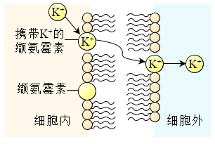
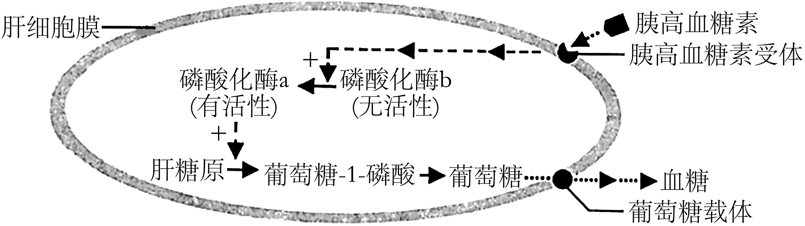
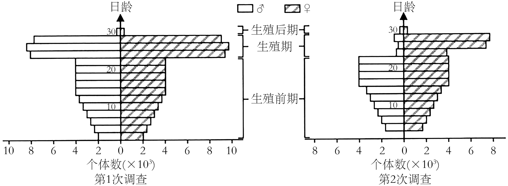
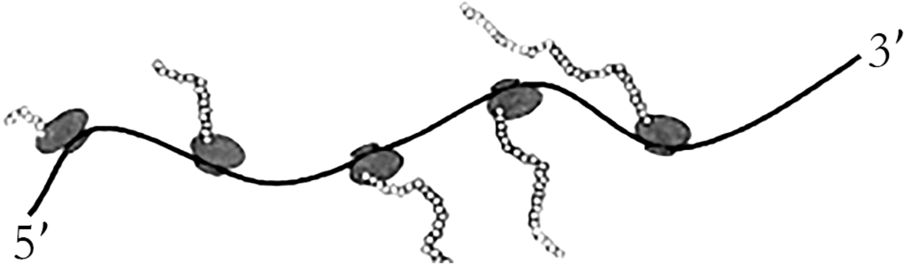
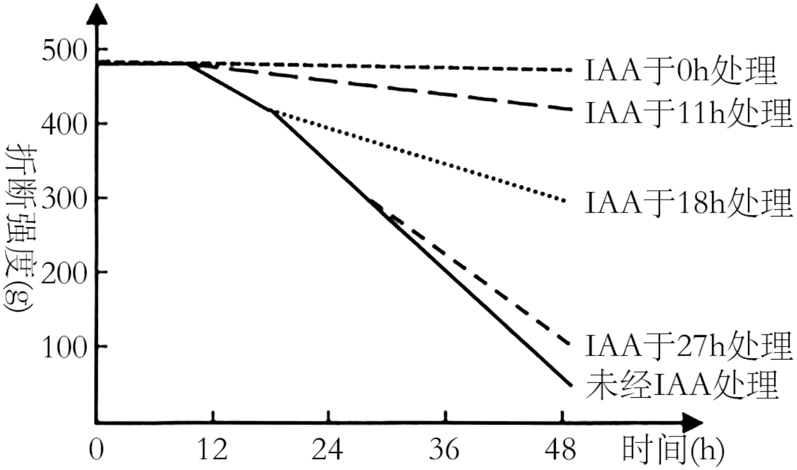
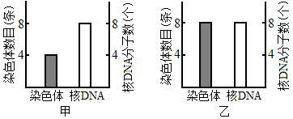
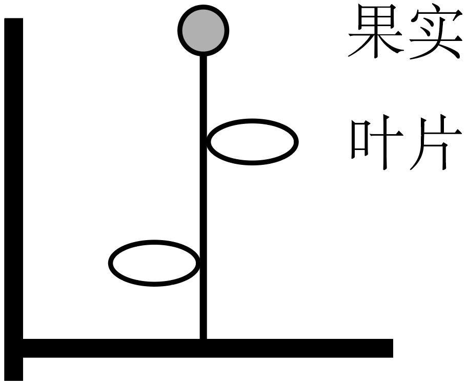
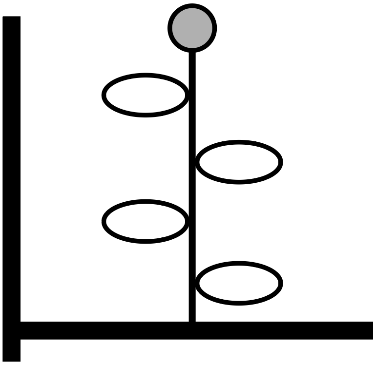
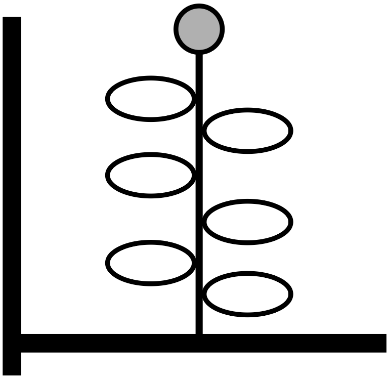
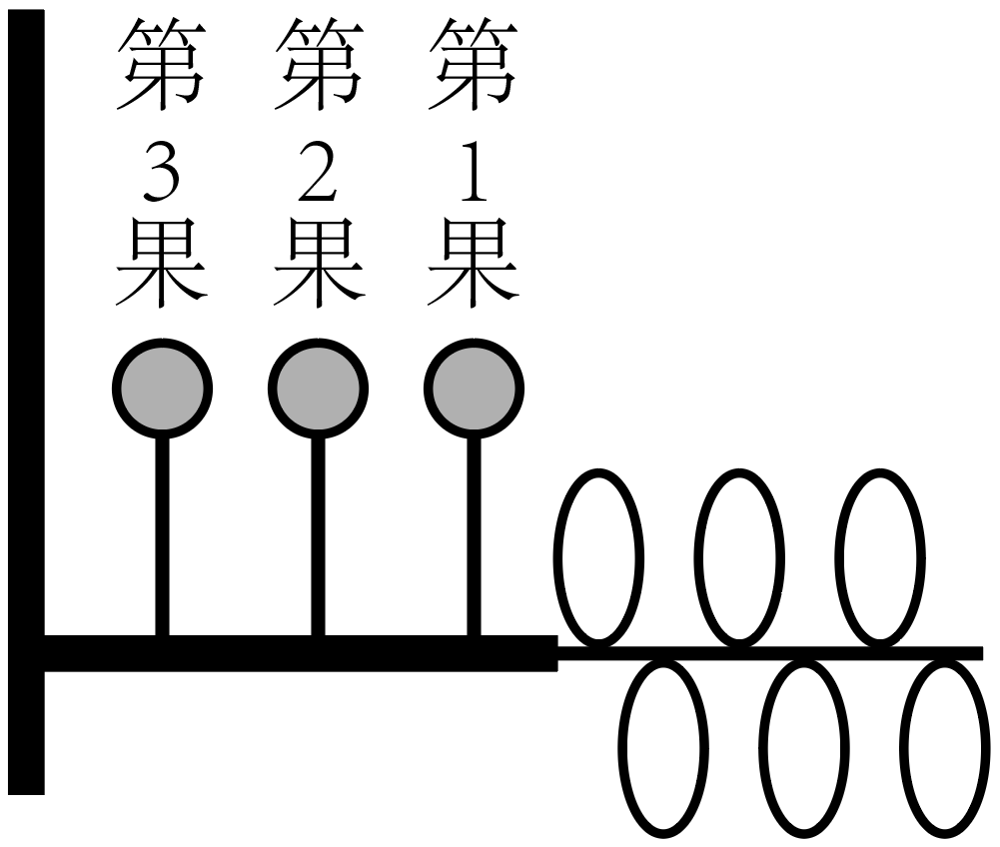

**2023年1月浙江省普通高校招生选考科目考试**

**生物学**

**一、选择题（本大题共20小题，每小题2分，共40分。每小题列出的四个备选项中只有一个是符合题目要求的，不选、多选、错选均不得分）**

1\. 近百年来，随着大气CO2浓度不断增加，全球变暖加剧。为减缓全球变暖，我国政府提出了“碳达峰”和“碳中和”的CO2排放目标，彰显了大国责任。下列措施不利于达成此目标的是（ ）

A. 大量燃烧化石燃料 B. 积极推进植树造林 C. 大力发展风能发电 D. 广泛应用节能技术

【答案】A

【解析】

【分析】“碳中和”是指一定时间内CO2的排放量与吸收量基本相当，CO2的捕集、利用是实现“碳中和”的重要途径。

【详解】A、大量燃烧化石燃料会导致大气中的二氧化碳含量增多，不利于实现碳中和，A符合题意；

BCD、积极推进植树造林 、大力发展风能发电和 广泛应用节能技术都可以减少二氧化碳的排放或增加二氧化碳的吸收利用，利于实现碳中和，BCD不符合题意。

故选A。

2\. 以哺乳动物为研究对象的生物技术已获得了长足的进步。对生物技术应用于人类，在安全与伦理方面有不同的观点，下列叙述正确的是（ ）

A. 试管婴儿技术应全面禁止

B. 治疗性克隆不需要监控和审查

C. 生殖性克隆不存在伦理道德方面的风险

D. 我国不赞成、不允许、不支持、不接受任何生殖性克隆人实验

【答案】D

【解析】

【分析】生殖性克隆是指通过克隆技术产生独立生存的新个体。治疗性克隆是指利用克隆技术产生特定的细胞、组织和器官，用它们来修复或替代受损的细胞、组织和器官，从而达到治疗疾病的目的。两者有着本质的区别。

【详解】A、我国政府一再重申四不原则：不赞成、不允许、不支持、不接受任何生殖性克隆人实验，但治疗性克隆可在有效监控和严格审查下实施，A错误；

B、我国政府同样重视治疗性克隆所涉及的伦理问题，主张对治疗性克隆进行有效监控和严格审查，B错误；

C、生殖性克隆人冲击了现有的一些有关婚姻、家庭和两性关系的伦理道德观念，C错误；

D、我国政府一再重申四不原则：不赞成、不允许、不支持、不接受任何生殖性克隆人实验，D正确。

故选D。

3\. 性腺细胞的内质网是合成性激素的场所。在一定条件下，部分内质网被包裹后与细胞器X融合而被降解，从而调节了性激素的分泌量。细胞器X是（ ）

A. 溶酶体 B. 中心体 C. 线粒体 D. 高尔基体

【答案】A

【解析】

【分析】溶酶体内含有多种水解酶；中心体与细胞有丝分裂有关；线粒体是有氧呼吸的主要场所，与能量转换有关；高尔基体与动物细胞分泌蛋白的加工和运输有关，与植物细胞的细胞壁形成有关。

【详解】根据题意“部分内质网被包裹后与细胞器X融合而被降解”，可推测细胞器X内含有水解酶，是细胞内的消化车间，故可知细胞器X是溶酶体，A正确，BCD错误。

故选A。

4\. 缬氨霉素是一种脂溶性抗生素，可结合在微生物的细胞膜上，将K＋运输到细胞外（如图所示），降低细胞内外的K＋浓度差，使微生物无法维持细胞内离子的正常浓度而死亡。下列叙述正确的是（ ）

A. 缬氨霉素顺浓度梯度运输K＋到膜外 B. 缬氨霉素运输K＋提供ATP

C. 缬氨霉素运输K＋与质膜的结构无关 D. 缬氨霉素可致噬菌体失去侵染能力

【答案】A

【解析】

【分析】分析题意：缬氨霉素可结合在微生物的细胞膜上，将K＋运输到细胞外，降低细胞内外的K＋浓度差，可推测正常微生物膜内K＋浓度高于膜外。

【详解】A、结合题意“将K＋运输到细胞外，降低细胞内外的K＋浓差”和题图中缬氨可霉素运输K＋的过程不消耗能量，可推测K＋的运输方式为协助扩散，顺浓度梯度运输，A正确；

B、结合A选项分析可知，K＋的运输方式为协助扩散，不需要消耗ATP，B错误；

C、缬氨霉素是一种脂溶性抗生素，能结合在细胞膜上，能在磷脂双子层间移动，该过程与质膜具有一定的流动性这一结构特点有关，C错误；

D、噬菌体为DNA病毒，病毒没有细胞结构，故缬氨霉素不会影响噬菌体的侵染能力，D错误。

故选A。

阅读下列材料，回答下列问题。

基因启动子区发生DNA甲基化可导致基因转录沉默。研究表明，某植物需经春化作用才能开花，该植物的DNA甲基化水平降低是开花的前提。用5－azaC处理后，该植株开花提前，检测基因组DNA，发现5'胞嘧啶的甲基化水平明显降低，但DNA序列未发生改变，这种低DNA甲基化水平引起的表型改变能传递给后代。

5 这种DNA甲基化水平改变引起表型改变，属于（ ）

A. 基因突变 B. 基因重组 C. 染色体变异 D. 表观遗传

6\. 该植物经5－azaC去甲基化处理后，下列各项中会发生显著改变的是（ ）

A. 基因的碱基数量 B. 基因的碱基排列顺序 C. 基因的复制 D. 基因的转录

【答案】5. D 6. D

【解析】

【分析】DNA甲基化是指在DNA甲基化转移酶的作用下，在DNA某些区域结合一个甲基基团。DNA甲基化能引起染色质结构、DNA稳定性及DNA与蛋白质相互作用方式的改变，从而控制基因表达。这种DNA甲基化修饰可以遗传给后代。

【5题详解】

表观遗传是指DNA序列不发生变化，但基因的表达却发生了可遗传的改变，即基因型未发生变化而表现型却发生了改变，如DNA的甲基化。

故选D。

【6题详解】

甲基化的Leyc基因不能与RNA聚合酶结合，故无法进行转录产生mRNA，也就无法进行翻译最终合成Leyc蛋白，从而抑制了基因的表达。植物经5－azaC去甲基化处理后，基因启动子正常解除基因转录沉默，基因能正常转录产生mRNA。

故选D。

7\. 在我国西北某地区，有将荒漠成功改造为枸杞园的事例。改造成的枸杞园与荒漠相比，生态系统的格局发生了重大变化。下列叙述错误的是（ ）

A. 防风固沙能力有所显现 B. 食物链和食物网基本不变

C. 土壤的水、肥条件得到很大改善 D. 单位空间内被生产者固定的太阳能明显增多

【答案】B

【解析】

【分析】改造成的枸杞园与荒漠相比，荒漠地区存在一定的动植物，该地荒漠植被恢复成枸杞园的过程中发生了群落的次生演替，物种丰富度增加。因而其生态系统的营养结构更为复杂，抵抗力稳定性更高。

【详解】A、枸杞园营养结构更为复杂，抵抗力稳定性更高，防风固沙能力增强，A正确；

B、荒漠植被恢复成枸杞园的过程中发生了群落的次生演替，物种丰富度增加，食物链增多，食物网更加复杂，B错误；

C、枸杞园植被增多，保水能力上升，土壤的水、肥条件得到很大改善，C正确；

D、枸杞园植被增多，单位空间内被生产者固定的太阳能明显增多，D正确。

故选B。

8\. 某同学研究某因素对酶活性的影响，实验处理及结果如下：己糖激酶溶液置于45℃水浴12min，酶活性丧失50%；己糖激酶溶液中加入过量底物后置于45℃水浴12min，酶活性仅丧失3%。该同学研究的因素是（ ）

A. 温度 B. 底物 C. 反应时间 D. 酶量

【答案】B

【解析】

【分析】影响酶活性的因素有温度、PH、抑制剂和激活剂。由题干分析，己糖激酶溶液置于45℃水浴12min，酶活性丧失50%；己糖激酶溶液中加入过量底物后置于45℃水浴12min，酶活性仅丧失3%。这两组实验的不同条件在于是否加入底物。

【详解】A、由题干可知，两组实验的温度都为45℃，所以研究的因素不是温度，A错误；\
B、由题干分析，己糖激酶溶液置于45℃水浴12min，酶活性丧失50%；己糖激酶溶液中加入过量底物后置于45℃水浴12min，酶活性仅丧失3%。这两组实验的不同条件在于是否加入底物。所以研究的因素是底物，B正确；\
C、由题干可知，两组实验的反应时间均为12min，所以研究的因素不是反应时间，C错误；\
D、由题干可知，两组实验的酶量一致，所以研究的因素不是酶量，D错误。\
故选B。

阅读下列材料，回答下列问题。

纺锤丝由微管构成，微管由微管蛋白组成。有丝分裂过程中，染色体的移动依赖于微管的组装和解聚。紫杉醇可与微管结合，使微管稳定不解聚，阻止染色体移动，从而抑制细胞分裂。

9\. 微管蛋白是构成细胞骨架的重要成分之一，组成微管蛋白的基本单位是（ ）

A. 氨基酸 B. 核苷酸 C. 脂肪酸 D. 葡萄糖

10\. 培养癌细胞时加入一定量的紫杉醇，下列过程受影响最大的是（ ）

A. 染色质复制 B. 染色质凝缩为染色体

C. 染色体向两极移动 D. 染色体解聚为染色质

【答案】9. A 10. C

【解析】

【分析】染色体和染色质是同一种物质在细胞分裂不同时期的不同形态，微管蛋白构成纺锤丝，可影响染色体的移动，但不影响复制、着丝粒分裂等过程。

【9题详解】

微管蛋白是蛋白质，构成微管蛋白的基本单位是氨基酸，氨基酸经过脱水缩合构成蛋白质，故选A。

【10题详解】

紫杉醇可与微管结合，使微管稳定不解聚，阻止染色体移动，从而抑制细胞分裂，但不影响染色体的复制、凝缩、解聚过程，影响最大的是染色体向两极移动，故选C。

11\. 胰高血糖素可激活肝细胞中的磷酸化酶，促进肝糖原分解成葡萄糖，提高血糖水平，机理如图所示。

下列叙述正确的是（ ）

A. 胰高血糖素经主动运输进入肝细胞才能发挥作用

B. 饥饿时，肝细胞中有更多磷酸化酶b被活化

C. 磷酸化酶a能为肝糖原水解提供活化能

D. 胰岛素可直接提高磷酸化酶a的活性

【答案】B

【解析】

【分析】分析题图：胰高血糖素与肝细胞膜上的胰高血糖素受体结合后，胞内磷酸化酶b被活化，促进肝糖原分解，葡萄糖通过膜上葡萄糖载体运输到胞外，增加血糖浓度。

【详解】A、胰高血糖素属于大分子信息分子，不会进入肝细胞，需要与膜上特异性受体结合才能发挥作用，A错误；

B、饥饿时，胰高血糖素分泌增加，肝细胞中有更多磷酸化酶b被活化成磷酸化酶a，加快糖原的分解，以维持血糖浓度相对稳定，B正确；

C、磷酸化酶a不能为肝糖原水解提供活化能，酶的作用机理是降低化学反应所需活化能，C错误；

D、根据题图无法判断胰岛素和磷酸化酶a的活性的关系，且胰岛素为大分子物质，不能直接进入细胞内发挥作用，D错误。

故选B。

12\. 在家畜优良品种培育过程中常涉及胚胎工程的相关技术。下列叙述错误的是（ ）

A. 经获能处理的精子才能用于体外受精 B. 受精卵经体外培养可获得早期胚胎

C. 胚胎分割技术提高了移植胚胎的成活率 D. 胚胎移植前需对受体进行选择和处理

【答案】C

【解析】

【分析】胚胎移植的基本程序主要包括：①对供、受体的选择和处理（选择遗传特性和生产性能优秀的供体，有健康的体质和正常繁殖能力的受体，用激素进行同期发情处理，用促性腺激素对供体母牛做超数排卵处理）；②配种或人工授精；③对胚胎的收集、检查、培养或保存（对胚胎进行质量检查，此时的胚胎应发育到桑椹或胚囊胚阶段）；④对胚胎进行移植；⑤移植后的检查。

【详解】A、精子需要经过获能处理才具有受精能力，A正确；

B、受精卵经体外培养可获得早期胚胎，B正确；

C、胚胎分割可以获得多个胚胎，分割次数越多，分割后胚胎成活的概率越小，C错误；

D、胚胎移植前，需选择健康体质和正常繁殖能力的受体且进行同期发情处理，D正确。

故选C。

13\. 太平洋某岛上生存着上百个蜗牛物种，但同一区域中只有少数几个蜗牛物种共存。生活在同一区域的不同蜗牛物种之间外壳相似性高，生活在不同区域的不同蜗牛物种之间外壳相似性低。下列叙述正确的是（ ）

A. 该岛上蜗牛物种数就是该岛的物种多样性

B. 该岛上所有蜗牛的全部基因组成了一个基因库

C. 同一区域内的不同蜗牛物种具有相似的外壳是自然选择的结果

D. 仅有少数蜗牛物种生存在同一区域是种间竞争造成生态位重叠的结果

【答案】C

【解析】

【详解】A、物种多样性是指地球上动物、植物、微生物等生物种类的丰富程度，蜗牛只是其中的一种生物，其数量不能代表该岛的物种多样性，A错误；

B、一个生物种群的全部等位基因的总和称为基因库，而该岛上的蜗牛有上百个物种，故其全部基因不能组成一个基因库，B错误；

C、同一区域内的不同蜗牛物种所处的环境相同，具有相似的外壳，是自然选择的结果，C正确；

D、仅有少数蜗牛物种生存在同一区域是种间竞争造成生态位分化的结果，D错误。

故选C。

14\. 在我国江南的一片水稻田中生活着某种有害昆虫。为了解虫情，先后两次（间隔3天）对该种群展开了调查，前后两次调查得到的数据统计结果如图所示。

在两次调查间隔期内，该昆虫种群最可能遭遇到的事件为（ ）

A. 受寒潮侵袭 B. 遭杀虫剂消杀 C. 被天敌捕杀 D. 被性外激素诱杀

【答案】D

【解析】

【分析】（1）据图分析，第2次调查较第1次调查结果比较生殖期昆虫的性别比例变化较大。

【详解】A、若昆虫种群受寒潮侵袭，则各日龄阶段昆虫侵袭程度应一致，A错误；

B、若昆虫种群遭杀虫剂消杀，则各日龄阶段昆虫消杀程度应一致，B错误；

C、若昆虫种群被天敌捕杀，则应是低日龄阶段昆虫被影响较大，C错误；

D、性引诱剂可以吸引交配期的雄性个体，进行诱杀，因此生殖期和生殖后期雄性昆虫数量变化较大，D正确。

故选D。

15\. 核糖体是蛋白质合成的场所。某细菌进行蛋白质合成时，多个核糖体串联在一条mRNA上形成念珠状结构——多聚核糖体（如图所示）。多聚核糖体上合成同种肽链的每个核糖体都从mRNA同一位置开始翻译，移动至相同的位置结束翻译。多聚核糖体所包含的核糖体数量由mRNA的长度决定。下列叙述正确的是（ ）

A. 图示翻译过程中，各核糖体从mRNA的3'端向5'端移动

B. 该过程中，mRNA上的密码子与tRNA上的反密码子互补配对

C. 图中5个核糖体同时结合到mRNA上开始翻译，同时结束翻译

D. 若将细菌的某基因截短，相应的多聚核糖体上所串联的核糖体数目不会发生变化

【答案】B

【解析】

【分析】图示为翻译的过程，在细胞质中，翻译是一个快速高效的过程。通常，一个mRNA分子上可以相继结合多个核糖体，同时进行多条肽链的合成，因此，少量的mRNA分子就可以迅速合成大量的蛋白质。

【详解】A、图示翻译过程中，各核糖体从mRNA的5'端向3'端移动，A错误；

B、该过程中，mRNA上的密码子与tRNA上的反密码子互补配对，tRNA通过识别mRNA上的密码子携带相应氨基酸进入核糖体，B正确；

C、图中5个核糖体结合到mRNA上开始翻译，从识别到起始密码子开始进行翻译，识别到种子密码子结束翻译，并非是同时开始同时结束，C错误；

D、若将细菌的某基因截短，相应的多聚核糖体上所串联的核糖体数目可能会减少，D错误。

故选B。

16\. 为探究酵母菌的细胞呼吸方式，可利用酵母菌、葡萄糖溶液等材料进行实验。下列关于该实验的叙述，正确的是（ ）

A. 酵母菌用量和葡萄糖溶液浓度是本实验的自变量

B. 酵母菌可利用的氧气量是本实验的无关变量

C. 可选用酒精和CO2生成量作为因变量的检测指标

D. 不同方式的细胞呼吸消耗等量葡萄糖所释放的能量相等

【答案】C

【解析】

【分析】探究酵母菌的细胞呼吸方式的实验中，酵母菌用量和葡萄糖溶液是无关变量；氧气的有无是自变量；需氧呼吸比厌氧呼吸释放的能量多。

【详解】A、酵母菌用量和葡萄糖溶液是无关变量，A选项错误；

B、氧气的有无是自变量，B选项错误；

C、有氧呼吸不产生酒精，无氧呼吸产生酒精和CO2且比值为1:1，因此可选用酒精和CO2生成量作为因变量的检测指标，C选项正确；

D、等量的葡萄糖有氧呼吸氧化分解彻底，释放能量多，无氧呼吸氧化分解不彻底，大部分能量还储存在酒精中，释放能量少，D选项错误；

故选C。

17\. 某人的左眼球严重损伤，医生建议立即摘除左眼球，若不及时摘除，右眼会因自身免疫而受损。下列叙述正确的是（ ）

A. 在人体发育过程中，眼球内部的抗原性物质已被完全清除

B. 正常情况下，人体内不存在能识别眼球内部抗原的免疫细胞

C. 眼球损伤后，眼球内部的某些物质释放出来引发特异性免疫

D. 左眼球损伤后释放的抗原性物质运送至右眼球引发自身免疫

【答案】C

【解析】

【分析】体液免疫过程为：(1)感应阶段：除少数抗原可以直接刺激B细胞外，大多数抗原被吞噬细胞摄取和处理，并暴露出其抗原决定簇:吞噬细胞将抗原呈递给T细胞，再由T细胞呈递给B细胞；(2)反应阶段：B细胞接受抗原刺激后，开始进行一系列的增殖、分化，形成记忆细胞和浆细胞；(3)效应阶段：浆细胞分泌抗体与相应的抗原特异性结合，发挥免疫效应。

细胞免疫过程为：(1)感应阶段：吞噬细胞摄取和处理抗原，并暴露出其抗原决定簇，然后将抗原呈递给T细胞；(2)反应阶段：T细胞接受抗原刺激后增殖、分化形成记忆细胞和效应T细胞，同时T细胞能合成并分泌淋巴因子，增强免疫功能；(3)效应阶段：效应T细胞发挥效应。

【详解】A、晶状体与人体其他组织是隔离的，在人体发育过程中，眼球内部的抗原性物质并未完全清除，A错误；

B、晶状体与人体其他组织是隔离的，破裂后晶状体蛋白进入血液成为自身抗原，引起免疫，因此人体内存在能识别眼球内部抗原的免疫细胞，B错误；

C、晶状体与人体其他组织是隔离的，破裂后晶状体蛋白进入血液成为自身抗原，引起特异性免疫，C正确；

D、破裂后晶状体蛋白进入血液成为自身抗原，细胞产生的抗体随体液运输，攻击另一只眼球中的晶状体蛋白，属于体液免疫，是一种自身免疫，D错误。

故选C。

18\. 研究人员取带叶的某植物茎段，切去叶片，保留叶柄，然后将茎段培养在含一定浓度乙烯的空气中，分别在不同时间用一定浓度IAA处理切口。在不同时间测定叶柄脱落所需的折断强度，实验结果如图所示。

下列关于本实验的叙述，正确的是（ ）

A. 切去叶片可排除叶片内源性IAA对实验结果的干扰

B. 越迟使用IAA处理，抑制叶柄脱落的效应越明显

C. IAA与乙烯对叶柄脱落的作用是相互协同的

D. 不同时间的IAA处理效果体现IAA作用的两重性

【答案】A

【解析】

【分析】1、生长素类具有促进植物生长的作用，在生产上的应用主要有：(1)促进扦插的枝条生根；(2)促进果实发育;(3)防止落花落果。

2、赤霉素的生理作用是促进细胞伸长，从而引起茎秆伸长和植物增高，此外，它还有促进麦芽糖化，促进营养生长，防止器官脱落和解除种子、块茎休眠促进萌发等作用。

3、细胞分裂素类，细胞分裂素在根尖合成，在进行细胞分裂的器官中含量较高，细胞分裂素的主要作用是促进细胞分裂和扩大，此外还有诱导芽的分化，延缓叶片衰老的作用。

4、脱落酸， 脱落酸在根冠和萎蔫的叶片中合成较多，在将要脱落和进入休眠期的器官和组织中含量较多，脱落酸是植物生长抑制剂，它能够抑制细胞的分裂和种子的萌发，还有促进叶和果实的衰老和脱落，促进休眠和提高抗逆能力等作用。

5、乙烯主要作用是促进果实成熟，此外，还有 促进老叶等器官脱落作用。

【详解】A、切去叶片，目的是排除叶片内源性IAA对实验结果的干扰，A正确；

B、据图分析，越迟使用IAA处理，叶柄脱落所需的折断强度越低，因此抑制叶柄脱落的效应越弱，B错误；

C、有图分析，不使用IAA处理，只有乙烯，会促进叶柄脱落；越早使用IAA会抑制叶柄脱落，因此IAA与乙烯对叶柄脱落的作用是相互拮抗的，C错误；

D、图中，不同时间的IAA处理效果均表现为抑制折断，因此不能体现IAA作用的两重性，D错误。

故选A。

19\. 某同学想从泡菜汁中筛选耐高盐乳酸菌，进行了如下实验：取泡菜汁样品，划线接种于一定NaCl浓度梯度的培养基，经培养得到了单菌落。下列叙述正确的是（ ）

A. 培养基pH需偏碱性 B. 泡菜汁需多次稀释后才能划线接种

C. 需在无氧条件下培养 D. 分离得到的微生物均为乳酸菌

【答案】C

【解析】

【分析】泡菜是利用附生在蔬菜表面的植物乳杆菌、短乳杆菌和明串珠菌等发酵制成的。这些微生物一般为厌氧、兼性厌氧或微好氧菌。它们的发酵产物不仅有乳酸，还会有醇、酯等，因而使泡菜具有特殊的风味。

【详解】A、因为乳酸菌经过无氧呼吸产生乳酸，故其生活的环境是酸性，培养基pH需偏酸性，A错误；

B、平板划线接种时不需要稀释，B错误；

C、乳酸菌是厌氧型微生物，所以需在无氧条件下培养，C正确；

D、参与泡菜发酵的微生物有乳杆菌、短乳杆菌和明串珠菌等，所以分离得到的微生物除了乳酸菌，还会有其他耐高盐的微生物，D错误。

故选C。

20\. 某基因型为AaXDY的二倍体雄性动物（2n＝8），1个初级精母细胞的染色体发生片段交换，引起1个A和1个a发生互换。该初级精母细胞进行减数分裂过程中，某两个时期的染色体数目与核DNA分子数如图所示。

下列叙述正确的是（ ）

A. 甲时期细胞中可能出现同源染色体两两配对的现象

B. 乙时期细胞中含有1条X染色体和1条Y染色体

C. 甲、乙两时期细胞中的染色单体数均为8个

D. 该初级精母细胞完成减数分裂产生的4个精细胞的基因型均不相同

【答案】D

【解析】

【分析】1、分析题图：图甲中染色体数目与核DNA分子数比为1:2，但染色体数为4，所以图甲表示次级精母细胞的前期和中期细胞；图乙中染色体数目与核DNA分子数比为1:1，可表示间期或次级精母细胞的后期。

2、同源染色体，着丝点分裂，染色体移向细胞两极，处于减数第二次分裂后期，为次级精母细胞。

【详解】A、表示次级精母细胞的前期和中期细胞，则甲时期细胞中不可能出现同源染色体两两配对的现象，A错误；

B、若图表示减数分裂Ⅱ后期，则乙时期细胞中含有2条X染色体或2条Y染色体，B错误；

C、图乙中染色体数目与核DNA分子数比为1:1，无染色单体数，C错误；

D、因为初级精母细胞的染色体发生片段交换，引起1个A和1个a发生互换，产生了AXD 、 aXD、AY、aY4种基因型的精细胞，D正确。

故选D。

**二、非选择题（本大题共5小题，共60分）**

21\. 我们说话和唱歌时，需要有意识地控制呼吸运动的频率和深度，这属于随意呼吸运动；睡眠时不需要有意识地控制呼吸运动，人体仍进行有节律性的呼吸运动，这属于自主呼吸运动。人体呼吸运动是在各级呼吸中枢相互配合下进行的，呼吸中枢分布在大脑皮层、脑干和脊髓等部位。体液中的O2、CO2和H＋浓度变化通过刺激化学感受器调节呼吸运动。回答下列问题：

（1）人体细胞能从血浆、\_\_\_\_\_\_\_\_\_\_和淋巴等细胞外液获取O2，这些细胞外液共同构成了人体的内环境。内环境的相对稳定和机体功能系统的活动，是通过内分泌系统、\_\_\_\_\_\_\_\_\_\_系统和免疫系统的调节实现的。

（2）自主呼吸运动是通过反射实现的，其反射弧包括感受器、\_\_\_\_\_\_\_\_\_\_和效应器。化学感受器能将O2、CO2和H＋浓度等化学信号转化为\_\_\_\_\_\_\_\_\_\_信号。神经元上处于静息状态的部位，受刺激后引发Na＋\_\_\_\_\_\_\_\_\_\_而转变为兴奋状态。

（3）人屏住呼吸一段时间后，动脉血中的CO2含量增大，pH变\_\_\_\_\_\_\_\_\_\_，CO2含量和pH的变化共同引起呼吸加深加快。还有实验发现，当吸入气体中CO2浓度过大时，会出现呼吸困难、昏迷等现象，原因是CO2浓度过大导致呼吸中枢\_\_\_\_\_\_\_\_\_\_。

（4）大脑皮层受损的“植物人”仍具有节律性的自主呼吸运动；哺乳动物脑干被破坏，或脑干和脊髓间的联系被切断，呼吸停止。上述事实说明，自主呼吸运动不需要位于\_\_\_\_\_\_\_\_\_\_的呼吸中枢参与，自主呼吸运动的节律性是位于\_\_\_\_\_\_\_\_\_\_的呼吸中枢产生的。

【答案】（1） ①. 组织液 ②. 神经

（2） ①. 传入神经、神经中枢、传出神经 ②. 电 ③. 内流

（3） ①. 小 ②. 受抑制

（4） ①. 大脑皮层 ②. 脑干

【解析】

【分析】1、体液是由细胞内液和细胞外液组成，细胞内液是指细胞内的液体，而细胞外液即细胞的生存环境，它包括血浆、组织液、淋巴等，也称为内环境。2、内环境稳态的调节机制：神经--体液--免疫调节共同作用。

【小问1详解】

人体的内环境包括血浆、组织液、淋巴等，人体细胞可从内环境中获取氧气。人体内环境稳态的调节机制是神经--体液--免疫调节，故内环境的相对稳定是通过内分泌系统、神经系统和免疫系统的调节实现的。

【小问2详解】

反射弧包括感受器、传入神经、神经中枢、传出神经和效应器。化学感受器能将化学信号转化为电信号。神经元上处于静息状态的部位，受刺激后引发Na＋内流产生动作电位，从而转变为兴奋状态。

【小问3详解】

动脉血中的CO2含量增大，会导致血浆pH变小。CO2浓度过大会导致呼吸中枢受抑制，从而出现呼吸困难、昏迷等现象。

【小问4详解】

大脑皮层受损仍具有节律性的自主呼吸运动，说明自主呼吸运动不需要位于大脑皮层的呼吸中枢参与，而脑干被破坏或脑干和脊髓间的联系被切断，呼吸停止，说明自主呼吸运动的节律性是位于脑干的呼吸中枢产生的。

22\. 2021年，栖居在我国西双版纳的一群亚洲象有过一段北迁的历程。时隔一年多的2022年12月，又有一群亚洲象开启了新的旅程，沿途穿越了森林及农田等一系列生态系统，再次引起人们的关注。回答下列问题：

（1）植物通常是生态系统中的生产者，供养着众多的\_\_\_\_\_\_\_\_\_\_和分解者。亚洲象取食草本植物，既从植物中获取物质和能量，也有利于植物\_\_\_\_\_\_\_\_\_\_的传播。亚洲象在食草的食物链中位于第\_\_\_\_\_\_\_\_\_\_营养级。

（2）亚洲象经过一片玉米地，采食了部分玉米，对该农田群落结构而言，最易改变的是群落的\_\_\_\_\_\_\_\_\_\_结构；对该玉米地生物多样性的影响是降低了\_\_\_\_\_\_\_\_\_\_多样性。这块经亚洲象采食的玉米地，若退耕后自然演替成森林群落，这种群落演替类型称为\_\_\_\_\_\_\_\_\_\_演替。

（3）与森林相比，玉米地的抗干扰能力弱、维护系统稳定的能力差，下列各项中属于其原因的是哪几项？\_\_\_\_\_\_\_\_\_\_

A. 物种丰富度低 B. 结构简单 C. 功能薄弱 D. 气候多变

（4）亚洲象常年的栖息地热带雨林，植物生长茂盛，凋落物多，但土壤中有机质含量低。土壤中有机质含量低的原因是：在雨林高温、高湿的环境条件下，\_\_\_\_\_\_\_\_\_\_。

【答案】（1） ①. 消费者 ②. 繁殖体 ③. 二

（2） ①. 水平 ②. 遗传 ③. 次生 （3）ABC

（4）分解者将有机物快速分解为无机物

【解析】

【分析】1、群落的垂直结构指群落在垂直方面的配置状态，其最显著的特征是成层现象，即在垂直方向分成许多层次的现象。群落的水平结构指群落的水平配置状况或水平格局，其主要表现特征是镶嵌性。

2、群落演替的类型：初生演替是指一个从来没有被植物覆盖的地面，或者是原来存在过植被，但是被彻底消灭了的地方发生的演替；次生演替是指原来有的植被虽然已经不存在，但是原来有的土壤基本保留，甚至还保留有植物的种子和其他繁殖体的地方发生的演替。

3、生物多样性的三个层次：遗传的多样性、物种的多样性、生态系统的多样性。

【小问1详解】

生态系统的组成成分包括非生物的物质和能量，生产者、消费者和分解者，植物通常是生态系统中的生产者，供养着众多的消费者和分解者。动物既从植物中获取物质和能量，也有利于植物繁殖体的传播。亚洲象食草的食物链中，亚洲象属于初级消费者，位于第二营养级。

【小问2详解】

亚洲象采食了部分玉米，最易改变的是群落的水平结构；生物多样性包括三个层次：遗传多样性、物种多样性、生态系统多样性，其中部分玉米被取食，降低了遗传多样性。退耕后仍保留原有土壤条件及繁殖体，这种群落演替类型称为次生演替。

【小问3详解】

ABC、与森林相比，玉米地的物种丰富度低，结构简单，功能薄弱，抵抗力稳定性弱，即抗干扰能力弱、维护系统稳定的能力差，ABC正确；

D、气候与生态系统抵抗力稳定性无关，D错误。

故选ABC。

【小问4详解】

在雨林高温、高湿的环境条件下，分解者将有机物快速分解为无机物，故土壤中有机质含量低。

23\. 叶片是给植物其他器官提供有机物的“源”，果实是储存有机物的“库”。现以某植物为材料研究不同库源比（以果实数量与叶片数量比值表示）对叶片光合作用和光合产物分配的影响，实验结果见表1。

表1

| 项目 | 甲组 | 乙组 | 丙组 |
|:--:|:--:|:--:|:--:|
| 处理 |  |  |  |
| 库源比 | 1/2 | 1/4 | 1/6 |
| 单位叶面积叶绿素相对含量 | 78.7 | 75.5 | 75.0 |
| 净光合速率（μmol·m－2·s－1） | 9.31 | 8.99 | 8.75 |
| 果实中含13C光合产物（mg） | 21.96 | 37.38 | 66.06 |
| 单果重（g） | 11.81 | 12.21 | 19.59 |

注：①甲、乙、丙组均保留枝条顶部1个果实并分别保留大小基本一致的2、4、6片成熟叶，用13CO2供应给各组保留的叶片进行光合作用。②净光合速率：单位时间单位叶面积从外界环境吸收的13CO2量。

回答下列问题：

（1）叶片叶绿素含量测定时，可先提取叶绿体色素，再进行测定。提取叶绿体色素时，选择乙醇作为提取液的依据是\_\_\_\_\_\_\_\_\_\_。

（2）研究光合产物从源分配到库时，给叶片供应13CO2，13CO2先与叶绿体内的\_\_\_\_\_\_\_\_\_\_结合而被固定，形成的产物还原为糖需接受光反应合成的\_\_\_\_\_\_\_\_\_\_中的化学能。合成的糖分子运输到果实等库中。在本实验中，选用13CO2的原因有\_\_\_\_\_\_\_\_\_\_（答出2点即可）。

（3）分析实验甲、乙、丙组结果可知，随着该植物库源比降低，叶净光合速率\_\_\_\_\_\_\_\_\_\_（填“升高”或“降低”）、果实中含13C光合产物的量\_\_\_\_\_\_\_\_\_\_（填“增加”或“减少”）。库源比降低导致果实单果重变化的原因是\_\_\_\_\_\_\_\_\_\_。

（4）为进一步研究叶片光合产物分配原则进行了实验，库源处理如图所示，用13CO2供应给保留的叶片进行光合作用，结果见表2。

| 果实位置 | 果实中含13C光合产物（mg） | 单果重（g） |
|:--------:|:------------------------------------:|:-----------:|
|  第1果   |                26.91                 |    12.31    |
|  第2果   |                18.00                 |    10.43    |
|  第3果   |                 2.14                 |    8.19     |

根据表2实验结果，从库与源的距离分析，叶片光合产物分配给果实的特点是\_\_\_\_\_\_\_\_\_\_。

（5）综合上述实验结果，从调整库源比分析，下列措施中能提高单枝的合格果实产量（单果重10g以上为合格）的是哪一项？\_\_\_\_\_\_\_\_\_\_

A. 除草 B. 遮光 C. 疏果 D. 松土

【答案】（1）叶绿体中的色素易溶于无水乙醇

（2） ①. \
②. ATP和NADPH ③. 研究光合产物从源分配到库生成过程；研究净光合积累有机物的量

（3） ①. 降低 ②. 增加\
③. 库源比降低，植株总的叶片光合作用制造的有机物增多，运输到单个果实的有机物量增多，因此单果重量增加。

（4）离叶片越近的果实分配到的有机物越多，即库与源距离越近，库得到的有机物越多\
（5）C

【解析】

【分析】本题研究研究不同库源比（以果实数量与叶片数量比值表示）对叶片光合作用和光合产物分配的影响，自变量为库源比，即以果实数量与叶片数量比值；因变量为光合作用以及光合产物分配情况。

小问1详解】

叶绿体中的色素易溶于无水乙醇，因此用乙醇作为提取液；

【小问2详解】

研究光合产物从源分配到库时，给叶片供应13，13先与叶绿体内的结合而被固定，形成的产物还原为糖需接受光反应合成的ATP和NADPH中的化学能，合成的糖分子运输到果实等库中。

在本实验中，选用13的原因有研究光合产物从源分配到库生成过程，研究净光合积累有机物的量等。

【小问3详解】

分析实验甲、乙、丙组结果可知，随着该植物库源比降低，叶净光合速率降低；

果实中含光合产物的量增多；

库源比降低导致果实单果重变化的原因是植株总的叶片光合作用制造的有机物增多，运输到单个果实的有机物量增多，因此单果重量增加。

【小问4详解】

根据表2实验结果，从库与源的距离分析，叶片光合产物分配给果实的特点是离叶片越近的果实分配到的有机物越多，即库与源距离越近，库得到的有机物越多。

【小问5详解】

综合上述实验结果，从调整库源比分析，能提高单枝的合格果实产量的是疏果，减小库和源的比值，能提高果实产量，故选C。

24\. 甲植物细胞核基因具有耐盐碱效应，乙植物细胞质基因具有高产效应。某研究小组用甲、乙两种植物细胞进行体细胞杂交相关研究，基本过程包括获取原生质体、诱导原生质体融合、筛选融合细胞、杂种植株再生和鉴定，最终获得高产耐盐碱再生植株。回答下列问题：

（1）根据研究目标，在甲、乙两种植物细胞进行体细胞杂交前，应检验两种植物的原生质体是否具备\_\_\_\_\_\_\_\_\_\_的能力。为了便于观察细胞融合的状况，通常用不同颜色的原生质体进行融合，若甲植物原生质体采用幼苗的根为外植体，则乙植物可用幼苗的\_\_\_\_\_\_\_\_\_\_为外植体。

（2）植物细胞壁的主要成分为\_\_\_\_\_\_\_\_\_\_和果胶，在获取原生质体时，常采用相应的酶进行去壁处理。在原生质体融合前，需对原生质体进行处理，分别使甲原生质体和乙原生质体的\_\_\_\_\_\_\_\_\_\_失活。对处理后的原生质体在显微镜下用\_\_\_\_\_\_\_\_\_\_计数，确定原生质体密度。两种原生质体1∶1混合后，通过添加适宜浓度的PEG进行融合；一定时间后，加入过量的培养基进行稀释，稀释的目的是\_\_\_\_\_\_\_\_\_\_。

（3）将融合原生质体悬浮液和液态的琼脂糖混合，在凝固前倒入培养皿，融合原生质体分散固定在平板中，并独立生长、分裂形成愈伤组织。同一块愈伤组织所有细胞源于\_\_\_\_\_\_\_\_\_\_。下列各项中能说明这些愈伤组织只能来自于杂种细胞的理由是哪几项？\_\_\_\_\_\_\_\_\_\_

A ．甲、乙原生质体经处理后失活，无法正常生长、分裂

B．同种融合的原生质体因甲或乙原生质体失活而不能生长、分裂

C．培养基含有抑制物质，只有杂种细胞才能正常生长、分裂

D．杂种细胞由于结构和功能完整可以生长、分裂

（4）愈伤组织经\_\_\_\_\_\_\_\_\_\_可形成胚状体或芽。胚状体能长出\_\_\_\_\_\_\_\_\_\_，直接发育形成再生植株。

（5）用PCR技术鉴定再生植株。已知甲植物细胞核具有特异性DNA序列a，乙植物细胞质具有特异性DNA序列b；M1、M2为序列a的特异性引物，N1、N2为序列b的特异性引物。完善实验思路：

Ⅰ．提取纯化再生植株的总DNA，作为PCR扩增的\_\_\_\_\_\_\_\_\_\_。

Ⅱ．将DNA提取物加入PCR反应体系，\_\_\_\_\_\_\_\_\_\_为特异性引物，扩增序列a；用同样的方法扩增序列b。

Ⅲ．得到的2个PCR扩增产物经\_\_\_\_\_\_\_\_\_\_后，若每个PCR扩增产物在凝胶中均出现了预期的\_\_\_\_\_\_\_\_\_\_个条带，则可初步确定再生植株来自于杂种细胞。

【答案】（1） ①. 再生 ②. 叶

（2） ①. 纤维素 ②. 细胞质和细胞核 ③. 血细胞计数板 ④. 降低PEG浓度，使其失去融合作用

（3） ①. 同一个杂种融合原生质体 ②. ABD

（4） ①. 再分化 ②. 根和芽

（5） ①. 模板 ②. M1、M2 ③. 凝胶电泳 ④. 1

【解析】

【分析】1、植物组织培养过程：离体的植物组织经过脱分化形成愈伤组织，经过再分化愈伤组织又能重新分化为有结构的组织和器官，最终形成完整的植株。

2、植物体细胞杂交可以克服植物有性杂交不亲和性、打破物种之间的生殖隔离，操作过程包括:原生质体制备、原生质体融合、杂种细胞筛选、杂种细胞培养、杂种植株再生以及杂种植株鉴定等步骤。

【小问1详解】

在甲、乙两种植物细胞进行体细胞杂交前，应检验两种植物的原生质体是否具备再生的能力。为了便于观察细胞融合的状况，通常用不同颜色的原生质体进行融合，若甲植物原生质体采用幼苗的根为外植体，则乙植物可用幼苗的叶为外植体。

【小问2详解】

植物细胞壁的主要成分为纤维素和果胶，在获取原生质体时，常采用相应的酶进行去壁处理。甲植物细胞核基因具有耐盐碱效应，乙植物细胞质基因具有高产效应，在原生质体融合前，需对原生质体进行处理，分别使甲原生质体和乙原生质体的细胞质和细胞核失活，融合后具有甲植物的细胞核基因和乙植物的细胞质基因。对处理后的原生质体在显微镜下用血细胞计数板计数，确定原生质体密度。两种原生质体1∶1混合后，通过添加适宜浓度的PEG进行融合；一定时间后，加入过量的培养基进行稀释，稀释的目的是降低PEG浓度,使其失去融合作用。

【小问3详解】

将融合原生质体悬浮液和液态的琼脂糖混合，在凝固前倒入培养皿，融合原生质体分散固定在平板中，并独立生长、分裂形成愈伤组织。同一块愈伤组织所有细胞源于同一个杂种融合的原生质体。未融合的原生质体因为细胞质或细胞核的失活，无法正常生长、分裂；同种融合的原生质体也因为甲原生质体细胞质或乙原生质体细胞核失活而不能生长、分裂；只有杂种细胞才具备有活性的细胞质和细胞核，可以生长、分裂，因此这些愈伤组织只能来自于杂种细胞。故选ABD。

【小问4详解】

愈伤组织经再分化可形成胚状体或芽。胚状体能长出根和芽，直接发育形成再生植株。

【小问5详解】

Ⅰ．提取纯化再生植株的总DNA，作为PCR扩增的模板。

Ⅱ．将DNA提取物加入PCR反应体系，M1、M2为特异性引物，扩增序列a；用同样的方法扩增序列b。

Ⅲ．得到的2个PCR扩增产物经凝胶电泳后，若每个PCR扩增产物在凝胶中均出现了预期的1个条带，则可初步确定再生植株来自于杂种细胞。

25\. 某昆虫的性别决定方式为XY型，野生型个体的翅形和眼色分别为直翅和红眼，由位于两对同源染色体上两对等位基因控制。研究人员通过诱变育种获得了紫红眼突变体和卷翅突变体昆虫。为研究该昆虫翅形和眼色的遗传方式，研究人员利用紫红眼突变体卷翅突变体和野生型昆虫进行了杂交实验，结果见下表。

表

| 杂交组合 | P | F1 | F2 |
|:--:|:--:|:--:|:--:|
| 甲 | 紫红眼突变体、紫红眼突变体 | 直翅紫红眼 | 直翅紫红眼 |
| 乙 | 紫红眼突变体，野生型 | 直翅红眼 | 直翅红眼∶直翅紫红眼＝3∶1 |
| 丙 | 卷翅突变体、卷翅突变体 | 卷翅红眼∶直翅红眼＝2∶1 | 卷翅红眼∶直翅红眼＝1∶1 |
| 丁 | 卷翅突变体、野生型 | 卷翅红眼∶直翅红眼＝1∶1 | 卷翅红眼∶直翅红眼＝2∶3 |

注：表中F1为1对亲本的杂交后代，F2为F1全部个体随机交配的后代；假定每只昆虫的生殖力相同。

回答下列问题：

（1）红眼基因突变为紫红眼基因属于\_\_\_\_\_\_\_\_\_\_（填“显性”或“隐性”）突变。若要研究紫红眼基因位于常染色体还是X染色体上，还需要对杂交组合\_\_\_\_\_\_\_\_\_\_的各代昆虫进行\_\_\_\_\_\_\_\_\_\_鉴定。鉴定后，若该杂交组合的F2表型及其比例为\_\_\_\_\_\_\_\_\_\_，则可判定紫红眼基因位于常染色体上。

（2）根据杂交组合丙的F1表型比例分析，卷翅基因除了控制翅形性状外，还具有纯合\_\_\_\_\_\_\_\_\_\_效应。

（3）若让杂交组合丙的F1和杂交组合丁的F1全部个体混合，让其自由交配，理论上其子代（F2）表型及其比例为\_\_\_\_\_\_\_\_\_\_。

（4）又从野生型（灰体红眼）中诱变育种获得隐性纯合的黑体突变体，已知灰体对黑体完全显性，灰体（黑体）和红眼（紫红眼）分别由常染色体的一对等位基因控制。欲探究灰体（黑体）基因和红眼（紫红眼）基因的遗传是否遵循自由组合定律。现有3种纯合品系昆虫：黑体突变体、紫红眼突变体和野生型。请完善实验思路，预测实验结果并分析讨论。

（说明：该昆虫雄性个体的同源染色体不会发生交换；每只昆虫的生殖力相同，且子代的存活率相同；实验的具体操作不作要求）

①实验思路：

第一步：选择\_\_\_\_\_\_\_\_\_\_进行杂交获得F1，\_\_\_\_\_\_\_\_\_\_。

第二步：观察记录表型及个数，并做统计分析。

②预测实验结果并分析讨论：

Ⅰ：若统计后的表型及其比例为\_\_\_\_\_\_\_\_\_\_，则灰体（黑体）基因和红眼（紫红眼）基因的遗传遵循自由组合定律。

Ⅱ：若统计后的表型及其比例为\_\_\_\_\_\_\_\_\_\_，则灰体（黑体）基因和红眼（紫红眼）基因的遗传不遵循自由组合定律。

【答案】（1） ①. 隐性 ②. 乙 ③. 性别 ④. 直翅红眼雌：直翅紫红眼雌：直翅红眼雄：直翅紫红眼雄=3：1：3：1

（2）显性致死 （3）卷翅红眼：直翅红眼=4：5

（4） ①. 黑体突变体和紫红眼突变体 ②. F1随机交配得F2\
③. 灰体红眼:灰体紫红眼:黑体红眼:黑体紫红眼=9∶3∶3∶1 ④. 灰体红眼:灰体紫红眼:黑体红眼=2∶1∶1

【解析】

【分析】据杂交组合乙分析可得红眼为显性，紫红眼为隐性；据杂交组合丙分析可得卷翅为显性，直翅为隐性。

【小问1详解】

杂交组合乙分析：紫红眼突变体与野生型交配，F1全为红眼，F2红眼∶紫红眼＝3∶1，可得红眼为显性，紫红眼为隐性，因此红眼基因突变为紫红眼基因属于隐性突变；若要研究紫红眼基因位于常染色体还是X染色体上，还需要对杂交组合乙的各代昆虫进行性别鉴定；若该杂交组合的F2表型及其比例为直翅红眼雌：直翅紫红眼雌：直翅红眼雄：直翅紫红眼雄=3：1：3：1，子代表型符合自由组合定律，与性别无关，则可判定紫红眼基因位于常染色体上。

【小问2详解】

根据杂交组合丙的F1表型比例分析，卷翅∶直翅＝2∶1，不为基因分离定律的分离比3：1，因此卷翅基具有纯合显性致死效应。

【小问3详解】

杂交组合丙的F1和杂交组合丁的F1全部个体混合，自由交配，理论上其子代F2中卷翅红眼4/9，直翅红眼5/9，子代（F2）表型及其比例为卷翅红眼：直翅红眼=4：5。

【小问4详解】

实验思路：选择黑体突变体和紫红眼突变体进行杂交获得F1，F1随机交配得F2，观察F2表型及个数。

预测实验结果并分析讨论：若统计后的F2表型及其比例为灰体红眼:灰体紫红眼:黑体红眼:黑体紫红眼=9∶3∶3∶1，则灰体（黑体）基因和红眼（紫红眼）基因的遗传遵循自由组合定律；若统计后的表型及其比例为灰体红眼:灰体紫红眼:黑体红眼=2∶1∶1，则灰体（黑体）基因和红眼（紫红眼）基因的遗传不遵循自由组合定律。
