**绝密★启用前**

**2023年6月浙江省普通高校招生选考科目考试**

**生物学**

**姓名\_\_\_\_\_\_　　准考证号\_\_\_\_\_\_**

**本试题卷分选择题和非选择题两部分，共8页，满分100分，考试时间90分钟。**

**考生注意：**

**1.答题前，请务必将自己的姓名、准考证号用黑色字迹的签字笔或钢笔分别填写在试题卷和答题纸规定的位置上。**

**2.答题时，请按照答题纸上“注意事项”的要求，在答题纸相应的位置上规范作答，在本试题卷上的作答一律无效。**

**3.非选择题的答案必须使用黑色字迹的签字笔或钢笔写在答题纸上相应区域内，作图时可先使用2B铅笔，确定后必须使用黑色字迹的签字笔或钢笔描黑。**

**选择题部分**

**一、选择题（本大题共20小题，每小题2分，共40分。每小题列出的四个备选项中只有一个是符合题目要求的，不选、多选、错选均不得分）**

1\. 我国科学家在世界上首次人工合成的结晶牛胰岛素，其化学结构和生物活性与天然胰岛素完全相同。结晶牛胰岛素的化学本质是（　　）

A. 糖类 B. 脂质 C. 蛋白质 D. 核酸

2\. 自从践行生态文明建设以来，“酸雨”在我国发生的频率及强度都有明显下降。下列措施中，对减少“酸雨”发生效果最明显的是（　　）

A 大力推广风能、光能等绿色能源替代化石燃料

B. 通过技术升级使化石燃料的燃烧率提高

C. 将化石燃料燃烧产生的废气集中排放

D. 将用煤量大的企业搬离城市中心

3\. 不同物种体内会存在相同功能的蛋白质，编码该类蛋白质的DNA序列以大致恒定的速率发生变异。猩猩、大猩猩、黑猩猩和人体内编码某种蛋白质的同源DNA序列比对结果如下表，表中数据表示DNA序列比对碱基相同的百分率。（　　）

|        | 大猩猩 | 黑猩猩 | 人     |
|:-------|:-------|:-------|:-------|
| 猩猩   | 96.61% | 96.58% | 96.70% |
| 大猩猩 |        | 98.18% | 98.31% |
| 黑猩猩 |        |        | 98.44% |

下列叙述错误的是（　　）

A. 表中数据为生物进化提供了分子水平的证据

B. 猩猩出现的时间早于大猩猩、黑猩猩

C. 人类、黑猩猩、大猩猩和猩猩具有共同的祖先

D. 黑猩猩和大猩猩的亲缘关系比黑猩猩与猩猩的亲缘关系远

4\. 叠氮脱氧胸苷（AZT）可与逆转录酶结合并抑制其功能。下列过程可直接被AZT阻断的是（　　）

A. 复制 B. 转录 C. 翻译 D. 逆转录

5\. 东亚飞蝗是我国历史上发生大蝗灾的主要元凶，在土壤含水率\<15%的情况下，85%以上的受精卵可以孵化，一旦食物（植物幼嫩的茎、叶）等条件得到满足，很容易发生大爆发。下列因素中，对东亚飞蝗的繁衍、扩散起阻碍作用的是（　　）

A. 充沛的降水 B. 肥沃的土壤

C. 连片的麦田 D. 仅取食种子的鸟类

6\. 囊泡运输是细胞内重要的运输方式。没有囊泡运输的精确运行，细胞将陷入混乱状态。下列叙述正确的是

A. 囊泡的运输依赖于细胞骨架

B. 囊泡可来自核糖体、内质网等细胞器

C. 囊泡与细胞膜的融合依赖于膜的选择透过性

D. 囊泡将细胞内所有结构形成统一的整体

7\. 为探究酶的催化效率，某同学采用如图所示装置进行实验，实验分组、处理及结果如下表所示。

<table style="width:99%;">
<colgroup>
<col style="width: 8%" />
<col style="width: 24%" />
<col style="width: 23%" />
<col style="width: 5%" />
<col style="width: 6%" />
<col style="width: 7%" />
<col style="width: 7%" />
<col style="width: 7%" />
<col style="width: 7%" />
</colgroup>
<thead>
<tr>
<th rowspan="2" style="text-align: left;">组别</th>
<th rowspan="2" style="text-align: left;">甲中溶液（0.2mL）</th>
<th rowspan="2" style="text-align: left;">乙中溶液（2mL）</th>
<th colspan="6" style="text-align: left;">不同时间测定的相对压强（kPa）</th>
</tr>
<tr>
<th style="text-align: left;">0s</th>
<th style="text-align: left;">50s</th>
<th style="text-align: left;">100s</th>
<th style="text-align: left;">150s</th>
<th style="text-align: left;">200s</th>
<th style="text-align: left;">250s</th>
</tr>
</thead>
<tbody>
<tr>
<td style="text-align: left;">I</td>
<td style="text-align: left;">肝脏提取液</td>
<td style="text-align: left;">H2O2溶液</td>
<td style="text-align: left;">0</td>
<td style="text-align: left;">9.0</td>
<td style="text-align: left;">9.6</td>
<td style="text-align: left;">9.8</td>
<td style="text-align: left;">10.0</td>
<td style="text-align: left;">10.0</td>
</tr>
<tr>
<td style="text-align: left;">II</td>
<td style="text-align: left;">FeCl3</td>
<td style="text-align: left;">H2O2溶液</td>
<td style="text-align: left;">0</td>
<td style="text-align: left;">0</td>
<td style="text-align: left;">0.1</td>
<td style="text-align: left;">0.3</td>
<td style="text-align: left;">0.5</td>
<td style="text-align: left;">0.9</td>
</tr>
<tr>
<td style="text-align: left;">III</td>
<td style="text-align: left;">蒸馏水</td>
<td style="text-align: left;">H2O2溶液</td>
<td style="text-align: left;">0</td>
<td style="text-align: left;">0</td>
<td style="text-align: left;">0</td>
<td style="text-align: left;">0</td>
<td style="text-align: left;">0.1</td>
<td style="text-align: left;">0.1</td>
</tr>
</tbody>
</table>

下列叙述错误的是（　　）

A. H2O2分解生成O2导致压强改变

B. 从甲中溶液与乙中溶液混合时开始计时

C. 250s时I组和Ⅲ组反应已结束而Ⅱ组仍在进行

D. 实验结果说明酶的催化作用具有高效性

8\. 群落演替是一个缓慢、持续的动态过程，短时间的观察难以发现这个过程，但是有些现象的出现，可以一窥其演替进行的状态。下列事实的出现，可以用来推断群落演替正在进行着的是（　　）

A. 毛竹林中的竹笋明显长高

B. 在浮叶根生植物群落中出现了挺水植物

C. 荷塘中荷花盛开、荷叶逐渐覆盖了整片水面

D. 在常绿阔叶林中马尾松的部分个体因感染松材线虫死亡

9\. 浙江浦江县上山村发现了距今1万年的稻作遗址，证明我国先民在1万年前就开始了野生稻驯化。经过长期驯化和改良，现代稻产量不断提高。尤其是袁隆平院士团队培育成的超级杂交稻品种，创造水稻高产新记录，为我国粮食安全作出杰出贡献。下列叙述正确的是（　　）

A. 自然选择在水稻驯化过程中起主导作用

B. 现代稻的基因库与野生稻的基因库完全相同

C. 驯化形成的现代稻保留了野生稻的各种性状

D. 超级杂交稻品种的培育主要利用基因重组原理

10\. 为筛选观察有丝分裂的合适材料，某研究小组选用不同植物的根尖，制作并观察根尖细胞的临时装片。下列关于选材依据的叙述，不合理的是（　　）

A. 选用易获取且易大量生根的材料

B. 选用染色体数目少易观察的材料

C. 选用解离时间短分散性好的材料

D. 选用分裂间期细胞占比高的材料

阅读下列材料，完成下面小题。

小曲白酒清香纯正，以大米、大麦、小麦等为原料，以小曲为发酵剂酿造而成。小曲中所含的微生物主要有好氧型微生物霉菌、兼性厌氧型微生物酵母菌，还有乳酸菌、醋酸菌等细菌。酿酒的原理主要是酵母菌在无氧条件下利用葡萄糖发酵产生酒精。传统酿造工艺流程如图所示。

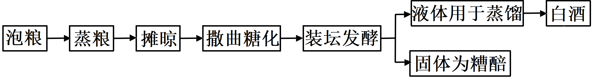

11\. 小曲白酒的酿造过程中，酵母菌进行了有氧呼吸和无氧呼吸。关于酵母菌的呼吸作用，下列叙述正确的是（　　）

A. 有氧呼吸产生的\[H\]与O2结合，无氧呼吸产生的\[H\]不与O2结合

B. 有氧呼吸在线粒体中进行，无氧呼吸在细胞质基质中进行

C. 有氧呼吸有热能的释放，无氧呼吸没有热能的释放

D. 有氧呼吸需要酶催化，无氧呼吸不需要酶催化

12\. 关于小曲白酒的酿造过程，下列叙述错误的是（　　）

A. 糖化主要是利用霉菌将淀粉水解为葡萄糖

B. 发酵液样品的蒸馏产物有无酒精，可用酸性重铬酸钾溶液检测

C. 若酿造过程中酒变酸，则发酵坛密封不严

D. 蒸熟并摊晾的原料加入糟醅，立即密封可高效进行酒精发酵

13\. 植物组织培养过程中，培养基中常添加蔗糖，植物细胞利用蔗糖的方式如图所示。

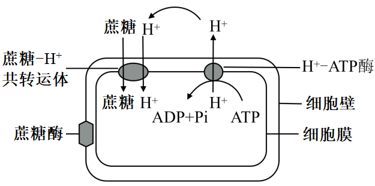

下列叙述正确的是（　　）

A. 转运蔗糖时，共转运体的构型不发生变化

B. 使用ATP合成抑制剂，会使蔗糖运输速率下降

C. 植物组培过程中蔗糖是植物细胞吸收的唯一碳源

D. 培养基的pH值高于细胞内，有利于蔗糖的吸收

14\. 肿瘤细胞在体内生长、转移及复发的过程中，必须不断逃避机体免疫系统的攻击，这就是所谓的“免疫逃逸”。关于“免疫逃逸”，下列叙述错误的是（　　）

A. 肿瘤细胞表面产生抗原“覆盖物”，可“躲避”免疫细胞的识别

B. 肿瘤细胞表面抗原性物质的丢失，可逃避T细胞的识别

C. 肿瘤细胞大量表达某种产物，可减弱细胞毒性T细胞的凋亡

D. 肿瘤细胞分泌某种免疫抑制因子，可减弱免疫细胞作用

15\. 为研究红光、远红光及赤霉素对莴苣种子萌发的影响，研究小组进行黑暗条件下莴苣种子萌发的实验。其中红光和远红光对莴苣种子赤霉素含量的影响如图甲所示，红光、远红光及外施赤霉素对莴苣种子萌发的影响如图乙所示。

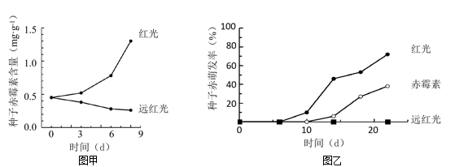

据图分析，下列叙述正确的是（　　）

A. 远红光处理莴苣种子使赤霉素含量增加，促进种子萌发

B. 红光能激活光敏色素，促进合成赤霉素相关基因的表达

C. 红光与赤霉素处理相比，莴苣种子萌发响应时间相同

D. 若红光处理结合外施脱落酸，莴苣种子萌发率比单独红光处理高

16\. 紫外线引发的DNA损伤，可通过“核苷酸切除修复（NER）”方式修复，机制如图所示。着色性干皮症（XP）患者的NER酶系统存在缺陷，受阳光照射后，皮肤出现炎症等症状。患者幼年发病，20岁后开始发展成皮肤癌。下列叙述错误的是（　　）

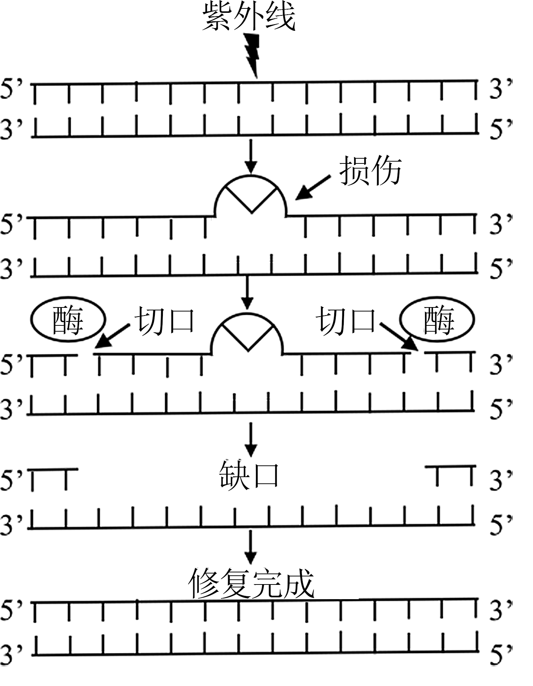

A. 修复过程需要限制酶和DNA聚合酶

B. 填补缺口时，新链合成以5’到3’的方向进行

C. DNA有害损伤发生后，在细胞增殖后进行修复，对细胞最有利

D. 随年龄增长，XP患者几乎都会发生皮肤癌的原因，可用突变累积解释

17\. 某动物（2n=4）的基因型为AaXBY，其精巢中两个细胞的染色体组成和基因分布如图所示，其中一个细胞处于有丝分裂某时期。下列叙述错误的是（　　）

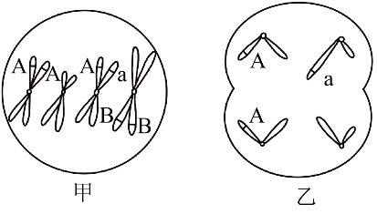

A. 甲细胞处于有丝分裂中期、乙细胞处于减数第二次分裂后期

B. 甲细胞中每个染色体组的DNA分子数与乙细胞的相同

C. 若甲细胞正常完成分裂则能形成两种基因型的子细胞

D. 形成乙细胞过程中发生了基因重组和染色体变异

18\. 某昆虫的性别决定方式为XY型，其翅形长翅和残翅、眼色红眼和紫眼为两对相对性状，各由一对等位基因控制，且基因不位于Y染色体。现用长翅紫眼和残翅红眼昆虫各1只杂交获得F1，F1有长翅红眼、长翅紫眼、残翅红眼、残翅紫眼4种表型，且比例相等。不考虑突变、交叉互换和致死。下列关于该杂交实验的叙述，错误的是（　　）

A. 若F1每种表型都有雌雄个体，则控制翅形和眼色的基因可位于两对染色体

B. 若F1每种表型都有雌雄个体，则控制翅形和眼色的基因不可都位于X染色体

C. 若F1有两种表型为雌性，两种为雄性，则控制翅形和眼色的基因不可都位于常染色体

D. 若F1有两种表型为雌性，两种为雄性，则控制翅形和眼色基因不可位于一对染色体

19\. 某研究小组利用转基因技术，将绿色荧光蛋白基因（*GFP*）整合到野生型小鼠*Gata3*基因一端，如图甲所示。实验得到能正常表达两种蛋白质的杂合子雌雄小鼠各1只，交配以期获得*Gata3-GFP*基因纯合子小鼠。为了鉴定交配获得的4只新生小鼠的基因型，设计了引物1和引物2用于PCR扩增，PCR产物电泳结果如图乙所示。

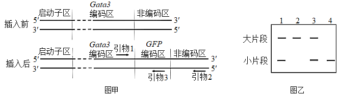

下列叙述正确的是（　　）

A. *Gata3*基因的启动子无法控制*GFP*基因的表达

B. 翻译时先合成Gata3蛋白，再合成GFP蛋白

C. 2号条带的小鼠是野生型，4号条带的小鼠是*Gata3-GFP*基因纯合子

D. 若用引物1和引物3进行PCR，能更好地区分杂合子和纯合子

20\. 神经元的轴突末梢可与另一个神经元的树突或胞体构成突触。通过微电极测定细胞的膜电位，PSP1和PSP2分别表示突触a和突触b的后膜电位，如图所示。下列叙述正确的是（　　）

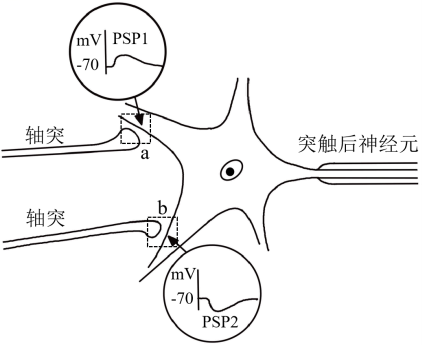

A. 突触a、b前膜释放的递质，分别使突触a后膜通透性增大、突触b后膜通透性降低

B. PSP1和PSP2由离子浓度改变形成，共同影响突触后神经元动作电位的产生

C. PSP1由K+外流或Cl-内流形成，PSP2由Na+或Ca2+内流形成

D. 突触a、b前膜释放的递质增多，分别使PSP1幅值增大、PSP2幅值减小

**非选择题部分**

**二、非选择题（本大题共5小题，共60分）**

21\. 地球上存在着多种生态系统类型，不同的生态系统在物种组成、结构和功能上的不同，直接影响着各生态系统的发展过程。回答下列问题：

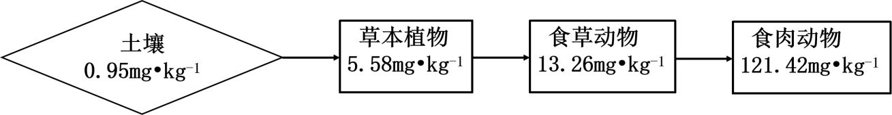

（1）在消杀某草原生态系统中的害虫时，喷施了易在生物体内残留的杀虫剂Q，一段时间后，在该草原不同的生物种类中均监测到Q的存在，其含量如图所示（图中数据是土壤及不同营养级生物体内Q的平均值）。由图可知，随着营养级的递增，Q含量的变化规律是\_\_\_\_\_\_；在同一营养级的不同物种之间，Q含量也存在差异，如一年生植物与多年生植物相比，Q含量较高的是\_\_\_\_\_\_。因某些环境因素变化，该草原生态系统演替为荒漠，影响演替过程的关键环境因素是\_\_\_\_\_\_。该演替过程中，草原中的优势种所占据生态位的变化趋势为\_\_\_\_\_\_。

（2）农田是在人为干预和维护下建立起来的生态系统，人类对其进行适时、适当地干预是系统正常运行的保证。例如在水稻田里采用灯光诱杀害虫、除草剂清除杂草、放养甲鱼等三项干预措施，其共同点都是干预了系统的\_\_\_\_\_\_和能量流动；在稻田里施无机肥，是干预了系统\_\_\_\_\_\_过程。

（3）热带雨林是陆地上非常高大、茂密的生态系统，物种之丰富、结构之复杂在所有生态系统类型中极为罕见。如果仅从群落垂直结构的角度审视，“结构复杂”具体表现在\_\_\_\_\_\_。雨林中动物种类丰富，但每种动物的个体数不多，从能量流动的角度分析该事实存在的原因是\_\_\_\_\_\_。

22\. 植物工厂是一种新兴的农业生产模式，可人工控制光照、温度、CO2浓度等因素。不同光质配比对生菜幼苗体内的叶绿素含量和氮含量的影响如图甲所示，不同光质配比对生菜幼苗干重的影响如图乙所示。分组如下：CK组（白光）、A组（红光：蓝光=1：2）、B组（红光：蓝光=3：2）、C组（红光：蓝光=2：1），每组输出的功率相同。

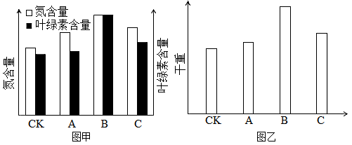 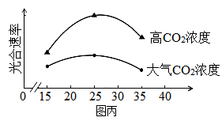

回答下列问题：

（1）光为生菜的光合作用提供\_\_\_\_\_\_，又能调控生菜的形态建成。生菜吸收营养液中含氮的离子满足其对氮元素需求，若营养液中的离子浓度过高，根细胞会因\_\_\_\_\_\_作用失水造成生菜萎蔫。

（2）由图乙可知，A、B、C组的干重都比CK组高，原因是\_\_\_\_\_\_。由图甲、图乙可知，选用红、蓝光配比为\_\_\_\_\_\_，最有利于生菜产量的提高，原因是\_\_\_\_\_\_。

（3）进一步探究在不同温度条件下，增施CO2对生菜光合速率的影响，结果如图丙所示。由图可知，在25℃时，提高CO2浓度对提高生菜光合速率的效果最佳，判断依据是\_\_\_\_\_\_。植物工厂利用秸秆发酵生产沼气，冬天可燃烧沼气以提高CO2浓度，还可以\_\_\_\_\_\_，使光合速率进一步提高，从农业生态工程角度分析，优点还有\_\_\_\_\_\_。

23\. 赖氨酸是人体不能合成的必需氨基酸，而人类主要食物中的赖氨酸含量很低，利用生物技术可提高食物中赖氨酸含量。回答下列问题：

（1）植物细胞合成的赖氨酸达到一定浓度时，能抑制合成过程中两种关键酶的活性，导致赖氨酸含量维持在一定浓度水平，这种调节方式属于\_\_\_\_\_\_。根据这种调节方式，在培养基中添加\_\_\_\_\_\_，用于筛选经人工诱变的植物悬浮细胞，可得到抗赖氨酸类似物的细胞突变体，通过培养获得再生植株。

（2）随着转基因技术与动物细胞工程结合和发展，2011年我国首次利用转基因和体细胞核移植技术成功培育了高产赖氨酸转基因克隆奶牛。其基本流程为：

①构建乳腺专一表达载体。随着测序技术的发展，为获取富含赖氨酸的酪蛋白基因（目的基因），可通过检索\_\_\_\_\_\_获取其编码序列，用化学合成法制备得到。再将获得的目的基因与含有乳腺特异性启动子的相应载体连接，构建出乳腺专一表达载体。

②表达载体转入牛胚胎成纤维细胞（BEF）。将表达载体包裹到磷脂等构成的脂质体内，与BEF膜发生\_\_\_\_\_\_，表达载体最终进入细胞核，发生转化。

③核移植。将转基因的BEF作为核供体细胞，从牛卵巢获取卵母细胞，经体外培养及去核后作为\_\_\_\_\_\_。将两种细胞进行电融合，电融合的作用除了促进细胞融合，同时起到了\_\_\_\_\_\_重组细胞发育的作用。

④重组细胞的体外培养及胚胎移植。重组细胞体外培养至\_\_\_\_\_\_，植入代孕母牛子宫角，直至小牛出生。

⑤检测。DNA水平检测：利用PCR技术，以非转基因牛耳组织细胞作为阴性对照，以\_\_\_\_\_\_为阳性对照，检测到转基因牛耳组织细胞中存在目的基因。RNA水平检测：从非转基因牛乳汁中的脱落细胞、转基因牛乳汁中的脱落细胞和转基因牛耳组织细胞，提取总RNA，对总RNA进行\_\_\_\_\_\_处理，以去除DNA污染，再经逆转录形成cDNA，并以此为\_\_\_\_\_\_，利用特定引物扩增目的基因片段。结果显示目的基因在转基因牛乳汁中的脱落细胞内表达，而不在牛耳组织细胞内表达，原因是什么？\_\_\_\_\_\_。

24\. 某家系甲病和乙病的系谱图如图所示。已知两病独立遗传，各由一对等位基因控制，且基因不位于Y染色体。甲病在人群中的发病率为1/2500。

回答下列问题：

（1）甲病的遗传方式是\_\_\_\_\_\_，判断依据是\_\_\_\_\_\_。

（2）从系谱图中推测乙病的可能遗传方式有\_\_\_\_\_\_种。为确定此病的遗传方式，可用乙病的正常基因和致病基因分别设计DNA探针，只需对个体\_\_\_\_\_\_（填系谱图中的编号）进行核酸杂交，根据结果判定其基因型，就可确定遗传方式。

（3）若检测确定乙病是一种常染色体显性遗传病。同时考虑两种病，Ⅲ3个体的基因型可能有\_\_\_\_\_\_种，若她与一个表型正常的男子结婚，所生的子女患两种病的概率为\_\_\_\_\_\_。

（4）研究发现，甲病是一种因上皮细胞膜上转运Cl-载体蛋白功能异常所导致的疾病，乙病是一种因异常蛋白损害神经元的结构和功能所导致的疾病，甲病杂合子和乙病杂合子中均同时表达正常蛋白和异常蛋白，但在是否患病上表现不同，原因是甲病杂合子中异常蛋白不能转运Cl-，正常蛋白\_\_\_\_\_\_；乙病杂合子中异常蛋白损害神经元，正常蛋白不损害神经元，也不能阻止或解除这种损害的发生，杂合子表型为\_\_\_\_\_\_。

25\. 运动员在马拉松长跑过程中，机体往往出现心跳加快，呼吸加深，大量出汗，口渴等生理反应。马拉松长跑需要机体各器官系统共同协调完成。

回答下列问题：

（1）听到发令枪声运动员立刻起跑，这一过程属于\_\_\_\_\_\_反射。长跑过程中，运动员感到口渴的原因是大量出汗导致血浆渗透压升高，渗透压感受器产生的兴奋传到\_\_\_\_\_\_，产生渴觉。

（2）长跑结束后，运动员需要补充水分。研究发现正常人分别一次性饮用1000mL清水与1000mL生理盐水，其排尿速率变化如图甲所示。

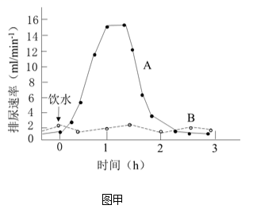

图中表示大量饮用清水后的排尿速率曲线是\_\_\_\_\_\_，该曲线的形成原因是大量饮用清水后血浆被稀释，渗透压下降，\_\_\_\_\_\_。从维持机体血浆渗透压稳定的角度，建议运动员运动后饮用\_\_\_\_\_\_。

（3）长跑过程中，运动员会出现血压升高等机体反应，运动结束后，血压能快速恢复正常，这一过程受神经-体液共同调节，其中减压反射是调节血压相对稳定的重要神经调节方式。为验证减压反射弧的传入神经是减压神经，传出神经是迷走神经，根据提供的实验材料，完善实验思路，预测实验结果，并进行分析与讨论。

材料与用具：成年实验兔、血压测定仪、生理盐水、刺激电极、麻醉剂等。

（要求与说明：答题时对实验兔的手术过程不作具体要求）

①完善实验思路：

I．麻醉和固定实验兔，分离其颈部一侧的颈总动脉、减压神经和迷走神经。颈总动脉经动脉插管与血压测定仪连接，测定血压，血压正常。在实验过程中，随时用\_\_\_\_\_\_湿润神经。

Ⅱ．用适宜强度电刺激减压神经，测定血压，血压下降。再用\_\_\_\_\_\_，测定血压，血压下降。

Ⅲ．对减压神经进行双结扎固定，并从结扎中间剪断神经（如图乙所示）。分别用适宜强度电刺激\_\_\_\_\_\_，分别测定血压，并记录。

IV．对迷走神经进行重复Ⅲ的操作。

②预测实验结果：\_\_\_\_\_\_。

设计用于记录Ⅲ、IV实验结果的表格，并将预测的血压变化填入表中。

③分析与讨论：

运动员在马拉松长跑过程中，减压反射有什么生理意义？\_\_\_\_\_\_
