**绝密★启用前**

**2023年6月浙江省普通高校招生选考科目考试**

**生物学**

**姓名\_\_\_\_\_\_　　准考证号\_\_\_\_\_\_**

**本试题卷分选择题和非选择题两部分，共8页，满分100分，考试时间90分钟。**

**考生注意：**

**1.答题前，请务必将自己的姓名、准考证号用黑色字迹的签字笔或钢笔分别填写在试题卷和答题纸规定的位置上。**

**2.答题时，请按照答题纸上“注意事项”的要求，在答题纸相应的位置上规范作答，在本试题卷上的作答一律无效。**

**3.非选择题的答案必须使用黑色字迹的签字笔或钢笔写在答题纸上相应区域内，作图时可先使用2B铅笔，确定后必须使用黑色字迹的签字笔或钢笔描黑。**

**选择题部分**

**一、选择题（本大题共20小题，每小题2分，共40分。每小题列出的四个备选项中只有一个是符合题目要求的，不选、多选、错选均不得分）**

1\. 我国科学家在世界上首次人工合成的结晶牛胰岛素，其化学结构和生物活性与天然胰岛素完全相同。结晶牛胰岛素的化学本质是（　　）

A. 糖类 B. 脂质 C. 蛋白质 D. 核酸

【答案】C

【解析】

【分析】胰岛素是人体内能降低血糖浓度的唯一激素，由胰岛B细胞合成并分泌；胰岛A细胞能合成并分泌胰高血糖素，该激素具有升高血糖的作用。

【详解】胰岛素是胰岛B细胞合成并分泌的唯一的一个能降低血糖的激素，其化学本质是蛋白质，而我国科学家在世界上首次人工合成的结晶牛胰岛素，其化学结构和生物活性与天然胰岛素完全相同，因此，结晶牛胰岛素的化学本质是蛋白质，C正确。

故选C。　

2\. 自从践行生态文明建设以来，“酸雨”在我国发生的频率及强度都有明显下降。下列措施中，对减少“酸雨”发生效果最明显的是（　　）

A. 大力推广风能、光能等绿色能源替代化石燃料

B. 通过技术升级使化石燃料的燃烧率提高

C. 将化石燃料燃烧产生的废气集中排放

D. 将用煤量大的企业搬离城市中心

【答案】A

【解析】

【分析】全球性生态环境问题主要包括全球气候变化、水资源短缺、臭氧层破坏、土地荒漠化、生物多样性丧失以及环境污染等。

【详解】A、大力推广风能、光能等绿色能源替代化石燃料，进而能起到减少二氧化碳、二氧化硫、氮氧化物等排放的目的，能起到缓解酸雨产生的作用，效果明显，A正确；

B、通过技术升级使化石燃料进行脱硫处理能起到缓解酸雨的作用，但提高燃烧率的效果不明显，B错误；

C、将化石燃料燃烧产生的废气集中排放并不能起到减少引起酸雨的气体排放量，因而对减数酸雨发生效果不明显，C错误；

D、酸雨的产生具有全球性，因而将用煤量大的企业搬离城市中心依然无法减少酶量的使用，因而不能起到相应的减少酸雨的效果，D错误。

故选A。

3\. 不同物种体内会存在相同功能的蛋白质，编码该类蛋白质的DNA序列以大致恒定的速率发生变异。猩猩、大猩猩、黑猩猩和人体内编码某种蛋白质的同源DNA序列比对结果如下表，表中数据表示DNA序列比对碱基相同的百分率。（　　）

|        | 大猩猩 | 黑猩猩 | 人     |
|:-------|:-------|:-------|:-------|
| 猩猩   | 96.61% | 96.58% | 96.70% |
| 大猩猩 |        | 98.18% | 98.31% |
| 黑猩猩 |        |        | 98.44% |

下列叙述错误的是（　　）

A. 表中数据为生物进化提供了分子水平的证据

B. 猩猩出现的时间早于大猩猩、黑猩猩

C. 人类、黑猩猩、大猩猩和猩猩具有共同的祖先

D. 黑猩猩和大猩猩的亲缘关系比黑猩猩与猩猩的亲缘关系远

【答案】D

【解析】

【分析】生物进化的证据有化石证据、比较解剖学上的证据、胚胎学上的证据等，化石是指保存在岩层中的古生物遗物和生活遗迹；比较解剖学是对各类脊椎动物的器官和系统进行解剖和比较研究的科学，比较解剖学为生物进化论提供的最重要的证据是同源器官；胚胎学是研究动植物的胚胎形成和发育过程的科学，也为生物进化论提供了很重要的证据。

【详解】A、表中数据研究的是DNA中碱基的排列顺序，属于生物进化方面的分子水平证据，A正确；

B、表中数据显示，猩猩与人类同种蛋白质相关的DNA片段中碱基序列的相同度低于大猩猩和黑猩猩，因而推测，猩猩出现的时间早于大猩猩、黑猩猩，B正确；

C、表中结果显示的是猩猩、大猩猩、黑猩猩和人体内编码某种蛋白质的同源DNA序列比，该结果说明人类、黑猩猩、大猩猩和猩猩具有共同的祖先，C正确；

D、表中数据显示黑猩猩和大猩猩同种蛋白质相关DNA片段的相似度高于黑猩猩与猩猩，因而说明黑猩猩和大猩猩的亲缘关系比黑猩猩与猩猩的亲缘关系近，D错误。

故选D。

4\. 叠氮脱氧胸苷（AZT）可与逆转录酶结合并抑制其功能。下列过程可直接被AZT阻断的是（　　）

A. 复制 B. 转录 C. 翻译 D. 逆转录

【答案】D

【解析】

【分析】中心法则的证内容：信息可以从DNA流向DNA，即DNA的自我复制；也可以从DNA流向RNA，进而流向蛋白质，即遗传信息的转录和翻译。 但是，遗传信息不能从蛋白质传递到蛋白质，也不能从蛋白质流向RNA或DNA。中心法则的后续补充有：遗传信息从RNA流向RNA以及从RNA流向DNA这两条途径。

【详解】题中显示，叠氮脱氧胸苷（AZT）可与逆转录酶结合并抑制其功能，而逆转录过程需要逆转录酶的催化，因而叠氮脱氧胸苷（AZT）可直接阻断逆转录过程，而复制、转录和翻译过程均不需要逆转录酶，即D正确。

故选D。

5\. 东亚飞蝗是我国历史上发生大蝗灾的主要元凶，在土壤含水率\<15%的情况下，85%以上的受精卵可以孵化，一旦食物（植物幼嫩的茎、叶）等条件得到满足，很容易发生大爆发。下列因素中，对东亚飞蝗的繁衍、扩散起阻碍作用的是（　　）

A. 充沛的降水 B. 肥沃的土壤

C. 连片的麦田 D. 仅取食种子的鸟类

【答案】A

【解析】

【分析】分析题干可知在土壤含水率\<15%的情况下大多数受精卵可以孵化，所以降水太多对东亚飞蝗的繁衍、扩散起阻碍作用。

【详解】A、干旱的环境对蝗虫的繁殖、生长发育和存活有许多益处。因为蝗虫将卵产在土壤中。土壤比较坚实，含水量在10%~20%时最适合它们产卵，所以降水太多不利于其繁衍扩散，A符合题意；

B、肥沃的土壤有利于作物生长，为其提供食物（植物幼嫩的茎、叶）等条件，B不符合题意；

C、连片的麦田为蝗虫提供充足的食物等条件，C不符合题意；

D、仅取食种子的鸟类不吃蝗虫会造成蝗虫由于缺乏天敌导致数量增加，D不符合题意。

故选A。

6\. 囊泡运输是细胞内重要的运输方式。没有囊泡运输的精确运行，细胞将陷入混乱状态。下列叙述正确的是

A. 囊泡的运输依赖于细胞骨架

B. 囊泡可来自核糖体、内质网等细胞器

C. 囊泡与细胞膜的融合依赖于膜的选择透过性

D. 囊泡将细胞内所有结构形成统一的整体

【答案】A

【解析】

【分析】细胞骨架是由蛋白质纤维组成的网架结构，维持着细胞的形态，锚定并支撑着许多细胞器，与细胞运动、分裂、分化以及物质运输、能量转化、信息传递等生命活动密切相关。囊泡以出芽的方式，从一个细胞器膜产生，脱离后又与另一种细胞器膜融合，囊泡与细胞器膜的结合体现了生物膜的流动性。

【详解】A、细胞骨架是细胞内由蛋白质纤维组成的网架结构，与物质运输等活动有关，囊泡运输依赖于细胞骨架，A正确；

B、核糖体是无膜细胞器，不能产生囊泡，B错误；

C、囊泡与细胞膜的融合依赖于膜的结构特性，即具有一定的流动性，C错误；

D、囊泡只能在具有生物膜的细胞结构中相互转化，并不能将细胞内所有结构形成统一的整体，D错误。

故选A。

7\. 为探究酶的催化效率，某同学采用如图所示装置进行实验，实验分组、处理及结果如下表所示。

<table style="width:99%;">
<colgroup>
<col style="width: 8%" />
<col style="width: 24%" />
<col style="width: 23%" />
<col style="width: 5%" />
<col style="width: 6%" />
<col style="width: 7%" />
<col style="width: 7%" />
<col style="width: 7%" />
<col style="width: 7%" />
</colgroup>
<thead>
<tr>
<th rowspan="2" style="text-align: left;">组别</th>
<th rowspan="2" style="text-align: left;">甲中溶液（0.2mL）</th>
<th rowspan="2" style="text-align: left;">乙中溶液（2mL）</th>
<th colspan="6" style="text-align: left;">不同时间测定的相对压强（kPa）</th>
</tr>
<tr>
<th style="text-align: left;">0s</th>
<th style="text-align: left;">50s</th>
<th style="text-align: left;">100s</th>
<th style="text-align: left;">150s</th>
<th style="text-align: left;">200s</th>
<th style="text-align: left;">250s</th>
</tr>
</thead>
<tbody>
<tr>
<td style="text-align: left;">I</td>
<td style="text-align: left;">肝脏提取液</td>
<td style="text-align: left;">H2O2溶液</td>
<td style="text-align: left;">0</td>
<td style="text-align: left;">9.0</td>
<td style="text-align: left;">9.6</td>
<td style="text-align: left;">9.8</td>
<td style="text-align: left;">10.0</td>
<td style="text-align: left;">10.0</td>
</tr>
<tr>
<td style="text-align: left;">II</td>
<td style="text-align: left;">FeCl3</td>
<td style="text-align: left;">H2O2溶液</td>
<td style="text-align: left;">0</td>
<td style="text-align: left;">0</td>
<td style="text-align: left;">0.1</td>
<td style="text-align: left;">0.3</td>
<td style="text-align: left;">0.5</td>
<td style="text-align: left;">0.9</td>
</tr>
<tr>
<td style="text-align: left;">III</td>
<td style="text-align: left;">蒸馏水</td>
<td style="text-align: left;">H2O2溶液</td>
<td style="text-align: left;">0</td>
<td style="text-align: left;">0</td>
<td style="text-align: left;">0</td>
<td style="text-align: left;">0</td>
<td style="text-align: left;">0.1</td>
<td style="text-align: left;">0.1</td>
</tr>
</tbody>
</table>

下列叙述错误的是（　　）

A. H2O2分解生成O2导致压强改变

B. 从甲中溶液与乙中溶液混合时开始计时

C. 250s时I组和Ⅲ组反应已结束而Ⅱ组仍在进行

D. 实验结果说明酶的催化作用具有高效性

【答案】C

【解析】

【分析】酶是由活细胞产生的具有催化作用的有机物，大多数酶是蛋白质，少数酶是RNA；酶的特性：专一性、高效性、作用条件温和；酶促反应的原理：酶能降低化学反应所需的活化能。

【详解】A、H2O2分解产物是H2O和O2，其中O2属于气体，会导致压强改变，A正确；

B、据表分析可知，甲中溶液酶或无机催化剂等，乙中底物，应从甲中溶液与乙中溶液混合时开始计时，B正确；

C、三组中的H2O2溶液均为2ml，则最终产生的相对压强应相同，据表可知，250s之前（200s）I组反应已结束，但II组和III组压强仍未达到I组的终止压强10.0，故250s时Ⅱ组和Ⅲ组反应仍在进行，C错误；

D、酶高效性是指与无机催化剂相比，酶降低化学反应活化能的作用更显著，对比I、II组可知，在相同时间内I组（含过氧化氢酶）相对压强变化更快，说明酶的催化作用具有高效性，D正确。

故选C。

8\. 群落演替是一个缓慢、持续的动态过程，短时间的观察难以发现这个过程，但是有些现象的出现，可以一窥其演替进行的状态。下列事实的出现，可以用来推断群落演替正在进行着的是（　　）

A. 毛竹林中的竹笋明显长高

B. 在浮叶根生植物群落中出现了挺水植物

C. 荷塘中荷花盛开、荷叶逐渐覆盖了整片水面

D. 在常绿阔叶林中马尾松部分个体因感染松材线虫死亡

【答案】B

【解析】

【分析】群落演替是指 一个群落被另一个群落替代的过程，该过程中会发生优势种的取代。

【详解】A、毛竹林中的竹笋明显长高，是同一物种内部的生长现象，不属于演替，A错误；

B、在浮叶根生植物群落中出现了挺水植物，该过程中浮叶根生植物和挺水植物属于不同的物种，挺水植物的出现意味着优势种可能发生变化：浮叶根生植物阶段，随着湖底的日益变浅，莲、睡莲等浮叶根生植物开始出现，这些植物的残枝、败叶对进一步抬高湖底起很大作用，同时由于浮叶根生植物密集地漂浮在水面，使得水下光照很弱，不利于沉水植物的生长，沉水植物逐渐被浮叶根生植物所替代，B正确；

C、荷塘中荷花盛开、荷叶逐渐覆盖了整片水面是发生在荷塘中的过程，是荷花这一物种的自然生长现象，不属于演替，C错误；

D、在常绿阔叶林中马尾松的部分个体因感染松材线虫死亡过程中不涉及两个物种之间的更替，不属于演替，D错误。

故选B。

9\. 浙江浦江县上山村发现了距今1万年的稻作遗址，证明我国先民在1万年前就开始了野生稻驯化。经过长期驯化和改良，现代稻产量不断提高。尤其是袁隆平院士团队培育成的超级杂交稻品种，创造水稻高产新记录，为我国粮食安全作出杰出贡献。下列叙述正确的是（　　）

A. 自然选择水稻驯化过程中起主导作用

B. 现代稻的基因库与野生稻的基因库完全相同

C. 驯化形成的现代稻保留了野生稻的各种性状

D. 超级杂交稻品种的培育主要利用基因重组原理

【答案】D

【解析】

【分析】 现代进化理论的基本内容是：①进化是以种群为基本单位，进化的实质是种群的基因频率的改变。②突变和基因重组产生进化的原材料。③自然选择决定生物进化的方向。④隔离导致物种形成。

【详解】A、自然选择通常选择出的是适应环境条件的类型，而人工选择选择的通常是对人类有利的类型，故人工选择在水稻驯化过程中起主导作用，A错误；

B、基因库是指一个种群所有基因的总和，经过长期驯化和改良，现代稻产量不断提高，则可推测现代稻与野生稻的基因库不完全相同，B错误；

C、驯化形成的现代稻保留了野生稻的优良性状，而一些不利性状在选择中被淘汰，C错误；

D、超级杂交稻品种的培育借助于杂交育种，该过程的原理主要是基因重组，D正确。

故选D。

10\. 为筛选观察有丝分裂的合适材料，某研究小组选用不同植物的根尖，制作并观察根尖细胞的临时装片。下列关于选材依据的叙述，不合理的是（　　）

A. 选用易获取且易大量生根的材料

B. 选用染色体数目少易观察的材料

C. 选用解离时间短分散性好的材料

D. 选用分裂间期细胞占比高的材料

【答案】D

【解析】

【分析】制作有丝分裂装片时，应经历取材-解离-漂洗-染色-制片等环节，漂洗常用清水，染色可用龙胆紫或醋酸洋红。

【详解】A、根尖分生区的细胞分裂能力较强，故观察有丝分裂时选用易获取且易大量生根的材料，A正确；

B、选用染色体数目少易观察的材料有利于观察有丝分裂每一个时期的特点，B正确；

C、选用解离时间短分散性好的材料，更利于观察细胞的染色体变化，C正确；

D、细胞周期中，分裂间期比分裂期占比更大，应该选用分裂间期细胞占比低的材料观察有丝分裂，D错误。

故选D。

阅读下列材料，完成下面小题。

小曲白酒清香纯正，以大米、大麦、小麦等为原料，以小曲为发酵剂酿造而成。小曲中所含的微生物主要有好氧型微生物霉菌、兼性厌氧型微生物酵母菌，还有乳酸菌、醋酸菌等细菌。酿酒的原理主要是酵母菌在无氧条件下利用葡萄糖发酵产生酒精。传统酿造工艺流程如图所示。

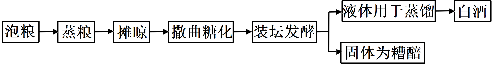

11\. 小曲白酒的酿造过程中，酵母菌进行了有氧呼吸和无氧呼吸。关于酵母菌的呼吸作用，下列叙述正确的是（　　）

A. 有氧呼吸产生的\[H\]与O2结合，无氧呼吸产生的\[H\]不与O2结合

B. 有氧呼吸在线粒体中进行，无氧呼吸在细胞质基质中进行

C. 有氧呼吸有热能的释放，无氧呼吸没有热能的释放

D. 有氧呼吸需要酶催化，无氧呼吸不需要酶催化

12\. 关于小曲白酒的酿造过程，下列叙述错误的是（　　）

A. 糖化主要是利用霉菌将淀粉水解为葡萄糖

B. 发酵液样品的蒸馏产物有无酒精，可用酸性重铬酸钾溶液检测

C. 若酿造过程中酒变酸，则发酵坛密封不严

D. 蒸熟并摊晾的原料加入糟醅，立即密封可高效进行酒精发酵

【答案】11. A 12. D

【解析】

【分析】 有氧呼吸的第一、二、三阶段的场所依次是细胞质基质、线粒体基质和线粒体内膜。有氧呼吸第一阶段是葡萄糖分解成丙酮酸和\[H\]，合成少量ATP；第二阶段是丙酮酸和水反应生成二氧化碳和\[H\]，合成少量ATP；第三阶段是氧气和\[H\]反应生成水，合成大量ATP。

【11题详解】

A、有氧呼吸产生的\[H\]在第三阶段与O2结合生成水，无氧呼吸产生的\[H\]不与O2结合，A正确；

B、有氧呼吸的第一阶段在细胞质基质中进行，第二和第三阶段分别在线粒体基质和线粒体内膜中进行，无氧呼吸的两个阶段都在细胞质基质中进行，B错误；

C、酵母菌有氧呼吸和无氧呼吸过程中释放的能量均大多以热能散失，但无氧呼吸是不彻底的氧化分解过程，大部分能量存留在酒精，C错误；

D、有氧呼吸和无氧呼吸过程都需要酶的催化，只是酶的种类不同，D错误。

故选A。

【12题详解】

A、由于酿酒酵母不能直接利用淀粉发酵产生酒精（乙醇），故糖化过程主要是利用霉菌分泌的淀粉酶将淀粉分解为葡萄糖，以供发酵利用，A正确；

B、发酵液样品的蒸馏产物有无酒精，可用酸性重铬酸钾溶液检测，若存在酒精，则酒精与酸性的重铬酸钾反应呈灰绿色，B正确；

C、酿造过程中应在无氧条件下进行，若密封不严，会导致醋酸菌在有氧条件下发酵产生醋酸而使酒变酸，C正确；

D、蒸熟并摊晾的原料需要冷却后才可加入糟醅，以免杀死菌种，且需要在有氧条件下培养一段时间，让酵母菌大量繁殖，此后再密封进行酒精发酵，D错误。

故选D。

13\. 植物组织培养过程中，培养基中常添加蔗糖，植物细胞利用蔗糖的方式如图所示。

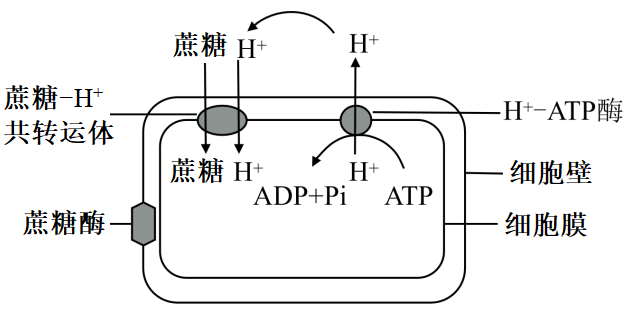

下列叙述正确的是（　　）

A. 转运蔗糖时，共转运体的构型不发生变化

B. 使用ATP合成抑制剂，会使蔗糖运输速率下降

C. 植物组培过程中蔗糖是植物细胞吸收的唯一碳源

D. 培养基的pH值高于细胞内，有利于蔗糖的吸收

【答案】B

【解析】

【分析】据图可知，H＋运出细胞需要ATP，说明H＋细胞内＜细胞外，蔗糖通过共转运体进入细胞内借助H＋的势能，属于主动运输，据此分析作答。

【详解】A、转运蔗糖时，共转运体的构型会发生变化，但该过程是可逆的，A错误；

BD、据图分析可知，H＋向细胞外运输是需要消耗ATP的过程，说明该过程是逆浓度梯度的主动运输，细胞内的H＋＜细胞外H＋，蔗糖运输时通过共转运体依赖于膜两侧的H＋浓度差建立的势能，故使用ATP合成抑制剂，会通过影响H＋的运输而使蔗糖运输速率下降，而培养基的pH值低（H＋多）于细胞内，有利于蔗糖的吸收，B正确，D错误；

C、植物组织培养过程中，蔗糖可作为碳源并有助于维持渗透压，但蔗糖并非唯一碳源，C错误。

故选B。

14\. 肿瘤细胞在体内生长、转移及复发的过程中，必须不断逃避机体免疫系统的攻击，这就是所谓的“免疫逃逸”。关于“免疫逃逸”，下列叙述错误的是（　　）

A. 肿瘤细胞表面产生抗原“覆盖物”，可“躲避”免疫细胞的识别

B. 肿瘤细胞表面抗原性物质的丢失，可逃避T细胞的识别

C. 肿瘤细胞大量表达某种产物，可减弱细胞毒性T细胞的凋亡

D. 肿瘤细胞分泌某种免疫抑制因子，可减弱免疫细胞的作用

【答案】C

【解析】

【分析】癌细胞的特征：①在适宜的条件下，癌细胞能够无限增殖②癌细胞的形态结构发生显著的变化③癌细胞的表面发生了变化，由于细胞膜上的糖蛋白等物质减少，使得癌细胞彼此之间的黏着性显著降低，容易在体内分散和转移。免疫系统的功能主要有以下三大类：免疫防御、免疫监视和免疫自稳。免疫监视是指机体识别和清除突变的细胞，防止肿瘤发生。

【详解】A、肿瘤细胞表面的抗原若被“覆盖物”覆盖，则人体的免疫细胞无法识别肿瘤细胞，也就无法将之清除，A正确；

B、若肿瘤细胞表面抗原性物质丢失，会造成人体T细胞无法识别肿瘤，发生肿瘤细胞的“免疫逃逸”，B正确；

C、肿瘤细胞大量表达某种产物，继而出现“免疫逃逸”，则可推测该产物可抑制肿瘤细胞的凋亡，使其具有无限繁殖能力，C错误；

D、若肿瘤细胞分泌某种免疫抑制因子，可以抑制免疫系统功能，从而减弱免疫细胞的作用，D正确。

故选C。

15\. 为研究红光、远红光及赤霉素对莴苣种子萌发的影响，研究小组进行黑暗条件下莴苣种子萌发的实验。其中红光和远红光对莴苣种子赤霉素含量的影响如图甲所示，红光、远红光及外施赤霉素对莴苣种子萌发的影响如图乙所示。

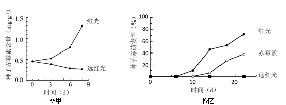

据图分析，下列叙述正确的是（　　）

A. 远红光处理莴苣种子使赤霉素含量增加，促进种子萌发

B. 红光能激活光敏色素，促进合成赤霉素相关基因的表达

C. 红光与赤霉素处理相比，莴苣种子萌发的响应时间相同

D. 若红光处理结合外施脱落酸，莴苣种子萌发率比单独红光处理高

【答案】B

【解析】

【分析】赤霉素能够促进种子萌发，脱落酸能够维持种子休眠，二者作用相反。

【详解】A、图甲显示远红光使种子赤霉素含量下降，进而抑制种子萌发，与图乙结果相符，而不是远红光处理莴苣种子使赤霉素含量增加，A错误；

B、图甲显示红光能使种子赤霉素含量增加，其机理为红光将光敏色素激活，进而调节相关基因表达，B正确；

C、图乙显示红光处理6天左右莴苣种子开始萌发，赤霉素处理10天时莴苣种子开始萌发，两种处理莴苣种子萌发的响应时间不同，C错误；

D、红光处理促进种子萌发，脱落酸会抑制种子萌发，二者作用相反，所以红光处理结合外施脱落酸，莴苣种子萌发率比单独红光处理低，D错误。

故选B。

16\. 紫外线引发的DNA损伤，可通过“核苷酸切除修复（NER）”方式修复，机制如图所示。着色性干皮症（XP）患者的NER酶系统存在缺陷，受阳光照射后，皮肤出现炎症等症状。患者幼年发病，20岁后开始发展成皮肤癌。下列叙述错误的是（　　）

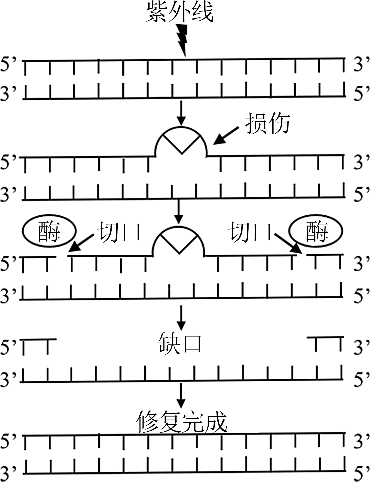

A. 修复过程需要限制酶和DNA聚合酶

B. 填补缺口时，新链合成以5’到3’的方向进行

C. DNA有害损伤发生后，在细胞增殖后进行修复，对细胞最有利

D. 随年龄增长，XP患者几乎都会发生皮肤癌的原因，可用突变累积解释

【答案】C

【解析】

【分析】1、DNA分子复制的过程：

①解旋：在解旋酶的作用下，把两条螺旋的双链解开。

②合成子链：以解开的每一条母链为模板，以游离的四种脱氧核苷酸为原料，遵循碱基互补配对原则，在有关酶的作用下，各自合成与母链互补的子链。

③形成子代DNA：每条子链与其对应的母链盘旋成双螺旋结构。从而形成2个与亲代DNA完全相同的子代DNA分子。

2、限制酶和DNA聚合酶作用的对象都是磷酸二酯键。

【详解】A、由图可知，修复过程中需要将损伤部位的序列切断，因此需要限制酶的参与；同时修复过程中，单个的脱氧核苷酸需要依次连接，要借助DNA聚合酶，A正确；

B、填补缺口时，新链即子链的延伸方向为5’到3’的方向进行，B正确；

C、DNA有害损伤发生后，在细胞增殖中进行修复，保证DNA复制的正确进行，对细胞最有利，C错误；

D、癌症的发生是多个基因累积突变的结果，随年龄增长，XP患者几乎都会发生皮肤癌的原因，可用突变累积解释，D正确。

故选C。

17\. 某动物（2n=4）的基因型为AaXBY，其精巢中两个细胞的染色体组成和基因分布如图所示，其中一个细胞处于有丝分裂某时期。下列叙述错误的是（　　）

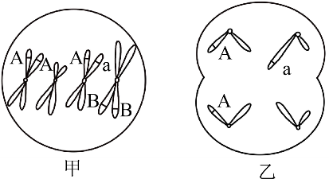

A. 甲细胞处于有丝分裂中期、乙细胞处于减数第二次分裂后期

B. 甲细胞中每个染色体组的DNA分子数与乙细胞的相同

C. 若甲细胞正常完成分裂则能形成两种基因型的子细胞

D. 形成乙细胞过程中发生了基因重组和染色体变异

【答案】B

【解析】

【分析】分析题图：图甲细胞含有同源染色体，且着丝粒整齐的排列在赤道板上，处于有丝分裂的中期；图乙细胞不含有同源染色体，且着丝粒分裂，处于减数第二次分裂后期。

【详解】A、甲细胞含有同源染色体，且着丝粒整齐的排列在赤道板上，为有丝分裂中期，乙细胞不含有同源染色体，着丝粒分裂，为减数第二次分裂的后期，A正确；

B、甲细胞含有2个染色体组，每个染色体组含有4个DNA分子，乙细胞含有2个染色体组，每个染色体组含有2个DNA分子 ，B错误；

C、甲细胞分裂后产生AAXBY或AaXBY两种基因型的子细胞，C正确；

D、形成乙细胞的过程中发生了A基因所在的常染色体和Y染色体的组合，发生了基因重组，同时a基因所在的染色体片段转移到了Y染色体上，发生了染色体结构的变异，D正确。

故选B。

18\. 某昆虫的性别决定方式为XY型，其翅形长翅和残翅、眼色红眼和紫眼为两对相对性状，各由一对等位基因控制，且基因不位于Y染色体。现用长翅紫眼和残翅红眼昆虫各1只杂交获得F1，F1有长翅红眼、长翅紫眼、残翅红眼、残翅紫眼4种表型，且比例相等。不考虑突变、交叉互换和致死。下列关于该杂交实验的叙述，错误的是（　　）

A. 若F1每种表型都有雌雄个体，则控制翅形和眼色的基因可位于两对染色体

B. 若F1每种表型都有雌雄个体，则控制翅形和眼色的基因不可都位于X染色体

C. 若F1有两种表型为雌性，两种为雄性，则控制翅形和眼色的基因不可都位于常染色体

D. 若F1有两种表型为雌性，两种为雄性，则控制翅形和眼色的基因不可位于一对染色体

【答案】D

【解析】

【分析】基因自由组合定律的实质是：位于非同源染色体上的非等位基因的分离或自由组合是互不干扰的；在减数分裂过程中，同源染色体上的等位基因彼此分离的同时，非同源染色体上的非等位基因自由组合。

【详解】A、假设用A/a、B/b表示控制这两对性状的基因，若F1每种表型都有雌雄个体，则亲本的基因型为AaBb和aabb或AaXBXb和aaXbY都符合F1有长翅红眼、长翅紫眼、残翅红眼、残翅紫眼4种表型，且比例相等的条件，A正确；

B、若控制翅形和眼色的基因都位于X染色体，则子代的结果是F1有两种表型为雌性，两种为雄性，或只有两种表现型，两种表现型中每种表型都有雌雄个体。所以若F1每种表型都有雌雄个体，则控制翅形和眼色的基因不可都位于X染色体，B正确；

C、若控制翅形和眼色的基因都位于常染色体，性状与性别没有关联，则F1每种表型都应该有雌雄个体，C正确；

D、假设用A/a、B/b表示控制这两对性状的基因，若F1有两种表型为雌性，则亲本的基因型为XaBXab和XAbY符合F1有长翅红眼、长翅紫眼、残翅红眼、残翅紫眼4种表型，且比例相等的条件，D错误。

故选D。

19\. 某研究小组利用转基因技术，将绿色荧光蛋白基因（*GFP*）整合到野生型小鼠*Gata3*基因一端，如图甲所示。实验得到能正常表达两种蛋白质的杂合子雌雄小鼠各1只，交配以期获得*Gata3-GFP*基因纯合子小鼠。为了鉴定交配获得的4只新生小鼠的基因型，设计了引物1和引物2用于PCR扩增，PCR产物电泳结果如图乙所示。

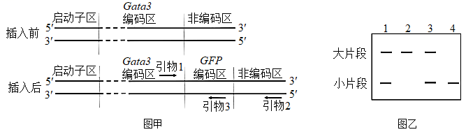

下列叙述正确的是（　　）

A. *Gata3*基因的启动子无法控制*GFP*基因的表达

B. 翻译时先合成Gata3蛋白，再合成GFP蛋白

C. 2号条带的小鼠是野生型，4号条带的小鼠是*Gata3-GFP*基因纯合子

D. 若用引物1和引物3进行PCR，能更好地区分杂合子和纯合子

【答案】B

【解析】

【分析】PCR技术是聚合酶链式反应的缩写，是一项根据DNA半保留复制的原理，在体外提供参与DNA复制的各种组分与反应条件，对目的基因的核苷酸序列进行大量复制的技术。

【详解】A、分析图中可知，启动子在左侧，*GFP*基因整合*Gata3*基因的右侧，启动子启动转录后，可以使*GEP*基因转录，*Gata3*基因的启动子能控制*GFP*基因的表达，A错误；

B、因启动子在左侧，转录的方向向右，合成的mRNA从左向右为5′→3′，刚好是翻译的方向，所以翻译时先合成Gata3蛋白，再合成GFP蛋白，B正确；

C、整合*GFP*基因后，核酸片段变长，2号个体只有大片段，所以是*Gata3-GFP*基因纯合子，4号个体只有小片段，是野生型，C错误；

D、用引物1和引物3进行PCR扩增，扩增出的片段大小差异较小，无法较好的区分片段，D错误。

故选B。

20\. 神经元的轴突末梢可与另一个神经元的树突或胞体构成突触。通过微电极测定细胞的膜电位，PSP1和PSP2分别表示突触a和突触b的后膜电位，如图所示。下列叙述正确的是（　　）

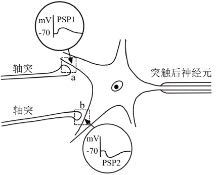

A. 突触a、b前膜释放的递质，分别使突触a后膜通透性增大、突触b后膜通透性降低

B. PSP1和PSP2由离子浓度改变形成，共同影响突触后神经元动作电位的产生

C. PSP1由K+外流或Cl-内流形成，PSP2由Na+或Ca2+内流形成

D. 突触a、b前膜释放的递质增多，分别使PSP1幅值增大、PSP2幅值减小

【答案】B

【解析】

【分析】兴奋在神经元之间传递过程为：兴奋以电流的形式传导到轴突末梢时，突触小泡释放递质（化学信号），递质作用于突触后膜，引起突触后膜产生膜电位（电信号），从而将兴奋传递到下一个神经元。

【详解】A、据图可知，突触a释放的递质使突触后膜上膜电位增大，推测可能是递质导致突触后膜的通透性增大，突触后膜上钠离子通道开放，钠离子大量内流；突触a释放的递质使突触后膜上膜电位减小，推测可能是递质导致突触后膜的通透性增大，突触后膜上氯离子通道开放，氯离子大量内流，A错误；

B、图中PSP1中膜电位增大，可能是Na+或Ca2+内流形成的，PSP2中膜电位减小，可能是K+外流或Cl-内流形成的，共同影响突触后神经元动作电位的产生，B正确，C错误；

D、 细胞接受有效刺激后，一旦产生动作电位，其幅值就达最大，增加刺激强度，动作电位的幅值不再增大，推测突触a、b前膜释放的递质增多，可能PSP1、PSP2幅值不变，D错误。

故选B。

**非选择题部分**

**二、非选择题（本大题共5小题，共60分）**

21\. 地球上存在着多种生态系统类型，不同的生态系统在物种组成、结构和功能上的不同，直接影响着各生态系统的发展过程。回答下列问题：

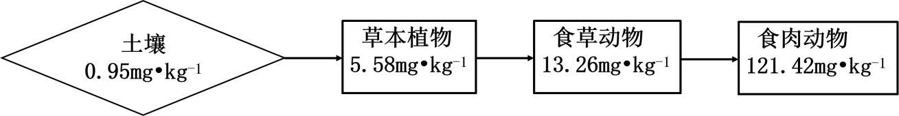

（1）在消杀某草原生态系统中的害虫时，喷施了易在生物体内残留的杀虫剂Q，一段时间后，在该草原不同的生物种类中均监测到Q的存在，其含量如图所示（图中数据是土壤及不同营养级生物体内Q的平均值）。由图可知，随着营养级的递增，Q含量的变化规律是\_\_\_\_\_\_；在同一营养级的不同物种之间，Q含量也存在差异，如一年生植物与多年生植物相比，Q含量较高的是\_\_\_\_\_\_。因某些环境因素变化，该草原生态系统演替为荒漠，影响演替过程的关键环境因素是\_\_\_\_\_\_。该演替过程中，草原中的优势种所占据生态位的变化趋势为\_\_\_\_\_\_。

（2）农田是在人为干预和维护下建立起来的生态系统，人类对其进行适时、适当地干预是系统正常运行的保证。例如在水稻田里采用灯光诱杀害虫、除草剂清除杂草、放养甲鱼等三项干预措施，其共同点都是干预了系统的\_\_\_\_\_\_和能量流动；在稻田里施无机肥，是干预了系统\_\_\_\_\_\_过程。

（3）热带雨林是陆地上非常高大、茂密的生态系统，物种之丰富、结构之复杂在所有生态系统类型中极为罕见。如果仅从群落垂直结构的角度审视，“结构复杂”具体表现在\_\_\_\_\_\_。雨林中动物种类丰富，但每种动物的个体数不多，从能量流动的角度分析该事实存在的原因是\_\_\_\_\_\_。

【答案】（1） ①. 随着营养级的递增，Q含量增加 ②. 多年生植物 ③. 温度和水分 ④. 优势种与其它有生态位重叠的种群会发生生态位分化（重叠程度减小）

（2） ①. 物质循环 ②. 物质循环

（3） ①. 在垂直结构上的分层现象明显，动植物种类多\
②. 能量流动是逐级递减的，每一营养级都有流向分解者和通过呼吸作用以热能散失的能量

【解析】

【分析】1、群落演替是指 一个群落被另一个群落替代的过程，该过程中会发生优势种的取代。

2、一个物种在群落中的地位或作用，包括所处的空间位置，占用资源的情况，以及与其他物种的关系等，称为这个物种的生态位。群落中的每种生物都占据着相对稳定的生态位，有利于不同生物充分利用环境资源，是群落中物种之间及生物与环境之间协同进化的结果。

【小问1详解】

分析题意可知，杀虫剂Q是难以降解的物质，图中的草本植物→食草动物→食肉动物是一条食物链，结合图中数据可知，随着食物链中营养级的递增，Q的含量逐渐增加；与一年生植物相比，多年生植物从土壤中吸收的Q更多，故Q含量较高；群落演替是指 一个群落被另一个群落替代的过程，该过程中关键环境因素主要是温度和水分；生态位是指群落中某个物种在时间和空间上的位置及其与其他相关物种之间的功能关系，它表示物种在群落中所处的地位、作用和重要性，该演替过程中，草原中的优势种所占据生态位的变化趋势为：与其它有生态位重叠的种群会发生生态位分化（重叠程度减小），以提高对环境的利用率。

【小问2详解】

运用物质循环规律可以帮助人们合理地调整生态系统的物质循环和能量流动，使物质中的能量更多地流向对人类有益的方向，在水稻田里采用灯光诱杀害虫、除草剂清除杂草、放养甲鱼等三项干预措施，其共同点都是干预了系统的物质循环和能量流动过程；生态系统的分解者能够将有机物分解为无机物，若在稻田里施无机肥，则减少了微生物分解的作用过程，实际上是干预了系统的物质循环过程。

【小问3详解】

群落中乔木、灌木和草本等不同生长型的植物分别配置在群落的不同高度上，形成了群落的垂直结构，如果仅从群落垂直结构的角度审视，“结构复杂”具体表现在其在垂直结构上分层现象明显，动植物的种类都较多，如热带雨林中的下木层和灌木层还可再分为 2～3 个层次；生态系统中的能量流动是逐级递减的，每一级的生物都有部分能量流向分解者和通过呼吸作用以热能散失，雨林中的动物种类丰富，在该营养级能量一定的前提下，则每种动物的个体数较少。

22\. 植物工厂是一种新兴的农业生产模式，可人工控制光照、温度、CO2浓度等因素。不同光质配比对生菜幼苗体内的叶绿素含量和氮含量的影响如图甲所示，不同光质配比对生菜幼苗干重的影响如图乙所示。分组如下：CK组（白光）、A组（红光：蓝光=1：2）、B组（红光：蓝光=3：2）、C组（红光：蓝光=2：1），每组输出的功率相同。

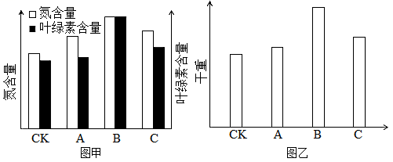 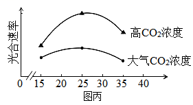

回答下列问题：

（1）光为生菜的光合作用提供\_\_\_\_\_\_，又能调控生菜的形态建成。生菜吸收营养液中含氮的离子满足其对氮元素需求，若营养液中的离子浓度过高，根细胞会因\_\_\_\_\_\_作用失水造成生菜萎蔫。

（2）由图乙可知，A、B、C组的干重都比CK组高，原因是\_\_\_\_\_\_。由图甲、图乙可知，选用红、蓝光配比为\_\_\_\_\_\_，最有利于生菜产量的提高，原因是\_\_\_\_\_\_。

（3）进一步探究在不同温度条件下，增施CO2对生菜光合速率的影响，结果如图丙所示。由图可知，在25℃时，提高CO2浓度对提高生菜光合速率的效果最佳，判断依据是\_\_\_\_\_\_。植物工厂利用秸秆发酵生产沼气，冬天可燃烧沼气以提高CO2浓度，还可以\_\_\_\_\_\_，使光合速率进一步提高，从农业生态工程角度分析，优点还有\_\_\_\_\_\_。

【答案】（1） ①. 能量 ②. 渗透

（2） ①. 与CK组相比，A、B、C组使用的是红光和蓝紫光，光合色素主要吸收红光和蓝紫光，A、B、C组吸收的光更充分，光合作用速率更高，植物干重更高 ②. 红光：蓝光=3：2 ③. 当光质配比为B组（红光：蓝光=3：2）时，植物叶绿素和氮含量都比A组（红光：蓝光=1：2）、C组（红光：蓝光=2：1）高，有利于植物的光合作用，即B组植物的光合作用速率大于A组（红光：蓝光=1：2）、C组（红光：蓝光=2：1）两组，净光合速率更大，积累的有机物更多

（3） ①. 在25℃时提高CO2浓度光合速率增加幅度最高 ②. 升高温度 ③. 减少环境污染，实现能量多级利用和物质循环再生

【解析】

【分析】影响光合作用的因素有温度、光照强度、二氧化碳浓度、叶绿素的含量，酶的含量和活性等。

【小问1详解】

植物进行光合作用需要在光照下进行，光为生菜的光合作用提供能量，又能作为信号调控生菜的形态建成。生菜吸收营养液中含氮的离子满足其对氮元素需求，若营养液中的离子浓度过高，造成外界溶液浓度高于细胞液浓度，根细胞会因渗透作用失水使植物细胞发生质壁分离，造成生菜萎蔫。

【小问2详解】

分析图乙可知，与CK组相比，A、B、C组的干重都较高。结合题意可知，CK组使用的是白光照射，而A、B、C组使用的是红光和蓝紫光，光合色素主要吸收红光和蓝紫光，故A、B、C组吸收的光更充分，光合作用速率更高，积累的有机物含量更高，植物干重更高。由图乙可知，当光质配比为B组（红光：蓝光=3：2）时，植物的干重最高；结合图甲可知，B组植物叶绿素和氮含量都比A组（红光：蓝光=1：2）、C组（红光：蓝光=2：1）高，有利于植物充分吸收光能用于光合作用，即B组植物的光合作用速率大于A组（红光：蓝光=1：2）、C组（红光：蓝光=2：1）两组，有机物积累量最高，植物干重最大，最有利于生菜产量的增加。

【小问3详解】

由图可知，在25℃时，提高CO2浓度时光合速率增幅最高，因此，在25℃时，提高CO2浓度对提高生菜光合速率的效果最佳。植物工厂利用秸秆发酵生产沼气，冬天可燃烧沼气以提高CO2浓度，还可以升高温度，使光合作用有关的酶活性更高，使光合速率进一步提高。从农业生态工程角度分析，优点还有减少环境污染，实现能量多级利用和物质循环再生等。

23\. 赖氨酸是人体不能合成的必需氨基酸，而人类主要食物中的赖氨酸含量很低，利用生物技术可提高食物中赖氨酸含量。回答下列问题：

（1）植物细胞合成的赖氨酸达到一定浓度时，能抑制合成过程中两种关键酶的活性，导致赖氨酸含量维持在一定浓度水平，这种调节方式属于\_\_\_\_\_\_。根据这种调节方式，在培养基中添加\_\_\_\_\_\_，用于筛选经人工诱变的植物悬浮细胞，可得到抗赖氨酸类似物的细胞突变体，通过培养获得再生植株。

（2）随着转基因技术与动物细胞工程结合和发展，2011年我国首次利用转基因和体细胞核移植技术成功培育了高产赖氨酸转基因克隆奶牛。其基本流程为：

①构建乳腺专一表达载体。随着测序技术的发展，为获取富含赖氨酸的酪蛋白基因（目的基因），可通过检索\_\_\_\_\_\_获取其编码序列，用化学合成法制备得到。再将获得的目的基因与含有乳腺特异性启动子的相应载体连接，构建出乳腺专一表达载体。

②表达载体转入牛胚胎成纤维细胞（BEF）。将表达载体包裹到磷脂等构成的脂质体内，与BEF膜发生\_\_\_\_\_\_，表达载体最终进入细胞核，发生转化。

③核移植。将转基因的BEF作为核供体细胞，从牛卵巢获取卵母细胞，经体外培养及去核后作为\_\_\_\_\_\_。将两种细胞进行电融合，电融合的作用除了促进细胞融合，同时起到了\_\_\_\_\_\_重组细胞发育的作用。

④重组细胞的体外培养及胚胎移植。重组细胞体外培养至\_\_\_\_\_\_，植入代孕母牛子宫角，直至小牛出生。

⑤检测。DNA水平检测：利用PCR技术，以非转基因牛耳组织细胞作为阴性对照，以\_\_\_\_\_\_为阳性对照，检测到转基因牛耳组织细胞中存在目的基因。RNA水平检测：从非转基因牛乳汁中的脱落细胞、转基因牛乳汁中的脱落细胞和转基因牛耳组织细胞，提取总RNA，对总RNA进行\_\_\_\_\_\_处理，以去除DNA污染，再经逆转录形成cDNA，并以此为\_\_\_\_\_\_，利用特定引物扩增目的基因片段。结果显示目的基因在转基因牛乳汁中的脱落细胞内表达，而不在牛耳组织细胞内表达，原因是什么？\_\_\_\_\_\_。

【答案】（1） ①. 负反馈调节 ②. 一定浓度的赖氨酸类似物

（2） ①. 基因文库 ②. 融合 ③. 受体细胞 ④. 激活 ⑤. 桑椹胚或囊胚 ⑥. 含有目的基因的牛耳组织细胞 ⑦. DNA酶\
⑧. PCR的模板 ⑨. 构建的表达载体只含有乳腺特异性启动子，只能在乳腺细胞中启动转录，而在牛耳细胞中不能表达。

【解析】

【分析】负反馈调节是指在一个系统中，系统工作的效果，反过来又作为信息调节该系统的工作，并且使系统工作的效果减弱或受到限制，有助于系统保持稳定。基因工程技术的基本步骤：()目的基因的获取：方法有从基因文库中获取、利用PCR技术扩增和人工合成；(2)基因表达载体的构建：是基因工程的核心步骤，基因表达载体包括目的基因、启动子、终止子和标记基因等；(3)将目的基因导入受体细胞：根据受体细胞不同，导入的方法也不一样.将目的基因导入植物细胞的方法有农杆菌转化法、基因枪法和花粉管通道法；将目的基因导入动物细胞最有效的方法是显微注射法；将目的基因导入微生物细胞的方法是感受态细胞法；(4)目的基因的检测与鉴定：分子水平上的检测：①检测转基因生物染色体的DNA是否插入目的基因-DNA分子杂交技术；②检测目的基因是否转录出了mRNA-分子杂交技术；③检测目的基因是否翻译成蛋白质抗原抗体杂交技术.个体水平上的鉴定：抗虫鉴定、抗病鉴定、活性鉴定等。

【小问1详解】

负反馈调节是指在一个系统中，系统工作的效果，反过来又作为信息调节该系统的工作，并且使系统工作的效果减弱或受到限制，有助于系统保持稳定。植物细胞合成的赖氨酸达到一定浓度时，能抑制合成过程中两种关键酶的活性，导致赖氨酸含量维持在一定浓度水平，这种调节方式属于负反馈调节。如果想得到抗赖氨酸类似物的细胞突变体可在培养基中添加定浓度的赖氨酸类似物。

【小问2详解】

①从基因文库中获取目的基因：将含有某种生物的许多基因片段，导入受体菌的群体中储存，各个受体菌分别含有这种生物不同的基因，称为基因文库。当需要某一片段时，根据目的基因的有关信息，如根据基因的核苷酸序列、基因的功能、基因在染色体上的位置、基因的转录产物，以及基因的表达产物蛋白质等特性来获取目的基因。

②表达载体包裹到磷脂等构成的脂质体内，根据细胞膜成分，其与BEF膜发生融合。

③去核的卵母细胞作为受体细胞，其处于减数第二次分裂中期，因为卵母细胞中含有促使细胞核表达全能性的物质和营养条件。电融合的作用除了促进细胞融合，同时起到了激活重组细胞发育的作用。

④胚胎发育到适宜阶段可取出向受体移植。牛、羊一般要培养到桑椹胚或囊胚阶段；植入代孕母牛子宫角，直至小牛出生。

⑤阳性对照：按照当前实验方案一定能得到正面预期结果的对照实验。阳性对照是已知的对测量结果有影响的因素，目的是确定实验程序无误。阴性对照和阳性对照相反，按照当前的实验方案一定不能得到正面预期结果的对照实验。排除未知变量对实验产生的不利影响。本实验以非转基因牛耳组织细胞作为阴性对照，为了检测到转基因牛耳组织细胞中存在目的基因。应该以含有目的基因的牛耳组织细胞为阳性对照。为了除去DNA污染，可以使用DNA酶使其水解。经逆转录形成cDNA，并以此为PCR的模板进行扩增。目的基因在转基因牛乳汁中的脱落细胞内表达，而不在牛耳组织细胞内表达，原因是构建的表达载体只含有乳腺特异性启动子，只能在乳腺细胞中启动转录，而在牛耳细胞中不能表达。

24\. 某家系甲病和乙病的系谱图如图所示。已知两病独立遗传，各由一对等位基因控制，且基因不位于Y染色体。甲病在人群中的发病率为1/2500。

回答下列问题：

（1）甲病的遗传方式是\_\_\_\_\_\_，判断依据是\_\_\_\_\_\_。

（2）从系谱图中推测乙病的可能遗传方式有\_\_\_\_\_\_种。为确定此病的遗传方式，可用乙病的正常基因和致病基因分别设计DNA探针，只需对个体\_\_\_\_\_\_（填系谱图中的编号）进行核酸杂交，根据结果判定其基因型，就可确定遗传方式。

（3）若检测确定乙病是一种常染色体显性遗传病。同时考虑两种病，Ⅲ3个体的基因型可能有\_\_\_\_\_\_种，若她与一个表型正常的男子结婚，所生的子女患两种病的概率为\_\_\_\_\_\_。

（4）研究发现，甲病是一种因上皮细胞膜上转运Cl-的载体蛋白功能异常所导致的疾病，乙病是一种因异常蛋白损害神经元的结构和功能所导致的疾病，甲病杂合子和乙病杂合子中均同时表达正常蛋白和异常蛋白，但在是否患病上表现不同，原因是甲病杂合子中异常蛋白不能转运Cl-，正常蛋白\_\_\_\_\_\_；乙病杂合子中异常蛋白损害神经元，正常蛋白不损害神经元，也不能阻止或解除这种损害的发生，杂合子表型为\_\_\_\_\_\_。

【答案】（1） ①. 常染色体隐性遗传（病） ②. Ⅱ1和Ⅱ2均无甲病，生出患甲病女儿Ⅲ1，可判断出该病为隐性病，且其父亲Ⅱ1为正常人，若为伴X染色体隐性遗传，则其父亲异常，故可判断为常染色体隐性遗传。

（2） ①. 2 ②. Ⅱ4

（3） ①. 4 ②. 2/459

（4） ①. 可以转运Cl- ②. 患（乙）病

【解析】

【分析】基因分离定律的实质：在杂合子的细胞中，位于一对同源染色体上的等位基因，具有一定的独立性；生物体在进行减数分裂形成配子时，等位基因会随着同源染色体的分开而分离，分别进入到两个配子中，独立地随配子遗传给后代。基因自由组合定律实质：位于非同源染色体上的非等位基因的分离或组合是互不干扰的， 在减数分裂形成配子的过程中，同源染色体上的等位基因彼此分离，非同源染色体上的非等位基因自由组合。基因的分离定律是基因的自由组合定律的基础，两者的本质区别是基因的分离定律研究的是一对等位基因，基因的自由组合定律研究的是两对或两对以上的等位基因，所以很多自由组合的题目都可以拆分成分离定律来解题。

【小问1详解】

由系谱图可知，Ⅱ1和Ⅱ2都是正常人，却生出患甲病女儿Ⅲ1，说明甲病为隐性基因控制，设为a，正常基因为A，假设其为伴X染色体遗传，则Ⅲ1基因型为XaXa，其父亲Ⅱ1基因型为XaY，必定为患者，与系谱图不符，则可推断甲病为常染色体隐性病，Ⅲ1基因型为aa，其父母Ⅱ1和Ⅱ2基因型都是Aa。

【小问2详解】

由系谱图可知，Ⅱ4和Ⅱ5都是乙病患者，二者儿子Ⅲ4为正常人，则可推知乙病由显性基因控制，设为B基因，正常基因为b，该病可能为常染色体显性遗传病，或伴X染色体显性遗传病。

若为常染色体显性遗传病，则Ⅲ4基因型为bb，其父亲Ⅱ4（是乙病患者）基因型为Bb（同时含有B基因和b基因）；若为伴X染色体显性遗传病，则Ⅲ4基因型为XbY，其父亲Ⅱ4（是乙病患者）基因型为XBY（只含有B基因），若用乙病的正常基因和致病基因分别设计DNA探针，对Ⅱ4进行核酸检测，若出现两条杂交带则为常染色体显性遗传病，若只有一条杂交带，则为伴X染色体显性遗传病。

【小问3详解】

若乙病是一种常染色体显性遗传病，仅考虑乙病时，Ⅲ4基因型为bb，Ⅱ4和Ⅱ5基因型为Bb，二者所生患乙病女儿Ⅲ3基因型可能为两种：BB或Bb，且BB：Bb=1:2；若仅考虑甲病，Ⅲ5为甲病患者，其基因型为aa，Ⅱ4和Ⅱ5基因型为Aa，二者所生女儿Ⅲ3不患甲病，其基因型可能为两种：AA或Aa，且AA：Aa=1:2，综合考虑这两对基因，Ⅲ3个体的基因型可能有2×2=4种。

仅考虑甲病时，已知甲病在人群中的发病率为1/2500，即aa=1/2500，则可计算出a=1/50，A=49/50，人群中表型正常的男子所占的概率为：A-=1-1/2500=2499/2500，人群中杂合子Aa=2×1/50×49/50=98/2500，那么该正常男子为杂合子Aa的概率=98/2500÷2499/2500=2/51；由上面分析可知，Ⅲ3的基因型为2/3Aa，因此Ⅲ3与一个表型正常的男子结婚后，生出患甲病孩子的概率为aa=2/51×2/3×1/4=1/153。

仅考虑乙病，人群中的表型正常的男子基因型均为bb，且由上面分析可知，Ⅲ3基因型可能为1/3BB和2/3Bb，则二者生出患乙病孩子B-的概率=1/3+2/3×1/2=2/3。

综合考虑这两种病，Ⅲ3与一个表型正常的男子结婚后，生出患两种病的孩子的概率=1/153×2/3=2/459。

【小问4详解】

甲病为隐性基因控制的遗传病，甲病杂合子的正常基因可以表达正常的转运Cl-的载体蛋白，虽然异常基因表达的异常载体蛋白无法转运Cl-，但是正常蛋白仍然可以转运Cl-，从而使机体表现正常。

乙病为显性基因控制的遗传病，乙病杂合子的异常基因表达的异常蛋白质损害神经元，虽然正常基因表达的正常蛋白质不损害神经元，但是也无法阻止或解除这种损害的发生，因此杂合子表现为患病。

25\. 运动员在马拉松长跑过程中，机体往往出现心跳加快，呼吸加深，大量出汗，口渴等生理反应。马拉松长跑需要机体各器官系统共同协调完成。

回答下列问题：

（1）听到发令枪声运动员立刻起跑，这一过程属于\_\_\_\_\_\_反射。长跑过程中，运动员感到口渴的原因是大量出汗导致血浆渗透压升高，渗透压感受器产生的兴奋传到\_\_\_\_\_\_，产生渴觉。

（2）长跑结束后，运动员需要补充水分。研究发现正常人分别一次性饮用1000mL清水与1000mL生理盐水，其排尿速率变化如图甲所示。

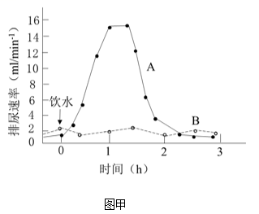

图中表示大量饮用清水后的排尿速率曲线是\_\_\_\_\_\_，该曲线的形成原因是大量饮用清水后血浆被稀释，渗透压下降，\_\_\_\_\_\_。从维持机体血浆渗透压稳定的角度，建议运动员运动后饮用\_\_\_\_\_\_。

（3）长跑过程中，运动员会出现血压升高等机体反应，运动结束后，血压能快速恢复正常，这一过程受神经-体液共同调节，其中减压反射是调节血压相对稳定的重要神经调节方式。为验证减压反射弧的传入神经是减压神经，传出神经是迷走神经，根据提供的实验材料，完善实验思路，预测实验结果，并进行分析与讨论。

材料与用具：成年实验兔、血压测定仪、生理盐水、刺激电极、麻醉剂等。

（要求与说明：答题时对实验兔的手术过程不作具体要求）

①完善实验思路：

I．麻醉和固定实验兔，分离其颈部一侧的颈总动脉、减压神经和迷走神经。颈总动脉经动脉插管与血压测定仪连接，测定血压，血压正常。在实验过程中，随时用\_\_\_\_\_\_湿润神经。

Ⅱ．用适宜强度电刺激减压神经，测定血压，血压下降。再用\_\_\_\_\_\_，测定血压，血压下降。

Ⅲ．对减压神经进行双结扎固定，并从结扎中间剪断神经（如图乙所示）。分别用适宜强度电刺激\_\_\_\_\_\_，分别测定血压，并记录。

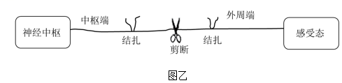

IV．对迷走神经进行重复Ⅲ的操作。

②预测实验结果：\_\_\_\_\_\_。

设计用于记录Ⅲ、IV实验结果的表格，并将预测的血压变化填入表中。

③分析与讨论：

运动员在马拉松长跑过程中，减压反射有什么生理意义？\_\_\_\_\_\_

【答案】（1） ①. 条件 ②. 大脑皮层

（2） ①. 曲线A ②. 减轻对下丘脑渗透压感受器的刺激，导致抗利尿激素分泌减少，使肾小管和集合管对水的重吸收减少，引起尿量增加 ③. 淡盐水

（3） ①. 生理盐水 ②. 适宜强度电刺激迷走神经 ③. 减压神经 ④. 血压上升；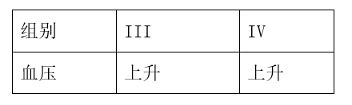 ⑤. 使血压保持相对稳定，避免运动员在运动过程中因血压升高而无法快速恢复而导致机体稳态被破坏

【解析】

【分析】1、人体的水平衡调节过程：当人体失水过多、饮水不足或吃的食物过咸时→细胞外液渗透压升高→下丘脑渗透压感受器受到刺激→垂体释放抗利尿激素增多→肾小管、集合管对水分的重吸收增加→尿量减少。同时大脑皮层产生渴觉（主动饮水）。

2、条件反射是人出生以后在生活过程中逐渐形成的后天性反射，是在非条件反射的基础上，在大脑皮层参与下完成的，是高级神经活动的基本方式。

【小问1详解】

听到发令枪声运动员立刻起跑，这一过程是后天学习和训练习得的，属于条件反射；所有感觉的形成部位都是大脑皮层，渴觉的产生部位也是大脑皮层。

【小问2详解】

据图可知，曲线A表示的是饮用清水的曲线，判断的依据是：饮用清水后，引起血浆渗透压降低，从而减轻对下丘脑渗透压感受器的刺激，导致抗利尿激素分泌减少，使肾小管和集合管对水的重吸收减少，引起尿量增加；血浆渗透压主要与无机盐和蛋白质的含量有关，为维持机体血浆渗透压稳定，应引用淡盐水，以同时补充水分和无机盐离子。

【小问3详解】

分析题意，本实验目的是验证减压反射弧的传入神经是减压神经，传出神经是迷走神经，则实验可通过刺激不同部位，然后通过血压的测定进行比较，结合实验材料可设计实验思路如下：

①完善实验思路：I．麻醉和固定实验兔，分离其颈部一侧颈总动脉、减压神经和迷走神经。颈总动脉经动脉插管与血压测定仪连接，测定血压，血压正常。在实验过程中，随时用生理盐水湿润神经，以保证其活性。

Ⅱ．用适宜强度电刺激减压神经，测定血压，血压下降。再用适宜强度电刺激迷走神经，测定血压，血压下降。

Ⅲ．对减压神经进行双结扎固定，并从结扎中间剪断神经（如图乙所示）。分别用适宜强度电刺激减压神经，分别测定血压，并记录。

IV．对迷走神经进行重复Ⅲ的操作。

②预测实验结果：由于减压神经被结扎，该生理过程被抑制，则预期结果是血压上升。表格可设计如下：

③分析题意可知，运动员会出现血压升高等机体反应，运动结束后，血压能快速恢复正常，这一过程称为减压反射，在马拉松长跑过程中，减压反射可使血压保持相对稳定，避免运动员在运动过程中因血压升高而无法快速恢复而导致机体稳态被破坏。
