**2023年湖北省普通高中学业水平选择性考试生物学**

**一、选择题：本题共18小题，在每小题给出的四个选项中，只有一项是符合题目要求的。**

1\. 栽培稻甲产量高、品质好，但每年只能收获一次。野生稻乙种植一次可连续收获多年，但产量低。中国科学家利用栽培稻甲和野生稻乙杂交，培育出兼具两者优点的品系丙，为全球作物育种提供了中国智慧。下列叙述错误的是（　　）

A. 该成果体现了生物多样性的间接价值

B. 利用体细胞杂交技术也可培育出品系丙

C. 该育种技术为全球农业发展提供了新思路

D. 品系丙的成功培育提示我们要注重野生种质资源的保护

2\. 球状蛋白分子空间结构为外圆中空，氨基酸侧链极性基团分布在分子的外侧，而非极性基团分布在内侧。蛋白质变性后，会出现生物活性丧失及一系列理化性质的变化。下列叙述错误的是（　　）

A. 蛋白质变性可导致部分肽键断裂

B. 球状蛋白多数可溶于水，不溶于乙醇

C. 加热变性的蛋白质不能恢复原有的结构和性质

D. 变性后生物活性丧失是因为原有空间结构破坏

3\. 维生素D3可从牛奶、鱼肝油等食物中获取，也可在阳光下由皮肤中的7-脱氢胆固醇转化而来，活化维生素D3可促进小肠和肾小管等部位对钙的吸收。研究发现，肾脏合成和释放的羟化酶可以促进维生素D3的活化。下列叙述错误的是（　　）

A. 肾功能下降可导致机体出现骨质疏松

B. 适度的户外活动，有利于少年儿童的骨骼发育

C. 小肠吸收钙减少可导致细胞外液渗透压明显下降

D. 肾功能障碍时，补充维生素D3不能有效缓解血钙浓度下降

4\. 用氨苄青霉素抗性基因（AmpR）、四环素抗性基因（TetR）作为标记基因构建的质粒如图所示。用含有目的基因的DNA片段和用不同限制酶酶切后的质粒，构建基因表达载体（重组质粒），并转化到受体菌中。下列叙述错误的是（　　）

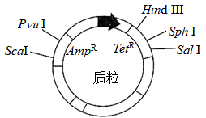

A. 若用HindⅢ酶切，目的基因转录的产物可能不同

B. 若用PvuⅠ酶切，在含Tet（四环素）培养基中的菌落，不一定含有目的基因

C. 若用SphⅠ酶切，可通过DNA凝胶电泳技术鉴定重组质粒构建成功与否

D. 若用SphⅠ酶切，携带目的基因的受体菌在含Amp（氨苄青霉素）和Tet的培养基中能形成菌落

5\. 2023年4月，武汉马拉松比赛吸引了全球约26000名运动员参赛。赛程中运动员出现不同程度的出汗、脱水和呼吸加深、加快。下列关于比赛中运动员生理状况的叙述，正确的是（　　）

A. 血浆中二氧化碳浓度持续升高

B. 大量补水后，内环境可恢复稳态

C. 交感神经兴奋增强，胃肠平滑肌蠕动加快

D 血浆渗透压升高，抗利尿激素分泌增加，尿量生成减少

6\. 为探究环境污染物A对斑马鱼生理的影响，研究者用不同浓度的污染物A溶液处理斑马鱼，实验结果如下表。据结果分析，下列叙述正确的是（　　）

<table>
<colgroup>
<col style="width: 4%" />
<col style="width: 35%" />
<col style="width: 14%" />
<col style="width: 14%" />
<col style="width: 15%" />
<col style="width: 15%" />
</colgroup>
<thead>
<tr>
<th colspan="2" style="text-align: left;">
A物质浓度（μg·L-1）

指标
</th>
<th style="text-align: left;">0</th>
<th style="text-align: left;">10</th>
<th style="text-align: left;">50</th>
<th style="text-align: left;">100</th>
</tr>
</thead>
<tbody>
<tr>
<td style="text-align: left;">①</td>
<td style="text-align: left;">肝脏糖原含量（mg·g-1）</td>
<td style="text-align: left;">25．0±0．6</td>
<td style="text-align: left;">12．1±0．7</td>
<td style="text-align: left;">12．0±0．7</td>
<td style="text-align: left;">11．1±0．2</td>
</tr>
<tr>
<td style="text-align: left;">②</td>
<td style="text-align: left;">肝脏丙酮酸含量（nmol·g-1）</td>
<td style="text-align: left;">23．6±0．7</td>
<td style="text-align: left;">17．5±0．2</td>
<td style="text-align: left;">15．7±0．2</td>
<td style="text-align: left;">8．8±0．4</td>
</tr>
<tr>
<td style="text-align: left;">③</td>
<td style="text-align: left;">血液中胰高血糖素含量（mIU·mg·prot-1）</td>
<td style="text-align: left;">43．6±1．7</td>
<td style="text-align: left;">87．2±1．8</td>
<td style="text-align: left;">109．1±3．0</td>
<td style="text-align: left;">120．0±2．1</td>
</tr>
</tbody>
</table>

A. 由②可知机体无氧呼吸减慢，有氧呼吸加快

B. 由①可知机体内葡萄糖转化为糖原的速率加快

C. ①②表明肝脏没有足够的丙酮酸来转化成葡萄糖

D. ③表明机体生成的葡萄糖增多，血糖浓度持续升高

7\. 2020年9月，我国在联合国大会上向国际社会作出了力争在2060年前实现“碳中和”的庄严承诺。某湖泊早年受周边农业和城镇稠密人口的影响，常年处于CO2过饱和状态。经治理后，该湖泊生态系统每年的有机碳分解量低于生产者有机碳的合成量，实现了碳的零排放。下列叙述错误的是（　　）

A. 低碳生活和绿色农业可以减小生态足迹

B. 水生消费者对有机碳的利用，缓解了碳排放

C. 湖泊沉积物中有机碳的分解会随着全球气候变暖而加剧

D. 在湖泊生态修复过程中，适度提高水生植物的多样性有助于碳的固定

8\. 植物光合作用的光反应依赖类囊体膜上PSⅠ和PSⅡ光复合体，PSⅡ光复合体含有光合色素，能吸收光能，并分解水。研究发现，PSⅡ光复合体上的蛋白质LHCⅡ，通过与PSⅡ结合或分离来增强或减弱对光能的捕获（如图所示）。LHCⅡ与PSⅡ的分离依赖LHC蛋白激酶的催化。下列叙述错误的是（　　）

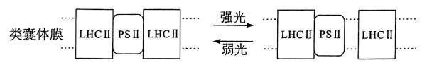

A. 叶肉细胞内LHC蛋白激酶活性下降，PSIⅡ光复合体对光能的捕获增强

B. Mg2+含量减少会导致PSⅡ光复合体对光能的捕获减弱

C. 弱光下LHCⅡ与PSⅡ结合，不利于对光能的捕获

D PSⅡ光复合体分解水可以产生H+、电子和O2

9\. 胁迫是指一种显著偏离于生物适宜生活需求的环境条件。水杨酸可以减轻胁迫对植物的不利影响。在镉的胁迫下，添加适宜浓度的水杨酸可激活苦草体内抗氧化酶系统，降低丙二醛和H2O2含量，有效缓解镉对苦草的氧化胁迫。下列叙述错误的是（　　）

A. 水杨酸能缓解H2O2对苦草的氧化作用

B. 在胁迫环境下，苦草种群的环境容纳量下降

C. 通过生物富集作用，镉能沿食物链传递到更高营养级

D. 在镉的胁迫下，苦草能通过自身的调节作用维持稳态

10\. 在观察洋葱根尖细胞有丝分裂的实验中，某同学制作的装片效果非常好，他将其中的某个视野放大拍照，发给5位同学观察细胞并计数，结果如下表（单位：个）。关于表中记录结果的分析，下列叙述错误的是（　　）

<table style="width:61%;">
<colgroup>
<col style="width: 8%" />
<col style="width: 13%" />
<col style="width: 8%" />
<col style="width: 8%" />
<col style="width: 8%" />
<col style="width: 8%" />
<col style="width: 8%" />
</colgroup>
<thead>
<tr>
<th rowspan="2" style="text-align: left;">学生</th>
<th rowspan="2" style="text-align: left;">分裂间期</th>
<th colspan="4" style="text-align: left;">分裂期</th>
<th rowspan="2" style="text-align: left;">总计</th>
</tr>
<tr>
<th style="text-align: left;">前期</th>
<th style="text-align: left;">中期</th>
<th style="text-align: left;">后期</th>
<th style="text-align: left;">末期</th>
</tr>
</thead>
<tbody>
<tr>
<td style="text-align: left;">甲</td>
<td style="text-align: left;">5</td>
<td style="text-align: left;">6</td>
<td style="text-align: left;">3</td>
<td style="text-align: left;">2</td>
<td style="text-align: left;">6</td>
<td style="text-align: left;">22</td>
</tr>
<tr>
<td style="text-align: left;">乙</td>
<td style="text-align: left;">5</td>
<td style="text-align: left;">6</td>
<td style="text-align: left;">3</td>
<td style="text-align: left;">3</td>
<td style="text-align: left;">5</td>
<td style="text-align: left;">22</td>
</tr>
<tr>
<td style="text-align: left;">丙</td>
<td style="text-align: left;">5</td>
<td style="text-align: left;">6</td>
<td style="text-align: left;">3</td>
<td style="text-align: left;">2</td>
<td style="text-align: left;">6</td>
<td style="text-align: left;">22</td>
</tr>
<tr>
<td style="text-align: left;">丁</td>
<td style="text-align: left;">7</td>
<td style="text-align: left;">6</td>
<td style="text-align: left;">3</td>
<td style="text-align: left;">2</td>
<td style="text-align: left;">5</td>
<td style="text-align: left;">23</td>
</tr>
<tr>
<td style="text-align: left;">戊</td>
<td style="text-align: left;">7</td>
<td style="text-align: left;">7</td>
<td style="text-align: left;">3</td>
<td style="text-align: left;">2</td>
<td style="text-align: left;">6</td>
<td style="text-align: left;">25</td>
</tr>
</tbody>
</table>

A. 丙、丁计数的差异是由于有丝分裂是一个连续过程，某些细胞所处时期易混淆

B. 五位同学记录的中期细胞数一致，原因是中期染色体排列在细胞中央，易区分

C. 五位同学记录的间期细胞数不多，原因是取用的材料处于旺盛的分裂阶段

D. 戊统计的细胞数量较多，可能是该同学的细胞计数规则与其他同学不同

11\. 高温是制约世界粮食安全的因素之一，高温往往使植物叶片变黄、变褐。研究发现平均气温每升高1℃，水稻、小麦等作物减产约3%~8%。关于高温下作物减产的原因，下列叙述错误的是（　　）

A. 呼吸作用变强，消耗大量养分

B. 光合作用强度减弱，有机物合成减少

C. 蒸腾作用增强，植物易失水发生萎蔫

D. 叶绿素降解，光反应生成的NADH和ATP减少

12\. 多年生植物甲为一种重要经济作物，果实采收期一般在10月，在生长过程中常受到寄生植物乙危害（植物乙的果实成熟期为当年10月到次年2月）。为阻断植物乙的传播和蔓延，科研人员选用不同稀释浓度的植物生长调节剂M喷施处理，结果如图所示。下列叙述错误的是（　　）

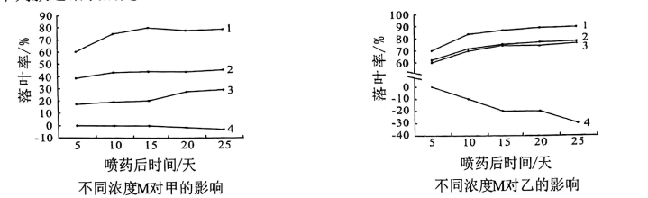

曲线1：稀释浓度为1/100；曲线2：稀释浓度为1/200；曲线3：稀释浓度为1/400；曲线4：对照组

A. 据图综合分析，为防治乙的危害，M的稀释浓度应选用1/400

B. 植物乙对照组的曲线逐渐下降，说明其生长逐渐减弱

C. 喷施M时间选择甲果实采收后，乙果实未大量成熟前

D. 植物生长调节剂M与植物激素脱落酸的作用相似

13\. 快速分裂的癌细胞内会积累较高浓度的乳酸。研究发现，乳酸与锌离子结合可以抑制蛋白甲的活性，甲活性下降导致蛋白乙的SUMO化修饰加强，进而加快有丝分裂后期的进程。下列叙述正确的是（　　）

A. 乳酸可以促进DNA的复制

B. 较高浓度乳酸可以抑制细胞的有丝分裂

C. 癌细胞通过无氧呼吸在线粒体中产生大量乳酸

D. 敲除蛋白甲基因可升高细胞内蛋白乙的SUMO化水平

14\. 人的某条染色体上A、B、C三个基因紧密排列，不发生互换。这三个基因各有上百个等位基因（例如：A1~An均为A的等位基因）。父母及孩子的基因组成如下表。下列叙述正确的是（　　）

|  | 父亲 | 母亲 | 儿子 | 女儿 |
|:---|:---|:---|:---|:---|
| 基因组成 | A23A25B7B35C2C4 | A3A24B8B44C5C9 | A24A25B7B8C4C5 | A3A23B35B44AC2C9 |

A. 基因A、B、C的遗传方式是伴X染色体遗传

B. 母亲的其中一条染色体上基因组成是A3B44C9

C. 基因A与基因B的遗传符合基因的自由组合定律

D. 若此夫妻第3个孩子的A基因组成为A23A24，则其C基因组成为C4C5

15\. 心肌细胞上广泛存在Na+-K+泵和Na+-Ca2+交换体（转入Na+的同时排出Ca2+），两者的工作模式如图所示。已知细胞质中钙离子浓度升高可引起心肌收缩。某种药物可以特异性阻断细胞膜上的Na+-K+泵。关于该药物对心肌细胞的作用，下列叙述正确的是（　　）

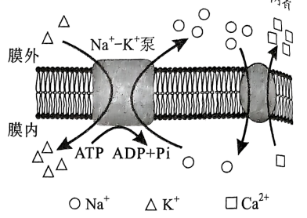

A. 心肌收缩力下降

B. 细胞内液的钾离子浓度升高

C. 动作电位期间钠离子的内流量减少

D. 细胞膜上Na+-Ca2+交换体的活动加强

16\. DNA探针是能与目DNA配对的带有标记的一段核苷酸序列，可检测识别区间的任意片段，并形成杂交信号。某探针可以检测果蝇Ⅱ号染色体上特定DNA区间。某果蝇的Ⅱ号染色体中的一条染色体部分区段发生倒位，如下图所示。用上述探针检测细胞有丝分裂中期的染色体（染色体上“—”表示杂交信号），结果正确的是（　　）

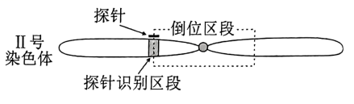

A. 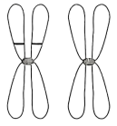 B. 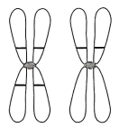

C. 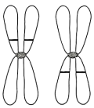 D. 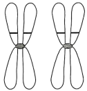

17\. 现有甲、乙两种牵牛花，花冠的颜色由基因A、a控制。含A基因的牵牛花开紫花，不含A基因的牵牛花开白花。甲开白花，释放的挥发物质多，主要靠蛾类传粉；乙开紫花，释放的挥发物质少，主要靠蜂类传粉。若将A基因转入甲，其花颜色由白变紫，其他性状不变，但对蛾类的吸引下降，对蜂类的吸引增强。根据上述材料，下列叙述正确的是（　　）

A. 甲、乙两种牵牛花传粉昆虫的差异，对维持两物种生殖隔离具有重要作用

B. 在蛾类多而蜂类少的环境下，甲有选择优势，A基因突变加快

C. 将A基因引入甲植物种群后，甲植物种群的基因库未发生改变

D. 甲释放的挥发物是吸引蛾类传粉的决定性因素

18\. 某二倍体动物种群有100个个体，其常染色体上某基因有A1、A2、A3三个等位基因。对这些个体的基因A1、A2、A3进行PCR扩增，凝胶电泳及统计结果如图所示。该种群中A3的基因频率是（　　）

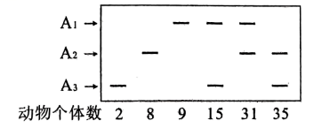

A. 52% B. 27% C. 26% D. 2%

**二、非选择题：本题共4小题。**

19\. 我国是世界上雪豹数量最多的国家，并且拥有全球面积最大的雪豹栖息地，岩羊和牦牛是雪豹的主要捕食对象。雪豹分布在青藏高原及其周边国家和地区，是山地地区生物多样性的旗舰物种。随着社会发展，雪豹生存面临着越来越多的威胁因素，如栖息地丧失、食物减少、气候变化以及人为捕猎等。1972年雪豹被世界自然保护联盟列为濒危动物。气候变化可使山地物种栖息地丧失和生境破碎化程度加剧。模型模拟预测结果显示，影响雪豹潜在适宜生境分布的主要环境因子包括：两种气候变量（年平均气温和最冷月最低温度），两种地形变量（海拔和坡度）和一种水文变量（距离最近河流的距离）。回答下列问题：

（1）根据材料信息，写出一条食物链\_\_\_\_\_\_\_。

（2）如果气候变化持续加剧，雪豹种群可能会面临\_\_\_\_\_\_的风险，原因是\_\_\_\_\_\_。

（3）习近平总书记在二十大报告中提出了“实施生物多样性保护重大工程”。保护生物多样性的意义是\_\_\_（回答一点即可）。根据上述材料，你认为对雪豹物种进行保护的有效措施有\_\_\_\_\_\_和\_\_\_等。

20\. 乙烯（C2H4）是一种植物激素，对植物的生长发育起重要作用。为研究乙烯作用机制，进行了如下三个实验。

【实验一】乙烯处理植物叶片2小时后，发现该植物基因组中有2689个基因的表达水平升高，2374个基因的表达水平下降。

【实验二】某一稳定遗传的植物突变体甲，失去了对乙烯作用的响应（乙烯不敏感型）。将该突变体与野生型植株杂交，F1植株表型为乙烯不敏感。F1自交产生的F2植株中，乙烯不敏感型与敏感型的植株比例为9：7．

【实验三】科学家发现基因A与植物对乙烯的响应有关，该基因编码一种膜蛋白，推测该蛋白能与乙烯结合。为验证该推测，研究者先构建含基因A的表达载体，将其转入到酵母菌中，筛选出成功表达蛋白A的酵母菌，用放射性同位素14C标记乙烯（14C2H4），再分为对照组和实验组进行实验，其中实验组是用不同浓度的14C2H4与表达有蛋白A的酵母菌混合6小时，通过离心分离酵母菌，再检测酵母菌结合14C2H4的量。结果如图所示。

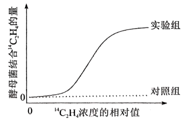

回答下列问题：

（1）实验一中基因表达水平的变化可通过分析叶肉细胞中的\_\_\_\_\_\_\_（填“DNA”或“mRNA”）含量得出。

（2）实验二F2植株出现不敏感型与敏感型比例为9：7的原因是\_\_\_\_\_\_\_\_\_。

（3）实验三的对照组为：用不同浓度的14C2H4与\_\_\_\_\_\_\_混合6小时，通过离心分离酵母菌，再检测酵母菌结合14C2H4的量。

（4）实验三中随着14C2H4相对浓度升高，实验组曲线上升趋势变缓的原因是\_\_\_\_\_\_。

（5）实验三的结论是\_\_\_\_\_\_\_\_。

21\. 我国科学家研制出的脊髓灰质炎减毒活疫苗，为消灭脊髓灰质炎作出了重要贡献。某儿童服用含有脊髓灰质炎减毒活疫苗的糖丸后，其血清抗体浓度相对值变化如图所示。

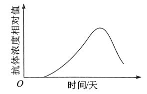

回答下列问题：

（1）该疫苗保留了脊髓灰质炎病毒的\_\_\_\_\_\_\_。

（2）据图判断，该疫苗成功诱导了机体的\_\_\_\_\_\_\_免疫反应，理由是\_\_\_\_\_\_。

（3）研究发现，实验动物被脊髓灰质炎病毒侵染后，发生了肢体运动障碍。为判断该动物的肢体运动障碍是否为脊髓灰质炎病毒直接引起的骨骼肌功能损伤所致，以电刺激的方法设计实验，实验思路是\_\_\_\_\_\_\_，预期实验结果和结论是\_\_\_\_\_\_\_。

（4）若排除了脊髓灰质炎病毒对该动物骨骼肌的直接侵染作用，确定病毒只侵染了脊髓灰质前角（图中部位①）。刺激感染和未感染脊髓灰质炎病毒的动物的感受器，与未感染动物相比，感染动物的神经纤维②上的信息传导变化是：\_\_\_\_\_\_\_\_，神经-肌肉接头部位③处的信息传递变化是：\_\_\_\_\_\_\_。

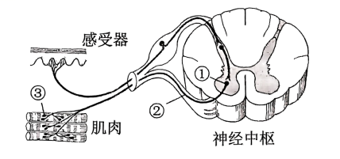

22\. 某病毒对动物养殖业危害十分严重。我国学者拟以该病毒外壳蛋白A为抗原来制备单克隆抗体，以期快速检测该病毒，其主要技术路线如图所示。

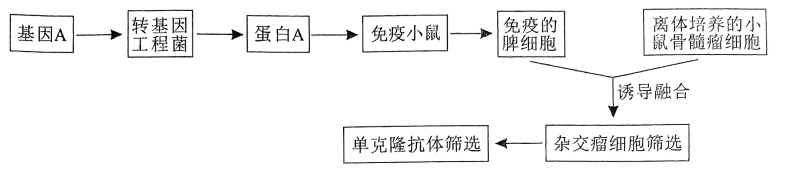

回答下列问题：

（1）与小鼠骨髓瘤细胞融合前，已免疫的脾细胞（含浆细胞）\_\_\_\_\_\_\_（填“需要”或“不需要”）通过原代培养扩大细胞数量；添加脂溶性物质PEG可促进细胞融合，该过程中PEG对细胞膜的作用是\_\_\_\_\_\_。

（2）在杂交瘤细胞筛选过程中，常使用特定选择培养基（如HAT培养基），该培养基对\_\_\_\_\_\_\_和\_\_\_\_\_\_\_生长具有抑制作用。

（3）单克隆抗体筛选中，将抗体与该病毒外壳蛋白进行杂交，其目的是\_\_\_\_\_\_\_\_\_。

（4）构建重组质粒需要使用DNA连接酶。下列属于DNA连接酶底物的是\_\_\_\_\_\_\_\_\_。

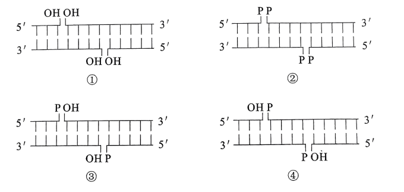
