**2023年普通高中学业水平选择性考试（湖南卷）生物**

**一、选择题：本题共12小题，在每小题给出的四个选项中，只有一项是符合题目要求的。**

1\. 南极雌帝企鹅产蛋后，由雄帝企鹅负责孵蛋，孵蛋期间不进食。下列叙述错误的是（ ）

A. 帝企鹅蛋卵清蛋白中N元素的质量分数高于C元素

B. 帝企鹅的核酸、多糖和蛋白质合成过程中都有水的产生

C. 帝企鹅蛋孵化过程中有mRNA和蛋白质种类的变化

D. 雄帝企鹅孵蛋期间主要靠消耗体内脂肪以供能

2\. 关于细胞结构与功能，下列叙述错误的是（ ）

A. 细胞骨架被破坏，将影响细胞运动、分裂和分化等生命活动

B. 核仁含有DNA、RNA和蛋白质等组分，与核糖体的形成有关

C. 线粒体内膜含有丰富的酶，是有氧呼吸生成CO2的场所

D. 内质网是一种膜性管道系统，是蛋白质的合成、加工场所和运输通道

3\. 酗酒危害人类健康。乙醇在人体内先转化为乙醛，在乙醛脱氢酶2（ALDH2）作用下再转化为乙酸，最终转化成CO2和水。头孢类药物能抑制ALDH2的活性。ALDH2基因某突变导致ALDH2活性下降或丧失。在高加索人群中该突变的基因频率不足5%，而东亚人群中高达30%。下列叙述错误的是（ ）

A. 相对于高加索人群，东亚人群饮酒后面临的风险更高

B. 患者在服用头孢类药物期间应避免摄入含酒精的药物或食物

C. ALDH2基因突变人群对酒精耐受性下降，表明基因通过蛋白质控制生物性状

D. 饮酒前口服ALDH2酶制剂可催化乙醛转化成乙酸，从而预防酒精中毒

4\. “油菜花开陌野黄，清香扑鼻蜂蝶舞。”菜籽油是主要的食用油之一，秸秆和菜籽饼可作为肥料还田。下列叙述错误的是（ ）

A. 油菜花通过物理、化学信息吸引蜂蝶

B. 蜜蜂、蝴蝶和油菜之间存在协同进化

C. 蜂蝶与油菜的种间关系属于互利共生

D. 秸秆和菜籽饼还田后可提高土壤物种丰富度

5\. 食品保存有干制、腌制、低温保存和高温处理等多种方法。下列叙述错误是（ ）

A. 干制降低食品的含水量，使微生物不易生长和繁殖，食品保存时间延长

B. 腌制通过添加食盐、糖等制造高渗环境，从而抑制微生物的生长和繁殖

C. 低温保存可抑制微生物的生命活动，温度越低对食品保存越有利

D. 高温处理可杀死食品中绝大部分微生物，并可破坏食品中的酶类

6\. 甲状旁腺激素（PTH）和降钙素（CT）可通过调节骨细胞活动以维持血钙稳态，如图所示。下列叙述错误的是（ ）

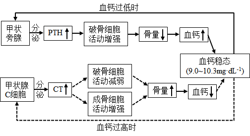

A. CT可促进成骨细胞活动，降低血钙

B. 甲状旁腺功能亢进时，可引起骨质疏松

C. 破骨细胞活动异常增强，将引起CT分泌增加

D. 长时间的高血钙可导致甲状旁腺增生

7\. 基因Bax和Bd-2分别促进和抑制细胞凋亡。研究人员利用siRNA干扰技术降低TRPM7基因表达，研究其对细胞凋亡的影响，结果如图所示。下列叙述错误的是（ ）

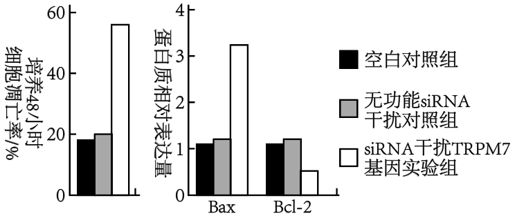

A. 细胞衰老和细胞凋亡都受遗传信息的调控

B. TRPM7基因可能通过抑制Bax基因的表达来抑制细胞凋亡

C. TRPM7基因可能通过促进Bcl-2基因的表达来抑制细胞凋亡

D. 可通过特异性促进癌细胞中TRPM7基因的表达来治疗相关癌症

8\. 盐碱胁迫下植物应激反应产生的H2O2对细胞有毒害作用。禾本科农作物AT1蛋白通过调节细胞膜上PIP2s蛋白磷酸化水平，影响H2O2的跨膜转运，如图所示。下列叙述错误的是（ ）

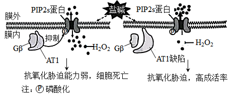

A. 细胞膜上PIP2s蛋白高磷酸化水平是其提高H2O2外排能力所必需的

B. PIP2s蛋白磷酸化被抑制，促进H2O2外排，从而减轻其对细胞的毒害

C. 敲除AT1基因或降低其表达可提高禾本科农作物的耐盐碱能力

D. 从特殊物种中发掘逆境胁迫相关基因是改良农作物抗逆性的有效途径

9\. 某X染色体显性遗传病由SHOX基因突变所致，某家系中一男性患者与一正常女性婚配后，生育了一个患该病的男孩。究其原因，不可能的是（ ）

A. 父亲的初级精母细胞在减数分裂I四分体时期，X和Y染色体片段交换

B. 父亲的次级精母细胞在减数分裂Ⅱ后期，性染色体未分离

C. 母亲的卵细胞形成过程中，SHOX基因发生了突变

D. 该男孩在胚胎发育早期，有丝分裂时SHOX基因发生了突变

10\. 关于激素、神经递质等信号分子，下列叙述错误的是（ ）

A. 一种内分泌器官可分泌多种激素

B. 一种信号分子可由多种细胞合成和分泌

C. 多种信号分子可协同调控同一生理功能

D. 激素发挥作用的前提是识别细胞膜上的受体

11\. 某少年意外被锈钉扎出一较深伤口，经查体内无抗破伤风的抗体。医生建议使用破伤风类毒素（抗原）和破伤风抗毒素（抗体）以预防破伤风。下列叙述正确的是（ ）

A. 伤口清理后，须尽快密闭包扎，以防止感染

B. 注射破伤风抗毒素可能出现的过敏反应属于免疫防御

C. 注射破伤风类毒素后激活的记忆细胞能产生抗体

D. 有效注射破伤风抗毒素对人体的保护时间长于注射破伤风类毒素

12\. 细菌glg基因编码的UDPG焦磷酸化酶在糖原合成中起关键作用。细菌糖原合成的平衡受到CsrAB系统的调节。CsrA蛋白可以结合glg mRNA分子，也可结合非编码RNA分子CsrB,如图所示。下列叙述错误的是（ ）

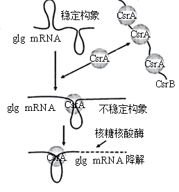

A. 细菌glg基因转录时，RNA聚合酶识别和结合glg基因的启动子并驱动转录

B. 细菌合成UDPG焦磷酸化酶的肽链时，核糖体沿glg mRNA从5'端向3'端移动

C. 抑制CsrB基因的转录能促进细菌糖原合成

D. CsrA蛋白都结合到CsrB上，有利于细菌糖原合成

**二、选择题：本题共4小题，在每小题给出的四个选项中，有一项或多项符合题目要求。**

13\. 党的二十大报告指出：我们要推进美丽中国建设，坚持山水林田湖草沙一体化保护和系统治理，统筹产业结构调整、污染治理、生态保护，应对气侯变化，协同推进降碳、减污、扩绿、增长，推进生态优先、节约集约、绿色低碳发展。下列叙述错误的是（ ）

A. 一体化保护有利于提高生态系统的抵抗力稳定性

B. 一体化保护体现了生态系统的整体性和系统性

C. 一体化保护和系统治理有助于协调生态足迹与生态承载力的关系

D. 运用自生原理可以从根本上达到一体化保护和系统治理

14\. 盐碱化是农业生产的主要障碍之一。植物可通过质膜H+泵把Na+排出细胞，也可通过液泡膜H+泵和液泡膜NHX载体把Na+转入液泡内，以维持细胞质基质Na+稳态。下图是NaCl处理模拟盐胁迫，钒酸钠（质膜H+泵的专一抑制剂）和甘氨酸甜菜碱（GB）影响玉米Na+的转运和相关载体活性的结果。下列叙述正确的是（ ）

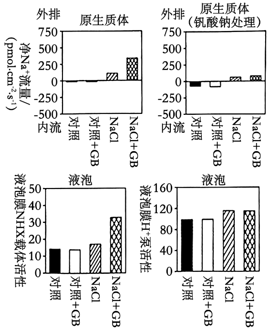

A. 溶质跨膜转运都会引起细胞膜两侧渗透压的变化

B. GB可能通过调控质膜H+泵活性增强Na+外排，从而减少细胞内Na+的积累

C. GB引起盐胁迫下液泡中Na+浓度显著变化，与液泡膜H+泵活性有关

D. 盐胁迫下细胞质基质Na+排出细胞或转入液泡都能增强植物耐盐性

15\. 为精细定位水稻4号染色体上的抗虫基因，用纯合抗虫水稻与纯合易感水稻的杂交后代多次自交，得到一系列抗虫或易感水稻单株。对亲本及后代单株4号染色体上的多个不连续位点进行测序，部分结果按碱基位点顺序排列如下表。据表推测水稻同源染色体发生了随机互换，下列叙述正确的是（ ）

<table style="width:70%;">
<colgroup>
<col style="width: 4%" />
<col style="width: 9%" />
<col style="width: 8%" />
<col style="width: 7%" />
<col style="width: 7%" />
<col style="width: 8%" />
<col style="width: 10%" />
<col style="width: 13%" />
</colgroup>
<thead>
<tr>
<th></th>
<th colspan="6" style="text-align: center;">…位点1…位点2…位点3…位点4…位点5…位点6…</th>
<th style="text-align: center;"></th>
</tr>
</thead>
<tbody>
<tr>
<td rowspan="5">测序结果</td>
<td style="text-align: center;">A/A</td>
<td style="text-align: center;">A/A</td>
<td style="text-align: center;">A/A</td>
<td style="text-align: center;">A/A</td>
<td style="text-align: center;">A/A</td>
<td style="text-align: center;">A/A</td>
<td style="text-align: center;">
纯合抗虫

水稻亲本
</td>
</tr>
<tr>
<td style="text-align: center;">G/G</td>
<td style="text-align: center;">G/G</td>
<td style="text-align: center;">G/G</td>
<td style="text-align: center;">G/G</td>
<td style="text-align: center;">G/G</td>
<td style="text-align: center;">G/G</td>
<td style="text-align: center;">
纯合易感

水稻亲本
</td>
</tr>
<tr>
<td style="text-align: center;">G/G</td>
<td style="text-align: center;">G/G</td>
<td style="text-align: center;">A/A</td>
<td style="text-align: center;">A/A</td>
<td style="text-align: center;">A/A</td>
<td style="text-align: center;">A/A</td>
<td style="text-align: center;">抗虫水稻1</td>
</tr>
<tr>
<td style="text-align: center;">A/G</td>
<td style="text-align: center;">A/G</td>
<td style="text-align: center;">A/G</td>
<td style="text-align: center;">A/G</td>
<td style="text-align: center;">A/G</td>
<td style="text-align: center;">G/G</td>
<td style="text-align: center;">抗虫水稻2</td>
</tr>
<tr>
<td style="text-align: center;">A/G</td>
<td style="text-align: center;">G/G</td>
<td style="text-align: center;">G/G</td>
<td style="text-align: center;">G/G</td>
<td style="text-align: center;">G/G</td>
<td style="text-align: center;">A/A</td>
<td style="text-align: center;">易感水稻1</td>
</tr>
</tbody>
</table>

A. 抗虫水稻1的位点2-3之间发生过交换

B. 易感水稻1的位点2-3及5-6之间发生过交换

C. 抗虫基因可能与位点3、4、5有关

D. 抗虫基因位于位点2-6之间

16\. 番茄果实发育历时约53天达到完熟期，该过程受脱落酸和乙烯的调控，且果实发育过程中种子的脱落酸和乙烯含量达到峰值时间均早于果肉。基因NCEDI和AC01分别是脱落酸和乙烯合成的关键基因。NDGA抑制NCED1酶活性，1-MCP抑制乙烯合成。花后40天果实经不同处理后果实中脱落酸和乙烯含量的结果如图所示。下列叙述正确的是（ ）

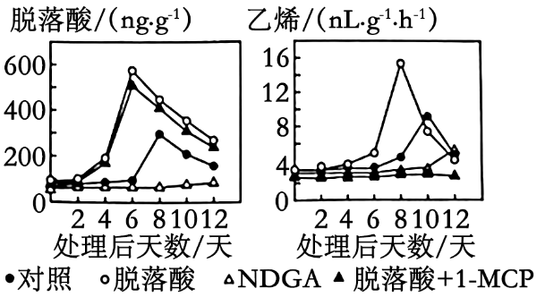

A. 番茄种子的成熟期早于果肉，这种发育模式有利于种群的繁衍

B. 果实发育过程中脱落酸生成时，果实中必需有NCEDI酶的合成

C. NCED1酶失活，ACO1基因的表达可能延迟

D. 脱落酸诱导了乙烯的合成，其诱导效应可被1-MCP消除

**三、非选择题：本题共5小题。**

17\. 下图是水稻和玉米的光合作用暗反应示意图。卡尔文循环的Rubisco酶对CO2的Km为450μmol·L-1（K越小，酶对底物的亲和力越大）,该酶既可催化RuBP与CO2反应，进行卡尔文循环，又可催化RuBP与O2反应，进行光呼吸（绿色植物在光照下消耗O2并释放CO2的反应）。该酶的酶促反应方向受CO2和O2相对浓度的影响。与水稻相比，玉米叶肉细胞紧密围绕维管束鞘，其中叶肉细胞叶绿体是水光解的主要场所，维管束鞘细胞的叶绿体主要与ATP生成有关。玉米的暗反应先在叶肉细胞中利用PEPC酶（PEPC对CO2的Km为7μmol·L-1）催化磷酸烯醇式丙酮酸（PEP）与CO2反应生成C4,固定产物C4转运到维管束鞘细胞后释放CO2,再进行卡尔文循环。回答下列问题：

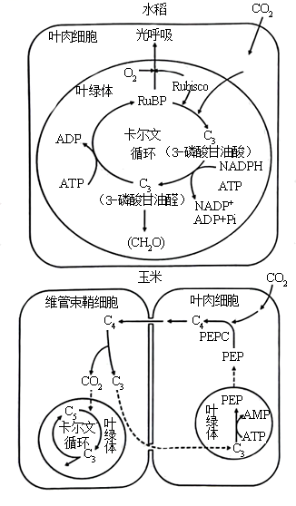

（1）玉米的卡尔文循环中第一个光合还原产物是\_\_\_\_\_\_（填具体名称）,该产物跨叶绿体膜转运到细胞质基质合成\_\_\_\_\_\_（填"葡萄糖""蔗糖"或"淀粉"）后，再通过\_\_\_\_\_长距离运输到其他组织器官。

（2）在干旱、高光照强度环境下，玉米的光合作用强度\_\_\_\_\_（填"高于"或"低于"）水稻。从光合作用机制及其调控分析，原因是 \_\_\_\_\_\_\_\_\_\_\_\_（答出三点即可）。

（3）某研究将蓝细菌的CO2浓缩机制导入水稻，水稻叶绿体中CO2浓度大幅提升，其他生理代谢不受影响，但在光饱和条件下水稻的光合作用强度无明显变化。其原因可能是\_\_\_\_\_\_\_\_\_\_\_\_\_（答出三点即可）。

18\. 长时程增强（LTP）是突触前纤维受到高频刺激后，突触传递强度增强且能持续数小时至几天的电现象，与人的长时记忆有关。下图是海马区某侧支LTP产生机制示意图，回答下列问题：

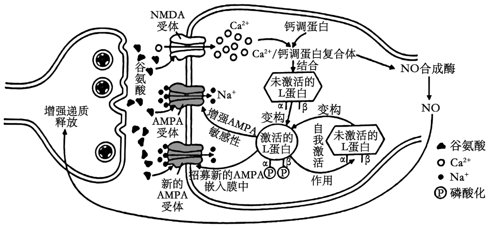

（1）依据以上机制示意图，LTP的发生属于\_\_\_\_\_\_ （填“正”或“负”）反馈调节。

（2）若阻断NMDA受体作用，再高频刺激突触前膜，未诱发LTP，但出现了突触后膜电现象。据图推断，该电现象与\_\_\_\_\_\_\_内流有关。

（3）为了探讨L蛋白的自身磷酸化位点（图中α位和β位）对L蛋白自我激活的影响，研究人员构建了四种突变小鼠甲、乙、丙和丁，并开展了相关实验，结果如表所示：

<table>
<colgroup>
<col style="width: 15%" />
<col style="width: 6%" />
<col style="width: 20%" />
<col style="width: 25%" />
<col style="width: 19%" />
<col style="width: 11%" />
</colgroup>
<thead>
<tr>
<th rowspan="2"></th>
<th rowspan="2">
正常

小鼠
</th>
<th>甲</th>
<th>乙</th>
<th>丙</th>
<th>丁</th>
</tr>
<tr>
<th>α位突变为缬氨酸，该位点不发生自身磷酸化</th>
<th>α位突变为天冬氨酸，阻断Ca2+/钙调蛋白复合体与L蛋白结合</th>
<th>β位突变为丙氨酸，该位点不发生自身磷酸化</th>
<th>L蛋白编码基因确缺失</th>
</tr>
</thead>
<tbody>
<tr>
<td>L蛋白活性</td>
<td>+</td>
<td>++++</td>
<td>++++</td>
<td>+</td>
<td>-</td>
</tr>
<tr>
<td>高频刺激</td>
<td>有LTP</td>
<td>有LTP</td>
<td>?</td>
<td>无LTP</td>
<td>无LTP</td>
</tr>
</tbody>
</table>

注：“+”多少表示活性强弱，“-”表示无活性。

据此分析：

①小鼠乙在高频刺激后\_\_\_\_\_\_（填“有”或“无”）LTP现象，原因是\_\_\_\_\_\_\_\_\_\_\_ ;

②α位的自身磷酸化可能对L蛋白活性具有\_\_\_\_\_\_\_\_作用。

③在甲、乙和丁实验组中，无L蛋白β位自身磷酸化的组是\_\_\_\_\_\_\_\_\_\_。

19\. 基因检测是诊断和预防遗传病的有效手段。研究人员采集到一遗传病家系样本，测序后发现此家系甲和乙两个基因存在突变：甲突变可致先天性耳聋；乙基因位于常染色体上，编码产物可将叶酸转化为N5-甲基四氢叶酸，乙突变与胎儿神经管缺陷（NTDs）相关；甲和乙位于非同源染色体上。家系患病情况及基因检测结果如图所示。不考虑染色体互换，回答下列问题：

（1）此家系先天性耳聋的遗传方式是\_\_\_\_\_\_\_\_\_。1-1和1-2生育育一个甲和乙突变基因双纯合体女儿的概率是\_\_\_\_\_\_\_\_。

（2）此家系中甲基因突变如下图所示：

正常基因单链片段5'-ATTCCAGATC……（293个碱基）……CCATGCCCAG-3'

突变基因单链片段5'-ATTCCATATC……（293个碱基）……CCATGCCCAG-3'

研究人员拟用PCR扩增目的基因片段，再用某限制酶（识别序列及切割位点为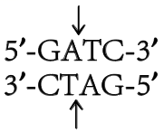 ）酶切检测甲基因突变情况，设计了一条引物为5′-GGCATG-3'，另一条引物为\_\_\_\_\_\_\_\_\_（写出6个碱基即可）。用上述引物扩增出家系成员Ⅱ-1的目的基因片段后，其酶切产物长度应为\_\_\_\_\_\_\_\_bp（注：该酶切位点在目的基因片段中唯一）。

（3）女性的乙基因纯合突变会增加胎儿NTDs风险。叶酸在人体内不能合成，孕妇服用叶酸补充剂可降低NTDs的发生风险。建议从可能妊娠或孕前至少1个月开始补充叶酸，一般人群补充有效且安全剂量为0.4~1.0mg.d-1，NTDs生育史女性补充4mg.d-1。经基因检测胎儿（Ⅲ-2）的乙基因型为-/-，据此推荐该孕妇（Ⅱ-1）叶酸补充剂量为\_\_\_\_\_mg.d-1。

20\. 濒危植物云南红豆杉（以下称红豆杉）是喜阳喜湿高大乔木，郁闭度对其生长有重要影响。研究人员对某区域无人为干扰生境和人为干扰生境的红豆杉野生种群开展了调查研究。选择性采伐和放牧等人为干扰使部分上层乔木遭破坏，但尚余主要上层乔木，保持原有生境特点。无人为干扰生境下红豆杉野生种群年龄结构的调查结果如图所示。回答下列问题：

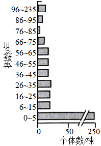

（1）调查红豆杉野生种群密度时，样方面积最合适的是400m2,理由是\_\_\_\_\_。由图可知，无人为干扰生境中红豆杉种群年龄结构类型为\_\_\_\_\_\_\_。

（2）调查发现人为干扰生境中，树龄≤5年幼苗的比例低于无人为干扰生境，可能的原因是\_\_\_\_\_\_\_\_\_。分析表明，人为干扰生境中6~25年树龄红豆杉的比例比无人为干扰生境高11%可能的原因是\_\_\_\_\_\_\_\_\_\_\_\_\_\_\_。选择性采伐与红豆杉生态位重叠度\_\_\_\_\_\_\_（填“高”或“低”）的部分植物，有利于红豆杉野生种群的自然更新。

（3）关于红豆杉种群动态变化及保护的说法，下列叙述正确的是（ ）

①选择性采伐和放牧等会改变红豆杉林的群落结构和群落演替速度

②在无人为干扰生境中播撒红豆杉种子将提高6~25年树龄植株的比例

③气温、干旱和火灾是影响红豆杉种群密度的非密度制约因素

④气候变湿润后可改变红豆杉的种群结构并增加种群数量

⑤保护红豆杉野生种群最有效的措施是人工繁育

21\. 某些植物根际促生菌具有生物固氮、分解淀粉和抑制病原菌等作用。回答下列问题：

（1）若从植物根际土壤中筛选分解淀粉的固氮细菌，培养基的主要营养物质包括水和\_\_\_\_ 。

（2）现从植物根际土壤中筛选出一株解淀粉芽孢杆菌H，其产生的抗菌肽抑菌效果见表。据表推测该抗菌肽对\_\_\_\_\_\_\_\_\_\_\_\_\_\_\_\_\_的抑制效果较好，若要确定其有抑菌效果的最低浓度，需在\_\_\_\_\_\_\_\_\_\_μg·mL-1浓度区间进一步实验。

<table style="width:71%;">
<colgroup>
<col style="width: 18%" />
<col style="width: 7%" />
<col style="width: 7%" />
<col style="width: 7%" />
<col style="width: 7%" />
<col style="width: 7%" />
<col style="width: 8%" />
<col style="width: 7%" />
</colgroup>
<thead>
<tr>
<th rowspan="2" style="text-align: center;">测试菌</th>
<th colspan="7" style="text-align: center;">抗菌肽浓度/（µg•mL-1）</th>
</tr>
<tr>
<th style="text-align: center;">55.20</th>
<th style="text-align: center;">27.60</th>
<th style="text-align: center;">13.80</th>
<th style="text-align: center;">6.90</th>
<th style="text-align: center;">3.45</th>
<th style="text-align: center;">1.73</th>
<th style="text-align: center;">0.86</th>
</tr>
</thead>
<tbody>
<tr>
<td style="text-align: center;">金黄色葡萄球菌</td>
<td style="text-align: center;">-</td>
<td style="text-align: center;">-</td>
<td style="text-align: center;">-</td>
<td style="text-align: center;">-</td>
<td style="text-align: center;">-</td>
<td style="text-align: center;">+</td>
<td style="text-align: center;">+</td>
</tr>
<tr>
<td style="text-align: center;">枯草芽孢杆菌</td>
<td style="text-align: center;">-</td>
<td style="text-align: center;">-</td>
<td style="text-align: center;">-</td>
<td style="text-align: center;">-</td>
<td style="text-align: center;">-</td>
<td style="text-align: center;">+</td>
<td style="text-align: center;">+</td>
</tr>
<tr>
<td style="text-align: center;">禾谷镰孢菌</td>
<td style="text-align: center;">-</td>
<td style="text-align: center;">+</td>
<td style="text-align: center;">+</td>
<td style="text-align: center;">+</td>
<td style="text-align: center;">+</td>
<td style="text-align: center;">+</td>
<td style="text-align: center;">+</td>
</tr>
<tr>
<td style="text-align: center;">假丝酵母</td>
<td style="text-align: center;">-</td>
<td style="text-align: center;">+</td>
<td style="text-align: center;">+</td>
<td style="text-align: center;">+</td>
<td style="text-align: center;">+</td>
<td style="text-align: center;">+</td>
<td style="text-align: center;">+</td>
</tr>
</tbody>
</table>

注：“+”表示长菌，“-”表示未长菌。

（3）研究人员利用解淀粉芽孢杆菌H的淀粉酶编码基因M构建高效表达质粒载体，转入大肠杆菌成功构建基因工程菌A。在利用A菌株发酵生产淀粉酶M过程中，传代多次后，生产条件未变，但某子代菌株不再产生淀粉酶M。分析可能的原因是\_\_\_\_\_\_（答出两点即可）。

（4）研究人员通过肺上皮干细胞诱导生成肺类器官，可自组装或与成熟细胞组装成肺类装配体，如图所示。肺类装配体培养需要满足适宜的营养、温度、渗透压、pH以及\_\_\_\_\_（答出两点）等基本条件。肺类装配体形成过程中是否运用了动物细胞融合技术\_\_\_（填“是”或“否”）。

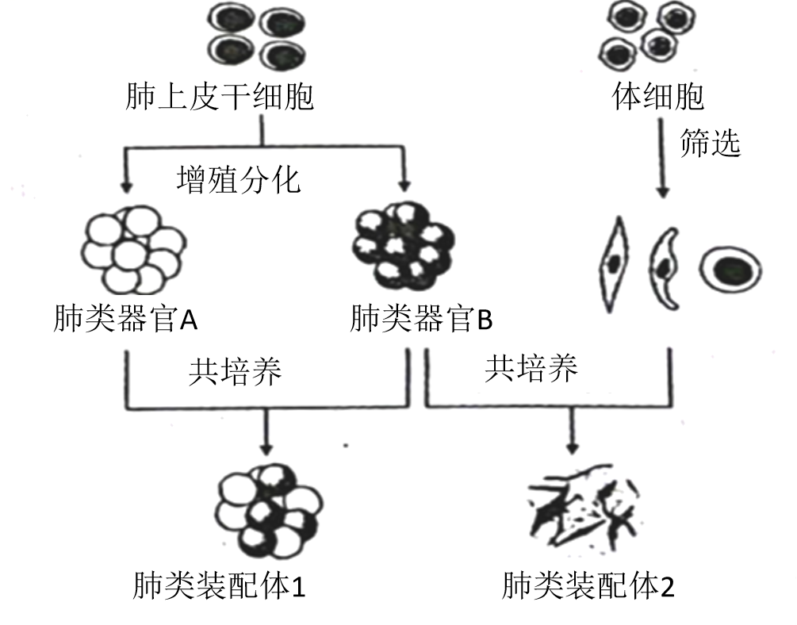

（5）耐甲氧西林金黄色葡萄球菌（MRSA）是一种耐药菌，严重危害人类健康。科研人员拟用MRSA感染肺类装配体建立感染模型，来探究解淀粉芽孢杆菌H抗菌肽是否对MRSA引起的肺炎有治疗潜力。以下实验材料中必备的是\_\_\_\_\_\_。

①金黄色葡萄球菌感染的肺类装配体 ②MRSA感染的肺类装配体 ③解淀粉芽孢杆菌H抗菌肽 ④生理盐水 ⑤青霉素（抗金黄色葡萄球菌的药物） ⑥万古霉素（抗MRSA的药物）
