**2023年普通高中学业水平选择性考试（湖南卷）生物**

**一、选择题：本题共12小题，在每小题给出的四个选项中，只有一项是符合题目要求的。**

1\. 南极雌帝企鹅产蛋后，由雄帝企鹅负责孵蛋，孵蛋期间不进食。下列叙述错误的是（ ）

A. 帝企鹅蛋的卵清蛋白中N元素的质量分数高于C元素

B. 帝企鹅的核酸、多糖和蛋白质合成过程中都有水的产生

C. 帝企鹅蛋孵化过程中有mRNA和蛋白质种类的变化

D. 雄帝企鹅孵蛋期间主要靠消耗体内脂肪以供能

【答案】A

【解析】

【分析】糖类是主要能源物质，脂肪是良好的储能物质，ATP是直接能源物质。

【详解】A、帝企鹅蛋的卵清蛋白中N元素的质量分数低于C元素，A错误；

B、核酸、糖原、蛋白质的合成都经历了“脱水缩合”过程，故都有水的产生，B正确；

C、帝企鹅蛋孵化过程涉及基因的选择性表达，故帝企鹅蛋孵化过程有mRNA和蛋白质种类的变化，C正确；

D、脂肪是良好的储能物质，雄帝企鹅孵蛋期间不进食，主要靠消耗体内脂肪以供能，D正确。

故选A。

2\. 关于细胞结构与功能，下列叙述错误的是（ ）

A. 细胞骨架被破坏，将影响细胞运动、分裂和分化等生命活动

B. 核仁含有DNA、RNA和蛋白质等组分，与核糖体的形成有关

C. 线粒体内膜含有丰富的酶，是有氧呼吸生成CO2的场所

D. 内质网是一种膜性管道系统，是蛋白质的合成、加工场所和运输通道

【答案】C

【解析】

【分析】细胞骨架是真核细胞中由蛋白质聚合而成的三维的纤维状网架体系。细胞骨架具有锚定支撑细胞器及维持细胞形态的功能，细胞骨架在细胞分裂、细胞生长、细胞物质运输、细胞壁合成等等许多生命活动中都具有非常重要的作用。

【详解】A、细胞骨架与细胞运动、分裂和分化等生命活动密切相关，故细胞骨架破坏会影响到这些生命活动的正常进行，A正确；

B、核仁含有DNA、RNA和蛋白质等组分，核仁与某种RNA的合成以及核糖体的形成有关，B正确；

C、有氧呼吸生成CO2的场所是线粒体基质，C错误；

D、内质网是由膜连接而成的网状结构，是一种膜性管道系统，是蛋白质的合成、加工场所和运输通道，D正确。

故选C。

3\. 酗酒危害人类健康。乙醇在人体内先转化为乙醛，在乙醛脱氢酶2（ALDH2）作用下再转化为乙酸，最终转化成CO2和水。头孢类药物能抑制ALDH2的活性。ALDH2基因某突变导致ALDH2活性下降或丧失。在高加索人群中该突变的基因频率不足5%，而东亚人群中高达30%。下列叙述错误的是（ ）

A. 相对于高加索人群，东亚人群饮酒后面临的风险更高

B. 患者在服用头孢类药物期间应避免摄入含酒精的药物或食物

C. ALDH2基因突变人群对酒精耐受性下降，表明基因通过蛋白质控制生物性状

D. 饮酒前口服ALDH2酶制剂可催化乙醛转化成乙酸，从而预防酒精中毒

【答案】D

【解析】

【分析】1、基因可以通过控制酶的合成控制细胞代谢进而控制生物的性状，也可能通过控制蛋白质的结构直接控制生物的性状。

2、基因突变是基因中由于碱基对的增添、缺失或替换而引起的基因结构的改变。基因突变包括显性突变和隐性突变，隐性纯合子发生显性突变，一旦出现显性基因就会出现显性性状:显性纯合子发生隐性突变，突变形成的杂合子仍然是显性性状，只有杂合子自交后代才出现隐性性状。

【详解】A、ALDH2基因某突变会使ALDH2活性下降或丧失，使乙醛不能正常转化成乙酸，导致乙醛积累危害机体，东亚人群中ALDH2基因发生该种突变的频率较高，故与高加索人群相比，东亚人群饮酒后面临的风险更高，A正确；

B、头孢类药物能抑制ALDH2的活性，使乙醛不能正常转化成乙酸，导致乙醛积累危害机体，故患者在服用头孢类药物期间应避免摄人含酒精的药物或食物，B正确；

C、ALDH2基因突变人群对酒精耐受性下降，表明基因通过控制酶的合成来控制代谢过程，进而控制生物体的性状，乙醛脱氢酶2的化学本质是蛋白质，C正确；

D、酶制剂会被胃蛋白酶消化，故饮酒前口服ALDH2酶制剂不能催化乙醛分解为乙酸，不能预防酒精中毒，D错误。

故选D。

4\. “油菜花开陌野黄，清香扑鼻蜂蝶舞。”菜籽油是主要的食用油之一，秸秆和菜籽饼可作为肥料还田。下列叙述错误的是（ ）

A. 油菜花通过物理、化学信息吸引蜂蝶

B. 蜜蜂、蝴蝶和油菜之间存在协同进化

C. 蜂蝶与油菜的种间关系属于互利共生

D. 秸秆和菜籽饼还田后可提高土壤物种丰富度

【答案】C

【解析】

【分析】协同进化是指不同物种之间、生物与无机环境之间在相互影响中不断进化和发展。

生物的种间关系有：种间竞争、捕食、原始合作、互利共生、寄生。

【详解】A、油菜花可以通过花的颜色（物理信息）和香味（化学信息）吸引蜂蝶，A正确；

B、协同进化是指不同物种之间、生物与无机环境之间在相互影响中不断进化和发展，蜜蜂、蝴蝶和油菜之间存在协同进化，B正确；

C、蜂蝶与油菜的种间关系属于原始合作，C错误；

D、秸秆和菜籽饼可以为土壤中的小动物和微生物提供有机物，故二者还田后可以提高土壤物种丰富度，D正确。

故选C。

5\. 食品保存有干制、腌制、低温保存和高温处理等多种方法。下列叙述错误的是（ ）

A. 干制降低食品的含水量，使微生物不易生长和繁殖，食品保存时间延长

B. 腌制通过添加食盐、糖等制造高渗环境，从而抑制微生物的生长和繁殖

C. 低温保存可抑制微生物的生命活动，温度越低对食品保存越有利

D. 高温处理可杀死食品中绝大部分微生物，并可破坏食品中的酶类

【答案】C

【解析】

【分析】食物腐败变质是由于微生物的生长和大量繁殖而引起的，根据食物腐败变质的原因，食品保存就要尽量的杀死或抑制微生物的生长和大量繁殖。

【详解】A、干制能降低食品中的含水量，使微生物不易生长和繁殖，进而延长食品保存时间，A正确；

B、腌制过程中添加食盐、糖等可制造高渗环境，从而微生物的生长和繁殖，B正确；

C、低温保存可以抑制德生物的生命活动，但不是温度越低越好，一般果蔬的保存温度为零上低温，C错误；

D、高温处理可杀死食品中绝大部分微生物，并通过破坏食品中的酶类，降低酶类对食品有机物的分解，有利于食品保存，D正确。

故选C。

6\. 甲状旁腺激素（PTH）和降钙素（CT）可通过调节骨细胞活动以维持血钙稳态，如图所示。下列叙述错误的是（ ）

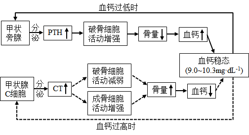

A. CT可促进成骨细胞活动，降低血钙

B. 甲状旁腺功能亢进时，可引起骨质疏松

C. 破骨细胞活动异常增强，将引起CT分泌增加

D. 长时间的高血钙可导致甲状旁腺增生

【答案】D

【解析】

【分析】甲状腺激素能够提高神经神经系统的兴奋性，提高代谢水平，还可以促进促进中枢神经系统发育。

【详解】A、由题图可知，CT增加，使成骨细胞活动增强，导致骨量增加，使血钙下降，A正确；

B、由题图可知，甲状旁腺功能亢进，则PTH增加，破骨细胞活动增强，使骨量下降，引起骨质疏松，B正确；

C、由题图可知，破骨细胞活动异常增强，会导致血钙异常升高，通过负反馈调节使甲状腺C细胞分泌CT增加，C正确；

D、由题图可知，长时间高血钙，会引起负反馈调节，促进甲状腺C细胞分泌增加，而非甲状旁腺增生，D错误。

故选D。

7\. 基因Bax和Bd-2分别促进和抑制细胞凋亡。研究人员利用siRNA干扰技术降低TRPM7基因表达，研究其对细胞凋亡的影响，结果如图所示。下列叙述错误的是（ ）

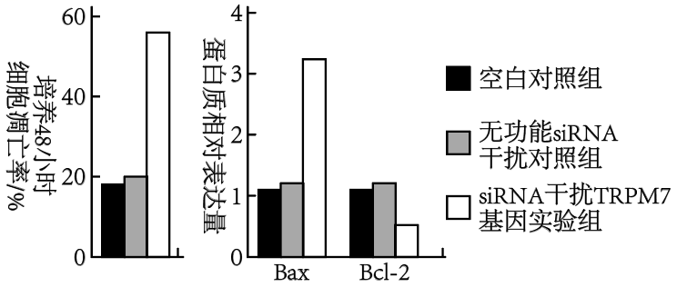

A. 细胞衰老和细胞凋亡都受遗传信息的调控

B. TRPM7基因可能通过抑制Bax基因的表达来抑制细胞凋亡

C. TRPM7基因可能通过促进Bcl-2基因的表达来抑制细胞凋亡

D. 可通过特异性促进癌细胞中TRPM7基因的表达来治疗相关癌症

【答案】D

【解析】

【分析】细胞凋亡是由基因决定的细胞编程序死亡的过程。细胞凋亡是生物体正常发育的基础，能维持组织细胞数目的相对稳定，是机体的一种自我保护机制。在成熟的生物体内，细胞的自然更新、被病原体感染的细胞的清除，是通过细胞凋亡完成的。

【详解】A、细胞衰老和细胞凋亡都是由基因控制的细胞正常的生命活动，都受遗传信息的调控，A正确；

B、据题图可知，siRNA干扰TRPM7基因实验组的TRPM7基因表达量下降，Bax基因表达量增加，细胞凋亡率增加，由此可以得出，TRPM7基因可能通过抑制Bas基因的表达来抑制细胞凋亡，B正确；

C、siRNA干扰TRPM7基因实验组细胞凋亡率高，Bcl-2基因表达量降低，而Bcl-2基因抑制细胞凋亡，故TRPM7基因可能通过促进Bel-2基因的表达来抑制细胞凋亡，C正确；

D、由题图可知，siRNA干扰TRPM7基因实验组，Bax基因表达量增加，Bdl-2基因表达量减少，细胞凋亡率增加，所以可以通过抑制癌细胞中TRPM7基因表达来治疗相关癌症，D错误。

故选D。

8\. 盐碱胁迫下植物应激反应产生的H2O2对细胞有毒害作用。禾本科农作物AT1蛋白通过调节细胞膜上PIP2s蛋白磷酸化水平，影响H2O2的跨膜转运，如图所示。下列叙述错误的是（ ）

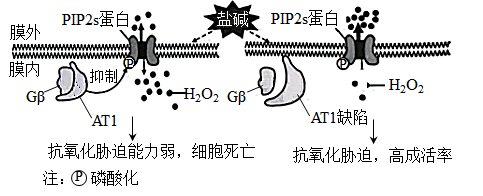

A. 细胞膜上PIP2s蛋白高磷酸化水平是其提高H2O2外排能力所必需的

B. PIP2s蛋白磷酸化被抑制，促进H2O2外排，从而减轻其对细胞的毒害

C. 敲除AT1基因或降低其表达可提高禾本科农作物的耐盐碱能力

D. 从特殊物种中发掘逆境胁迫相关基因是改良农作物抗逆性的有效途径

【答案】B

【解析】

【分析】分析题图：AT1蛋白通过抑制PIP2s蛋白的磷酸化而抑制细胞内的H2O2排到细胞外，从而导致植物抗氧化胁迫能力减弱，进而引起细胞死亡。AT1蛋白缺陷，可以提高PIP2s蛋白的磷酸化水平，促进细胞内的H2O2排到细胞外，从而提高植物抗氧化的胁迫能力，进而提高细胞的成活率。

【详解】A、由题图右侧的信息可知，AT1蛋白缺陷，可以促进PIP2s蛋白的磷酸化，进而促进H2O2排出膜外，A正确；

B、据题图左侧的信息可知，AT1蛋白能够抑制PIP2s蛋白的磷酸化，减少了H2O2从细胞内输出到细胞外的量，导致抗氧化胁迫能力弱，不能减轻其对细胞的毒害，B错误；

C、结合对A选项分析可推测，敲除AT1基因或降低其表达，可提高禾本科农作物抗氧化胁迫的能力，进而提高其成活率，C正确；

D、从特殊物种中发掘逆境胁迫相关基因，可通过基因工程技术改良农作物抗逆性，D正确。

故选B。

9\. 某X染色体显性遗传病由SHOX基因突变所致，某家系中一男性患者与一正常女性婚配后，生育了一个患该病的男孩。究其原因，不可能的是（ ）

A. 父亲的初级精母细胞在减数分裂I四分体时期，X和Y染色体片段交换

B. 父亲的次级精母细胞在减数分裂Ⅱ后期，性染色体未分离

C. 母亲的卵细胞形成过程中，SHOX基因发生了突变

D. 该男孩在胚胎发育早期，有丝分裂时SHOX基因发生了突变

【答案】B

【解析】

【分析】减数分裂过程：

（1）减数第一次分裂前的间期：染色体的复制。

（2）减数第一次分裂：①前期：联会，同源染色体上的非姐妹染色单体互换；②中期：同源染色体成对的排列在赤道板上；③后期：同源染色体分离，非同源染色体自由组合；④末期：细胞质分裂。

（3）减数第二次分裂：①前期：染色体散乱的排布与细胞内；②中期：染色体形态固定、数目清晰；③后期：着丝粒分裂，姐妹染色单体分开成为染色体，并均匀地移向两极；④末期：核膜、核仁重建、纺锤体和染色体消失。

【详解】A、假设X染色体上的显性致病基因为A，非致病基因为a，若父亲的初级精母细胞在减数分裂I四分体时期，X染色体上含显性致病基因的片段和Y染色体片段互换，导致Y染色体上有显性致病基因，从而生出基因型为XaYA的患病男孩，A不符合题意；

B、若父亲的次级精母细胞在减数分裂Ⅱ后期是姐妹染色单体未分离，则会形成基因型为XAXA或YY的精子，从而生出基因型为XaYY的不患病男孩，B符合题意；

C、因为基因突变是不定向的，母亲的卵细胞形成时SHOX基因可能已经突变成显性致病基因，从而生出基因型为XAY的患病男孩，C不符合题意；

D、若SHOX基因突变成显性致病基因发生在男孩胚胎发育早期，也可能导致致该男孩出现XAY的基因型，D不符合题意。

故选B。

10\. 关于激素、神经递质等信号分子，下列叙述错误的是（ ）

A. 一种内分泌器官可分泌多种激素

B. 一种信号分子可由多种细胞合成和分泌

C. 多种信号分子可协同调控同一生理功能

D. 激素发挥作用的前提是识别细胞膜上的受体

【答案】D

【解析】

【分析】神经调节、体液调节和免疫调节的实现都离不开信号分子（如神经递质、激素和细胞因子等），这些信号分子的作用方式，都是直接与受体接触。受体一般是蛋白质分子，不同受体的结构各异，因此信号分子与受体的结合具有特异性。

【详解】A、一种内分泌器官可分泌多种激素，如垂体分泌促甲状腺激素、促性腺激素、促肾上腺皮质激素和生长激素等，A正确；

B、一种信号分子可由多种细胞合成和分泌，如氨基酸类神经递质（如谷氨酸、甘氨酸），B正确；

C、多种信号分子可协同调控同一生理功能，如胰岛素和胰高血糖素参与血糖平衡调节，C正确；

D、激素发挥作用的前提是识别细胞的受体，但不一定是位于细胞膜上的受体，某些激素的受体在细胞内部，D错误。

故选D。

11\. 某少年意外被锈钉扎出一较深伤口，经查体内无抗破伤风的抗体。医生建议使用破伤风类毒素（抗原）和破伤风抗毒素（抗体）以预防破伤风。下列叙述正确的是（ ）

A. 伤口清理后，须尽快密闭包扎，以防止感染

B. 注射破伤风抗毒素可能出现的过敏反应属于免疫防御

C. 注射破伤风类毒素后激活的记忆细胞能产生抗体

D. 有效注射破伤风抗毒素对人体的保护时间长于注射破伤风类毒素

【答案】B

【解析】

【分析】体液免疫中的三个“唯一”：唯一能产生抗体的细胞是浆细胞；唯一没有识别功能的细胞是浆细胞；唯一没有特异性识别功能的细胞是吞噬细胞。

【详解】A、破伤风杆菌是厌氧菌，伤口清理后，若密闭包扎会导致破伤风杆菌大量繁殖，使病情加重，A错误；

B、注射破伤风抗毒素出现的过敏反应是机体排除外来异物的一种免疫防护功能，属于免疫防御，B正确；

C、注射破伤风类毒素（抗原）,能激活产生记忆细胞，抗体是浆细胞产生的，C错误；

D、有效注射破伤风抗毒素（抗体），发生的是被动免疫，保护时间较短，而注射破伤风类毒素（抗原），发生的是主动免疫，能激活产生记忆细胞，保护时间较长，D错误。

故选B。

12\. 细菌glg基因编码的UDPG焦磷酸化酶在糖原合成中起关键作用。细菌糖原合成的平衡受到CsrAB系统的调节。CsrA蛋白可以结合glg mRNA分子，也可结合非编码RNA分子CsrB,如图所示。下列叙述错误的是（ ）

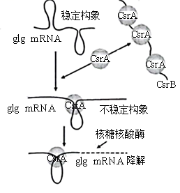

A. 细菌glg基因转录时，RNA聚合酶识别和结合glg基因的启动子并驱动转录

B. 细菌合成UDPG焦磷酸化酶的肽链时，核糖体沿glg mRNA从5'端向3'端移动

C. 抑制CsrB基因的转录能促进细菌糖原合成

D. CsrA蛋白都结合到CsrB上，有利于细菌糖原合成

【答案】C

【解析】

【分析】转录主要发生在细胞核中，需要的条件：（1）模板：DNA的一条链；（2）原料：四种核糖核苷酸；（3）酶：RNA聚合酶；（4）能量(ATP)。

【详解】A、基因转录时，RNA聚合酶识别并结合到基因的启动子区域从而启动转录，A正确；

B、基因表达中的翻译是核糖体沿着mRNA的5'端向3'端移动，B正确；

C、由题图可知，抑制CsrB基因转录会使CsrB的RNA减少，使CsrA更多地与glg mRNA结合形成不稳定构象，最终核糖核酸酶会降解glg mRNA，而glg基因编码的UDPG焦磷酸化酶在糖原合成中起关键作用，故抑制CxrB基因的转录能抑制细菌糖原合成，C错误；

D、由题图及C选项分析可知，若CsrA都结合到CsrB上，则CsrA没有与glg mRNA结合，从而使glg mRNA不被降解而正常进行，有利于细菌糖原的合成，D正确。

故选C。

**二、选择题：本题共4小题，在每小题给出的四个选项中，有一项或多项符合题目要求。**

13\. 党的二十大报告指出：我们要推进美丽中国建设，坚持山水林田湖草沙一体化保护和系统治理，统筹产业结构调整、污染治理、生态保护，应对气侯变化，协同推进降碳、减污、扩绿、增长，推进生态优先、节约集约、绿色低碳发展。下列叙述错误的是（ ）

A. 一体化保护有利于提高生态系统的抵抗力稳定性

B. 一体化保护体现了生态系统的整体性和系统性

C. 一体化保护和系统治理有助于协调生态足迹与生态承载力的关系

D. 运用自生原理可以从根本上达到一体化保护和系统治理

【答案】D

【解析】

【分析】1、生态系统的抗力稳定性是指生态系统抵抗外界干扰并使自身的结构与功能保持原状的能力。生态系统的成分越单纯，营养结构越简单，自我调节能力就越弱，抵抗力稳定性就越低，反之则越高。

2、生态工程以生态系统的自组织、自我调节功能为基础，遵循着整体、协调、循环、自生等生态学基本原理。

3、生态足迹又叫生态占用，是指在现有技术条件下维持某一人口单位生存所需的生产资源和吸纳废物的土地及水域的面积；生态承载力代表了地球提供资源的能力。

【详解】A、生态系统的组分越多，食物链、食物网越复杂，自我调节能力就越强，抵抗力稳定性就越高，所以一体化保护有利于提高生态系统的抵抗力稳定性，A正确；

B、生态工程是指人类应用生态学和系统学等学科的基本原理和方法，促进人类社会与自然环境和谐发展的系统工程技术或综合工艺过程，且几乎每个复杂的生态工程建设都以整体观为指导，所以一体化保护体现了生态系统的整体性和系统性，B正确；

C、生态足迹又称生态占用，指在现有技术条件下，维持某一人口单位生存所需的生产资源和吸纳废物的土地及水域面积，生态承载力代表了地球提供资源的能力，一体化保护和系统治理有助于协调生态足迹与生态承载力的关系，C正确；

D、综合运用自生、整体、协调、循环等生态学基本原理可以从根本上达到一体化保护和系统治理，仅运用自生原理很难达到，D错误。

故选D。

14\. 盐碱化是农业生产的主要障碍之一。植物可通过质膜H+泵把Na+排出细胞，也可通过液泡膜H+泵和液泡膜NHX载体把Na+转入液泡内，以维持细胞质基质Na+稳态。下图是NaCl处理模拟盐胁迫，钒酸钠（质膜H+泵的专一抑制剂）和甘氨酸甜菜碱（GB）影响玉米Na+的转运和相关载体活性的结果。下列叙述正确的是（ ）

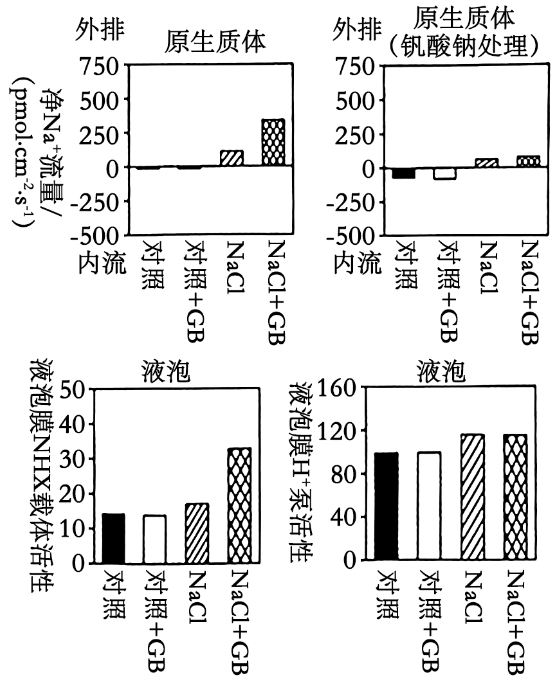

A. 溶质的跨膜转运都会引起细胞膜两侧渗透压的变化

B. GB可能通过调控质膜H+泵活性增强Na+外排，从而减少细胞内Na+的积累

C. GB引起盐胁迫下液泡中Na+浓度的显著变化，与液泡膜H+泵活性有关

D. 盐胁迫下细胞质基质Na+排出细胞或转入液泡都能增强植物的耐盐性

【答案】BD

【解析】

【分析】分析上两个题图可知，NaCl胁迫时，加GB使Na+外排显著增加，钒酸钠处理抑制了质膜H+泵后，NaCl胁迫时，加GB使Na+外排略微增加；分析下两个题图可知，NaCl胁迫时，加GB使液泡膜NHX载体活性明显增强，而液泡膜H+泵活性几乎无变化，所以GB引起盐胁迫时液泡中Na+浓度的显著变化，与液泡膜NHX载体活性有关，而与液泡膜H+泵活性无关。

【详解】A、溶质的跨膜转运不一定都会引起细胞膜两侧的渗透压变化，如正常细胞为维持渗透压一直在进行的跨膜转运，再如单细胞生物在跨膜转运时，细胞外侧渗透压几乎很难改变，A错误；

B、对比分析上两个题图可知，NaCl胁迫时，加GB使Na+外排显著增加，钒酸钠处理抑制了质膜H+泵后，NaCl胁迫时，加GB使Na+外排略微增加，说明GB可能通过调控质膜H+泵活性来增强Na+外排，从而减少细胞内Na+的积累，B正确；

C、对比分析下两个题图可知，NaCl胁迫时，加GB使液泡膜NHX载体活性明显增强，而液泡膜H+泵活性几乎无变化，所以GB引起盐胁迫时液泡中Na+浓度的显著变化，与液泡膜NHX载体活性有关，而与液泡膜H+泵活性无关，C错误；

D、由题意可知，植物通过质膜H+泵把Na+排出细胞，也可通过液泡膜NHX载体和液泡膜H+泵把Na+转入液泡内，以维持细胞质基质Na+稳态，增强植物的耐盐性，D正确。

故选BD。

15\. 为精细定位水稻4号染色体上的抗虫基因，用纯合抗虫水稻与纯合易感水稻的杂交后代多次自交，得到一系列抗虫或易感水稻单株。对亲本及后代单株4号染色体上的多个不连续位点进行测序，部分结果按碱基位点顺序排列如下表。据表推测水稻同源染色体发生了随机互换，下列叙述正确的是（ ）

<table style="width:70%;">
<colgroup>
<col style="width: 4%" />
<col style="width: 9%" />
<col style="width: 8%" />
<col style="width: 7%" />
<col style="width: 7%" />
<col style="width: 8%" />
<col style="width: 10%" />
<col style="width: 13%" />
</colgroup>
<thead>
<tr>
<th></th>
<th colspan="6" style="text-align: center;">…位点1…位点2…位点3…位点4…位点5…位点6…</th>
<th style="text-align: center;"></th>
</tr>
</thead>
<tbody>
<tr>
<td rowspan="5">测序结果</td>
<td style="text-align: center;">A/A</td>
<td style="text-align: center;">A/A</td>
<td style="text-align: center;">A/A</td>
<td style="text-align: center;">A/A</td>
<td style="text-align: center;">A/A</td>
<td style="text-align: center;">A/A</td>
<td style="text-align: center;">
纯合抗虫

水稻亲本
</td>
</tr>
<tr>
<td style="text-align: center;">G/G</td>
<td style="text-align: center;">G/G</td>
<td style="text-align: center;">G/G</td>
<td style="text-align: center;">G/G</td>
<td style="text-align: center;">G/G</td>
<td style="text-align: center;">G/G</td>
<td style="text-align: center;">
纯合易感

水稻亲本
</td>
</tr>
<tr>
<td style="text-align: center;">G/G</td>
<td style="text-align: center;">G/G</td>
<td style="text-align: center;">A/A</td>
<td style="text-align: center;">A/A</td>
<td style="text-align: center;">A/A</td>
<td style="text-align: center;">A/A</td>
<td style="text-align: center;">抗虫水稻1</td>
</tr>
<tr>
<td style="text-align: center;">A/G</td>
<td style="text-align: center;">A/G</td>
<td style="text-align: center;">A/G</td>
<td style="text-align: center;">A/G</td>
<td style="text-align: center;">A/G</td>
<td style="text-align: center;">G/G</td>
<td style="text-align: center;">抗虫水稻2</td>
</tr>
<tr>
<td style="text-align: center;">A/G</td>
<td style="text-align: center;">G/G</td>
<td style="text-align: center;">G/G</td>
<td style="text-align: center;">G/G</td>
<td style="text-align: center;">G/G</td>
<td style="text-align: center;">A/A</td>
<td style="text-align: center;">易感水稻1</td>
</tr>
</tbody>
</table>

A. 抗虫水稻1的位点2-3之间发生过交换

B. 易感水稻1的位点2-3及5-6之间发生过交换

C. 抗虫基因可能与位点3、4、5有关

D. 抗虫基因位于位点2-6之间

【答案】CD

【解析】

【分析】同源染色体上的非姐妹染色单体之间发生互换，这会导致基因重组。

【详解】AB、根据表格分析，纯合抗虫水稻亲本6个位点都是A/A，纯合易感水稻亲本6个位点都是G/G，抗虫水稻1的位点1和2都变成了G/G，则位点2-3之间可能发生过交换，也可能是位点1-3之间发生交换，易感水稻1的位点6变为A/A，则位点2-3之间未发生交换，5-6之间可能发生过交换，A、B错误；

CD、由题表分析可知，抗虫水稻的相同点为在位点3-5 中都至少有一条DNA有A-T碱基对，即位点2-6之间没有发生变化则表现为抗虫，所以抗虫基因可能位于2-6之间，或者说与位点3、4、5有关，C、D正确。

故选CD。

16\. 番茄果实发育历时约53天达到完熟期，该过程受脱落酸和乙烯的调控，且果实发育过程中种子的脱落酸和乙烯含量达到峰值时间均早于果肉。基因NCEDI和AC01分别是脱落酸和乙烯合成的关键基因。NDGA抑制NCED1酶活性，1-MCP抑制乙烯合成。花后40天果实经不同处理后果实中脱落酸和乙烯含量的结果如图所示。下列叙述正确的是（ ）

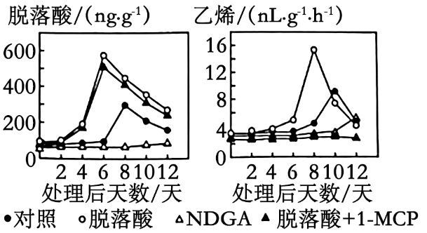

A. 番茄种子的成熟期早于果肉，这种发育模式有利于种群的繁衍

B. 果实发育过程中脱落酸生成时，果实中必需有NCEDI酶的合成

C. NCED1酶失活，ACO1基因的表达可能延迟

D. 脱落酸诱导了乙烯的合成，其诱导效应可被1-MCP消除

【答案】ACD

【解析】

【分析】脱落酸能抑制植物细胞的分裂和种子的萌发；促进植物进入休眠；促进叶和果实的衰老、脱落。乙烯可促进果实成熟；促进器官的脱落。

【详解】A、种子的成熟期早于果肉，能确保果实成熟后被传播时的种子也是成熟的，有利于种群的繁衍，A正确；

B、由题干信息可知，基因NCED1是脱落酸合成的关键基因，且由左题图分析可知，NCED1酶活性被抑制时几乎没有脱落酸，所以只能说明脱落酸的生成必须有NCED1酶的作用，但不能说明脱落酸合成的同时就必须有NCED1酶的合成，B错误；

C、基因ACOI是乙烯合成的关键基因，由右题图分析可知，NDGA组（抑制NCEDI酶）前10天乙烯含量都很少，第10-12天乙烯含量略有一点增加，后面时间乙烯含量未知，因此，NCED1酶失活，ACOI基因的表达可能延迟，C正确；

D、由右图分析可知，脱落酸组乙烯含量更多，所以可推测脱落酸诱导了乙烯合成，但脱落酸+1-MCP组乙烯含量极少，说明其诱导效应可被1-MCP消除，D正确。

故选ACD。

**三、非选择题：本题共5小题。**

17\. 下图是水稻和玉米的光合作用暗反应示意图。卡尔文循环的Rubisco酶对CO2的Km为450μmol·L-1（K越小，酶对底物的亲和力越大）,该酶既可催化RuBP与CO2反应，进行卡尔文循环，又可催化RuBP与O2反应，进行光呼吸（绿色植物在光照下消耗O2并释放CO2的反应）。该酶的酶促反应方向受CO2和O2相对浓度的影响。与水稻相比，玉米叶肉细胞紧密围绕维管束鞘，其中叶肉细胞叶绿体是水光解的主要场所，维管束鞘细胞的叶绿体主要与ATP生成有关。玉米的暗反应先在叶肉细胞中利用PEPC酶（PEPC对CO2的Km为7μmol·L-1）催化磷酸烯醇式丙酮酸（PEP）与CO2反应生成C4,固定产物C4转运到维管束鞘细胞后释放CO2,再进行卡尔文循环。回答下列问题：

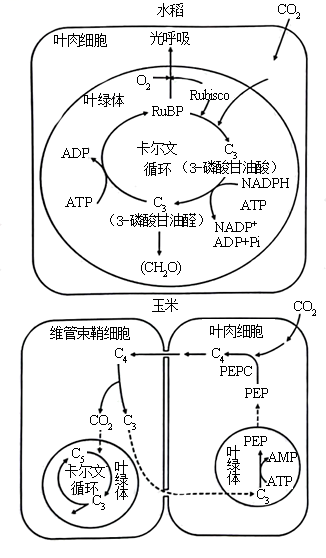

（1）玉米的卡尔文循环中第一个光合还原产物是\_\_\_\_\_\_（填具体名称）,该产物跨叶绿体膜转运到细胞质基质合成\_\_\_\_\_\_（填"葡萄糖""蔗糖"或"淀粉"）后，再通过\_\_\_\_\_长距离运输到其他组织器官。

（2）在干旱、高光照强度环境下，玉米的光合作用强度\_\_\_\_\_（填"高于"或"低于"）水稻。从光合作用机制及其调控分析，原因是 \_\_\_\_\_\_\_\_\_\_\_\_（答出三点即可）。

（3）某研究将蓝细菌的CO2浓缩机制导入水稻，水稻叶绿体中CO2浓度大幅提升，其他生理代谢不受影响，但在光饱和条件下水稻的光合作用强度无明显变化。其原因可能是\_\_\_\_\_\_\_\_\_\_\_\_\_（答出三点即可）。

【答案】（1） ①. 3-磷酸甘油醛 ②. 蔗糖 ③. 维管组织

（2） ①. 高于 ②. 高光照条件下玉米可以将光合产物及时转移；玉米的PEPC酶对CO2的亲和力比水稻的Rubisco酶更高；玉米能通过PEPC酶生成C4，使维管束鞘内的CO2浓度高于外界环境，抑制玉米的光呼吸

（3）酶的活性达到最大，对CO2的利用率不再提高；受到ATP以及NADPH等物质含量的限制；原核生物和真核生物光合作用机制有所不同

【解析】

【分析】本题主要考查的光合作用过程中的暗反应阶段，也就是卡尔文循环，绿叶通过气孔从外界吸收的 CO2，在特定酶的作用下，与 C5（一种五碳化合物）结合，这个过程称作 CO2 的固定。一分子的 CO2 被固定后，很快形成两个 C3 分子。在有关酶的催化作用下，C3 接受 ATP 和 NADPH 释放的能量，并且被 NADPH 还原。随后，一些接受能量并被还原的 C3，在酶的作用下经过一系列的反应转化为糖类；另一些接受能量并被还原的 C3，经过一系列变化，又形成 C5。这些 C5 又可以参与 CO2 的固定。这样，暗反应阶段就形成从 C5 到 C3再到 C5 的循环，可以源源不断地进行下去，因此暗反应过程也称作卡尔文循环。

【小问1详解】

玉米的光合作用过程与水稻相比，虽然CO2的固定过程不同，但其卡尔文循环的过程是相同的，结合水稻的卡尔文循环图解，可以看出CO2固定的直接产物是3-磷酸甘油酸，然后直接被还原成3-磷酸甘油醛。3-磷酸甘油醛在叶绿体中被转化成淀粉，在叶绿体外被转化成蔗糖，蔗糖是植物长距离运输的主要糖类，蔗糖在长距离运输时是通过维管组织。

【小问2详解】

干旱、高光强时会导致植物气孔关闭，吸收的CO2减少，而玉米的PEPC酶对CO2的亲和力比水稻的Rubisco酶更高；玉米能通过PEPC酶生成C4，使维管束鞘内的CO2浓度高于外界环境，抑制玉米的光呼吸；且玉米能将叶绿体内的光合产物通过维管组织及时转移出细胞。因此在干旱、高光照强度环境下，玉米的光合作用强度高于水稻。

【小问3详解】

将蓝细菌的CO2浓缩机制导入水稻叶肉细胞，只是提高了叶肉细胞内的CO2浓度，而植物的光合作用强度受到很多因素的影响；在光饱和条件下如果光合作用强度没有明显提高，可能是水稻的酶活性达到最大，对CO2的利用率不再提高，或是受到ATP和NADPH等物质含量的限制，也可能是因为蓝细菌是原核生物，水稻是真核生物，二者的光合作用机制有所不同。

18\. 长时程增强（LTP）是突触前纤维受到高频刺激后，突触传递强度增强且能持续数小时至几天的电现象，与人的长时记忆有关。下图是海马区某侧支LTP产生机制示意图，回答下列问题：

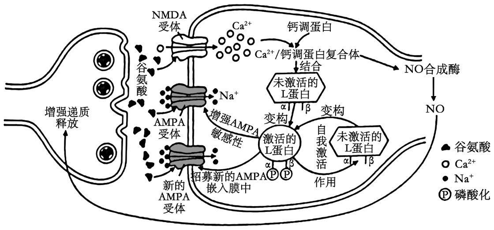

（1）依据以上机制示意图，LTP的发生属于\_\_\_\_\_\_ （填“正”或“负”）反馈调节。

（2）若阻断NMDA受体作用，再高频刺激突触前膜，未诱发LTP，但出现了突触后膜电现象。据图推断，该电现象与\_\_\_\_\_\_\_内流有关。

（3）为了探讨L蛋白的自身磷酸化位点（图中α位和β位）对L蛋白自我激活的影响，研究人员构建了四种突变小鼠甲、乙、丙和丁，并开展了相关实验，结果如表所示：

<table>
<colgroup>
<col style="width: 15%" />
<col style="width: 6%" />
<col style="width: 20%" />
<col style="width: 25%" />
<col style="width: 19%" />
<col style="width: 11%" />
</colgroup>
<thead>
<tr>
<th rowspan="2">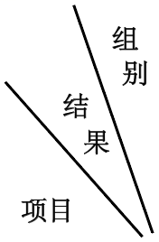</th>
<th rowspan="2">
正常

小鼠
</th>
<th>甲</th>
<th>乙</th>
<th>丙</th>
<th>丁</th>
</tr>
<tr>
<th>α位突变为缬氨酸，该位点不发生自身磷酸化</th>
<th>α位突变为天冬氨酸，阻断Ca2+/钙调蛋白复合体与L蛋白结合</th>
<th>β位突变为丙氨酸，该位点不发生自身磷酸化</th>
<th>L蛋白编码基因确缺失</th>
</tr>
</thead>
<tbody>
<tr>
<td>L蛋白活性</td>
<td>+</td>
<td>++++</td>
<td>++++</td>
<td>+</td>
<td>-</td>
</tr>
<tr>
<td>高频刺激</td>
<td>有LTP</td>
<td>有LTP</td>
<td>?</td>
<td>无LTP</td>
<td>无LTP</td>
</tr>
</tbody>
</table>

注：“+”多少表示活性强弱，“-”表示无活性。

据此分析：

①小鼠乙在高频刺激后\_\_\_\_\_\_（填“有”或“无”）LTP现象，原因是\_\_\_\_\_\_\_\_\_\_\_ ;

②α位的自身磷酸化可能对L蛋白活性具有\_\_\_\_\_\_\_\_作用。

③在甲、乙和丁实验组中，无L蛋白β位自身磷酸化的组是\_\_\_\_\_\_\_\_\_\_。

【答案】（1）正 （2）Na+

（3） ①. 无 ②. 小鼠乙L蛋白突变后阻断了Ca2+/钙调蛋白复合体与L蛋白结合，则无法促进NO合成酶生成NO，进而无法形成LTP ③. 抑制 ④. 丁

【解析】

【分析】兴奋传导和传递的过程：

1、静息时，神经细胞膜对钾离子的通透性大，钾离子大量外流，形成内负外正的静息电位；受到刺激后，神经细胞膜的通透性发生改变，对钠离子的通透性增大，钠离子内流，形成内正外负的动作电位。兴奋部位和非兴奋部位形成电位差，产生局部电流，兴奋就以电信号的形式传递下去。

2、兴奋在神经元之间需要通过突触结构进行传递，突触包括突触前膜、突触间隙、突触后膜，具体的传递过程为：兴奋以电流的形式传导到轴突末梢时，突触小泡释放递质（化学信号），递质作用于突触后膜，引起突触后膜产生膜电位（电信号），从而将兴奋传递到下一个神经元。

【小问1详解】

由题图可以看出，突触前膜释放谷氨酸后，经过一系列的信号变化，会促进NO合成酶生成NO，进一步促进突触前膜释放更多谷氨酸，该过程属于正反馈调节。

【小问2详解】

阻断NMDA受体的作用，不能促进Ca2+内流，从而不能形成Ca2+/钙调蛋白复合体，不能促进NO合成酶合成NO，从而不能产生LTP，但是谷氨酸还可以与AMPA受体结合，促进Na+内流，从而引发电位变化。

【小问3详解】

①由题表数据可以看出，小鼠乙L蛋白突变后，阻断了Ca2+/钙调蛋白复合体与L蛋白结合，则无法促进NO合成酶生成NO，进而无法形成LTP。

②小鼠甲L蛋白的α位突变为缬氨酸以后，该位点不能发生自身磷酸化，与正常小鼠相比（α位可以发生自身磷酸化），L蛋白活性增强，说明α位发生自身磷酸化可能会对L蛋白的活性起到抑制作用。

③丁组小鼠L蛋白编码基因缺失，则不能形成L蛋白，无法发生L蛋白β位自身磷酸化

19\. 基因检测是诊断和预防遗传病的有效手段。研究人员采集到一遗传病家系样本，测序后发现此家系甲和乙两个基因存在突变：甲突变可致先天性耳聋；乙基因位于常染色体上，编码产物可将叶酸转化为N5-甲基四氢叶酸，乙突变与胎儿神经管缺陷（NTDs）相关；甲和乙位于非同源染色体上。家系患病情况及基因检测结果如图所示。不考虑染色体互换，回答下列问题：

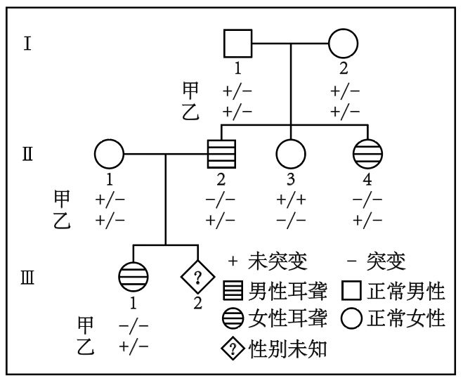

（1）此家系先天性耳聋的遗传方式是\_\_\_\_\_\_\_\_\_。1-1和1-2生育育一个甲和乙突变基因双纯合体女儿的概率是\_\_\_\_\_\_\_\_。

（2）此家系中甲基因突变如下图所示：

正常基因单链片段5'-ATTCCAGATC……（293个碱基）……CCATGCCCAG-3'

突变基因单链片段5'-ATTCCATATC……（293个碱基）……CCATGCCCAG-3'

研究人员拟用PCR扩增目的基因片段，再用某限制酶（识别序列及切割位点为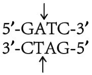 ）酶切检测甲基因突变情况，设计了一条引物为5′-GGCATG-3'，另一条引物为\_\_\_\_\_\_\_\_\_（写出6个碱基即可）。用上述引物扩增出家系成员Ⅱ-1的目的基因片段后，其酶切产物长度应为\_\_\_\_\_\_\_\_bp（注：该酶切位点在目的基因片段中唯一）。

（3）女性的乙基因纯合突变会增加胎儿NTDs风险。叶酸在人体内不能合成，孕妇服用叶酸补充剂可降低NTDs的发生风险。建议从可能妊娠或孕前至少1个月开始补充叶酸，一般人群补充有效且安全剂量为0.4~1.0mg.d-1，NTDs生育史女性补充4mg.d-1。经基因检测胎儿（Ⅲ-2）的乙基因型为-/-，据此推荐该孕妇（Ⅱ-1）叶酸补充剂量为\_\_\_\_\_mg.d-1。

【答案】（1） ①. 常染色体隐性遗传病 ②. 1/32

（2） ①. 5'-TAAGGT-3' ②. 8和302

（3）4

【解析】

【分析】基因分离定律和自由组合定律的实质：进行有性生殖的生物在进行减数分裂产生配子的过程中，位于同源染色体上的等位基因随同源染色体分离而分离，分别进入不同的配子中。随配子独立遗传给后代，同时位于非同源染色体上的非等位基因进行自由组合

【小问1详解】

由遗传系谱图可知，由于I-1与I-2均表现正常，他们关于甲病的基因型均为+/-，而他们的女儿Ⅱ-4患病，因此可判断甲基因突变导致的先天性耳聋是常染色体隐性遗传病，由I-1、I-2和Ⅱ-3关于乙病的基因可以推出乙基因突变导致的遗传病也是常染色体隐性遗传病，所以I-1和I-2生出一个甲和乙突变基因双纯合体女儿的概率为1/4×1/4×1/2=1/32 。

【小问2详解】

本题研究甲基因突变情况，二代1为杂合子，兼有正常甲基因和突变甲基因。目的基因为甲基因，扩增引物应为两基因共有的TAAGGT。可扩增出大量正常甲基因和突变甲基因供后续鉴定。此时酶切，正常甲基因酶切后片段为8和2+293+7=302bp,突变甲基因无法被酶切，故不写。后续可通过电泳等手段区分开，达到检测甲基因突变情况的目的。

【小问3详解】

Ⅲ-2关于乙的基因型为-/-，有患NTDs的可能，因此推荐该孕妇（Ⅱ-1）叶酸补充剂量为4mg·d-1。

20\. 濒危植物云南红豆杉（以下称红豆杉）是喜阳喜湿高大乔木，郁闭度对其生长有重要影响。研究人员对某区域无人为干扰生境和人为干扰生境的红豆杉野生种群开展了调查研究。选择性采伐和放牧等人为干扰使部分上层乔木遭破坏，但尚余主要上层乔木，保持原有生境特点。无人为干扰生境下红豆杉野生种群年龄结构的调查结果如图所示。回答下列问题：

（1）调查红豆杉野生种群密度时，样方面积最合适的是400m2,理由是\_\_\_\_\_。由图可知，无人为干扰生境中红豆杉种群年龄结构类型为\_\_\_\_\_\_\_。

（2）调查发现人为干扰生境中，树龄≤5年幼苗的比例低于无人为干扰生境，可能的原因是\_\_\_\_\_\_\_\_\_。分析表明，人为干扰生境中6~25年树龄红豆杉的比例比无人为干扰生境高11%可能的原因是\_\_\_\_\_\_\_\_\_\_\_\_\_\_\_。选择性采伐与红豆杉生态位重叠度\_\_\_\_\_\_\_（填“高”或“低”）的部分植物，有利于红豆杉野生种群的自然更新。

（3）关于红豆杉种群动态变化及保护的说法，下列叙述正确的是（ ）

①选择性采伐和放牧等会改变红豆杉林的群落结构和群落演替速度

②在无人为干扰生境中播撒红豆杉种子将提高6~25年树龄植株的比例

③气温、干旱和火灾是影响红豆杉种群密度的非密度制约因素

④气候变湿润后可改变红豆杉的种群结构并增加种群数量

⑤保护红豆杉野生种群最有效的措施是人工繁育

【答案】（1） ①. 红豆杉属于高大乔木，且是濒危植物\
②. 增长型

（2） ①. 选择性采伐和放牧等人为干扰使部分上层乔木遭破坏，导致郁闭度下降，土壤湿度下降不利于幼苗的生长\
②. 人为干扰生境下6~25年树龄的个体获得更多的阳光，有利于其生长\
③. 高

（3）①③④

【解析】

【分析】样方法也是调查种群密度的常用方法：

1、具体方法：在被调查种群的分布范围内，随机选取若干个样方，对每个样方内的个体计数，计算出其种群密度。

2、调查对象：植物昆虫卵活动能力弱、活动范围小的动物，如蚜虫、跳蝻等。

3、取样方法：五点取样法、等距取样法。

【小问1详解】

红豆杉属于高大乔木，且是濒危植物，因此调查其种群密度时，应选取较大样方面积。由题图可知，树龄≤5的幼苗所占比例大，而老年树龄个体所占比例小，年龄结构呈现为增长型。

【小问2详解】

郁闭度是指林冠层遮蔽地面的程度，由题意可知，选择性采伐和放牧等人为干扰使部分上层乔木遭破坏，导致郁闭度下降，土壤湿度下降不利于幼苗的生长。

人为干扰生境中6~25年树龄红豆杉的比例比无人为干扰生境中6~25年树龄红豆杉的比例高11可能是人为干扰生境下6-25年树龄的个体能获得更多的阳光，有利于其生长。

若要有利于红豆杉野生种群的自然更新应选择性采伐与红豆杉生态位重叠度高的部分植物，从而减少竞争。

【小问3详解】

①选择性采伐和放牧等等人类活动会改变红豆杉林的群落结构和群落演替速度，①正确；

②在无人干扰生境中播撒红豆杉种子将提高0~5年树龄植株比例，②错误；

③气温、干旱和火灾等自然因素属于非密度制约因素，③正确；

④由题意可知，红豆杉是喜阳喜湿高大乔木，气候变湿润后可改变红豆杉的种群结构并增加种群数量，④正确；

⑤保护红豆杉野生种群最有效的措施是建立自然保护区，⑤错误。

故选①③④。

21\. 某些植物根际促生菌具有生物固氮、分解淀粉和抑制病原菌等作用。回答下列问题：

（1）若从植物根际土壤中筛选分解淀粉的固氮细菌，培养基的主要营养物质包括水和\_\_\_\_ 。

（2）现从植物根际土壤中筛选出一株解淀粉芽孢杆菌H，其产生的抗菌肽抑菌效果见表。据表推测该抗菌肽对\_\_\_\_\_\_\_\_\_\_\_\_\_\_\_\_\_的抑制效果较好，若要确定其有抑菌效果的最低浓度，需在\_\_\_\_\_\_\_\_\_\_μg·mL-1浓度区间进一步实验。

<table style="width:71%;">
<colgroup>
<col style="width: 18%" />
<col style="width: 7%" />
<col style="width: 7%" />
<col style="width: 7%" />
<col style="width: 7%" />
<col style="width: 7%" />
<col style="width: 8%" />
<col style="width: 7%" />
</colgroup>
<thead>
<tr>
<th rowspan="2" style="text-align: center;">测试菌</th>
<th colspan="7" style="text-align: center;">抗菌肽浓度/（µg•mL-1）</th>
</tr>
<tr>
<th style="text-align: center;">55.20</th>
<th style="text-align: center;">27.60</th>
<th style="text-align: center;">13.80</th>
<th style="text-align: center;">6.90</th>
<th style="text-align: center;">3.45</th>
<th style="text-align: center;">1.73</th>
<th style="text-align: center;">0.86</th>
</tr>
</thead>
<tbody>
<tr>
<td style="text-align: center;">金黄色葡萄球菌</td>
<td style="text-align: center;">-</td>
<td style="text-align: center;">-</td>
<td style="text-align: center;">-</td>
<td style="text-align: center;">-</td>
<td style="text-align: center;">-</td>
<td style="text-align: center;">+</td>
<td style="text-align: center;">+</td>
</tr>
<tr>
<td style="text-align: center;">枯草芽孢杆菌</td>
<td style="text-align: center;">-</td>
<td style="text-align: center;">-</td>
<td style="text-align: center;">-</td>
<td style="text-align: center;">-</td>
<td style="text-align: center;">-</td>
<td style="text-align: center;">+</td>
<td style="text-align: center;">+</td>
</tr>
<tr>
<td style="text-align: center;">禾谷镰孢菌</td>
<td style="text-align: center;">-</td>
<td style="text-align: center;">+</td>
<td style="text-align: center;">+</td>
<td style="text-align: center;">+</td>
<td style="text-align: center;">+</td>
<td style="text-align: center;">+</td>
<td style="text-align: center;">+</td>
</tr>
<tr>
<td style="text-align: center;">假丝酵母</td>
<td style="text-align: center;">-</td>
<td style="text-align: center;">+</td>
<td style="text-align: center;">+</td>
<td style="text-align: center;">+</td>
<td style="text-align: center;">+</td>
<td style="text-align: center;">+</td>
<td style="text-align: center;">+</td>
</tr>
</tbody>
</table>

注：“+”表示长菌，“-”表示未长菌。

（3）研究人员利用解淀粉芽孢杆菌H的淀粉酶编码基因M构建高效表达质粒载体，转入大肠杆菌成功构建基因工程菌A。在利用A菌株发酵生产淀粉酶M过程中，传代多次后，生产条件未变，但某子代菌株不再产生淀粉酶M。分析可能的原因是\_\_\_\_\_\_（答出两点即可）。

（4）研究人员通过肺上皮干细胞诱导生成肺类器官，可自组装或与成熟细胞组装成肺类装配体，如图所示。肺类装配体培养需要满足适宜的营养、温度、渗透压、pH以及\_\_\_\_\_（答出两点）等基本条件。肺类装配体形成过程中是否运用了动物细胞融合技术\_\_\_（填“是”或“否”）。

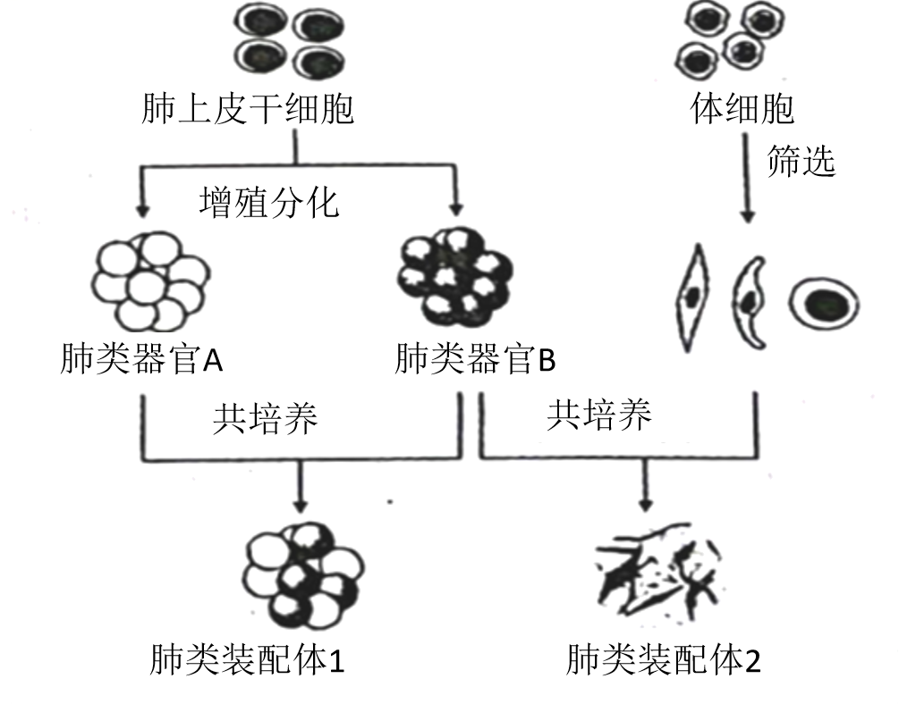

（5）耐甲氧西林金黄色葡萄球菌（MRSA）是一种耐药菌，严重危害人类健康。科研人员拟用MRSA感染肺类装配体建立感染模型，来探究解淀粉芽孢杆菌H抗菌肽是否对MRSA引起的肺炎有治疗潜力。以下实验材料中必备的是\_\_\_\_\_\_。

①金黄色葡萄球菌感染的肺类装配体 ②MRSA感染的肺类装配体 ③解淀粉芽孢杆菌H抗菌肽 ④生理盐水 ⑤青霉素（抗金黄色葡萄球菌的药物） ⑥万古霉素（抗MRSA的药物）

【答案】（1）无机盐、淀粉

（2） ①. 金黄色葡萄球菌和枯草芽孢杆菌 ②. 1.73~3.45

（3）淀粉酶编码基因M发生突变；重组质粒在大肠杆菌分裂过程中丢失

（4） ①. 无菌、无毒环境，含95%空气和5%CO2的气体环境 ②. 否

（5）②③④⑥

【解析】

【分析】动物培养的条件：

1、营养：在使用合成培养基时，通常需要加入血清等一些天然成分。

2、无菌、无毒的环境：对培养液和所有培养用具进行灭菌处理以及在无菌环境下进行操作:定期更换培养液，以便清除代谢产物，防止细胞代谢物积累对细胞自身造成危害。

3、适宜温度、pH和渗透压：哺乳动物细胞培养的温度多为(36.5±0.5)℃；pH多为7.2~7.4；动物细胞培养还需要考虑渗透压。

4、气体环境：O2：细胞代谢所必需的；CO2：维持培养液pH。

【小问1详解】

由题意可知，根际促生菌具有固氮作用，可利用空气中的氮气作为氮源，因此用于筛选根际促生菌的培养基的主要营养物质包括水、无机盐和淀粉。

【小问2详解】

由题表可知，在抗菌肽浓度为3.45-55.20 μg·mL-1范围内，金黄色葡萄球菌和枯草芽孢杆菌均不能生长，表明该抗菌肽对它们的抑菌效果较好；因为抗菌肽的浓度为1.73μg·mL-1时，它们均能生长，所以要确定抗菌肽抑菌效果的最低浓度，应在1.73~3.45 μg·mL-1的浓度区间进一步实验。

【小问3详解】

在利用A菌株发酵生产淀粉酶M过程中，传代多次后，生产条件未变，但某子代菌株不再产生淀粉酶M，可能的原因是淀粉酶编码基因M发生突变；或者是重组质粒在大肠杆菌分裂过程中丢失。

【小问4详解】

肺类装配体培养需要满足适宜营养、温度、渗透压、pH以及无菌、无毒环境，含95%空气和5%CO2的气体环境等基本条件；由图示可知，肺类装配体形成的过程中没有运用动物细胞融合技术，只涉及了细胞的分裂和分化等内容。

【小问5详解】

科研人员拟用MRSA感染肺类装配体建立感染模型，来探究解淀粉芽孢杆菌H抗菌肽是否对MRSA引起的肺炎有治疗潜力，必备实验材料为：②MRSA感染的肺类装配体、 ③解淀粉芽孢杆菌H抗菌肽、④生理盐水（设置对照实验使用）、 ⑥万古霉素（抗MRSA的药物，比较解淀粉芽孢杆菌H抗菌肽的疗效），故选②③④⑥。
