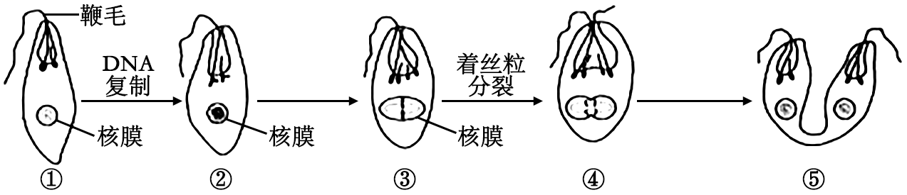
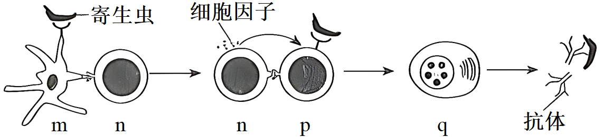
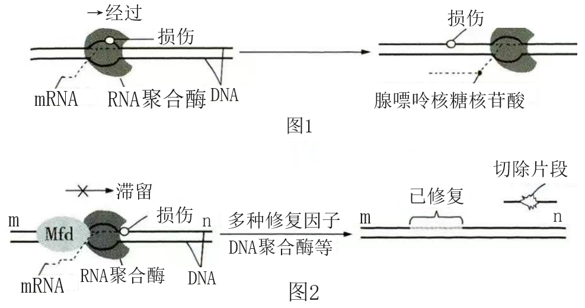
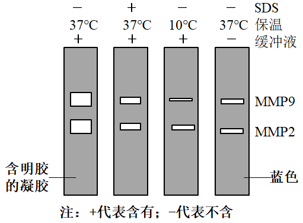
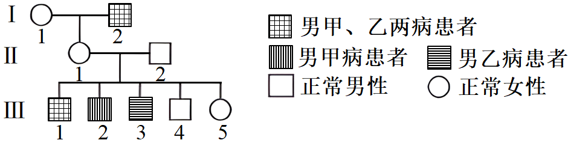
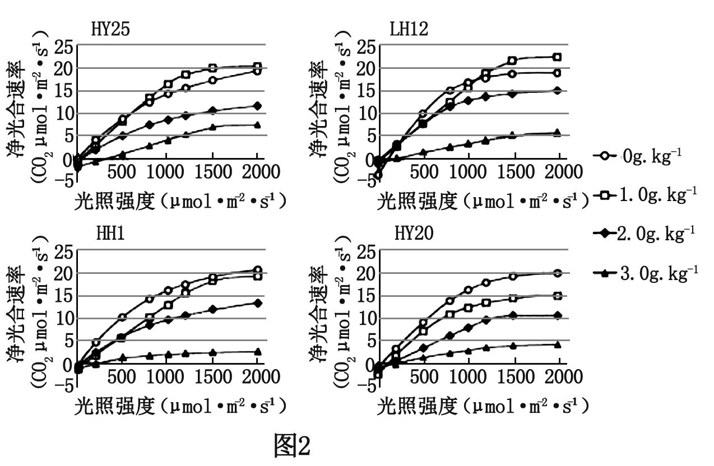
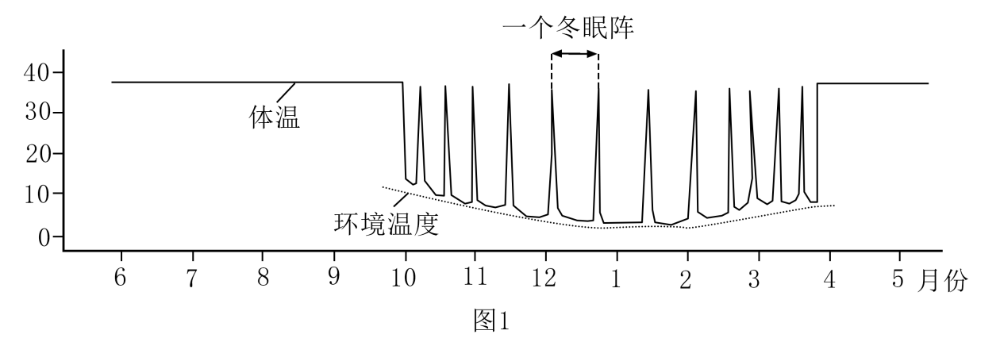
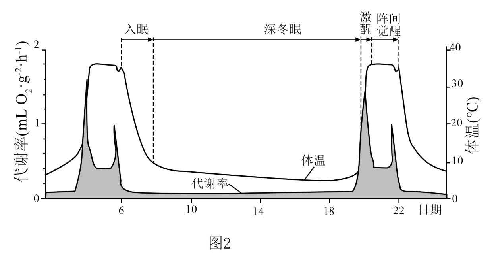
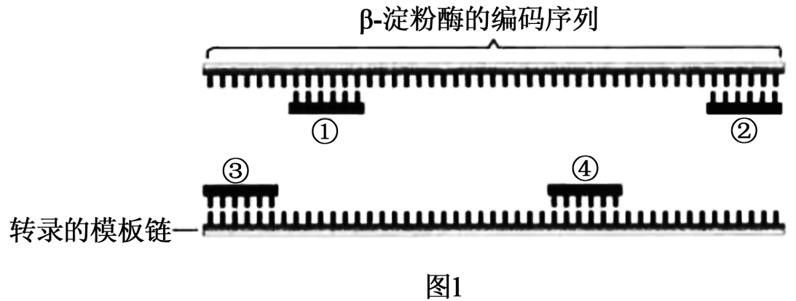
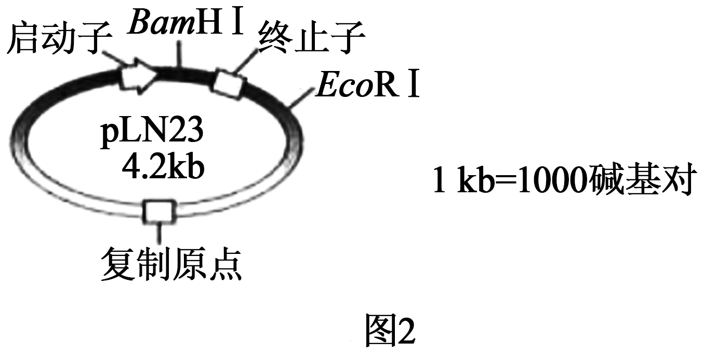

**机密★启用前**

**2023年辽宁省普通高等学校招生选择性考试**

**科目：生物学**

**（试题卷）**

**注意事项：**

**1．答卷前，考生须在答题卡和试题卷上规定的位置，准确填写本人姓名、准考证号，并核对条形码上的信息。确认无误后，将条形码粘贴在答题卡上相应位置。**

**2．考生须在答题卡上各题目规定答题区域内答题，超出答题区域书写的答案无效。在草稿纸、试题卷上答题无效。**

**3．考试结束，将本试题卷和答题卡一并交回。**

**4．本试题卷共10页，如缺页，考生须声明，否则后果自负。**

**姓 名 \_\_\_\_\_**

**准考证号 \_\_\_\_\_**

**机密★启用前**

**2023年辽宁省普通高等学校招生选择性考试**

**生物学**

**注意事项：**

**1．答卷前，考生务必将自己的姓名、准考证号填写在答题卡上。**

**2．答选择题时，选出每小题答案后，用铅笔把答题卡对应题目的答案标号涂黑。如需改动，用橡皮擦干净后，再选涂其他答案标号。答非选择题时，将答案写在答题卡上。写在本试卷上无效。**

**3．考试结束后，将本试卷和答题卡一并交回。**

**一、选择题：本题共15小题，每小题2分，共30分。在每小题给出的四个选项中，只有一项符合题目要求。**

1\. 科学家根据对部分植物细胞观察的结果，得出“植物细胞都有细胞核”的结论。下列叙述错误的是（ ）

A. 早期的细胞研究主要运用了观察法

B. 上述结论的得出运用了归纳法

C. 运用假说—演绎法将上述结论推演至原核细胞也成立

D. 利用同位素标记法可研究细胞核内物质变化

2\. 葡萄与爬山虎均是葡萄科常见植物，将二倍体爬山虎的花粉涂在未受粉的二倍体葡萄柱头上，可获得无子葡萄。下列叙述正确的是（ ）

A. 爬山虎和葡萄之间存在生殖隔离

B. 爬山虎花粉引起葡萄果实发生了基因突变

C. 无子葡萄经无性繁殖产生的植株仍结无子果实

D. 无子葡萄的果肉细胞含一个染色体组

3\. 下面是兴奋在神经元之间传递过程的示意图，图中①～④错误的是（ ）

A. ① B. ② C. ③ D. ④

4\. 血脑屏障的生物膜体系在控制物质运输方式上与细胞膜类似。下表中相关物质不可能存在的运输方式是（ ）

|      |                              |            |
|:-----|:-----------------------------|:-----------|
| 选项 | 通过血脑屏障生物膜体系的物质 | 运输方式   |
| A    | 神经生长因子蛋白             | 胞吞、胞吐 |
| B    | 葡萄糖                       | 协助扩散   |
| C    | 谷氨酸                       | 自由扩散   |
| D    | 钙离子                       | 主动运输   |

A. A B. B C. C D. D

5\. 人工防护林具有防风、固沙及保护农田等作用，对维护区域生态系统稳定具有重要意义。下列叙述正确的是（ ）

A. 防护林通过自组织、自我调节可实现自身结构与功能的协调

B. 防护林建设应选择本地种，遵循了生态工程的循环原理

C. 防护林建成后，若失去人类的维护将会发生初生演替

D. 防护林的防风、固沙及保护农田的作用体现了生物多样性的直接价值

6\. 某些微生物与昆虫构建了互利共生的关系，共生微生物参与昆虫的生命活动并促进其生态功能的发挥。下列叙述错误的是（ ）

A. 昆虫为共生微生物提供了相对稳定的生存环境

B. 与昆虫共生的微生物降低了昆虫的免疫力

C. 不同生境中同种昆虫的共生微生物可能不同

D. 昆虫与微生物共生的关系是长期协同进化的结果

7\. 大量悬浮培养产流感病毒的单克隆细胞，可用于流感疫苗的生产。下列叙述错误的是（ ）

A. 悬浮培养单克隆细胞可有效避免接触抑制

B. 用于培养单克隆细胞的培养基通常需加血清

C. 当病毒达到一定数量时会影响细胞的增殖

D. 培养基pH不会影响单克隆细胞的病毒产量

8\. CD163蛋白是PRRSV病毒感染家畜受体。为实时监控CD163蛋白的表达和转运过程，将红色荧光蛋白RFP基因与CD163基因拼接在一起（如下图），使其表达成一条多肽。该拼接过程的关键步骤是除去（ ）

A. CD163基因中编码起始密码子的序列

B. CD163基因中编码终止密码子的序列

C. RFP基因中编码起始密码子的序列

D. RFP基因中编码终止密码子序列

9\. 细菌气溶胶是由悬浮于大气或附着于颗粒物表面的细菌形成的。利用空气微生物采样器对某市人员密集型公共场所采样并检测细菌气溶胶的浓度（菌落数/m³）。下列叙述错误的是（ ）

A. 采样前需对空气微生物采样器进行无菌处理

B. 细菌气溶胶样品恒温培养时需将平板倒置

C. 同一稀释度下至少对3个平板计数并取平均值

D. 稀释涂布平板法检测的细菌气溶胶浓度比实际值高

10\. 在布氏田鼠种群数量爆发年份，种内竞争加剧，导致出生率下降、个体免疫力减弱，翌年种群数量大幅度减少；在种群数量低的年份，情况完全相反。下列叙述错误的是（ ）

A. 布氏田鼠种群数量达到K/2时，种内竞争强度最小

B. 布氏田鼠种群数量低的年份，环境容纳量可能不变

C. 布氏田鼠种群数量爆发年份，天敌捕食成功的概率提高

D. 布氏田鼠种群密度对种群数量变化起负反馈调节作用

11\. 下图为眼虫在适宜条件下增殖的示意图（仅显示部分染色体）。下列叙述正确的是（ ）

A. ②时期，细胞核的变化与高等动物细胞相同

B. ③时期，染色体的着丝粒排列在赤道板上

C. ④时期，非同源染色体自由组合

D. ⑤时期，细胞质的分裂方式与高等植物细胞相同

12\. 分别用不同浓度芸苔素（一种植物生长调节剂）和赤霉素处理杜仲叶片，然后测定叶片中的有效成分桃叶珊瑚苷含量，结果如下图所示。下列叙述错误的是（ ）

A. 实验中生长调节剂的浓度范围可以通过预实验确定

B. 设置对照组是为了排除内源激素对实验结果的影响

C. 与对照组相比，赤霉素在500mg·L-1时起抑制作用

D. 与用赤霉素处理相比，杜仲叶片对芸苔素更敏感

13\. 利用某种微生物发酵生产DHA油脂，可获取DHA（一种不饱和脂肪酸）。下图为发酵过程中物质含量变化曲线。下列叙述错误的是（ ）

A. DHA油脂的产量与生物量呈正相关

B. 温度和溶解氧的变化能影响DHA油脂的产量

C. 葡萄糖代谢可为DHA油脂的合成提供能量

D. 12～60h，DHA油脂的合成对氮源的需求比碳源高

14\. 用含有不同植物生长调节剂配比的培养基诱导草莓茎尖形成不定芽，研究结果如下表。下列叙述错误的是（ ）

<table style="width:84%;">
<colgroup>
<col style="width: 22%" />
<col style="width: 6%" />
<col style="width: 6%" />
<col style="width: 6%" />
<col style="width: 6%" />
<col style="width: 6%" />
<col style="width: 6%" />
<col style="width: 6%" />
<col style="width: 6%" />
<col style="width: 6%" />
<col style="width: 6%" />
</colgroup>
<tbody>
<tr>
<td style="text-align: left;"></td>
<td style="text-align: left;">1</td>
<td style="text-align: left;">2</td>
<td style="text-align: left;">3</td>
<td style="text-align: left;">4</td>
<td style="text-align: left;">5</td>
<td style="text-align: left;">6</td>
<td style="text-align: left;">7</td>
<td style="text-align: left;">8</td>
<td style="text-align: left;">9</td>
<td style="text-align: left;">10</td>
</tr>
<tr>
<td style="text-align: left;">6-BA（mg·L-1）</td>
<td colspan="10" style="text-align: left;">1</td>
</tr>
<tr>
<td style="text-align: left;">NAA（mg·L-1）</td>
<td style="text-align: left;">0．05</td>
<td style="text-align: left;">0．1</td>
<td style="text-align: left;">0．2</td>
<td style="text-align: left;">0．3</td>
<td style="text-align: left;">0．5</td>
<td style="text-align: left;">-</td>
<td style="text-align: left;">-</td>
<td style="text-align: left;">-</td>
<td style="text-align: left;">-</td>
<td style="text-align: left;">-</td>
</tr>
<tr>
<td style="text-align: left;">2，4-D（mg·L-1）</td>
<td style="text-align: left;">-</td>
<td style="text-align: left;">-</td>
<td style="text-align: left;">-</td>
<td style="text-align: left;">-</td>
<td style="text-align: left;">-</td>
<td style="text-align: left;">0．05</td>
<td style="text-align: left;">0．1</td>
<td style="text-align: left;">0．2</td>
<td style="text-align: left;">0．3</td>
<td style="text-align: left;">0．5</td>
</tr>
<tr>
<td style="text-align: left;">不定芽诱导率（%）</td>
<td style="text-align: left;">68</td>
<td style="text-align: left;">75</td>
<td style="text-align: left;">77</td>
<td style="text-align: left;">69</td>
<td style="text-align: left;">59</td>
<td style="text-align: left;">81</td>
<td style="text-align: left;">92</td>
<td style="text-align: left;">83</td>
<td style="text-align: left;">70</td>
<td style="text-align: left;">61</td>
</tr>
</tbody>
</table>

注：诱导率=出不定芽的外植体数/接种的外植体数×100%

A. 培养基中NAA/6-BA比例过高，不利于不定芽的诱导

B. 推断6-BA应为细胞分裂素类植物生长调节剂

C. 该研究的结果可指导草莓脱毒苗的生产

D. 相同条件下，NAA诱导草莓茎尖形成不定芽的效果优于2，4-D

15\. 尾悬吊（后肢悬空）的大鼠常被用作骨骼肌萎缩研究的实验模型。将实验大鼠随机均分为3组：甲组不悬吊；乙组悬吊；丙组悬吊+电针插入骨骼肌刺激。4周后结果显示：与甲组相比，乙组大鼠后肢小腿骨骼肌出现重量降低、肌纤维横截面积减小等肌萎缩症状；丙组的肌萎缩症状比乙组有一定程度的减轻。据此分析，下列叙述错误的是（ ）

A. 尾悬吊使大鼠骨骼肌的肌蛋白降解速度大于合成速度

B. 乙组大鼠后肢骨骼肌萎缩与神经—肌肉突触传递减弱有关

C. 对丙组大鼠施加的电刺激信号经反射弧调控骨骼肌收缩

D. 长期卧床病人通过适当的电刺激可能缓解骨骼肌萎缩

**二、选择题：本题共5小题，每小题3分，共15分。在每小题给出的四个选项中，有一项或多项符合题目要求。全部选对得3分，选对但不全得1分，有选错得0分。**

16\. 下图是人体被某寄生虫感染后，发生特异性免疫的部分过程。下列叙述正确的是（ ）

A. m为树突状细胞，能识别、吞噬抗原和呈递抗原信息

B. n为辅助性T细胞，能分泌细胞因子、接受和传递信息

C. p为B细胞，其活化需两个信号的刺激和细胞因子的作用

D. q为浆细胞，能分泌特异性抗体和分裂分化为记忆细胞

17\. 磷（P）是导致水体富营养化的重要营养元素之一、湖水中P会随生物遗体残骸、排泄物等沉入底泥。当遇到风浪扰动时，浅水型湖泊底泥中的P会进入上层水体而被生物重新利用；深水型湖泊因水体过深，底泥中的P无法被风浪扰动进入上层水体。若仅考虑P循环，下列叙述正确的是（ ）

A. 水中P沿食物链在生物体内聚集，最终积累在食物链顶端

B. 定期清除底泥对减缓两种类型湖泊富营养化具有同等效果

C. 减少外源P的输入是控制深水型湖泊富营养化的关键措施

D. 相同条件下，浅水型湖泊比深水型湖泊更易发生富营养化

18\. DNA在细胞生命过程中会发生多种类型的损伤。如损伤较小，RNA聚合酶经过损伤位点时，腺嘌呤核糖核苷酸会不依赖于模板掺入mRNA（如图1）；如损伤较大，修复因子Mfd识别、结合滞留的RNA聚合酶，“招募”多种修复因子、DNA聚合酶等进行修复（如图2）。下列叙述正确的是（ ）

A. 图1所示的DNA经复制后有半数子代DNA含该损伤导致的突变基因

B. 图1所示转录产生的mRNA指导合成的蛋白质氨基酸序列可能不变

C. 图2所示的转录过程是沿着模板链的5'端到3'端进行的

D. 图2所示DNA聚合酶催化DNA损伤链的修复，方向是从n到m

19\. 基质金属蛋白酶MMP2和MMP9是癌细胞转移的关键酶。MMP2和MMP9可以降解明胶，明胶可被某染液染成蓝色，因此可以利用含有明胶的凝胶电泳检测这两种酶在不同条件下的活性。据下图分析，下列叙述正确的是（ ）

A. SDS可以提高MMP2和MMP9活性

B. 10℃保温降低了MMP2和MMP9活性

C. 缓冲液用于维持MMP2和MMP9活性

D. MMP2和MMP9降解明胶不具有专一性

20\. 下面是某家族遗传病的系谱图，甲病由等位基因A、a控制，乙病由等位基因B、b控制，其中II2不携带遗传病致病基因，所有个体均未发生突变。下列叙述正确的是（ ）

A. I2与Ⅲ1的基因型相同的概率是1

B. Ⅲ2、Ⅲ3出现说明Ⅱ1形成配子时同源染色体的非姐妹染色单体间发生了交换

C. Ⅱ2减数分裂后生成AB、Ab、aB、ab比例相等的四种配子

D. 若Ⅲ5与一个表型正常的男子结婚，儿子中表型正常的概率大于1/2

**三、非选择题：本题共5小题，共55分。**

21\. 花生抗逆性强，部分品种可以在盐碱土区种植。下图是四个品种的花生在不同实验条件下的叶绿素含量相对值（SPAD）（图1）和净光合速率（图2）。回答下列问题：

（1）花生叶肉细胞中的叶绿素包括\_\_\_\_\_，主要吸收\_\_\_\_\_光，可用\_\_\_\_\_等有机溶剂从叶片中提取。

（2）盐添加量不同的条件下，叶绿素含量受影响最显著的品种是\_\_\_\_\_。

（3）在光照强度为500μmol·m2·s¹、无NaCl添加的条件下，LH12的光合速率\_\_\_\_\_（填“大于”“等于”或“小于"）HH1的光合速率，判断的依据是\_\_\_\_\_。在光照强度为1500μmolm2·s-1、NaCl添加量为3．0g·kg¹的条件下，HY25的净光合速率大于其他三个品种的净光合速率，原因可能是HY25的\_\_\_\_\_含量高，光反应生成更多的\_\_\_\_\_，促进了暗反应进行。

（4）依据图2，在中盐（2．0g·kg-1）土区适宜选择种植\_\_\_\_\_品种。

22\. 随着人类星际旅行计划的推进，如何降低乘员代谢率以减少飞船负载是关键问题之一、动物的冬眠为人类低代谢的研究提供了重要参考。图1显示某储脂类哺乳动物的整个冬眠过程包含多个冬眠阵。每个冬眠阵由入眠、深冬眠、激醒和阵间觉醒四个阶段组成，其体温和代谢率变化如图2回答下列问题：

（1）入眠阶段该动物体温逐渐\_\_\_\_\_，呼吸频率会发生相应变化，调控呼吸频率的中枢位于\_\_\_\_\_。进入深冬眠阶段后该动物维持\_\_\_\_\_，以减少有机物的消耗。

（2）在激醒过程中，从中枢神经系统的\_\_\_\_\_发出的交感神经兴奋，使机体产热增加，体温迅速回升。

（3）该动物在阵间觉醒阶段会排尿，排尿是在高级中枢调控下由低级中枢发出的传出神经兴奋使膀胱缩小完成的，这种调节方式属于\_\_\_\_\_调节。该动物冬眠季节不进食、不饮水，主要通过分解体内的\_\_\_\_\_产生水。

（4）低温不能诱发非冬眠动物冬眠，但利用某种物质可诱导出猕猴等动物的低代谢状态，其机制是激活了下丘脑的特定神经元。据此推测，研究人体低代谢调节机制的关键是要找到\_\_\_\_\_和\_\_\_\_\_，并保证“星际旅行休眠人”能够及时\_\_\_\_\_\_\_\_\_\_。

23\. 迁徙鸟类与地球上不同生态系统、当地生物多样性和人类文化的时空关联，诠释了“地球生命共同体”的理念。辽东半岛滨海湿地资源丰富，是东亚—澳大利西亚水鸟迁徙通道中鸟类的重要停歇、觅食地，对保护生物多样性具有全球性的重要意义。回答下列问题：

（1）迁徙鸟类对迁徙途中停歇、觅食地生态系统的结构和功能产生影响，生态系统的基本功能是\_\_\_\_\_、\_\_\_\_\_和\_\_\_\_\_。

（2）每年春季，数量巨大迁徙水鸟在辽宁滨海湿地停歇、觅食，形成“鸟浪”奇观。此时，该地生物群落体现出明显的\_\_\_\_\_变化。决定该地生物群落性质最重要的因素是\_\_\_\_\_。

（3）该地区迁徙水鸟还停歇、觅食于由自然滩涂改造形成的水田和养殖塘等人工环境，这说明保护迁徙的候鸟，并不意味禁止\_\_\_\_\_自然滩涂，适度的人类生产活动会\_\_\_\_\_（填“提高”或“降低”）湿地生态系统的多样性。

（4）在鸟类迁徙通道的觅食地，影响各种鸟类种群数量变化的关键生物因素是湿地中的\_\_\_\_\_。

（5）为稳定发挥辽宁滨海湿地在鸟类迁徙过程中重要节点的作用，应采取\_\_\_\_\_（答出两点即可）等措施，对该区域湿地进行全面的保护。

24\. 萝卜是雌雄同花植物，其贮藏根（萝卜）红色、紫色和白色由一对等位基因W、w控制，长形、椭圆形和圆形由另一对等位基因R、r控制。一株表型为紫色椭圆形萝卜的植株自交，F₁的表型及其比例如下表所示。回答下列问题：

<table style="width:77%;">
<colgroup>
<col style="width: 9%" />
<col style="width: 6%" />
<col style="width: 9%" />
<col style="width: 6%" />
<col style="width: 6%" />
<col style="width: 9%" />
<col style="width: 6%" />
<col style="width: 6%" />
<col style="width: 9%" />
<col style="width: 6%" />
</colgroup>
<tbody>
<tr>
<td style="text-align: left;">F1表型</td>
<td style="text-align: left;">
红色

长形
</td>
<td style="text-align: left;">
红色

椭圆形
</td>
<td style="text-align: left;">
红色

圆形
</td>
<td style="text-align: left;">
紫色

长形
</td>
<td style="text-align: left;">
紫色

椭圆形
</td>
<td style="text-align: left;">
紫色

圆形
</td>
<td style="text-align: left;">
白色

长形
</td>
<td style="text-align: left;">
白色

椭圆形
</td>
<td style="text-align: left;">
白色

圆形
</td>
</tr>
<tr>
<td style="text-align: left;">比例</td>
<td style="text-align: left;">1</td>
<td style="text-align: left;">2</td>
<td style="text-align: left;">1</td>
<td style="text-align: left;">2</td>
<td style="text-align: left;">4</td>
<td style="text-align: left;">2</td>
<td style="text-align: left;">1</td>
<td style="text-align: left;">2</td>
<td style="text-align: left;">1</td>
</tr>
</tbody>
</table>

注：假设不同基因型植株个体及配子的存活率相同

（1）控制萝卜颜色和形状的两对基因的遗传\_\_\_\_\_（填“遵循”或“不遵循”）孟德尔第二定律。

（2）为验证上述结论，以F1为实验材料，设计实验进行验证：

①选择萝卜表型为\_\_\_\_\_和红色长形的植株作亲本进行杂交实验。

②若子代表型及其比例为\_\_\_\_\_，则上述结论得到验证。

（3）表中F1植株纯合子所占比例是\_\_\_\_\_；若表中F1随机传粉，F2植株中表型为紫色椭圆形萝卜的植株所占比例是\_\_\_\_\_。

（4）食品工艺加工需大量使用紫色萝卜，为满足其需要，可在短时间内大量培育紫色萝卜种苗的技术是\_\_\_\_\_。

25\. 天然β淀粉酶大多耐热性差，不利于工业化应用。我国学者借助PCR改造β-淀粉酶基因，并将改造的基因与pLN23质粒重组后导入大肠杆菌，最终获得耐高温的β-淀粉酶。回答下列问题：

（1）上述过程属于\_\_\_\_\_工程。

（2）PCR中使用的聚合酶属于\_\_\_\_\_（填写编号）。

①以DNA为模板的RNA聚合酶 ②以RNA为模板的RNA聚合酶

③以DNA为模板的DNA聚合酶 ④以RNA为模板的DNA聚合酶

（3）某天然β-淀粉酶由484个氨基酸构成，研究发现，将该酶第476位天冬氨酸替换为天冬酰胺，耐热性明显提升。在图1所示的β-淀粉酶基因改造方案中，含已替换碱基的引物是\_\_\_\_\_（填写编号）。

（4）为了使上述改造后的基因能在大肠杆菌中高效表达，由图2所示的pLN23质粒构建得到基因表达载体。除图示信息外，基因表达载体中还应该有目的基因（即改造后的基因）和\_\_\_\_\_。

（5）目的基因（不含EcoRI酶切位点）全长为1．5kb，将其插入BamH I位点。用EcoR I酶切来自于不同大肠杆菌菌落的质粒DNA，经琼脂糖凝胶电泳确定DNA片段长度，这一操作的目的是\_\_\_\_\_。正确连接的基因表达载体被EcoR Ⅰ酶切后长度为\_\_\_\_\_kb。

（6）采用PCR还能在分子水平上确定目的基因是否转录，根据中心法则，可通过\_\_\_\_\_反应获得PCR的模板。
