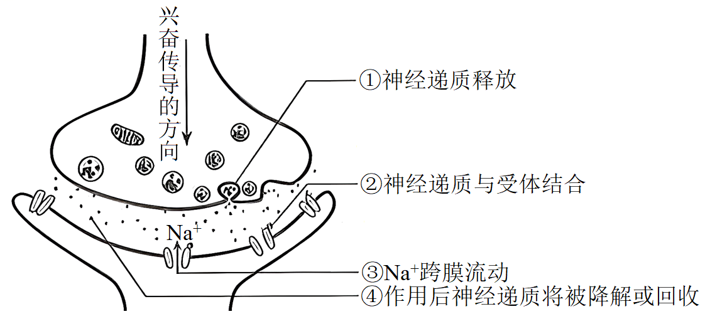
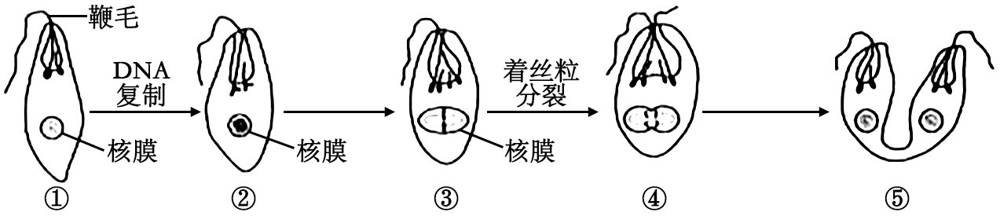
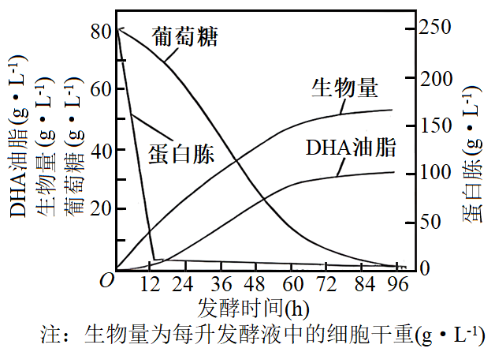
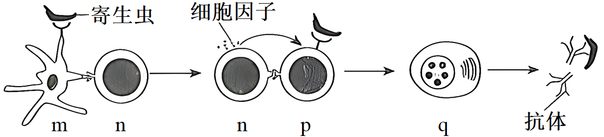
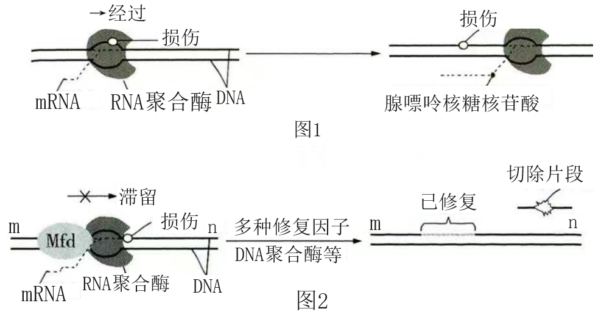
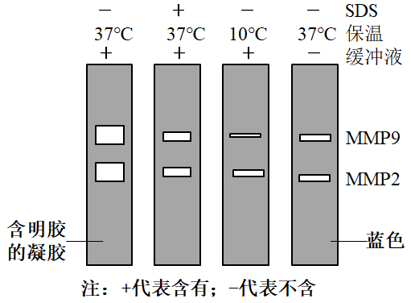
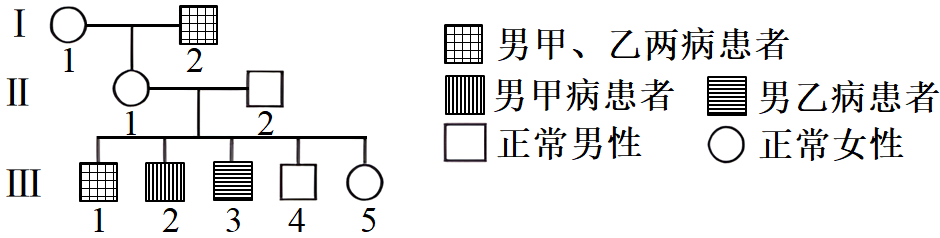
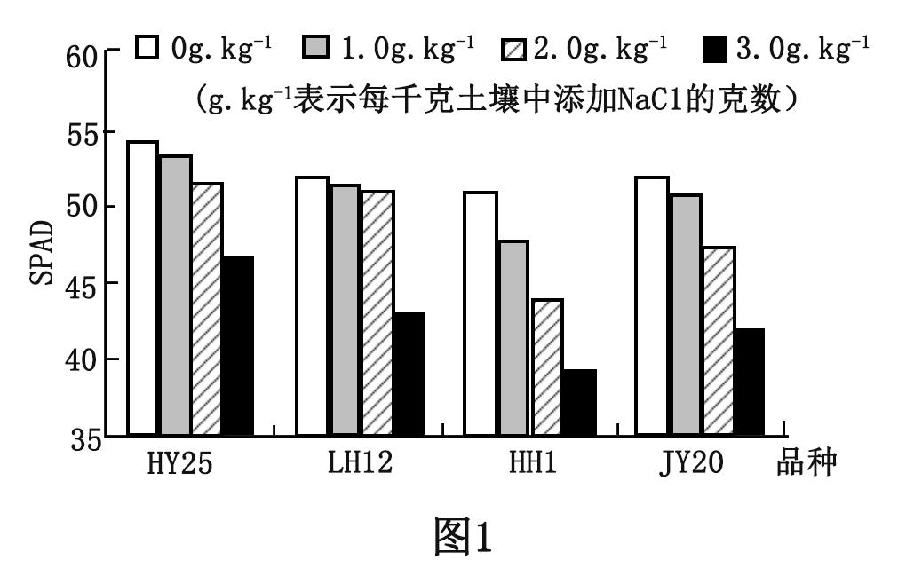
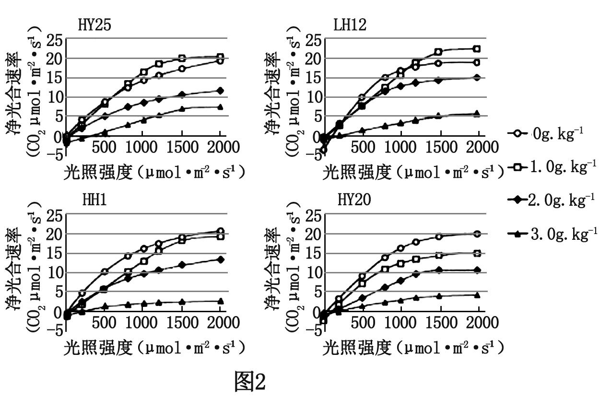
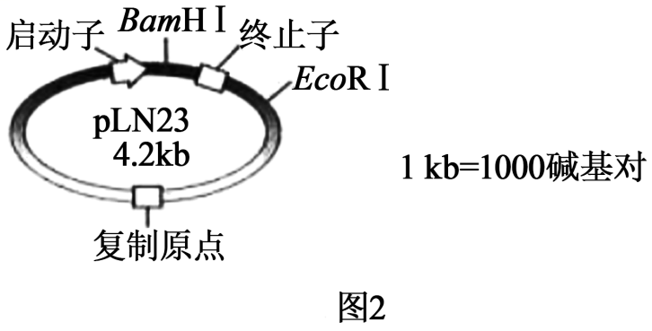

**机密★启用前**

**2023年辽宁省普通高等学校招生选择性考试**

**科目：生物学**

**（试题卷）**

**注意事项：**

**1．答卷前，考生须在答题卡和试题卷上规定的位置，准确填写本人姓名、准考证号，并核对条形码上的信息。确认无误后，将条形码粘贴在答题卡上相应位置。**

**2．考生须在答题卡上各题目规定答题区域内答题，超出答题区域书写的答案无效。在草稿纸、试题卷上答题无效。**

**3．考试结束，将本试题卷和答题卡一并交回。**

**4．本试题卷共10页，如缺页，考生须声明，否则后果自负。**

**姓 名 \_\_\_\_\_**

**准考证号 \_\_\_\_\_**

**机密★启用前**

**2023年辽宁省普通高等学校招生选择性考试**

**生物学**

**注意事项：**

**1．答卷前，考生务必将自己的姓名、准考证号填写在答题卡上。**

**2．答选择题时，选出每小题答案后，用铅笔把答题卡对应题目的答案标号涂黑。如需改动，用橡皮擦干净后，再选涂其他答案标号。答非选择题时，将答案写在答题卡上。写在本试卷上无效。**

**3．考试结束后，将本试卷和答题卡一并交回。**

**一、选择题：本题共15小题，每小题2分，共30分。在每小题给出的四个选项中，只有一项符合题目要求。**

1\. 科学家根据对部分植物细胞观察的结果，得出“植物细胞都有细胞核”的结论。下列叙述错误的是（ ）

A. 早期的细胞研究主要运用了观察法

B. 上述结论的得出运用了归纳法

C. 运用假说—演绎法将上述结论推演至原核细胞也成立

D. 利用同位素标记法可研究细胞核内的物质变化

【答案】C

【解析】

【分析】1、假说-演绎法的步骤：发现现象→提出问题→作出假设→演绎推理→实验验证。

2、归纳法分为完全归纳法和不完全归纳法，完全归纳法是由所有事实推出一般结论；不完全归纳法是由部分事实推出一般结论。科学假说（理论）的提出通常建立在不完全归纳的基础上，因此常常需要进一步的检验。

3、用物理性质特殊的同位素来标记化学反应中原子的去向，就是同位素标记法。同位素标记可用于示踪物质的运行和变化规律。生物学研究中常用的同位素有的具有放射性，如14C、32P、3H、35S等；有的不具有放射性，是稳定同位素，如15N、18O等。

【详解】A、细胞研究需要使用显微镜、放大镜、等工具，一般使用显微镜；观察早期的细胞研究主要运用了观察法，A正确；

B、根据部分植物细胞都有细胞核，得出植物细胞都有细胞核这一结论，运用的是不完全归纳法，B正确；

C、原核细胞没有成形细胞核，C错误；

D、同位素标记法可以示踪物质的运行和变化规律，故可利用同位素标记法研究细胞核内的物质变化，D正确；

故选C。

2\. 葡萄与爬山虎均是葡萄科常见植物，将二倍体爬山虎的花粉涂在未受粉的二倍体葡萄柱头上，可获得无子葡萄。下列叙述正确的是（ ）

A. 爬山虎和葡萄之间存在生殖隔离

B. 爬山虎花粉引起葡萄果实发生了基因突变

C. 无子葡萄经无性繁殖产生的植株仍结无子果实

D. 无子葡萄的果肉细胞含一个染色体组

【答案】A

【解析】

【分析】隔离：

1、定义：隔离是指在自然条件下生物不能自由交配，或者即使能交配也不能产生可育后代的现象。

2、隔离主要分为地理隔离与生殖隔离两类：

（1）地理隔离是指生物的种群之间由于地理环境的阻隔，不能相互交配繁殖产生后代的现象。

（2）生殖隔离是指在自然条件下，由于生物之间不能交配或者交配后不能产生可育后代的现象。生物之间无法交配，不能完成受精或杂种不活、杂种不育等都属于生殖隔离。

【详解】A、生殖隔离是指在自然条件下，由于生物之间不能交配或者交配后不能产生可育后代的现象。生物之间无法交配，不能完成受精或杂种不活、杂种不育等都属于生殖隔离。将二倍体爬山虎的花粉涂在未受粉的二倍体葡萄柱头上，获得的葡萄中没有种子，则爬山虎花粉中的精子与葡萄的卵细胞没有完成受精，所以爬山虎和葡萄之间存在生殖隔离，A正确；

B、涂在未受粉的二倍体葡萄柱头上的爬山虎花粉不能引起葡萄果实发生基因突变，而是促使葡萄产生生长素，促进子房发育成无子葡萄，B错误；

C、这种无子葡萄是经生长素作用产生的，其细胞中遗传物质未发生改变，所以该无子葡萄经无性繁殖产生的植株在自然条件下结有子果实，C错误；

D、无子葡萄的果肉细胞是由母本子房壁细胞经有丝分裂和分化形成，而母本葡萄是二倍体，所以无子葡萄的果肉细胞含二个染色体组，D错误。

故选A。

3\. 下面是兴奋在神经元之间传递过程的示意图，图中①～④错误的是（ ）

A. ① B. ② C. ③ D. ④

【答案】C

【解析】

【分析】兴奋在神经元之间需要通过突触结构进行传递，突触包括突触前膜、突触间隙、突触后膜，其具体的传递过程为：兴奋以电流的形式传导到轴突末梢时，突触小泡释放递质(化学信号)，递质作用于突触后膜，引起突触后膜产生膜电位(电信号)，从而将兴奋传递到下一个神经元。

【详解】A、突触小泡包裹着神经递质运动到突触前膜，突触小泡膜与突触前膜融合，释放神经递质，该方式为胞吐，A正确；

BC、图中释放的神经递质与突触后膜受体结合引起Na＋通道打开，Na＋内流使突触后膜神经元产生兴奋，B正确，C错误；

D、神经递质与突触后膜上的相关受体结合，形成递质—受体复合物，从而改变突触后膜对离子的通透性，引发突触后膜电位变化，随后，神经递质与受体分开，并迅速被降解或回收进细胞，D正确。

故选C。

4\. 血脑屏障的生物膜体系在控制物质运输方式上与细胞膜类似。下表中相关物质不可能存在的运输方式是（ ）

|      |                              |            |
|:-----|:-----------------------------|:-----------|
| 选项 | 通过血脑屏障生物膜体系的物质 | 运输方式   |
| A    | 神经生长因子蛋白             | 胞吞、胞吐 |
| B    | 葡萄糖                       | 协助扩散   |
| C    | 谷氨酸                       | 自由扩散   |
| D    | 钙离子                       | 主动运输   |

A. A B. B C. C D. D

【答案】C

【解析】

【分析】自由扩散的方向是从高浓度向低浓度，不需载体蛋白和能量，常见的有CO2、O2、甘油、苯、酒精等；协助扩散的方向是从高浓度向低浓度，需要转运蛋白协助，不需要能量，如红细胞吸收葡萄糖；主动运输的方向是从低浓度向高浓度，需要载体蛋白和能量，常见的如小肠绒毛上皮细胞吸收氨基酸、葡萄糖，K+等。

【详解】A、神经生长因子蛋白是生物大分子，通过胞吞胞吐通过生物膜细胞，与生物膜的流动性有关，A正确；

B、葡萄糖进入哺乳动物成熟红细胞的方式为协助扩散，故血脑屏障生物膜体系可能为协助扩散，B正确；

C、谷氨酸跨膜运输需要载体蛋白的协助，不能为自由扩散，当谷氨酸作为神经递质出细胞时为胞吐，也不是自由扩散，C错误；

D、钙离子通过生物膜需要载体蛋白，方式可能为主动运输，D正确。

故选C。

5\. 人工防护林具有防风、固沙及保护农田等作用，对维护区域生态系统稳定具有重要意义。下列叙述正确的是（ ）

A. 防护林通过自组织、自我调节可实现自身结构与功能的协调

B. 防护林建设应选择本地种，遵循了生态工程的循环原理

C. 防护林建成后，若失去人类的维护将会发生初生演替

D. 防护林的防风、固沙及保护农田的作用体现了生物多样性的直接价值

【答案】A

【解析】

【分析】生物多样性的价值包括直接价值（食用、药用、工业用、旅游观赏、科研、文学艺术等）、间接价值（对生态系统起到的调节功能）和潜在价值（目前不清楚）。

【详解】A、防护林通过自组织、自我调节可实现自身结构与功能的协调，A正确；

B、防护林建设应选择本地种，遵循了生态工程的协调原理，B错误；

C、防护林建成后，若失去人类的维护将会发生次生演替，C错误；

D、防护林的防风、固沙及保护农田的作用体现了生物多样性的间接价值，D错误。

故选A。

6\. 某些微生物与昆虫构建了互利共生的关系，共生微生物参与昆虫的生命活动并促进其生态功能的发挥。下列叙述错误的是（ ）

A. 昆虫为共生微生物提供了相对稳定生存环境

B. 与昆虫共生的微生物降低了昆虫的免疫力

C. 不同生境中同种昆虫的共生微生物可能不同

D. 昆虫与微生物共生的关系是长期协同进化的结果

【答案】B

【解析】

【分析】生物因素是指影响某种生物生活的其他生物。生物与生物之间的关系常见有：捕食关系、竞争关系、合作关系、寄生关系、共生关系等。

【详解】A、某些微生物与昆虫构建了互利共生的关系，昆虫为共生微生物提供了相对稳定的生存环境，A正确；

B、共生关系表现为互惠互利，因此，与昆虫共生的微生物提高了昆虫的免疫力，B错误；

C、不同生境中同种昆虫由于所处的环境不同，因而与之共生微生物可能不同，C正确；

D、昆虫与微生物共生的关系是在长期选择中协同进化的结果，D正确。

故选B。

7\. 大量悬浮培养产流感病毒的单克隆细胞，可用于流感疫苗的生产。下列叙述错误的是（ ）

A. 悬浮培养单克隆细胞可有效避免接触抑制

B. 用于培养单克隆细胞的培养基通常需加血清

C. 当病毒达到一定数量时会影响细胞的增殖

D. 培养基pH不会影响单克隆细胞的病毒产量

【答案】D

【解析】

【分析】培养动物细胞使用合成培养基时需要加入血清等一些天然成分，必须保证环境是无菌、无毒的，培养液还需要定期更换。O2是细胞代谢所必需的，CO2主要作用是维持培养液的pH。细胞贴附在培养瓶的瓶壁上称为细胞贴壁，贴壁细胞在生长增殖时会发生接触抑制的现象。

【详解】A、悬浮培养单克隆细胞，可以保证足够的气体交换，通过振荡或转动装置使细胞始终处于分散悬浮于培养液内，可有效避免接触抑制，A正确；

B、由于细胞生长是比较复杂的过程，血清中含有一些必须的因子，用于培养单克隆细胞的培养基通常需加血清，B正确；

C、病毒借助于细胞进行繁殖，利用了活细胞的物质、能量、酶等，当病毒达到一定数量时细胞的生命活动受到影响，会影响细胞的增殖，C正确；

D、细胞的正常生命活动需要适宜的pH，培养基pH会影响细胞代谢，进而影响单克隆细胞的病毒产量，D错误。

故选D。

8\. CD163蛋白是PRRSV病毒感染家畜的受体。为实时监控CD163蛋白的表达和转运过程，将红色荧光蛋白RFP基因与CD163基因拼接在一起（如下图），使其表达成一条多肽。该拼接过程的关键步骤是除去（ ）

A. CD163基因中编码起始密码子的序列

B. CD163基因中编码终止密码子的序列

C. RFP基因中编码起始密码子的序列

D. RFP基因中编码终止密码子的序列

【答案】B

【解析】

【分析】基因表达载体的构建：是基因工程的核心步骤，基因表达载体包括目的基因启动子终止子和标记基因等。

【详解】为实时监控CD163蛋白的表达和转运过程，则拼接在一起的红色荧光蛋白RFP基因与CD163基因都得转录和翻译，使其表达成一条多肽，因此拼接在一起的CD163基因转录形成的mRNA中不能出现终止密码子，否则红色荧光蛋白RFP基因转录形成的mRNA不能进行翻译，无法合成红色荧光蛋白，因此该拼接过程的关键步骤是除去CD163基因中编码终止密码子的序列，B符合题意，ACD不符合题意。

故选B。

9\. 细菌气溶胶是由悬浮于大气或附着于颗粒物表面的细菌形成的。利用空气微生物采样器对某市人员密集型公共场所采样并检测细菌气溶胶的浓度（菌落数/m³）。下列叙述错误的是（ ）

A. 采样前需对空气微生物采样器进行无菌处理

B. 细菌气溶胶样品恒温培养时需将平板倒置

C. 同一稀释度下至少对3个平板计数并取平均值

D. 稀释涂布平板法检测的细菌气溶胶浓度比实际值高

【答案】D

【解析】

【分析】稀释涂布平板计数是根据微生物在固体培养基上所形成的单个菌落，即是由一个单细胞繁殖而成这一培养特征设计的计数方法，即一个菌落代表一个单细胞。计数时，首先将待测样品制成均匀的系列稀释液，尽量使样品中的微生物细胞分散开，使成单个细胞存在（否则一个菌落就不只是代表一个细胞），再取一定稀释度、一定量的稀释液接种到平板中，使其均匀分布于平板中的培养基内。经培养后，由单个细胞生长繁殖形成菌落，统计菌落数目，即可计算出样品中的含菌数。

【详解】A、为防止杂菌感染，接种前需要对培养基、培养皿、微生物采样器进行灭菌，对实验操作者的双手进行消毒，A正确；

B、纯化培养时，为防止污染培养基和水分蒸发，培养皿应倒置放在恒温培养箱内培养，B正确；

C、微生物计数时在同一稀释度下，应至少需要对3个菌落数目在30～300的平板进行计数，以确保实验的准确性，C正确；

D、使用稀释涂布平板法对微生物计数，数值往往偏小，原因是两个或多个细胞连在一起时，在平板上只能观察到一个菌落，D错误。

故选D。

10\. 在布氏田鼠种群数量爆发年份，种内竞争加剧，导致出生率下降、个体免疫力减弱，翌年种群数量大幅度减少；在种群数量低的年份，情况完全相反。下列叙述错误的是（ ）

A. 布氏田鼠种群数量达到K/2时，种内竞争强度最小

B. 布氏田鼠种群数量低年份，环境容纳量可能不变

C. 布氏田鼠种群数量爆发年份，天敌捕食成功的概率提高

D. 布氏田鼠种群密度对种群数量变化起负反馈调节作用

【答案】A

【解析】

【分析】在环境条件不受破坏的情况下，一定空间中所能维持的种群最大数量称为环境容纳量，又称K值；当种群数量达到K/2时，增长速率最大。

【详解】A、布氏田鼠种群数量达到K/2时，增长速率最大，但不能说明种内竞争最小，A错误；

B、布氏田鼠种群数量低的年份，环境容纳量可能不变，因为环境容纳量主要受到环境的影响，B正确；

C、布氏田鼠种群数量爆发年份，由于数量增加，天敌捕食成功的概率提高，C正确；

D、由题干可知，布氏田鼠种群密度对种群数量变化起负反馈调节作用，D正确。

故选A。

11\. 下图为眼虫在适宜条件下增殖的示意图（仅显示部分染色体）。下列叙述正确的是（ ）

A. ②时期，细胞核的变化与高等动物细胞相同

B. ③时期，染色体的着丝粒排列在赤道板上

C. ④时期，非同源染色体自由组合

D. ⑤时期，细胞质的分裂方式与高等植物细胞相同

【答案】B

【解析】

【分析】动植物有丝分裂：

前期：染色体散乱排布在细胞中，核膜核仁消失；

中期：着丝粒整齐排列在赤道板上，是观察染色体的最佳时期；

后期：着丝粒分裂，姐妹染色单体分开，分别移向两极；

末期：核膜核仁重新出现，染色体和纺锤体消失。

【详解】A、②时期已经完成了DNA的复制，相当于高等动物的有丝分裂前期，但图中还能观察到核膜，高等动物有丝分裂前期核仁、核膜消失，A错误；

B、由图可知，③时期，染色体的着丝粒排列在赤道板上，相当于高等动物有丝分裂中期，B正确；

C、④时期，着丝粒分裂，姐妹染色单体分开，分别移向两极，C错误；

D、⑤时期，细胞质的分裂方式与高等动物细胞相同，都是直接从细胞中央溢开，D错误。

故选B。

12\. 分别用不同浓度芸苔素（一种植物生长调节剂）和赤霉素处理杜仲叶片，然后测定叶片中的有效成分桃叶珊瑚苷含量，结果如下图所示。下列叙述错误的是（ ）

A. 实验中生长调节剂的浓度范围可以通过预实验确定

B. 设置对照组是为了排除内源激素对实验结果的影响

C. 与对照组相比，赤霉素在500mg·L-1时起抑制作用

D. 与用赤霉素处理相比，杜仲叶片对芸苔素更敏感

【答案】C

【解析】

【分析】该实验的自变量是植物生长调节剂的不同以及不同的浓度，因变量是桃叶珊瑚苷含量，根据实验结果分析，赤霉素核芸苔素都可以增加桃叶珊瑚苷含量。

【详解】A、预实验可以为进一步的实验摸索条件，也可以检验实验设计的科学性和可行性，本实验中生长调节剂的浓度范围可以通过预实验确定，A正确；

B、设置对照组是为了排除内源激素对实验结果的影响，将实验组的结果与对照组比较，产生的影响是外源物质的作用，B正确；

C、与对照组相比，赤霉素在500mg·L-1时，叶片中的有效成分桃叶珊瑚苷含量更多，故赤霉素在500mg·L-1时起促进作用，只是促进效果小于浓度为100mg·L-1和300mg·L-1时，C错误；

D、芸苔素的浓度远低于赤霉素的浓度，而促进效果非常明显，说明杜仲叶片对芸苔素更敏感，D正确。

故选C。

13\. 利用某种微生物发酵生产DHA油脂，可获取DHA（一种不饱和脂肪酸）。下图为发酵过程中物质含量变化曲线。下列叙述错误的是（ ）

A. DHA油脂的产量与生物量呈正相关

B. 温度和溶解氧的变化能影响DHA油脂的产量

C. 葡萄糖代谢可为DHA油脂的合成提供能量

D. 12～60h，DHA油脂的合成对氮源的需求比碳源高

【答案】D

【解析】

【分析】1、发酵罐内的发酵是发酵工程的中心环节，在发酵过程中，要随时检测培养液中的微生物数量、产物浓度等，以了解发酵进程，还要及时添加必需的营养组分，要严格控制温度、PH和溶解氧等发酵条件。

2、题图分析：横坐标为发酵时间，纵坐标为发酵过程各种相关物质的含量及生物量。从图可知，随着发酵的进行，葡萄糖逐渐减少，发酵到96h左右减少至0；蛋白胨在0~12h间快速减少，然后缓慢减少，发酵到96小时左右减少至0；生物量和DHA油脂的产量随着发酵进程逐渐上升。

【详解】A、由图可知，DHA油脂的产量随着发酵进程逐渐增加，生物量也随着发酵进程逐渐增加，它们的变化呈正相关，A正确；

B、由图可知，生物量与DHA油脂的产量呈正相关，温度和溶解氧影响微生物的生长繁殖，进而影响DHA油脂的产量，B正确；

C、发酵液中葡萄糖被微生物吸收用于呼吸作用产生能量，供其合成DHA油脂，C正确；

D、DHA油脂是一种不饱和脂肪酸，含C、H、O不含N，所以在12～60h，DHA油脂的合成对碳源的需求高，不需要氮源，D错误。

故选D。

14\. 用含有不同植物生长调节剂配比的培养基诱导草莓茎尖形成不定芽，研究结果如下表。下列叙述错误的是（ ）

<table style="width:84%;">
<colgroup>
<col style="width: 22%" />
<col style="width: 6%" />
<col style="width: 6%" />
<col style="width: 6%" />
<col style="width: 6%" />
<col style="width: 6%" />
<col style="width: 6%" />
<col style="width: 6%" />
<col style="width: 6%" />
<col style="width: 6%" />
<col style="width: 6%" />
</colgroup>
<tbody>
<tr>
<td style="text-align: left;"></td>
<td style="text-align: left;">1</td>
<td style="text-align: left;">2</td>
<td style="text-align: left;">3</td>
<td style="text-align: left;">4</td>
<td style="text-align: left;">5</td>
<td style="text-align: left;">6</td>
<td style="text-align: left;">7</td>
<td style="text-align: left;">8</td>
<td style="text-align: left;">9</td>
<td style="text-align: left;">10</td>
</tr>
<tr>
<td style="text-align: left;">6-BA（mg·L-1）</td>
<td colspan="10" style="text-align: left;">1</td>
</tr>
<tr>
<td style="text-align: left;">NAA（mg·L-1）</td>
<td style="text-align: left;">0．05</td>
<td style="text-align: left;">0．1</td>
<td style="text-align: left;">0．2</td>
<td style="text-align: left;">0．3</td>
<td style="text-align: left;">0．5</td>
<td style="text-align: left;">-</td>
<td style="text-align: left;">-</td>
<td style="text-align: left;">-</td>
<td style="text-align: left;">-</td>
<td style="text-align: left;">-</td>
</tr>
<tr>
<td style="text-align: left;">2，4-D（mg·L-1）</td>
<td style="text-align: left;">-</td>
<td style="text-align: left;">-</td>
<td style="text-align: left;">-</td>
<td style="text-align: left;">-</td>
<td style="text-align: left;">-</td>
<td style="text-align: left;">0．05</td>
<td style="text-align: left;">0．1</td>
<td style="text-align: left;">0．2</td>
<td style="text-align: left;">0．3</td>
<td style="text-align: left;">0．5</td>
</tr>
<tr>
<td style="text-align: left;">不定芽诱导率（%）</td>
<td style="text-align: left;">68</td>
<td style="text-align: left;">75</td>
<td style="text-align: left;">77</td>
<td style="text-align: left;">69</td>
<td style="text-align: left;">59</td>
<td style="text-align: left;">81</td>
<td style="text-align: left;">92</td>
<td style="text-align: left;">83</td>
<td style="text-align: left;">70</td>
<td style="text-align: left;">61</td>
</tr>
</tbody>
</table>

注：诱导率=出不定芽的外植体数/接种的外植体数×100%

A. 培养基中NAA/6-BA比例过高，不利于不定芽的诱导

B. 推断6-BA应为细胞分裂素类植物生长调节剂

C. 该研究的结果可指导草莓脱毒苗的生产

D. 相同条件下，NAA诱导草莓茎尖形成不定芽的效果优于2，4-D

【答案】D

【解析】

【分析】分析题表：自变量为植物生长调节剂种类和配比，因变量为不定芽诱导率；培养基中NAA/6-BA比例逐渐增大时，不定芽诱导率先上升后降低，培养基中2，4-D/6-BA比例逐渐增大时，不定芽诱导率先上升后降低，相同的NAA/6-BA和2，4-D/6-BA的配比下，培养基中使用2，4-D/6-BA更有利于诱导形成不定芽。

【详解】A、由题表可知，培养基中NAA/6-BA比例逐渐增大时，不定芽诱导率先上升后降低，且当NAA/6-BA比例为0.5/1时，不定芽诱导率最低；故培养基中NAA/6-BA比例过高，不利于不定芽的诱导，A正确；

B、不定芽的形成需要细胞分裂素和生长素，题表中NAA和2，4-D属于生长素类植物生长调节剂，故推断6-BA应为细胞分裂素类植物生长调节剂，B正确；

C、草莓脱毒苗的生产过程中需要诱导形成不定芽，故该研究的结果可指导草莓脱毒苗的生产，C正确；

D、由题表相关数据可知：相同条件下，2，4-D诱导草莓茎尖形成不定芽的效果优于NAA，D错误。

故选D。

15\. 尾悬吊（后肢悬空）的大鼠常被用作骨骼肌萎缩研究的实验模型。将实验大鼠随机均分为3组：甲组不悬吊；乙组悬吊；丙组悬吊+电针插入骨骼肌刺激。4周后结果显示：与甲组相比，乙组大鼠后肢小腿骨骼肌出现重量降低、肌纤维横截面积减小等肌萎缩症状；丙组的肌萎缩症状比乙组有一定程度的减轻。据此分析，下列叙述错误的是（ ）

A. 尾悬吊使大鼠骨骼肌的肌蛋白降解速度大于合成速度

B. 乙组大鼠后肢骨骼肌萎缩与神经—肌肉突触传递减弱有关

C. 对丙组大鼠施加的电刺激信号经反射弧调控骨骼肌收缩

D. 长期卧床病人通过适当的电刺激可能缓解骨骼肌萎缩

【答案】C

【解析】

【分析】神经调节的基本方式是反射，其结构基础是反射弧。反射弧由感受器、传入神经、神经中枢、传出神经、效应器五部分构成。兴奋在神经纤维上是双向传导的，在神经元之间是单向传递的，即只能从一个神经元的轴突传递给另一个神经元的细胞体或树突。神经末梢与肌肉接触处叫做神经肌肉接点，又称突触。在突触处，神经末梢的细胞膜称为突触前膜，与之相对的肌膜较厚，有皱褶，称为突触后膜。突触前膜与突触后膜之间有一间隙，称突触间隙。

【详解】A、尾悬吊小鼠后肢小腿骨骼肌出现重量降低、肌纤维横截面积减小等肌萎缩症状，因此尾悬吊使大鼠骨骼肌的肌蛋白降解速度大于合成速度，A正确；

B、乙组大鼠后肢骨骼肌萎缩与神经对肌肉失去了支配或者是支配的能力减弱，因此乙组大鼠后肢骨骼肌萎缩与神经—肌肉突触传递减弱有关，B正确；

C、对丙组大鼠施加的电刺激信号调控骨骼肌收缩没有经过完整的反射弧，C错误；

D、据题干分析，丙组悬吊+电针插入骨骼肌刺激，丙组的肌萎缩症状比乙组有一定程度的减轻，因此长期卧床病人通过适当的电刺激可能缓解骨骼肌萎缩，D正确。

故选C。

**二、选择题：本题共5小题，每小题3分，共15分。在每小题给出的四个选项中，有一项或多项符合题目要求。全部选对得3分，选对但不全得1分，有选错得0分。**

16\. 下图是人体被某寄生虫感染后，发生特异性免疫的部分过程。下列叙述正确的是（ ）

A. m为树突状细胞，能识别、吞噬抗原和呈递抗原信息

B. n为辅助性T细胞，能分泌细胞因子、接受和传递信息

C. p为B细胞，其活化需两个信号的刺激和细胞因子的作用

D. q为浆细胞，能分泌特异性抗体和分裂分化为记忆细胞

【答案】ABC

【解析】

【分析】体液免疫过程会产生相应的浆细胞和记忆细胞，再由浆细胞产生相应的抗体；病毒侵入细胞后会引起机体发生特异性免疫中的细胞免疫，产生相应的记忆细胞和细胞毒性T细胞，细胞毒性T细胞与被病毒侵入的靶细胞结合，使得靶细胞裂解释放病毒。

【详解】A、m为树突状细胞，具有强大的识别、吞噬抗原和呈递抗原信息的作用，A正确；

B、n为辅助性T细胞，能接受和传递信息、分泌细胞因子，起到增强免疫功能，B正确；

C、p为B细胞，其活化需两个信号的刺激，此外还需要细胞因子的作用，C正确；

D、q为浆细胞，能分泌特异性抗体，不能分裂分化为记忆细胞，D错误。

故选ABC。

17\. 磷（P）是导致水体富营养化的重要营养元素之一、湖水中P会随生物遗体残骸、排泄物等沉入底泥。当遇到风浪扰动时，浅水型湖泊底泥中的P会进入上层水体而被生物重新利用；深水型湖泊因水体过深，底泥中的P无法被风浪扰动进入上层水体。若仅考虑P循环，下列叙述正确的是（ ）

A. 水中P沿食物链在生物体内聚集，最终积累在食物链顶端

B. 定期清除底泥对减缓两种类型湖泊富营养化具有同等效果

C. 减少外源P的输入是控制深水型湖泊富营养化的关键措施

D. 相同条件下，浅水型湖泊比深水型湖泊更易发生富营养化

【答案】CD

【解析】

【分析】生物体从周围环境吸收、积蓄某种元素或难以降解的化合物，使其在机体内浓度超过环境浓度的现象，称作生物富集，生物链越顶端，该元素或化合物浓度越高。

【详解】A、水中P可被生产者吸收利用，生物体内的含磷化合物会被分解，不会积累在食物链顶端，A错误；

B、结合题干“当遇到风浪扰动时，浅水型湖泊底泥中的P会进入上层水体而被生物重新利用；深水型湖泊因水体过深，底泥中的P无法被风浪扰动进入上层水体”可知，期清除底泥对减缓浅水型湖泊富营养化具有较好的效果，对深水型湖泊富营养化效果不大，B错误；

C、深水型湖泊因水体过深，底泥中的P无法被风浪扰动进入上层水体，减少外源P的输入是控制深水型湖泊富营养化的关键措施，C正确；

D、磷（P）是导致水体富营养化的重要营养元素之一、湖水中P会随生物遗体残骸、排泄物等沉入底泥，而当遇到风浪扰动时，浅水型湖泊底泥中的P会进入上层水体而被生物重新利用，深水型湖泊因水体过深，底泥中的P无法被风浪扰动进入上层水体，故相同条件下，浅水型湖泊比深水型湖泊更易发生富营养化，D正确。

故选CD。

18\. DNA在细胞生命过程中会发生多种类型的损伤。如损伤较小，RNA聚合酶经过损伤位点时，腺嘌呤核糖核苷酸会不依赖于模板掺入mRNA（如图1）；如损伤较大，修复因子Mfd识别、结合滞留的RNA聚合酶，“招募”多种修复因子、DNA聚合酶等进行修复（如图2）。下列叙述正确的是（ ）

A. 图1所示的DNA经复制后有半数子代DNA含该损伤导致的突变基因

B. 图1所示转录产生的mRNA指导合成的蛋白质氨基酸序列可能不变

C. 图2所示的转录过程是沿着模板链的5'端到3'端进行的

D. 图2所示的DNA聚合酶催化DNA损伤链的修复，方向是从n到m

【答案】ABD

【解析】

【分析】由题意可知，损伤较小，RNA聚合酶经过损伤位点时，腺嘌呤核糖核苷酸会不依赖于模板掺入mRNA，所转录出的mRNA较正常的mRNA插入了一个碱基A，导致其指导合成的蛋白质氨基酸序列一定改变，而损伤较大，修复因子Mfd识别、结合滞留的RNA聚合酶，“招募”多种修复因子、DNA聚合酶等进行修复，即修复因子Mfd识别在前，滞留的RNA聚合酶，多种修复因子、DNA聚合酶等修复在后。

【详解】A、根据半保留复制可知，图1所示的DNA经复制后有半数子代DNA含该损伤导致的突变基因，A正确；

B、由题意可知，图1所示为损伤较小，RNA聚合酶经过损伤位点时，腺嘌呤核糖核苷酸会不依赖于模板掺入mRNA，因为密码子存在简并性，mRNA掺入腺嘌呤脱氧核苷酸之后，不同的密码子可能绝对相同的氨基酸，B正确；

C、转录时mRNA是由5'端到3'端进行的，模板链是由3'端到5'端进行的，C错误；

D、由mRNA的合成方向可知，2中上侧为模板链，m是3’端，n是5’端，切除后DNA聚合酶会以下侧链为模板，根据 DNA聚合酶合成子链方向可知，修复是从n向m进行，D正确。

故选ABD。 

19\. 基质金属蛋白酶MMP2和MMP9是癌细胞转移的关键酶。MMP2和MMP9可以降解明胶，明胶可被某染液染成蓝色，因此可以利用含有明胶的凝胶电泳检测这两种酶在不同条件下的活性。据下图分析，下列叙述正确的是（ ）

A. SDS可以提高MMP2和MMP9活性

B. 10℃保温降低了MMP2和MMP9活性

C. 缓冲液用于维持MMP2和MMP9活性

D. MMP2和MMP9降解明胶不具有专一性

【答案】BC

【解析】

【分析】分析题干，MMP2和MMP9可以降解明胶，明胶可被某染液染成蓝色，MMP2和MMP9活性越高，明胶被分解的越多，蓝色颜色越淡或蓝色消失。

【详解】A、37℃保温、加SDS、加缓冲液那组比37℃保温、不加SDS、加缓冲液那组的MMP2和MMP9条带周围的透明带面积更小，说明明胶被降解的更少，故MMP2和MMP9活性更低，因此，SDS可降低MMP2和MMP9活性，A错误；

B、与30℃（不加SDS）相比，10℃（不加SDS），MMP2和MMP9条带周围的透明带面积更小，说明明胶被降解的更少，故MMP2和MMP9活性更低，因此，10℃保温降低了MMP2和MMP9活性，B正确；

C、缓冲液可以维持pH条件的稳定，从而维持MMP2和MMP9活性，C正确；

D、MMP2和MMP9都属于酶，酶具有专一性，D错误。

故选BC。

20\. 下面是某家族遗传病的系谱图，甲病由等位基因A、a控制，乙病由等位基因B、b控制，其中II2不携带遗传病致病基因，所有个体均未发生突变。下列叙述正确的是（ ）

A. I2与Ⅲ1的基因型相同的概率是1

B. Ⅲ2、Ⅲ3出现说明Ⅱ1形成配子时同源染色体的非姐妹染色单体间发生了交换

C. Ⅱ2减数分裂后生成AB、Ab、aB、ab比例相等的四种配子

D. 若Ⅲ5与一个表型正常的男子结婚，儿子中表型正常的概率大于1/2

【答案】ABD

【解析】

【分析】Ⅱ1、Ⅱ2不患病，生出患病的孩子，说明该病为隐性遗传病，II2不携带遗传病致病基因，说明两种病均为伴X隐性遗传病。

【详解】A、Ⅱ1、Ⅱ2不患病，生出患病的孩子，说明两种病均为隐性遗传病，II2不携带遗传病致病基因，说明两种病均为伴X隐性遗传病，I2的基因型为XabY，Ⅲ1的基因型为XabY，I2与Ⅲ1的基因型相同的概率是1，A正确；

B、Ⅱ1的基因型为XABXab，Ⅱ2的基因型为XABY，Ⅲ2、Ⅲ3出现说明Ⅱ1形成配子时同源染色体的非姐妹染色单体间发生了交换，产生了XAb、XaB的配子，B正确；

C、Ⅱ2的基因型为XABY，能产生XAB、Y两种配子，C错误；

D、在不发生基因突变和交叉互换的情况下，Ⅱ1（XABXab）能产生XAB、Xab两种配子，由于存在交叉互换，Ⅱ1（XABXab）产生配子的种类为XAB、Xab、XAb、XaB，产生的XAB的配子概率低于1/2，但Ⅲ-5号个体会得到她父亲给的一条XAB的配子，所以Ⅲ-5号个体产生XAB的配子的概率一定会大于1/2，Ⅲ5与一个表型正常的男子（XABY）结婚，儿子中表型正常的概率大于1/2，D正确。

故选ABD。

**三、非选择题：本题共5小题，共55分。**

21\. 花生抗逆性强，部分品种可以在盐碱土区种植。下图是四个品种的花生在不同实验条件下的叶绿素含量相对值（SPAD）（图1）和净光合速率（图2）。回答下列问题：

（1）花生叶肉细胞中的叶绿素包括\_\_\_\_\_，主要吸收\_\_\_\_\_光，可用\_\_\_\_\_等有机溶剂从叶片中提取。

（2）盐添加量不同的条件下，叶绿素含量受影响最显著的品种是\_\_\_\_\_。

（3）在光照强度为500μmol·m2·s¹、无NaCl添加的条件下，LH12的光合速率\_\_\_\_\_（填“大于”“等于”或“小于"）HH1的光合速率，判断的依据是\_\_\_\_\_。在光照强度为1500μmolm2·s-1、NaCl添加量为3．0g·kg¹的条件下，HY25的净光合速率大于其他三个品种的净光合速率，原因可能是HY25的\_\_\_\_\_含量高，光反应生成更多的\_\_\_\_\_，促进了暗反应进行。

（4）依据图2，在中盐（2．0g·kg-1）土区适宜选择种植\_\_\_\_\_品种。

【答案】（1） ①. 叶绿素a和叶绿素b ②. 红光和蓝紫 ③. 无水乙醇

（2）HH1 （3） ①. 大于 ②. 在光照强度为500μmol·m2·s¹、无NaCl添加的条件下，LH12的净光合速率和HH1的净光合速率相同，但由于前者的呼吸速率大于后者，且总光合速率等于净光合速率和呼吸速率之和， ③. 叶绿素 ④. ATP和NADPH

（4）LH12

【解析】

【分析】绿叶中色素的提取和分离实验，提取色素时需要加入无水乙醇（溶解色素）、石英砂（使研磨更充分）和碳酸钙（防止色素被破坏）；分离色素时采用纸层析法，原理是色素在层析液中的溶解度不同，随着层析液扩散的速度不同，最后的结果是观察到四条色素带，从上到下依次是胡萝卜素（橙黄色）、叶黄素（黄色）、叶绿素a（蓝绿色）、叶绿素b（黄绿色）。

【小问1详解】

花生叶肉细胞中的叶绿素包括叶绿素a和叶绿素b，主要吸收红光和蓝紫光，可用无水乙醇等有机溶剂从叶片中提取，因为叶片中的色素能溶解到有机溶剂中。

【小问2详解】

结合图1实验结果可以看出，盐添加量不同的条件下，叶绿素含量受影响最显著的品种是HH1，因为该品种的叶绿素含量受盐浓度变化影响更显著。　

【小问3详解】

在光照强度为500μmol·m-2·s-1、无NaCl添加的条件下，LH12的净光合速率和HH1的净光合速率相同，但由于前者的呼吸速率大于后者，且总光合速率等于净光合速率和呼吸速率之和，因此可以判断，LH12的光合速率大于HH1的光合速率。在光照强度为1500μmolm-2·s-1、NaCl添加量为3．0g·kg¹的条件下，HY25的净光合速率大于其他三个品种的净光合速率，原因可能是HY25的叶绿素含量高与其他三个品种，光反应生成更多的ATP和NADPH，进而促进了暗反应进行，提高了光合速率。

【小问4详解】

根据图2数据可知，在中盐（2．0g·kg-1）土区适宜选择种植LH12品种，因为该条件下，该品种的净光合速率更大，说明产量更高，因而更适合在该地区种植。

22\. 随着人类星际旅行计划的推进，如何降低乘员代谢率以减少飞船负载是关键问题之一、动物的冬眠为人类低代谢的研究提供了重要参考。图1显示某储脂类哺乳动物的整个冬眠过程包含多个冬眠阵。每个冬眠阵由入眠、深冬眠、激醒和阵间觉醒四个阶段组成，其体温和代谢率变化如图2回答下列问题：

（1）入眠阶段该动物体温逐渐\_\_\_\_\_，呼吸频率会发生相应变化，调控呼吸频率的中枢位于\_\_\_\_\_。进入深冬眠阶段后该动物维持\_\_\_\_\_，以减少有机物的消耗。

（2）在激醒过程中，从中枢神经系统的\_\_\_\_\_发出的交感神经兴奋，使机体产热增加，体温迅速回升。

（3）该动物在阵间觉醒阶段会排尿，排尿是在高级中枢调控下由低级中枢发出的传出神经兴奋使膀胱缩小完成的，这种调节方式属于\_\_\_\_\_调节。该动物冬眠季节不进食、不饮水，主要通过分解体内的\_\_\_\_\_产生水。

（4）低温不能诱发非冬眠动物冬眠，但利用某种物质可诱导出猕猴等动物的低代谢状态，其机制是激活了下丘脑的特定神经元。据此推测，研究人体低代谢调节机制的关键是要找到\_\_\_\_\_和\_\_\_\_\_，并保证“星际旅行休眠人”能够及时\_\_\_\_\_\_\_\_\_\_。

【答案】（1） ①. 下降 ②. 脑干 ③. 低代谢率

（2）脊髓\
（3） ①. 分级 ②. 脂肪

（4） ①. 新陈代谢降低相关的神经元 ②. 激活该神经元的物质 ③. 激醒和阵间觉醒

【解析】

【分析】分析图2可知：一个冬眠阵中，入眠阶段体温和代谢率逐渐下降，深冬眠阶段维持低体温和低代谢率，激醒阶段体温和代谢率升高，阵间觉醒阶段维持正常体温。

【小问1详解】

分析图可知，入眠阶段该动物体温逐渐下降，呼吸频率会发生相应变化，调控呼吸频率的中枢位于脑干。进入深冬眠阶段后该动物维持低代谢率，以减少有机物的消耗。

【小问2详解】

交感神经由脊髓发出。

【小问3详解】

排尿是在高级中枢调控下由低级中枢发出的传出神经兴奋使膀胱缩小完成的，这种调节方式属于分级调节。该动物冬眠季节不进食、不饮水，主要通过分解体内的脂肪产生水。

【小问4详解】

研究人体低代谢调节机制的关键是要找到新陈代谢降低相关的神经元，用于接收相应物质的刺激；还应找到激活该神经元的物质，并保证“星际旅行休眠人”能够及时激醒和阵间觉醒。

23\. 迁徙鸟类与地球上不同生态系统、当地生物多样性和人类文化的时空关联，诠释了“地球生命共同体”的理念。辽东半岛滨海湿地资源丰富，是东亚—澳大利西亚水鸟迁徙通道中鸟类的重要停歇、觅食地，对保护生物多样性具有全球性的重要意义。回答下列问题：

（1）迁徙鸟类对迁徙途中停歇、觅食地生态系统的结构和功能产生影响，生态系统的基本功能是\_\_\_\_\_、\_\_\_\_\_和\_\_\_\_\_。

（2）每年春季，数量巨大的迁徙水鸟在辽宁滨海湿地停歇、觅食，形成“鸟浪”奇观。此时，该地生物群落体现出明显的\_\_\_\_\_变化。决定该地生物群落性质最重要的因素是\_\_\_\_\_。

（3）该地区迁徙水鸟还停歇、觅食于由自然滩涂改造形成的水田和养殖塘等人工环境，这说明保护迁徙的候鸟，并不意味禁止\_\_\_\_\_自然滩涂，适度的人类生产活动会\_\_\_\_\_（填“提高”或“降低”）湿地生态系统的多样性。

（4）在鸟类迁徙通道的觅食地，影响各种鸟类种群数量变化的关键生物因素是湿地中的\_\_\_\_\_。

（5）为稳定发挥辽宁滨海湿地在鸟类迁徙过程中重要节点的作用，应采取\_\_\_\_\_（答出两点即可）等措施，对该区域湿地进行全面的保护。

【答案】（1） ①. 能量流动 ②. 物质循环 ③. 信息传递

（2） ①. 季节性 ②. 物种组成

（3） ①. 开发和利用 ②. 提高\
（4）食物

（5）建立自然保护区；对改造的自然滩涂给予相应物质和能量的投入等

【解析】

【分析】1、生态系统是一个生物群落与其环境中非生物组成部分相互作用形成的一个系统。2、影响种群数量的因素包括生物因素和非生物因素，非生物因素如阳光、温度、水等，生物因素如食物、天敌等。

【小问1详解】

生态系统具有物质循环、能量流动和信息传递三大基本功能。

【小问2详解】

只有春才有“鸟浪”奇观，这体现了群落的季节性特点。决定生物群落性质最重要的因素是群落的物种组成，物种组成是区别不同群落的最主要因素。

【小问3详解】

由自然滩涂改造形成的水田和养殖塘等人工环境成为了鸟类迁徙通道的觅食地，说明自然资源并非是狭隘的禁止开发利用，适度的人类生产活动会提高湿地生态系统的多样性。

【小问4详解】

鸟类在迁徙地觅食，因此决定各种鸟类种群数量变化的关键生物因素是湿地中的食物。

【小问5详解】

对辽宁滨海湿地应建立自然保护区，同时对改造的自然滩涂要给予相应的物质、能量的投入，保证生态系统结构和功能的协调，对该区域湿地进行全面的保护。

24\. 萝卜是雌雄同花植物，其贮藏根（萝卜）红色、紫色和白色由一对等位基因W、w控制，长形、椭圆形和圆形由另一对等位基因R、r控制。一株表型为紫色椭圆形萝卜的植株自交，F₁的表型及其比例如下表所示。回答下列问题：

<table style="width:77%;">
<colgroup>
<col style="width: 9%" />
<col style="width: 6%" />
<col style="width: 9%" />
<col style="width: 6%" />
<col style="width: 6%" />
<col style="width: 9%" />
<col style="width: 6%" />
<col style="width: 6%" />
<col style="width: 9%" />
<col style="width: 6%" />
</colgroup>
<tbody>
<tr>
<td style="text-align: left;">F1表型</td>
<td style="text-align: left;">
红色

长形
</td>
<td style="text-align: left;">
红色

椭圆形
</td>
<td style="text-align: left;">
红色

圆形
</td>
<td style="text-align: left;">
紫色

长形
</td>
<td style="text-align: left;">
紫色

椭圆形
</td>
<td style="text-align: left;">
紫色

圆形
</td>
<td style="text-align: left;">
白色

长形
</td>
<td style="text-align: left;">
白色

椭圆形
</td>
<td style="text-align: left;">
白色

圆形
</td>
</tr>
<tr>
<td style="text-align: left;">比例</td>
<td style="text-align: left;">1</td>
<td style="text-align: left;">2</td>
<td style="text-align: left;">1</td>
<td style="text-align: left;">2</td>
<td style="text-align: left;">4</td>
<td style="text-align: left;">2</td>
<td style="text-align: left;">1</td>
<td style="text-align: left;">2</td>
<td style="text-align: left;">1</td>
</tr>
</tbody>
</table>

注：假设不同基因型植株个体及配子的存活率相同

（1）控制萝卜颜色和形状的两对基因的遗传\_\_\_\_\_（填“遵循”或“不遵循”）孟德尔第二定律。

（2）为验证上述结论，以F1为实验材料，设计实验进行验证：

①选择萝卜表型为\_\_\_\_\_和红色长形的植株作亲本进行杂交实验。

②若子代表型及其比例为\_\_\_\_\_，则上述结论得到验证。

（3）表中F1植株纯合子所占比例是\_\_\_\_\_；若表中F1随机传粉，F2植株中表型为紫色椭圆形萝卜的植株所占比例是\_\_\_\_\_。

（4）食品工艺加工需大量使用紫色萝卜，为满足其需要，可在短时间内大量培育紫色萝卜种苗的技术是\_\_\_\_\_。

【答案】（1）遵循 （2） ①. 紫色椭圆形 ②. 紫色椭圆形：紫色长形：红色椭圆形：红色长形=l：1：1：1

（3） ①. 1/4 ②. 1/4 （4）植物组织培养

【解析】

【分析】根据题表分析：F1中红色：紫色：白色=1:2:1，长形：椭圆形：圆形=1:2:1，紫色和椭圆形均为杂合子。F1中红色长形：红色椭圆形：红色圆形：紫色长形：紫色椭圆形：紫色圆形：白色长形：白色椭圆形：白色圆形=1：2：1：2：4：2：1：2：1，比例为9:3:3:1的变形，两对性状遵循自由组合定律。

【小问1详解】

F1中红色长形：红色椭圆形：红色圆形：紫色长形：紫色椭圆形：紫色圆形：白色长形：白色椭圆形：白色圆形=1：2：1：2：4：2：1：2：1，比例为9:3:3:1的变形，两对性状遵循自由组合定律，即遵循孟德尔第二定律。

【小问2详解】

F1中红色：紫色：白色=1:2:1，长形：椭圆形：圆形=1:2:1，红色、白色、长形、圆形均是纯合子，紫色和椭圆形均为杂合子，则紫色椭圆形萝卜基因型为WwRr。一株表型为紫色椭圆形萝卜的植株自交，得到F1，以F1为实验材料，验证（1）中的结论，可选择萝卜表型为紫色椭圆形和红色长形的植株作亲本进行杂交实验，得F2，若表型及其比例为紫色椭圆形：紫色长形：红色椭圆形：红色长形=l：1：1：1，则上述结论得到验证。

【小问3详解】

紫色椭圆形萝卜（WwRr）的植株自交，得到F1，表中F1植株纯合子为WWRR、WWrr、wwRR、wwrr，所占比例是1/4。若表中F1随机传粉，就颜色而言，F1中有1/4WW、1/2Ww、1/4ww，产生配子为1/2W、1/2w，雌雄配子随机结合，子代中紫色（Ww）占1/2；就形状而言，F1中有1/4RR、1/2Rr、1/4rr，产生配子为1/2R、1/2r，雌雄配子随机结合，子代中椭圆形（Rr）占1/2，因此，F2植株中表型为紫色椭圆形萝卜的植株所占比例是1/2×1/2=1/4。

【小问4详解】

想要在短时间内大量培育紫色萝卜种苗可以采用植物组织培养技术。

25\. 天然β淀粉酶大多耐热性差，不利于工业化应用。我国学者借助PCR改造β-淀粉酶基因，并将改造的基因与pLN23质粒重组后导入大肠杆菌，最终获得耐高温的β-淀粉酶。回答下列问题：

（1）上述过程属于\_\_\_\_\_工程。

（2）PCR中使用的聚合酶属于\_\_\_\_\_（填写编号）。

①以DNA为模板的RNA聚合酶 ②以RNA为模板的RNA聚合酶

③以DNA为模板的DNA聚合酶 ④以RNA为模板的DNA聚合酶

（3）某天然β-淀粉酶由484个氨基酸构成，研究发现，将该酶第476位天冬氨酸替换为天冬酰胺，耐热性明显提升。在图1所示的β-淀粉酶基因改造方案中，含已替换碱基的引物是\_\_\_\_\_（填写编号）。

（4）为了使上述改造后的基因能在大肠杆菌中高效表达，由图2所示的pLN23质粒构建得到基因表达载体。除图示信息外，基因表达载体中还应该有目的基因（即改造后的基因）和\_\_\_\_\_。

（5）目的基因（不含EcoRI酶切位点）全长为1．5kb，将其插入BamH I位点。用EcoR I酶切来自于不同大肠杆菌菌落的质粒DNA，经琼脂糖凝胶电泳确定DNA片段长度，这一操作的目的是\_\_\_\_\_。正确连接的基因表达载体被EcoR Ⅰ酶切后长度为\_\_\_\_\_kb。

（6）采用PCR还能在分子水平上确定目的基因是否转录，根据中心法则，可通过\_\_\_\_\_反应获得PCR的模板。

【答案】（1）蛋白质 （2）③ （3）②

（4）标记基因 （5） ①. 筛选导入目的基因的大肠杆菌 ②. 5.7

（6）逆转录

【解析】

【分析】基因工程技术的基本步骤：1、目的基因的获取：方法有从基因文库中获取、利用PCR技术扩增和人工合成。2、基因表达载体的构建：是基因工程的核心步骤，基因表达载体包括目的基因、启动子、终止子和标记基因等。3、将目的基因导入受体细胞：根据受体细胞不同，导入的方法也不一样。将目的基因导入植物细胞的方法有农杆菌转化法、基因枪法和花粉管通道法；将目的基因导入动物细胞最有效的方法是显微注射法；将目的基因导入微生物细胞的方法是感受态细胞法。4、目的基因的检测与鉴定：（1）分子水平上的检测：①检测转基因生物染色体的DNA是否插入目的基因--DNA分子杂交技术；②检测目的基因是否转录出了mRNA--分子杂交技术；③检测目的基因是否翻译成蛋白质--抗原-抗体杂交技术。（2）个体水平上的鉴定：抗虫鉴定、抗病鉴定、活性鉴定等。

【小问1详解】

根据蛋白质的功能改变基因的结构，最终获得耐高温的β-淀粉酶，这属于蛋白质工程。

小问2详解】

PCR的原理是DNA双链复制，利用的酶是耐热的DNA聚合酶，合成子链时是以DNA为模板。

【小问3详解】

根据β-淀粉酶的编码序列，替换的碱基在编码序列中，则利用的引物应该把编码序列全部扩增在内，则所用的引物是②③。含已替换碱基的引物是②。

【小问4详解】

作为基因工程载体的质粒应该包含：复制原点、限制酶的切割位点、标记基因、启动子和终止子，根据图示的表达载体可知应还要包括目的基因和标记基因。

【小问5详解】

目的基因通过表达载体导入大肠杆菌中，大肠杆菌菌落的质粒DNA，经琼脂糖凝胶电泳确定DNA片段长度，这一操作的目的是筛选出导入目的基因的大肠杆菌。正确连接的基因表达载体只有一个EcoR Ⅰ酶切位点，则切割后的长度为4.2+1.5=5.7kb。

【小问6详解】

转录是以DNA为模板合成RNA的过程，通过PCR在分子水平上确定目的基因是否转录，则需要以RNA为模板逆转录出DNA作为PCR反应的模板。
