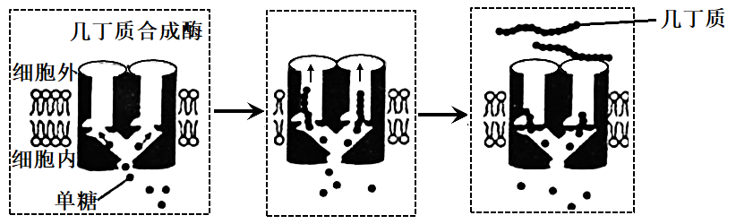
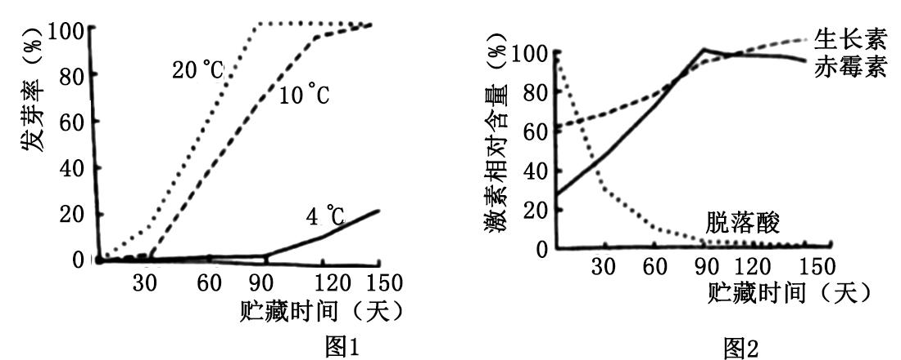
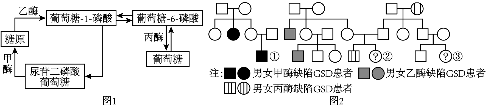
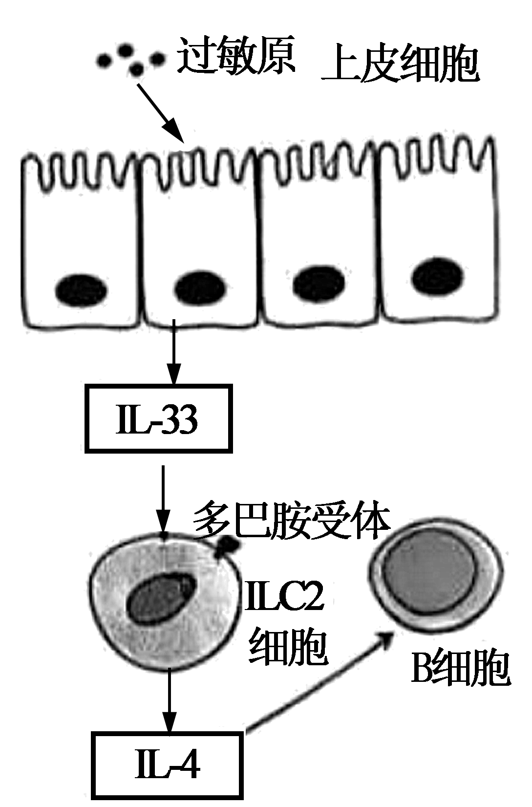
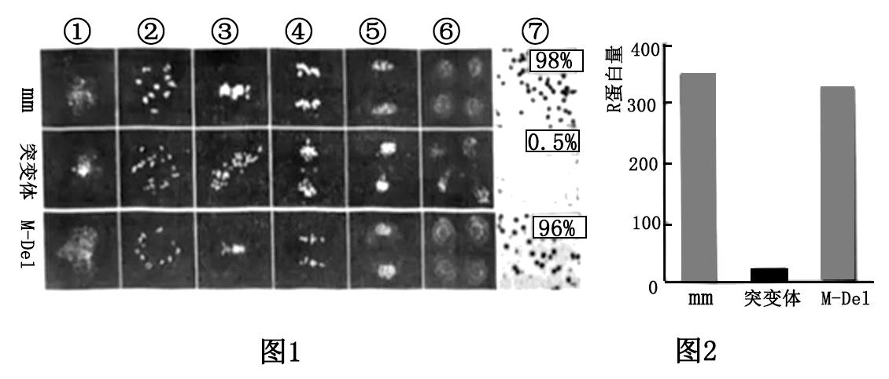
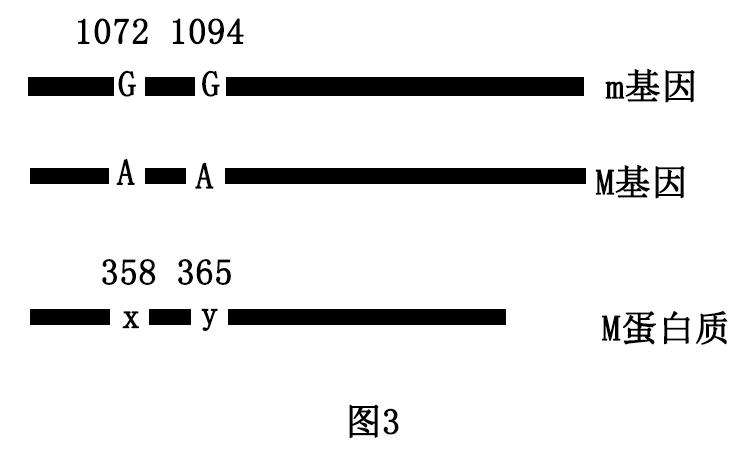

**2023年普通高等学校招生全国统一考试**

**生物重庆卷**

**一、单项选择题：本题共15小题，每小题3分，共45分。在每小题给出的四个选项中，只有一项是符合题目要求的。**

1\. 下列细胞结构中，对真核细胞合成多肽链，作用最小的是（ ）

A. 高尔基体 B. 线粒体 C. 核糖体 D. 细胞核

2\. 几丁质是昆虫外骨骼和真菌细胞壁的重要成分。中国科学家首次解析了几丁质合成酶的结构，进一步阐明了几丁质合成的过程，该研究结果在农业生产上具有重要意义。下列叙述错误的是（ ）

A. 细胞核是真菌合成几丁质的控制中心 B. 几丁质是由多个单体构成的多糖物质

C. 细胞通过跨膜运输将几丁质运到胞外 D. 几丁质合成酶抑制剂可用于防治病虫害

3\. 某团队用果蝇研究了高蛋白饮食促进深度睡眠的机制，发现肠道中的蛋白质促进肠道上皮细胞分泌神经肽Y，最终Y作用于大脑相关神经元，利于果蝇保持睡眠状态。下列叙述正确的是（ ）

A. 蛋白质作用于肠道上皮细胞的过程发生在内环境

B. 肠道上皮细胞分泌Y会使细胞膜的表面积减小

C. 肠道中的蛋白质增加使血液中的Y含量减少

D. 若果蝇神经元上Y受体减少，则容易从睡眠中醒来

4\. 研究放牧强度对草原群落特征的影响，对合理利用草原和防止荒漠化具有重要意义。下表为某高寒草原在不同放牧强度下的植物群落调查数据。下列叙述错误的是（ ）

|  |  |  |  |
|:---|:---|:---|:---|
| 放牧强度 | 物种数 | 生产力（t·hm-2） | 土壤有机碳含量（g·m-3） |
| 无 | 15 | 0．85 | 8472 |
| 轻度 | 23 | 1．10 | 9693 |
| 中度 | 15 | 0．70 | 9388 |
| 重度 | 6 | 0．45 | 7815 |

A. 中度放牧和无放牧下生产力不同，可能是物种组成不同所致

B. 重度放牧下土壤有机碳含量降低是分解者的分解过程加快所致

C. 放牧可能导致群落优势种改变且重度放牧下的优势种更加耐旱

D. 适度放牧是保护草原生物多样性和践行绿色发展理念的有效措施

5\. 果蝇有翅（H）对无翅（h）为显性。在某实验室繁育的果蝇种群中，部分无翅果蝇胚胎被转入小鼠W基因后（不整合到基因组），会发育成有翅果蝇，随后被放回原种群。下列推测不合理的是（ ）

A. W基因在不同物种中功能可能不同 B. H、W基因序列可能具有高度相似性

C. 种群中H、h基因频率可能保持相对恒定 D. 转入W基因的果蝇可能决定该种群朝有翅方向进化

6\. 某人头部受伤后出现食欲不振、乏力等症状，经检查后被诊断为抗利尿激素（ADH）分泌失调综合征，其部分化验结果见表。下列关于该患者的叙述，错误的是（ ）

|                  |            |                 |
|:-----------------|:-----------|:----------------|
| 项目名称         | 结果       | 参考值          |
| 血ADH            | 7．9Pmol/L | 2．3-7．4pmol/L |
| 血Na+ | 125mmol/L  | 137-147mmol/L   |
| 血K+  | 4．2mmol/L | 3．5-5．3mmol/L |

A. 下丘脑或垂体可能受到损伤 B. 血液中的红细胞出现吸水

C. 饮用清水能使尿Na+浓度恢复正常 D. 细胞外液对渗透压感受器的刺激较受伤前减少

7\. 某兴趣小组利用图示装置和表中试剂探究了透析袋的透性。当a为①、b为⑤，袋内溶液逐渐变为蓝色；当a为②、b为③，水浴（55℃）后透析袋内、外均不出现砖红色。下列叙述正确的是（ ）

|      |                              |
|:-----|:-----------------------------|
| 编号 | 试剂                         |
| ①    | 质量分数为3%的可溶性淀粉溶液 |
| ②    | 质量分数为5%的葡萄糖溶液     |
| ③    | 斐林试剂                     |
| ④    | 淀粉酶溶液                   |
| ⑤    | 碘溶液（棕红色）             |

A. 若a为①+②、b为③，水浴后透析袋外最终会出现砖红色

B. 若a为①+②、b为⑤，透析袋外的溶液最终会出现蓝色

C. 若a为①+④、b为⑤，透析袋内的溶液最终会出现棕红色

D. 若a为①+④、b为③，水浴后透析袋内最终会出现砖红色

8\. 我国学者首次揭示了夜间光照影响血糖代谢的机制。健康受试者于夜间分别在某波长光照和黑暗条件下口服等量葡萄糖，然后在不同时间检测血糖水平（图1）。夜间光照影响血糖代谢的过程如图2所示。下列叙述错误的是（ ）

A. 在夜间光照条件下，受试者血糖代谢的调节方式是神经调节

B. 与夜间黑暗条件相比，光照条件下受试者利用葡萄糖的速率下降

C. 若受试者棕色脂肪组织的代谢被抑制，则图1两条曲线趋于重叠

D. 长期熬夜的不良生活方式可增加患糖代谢相关疾病的风险

9\. 垃圾分类有利于变废为宝，减少环境污染。如图为分类后餐厨垃圾资源化处理的流程设计。下列叙述错误的是（ ）

A. 压榨出的油水混合物可再加工，生产出多种产品

B. 添加的木屑有利于堆肥体通气，还可作为某些微生物的碳源

C. X中需要添加合适的菌种，才能产生沼气

D. 为保证堆肥体中微生物的活性，不宜对堆肥体进行翻动

10\. 哺乳动物可利用食物中的NAM或NA合成NAD+，进而转化为NADH（\[H\]）。研究者以小鼠为模型，探究了哺乳动物与肠道菌群之间NAD+代谢的关系，如图所示。下列叙述错误的是（ ）

A. 静脉注射标记的NA，肠腔内会出现标记的NAM

B. 静脉注射标记的NAM，细胞质基质会出现标记的NADH

C. 食物中缺乏NAM时，组织细胞仍可用NAM合成NAD+

D. 肠道中的厌氧菌合成ATP所需的能量主要来自于NADH

11\. 为研究马铃薯贮藏时间与内源激素含量之间的关系，研究人员测定了马铃薯块茎贮藏期间在不同温度条件下的发芽率（图1），以及20℃条件下3种内源激素的含量（图2）。下列叙述正确的是（ ）

A. 贮藏第60天时，4℃下马铃薯块茎脱落酸含量可能高于20℃

B. 马铃薯块茎贮藏期间，赤霉素/脱落酸比值高抑制发芽

C. 降低温度或喷洒赤霉素均可延长马铃薯块茎贮藏时间

D. 20℃下贮藏120天后，赤霉素促进马铃薯芽生长的作用大于生长素

12\. 某小组通过PCR（假设引物长度为8个碱基短于实际长度）获得了含有目的基因的DNA片段，并用限制酶进行酶切（下图），再用所得片段成功构建了基因表达载体。下列叙述错误的是（ ）

A. 其中一个引物序列为5＇TGCGCAGT-3＇

B. 步骤①所用的酶是SpeI和CfoI

C. 用步骤①的酶对载体进行酶切，至少获得了2个片段

D. 酶切片段和载体连接时，可使用E．coli连接酶或T4连接酶

13\. 甲乙丙三种酶参与葡萄糖和糖原之间转化，过程如图1所示。任一酶的基因发生突变导致相应酶功能缺陷，均会引发GSD病。图2为三种GSD亚型患者家系，其中至少一种是伴性遗传。不考虑新的突变，下列分析正确的是（ ）

A. 若①同时患有红绿色盲，则其父母再生育健康孩子的概率是3/8

B. 若②长期表现为低血糖，则一定不是乙酶功能缺陷所致

C. 若丙酶缺陷GSD发病率是1/10000，则③患该病的概率为1/300

D. 三种GSD亚型患者体内的糖原含量都会异常升高

14\. 药物甲常用于肿瘤治疗，但对正常细胞有一定毒副作用。某小组利用试剂K（可将细胞阻滞在细胞周期某时期）研究了药物甲的毒性与细胞周期的关系，实验流程和结果如图所示。下列推测正确的是（ ）

注：G1：DNA合成前期；S：DNA合成期；G2：分裂准备期；M期：分裂期

A. 试剂K可以将细胞阻滞在G1期

B. 试剂K对细胞周期的阻滞作用不可逆

C. 药物甲主要作用于G2+M期，Ⅱ组的凋亡率应最低

D. 在机体内，药物甲对浆细胞的毒性强于造血干细胞

15\. 某小组以拟南芥原生质体为材料，研究了生长素（IAA）、组蛋白乙酰化及R基因对原生质体形成愈伤组织的影响。野生型（WT）和R基因突变型（rr）的原生质体分别经下表不同条件培养相同时间后，检测培养材料中R基因表达量，并统计愈伤组织形成率，结果如图所示。据此推断，下列叙述正确的是（ ）

|      |          |                           |
|:-----|:---------|:--------------------------|
| 编号 | 原生质体 | 培养条件                  |
| ①    | WT       | 培养基                    |
| ②    | WT       | 培养基+合适浓度的IAA      |
| ③    | rr       | 培养基                    |
| ④    | rr       | 培养基+合适浓度的IAA      |
| ⑤    | WT       | 培养基+组蛋白乙酰化抑制剂 |

A. 组蛋白乙酰化有利于WT原生质体形成愈伤组织

B. R基因通过促进IAA的合成提高愈伤组织形成率

C. 组蛋白乙酰化通过改变DNA碱基序列影响R基因表达量

D. 若用IAA合成抑制剂处理WT原生质体，愈伤组织形成率将升高

**二、非选择题：本题共5个小题，共55分。考生根据要求作答。**

16\. 妊娠与子宫内膜基质细胞功能密切相关。某研究小组通过如图所示的实验流程获得了子宫内膜基质细胞，以期用于妊娠相关疾病的研究。

（1）手术获得的皮肤组织需在低温下运至实验室，低温对细胞中各种蛋白质的作用为\_\_\_\_\_。

（2）过程①中，诱导形成PS细胞时，需提高成纤维细胞中4个基因的表达量，可采用\_\_\_\_\_技术将这些基因导入该细胞。这4个基因的主要作用为：M基因促进增殖，S基因和C基因控制干细胞特性，K基因抑制凋亡和衰老。若成纤维细胞形成肿瘤细胞，最有可能的原因是\_\_\_\_\_基因过量表达。

（3）培养iPS细胞时，应对所处环境定期消毒以降低细胞被污染风险。可用紫外线进行消毒的是\_\_\_\_\_（多选）。

A. 培养基 B. 培养瓶 C. 细胞培养室 D. CO2培养箱

（4）过程②中，iPS细胞经历的生命历程为\_\_\_\_\_。PCR技术可用于检测子宫内膜基质细胞关键基因的mRNA水平，mRNA需经过\_\_\_\_\_才能作为PCR扩增的模板。

17\. 阅读下列材料，回答问题。

有研究发现，在某滨海湿地，互花米草入侵5年后，导致耐高盐的碱蓬大面积萎缩而芦苇扩张，这种变化的关键驱动因素是不同生态系统之间的“长距离相互作用”（由非生物物质等介导），如图1所示。

假设有3种植食性昆虫分别以芦苇、碱蓬和互花米草为主要食物，昆虫数量变化能够反映所食植物种群数量变化。互花米草入侵后3种植食性昆虫数量变化如图2所示。

（1）据材料分析，本研究中介导“长距离相互作用”的非生物物质是\_\_\_\_\_。

（2）图2中，若昆虫①以互花米草为食，则昆虫③以\_\_\_\_\_ 为食；互花米草入侵5年后，昆虫②数量持续降低，直接原因是\_\_\_\_\_。

（3）物种之间的关系可随环境变化表现为正相互作用（对一方有利，另一方无影响或对双方有利）或负相互作用（如：竞争）。1~N年，芦苇和互花米草种间关系的变化是\_\_\_\_\_。

（4）互花米草入侵5年后，该湿地生态系统极有可能发生的变化有\_\_\_\_\_（多选）。

A. 互花米草向内陆和海洋两方向扩展

B. 群落内物种丰富度逐渐增加并趋于稳定

C. 群落水平结构和垂直结构均更加复杂

D. 为某些非本地昆虫提供生态位

E. 生态系统自我调节能力下降

18\. 某些过敏性哮喘患者体内B细胞活化的部分机制如图所示，呼吸道上皮细胞接触过敏原后，分泌细胞因子IL-33，活化肺部的免疫细胞ILC2．活化的ILC2细胞分泌细胞因子IL-4，参与B细胞的激活。

（1）除了IL-4等细胞因子外，B细胞活化还需要的信号有\_\_\_\_\_。过敏原再次进入机体，激活肥大细胞释放组（织）胺，肥大细胞被激活的过程是\_\_\_\_\_。

（2）研究发现，肺中部分神经元释放的多巴胺可作用于ILC2细胞。通过小鼠哮喘模型，发现哮喘小鼠肺组织中多巴胺含量较对照组明显下降，推测多巴胺对ILC2细胞释放IL-4的作用为\_\_\_\_\_（填“抑制”或“促进”）。对哮喘小鼠静脉注射多巴胺，待其进入肺部发挥作用后，与未注射多巴胺的哮喘小鼠相比，分泌IL-33、过敏原特异性抗体和组（织）胺的含量会\_\_\_\_\_、\_\_\_\_\_和\_\_\_\_\_。

（3）以上研究说明，机体维持稳态的主要调节机制是\_\_\_\_\_。

19\. 水稻是我国重要的粮食作物，光合能力是影响水稻产量的重要因素。

（1）通常情况下，叶绿素含量与植物的光合速率成正相关。但有研究发现，叶绿素含量降低的某一突变体水稻，在强光照条件下，其光合速率反而明显高于野生型。为探究其原因，有研究者在相同光照强度的强光条件下，测定了两种水稻的相关生理指标（单位省略），结果如下表。

<table style="width:80%;">
<colgroup>
<col style="width: 9%" />
<col style="width: 15%" />
<col style="width: 26%" />
<col style="width: 18%" />
<col style="width: 9%" />
</colgroup>
<tbody>
<tr>
<td rowspan="2" style="text-align: left;"></td>
<td colspan="2" style="text-align: left;">光反应</td>
<td colspan="2" style="text-align: left;">暗反应</td>
</tr>
<tr>
<td style="text-align: left;">光能转化效率</td>
<td style="text-align: left;">类囊体薄膜电子传递速率</td>
<td style="text-align: left;">RuBP羧化酶含量</td>
<td style="text-align: left;">Vmax</td>
</tr>
<tr>
<td style="text-align: left;">野生型</td>
<td style="text-align: left;">0．49</td>
<td style="text-align: left;">180．1</td>
<td style="text-align: left;">4．6</td>
<td style="text-align: left;">129．5</td>
</tr>
<tr>
<td style="text-align: left;">突变体</td>
<td style="text-align: left;">0．66</td>
<td style="text-align: left;">199．5</td>
<td style="text-align: left;">7．5</td>
<td style="text-align: left;">164．5</td>
</tr>
</tbody>
</table>

注：RuBP羧化酶：催化CO2固定的酶：Vmax：RuBP羧化酶催化的最大速率

①类囊体薄膜电子传递的最终产物是\_\_\_\_\_。RuBP羧化酶催化的底物是CO2和\_\_\_\_\_。

②据表分析，突变体水稻光合速率高于野生型的原因是\_\_\_\_\_。

（2）研究人员进一步测定了田间光照和遮荫条件下两种水稻的产量（单位省略），结果如下表。

|        |              |              |
|:-------|:-------------|:-------------|
|        | 田间光照产量 | 田间遮阴产量 |
| 野生型 | 6．93        | 6．20        |
| 突变体 | 7．35        | 3．68        |

①在田间遮荫条件下，突变体水稻产量却明显低于野生型，造成这个结果的内因是\_\_\_\_\_，外因是\_\_\_\_\_。

②水稻叶肉细胞的光合产物有淀粉和\_\_\_\_\_，两者可以相互转化，后者是光合产物的主要运输形式，在开花结实期主要运往籽粒。

③根据以上结果，推测两种水稻的光补偿点（光合速率和呼吸速率相等时的光照强度），突变体水稻较野生型\_\_\_\_\_（填“高”、“低”或“相等”）。

20\. 科学家在基因型为mm的普通玉米（2n=20）群体中发现了杂合雄性不育突变体，并从中克隆了控制不育性状的显性基因M（编码蛋白质M）。研究发现，突变体玉米雄性不育与花粉母细胞减数分裂异常密切相关（图1）：进一步研究发现，减数分裂细胞中影响染色体联会的R蛋白量与M蛋白质有关（图2）。

注：M-Del：敲除M基因的突变体；①~⑤为依次发生的减数分裂Ⅰ或Ⅱ某时期：⑥为减数分裂Ⅱ结束后形成的子细胞；⑦为花粉及可育率

（1）图1中③所示的时期为\_\_\_\_\_，⑥中单个正常细胞内染色体数目为\_\_\_\_\_。玉米减数分裂细胞中R蛋白量减少，植株的花粉可育率将\_\_\_\_\_。推测玉米突变体中M蛋白质影响减数分裂的机制为\_\_\_\_\_。

（2）欲利用现有植株通过杂交方式获得种子用于M基因的后续研究，杂交亲本的基因型分别应为\_\_\_\_\_。

（3）M基因与m基因DNA序列相比，非模板链上第1072和1094位的两个碱基突变为A，致使M蛋白质的第358和365位氨基酸分别变为x和y（图3）；按5＇-3＇的方向，转运x（第358位）的tRNA上反密码子第\_\_\_\_\_位碱基必为U。如需用定点突变方法分析M基因的两个突变位点对玉米花粉可育率的影响，可采取的分析思路为\_\_\_\_\_。

