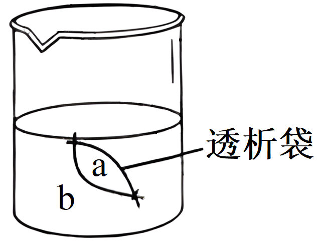
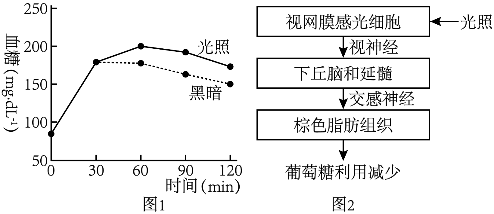
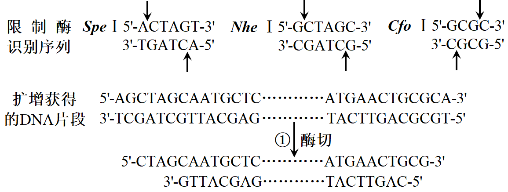
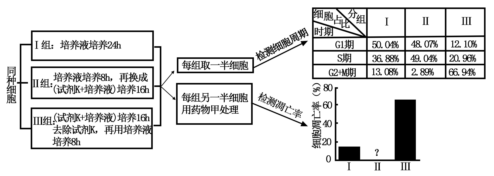
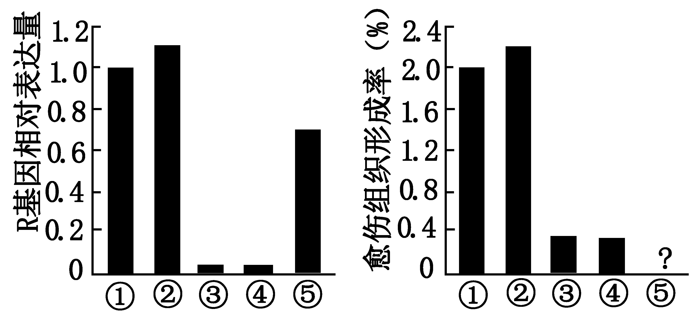
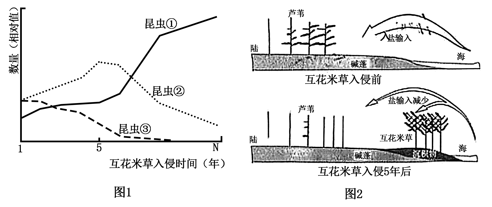

**2023年普通高等学校招生全国统一考试**

**生物重庆卷**

**一、单项选择题：本题共15小题，每小题3分，共45分。在每小题给出的四个选项中，只有一项是符合题目要求的。**

1\. 下列细胞结构中，对真核细胞合成多肽链，作用最小的是（ ）

A. 高尔基体 B. 线粒体 C. 核糖体 D. 细胞核

【答案】A

【解析】

【分析】1、转录：转录是指以DNA的一条链为模板，按照碱基互补配对原则，合成RNA的过程。转录的场所：细胞核。

2、翻译：翻译是指以mRNA为模板，合成具有一定氨基酸排列顺序的蛋白质的过程。翻译的场所：细胞质的核糖体上。

【详解】真核细胞合成多肽链包括转录和翻译两个过程，转录的场所为细胞核，翻译的场所是核糖体，过程中需要的能量由线粒体提供，高尔基体对来自内质网的蛋白质进行加工、分类和包装，发送蛋白质，所以作用最小的是高尔基体，A正确，BCD错误。

故选A

2\. 几丁质是昆虫外骨骼和真菌细胞壁的重要成分。中国科学家首次解析了几丁质合成酶的结构，进一步阐明了几丁质合成的过程，该研究结果在农业生产上具有重要意义。下列叙述错误的是（ ）

A. 细胞核是真菌合成几丁质的控制中心 B. 几丁质是由多个单体构成的多糖物质

C. 细胞通过跨膜运输将几丁质运到胞外 D. 几丁质合成酶抑制剂可用于防治病虫害

【答案】C

【解析】

【分析】几丁质是一种多糖，又称壳多糖，广泛存在于甲壳类动物和昆虫的外骨骼、真菌的细胞壁中。分析题图可知，几丁质合成的过程主要有三个阶段，第一个阶段，几丁质合成酶将细胞中的单糖转移到细胞膜上用于合成几丁质糖链。第二阶段，新生成的几丁质糖链通过细胞膜上的转运通道释放到细胞外。第三阶段，释放的几丁质链自发组装形成几丁质。

【详解】A、细胞核是细胞代谢和遗传的控制中心，真菌合成几丁质属于细胞代谢，A正确；

B、N-乙酰葡萄糖氨是几丁质的单体，几丁质是由多个这样的单体脱水缩合而成的多糖，B正确；

C、据图分析可知，因为几丁质的合成是在细胞膜上进行的，所以几丁质运到胞外的过程没有跨膜运输，C错误；

D、几丁质合成酶抑制剂可以抑制该酶的活性，打断生物合成几丁质的过程，从而让缺乏几丁质的害虫、真菌死亡，故可用于防止病虫害，D正确。

故选C

3\. 某团队用果蝇研究了高蛋白饮食促进深度睡眠的机制，发现肠道中的蛋白质促进肠道上皮细胞分泌神经肽Y，最终Y作用于大脑相关神经元，利于果蝇保持睡眠状态。下列叙述正确的是（ ）

A. 蛋白质作用于肠道上皮细胞的过程发生在内环境

B. 肠道上皮细胞分泌Y会使细胞膜的表面积减小

C. 肠道中的蛋白质增加使血液中的Y含量减少

D. 若果蝇神经元上Y的受体减少，则容易从睡眠中醒来

【答案】D

【解析】

【分析】内环境是指细胞外液，主要由血浆、组织液和淋巴组成。

【详解】A、肠道属于外界环境，故肠道中的蛋白质作用于肠道上皮细胞的过程不是发生在内环境，A错误；

B、肠道上皮细胞通过胞吐的方式分泌Y的过程中一部分细胞中的囊泡与细胞膜融合会使细胞膜的表面积增大，B错误；

C、根据题意，摄入的蛋白质促进肠道上皮细胞分泌神经肽Y，C错误；

D、神经肽Y作用于大脑相关神经元，进而促进深度睡眠，故若果蝇神经元上Y的受体减少，则Y不能发挥作用，容易从睡眠中醒来，D正确。

故选D。

4\. 研究放牧强度对草原群落特征的影响，对合理利用草原和防止荒漠化具有重要意义。下表为某高寒草原在不同放牧强度下的植物群落调查数据。下列叙述错误的是（ ）

|  |  |  |  |
|:---|:---|:---|:---|
| 放牧强度 | 物种数 | 生产力（t·hm-2） | 土壤有机碳含量（g·m-3） |
| 无 | 15 | 0．85 | 8472 |
| 轻度 | 23 | 1．10 | 9693 |
| 中度 | 15 | 0．70 | 9388 |
| 重度 | 6 | 0．45 | 7815 |

A. 中度放牧和无放牧下生产力不同，可能是物种组成不同所致

B. 重度放牧下土壤有机碳含量降低是分解者的分解过程加快所致

C. 放牧可能导致群落优势种改变且重度放牧下的优势种更加耐旱

D. 适度放牧是保护草原生物多样性和践行绿色发展理念的有效措施

【答案】B

【解析】

【分析】人类对生物群落演替的影响远远超过其他某些自然因素，因为人类生产活动通常是有意识、有目的地进行的，可以对自然环境中的生态关系起着促进、抑制、改造和重建的作用。但人类的活动对群落的演替也不是只具有破坏性的，也可以是通过建立新的人工群落实现受损生态系统的恢复。

【详解】A、中度放牧和无放牧由于放牧的强度不同，可能造成物种组成不同，导致生产力不同，A正确；

B、重度放牧下土壤有机碳含量降低是由于重度放牧造成草原荒漠化，因此土壤中有机碳含量降低，B错误；

C、表格数据是在高寒草原测定，放牧使牲畜喜欢吃的草数目降低，引起群落演替，发生优势物种的改变，而现在重度放牧的条件下，可能会发生草场荒漠化，土壤蓄水能力降低，因此优势种更加耐旱，C正确；

D、适度放牧避免草场荒漠化，是保护草原生物多样性和践行绿色发展理念的有效措施，D正确。

故选B。

5\. 果蝇有翅（H）对无翅（h）为显性。在某实验室繁育的果蝇种群中，部分无翅果蝇胚胎被转入小鼠W基因后（不整合到基因组），会发育成有翅果蝇，随后被放回原种群。下列推测不合理的是（ ）

A. W基因不同物种中功能可能不同 B. H、W基因序列可能具有高度相似性

C. 种群中H、h基因频率可能保持相对恒定 D. 转入W基因的果蝇可能决定该种群朝有翅方向进化

【答案】D

【解析】

【分析】现代生物进化理论的基本观点：种群是生物进化的基本单位，生物进化的实质在于种群基因频率的改变；突变和基因重组产生生物进化的原材料；自然选择使种群的基因频率发生定向的改变并决定生物进化的方向；隔离是新物种形成的必要条件。

【详解】A、W基因来自于小鼠，转入无翅的果蝇胚胎后，果蝇发育为有翅，因此W基因在小鼠和果蝇中功能可能不同，A正确；

B、H基因决定了果蝇有翅，而W基因转入无翅果蝇后，也发育为有翅，说明H、W基因序列可能具有高度相似性，B正确；

C、在种群数量足够大，没有迁入迁出、突变等因素下，种群个体间随机交配，基因频率是相对稳定的，所以种群中H、h基因频率可能保持相对恒定 ，C正确；

D、决定进化方向的是自然选择，而不是基因，D错误。

故选D。

6\. 某人头部受伤后出现食欲不振、乏力等症状，经检查后被诊断为抗利尿激素（ADH）分泌失调综合征，其部分化验结果见表。下列关于该患者的叙述，错误的是（ ）

|                  |            |                 |
|:-----------------|:-----------|:----------------|
| 项目名称         | 结果       | 参考值          |
| 血ADH            | 7．9Pmol/L | 2．3-7．4pmol/L |
| 血Na+ | 125mmol/L  | 137-147mmol/L   |
| 血K+  | 4．2mmol/L | 3．5-5．3mmol/L |

A. 下丘脑或垂体可能受到损伤 B. 血液中的红细胞出现吸水

C. 饮用清水能使尿Na+浓度恢复正常 D. 细胞外液对渗透压感受器的刺激较受伤前减少

【答案】C

【解析】

【分析】人体水盐平衡的调节：

1、体内水少或吃的食物过咸时→细胞外液渗透压升高→下丘脑感受器受到刺激→垂体释放抗利尿激素多→肾小管、集合管重吸收增加→尿量减少，同时大脑皮层产生渴觉（饮水）；2、体内水多→细胞外液渗透压降低→下丘脑感受器受到刺激→垂体释放抗利尿激素少→肾小管、集合管重吸收减少→尿量增加。

【详解】A、下丘脑渗透压调节中枢，且可以合成抗利尿激素，并由垂体释放抗利尿激素，头部受伤可能导致抗利尿激素分泌失调，推测受伤部位可能为下丘脑或垂体，A正确；

B、该患者血液中钠离子浓度为125mmol/L，低于正常值，说明其细胞外液渗透压降低，红细胞可能会吸水涨大，B正确；

C、由于患者受伤部位可能为下丘脑或垂体，饮用清水不能使尿Na+浓度恢复正常，C错误；

D、该患者血液中钠离子浓度为125mmol/L，低于正常值，说明其受伤后细胞外液渗透压降低，细胞外液对渗透压感受的刺激较受伤前减少，D正确。

故选C。

7\. 某兴趣小组利用图示装置和表中试剂探究了透析袋的透性。当a为①、b为⑤，袋内溶液逐渐变为蓝色；当a为②、b为③，水浴（55℃）后透析袋内、外均不出现砖红色。下列叙述正确的是（ ）

|      |                              |
|:-----|:-----------------------------|
| 编号 | 试剂                         |
| ①    | 质量分数为3%的可溶性淀粉溶液 |
| ②    | 质量分数为5%的葡萄糖溶液     |
| ③    | 斐林试剂                     |
| ④    | 淀粉酶溶液                   |
| ⑤    | 碘溶液（棕红色）             |

A. 若a为①+②、b为③，水浴后透析袋外最终会出现砖红色

B. 若a为①+②、b为⑤，透析袋外的溶液最终会出现蓝色

C. 若a为①+④、b为⑤，透析袋内的溶液最终会出现棕红色

D. 若a为①+④、b为③，水浴后透析袋内最终会出现砖红色

【答案】C

【解析】

【分析】1、要发生渗透作用，需要有半透膜和膜两侧溶液具有浓度差。水分子总是从浓度低一侧通过半透膜向浓度高的一侧扩散。

2、检测生物组织中的还原糖，可用斐林试剂，斐林试剂与还原糖在热水浴条件下反应生成砖红色沉淀。

3、分析题图：当a为①、b为⑤，袋内溶液逐渐变为蓝色，说明淀粉不能通过透析袋、碘液可通过透析袋；当a为②、b为③，水浴（55℃）后透析袋内、外均不出现砖红色，说明葡萄糖和斐林试剂均不能通过透析袋。

【详解】A、若a为①+②、b为③，由于葡萄糖和斐林试剂均不能通过透析袋，水浴后透析袋外均不会出现砖红色，A错误；

B、若a为①+②、b为⑤，由于淀粉不能通过透析袋，而碘液可进入透析袋内，故透析袋外的溶液不会出现蓝色，B错误；

C、若a为①+④、b为⑤，淀粉酶会水解淀粉使形成麦芽糖（二糖），由于葡萄糖单糖不能通过透析袋，故麦芽糖也不能不能通过透析袋，同时由于碘液可进入透析袋内，故透析袋内的溶液最终会出现棕红色，C正确；

D、若a为①+④、b为③，由于斐林试剂不能进入透析袋内，故透析袋内不会出现砖红色，D错误。

故选C。

8\. 我国学者首次揭示了夜间光照影响血糖代谢的机制。健康受试者于夜间分别在某波长光照和黑暗条件下口服等量葡萄糖，然后在不同时间检测血糖水平（图1）。夜间光照影响血糖代谢的过程如图2所示。下列叙述错误的是（ ）

A. 在夜间光照条件下，受试者血糖代谢的调节方式是神经调节

B. 与夜间黑暗条件相比，光照条件下受试者利用葡萄糖的速率下降

C. 若受试者棕色脂肪组织的代谢被抑制，则图1两条曲线趋于重叠

D. 长期熬夜的不良生活方式可增加患糖代谢相关疾病的风险

【答案】A

【解析】

【分析】1、分析图1曲线可知，光照和黑暗条件下口服等量葡萄糖，30分钟后两者出现差别，光照下血糖浓度高于黑暗条件下血糖浓度。

2、根据图2可知：光调节葡萄糖代谢的机制：光可通过神经调节的方式影向糖代谢，其信号传导途径是：光→视网膜感光细胞→传入神经→下丘脑和延髓箭头交感神经→棕色脂肪细胞，葡萄糖利用减少，导致血糖上升。

【详解】A、血糖代谢的调节除了如图2所示的神经调节之外，还存在胰岛素、胰高血糖素等激素调节，A错误；

B、由图1可知，光照和黑暗条件下口服等量葡萄糖，光照下血糖浓度高于黑暗条件下血糖浓度，说明与夜间黑暗条件，光照条件下受试者利用葡萄糖的速率下降，B正确；

C、光照通过反射弧使交感神经作用于棕色脂肪细胞利用葡萄糖减少，若棕色脂肪组织的代谢被抑制，则黑暗条件下葡萄糖的利用也会减少，即图1两条曲线趋于重叠，C正确；

D、光可通过神经调节的方式影向糖代谢，其信号传导途径是：光→视网膜感光细胞→传入神经→下丘脑和延髓箭头交感神经→棕色脂肪细胞，葡萄糖利用减少，导致血糖上升，故长期熬夜的不良生活方式可增加患糖代谢相关疾病的风险，D正确。

故选A。

9\. 垃圾分类有利于变废为宝，减少环境污染。如图为分类后餐厨垃圾资源化处理的流程设计。下列叙述错误的是（ ）

A. 压榨出的油水混合物可再加工，生产出多种产品

B. 添加的木屑有利于堆肥体通气，还可作为某些微生物的碳源

C. X中需要添加合适的菌种，才能产生沼气

D. 为保证堆肥体中微生物的活性，不宜对堆肥体进行翻动

【答案】D

【解析】

【分析】生态系统的功能包括能量流动、物质循环和信息传递，三者缺一不可；物质循环是生态系统的基础，能量流动是生态系统的动力，信息传递则决定着能量流动和物质循环的方向和状态；信息传递是双向的，能量流动是单向的，物质循环具有全球性。

【详解】A、压榨出的油水混合物可再加工，生产出多种产品，有利于实现物质的循环再生和能量的多级利用，A正确；

B、添加的木屑有利于堆肥体通气，木屑也可作为某些微生物的碳源，B正确；

C、X中需要添加合适的菌种，通过分解有机物才能产生沼气，C正确；

D、为保证堆肥体中微生物的活性，可以对堆肥体进行翻动，D错误。

故选D。

10\. 哺乳动物可利用食物中的NAM或NA合成NAD+，进而转化为NADH（\[H\]）。研究者以小鼠为模型，探究了哺乳动物与肠道菌群之间NAD+代谢的关系，如图所示。下列叙述错误的是（ ）

A. 静脉注射标记的NA，肠腔内会出现标记的NAM

B. 静脉注射标记的NAM，细胞质基质会出现标记的NADH

C. 食物中缺乏NAM时，组织细胞仍可用NAM合成NAD+

D. 肠道中的厌氧菌合成ATP所需的能量主要来自于NADH

【答案】D

【解析】

【分析】无氧呼吸的第一阶段发生在细胞质基质，葡萄糖分解生成丙酮酸，释放少量能量，生成少量ATP；无氧呼吸第二阶段发生在细胞质基质，丙酮酸与还原氢反应生成乳酸或二氧化碳和酒精，不释放能量。

【详解】A、静脉注射标记的NA，NA可以在细胞内转化为NAD+，NAD+可以在细胞内转化为NAM，NAM可以被肠道菌群利用，因此肠腔内会出现标记的NAM，A正确；

B、静脉注射标记的NAM，NAM可以在细胞内转化为NAD+，NAD+可以在细胞内转化为NADH，因此细胞质基质会出现标记的NADH，B正确；

C、结合题图，食物中缺乏NAM时，组织细胞仍可用NA合成NAD+，C正确；

D、肠道中的厌氧菌合成ATP所需的能量主要来自于细胞呼吸（无氧呼吸），D错误。

故选D。

11\. 为研究马铃薯贮藏时间与内源激素含量之间的关系，研究人员测定了马铃薯块茎贮藏期间在不同温度条件下的发芽率（图1），以及20℃条件下3种内源激素的含量（图2）。下列叙述正确的是（ ）

A. 贮藏第60天时，4℃下马铃薯块茎脱落酸含量可能高于20℃

B. 马铃薯块茎贮藏期间，赤霉素/脱落酸比值高抑制发芽

C. 降低温度或喷洒赤霉素均可延长马铃薯块茎的贮藏时间

D. 20℃下贮藏120天后，赤霉素促进马铃薯芽生长的作用大于生长素

【答案】A

【解析】

【分析】分析图1可知，随贮藏时间延长，马铃薯块茎的发芽率逐渐升高，温度越低，发芽时间越晚，完全发芽所需时间越长。分析图2可知，在20℃条件下，随贮藏时间延长，生长素相对含量升高，赤霉素相对含量先升高再略微降低，脱落酸相对含量不断降低。

【详解】A、从图1中可知，贮藏第60天时，4℃下马铃薯块茎发芽率明显低于20℃时，而脱落酸具有抑制马铃薯发芽的作用，因此4℃下马铃薯块茎的脱落酸含量可能高于20℃，A正确；

B、赤霉素能抵消脱落酸对马铃薯发芽的抑制作用，解除休眠，促进发芽。马铃薯块茎贮藏期间，赤霉素/脱落酸比值高则会促进发芽，B错误；

C、据分析可知，降低温度可使马铃薯延迟发芽，从而延长马铃薯块茎的贮藏时间，喷洒赤霉素则会使马铃薯提前发芽，缩短马铃薯块茎的贮藏时间，C错误；

D、从图2中只能看出20℃下贮藏120天后，赤霉素的相对含量比生长素低，无法比较两种激素促进马铃薯芽生长的作用大小，D错误。

故选A。

12\. 某小组通过PCR（假设引物长度为8个碱基短于实际长度）获得了含有目的基因的DNA片段，并用限制酶进行酶切（下图），再用所得片段成功构建了基因表达载体。下列叙述错误的是（ ）

A. 其中一个引物序列为5＇TGCGCAGT-3＇

B. 步骤①所用的酶是SpeI和CfoI

C. 用步骤①的酶对载体进行酶切，至少获得了2个片段

D. 酶切片段和载体连接时，可使用E．coli连接酶或T4连接酶

【答案】B

【解析】

【分析】E.coliDNA连接酶只能连接黏性末端；T4DNA连接酶既可连接平末端，又可连接黏性末端。

【详解】A、由于引物只能引导子链从5＇到3＇，根据碱基互补配对原则，其中一个引物序列为5＇TGCGCAGT-3＇，A正确；

B、根据三种酶的酶切位点，左侧的黏性末端是使用NheI切割形成的，右边的黏性末端是用CfoI切割形成的，B错误；

C、用步骤①的酶对载体进行酶切，使用了NheI和CfoI进行切割，根据他们的识别位点以及原本DNA的序列，切割之后至少获得了2个片段，C正确；

D、图中形成的是黏性末端，而E.coliDNA连接酶只能连接黏性末端；T4DNA连接酶既可连接平末端，又可连接黏性末端，D正确。

故选B。

13\. 甲乙丙三种酶参与葡萄糖和糖原之间的转化，过程如图1所示。任一酶的基因发生突变导致相应酶功能缺陷，均会引发GSD病。图2为三种GSD亚型患者家系，其中至少一种是伴性遗传。不考虑新的突变，下列分析正确的是（ ）

A. 若①同时患有红绿色盲，则其父母再生育健康孩子的概率是3/8

B. 若②长期表现为低血糖，则一定不是乙酶功能缺陷所致

C. 若丙酶缺陷GSD发病率是1/10000，则③患该病的概率为1/300

D. 三种GSD亚型患者体内的糖原含量都会异常升高

【答案】B

【解析】

【分析】图1是甲乙丙三种酶参与葡萄糖和糖原之间的转化，其中乙和丙酶功能缺陷会导致葡萄糖含量降低；由图2判断甲酶缺陷GSD病是常染色体隐性遗传，乙丙两种病均为隐性遗传病，丙酶缺陷GSD病女性患者生出正常儿子，可排除伴X隐性遗传，三种病中其中至少一种是伴性遗传，所以乙酶缺陷GSD病是伴X隐性遗传。

【详解】A、①是甲酶缺陷GSD患者，同时又患红绿色盲，伴X隐性遗传，则可设①基因型是aaY，双亲的是AaY，Aa，则其父母再生育健康孩子的概率是×=，A错误；

B、乙酶缺陷GSD病是伴X隐性遗传，②是女性双亲均正常，则②一定不是乙酶缺陷GSD病，②长期表现为低血糖，则可能是丙酶功能缺陷导致的，B正确；

C、丙酶缺陷GSD病也是常染色体隐性遗传，设③的父亲基因型是Dd，丙酶缺陷GSD发病率是1/10000，则则d配子的概率是1/100，D配子的概率是99/100，因为母亲是正常的，则母亲可能得基因型是Dd、DD，其中Dd的概率是2/101。故③患病的概率是2/101×1/4=1/202，C错误；

D、三种GSD亚型患者体内的甲酶功能缺陷会导致不能合成糖原，因此糖原含量下降，D错误。

故选B。

14\. 药物甲常用于肿瘤治疗，但对正常细胞有一定的毒副作用。某小组利用试剂K（可将细胞阻滞在细胞周期某时期）研究了药物甲的毒性与细胞周期的关系，实验流程和结果如图所示。下列推测正确的是（ ）

注：G1：DNA合成前期；S：DNA合成期；G2：分裂准备期；M期：分裂期

A. 试剂K可以将细胞阻滞在G1期

B. 试剂K对细胞周期的阻滞作用不可逆

C. 药物甲主要作用于G2+M期，Ⅱ组的凋亡率应最低

D. 在机体内，药物甲对浆细胞的毒性强于造血干细胞

【答案】C

【解析】

【分析】细胞周期是指连续分裂的细胞从一次分裂完成时开始，到下一次细胞分裂完成时结束的一段时间。细胞周期包括分裂间期和分裂期，分裂间期包括G1、S、G2, 且在细胞周期中占据90-95%的时间，此期进行DNA的复制和有关蛋白质的合成，为分裂期做物质准备，此后进入分裂期（M）。

【详解】A、与Ⅰ组相比，Ⅱ组添加了试剂K，由表格数据可以看出Ⅱ组的细胞主要停滞在S期，A错误；

B、对比第Ⅱ组和第Ⅲ组可以得出试剂K对细胞周期的阻滞作用是可逆，B错误；

C、药物甲主要作用于G2+M期，Ⅱ组处于G2+M期细胞数最少，所以Ⅱ组的凋亡率应最低，C正确；

D、浆细胞为高度分化的细胞不再进行细胞分裂，所以药物甲对造血干细胞的毒性强于浆细胞，D错误。

故选C。

15\. 某小组以拟南芥原生质体为材料，研究了生长素（IAA）、组蛋白乙酰化及R基因对原生质体形成愈伤组织的影响。野生型（WT）和R基因突变型（rr）的原生质体分别经下表不同条件培养相同时间后，检测培养材料中R基因表达量，并统计愈伤组织形成率，结果如图所示。据此推断，下列叙述正确的是（ ）

|      |          |                           |
|:-----|:---------|:--------------------------|
| 编号 | 原生质体 | 培养条件                  |
| ①    | WT       | 培养基                    |
| ②    | WT       | 培养基+合适浓度的IAA      |
| ③    | rr       | 培养基                    |
| ④    | rr       | 培养基+合适浓度的IAA      |
| ⑤    | WT       | 培养基+组蛋白乙酰化抑制剂 |

A. 组蛋白乙酰化有利于WT原生质体形成愈伤组织

B. R基因通过促进IAA的合成提高愈伤组织形成率

C. 组蛋白乙酰化通过改变DNA碱基序列影响R基因表达量

D. 若用IAA合成抑制剂处理WT原生质体，愈伤组织形成率将升高

【答案】A

【解析】

【分析】离体的植物组织或细胞，在培养一段时间后，会通过细胞分裂形成愈伤组织。愈伤组织的细胞排列疏松而无规则，是一种高度液泡化的呈无定形状态的薄壁细胞。由高度分化的植物组织或细胞产生愈伤组织的过程，称为植物细胞的脱分化。脱分化产生的愈伤组织继续进行培养，又可以重新分化成根或芽等器官，这个过程叫做再分化。再分化形成的试管苗，移栽到地里，可以发育成完整的植株。

【详解】A、①和③进行对比可以看出R基因表达量高，愈伤组织形成率高，①和⑤对比，使用组蛋白乙酰化抑制剂之后，R基因的表达量下降，愈伤组织的形成率也会降低，因此推测组蛋白乙酰化有利于WT原生质体形成愈伤组织，A正确；

B、图中数据无法得出R基因是通过促进IAA的合成提高愈伤组织形成率，B错误；

C、图中的数据没有关于DNA碱基序列的测定，因此无法推测组蛋白乙酰化通过改变DNA碱基序列影响R基因表达量，C错误；

D、①和②对比可以看出IAA能够促进愈伤组织的形成，因此若用IAA合成抑制剂处理WT原生质体，愈伤组织形成率将降低，D错误。

故选A。

**二、非选择题：本题共5个小题，共55分。考生根据要求作答。**

16\. 妊娠与子宫内膜基质细胞的功能密切相关。某研究小组通过如图所示的实验流程获得了子宫内膜基质细胞，以期用于妊娠相关疾病的研究。

（1）手术获得的皮肤组织需在低温下运至实验室，低温对细胞中各种蛋白质的作用为\_\_\_\_\_。

（2）过程①中，诱导形成PS细胞时，需提高成纤维细胞中4个基因的表达量，可采用\_\_\_\_\_技术将这些基因导入该细胞。这4个基因的主要作用为：M基因促进增殖，S基因和C基因控制干细胞特性，K基因抑制凋亡和衰老。若成纤维细胞形成肿瘤细胞，最有可能的原因是\_\_\_\_\_基因过量表达。

（3）培养iPS细胞时，应对所处环境定期消毒以降低细胞被污染风险。可用紫外线进行消毒的是\_\_\_\_\_（多选）。

A. 培养基 B. 培养瓶 C. 细胞培养室 D. CO2培养箱

（4）过程②中，iPS细胞经历的生命历程为\_\_\_\_\_。PCR技术可用于检测子宫内膜基质细胞关键基因的mRNA水平，mRNA需经过\_\_\_\_\_才能作为PCR扩增的模板。

【答案】（1）抑制酶的活性（降低蛋白质或酶的活性），防止蛋白质变性

（2） ①. 转基因 ②. M （3）CD

（4） ①. 增殖分化 ②. 逆转录/反转录

【解析】

【分析】1、构建基因表达载体的目的是使目的基因在受体细胞中稳定存在并且可以遗传给下一代并表达和发挥作用。基因表达载体的组成：复制原点+目的基因+启动子+终止子+标记基因。

2、动物细胞培养的条件：

（1）无菌、无毒的环境：①消毒、灭菌；②添加一定量的抗生素；③定期更换培养液，以清除代谢废物。

（2）营养物质：糖、氨基酸、促生长因子、无机盐、微量元素等，还需加入血清、血浆等天然物质。

（3）温度和pH：36.5℃±0.5℃；适宜的pH：7.2～7.4。

（4）气体环境：95%空气（细胞代谢必需的）和5%的CO2（维持培养液的pH）。

【小问1详解】

低温可以抑制酶的活性，防止蛋白质变性，使细胞中的蛋白质维持正常的生理功能。

【小问2详解】

将外源基因导入细胞内，通常需要转基因技术。即过程①中，诱导形成PS细胞时，需提高成纤维细胞中4个基因的表达量，可采用转基因技术将这些基因导入该细胞。M基因促进增殖，S基因和C基因控制干细胞特性，K基因抑制凋亡和衰老。肿瘤细胞（癌细胞）具有无限增殖的能力，因此若成纤维细胞形成肿瘤细胞，最有可能的原因是M基因过量表达造成的。

【小问3详解】

培养iPS细胞时，应对所处环境定期消毒以降低细胞被污染风险。可用紫外线对细胞培养室和CO2培养箱进行消毒处理，而对培养基和培养瓶需要进行灭菌处理，因此AB错误，CD正确。

故选CD。

【小问4详解】

由图可知，过程②中，iPS细胞经过细胞的分裂分化，即增殖分化，形成了体腔上皮。PCR扩增的模板为DNA，因此若想利用PCR技术检测子宫内膜基质细胞关键基因的mRNA水平，mRNA需经过逆转录过程形成DNA，才可作为PCR的模板。

17\. 阅读下列材料，回答问题。

有研究发现，在某滨海湿地，互花米草入侵5年后，导致耐高盐的碱蓬大面积萎缩而芦苇扩张，这种变化的关键驱动因素是不同生态系统之间的“长距离相互作用”（由非生物物质等介导），如图1所示。

假设有3种植食性昆虫分别以芦苇、碱蓬和互花米草为主要食物，昆虫数量变化能够反映所食植物种群数量变化。互花米草入侵后3种植食性昆虫数量变化如图2所示。

（1）据材料分析，本研究中介导“长距离相互作用”的非生物物质是\_\_\_\_\_。

（2）图2中，若昆虫①以互花米草为食，则昆虫③以\_\_\_\_\_ 为食；互花米草入侵5年后，昆虫②数量持续降低，直接原因是\_\_\_\_\_。

（3）物种之间的关系可随环境变化表现为正相互作用（对一方有利，另一方无影响或对双方有利）或负相互作用（如：竞争）。1~N年，芦苇和互花米草种间关系的变化是\_\_\_\_\_。

（4）互花米草入侵5年后，该湿地生态系统极有可能发生的变化有\_\_\_\_\_（多选）。

A. 互花米草向内陆和海洋两方向扩展

B. 群落内物种丰富度逐渐增加并趋于稳定

C. 群落水平结构和垂直结构均更加复杂

D. 为某些非本地昆虫提供生态位

E. 生态系统自我调节能力下降

【答案】（1）盐 （2） ①. 碱蓬 ②. 昆虫②的食物芦苇种群数量降低

（3）正相互作用转为负相互作用 （4）ADE

【解析】

【分析】结合题干“有研究发现，在某滨海湿地，互花米草入侵5年后，导致耐高盐的碱蓬大面积萎缩而芦苇扩张”、“假设有3种植食性昆虫分别以芦苇、碱蓬和互花米草为主要食物，昆虫数量变化能够反映所食植物种群数量变化”可知，图1中昆虫①以互花米草为食，昆虫②以芦苇为食，昆虫③以碱蓬为食。

【小问1详解】

结合题干“有研究发现，在某滨海湿地，互花米草入侵5年后，导致耐高盐的碱蓬大面积萎缩而芦苇扩张”推测，本研究中介导“长距离相互作用”的非生物物质是盐。

【小问2详解】

结合题干“昆虫数量变化能够反映所食植物种群数量变化”，且互花米草入侵5年后，导致耐高盐的碱蓬大面积萎缩而芦苇扩张，图2中，若昆虫①以互花米草为食，则昆虫③以碱蓬为食（图1中③的数量一直在减少）；互花米草入侵5年后，昆虫②数量持续降低，直接原因是昆虫②的食物芦苇种群数量降低。

【小问3详解】

结合题干“有研究发现，在某滨海湿地，互花米草入侵5年后，导致耐高盐的碱蓬大面积萎缩而芦苇扩张”可知，一开始，互花米草的入侵有利于芦苇数量的增加，过了5年之后，互花米草的数量仍在增加而芦苇的数量在减少，故1~N年，芦苇和互花米草种间关系的变化是正相互作用转为负相互作用。

【小问4详解】

A、结合图2可知，互花米草对陆地和海水的适应性均较好，数量均能较多的增加，互花米草可以向内陆和海洋两方向扩展，A正确；

BCE、由于互花米草的入侵，导致碱蓬数量减少，芦苇在入侵五年后数量也在减少，故群落内物种丰富度（物种数目的多少）呈下降趋势，群落水平结构和垂直结构也变得更为简单，生态系统自我调节能力下降，BC错误，E正确；

D、互花米草属于外来物种，使得以其为食的昆虫①数量增多，为其提供生态位，D正确。

故选ADE。

18\. 某些过敏性哮喘患者体内B细胞活化的部分机制如图所示，呼吸道上皮细胞接触过敏原后，分泌细胞因子IL-33，活化肺部的免疫细胞ILC2．活化的ILC2细胞分泌细胞因子IL-4，参与B细胞的激活。

（1）除了IL-4等细胞因子外，B细胞活化还需要的信号有\_\_\_\_\_。过敏原再次进入机体，激活肥大细胞释放组（织）胺，肥大细胞被激活的过程是\_\_\_\_\_。

（2）研究发现，肺中部分神经元释放的多巴胺可作用于ILC2细胞。通过小鼠哮喘模型，发现哮喘小鼠肺组织中多巴胺含量较对照组明显下降，推测多巴胺对ILC2细胞释放IL-4的作用为\_\_\_\_\_（填“抑制”或“促进”）。对哮喘小鼠静脉注射多巴胺，待其进入肺部发挥作用后，与未注射多巴胺的哮喘小鼠相比，分泌IL-33、过敏原特异性抗体和组（织）胺的含量会\_\_\_\_\_、\_\_\_\_\_和\_\_\_\_\_。

（3）以上研究说明，机体维持稳态的主要调节机制是\_\_\_\_\_。

【答案】（1） ①. 过敏原结合B细胞产生信号，辅助性T细胞表面特定分子发生变化并结合B细胞产生的信号 ②. 过敏原与肥大细胞表面吸附的抗体结合

（2） ①. 抑制 ②. 不变 ③. 减少 ④. 减少

（3）神经—体液—免疫调节网络

【解析】

【分析】1、过敏反应是指已产生免疫的机体再次接受相同抗原的刺激时所发生的组织损伤或者功能紊乱的反应。

2、过敏反应的原理是：机体第一次接触过敏原时，机体会产生抗体，吸附在某些细胞表面（比如肥大细胞）；当机体再次接触到过敏原时，被抗体吸附的细胞与过敏原结合后会释放组织胺等物质，进而引起过敏反应。

3、由题意和图示可知，在某些过敏性哮喘患者体内B细胞活化的部分机制是呼吸道上皮细胞接触过敏原后，分泌细胞因子IL-33，活化肺部的免疫细胞ILC2，活化的ILC2细胞分泌细胞因子IL-4，参与B细胞的激活。

4、内环境的稳态所需要机体的调节机制——神经调节、体液调节、免疫调节共同发挥作用。

【小问1详解】

由图示可知， IL-4等细胞因子可以参与B细胞的激活，除此之外B细胞活化所需的信号还有过敏原结合B细胞产生信号，辅助性T细胞识别过敏原后，细胞表面特定分子发生变化并结合B细胞产生信号。过敏原再次进入机体，激活肥大细胞释放组胺，肥大细胞被激活的过程是过敏原与肥大细胞表面吸附的抗体结合。

【小问2详解】

根据题意可知，肺部的部分神经元释放的多巴胺可以作用于ILC2细胞，在哮喘小鼠中ILC2细胞释放更多的细胞因子IL-4，但是其肺组织中的多巴胺含量与正常小鼠体内相比明显较低，因此可以推测多巴胺对ILC2细胞释放IL-4作用是抑制。对哮喘小鼠静脉注射多巴胺，其进入肺部后会抑制ILC2细胞释放IL-4，因此与未注射多巴胺的小鼠相比IL-33的含量不变，过敏原特异性抗体含量减少，组织胺的含量会减少。

【小问3详解】

机体维持稳态需要神经-体液-免疫调节网络进行调节。

19\. 水稻是我国重要的粮食作物，光合能力是影响水稻产量的重要因素。

（1）通常情况下，叶绿素含量与植物的光合速率成正相关。但有研究发现，叶绿素含量降低的某一突变体水稻，在强光照条件下，其光合速率反而明显高于野生型。为探究其原因，有研究者在相同光照强度的强光条件下，测定了两种水稻的相关生理指标（单位省略），结果如下表。

<table style="width:80%;">
<colgroup>
<col style="width: 9%" />
<col style="width: 15%" />
<col style="width: 26%" />
<col style="width: 18%" />
<col style="width: 9%" />
</colgroup>
<tbody>
<tr>
<td rowspan="2" style="text-align: left;"></td>
<td colspan="2" style="text-align: left;">光反应</td>
<td colspan="2" style="text-align: left;">暗反应</td>
</tr>
<tr>
<td style="text-align: left;">光能转化效率</td>
<td style="text-align: left;">类囊体薄膜电子传递速率</td>
<td style="text-align: left;">RuBP羧化酶含量</td>
<td style="text-align: left;">Vmax</td>
</tr>
<tr>
<td style="text-align: left;">野生型</td>
<td style="text-align: left;">0．49</td>
<td style="text-align: left;">180．1</td>
<td style="text-align: left;">4．6</td>
<td style="text-align: left;">129．5</td>
</tr>
<tr>
<td style="text-align: left;">突变体</td>
<td style="text-align: left;">0．66</td>
<td style="text-align: left;">199．5</td>
<td style="text-align: left;">7．5</td>
<td style="text-align: left;">164．5</td>
</tr>
</tbody>
</table>

注：RuBP羧化酶：催化CO2固定的酶：Vmax：RuBP羧化酶催化的最大速率

①类囊体薄膜电子传递的最终产物是\_\_\_\_\_。RuBP羧化酶催化的底物是CO2和\_\_\_\_\_。

②据表分析，突变体水稻光合速率高于野生型的原因是\_\_\_\_\_。

（2）研究人员进一步测定了田间光照和遮荫条件下两种水稻的产量（单位省略），结果如下表。

|        |              |              |
|:-------|:-------------|:-------------|
|        | 田间光照产量 | 田间遮阴产量 |
| 野生型 | 6．93        | 6．20        |
| 突变体 | 7．35        | 3．68        |

①在田间遮荫条件下，突变体水稻产量却明显低于野生型，造成这个结果的内因是\_\_\_\_\_，外因是\_\_\_\_\_。

②水稻叶肉细胞的光合产物有淀粉和\_\_\_\_\_，两者可以相互转化，后者是光合产物的主要运输形式，在开花结实期主要运往籽粒。

③根据以上结果，推测两种水稻的光补偿点（光合速率和呼吸速率相等时的光照强度），突变体水稻较野生型\_\_\_\_\_（填“高”、“低”或“相等”）。

【答案】19. ①. NADPH（\[H\]） ②. C5（核酮糖—1，5-二磷酸，RuBP） ③. 突变体的光反应与暗反应速率都较野生型快

20\. ①. 突变体叶绿素含量太低 ②. 光照强度太低 ③. 蔗糖 ④. 高

【解析】

【分析】1、光合作用是指绿色植物通过叶绿体，利用光能，将二氧化碳和水转化成储存能量的有机物，并且释放出氧气的过程。光合作用过程十分复杂，根据是否需要光能，将这些化学反应分为光反应和暗反应，现在也成为碳反应阶段。

2、光反应阶段：必须有光才能进行，反应部位在类囊体的薄膜上。在这个阶段，叶绿体中光合色素吸收的光能首先将水分解成氧和H+。其中氧以分子形式氧气释放，H+与NADP+结合，形成NADPH。NADPH是活泼的还原剂，参与暗反应阶段的化学反应。光合色素吸收的另一部分光能，在酶的作用下，使ADP与Pi反应形成ATP，用于暗反应。

3、暗反应阶段：需要多种酶参与，在有光、无光的条件下均可进行，反应部位在叶绿体基质中。这个阶段绿叶通过气孔从外界吸收CO2，在特定酶（CO2固定酶）的作用下与C5（一种五碳化合物）结合，这个过程叫作CO2的固定。一分子的CO2被固定后，很快形成两个C3。在酶的作用下C3接受ATP和NADPH释放的能量，并且被NADPH还原，一部分接受能量并被还原的C3经过一系列酶的作用转化为糖类，另一些接受能量被还原的C3又形成C5，参与CO2的固定。暗反应的实质是同化CO2，将活跃的化学能转化为稳定的化学能，储存在有机物中。

【小问1详解】

①根据分析可知，光合作用的光反应阶段在类囊体薄膜上反应。这个阶段电子传递的最终产物是NADPH。RuBP羧化酶是催化CO2固定的酶，根据分析可知这个阶段是暗反应阶段（CO2的固定），在这个反应中 CO2，在CO2固定酶的作用下与C5（一种五碳化合物）结合，所以RuBP羧化酶催化的底物是CO2和C5。

②根据分析可知，表中的类囊体薄膜电子传递速率代表了光反应速率，电子传递速率越高，则光反应速率越快；RuBP羧化酶含量高低与暗反应速率有关，RuBP羧化酶含量越高，暗反应速率越快。由表可知突变体的光反应和暗反应速率都比野生型快，所以突变型水稻的光合速率高于野生型。

【小问2详解】

①根据光合作用的分析可知，只要影响到原料、能量的供应都是影响光合作用的因素，比如CO2的浓度、叶片气孔的开闭情况，光照强度等；叶绿体是光合作用的场所，影响叶绿体的形成，结构的因素，比如叶绿体光合色素含量低等也会影响光合作用。根据题干可知在遮荫情况下突变体水稻产量明显低于野生型，因此推测这种结果的内因则是突变体自身叶绿素含量太低，外因则是光照强度太低。

②蔗糖是光合作用的主要产物，也是植物光合作用远距离运输的主要形式。所以水稻叶肉细胞的光合产物有淀粉和蔗糖，两者可以相互转化，后者是光合产物的主要运输形式，在开花结实期主要运往籽粒。

③根据以上结果可知，在同等光合速率下突变体水稻所需要的光照更强，因此突变体水稻的光补偿点较野生型高。

20\. 科学家在基因型为mm的普通玉米（2n=20）群体中发现了杂合雄性不育突变体，并从中克隆了控制不育性状的显性基因M（编码蛋白质M）。研究发现，突变体玉米雄性不育与花粉母细胞减数分裂异常密切相关（图1）：进一步研究发现，减数分裂细胞中影响染色体联会的R蛋白量与M蛋白质有关（图2）。

注：M-Del：敲除M基因的突变体；①~⑤为依次发生的减数分裂Ⅰ或Ⅱ某时期：⑥为减数分裂Ⅱ结束后形成的子细胞；⑦为花粉及可育率

（1）图1中③所示的时期为\_\_\_\_\_，⑥中单个正常细胞内染色体数目为\_\_\_\_\_。玉米减数分裂细胞中R蛋白量减少，植株的花粉可育率将\_\_\_\_\_。推测玉米突变体中M蛋白质影响减数分裂的机制为\_\_\_\_\_。

（2）欲利用现有植株通过杂交方式获得种子用于M基因的后续研究，杂交亲本的基因型分别应为\_\_\_\_\_。

（3）M基因与m基因DNA序列相比，非模板链上第1072和1094位的两个碱基突变为A，致使M蛋白质的第358和365位氨基酸分别变为x和y（图3）；按5＇-3＇的方向，转运x（第358位）的tRNA上反密码子第\_\_\_\_\_位碱基必为U。如需用定点突变方法分析M基因的两个突变位点对玉米花粉可育率的影响，可采取的分析思路为\_\_\_\_\_。

【答案】（1） ①. 减数分裂Ⅰ中期（MⅠ中，减Ⅰ中） ②. 10条##十条 ③. 降低 ④. M蛋白使减数分裂细胞中R蛋白减少，影响染色体联会，造成同源染色体分离异常

（2）母本（♀）：Mm父本（♂）mm

（3） ①. 3##三 ②. 分别研究M基因两个突变位点A突变为G和两个A分别突变为G后，对花粉发育率的影响

【解析】

【分析】DNA分子转录过程中只以其中的一条链为模板，即模板链，而按照碱基互补配对原则，形成的mRNA与DNA的非模板链序列是对应的；在DNA分子转录过程中，RNA聚合酶沿着子链的3'端延伸，形成磷酸二酯键。

【小问1详解】

图1表示减数分裂，③细胞未分裂，染色体分布在赤道板的两侧，说明处于减数分裂Ⅰ中期；⑥为减数分裂Ⅱ结束后形成的子细胞，染色体数目减半，细胞中染色体数目是10条；图2中mm、M-Del以及突变体中R蛋白含量依次降低，图1中三者花粉可育率依次降低，说明玉米减数分裂细胞中R蛋白量减少，植株的花粉可育率将降低；根据图2分析：显性基因M可编码蛋白质M，突变体是杂合子，基因型是Mm，mm不含M基因，不能合成M蛋白；根据图1分析，突变体植株图2异常，即联会过程异常，故可推测M蛋白使减数分裂细胞中R蛋白减少，影响染色体联会，造成同源染色体分离异常。

【小问2详解】

现有植株通过杂交方式获得种子用于M基因的后续研究，含有M的个体雄性不育，只能做母本，且不存在MM个体，故选择的杂交组合为：母本（♀）Mm和父本（♂）mm。

【小问3详解】

M基因与m基因DNA序列相比，非模板链序列，对应了mRNA的序列，由于x氨基酸是第358位氨基酸，mRNA中每三个碱基决定一个氨基酸，358×3=1074，说明1072、1073、1074共同决定了x氨基酸，即1072位是是x氨基酸在mRNA的5'端第一个位置，对应按5＇-3＇的方向tRNA上反密码子第3位碱基为U。如需用定点突变方法分析M基因的两个突变位点对玉米花粉可育率的影响，则应该研究单独一个位点突变及两个位点同时突变的影响，即分别研究M基因两个突变位点A突变为G和两个A分别突变为G后，对花粉发育率的影响。
