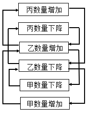
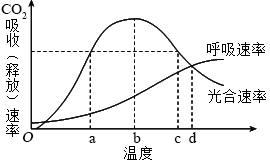
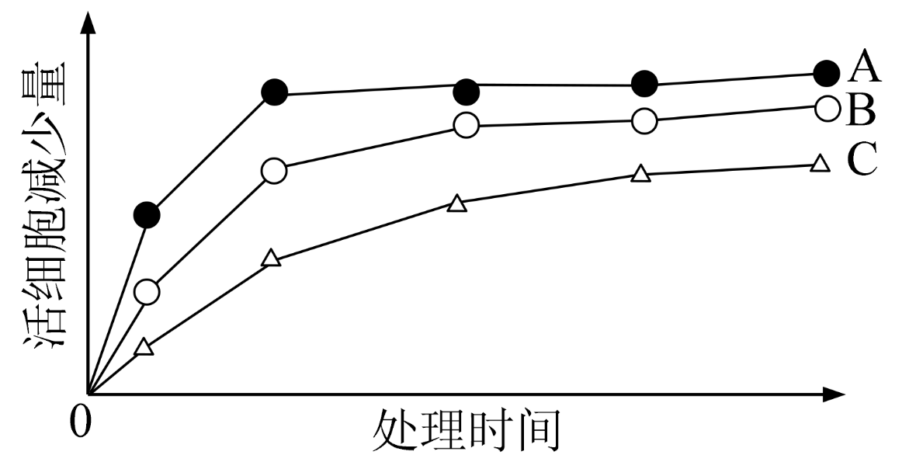

**2024年高考全国甲卷生物学试题**

**一、单选题（每小题6分，共36分）**

1\. 细胞是生物体结构和功能的基本单位。下列叙述正确的是（ ）

A. 病毒通常是由蛋白质外壳和核酸构成的单细胞生物

B. 原核生物因为没有线粒体所以都不能进行有氧呼吸

C. 哺乳动物同一个体中细胞的染色体数目有可能不同

D. 小麦根细胞吸收离子消耗的ATP主要由叶绿体产生

2\. ATP可为代谢提供能量，也参与RNA的合成，ATP结构如图所示，图中～表示高能磷酸键，下列叙述错误的是（ ）

A. ATP转化为ADP可为离子的主动运输提供能量

B. 用α位32P标记的ATP可以合成带有32P的RNA

C. β和γ位磷酸基团之间的高能磷酸键不能在细胞核中断裂

D. 光合作用可将光能转化为化学能储存于β和γ位磷酸基团之间的高能磷酸键

3\. 植物生长发育受植物激素的调控。下列叙述错误的是（ ）

A. 赤霉素可以诱导某些酶的合成促进种子萌发

B. 单侧光下生长素的极性运输不需要载体蛋白

C. 植物激素可与特异性受体结合调节基因表达

D. 一种激素可通过诱导其他激素的合成发挥作用

4\. 甲状腺激素在人体生命活动的调节中发挥重要作用。下列叙述错误的是（ ）

A. 甲状腺激素受体分布于人体内几乎所有细胞

B. 甲状腺激素可以提高机体神经系统的兴奋性

C. 甲状腺激素分泌增加可使细胞代谢速率加快

D. 甲状腺激素分泌不足会使血中TSH含量减少

5\. 某生态系统中捕食者与被捕食者种群数量变化的关系如图所示，图中→表示种群之间数量变化的关系，如甲数量增加导致乙数量增加。下列叙述正确的是（ ）

A. 甲数量的变化不会对丙数量产生影响

B. 乙在该生态系统中既是捕食者又是被捕食者

C. 丙可能是初级消费者，也可能是次级消费者

D. 能量流动方向可能是甲→乙→丙，也可能是丙→乙→甲

6\. 果蝇翅型、体色和眼色性状各由1对独立遗传等位基因控制，其中弯翅、黄体和紫眼均为隐性性状，控制灰体、黄体性状的基因位于X染色体上。某小组以纯合体雌蝇和常染色体基因纯合的雄蝇为亲本杂交得F1，F1相互交配得F2。在翅型、体色和眼色性状中，F2的性状分离比不符合9∶3∶3∶1的亲本组合是（ ）

A. 直翅黄体♀×弯翅灰体♂ B. 直翅灰体♀×弯翅黄体♂

C. 弯翅红眼♀×直翅紫眼♂ D. 灰体紫眼♀×黄体红眼♂

**二、非选择题（共54分）**

7\. 在自然条件下，某植物叶片光合速率和呼吸速率随温度变化的趋势如图所示。回答下列问题。

（1）该植物叶片在温度a和c时的光合速率相等，叶片有机物积累速率\_\_\_\_\_\_\_\_（填“相等”或“不相等”），原因是\_\_\_\_\_\_\_\_\_\_\_\_\_\_\_\_\_\_\_\_\_\_\_\_\_\_\_\_\_\_\_\_。

（2）在温度d时，该植物体的干重会减少，原因是\_\_\_\_\_\_\_\_\_\_\_\_\_\_\_\_\_\_\_\_\_\_\_\_\_\_\_\_\_\_\_\_。

（3）温度超过b时，该植物由于暗反应速率降低导致光合速率降低。暗反应速率降低的原因可能是\_\_\_\_\_\_\_\_\_\_\_\_\_\_\_\_\_\_\_\_\_\_\_\_\_\_\_\_\_\_\_\_。（答出一点即可）

（4）通常情况下，为了最大程度地获得光合产物，农作物在温室栽培过程中，白天温室的温度应控制在\_\_\_\_\_\_\_\_最大时的温度。

8\. 某种病原体的蛋白质A可被吞噬细胞摄入和处理，诱导特异性免疫。回答下列问题。

（1）病原体感染诱导产生浆细胞的特异性免疫方式属于\_\_\_\_\_\_\_\_。

（2）溶酶体中的蛋白酶可将蛋白质A的一条肽链水解成多个片段，蛋白酶切断的化学键是\_\_\_\_\_\_\_\_。

（3）不采用荧光素标记蛋白质A，设计实验验证蛋白质A的片段可出现在吞噬细胞的溶酶体中，简要写出实验思路和预期结果\_\_\_\_\_\_。

9\. 鸟类B曾濒临灭绝。在某地发现7只野生鸟类B后，经保护其种群规模逐步扩大。回答下列问题。

（1）保护鸟类B采取“就地保护为主，易地保护为辅”模式。就地保护是\_\_\_\_\_\_\_\_。

（2）鸟类B经人工繁育达到一定数量后可放飞野外。为保证鸟类B正常生存繁殖，放飞前需考虑的野外生物因素有\_\_\_\_\_\_\_\_\_\_\_\_\_\_\_\_。（答出两点即可）

（3）鸟类B的野生种群稳步增长。通常，种群呈“S”型增长的主要原因是\_\_\_\_\_\_\_\_。

（4）保护鸟类B等濒危物种的意义是\_\_\_\_\_\_\_\_\_\_\_\_\_\_\_\_\_\_\_\_\_\_\_\_。

10\. 袁隆平研究杂交水稻，对粮食生产具有突出贡献。回答下列问题。

（1）用性状优良的水稻纯合体（甲）给某雄性不育水稻植株授粉，杂交子一代均表现雄性不育；杂交子一代与甲回交（回交是杂交后代与两个亲本之一再次交配），子代均表现雄性不育；连续回交获得性状优良的雄性不育品系（乙）。由此推测控制雄性不育的基因（A）位于\_\_\_\_\_\_\_\_\_\_\_\_\_\_\_\_（填“细胞质”或“细胞核”）。

（2）将另一性状优良的水稻纯合体（丙）与乙杂交，F1均表现雄性可育，且长势与产量优势明显，F1即为优良的杂交水稻。丙的细胞核基因R的表达产物能够抑制基因A的表达。基因R表达过程中，以mRNA为模板翻译产生多肽链的细胞器是\_\_\_\_\_\_\_\_。F1自交子代中雄性可育株与雄性不育株的数量比为\_\_\_\_\_\_\_\_\_\_\_\_\_\_\_\_。

（3）以丙为父本与甲杂交（正交）得F1，F1自交得F2，则F2中与育性有关表现型有\_\_\_\_\_\_\_\_种。反交结果与正交结果不同，反交的F2中与育性有关的基因型有\_\_\_\_\_\_\_\_种。

**\[生物-选修1：生物技术实践\]（15分）**

11\. 合理使用消毒液有助于减少传染病的传播。某同学比较了3款消毒液A、B、C杀灭细菌的效果，结果如图所示。回答下列问题。

（1）该同学采用显微镜直接计数法和菌落计数法分别测定同一样品的细菌数量，发现测得的细菌数量前者大于后者，其原因是\_\_\_\_\_\_\_\_\_\_\_\_\_\_\_\_\_\_\_\_\_\_\_\_。

（2）该同学从100 mL细菌原液中取1 mL加入无菌水中得到10 mL稀释菌液，再从稀释菌液中取200 μL涂布平板，菌落计数的结果为100，据此推算细菌原液中细菌浓度为\_\_\_\_\_\_\_\_\_\_\_\_\_\_\_\_个/mL。

（3）菌落计数过程中，涂布器应先在酒精灯上灼烧，冷却后再涂布。灼烧的目的是\_\_\_\_\_\_\_\_，冷却的目的是\_\_\_\_\_\_\_\_\_\_\_\_\_\_\_\_\_\_\_\_\_\_\_\_。

（4）据图可知杀菌效果最好的消毒液是\_\_\_\_\_\_\_\_，判断依据是\_\_\_\_\_\_\_\_\_\_\_\_\_\_\_\_。（答出两点即可）

（5）鉴别培养基可用于反映消毒液杀灭大肠杆菌效果。大肠杆菌在伊红美蓝培养基上生长的菌落呈\_\_\_\_\_\_\_\_色。

**\[生物-选修3：现代生物科技专题\]（15分）**

12\. 某同学采用基因工程技术在大肠杆菌中表达蛋白E。回答下列问题。

（1）该同学利用PCR扩增目的基因。PCR的每次循环包括变性、复性、延伸3个阶段，其中DNA双链打开成为单链的阶段是\_\_\_\_\_\_\_\_\_\_\_\_\_\_\_\_，引物与模板DNA链碱基之间的化学键是\_\_\_\_\_\_\_\_。

（2）质粒载体上有限制酶a、b、c的酶切位点，限制酶的切割位点如图所示。构建重组质粒时，与用酶a单酶切相比，用酶a和酶b双酶切的优点体现在\_\_\_\_\_\_\_\_（答出两点即可）；使用酶c单酶切构建重组质粒时宜选用的连接酶是\_\_\_\_\_\_\_\_。

（3）将重组质粒转入大肠杆菌前，通常先将受体细胞处理成感受态，感受态细胞的特点是\_\_\_\_\_\_\_\_；若要验证转化的大肠杆菌中含有重组质粒，简要的实验思路和预期结果是\_\_\_\_\_\_\_\_\_\_\_\_\_\_\_\_。

（4）蛋白E基因中的一段DNA编码序列（与模板链互补）是GGGCCCAAGCTGAGATGA，编码从GGG开始，部分密码子见表。若第一个核苷酸G缺失，则突变后相应肽链的序列是\_\_\_\_\_\_\_\_\_\_\_\_\_\_\_\_\_\_\_\_\_\_\_\_。

<table style="width:35%;">
<colgroup>
<col style="width: 16%" />
<col style="width: 18%" />
</colgroup>
<tbody>
<tr>
<td style="text-align: center;">氨基酸</td>
<td style="text-align: center;">密码子</td>
</tr>
<tr>
<td style="text-align: center;">赖氨酸</td>
<td style="text-align: center;">AAG</td>
</tr>
<tr>
<td style="text-align: center;">精氨酸</td>
<td style="text-align: center;">AGA</td>
</tr>
<tr>
<td style="text-align: center;">丝氨酸</td>
<td style="text-align: center;">AGC</td>
</tr>
<tr>
<td rowspan="2" style="text-align: center;">脯氨酸</td>
<td style="text-align: center;">CCA</td>
</tr>
<tr>
<td style="text-align: center;">CCC</td>
</tr>
<tr>
<td style="text-align: center;">亮氨酸</td>
<td style="text-align: center;">CUG</td>
</tr>
<tr>
<td rowspan="2" style="text-align: center;">甘氨酸</td>
<td style="text-align: center;">GGC</td>
</tr>
<tr>
<td style="text-align: center;">GGG</td>
</tr>
<tr>
<td style="text-align: center;">终止</td>
<td style="text-align: center;">UGA</td>
</tr>
</tbody>
</table>
