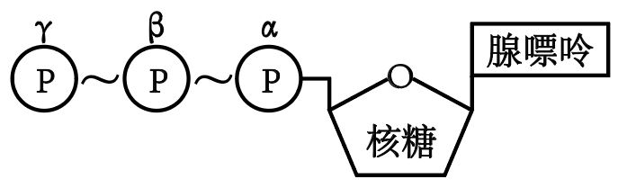

**2024年高考全国甲卷生物学试题**

**一、单选题（每小题6分，共36分）**

1\. 细胞是生物体结构和功能的基本单位。下列叙述正确的是（ ）

A. 病毒通常是由蛋白质外壳和核酸构成的单细胞生物

B. 原核生物因为没有线粒体所以都不能进行有氧呼吸

C. 哺乳动物同一个体中细胞的染色体数目有可能不同

D. 小麦根细胞吸收离子消耗的ATP主要由叶绿体产生

【答案】C

【解析】

【分析】原核细胞和真核细胞最主要的区别是原核细胞没有核膜包被的典型的细胞核，但是它们均具有细胞膜、细胞质、核糖体以及遗传物质DNA等结构。原核生物虽没有叶绿体和线粒体，但是少数生物也能进行光合作用和有氧呼吸，如蓝藻。

【详解】A、病毒没有细胞结构，A错误；

B、原核生物也可以进行有氧呼吸，原核细胞中含有与有氧呼吸相关的酶，B错误；

C、哺乳动物同一个体中细胞的染色体数目有可能不同，如生殖细胞中染色体数目是体细胞的一半，C正确；

D、小麦根细胞不含叶绿体，而线粒体是有氧呼吸的主要场所，小麦根细胞吸收离子消耗的ATP主要由线粒体产生，D错误。

故选C。

2\. ATP可为代谢提供能量，也参与RNA的合成，ATP结构如图所示，图中～表示高能磷酸键，下列叙述错误的是（ ）

A. ATP转化为ADP可为离子的主动运输提供能量

B. 用α位32P标记的ATP可以合成带有32P的RNA

C. β和γ位磷酸基团之间的高能磷酸键不能在细胞核中断裂

D. 光合作用可将光能转化为化学能储存于β和γ位磷酸基团之间的高能磷酸键

【答案】C

【解析】

【分析】细胞生命活动的直接能源物质是ATP，ATP的结构简式是A-P～P～P，其中“A”是腺苷，“P”是磷酸；“A”代表腺苷，“T”代表3个。

【详解】A、ATP为直接能源物质，γ位磷酸基团脱离ATP形成ADP的过程释放能量，可为离子主动运输提供能量，A正确；

B、ATP分子水解两个高能磷酸键后，得到RNA的基本单位之一——腺嘌呤核糖核苷酸，故用α位32P标记的ATP可以合成带有32P的RNA，B正确；

C、ATP可在细胞核中发挥作用，如为rRNA合成提供能量，故β和γ位磷酸基团之间的高能磷酸键能在细胞核中断裂，C错误；

D、光合作用光反应，可将光能转化活跃的化学能储存于ATP的高能磷酸键中，故光合作用可将光能转化为化学能储存于β和γ位磷酸基团之间的高能磷酸键，D正确。

故选C。

3\. 植物生长发育受植物激素的调控。下列叙述错误的是（ ）

A. 赤霉素可以诱导某些酶的合成促进种子萌发

B. 单侧光下生长素的极性运输不需要载体蛋白

C. 植物激素可与特异性受体结合调节基因表达

D. 一种激素可通过诱导其他激素的合成发挥作用

【答案】B

【解析】

【分析】1、植物激素是由植物体内产生，能从产生部位送到作用部位，对植物的生长发育有显著影响的微量有机物；植物激素主要有生长素、赤霉素、细胞分裂素、乙烯和脱落酸等，它们对植物各种生命活动起着不同的调节作用。

2、植物激素包括生长素、细胞分裂素、赤霉素、脱落酸、乙烯等。其中生长素、细胞分裂素、赤霉素能促进植物的生长，而脱落酸和乙烯是抑制植物的生长。生长素能促进子房发育成果实，而乙烯能促进果实成熟。 

3、调节植物生命活动的激素不是孤立的，而是相互作用共同调节的，植物生命活动的调节从根本上说是植物基因组程序性表达的结果。植物的生长发育既受内部因子（激素）的调节，也受外部因子（如光、温度、日照长度、重力、化学物质等）的影响。这些化学和物理因子通过信号转导，诱导相关基因表达，调控生长发育。

【详解】A、赤霉素主要合成部位是未成熟的种子、幼根和幼芽，赤霉素能促进植物的生长，可以诱导某些酶的合成促进种子萌发，A正确；

B、生长素的极性运输属于主动运输，主动运输需要载体蛋白的协助并消耗能量，B错误；

C、植物激素与受体特异性结合，引发细胞内发生一系列信号转导过程，进而诱导特定基因的表达，从而产生效应，C正确；

D、调节植物生命活动的激素不是孤立的，而是相互作用共同调节的，因此一种激素可通过诱导其他激素的合成发挥作用，D正确；

故选B。

4\. 甲状腺激素在人体生命活动的调节中发挥重要作用。下列叙述错误的是（ ）

A. 甲状腺激素受体分布于人体内几乎所有细胞

B. 甲状腺激素可以提高机体神经系统的兴奋性

C. 甲状腺激素分泌增加可使细胞代谢速率加快

D. 甲状腺激素分泌不足会使血中TSH含量减少

【答案】D

【解析】

【分析】甲状腺分泌甲状腺激素，甲状腺激素能促进代谢，增加产热；能提高神经系统兴奋性；能促进幼小动物的生长发育。

【详解】A、甲状腺激素几乎可以作用于人体所有细胞，因此其受体分布于人体内几乎所有细胞，A正确；

B、甲状腺激素可以促进中枢神经系统的发育，提高机体神经系统的兴奋性，B正确；

C、甲状腺激素能促进新陈代谢，因此其分泌增加可使细胞代谢速率加快，C正确；

D、甲状腺激素对下丘脑分泌促甲状腺激素释放激素（TRH）和垂体分泌促甲状腺激素（TSH）存在反负馈调节，因此甲状腺激素分泌不足会使血中促甲状腺激素（TSH）含量增加，D错误。

故选D。

5\. 某生态系统中捕食者与被捕食者种群数量变化的关系如图所示，图中→表示种群之间数量变化的关系，如甲数量增加导致乙数量增加。下列叙述正确的是（ ）

A. 甲数量的变化不会对丙数量产生影响

B. 乙在该生态系统中既是捕食者又是被捕食者

C. 丙可能是初级消费者，也可能是次级消费者

D. 能量流动方向可能是甲→乙→丙，也可能是丙→乙→甲

【答案】B

【解析】

【分析】分析题图可知，甲数量增加导致乙数量增加，而乙数量增加导致丙数量增加、甲数量下降；乙数量下降导致丙数量下降、甲数量增加，可见甲、乙、丙三者的能量流动方向是甲→乙→丙。

【详解】A、分析题图可知，甲数量增加导致乙数量增加，而乙数量增加导致丙数量增加；甲数量下降导致乙数量下降，而乙数量下降导致丙数量下降；可见甲数量的变化会间接对丙数量产生影响，A错误；

B、由A项分析可知，乙捕食甲，同时乙又被丙捕食，可见乙在该生态系统中既捕食者又是被捕食者，B正确；

C、由B项分析可知，乙捕食甲，丙捕食乙，故丙不可能是初级消费者，可能是次级消费者，C错误；

D、分析题图可知，甲数量增加导致乙数量增加，而乙数量增加导致丙数量增加、甲数量下降；乙数量下降导致丙数量下降、甲数量增加，可见甲、乙、丙三者的能量流动方向是甲→乙→丙，D错误。

故选B。

6\. 果蝇翅型、体色和眼色性状各由1对独立遗传的等位基因控制，其中弯翅、黄体和紫眼均为隐性性状，控制灰体、黄体性状的基因位于X染色体上。某小组以纯合体雌蝇和常染色体基因纯合的雄蝇为亲本杂交得F1，F1相互交配得F2。在翅型、体色和眼色性状中，F2的性状分离比不符合9∶3∶3∶1的亲本组合是（ ）

A. 直翅黄体♀×弯翅灰体♂ B. 直翅灰体♀×弯翅黄体♂

C. 弯翅红眼♀×直翅紫眼♂ D. 灰体紫眼♀×黄体红眼♂

【答案】A

【解析】

【分析】1、自由组合定律的实质：控制不同性状的遗传因子的分离和组合是互不干扰的；在形成配子时，决定同一性状的成对的遗传因子彼此分离，决定不同性状的遗传因子自由组合。

2、依据题干信息，①果蝇翅型、体色和眼色性状各由1对独立遗传的等位基因控制，②控制灰体、黄体性状的基因位于X染色体上，③其中弯翅、黄体和紫眼均为隐性性状，说明这三对等位基因的遗传遵循基因的自由组合定律。

【详解】A、令直翅对弯翅由A、a控制，体色灰体对黄体由B、b控制，眼色红眼对紫眼由D、d控制。当直翅黄体♀×弯翅灰体♂时，依据题干信息，其基因型为：AAXbXbaaXBYF1：AaXBXb、AaXbY，按照拆分法，F1F2：直翅灰体：直翅黄体：弯翅灰体：弯翅黄体=3:3:1:1，A符合题意；

B、当直翅灰体♀×弯翅黄体♂时，依据题干信息，其基因型为：AAXBXB×aaXbY→F1：AaXBXb、AaXBY，按照拆分法，F1F2：直翅灰体：直翅黄体：弯翅灰体：弯翅黄体=9:3:3:1，B不符合题意；

C、当弯翅红眼♀×直翅紫眼♂时，依据题干信息，其基因型：aaDD×AAdd→F1：AaDd，按照拆分法，F1F2：直翅红眼：直翅紫眼：弯翅红眼：弯翅紫眼=9:3:3:1，C不符合题意；

D、当灰体紫眼♀×黄体红眼♂时，依据题干信息，其基因型为：ddXBXB×DDXbY→F1：DdXBXb、DdXBY，按照拆分法，F1F2：灰体红眼：灰体紫眼：黄体红眼：黄体紫眼=9:3:3:1，D不符合题意。

故选A。

**二、非选择题（共54分）**

7\. 在自然条件下，某植物叶片光合速率和呼吸速率随温度变化的趋势如图所示。回答下列问题。

（1）该植物叶片在温度a和c时的光合速率相等，叶片有机物积累速率\_\_\_\_\_\_\_\_（填“相等”或“不相等”），原因是\_\_\_\_\_\_\_\_\_\_\_\_\_\_\_\_\_\_\_\_\_\_\_\_\_\_\_\_\_\_\_\_。

（2）在温度d时，该植物体的干重会减少，原因是\_\_\_\_\_\_\_\_\_\_\_\_\_\_\_\_\_\_\_\_\_\_\_\_\_\_\_\_\_\_\_\_。

（3）温度超过b时，该植物由于暗反应速率降低导致光合速率降低。暗反应速率降低的原因可能是\_\_\_\_\_\_\_\_\_\_\_\_\_\_\_\_\_\_\_\_\_\_\_\_\_\_\_\_\_\_\_\_。（答出一点即可）

（4）通常情况下，为了最大程度地获得光合产物，农作物在温室栽培过程中，白天温室的温度应控制在\_\_\_\_\_\_\_\_最大时的温度。

【答案】（1） ①. 不相等 ②. 温度a和c时的呼吸速率不相等

（2）温度d时，叶片的光合速率与呼吸速率相等，但植物的根部等细胞不进行光合作用，仍呼吸消耗有机物，导致植物体的干重减少

（3）温度过高，导致部分气孔关闭，CO2供应不足，暗反应速率降低；温度过高，导致酶的活性降低，使暗反应速率降低

（4）光合速率和呼吸速率差值

【解析】

【分析】影响光合作用的因素有：光照强度、温度、CO2浓度、酶的活性和数量、光合色素含量等。

【小问1详解】

该植物叶片在温度a和c时的光合速率相等，但由于呼吸速率不同，因此叶片有机物积累速率不相等。

【小问2详解】

在温度d时，叶片的光合速率与呼吸速率相等，但由于植物有些细胞不进行光合作用如根部细胞，因此该植物体的干重会减少。

【小问3详解】

温度超过b时，为了降低蒸腾作用，部分气孔关闭，使CO2供应不足，暗反应速率降低；同时使酶的活性降低，导致CO2固定速率减慢，C3还原速率减慢，进而使暗反应速率降低。

【小问4详解】

为了最大程度地获得光合产物，农作物在温室栽培过程中，白天温室的温度应控制在光合速率与呼吸速率差值最大时的温度，有利于有机物的积累。

8\. 某种病原体的蛋白质A可被吞噬细胞摄入和处理，诱导特异性免疫。回答下列问题。

（1）病原体感染诱导产生浆细胞的特异性免疫方式属于\_\_\_\_\_\_\_\_。

（2）溶酶体中的蛋白酶可将蛋白质A的一条肽链水解成多个片段，蛋白酶切断的化学键是\_\_\_\_\_\_\_\_。

（3）不采用荧光素标记蛋白质A，设计实验验证蛋白质A的片段可出现在吞噬细胞的溶酶体中，简要写出实验思路和预期结果\_\_\_\_\_\_。

【答案】（1）体液免疫

（2）肽键 （3）实验思路：以蛋白质A的片段为抗原，制备单克隆抗体，利用差速离心法将吞噬细胞中的溶酶体分离，并提取溶酶体中的蛋白质，利用抗原抗体杂交技术进行检测

预期结果：出现杂交带，表明蛋白质A的片段可出现在吞噬细胞的溶酶体中

【解析】

【分析】非特异性免疫（先天性免疫）：第一道防线：皮肤、黏膜等；第二道防线：体液中的杀菌物质和吞噬细胞；特异性免疫（获得性免疫）第三道防线：由免疫器官和免疫细胞借助血液循环和淋巴循环组成。

【小问1详解】

特异性免疫包括体液免疫和细胞免疫。病原体感染诱导产生浆细胞的特异性免疫方式属于体液免疫。

【小问2详解】

蛋白酶可将蛋白质A的一条肽链水解成多个片段，因此蛋白酶切断的是肽键。

【小问3详解】

为验证蛋白质A的片段可出现在吞噬细胞的溶酶体中，可以蛋白质A的片段为抗原，制备单克隆抗体，利用差速离心法将吞噬细胞中的溶酶体分离，并提取溶酶体中的蛋白质，利用抗原抗体杂交技术进行检测，若出现杂交带，则表明蛋白质A的片段可出现在吞噬细胞的溶酶体中。

9\. 鸟类B曾濒临灭绝。在某地发现7只野生鸟类B后，经保护其种群规模逐步扩大。回答下列问题。

（1）保护鸟类B采取“就地保护为主，易地保护为辅”模式。就地保护是\_\_\_\_\_\_\_\_。

（2）鸟类B经人工繁育达到一定数量后可放飞野外。为保证鸟类B正常生存繁殖，放飞前需考虑的野外生物因素有\_\_\_\_\_\_\_\_\_\_\_\_\_\_\_\_。（答出两点即可）

（3）鸟类B的野生种群稳步增长。通常，种群呈“S”型增长的主要原因是\_\_\_\_\_\_\_\_。

（4）保护鸟类B等濒危物种的意义是\_\_\_\_\_\_\_\_\_\_\_\_\_\_\_\_\_\_\_\_\_\_\_\_。

【答案】（1）在原地对被保护的生态系统或物种建立自然保护区以及国家公园等

（2）天敌、竞争者、食物等 （3）存在环境阻力 （4）增加生物多样性

【解析】

【分析】1、生物多样性：生物圈内所有的植物、动物和微生物，它们所拥有的全部基因以及各种各样的生态系统，共同构成了生物多样性。生物多样性包括基因多样性、物种多样性和生态系统多样性。

2、生物多样性的价值：（1）直接价值：对人类有食用、药用和工业原料等使用意义，以及有旅游观赏、科学研究和文学艺术创作等非实用意义的。（2）间接价值：对生态系统起重要调节作用的价值（生态功能）。（3）潜在价值：目前人类不清楚的价值。

【小问1详解】

就地保护是指在原地对被保护的生态系统或物种建立自然保护区以及国家公园等，这是对生物多样性最有效的保护。

【小问2详解】

为保证鸟类B正常生存繁殖，放飞前需考虑的野外生物因素有减少天敌以及竞争者的存在，同时增加鸟类B的食物数量和种类。

【小问3详解】

种群呈“S”型增长的主要原因是受资源和空间的限制，以及竞争者和天敌的存在，即存在环境阻力。

【小问4详解】

保护濒危物种可以增加生物多样性。

10\. 袁隆平研究杂交水稻，对粮食生产具有突出贡献。回答下列问题。

（1）用性状优良的水稻纯合体（甲）给某雄性不育水稻植株授粉，杂交子一代均表现雄性不育；杂交子一代与甲回交（回交是杂交后代与两个亲本之一再次交配），子代均表现雄性不育；连续回交获得性状优良的雄性不育品系（乙）。由此推测控制雄性不育的基因（A）位于\_\_\_\_\_\_\_\_\_\_\_\_\_\_\_\_（填“细胞质”或“细胞核”）。

（2）将另一性状优良的水稻纯合体（丙）与乙杂交，F1均表现雄性可育，且长势与产量优势明显，F1即为优良的杂交水稻。丙的细胞核基因R的表达产物能够抑制基因A的表达。基因R表达过程中，以mRNA为模板翻译产生多肽链的细胞器是\_\_\_\_\_\_\_\_。F1自交子代中雄性可育株与雄性不育株的数量比为\_\_\_\_\_\_\_\_\_\_\_\_\_\_\_\_。

（3）以丙为父本与甲杂交（正交）得F1，F1自交得F2，则F2中与育性有关的表现型有\_\_\_\_\_\_\_\_种。反交结果与正交结果不同，反交的F2中与育性有关的基因型有\_\_\_\_\_\_\_\_种。

【答案】（1）细胞质 （2） ①. 核糖体 ②. 3:1

（3） ①. 1 ②. 3

【解析】

【分析】基因的自由组合定律的实质是位于非同源染色体上的非等位基因的分离或组合是互不干扰的；在减数分裂过程中，同源染色体上的等位基因彼此分离的同时，非同源染色体上的非等位基因自由组合。

【小问1详解】

由题意可知，雄性不育株在杂交过程中作母本，在与甲的多次杂交过程中，子代始终表现为雄性不育，即与母本表型相同，说明雄性不育为母系遗传，即制雄性不育的基因（A）位于细胞质中。

【小问2详解】

以mRNA为模板翻译产生多肽链即合成蛋白质的场所为核糖体。控制雄性不育的基因（A）位于细胞质中，基因R位于细胞核中，核基因R的表达产物能够抑制基因A的表达，则丙的基因型为A（RR）或a（RR），雄性不育乙的基因型为A（rr），子代细胞质来自母本，因此F1的基因型为A（Rr），核基因R的表达产物能够抑制基因A的表达，因此F1表现为雄性可育，F1自交，子代的基因型及比例为A（RR）：A（Rr）：A（rr）=1：2：1，因此子代中雄性可育株与雄性不育株的数量比为3：1。

【小问3详解】

丙为雄性可育基因型为A（RR）或a（RR），甲也为雄性可育基因型为a（rr），以丙为父本与甲杂交（正交）得F1，F1基因型为a（Rr）雄性可育，F1自交的后代F2可育，即则F2中与育性有关的表现型有1种。反交结果与正交结果不同，则可说明丙的基因型为A（RR），甲的基因型为a（rr），反交时，丙为母本，F1的基因型为A（Rr），F2中的基因型及比例为A（RR）：A（Rr）：A（rr）=1：2：1，即F2中与育性有关的基因型有3种。

**\[生物-选修1：生物技术实践\]（15分）**

11\. 合理使用消毒液有助于减少传染病的传播。某同学比较了3款消毒液A、B、C杀灭细菌的效果，结果如图所示。回答下列问题。

（1）该同学采用显微镜直接计数法和菌落计数法分别测定同一样品的细菌数量，发现测得的细菌数量前者大于后者，其原因是\_\_\_\_\_\_\_\_\_\_\_\_\_\_\_\_\_\_\_\_\_\_\_\_。

（2）该同学从100 mL细菌原液中取1 mL加入无菌水中得到10 mL稀释菌液，再从稀释菌液中取200 μL涂布平板，菌落计数的结果为100，据此推算细菌原液中细菌浓度为\_\_\_\_\_\_\_\_\_\_\_\_\_\_\_\_个/mL。

（3）菌落计数过程中，涂布器应先在酒精灯上灼烧，冷却后再涂布。灼烧的目的是\_\_\_\_\_\_\_\_，冷却的目的是\_\_\_\_\_\_\_\_\_\_\_\_\_\_\_\_\_\_\_\_\_\_\_\_。

（4）据图可知杀菌效果最好的消毒液是\_\_\_\_\_\_\_\_，判断依据是\_\_\_\_\_\_\_\_\_\_\_\_\_\_\_\_。（答出两点即可）

（5）鉴别培养基可用于反映消毒液杀灭大肠杆菌效果。大肠杆菌在伊红美蓝培养基上生长的菌落呈\_\_\_\_\_\_\_\_色。

【答案】（1）前者微生物分散的活菌和死菌一起计数，后者存在多个活菌形成一个菌落的情况且只计数活菌 （2）5000

（3） ①. 杀死涂布器上可能存在的微生物，防止涂布器上可能存在的微生物污染 ②. 防止温度过高杀死菌种

（4） ①. A ②. A消毒液活菌数减少量最多，且杀菌时间较短，效率最高

（5）黑

【解析】

【分析】平板划线法是通过接种环在琼脂固体培养基表面连续划线的操作。将聚集的菌种逐步稀释分散到培养基的表面。在数次划线后培养，可以分离到由一个细胞繁殖而来的肉眼可见的子细胞群体，这就是菌落。稀释涂布平板法是将菌液进行一系列的梯度稀释，然后将不同稀释度的菌液分别涂布到琼脂固体培养基的表面，进行培养。分为系列稀释操作和涂布平板操作两步。

【小问1详解】

显微镜直接计数法把死菌和活菌一起计数。菌落计数法计数只计活菌数，还可能存在多个活菌形成一个菌落的情况，故前者的数量多于后者。

【小问2详解】

从100 mL细菌原液中取1 mL加入无菌水中得到10 mL稀释菌液，即稀释了10倍，1mL细菌原液中细菌浓度=（菌落数÷菌液体积）×稀释倍数=（100÷200 μL）×10个=5000个。

【小问3详解】

菌落计数过程中，涂布器应先在酒精灯上灼烧，冷却后再涂布。灼烧目的是杀死涂布器上可能存在的微生物，防止涂布器上可能存在的微生物污染，冷却的目的是防止温度过高杀死菌种。

【小问4详解】

A消毒液活菌数减少量最多，且杀菌时间较短，效率最高，因此A消毒液杀菌效果最好。

【小问5详解】

大肠杆菌在伊红美蓝培养基上生长的菌落呈黑色。

**\[生物-选修3：现代生物科技专题\]（15分）**

12\. 某同学采用基因工程技术在大肠杆菌中表达蛋白E。回答下列问题。

（1）该同学利用PCR扩增目的基因。PCR的每次循环包括变性、复性、延伸3个阶段，其中DNA双链打开成为单链的阶段是\_\_\_\_\_\_\_\_\_\_\_\_\_\_\_\_，引物与模板DNA链碱基之间的化学键是\_\_\_\_\_\_\_\_。

（2）质粒载体上有限制酶a、b、c的酶切位点，限制酶的切割位点如图所示。构建重组质粒时，与用酶a单酶切相比，用酶a和酶b双酶切的优点体现在\_\_\_\_\_\_\_\_（答出两点即可）；使用酶c单酶切构建重组质粒时宜选用的连接酶是\_\_\_\_\_\_\_\_。

（3）将重组质粒转入大肠杆菌前，通常先将受体细胞处理成感受态，感受态细胞的特点是\_\_\_\_\_\_\_\_；若要验证转化的大肠杆菌中含有重组质粒，简要的实验思路和预期结果是\_\_\_\_\_\_\_\_\_\_\_\_\_\_\_\_。

（4）蛋白E基因中的一段DNA编码序列（与模板链互补）是GGGCCCAAGCTGAGATGA，编码从GGG开始，部分密码子见表。若第一个核苷酸G缺失，则突变后相应肽链的序列是\_\_\_\_\_\_\_\_\_\_\_\_\_\_\_\_\_\_\_\_\_\_\_\_。

<table style="width:35%;">
<colgroup>
<col style="width: 16%" />
<col style="width: 18%" />
</colgroup>
<tbody>
<tr>
<td style="text-align: center;">氨基酸</td>
<td style="text-align: center;">密码子</td>
</tr>
<tr>
<td style="text-align: center;">赖氨酸</td>
<td style="text-align: center;">AAG</td>
</tr>
<tr>
<td style="text-align: center;">精氨酸</td>
<td style="text-align: center;">AGA</td>
</tr>
<tr>
<td style="text-align: center;">丝氨酸</td>
<td style="text-align: center;">AGC</td>
</tr>
<tr>
<td rowspan="2" style="text-align: center;">脯氨酸</td>
<td style="text-align: center;">CCA</td>
</tr>
<tr>
<td style="text-align: center;">CCC</td>
</tr>
<tr>
<td style="text-align: center;">亮氨酸</td>
<td style="text-align: center;">CUG</td>
</tr>
<tr>
<td rowspan="2" style="text-align: center;">甘氨酸</td>
<td style="text-align: center;">GGC</td>
</tr>
<tr>
<td style="text-align: center;">GGG</td>
</tr>
<tr>
<td style="text-align: center;">终止</td>
<td style="text-align: center;">UGA</td>
</tr>
</tbody>
</table>

【答案】（1） ①. 变性 ②. 氢键

（2） ①. 避免目的基因和质粒的任意连接、防止目的基因和质粒的自身环化 ②. T4DNA连接酶

（3） ①. 细胞处于一种能吸收周围环境中DNA分子的生理状态 ②. 利用DNA分子杂交技术，将大肠杆菌的基因组DNA提取出来，在含有目的基因的DNA片段上用放射性同位素等作标记，以此作为探针，使探针与基因组DNA杂交，如果显示出杂交带，表明大肠杆菌中含有重组质粒

（4）甘氨酸-脯氨酸-丝氨酸

【解析】

【分析】1、基因工程基本工具：限制性核酸内切酶（限制酶）、DNA连接酶、运载体。

2、基因工程的基本操作步骤主要包括四步：①目的基因的获取；②基因表达载体的构建；③将目的基因导入受体细胞；④目的基因的检测与鉴定。

【小问1详解】

PCR的每次循环包括变性、复性、延伸3个阶段，其中DNA双链打开成为单链的阶段是变性，引物与模板DNA链碱基之间的化学键是氢键。

【小问2详解】

构建重组质粒时，与单一酶酶切相比，采用的双酶切方法，可以形成不同的黏性末端，双酶切可以避免目的基因和质粒的反向连接、目的基因和质粒的自身环化。酶c单酶切后形成平末端，需用T4DNA连接酶连接。

【小问3详解】

大肠杆菌细胞最常用的转化方法是：首先用Ca2+处理细胞，使细胞处于一种能吸收周围环境中DNA分子的生理状态，这种细胞称为感受态细胞。若要验证转化的大肠杆菌中含有重组质粒，可利用DNA分子杂交技术，将大肠杆菌的基因组DNA提取出来，在含有目的基因的DNA片段上用放射性同位素等作标记，以此作为探针，使探针与基因组DNA杂交，如果显示出杂交带，表明大肠杆菌中含有重组质粒

【小问4详解】

蛋白E基因中的一段DNA编码序列是GGGCCCAAGCTGAGATGA，编码链与模板链互补，模板链与mRNA互补，因此mRNA上的序列为GGGCCCAAGCUGAGAUGA，若第一个核苷酸G缺失，则mRNA上的序列变为GGCCCAAGCUGAGAUGA，肽链序列是甘氨酸-脯氨酸-丝氨酸。
