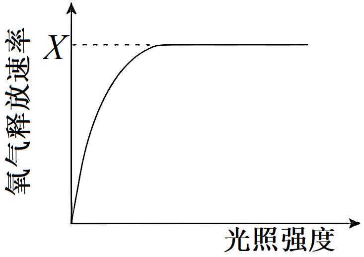
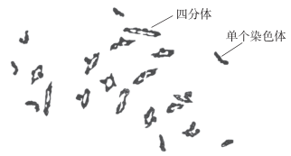
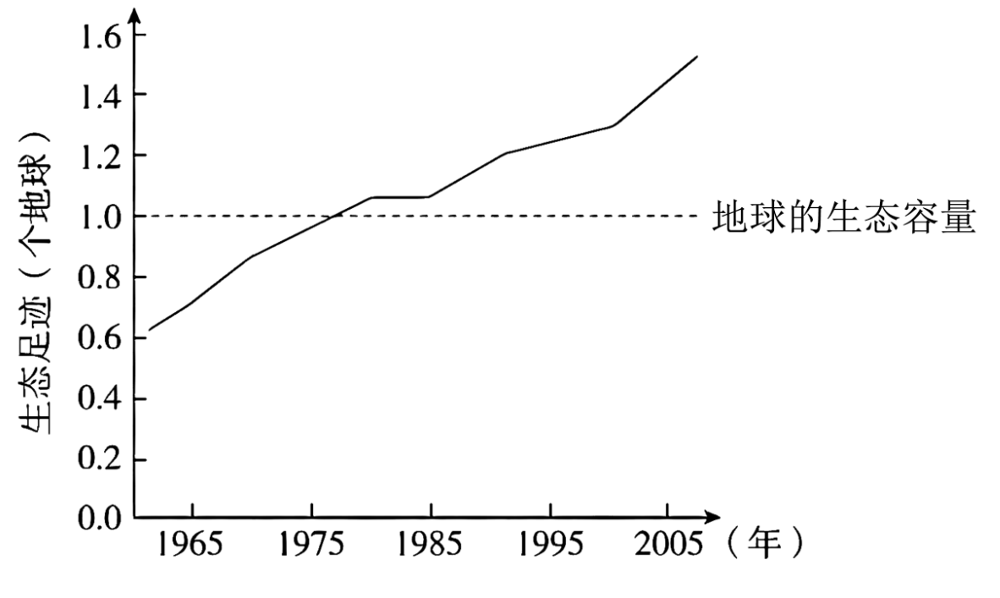
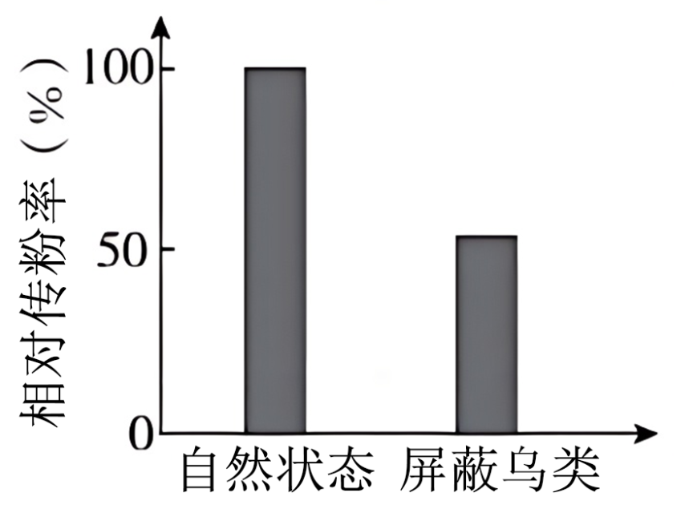
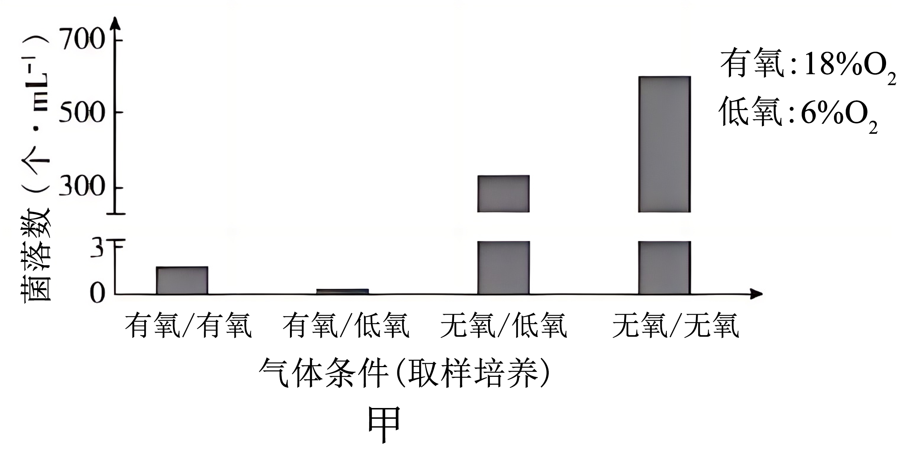
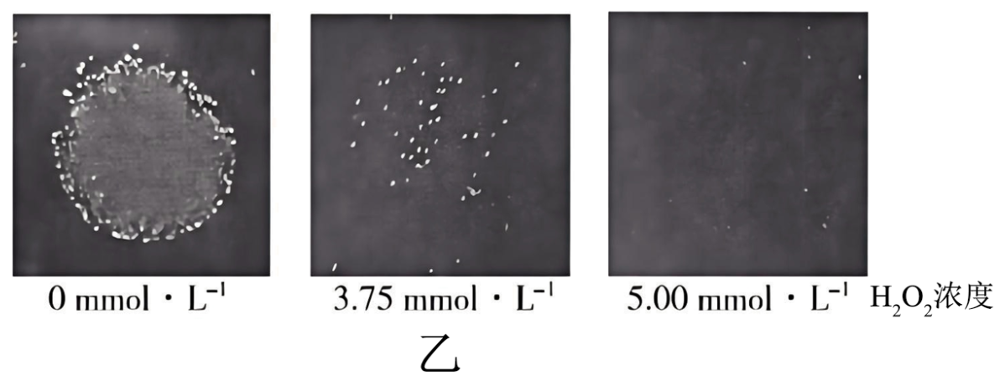
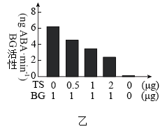
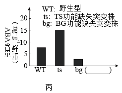
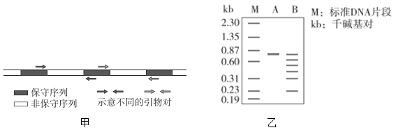
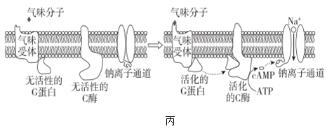

**高考真题**

**2024年普通高中学业水平等级性考试**

**（北京卷）生物**

**本试卷满分100分，考试时间90分钟。**

**第一部分**

**本部分共15题，每题2分，共30分。在每题列出的四个选项中，选出最符合题目要求的一项。**

1\. 关于大肠杆菌和水绵的共同点，表述正确的是（ ）

A. 都真核生物

B. 能量代谢都发生在细胞器中

C. 都能进行光合作用

D. 都具有核糖体

2\. 科学家证明“尼安德特人”是现代人的近亲，依据的是DNA的（ ）

A. 元素组成 B. 核苷酸种类 C. 碱基序列 D. 空间结构

3\. 胆固醇等脂质被单层磷脂包裹形成球形复合物，通过血液运输到细胞并被胞吞，形成的囊泡与溶酶体融合后，释放胆固醇。以下相关推测合理的是（ ）

A. 磷脂分子尾部疏水，因而尾部位于复合物表面

B. 球形复合物被胞吞的过程，需要高尔基体直接参与

C. 胞吞形成的囊泡与溶酶体融合，依赖于膜的流动性

D. 胆固醇通过胞吞进入细胞，因而属于生物大分子

4\. 某同学用植物叶片在室温下进行光合作用实验，测定单位时间单位叶面积的氧气释放量，结果如图所示。若想提高X，可采取的做法是（ ）

A. 增加叶片周围环境CO2浓度

B. 将叶片置于4℃的冷室中

C. 给光源加滤光片改变光的颜色

D. 移动冷光源缩短与叶片的距离

5\. 水稻生殖细胞形成过程中既发生减数分裂，又进行有丝分裂，相关叙述错误的是（ ）

A. 染色体数目减半发生在减数分裂Ⅰ

B. 同源染色体联会和交换发生在减数分裂Ⅱ

C. 有丝分裂前的间期进行DNA复制

D. 有丝分裂保证细胞的亲代和子代间遗传的稳定性

6\. 摩尔根和他的学生们绘出了第一幅基因位置图谱，示意图如图，相关叙述正确的是（ ）

果蝇X染色体上一些基因的示意图

A. 所示基因控制的性状均表现为伴性遗传

B. 所示基因在Y染色体上都有对应的基因

C. 所示基因在遗传时均不遵循孟德尔定律

D. 四个与眼色表型相关基因互为等位基因

7\. 有性杂交可培育出综合性状优于双亲的后代，是植物育种的重要手段。六倍体小麦和四倍体小麦有性杂交获得F1。F1花粉母细胞减数分裂时染色体的显微照片如图。

据图判断，错误的是（ ）

A. F1体细胞中有21条染色体

B. F1含有不成对的染色体

C. F1植株的育性低于亲本

D. 两个亲本有亲缘关系

8\. 在北京马拉松比赛42.195km的赛程中，运动员的血糖浓度维持在正常范围，在此调节过程中不会发生的是（ ）

A. 血糖浓度下降使胰岛A细胞分泌活动增强

B. 下丘脑—垂体分级调节使胰高血糖素分泌增加

C. 胰高血糖素与靶细胞上的受体相互识别并结合

D. 胰高血糖素促进肝糖原分解以升高血糖

9\. 人体在接种流脑灭活疫苗后，血清中出现特异性抗体，发挥免疫保护作用。下列细胞中，不参与此过程的是（ ）

A. 树突状细胞 B. 辅助性T细胞

C. B淋巴细胞 D. 细胞毒性T细胞

10\. 朱鹮曾广泛分布于东亚，一度濒临灭绝。我国朱鹮的数量从1981年在陕西发现时的7只增加到如今的万只以上，其中北京动物园38岁的朱鹮“平平”及其27个子女对此有很大贡献。相关叙述错误的是（ ）

A. 北京动物园所有朱鹮构成的集合是一个种群

B. 朱鹮数量已达到原栖息地的环境容纳量

C. “平平”及其后代的成功繁育属于易地保护

D. 对朱鹮的保护有利于提高生物多样性

11\. 我国科学家体外诱导食蟹猴胚胎干细胞，形成了类似囊胚的结构（类囊胚），为研究灵长类胚胎发育机制提供了实验体系（如图）。相关叙述错误的是（ ）

A. 实验证实食蟹猴胚胎干细胞具有分化潜能

B. 实验过程中使用的培养基含有糖类

C. 类囊胚获得利用了核移植技术

D. 可借助胚胎移植技术研究类囊胚的后续发育

12\. 五彩缤纷月季装点着美丽的京城，其中变色月季“光谱”备受青睐。“光谱”月季变色的主要原因是光照引起花瓣细胞液泡中花青素的变化。下列利用“光谱”月季进行的实验，难以达成目的的是（ ）

A. 用花瓣细胞观察质壁分离现象

B. 用花瓣大量提取叶绿素

C. 探索生长素促进其插条生根的最适浓度

D. 利用幼嫩茎段进行植物组织培养

13\. 大豆叶片细胞的细胞壁被酶解后，可获得原生质体。以下对原生质体的叙述错误的是（ ）

A. 制备时需用纤维素酶和果胶酶

B 膜具有选择透过性

C. 可再生出细胞壁

D. 失去细胞全能性

14\. 高中生物学实验中，利用显微镜观察到下列现象，其中由取材不当引起的是（ ）

A. 观察苏丹Ⅲ染色的花生子叶细胞时，橘黄色颗粒大小不一

B. 观察黑藻叶肉细胞的胞质流动时，只有部分细胞的叶绿体在运动

C. 利用血细胞计数板计数时，有些细胞压在计数室小方格的界线上

D. 观察根尖细胞有丝分裂时，所有细胞均为长方形且处于未分裂状态

15\. 1961年到2007年间全球人类的生态足迹如图所示，下列叙述错误的是（ ）

A. 1961年到2007年间人类的生态足迹从未明显下降过

B. 2005年人类的生态足迹约为地球生态容量的1.4倍

C. 绿色出行、节水节能等生活方式会增加生态足迹

D. 人类命运共同体意识是引导人类利用科技缩小生态足迹的重要基础

**第二部分**

**本部分共6题，共70分。**

16\. 花葵的花是两性花，在大陆上观察到只有昆虫为它传粉。在某个远离大陆的小岛上，研究者选择花葵集中分布的区域，在整个花期进行持续观察。

（1）小岛上的生物与非生物环境共同构成一个\_\_\_\_\_\_\_\_\_\_\_\_\_。

（2）观察发现：有20种昆虫会进入花葵的花中，有3种鸟会将喙伸入花中，这些昆虫和鸟都与雌、雄蕊发生了接触（访花），其中鸟类访花频次明显多于昆虫；鸟类以花粉或花蜜作为补充食物。研究者随机选取若干健康生长的花葵花蕾分为两组，一组保持自然状态，一组用疏网屏蔽鸟类访花，统计相对传粉率（如图）。

结果说明\_\_\_\_\_\_\_\_\_\_\_\_\_\_\_\_由此可知，鸟和花葵的种间关系最可能是\_\_\_\_\_\_。

A．原始合作 B．互利共生 C．种间竞争 D．寄生

（3）研究者增加了一组实验，将花葵花蕾进行套袋处理并统计传粉率。该实验的目的是探究\_\_\_\_\_\_\_\_\_\_\_\_。

（4）该研究之所以能够揭示一些不常见的种间相互作用，是因为“小岛”在生态学研究中具有独特优势。“小岛”在进化研究中也有独特优势，正如达尔文在日记中写道：“……加拉帕戈斯群岛上物种的特征一直深深地触动影响着我。这些事实勾起了我所有的想法。”请写出“小岛”在进化研究中的主要优势\_\_\_\_\_\_\_。

17\. 啤酒经酵母菌发酵酿制而成。生产中，需从密闭的发酵罐中采集酵母菌用于再发酵，而直接开罐采集的传统方式会损失一些占比很低的独特菌种。研究者探究了不同氧气含量下酵母菌的生长繁殖及相关调控，以优化采集条件。

（1）酵母菌是兼性厌氧微生物，在密闭发酵罐中会产生\_\_\_\_\_\_\_\_\_\_\_和CO2。有氧培养时，酵母菌增殖速度明显快于无氧培养，原因是酵母菌进行有氧呼吸，产生大量\_\_\_\_\_\_\_\_\_\_\_。

（2）本实验中，采集是指取样并培养4天。在不同的气体条件下从发酵罐中采集酵母菌，统计菌落数（图甲）。由结果可知，有利于保留占比很低菌种的采集条件是\_\_\_\_\_\_。

（3）根据上述实验结果可知，采集酵母菌时O2浓度的陡然变化会导致部分菌体死亡。研究者推测，酵母菌接触O2的最初阶段，细胞产生的过氧化氢（H2O2）浓度会持续上升，使酵母菌受损。已知H2O2能扩散进出细胞。研究者在无氧条件下从发酵罐中取出酵母菌，分别接种至含不同浓度H2O2的培养基上，无氧培养后得到如图乙所示结果。请判断该实验能否完全证实上述推测，并说明理由\_\_\_\_\_。

（4）上述推测经证实后，研究者在有氧条件下从发酵罐中取样并分为两组，A组菌液直接滴加到H2O2溶液中，无气泡产生；B组菌液有氧培养4天后，取与A组活菌数相同的菌液，滴加到H2O2溶液中，出现明显气泡。结果说明，酵母菌可通过产生\_\_\_\_\_\_\_\_\_\_以抵抗H2O2的伤害。

18\. 植物通过调节激素水平协调自身生长和逆境响应（应对不良环境的系列反应）的关系，研究者对其分子机制进行了探索。

（1）生长素（IAA）具有促进生长的作用，脱落酸（ABA）可提高抗逆性并抑制茎叶生长，两种激素均作为\_\_\_\_\_\_\_\_\_\_\_分子，调节植物生长及逆境响应。

（2）TS基因编码的蛋白（TS）促进IAA的合成。研究发现，拟南芥受到干旱胁迫时，TS基因表达下降，生长减缓。研究者用野生型（WT）和TS基因功能缺失突变株（ts）进行实验，结果如图甲。

图甲结果显示，TS基因功能缺失导致\_\_\_\_\_\_\_\_\_\_\_\_\_\_。

（3）为了探究TS影响抗旱性的机制，研究者通过实验，鉴定出一种可与TS结合的酶BG。已知BG催化ABA-葡萄糖苷水解为ABA。提取纯化TS和BG，进行体外酶活性测定，结果如图乙。由实验结果可知TS具有抑制BG活性的作用，判断依据是：\_\_\_\_\_\_\_。

（4）为了证明TS通过抑制BG活性降低ABA水平，可检测野生型和三种突变株中的ABA含量。请在图丙“（\_\_\_\_\_\_）”处补充第三种突变株的类型，并在图中相应位置绘出能证明上述结论的结果\_\_\_\_\_\_\_。

（5）综合上述信息可知，TS能精细协调生长和逆境响应之间的平衡，使植物适应复杂多变的环境。请完善TS调节机制模型（从正常和干旱两种条件任选其一，以未选择的条件为对照，在方框中以文字和箭头的形式作答）\_\_\_\_\_（略）。

19\. 灵敏的嗅觉对多数哺乳动物的生存非常重要，能识别多种气味分子的嗅觉神经元位于哺乳动物的鼻腔上皮。科学家以大鼠为材料，对气味分子的识别机制进行了研究。

（1）嗅觉神经元的树突末梢作为感受器，在气味分子的刺激下产生\_\_\_\_\_\_\_\_\_\_\_，经嗅觉神经元轴突末端与下一个神经元形成的\_\_\_\_\_\_\_\_\_\_\_将信息传递到嗅觉中枢，产生嗅觉。

（2）初步研究表明，气味受体基因属于一个大的基因家族。大鼠中该家族的各个基因含有一些共同序列（保守序列），也含有一些有差异的序列（非保守序列）。不同气味受体能特异识别相应气味分子的关键在于\_\_\_\_\_\_\_\_\_\_\_序列所编码的蛋白区段。

（3）为了分离鉴定嗅觉神经元中的气味受体基因，科学家依据上述保守序列设计了若干对引物（图甲），利用PCR技术从大鼠鼻腔上皮组织mRNA的逆转录产物中分别扩增基因片段，再用限制酶*Hinf*Ⅰ对扩增产物进行充分酶切。图乙显示用某对引物扩增得到的PCR产物（A）及其酶切片段（B）的电泳结果。结果表明酶切片段长度之和大于PCR产物长度，推断PCR产物由\_\_\_\_\_\_\_\_\_\_\_组成。

（4）在上述实验基础上，科学家们鉴定出多种气味受体，并解析了嗅觉神经元细胞膜上信号转导的部分过程（图丙）。

如果钠离子通道由气味分子直接开启，会使嗅觉敏感度大大降低。根据图丙所示机制，解释少量的气味分子即可被动物感知的原因\_\_\_\_\_\_。

20\. 学习以下材料，回答（1）～（4）题。

筛选组织特异表达的基因

筛选组织特异表达的基因，对研究细胞分化和组织、器官的形成机制非常重要。“增强子捕获”是筛选组织特异表达基因的一种有效方法。

真核生物基本启动子位于基因5'端附近，没有组织特异性，本身不足以启动基因表达。增强子位于基因上游或下游，与基本启动子共同组成基因表达的调控序列。基因工程所用表达载体中的启动子，实际上包含增强子和基本启动子。

很多增强子具有组织特异的活性，它们与特定蛋白结合后激活基本启动子，驱动相应基因在特定组织中表达（图A）。基于上述调控机理，研究者构建了由基本启动子和报告基因组成的“增强子捕获载体”（图B），并转入受精卵。捕获载体会随机插入基因组中，如果插入位点附近存在有活性的增强子，则会激活报告基因的表达（图C）。

获得了一系列分别在不同组织中特异表达报告基因的个体后，研究者提取每个个体的基因组DNA，通过PCR扩增含有捕获载体序列的DNA片段。对PCR产物进行测序后，与相应的基因组序列比对，即可确定载体的插入位点，进而鉴定出相应的基因。

研究者利用各种遗传学手段，对筛选得到的基因进行突变、干扰或过表达，检测个体表型的改变，研究其在细胞分化和个体发育中的作用，从而揭示组织和器官形成的机理。

（1）在个体发育中，来源相同的细胞在形态、结构和功能上发生\_\_\_\_\_\_\_\_\_\_\_的过程称为细胞分化，分化是基因\_\_\_\_\_\_\_\_\_\_\_的结果。

（2）对文中“增强子”的理解，错误的是\_\_\_\_\_\_\_\_。

A. 增强子是含有特定碱基序列的DNA片段

B. 增强子、基本启动子和它们调控的基因位于同一条染色体上

C. 一个增强子只能作用于一个基本启动子

D. 很多增强子在不同组织中的活性不同

（3）研究者将增强子捕获技术应用于斑马鱼，观察到报告基因在某幼体的心脏中特异表达。鉴定出捕获载体的插入位点后，发现位点附近有两个基因G和H，为了确定这两个基因是否为心脏特异表达的基因，应检测\_\_\_\_\_\_\_\_\_\_\_。

（4）真核生物编码蛋白的序列只占基因组的很少部分，因而在绝大多数表达报告基因的个体中，增强子捕获载体的插入位点位于基因外部，不会造成基因突变。研究者对图B所示载体进行了改造，期望改造后的载体随机插入基因组后，在“捕获”增强子的同时，也造成该增强子所调控的基因发生突变，以研究基因功能。请画图表示改造后的载体，并标出各部分名称\_\_\_\_\_（略）。

21\. 玉米是我国栽培面积最大的农作物，籽粒大小是决定玉米产量的重要因素之一，研究籽粒的发育机制，对保障粮食安全有重要意义。

（1）研究者获得矮秆玉米突变株，该突变株与野生型杂交，F1表型与\_\_\_\_\_\_\_\_\_\_\_相同，说明矮秆是隐性性状。突变株基因型记作rr。

（2）观察发现，突变株所结籽粒变小。籽粒中的胚和胚乳经受精发育而成，籽粒大小主要取决于胚乳体积。研究发现，R基因编码DNA去甲基化酶，亲本的该酶在本株玉米所结籽粒的发育中发挥作用。突变株的R基因失活，导致所结籽粒胚乳中大量基因表达异常，籽粒变小。野生型及突变株分别自交，检测授粉后14天胚乳中DNA甲基化水平，预期实验结果为\_\_\_\_\_\_\_\_\_\_\_\_\_\_\_\_\_\_。

（3）已知Q基因在玉米胚乳中特异表达，为进一步探究R基因编码的DNA去甲基化酶对Q基因的调控作用，进行如下杂交实验，检测授粉后14天胚乳中Q基因的表达情况，结果如表1。

表1

|     |                 |         |
|:---:|:---------------:|:-------:|
| 组别  | 杂交组合            | Q基因表达情况 |
| 1   | RRQQ（♀）×RRqq（♂） | 表达      |
| 2   | RRqq（♀）×RRQQ（♂） | 不表达     |
| 3   | rrQQ（♀）×RRqq（♂） | 不表达     |
| 4   | RRqq（♀）×rrQQ（♂） | 不表达     |

综合已有研究和表1结果，阐述R基因对胚乳中Q基因表达的调控机制\_\_\_\_。

（4）实验中还发现另外一个籽粒变小的突变株甲，经证实，突变基因不是R或Q。将甲与野生型杂交，F1表型正常，F1配子的功能及受精卵活力均正常。利用F1进行下列杂交实验，统计正常籽粒与小籽粒的数量，结果如表2。

表2

|     |                       |          |
|:---:|:---------------------:|:--------:|
| 组别  | 杂交组合                  | 正常籽粒：小籽粒 |
| 5   | F1（♂）×甲（♀） | 3：1      |
| 6   | F1（♀）×甲（♂） | 1：1      |

已知玉米子代中，某些来自父本或母本的基因，即使是显性也无功能。

①根据这些信息，如何解释基因与表2中小籽粒性状的对应关系？请提出你的假设\_\_\_\_\_\_\_\_。

②若F1自交，所结籽粒的表型及比例为\_\_\_\_\_\_\_\_\_\_\_\_，则支持上述假设。
