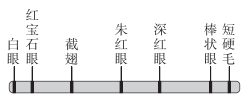
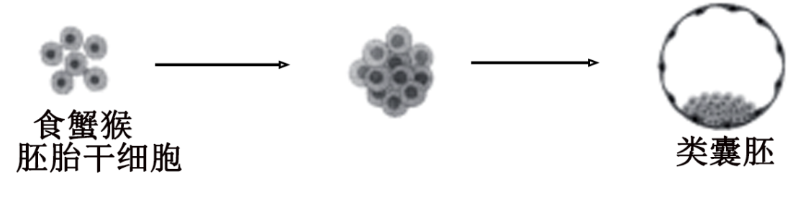
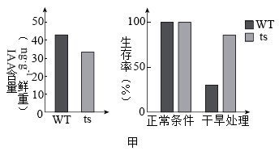
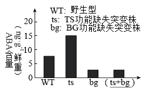
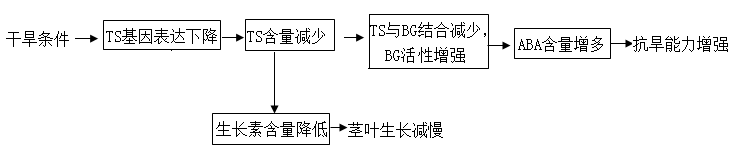
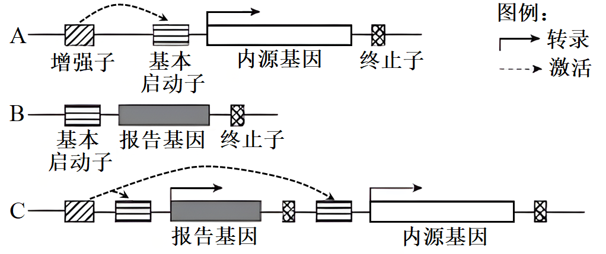
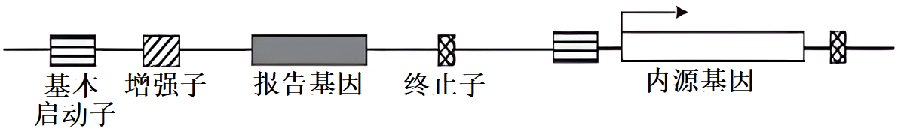

**高考真题**

**2024年普通高中学业水平等级性考试**

**（北京卷）生物**

**本试卷满分100分，考试时间90分钟。**

**第一部分**

**本部分共15题，每题2分，共30分。在每题列出的四个选项中，选出最符合题目要求的一项。**

1\. 关于大肠杆菌和水绵的共同点，表述正确的是（ ）

A. 都是真核生物

B. 能量代谢都发生在细胞器中

C. 都能进行光合作用

D. 都具有核糖体

【答案】D

【解析】

【分析】原核细胞与真核细胞相比，最大的区别是原核细胞没有被核膜包被的典型的细胞核（没有核膜、核仁和染色体）；原核生物没有复杂的细胞器，只有核糖体一种细胞器，但原核生物含有细胞膜、细胞质等结构，也含有核酸（DNA和RNA）和蛋白质等物质，且遗传物质是DNA。

【详解】A、大肠杆菌是原核生物，水绵是真核生物，A错误；

B、大肠杆菌只具有核糖体，无线粒体等其他细胞器，能量代谢不发生在细胞器中，B错误；

C、大肠杆菌无光合色素，不能进行光合作用，C错误；

D、原核生物和真核生物都具有核糖体这一细胞器，D正确。

故选D。

2\. 科学家证明“尼安德特人”是现代人的近亲，依据的是DNA的（ ）

A. 元素组成 B. 核苷酸种类 C. 碱基序列 D. 空间结构

【答案】C

【解析】

【分析】DNA分子的多样性主要表现为构成DNA分子的四种脱氧核苷酸的排列顺序千变万化；特异性主要表现为每个DNA分子都有特定的碱基序列。

【详解】A、DNA的元素组成都是C、H、O、N、P，A不符合题意；

B、DNA分子的核苷酸种类只有4种，B不符合题意；

C、每种DNA的碱基序列不同，“尼安德特人”与现代人的DNA 碱基序列有相似部分，证明“尼安德特人”与现代人是近亲，C符合题意；

D、DNA的空间结构都是规则的双螺旋结构，D不符合题意。

故选C。

3\. 胆固醇等脂质被单层磷脂包裹形成球形复合物，通过血液运输到细胞并被胞吞，形成的囊泡与溶酶体融合后，释放胆固醇。以下相关推测合理的是（ ）

A. 磷脂分子尾部疏水，因而尾部位于复合物表面

B. 球形复合物被胞吞的过程，需要高尔基体直接参与

C. 胞吞形成的囊泡与溶酶体融合，依赖于膜的流动性

D. 胆固醇通过胞吞进入细胞，因而属于生物大分子

【答案】C

【解析】

【分析】溶酶体中含有多种水解酶（水解酶的本质是蛋白质），能够分解很多物质以及衰老、损伤的细胞器，清除侵入细胞的病毒或病菌，被比喻为细胞内的“酶仓库”“消化车间”。

【详解】A、磷脂分子头部亲水，尾部疏水，所以头部位于复合物表面，A错误；

B、球形复合物被胞吞的过程中不需要高尔基体直接参与，直接由细胞膜形成囊泡，然后与溶酶体融合后，释放胆固醇，B错误；

C、胞吞形成的囊泡（单层膜）能与溶酶体融合，依赖于膜具有一定的流动性，C正确；

D、胆固醇属于固醇类物质，是小分子物质，D错误。

故选C。

4\. 某同学用植物叶片在室温下进行光合作用实验，测定单位时间单位叶面积的氧气释放量，结果如图所示。若想提高X，可采取的做法是（ ）

A. 增加叶片周围环境CO2浓度

B. 将叶片置于4℃的冷室中

C. 给光源加滤光片改变光的颜色

D. 移动冷光源缩短与叶片的距离

【答案】A

【解析】

【分析】温度对光合作用的影响：在最适温度下酶的活性最强，光合作用强度最大，当温度低于最适温度，光合作用强度随温度的增加而加强，当温度高于最适温度，光合作用强度随温度的增加而减弱。

【详解】A、二氧化碳是光合作用的原料，增加叶片周围环境CO2浓度可增加单位时间单位叶面积的氧气释放量，A符合题意；

B、降低温度会降低光合作用的酶活性，会降低单位时间单位叶面积的氧气释放量，B不符合题意；

C、给光源加滤光片改变光的颜色可能会使单位时间单位叶面积的氧气释放量降低，比如将蓝紫光改变为绿光会降低光合速率，C不符合题意；

D、移动冷光源缩短与叶片的距离会使光照强度增大，但单位时间单位叶面积的最大氧气释放量可能不变，因为光饱和点之后，光合作用强度不再随着光照强度的增强而增强，D不符合题意。

故选A。

5\. 水稻生殖细胞形成过程中既发生减数分裂，又进行有丝分裂，相关叙述错误的是（ ）

A. 染色体数目减半发生在减数分裂Ⅰ

B. 同源染色体联会和交换发生在减数分裂Ⅱ

C. 有丝分裂前的间期进行DNA复制

D. 有丝分裂保证细胞的亲代和子代间遗传的稳定性

【答案】B

【解析】

【分析】①有丝分裂前的间期：进行DNA的复制和有关蛋白质的合成；②有丝分裂前期：核膜、核仁逐渐解体消失，出现纺锤体和染色体； ③有丝分裂中期：染色体形态固定、数目清晰； ④有丝分裂后期：着丝粒分裂，姐妹染色单体分开成为染色体，并均匀地移向两极； ⑤有丝分裂末期：核膜、核仁重建、纺锤体和染色体消失。

【详解】A、减数分裂I结束后一个细胞分裂为两个细胞，单个细胞染色体数目减半，A正确；

B、同源染色体联会和交换发生在减数分裂I的前期，B错误；

C、有丝分裂前的间期进行DNA复制和有关蛋白质的合成，为后面的有丝分裂作准备，C正确；

D、有丝分裂将亲代细胞的染色体经过复制后，精确地平均分配到两个子细胞中，因而在生物的亲代细胞和子代细胞之间保证了遗传性状的稳定性，D正确。

故选B。

6\. 摩尔根和他的学生们绘出了第一幅基因位置图谱，示意图如图，相关叙述正确的是（ ）

果蝇X染色体上一些基因示意图

A. 所示基因控制的性状均表现为伴性遗传

B. 所示基因在Y染色体上都有对应的基因

C. 所示基因在遗传时均不遵循孟德尔定律

D. 四个与眼色表型相关基因互为等位基因

【答案】A

【解析】

【分析】该图是摩尔根和学生绘出的第一个果蝇各种基因在染色体上相对位置的图。由图示可知，控制果蝇图示性状的基因在该染色体上呈线性排列，果蝇的短硬毛和棒眼基因位于同一条染色体上。

【详解】A、 图为X染色体上一些基因的示意图，性染色体上基因控制的性状总是与性别相关联，图所示基因控制的性状均表现为伴性遗传，A正确；

B、X染色体和Y染色体存在非同源区段，所以Y染色体上不一定含有与 所示基因对应的基因，B错误；

C、在性染色体上的基因（位于细胞核内）仍然遵循孟德尔遗传规律，因此，图所示基因在遗传时遵循孟德尔分离定律，C错误；

D、等位基因是指位于一对同源染色体相 同位置上，控制同一性状不同表现类型的基因，图中四个与眼色表型相关基因位于同一条染色 体上，其基因不是等位基因，D错误。

故选A。

7\. 有性杂交可培育出综合性状优于双亲的后代，是植物育种的重要手段。六倍体小麦和四倍体小麦有性杂交获得F1。F1花粉母细胞减数分裂时染色体的显微照片如图。

据图判断，错误的是（ ）

A. F1体细胞中有21条染色体

B. F1含有不成对的染色体

C. F1植株的育性低于亲本

D 两个亲本有亲缘关系

【答案】A

【解析】

【分析】由题干可知，六倍体小麦和四倍体小麦有性杂交获得F1的方法是杂交育种，原理是基因重组，且F1为异源五倍体，高度不育。

【详解】A、细胞内染色体数目以一套完整的非同源染色体为基数成倍地增加或成套地减少，属于染色体数目变 异。通过显微照片可知，该细胞包括14 个四分体，7条单个染色体，由于每个四分体是1对同源染色体，所以14个四分体是 28条染色体，再加上7条单个染色体，该细胞共有35条染色体。图为F1花粉母细胞减数分裂时染色体显微照片，由图中 含有四分体可知，该细胞正处于减数第--次分裂，此时染色体 数目应与F1体细胞中染色体数目相同，故F1体细胞中染色体数目是35条，A错误；

B、由于六倍体小麦减数分裂产生的配子有3个染色体组，四倍体小麦减数分裂产生的配子有2个染色体组，因此受精作用后形成的F1体细胞中有5个染色体组， F1花粉母细胞减数分裂时，会出现来自六倍体小麦的染色体无法正常联会配对形成四分体的情况，从而出现部分染色体以单个染色体的形式存在的情况，B正确；

C、F1体细胞中存在异源染色体，所以同源染色体联会配对时，可能会出现联会紊乱无法形成正常配子，故F1的育性低于亲本，C正确；

D、由题干信息可知，六倍体小麦和四倍体小麦能够进行有性杂交获得F1，说 明二者有亲缘关系，D正确。

故选A。

8\. 在北京马拉松比赛42.195km的赛程中，运动员的血糖浓度维持在正常范围，在此调节过程中不会发生的是（ ）

A. 血糖浓度下降使胰岛A细胞分泌活动增强

B. 下丘脑—垂体分级调节使胰高血糖素分泌增加

C. 胰高血糖素与靶细胞上的受体相互识别并结合

D. 胰高血糖素促进肝糖原分解以升高血糖

【答案】B

【解析】

【分析】由胰岛A细胞分泌胰高血糖素（分布在胰岛外围）提高血糖浓度，促进血糖来源；由胰岛B细胞分泌胰岛素（分布在胰岛内）降低血糖浓度，促进血糖去路，减少血糖来源，两者激素间是拮抗关系。

【详解】ACD、血糖浓度下降时，胰岛A 细胞的活动增强，胰高血糖素的分泌量增加，胰高血糖素通过体液运输，与靶细胞膜上的相应受体相互识别并结合，将信息传递给靶细胞，促进肝糖原分解升高血糖，完成体液调节，同时血糖浓度的下降，还能刺激下丘脑的某个区域兴奋，通过交感神经调节胰岛A 细胞，增加胰高血糖素的分泌量，促进肝糖原分解升高血糖，完成神经—体液调节，ACD不符合题意；

B、血糖调节过程中，没有涉及垂体，B符合题意。

故选B。

9\. 人体在接种流脑灭活疫苗后，血清中出现特异性抗体，发挥免疫保护作用。下列细胞中，不参与此过程的是（ ）

A. 树突状细胞 B. 辅助性T细胞

C. B淋巴细胞 D. 细胞毒性T细胞

【答案】D

【解析】

【分析】当病原体进入细胞内部，就要靠T细胞直接接触靶细胞来“作战”，这种方式称为细胞免疫；在细胞免疫过程中，靶细胞、辅助性T细胞等参与细胞毒性T细胞的活化过程。当细胞毒性T细胞活化以后，可以识别并裂解被同样病原体感染的靶细胞。靶细胞裂解后，病原体失去了寄生的基础，因而可被抗体结合或直接被其他免疫细胞吞噬、消灭；此后，活化的免疫细胞的功能受到抑制，机体将逐渐恢复到正常状态。

【详解】流脑灭活疫苗属于抗原，会通过树突状细胞摄取呈递给 辅助性T细胞，辅助性T细胞表面的特定分子发生变化并与 B淋巴细胞结合，同时抗原和B淋巴细胞接触，然后大部分B淋巴细胞会增殖分化为浆细胞，浆细胞产生并分泌抗体，细胞毒性T细胞没有参与此过程，其参与细胞免疫过程，ABC不符合题意，D符合題意。

故选D。

10\. 朱鹮曾广泛分布于东亚，一度濒临灭绝。我国朱鹮的数量从1981年在陕西发现时的7只增加到如今的万只以上，其中北京动物园38岁的朱鹮“平平”及其27个子女对此有很大贡献。相关叙述错误的是（ ）

A. 北京动物园所有朱鹮构成的集合是一个种群

B. 朱鹮数量已达到原栖息地的环境容纳量

C. “平平”及其后代的成功繁育属于易地保护

D. 对朱鹮的保护有利于提高生物多样性

【答案】B

【解析】

【分析】生物多样性的保护：①就地保护（自然保护区） ：就地保护是保护物种多样性最为有效的措施。②易地保护：动物园、植物园。③利用生物技术对生物进行濒危物种的基因保护。如建立精子库、种子库等。④利用生物技术对生物进行濒危物种保护。如人工授精、组织培养和胚胎移植等。

【详解】A、北京动物园所有朱鹮属于同种生物构成的集合，是一个种群，A正确；

B、我国朱鹮的数量不断增加，说明朱鹮数量还没达到原栖息地的环境容纳量，B错误；

C、“平平”及其后代离开原来的栖息地来到动物园，属于易地保护，C正确；

D、对朱鹮的保护有利于提高生物多样性，进而提高当地生态系统的稳定性，D正确。

故选B。

11\. 我国科学家体外诱导食蟹猴胚胎干细胞，形成了类似囊胚的结构（类囊胚），为研究灵长类胚胎发育机制提供了实验体系（如图）。相关叙述错误的是（ ）

A. 实验证实食蟹猴胚胎干细胞具有分化潜能

B. 实验过程中使用的培养基含有糖类

C. 类囊胚的获得利用了核移植技术

D. 可借助胚胎移植技术研究类囊胚的后续发育

【答案】C

【解析】

【分析】该过程利用胚胎干细胞创造出了类胚胎结构，并在体外培养至原肠胚时期，将类囊胚移植进雄猴体内后，成功引起了雌猴的早期妊娠反应有可能会产生新生个体，该过程属于无性生殖。

【详解】A、体外诱导食蟹猴胚胎干细胞， 形成了类似囊胚的结构(类囊胚)，证实了食蟹猴胚胎干细胞具有分化潜能，A正确；

B、实验过程中使用的培养基需含有糖类，糖类可为细胞培养提供能源物质，B正确；

C、类囊胚的获得利用了动物细胞培养技术，并没有进行核移植，C错误；

D、可借助胚胎移植技术将类囊胚移植到相应的雌性受体中继续胚胎发育，从而可以用来研究类囊胚的后续发育，D正确。

故选C。

12\. 五彩缤纷的月季装点着美丽的京城，其中变色月季“光谱”备受青睐。“光谱”月季变色的主要原因是光照引起花瓣细胞液泡中花青素的变化。下列利用“光谱”月季进行的实验，难以达成目的的是（ ）

A. 用花瓣细胞观察质壁分离现象

B. 用花瓣大量提取叶绿素

C. 探索生长素促进其插条生根的最适浓度

D. 利用幼嫩茎段进行植物组织培养

【答案】B

【解析】

【分析】当细胞液的浓度小于外界溶液的浓度时，细胞液中的水分就透过原生质层进入到外界溶液中，由于原生质层比细胞壁的伸缩性大，当细胞不断失水时，液泡逐渐缩小，原生质层就会与细胞壁逐渐分离开来，即发生了质壁分离。

【详解】A、花瓣细胞含有中央大液泡，液泡中含有花青素，因此可用花瓣细胞观察质壁分离现象，A不符合题意；

B、花 瓣含花青素，而不含叶绿素，因此不能用花瓣提取叶绿素， B符合题意；

C、生长素能促进月季的茎段生根，可利用月季的茎段为材料来探索生长素促进其插条生根的最适浓度，C不符合题意；

D、月季的幼嫩茎段能分裂，能利用幼嫩茎段的外植体进行植物组织培养，D不符合题意。

故选B。

13\. 大豆叶片细胞的细胞壁被酶解后，可获得原生质体。以下对原生质体的叙述错误的是（ ）

A. 制备时需用纤维素酶和果胶酶

B. 膜具有选择透过性

C. 可再生出细胞壁

D. 失去细胞全能性

【答案】D

【解析】

【分析】植物体细胞杂交就是将不同种的植物体细胞，在一定的条件下融合成杂种细胞，并把杂种细胞培育成新的植物体的技术。该技术涉及的原理是细胞膜的流动性和细胞的全能性。

【详解】A、大豆叶片细胞是植物细胞，具有细胞壁，其细胞壁的成分是纤维素和果胶，所以制备原生质体，需用纤维素酶和果胶酶进行处理，A正确；

B、生物膜的功能特点是具有选择透过性，所以膜具有选择透过性，B正确；

C、原生质体可以再生出新的细胞壁，C正确；

D、分离出的原生质体具有全能性，可用于植物体细胞杂交，为杂种植株的获得提供了理论基础，D错误。

故选D。

14\. 高中生物学实验中，利用显微镜观察到下列现象，其中由取材不当引起是（ ）

A. 观察苏丹Ⅲ染色的花生子叶细胞时，橘黄色颗粒大小不一

B. 观察黑藻叶肉细胞的胞质流动时，只有部分细胞的叶绿体在运动

C. 利用血细胞计数板计数时，有些细胞压在计数室小方格的界线上

D. 观察根尖细胞有丝分裂时，所有细胞均为长方形且处于未分裂状态

【答案】D

【解析】

【分析】1、观察洋葱根尖细胞有丝分裂的实验中，盐酸和酒精混合液的作用是解离，是细胞分散开。

2、脂肪小颗粒+苏丹Ⅲ染液→橘黄色小颗粒。（要显微镜观察）。

【详解】A、脂肪能被苏丹Ⅲ染液染成橘黄色，花生子叶不同部位细胞中的脂肪含量不同，在观察苏丹Ⅲ染色的花生子叶细胞时，橘黄色颗粒大小不一是由细胞中的脂肪含量不同引起的，不是取材不当引起，A不符合题意；

B、观察黑藻叶肉细胞的胞质流动时，材料中应该含有叶绿体，以此作为参照物来观察细胞质的流动，因此只有部分细胞的叶绿体在运动，不是取材不当引起的，出现此情况可能是部分细胞代谢低引起的，B不符合题意；

C、利用血细胞计数板计数时，有些细胞压在计数室小方格的界线上，不是取材不当，可能因稀释度不够导致细胞数较多引起的，C不符合题意；

D、观察根尖细胞有丝分裂时，所有细胞均为长方形且处于未分裂状态，可知取材为伸长区细胞，此实验应取分生区细胞进行观察，出现此情况是由取材不当引起的，D符合题意。

故选D。

15\. 1961年到2007年间全球人类的生态足迹如图所示，下列叙述错误的是（ ）

A. 1961年到2007年间人类的生态足迹从未明显下降过

B. 2005年人类的生态足迹约为地球生态容量的1.4倍

C. 绿色出行、节水节能等生活方式会增加生态足迹

D. 人类命运共同体意识是引导人类利用科技缩小生态足迹的重要基础

【答案】C

【解析】

【分析】生态足迹，又叫生态占用，是指在现有技术条件下，维持某一人口单位生存所需的生产资源和吸纳废物的土地及水域的面积。

【详解】A、由图可知，1961年到2007年间人类的生态足迹一直在上升，从未明显下降过，A正确；

B、由图可知，2005年人类的生态足迹为1.4个地球，约为地球生态容量1.0个地球的1.4倍，B正确；

C、绿色出行、节水节能等生活方式会降低生态足迹，C错误；

D、人类命运共同体意识是引导人类利用科技缩小生态足迹的重要基础，这种意识让人们在面对全球性的挑战，如气候变化、资源短缺、环境污染等问题时，共同应对，携手合作，D正确。

故选C。

**第二部分**

**本部分共6题，共70分。**

16\. 花葵的花是两性花，在大陆上观察到只有昆虫为它传粉。在某个远离大陆的小岛上，研究者选择花葵集中分布的区域，在整个花期进行持续观察。

（1）小岛上的生物与非生物环境共同构成一个\_\_\_\_\_\_\_\_\_\_\_\_\_。

（2）观察发现：有20种昆虫会进入花葵的花中，有3种鸟会将喙伸入花中，这些昆虫和鸟都与雌、雄蕊发生了接触（访花），其中鸟类访花频次明显多于昆虫；鸟类以花粉或花蜜作为补充食物。研究者随机选取若干健康生长的花葵花蕾分为两组，一组保持自然状态，一组用疏网屏蔽鸟类访花，统计相对传粉率（如图）。

结果说明\_\_\_\_\_\_\_\_\_\_\_\_\_\_\_\_由此可知，鸟和花葵的种间关系最可能是\_\_\_\_\_\_。

A．原始合作 B．互利共生 C．种间竞争 D．寄生

（3）研究者增加了一组实验，将花葵花蕾进行套袋处理并统计传粉率。该实验的目的是探究\_\_\_\_\_\_\_\_\_\_\_\_。

（4）该研究之所以能够揭示一些不常见的种间相互作用，是因为“小岛”在生态学研究中具有独特优势。“小岛”在进化研究中也有独特优势，正如达尔文在日记中写道：“……加拉帕戈斯群岛上物种的特征一直深深地触动影响着我。这些事实勾起了我所有的想法。”请写出“小岛”在进化研究中的主要优势\_\_\_\_\_\_\_。

【答案】（1）生态系统

（2） ①. 疏网屏蔽鸟类访花组与自然状态组相比，缺少鸟类参与传粉，只依赖昆虫传粉，减少了花葵与花葵之间的传粉过程，导致相对传粉率与自然状态组相比显著降低，即鸟类也可以参与花葵的传粉并发挥重要作用 ②. A

（3）无昆虫和鸟类传粉，花葵能否完成自花传粉，及花葵自花传粉与异花传粉哪个传粉效率更高

（4）小岛的自然环境与陆地不同，对生物的选择作用不同，生物能够进化出与陆地生物不同的物种特征；岛屿环境资源有限，物种之间竞争激烈，为了更好地适应环境，生物的进化速度更快

【解析】

【分析】原始合作指两种生物共同生活在一起时，双方都受益，但分开后，各自也能独立生活，如海葵与寄居蟹。

互利共生指两种生物长期共同生活在一起，相互依存，彼此有利，如豆科植物和根瘤菌。

【小问1详解】

生态系统属于生命系统结构层次，即在一定空间内，由生物群落与它的非生物环境相互作用而形成的统一整体，故小岛上的生物与非生物环境共同构成一个生态系统。

【小问2详解】

自然状态下，昆虫和鸟类都可以访花，图中的结果表明，疏网屏蔽鸟类访花组与自然状态组相比，相对传粉率显著降低，这说明用疏网屏蔽鸟类访花后，鸟类无法对花葵进行传粉，花葵只能依赖能通过网孔的昆虫进行传粉，减少了花葵与花葵之间的传粉过程，导致相对传粉率与自然状态组相比显著降低，即鸟类也可以参与花葵的传粉过程并发挥重要作用。本题中的鸟类可以帮助花葵传粉，花葵能为鸟类提供花粉或花蜜作为补充食物，鸟和花葵分开后，各自也能独立生活，不影响生存，所以两者是原始合作关系，故选A。

【小问3详解】

将花葵花蕾进行套袋处理后花葵无法进行异花传粉，因此该实验的目的是探究没有昆虫和鸟类传粉时，花葵能否完成自花传粉，并通过计算自花传粉的传粉率来比较花葵自花传粉与异花传粉哪个传粉效率更高。

【小问4详解】

与陆地相比，小岛的自然环境不同，则对生物的选择作用不同，生物能够进化出与陆地生物不同的物种特征，这是“小岛”在进化研究中的主要优势之一；此外，岛屿环境资源有限，不同物种之间竞争激烈，生物为了更好地适应环境，进化速度更快。

17\. 啤酒经酵母菌发酵酿制而成。生产中，需从密闭的发酵罐中采集酵母菌用于再发酵，而直接开罐采集的传统方式会损失一些占比很低的独特菌种。研究者探究了不同氧气含量下酵母菌的生长繁殖及相关调控，以优化采集条件。

（1）酵母菌是兼性厌氧微生物，在密闭发酵罐中会产生\_\_\_\_\_\_\_\_\_\_\_和CO2。有氧培养时，酵母菌增殖速度明显快于无氧培养，原因是酵母菌进行有氧呼吸，产生大量\_\_\_\_\_\_\_\_\_\_\_。

（2）本实验中，采集是指取样并培养4天。在不同的气体条件下从发酵罐中采集酵母菌，统计菌落数（图甲）。由结果可知，有利于保留占比很低菌种的采集条件是\_\_\_\_\_\_。

（3）根据上述实验结果可知，采集酵母菌时O2浓度的陡然变化会导致部分菌体死亡。研究者推测，酵母菌接触O2的最初阶段，细胞产生的过氧化氢（H2O2）浓度会持续上升，使酵母菌受损。已知H2O2能扩散进出细胞。研究者在无氧条件下从发酵罐中取出酵母菌，分别接种至含不同浓度H2O2的培养基上，无氧培养后得到如图乙所示结果。请判断该实验能否完全证实上述推测，并说明理由\_\_\_\_\_。

（4）上述推测经证实后，研究者在有氧条件下从发酵罐中取样并分为两组，A组菌液直接滴加到H2O2溶液中，无气泡产生；B组菌液有氧培养4天后，取与A组活菌数相同的菌液，滴加到H2O2溶液中，出现明显气泡。结果说明，酵母菌可通过产生\_\_\_\_\_\_\_\_\_\_以抵抗H2O2的伤害。

【答案】（1） ①. 酒精##C2H5OH ②. 能量

（2）无氧 （3）不能，该实验只能证明随着H2O2 浓度的持续上升，酵母菌存活率下降(酵母菌受损程度加深)，但不能证明酵母菌接触O2的最初阶段，细胞产生的H2O2 浓度会持续上升；该实验在无氧条件下从发酵罐中取出酵母菌，接种到培养基上无氧培养，并没有创造O2浓度陡然变化的条件

（4）过氧化氢酶##H2O2 酶

【解析】

【分析】（1）在有氧条件下，酵母菌进行有氧呼吸大量繁殖；

（2）在无氧条件下，酵母菌进行无氧呼吸产生酒精和二氧化碳。

【小问1详解】

酵母菌在密闭发酵罐中进行无氧呼吸，会产生酒精（C2H5OH）和CO2。有氧培养时，酵母菌进行有氧呼吸，有机物被彻底氧化分解，产生大量能量，而无氧呼吸中有机物不能彻底分解，只产生少量能量，故有氧培养时酵母菌增殖速度明显快于无氧培养。

【小问2详解】

由图甲结果可知，无氧/无氧条件下，菌落数最多，因此有利于保留占比很低菌种的采集条件是无氧/无氧。

【小问3详解】

依据图乙结果可知，随着H2O2浓度的持续上升，酵母菌存活率下降（酵母菌受损程度加深），但不能证明酵母菌接触O2的最初阶段，细胞产生的H2O2浓度会持续上升；由题意可知，该实验在无氧条件下从发酵罐中取出酵母菌，接种到含不同浓度H2O2的培养基上进行无氧培养，并没有创造O2浓度陡然变化的条件，所以不能完全证实上述推测。

【小问4详解】

过氧化氢酶能催化H2O2分解出现明显气泡，因此实验结果说明，酵母菌可通过产生过氧化氢酶以抵抗H2O2的伤害。

18\. 植物通过调节激素水平协调自身生长和逆境响应（应对不良环境的系列反应）的关系，研究者对其分子机制进行了探索。

（1）生长素（IAA）具有促进生长的作用，脱落酸（ABA）可提高抗逆性并抑制茎叶生长，两种激素均作为\_\_\_\_\_\_\_\_\_\_\_分子，调节植物生长及逆境响应。

（2）TS基因编码的蛋白（TS）促进IAA的合成。研究发现，拟南芥受到干旱胁迫时，TS基因表达下降，生长减缓。研究者用野生型（WT）和TS基因功能缺失突变株（ts）进行实验，结果如图甲。

图甲结果显示，TS基因功能缺失导致\_\_\_\_\_\_\_\_\_\_\_\_\_\_。

（3）为了探究TS影响抗旱性的机制，研究者通过实验，鉴定出一种可与TS结合的酶BG。已知BG催化ABA-葡萄糖苷水解为ABA。提取纯化TS和BG，进行体外酶活性测定，结果如图乙。由实验结果可知TS具有抑制BG活性的作用，判断依据是：\_\_\_\_\_\_\_。

（4）为了证明TS通过抑制BG活性降低ABA水平，可检测野生型和三种突变株中的ABA含量。请在图丙“（\_\_\_\_\_\_）”处补充第三种突变株的类型，并在图中相应位置绘出能证明上述结论的结果\_\_\_\_\_\_\_。

（5）综合上述信息可知，TS能精细协调生长和逆境响应之间的平衡，使植物适应复杂多变的环境。请完善TS调节机制模型（从正常和干旱两种条件任选其一，以未选择的条件为对照，在方框中以文字和箭头的形式作答）\_\_\_\_\_（略）。

【答案】（1）信息 （2）IAA含量降低，生长减缓；干旱处理下，植株生存率提高

（3）在0~2**μg**的浓度范围内，随着TS浓度的升高，BG活性逐渐降低

（4） （5）

【解析】

【分析】植物激素是由植物体内产生，并从产生部位运输到作用部位，对植物的生长发育具有显著影响的微量有机物。由人工合成的调节植物生长发育的化学物质被称为植物生长调节剂。

【小问1详解】

两种植物激素均作为信息分子，参与调节植物生长及逆境响应。

【小问2详解】

由图甲可知，TS基因缺失会导致 IAA含量降低，植株生长减缓，同时在干旱条件下，TS基因功能缺失突变株(ts)生存率比正常植株生存率更高。

【小问3详解】

由图乙可知，在0~2**μg**的浓度范围内，随着TS浓度的升高， BG活性逐渐降低，证明TS具有抑制BG活性的作用。

【小问4详解】

根据图可知，还需要在图丙中补充TS、BG功能缺失突变株(ts+ bg)实验组，因为TS是通过BG发挥调节功能，所以如果BG无法发挥功能，是否存在TS对实验结果几乎没有影响，该组与bg组结果相同，相应的图如下：

【小问5详解】

由上述信息可知，TS基因能精细协调生长和逆境响应之间的平衡，使植物适应复杂多变的环境。图如下：

19\. 灵敏的嗅觉对多数哺乳动物的生存非常重要，能识别多种气味分子的嗅觉神经元位于哺乳动物的鼻腔上皮。科学家以大鼠为材料，对气味分子的识别机制进行了研究。

（1）嗅觉神经元的树突末梢作为感受器，在气味分子的刺激下产生\_\_\_\_\_\_\_\_\_\_\_，经嗅觉神经元轴突末端与下一个神经元形成的\_\_\_\_\_\_\_\_\_\_\_将信息传递到嗅觉中枢，产生嗅觉。

（2）初步研究表明，气味受体基因属于一个大的基因家族。大鼠中该家族的各个基因含有一些共同序列（保守序列），也含有一些有差异的序列（非保守序列）。不同气味受体能特异识别相应气味分子的关键在于\_\_\_\_\_\_\_\_\_\_\_序列所编码的蛋白区段。

（3）为了分离鉴定嗅觉神经元中的气味受体基因，科学家依据上述保守序列设计了若干对引物（图甲），利用PCR技术从大鼠鼻腔上皮组织mRNA的逆转录产物中分别扩增基因片段，再用限制酶*Hinf*Ⅰ对扩增产物进行充分酶切。图乙显示用某对引物扩增得到的PCR产物（A）及其酶切片段（B）的电泳结果。结果表明酶切片段长度之和大于PCR产物长度，推断PCR产物由\_\_\_\_\_\_\_\_\_\_\_组成。

（4）在上述实验基础上，科学家们鉴定出多种气味受体，并解析了嗅觉神经元细胞膜上信号转导的部分过程（图丙）。

如果钠离子通道由气味分子直接开启，会使嗅觉敏感度大大降低。根据图丙所示机制，解释少量的气味分子即可被动物感知的原因\_\_\_\_\_\_。

【答案】（1） ①. 兴奋 ②. 突触

（2）非保守 （3）长度相同但非保守序列不同的DNA片段

（4）少量的气体分子通过活化的G蛋白、活化的C酶，在C酶的催化下合成大量的cAMP使Na+通道打开，Na+内流，神经元细胞膜上产生动作电位，气味分子被动物感知

【解析】

【分析】兴奋在神经元之间传递：（1）神经元之间的兴奋传递就是通过突触实现的。（2）兴奋的传递方向：单向传递。

【小问1详解】

气味分子刺激感受器产生兴奋。嗅觉神经元轴突末端、神经元间隙与下一个神经元组成突触，包括突触前膜、突触间隙和突触后膜。

【小问2详解】

不同气味受体能特异性识别相应气味分子的关键在于蛋白质中结构不同的部分，由非保守序列编码。

【小问3详解】

由图可知，PCR产物含保守序列和非保守序列，若非保守序列不同，酶切产物的长度可能不同，导致酶切片段长度之和大于PCR产物长度，因此PCR产物由长度相同但非保守序列不同的DNA片段组成。

【小问4详解】

由图丙可知，少量的气体分子通过活化G蛋白使得C酶活化，在C酶的催化下，由ATP合成大量的cAMP ，促使Na+通道打开，Na+内流，导致神经元细胞膜上产生动作电位，气味分子被动物感知。

20\. 学习以下材料，回答（1）～（4）题。

筛选组织特异表达的基因

筛选组织特异表达的基因，对研究细胞分化和组织、器官的形成机制非常重要。“增强子捕获”是筛选组织特异表达基因的一种有效方法。

真核生物的基本启动子位于基因5'端附近，没有组织特异性，本身不足以启动基因表达。增强子位于基因上游或下游，与基本启动子共同组成基因表达的调控序列。基因工程所用表达载体中的启动子，实际上包含增强子和基本启动子。

很多增强子具有组织特异的活性，它们与特定蛋白结合后激活基本启动子，驱动相应基因在特定组织中表达（图A）。基于上述调控机理，研究者构建了由基本启动子和报告基因组成的“增强子捕获载体”（图B），并转入受精卵。捕获载体会随机插入基因组中，如果插入位点附近存在有活性的增强子，则会激活报告基因的表达（图C）。

获得了一系列分别在不同组织中特异表达报告基因的个体后，研究者提取每个个体的基因组DNA，通过PCR扩增含有捕获载体序列的DNA片段。对PCR产物进行测序后，与相应的基因组序列比对，即可确定载体的插入位点，进而鉴定出相应的基因。

研究者利用各种遗传学手段，对筛选得到的基因进行突变、干扰或过表达，检测个体表型的改变，研究其在细胞分化和个体发育中的作用，从而揭示组织和器官形成的机理。

（1）在个体发育中，来源相同的细胞在形态、结构和功能上发生\_\_\_\_\_\_\_\_\_\_\_的过程称为细胞分化，分化是基因\_\_\_\_\_\_\_\_\_\_\_的结果。

（2）对文中“增强子”的理解，错误的是\_\_\_\_\_\_\_\_。

A. 增强子是含有特定碱基序列的DNA片段

B. 增强子、基本启动子和它们调控的基因位于同一条染色体上

C. 一个增强子只能作用于一个基本启动子

D. 很多增强子在不同组织中的活性不同

（3）研究者将增强子捕获技术应用于斑马鱼，观察到报告基因在某幼体的心脏中特异表达。鉴定出捕获载体的插入位点后，发现位点附近有两个基因G和H，为了确定这两个基因是否为心脏特异表达的基因，应检测\_\_\_\_\_\_\_\_\_\_\_。

（4）真核生物编码蛋白的序列只占基因组的很少部分，因而在绝大多数表达报告基因的个体中，增强子捕获载体的插入位点位于基因外部，不会造成基因突变。研究者对图B所示载体进行了改造，期望改造后的载体随机插入基因组后，在“捕获”增强子的同时，也造成该增强子所调控的基因发生突变，以研究基因功能。请画图表示改造后的载体，并标出各部分名称\_\_\_\_\_（略）。

【答案】（1） ①. 稳定性差异 ②. 选择性表达 （2）C

（3）其他器官细胞中，G和H两个基因是否转录出相应的mRNA或是否翻译出相应的蛋白质

（4）

【解析】

【分析】基因工程技术的基本步骤：

（1）目的基因的获取：方法有从基因文库中获取、利用PCR技术扩增和人工合成。

（2）基因表达载体的构建：是基因工程的核心步骤，基因表达载体包括目的基因、启动子、终止子和标记基因等。

（3）将目的基因导入受体细胞：根据受体细胞不同，导入的方法也不一样。将目的基因导入植物细胞的方法有农杆菌转化法、基因枪法和花粉管通道法；将目的基因导入动物细胞最有效的方法是显微注射法；将目的基因导入微生物细胞的方法是感受态细胞法。

（4）目的基因的检测与鉴定。

【小问1详解】

细胞分化是指在个体发育中，由一个或一种细胞增殖产生的后代，在形态、结构和生理功能上发生稳定性差异的过程。分化是基因选择性表达的结果。

【小问2详解】

AB、依据题干“增强子位于基因上游或下游，与基本启动子共同组成基因 表达的调控序列”可知,增强子是含有特定碱基序列的DNA片 段，增强子、基本启动子和它们调控的基因位于同一条染色体 上，AB正确；

C、由图C可知，一个增强子可作用于多个基本启动子，C错误；

C、依据题干“很多增强子具有组织特异活性”可知，很多增强子在不同组织中的活性不同，D正确。

故选C。

【小问3详解】

若要确定这两个基因是否为心脏特异表达的基因，可通过PCR等技术检测其他器官细胞中G和H两个基因是否转录出相应的 mRNA或是否翻译出相应的蛋白质。

【小问4详解】

增强子位于基因上游或下游，与基本启动子共同组成基因表达的调控序列。基因工程所用表达载体中的启动子，实际上包含增强子和基本启动子。增强子捕获载体的插入位点位于基因外部，不会造成基因突变。而当增强子捕获载体的插入位点位于基因内部，会引起造成该增强子所调控的基因发生突变，为研究某目的基因的功能，需要将增强子插入到目的基因内部。图如下：

21\. 玉米是我国栽培面积最大的农作物，籽粒大小是决定玉米产量的重要因素之一，研究籽粒的发育机制，对保障粮食安全有重要意义。

（1）研究者获得矮秆玉米突变株，该突变株与野生型杂交，F1表型与\_\_\_\_\_\_\_\_\_\_\_相同，说明矮秆是隐性性状。突变株基因型记作rr。

（2）观察发现，突变株所结籽粒变小。籽粒中的胚和胚乳经受精发育而成，籽粒大小主要取决于胚乳体积。研究发现，R基因编码DNA去甲基化酶，亲本的该酶在本株玉米所结籽粒的发育中发挥作用。突变株的R基因失活，导致所结籽粒胚乳中大量基因表达异常，籽粒变小。野生型及突变株分别自交，检测授粉后14天胚乳中DNA甲基化水平，预期实验结果为\_\_\_\_\_\_\_\_\_\_\_\_\_\_\_\_\_\_。

（3）已知Q基因在玉米胚乳中特异表达，为进一步探究R基因编码的DNA去甲基化酶对Q基因的调控作用，进行如下杂交实验，检测授粉后14天胚乳中Q基因的表达情况，结果如表1。

表1

|     |                 |         |
|:---:|:---------------:|:-------:|
| 组别  | 杂交组合            | Q基因表达情况 |
| 1   | RRQQ（♀）×RRqq（♂） | 表达      |
| 2   | RRqq（♀）×RRQQ（♂） | 不表达     |
| 3   | rrQQ（♀）×RRqq（♂） | 不表达     |
| 4   | RRqq（♀）×rrQQ（♂） | 不表达     |

综合已有研究和表1结果，阐述R基因对胚乳中Q基因表达的调控机制\_\_\_\_。

（4）实验中还发现另外一个籽粒变小的突变株甲，经证实，突变基因不是R或Q。将甲与野生型杂交，F1表型正常，F1配子的功能及受精卵活力均正常。利用F1进行下列杂交实验，统计正常籽粒与小籽粒的数量，结果如表2。

表2

|     |                       |          |
|:---:|:---------------------:|:--------:|
| 组别  | 杂交组合                  | 正常籽粒：小籽粒 |
| 5   | F1（♂）×甲（♀） | 3：1      |
| 6   | F1（♀）×甲（♂） | 1：1      |

已知玉米子代中，某些来自父本或母本的基因，即使是显性也无功能。

①根据这些信息，如何解释基因与表2中小籽粒性状的对应关系？请提出你的假设\_\_\_\_\_\_\_\_。

②若F1自交，所结籽粒的表型及比例为\_\_\_\_\_\_\_\_\_\_\_\_，则支持上述假设。

【答案】（1）野生型 （2）野生型所结籽粒胚乳中DNA甲基化水平低于突变株

（3）R基因编码的DNA去甲基化酶只能对本株玉米所结籽粒的胚乳中来自本植株的Q基因发挥功能

（4） ①. 籽粒变小受到两对等位基因的控制，任意一对等位基因中的显性基因正常发挥功能的个体表现为正常籽粒，没有显性基因或显性基因均无法正常发挥功能的个体表现为小籽粒，其中有一对等位基因的显性基因来自母本的时候无法发挥功能 ②. 正常籽粒：小籽粒=7：1

【解析】

【分析】判断显隐性的方式有：①表型相同的个体杂交，后代新出现的表型为隐性；②表型不同的纯合个体杂交，后代出现的表型为显性。

【小问1详解】

若矮秆是隐性性状，矮秆玉米突变株与野生型杂交，子代表型与野生型相同。

【小问2详解】

野生型R基因正常，能编码DNA去甲基化酶，催化DNA去甲基化，所以野生型及突变株分别自交，野生型植株所结籽粒胚乳中DNA甲基化水平更低。

【小问3详解】

由组别2、4可知，母本中的R基因编码的DNA去甲基化酶无法为父本提供的Q基因去甲基化，由组别3可知父本中R基因编码的DNA去甲基化酶不能对母本上所结籽粒的胚乳中的Q基因发挥功能。结合前面的研究成果：亲本的该酶在本株玉米所结籽粒的发育中发挥作用，可得R基因编码的DNA去甲基化酶只能对本株玉米所结籽粒的胚乳中来自本植株的Q基因发挥功能。

【小问4详解】

①甲与野生型杂交得到的子代为正常个体，说明小籽粒为隐性性状。F1与甲杂交属于测交，F1作父本时，结果出现正常籽粒：小籽粒=3：1，推测该性状受到两对等位基因的控制，且只有不含显性基因的个体表现为小籽粒。F1作母本时，与甲杂交，后代正常籽粒：小籽粒=1：1，结合题目中“已知玉米子代中，某些来自父本或母本的基因，即使是显性也无功能”推测，母本产生配子时有一对等位基因是不发挥功能的。因此提出的假设为：籽粒变小受到两对等位基因的控制，任意一对等位基因中的显性基因正常发挥功能的个体表现为正常籽粒，没有显性基因或显性基因均无法正常发挥功能的个体表现为小籽粒，其中有一对等位基因的显性基因来自母本的时候无法发挥功能。②F1自交，F1产生的精子中含显性基因正常发挥功能的配子：不含显性基因的配子=3：1，F1产生的卵细胞中含显性基因正常发挥功能的配子：不含显性基因的配子和含显性基因不发挥功能的配子=1：1，所以F1自交所结籽粒的表型及比例为正常籽粒：小籽粒=（1-1/4×1/2）：（1/4×1/2）=7：1。
