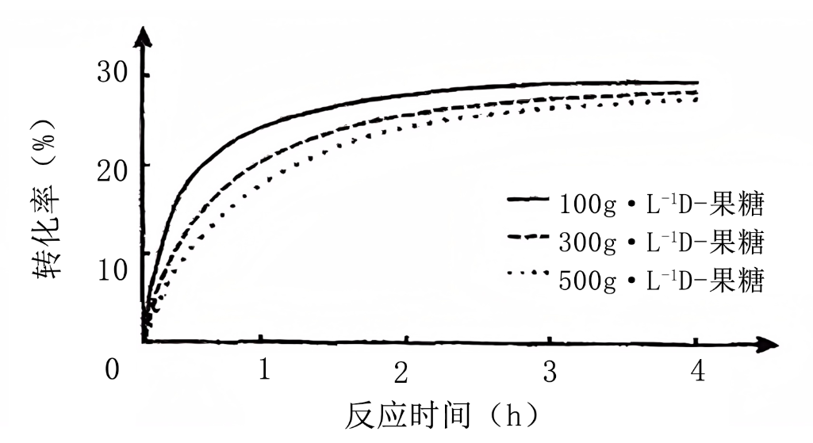
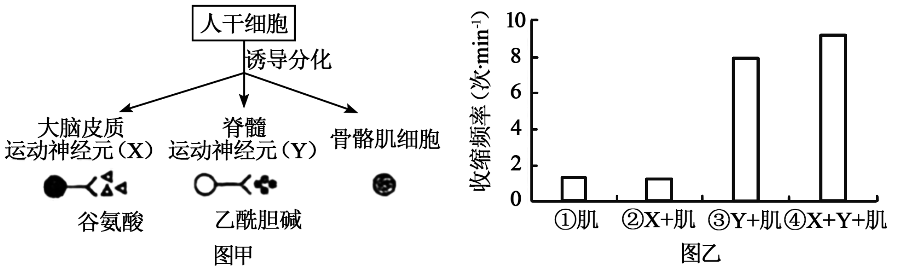
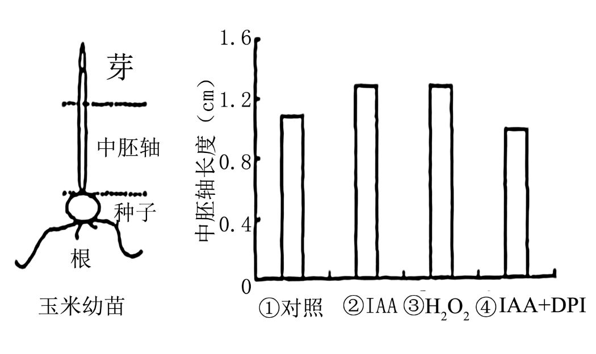
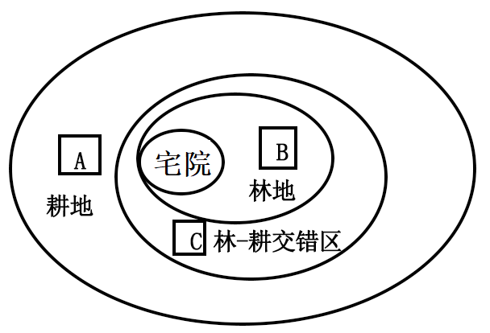

**绝密★启用前**

**2025年普通高等学校招生全国统一考试**

**生物试题**

**注意事项：**

**1．答题前，考生务必将自己的姓名、准考证号填写在答题卡上。**

**2．回答选择题时，选出每小题答案后，用铅笔把答题卡上对应题目的答案标号涂黑。如需改动，用橡皮擦干净后，再选涂其他答案标号。回答非选择题时，将案写在答题卡上。写在本试卷上无效。**

**3．考试结束后，监考员将试卷、答题卡一并交回。**

**一、单项选择题：本题共15小题，每小题3分，共45分。在每小题给出的四个选项中，只有一项是最符合题目要求的。**

1\. 真核细胞的核孔含有多种蛋白质，这些蛋白质的主要区别是（ ）

A. 基本组成元素不同 B. 单体连接方式不同

C. 肽链空间结构不同 D. 合成加工场所不同

【答案】C

【解析】

【分析】氨基酸的结构特点：每种氨基酸至少都含有一个氨基和一个羧基，并且都有一个氨基和一个羧基连接在同一个碳上。这个碳上还连接一个氢原子和一个侧链基团，这个侧链基团用R表示。各种氨基酸之间的区别在于R基的不同。

【详解】A、蛋白质的基本单位是氨基酸，氨基酸的基本元素是C、H、O、N，真核细胞的核孔含有多种蛋白质，这些蛋白质的基本组成元素相同，A错误；

B、单体连接方式相同，均是氨基酸之间脱水缩合形成肽键连接，B错误；

C、不同的蛋白质功能不同，功能与结构相适应，因此这些蛋白质的肽链盘曲折叠形成的空间结构不同，C正确；

D、真核生物核孔蛋白质均属于胞内蛋白，合成加工场所相同，均在细胞质，D错误。

故选C。

2\. 我国大熊猫保护工作已取得显著成效，但仍面临部分种群遗传多样性较低的问题。下列措施中不属于保护大熊猫遗传多样性的是（ ）

A. 选繁殖能力强的个体进行人工繁育

B. 建立基因库保存不同种群的遗传材料

C. 建立生态走廊促进种群间基因交流

D. 在隔离的小种群中引入野化放归个体

【答案】A

【解析】

【分析】生物多样性的保护：（1）就地保护（自然保护区）：就地保护是保护物种多样性最为有效的措施。（2）易地保护：动物园、植物园。（3）利用生物技术对生物进行濒危物种的基因进行保护，如建立精子库、种子库等。（4）利用生物技术对生物进行濒危物种进行保护，如人工授精、组织培养和胚胎移植等。

【详解】A、选择繁殖能力强的个体进行人工繁育，这种方式可能会导致种群基因逐渐趋于一致，因为只注重了繁殖能力这一性状，而忽略了其他基因的多样性，不属于保护遗传多样性的措施，A正确；

B、建立基因库保存不同种群的遗传材料，能够保留物种的各种基因，有利于保护遗传多样性，B错误；

C、建立生态走廊促进种群间基因交流，可以使不同种群的基因相互交换，增加基因的多样性，C错误；

D、在隔离的小种群中引入野化放归个体，能够为小种群带来新的基因，增加遗传多样性，D错误。

故选A。

3\. 通俗地说，细胞自噬就是细胞“吃掉”自身的结构和物质。下列叙述错误的是（ ）

A. 溶酶体作为“消化车间”可为细胞自噬过程提供水解酶

B. 线粒体作为“动力车间”为细胞自噬过程提供所需能量

C. 细胞自噬产生的氨基酸可作为原料重新用于蛋白质合成

D. 细胞自噬“吃掉”细胞器不利于维持细胞内部环境稳定

【答案】D

【解析】

【分析】细胞自噬：通俗地说，细胞自噬就是细胞吃掉自身的结构和物质。在一定条件下，细胞会将受损或功能退化的细胞结构等，通过溶酶体降解后再利用，这就是细胞自噬。处于营养缺乏条件下的细胞，通过细胞自噬可以获得维持生存所需的物质和能量；在细胞受到损伤、微生物入侵或细胞衰老时，通过细胞自噬，可以清除受损或衰老的细胞器，以及感染的微生物和毒素，从而维持细胞内部环境的稳定。有些激烈的细胞自噬，可能诱导细胞凋亡。

【详解】A、溶酶体含有多种水解酶，能分解衰老、损伤的细胞器等，可作为 “消化车间” 为细胞自噬提供水解酶，A正确；

B、线粒体有氧呼吸主要场所，能为细胞生命活动（包括细胞自噬 ）提供能量（ATP），B正确；

C、细胞自噬分解衰老细胞器等产生氨基酸，氨基酸可作为原料参与蛋白质合成，实现物质再利用，C正确；

D、细胞自噬 “吃掉” 衰老、损伤的细胞器，能维持细胞内部环境稳定，利于细胞正常代谢，D错误。

故选D。

4\. 某细菌能将组氨酸脱羧生成组胺和CO2，相关物质的跨膜运输过程如下图。下列叙述正确的是（ ）

A. 转运蛋白W可协助组氨酸逆浓度梯度进入细胞

B. 胞内产生的组胺跨膜运输过程需要消耗能量

C. 转运蛋白W能同时转运两种物质，故不具特异性

D. CO2分子经自由扩散，只能从胞内运输到胞外

【答案】B

【解析】

【分析】图中运输组胺的方式是从低浓度向高浓度运输，属于主动运输，组氨酸脱羧生成组胺和CO2。

【详解】A、从图中看出，转运蛋白W可协助组氨酸顺浓度梯度进入细胞，A错误；

B、胞内产生的组胺跨膜运输至膜外是从低浓度至高浓度，属于主动运输，需要消耗能量，能量由组氨酸浓度梯度提供，B正确；

C、转运蛋白W能同时转运两种物质，也具有特异性，C错误；

D、CO2分子经自由扩散，也可以从胞外运输至胞内，例如从血浆进入肺部细胞，D错误。

故选B。

5\. 下列以土豆为材料的实验描述，错误的是（ ）

A. 土豆DNA溶于酒精后，与二苯胺试剂混合呈蓝色

B. 向土豆匀浆中加入一定量的碘液后，溶液会呈蓝色

C. 利用土豆匀浆制备的培养基，可用于酵母菌的培养

D. 土豆中的过氧化氢酶可用于探究pH对酶活性的影响

【答案】A

【解析】

【分析】1、生物组织中化合物的鉴定：

（1）斐林试剂可用于鉴定还原糖，在水浴加热的条件下，溶液的颜色变化为砖红色（沉淀）。斐林试剂只能检验生物组织中还原糖（如葡萄糖、麦芽糖、果糖）存在与否，而不能鉴定非还原性糖（如淀粉）。

（2）蛋白质可与双缩脲试剂产生紫色反应。

（3）脂肪可用苏丹Ⅲ染液鉴定，呈橘黄色。

（4）淀粉遇碘液变蓝。

2、DNA粗提取和鉴定的原理：

（1）DNA的溶解性：DNA和蛋白质等其他成分在不同浓度NaCl溶液中溶解度不同；DNA不溶于酒精溶液，但细胞中的某些蛋白质溶于酒精；

（2）DNA的鉴定：在沸水浴的条件下，DNA遇二苯胺会被染成蓝色。

【详解】A、DNA的鉴定需在沸水浴条件下与二苯胺试剂反应呈蓝色，题目中未提及沸水浴步骤，无法显色，A错误；

B、碘液可以将淀粉染成蓝色，所以向土豆匀浆中加入一定量的碘液后，溶液会呈蓝色，B正确；

C、利用土豆匀浆制备的培养基，含有碳源、氮源、水、无机盐和其他酵母菌生长需要的物质，所以可用于酵母菌的培养，C正确；

D、过氧化氢酶的活性受到pH的影响，所以土豆中的过氧化氢酶可用于探究pH对酶活性的影响，D正确。

故选A。

6\. 研究人员用花椰菜（BB，2n=18）根与黑芥（CC，2n=16）叶片分别制备原生质体，经PEG诱导融合形成杂种细胞，进一步培养获得再生植株，其中的植株N经鉴定有33条染色体。下列叙述正确的是（ ）

A. 两个原生质体融合形成的细胞即为杂种细胞

B. 再生植株N的形成证明杂种细胞仍具有全能性

C. 花椰菜和黑芥的原生质体能融合，证明两种植物间不存在生殖隔离

D. 植株N的B组和C组染色体不能正常联会配对，无法产生可育配子

【答案】B

【解析】

【分析】植物体细胞杂交是指将不同种的植物体细胞在一定条件下融合成为杂种细胞，并把杂种细胞培育成新的植物体的方法。其原理是细胞膜的流动性和细胞的全能性，去除细胞壁后诱导原生质体融合的方法有离心、电刺激、聚乙二醇等试剂诱导，其典型优势是克服远缘杂交不亲和的障碍。

【详解】A、两个原生质体融合形成的细胞不一定是杂种细胞，有可能是两个花椰菜原生质体融合或两个黑芥原生质体融合等，A 错误；

B、全能性是指已经分化的细胞仍然具有发育成完整个体的潜能，杂种细胞经过培养形成再生植株 N，这证明了杂种细胞仍具有全能性，B正确；

C、花椰菜和黑芥是不同物种，它们之间存在生殖隔离。原生质体能融合并不能证明不存在生殖隔离，因为生殖隔离是指不同物种之间一般是不能相互交配的，即使交配成功，也不能产生可育的后代，C错误；

D、植株 N 是花椰菜（BB，2n=18）和黑芥（CC，2n=16），二者原生质体经 PEG 诱导融合形成杂种细胞后，染色体组成是 BBCC，存在同源染色体，在减数分裂时能正常联会配对，能产生可育配子，D错误。

故选B。

7\. 为杀死蜜蜂寄生虫瓦螨，研究人员对蜜蜂肠道中的S菌进行改造，使其能释放特定的双链RNA（dsRNA）。进入瓦螨体内的dsRNA被加工成siRNA后，能与瓦螨目标基因的mRNA特异性结合使其降解，导致瓦螨死亡。下列叙述正确的是（ ）

A. siRNA的嘌呤与嘧啶之比和dsRNA相同

B. dsRNA加工成siRNA会发生氢键的断裂

C. 瓦螨死亡的原因是目标基因的转录被抑制

D. 用改造后的S菌来杀死瓦螨属于化学防治

【答案】A

【解析】

【分析】进入瓦螨体内的dsRNA被加工成siRNA后，能与瓦螨目标基因的mRNA特异性结合使其降解，导致瓦螨死亡，这是抑制了翻译过程。

【详解】A、dsRNA为双链结构，嘌呤数等于嘧啶数，其嘌呤与嘧啶之比为1:1。siRNA是由dsRNA加工而来的双链小片段，其嘌呤与嘧啶之比仍为1:1，A正确；

B、dsRNA加工成siRNA的过程是通过酶（如Dicer酶）切割磷酸二酯键，而非断裂氢键，B错误；

C、根据题干信息，siRNA能与瓦螨目标基因的mRNA特异性结合使其降解，导致瓦螨死亡，所以siRNA直接抑制的是翻译过程，C错误；

D、用改造后的S菌来杀死瓦螨属于生物防治，D错误。

故选A

8\. 微塑料由塑料废弃物风化形成，难以降解，会危害生态环境和人体健康。有人分离到X和Y两种微塑料降解菌，将总菌量相同的X、Y、X+Y（X:Y=1:1）分别接种于含有等量微塑料的蛋白胨液体培养基中，培养一段时间后测定微塑料的残留率（残留率=剩余量/添加量×100%），结果如下图。下列叙述正确的是（ ）

A. 用平板划线法能测定X菌组中的活菌数

B. Y菌组微塑料残留率较高，故菌浓度也高

C. 混合菌种对微塑料的降解能力高于单一菌种

D. 能在该培养基中生长繁殖的微生物都能降解微塑料

【答案】C

【解析】

【分析】接种最常用的方法：

（1）平板划线分离法：由接种环以菌操作沾取少许待分离的材料，在无菌平板表面进行平行划线、扇形划线或其他形式的连续划线，微生物细胞数量将随着划线次数的增加而减少，并逐步分散开来，如果划线适宜的话，微生物能一一分散，经培养后，可在平板表面得到单菌落。

（2）稀释平板法：首先将待测样品制成均匀的系列稀释液，尽量使样品中的微生物细胞分散开，使成单个细胞存在（否则一个菌落就不只是代表一个细胞），再取一定稀释度、一定量的稀释液接种到平板中，使其均匀分布于平板中的培养基内。

【详解】A、平板划线法主要用于微生物的分离和纯化，不能用于测定活菌数，测定活菌数常用稀释涂布平板法，A错误；

B、Y菌组微塑料残留率较高，说明Y菌对微塑料的降解能力相对较弱，而不是菌浓度高，微塑料残留率与菌对微塑料的降解能力有关，而非直接与菌浓度相关，B错误；

C、由图可知，X+Y混合菌种组的微塑料残留率低于X菌组和Y菌组，说明混合菌种对微塑料的降解能力高于单一菌种，C正确；

D、该培养基中含有蛋白胨，能在该培养基中生长繁殖的微生物可能利用蛋白胨作为碳源和氮源等，但不一定都能降解微塑料，D错误。

故选C。

9\. 为更好地保护草原生态系统，有人对某草原两种鼠类及其天敌的昼夜相对活动频次进行统计，结果如下图。下列推断不合理的是（ ）

A. 子午沙鼠的昼夜活动节律主要受到了兔狲的影响

B. 两种鼠类的活动节律显示它们已发生生态位分化

C. 两种天敌间的竞争比两种沙鼠间的竞争更为激烈

D. 一定数量的兔狲和赤狐有利于维持草原生态平衡

【答案】A

【解析】

【分析】1、生态位是指一个物种在群落中的地位或作用，包括所处的空间位置、占用资源情况以及与其他物种的关系等。 生态位是一个物种的食物、习性、栖息地等生活要素的集合。种内竞争导致该物种的生态位变宽，竞争越强则生态位较宽的可能性越大；种间竞争导致生态位的分离，或者一种物种被淘汰，理论上只有这两种情况，而实际上则不是，如两物种生态位重叠，但资源十分丰富，则这两物种也能共同存活。

2、种间关系是指不同物种种群之间的相互作用所形成的关系，两个种群的相互关系可以是间接地，也可以是直接的相互影响，这种影响可能是有害的，也可能是有利的。

【详解】A、子午沙鼠是夜行性，兔狲主要是昼间和夜间活动活动，二者活动时间重叠少，子午沙鼠的昼夜活动节律主要受赤狐影响，二者生态位重叠程度较大，A不合理；

B、大沙鼠（晨昏活动 ）和子午沙鼠（夜间活动 ）活动时间不同，生态位分化（减少竞争），B合理；

C、兔狲（主要是昼间和夜间活动活动）和赤狐（夜间 ）活动时间重叠多，竞争食物等资源更激烈；两种鼠活动时间差异大，竞争弱，C合理；

D、兔狲和赤狐捕食鼠类，控制鼠种群数量，利于维持草原生态平衡，D合理。

故选A。

10\. D-阿洛酮糖是一种低热量多功能糖，有助于肥胖人群的体重管理。Co2+可协助酶Y催化D-果糖转化为D-阿洛酮糖。有人在相同体积、相同酶量且最适反应条件（含Co2+条件）下，测定不同浓度D-果糖的转化率（转化率=产物量/底物量×100%），其变化趋势如下图。下列叙述正确的是（ ）

A. 升高反应温度，可进一步提高D-果糖转化率

B. D-果糖的转化率越高，说明酶Y的活性越强

C. 若将Co2+的浓度加倍，酶促反应速率也加倍

D. 2h时，三组中500g·L-1果糖组产物量最高

【答案】D

【解析】

【分析】酶是活细胞产生的具有催化作用的有机物，其中绝大多数酶是蛋白质，少数是RNA，具有高效性、专一性和作用条件较温和的特点。

【详解】A、题干中实验是在最适反应条件下进行的，升高温度会使酶的活性降低，从而降低D-果糖转化率，A错误；

B、D-果糖的转化率不仅与酶Y的活性有关，还与底物（D-果糖）的浓度、反应时间等因素有关，所以不能仅根据转化率高就说明酶Y的活性强，B错误；

C、Co2+可协助酶Y催化反应，但Co2+不是酶，将Co2+的浓度加倍，不一定会使酶促反应速率也加倍，酶促反应速率还受到酶的数量、底物浓度等多种因素影响，C错误；

D、 转化率=产物量/底物量×100%，2h时，500g·L-1果糖组的转化率不是最高，但底物量是最多的，且转化率也较高，根据产物量=底物量×转化率，可知其产物量最高，D正确。

故选D。

11\. 系统性红斑狼疮的发生与部分B细胞的异常活化有关，人体绝大多数B细胞表面具有CD19抗原。科学家将患者的T细胞改造成表达CD19抗原受体的T细胞（CD19CAR-T细胞），使其能特异性识别并裂解具有CD19抗原的B细胞，为治疗系统性红斑狼疮开辟新途径。下列叙述正确的是（ ）

A. 系统性红斑狼疮一种人体自身免疫病，其发病机制与细胞免疫异常有关

B. 治疗选取的T细胞为辅助性T细胞，可从血液、淋巴液和免疫器官中获得

C. CD19CAR-T细胞主要通过增强患者的体液免疫来治疗系统性红斑狼疮

D. CD19CAR-T细胞不仅能裂解异常活化的B细胞，也会攻击正常B细胞

【答案】D

【解析】

【分析】系统性红斑狼疮属于体液免疫异常导致的自身免疫病，CD19CAR-T细胞通过特异性识别CD19抗原的B细胞并裂解之，从而减少异常B细胞的数量。

【详解】A、系统性红斑狼疮的发生与部分B细胞的异常活化有关，所以系统性红斑狼疮是一种人体自身免疫病，其发病机制与体液免疫异常有关，A错误；

B、科学家将患者的T细胞改造成表达CD19抗原受体的T细胞（CD19CAR-T细胞），使其能特异性识别并裂解具有CD19抗原的B细胞，所以治疗选取的T细胞为细胞毒性T细胞，B错误；

C、CD19CAR-T细胞能特异性识别并裂解具有CD19抗原的B细胞，所以是通过降低患者的体液免疫来治疗系统性红斑狼疮，C错误；

D、CD19CAR-T细胞裂解具有CD19抗原的B细胞，但人体其他细胞可能也有CD19抗原，所以CD19CAR-T细胞也会攻击正常B细胞，D正确。

故选D。

12\. 足底黑斑病（甲病）和杜氏肌营养不良（乙病）均为单基因遗传病，其中至少一种是伴性遗传病。下图为某家族遗传系谱图，不考虑新的突变，下列叙述正确的是（ ）

A. 甲病为X染色体隐性遗传病

B. Ⅱ2与Ⅲ2的基因型相同

C. Ⅲ3的乙病基因来自Ⅰ1

D. Ⅱ4和Ⅱ5再生一个正常孩子概率为1/8

【答案】C

【解析】

【分析】基因自由组合定律：位于非同源染色体上的非等位基因的分离或组合是互不干扰的；在减数分裂过程中，同源染色体上的等位基因彼此分离的同时，非同源染色体上的非等位基因自由组合。

【详解】A、I1和I2表现正常，他们的女儿Ⅱ2患甲病，所以可以判断甲病为常染色体隐性遗传病，相关基因用A、a表示，已知至少一种病是伴性遗传病，且甲病为常染色体隐性遗传病，所以乙病为伴性遗传病，I3和I4表现正常，他们的儿子Ⅱ5患乙病，说明乙病为伴X染色体隐性遗传病，相关基因用B、b表示，A错误；

B、由于Ⅲ4患乙病，致病基因来自Ⅱ4，而Ⅱ4的致病基因来自Ⅰ1，I1关于乙病的基因型为XBXb，I2关于乙病的基因型为XBY，Ⅱ2患甲病，不患乙病，所以其基因型为aaXBXB或aaXBXb，Ⅲ2患甲病，不患乙病，其基因型为aaXBXb（因为Ⅲ2的父亲Ⅱ5患乙病，所以Ⅲ2携带乙病致病基因），故Ⅱ2与Ⅲ2的基因型不相同，B错误；

C、Ⅲ3患乙病，其致病基因来自Ⅱ4，由于I2男性正常，基因型为XBY，所以致病基因只能来自I1（XBXb），C正确；

D、Ⅱ4患甲病，不患乙病，且有患乙病的儿子，所以Ⅱ4的基因型为aaXBXb，Ⅱ5患乙病，不患甲病，且有患甲病的女儿和儿子，所以Ⅱ5的基因型为AaXbY，Ⅱ4和Ⅱ5再生一个正常孩子（既不患甲病也不患乙病AaXB-）概率为1/2×1/2=1/4，D错误。 

故选C。

13\. 为模拟大脑控制骨骼肌运动的生理过程，科学家将人干细胞诱导分化成三种细胞（图甲），并分别培养成具有相应功能的细胞团，再将不同细胞团组合培养一段时间后，观察骨骼肌细胞团（简称肌）的收缩频率（图乙）。下列推断最合理的是（ ）

注：谷氨酸和乙酰胆碱为两种神经元释放的神经递质

A. 若在③培养液中加入谷氨酸，肌收缩频率不会发生变化

B. 若将④中乙酰胆碱受体阻断，刺激X会增加肌收缩频率

C. 分析②③④可知，X需要通过Y与肌发生功能上的联系

D. 由实验结果可知，肌与神经元共培养时收缩频率均增加

【答案】C

【解析】

【分析】神经元之间通过突触传递信息的过程：兴奋到达突触前膜所在的神经元的轴突末梢，引起突触小泡向突触前膜移动并释放神经递质；神经递质通过突触间隙扩散到突触后膜的受体附近；神经递质与突触后膜上的受体结合；突触后膜上的离子通道发生变化，引发电位变化；神经递质被降解或回收。

【详解】A、由图甲可知，运动神经元Y释放乙酰胆碱，运动神经元X释放谷氨酸，③培养液中是Y+肌，若在③培养液中加入谷氨酸，由3和4可以判断，谷氨酸是X释放的神经递质，可通过Y影响肌细胞，所以肌收缩频率会发生变化，A错误；

B、由图乙可知，②培养液中是X+肌，肌收缩频率较低，而④培养液是X+Y+肌，肌收缩频率较高，所以将④中乙酰胆碱受体阻断，刺激X，因为乙酰胆碱受体被阻断，Y释放的乙酰胆碱无法发挥作用，仅靠X释放的谷氨酸会使肌收缩频率降低，B错误；

C、②中是X+肌，④中是X+Y+肌，②中肌有一定收缩频率，与①组基因频率相同，说明X单独不能起作用，需要通过Y与肌发生功能上的联系，C正确；

D、从图乙可知，②中X+肌收缩频率和①中肌单独培养时的收缩频率相近，并没有明显增加，所以并不是肌与神经元共培养时收缩频率均增加，D错误。

故选C。

14\. 生长素（IAA）和H2O2都参与中胚轴生长的调节。有人切取玉米幼苗的中胚轴、将其培养在含有不同外源物质的培养液中，一段时间后测定中胚轴长度，结果如下图（DPI可以抑制植物中H2O2的生成）。下列叙述错误的是（ ）

A. 本实验运用了实验设计的加法原理和减法原理

B. 切去芽可以减少内源生长素对本实验结果的影响

C. IAA通过细胞中H2O2含量的增加促进中胚轴生长

D. 若另设IAA抑制剂+H2O2组，中胚轴长度应与④相近

【答案】D

【解析】

【分析】在对照实验中，控制自变量可以采用“加法原理”或“减法原理”。与常态比较，人为增加某 种影响因素的称为 “加法原理”。 与常态比较，人为去除某种影响因素的称为“减法原理”

【详解】A、在实验中，向培养液中添加IAA、H2O2等物质运用了加法原理，切去芽减少内源生长素的干扰运用了减法原理，A正确；

B、芽能产生生长素，切去芽可以减少内源生长素对本实验结果的影响，从而更准确地探究外源物质对中胚轴生长的调节作用，B正确；

C、对比②和④组，④组加入DPI抑制H2O2生成后中胚轴长度比②组短，再结合②和③组，可推测IAA通过细胞中H2O2含量的增加促进中胚轴生长，C正确；

D、IAA抑制剂会抑制IAA的作用，而H2O2能促进中胚轴生长，与④组（IAA作用被抑制，H2O2生成被抑制）相比，IAA抑制剂+H2O2组中胚轴长度应比④组长，D错误。

故选D。

15\. 青藏高原砾石（呈灰色）荒漠中生活着一种紫堇，每年7月开蓝花，叶片通常为绿色，但部分植株出现H基因，导致叶片呈灰色。绢蝶是紫堇的头号天敌，主要靠识别紫堇与环境的颜色差异来定位植株。绢蝶5~6月将卵产在紫堇附近的砾石上，便于孵化的幼虫就近取食。绢蝶产卵率与紫堇结实率如下图。下列推断不合理的是（ ）

注：产卵率指绢蝶在绿叶或灰叶紫堇附近产卵的机率；结实率=结实植株数/总植株数×100%

A. 灰叶紫堇具有保护色，被天敌取食的机率更低，结实率更高

B. 紫堇开花时间与绢蝶产卵时间不重叠，不利于H基因的保留

C. 若绢蝶种群数量锐减，绿叶紫堇在种群中所占的比例会增加

D. 灰叶紫堇占比增加有助于绢蝶演化出更敏锐的视觉定位能力

【答案】B

【解析】

【分析】信息传递在生态系统中的作用：

（1）个体：生命活动的正常进行，离不开信息的作用。

（2）种群：生物种群的繁衍，离不开信息传递。

（3）群落和生态系统：能调节生物的种间关系，进而维持生态系统的稳定。

【详解】A、从环境角度看，砾石呈灰色，灰叶紫堇的灰色叶片与环境颜色相近，具有保护色，结合柱状图，灰叶紫堇附近绢蝶产卵率低，说明被天敌取食的机率更低，从而结实率更高，A正确；

B、紫堇7月开蓝花，绢蝶5-6月产卵，时间不重叠，但灰叶紫堇因有保护色，被取食少，结实率高，有利于H基因（控制灰叶的基因）传递给后代，是有利于H基因保留的，B错误；

C、绢蝶是紫堇天敌，且主要靠颜色差异定位，绢蝶种群数量锐减，对紫堇的取食压力减小，绿叶紫堇不再因颜色易被发现而处于劣势，在种群中所占比例会增加，C正确；

D、灰叶紫堇占比增加，对绢蝶的捕食能力提出更高要求，只有更敏锐地识别灰叶紫堇才能获取食物，这有助于绢蝶演化出更敏锐的视觉定位能力，D正确。

故选B。

**二、非选择题：本题共5小题，共55分。**

16\. 在温室中种植番茄，光照强度和CO2浓度是制约产量的主要因素。某地冬季温室的平均光照强度约为200μmol·m-2·s-1，CO2浓度约为400μmol·mol-1。为提高温室番茄产量，有人测定了补充光照和CO2后番茄植株相关生理指标，结果见下表。回答下列问题。

|     |                                        |                                       |                                         |                                       |                        |
|:--- |:-------------------------------------- |:------------------------------------- |:--------------------------------------- |:------------------------------------- |:---------------------- |
| 组别  | 光照强度μmol·m-2·s-1 | CO2浓度μmol·mol-1 | 净光合速率μmol·m-2·s-1 | 气孔导度mol·m-2·s-1 | 叶绿素含量mg·g-1 |
| 对照  | 200                                    | 400                                   | 7.5                                     | 0.08                                  | 42.8                   |
| 甲   | 400                                    | 400                                   | 14.0                                    | 0.15                                  | 59.1                   |
| 乙   | 200                                    | 800                                   | 10.0                                    | 0.08                                  | 55.3                   |
| 丙   | 400                                    | 800                                   | 17.5                                    | 0.13                                  | 65.0                   |

注：气孔导度和气孔开放程度呈正相关

（1）为测定番茄叶片的叶绿素含量，可用\_\_\_\_\_\_\_\_\_提取叶绿素。色素对特定波长光的吸收量可反映色素的含量，为减少类胡萝卜素的干扰，应选择\_\_\_\_\_\_\_\_\_（填“蓝紫光”或“红光”）来测定叶绿素含量。

（2）与对照组相比，甲组光合作用光反应为暗反应提供了更多的\_\_\_\_\_\_\_\_\_，从而提高了净光合速率。与甲组相比，丙组的净光合速率更高，气孔导度略低，但经测定发现其叶肉细胞间的CO2浓度却更高，可能的原因是\_\_\_\_\_\_\_\_\_。

（3）根据本研究结果，在冬季温室种植番茄的过程中，若只能从CO2浓度加倍或光照强度加倍中选择一种措施来提高番茄产量，应选择\_\_\_\_\_\_\_\_\_，依据是\_\_\_\_\_\_\_\_\_。

【答案】（1） ①. 无水乙醇##无水酒精##丙酮##C2H5OH ②. 红光

（2） ①. ATP（腺苷三磷酸/能量）和NADPH（还原性辅酶II） ②. 环境/外界/温室/提供/补充的 CO2更多##甲比丙的 CO2多##丙比甲的 CO2少

（3） ①. 光照强度加倍##光强加倍 ②. 甲\>乙（乙\<甲）的光合作用速率（净光合作用速率/有机物生成量/有机物积累量），光照强度加倍使净光合速率提高幅度更大

【解析】

【分析】实验的自变量为光照强度和CO2浓度，因变量包括叶绿素含量、气孔导度、净光合速率。影响光合作用的因素包括内因和外因：内因：色素含量、酶数量等；外因：光照强度、二氧化碳浓度、温度、含水量、矿质元素等。

【小问1详解】

叶绿素可溶解在有机溶剂无水乙醇中，故为测定番茄叶片的叶绿素含量，可用无水乙醇/无水酒精/丙酮/C2H5OH提取叶绿素。色素对特定波长光的吸收量可反映色素的含量，光合作用中叶绿素主要吸收红光和蓝紫光，类胡萝卜素主要吸收蓝紫光。为减少类胡萝卜素的干扰，应选择红光来测定叶绿素含量。

【小问2详解】

与对照组相比，甲组光合作用光反应为暗反应提供了更多的ATP（腺苷三磷酸/能量）和NADPH（还原性辅酶II），从而提高了净光合速率。甲组和丙组的光照强度相同，丙组的二氧化碳浓度是甲的二倍，与甲组相比，丙组的净光合速率更高，气孔导度略低，但经测定发现其叶肉细胞间的CO2浓度却更高，可能的原因是环境/外界/温室/提供/补充的 CO2更多(甲比丙的 CO2多/丙比甲的 CO2少）。

【小问3详解】

根据本研究结果，在冬季温室种植番茄的过程中，甲\>乙（乙\<甲）的光合作用速率（净光合作用速率/有机物生成量/有机物积累量），光照强度加倍使净光合速率提高幅度更大，故若只能从CO2浓度加倍或光照强度加倍中选择一种措施来提高番茄产量，应选择光照强度加倍/光强加倍。

17\. 川西林盘是人与自然和谐共生的典型代表，一般由宅院、林地及外围耕地等组成。林盘的植被丰富，林地中有乔木、灌丛和草本植物，耕地种植有多种农作物。有人在某林盘选取A、B、C三种样地（见下图），用样方法调查食叶害虫（蚜虫）及其主要天敌（蜘蛛和步甲虫）的种类和数量，结果见下表。回答下列问题。

<table style="width:68%;">
<colgroup>
<col style="width: 7%" />
<col style="width: 10%" />
<col style="width: 10%" />
<col style="width: 10%" />
<col style="width: 10%" />
<col style="width: 10%" />
<col style="width: 10%" />
</colgroup>
<tbody>
<tr>
<td style="text-align: left;"></td>
<td colspan="2" style="text-align: left;">蚜虫</td>
<td colspan="2" style="text-align: left;">蜘蛛</td>
<td colspan="2" style="text-align: left;">步甲虫</td>
</tr>
<tr>
<td style="text-align: left;">样地</td>
<td style="text-align: left;">物种数</td>
<td style="text-align: left;">个体数</td>
<td style="text-align: left;">物种数</td>
<td style="text-align: left;">个体数</td>
<td style="text-align: left;">物种数</td>
<td style="text-align: left;">个体数</td>
</tr>
<tr>
<td style="text-align: left;">A</td>
<td style="text-align: left;">3</td>
<td style="text-align: left;">171</td>
<td style="text-align: left;">8</td>
<td style="text-align: left;">36</td>
<td style="text-align: left;">7</td>
<td style="text-align: left;">32</td>
</tr>
<tr>
<td style="text-align: left;">B</td>
<td style="text-align: left;">4</td>
<td style="text-align: left;">234</td>
<td style="text-align: left;">13</td>
<td style="text-align: left;">80</td>
<td style="text-align: left;">10</td>
<td style="text-align: left;">39</td>
</tr>
<tr>
<td style="text-align: left;">C</td>
<td style="text-align: left;">3</td>
<td style="text-align: left;">243</td>
<td style="text-align: left;">15</td>
<td style="text-align: left;">78</td>
<td style="text-align: left;">12</td>
<td style="text-align: left;">45</td>
</tr>
</tbody>
</table>

注：表中物种数和个体数为多个样方统计的平均值

（1）该林盘中，蜘蛛和步甲虫均属于\_\_\_\_\_\_\_\_\_\_\_\_（填生态系统组分）；若它们数量大量减少，\_\_\_\_\_\_\_\_\_\_\_\_（填“有利于”“不利于”或“不影响”）能量流向对人类有益的部分。

（2）与样地A相比，样地B中的高大乔木可降低风速，减少土壤侵蚀，能更好地发挥生物多样性的\_\_\_\_\_\_\_\_\_\_\_\_价值；同时，样地B的植物群落结构更复杂，有利于增强该样地的\_\_\_\_\_\_\_\_\_\_\_\_稳定性。

（3）研究结果显示，害虫天敌多样性最高的样地为\_\_\_\_\_\_\_\_\_\_\_\_，该样地能维持更多天敌物种共存的原因是\_\_\_\_\_\_\_\_\_\_\_\_。

（4）土地利用布局对林盘生态系统稳定性有重要影响。综上分析，以下甲、乙、丙三个林盘布局示意图中，生态系统稳定性从高到低依次为\_\_\_\_\_\_\_\_\_\_\_\_，依据是\_\_\_\_\_\_\_\_\_\_\_\_。

【答案】（1） ①. 消费者 ②. 不利于

（2） ①. 间接 ②. 抵抗力

（3） ①. 林地-耕地交错区##C ②. 该地为林耕交错带/兼有林地耕地生态位，食物资源更丰富/生存空间更大/能为天敌提供更多样化的资源

（4） ①. 乙、丙、甲##乙\>丙\>甲 ②. 甲群落结构最单一，无林耕交错带，所以甲最不稳定/乙、丙稳定性大于甲， 乙的林地面积大于丙，乙的稳定性大于丙， 综上乙\>丙\>甲

【解析】

【分析】生态系统的稳定性：（1）生态系统维持或恢复自身结构和功能处于相对平衡状态的能力，叫做生态系统的稳定性｡生态系统具有稳定性的原因是生态系统具有自我调节能力｡负反馈调节在生态系统中普遍存在，是生态系统自我调节能力的基础。

（2）生态系统的稳定性表现在两个方面:一方面是生态系统抵抗外界干扰并使自身的结构和功能保持原状（不受损害）的能力称为抵抗力稳定性；另一方面是生态系统在受到外界干扰因素的破坏后恢复到原状的能力称为恢复力稳定性。一般来说，生态系统中的组分越多，食物网越复杂，其自我调节能力就越强，抵抗力稳定性也越强。

【小问1详解】

一个完整的生态系统组成成分包括非生物物质和能量、生产者、消费者和分解者。该林盘中，蜘蛛和步甲虫以蚜虫为食，蜘蛛和步甲虫均属于消费者；若它们数量大量减少，食叶害虫蚜虫数量增多，不利于能量流向对人类有益的部分。

【小问2详解】

与样地A相比，样地B中的高大乔木可降低风速，减少土壤侵蚀，能更好地发挥生物多样性的间接价值；同时，样地B的植物群落结构更复杂，有利于增强该样地的抵抗力稳定性。

【小问3详解】

研究结果显示，害虫天敌蜘蛛和步甲虫物种数最多、多样性最高的样地为林地-耕地交错区/C区，该地为林耕交错带/兼有林地耕地生态位，食物资源更丰富/生存空间更大/能为天敌提供更多样化的资源，能维持更多天敌物种共存。

【小问4详解】

土地利用布局对林盘生态系统稳定性有重要影响。综上分析，以下甲、乙、丙三个林盘布局示意图中，甲群落结构最单一，无林耕交错带，所以甲最不稳定/乙、丙稳定性大于甲， 乙的林地面积大于丙，乙的稳定性大于丙， 综上，生态系统稳定性从高到低依次为乙、丙、甲。

18\. 淋巴细胞参与饥饿状态下血糖稳态的调控，以下是对其机制的研究。回答下列问题。

（1）科学家测定野生型小鼠、A小鼠（缺乏适应性淋巴细胞）和B小鼠（同时缺乏适应性和先天淋巴细胞）在禁食状态下的血糖浓度（图甲）。由图可知，参与饥饿状态下血糖调控的淋巴细胞主要是\_\_\_\_\_\_\_\_\_\_\_\_。进一步研究发现，参与血糖调控的主要是该类淋巴细胞的ILC2亚群。

（2）用荧光蛋白标记肠黏膜中的ILC2，检测禁食前后小鼠部分器官带标记的ILC2数量（图乙）。由图可知，禁食后肠黏膜中ILC2主要迁移到了\_\_\_\_\_\_\_\_\_\_\_\_（填器官名称）。禁食前后血液中ILC2数量无变化，但不能排除ILC2经血液途径迁移的可能，理由是\_\_\_\_\_\_\_\_\_\_\_\_。

（3）为研究ILC2分泌的IL-5和IL-13对该器官分泌激素X的影响，取该器官中某种细胞体外培养一段时间后，测定激素X的浓度，结果见下表。表中第2组加入的物质为\_\_\_\_\_\_\_\_\_\_\_\_。由表可知，IL-5、IL-13对激素X分泌的影响是\_\_\_\_\_\_\_\_\_\_\_\_。

|     |      |       |                           |
|:--- |:---- |:----- |:------------------------- |
| 组别  | IL-5 | IL-13 | 激素X浓度（pg·mL-1） |
| 1   | \-   | \-    | 5.3                       |
| 2   | ?    | ?     | 15.7                      |
| 3   | \-   | \+    | 30.6                      |
| 4   | \+   | \+    | 69.2                      |

注：“-”未添加该物质：“+”添加该物质

（4）综上可知：激素X是\_\_\_\_\_\_\_\_\_\_；饥饿状态下ILC2参与调控血糖稳态的具体机制是\_\_\_\_\_\_\_\_\_\_。

【答案】（1）先天淋巴细胞

（2） ①. 胰腺 ②. ILC2淋巴细胞从血液中迁入和迁出动态平衡/迁入速率等于迁出速率/迁移完成

（3） ①. IL-5 ②. 单独作用时IL-5或IL-13能促进激素X的分泌；IL-5和IL-13在促进激素X的分泌上起协同作用

（4） ①. 胰高血糖素 ②.

饥饿状态下ILC2迁移至胰腺，分泌IL-5和IL-13促进胰高血糖素分泌，使得血糖浓度提高以维持血糖平衡

【解析】

【分析】该题干围绕淋巴细胞参与饥饿状态下血糖稳态调控展开研究，给出了多组实验及结果。 首先通过对比野生型、A 小鼠（缺适应性淋巴细胞）、B 小鼠（缺适应性和先天淋巴细胞）禁食时血糖浓度，探究参与血糖调控的淋巴细胞类型。 其次用荧光蛋白标记肠黏膜 ILC2，检测禁食前后部分器官 ILC2 数量，研究 ILC2 迁移去向。 然后设计实验，通过在体外培养器官中某种细胞并添加不同物质，探究 ILC2 分泌的 IL - 5 和 IL - 13 对器官分泌激素 X 的影响。 最后综合上述研究，探讨激素 X 是什么及 ILC2 参与调控血糖稳态的具体机制。

【小问1详解】

观察图甲，野生型小鼠有完整的淋巴细胞，A 小鼠缺乏适应性淋巴细胞，B 小鼠同时缺乏适应性和先天淋巴细胞。在禁食状态下，野生型小鼠和 A 小鼠血糖浓度基本无差异，而 A 小鼠与 B 小鼠相比，AB小鼠仅缺乏先天淋巴细胞就出现了血糖调控的不同，说明参与饥饿状态下血糖调控的淋巴细胞主要是先天淋巴细胞。

【小问2详解】

观察图乙，禁食后肠黏膜中带标记的 ILC2 数量减少，而胰腺中带标记的 ILC2 数量明显增加，所以禁食后肠黏膜中 ILC2 主要迁移到了胰腺。 虽然禁食前后血液中 ILC2 数量无变化，但有可能 ILC2淋巴细胞从血液中迁入和迁出动态平衡（或迁入速率等于迁出速率或迁移完成）。

【小问3详解】

该实验研究 ILC2 分泌的 IL - 5 和 IL - 13 对器官分泌激素 X 的影响，第 1 组为对照组，不添加 IL - 5 和 IL - 13，第 3 组添加 IL - 13，第 4 组添加 IL - 5 和 IL - 13，那么第 2 组加入的物质应为 IL - 5。 对比第 1 组（对照组）和其他组，添加 IL - 5 或 IL - 13 后激素 X 浓度都升高，且同时添加 IL - 5 和 IL - 13 时激素 X 浓度更高，说明 IL - 5、IL - 13 均能促进激素 X 的分泌，且二者共同作用时促进效果更强，起协同作用。

【小问4详解】

在饥饿状态下，为了升高血糖，胰岛 A 细胞分泌胰高血糖素，结合前面的研究可知激素 X 是胰高血糖素。 饥饿状态下 ILC2 参与调控血糖稳态的具体机制是：饥饿状态下ILC2迁移至胰腺，分泌IL-5和IL-13促进胰高血糖素分泌，使得血糖浓度提高以维持血糖平衡

19\. 杆菌M2合成的短肽拉索西丁能有效杀死多种临床耐药细菌。拉索西丁能与细菌的核糖体结合，阻止携带氨基酸的tRNA进入核糖体位点2。有人将合成拉索西丁的相关基因（lrcA-lrcF）导入链霉菌，基因克隆流程及拉索西丁的作用机制如下图。回答下列问题。

注：①F1、F2、F3和F4为与相应位置的DNA配对的单链引物，“→”指引物5-3方向。②密码子对应的氨基酸：AAA-赖氨酸；AUG-甲硫氨酸（起始）；UUC-苯丙氨酸；ACA-苏氨酸：UCG-丝氨酸。

（1）用PCR技术从杆菌M2基因组中扩增lrcA-lrcF目的基因时，应选用\_\_\_\_\_\_\_\_引物。本研究载体使用了链霉菌的复制原点，其目的是\_\_\_\_\_\_\_\_。

（2）采用EcoRI和BamHI完全酶切构建的重组质粒，产物通过琼脂糖凝胶电泳检测应产生\_\_\_\_\_\_\_\_\_条电泳条带，电泳检测酶切产物的目的是\_\_\_\_\_\_\_\_。

（3）由图可知，拉索西丁与核糖体结合后，会阻止携带\_\_\_\_\_\_\_\_（填氨基酸名称）的tRNA进入结合位点，导致\_\_\_\_\_\_\_\_，最终引起细菌死亡。

（4）重组链霉菌的目的基因产物经验证有杀菌活性，但重组菌在实验室多次培养后，提取的目的基因产物杀菌活性丧失，可能的原因是\_\_\_\_\_\_\_\_。若运用发酵工程来生产拉索西丁工程药物，除产物活性外还需进一步研究的问题有\_\_\_\_\_\_\_\_（答出1点即可）。

【答案】（1） ①. F2、F4 ②. 保证载体能链霉菌细胞中能正常复制

（2） ①. 2 ②. 验证重组质粒是否构建成功

（3） ①. 苯丙氨酸或phe ②. 翻译受阻

（4） ①. 目的基因发生突变或变异 ②. 发酵条件优化

【解析】

【分析】基因工程技术的基本步骤： 1、目的基因的获取：方法有从基因文库中获取、利用PCR技术扩增和人工合成。 2、基因表达载体的构建：是基因工程的核心步骤，基因表达载体包括目的基因、启动子、终止子和标记基因等。 3、将目的基因导入受体细胞：根据受体细胞不同，导入的方法也不一样。将目的基因导入植物细胞的方法有农杆菌转化法、基因枪法和花粉管通道法；将目的基因导入动物细胞最有效的方法是显微注射法；将目的基因导入微生物细胞的方法是感受态细胞法。 4、目的基因的检测与鉴定：（1）分子水平上的检测：①检测转基因生物染色体的DNA是否插入目的基因--DNA分子杂交技术；②检测目的基因是否转录出了mRNA--分子杂交技术；③检测目的基因是否翻译成蛋白质--抗原-抗体杂交技术。（2）个体水平上的鉴定：抗虫鉴定、抗病鉴定、活性鉴定等。

【小问1详解】

引物需要结合到模板的3'端，且与目的基因的部分碱基序列互补配对，子链延伸方向为5'端→3'端，因此用PCR技术从杆菌M2基因组中扩增lrcA-lrcF目的基因时，应选用F2、F4引物。载体使用链霉菌的复制原点，是为了保证载体能在链霉菌细胞中复制，也使目的基因能够在链霉菌中稳定存在并遗传给后代。

【小问2详解】

采用 EcoRI 和 BamHI 完全酶切构建的重组质粒，会得到载体片段和目的基因片段，共 2 条电泳条带。电泳检测酶切产物的目的是检测重组质粒是否构建成功，若能得到预期的载体片段和目的基因片段大小的条带，说明酶切成功，重组质粒构建可能成功，但是还需要进一步的鉴定。

【小问3详解】

观察拉索西丁的作用机制图，结合所给密码子信息，可知拉索西丁与核糖体结合后，会阻止携带苯丙氨酸的 tRNA 进入结合位点。因为位点 2 对应的密码子是 UUC，编码苯丙氨酸。拉索西丁阻止携带苯丙氨酸的 tRNA 进入结合位点，会导致翻译过程无法正常进行，进而使细菌无法合成蛋白质，最终引起细菌死亡。

【小问4详解】

重组链霉菌在实验室多次培养后，提取的目的基因产物杀菌活性丧失，可能的原因是目的基因发生突变或变异，导致其表达的产物结构改变，从而失去杀菌活性；也可能是目的基因的表达受到抑制等。若运用发酵工程来生产拉索西丁工程药物，除产物活性外还需进一步研究的问题有：优化发酵条件，如温度、pH、溶氧量等；如何提高发酵产物的产量；产物的分离和纯化方法等。

20\. 水稻的叶色（紫色、绿色）是一对相对性状，由两对等位基因（A/a、D/d）控制；其籽粒颜色（紫色、棕色和白色）也由两对等位基因控制。为研究水稻叶色和粒色的遗传规律，有人用纯合的水稻植株进行了杂交实验，结果见下表。回答下列问题（不考虑基因突变、染色体变异和互换）。

|     |          |                 |                    |
|:--- |:-------- |:--------------- |:------------------ |
| 实验  | 亲本       | F1表型 | F2表型及比例 |
| 实验1 | 叶色：紫叶×绿叶 | 紫叶              | 紫叶：绿叶=9：7          |
| 实验2 | 粒色：紫粒×白粒 | 紫粒              | 紫粒：棕粒：白粒=9：3：4     |

（1）实验1中，F2的绿叶水稻有\_\_\_\_\_\_\_\_\_种基因型；实验2中，控制水稻粒色的两对基因\_\_\_\_\_\_\_\_（填“能”或“不能”）独立遗传。

（2）研究发现，基因D/d控制水稻叶色的同时，也控制水稻的粒色。已知基因型为BBdd的水稻籽粒为白色，则紫叶水稻籽粒的颜色有\_\_\_\_\_\_\_\_种；基因型为Bbdd的水稻与基因型为\_\_\_\_\_\_\_\_的水稻杂交，子代籽粒的颜色最多。

（3）为探究A/a和B/b的位置关系，用基因型为AaBbDD的水稻植株M与纯合的绿叶棕粒水稻杂交，若A/a和B/b位于非同源染色体上，则理论上子代植株的表型及比例为\_\_\_\_\_\_\_\_\_。

（4）研究证实A/a和B/b均位于水稻的4号染色体上，继续开展如下实验，请预测结果。

①若用红色和黄色荧光分子分别标记植株M细胞中的A、B基因，则在一个处于减数分裂Ⅱ的细胞中，最多能观察到\_\_\_\_\_\_\_\_个荧光标记。

②若植株M自交，理论上子代中紫叶紫粒植株所占比例为\_\_\_\_\_\_\_\_。

【答案】（1） ①. 5 ②. 能

（2） ①. 2 ②. bbDd或BbDd

（3）紫叶紫粒：紫叶棕粒：绿叶紫粒：绿叶棕粒=1：1：1：1

（4） ①. 4 ②. 3/4或1/2

【解析】

【分析】基因自由组合定律的实质：进行有性生殖的生物在进行减数分裂产生配子的过程中，位于同源染色体上的等位基因随同源染色体分离而分离的同时，位于非同源染色体上的非等位基因进行自由组合；由题意知，水稻的叶色由2对同源染色体上的2对等位基因控制，其籽粒颜色（紫色、棕色和白色）也由两对等位基因控制。亲本组合1紫叶与绿叶杂交，子一代表现为紫叶，子一代自交子二代紫叶：绿叶=9：7，是9：3：3：1的变式，说明两对等位基因自由组合，因此子一代的基因型是AaDd，A_D_表现为紫叶，A_dd、aaD\_、aadd表现为绿叶。亲本组合2紫粒与白粒杂交，子一代表现为紫粒，子一代自交子二代紫粒：棕粒：白粒=9：3：4，因此子一代的基因型是双杂合子，是9：3：3：1的变式，说明两对等位基因自由组合。

【小问1详解】

亲本组合1紫叶与绿叶杂交，子一代表现为紫叶，子一代自交子二代紫叶：绿叶=9：7，是9：3：3：1的变式，说明两对等位基因自由组合，因此子一代的基因型是AaDd，子二代A_D_表现为紫叶，A_dd、aaD\_、aabb表现为绿叶，故F2的绿叶水稻有AAdd、Aadd、aaDD、aaDd、aadd，共5种基因型。实验2中，紫粒与白粒杂交，子一代表现为紫粒，子一代自交子二代紫粒：棕粒：白粒=9：3：4，是9：3：3：1的变式，说明两对等位基因自由组合，控制水稻粒色的两对基因能独立遗传。

【小问2详解】

研究发现，基因D/d控制水稻叶色的同时，也控制水稻的粒色。已知基因型为BBdd的水稻籽粒为白色，则实验2中，紫粒与白粒杂交，子一代表现为紫粒，子一代自交子二代紫粒：棕粒：白粒=9：3：4，则紫粒基因型为BBDD、BbDD、BBDd、BbDd，白粒基因型为BBdd、Bbdd、bbdd，棕粒基因型为bbDD、bbDd。紫叶水稻基因型有AADD、AaDD、AADd、AaDd，则紫叶水稻籽粒的颜色有紫粒和棕粒，共2种；基因型为Bbdd的水稻与基因型为bbDd（或BbDd）的水稻杂交，子代出现的籽粒的颜色最多（都有3种）。

【小问3详解】

为探究A/a和B/b的位置关系，用基因型为AaBbDD的水稻植株M与纯合的绿叶棕粒aabbDD水稻杂交，若A/a和B/b位于非同源染色体上，则两对基因自由组合，理论上子代基因型为AaBbDD、AabbDD、aaBbDD、aabbDD，植株的表型及比例为紫叶紫粒：紫叶棕粒：绿叶紫粒：绿叶棕粒=1：1：1：1。

【小问4详解】

研究证实A/a和B/b均位于水稻的4号染色体上，则两对基因连锁，继续开展如下实验：

①若用红色和黄色荧光分子分别标记基因型为AaBbDD的植株M细胞中的A、B基因，若A和B在一条染色体上，则在一个处于减数分裂Ⅱ的基因型为AABB的细胞中，最多能观察到2个红色和2个黄色，共4个荧光标记。

②若A和B在一条染色体上，a和b在一条染色体上，植株M自交，理论上子代基因型为1AABBDD（紫叶紫粒）、2AaBbDD（紫叶紫粒）、1aabbDD（绿叶棕粒），则紫叶紫粒植株所占比例为3/4。

若A和b在一条染色体上，a和B在一条染色体上，植株M自交，理论上子代基因型为1AAbbDD（紫叶棕粒）、2AaBbDD（紫叶紫粒）、1aaBBDD（绿叶紫粒），则紫叶紫粒植株所占比例为1/2。
