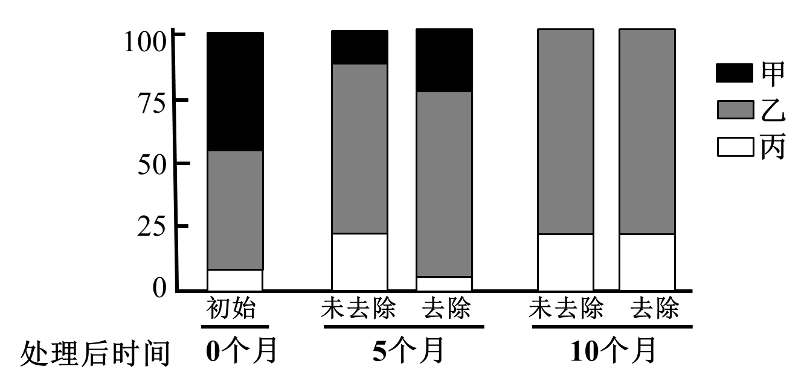
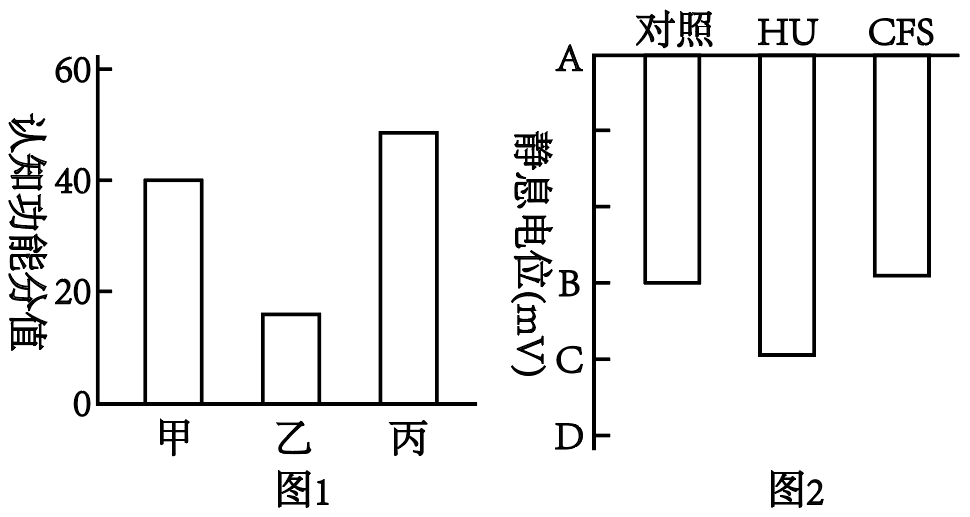
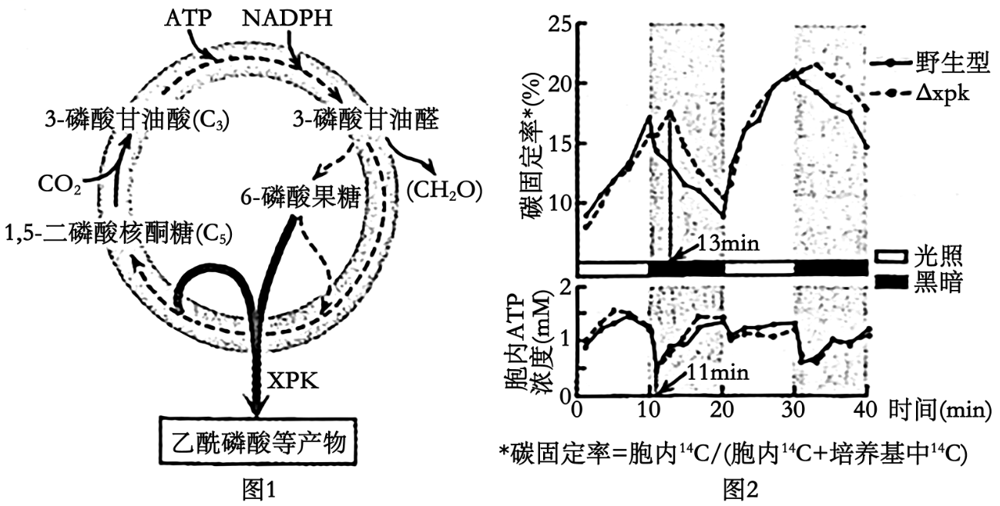
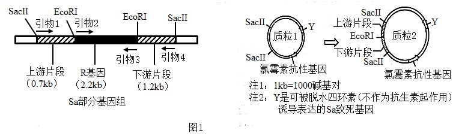
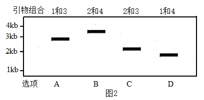
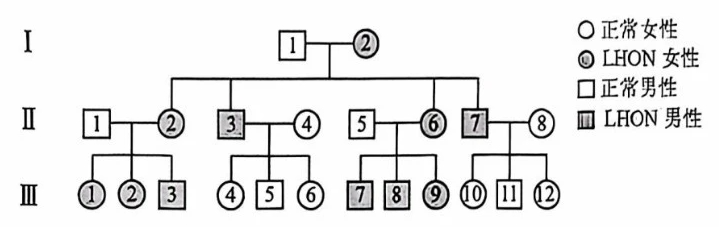

**2024年新课标天津高考生物真题试卷**

1\. 植物液泡含有多种水解酶，能分解衰老、损伤的细胞器，维持细胞内稳态。动物细胞内功能类似的细胞器是（ ）

A. 核糖体 B. 溶酶体 C. 中心体 D. 高尔基体

2\. 白细胞介素-14是一种由T细胞分泌的细胞因子，通过刺激B细胞增殖分化而促进（ ）

A. 浆细胞形成 B. 树突状细胞呈递抗原

C. 细胞毒性T细胞分化 D. 巨噬细胞吞噬抗原

3\. 突变体是研究植物激素功能的常用材料，以下研究材料选择不当的是（ ）

A. 生长素促进植物生根——无侧根突变体

B. 乙烯促进果实的成熟——无果实突变体

C. 赤霉素促进植株增高——麦苗疯长突变体

D. 脱落酸维持种子休眠——种子成熟后随即萌发突变体

4\. 为研究生物多样性对盐沼生态系统的影响，将优势种去除后，调查滨海盐沼湿地植物的物种组成，结果如下图。有关优势种去除后的变化，下列说法正确的是（ ）

A. 丙的生态位持续收缩

B. 三种盐沼植物的K值一直上升

C. 优势种去除是甲消失的主要原因

D. 盐沼植物群落的空间结构发生改变

5\. 胰岛素的研发走过了：动物提取—化学合成—重组胰岛素—生产胰岛素类似物生产等历程。有关叙述错误的是（ ）

A 动物体内胰岛素由胰岛B细胞合成并胞吐出细胞

B. 氨基酸是化学合成胰岛素的原料

C. 用大肠杆菌和乳腺生物反应器生产胰岛素需相同的启动子

D. 利用蛋白质工程可生产速效胰岛素等胰岛素类似物

6\. 环境因素可通过下图所示途径影响生物性状。有关叙述错误的是（ ）

A. ①可引起DNA的碱基序列改变

B. ②可调节③水平的高低

C. ②引起的变异不能为生物进化提供原材料

D. ④可引起蛋白质结构或功能的改变

7\. 某抗体类药物能结合肺癌细胞表面HER2受体，阻断受体功能，引起癌细胞发生一系列变化而凋亡。下列对癌细胞变化的分析不合理的是（ ）

A. 凋亡基因表达上调，提示HER2受体被激活

B. 细胞由扁平形变为球形，提示细胞骨架受到影响

C. 细胞膜的磷脂酰丝氨酸由内侧翻转到外侧，提示细胞膜流动性改变

D. 基因组DNA被降解成约200碱基对的小片段，提示DNA酶被激活

8\. 实验中常根据菌落外表特征鉴别微生物，进而对实验结果做出判断，下列实验不是根据菌落外表特征做出判断的是（ ）

A. 艾弗里证明肺炎链球菌转化因子是DNA

B. 判断分离酵母菌的固体培养基是否被毛霉污染

C. 利用浸有抗生素的滤纸片筛选大肠杆菌中耐药性强的菌株

D. 判断在尿素为唯一氮源的培养基上生长的尿素降解菌是否有不同种类

9\. 某豌豆基因型为YyRr，Y/y和R/r位于非同源染色体上，在不考虑突变和染色体互换的前提下，其细胞分裂时期、基因组成、染色体组数对应关系正确的是（ ）

|     |         |                     |       |
|:---:|:-------:|:-------------------:|:-----:|
| 选项  | 分裂时期    | 基因组成                | 染色体组数 |
| A   | 减数分裂Ⅰ后期 | YyRr                | 2     |
| B   | 减数分裂Ⅱ中期 | YR或yr或Yr或yR         | 1     |
| C   | 减数分裂Ⅱ后期 | YYRR或yyrr或YYrr或yyRR | 2     |
| D   | 有丝分裂后期  | YYyyRRrr            | 2     |

A. A B. B C. C D. D

阅读下列材料，完成下面小题。

蛋白质的2-羟基异丁酰化（Khib）修饰与去修饰对植物抗病性具有重要调节作用。棉花M蛋白是去除Khib修饰的酶，大丽轮枝菌感染可以诱导易感棉M基因表达上调，而抗病棉无论感染与否，M基因一直低表达。

H4是结合并稳定染色质DNA的组蛋白之一。M蛋白可降低H4的Khib修饰，导致DNA螺旋化程度提高，使转录相关酶更难与DNA结合，降低抗病相关基因（如水杨酸受体基因）的表达。

P蛋白由核内P基因编码，经翻译后转移并定位于叶绿体中，参与捕光复合体Ⅱ的损伤修复。M蛋白可降低P蛋白的Khib修饰，从而削弱P蛋白对捕光复合体Ⅱ的修复功能，进而降低叶绿体产生活性氧的能力，导致易感棉抗病性下降。

10\. H4的Khib修饰改变了（ ）

A. 染色质的DNA序列 B. 水杨酸受体基因的转录水平

C. 转录相关酶的活性 D. M蛋白的活性

11\. 为提高易感棉的抗病性，采取的措施正确的是（ ）

A. 将抗病棉的M基因转入易感棉

B. 上调M基因表达

C. 降低H4的Khib修饰

D. 增加P蛋白的Khib修饰

12\. 棉花通过复杂的机制调节其抗病能力，下列说法错误的是（ ）

A. P基因表达及其产物行使功能涉及细胞核、核糖体和叶绿体等

B. 棉花抗病能力既受核蛋白也受叶绿体蛋白的调控

C Khib修饰从基因表达和蛋白质功能两个层面影响棉花抗病性

D. 水杨酸受体和捕光复合体Ⅱ的Khib修饰可提高棉花抗病性

13\. 海洋生态系统的结构与功能研究对渔业资源管理具有指导意义。渤海十年间相关调查数据统计如下。

表1 渤海生态系统各营养级间的转换效率\*（%）

<table style="width:62%;">
<colgroup>
<col style="width: 11%" />
<col style="width: 5%" />
<col style="width: 6%" />
<col style="width: 6%" />
<col style="width: 6%" />
<col style="width: 5%" />
<col style="width: 6%" />
<col style="width: 6%" />
<col style="width: 6%" />
</colgroup>
<tbody>
<tr>
<td rowspan="2" style="text-align: center;">营养级</td>
<td colspan="4" style="text-align: center;">十年前</td>
<td colspan="4" style="text-align: center;">当前</td>
</tr>
<tr>
<td style="text-align: center;">Ⅱ</td>
<td style="text-align: center;">Ⅲ</td>
<td style="text-align: center;">Ⅳ</td>
<td style="text-align: center;">Ⅴ</td>
<td style="text-align: center;">Ⅱ</td>
<td style="text-align: center;">Ⅲ</td>
<td style="text-align: center;">Ⅳ</td>
<td style="text-align: center;">Ⅴ</td>
</tr>
<tr>
<td style="text-align: center;">浮游植物</td>
<td style="text-align: center;">6.7</td>
<td style="text-align: center;">14.7</td>
<td style="text-align: center;">18.6</td>
<td style="text-align: center;">19.6</td>
<td style="text-align: center;">8.9</td>
<td style="text-align: center;">19.9</td>
<td style="text-align: center;">25.0</td>
<td style="text-align: center;">23.5</td>
</tr>
<tr>
<td style="text-align: center;">碎屑</td>
<td style="text-align: center;">7.2</td>
<td style="text-align: center;">15.4</td>
<td style="text-align: center;">188</td>
<td style="text-align: center;">19.7</td>
<td style="text-align: center;">6.8</td>
<td style="text-align: center;">21.3</td>
<td style="text-align: center;">24.5</td>
<td style="text-align: center;">23.9</td>
</tr>
</tbody>
</table>

转换效率为相邻两个营养级间生产量（用于生长、发育和繁殖的能量）的比值

（1）捕食食物链以浮游植物为起点，碎屑食物链以生物残体或碎屑为起点，两类食物链第Ⅱ营养级的生物分别属于生态系统的\_\_\_\_\_和\_\_\_\_\_。

（2）由表1可知，当前捕食食物链各营养级间的转换效率比十年前\_\_\_\_\_，表明渤海各营养级生物未被利用的和流向碎屑的能量\_\_\_\_\_。

（3）“总初级生产量/总呼吸量”是表征生态系统成熟度的重要指标，数值越小，成熟度越高，数值趋向于1时，生态系统中没有多余的生产量可利用。据此，分析表2可知，\_\_\_\_\_时期渤海生态系统成熟度较高，表示\_\_\_\_\_减少，需采取相应管理措施恢复渔业资源。

表2 渤海生态系统特征\[t/（km2·a）\]

|          |      |      |
|:--------:|:----:|:----:|
| 系统特征     | 十年前  | 当前   |
| 总初级生产量\* | 2636 | 1624 |
| 总呼吸量     | 260  | 186  |

\*总初级生产量表征生产者通过光合作用固定的总能量

14\. 磁场刺激是一种调节神经系统生理状态的有效方法，为研究其对神经系统钝化的改善和电生理机制，以小鼠为动物模型进行如下实验。

（1）将小鼠随机分为3组：对照组、神经系统钝化模型（HU）组和磁场刺激（CFS）组，每组8只。其中CFS组应在\_\_\_\_\_\_组处理的基础上，对小鼠进行适当的磁场刺激。

（2）检测上述3组小鼠的认知功能水平，结果如图1。理论上推测，\_\_\_\_\_\_或\_\_\_\_\_\_组可能为对照组。

（3）检测上述3组小鼠海马区神经元的兴奋性。

①检测静息电位，结果如图2。纵坐标数值为0的点应为\_\_\_\_\_\_（从A-D中选择）。

②检测动作电位峰值，组间无差异。说明\_\_\_\_\_\_组的\_\_\_\_\_\_离子内流入神经元的数量最多。

以上实验说明，在细胞水平，CFS可改善神经系统钝化时出现的神经元\_\_\_\_\_\_；在个体水平，CFS可改善神经系统钝化引起的认知功能下降。

15\. 蓝细菌所处水生环境随时会发生光线强弱变化。蓝细菌通过调控图1中关键酶XPK的活性以适应这种变化。

（1）图1所示循环过程为蓝细菌光合作用的暗反应，反应场所为\_\_\_\_\_\_。

（2）光暗循环条件下，将蓝细菌的野生型和xpk基因敲除株（Δxpk）分别用含NaH14CO3的培养基培养，测定其碳固定率和胞内ATP浓度，结果如图2。

在第10-11分钟，野生型菌XPK被激活，将暗反应的中间产物6-磷酸果糖等转化为其它物质，导致暗反应快速终止。推测ATP是XPK的\_\_\_\_\_\_（激活剂/抑制剂）。在同一时期，Δxpk会继续进行暗反应，此时消耗的ATP和NADPH来源于\_\_\_\_\_\_。

在第11-13分钟，Δxpk碳固定率继续升高，胞内\_\_\_\_\_\_过程来源的ATP被用于\_\_\_\_\_\_而消耗，导致Δxpk的生长速率比野生型更慢。

（3）蓝细菌在高密度培养时，由于互相遮挡，菌体环境也会出现光线强弱变化。为验证该条件下，蓝细菌是否采用上述机制进行调节，可分别使用野生型和Δxpk、选用如下\_\_\_\_\_\_条件组合进行实验，定时测定14C固定率和胞内ATP浓度。

①高浓度蓝细菌②低浓度蓝细菌③持续光照④光暗循环⑤培养基中加入NaH14CO3 ⑥培养基中加入14C6H12O6

16\. 金黄色葡萄球菌（简称Sa）是人体重要致病细菌、不规范使用抗生素易出现多重抗药性Sa。

（1）Sa产生抗药性可遗传变异的来源有\_\_\_\_\_\_（至少答出2点）。

（2）推测Sa产生头孢霉素抗性与其R基因有关。为验证该推测，以图1中R基因的上、下游片段和质粒1构建质粒2，然后通过同源重组（质粒2中的上、下游片段分别与Sa基因组中R基因上、下游片段配对，并发生交换）敲除Sa的R基因。

①根据图1信息，简述质粒2的构建过程（需包含所选引物和限制酶）：\_\_\_\_\_\_，然后回收上、下游片段，再与SacII酶切质粒1所得大片段连接，获得质粒2。

②用质粒2转化临床分离的具有头孢霉素抗性、对氯霉素敏感的Sa，然后涂布在含\_\_\_\_\_\_的平板上，经培养获得含质粒2的Sa单菌落。

③将②获得的单菌落多次传代以增加同源重组敲除R基因的几率，随后稀释涂布在含\_\_\_\_\_\_的平板上，筛选并获得不再含有质粒2的菌落。从这些菌落分别挑取少许菌体，依次接种到含\_\_\_\_\_\_\_\_\_\_\_\_的平板上，若无法增殖，则对应菌落中细菌的R基因疑似被敲除。

④以③获得的菌株基因组为模板，采用不同引物组合进行PCR扩增，电泳检测结果如图2，表明R基因已被敲除的是\_\_\_\_\_\_。

17\. LHON是线粒体基因A突变成a所引起的视神经疾病。我国援非医疗队调查非洲某地LHON发病情况，发现如下谱系。

（1）依据LHON遗传特点，Ⅲ-7与正常女性婚配所生子女患该病的概率为\_\_\_\_\_\_。

（2）调查发现，LHON患者病变程度差异大（轻度、重度），且男性重症高发。研究发现，该特征与X染色体上的基因B突变成b有关。某轻度病变的女性与正常男性结婚，所生男孩有轻度患者，也有重度患者，其中重度患者核基因型为\_\_\_\_\_\_。

（3）5'-CCCG<u>C</u>GGGA-3'为B基因的部分编码序列（非模板链），<u>C</u>为编码序列的第157位，突变成T后，蛋白序列的第\_\_\_\_\_\_位氨基酸将变成\_\_\_\_\_\_。

部分氨基酸密码子:丙氨酸（GCG）、缬氨酸（GUG）、色氨酸（UGG）、精氨酸（CGC或CGG或CGU）

（4）人群筛查发现，XbXb基因型在女性中的占比为0．01%，那么XbY基因型在男性中的占比为\_\_\_\_\_\_。

（5）镰状细胞贫血是非洲常见的常染色体隐性遗传病，每8个无贫血症状的人中有1个携带者。无贫血症状的Ⅲ-9（已知Ⅱ-5基因型为XBY，Ⅱ-6基因型为XBXb）与基因型为XBY的无贫血症状男性结婚，其子代为有镰状细胞贫血症状的LHON重度患者的概率为\_\_\_\_\_\_。
