**2024年新课标天津高考生物真题试卷**

1\. 植物液泡含有多种水解酶，能分解衰老、损伤的细胞器，维持细胞内稳态。动物细胞内功能类似的细胞器是（ ）

A. 核糖体 B. 溶酶体 C. 中心体 D. 高尔基体

【答案】B

【解析】

【分析】各种细胞器在功能上既有分工又有合作，分布在细胞质基质中。

【详解】A、核糖体是合成蛋白质的场所，A错误；

B、溶酶体内含有多种水解酶，能分解衰老、损伤的细胞器，吞噬并杀死侵入细胞的病毒或细菌，B正确；

C、中心体存在于动物细胞和低等植物细胞中，与动物细胞的有丝分裂有关，C错误；

D、高尔基体是对来自内质网的蛋白质进行加工、分类、包装的“车间”和“发送站”，D错误。

故选B。

2\. 白细胞介素-14是一种由T细胞分泌的细胞因子，通过刺激B细胞增殖分化而促进（ ）

A. 浆细胞形成 B. 树突状细胞呈递抗原

C. 细胞毒性T细胞分化 D. 巨噬细胞吞噬抗原

【答案】A

【解析】

【分析】体液免疫过程会产生相应的浆细胞和记忆细胞，再由浆细胞产生相应的抗体；病毒侵入细胞后会引起机体发生特异性免疫中的细胞免疫，产生相应的记忆细胞和细胞毒性T细胞，细胞毒性T细胞与被病毒侵入的靶细胞结合，使得靶细胞裂解释放病毒。

【详解】体液免疫过程中，白细胞介素-14是一种由T细胞分泌的细胞因子，通过刺激B细胞增殖分化而促进浆细胞形成，同时可形成记忆B细胞，其中浆细胞能够分泌抗体。

故选A。

3\. 突变体是研究植物激素功能的常用材料，以下研究材料选择不当的是（ ）

A. 生长素促进植物生根——无侧根突变体

B. 乙烯促进果实的成熟——无果实突变体

C. 赤霉素促进植株增高——麦苗疯长突变体

D. 脱落酸维持种子休眠——种子成熟后随即萌发突变体

【答案】B

【解析】

【分析】植物激素：由植物体内产生，能从产生部位运送到作用部位，对植物的生长发育有显著影响的微量有机物。在植物的生长发育和适应环境变化的过程中，各种植物激素并不是孤立地起作用，而是多种激素相互作用共同调节。

【详解】A、生长素能促进细胞的伸长，进而促进植株生根，A正确；

B、乙烯则促进果实的成熟，但不能促进果实发育，因此不能利用无果实突变体作为材料进行研究，B错误；

C、赤霉素能够细胞伸长，也能促进细胞分裂和分化，从而促进植株增高，C正确；

D、脱落酸可抑制萌发，维持种子休眠，D正确。

故选B。

4\. 为研究生物多样性对盐沼生态系统的影响，将优势种去除后，调查滨海盐沼湿地植物的物种组成，结果如下图。有关优势种去除后的变化，下列说法正确的是（ ）

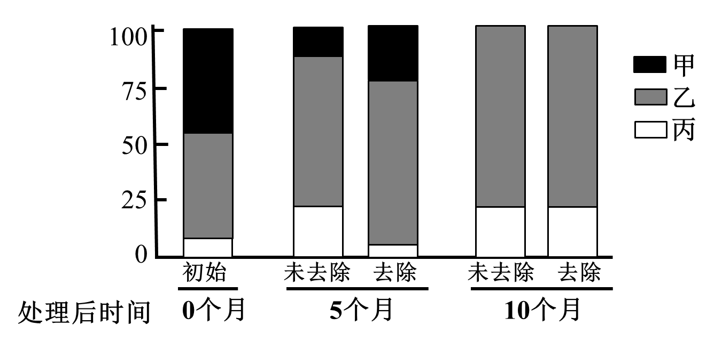

A. 丙的生态位持续收缩

B. 三种盐沼植物的K值一直上升

C. 优势种去除是甲消失的主要原因

D. 盐沼植物群落的空间结构发生改变

【答案】D

【解析】

【分析】生态位：一个物种在群落中的地位或作用，包括所处的空间位置，占用资源的情况，以及与其他物种的关系等，称为这个物种的生态位。

【详解】A、群落的物种组成在一定程度上，可以反映群落的生态位，据图可知：未去除组，丙的生态位先升高，后趋于稳定，去除组，丙的生态位先下降，后升高，A错误；

B、即使优势种去除，当地环境没有改变，所以三地能够容纳的种群数量和物种数目是有限的，所以K值不会增加，B错误；

C、据图可知，未去除组，甲也消失了，说明优势种去除不是甲消失主要原因，C错误；

D、在群落中，各个生物种群分别占据了不同的空间，使群落形成一定的空间结构，据图可知，随着时间的推移，群落的物种组成在不断地发生变化，盐沼植物群落的空间结构也会发生改变，D正确。

故选D。

5\. 胰岛素的研发走过了：动物提取—化学合成—重组胰岛素—生产胰岛素类似物生产等历程。有关叙述错误的是（ ）

A. 动物体内胰岛素由胰岛B细胞合成并胞吐出细胞

B. 氨基酸是化学合成胰岛素的原料

C. 用大肠杆菌和乳腺生物反应器生产胰岛素需相同的启动子

D. 利用蛋白质工程可生产速效胰岛素等胰岛素类似物

【答案】C

【解析】

【分析】胰岛素是由胰脏内的胰岛B细胞受内源性或外源性物质如葡萄糖、乳糖、核糖、精氨酸、胰高血糖素等的刺激而分泌的一种蛋白质激素。胰岛素是机体内唯一降低血糖的激素，同时促进糖原、脂肪、蛋白质合成。外源性胰岛素主要用来治疗糖尿病。

【详解】A、胰岛素在动物体内由胰岛B细胞合成后，经过胞吐作用释放出细胞，A正确；

B、胰岛素属于蛋白质激素，所以化学合成胰岛素的原料是氨基酸，B正确；

C、用大肠杆菌和乳腺生物反应器生产胰岛素不需要使用相同的启动子，因为两者属于不同的表达系统，大肠杆菌是原核生物表达系统，而乳腺生物反应器属于真核生物表达系统，启动子要求不同，C错误；

D、利用蛋白质工程技术可以对胰岛素进行改造，生成具有不同作用特性的胰岛素类似物，包括速效胰岛素，D正确。

故选C。

6\. 环境因素可通过下图所示途径影响生物性状。有关叙述错误的是（ ）

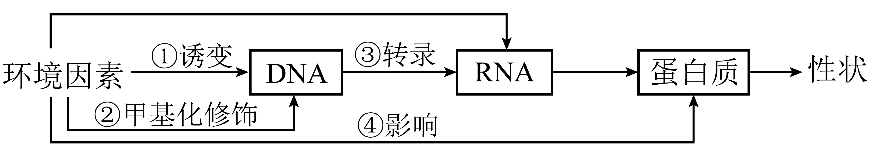

A. ①可引起DNA的碱基序列改变

B. ②可调节③水平的高低

C. ②引起的变异不能为生物进化提供原材料

D. ④可引起蛋白质结构或功能的改变

【答案】C

【解析】

【分析】基因与性状关系：（1）基因通过其表达产物——蛋白质来控制性状，细胞内的基因表达与否以及表达水平的高低都是受到调控的；（2）基因与性状的关系并不是简单的一一对应关系：①一个性状可以受多个基因的影响；②一个基因也可以影响多个性状；③生物体的性状也不完全是由基因决定的，环境对性状也有着重要影响。

【详解】A、①诱变可引起DNA的碱基序列改变，产生新基因，A正确；

B、②甲基化修饰DNA的启动子，RNA聚合酶不能结合在启动子，使③转录过程无法进行，故②可调节③水平的高低，B正确；

C、②引起的变异为DNA甲基化，属于表观遗传，是可遗传变异，能为生物进化提供原材料，C错误；

D、④环境因素如温度、pH可影响蛋白质空间结构，结构决定功能，功能也会随之改变，D正确。

故选C。

7\. 某抗体类药物能结合肺癌细胞表面HER2受体，阻断受体功能，引起癌细胞发生一系列变化而凋亡。下列对癌细胞变化的分析不合理的是（ ）

A. 凋亡基因表达上调，提示HER2受体被激活

B. 细胞由扁平形变为球形，提示细胞骨架受到影响

C. 细胞膜的磷脂酰丝氨酸由内侧翻转到外侧，提示细胞膜流动性改变

D. 基因组DNA被降解成约200碱基对的小片段，提示DNA酶被激活

【答案】A

【解析】

【分析】细胞凋亡是由基因决定的细胞编程序死亡的过程。细胞凋亡是生物体正常的生命历程，对生物体是有利的，而且细胞凋亡贯穿于整个生命历程。细胞凋亡是生物体正常发育的基础，能维持组织细胞数目的相对稳定，是机体的一种自我保护机制。在成熟的生物体内，细胞的自然更新、被病原体感染的细胞的清除，是通过细胞凋亡完成的。

【详解】A、该抗体类药物能结合肺癌细胞表面HER2受体，阻断受体功能，引起癌细胞发生一系列变化而凋亡，说明该药物发挥了作用，导致癌细胞的凋亡基因表达上调，提示HER2受体被阻断，A错误；

B、细胞骨架与细胞形态的维持有关，细胞由扁平形变为球形，提示细胞骨架受到影响，B正确；

C、质膜的基本骨架是磷脂双分子层，磷脂酰丝氨酸是磷脂分子的一种，如果细胞膜的磷脂酰丝氨酸由内侧翻转到外侧，提示细胞膜流动性改变，C正确；

D、DNA酶可以将DNA分子水解，如果基因组DNA被降解成约200碱基对的小片段，提示DNA酶被激活，D正确。

故选A。

8\. 实验中常根据菌落外表特征鉴别微生物，进而对实验结果做出判断，下列实验不是根据菌落外表特征做出判断的是（ ）

A. 艾弗里证明肺炎链球菌的转化因子是DNA

B. 判断分离酵母菌的固体培养基是否被毛霉污染

C. 利用浸有抗生素的滤纸片筛选大肠杆菌中耐药性强的菌株

D. 判断在尿素为唯一氮源的培养基上生长的尿素降解菌是否有不同种类

【答案】C

【解析】

【分析】1、在艾弗里证明遗传物质是DNA的实验中，艾弗里将S型细菌的DNA、蛋白质、糖类等物质分离开，单独的、直接的观察它们各自的作用。另外还增加了一组对照实验，即DNA酶和S型活菌中提取的DNA与R型菌混合培养。

2、培养酵母菌时，在接种前需要检测培养基是否被污染．对于固体培养基应采用的检测方法是将未接种的培养基在适宜的温度下放置适宜的时间，观察培养基上是否有菌落产生。

3、抗生素消灭细菌的原理是抑制细菌细胞壁的合成、与细胞膜相互作用、干扰蛋白质的合成以及抑制核酸的复制和转录等。利用浸有抗生素的滤纸片筛选大肠杆菌中耐药性强的菌株可从抑菌圈边缘菌落挑取大肠杆菌，可能获得目的菌株。

4、将一定稀释度的样品接种在以尿素为唯一氮源的培养基上，并在适宜的条件下培养。分解尿素的微生物能在该培养基上生长繁殖，而不能利用尿素的微生物不能生长繁殖，这是因为只有能够分解尿素的微生物能够产生脲酶，从中获取氮源。

【详解】A、艾弗里将S型细菌的DNA、蛋白质、糖类等物质分离开，单独的、直接的观察它们各自的作用进行对比，R型肺炎双球菌没有荚膜（菌落表面粗糙），S型肺炎双球菌有荚膜（菌落表面光滑），该实验是通过观察培养基上形成的不同菌落特征，来判断转化是否成功的，A不符合题意;

B、毛霉属于多细胞真菌，由细胞形成菌丝，可根据毛霉的形态判定固体培养基是否是被毛霉污染了，B不符合题意;

C、抗生素可消灭细菌，利用浸有抗生素的滤纸片筛选大肠杆菌中耐药性强的菌株是从抑菌圈边缘菌落挑取大肠杆菌来获得目的菌株，没有依靠菌落外表形态特征做出判断，C符合题意;

D、不同尿素降解菌降解尿素的能力不同，因此在分离出的以尿素为唯一氮源的尿素降解菌后，若要验证其中是否有不同种类降解菌，可在以尿素为唯一氮源的培养基中加入酚红指示剂，接种并培养初步筛选的菌种，若根据菌落周围出现红色环带的大小判定其种类，D不符合题意。

故选C。

9\. 某豌豆基因型为YyRr，Y/y和R/r位于非同源染色体上，在不考虑突变和染色体互换的前提下，其细胞分裂时期、基因组成、染色体组数对应关系正确的是（ ）

|     |         |                     |       |
|:---:|:-------:|:-------------------:|:-----:|
| 选项  | 分裂时期    | 基因组成                | 染色体组数 |
| A   | 减数分裂Ⅰ后期 | YyRr                | 2     |
| B   | 减数分裂Ⅱ中期 | YR或yr或Yr或yR         | 1     |
| C   | 减数分裂Ⅱ后期 | YYRR或yyrr或YYrr或yyRR | 2     |
| D   | 有丝分裂后期  | YYyyRRrr            | 2     |

A. A B. B C. C D. D

【答案】C

【解析】

【分析】 减数分裂过程：（1）减数分裂前间期：染色体的复制；（2）减数第一次分裂：①前期：联会，同源染色体上的非姐妹染色单体交叉互换；②中期：同源染色体成对的排列在赤道板上；③后期：同源染色体分离，非同源染色体自由组合；④末期：细胞质分裂。（3）减数第二次分裂：①前期：染色体散乱分布；②中期：染色体形态固定、数目清晰；③后期：着丝点（着丝粒）分裂，姐妹染色单体分开成为染色体，并均匀地移向两极；④末期：核膜、核仁重建、纺锤体和染色体消失。

【详解】A、减数分裂I后期含有姐妹染色单体，此时基因组成应为YYyyRRrr，细胞中含有2个染色体组，A错误；

B、减数分裂I后期同源染色体分离，但减数分裂Ⅱ中期含有姐妹染色单体，故基因组成是YYRR或yyrr或YYrr或yyRR，细胞中含1个染色体组，B错误；

C、减数分裂Ⅱ后期着丝粒分裂，姐妹染色单体分开成为两条染色体，基因组成是YYRR或yyrr或YYrr或yyRR，细胞中含2个染色体组，C正确；

D、有丝分裂后期着丝粒分裂，染色体和染色体组加倍，基因组成是YYyyRRr，染色体组有4个，D错误。

故选C。

阅读下列材料，完成下面小题。

蛋白质的2-羟基异丁酰化（Khib）修饰与去修饰对植物抗病性具有重要调节作用。棉花M蛋白是去除Khib修饰的酶，大丽轮枝菌感染可以诱导易感棉M基因表达上调，而抗病棉无论感染与否，M基因一直低表达。

H4是结合并稳定染色质DNA的组蛋白之一。M蛋白可降低H4的Khib修饰，导致DNA螺旋化程度提高，使转录相关酶更难与DNA结合，降低抗病相关基因（如水杨酸受体基因）的表达。

P蛋白由核内P基因编码，经翻译后转移并定位于叶绿体中，参与捕光复合体Ⅱ的损伤修复。M蛋白可降低P蛋白的Khib修饰，从而削弱P蛋白对捕光复合体Ⅱ的修复功能，进而降低叶绿体产生活性氧的能力，导致易感棉抗病性下降。

10\. H4的Khib修饰改变了（ ）

A. 染色质的DNA序列 B. 水杨酸受体基因的转录水平

C. 转录相关酶的活性 D. M蛋白的活性

11\. 为提高易感棉的抗病性，采取的措施正确的是（ ）

A. 将抗病棉的M基因转入易感棉

B. 上调M基因表达

C. 降低H4的Khib修饰

D. 增加P蛋白的Khib修饰

12\. 棉花通过复杂的机制调节其抗病能力，下列说法错误的是（ ）

A P基因表达及其产物行使功能涉及细胞核、核糖体和叶绿体等

B. 棉花的抗病能力既受核蛋白也受叶绿体蛋白的调控

C. Khib修饰从基因表达和蛋白质功能两个层面影响棉花抗病性

D. 水杨酸受体和捕光复合体Ⅱ的Khib修饰可提高棉花抗病性

【答案】10. B 11. D 12. D

【解析】

【分析】DNA甲基化抑制基因的转录，但不改变基因的碱基排序；组蛋白乙酰化，使缠绕DNA的组蛋白结构变得松散，促进基因的转录。

【10题详解】

据题干信息“H4是结合并稳定染色质DNA的组蛋白之一，M蛋白可降低H4的Khib修饰，导致DNA螺旋化程度提高，使转录相关酶更难与DNA结合、降低抗病相关基因（如水杨酸受体基因）的表达”可知，H4的Khib修饰改变了H4蛋白质的结构，从而提高相关基因如水杨酸受体基因）的表达，而不会影响转录相关酶和M蛋白的活性，B正确，ACD错误。

故选B。

【11题详解】

ABC、据题干信息“M蛋白可降低H4的Khib修饰，导致DNA螺旋化程度提高，使转录相关酶更难与DNA结合、降低抗病相关基因（如水杨酸受体基因）的表达”可知，将抗病棉的M基因转入易感棉后，M蛋白的表达量提高，则会降低H4的Khib修饰，将会降低抗病相关基因的表达，ABC错误；

D、据题干信息“M蛋白可降低P蛋白的Khib修饰，从而削弱P蛋白对捕光复合体Ⅱ的修复功能，进而降低叶绿体产生活性氧的能力，导致易感棉抗病性下降”可知，P蛋白的Khib修饰可促进P蛋白对捕光复合体Ⅱ的修复，提高叶绿体产生活性氧的能力，使感棉抗病性上升，故增加P蛋白的Khib修饰可提高易感棉的抗病性，D正确。

故选D。

【12题详解】

A、据题干信息“P蛋白由核内P基因编码，经翻译后转移并定位于叶绿体中”可知，P基因在细胞核中转录出mRNA，加工成熟后在细胞质中的核糖体上进行翻译，随后转移并进入叶绿体，A正确；

B、据题干信息可知，棉花的抗病能力受核蛋白的调控，P蛋白定位于叶绿体中，即应为叶绿体蛋白，也可调控棉花的抗病能力，B正确；

CD、H4蛋白的Khib修饰可促进抗病毒相关基因（如水杨酸受体基因）的表达，P蛋白的Khib修饰可促进P蛋白对捕光复合体Ⅱ的修复，提高叶绿体产生活性氧的能力，使感棉抗病性上升。题干是对P蛋白和H4蛋白的修饰，并非是对捕光复合体的修饰，D错误。

故选D。

13\. 海洋生态系统的结构与功能研究对渔业资源管理具有指导意义。渤海十年间相关调查数据统计如下。

表1 渤海生态系统各营养级间的转换效率\*（%）

<table style="width:62%;">
<colgroup>
<col style="width: 11%" />
<col style="width: 5%" />
<col style="width: 6%" />
<col style="width: 6%" />
<col style="width: 6%" />
<col style="width: 5%" />
<col style="width: 6%" />
<col style="width: 6%" />
<col style="width: 6%" />
</colgroup>
<tbody>
<tr>
<td rowspan="2" style="text-align: center;">营养级</td>
<td colspan="4" style="text-align: center;">十年前</td>
<td colspan="4" style="text-align: center;">当前</td>
</tr>
<tr>
<td style="text-align: center;">Ⅱ</td>
<td style="text-align: center;">Ⅲ</td>
<td style="text-align: center;">Ⅳ</td>
<td style="text-align: center;">Ⅴ</td>
<td style="text-align: center;">Ⅱ</td>
<td style="text-align: center;">Ⅲ</td>
<td style="text-align: center;">Ⅳ</td>
<td style="text-align: center;">Ⅴ</td>
</tr>
<tr>
<td style="text-align: center;">浮游植物</td>
<td style="text-align: center;">6.7</td>
<td style="text-align: center;">14.7</td>
<td style="text-align: center;">186</td>
<td style="text-align: center;">19.6</td>
<td style="text-align: center;">8.9</td>
<td style="text-align: center;">19.9</td>
<td style="text-align: center;">25.0</td>
<td style="text-align: center;">23.5</td>
</tr>
<tr>
<td style="text-align: center;">碎屑</td>
<td style="text-align: center;">7.2</td>
<td style="text-align: center;">15.4</td>
<td style="text-align: center;">18.8</td>
<td style="text-align: center;">19.7</td>
<td style="text-align: center;">6.8</td>
<td style="text-align: center;">21.3</td>
<td style="text-align: center;">24.5</td>
<td style="text-align: center;">23.9</td>
</tr>
</tbody>
</table>

转换效率为相邻两个营养级间生产量（用于生长、发育和繁殖的能量）的比值

（1）捕食食物链以浮游植物为起点，碎屑食物链以生物残体或碎屑为起点，两类食物链第Ⅱ营养级的生物分别属于生态系统的\_\_\_\_\_和\_\_\_\_\_。

（2）由表1可知，当前捕食食物链各营养级间的转换效率比十年前\_\_\_\_\_，表明渤海各营养级生物未被利用的和流向碎屑的能量\_\_\_\_\_。

（3）“总初级生产量/总呼吸量”是表征生态系统成熟度的重要指标，数值越小，成熟度越高，数值趋向于1时，生态系统中没有多余的生产量可利用。据此，分析表2可知，\_\_\_\_\_时期渤海生态系统成熟度较高，表示\_\_\_\_\_减少，需采取相应管理措施恢复渔业资源。

表2 渤海生态系统特征\[t/（km2·a）\]

|          |      |      |
|:--------:|:----:|:----:|
| 系统特征     | 十年前  | 当前   |
| 总初级生产量\* | 2636 | 1624 |
| 总呼吸量     | 260  | 186  |

\*总初级生产量表征生产者通过光合作用固定的总能量

【答案】（1） ①. 消费者 ②. 分解者

（2） ①. 高 ②. 减少

（3） ①. 当前 ②. 剩余生产量（或多余的生产量，或可利用生产量）

【解析】

【分析】1、生态系统的结构包括四种组成成分（非生物的物质和能量、生产者、消费者、分解者）和营养结构（食物链和食物网）。

2、流入生态系统的总能量指生态系统里所有的生产者固定的能量， 能量在沿食物链传递的平均效率为10%~20%，即一个营养级中的能量只有10%~20%的能量被下一个营养级所利用。

【小问1详解】

捕食食物链以浮游植物为起点，该类食物链第Ⅱ营养级的生物属于生态系统的消费者； 碎屑食物链以生物残体或碎屑为起点，该类食物链第Ⅱ营养级的生物属于生态系统的分解者。

【小问2详解】

分析表1数据可知，当前捕食食物链各营养级间的转换效率比十年前高，即相邻两个营养级间用于生长、发育和繁殖的能量的比值更高，说明渤海各营养级生物未被利用的和流向碎屑的能量减少。

【小问3详解】

分析表2数据可知，十年前生态系统成熟度=总初级生产量/总呼吸量= 2636÷260 = 10.14 ，当前生态系统成熟度= 1624÷186= 8.73，数值更小，所以当前时期渤海生态系统成熟度较高，表示生态系统中多余的生产量减少，需要采取相应管理措施恢复渔业资源。

14\. 磁场刺激是一种调节神经系统生理状态的有效方法，为研究其对神经系统钝化的改善和电生理机制，以小鼠为动物模型进行如下实验。

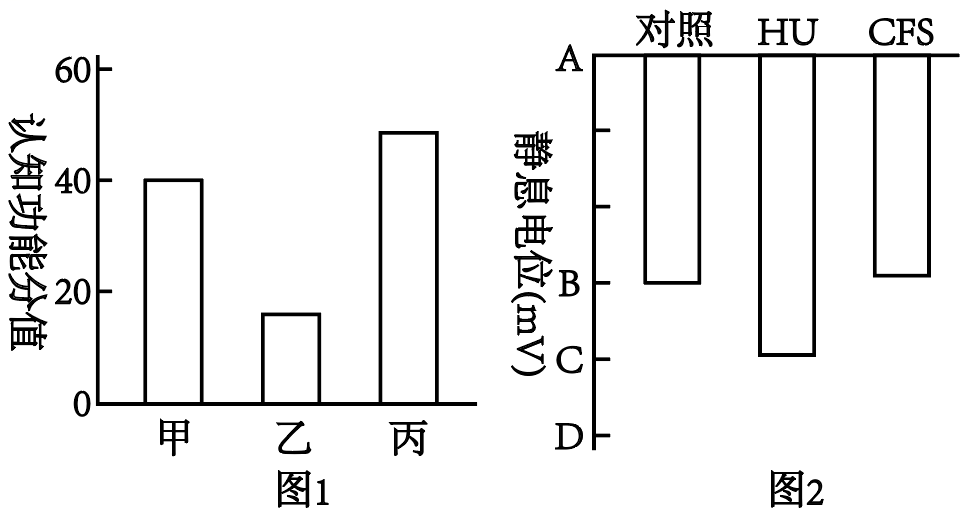

（1）将小鼠随机分为3组：对照组、神经系统钝化模型（HU）组和磁场刺激（CFS）组，每组8只。其中CFS组应在\_\_\_\_\_\_组处理的基础上，对小鼠进行适当的磁场刺激。

（2）检测上述3组小鼠的认知功能水平，结果如图1。理论上推测，\_\_\_\_\_\_或\_\_\_\_\_\_组可能为对照组。

（3）检测上述3组小鼠海马区神经元的兴奋性。

①检测静息电位，结果如图2。纵坐标数值为0的点应为\_\_\_\_\_\_（从A-D中选择）。

②检测动作电位峰值，组间无差异。说明\_\_\_\_\_\_组的\_\_\_\_\_\_离子内流入神经元的数量最多。

以上实验说明，在细胞水平，CFS可改善神经系统钝化时出现的神经元\_\_\_\_\_\_；在个体水平，CFS可改善神经系统钝化引起的认知功能下降。

【答案】（1）HU（或神经系统钝化模型）

（2） ①. 甲（或丙） ②. 丙（或甲）

（3） ①. A ②. HU（或神经系统钝化模型） ③. 钠 ④. 兴奋性下降（或静息电位绝对值增大）

【解析】

【分析】**【关键能力】**

**（1）信息获取与加工**

|                    |                                             |                                                 |
|:------------------:|:-------------------------------------------:|:-----------------------------------------------:|
| **题干关键信息**         | **所学知识**                                    | **信息加工**                                        |
| CFS组处理方式           | 实验设计遵循对照原则和单一变量原则                           | 实验目的是研究磁场刺激对神经系统钝化的改善和电生理机制，实验鼠应经神经系统钝化处理后的鼠    |
| 根据实验结果判断对照组        | 不经人工处理或与正常状态下相同的组为对照组                       | HU组应是三种实验中认知能力最差的一组，磁场刺激能改善神经系统的钝化，则其认知水平要高于HU组 |
| 图2中纵坐标数值为0的点的判断    | 静息状态的神经细胞膜外带正电荷，膜内带负电荷，通常把膜外电位当成0电位，静息电位为负值 | 当A点为O点时，静息电位为负值                                 |
| 判断三组实验中钠离子流入细胞最多的组 | 神经细胞兴奋时，钠离子内流，形成动作电位                        | 三组实验的动作电位峰值无差异，但静息电位HU组最大，最难兴奋                  |

**（2）逻辑推理与论证**

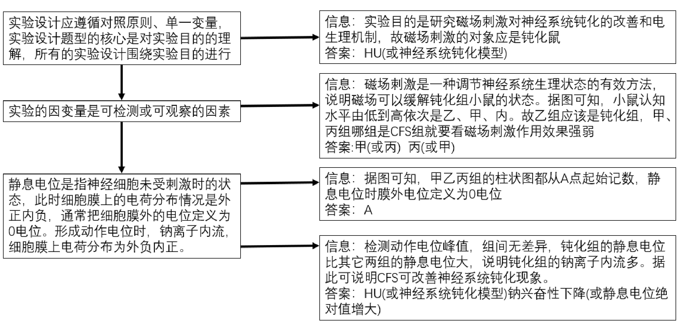【小问1详解】

依据实验目的和题干信息可知，CFS组应在HU（即神经系统钝化模型）的基础上进行，对小鼠进行适当的磁场刺激。

【小问2详解】

依据图1和实验目的（研究磁场刺激对神经系统钝化的改善和电生理机制），神经系统钝化的应为乙组，磁场刺激可改善神经系统钝化，甲组或丙组为对照组。

【小问3详解】

①检测静息电位，一般规定膜外为生理0点位，所以纵坐标数值为O的点应为A。

②依据信息：检测动作电位峰值，组间无差异，动作电位与Na+内流有关，依据图2可知，HU组的静息电位最大，而各组的动作电位峰值不变，所以在受到刺激时，要想产生相同的动作电位峰值，HU组的钠离子内流入神经元的数量最多。

依据图1可知，乙组（HU组）的认知功能最低，CFS组（丙组）的认知功能高于乙组，说明在个体水平，CFS可改善神经系统钝化引起的认知功能下降；依据图2可知，HU组的静息电位最大，CFS组的静息电位低于HU组，说明在细胞水平，CFS可改善神经系统钝化时出现的神经元静息电位绝对值最大（兴奋性下降）。

15\. 蓝细菌所处水生环境随时会发生光线强弱变化。蓝细菌通过调控图1中关键酶XPK的活性以适应这种变化。

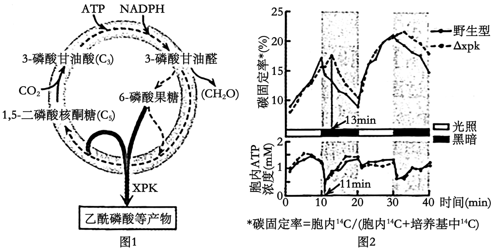

（1）图1所示循环过程为蓝细菌光合作用的暗反应，反应场所为\_\_\_\_\_\_。

（2）光暗循环条件下，将蓝细菌的野生型和xpk基因敲除株（Δxpk）分别用含NaH14CO3的培养基培养，测定其碳固定率和胞内ATP浓度，结果如图2。

在第10-11分钟，野生型菌XPK被激活，将暗反应的中间产物6-磷酸果糖等转化为其它物质，导致暗反应快速终止。推测ATP是XPK的\_\_\_\_\_\_（激活剂/抑制剂）。在同一时期，Δxpk会继续进行暗反应，此时消耗的ATP和NADPH来源于\_\_\_\_\_\_。

在第11-13分钟，Δxpk碳固定率继续升高，胞内\_\_\_\_\_\_过程来源的ATP被用于\_\_\_\_\_\_而消耗，导致Δxpk的生长速率比野生型更慢。

（3）蓝细菌在高密度培养时，由于互相遮挡，菌体环境也会出现光线强弱变化。为验证该条件下，蓝细菌是否采用上述机制进行调节，可分别使用野生型和Δxpk、选用如下\_\_\_\_\_\_条件组合进行实验，定时测定14C固定率和胞内ATP浓度。

①高浓度蓝细菌②低浓度蓝细菌③持续光照④光暗循环⑤培养基中加入NaH14CO3 ⑥培养基中加入14C6H12O6

【答案】（1）细胞质基质（或细胞质）

（2） ①. 抑制剂 ②. 第10分钟之前的光反应 ③. 细胞呼吸（或呼吸作用） ④. 暗反应（或碳固定，或C3还原，或碳反应）

（3）①③⑤

【解析】

【分析】**【关键能力】**

**（1）信息获取与加工**

<table>
<colgroup>
<col style="width: 17%" />
<col style="width: 15%" />
<col style="width: 67%" />
</colgroup>
<tbody>
<tr>
<td style="text-align: center;"><strong>题干关键信息</strong></td>
<td style="text-align: center;"><strong>所学知识</strong></td>
<td style="text-align: center;"><strong>信息加工</strong></td>
</tr>
<tr>
<td style="text-align: left;">蓝细胞暗反应的场所</td>
<td style="text-align: left;">
光合作用暗反应发生在叶绿体基质；

蓝细菌没有叶绿体结构
</td>
<td style="text-align: left;">蓝细菌可进行光合作用，又没有叶绿体结构，则暗反应发生在细胞质基质</td>
</tr>
<tr>
<td style="text-align: left;">推测ATP激活XPK的功能还是抑制XPK的功能</td>
<td style="text-align: left;">酶活性受Ph、温度及多种因素的影响</td>
<td style="text-align: left;">无光照条件下XPK被激活，说明有光条件下ATP会抑制XPK活性</td>
</tr>
<tr>
<td style="text-align: left;">无光条件下暗反应中ATP、NADPH来源</td>
<td style="text-align: left;">光反应产生ATP、NADPH提供给暗反应</td>
<td style="text-align: left;">无光条件下无法产生ATP、NADPH</td>
</tr>
<tr>
<td style="text-align: left;">无光条件下ATP的来源</td>
<td style="text-align: left;">呼吸作用产生ATP</td>
<td style="text-align: left;">无光条件下无法产生ATP</td>
</tr>
<tr>
<td style="text-align: left;">验证蓝细菌高密度培养时的光合作用机制</td>
<td style="text-align: left;">实验遵循对照原则和单一变量原则</td>
<td style="text-align: left;">实验目的是蓝细菌在高密度培养时，是否会利用呼吸作用产生的ATP。实验过程应高密度培养蓝细菌，利用持续光照，则蓝细菌在高密度培养时相互间遮挡相当于无光条件</td>
</tr>
</tbody>
</table>

**（2）逻辑推理与论证**

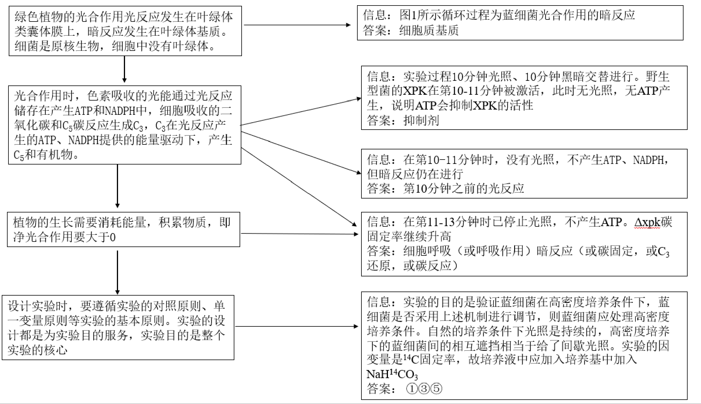【小问1详解】

蓝细菌为原核生物，图1为蓝细菌的光合作用暗反应过程，该过程的反应场所为细胞质基质。

【小问2详解】

光暗循环条件下，将蓝细菌的野生型和xpk基因敲除株（Δxpk）分别用含NaH14CO3的培养基培养，测定其碳固定率和胞内ATP浓度，结果如图2。在第10-11分钟，野生型菌细胞中ATP含量下降，此时XPK被激活，将暗反应的中间产物6-磷酸果糖等转化为其它物质，导致暗反应快速终止。推测ATP是XPK的抑制剂。在同一时期，Δxpk会继续进行暗反应，此时消耗的ATP和NADPH来源于第10分钟之前的光反应。在第11-13分钟，Δxpk碳固定率继续升高，此时处于黑暗条件，因而推测，此时碳固定速率上升消耗的ATP来自细胞呼吸，导致Δxpk的生长速率比野生型更慢。

【小问3详解】

蓝细菌在高密度培养时，由于互相遮挡，菌体环境也会出现光线强弱变化。为验证蓝细菌是否采用上述机制进行调节，则实验过程中首先需要创造高密度蓝细菌、而后需要持续光照，同时需要在培养基中加入NaH14CO3 ，因此，实验中可使用野生型和Δxpk，在①高浓度蓝细菌、③持续光照、⑤培养基中加入NaH14CO3 条件组合进行实验，定时测定14C固定率和胞内ATP浓度，进而得出相应的结论。

16\. 金黄色葡萄球菌（简称Sa）是人体重要致病细菌、不规范使用抗生素易出现多重抗药性Sa。

（1）Sa产生抗药性可遗传变异的来源有\_\_\_\_\_\_（至少答出2点）。

（2）推测Sa产生头孢霉素抗性与其R基因有关。为验证该推测，以图1中R基因的上、下游片段和质粒1构建质粒2，然后通过同源重组（质粒2中的上、下游片段分别与Sa基因组中R基因上、下游片段配对，并发生交换）敲除Sa的R基因。

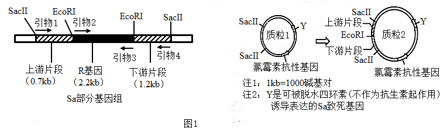

①根据图1信息，简述质粒2的构建过程（需包含所选引物和限制酶）：\_\_\_\_\_\_，然后回收上、下游片段，再与SacII酶切质粒1所得大片段连接，获得质粒2。

②用质粒2转化临床分离的具有头孢霉素抗性、对氯霉素敏感的Sa，然后涂布在含\_\_\_\_\_\_的平板上，经培养获得含质粒2的Sa单菌落。

③将②获得的单菌落多次传代以增加同源重组敲除R基因的几率，随后稀释涂布在含\_\_\_\_\_\_的平板上，筛选并获得不再含有质粒2的菌落。从这些菌落分别挑取少许菌体，依次接种到含\_\_\_\_\_\_\_\_\_\_\_\_的平板上，若无法增殖，则对应菌落中细菌的R基因疑似被敲除。

④以③获得的菌株基因组为模板，采用不同引物组合进行PCR扩增，电泳检测结果如图2，表明R基因已被敲除的是\_\_\_\_\_\_。

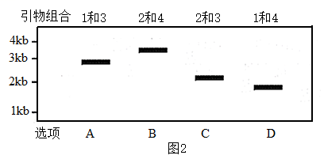

【答案】（1）基因突变、基因重组、表观遗传等

（2） ①. 采用引物1和4进行PCR扩增（或采用引物1和3以及引物2和4分别进行PCR扩增），用SacⅡ和EcoRⅠ对PCR产物进行酶切 ②. 氯霉素（或氯霉素+头孢霉素） ③. 脱水四环素 ④. 头孢霉素 ⑤. D

【解析】

【分析】**【关键能力】**

**（1）信息获取与加工**

|                 |                                  |                                                                                                                                                         |
|:---------------:|:--------------------------------:|:-------------------------------------------------------------------------------------------------------------------------------------------------------:|
| **题干关键信息**      | **所学知识**                         | **信息加工**                                                                                                                                                |
| 判断可遗传变异的来源      | 可遗传变异来源有：基因突变、基因重组、染色体变异及表观遗传    | Sa是原核生物，没有染色体                                                                                                                                           |
| 简述基因表达载体构建过程    | 利用PCR扩增目的基因时，需要目的基因两端的一段已知序列构建引物 | 质粒1及Sa的基因组中都含有SacII酶识别位点，质粒2上含有R基因上下游片段                                                                                                                 |
| 筛选含质粒2的Sa菌落     | 用标记基因筛选目的菌                       | 质粒2上有氯霉素抗性基因                                                                                                                                            |
| 筛选并获得不再含有质粒2的菌落 | 用标记基因筛选目的菌                       | 质粒2中的上、下游片段分别与Sa基因组中R基因上、下游片段配对，并发生交换，R基因被交换至质粒2上，则Sa的基因组中没有了R基因；Sa产生头孢霉素抗性与其R基因有关，失去R基因，Sa没有头孢霉素抗性；质粒2上含有的Y是可被脱水四环素诱导表达的Sa致死基因，则含质粒2的Sa在含脱水四环素的培养基中会死亡 |
| 筛选R基因被敲除的Sa     | PCR扩增目的基因时需要目的基因两端的一段已知序列构建引物    | 发生同源重组时，质粒2中的上、下游片段分别与Sa基因组中R基因上、下游片段配对，并发生交换，敲除Sa的R基因，但R基因两端的上、下游片段仍在Sa基因组中                                                                            |

**（2）逻辑推理与论证**

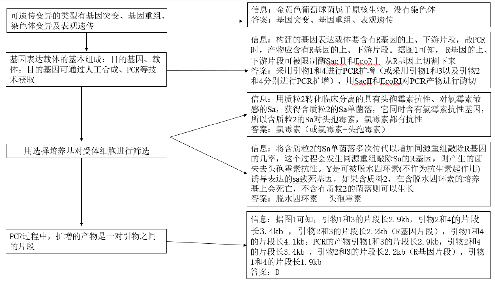【小问1详解】

Sa为原核生物产生抗药性可遗传变异的来源有基因突变、基因重组、表观遗传等。

【小问2详解】

①由图1可知，质粒2上依次接有SacⅡ、EcoRⅠ、SacⅡ三个酶切位点，而质粒1上只有SacⅡ酶切位点，R基因的上下游依次含有SacⅡ、EcoRⅠ、EcoRⅠ、SacⅡ酶切位点，若要构建质粒2，可以采用引物1和4进行PCR扩增可得到整个R基因，以及上下游片段（或采用引物1和3以及引物2和4分别进行PCR扩增），用SacⅡ和EcoRⅠ对PCR产物进行酶切，然后回收上、下游片段，再与SacII酶切质粒1所得大片段连接，获得质粒2。

②用质粒2转化临床分离的具有头孢霉素抗性、对氯霉素敏感的Sa，因为重组的质粒2上含有氯霉素抗性基因，所以可以将重组后的含质粒2的菌落涂布在含氯霉素（或氯霉素+头孢霉素）的平板上，能生存下来的菌落就是，含质粒2的Sa单菌落。

③推测Sa产生头孢霉素抗性与其R基因有关。为验证该推测需要敲除R基因，因为质粒2上含有Y可被脱水四环素又到表达的Sa致死基因，所以将②获得的单菌落多次传代以增加同源重组敲除R基因的几率，随后稀释涂布在含脱水四环素的的平板上，可诱导R基因死亡，若无法增殖，则对应菌落中细菌的R基因疑似被敲除。

④以③获得的菌株基因组为模板，采用不同引物组合进行PCR扩增，电泳检测结果如图2，表明R基因已被敲除的是D组，由图1可知，R基因两侧含有的引物为2和3，所以扩增后含有引物2或3，或者2和3的可能含有R基因，所以表明R基因已被敲除的是D组。

17\. LHON是线粒体基因A突变成a所引起的视神经疾病。我国援非医疗队调查非洲某地LHON发病情况，发现如下谱系。

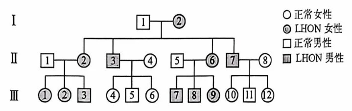

（1）依据LHON遗传特点，Ⅲ-7与正常女性婚配所生子女患该病的概率为\_\_\_\_\_\_。

（2）调查发现，LHON患者病变程度差异大（轻度、重度），且男性重症高发。研究发现，该特征与X染色体上的基因B突变成b有关。某轻度病变的女性与正常男性结婚，所生男孩有轻度患者，也有重度患者，其中重度患者核基因型为\_\_\_\_\_\_。

（3）5'-CCCG<u>C</u>GGGA-3'为B基因的部分编码序列（非模板链），<u>C</u>为编码序列的第157位，突变成T后，蛋白序列的第\_\_\_\_\_\_位氨基酸将变成\_\_\_\_\_\_。

部分氨基酸密码子:丙氨酸（GCG）、缬氨酸（GUG）、色氨酸（UGG）、精氨酸（CGC或CGG或CGU）

（4）人群筛查发现，XbXb基因型在女性中的占比为0．01%，那么XbY基因型在男性中的占比为\_\_\_\_\_\_。

（5）镰状细胞贫血是非洲常见的常染色体隐性遗传病，每8个无贫血症状的人中有1个携带者。无贫血症状的Ⅲ-9（已知Ⅱ-5基因型为XBY，Ⅱ-6基因型为XBXb）与基因型为XBY的无贫血症状男性结婚，其子代为有镰状细胞贫血症状的LHON重度患者的概率为\_\_\_\_\_\_。

【答案】（1）0##零

（2）XbY （3） ①. 53 ②. 色氨酸

（4）1% （5）1/2048

【解析】

【分析】**【关键能力】**

**（1）信息获取与加工**

|                                                            |                                                                                                                                                                                                                                                                                                                                         |                                                                                                                                                                        |
|:----------------------------------------------------------:|:---------------------------------------------------------------------------------------------------------------------------------------------------------------------------------------------------------------------------------------------------------------------------------------------------------------------------------------:|:----------------------------------------------------------------------------------------------------------------------------------------------------------------------:|
| **题干关键信息**                                                 | **所学知识**                                                                                                                                                                                                                                                                                                                                | **信息加工**                                                                                                                                                               |
| 求Ⅲ-7与正常女性婚配所生子女患该病的概率                                      | 细胞质遗传子代基因来自母方，表型由质基因决定                                                                                                                                                                                                                                                                                                                  | LHON是线粒体基因A突变成a所引起的视神经疾病                                                                                                                                               |
| 判断重度患者核基因型                                                 | X染色体上的基因的遗传遵循分离定律，且性状与性别相关联                                                                                                                                                                                                                                                                                                             | 轻度病变的女性与正常男性结婚，所生男孩有轻度患者，也有重度患者，可知，正常男性的基因型是（A）XBY，轻度病变女性基因型是（a）XBXb                                                                  |
| 判断基因突变后引起的氨基酸的变化                                           | DNA上遗传信息通过转录传递至mRNA，mRNA上三个碱基构成一个密码子，决定一个氨基酸                                                                                                                                                                                                                                                                                            | 编码序列碱基发生变化，mRNA上碱基对应发生变化                                                                                                                                               |
| 求XbY基因型在男性中占比                                   | 在平衡种群中，基因在X梁色体上时，在女性群体中XBXB%=(XB%)2,XbXb%=(Xb%)2,XBXb%=2ⅹXB%ⅹXb%。在男性群体中XbY%=Xb%，XBY%=XB%；基因在常染色体上时:AA =(A%)2，aa= (a%)2，Aa=2ⅹA%ⅹa% | XbY基因型在男性中的占比与Xb的基因频率在男性中的占比相同                                                                                                                   |
| Ⅲ-9与基因型为XBY的无贫血症状男性结婚，求子代为有镰状细胞贫血症状的LHON重度患者的概率 | 常染色体和X染色上基因的遗传遵循基因的自由组合规律，且X染色体上基因的遗传与性别相关联                                                                                                                                                                                                                                                                                             | Ⅱ-5基因型为XBY，Ⅱ-6基因型为XBXb，则Ⅲ-9的基因型为：关于无贫血症状的基因型为1/8Dd，7/8DD；关于LHON的基因型为1/2（a）XBXB，1/2（a）XBXb |

**（2）逻辑推理与论证**

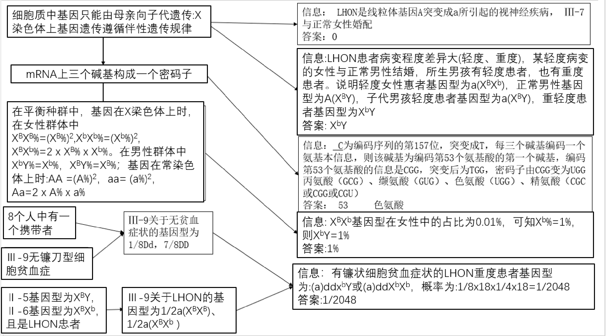【小问1详解】

LHON是线粒体基因A突变成a所引起的视神经疾病，如果母亲正常，则子女都表现正常，因此Ⅲ-7与正常女性婚配所生子女患该病的概率为0。

【小问2详解】

某轻度病变的女性与正常男性结婚，所生男孩有轻度患者，也有重度患者，同时该病是由X染色体B基因突变为b造成的，所以正常男性的基因型是（A）XBY，轻度病变女性基因型是（a）XBXb，所生的男孩子中有（a）XBY（表现为轻度患者）和（a）XbY（表现为重度患者），重度患者核基因型为XbY。

【小问3详解】

mRNA上三个相邻的碱基决定一个氨基酸，其中154-156决定一个氨基酸，157-159决定下一个氨基酸，非模板链上157为C突变为T，则密码子由CGG变为UGG，因此159÷3=53，即53为氨基酸变为色氨酸。

【小问4详解】

XbXb基因型在女性中的占比为0．01%，即Xb的基因频率为1%，如果基因位于X染色体上，则在男性中该基因型的比例等于基频率，因此XbY基因型在男性中的占比为1%。

【小问5详解】

用Dd表示控制镰状细胞贫血的基因，镰状细胞贫血症状的LHON重度患者的基因型是（a）ddXbY或（a）ddXbXb，Ⅲ-9的细胞质基因为a，其子女都含有a基因，镰状细胞贫血症状中每8个无贫血症状的人中有1个携带者，所以Ⅲ-9关于镰状细胞贫血基因型是1/8Dd，7/8DD，Ⅱ-5基因型为XBY，Ⅱ-6基因型为XBXb，则Ⅲ-9关于LHON贫血的核基因为1/2XBXB、1/2XBXb，基因型为XBY的无贫血症状男性的基因型可能是1/8DDXBY或7/8DdXBY，二者结婚，患镰状细胞贫血概率为1/8×1/8×1/4=1/256，患LHON贫血概率为1/2×1/4=1/8，所以子代为有镰状细胞贫血症状的LHON重度患者的概率为1/8×1/256=1/2048。
