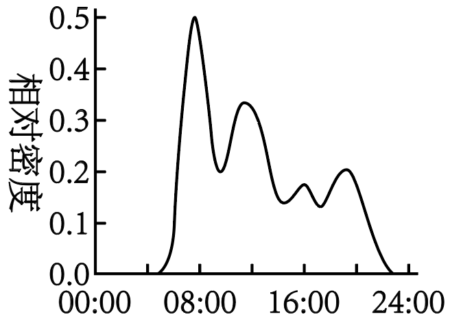
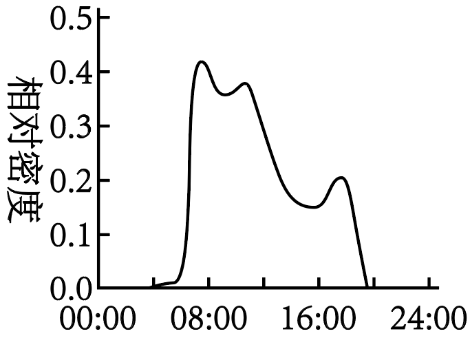
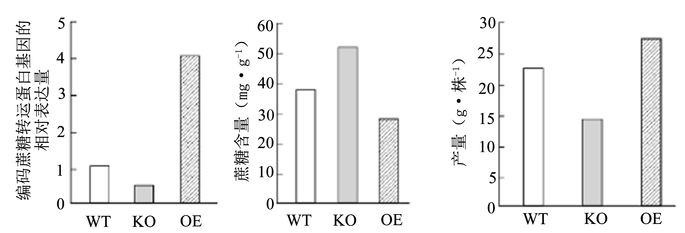
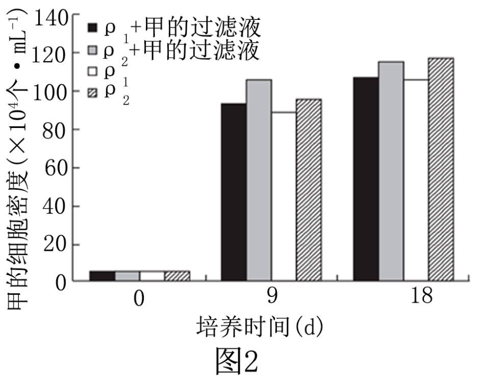
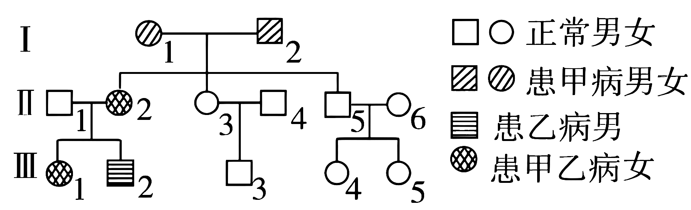

**2024年安徽省普通高中学业水平选择性考试（安徽卷）**

**生物学**

**一、选择题：本题共15小题，每小题3分，共45分。在每小题给出的四个选项中，只有一项是符合题目要求的。**

1\. 真核细胞的质膜、细胞器膜和核膜等共同构成生物膜系统。下列叙述正确的是（ ）

A. 液泡膜上的一种载体蛋白只能主动转运一种分子或离子

B. 水分子主要通过质膜上的水通道蛋白进出肾小管上皮细胞

C. 根尖分生区细胞的核膜在分裂间期解体，在分裂末期重建

D. \[H\]与氧结合生成水并形成ATP的过程发生在线粒体基质和内膜上

2\. 变形虫可通过细胞表面形成临时性细胞突起进行移动和摄食。科研人员用特定荧光物质处理变形虫，发现移动部分的细胞质中聚集有被标记的纤维网架结构，并伴有纤维的消长。下列叙述正确的是（ ）

A. 被荧光标记的网架结构属于细胞骨架，与变形虫的形态变化有关

B. 溶酶体中水解酶进入细胞质基质，将摄入的食物分解为小分子

C. 变形虫通过胞吞方式摄取食物，该过程不需要质膜上的蛋白质参与

D. 变形虫移动过程中，纤维的消长是由于其构成蛋白的不断组装所致

3\. 细胞呼吸第一阶段包含一系列酶促反应，磷酸果糖激酶1(PFK1）是其中的一个关键酶。细胞中 ATP减少时，ADP和AMP会增多。当ATP/AMP浓度比变化时，两者会与PFK1发生竞争性结合而改变酶活性，进而调节细胞呼吸速率，以保证细胞中能量的供求平衡。下列叙述正确的是（ ）

A. 在细胞质基质中，PFK1催化葡萄糖直接分解为丙酮酸等

B. PFK1与ATP结合后，酶的空间结构发生改变而变性失活

C. ATP/AMP浓度比变化对PFK1活性的调节属于正反馈调节

D. 运动时肌细胞中 AMP与PFK1结合增多，细胞呼吸速率加快

4\. 在多细胞生物体的发育过程中，细胞的分化及其方向是由细胞内外信号分子共同决定的某信号分子诱导细胞分化的部分应答通路如图。下列叙述正确的是（ ）

A. 细胞对该信号分子的特异应答，依赖于细胞内的相应受体

B. 酶联受体是质膜上的蛋白质，具有识别、运输和催化作用

C. ATP水解释放的磷酸分子与靶蛋白结合，使其磷酸化而有活性

D. 活化的应答蛋白通过影响基因的表达，最终引起细胞定向分化

5\. 物种的生态位研究对生物多样性保护具有重要意义。研究人员对我国某自然保护区白马鸡与血雉在三种植被类型中的分布和日活动节律进行了调查，结果见下表。下列叙述错误的是（ ）

<table style="width:85%;">
<colgroup>
<col style="width: 16%" />
<col style="width: 17%" />
<col style="width: 17%" />
<col style="width: 17%" />
<col style="width: 17%" />
</colgroup>
<tbody>
<tr>
<td rowspan="2" style="text-align: center;"></td>
<td colspan="2" style="text-align: center;">白马鸡分布占比(%)</td>
<td colspan="2" style="text-align: center;">血雉的分布占比(%)</td>
</tr>
<tr>
<td style="text-align: center;">旱季</td>
<td style="text-align: center;">雨季</td>
<td style="text-align: center;">旱季</td>
<td style="text-align: center;">雨季</td>
</tr>
<tr>
<td style="text-align: center;">针阔叶混交林</td>
<td style="text-align: center;">56.05</td>
<td style="text-align: center;">76.67</td>
<td style="text-align: center;">47.94</td>
<td style="text-align: center;">78.67</td>
</tr>
<tr>
<td style="text-align: center;">针叶林</td>
<td style="text-align: center;">40.13</td>
<td style="text-align: center;">17.78</td>
<td style="text-align: center;">42.06</td>
<td style="text-align: center;">9.17</td>
</tr>
<tr>
<td style="text-align: center;">灌丛</td>
<td style="text-align: center;">3.82</td>
<td style="text-align: center;">5.55</td>
<td style="text-align: center;">10.00</td>
<td style="text-align: center;">12.16</td>
</tr>
<tr>
<td style="text-align: center;">日活动节律</td>
<td colspan="2" style="text-align: center;"></td>
<td colspan="2" style="text-align: center;"></td>
</tr>
</tbody>
</table>

A. 生境的复杂程度会明显影响白马鸡和血雉对栖息地的选择

B. 两物种在三种植被类型中的分布差异体现了群落的垂直结构

C. 季节交替影响两物种对植被类型的选择，降雨对血雉的影响更大

D. 两物种在白天均出现活动高峰，但在日活动节律上存在生态位分化

6\. 磷循环是生物圈物质循环的重要组成部分。磷经岩石风化、溶解、生物吸收利用、微生物分解，进入环境后少量返回生物群落，大部分沉积并进一步形成岩石。岩石风化后磷再次参与循环。下列叙述错误的是（ ）

A. 在生物地球化学循环中，磷元素年周转量比碳元素少

B. 人类施用磷肥等农业生产活动不会改变磷循环速率

C. 磷参与生态系统中能量的输入、传递、转化和散失过程

D. 磷主要以磷酸盐的形式在生物群落与无机环境之间循环

7\. 人在睡梦中偶尔会出现心跳明显加快、呼吸急促，甚至惊叫。如果此时检测这些人的血液，会发现肾上腺素含量明显升高。下列叙述错误的是（ ）

A. 睡梦中出现呼吸急促和惊叫等生理活动不受大脑皮层控制

B. 睡梦中惊叫等应激行为与肾上腺髓质分泌的肾上腺素有关

C. 睡梦中心跳加快与交感神经活动增强、副交感神经活动减弱有关

D. 交感神经兴奋促进肾上腺素释放进而引起心跳加快，属于神经－体液调节

8\. 羊口疮是由羊口疮病毒（ORFV）感染引起的急性接触性人畜共患传染病，宿主易被ORFV反复感染，影响畜牧业发展，危害人体健康。下列叙述正确的是（ ）

A. ORFV感染宿主引起的特异性免疫反应属于细胞免疫

B. ORFV感染宿主后被APC和T细胞摄取、处理和呈递

C. ORFV反复感染可能与感染后宿主产生的抗体少有关

D. 辅助性T细胞在ORFV和细胞因子的刺激下增殖分化

9\. 植物生命活动受植物激素、环境因素等多种因素的调节。下列叙述正确的是（ ）

A. 菊花是自然条件下秋季开花的植物，遮光处理可使其延迟开花

B. 玉米倒伏后，茎背地生长与重力引起近地侧生长素含量较低有关

C. 组织培养中，细胞分裂素与生长素浓度比值高时能诱导根分化

D. 土壤干旱时，豌豆根部合成的脱落酸向地上运输可引起气孔关闭

10\. 甲是具有许多优良性状的纯合品种水稻，但不抗稻瘟病(rr)，乙品种水稻抗稻瘟病(RR)。育种工作者欲将甲培育成抗稻瘟病并保留自身优良性状的纯合新品种，设计了下列育种方案，合理的是（ ）

①将甲与乙杂交，再自交多代，每代均选取抗稻瘟病植株

②将甲与乙杂交，F1与甲回交，选F2中抗稻瘟病植株与甲再次回交，依次重复多代；再将选取的抗稻瘟病植株自交多代，每代均选取抗稻瘟病植株

③将甲与乙杂交，取F1的花药离体培养获得单倍体，再诱导染色体数目加倍为二倍体，从中选取抗稻瘟病植株

④向甲转入抗稻瘟病基因，筛选转入成功的抗稻瘟病植株自交多代，每代均选取抗稻瘟病植株

A. ①② B. ①③ C. ②④ D. ③④

11\. 真核生物细胞中主要有3类RNA聚合酶，它们在细胞内定位和转录产物见下表。此外，在线粒体和叶绿体中也发现了分子量小的RNA聚合酶。下列叙述错误的是（ ）

|          |       |                             |
|:--------:|:-----:|:---------------------------:|
| 种类       | 细胞内定位 | 转录产物                        |
| RNA聚合酶I  | 核仁    | 5\. 8SrENA、18SrFN4 、28SrRNA |
| RNA聚合酶II | 核质    | mRNA                        |
| RNA聚合酶Ⅲ  | 核质    | tRNA、5SrRNA                 |

注：各类RNA均为核糖体的组成成分

A. 线粒体和叶绿体中都有DNA，两者的基因转录时使用各自的RNA聚合酶

B. 基因的 DNA 发生甲基化修饰，抑制RNA聚合酶的结合，可影响基因表达

C. RNA聚合酶I和Ⅲ的转录产物都有rRNA，两种酶识别的启动子序列相同

D. 编码 RNA 聚合酶I的基因在核内转录、细胞质中翻译，产物最终定位在核仁

12\. 某种昆虫的颜色由常染色体上的一对等位基因控制，雌虫有黄色和白色两种表型，雄虫只有黄色，控制白色的基因在雄虫中不表达，各类型个体的生存和繁殖力相同。随机选取一只白色雌虫与一只黄色雄虫交配，F1雌性全为白色，雄性全为黄色。继续让F1自由交配，理论上F2雌性中白色个体的比例不可能是（ ）

A. 1/2 B. 3/4 C. 15/16 D. 1

13\. 下图是甲与其他四种生物β-珠蛋白前 40个氨基酸的序列比对结果，字母代表氨基酸，“.”表示该位点上的氨基酸与甲的相同，相同位点氨基酸的差异是进化过程中β-珠蛋白基因发生突变的结果。下列叙述错误的是（ ）

A. 不同生物β-珠蛋白的基因序列差异可能比氨基酸序列差异更大

B. 位点上未发生改变的氨基酸对维持β-珠蛋白功能稳定可能更重要

C. 分子生物学证据与化石等证据结合能更准确判断物种间进化关系

D. 五种生物相互比较，甲与乙的氨基酸序列差异最大，亲缘关系最远

14\. 下列关于“DNA 粗提取与鉴定”实验的叙述，错误的是（ ）

A. 实验中如果将研磨液更换为蒸馏水，DNA提取的效率会降低

B. 利用DNA和蛋白质在酒精中的溶解度差异，可初步分离DNA

C. DNA在不同浓度NaC1溶液中溶解度不同，该原理可用于纯化DNA粗提物

D. 将溶解的DNA粗提物与二苯胺试剂反应，可检测溶液中是否含有蛋白质杂质

15\. 植物细胞悬浮培养技术在生产中已得到应用。某兴趣小组尝试利用该技术培养胡萝卜细胞并获取番茄红素，设计了以下实验流程和培养装置（如图），请同学们进行评议。下列评议不合理的是（ ）

A. 实验流程中应该用果胶酶等处理愈伤组织，制备悬浮细胞

B. 装置中的充气管应置于液面上方，该管可同时作为排气管

C. 装置充气口需要增设无菌滤器，用于防止杂菌污染培养液

D. 细胞培养需要适宜的温度，装置需增设温度监测和控制设备

**二、非选择题：本题共5小题，共 55 分。**

16\. 为探究基因 OsNAC 对光合作用的影响研究人员在相同条件下种植某品种水稻的野生型(WT)、OsNAC 敲除突变体(KO)及 OsNAC 过量表达株(OE)，测定了灌浆期旗叶(位于植株最顶端)净光合速率和叶绿素含量,结果见下表。回答下列问题。

|     |                                          |                          |
|:---:|:----------------------------------------:|:------------------------:|
|     | 净光合速率（umol.m2.s-1） | 叶绿素含量（mg·g-1） |
| WT  | 24.0                                     | 4.0                      |
| KO  | 20.3                                     | 3.2                      |
| OE  | 27.7                                     | 4.6                      |

（1）旗叶从外界吸收1分子 CO2与核酮糖-1,5-二磷酸结合，在特定酶作用下形成2分子3-磷酸甘油酸；在有关酶的作用下，3-磷酸甘油酸接受\_\_\_\_\_\_\_释放的能量并被还原，随后在叶绿体基质中转化为\_\_\_\_\_\_\_。

（2）与WT相比，实验组KO与OE的设置分别采用了自变量控制中的\_\_\_\_\_\_\_、\_\_\_\_\_\_\_（填科学方法）。

（3）据表可知，OsNAC过量表达会使旗叶净光合速率\_\_\_\_\_\_\_。为进一步探究该基因的功能，研究人员测定了旗叶中编码蔗糖转运蛋白基因的相对表达量、蔗糖含量及单株产量，结果如图。

 

结合图表，分析OsNAC过量表达会使旗叶净光合速率发生相应变化的原因：①\_\_\_\_\_\_\_\_\_\_\_\_\_\_；②\_\_\_\_\_\_\_\_\_\_\_\_\_\_\_\_\_\_。

17\. 大气中二氧化碳浓度升高会导致全球气候变化。研究人员探究了390 μL·L（p1当前空气中浓度）和1000 μL·L（p2）两个 CO2浓度下，盐生杜氏藻（甲）和米氏凯伦藻（乙）在单独培养及混合培养下的细胞密度变化，实验中确保养分充足，结果如图1。

回答下列问题。

（1）实验中发现，培养液的pH值会随着藻细胞密度的增加而升高，原因可能是\_\_\_\_\_\_\_\_\_\_\_\_。（答出1点即可）。

（2）与单独培养相比，两种藻混合培养的结果说明\_\_\_\_\_\_\_\_\_\_\_\_\_\_\_\_\_\_\_\_\_\_\_\_\_\_。推行绿色低碳生活更有利于减缓\_\_\_\_\_\_填“甲”或“乙”）的种群增长。

（3）为进一步探究混合培养下两种藻生长出现差异的原因，研究人员利用培养过一种藻的过滤液去培养另一种藻，其他培养条件相同且适宜，结果如图2。综合图1和图2，分析混合培养引起甲、乙种群数量变化的原因分别是①\_\_\_\_\_\_\_\_\_\_\_\_\_\_；②\_\_\_\_\_\_\_\_\_\_\_\_\_\_\_\_\_\_\_。

（4）一定条件下，藻类等多种微型生物容易在近海水域短期内急剧增殖，引发赤潮，主要原因是\_\_\_\_\_\_\_\_\_\_。

18\. 短跑赛场上，发令枪一响，运动员会像离弦的箭一样冲出。该行为涉及机体的反射调节，其部分通路如图。

回答下列问题。

（1）运动员听到发令枪响后起跑属于\_\_\_\_\_\_\_\_\_\_反射。短跑比赛规则规定，在枪响后0.1s内起跑视为抢跑，该行为的兴奋传导路径是\_\_\_\_\_\_\_\_\_\_\_\_\_\_\_\_\_填结构名称并用箭头相连）。

（2）大脑皮层运动中枢发出的指令通过皮层下神经元④和⑤控制神经元②和③，进而精准调控肌肉收缩，体现了神经系统对躯体运动的调节是\_\_\_\_\_\_。中枢神经元④和⑤的兴奋均可引起b结构收缩，可以推断a结构是反射弧中的\_\_\_\_\_\_；若在箭头处切断神经纤维，b结构收缩强度会\_\_\_\_\_\_。

（3）脑机接口可用于因脊髓损伤导致瘫痪的临床康复治疗。原理是脑机接口获取\_\_\_\_\_（填图中数字）发出的信号，运用计算机解码患者的运动意图，再将解码信息输送给患肢，实现对患肢活动的控制。

19\. 一个具有甲、乙两种单基因遗传病的家族系谱图如下。甲病是某种家族遗传性肿瘤，由等位基因A/a 控制；乙病是苯丙酮尿症，因缺乏苯丙氨酸羟化酶所致，由等位基因 B/b 控制，两对基因独立遗传。

回答下列问题。

（1）据图可知，两种遗传病的遗传方式为：甲病\_\_\_\_\_\_\_\_\_<u>；</u>乙病\_\_\_\_\_\_\_\_\_。推测Ⅱ-2的基因型是\_\_\_\_\_\_\_\_\_\_\_\_。

（2）我国科学家研究发现，怀孕母体的血液中有少量来自胎儿的游离DNA，提取母亲血液中的DNA，采用PCR方法可以检测胎儿的基因状况，进行遗传病诊断。该技术的优点是\_\_\_\_\_\_\_\_\_\_\_\_\_ （答出2点即可）。

（3）科研人员对该家系成员的两个基因进行了PCR扩增，部分成员扩增产物凝胶电泳图如下。据图分析，乙病是由于正常基因发生了碱基\_\_\_\_\_\_\_\_\_\_\_\_\_所致。假设在正常人群中乙病携带者的概率为 1/75，若Ⅲ-5与一个无亲缘关系的正常男子婚配，生育患病孩子的概率为\_\_\_\_\_\_\_\_<u>；</u>若Ⅲ-5和Ⅲ-3婚配，生育患病孩子的概率是前一种婚配的\_\_\_\_\_倍。因此，避免近亲结婚可以有效降低遗传病的发病风险。

（4）近年来，反义RNA药物已被用于疾病治疗。该类药物是一种短片段RNA，递送到细胞中，能与目标基因的 mRNA 互补结合形成部分双链，影响蛋白质翻译，最终达到治疗目的。上述家系中，选择\_\_\_\_\_\_\_\_\_\_\_\_\_\_基因作为目标，有望达到治疗目的。

20\. 丁二醇广泛应用于化妆品和食品等领域。兴趣小组在已改造的大肠杆菌中引入合成丁二醇的关键基因X，以提高丁二醇的产量。回答下列问题。

（1）扩增X基因时，PCR反应中需要使用Taq DNA聚合酶，原因是\_\_\_\_\_\_\_\_\_\_\_\_\_\_\_\_\_。

（2）使用BamH I和 SalI限制酶处理质粒和X基因，连接后转化大肠杆菌，并涂布在无抗生素平板上（如图）。在此基础上，进一步筛选含目的基因菌株的实验思路是\_\_\_\_\_\_\_\_\_\_\_\_\_\_\_\_\_\_\_\_\_\_\_\_\_\_\_。

、

（3）研究表明，碳源和氮源的种类、浓度及其比例会影响微生物生长和发酵产物积累。如果培养基中碳源相对过多，容易使其氧化不彻底，形成较多的\_\_\_\_\_\_\_\_\_\_\_\_\_\_\_\_\_\_\_\_，引起发酵液pH值下降。兴趣小组通过单因子实验确定了木薯淀粉和酵母粉的最适浓度分别为100g.L-1和15 g.L-1。在此基础上，设置不同浓度的木薯淀粉（90 g.L-1、100 g.L-1、110 g.L-1）和酵母粉（12 g.L-1、15g.L-1、18 g.L-1）筛选碳源和氮源浓度的最佳组合，以获得较高发酵产量，理论上应设置\_\_\_\_\_\_（填数字）组实验（重复组不计算在内）。

（4）大肠杆菌在发酵罐内进行高密度发酵时，温度会升高，其原因是\_\_\_\_\_\_\_\_\_\_\_\_\_\_\_\_\_\_。

（5）发酵工业中通过菌种选育、扩大培养和发酵后，再经\_\_\_\_\_\_\_\_\_\_\_\_\_\_\_\_\_\_\_\_\_，最终获得发酵产品。
