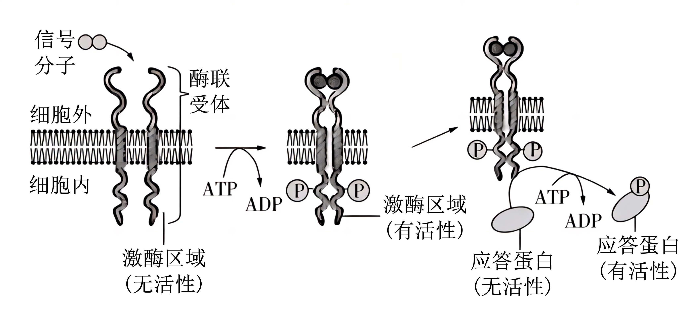
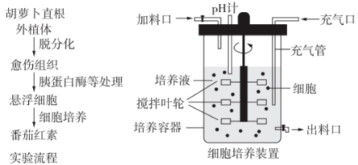
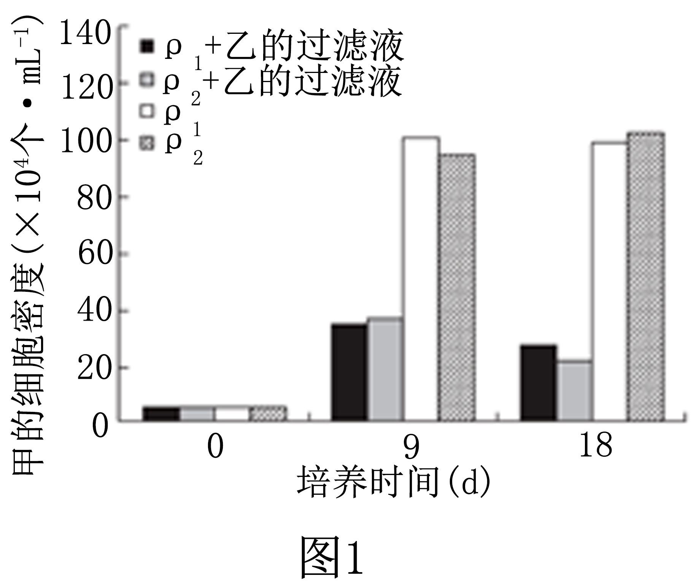
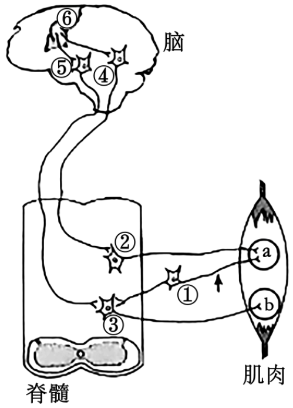
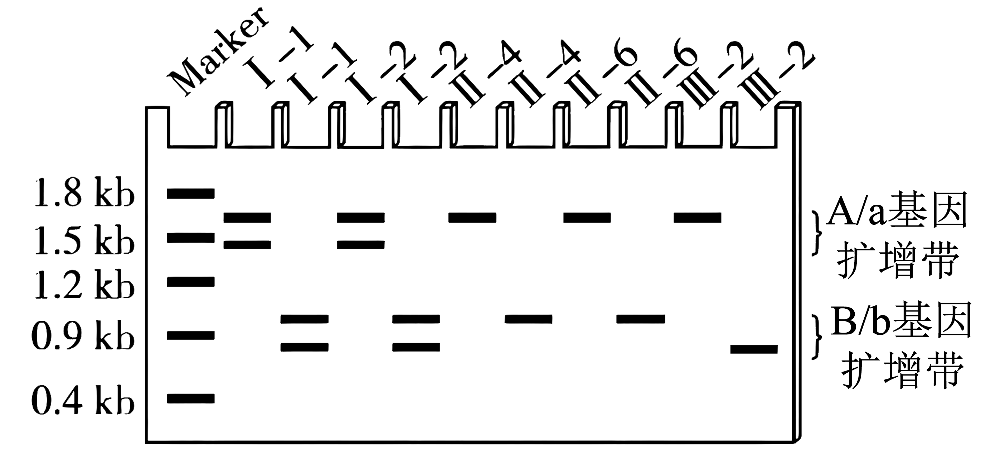
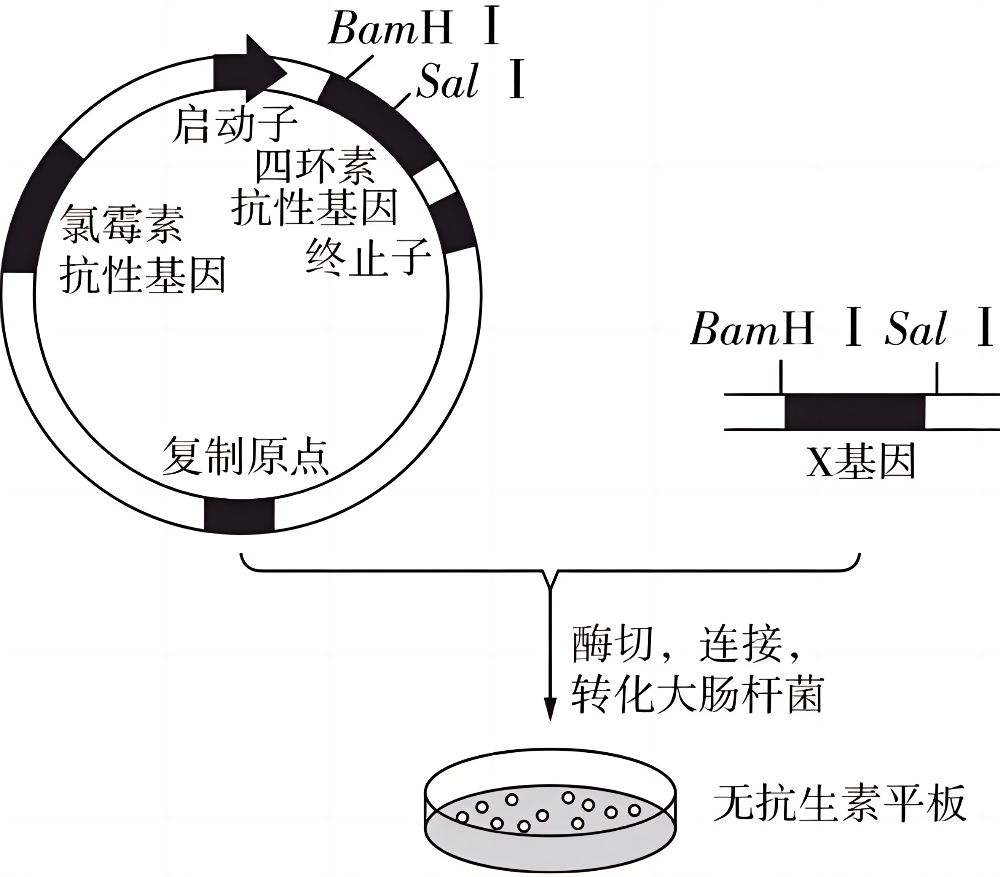

**2024年安徽省普通高中学业水平选择性考试（安徽卷）**

**生物学**

**一、选择题：本题共15小题，每小题3分，共45分。在每小题给出的四个选项中，只有一项是符合题目要求的。**

1\. 真核细胞的质膜、细胞器膜和核膜等共同构成生物膜系统。下列叙述正确的是（ ）

A. 液泡膜上的一种载体蛋白只能主动转运一种分子或离子

B. 水分子主要通过质膜上的水通道蛋白进出肾小管上皮细胞

C. 根尖分生区细胞的核膜在分裂间期解体，在分裂末期重建

D. \[H\]与氧结合生成水并形成ATP的过程发生在线粒体基质和内膜上

【答案】B

【解析】

【分析】由细胞膜、核膜以及各种细胞器膜等共同构成生物膜系统。

【详解】A、液泡膜上的一种载体蛋白能转运一种或一类分子或离子，A错误；

B、水分子主要通过质膜上的水通道蛋白进出肾小管上皮细胞，B正确；

C、根尖分生区细胞的核膜在分裂前期解体，在分裂末期重建，C错误；

D、\[H\]与氧结合生成水并形成ATP的过程发生在线粒体内膜上，D错误。

故选B。

2\. 变形虫可通过细胞表面形成临时性细胞突起进行移动和摄食。科研人员用特定荧光物质处理变形虫，发现移动部分的细胞质中聚集有被标记的纤维网架结构，并伴有纤维的消长。下列叙述正确的是（ ）

A. 被荧光标记的网架结构属于细胞骨架，与变形虫的形态变化有关

B. 溶酶体中的水解酶进入细胞质基质，将摄入的食物分解为小分子

C. 变形虫通过胞吞方式摄取食物，该过程不需要质膜上的蛋白质参与

D. 变形虫移动过程中，纤维的消长是由于其构成蛋白的不断组装所致

【答案】A

【解析】

【分析】1、溶酶体是细胞的“消化车间”，内部含有多种水解酶，如果溶酶体的膜破裂，水解酶就会逸出至细胞质，可能造成细胞自溶。

2、细胞骨架是由蛋白质与蛋白质搭建起的骨架网络结构，包括细胞质骨架和细胞核骨架，其中细胞骨架的主要作用是维持细胞的一定形态。细胞骨架对于细胞内物质运输和细胞器的移动来说又起交通动脉的作用；细胞骨架还将细胞内基质区域化；此外，细胞骨架还具有帮助细胞移动行走的功能。细胞骨架的主要成分是微管、微丝和中间纤维。

【详解】A、科研人员用特定荧光物质处理变形虫，发现移动部分的细胞质中聚集有被标记的纤维网架结构，并伴有纤维的消长，细胞骨架对细胞形态的维持有重要作用，锚定并支撑着许多细胞器，所以被荧光标记的网架结构属于细胞骨架，与变形虫的形态变化有关，A正确；

B、摄入的食物进入溶酶体中，被溶酶体中的水解酶分解为小分子，B错误；

C、变形虫通过胞吞方式摄取食物，该过程需要质膜上的蛋白质进行识别，C错误；

D、变形虫移动过程中，纤维的消长是由于其构成蛋白的不断组装与去组装所致，D错误。

故选A。

3\. 细胞呼吸第一阶段包含一系列酶促反应，磷酸果糖激酶1(PFK1）是其中的一个关键酶。细胞中 ATP减少时，ADP和AMP会增多。当ATP/AMP浓度比变化时，两者会与PFK1发生竞争性结合而改变酶活性，进而调节细胞呼吸速率，以保证细胞中能量的供求平衡。下列叙述正确的是（ ）

A. 在细胞质基质中，PFK1催化葡萄糖直接分解为丙酮酸等

B. PFK1与ATP结合后，酶的空间结构发生改变而变性失活

C. ATP/AMP浓度比变化对PFK1活性的调节属于正反馈调节

D. 运动时肌细胞中 AMP与PFK1结合增多，细胞呼吸速率加快

【答案】D

【解析】

【分析】有氧呼吸的第一、二、三阶段的场所依次是细胞质基质、线粒体基质和线粒体内膜。有氧呼吸第一阶段是葡萄糖分解成丙酮酸和\[H\]，合成少量ATP；第二阶段是丙酮酸和水反应生成二氧化碳和\[H\]，合成少量ATP；第三阶段是氧气和\[H\]反应生成水，合成大量ATP。

【详解】A、细胞呼吸第一阶段葡萄糖最终分解为丙酮酸，需要一系列酶促反应即需要多种酶参与，而磷酸果糖激酶1(PFK1）是其中的一个关键酶，因此PFK1不能催化葡萄糖直接分解为丙酮酸，A错误；

B、由题意可知，当ATP/AMP浓度比变化时，两者会与PFK1发生竞争性结合而改变酶活性，进而调节细胞呼吸速率，以保证细胞中能量的供求平衡，说明PFK1与ATP结合后，酶的空间结构发生改变但还具有其活性，B错误；

C、由题意可知，ATP/AMP浓度比变化，最终保证细胞中能量的供求平衡，说明其调节属于负反馈调节，C错误；

D、运动时肌细胞消耗ATP增多，细胞中 ATP减少，ADP和AMP会增多，从而 AMP与PFK1结合增多，细胞呼吸速率加快，细胞中 ATP含量增多，从而维持能量供应，D正确。

故选D。

4\. 在多细胞生物体的发育过程中，细胞的分化及其方向是由细胞内外信号分子共同决定的某信号分子诱导细胞分化的部分应答通路如图。下列叙述正确的是（ ）

A. 细胞对该信号分子的特异应答，依赖于细胞内的相应受体

B. 酶联受体是质膜上的蛋白质，具有识别、运输和催化作用

C. ATP水解释放的磷酸分子与靶蛋白结合，使其磷酸化而有活性

D. 活化的应答蛋白通过影响基因的表达，最终引起细胞定向分化

【答案】D

【解析】

【分析】信号分子与特异性受体结合后发挥调节作用。图中信号分子与膜外侧酶联受体识别、结合，ATP水解产生的磷酸基团结合到激酶区域使之具有活性，有活性的激酶区域能将应答蛋白转化为有活性的应答蛋白。

【详解】A、由题图可知，细胞对该信号分子的特异应答，依赖于细胞外侧的酶联受体，A错误；

B、酶联受体位于质膜上，化学本质是蛋白质，能识别相应的信号分子，磷酸化的酶联受体具有催化作用，但不具有运输作用，B错误；

C、ATP水解产生ADP和磷酸基团，磷酸基团与其他物质如靶蛋白结合，使其磷酸化而有活性，C错误；

D、细胞分化的实质是基因的选择性表达，故信号分子调控相关蛋白质，活化的应答蛋白通过影响基因的表达，最终引起细胞定向分化，D正确。

故选D。

5\. 物种的生态位研究对生物多样性保护具有重要意义。研究人员对我国某自然保护区白马鸡与血雉在三种植被类型中的分布和日活动节律进行了调查，结果见下表。下列叙述错误的是（ ）

<table style="width:85%;">
<colgroup>
<col style="width: 16%" />
<col style="width: 17%" />
<col style="width: 17%" />
<col style="width: 17%" />
<col style="width: 17%" />
</colgroup>
<tbody>
<tr>
<td rowspan="2" style="text-align: center;"></td>
<td colspan="2" style="text-align: center;">白马鸡的分布占比(%)</td>
<td colspan="2" style="text-align: center;">血雉的分布占比(%)</td>
</tr>
<tr>
<td style="text-align: center;">旱季</td>
<td style="text-align: center;">雨季</td>
<td style="text-align: center;">旱季</td>
<td style="text-align: center;">雨季</td>
</tr>
<tr>
<td style="text-align: center;">针阔叶混交林</td>
<td style="text-align: center;">56.05</td>
<td style="text-align: center;">76.67</td>
<td style="text-align: center;">47.94</td>
<td style="text-align: center;">78.67</td>
</tr>
<tr>
<td style="text-align: center;">针叶林</td>
<td style="text-align: center;">40.13</td>
<td style="text-align: center;">17.78</td>
<td style="text-align: center;">42.06</td>
<td style="text-align: center;">917</td>
</tr>
<tr>
<td style="text-align: center;">灌丛</td>
<td style="text-align: center;">3.82</td>
<td style="text-align: center;">5.55</td>
<td style="text-align: center;">10.00</td>
<td style="text-align: center;">12.16</td>
</tr>
<tr>
<td style="text-align: center;">日活动节律</td>
<td colspan="2" style="text-align: center;"></td>
<td colspan="2" style="text-align: center;"></td>
</tr>
</tbody>
</table>

A. 生境的复杂程度会明显影响白马鸡和血雉对栖息地的选择

B. 两物种在三种植被类型中的分布差异体现了群落的垂直结构

C. 季节交替影响两物种对植被类型的选择，降雨对血雉的影响更大

D. 两物种在白天均出现活动高峰，但在日活动节律上存在生态位分化

【答案】B

【解析】

【分析】生态位是指一个物种在群落中的地位和作用，包括所处的空间位置，占用资源的情况，以及与其他物种的关系等。

【详解】A、从灌丛到针叶林，再到针阔叶混交林，生境越来越复杂，由表格数据可知，其白马鸡和血雉分布占比会发生改变，说明生境的复杂程度会明显影响白马鸡和血雉对栖息地的选择，A正确；

B、垂直结构是指群落在垂直方向上的分层现象，两物种在三种植被类型中的分布属于不同地域的分布，不在同一个生态系统，其分布差异不是群落的垂直结构，B错误；

C、由表格数据可知，季节交替（旱季和雨季）影响两物种对植被类型的选择，如旱季时，针阔叶混交林白马鸡的分布占比高，而血雉的分布占比更低。三种植被类型中，旱季与雨季血雉的分布占比差值大于白马鸡的分布占比差值，说明降雨对血雉的影响更大，C正确；

D、由图可知，两物种在8：00左右相对密度最大，说明两物种在白天均出现活动高峰，一天的时间内，其相对密度会很大的波动，说明在日活动节律上两物种存在生态位分化，D正确。

故选B。

6\. 磷循环是生物圈物质循环的重要组成部分。磷经岩石风化、溶解、生物吸收利用、微生物分解，进入环境后少量返回生物群落，大部分沉积并进一步形成岩石。岩石风化后磷再次参与循环。下列叙述错误的是（ ）

A. 在生物地球化学循环中，磷元素年周转量比碳元素少

B. 人类施用磷肥等农业生产活动不会改变磷循环速率

C. 磷参与生态系统中能量的输入、传递、转化和散失过程

D. 磷主要以磷酸盐的形式在生物群落与无机环境之间循环

【答案】B

【解析】

【分析】组成生物体的碳、氢、氧、磷、硫等元素，都在不断进行这从非生物环境到生物群落，又从生物群落到非生物环境的循环过程，这就是生态系统的物质循环。

【详解】A、细胞中碳元素的含量高于磷元素，故在生物地球化学循环中，磷元素年周转量比碳元素少，A正确；

B、人类施用磷肥等农业生产活动，使部分磷留在无机环境里，改变磷循环速率，B错误；

C、植物吸收利用的磷可用于合成磷脂、ATP、DNA、RNA等物质，故磷参与生态系统中能量的输入、传递、转化和散失过程，C正确；

D、磷主要以磷酸盐的形式在生物群落与无机环境之间循环，D正确。

故选B。

7\. 人在睡梦中偶尔会出现心跳明显加快、呼吸急促，甚至惊叫。如果此时检测这些人的血液，会发现肾上腺素含量明显升高。下列叙述错误的是（ ）

A. 睡梦中出现呼吸急促和惊叫等生理活动不受大脑皮层控制

B. 睡梦中惊叫等应激行为与肾上腺髓质分泌的肾上腺素有关

C. 睡梦中心跳加快与交感神经活动增强、副交感神经活动减弱有关

D. 交感神经兴奋促进肾上腺素释放进而引起心跳加快，属于神经－体液调节

【答案】A

【解析】

【分析】自主神经系统：（1）概念:支配内脏、血管和腺体的传出神经，它们的活动不受意识支配，称为自主神经系统。（2）功能:当人体处于兴奋状态时，交感神经活动占据优势，心跳加快，支气管扩张，但胃肠的蠕动和消化腺的分泌活动减弱;当人处于安静状态时，副交感神经活动占据优势，此时，心跳减慢，但胃肠的蠕动和消化液的分泌会加强，有利于食物的消化和营养物质的吸收。

【详解】A、睡梦中出现呼吸急促和惊叫等生理活动受大脑皮层控制，A错误；

B、睡梦中惊叫属于应激行为，与肾上腺髓质分泌的肾上腺素有关，B正确；

C、交感神经的活动主要保证人体紧张状态时的生理需要，睡梦中心跳加快与交感神经活动增强、副交感神经活动减弱有关，C正确；

D、交感神经兴奋时，肾上腺髓质分泌的肾上腺素增加，可以提高机体的代谢水平，属于神经－体液调节，D正确。

故选A。

8\. 羊口疮是由羊口疮病毒（ORFV）感染引起的急性接触性人畜共患传染病，宿主易被ORFV反复感染，影响畜牧业发展，危害人体健康。下列叙述正确的是（ ）

A. ORFV感染宿主引起的特异性免疫反应属于细胞免疫

B. ORFV感染宿主后被APC和T细胞摄取、处理和呈递

C. ORFV反复感染可能与感染后宿主产生的抗体少有关

D. 辅助性T细胞在ORFV和细胞因子的刺激下增殖分化

【答案】C

【解析】

【分析】细胞免疫过程：1、被病原体（如病毒）感染的宿主细胞（靶细胞）膜表面的某些分子发生变化，细胞毒性T细胞识别变化的信号。2、细胞毒性T细胞分裂并分化，形成新的细胞毒性T细胞和记忆T细胞。细胞因子能加速这一过程。3、新形成的细胞毒性T细胞在体液中循环，它们可以识别并接触、裂解被同样病原体感染的靶细胞。4、靶细胞裂解、死亡后，病原体暴露出来，抗体可以与之结合；或被其他细胞吞噬掉。

【详解】A、病毒寄生在细胞中会引起细胞免疫，最终需要体液免疫消灭病毒，即ORFV感染宿主引起的特异性免疫反应属于细胞免疫和体液免疫，A错误；

B、T细胞不具有摄取、处理、呈递抗原的功能，B错误；

C、ORFV反复感染可能与感染后宿主产生的抗体少，不能彻底消灭相应病毒有关，C正确；

D、B细胞在ORFV和细胞因子的刺激下增殖分化，辅助性T细胞的增殖分化不需要细胞因子，D错误。

故选C。

9\. 植物生命活动受植物激素、环境因素等多种因素的调节。下列叙述正确的是（ ）

A. 菊花是自然条件下秋季开花的植物，遮光处理可使其延迟开花

B. 玉米倒伏后，茎背地生长与重力引起近地侧生长素含量较低有关

C. 组织培养中，细胞分裂素与生长素浓度比值高时能诱导根分化

D. 土壤干旱时，豌豆根部合成的脱落酸向地上运输可引起气孔关闭

【答案】D

【解析】

【分析】1、生长素只能从形态学上端运输到形态学下端，而不能反过来运输，称为极性运输；植物生长发育的过程，在根本上是基因组在一定时间和空间上程序性表达的结果。

2、生长素：合成部位：幼嫩的芽、叶和发育中的种子 。主要生理功能：生长素的作用表现为两重性 ，即：低浓度促进生长，高浓度抑制生长。细胞分裂素：合成部位：正在进行细胞分裂的幼嫩根尖 。主要生理功能：促进细胞分裂；诱导芽的分化；防止植物衰老 。脱落酸：合成部位：根冠、萎蔫的叶片等 主要生功能：抑制植物细胞的分裂和种子的萌发；促进植物进入休眠；促进叶和果实的衰老、脱落。

【详解】A、菊花是自然条件下秋季开花的植物，菊花是短日照植物，遮光处理可使其促进开花，A错误；

B、玉米倒伏后，茎背地生长与重力引起近地侧生长素含量较高有关，B错误；

C、组织培养中，细胞分裂素与生长素浓度比值高时能诱导芽的分化，细胞分裂素与生长素浓度比值低时能诱导根的分化，C错误；

D、土壤干旱时，豌豆根部合成的脱落酸向地上运输可引起气孔关闭，以减少水分蒸腾，D正确。

故选D。

10\. 甲是具有许多优良性状纯合品种水稻，但不抗稻瘟病(rr)，乙品种水稻抗稻瘟病(RR)。育种工作者欲将甲培育成抗稻瘟病并保留自身优良性状的纯合新品种，设计了下列育种方案，合理的是（ ）

①将甲与乙杂交，再自交多代，每代均选取抗稻瘟病植株

②将甲与乙杂交，F1与甲回交，选F2中的抗稻瘟病植株与甲再次回交，依次重复多代；再将选取的抗稻瘟病植株自交多代，每代均选取抗稻瘟病植株

③将甲与乙杂交，取F1的花药离体培养获得单倍体，再诱导染色体数目加倍为二倍体，从中选取抗稻瘟病植株

④向甲转入抗稻瘟病基因，筛选转入成功的抗稻瘟病植株自交多代，每代均选取抗稻瘟病植株

A. ①② B. ①③ C. ②④ D. ③④

【答案】C

【解析】

【分析】1、诱变育种：

原理：基因突变；

优点：能提高变异频率，加速育种过程，可大幅度改良某些性状；变异范围广。

2、杂交育种：

原理：基因重组；

优点：操作简单。

3、基因工程育种

原理：基因重组；

优点：目的性强；可克服远缘杂交不亲和障碍。

4、单倍体育种：

原理：染色体数目变异；

优点：可明显缩短育种年限。

【详解】①甲是具有许多优良性状的纯合品种水稻，但不抗稻瘟病(rr)，乙品种水稻抗稻瘟病(RR)，两者杂交，子代为优良性状的杂合子，以及抗稻瘟病(Rr)，若让其不断自交，每代均选取抗稻瘟病植株，则得到的子代为抗稻瘟病植株，但其他性状不一定是优良性状的纯合子，①错误；

②将甲与乙杂交，F1与甲回交，F2中的抗稻瘟病植株与甲再次回交，依次重复多代，可得到其他许多优良性状的纯合品种水稻，但抗稻瘟病植株可能为纯合子或杂合子，再将选取的抗稻瘟病植株自交多代，每代均选取抗稻瘟病植株，可得到抗稻瘟病并保留自身优良性状的纯合新品种，②正确；

③将甲与乙杂交，取F1的花药离体培养获得单倍体，再诱导染色体数目加倍为纯合二倍体，从中选取抗稻瘟病且其他许多优良性状的纯合植物，为所需新品种，只选取抗稻瘟病植株，不能保证其他性状优良纯合，③错误；

④甲是具有许多优良性状的纯合品种水稻，向甲转入抗稻瘟病基因，则抗稻瘟病性状相当于杂合，对转入成功的抗稻瘟病植株自交多代，每代均选取抗稻瘟病植株，可获得所需新品种，④正确。

综上所述，②④正确，即C正确，ABD错误

故选C。

11\. 真核生物细胞中主要有3类RNA聚合酶，它们在细胞内定位和转录产物见下表。此外，在线粒体和叶绿体中也发现了分子量小的RNA聚合酶。下列叙述错误的是（ ）

|          |       |                             |
|:--------:|:-----:|:---------------------------:|
| 种类       | 细胞内定位 | 转录产物                        |
| RNA聚合酶I  | 核仁    | 5\. 8SrENA、18SrFN4 、28SrRNA |
| RNA聚合酶II | 核质    | mRNA                        |
| RNA聚合酶Ⅲ  | 核质    | tRNA、5SrRNA                 |

注：各类RNA均为核糖体的组成成分

A. 线粒体和叶绿体中都有DNA，两者的基因转录时使用各自的RNA聚合酶

B. 基因的 DNA 发生甲基化修饰，抑制RNA聚合酶的结合，可影响基因表达

C. RNA聚合酶I和Ⅲ的转录产物都有rRNA，两种酶识别的启动子序列相同

D. 编码 RNA 聚合酶I的基因在核内转录、细胞质中翻译，产物最终定位在核仁

【答案】C

【解析】

【分析】RNA聚合酶的作用是识别并结合特定的序列，启动基因的转录。

【详解】A、线粒体和叶绿体中都有DNA，二者均是半自助细胞器，其基因转录时使用各自的RNA聚合酶，A正确；

B、基因的 DNA 发生甲基化修饰，抑制RNA聚合酶的结合，从而影响基因的转录，可影响基因表达，B正确；

C、由表可知，RNA聚合酶I和Ⅲ的转录产物都有rRNA，但种类不同，说明两种酶识别的启动子序列不同，C错误；

D、RNA 聚合酶的本质是蛋白质，编码 RNA 聚合酶I在核仁中，该基因在核内转录、细胞质（核糖体）中翻译，产物最终定位在核仁发挥作用，D正确。

故选C。

12\. 某种昆虫的颜色由常染色体上的一对等位基因控制，雌虫有黄色和白色两种表型，雄虫只有黄色，控制白色的基因在雄虫中不表达，各类型个体的生存和繁殖力相同。随机选取一只白色雌虫与一只黄色雄虫交配，F1雌性全为白色，雄性全为黄色。继续让F1自由交配，理论上F2雌性中白色个体的比例不可能是（ ）

A. 1/2 B. 3/4 C. 15/16 D. 1

【答案】A

【解析】

【分析】基因分离定律的实质：进行有性生殖的生物在进行减数分裂产生配子的过程中，位于同源染色体的等位基因随同源染色体分离而分离，分别进入不同的配子中，随配子独立遗传给后代。

【详解】由题意可知控制白色的基因在雄虫中不表达，随机选取一只白色雌虫与一只黄色雄虫交配，F1雌性全为白色，说明白色对黄色为显性，若相关基因用A/a表示，则亲代白色雌虫基因型为AA，黄色雄虫基因型为AA或Aa或aa。若黄色雄虫基因型为AA，则F1基因型为AA，F1自由交配，F2基因型为AA，F2雌性中白色个体的比例为1；若黄色雄虫基因型为Aa，则F1基因型为1/2AA、1/2Aa，F1自由交配，F2基因型为9/16AA、6/16AA、1/16aa，F2雌性中白色个体的比例为15/16；若黄色雄虫基因型为aa，则F1基因型为Aa，F1自由交配，F2基因型为1/4AA、1/2AA、1/4aa，F2雌性中白色个体的比例为3/4。综上所述，A符合题意，BCD不符合题意。

故选A。

13\. 下图是甲与其他四种生物β-珠蛋白前 40个氨基酸的序列比对结果，字母代表氨基酸，“.”表示该位点上的氨基酸与甲的相同，相同位点氨基酸的差异是进化过程中β-珠蛋白基因发生突变的结果。下列叙述错误的是（ ）

A. 不同生物β-珠蛋白的基因序列差异可能比氨基酸序列差异更大

B. 位点上未发生改变的氨基酸对维持β-珠蛋白功能稳定可能更重要

C. 分子生物学证据与化石等证据结合能更准确判断物种间进化关系

D. 五种生物相互比较，甲与乙的氨基酸序列差异最大，亲缘关系最远

【答案】D

【解析】

【分析】生物进化除了免疫学证据、分子生物学证据外，还有化石记录、比较解剖学、比较胚胎学等方面的证据。

【详解】A、密码子具有简并性，可推测不同物种的生物β-珠蛋白的基因序列差异可能比氨基酸序列差异更大，A正确；

B、不同生物的β-珠蛋白某些位点上的氨基酸相同，可推测这些位点上未发生改变的氨基酸对维持β-珠蛋白功能稳定可能更重要，B正确；

C、化石是研究生物进化的最直接证据，通过比对氨基酸序列等分子生物学证据与化石等证据结合能更准确判断物种间进化关系，C正确；

D、相同位点氨基酸的差异数可反映生物的亲缘关系，五种生物相互比较，甲与乙的氨基酸序列差异数为11个，而乙和丙的氨基酸序列差异数为13个，故甲与乙的亲缘关系并非最远，D错误。

故选D。

14\. 下列关于“DNA 粗提取与鉴定”实验的叙述，错误的是（ ）

A. 实验中如果将研磨液更换为蒸馏水，DNA提取的效率会降低

B. 利用DNA和蛋白质在酒精中的溶解度差异，可初步分离DNA

C. DNA在不同浓度NaC1溶液中溶解度不同，该原理可用于纯化DNA粗提物

D. 将溶解的DNA粗提物与二苯胺试剂反应，可检测溶液中是否含有蛋白质杂质

【答案】D

【解析】

【分析】DNA粗提取和鉴定的原理：

（1）DNA的溶解性：DNA和蛋白质等其他成分在不同浓度NaCl溶液中溶解度不同；DNA不溶于酒精溶液，但细胞中的某些蛋白质溶于酒精；DNA对酶、高温和洗涤剂的耐受性。

（2）DNA的鉴定：在沸水浴的条件下，DNA遇二苯胺会被染成蓝色。

【详解】A、研磨液有利于DNA的溶解，换为蒸馏水，DNA提取的效率会降低，A正确；

B、DNA不溶于酒精溶液，但细胞中的某些蛋白质溶于酒精，可分离DNA，B正确；

C、DNA在NaCl溶液中的溶解度随着NaCl浓度的变化而改变，因此可用不同浓度的NaCl溶液对DNA进行粗提取，C正确；

D、在沸水浴的条件下，DNA遇二苯胺会被染成蓝色，二苯胺试剂用于鉴定DNA，D错误。

故选D。

15\. 植物细胞悬浮培养技术在生产中已得到应用。某兴趣小组尝试利用该技术培养胡萝卜细胞并获取番茄红素，设计了以下实验流程和培养装置（如图），请同学们进行评议。下列评议不合理的是（ ）

A. 实验流程中应该用果胶酶等处理愈伤组织，制备悬浮细胞

B. 装置中的充气管应置于液面上方，该管可同时作为排气管

C. 装置充气口需要增设无菌滤器，用于防止杂菌污染培养液

D. 细胞培养需要适宜的温度，装置需增设温度监测和控制设备

【答案】B

【解析】

【分析】植物细胞培养是指在离体条件下对单个植物细胞或细胞团进行培养使其增殖的技术。

【详解】A、植物细胞壁的主要成分是纤维素和果胶，欲利用愈伤组织制备悬浮细胞，可用纤维素酶和果胶酶进行处理愈伤组织，A正确；

B、装置中的充气管应置于液面下方，以利于培养液中的溶氧量的增加，该管不能同时作为排气管，B错误；

C、为了防止杂菌污染培养液，装置充气口需要增设无菌滤器，C正确；

D、细胞培养时需要保证适宜的温度，因此装置需增设温度监测和控制设备，D正确。

故选B。

**二、非选择题：本题共5小题，共 55 分。**

16\. 为探究基因 OsNAC 对光合作用的影响研究人员在相同条件下种植某品种水稻的野生型(WT)、OsNAC 敲除突变体(KO)及 OsNAC 过量表达株(OE)，测定了灌浆期旗叶(位于植株最顶端)净光合速率和叶绿素含量,结果见下表。回答下列问题。

|     |                                          |                          |
|:---:|:----------------------------------------:|:------------------------:|
|     | 净光合速率（umol.m2.s-1） | 叶绿素含量（mg·g-1） |
| WT  | 24.0                                     | 4.0                      |
| KO  | 20.3                                     | 3.2                      |
| OE  | 27.7                                     | 4.6                      |

（1）旗叶从外界吸收1分子 CO2与核酮糖-1,5-二磷酸结合，在特定酶作用下形成2分子3-磷酸甘油酸；在有关酶的作用下，3-磷酸甘油酸接受\_\_\_\_\_\_\_释放的能量并被还原，随后在叶绿体基质中转化为\_\_\_\_\_\_\_。

（2）与WT相比，实验组KO与OE的设置分别采用了自变量控制中的\_\_\_\_\_\_\_、\_\_\_\_\_\_\_（填科学方法）。

（3）据表可知，OsNAC过量表达会使旗叶净光合速率\_\_\_\_\_\_\_。为进一步探究该基因的功能，研究人员测定了旗叶中编码蔗糖转运蛋白基因的相对表达量、蔗糖含量及单株产量，结果如图。

 

结合图表，分析OsNAC过量表达会使旗叶净光合速率发生相应变化的原因：①\_\_\_\_\_\_\_\_\_\_\_\_\_\_；②\_\_\_\_\_\_\_\_\_\_\_\_\_\_\_\_\_\_。

【答案】（1） ①. ATP 和 NADPH ②. 核酮糖-1,5－二磷酸和淀粉等

（2） ①. 减法原理 ②. 加法原理

（3） ①. 增大 ②. 与 WT 组相比，OE组叶绿素含量较高，增加了对光能的吸收、传递和转换，光反应增强，促进旗叶光合作用 ③. 与 WT 组相比OE组旗叶中编码蔗糖转运蛋白基因的表达量较高,可以及时将更多的光合产物(蔗糖)向外运出,从而促进旗叶的光合作用速率

【解析】

【分析】在对照实验中，控制自变量可以采用“加法原理”或“减法原理”。与常态比较，人为增加某种影响因素的称为“加法原理”。与常态比较，人为去除某种影响因素的称为“减法原理”。

【小问1详解】

在光合作用的暗反应阶段，CO2被固定后形成的两个3-磷酸甘油酸（C3）分子，在有关酶的催化作用下，接受ATP和NADPH释放的能量，并且被NADPH还原。随后在叶绿体基质中转化为核酮糖-1,5－二磷酸（C5）和淀粉等。

【小问2详解】

与某品种水稻的野生型（WT）相比，实验组KO为OsNAC 敲除突变体，其设置采用了自变量控制中的减法原理；实验组OE 为 OsNAC 过量表达株，其设置采用了自变量控制中的加法原理。

【小问3详解】

题图和表中信息显示：OE组的净光合速率、叶绿素含量、旗叶中编码蔗糖转运蛋白基因的相对表达量、单株产量都明显高于WT 组和KO组，OE组蔗糖含量却低于WT 组和KO组，说明OsNAC过量表达会使旗叶净光合速率增大，究其原因有：①与 WT 组相比，OE组叶绿素含量较高，增加了对光能的吸收、传递和转换，光反应增强，促进旗叶光合作用；②与 WT 组相比OE组旗叶中编码蔗糖转运蛋白基因的表达量较高，可以及时将更多的光合产物（蔗糖）向外运出，从而促进旗叶的光合作用速率。

17\. 大气中二氧化碳浓度升高会导致全球气候变化。研究人员探究了390 μL·L（p1当前空气中的浓度）和1000 μL·L（p2）两个 CO2浓度下，盐生杜氏藻（甲）和米氏凯伦藻（乙）在单独培养及混合培养下的细胞密度变化，实验中确保养分充足，结果如图1。

回答下列问题。

（1）实验中发现，培养液的pH值会随着藻细胞密度的增加而升高，原因可能是\_\_\_\_\_\_\_\_\_\_\_\_。（答出1点即可）。

（2）与单独培养相比，两种藻混合培养的结果说明\_\_\_\_\_\_\_\_\_\_\_\_\_\_\_\_\_\_\_\_\_\_\_\_\_\_。推行绿色低碳生活更有利于减缓\_\_\_\_\_\_填“甲”或“乙”）的种群增长。

（3）为进一步探究混合培养下两种藻生长出现差异的原因，研究人员利用培养过一种藻的过滤液去培养另一种藻，其他培养条件相同且适宜，结果如图2。综合图1和图2，分析混合培养引起甲、乙种群数量变化的原因分别是①\_\_\_\_\_\_\_\_\_\_\_\_\_\_；②\_\_\_\_\_\_\_\_\_\_\_\_\_\_\_\_\_\_\_。

（4）一定条件下，藻类等多种微型生物容易在近海水域短期内急剧增殖，引发赤潮，主要原因是\_\_\_\_\_\_\_\_\_\_。

【答案】（1）藻细胞密度增加，光合作用强度增大吸收培养液中的 CO2增多，从而导致培养液的 pH 升高

（2） ①. 混合培养时，两种藻类之间存在种间竞争，并且甲在竞争中处于劣势，最终两种藻类的K值都下降 ②. 乙

（3） ①. 甲生长受到抑制主要是由于乙释放的抑制物所致 ②. 乙代谢产生的物质明显抑制甲的生长混合培养时资源、空间有限，导致乙的种群数量下降，乙的种群数量下降与甲代谢产生的物质无关

（4）受人类活动等的影响，近海水域中的 N、P 等矿质元素增多、CO2浓度较高，藻类大量增殖

【解析】

【分析】分析题图：图1随着培养时间延长，盐生杜氏藻的细胞密度都增多，加了乙滤液（米氏凯伦藻）的实验组的细胞密度低于同等条件下的在盐生杜氏藻的细胞密度；图2随着培养时间延长，米氏凯伦藻的细胞密度都增多，且加了甲滤液（盐生杜氏藻）的实验组细胞密度与同等条件下的在米氏凯伦藻的细胞密度接近。

【小问1详解】

由于藻类能进行光合作用，因此藻细胞密度增加，光合作用强度增大吸收培养液中的 CO2增多，从而导致培养液的 pH 升高。

【小问2详解】

根据图示，图1随着培养时间延长，盐生杜氏藻的细胞密度都增多，加了乙滤液（米氏凯伦藻）的实验组的细胞密度低于同等条件下的在盐生杜氏藻的细胞密度；图2随着培养时间延长，米氏凯伦藻的细胞密度都增多，且加了甲滤液（盐生杜氏藻）的实验组细胞密度与同等条件下的在米氏凯伦藻的细胞密度接近，因此可知，加了滤液相当于两种藻类混合培养，而混合培养对藻类的密度有影响，因此两种藻类之间存在种间竞争，并且甲在竞争中处于劣势，最终两种藻类的K值都下降。推行绿色低碳生活使得大气中二氧化碳的浓度下降，而在低浓度的二氧化碳下，甲的生长受影响不大，乙的生长受影响较大，细胞密度更低，因此推行绿色低碳生活更有利于减缓乙种群的增长。

【小问3详解】

根据图示，图1随着培养时间延长，甲的细胞密度增多，但加了乙滤液的实验组的细胞密度远远低于同等条件下的细胞密度，可能是乙代谢产生的物质明显抑制甲的生长；图2随着培养时间延长，乙细胞密度都增多，且加了甲滤液实验组细胞密度与同等条件下的乙的细胞密度差距不大，因此，乙的种群数量下降与甲代谢产生的物质无关，但随着培养时间的增长，混合培养时资源、空间有限，导致乙的种群数量下降。

【小问4详解】

藻类的生长需要N、P 等矿质元素，此外还需要进行光合作用，因此，一定条件下，藻类等多种微型生物容易在近海水域短期内急剧增殖，引发赤潮，主要原因是受人类活动等的影响，近海水域中的 N、P 等矿质元素增多、CO2浓度较高，藻类大量增殖。

18\. 短跑赛场上，发令枪一响，运动员会像离弦的箭一样冲出。该行为涉及机体的反射调节，其部分通路如图。

回答下列问题。

（1）运动员听到发令枪响后起跑属于\_\_\_\_\_\_\_\_\_\_反射。短跑比赛规则规定，在枪响后0.1s内起跑视为抢跑，该行为的兴奋传导路径是\_\_\_\_\_\_\_\_\_\_\_\_\_\_\_\_\_填结构名称并用箭头相连）。

（2）大脑皮层运动中枢发出的指令通过皮层下神经元④和⑤控制神经元②和③，进而精准调控肌肉收缩，体现了神经系统对躯体运动的调节是\_\_\_\_\_\_。中枢神经元④和⑤的兴奋均可引起b结构收缩，可以推断a结构是反射弧中的\_\_\_\_\_\_；若在箭头处切断神经纤维，b结构收缩强度会\_\_\_\_\_\_。

（3）脑机接口可用于因脊髓损伤导致瘫痪的临床康复治疗。原理是脑机接口获取\_\_\_\_\_（填图中数字）发出的信号，运用计算机解码患者的运动意图，再将解码信息输送给患肢，实现对患肢活动的控制。

【答案】（1） ①. 条件 ②. 神经中枢→传出神经→效应器(肌肉)

（2） ①. 分级调节 ②. 效应器和感受器 ③. 减弱

（3）⑥

【解析】

【分析】完成反射活动的结构基础是反射弧，包括5部分：感受器（感受刺激，将外界刺激的信息转变为神经的兴奋）、传入神经（将兴奋传入神经中枢）、神经中枢（对兴奋进行分析综合）、传出神经（将兴奋由神经中枢传至效应器）、效应器（对外界刺激作出反应）。

【小问1详解】

运动员听到发令枪响后起跑需要大脑皮层的参与，属于条件反射。运动员听到枪响到作出起跑反应，信号的传导需要经过了耳（感受器）、传入神经（听觉神经）、神经中枢（大脑皮层—脊髓）、传出神经、效应器（神经所支配的肌肉和腺体）等结构，但信号传导从开始到完成需要时间，如果不超过0.1s，说明运动员在开枪之前已经起跑，属于“抢跑”，此时没有听到声音已经开始跑了，该行为的兴奋传导路径是神经中枢→传出神经→效应器(肌肉)。　

【小问2详解】

大脑皮层运动中枢发出的指令通过皮层下神经元④和⑤控制神经元②和③，进而精准调控肌肉收缩，这体现了神经系统对躯体运动的分级调节。中枢神经元④和⑤的兴奋均可引起b结构（效应器）收缩，推断可能是⑤的兴奋通过③传到b，且④的兴奋通过②传到a（此时a是效应器），然后a通过①传到③再传到b，此时a是感受器，由此推断a结构是反射弧中的效应器和感受器。若在箭头处切断神经纤维，a的兴奋不能通过①传到③再传到b，因此b结构收缩强度会减弱。

【小问3详解】

根据给出的知识背景，我们知道脑机接口技术可以用于因脊髓损伤导致瘫痪的临床康复治疗。其原理是首先通过脑机接口获取⑥大脑皮层（或大脑皮层运动中枢）发出的信号。在这里，这些信号可以被视为大脑对运动的意图或命令，运用计算机解码患者的运动意图，再将解码信息输送给患肢，实现对患肢活动的控制。

19\. 一个具有甲、乙两种单基因遗传病的家族系谱图如下。甲病是某种家族遗传性肿瘤，由等位基因A/a 控制；乙病是苯丙酮尿症，因缺乏苯丙氨酸羟化酶所致，由等位基因 B/b 控制，两对基因独立遗传。

回答下列问题。

（1）据图可知，两种遗传病的遗传方式为：甲病\_\_\_\_\_\_\_\_\_<u>；</u>乙病\_\_\_\_\_\_\_\_\_。推测Ⅱ-2的基因型是\_\_\_\_\_\_\_\_\_\_\_\_。

（2）我国科学家研究发现，怀孕母体的血液中有少量来自胎儿的游离DNA，提取母亲血液中的DNA，采用PCR方法可以检测胎儿的基因状况，进行遗传病诊断。该技术的优点是\_\_\_\_\_\_\_\_\_\_\_\_\_ （答出2点即可）。

（3）科研人员对该家系成员的两个基因进行了PCR扩增，部分成员扩增产物凝胶电泳图如下。据图分析，乙病是由于正常基因发生了碱基\_\_\_\_\_\_\_\_\_\_\_\_\_所致。假设在正常人群中乙病携带者的概率为 1/75，若Ⅲ-5与一个无亲缘关系的正常男子婚配，生育患病孩子的概率为\_\_\_\_\_\_\_\_<u>；</u>若Ⅲ-5和Ⅲ-3婚配，生育患病孩子的概率是前一种婚配的\_\_\_\_\_倍。因此，避免近亲结婚可以有效降低遗传病的发病风险。

（4）近年来，反义RNA药物已被用于疾病治疗。该类药物是一种短片段RNA，递送到细胞中，能与目标基因的 mRNA 互补结合形成部分双链，影响蛋白质翻译，最终达到治疗目的。上述家系中，选择\_\_\_\_\_\_\_\_\_\_\_\_\_\_基因作为目标，有望达到治疗目的。

【答案】（1） ①. 常染色体显性遗传病 ②. 常染色体隐性遗传病 ③. Aabb

（2）操作简便、准确安全、快速等

（3） ①. 缺失 ②. 1/900 ③. 25

（4）A

【解析】

【分析】据图判断，Ⅰ -1和Ⅰ -2患甲病，生了一个正常的女儿Ⅱ-3，所以甲病是常染色体显性遗传病，Ⅰ -1和Ⅰ -2都不患乙病，生了一个患乙病的女儿Ⅱ-2，所以乙病是常染色体隐性遗传病。

【小问1详解】

据图判断，Ⅰ -1和Ⅰ -2患甲病，生了一个正常的女儿Ⅱ-3，所以甲病是常染色体显性遗传病；Ⅰ -1和Ⅰ -2都不患乙病，生了一个患乙病的女儿Ⅱ-2，所以乙病是常染色体隐性遗传病。Ⅰ -1和Ⅰ -2的基因型都是AaBb，Ⅱ-2两病兼患，但是她的儿子 Ⅲ-2不患甲病，推断Ⅱ-2的基因型是Aabb

【小问2详解】

采用PCR方法可以检测胎儿的基因状况，进行遗传病诊断。该技术的操作简便、而且利用的是怀孕母体的血液中来自胎儿的游离DNA，所以准确安全、快速。

【小问3详解】

根据遗传系谱图判断 Ⅲ-2不患甲病患乙病，他的基因型是aabb，所以A/a基因扩增带的第一个条带是a，第二个条带是A；B/b基因扩增带的第一个条带是B，第二个条带是b；b条带比B短，所以乙病是由于正常基因发生了碱基缺失所致。Ⅰ -1和Ⅰ -2的基因型都是Bb，Ⅱ-5的基因型是2/3Bb，Ⅱ-6的基因型是BB（根据电泳图判断），推出Ⅲ-5的基因型是1/3Bb，Ⅲ-5和无亲缘关系的正常男子婚配，该正常男性是携带者的概率是1/75，后代患病的概率是1/3×1/75×1/4=1/900。根据电泳图判断Ⅱ-4和Ⅱ-6的基因型相同均为BB，据家族系谱图判断，Ⅱ-5和Ⅱ-4的基因型相同为1/3BB和2/3Bb，所以Ⅲ-5和Ⅲ-3的基因型相同，为1/3Bb。若Ⅲ-5和Ⅲ-3婚配，生育患病孩子的概率是1/3×1/3××1/4=1/36，生育患病孩子的概率是前一种婚配的1/36÷1/900=25倍

【小问4详解】

反义RNA药物能与目标基因的 mRNA 互补结合形成部分双链，影响蛋白质翻译，最终达到治疗目的。因为甲病是显性遗传病影响A基因的表达可以达到治疗的目的，所以在上述家系中，可以选择A基因作为目标。

20\. 丁二醇广泛应用于化妆品和食品等领域。兴趣小组在已改造的大肠杆菌中引入合成丁二醇的关键基因X，以提高丁二醇的产量。回答下列问题。

（1）扩增X基因时，PCR反应中需要使用Taq DNA聚合酶，原因是\_\_\_\_\_\_\_\_\_\_\_\_\_\_\_\_\_。

（2）使用BamH I和 SalI限制酶处理质粒和X基因，连接后转化大肠杆菌，并涂布在无抗生素平板上（如图）。在此基础上，进一步筛选含目的基因菌株的实验思路是\_\_\_\_\_\_\_\_\_\_\_\_\_\_\_\_\_\_\_\_\_\_\_\_\_\_\_。

、

（3）研究表明，碳源和氮源的种类、浓度及其比例会影响微生物生长和发酵产物积累。如果培养基中碳源相对过多，容易使其氧化不彻底，形成较多的\_\_\_\_\_\_\_\_\_\_\_\_\_\_\_\_\_\_\_\_，引起发酵液pH值下降。兴趣小组通过单因子实验确定了木薯淀粉和酵母粉的最适浓度分别为100g.L-1和15 g.L-1。在此基础上，设置不同浓度的木薯淀粉（90 g.L-1、100 g.L-1、110 g.L-1）和酵母粉（12 g.L-1、15g.L-1、18 g.L-1）筛选碳源和氮源浓度的最佳组合，以获得较高发酵产量，理论上应设置\_\_\_\_\_\_（填数字）组实验（重复组不计算在内）。

（4）大肠杆菌在发酵罐内进行高密度发酵时，温度会升高，其原因是\_\_\_\_\_\_\_\_\_\_\_\_\_\_\_\_\_\_。

（5）发酵工业中通过菌种选育、扩大培养和发酵后，再经\_\_\_\_\_\_\_\_\_\_\_\_\_\_\_\_\_\_\_\_\_，最终获得发酵产品。

【答案】（1）在 PCR 反应中，需要利用高温使 DNA 双链解旋，普通的 DNA聚合酶在高温下会变性失活，而 Tag DNA 聚合酶能够耐高温,在高温条件下依然具有活性

（2）在平板中添加氯霉素，再将在含氯霉素的培养基中生长的菌落利用影印法影印到添加四环素的培养基中，在含有四环素的培养基中不能正常生长的菌落由导入目的基因的菌株形成

（3） ① 乳酸或有机酸 ②. 9

（4）大肠杆菌进行细胞呼吸时会释放大量热量

（5）提取、分离、纯化

【解析】

【分析】PCR反应过程:变性→复性→延伸。变性:当温度上升到90℃以上时，双链DNA解聚为单链，复性:温度下降到50℃左右，两种引物通过碱基互补配对与两条单链DNA结合，延伸:72℃左右时，Taq酶有最大活性，可使DNA新链由5'端向3'端延伸。

【小问1详解】

在 PCR 反应中，变性的温度需要90℃以上，需要利用高温使 DNA 双链解旋，普通的 DNA聚合酶在高温下会变性失活，而 Tag DNA 聚合酶能够耐高温，在高温条件下依然具有活性，因此扩增X基因时，PCR反应中需要使用Taq DNA聚合酶。

【小问2详解】

据图可知，使用BamH I和 Sal I限制酶处理质粒和X基因，四环素抗性基因被破坏，氯霉素抗性基因保留，因此能在氯霉素培养基上生存，不能在四环素培养基上生存的大肠杆菌即是含目的基因菌株，因此实验思路为：在平板中添加氯霉素，再将在含氯霉素的培养基中生长的菌落利用影印法影印到添加四环素的培养基中，在含有四环素的培养基中不能正常生长的菌落由导入目的基因的菌株形成。

【小问3详解】

碳源是微生物生长所需的主要能量来源，而氮源则是构成细胞物质和合成蛋白质、核酸等生物大分子的基本原料。当培养基中碳源相对过多时，微生物可能会优先利用碳源进行能量代谢，而氮源的消耗相对较慢。这会导致碳源氧化不完全，形成较多的乳酸或有机酸。这些乳酸或有机酸会在溶液中解离，使发酵液的pH值下降。因为要筛选碳源和氮源浓度的最佳组合，木薯淀粉浓度有3种，酵母粉浓度也有3种，因此理论上应设置3×3=9组实验。

【小问4详解】

大肠杆菌进行细胞呼吸时会释放大量能量，绝大多数以热能形式释放，因此大肠杆菌在发酵罐内进行高密度发酵时，温度会升高。

【小问5详解】

发酵工程一般包括菌种的选育，扩大培养，培养基的配制、灭菌，接种，发酵，产品分离、提纯等方面，因此发酵工业中通过菌种选育、扩大培养和发酵后，再经提取、分离、纯化，最终获得发酵产品。
