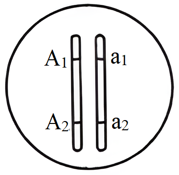
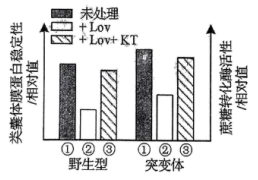
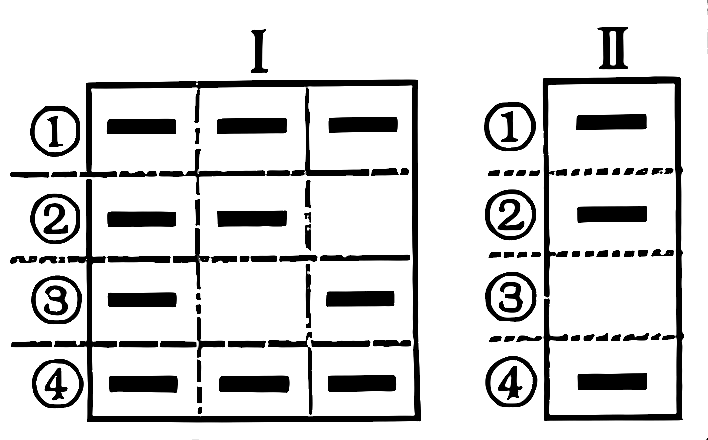

**机密★启用前**

**2024年全省普通高中学业水平等级考试生物**

**注意事项：**

**1.答卷前，考生务必将自己的姓名、考生号等填写在答题卡和试卷指定位置。**

**2.回答选择题时，选出每小题答案后，用铅笔把答题卡上对应题目的答案标号涂黑。**

**如需改动，用橡皮擦干净后，再选涂其他答案标号。回答非选择题时，将答案写在答题卡上。写在本试卷上无效。**

**3.考试结束后，将本试卷和答题卡一并交回。**

**一、选择题：本题共15小题，每小题2分，共30分。每小题只有一个选项符合题目要求。**

1\. 植物细胞被感染后产生的环核苷酸结合并打开细胞膜上的Ca2+通道蛋白，使细胞内Ca2+浓度升高，调控相关基因表达，导致H2O2含量升高进而对细胞造成伤害；细胞膜上的受体激酶BAK1被油菜素内酯活化后关闭上述Ca2+通道蛋白。下列说法正确的是（　　）

A. 环核苷酸与Ca2+均可结合Ca2+通道蛋白

B. 维持细胞Ca2+浓度的内低外高需消耗能量

C. Ca2+作为信号分子直接抑制H2O2的分解

D. 油菜素内酯可使BAK1缺失的被感染细胞内H2O2含量降低

2\. 心肌损伤诱导某种巨噬细胞吞噬、清除死亡的细胞，随后该巨噬细胞线粒体中NAD+浓度降低，生成NADH的速率减小，引起有机酸ITA的生成增加。ITA可被细胞膜上的载体蛋白L转运到细胞外。下列说法错误的是（　　）

A. 细胞呼吸为巨噬细胞吞噬死亡细胞的过程提供能量

B. 转运ITA时，载体蛋白L的构象会发生改变

C. 该巨噬细胞清除死亡细胞后，有氧呼吸产生CO2的速率增大

D. 被吞噬的死亡细胞可由巨噬细胞的溶酶体分解

3\. 某植物的蛋白P由其前体加工修饰后形成，并通过胞吐被排出细胞。在胞外酸性环境下，蛋白P被分生区细胞膜上的受体识别并结合，引起分生区细胞分裂。病原菌侵染使胞外环境成为碱性，导致蛋白P空间结构改变，使其不被受体识别。下列说法正确的是（　　）

A. 蛋白P前体通过囊泡从核糖体转移至内质网

B. 蛋白P被排出细胞的过程依赖细胞膜的流动性

C. 提取蛋白P过程中为保持其生物活性，所用缓冲体系应为碱性

D. 病原菌侵染使蛋白P不被受体识别，不能体现受体识别的专一性

4\. 仙人掌的茎由内部薄壁细胞和进行光合作用的外层细胞等组成，内部薄壁细胞的细胞壁伸缩性更大。水分充足时，内部薄壁细胞和外层细胞的渗透压保持相等；干旱环境下，内部薄壁细胞中单糖合成多糖的速率比外层细胞快。下列说法错误的是（　　）

A. 细胞失水过程中，细胞液浓度增大

B. 干旱环境下，外层细胞的细胞液浓度比内部薄壁细胞的低

C. 失水比例相同的情况下，外层细胞更易发生质壁分离

D. 干旱环境下内部薄壁细胞合成多糖的速率更快，有利于外层细胞的光合作用

5\. 制备荧光标记的DNA探针时，需要模板、引物、DNA聚合酶等。在只含大肠杆菌DNA聚合酶、扩增缓冲液、H2O和4种脱氧核苷酸（dCTP、dTTP、dGTP和碱基被荧光标记的dATP）的反应管①~④中，分别加入如表所示的适量单链DNA.已知形成的双链DNA区遵循碱基互补配对原则，且在本实验的温度条件下不能产生小于9个连续碱基对的双链DNA区。能得到带有荧光标记的DNA探针的反应管有（　　）

|     |                                        |
|:--- |:-------------------------------------- |
| 反应管 | 加入的单链DNA                               |
| ①   | 5'-GCCGATCTTTATA-3'3'-GACCGGCTAGAAA-5' |
| ②   | 5'-AGAGCCAATTGGC-3'                    |
| ③   | 5'-ATTTCCCGATCCG-3'3'-AGGGCTAGGCATA-5' |
| ④   | 5'-TTCACTGGCCAGT-3'                    |

A. ①② B. ②③ C. ①④ D. ③④

6\. 某二倍体生物通过无性繁殖获得二倍体子代的机制有3种：①配子中染色体复制1次；②减数分裂Ⅰ正常，减数分裂Ⅱ姐妹染色单体分离但细胞不分裂；③减数分裂Ⅰ细胞不分裂，减数分裂Ⅱ时每个四分体形成的4条染色体中任意2条进入1个子细胞。某个体的1号染色体所含全部基因如图所示，其中A1、A2为显性基因，a1、a2为隐性基因。该个体通过无性繁殖获得了某个二倍体子代，该子代体细胞中所有1号染色体上的显性基因数与隐性基因数相等。已知发育为该子代的细胞在四分体时，1号染色体仅2条非姐妹染色单体发生了1次互换并引起了基因重组。不考虑突变，获得该子代的所有可能机制为（　　）

A ①② B. ①③ C. ②③ D. ①②③

7\. 乙型肝炎病毒（HBV）的结构模式图如图所示。HBV与肝细胞吸附结合后，脱去含有表面抗原的包膜，进入肝细胞后再脱去由核心抗原组成的衣壳，大量增殖形成新的HBV，释放后再感染其他肝细胞。下列说法正确的是（　　）

A 树突状细胞识别HBV后只发挥其吞噬功能

B. 辅助性T细胞识别并裂解被HBV感染的肝细胞

C. 根据表面抗原可制备预防乙型肝炎的乙肝疫苗

D. 核心抗原诱导机体产生特异性抗体的过程属于细胞免疫

8\. 如图为人类某单基因遗传病的系谱图。不考虑X、Y染色体同源区段和突变，下列推断错误的是（　　）

A. 该致病基因不位于Y染色体上

B. 若Ⅱ-1不携带该致病基因，则Ⅱ-2一定为杂合子

C. 若Ⅲ-5正常，则Ⅱ-2一定患病

D. 若Ⅱ-2正常，则据Ⅲ-2是否患病可确定该病遗传方式

9\. 机体存在血浆K+浓度调节机制，K+浓度升高可直接刺激胰岛素的分泌，从而促进细胞摄入K+，使血浆K+浓度恢复正常。肾脏排钾功能障碍时，血浆K+浓度异常升高，导致自身胰岛素分泌量最大时依然无法使血浆K+浓度恢复正常，此时胞内摄入K+的量小于胞外K+的增加量，引起高钾血症。已知胞内K+浓度总是高于胞外，下列说法错误的是（　　）

A. 高钾血症患者神经细胞静息状态下膜内外电位差增大

B. 胰岛B细胞受损可导致血浆K+浓度升高

C. 高钾血症患者的心肌细胞对刺激的敏感性改变

D. 用胰岛素治疗高钾血症，需同时注射葡萄糖

10\. 拟南芥的基因S与种子萌发有关。对野生型和基因S过表达株系的种子分别进行不同处理，处理方式及种子萌发率（%）如表所示，其中MS为基本培养基，WT为野生型，OX为基因S过表达株系，PAC为赤霉素合成抑制剂。下列说法错误的是（　　）

<table style="width:68%;">
<colgroup>
<col style="width: 11%" />
<col style="width: 6%" />
<col style="width: 5%" />
<col style="width: 6%" />
<col style="width: 6%" />
<col style="width: 6%" />
<col style="width: 5%" />
<col style="width: 9%" />
<col style="width: 9%" />
</colgroup>
<tbody>
<tr>
<td style="text-align: left;">　</td>
<td colspan="2" style="text-align: left;">MS</td>
<td colspan="2" style="text-align: left;">MS+脱落酸</td>
<td colspan="2" style="text-align: left;">MS+PAC</td>
<td colspan="2" style="text-align: left;">MS+PAC+赤霉素</td>
</tr>
<tr>
<td style="text-align: left;">培养时间</td>
<td style="text-align: left;">WT</td>
<td style="text-align: left;">OX</td>
<td style="text-align: left;">WT</td>
<td style="text-align: left;">OX</td>
<td style="text-align: left;">WT</td>
<td style="text-align: left;">OX</td>
<td style="text-align: left;">WT</td>
<td style="text-align: left;">OX</td>
</tr>
<tr>
<td style="text-align: left;">24小时</td>
<td style="text-align: left;">0</td>
<td style="text-align: left;">80</td>
<td style="text-align: left;">0</td>
<td style="text-align: left;">36</td>
<td style="text-align: left;">0</td>
<td style="text-align: left;">0</td>
<td style="text-align: left;">0</td>
<td style="text-align: left;">0</td>
</tr>
<tr>
<td style="text-align: left;">36小时</td>
<td style="text-align: left;">31</td>
<td style="text-align: left;">90</td>
<td style="text-align: left;">5</td>
<td style="text-align: left;">72</td>
<td style="text-align: left;">3</td>
<td style="text-align: left;">3</td>
<td style="text-align: left;">18</td>
<td style="text-align: left;">18</td>
</tr>
</tbody>
</table>

A. MS组是为了排除内源脱落酸和赤霉素的影响

B. 基因S通过增加赤霉素的活性促进种子萌发

C. 基因S过表达减缓脱落酸对种子萌发的抑制

D. 脱落酸和赤霉素在拟南芥种子的萌发过程中相互拮抗

11\. 棉蚜是个体微小、肉眼可见的害虫。与不抗棉蚜棉花品种相比，抗棉蚜棉花品种体内某种次生代谢物的含量高，该次生代谢物对棉蚜有一定的毒害作用。下列说法错误的是（　　）

A. 统计棉田不同害虫物种的相对数量时可用目测估计法

B. 棉蚜天敌对棉蚜种群的作用强度与棉蚜种群的密度有关

C. 提高棉花体内该次生代谢物的含量用于防治棉蚜属于化学防治

D. 若用该次生代谢物防治棉蚜，需评估其对棉蚜天敌的影响

12\. 某稳定的生态系统某时刻第一、第二营养级的生物量分别为6g/m2和30g/m2，据此形成上宽下窄的生物量金字塔。该生态系统无有机物的输入与输出，下列说法错误的是（　　）

A. 能量不能由第二营养级流向第一营养级

B. 根据生物体内具有富集效应的金属浓度可辅助判断不同物种所处营养级的高低

C. 流入分解者的有机物中的能量都直接或间接来自于第一营养级固定的能量

D. 第一营养级固定的能量可能小于第二营养级同化的能量

13\. 关于“DNA粗提取与鉴定”实验，下列说法正确的是（　　）

A. 整个提取过程中可以不使用离心机

B. 研磨液在4℃冰箱中放置几分钟后，应充分摇匀再倒入烧杯中

C. 鉴定过程中DNA双螺旋结构不发生改变

D. 仅设置一个对照组不能排除二苯胺加热后可能变蓝的干扰

14\. 在发酵过程中，多个黑曲霉菌体常聚集成团形成菌球体，菌球体大小仅由菌体数量决定。黑曲霉利用糖类发酵产生柠檬酸时需要充足的氧。菌体内铵离子浓度升高时，可解除柠檬酸对其合成途径的反馈抑制。下列说法错误的是（　　）

A. 相同菌体密度下，菌球体越大柠檬酸产生速率越慢

B. 发酵中期添加一定量的硫酸铵可提高柠檬酸产量

C. 发酵过程中pH下降可抑制大部分细菌的生长

D. 发酵结束后，将过滤所得的固体物质进行干燥即可获得柠檬酸产品

15\. 酵母菌在合成色氨酸时需要3种酶X、Y和Z、trpX、trpY和trpZ分别为相应酶的编码基因突变的色氨酸依赖型突变体。已知3种酶均不能进出细胞，而色氨酸合成途径的中间产物积累到一定程度时可分泌到胞外。将这3种突变体均匀划线接种到含有少量色氨酸的培养基上，生长情况如图。据图分析，3种酶在该合成途径中的作用顺序为（　　）

A. X→Y→Z B. Z→Y→X C. Y→X→Z D. Z→X→Y

**二、选择题：本题共5小题，每小题3分，共15分。每小题有一个或多个选项符合题目要求，全部选对得3分，选对但不全的得1分，有选错的得0分。**

16\. 种皮会限制O2进入种子。豌豆干种子吸水萌发实验中子叶耗氧量、乙醇脱氢酶活性与被氧化的NADH的关系如图所示。已知无氧呼吸中，乙醇脱氢酶催化生成乙醇，与此同时NADH被氧化。下列说法正确的是（　　）

A. p点为种皮被突破的时间点

B. Ⅱ阶段种子内O2浓度降低限制了有氧呼吸

C. Ⅲ阶段种子无氧呼吸合成乙醇的速率逐渐增加

D. q处种子无氧呼吸比有氧呼吸分解的葡萄糖多

17\. 果蝇的直翅、弯翅受Ⅳ号常染色体上的等位基因A、a控制。现有甲、乙2只都只含7条染色体的直翅雄果蝇，产生原因都是Ⅳ号常染色体中的1条移接到某条非同源染色体末端，且移接的Ⅳ号常染色体着丝粒丢失。为探究Ⅳ号常染色体移接情况，进行了如表所示的杂交实验。已知甲、乙在减数分裂时，未移接的Ⅳ号常染色体随机移向一极；配子和个体的存活力都正常。不考虑其他突变和染色体互换，下列推断正确的是（　　）

|                                                        |
|:------------------------------------------------------ |
| 实验①：甲×正常雌果蝇→F1中直翅∶弯翅=7∶1，且雄果蝇群体中的直翅∶弯翅=3∶1  |
| 实验②：乙×正常雌果蝇→F1中直翅∶弯翅=3∶1，且直翅和弯翅群体中的雌雄比都是1∶1 |

A. ①中亲本雌果蝇基因型一定为Aa

B. ②中亲本雌果蝇的基因型一定为aa

C. 甲中含基因A的1条染色体一定移接到X染色体末端

D. 乙中含基因A的1条染色体一定移接到X染色体末端

18\. 种群增长率等于出生率减死亡率。不同物种的甲、乙种群在一段时间内的增长率与种群密度的关系如图所示。已知随时间推移种群密度逐渐增加，a为种群延续所需的最小种群数量所对应的种群密度；甲、乙中有一个种群个体间存在共同抵御天敌等种内互助。下列说法正确的是（　　）

A. 乙种群存种内互助

B. 由a至c，乙种群单位时间内增加的个体数逐渐增多

C. 由a至c，乙种群的数量增长曲线呈“S”形

D. a至b阶段，甲种群的年龄结构为衰退型

19\. 瞳孔开大肌是分布于眼睛瞳孔周围的肌肉，只受自主神经系统支配。当抓捏面部皮肤时，会引起瞳孔开大肌收缩，导致瞳孔扩张，该反射称为瞳孔皮肤反射，其反射通路如图所示，其中网状脊髓束是位于脑干和脊髓中的神经纤维束。下列说法错误的是（　　）

面部皮肤感受器→传入神经①→脑干→网状脊髓束→脊髓（胸段）→传出神经②→瞳孔开大肌

A. 该反射属于非条件反射

B. 传入神经①属于脑神经

C. 传出神经②属于躯体运动神经

D. 若完全阻断脊髓（颈段）中的网状脊髓束，该反射不能完成

20\. 下列关于植物愈伤组织的说法正确的是（　　）

A. 用果胶酶和胶原蛋白酶去除愈伤组织的细胞壁获得原生质体

B. 融合的原生质体需再生出细胞壁后才能形成愈伤组织

C. 体细胞杂交获得的杂种植株细胞中具有来自亲本的2个细胞核

D. 通过愈伤组织再生出多个完整植株的过程属于无性繁殖

**三、非选择题：本题共5小题，共55分。**

21\. 从开花至籽粒成熟，小麦叶片逐渐变黄。与野生型相比，某突变体叶片变黄的速度慢，籽粒淀粉含量低。研究发现，该突变体内细胞分裂素合成异常，进而影响了类囊体膜蛋白稳定性和蔗糖转化酶活性，而呼吸代谢不受影响。类囊体膜蛋白稳定性和蔗糖转化酶活性检测结果如图所示，开花14天后植株的胞间CO2浓度和气孔导度如表所示，其中Lov为细胞分裂素合成抑制剂，KT为细胞分裂素类植物生长调节剂，气孔导度表示气孔张开的程度。已知蔗糖转化酶催化蔗糖分解为单糖。

<table style="width:64%;">
<colgroup>
<col style="width: 33%" />
<col style="width: 9%" />
<col style="width: 6%" />
<col style="width: 6%" />
<col style="width: 6%" />
</colgroup>
<tbody>
<tr>
<td style="text-align: left;">检测指标</td>
<td style="text-align: left;">植株</td>
<td style="text-align: left;">14天</td>
<td style="text-align: left;">21天</td>
<td style="text-align: left;">28天</td>
</tr>
<tr>
<td rowspan="2" style="text-align: left;">胞间CO2浓度（μmolCO2mol-1）</td>
<td style="text-align: left;">野生型</td>
<td style="text-align: left;">140</td>
<td style="text-align: left;">151</td>
<td style="text-align: left;">270</td>
</tr>
<tr>
<td style="text-align: left;">突变体</td>
<td style="text-align: left;">110</td>
<td style="text-align: left;">140</td>
<td style="text-align: left;">205</td>
</tr>
<tr>
<td rowspan="2" style="text-align: left;">气孔导度（molH2Om-2s-1）</td>
<td style="text-align: left;">野生型</td>
<td style="text-align: left;">125</td>
<td style="text-align: left;">95</td>
<td style="text-align: left;">41</td>
</tr>
<tr>
<td style="text-align: left;">突变体</td>
<td style="text-align: left;">140</td>
<td style="text-align: left;">112</td>
<td style="text-align: left;">78</td>
</tr>
</tbody>
</table>

（1）光反应在类囊体上进行，生成可供暗反应利用的物质有\_\_\_\_\_\_。结合细胞分裂素的作用，据图分析，与野生型相比，开花后突变体叶片变黄的速度慢的原因是\_\_\_\_\_\_。

（2）光饱和点是光合速率达到最大时的最低光照强度。据表分析，与野生型相比，开花14天后突变体的光饱和点\_\_\_\_\_\_（填“高”或“低”），理由是\_\_\_\_\_\_。

（3）已知叶片的光合产物主要以蔗糖的形式运输到植株各处。据图分析，突变体籽粒淀粉含量低的原因是\_\_\_\_\_\_。

22\. 某二倍体两性花植物的花色、茎高和籽粒颜色3种性状的遗传只涉及2对等位基因，且每种性状只由1对等位基因控制，其中控制籽粒颜色的等位基因为D、d；叶边缘的光滑形和锯齿形是由2对等位基因A、a和B、b控制的1对相对性状，且只要有1对隐性纯合基因，叶边缘就表现为锯齿形。为研究上述性状的遗传特性，进行了如表所示的杂交实验。另外，拟用乙组F1自交获得的F2中所有锯齿叶绿粒植株的叶片为材料，通过PCR检测每株个体中控制这2种性状的所有等位基因，以辅助确定这些基因在染色体上的相对位置关系。预期对被检测群体中所有个体按PCR产物的电泳条带组成（即基因型）相同的原则归类后，该群体电泳图谱只有类型Ⅰ或类型Ⅱ，如图所示，其中条带③和④分别代表基因a和d。已知各基因的PCR产物通过电泳均可区分，各相对性状呈完全显隐性关系，不考虑突变和染色体互换。

|     |               |                                     |
|:--- |:------------- |:----------------------------------- |
| 组别  | 亲本杂交组合        | F1的表型及比例。                |
| 甲   | 紫花矮茎黄粒×红花高茎绿粒 | 紫花高茎黄粒∶红花高茎绿粒∶紫花矮茎黄粒∶红花矮茎绿粒=1∶1∶1∶1 |
| 乙   | 锯齿叶黄粒×锯齿叶绿粒   | 全部为光滑叶黄粒                            |

（1）据表分析，由同一对等位基因控制的2种性状是\_\_\_\_\_\_，判断依据是\_\_\_\_\_\_。

（2）据表分析，甲组F1随机交配，若子代中高茎植株占比为\_\_\_\_\_\_，则能确定甲组中涉及的2对等位基因独立遗传。

（3）图中条带②代表的基因是\_\_\_\_\_\_；乙组中锯齿叶黄粒亲本的基因型为\_\_\_\_\_\_。若电泳图谱为类型Ⅰ，则被检测群体在F2中占比为\_\_\_\_\_\_。

（4）若电泳图谱为类型Ⅱ，只根据该结果还不能确定控制叶边缘形状和籽粒颜色的等位基因在染色体上的相对位置关系，需辅以对F2进行调查。已知调查时正值F2的花期，调查思路：\_\_\_\_\_\_；预期调查结果并得出结论：\_\_\_\_\_\_。（要求：仅根据表型预期调查结果，并简要描述结论）

23\. 由肝细胞合成分泌、胆囊储存释放的胆汁属于消化液，其分泌与释放的调节方式如图所示。

（1）图中所示的调节过程中，迷走神经对肝细胞分泌胆汁的调节属于神经调节，说明肝细胞表面有\_\_\_\_\_\_。肝细胞受到信号刺激后，发生动作电位，此时膜两侧电位表现为\_\_\_\_\_\_。

（2）机体血浆中大多数蛋白质由肝细胞合成。肝细胞合成功能发生障碍时，组织液的量\_\_\_\_\_\_（填“增加”或“减少”）。临床上可用药物A竞争性结合醛固酮受体增加尿量，以达到治疗效果，从水盐调节角度分析，该治疗方法使组织液的量恢复正常的机制为\_\_\_\_\_\_。

（3）为研究下丘脑所在通路胆汁释放量是否受小肠Ⅰ细胞所在通路的影响，据图设计以下实验，已知注射各试剂所用溶剂对实验检测指标无影响。

实验处理：一组小鼠不做注射处理，另一组小鼠注射\_\_\_\_\_\_（填序号）。①ACh抑制剂②CCK抗体③ACh抑制剂+CCK抗体

检测指标：检测两组小鼠的\_\_\_\_\_\_。

实验结果及结论：若检测指标无差异，则下丘脑所在通路不受影响。

24\. 研究群落时，不仅要调查群落的物种丰富度，还要比较不同群落的物种组成。β多样性是指某特定时间点，沿某一环境因素梯度，不同群落间物种组成的变化。它可用群落a和群落b的独有物种数之和与群落a、b各自的物种数之和的比值表示。

（1）群落甲中冷杉的数量很多，据此\_\_\_\_\_\_（填“能”或“不能”）判断冷杉在该群落中是否占据优势。群落甲中冷杉在不同地段的种群密度不同，这体现了群落空间结构中的\_\_\_\_\_\_。从协同进化的角度分析，冷杉在群落甲中能占据相对稳定生态位的原因是\_\_\_\_\_\_。

（2）群落甲、乙的物种丰富度分别为70和80，两群落之间的β多样性为0.4，则两群落的共有物种数为\_\_\_\_\_\_（填数字）。

（3）根据β多样性可以科学合理规划自然保护区以维系物种多样性。群落丙、丁的物种丰富度分别为56和98，若两群落之间的β多样性高，则应该在群落\_\_\_\_\_\_（填“丙”“丁”“戊”“丙和丁”）建立自然保护区，理由是\_\_\_\_\_\_。

25\. 研究发现基因L能够通过脱落酸信号途径调控大豆的逆境响应。利用基因工程技术编辑基因L，可培育耐盐碱大豆品系。在载体上的限制酶BsaI切点处插入大豆基因L的向导DNA序列，将载体导入大豆细胞后，其转录产物可引导核酸酶特异性结合基因组上的目标序列并发挥作用。载体信息、目标基因L部分序列及相关结果等如图所示。

（1）用PCR技术从大豆基因组DNA中扩增目标基因L时，所用的引物越短，引物特异性越\_\_\_\_\_\_（填“高”或“低”）。限制酶在切开DNA双链时，形成的单链突出末端为黏性末端，若用BsaI酶切大豆基因组DNA，理论上可产生的黏性末端最多有\_\_\_\_\_\_种。载体信息如图甲所示，经BsaI酶切后，载体上保留的黏性末端序列应为5'-\_\_\_\_\_\_-3'和5'-\_\_\_\_\_\_-3'。

（2）重组载体通过农杆菌导入大豆细胞，使用抗生素\_\_\_\_\_\_筛选到具有该抗生素抗性的植株①∶④。为了鉴定基因编辑是否成功，以上述抗性植株的DNA为模板，通过PCR扩增目标基因L，部分序列信息及可选用的酶切位点如图乙所示，PCR产物完全酶切后的电泳结果如图丙所示。据图可判断选用的限制酶是\_\_\_\_\_\_，其中纯合的突变植株是\_\_\_\_\_\_（填序号）。

（3）实验中获得1株基因L成功突变的纯合植株，该植株具有抗生素抗性，检测发现其体细胞中只有1条染色体有T-DNA插入。用抗生素筛选这个植株的自交子代，其中突变位点纯合且对抗生素敏感的植株所占比例为\_\_\_\_\_\_，筛选出的敏感植株可用于后续的品种选育。
