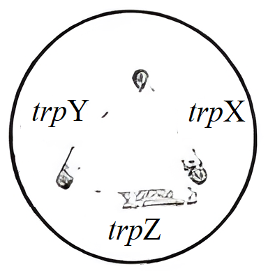
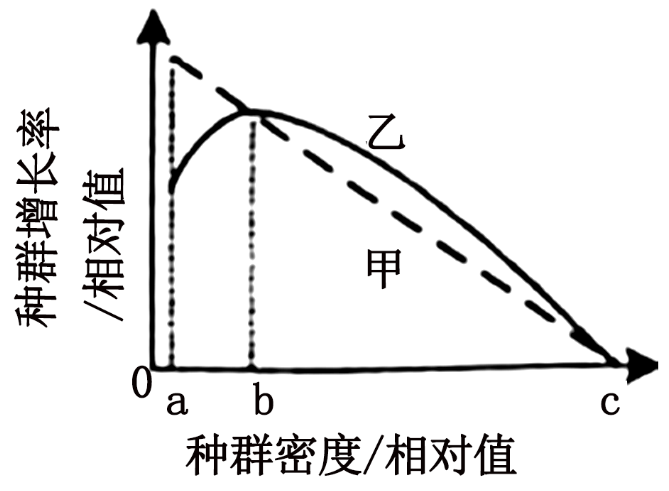
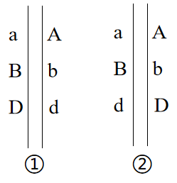
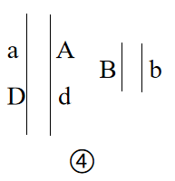
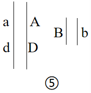
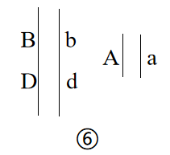
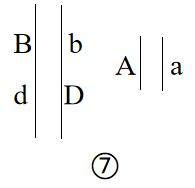
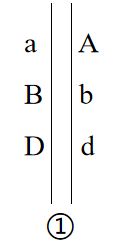
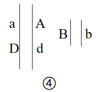
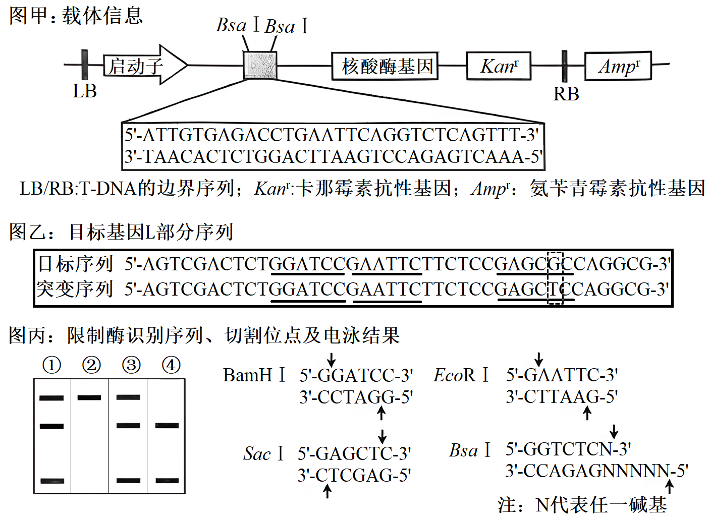

**机密★启用前**

**2024年全省普通高中学业水平等级考试生物**

**注意事项：**

**1.答卷前，考生务必将自己的姓名、考生号等填写在答题卡和试卷指定位置。**

**2.回答选择题时，选出每小题答案后，用铅笔把答题卡上对应题目的答案标号涂黑。**

**如需改动，用橡皮擦干净后，再选涂其他答案标号。回答非选择题时，将答案写在答题卡上。写在本试卷上无效。**

**3.考试结束后，将本试卷和答题卡一并交回。**

**一、选择题：本题共15小题，每小题2分，共30分。每小题只有一个选项符合题目要求。**

1\. 植物细胞被感染后产生的环核苷酸结合并打开细胞膜上的Ca2+通道蛋白，使细胞内Ca2+浓度升高，调控相关基因表达，导致H2O2含量升高进而对细胞造成伤害；细胞膜上的受体激酶BAK1被油菜素内酯活化后关闭上述Ca2+通道蛋白。下列说法正确的是（　　）

A. 环核苷酸与Ca2+均可结合Ca2+通道蛋白

B. 维持细胞Ca2+浓度的内低外高需消耗能量

C. Ca2+作为信号分子直接抑制H2O2的分解

D. 油菜素内酯可使BAK1缺失的被感染细胞内H2O2含量降低

【答案】B

【解析】

【分析】载体蛋白参与主动运输或协助扩散，需要与被运输的物质结合，发生自身构象的改变；而通道蛋白参与协助扩散，不需要与被运输物质结合，自身不发生构象改变。

【详解】A、环核苷酸结合细胞膜上的Ca2+通道蛋白，Ca2+不需要与通道蛋白结合，A错误；

B、环核苷酸结合并打开细胞膜上的Ca2+通道蛋白，使细胞内Ca2+浓度升高，Ca2+内流属于协助扩散，故维持细胞Ca2+浓度的内低外高是主动运输，需消耗能量，B正确；

C、Ca2+作为信号分子，调控相关基因表达，导致H2O2含量升高，不是直接H2O2的分解，C错误；

D、BAK1缺失的被感染细胞，则不能被油菜素内酯活化，不能关闭Ca2+通道蛋白，将导致H2O2含量升高，D错误。

故选B。

2\. 心肌损伤诱导某种巨噬细胞吞噬、清除死亡的细胞，随后该巨噬细胞线粒体中NAD+浓度降低，生成NADH的速率减小，引起有机酸ITA的生成增加。ITA可被细胞膜上的载体蛋白L转运到细胞外。下列说法错误的是（　　）

A. 细胞呼吸为巨噬细胞吞噬死亡细胞的过程提供能量

B. 转运ITA时，载体蛋白L的构象会发生改变

C. 该巨噬细胞清除死亡细胞后，有氧呼吸产生CO2的速率增大

D. 被吞噬的死亡细胞可由巨噬细胞的溶酶体分解

【答案】C

【解析】

【分析】由题意可知，心肌损伤诱导某种巨噬细胞吞噬、清除死亡的细胞，随后该巨噬细胞线粒体中NAD+浓度降低，生成NADH的速率减小，说明有氧呼吸减弱。

【详解】A、巨噬细胞吞噬死亡细胞的过程为胞吞，该过程需要细胞呼吸提供能量，A正确；

B、转运ITA为主动运输，载体蛋白L的构象会发生改变，B正确；

C、由题意可知，心肌损伤诱导某种巨噬细胞吞噬、清除死亡的细胞，随后该巨噬细胞线粒体中NAD+浓度降低，生成NADH的速率减小，说明有氧呼吸减弱，即该巨噬细胞清除死亡细胞后，有氧呼吸产生CO2的速率减小，C错误；

D、被吞噬的死亡细胞可由巨噬细胞的溶酶体分解，为机体的其他代谢提供营养物质，D正确。

故选C。

3\. 某植物的蛋白P由其前体加工修饰后形成，并通过胞吐被排出细胞。在胞外酸性环境下，蛋白P被分生区细胞膜上的受体识别并结合，引起分生区细胞分裂。病原菌侵染使胞外环境成为碱性，导致蛋白P空间结构改变，使其不被受体识别。下列说法正确的是（　　）

A. 蛋白P前体通过囊泡从核糖体转移至内质网

B. 蛋白P被排出细胞的过程依赖细胞膜的流动性

C. 提取蛋白P过程中为保持其生物活性，所用缓冲体系应为碱性

D. 病原菌侵染使蛋白P不被受体识别，不能体现受体识别的专一性

【答案】B

【解析】

【分析】由题意，某植物的蛋白P由其前体加工修饰后形成，并通过胞吐被排出细胞，，即前提再经加工后即为成熟蛋白，说明蛋白P前体通过囊泡从内质网转移至高尔基体。碱性会导致蛋白P空间结构改变，提取蛋白P过程中为保持其生物活性，所用缓冲体系应为酸性。

【详解】A、核糖体没有膜结构，不是通过囊泡从核糖体向内质网转移，A错误；

B、蛋白P被排出细胞的过程为胞吐，依赖细胞膜的流动性，B正确；

C、由题意，碱性会导致蛋白P空间结构改变，提取蛋白P过程中为保持其生物活性，所用缓冲体系应为酸性，C错误；

D、病原菌侵染使蛋白P不被受体识别，即受体结构改变后即不能识别，能体现受体识别的专一性，D错误。

故选B。

4\. 仙人掌的茎由内部薄壁细胞和进行光合作用的外层细胞等组成，内部薄壁细胞的细胞壁伸缩性更大。水分充足时，内部薄壁细胞和外层细胞的渗透压保持相等；干旱环境下，内部薄壁细胞中单糖合成多糖的速率比外层细胞快。下列说法错误的是（　　）

A. 细胞失水过程中，细胞液浓度增大

B. 干旱环境下，外层细胞的细胞液浓度比内部薄壁细胞的低

C. 失水比例相同的情况下，外层细胞更易发生质壁分离

D. 干旱环境下内部薄壁细胞合成多糖的速率更快，有利于外层细胞的光合作用

【答案】B

【解析】

【分析】成熟的植物细胞由于中央液泡占据了细胞的大部分空间，将细胞质挤成一薄层，所以细胞内的液体环境主要指的是液泡里面的细胞液。细胞膜和液泡膜以及两层膜之间的细胞质称为原生质层。原生质层有选择透过性，相当于一层半透膜，植物细胞也能通过原生质发生吸水或失水现象。

【详解】A、细胞失水过程中，水从细胞液流出，细胞液浓度增大，A正确；

B、依题意，干旱环境下，内部薄壁细胞中单糖合成多糖的速率比外层细胞快，则外层细胞的细胞液单糖多，且外层细胞还能进行光合作用合成单糖，故外层细胞液浓度比内部薄壁细胞的细胞液浓度高，B错误；

C、依题意，内部薄壁细胞细胞壁的伸缩性比外层细胞的细胞壁伸缩性更大，失水比例相同的情况下，外层细胞更易发生质壁分离，C正确；

D、依题意，干旱环境下，内部薄壁细胞中单糖合成多糖的速率比外层细胞快，有利于外层细胞光合作用产物向内部薄壁细胞转移，可促进外层细胞的光合作用，D正确。

故选B。

5\. 制备荧光标记的DNA探针时，需要模板、引物、DNA聚合酶等。在只含大肠杆菌DNA聚合酶、扩增缓冲液、H2O和4种脱氧核苷酸（dCTP、dTTP、dGTP和碱基被荧光标记的dATP）的反应管①~④中，分别加入如表所示的适量单链DNA.已知形成的双链DNA区遵循碱基互补配对原则，且在本实验的温度条件下不能产生小于9个连续碱基对的双链DNA区。能得到带有荧光标记的DNA探针的反应管有（　　）

|     |                                        |
|:--- |:-------------------------------------- |
| 反应管 | 加入的单链DNA                               |
| ①   | 5'-GCCGATCTTTATA-3'3'-GACCGGCTAGAAA-5' |
| ②   | 5'-AGAGCCAATTGGC-3'                    |
| ③   | 5'-ATTTCCCGATCCG-3'3'-AGGGCTAGGCATA-5' |
| ④   | 5'-TTCACTGGCCAGT-3'                    |

A ①② B. ②③ C. ①④ D. ③④

【答案】D

【解析】

【分析】子链的延伸方向为5'→3'，由题意可知，在本实验的温度条件下不能产生小于9个连续碱基对的双链DNA区，要能得到带有荧光标记的DNA探针，需要能根据所提供的模板进行扩增，且扩增子链种含有A。

【详解】分析反应管①～④中分别加入的适量单链DNA可知，①中两条单链DNA分子之间具有互补的序列，但双链DNA区之外的3'端无模板，因此无法进行DNA合成，不能得到带有荧光标记的DNA探针；②中单链DNA分子内具有自身互补的序列，由于在本实验的温度条件下不能产生小于9个连续碱基对的双链DNA区，故一条单链DNA分子不发生自身环化，但两条链可以形成双链DNA区，由于DNA合成的链中不含碱基A，不能得到带有荧光标记的DNA探针；③中两条单链DNA分子之间具有互补的序列，且双链DNA区之外的3'端有模板和碱基T，因此进行DNA合成能得到带有荧光标记的DNA探针；④中单链DNA分子内具有自身互补的序列，一条单链DNA分子不发生自身环化，两条链可以形成双链DNA区，且双链DNA区之外的3'端有模板和碱基T，因此进行DNA合成能得到带有荧光标记的DNA探针。

综上，能得到带有荧光标记的DNA探针的反应管有③④。

故选D。

6\. 某二倍体生物通过无性繁殖获得二倍体子代的机制有3种：①配子中染色体复制1次；②减数分裂Ⅰ正常，减数分裂Ⅱ姐妹染色单体分离但细胞不分裂；③减数分裂Ⅰ细胞不分裂，减数分裂Ⅱ时每个四分体形成的4条染色体中任意2条进入1个子细胞。某个体的1号染色体所含全部基因如图所示，其中A1、A2为显性基因，a1、a2为隐性基因。该个体通过无性繁殖获得了某个二倍体子代，该子代体细胞中所有1号染色体上的显性基因数与隐性基因数相等。已知发育为该子代的细胞在四分体时，1号染色体仅2条非姐妹染色单体发生了1次互换并引起了基因重组。不考虑突变，获得该子代的所有可能机制为（　　）

A. ①② B. ①③ C. ②③ D. ①②③

【答案】C

【解析】

【分析】由题意可知，该子代的细胞在四分体时，1号染色体仅2条非姐妹染色单体发生了1次互换并引起了基因重组，若交叉互换部分恰巧包括A1、A2、a1、a2这两对等位基因，则形成图示细胞，可能发生题干所述②③这两种情况。

【详解】①若该细胞为配子中染色体复制1次获得的，则所得的基因应该两两相同，①错误；

②由题意可知，该子代的细胞在四分体时，1号染色体仅2条非姐妹染色单体发生了1次互换并引起了基因重组，若交叉互换部分恰巧包括A1、A2、a1、a2这两对等位基因，则减数分裂Ⅰ正常，减数分裂Ⅱ姐妹染色单体分离但细胞不分裂，可形成图示细胞，②正确；

③减数分裂Ⅰ细胞不分裂，减数分裂Ⅱ时每个四分体形成的4条染色体中任意2条进入1个子细胞，可能就是交叉互换了两条染色体进入该细胞，可形成图示细胞，③正确。

综上，②③正确。

故选C。

7\. 乙型肝炎病毒（HBV）的结构模式图如图所示。HBV与肝细胞吸附结合后，脱去含有表面抗原的包膜，进入肝细胞后再脱去由核心抗原组成的衣壳，大量增殖形成新的HBV，释放后再感染其他肝细胞。下列说法正确的是（　　）

A. 树突状细胞识别HBV后只发挥其吞噬功能

B. 辅助性T细胞识别并裂解被HBV感染的肝细胞

C. 根据表面抗原可制备预防乙型肝炎的乙肝疫苗

D. 核心抗原诱导机体产生特异性抗体的过程属于细胞免疫

【答案】C

【解析】

【分析】细胞免疫过程：①被病原体（如病毒）感染的宿主细胞（靶细胞）膜表面的某些分子发生变化，细胞毒性T细胞识别变化的信号。②细胞毒性T细胞分裂并分化，形成新的细胞毒性T细胞和记忆T细胞。细胞因子能加速这一过程。③新形成的细胞毒性T细胞在体液中循环，它们可以识别并接触、裂解被同样病原体感染的 靶细胞。④靶细胞裂解、死亡后，病原体暴露出来，抗体可以与之结合；或被其他细胞吞噬掉。

【详解】A、树突状细胞属于抗原呈递细胞，树突状细胞识别HBV后，能够摄取、处理加工抗原，并将抗原信息暴露在细胞表面，以便呈递给其他免疫细胞，A错误；

B、细胞毒性T细胞识别并裂解被HBV感染的肝细胞，B错误；

C、由题干信息可知，HBV与肝细胞吸附结合后，脱去含有表面抗原的包膜，因此根据表面抗原可制备预防乙型肝炎的乙肝疫苗，C正确；

D、核心抗原诱导机体产生特异性抗体过程属于体液免疫，D错误。

故选C。

8\. 如图为人类某单基因遗传病的系谱图。不考虑X、Y染色体同源区段和突变，下列推断错误的是（　　）

A. 该致病基因不位于Y染色体上

B. 若Ⅱ-1不携带该致病基因，则Ⅱ-2一定为杂合子

C. 若Ⅲ-5正常，则Ⅱ-2一定患病

D. 若Ⅱ-2正常，则据Ⅲ-2是否患病可确定该病遗传方式

【答案】D

【解析】

【分析】判断遗传方式的口诀为：无中生有为隐性，隐性遗传看女患，父子无病在常染；有中生无为显性，显性遗传看男患，母女无病在常染。若上述口诀不能套上时，只能通过假设逐一进行验证。

【详解】A、由于该家系中有女患者，所以该致病基因不位于Y染色体上，A正确；

B、若Ⅱ-1不携带该致病基因，则该病为伴X染色体隐性遗传病，则Ⅱ-2（其父子的显性基因和母亲的隐性基因一定传给她）一定为杂合子XAXa，B正确；

C、若Ⅲ-5正常，则该病为常染色体显性遗传病，由于Ⅱ-1正常为aa，而Ⅲ-3患病Aa，可推出Ⅱ-2一定患病为A\_，C正确；

D、若Ⅱ-2正常，Ⅲ-3患病，该病为隐性遗传病，若Ⅲ-2患病，则可推出该病为常染色体隐性遗传病，若Ⅲ-2正常，则不能推出具体的遗传方式，D错误。

故选D。

9\. 机体存在血浆K+浓度调节机制，K+浓度升高可直接刺激胰岛素的分泌，从而促进细胞摄入K+，使血浆K+浓度恢复正常。肾脏排钾功能障碍时，血浆K+浓度异常升高，导致自身胰岛素分泌量最大时依然无法使血浆K+浓度恢复正常，此时胞内摄入K+的量小于胞外K+的增加量，引起高钾血症。已知胞内K+浓度总是高于胞外，下列说法错误的是（　　）

A. 高钾血症患者神经细胞静息状态下膜内外电位差增大

B. 胰岛B细胞受损可导致血浆K+浓度升高

C. 高钾血症患者的心肌细胞对刺激的敏感性改变

D. 用胰岛素治疗高钾血症，需同时注射葡萄糖

【答案】A

【解析】

【分析】神经细胞在静息时细胞膜对钾离子的通透性较大，部分钾离子通过细胞膜到达细胞外，形成了外正内负的静息电位。

【详解】A、已知胞内K+浓度总是高于胞外，高钾血症患者细胞外的钾离子浓度大于正常个体，因此患者神经细胞静息状态下膜内外电位差减小，A错误；

B、胰岛B细胞受损导致胰岛素分泌减少，由于胰岛素能促进细胞摄入K+，因此胰岛素分泌减少会导致血浆K+浓度升高，B正确；

C、高钾血症患者心肌细胞的静息电位绝对值减小，容易产生兴奋，因此对刺激的敏感性发生改变，C正确；

D、胰岛素能促进细胞摄入K+，使血浆K+浓度恢复正常，同时胰岛素能降低血糖，因此用胰岛素治疗高钾血症时，为防止出现胰岛素增加导致的低血糖，需同时注射葡萄糖，D正确。

故选A。

10\. 拟南芥的基因S与种子萌发有关。对野生型和基因S过表达株系的种子分别进行不同处理，处理方式及种子萌发率（%）如表所示，其中MS为基本培养基，WT为野生型，OX为基因S过表达株系，PAC为赤霉素合成抑制剂。下列说法错误的是（　　）

<table style="width:68%;">
<colgroup>
<col style="width: 11%" />
<col style="width: 6%" />
<col style="width: 5%" />
<col style="width: 6%" />
<col style="width: 6%" />
<col style="width: 6%" />
<col style="width: 5%" />
<col style="width: 9%" />
<col style="width: 9%" />
</colgroup>
<tbody>
<tr>
<td style="text-align: left;">　</td>
<td colspan="2" style="text-align: left;">MS</td>
<td colspan="2" style="text-align: left;">MS+脱落酸</td>
<td colspan="2" style="text-align: left;">MS+PAC</td>
<td colspan="2" style="text-align: left;">MS+PAC+赤霉素</td>
</tr>
<tr>
<td style="text-align: left;">培养时间</td>
<td style="text-align: left;">WT</td>
<td style="text-align: left;">OX</td>
<td style="text-align: left;">WT</td>
<td style="text-align: left;">OX</td>
<td style="text-align: left;">WT</td>
<td style="text-align: left;">OX</td>
<td style="text-align: left;">WT</td>
<td style="text-align: left;">OX</td>
</tr>
<tr>
<td style="text-align: left;">24小时</td>
<td style="text-align: left;">0</td>
<td style="text-align: left;">80</td>
<td style="text-align: left;">0</td>
<td style="text-align: left;">36</td>
<td style="text-align: left;">0</td>
<td style="text-align: left;">0</td>
<td style="text-align: left;">0</td>
<td style="text-align: left;">0</td>
</tr>
<tr>
<td style="text-align: left;">36小时</td>
<td style="text-align: left;">31</td>
<td style="text-align: left;">90</td>
<td style="text-align: left;">5</td>
<td style="text-align: left;">72</td>
<td style="text-align: left;">3</td>
<td style="text-align: left;">3</td>
<td style="text-align: left;">18</td>
<td style="text-align: left;">18</td>
</tr>
</tbody>
</table>

A. MS组是为了排除内源脱落酸和赤霉素的影响

B. 基因S通过增加赤霉素的活性促进种子萌发

C. 基因S过表达减缓脱落酸对种子萌发的抑制

D. 脱落酸和赤霉素在拟南芥种子的萌发过程中相互拮抗

【答案】B

【解析】

【分析】赤霉素：合成部位：幼芽、幼根和未成熟的种子等幼嫩部分。主要生理功能：促进细胞的伸长；解除种子、块茎的休眠并促进萌发的作用。

脱落酸：合成部位：根冠、萎蔫的叶片等。主要生理功能：抑制植物细胞的分裂和种子的萌发；促进植物进入休眠；促进叶和果实的衰老、脱落。

【详解】A、拟南芥植株会产生脱落酸和赤霉素，MS为基本培养基，可以排除内源脱落酸和赤霉素的影响，A正确；

B、与MS组相比， MS+PAC（PAC为赤霉素合成抑制剂）组种子萌发率明显降低，这说明基因S通过促进赤霉素的合成来促进种子萌发，B错误；

C、与MS组相比，MS+脱落酸组种子萌发率明显降低，这说明基因S过表达减缓脱落酸对种子萌发的抑制，C正确；

D、与MS组相比， MS+PAC组种子萌发率明显降低，这说明赤霉素能促进拟南芥种子的萌发；与MS组相比，MS+脱落酸组种子萌发率明显降低，这说明脱落酸能抑制拟南芥种子的萌发，因此脱落酸和赤霉素在拟南芥种子的萌发过程中相互拮抗，D正确。

故选B。

11\. 棉蚜是个体微小、肉眼可见的害虫。与不抗棉蚜棉花品种相比，抗棉蚜棉花品种体内某种次生代谢物的含量高，该次生代谢物对棉蚜有一定的毒害作用。下列说法错误的是（　　）

A. 统计棉田不同害虫物种的相对数量时可用目测估计法

B. 棉蚜天敌对棉蚜种群的作用强度与棉蚜种群的密度有关

C. 提高棉花体内该次生代谢物的含量用于防治棉蚜属于化学防治

D. 若用该次生代谢物防治棉蚜，需评估其对棉蚜天敌的影响

【答案】C

【解析】

【分析】1、探究土壤中动物类群丰富度时，常用取样器取样法进行采集，用目测估计法或记名计算法进行统计。

2、影响种群数量变化的因素分两类，一类是密度制约因素，即影响程度与种群密度有密切关系的因素，如食物、流行性传染病等；另一类是非密度制约因素，即影响程度与种群密度无关的因素，气候、季节、降水等的变化，影响程度与种群密度没有关系，属于非密度制约因素。

【详解】A、统计棉田不同害虫物种的相对数量时可用目测估计法或记名计算法，A正确；

B、棉蚜天敌属于密度制约因素，因此棉蚜天敌对棉蚜种群的作用强度与棉蚜种群的密度有关，B正确；

C、提高棉花体内该次生代谢物的含量用于防治棉蚜属于生物防治，C错误；

D、该次生代谢物对棉蚜有一定的毒害作用，也可能对棉蚜天敌也有影响，说明若用该次生代谢物防治棉蚜，需评估其对棉蚜天敌的影响，D正确。

故选C。

12\. 某稳定的生态系统某时刻第一、第二营养级的生物量分别为6g/m2和30g/m2，据此形成上宽下窄的生物量金字塔。该生态系统无有机物的输入与输出，下列说法错误的是（　　）

A. 能量不能由第二营养级流向第一营养级

B. 根据生物体内具有富集效应的金属浓度可辅助判断不同物种所处营养级的高低

C. 流入分解者的有机物中的能量都直接或间接来自于第一营养级固定的能量

D. 第一营养级固定的能量可能小于第二营养级同化的能量

【答案】D

【解析】

【分析】生态系统能量流动的特点是单向流动、逐级递减。又称生物浓缩，是生物体从周围环境中吸收、蓄积某种元素或难分解化合物，使生物有机体内该物质的浓度超过环境中的浓度的现象。其浓度随着食物链不断升高。

【详解】A、能量流动的特点是单向流动、逐级递减，能量不能由第二营养级流向第一营养级，A正确；

B、依据生物富集，金属浓度沿食物链不断升高，故可辅助判断不同物种所处营养级的高低，B正确；

C、第一营养级植物的残枝败叶中的有机物流入分解者、消费者的遗体残骸中的有机物流入分解者，流入生态系统的总能量来自于生产者固定的太阳能总量，消费者通过捕食生产者获取能量，故流入分解者的有机物中的能量都直接或间接来自于第一营养级固定的能量，C正确；

D、该生态系统是稳定的生态系统，第一营养级固定的能量大于第二营养级同化的能量，D错误。

故选D。

13\. 关于“DNA的粗提取与鉴定”实验，下列说法正确的是（　　）

A. 整个提取过程中可以不使用离心机

B. 研磨液在4℃冰箱中放置几分钟后，应充分摇匀再倒入烧杯中

C. 鉴定过程中DNA双螺旋结构不发生改变

D. 仅设置一个对照组不能排除二苯胺加热后可能变蓝的干扰

【答案】A

【解析】

【分析】DNA的粗提取与鉴定的实验原理是： ①DNA的溶解性，DNA和蛋白质等其他成分在不同 浓度的氯化钠溶液中的溶解度不同，利用这一特点可 以选择适当浓度的盐溶液可以将DNA溶解或析出， 从而达到分离的目的; ②DNA不溶于酒精溶液，细胞中的某些蛋白质可以溶解于酒精，利用这一原理可以将蛋白质和DNA进一步分离; ③在沸水浴的条件下DNA遇二苯胺会呈现蓝色。

【详解】A、在DNA的粗提取与鉴定实验中，可将获得的研磨液用纱布过滤后，在4℃的冰箱中放置几分钟，再取上清液，也可以直接将研磨液用离心机进行离心后取上清液，A正确；

B、研磨液在4℃冰箱中放置几分钟后，DNA在上清液中，应取上清液倒入烧杯中，B错误；

C、鉴定过程中用沸水浴加热，DNA双螺旋结构会发生改变，C错误；

D、加入二苯胺试剂后沸水浴处理的时间要在5分钟以上，且要等到冷却后再观察结果，这样才可以观察到较为明显的显色反应，仅设置一个对照组可以排除二苯胺加热后可能变蓝的干扰，D错误。

故选A。

14\. 在发酵过程中，多个黑曲霉菌体常聚集成团形成菌球体，菌球体大小仅由菌体数量决定。黑曲霉利用糖类发酵产生柠檬酸时需要充足的氧。菌体内铵离子浓度升高时，可解除柠檬酸对其合成途径的反馈抑制。下列说法错误的是（　　）

A. 相同菌体密度下，菌球体越大柠檬酸产生速率越慢

B. 发酵中期添加一定量的硫酸铵可提高柠檬酸产量

C. 发酵过程中pH下降可抑制大部分细菌的生长

D. 发酵结束后，将过滤所得的固体物质进行干燥即可获得柠檬酸产品

【答案】D

【解析】

【分析】发酵工程：（1）定义：利用微生物的特定功能，通过现代工程技术，规模化生产对人类有用的产品；主要为微生物细胞本身或者其代谢产物。（2）分离、提纯产物：产品若是微生物细胞，在发酵结束后，采用过滤、沉淀等方法将菌体分离和干燥；产品若是微生物代谢物，则根据产物的性质采取 适当的提取、分离和纯化措施。

【详解】A、黑曲霉利用糖类发酵产生柠檬酸时需要充足的氧，相同菌体密度下，菌球体越大越不利于菌体与氧气接触，柠檬酸产生速率越慢，A正确；

B、菌体内铵离子浓度升高时，可解除柠檬酸对其合成途径的反馈抑制，发酵中期添加一定量的硫酸铵，提高铵离子浓度，菌体内可提高柠檬酸产量，B正确；

C、发酵过程中pH下降导致细菌生命活动所必须的酶失活，可抑制大部分细菌的生长，C正确；

D、发酵结束后，将过滤所得的固体物质进行分离、纯化、浓缩、干燥等一系列操作后才能获得柠檬酸产品，D错误。

故选D。

15\. 酵母菌在合成色氨酸时需要3种酶X、Y和Z、trpX、trpY和trpZ分别为相应酶的编码基因突变的色氨酸依赖型突变体。已知3种酶均不能进出细胞，而色氨酸合成途径的中间产物积累到一定程度时可分泌到胞外。将这3种突变体均匀划线接种到含有少量色氨酸的培养基上，生长情况如图。据图分析，3种酶在该合成途径中的作用顺序为（　　）

A X→Y→Z B. Z→Y→X C. Y→X→Z D. Z→X→Y

【答案】D

【解析】

【分析】由图可知，trpZ突变体处菌落数＞trpX突变体处菌落数＞trpY突变体处菌落数。

【详解】A、若3种酶在该合成途径中的作用顺序为X→Y→Z，首先trpZ、trpY会给trpX提供酶X，然后trpZ会给trpY提供酶Y，最终会导致trpX突变体处菌落数＞trpY突变体处菌落数＞trpZ突变体处菌落数，与题意不符，A错误；

B、若3种酶在该合成途径中的作用顺序为Z→Y→X，首先trpX、trpY会给trpZ提供酶Z，然后trpX会给trpY提供酶Y，最终会导致trpZ突变体处菌落数＞trpY突变体处菌落数＞trpX突变体处菌落数，与题意不符，B错误；

C、若3种酶在该合成途径中的作用顺序为Y→X→Z，首先trpX、trpZ会给trpY提供酶Y，然后trpZ会给trpX提供酶X，最终会导致trpY突变体处菌落数＞trpX突变体处菌落数＞trpZ突变体处菌落数，与题意不符，C错误；

D、若3种酶在该合成途径中的作用顺序为Z→X→Y，首先trpY、trpX会给trpZ提供酶Z，然后trpY会给trpX提供酶X，最终会导致trpZ突变体处菌落数＞trpX突变体处菌落数＞trpY突变体处菌落数，与题意相符，D正确。

故选D。

**二、选择题：本题共5小题，每小题3分，共15分。每小题有一个或多个选项符合题目要求，全部选对得3分，选对但不全的得1分，有选错的得0分。**

16\. 种皮会限制O2进入种子。豌豆干种子吸水萌发实验中子叶耗氧量、乙醇脱氢酶活性与被氧化的NADH的关系如图所示。已知无氧呼吸中，乙醇脱氢酶催化生成乙醇，与此同时NADH被氧化。下列说法正确的是（　　）

A. p点为种皮被突破的时间点

B. Ⅱ阶段种子内O2浓度降低限制了有氧呼吸

C. Ⅲ阶段种子无氧呼吸合成乙醇的速率逐渐增加

D. q处种子无氧呼吸比有氧呼吸分解的葡萄糖多

【答案】ABD

【解析】

【分析】在种皮被突破前，种子主要进行无氧呼吸，种皮被突破后，种子吸收氧气量增加，有氧呼吸加强，无氧呼吸减弱。

【详解】A、由图可是，P点乙醇脱氢酶活性开始下降，子叶耗氧量急剧增加，说明此时无氧呼吸减弱，有氧呼吸增强，该点为种皮被突破的时间点，A正确；

B、Ⅱ阶段种子内O2浓度降低限制了有氧呼吸，使得子叶耗氧速率降低，但为了保证能量的供应，乙醇脱氢酶活性继续升高，加强无氧呼吸提供能量，B正确；

C、Ⅲ阶段种皮已经被突破，种子有氧呼吸增强，无氧呼吸合成乙醇的速率逐渐降低，C错误；

D、q处种子无氧呼吸与有氧呼吸氧化的NADH相同，根据有氧呼吸和无氧呼吸的反应式可知，此时无氧呼吸比有氧呼吸分解的葡萄糖多，D正确。

故选ABD。

17\. 果蝇的直翅、弯翅受Ⅳ号常染色体上的等位基因A、a控制。现有甲、乙2只都只含7条染色体的直翅雄果蝇，产生原因都是Ⅳ号常染色体中的1条移接到某条非同源染色体末端，且移接的Ⅳ号常染色体着丝粒丢失。为探究Ⅳ号常染色体移接情况，进行了如表所示的杂交实验。已知甲、乙在减数分裂时，未移接的Ⅳ号常染色体随机移向一极；配子和个体的存活力都正常。不考虑其他突变和染色体互换，下列推断正确的是（　　）

|                                                        |
|:------------------------------------------------------ |
| 实验①：甲×正常雌果蝇→F1中直翅∶弯翅=7∶1，且雄果蝇群体中的直翅∶弯翅=3∶1  |
| 实验②：乙×正常雌果蝇→F1中直翅∶弯翅=3∶1，且直翅和弯翅群体中的雌雄比都是1∶1 |

A. ①中亲本雌果蝇的基因型一定为Aa

B. ②中亲本雌果蝇的基因型一定为aa

C. 甲中含基因A的1条染色体一定移接到X染色体末端

D. 乙中含基因A的1条染色体一定移接到X染色体末端

【答案】AC

【解析】

【分析】1、基因的分离定律的实质是：在杂合子的细胞中，位于一 对同源染色体上的等位基因，具有一定的独立性；在减数分 裂形成配子的过程中，等位基因会随同源染色体的分开而分 离，分别进入两个配子中，独立地随配子遗传给后代。

2、基因的自由组合定律的实质是：位于非同源染色体上 的非等位基因的分离或组合是互不干扰的；在减数分裂过 程中，同源染色体上的等位基因彼此分离的同时，非同源 染色体上的非等位基因自由组合。

3、决定性状的基因位于性染色体上，在遗传上总是和性别相关联，这种现象叫作伴性遗传。

【详解】AC、依题意，甲×正常雌果蝇→F1中直翅∶弯翅=7∶1，且雄果蝇群体中的直翅∶弯翅=3∶1，可知直翅为显性，且翅形的遗传与性别相关联，A基因移接至X染色体上。甲果蝇表型为直翅，且A基因移接至X染色体上，其基因型可表示为O—XAY（O表示该染色体缺少相应基因，—表示染色体上未知的基因），正常雌果蝇的基因型可表示为— —XX。则甲与正常雌果蝇杂交可表示为O—XAY×— —XX。两对染色体独立遗传，若单独考虑性染色体的遗传，甲与正常雌果蝇杂交可表示XAY×XX，所得子代为1XAX：1XY：若单独考虑常染色体，甲与正常雌果蝇杂交可表示为O—×— —，所得子代为1O—：1O —：1— —：1— —。又知雄果蝇群体中的直翅∶弯翅=3∶1，结合性染色体遗传的雄性子代基因型XY可推断，单独考虑的常染色体杂交O—×— —所得的子代1O—：1O —中，一定至少有一个是OA，即雌果蝇中一定含A基因。而其余的1O —：1— —：1— —，一定有一个基因型为Oa或aa，两种情况中都一定有a来自雌性果蝇，所以与甲杂交的亲本雌果蝇的基因型一定为Aa。综合以上分析，①中亲本雌果蝇的基因型一定为Aa，甲中含基因A的1条染色体一定移接到X染色体末端，AC正确；

BD、假设乙的基因型为Aa，其中一个A基因位于的染色体片段移接到另一条非同源染色体上，且该染色体也是常染色体，则其基因型可表示为AOaO，再设与乙杂交的雌性果蝇的基因型为AaOO。乙×正常雌果蝇杂交时，乙所产生的配子种类及比例为：1Aa：1AO：1aO：1OO，正常雌果蝇产生的配子种类及比例为：1AO：1aO。则所得子代基因型及比例可表示为：1AAaO：1AAOO：AaOO：1AOOO：1AaaO：1AaOO：1aaOO：1aOOO，由上可推断子代的表型及比例为直翅∶弯翅=3∶1。与翅型相关两对染色体都为常染色体，直翅和弯翅群体中的雌雄比都是1∶1。假设与实验结果相符，假设成立。故②中亲本雌果蝇的基因型可以是Aa，乙中含基因A的1条染色体可以移接到常染色体末端，BD错误。

故选AC。

18\. 种群增长率等于出生率减死亡率。不同物种的甲、乙种群在一段时间内的增长率与种群密度的关系如图所示。已知随时间推移种群密度逐渐增加，a为种群延续所需的最小种群数量所对应的种群密度；甲、乙中有一个种群个体间存在共同抵御天敌等种内互助。下列说法正确的是（　　）

A. 乙种群存在种内互助

B. 由a至c，乙种群单位时间内增加的个体数逐渐增多

C. 由a至c，乙种群的数量增长曲线呈“S”形

D. a至b阶段，甲种群的年龄结构为衰退型

【答案】AC

【解析】

【分析】由图可知，横坐标是种群密度，纵坐标是种群增长率，随种群密度增加，甲种群增长率逐渐下降，乙种群增长率先增大后逐渐下降。

【详解】A、a为种群延续所需的最小种群数量所对应的种群密度，而由a至c，乙种群的种群增长率先增大后减小，说明其存在种内互助，避免种群灭绝，A正确；

B、由a至c，乙种群种群增长率先增大后减小，说明呈S形增长，增加的个体数目先增大后减小，B错误；

C、由a至c，乙种群种群增长率先增大后逐渐下降为0，增长率变为0时，种群数量达到最大，故乙种群数量增长曲线呈“S”形，C正确；

D、a至b阶段，甲种群增长率大于0，即出生率大于死亡率，其年龄结构为增长型，D错误。

故选AC。

19\. 瞳孔开大肌是分布于眼睛瞳孔周围的肌肉，只受自主神经系统支配。当抓捏面部皮肤时，会引起瞳孔开大肌收缩，导致瞳孔扩张，该反射称为瞳孔皮肤反射，其反射通路如图所示，其中网状脊髓束是位于脑干和脊髓中的神经纤维束。下列说法错误的是（　　）

面部皮肤感受器→传入神经①→脑干→网状脊髓束→脊髓（胸段）→传出神经②→瞳孔开大肌

A. 该反射属于非条件反射

B. 传入神经①属于脑神经

C. 传出神经②属于躯体运动神经

D. 若完全阻断脊髓（颈段）中的网状脊髓束，该反射不能完成

【答案】C

【解析】

【分析】神经系统是由脑、脊髓和它们发出的神经组成的，脑和脊髓是神经系统的中枢部分，叫中枢神经系统，主管接收、分析、综合体内外环境传来的信息；由脑发出的脑神经和由脊髓发出的脊神经是神经系统的周围部分，叫周围神经系统，其中脑神经共12对，主要分布在头面部，负责管理头面部的感觉和运动；脊神经共31对，主要分布在躯干、四肢，负责管理躯干、四肢的感觉和运动。此外，脑神经和脊神经中都有支配内脏器官的神经。

【详解】A、该反射是一种比较低级的神经活动，由大脑皮层以下的神经中枢（脑干和脊髓）参与，属于非条件反射，A正确；

B、由脑发出的神经为脑神经，脑神经主要分布在头面部，负责管理头面部的感觉和运动，故传入神经①属于脑神经，B正确；

C、瞳孔开大肌是分布于眼睛瞳孔周围的肌肉，只受自主神经系统支配，自主神经系统不包括躯体运动神经，传出神经②属于内脏运动神经，C错误；

D、反射活动需要经过完整的反射弧，若完全阻断脊髓（颈段）中的网状脊髓束，则该反射活动不完整，该反射不能完成，D正确。

故选C。

20\. 下列关于植物愈伤组织的说法正确的是（　　）

A. 用果胶酶和胶原蛋白酶去除愈伤组织的细胞壁获得原生质体

B. 融合的原生质体需再生出细胞壁后才能形成愈伤组织

C. 体细胞杂交获得的杂种植株细胞中具有来自亲本的2个细胞核

D. 通过愈伤组织再生出多个完整植株的过程属于无性繁殖

【答案】BD

【解析】

【分析】植物体细胞杂交过程：将植物细胞A与植物细胞B用纤维素酶和果胶酶处理，得到不含细胞壁的原生质体A和原生质体B，运用物理方法或化学方法诱导融合，形成杂种细胞，再利用植物组织培养技术将杂种细胞培养成杂种植株。

【详解】A、植物细胞壁的主要成分是纤维素和果胶，故用果胶酶和纤维素酶去除愈伤组织的细胞壁获得原生质体，A错误；

B、用纤维素酶和果胶酶分别处理不同的植物细胞，得到原生质体，运用物理方法或化学方法诱导融合，形成杂种细胞，再利用植物组织培养技术将杂种细胞培养成杂种植株，故融合的原生质体需再生出细胞壁后才能形成愈伤组织，B正确；

C、体细胞杂交获得的杂种植株细胞中具有来自亲本的的遗传物质，只有1个细胞核，C错误；

D、通过愈伤组织再生出多个完整植株的过程属于植物的组织培养，从繁殖看属于无性繁殖，D正确。

故选BD。

**三、非选择题：本题共5小题，共55分。**

21\. 从开花至籽粒成熟，小麦叶片逐渐变黄。与野生型相比，某突变体叶片变黄的速度慢，籽粒淀粉含量低。研究发现，该突变体内细胞分裂素合成异常，进而影响了类囊体膜蛋白稳定性和蔗糖转化酶活性，而呼吸代谢不受影响。类囊体膜蛋白稳定性和蔗糖转化酶活性检测结果如图所示，开花14天后植株的胞间CO2浓度和气孔导度如表所示，其中Lov为细胞分裂素合成抑制剂，KT为细胞分裂素类植物生长调节剂，气孔导度表示气孔张开的程度。已知蔗糖转化酶催化蔗糖分解为单糖。

<table style="width:64%;">
<colgroup>
<col style="width: 33%" />
<col style="width: 9%" />
<col style="width: 6%" />
<col style="width: 6%" />
<col style="width: 6%" />
</colgroup>
<tbody>
<tr>
<td style="text-align: left;">检测指标</td>
<td style="text-align: left;">植株</td>
<td style="text-align: left;">14天</td>
<td style="text-align: left;">21天</td>
<td style="text-align: left;">28天</td>
</tr>
<tr>
<td rowspan="2" style="text-align: left;">胞间CO2浓度（μmolCO2mol-1）</td>
<td style="text-align: left;">野生型</td>
<td style="text-align: left;">140</td>
<td style="text-align: left;">151</td>
<td style="text-align: left;">270</td>
</tr>
<tr>
<td style="text-align: left;">突变体</td>
<td style="text-align: left;">110</td>
<td style="text-align: left;">140</td>
<td style="text-align: left;">205</td>
</tr>
<tr>
<td rowspan="2" style="text-align: left;">气孔导度（molH2Om-2s-1）</td>
<td style="text-align: left;">野生型</td>
<td style="text-align: left;">125</td>
<td style="text-align: left;">95</td>
<td style="text-align: left;">41</td>
</tr>
<tr>
<td style="text-align: left;">突变体</td>
<td style="text-align: left;">140</td>
<td style="text-align: left;">112</td>
<td style="text-align: left;">78</td>
</tr>
</tbody>
</table>

（1）光反应在类囊体上进行，生成可供暗反应利用的物质有\_\_\_\_\_\_。结合细胞分裂素的作用，据图分析，与野生型相比，开花后突变体叶片变黄的速度慢的原因是\_\_\_\_\_\_。

（2）光饱和点是光合速率达到最大时的最低光照强度。据表分析，与野生型相比，开花14天后突变体的光饱和点\_\_\_\_\_\_（填“高”或“低”），理由是\_\_\_\_\_\_。

（3）已知叶片的光合产物主要以蔗糖的形式运输到植株各处。据图分析，突变体籽粒淀粉含量低的原因是\_\_\_\_\_\_。

【答案】（1） ①. ATP、NADPH ②. 突变体细胞分裂素合成更多，而细胞分裂素能促进叶绿素的合成

（2） ①. 高 ②. 开花14天后突变体气孔导度大于野生型，但胞间CO2浓度小于野生型，且突变体的呼吸代谢不受影响，因此突变体的光合作用强度更大，需要的光照强度更大

（3）叶片的光合产物主要以蔗糖的形式运输到植株各处，而蔗糖转化酶催化蔗糖分解为单糖，表中突变体蔗糖转化酶活性大于野生型，因此突变体内可向外运输到籽粒的蔗糖少于野生型

【解析】

【分析】光合作用的光反应阶段（场所是叶绿体的类囊体膜上）：水的光解产生\[H\]与氧气，以及ATP的形成。光合作用的暗反应阶段（场所是叶绿体的基质中）：CO2被C5固定形成C3，C3在光反应提供的ATP和\[H\]的作用下还原生成糖类等有机物。

【小问1详解】

光反应产生的ATP和NADPH可用于暗反应C3的还原。对比野生型和突变型不同条件下类囊体膜蛋白稳定性可知，不同条件下突变型类囊体膜蛋白稳定性均高于野生型，可能是突变型细胞分裂素合成增加，使类囊体膜蛋白稳定性增强，而细胞分裂素可促进叶绿素的合成，故与野生型相比，开花后突变体叶片变黄的速度慢。

【小问2详解】

据表可知，开花14天后突变体的气孔导度大于野生型，但突变体的胞间CO2浓度低于野生型，且突变体的呼吸代谢不受影响，说明突变体光合作用更强，消耗的CO2更多，因此突变体达到光饱和点需要的光照强度更高。

【小问3详解】

据图可知，与野生型相比，突变体蔗糖转化酶活性更高，而蔗糖转化酶催化蔗糖分解为单糖，故突变体内蔗糖减少，且叶片的光合产物主要以蔗糖的形式运输到植株各处，因此突变体向外运输的蔗糖减少，导致籽粒淀粉含量低。

22\. 某二倍体两性花植物的花色、茎高和籽粒颜色3种性状的遗传只涉及2对等位基因，且每种性状只由1对等位基因控制，其中控制籽粒颜色的等位基因为D、d；叶边缘的光滑形和锯齿形是由2对等位基因A、a和B、b控制的1对相对性状，且只要有1对隐性纯合基因，叶边缘就表现为锯齿形。为研究上述性状的遗传特性，进行了如表所示的杂交实验。另外，拟用乙组F1自交获得的F2中所有锯齿叶绿粒植株的叶片为材料，通过PCR检测每株个体中控制这2种性状的所有等位基因，以辅助确定这些基因在染色体上的相对位置关系。预期对被检测群体中所有个体按PCR产物的电泳条带组成（即基因型）相同的原则归类后，该群体电泳图谱只有类型Ⅰ或类型Ⅱ，如图所示，其中条带③和④分别代表基因a和d。已知各基因的PCR产物通过电泳均可区分，各相对性状呈完全显隐性关系，不考虑突变和染色体互换。

|     |               |                                     |
|:--- |:------------- |:----------------------------------- |
| 组别  | 亲本杂交组合        | F1的表型及比例。                |
| 甲   | 紫花矮茎黄粒×红花高茎绿粒 | 紫花高茎黄粒∶红花高茎绿粒∶紫花矮茎黄粒∶红花矮茎绿粒=1∶1∶1∶1 |
| 乙   | 锯齿叶黄粒×锯齿叶绿粒   | 全部为光滑叶黄粒                            |

（1）据表分析，由同一对等位基因控制的2种性状是\_\_\_\_\_\_，判断依据是\_\_\_\_\_\_。

（2）据表分析，甲组F1随机交配，若子代中高茎植株占比为\_\_\_\_\_\_，则能确定甲组中涉及的2对等位基因独立遗传。

（3）图中条带②代表的基因是\_\_\_\_\_\_；乙组中锯齿叶黄粒亲本的基因型为\_\_\_\_\_\_。若电泳图谱为类型Ⅰ，则被检测群体在F2中占比为\_\_\_\_\_\_。

（4）若电泳图谱为类型Ⅱ，只根据该结果还不能确定控制叶边缘形状和籽粒颜色的等位基因在染色体上的相对位置关系，需辅以对F2进行调查。已知调查时正值F2的花期，调查思路：\_\_\_\_\_\_；预期调查结果并得出结论：\_\_\_\_\_\_。（要求：仅根据表型预期调查结果，并简要描述结论）

【答案】（1） ①. 花色和籽粒颜色 ②. 甲组子代中紫花的籽粒全是黄粒，红花的籽粒全是绿粒且颜色性状和茎秆高度可以自由组合

（2）9/16 （3） ①. A ②. aaBBDD或AAbbDD ③. 1/4

（4） ①. 统计F2所有个体的表现型和比例 ②. 若锯齿叶红花：锯齿叶紫花：光滑形紫花=1:2:2，则三对基因位于一对同源染色体上；若光滑形紫花：光滑形红花：锯齿形紫花：锯齿形红花=6:3:6:1，则A/a、D/d位于一对同源染色体上，B/b位于另一对染色体上。

【解析】

【分析】1、根据乙组杂交后代全是黄粒可知，黄粒是显性性状，对应基因型为D-。根据题干信息可知，光滑形对应的基因型为A-B-，锯齿形对应的基因型为A-bb、aaB-、aabb。

2、根据甲组的子代中，紫花全是黄粒，红花全是绿粒可知，花色和籽粒颜色受一对等位基因控制。设茎高的相关基因为E/e，根据子代中，四种表现型的比例为1:1:1:1可知，亲本的基因型组合为：EeDd×eedd或Eedd×eeDd。

3、根据电泳图谱，类型Ⅰ中有三种基因型，且有的个体没有a；类型Ⅱ中只有一种基因型，且均不含a。

【小问1详解】

根据表格中甲组的杂交子代中，紫花的籽粒全是黄粒，红花的籽粒全是绿粒且颜色性状和茎秆高度可以自由组合，结合题干信息“花色、茎高和籽粒颜色3种性状的遗传只涉及2对等位基因”可知，花色和籽粒颜色是由一对等位基因控制的。

【小问2详解】

根据乙组杂交结果可知，黄粒是显性性状，用D表示，设茎高的相关基因为E/e。若高茎为显性，则甲组亲本的基因型组合为：Eedd×eeDd，E/e和D/d可能位于一对或两对同源染色体上，F1中茎高相关的基因型及比例为Ee:ee=1:1，F1随机交配，子代中EE:Ee:ee=1:6:9，高茎E-植株占比为7/16。若高茎为隐性性状，则甲组亲本的基因型组合为EeDd×eedd，F1中茎高相关的基因型及比例为Ee:ee=1:1，F1随机交配，子代中高茎E-植株占比为9/16。故子代中高茎站9/16，说明两对基因独立遗传。

【小问3详解】

类型Ⅰ中有三种基因型，且有的个体没有a；类型Ⅱ中只有一种基因型，且均不含a。根据乙组亲本和子代的表现型可知，亲本中关于叶边缘的基因型组合aaBB和AAbb，关于籽粒颜色的基因型组合为DD和dd，亲本的基因型组合可能为aaBBDD×AAbbdd或aaBBdd×AAbbDD，F1的基因型为AaBbDd。乙组F1自交获得的F2中所有锯齿叶绿粒植株（dd）电泳结果若为类型Ⅰ，则该群体有三种基因型，若为类型Ⅱ，则只有一种基因型。若D/d、A/a和B/b位于三对同源染色体上，则电泳结果应该有9种基因型，与电泳结果不符；若三对基因位于一对同源染色体上，则F1中基因的位置关系如图：，若为①，则F2的锯齿叶绿粒植株的基因型只有一种，为AAbbdd，对应类型Ⅱ。若为②，则F2的锯齿叶绿粒植株的基因型只有一种，为aaBBdd，与类型Ⅰ和Ⅱ均不相符。若三对基因位于两对同源染色体上，则存在以下可能性，③A/a和B/b位于一对同源染色体上，则F1中基因的位置关系如图：，则F2的锯齿叶绿粒植株的基因型只有2种基因型：aaBBdd和AAbbdd，与类型Ⅰ和Ⅱ均不相符。若A/a和D/d位于一对同源染色体上，则F1中基因的位置关系如图：或，若为④，则F2的锯齿叶绿粒植株的基因型为AAbbdd，与类型Ⅱ相符；若为⑤，则F2的锯齿叶绿粒植株的基因型有三种，均为aa，与类型Ⅰ和Ⅱ均不相符。若B/b和D/d位于一对同源染色体上，则F1中基因的位置关系如图：或，若为⑥，则F2的锯齿叶绿粒植株的基因型有三种：AAbbdd、Aabbdd、aabbdd，与类型Ⅰ相符。若为⑦，则F2的锯齿叶绿粒植株的基因型只有一种：aaBBdd，与类型Ⅰ和Ⅱ均不相符。上述假设中，符合类型Ⅰ的为⑥，子代中有的个体含有A，有的个体不含A，有的不含，B/b和D/d相关的基因均为纯合子，电泳图中，有的个体含有条带②，据此推测条带②代表的基因是A。若电泳图谱为类型Ⅰ，F1中基因的位置为⑥，子代中锯齿叶绿粒植株--bbdd占1/4。

【小问4详解】

若电泳图为类型Ⅱ，则F1可能为或，要确定三对基因的位置关系，可以统计F2所有个体的表现型和比例，若三对基因位于一对同源染色体上，则子代中锯齿叶红花（AAbbdd）：锯齿叶紫花（aaBBDD）：光滑形紫花（AaBbDd）=1:1:2；若A/a、D/d位于一对同源染色体上，B/b位于另一对染色体上，则子代中光滑形紫花（6AaB-Dd）：光滑形红花（3AAB-dd）：锯齿形紫花（3aaB-DD、1aabbDD、2AabbDd）：锯齿形红花（1AAbbdd）=6:3:6:1。

23\. 由肝细胞合成分泌、胆囊储存释放的胆汁属于消化液，其分泌与释放的调节方式如图所示。

（1）图中所示的调节过程中，迷走神经对肝细胞分泌胆汁的调节属于神经调节，说明肝细胞表面有\_\_\_\_\_\_。肝细胞受到信号刺激后，发生动作电位，此时膜两侧电位表现为\_\_\_\_\_\_。

（2）机体血浆中大多数蛋白质由肝细胞合成。肝细胞合成功能发生障碍时，组织液的量\_\_\_\_\_\_（填“增加”或“减少”）。临床上可用药物A竞争性结合醛固酮受体增加尿量，以达到治疗效果，从水盐调节角度分析，该治疗方法使组织液的量恢复正常的机制为\_\_\_\_\_\_。

（3）为研究下丘脑所在通路胆汁释放量是否受小肠Ⅰ细胞所在通路的影响，据图设计以下实验，已知注射各试剂所用溶剂对实验检测指标无影响。

实验处理：一组小鼠不做注射处理，另一组小鼠注射\_\_\_\_\_\_（填序号）。①ACh抑制剂②CCK抗体③ACh抑制剂+CCK抗体

检测指标：检测两组小鼠的\_\_\_\_\_\_。

实验结果及结论：若检测指标无差异，则下丘脑所在通路不受影响。

【答案】（1） ①. 迷走神经递质受体 ②. 外负内正

（2） ①. 增加 ②. 药物A竞争性结合醛固酮受体，抑制醛固酮的作用，减少肾小管和集合管对钠离子的重吸收，促进钠离子的排泄，从而增加尿量，使组织液的量恢复正常

（3） ①. ② ②. 胆汁释放量

【解析】

【分析】由图可知，食物通过促进下丘脑相关通路，增加Ach的释放，同时通过小肠Ⅰ细胞通路，增加CCK的释放，二者均可作用与肝细胞分泌胆汁，后者汉能促进胆囊平滑肌收缩，进一步促进胆囊胆汁的释放。

【小问1详解】

迷走神经对肝细胞分泌胆汁的调节属于神经调节，说明肝细胞表面有迷走神经递质受体。发生动作电位膜两侧电位表现为外负内正。

【小问2详解】

肝细胞合成功能发生障碍时，血浆蛋白减少，血浆渗透压降低，水分大量渗透到组织液，组织液的量增加，导致组织水肿。药物A竞争性结合醛固酮受体，减少醛固酮的作用，从而减少肾小管对钠离子的重吸收，增加尿量，使组织液的量恢复正常。

【小问3详解】

由图可知，小肠Ⅰ细胞所在通路相关的物质是CCK，即自变量是是否注射CCK，因变量是胆囊释放胆汁的量。所以实验处理：一组小鼠不做注射处理，另一组小鼠注射CCK抗体。检测指标：检测两组小鼠的胆汁释放量。

24\. 研究群落时，不仅要调查群落的物种丰富度，还要比较不同群落的物种组成。β多样性是指某特定时间点，沿某一环境因素梯度，不同群落间物种组成的变化。它可用群落a和群落b的独有物种数之和与群落a、b各自的物种数之和的比值表示。

（1）群落甲中冷杉的数量很多，据此\_\_\_\_\_\_（填“能”或“不能”）判断冷杉在该群落中是否占据优势。群落甲中冷杉在不同地段的种群密度不同，这体现了群落空间结构中的\_\_\_\_\_\_。从协同进化的角度分析，冷杉在群落甲中能占据相对稳定生态位的原因是\_\_\_\_\_\_。

（2）群落甲、乙的物种丰富度分别为70和80，两群落之间的β多样性为0.4，则两群落的共有物种数为\_\_\_\_\_\_（填数字）。

（3）根据β多样性可以科学合理规划自然保护区以维系物种多样性。群落丙、丁的物种丰富度分别为56和98，若两群落之间的β多样性高，则应该在群落\_\_\_\_\_\_（填“丙”“丁”“戊”“丙和丁”）建立自然保护区，理由是\_\_\_\_\_\_。

【答案】（1） ①. 不能 ②. 水平结构 ③. 冷杉与其他物种在长期的自然选择过程中，相互适应、相互依存，形成了相对稳定的生态关系 （2）50

（3） ①. 丙和丁 ②. 在群落丙和丁建立自然保护区，可以保护更多的物种，维系物种多样性

【解析】

【分析】由题意可知，β多样性可用群落a和群落b的独有物种数之和与群落a、b各自的物种数之和的比值表示，则计算两群落共有物种数，可以使用以下公式：共有物种数=(群落甲物种数＋群落乙物种数)×β多样性。

【小问1详解】

判断冷杉是否占据优势，不能仅仅根据数量多少，还需要考虑其他因素，如冷杉在群落中的生态作用、与其他物种的关系等。群落空间结构包括水平结构和垂直结构，冷杉在不同地段的种群密度不同，体现了群落的水平结构。冷杉能在群落甲中占据相对稳定的生态位，是因为它与其他物种之间存在竞争和互利共生关系，通过协同进化，冷杉适应了群落的环境，与其他物种形成了相对稳定的生态关系。

【小问2详解】

由题意可知，β多样性可用群落a和群落b的独有物种数之和与群落a、b各自的物种数之和的比值表示，则计算两群落共有物种数，可以使用以下公式：共有物种数=(群落甲物种数＋群落乙物种数)×β多样性，将题目中的数据代入公式，得到：共有物种数=(70 + 80) ×0.4 = 50，因此，两群落共有物种数为50。

【小问3详解】

β多样性高表示两群落之间的物种组成差异较大，在这种情况下，在群落丙和丁建立自然保护区可以保护更多的物种。这是因为自然保护区的建立可以保护物种的栖息地和生态环境，减少人类活动对物种的干扰和破坏，从而维系物种的多样性。在群落丙和丁建立自然保护区，可以将两个群落的物种都纳入保护范围，更好地保护生物多样性。

25\. 研究发现基因L能够通过脱落酸信号途径调控大豆的逆境响应。利用基因工程技术编辑基因L，可培育耐盐碱大豆品系。在载体上的限制酶BsaI切点处插入大豆基因L的向导DNA序列，将载体导入大豆细胞后，其转录产物可引导核酸酶特异性结合基因组上的目标序列并发挥作用。载体信息、目标基因L部分序列及相关结果等如图所示。

（1）用PCR技术从大豆基因组DNA中扩增目标基因L时，所用的引物越短，引物特异性越\_\_\_\_\_\_（填“高”或“低”）。限制酶在切开DNA双链时，形成的单链突出末端为黏性末端，若用BsaI酶切大豆基因组DNA，理论上可产生的黏性末端最多有\_\_\_\_\_\_种。载体信息如图甲所示，经BsaI酶切后，载体上保留的黏性末端序列应为5'-\_\_\_\_\_\_-3'和5'-\_\_\_\_\_\_-3'。

（2）重组载体通过农杆菌导入大豆细胞，使用抗生素\_\_\_\_\_\_筛选到具有该抗生素抗性的植株①∶④。为了鉴定基因编辑是否成功，以上述抗性植株的DNA为模板，通过PCR扩增目标基因L，部分序列信息及可选用的酶切位点如图乙所示，PCR产物完全酶切后的电泳结果如图丙所示。据图可判断选用的限制酶是\_\_\_\_\_\_，其中纯合的突变植株是\_\_\_\_\_\_（填序号）。

（3）实验中获得1株基因L成功突变的纯合植株，该植株具有抗生素抗性，检测发现其体细胞中只有1条染色体有T-DNA插入。用抗生素筛选这个植株的自交子代，其中突变位点纯合且对抗生素敏感的植株所占比例为\_\_\_\_\_\_，筛选出的敏感植株可用于后续的品种选育。

【答案】（1） ①. 低 ②. 4 ③. GTTT ④. AAAC

（2） ①. 卡那霉素 ②. Sac Ⅰ ③. ④

（3）1/4

【解析】

【分析】1、基因工程的基本操作程序包括目的基因的筛选与获取，基因表达载体的构建，将目的基因导入受体细胞和目的基因的检测与鉴定。

2、PCR是一项根据DNA半保留复制的原理，在体外提供参与DNA复制的各种组分与反应条件，对目的基因的核苷酸序列进行大量复制的技术，利用PCR可以快速的获取和扩增目的基因。

【小问1详解】

引物是一小段能与DNA母链的一段碱基序列互补配对的短单链核酸，用于PCR的引物长度通常为20~30个核苷酸。由此可知，在利用PCR技术从大豆基因组DNA中扩增目的基因时，所用的引物越短，则引物的特异性就越低。根据题意可知，限制酶在切开DNA双链时，形成的单链突出末端为黏性末端，若用BsaI酶切大豆基因组DNA，由图可知该序列中有两个该酶切位点，因此最多可产生4种黏性末端。根据图甲所示的载体信息，经BsaI酶切后，载体上保留的黏性末端序列应为5'-GTTT-3'和5'-AAAC-3'。

【小问2详解】

根据图示信息可知，重组载体通过农杆菌导入大豆细胞当中的片段包含了卡那霉素抗性基因，因此可以通过使用卡那霉素筛选到具有该抗生素抗性的植株。根据图甲可知，目标基因L的目标序列跟突变序列之间的差异只有在Sac Ⅰ酶切位点上存在差异，BamH Ⅰ和EcoR Ⅰ这两个酶切位点完全相同，根据图丙及题意可知，所展示的电泳结果可知，要以上述抗性植株的DNA为模板，通过PCR扩增目标基因L，并对PCR产物完全酶切后进行电泳从而判断植株含有的是目标序列还是突变序列，因此只能选用限制酶Sac Ⅰ，限制酶Sac Ⅰ在突变序列存在酶切位点，但是目标序列没有，因此经过该酶酶切后突变序列的电泳条带会出现两条，目标序列是一条带，根据图丙结果可知，只有④为纯和突变的植株。

【小问3详解】

根据题意可知，在实验当中获得了一株基因l成功突变的纯合之中，已知该植株具有抗生素抗性，经过检测呢却发现其体细胞中只有一条染色体含有T-DNA插入。根据图示可知，抗生素抗性基因在T-DNA片段上，因此如果用抗生素来筛选该植株进行自交，可知其配子中含有抗生素抗性基因的比例为1/2，不含T-DNA（对抗生素敏感）的配子比例为1/2，因此突变位点纯合且对抗生素敏感的植株所占比例应该为1/2×1/2=1/4，纯突变位点纯合且具有抗生素抗性的植株所占比例应该为3/4，可以筛选出的敏感植株可用于后续的品种选育。
