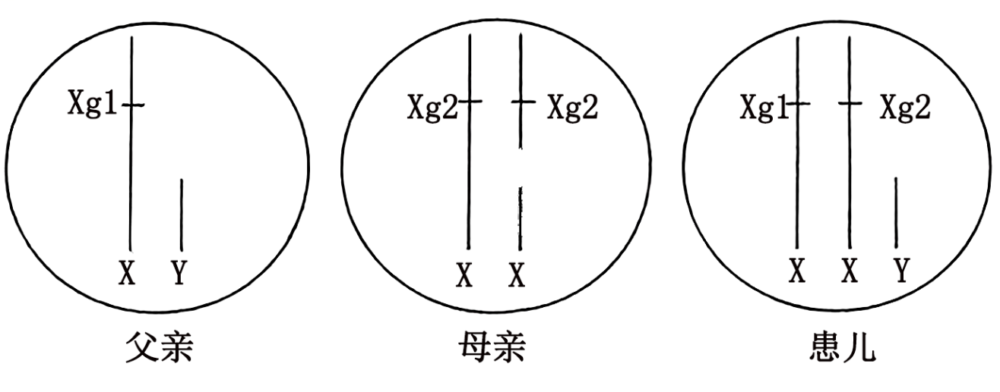
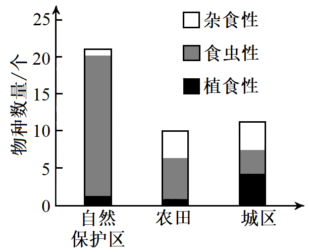
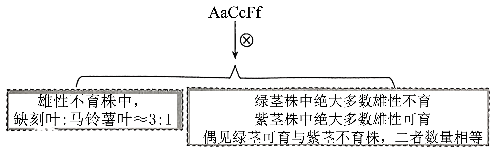
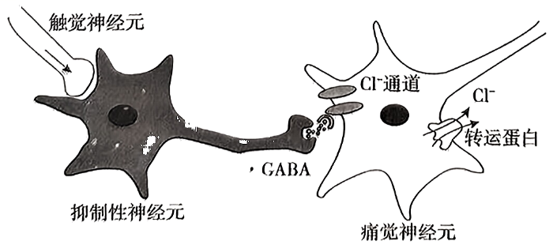
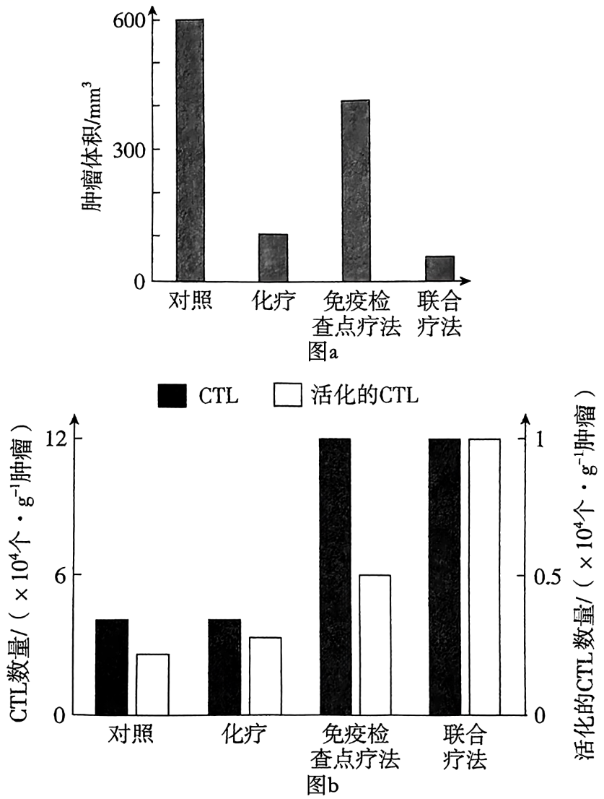
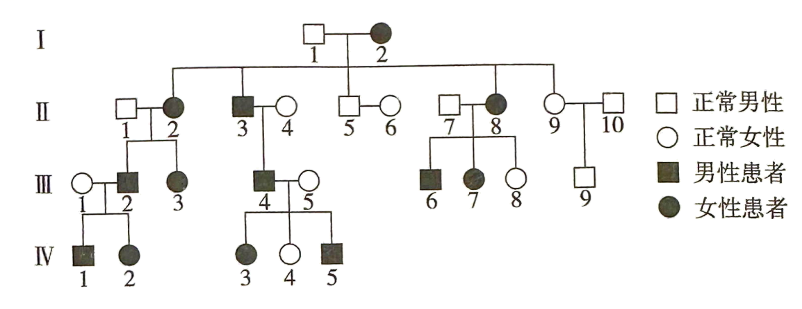
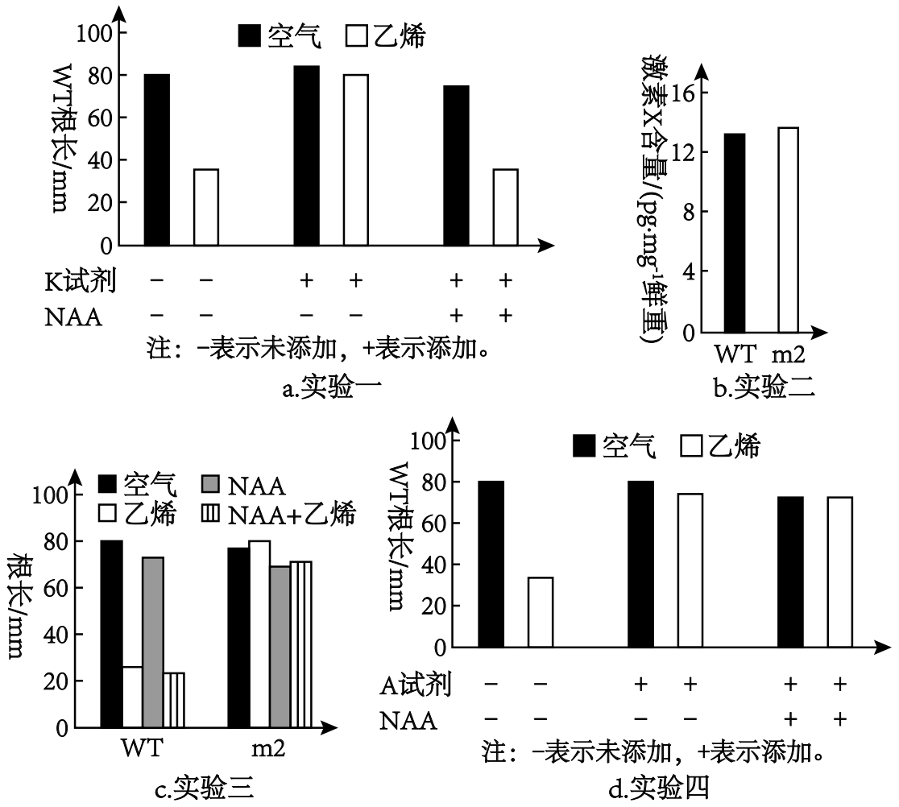
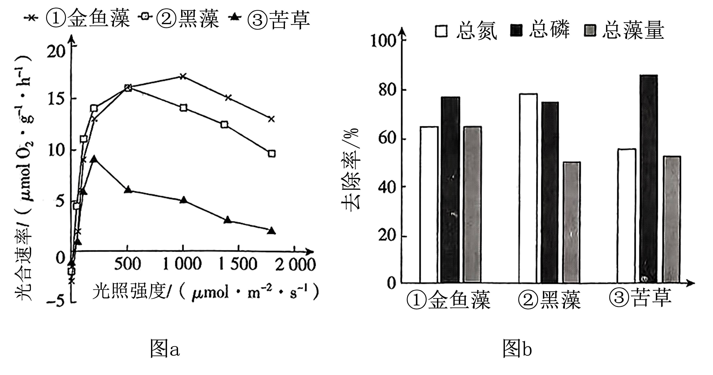
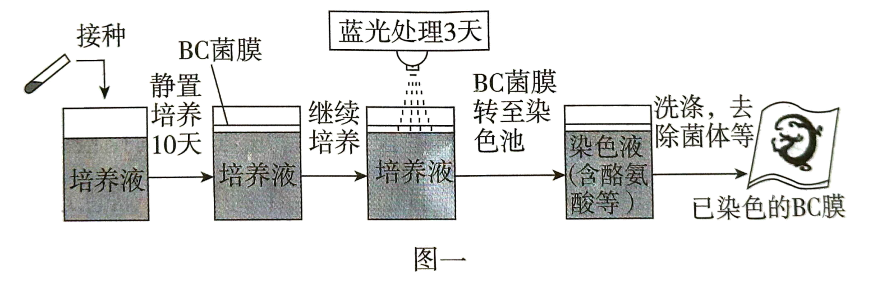
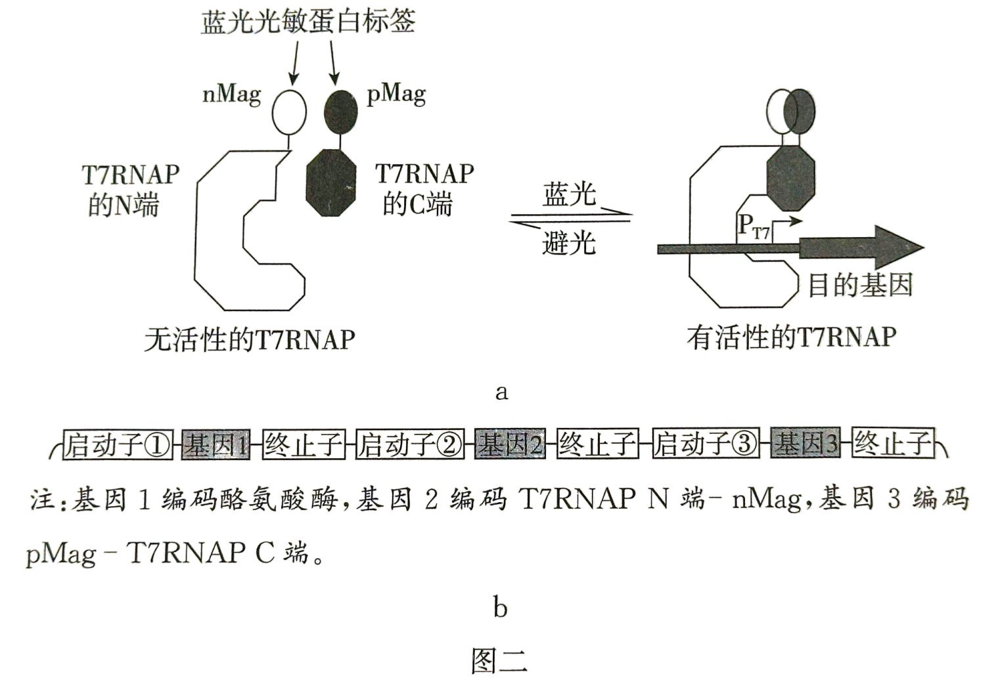

**2024年广东省普通高中学业水平选择性考试生物**

1\. “碳汇渔业”，又称“不投饵渔业”，是指充分发挥生物碳汇功能，通过收获水产品直接或间接减少CO2的渔业生产活动，是我国实现“双碳”目标、践行“大食物观”的举措之一。下列生产活动属于“碳汇渔业”的是（ ）

A. 开发海洋牧场，发展深海渔业

B. 建设大坝鱼道，保障鱼类洄游

C. 控制无序捕捞，实施长江禁渔

D. 增加饵料投放，提高渔业产量

2\. 2019年，我国科考队在太平洋马里亚纳海沟采集到一种蓝细菌，其细胞内存在由两层膜组成的片层结构，此结构可进行光合作用与呼吸作用。在该结构中，下列物质存在的可能性最小的是（　　）

A. ATP B. NADP+ C. NADH D. DNA

3\. 银杏是我国特有的珍稀植物，其叶片变黄后极具观赏价值。某同学用纸层析法探究银杏绿叶和黄叶的色素差别，下列实验操作正确的是（　　）

A. 选择新鲜程度不同的叶片混合研磨

B. 研磨时用水补充损失的提取液

C. 将两组滤纸条置于同一烧杯中层析

D. 用过的层析液直接倒入下水道

4\. 关于技术进步与科学发现之间的促进关系，下列叙述正确的是（　　）

A. 电子显微镜的发明促进细胞学说的提出

B. 差速离心法的应用促进对细胞器的认识

C. 光合作用的解析促进花期控制技术的成熟

D. RNA聚合酶的发现促进PCR技术的发明

5\. 研究发现，敲除某种兼性厌氧酵母（WT）sqr基因后获得的突变株△sqr中，线粒体出现碎片化现象，且数量减少。下列分析错误的是（　　）

A. 碎片化的线粒体无法正常进行有氧呼吸

B. 线粒体数量减少使△sqr的有氧呼吸减弱

C. 有氧条件下，WT 比△sqr的生长速度快

D. 无氧条件下，WT 比△sqr产生更多的ATP

6\. 研究发现，耐力运动训练能促进老年小鼠大脑海马区神经发生，改善记忆功能。下列生命活动过程中，不直接涉及记忆功能改善的是 （　　）

A. 交感神经活动增加

B. 突触间信息传递增加

C. 新突触的建立增加

D. 新生神经元数量增加

7\. 某患者甲状腺激素分泌不足。经诊断，医生建议采用激素治疗。下列叙述错误的是（　　）

A. 若该患者血液TSH水平低于正常，可能垂体功能异常

B. 若该患者血液TSH水平高于正常，可能是甲状腺功能异常

C. 甲状腺激素治疗可恢复患者甲状腺的分泌功能

D. 检测血液中相关激素水平可评估治疗效果

8\. 松树受到松叶蜂幼虫攻击时，会释放植物信息素，吸引寄生蜂将卵产入松叶蜂幼虫体内，寄生蜂卵孵化后以松叶蜂幼虫为食。下列分析错误是（　　）

A. 该过程中松树释放的信息应是化学信息

B. 3种生物凭借该信息相互联系形成食物链

C. 松树和寄生蜂的种间关系属于原始合作

D. 该信息有利于维持松林群落的平衡与稳定

9\. 克氏综合征是一种性染色体异常疾病。某克氏综合征患儿及其父母的性染色体组成见图。Xg1和Xg2为X染色体上的等位基因。导致该患儿染色体异常最可能的原因是（　　）

A. 精母细胞减数分裂Ⅰ性染色体不分离

B. 精母细胞减数分裂Ⅱ性染色体不分

C. 卵母细胞减数分裂Ⅰ性染色体不分离

D. 卵母细胞减数分裂Ⅱ性染色体不分离

10\. 研究发现，短暂地抑制果蝇幼虫中PcG 蛋白（具有组蛋白修饰功能）的合成，会启动原癌基因zfhl的表达，导致肿瘤形成。驱动此肿瘤形成的原因属于（　　）

A. 基因突变

B. 染色体变异

C. 基因重组

D. 表观遗传

11\. EDAR 基因的一个碱基替换与东亚人有更多汗腺等典型体征有关。用M、m分别表示突变前后的EDAR 基因，研究发现，m的频率从末次盛冰期后开始明显升高。下列推测合理的是（　　）

A. m的出现是自然选择的结果

B. m不存在于现代非洲和欧洲人群中

C. m的频率升高是末次盛冰期后环境选择的结果

D. MM、Mm和mm个体的汗腺密度依次下降

12\. Janzen-Connel假说（詹曾-康奈尔假说）认为，某些植物母株周围会积累对自身有害的病原菌、昆虫等，从而抑制母株附近自身种子的萌发和幼苗的生长。下列现象中，不能用该假说合理解释的是（　　）

A. 亚热带常绿阔叶林中楠木幼苗距离母株越远，其密度越大

B. 鸟巢兰种子远离母株萌发时，缺少土壤共生菌，幼苗死亡

C. 中药材三七连续原地栽种，会暴发病虫害导致产量降低

D. 我国农业实践中采用的水旱轮作，可减少农药的使用量

13\. 为探究人类活动对鸟类食性及物种多样性的影响，研究者调查了某地的自然保护区、农田和城区3种生境中雀形目鸟类的物种数量（取样的方法和条件一致），结果见图。下列分析错误的是（　　）

A. 自然保护区的植被群落类型多样，鸟类物种丰富度高

B. 农田的鸟类比自然保护区鸟类的种间竞争更小

C. 自然保护区鸟类比其他生境的鸟类有更宽的空间生态位

D. 人类活动产生空白生态位有利于杂食性鸟类迁入

14\. 雄性不育对遗传育种有重要价值。为获得以茎的颜色或叶片形状为标记的雄性不育番茄材料，研究者用基因型为 AaCcFf的番茄植株自交，所得子代的部分结果见图。其中，控制紫茎（A）与绿茎（a）、缺刻叶（C）与马铃薯叶（c）的两对基因独立遗传，雄性可育（F）与雄性不育（f）为另一对相对性状，3对性状均为完全显隐性关系。下列分析正确的是（　　）

A. 育种实践中缺刻叶可以作为雄性不育材料筛选的标记

B. 子代的雄性可育株中，缺刻叶与马铃薯叶的比例约为1：1

C. 子代中紫茎雄性可育株与绿茎雄性不育株的比例约为3：1

D. 出现等量绿茎可育株与紫茎不育株是基因突变的结果

15\. 现有一种天然多糖降解酶，其肽链由4段序列以Ce5-Ay3-Bi-CB方式连接而成。研究者将各段序列以不同方式构建新肽链，并评价其催化活性，部分结果见表。关于各段序列的生物学功能，下列分析错误的是（　　）

<table style="width:48%;">
<colgroup>
<col style="width: 17%" />
<col style="width: 7%" />
<col style="width: 8%" />
<col style="width: 7%" />
<col style="width: 7%" />
</colgroup>
<tbody>
<tr>
<td rowspan="2" style="text-align: left;">肽链</td>
<td colspan="2" style="text-align: left;">纤维素类底物</td>
<td colspan="2" style="text-align: left;">褐藻酸类底物</td>
</tr>
<tr>
<td style="text-align: left;">W1</td>
<td style="text-align: left;">W2</td>
<td style="text-align: left;">S1</td>
<td style="text-align: left;">S2</td>
</tr>
<tr>
<td style="text-align: left;">Ce5-Ay3-Bi-CB</td>
<td style="text-align: left;">+</td>
<td style="text-align: left;">+++</td>
<td style="text-align: left;">++</td>
<td style="text-align: left;">+++</td>
</tr>
<tr>
<td style="text-align: left;">Ce5</td>
<td style="text-align: left;">+</td>
<td style="text-align: left;">++</td>
<td style="text-align: left;">—</td>
<td style="text-align: left;">—</td>
</tr>
<tr>
<td style="text-align: left;">Ay3-Bi-CB</td>
<td style="text-align: left;">—</td>
<td style="text-align: left;">—</td>
<td style="text-align: left;">++</td>
<td style="text-align: left;">+++</td>
</tr>
<tr>
<td style="text-align: left;">Ay3</td>
<td style="text-align: left;">—</td>
<td style="text-align: left;">—</td>
<td style="text-align: left;">+++</td>
<td style="text-align: left;">++</td>
</tr>
<tr>
<td style="text-align: left;">Bi</td>
<td style="text-align: left;">—</td>
<td style="text-align: left;">—</td>
<td style="text-align: left;">—</td>
<td style="text-align: left;">—</td>
</tr>
<tr>
<td style="text-align: left;">CB</td>
<td style="text-align: left;">—</td>
<td style="text-align: left;">—</td>
<td style="text-align: left;">—</td>
<td style="text-align: left;">—</td>
</tr>
</tbody>
</table>

注：—表示无活性，+表示有活性，+越多表示活性越强。

A. Ay3与Ce5 催化功能不同，但可能存在相互影响

B. Bi无催化活性，但可判断与Ay3的催化专一性有关

C. 该酶对褐藻酸类底物的催化活性与Ce5无关

D. 无法判断该酶对纤维素类底物的催化活性是否与CB相关

16\. 轻微触碰时，兴奋经触觉神经元传向脊髓抑制性神经元，使其释放神经递质 GABA.正常情况下，GABA作用于痛觉神经元引起Cl-通道开放，Cl-内流，不产生痛觉；患带状疱疹后，痛觉神经元上Cl-转运蛋白（单向转运Cl-）表达量改变，引起Cl-的转运量改变，细胞内Cl-浓度升高，此时轻触引起GABA作用于痛觉神经元后，Cl-经Cl-通道外流，产生强烈痛觉。针对该过程（如图）的分析，错误的是（　　）

A. 触觉神经元兴奋时，在抑制性神经元上可记录到动作电位

B. 正常和患带状疱疹时，Cl-经Cl-通道的运输方式均为协助扩散

C. GABA作用的效果可以是抑制性的，也可以是兴奋性的

D. 患带状疱疹后Cl-转运蛋白增多，导致轻触产生痛觉

17\. 某些肿瘤细胞表面的PD-L1与细胞毒性T细胞（CTL）表面的PD-1结合能抑制CTL的免疫活性，导致肿瘤免疫逃逸。免疫检查点疗法使用单克隆抗体阻断PD-Ll和PD-1的结合，可恢复CTL的活性，用于肿瘤治疗。为进一步提高疗效，研究者以黑色素瘤模型小鼠为材料，开展该疗法与化疗的联合治疗研究。部分结果见图。

回答下列问题：

（1）据图分析，\_\_\_\_\_\_\_\_疗法的治疗效果最佳，推测其原因是\_\_\_\_\_\_\_。

（2）黑色素瘤细胞能分泌吸引某类细胞靠近的细胞因子CXCL1.为使CTL响应此信号，可在CTL中导入\_\_\_\_\_\_\_\_\_\_\_\_\_\_\_\_\_\_\_基因后再将其回输小鼠体内，从而进一步提高治疗效果。该基因的表达产物应定位于CTL的\_\_\_\_\_\_\_\_（答位置）且基因导入后不影响CTL\_\_\_\_\_\_\_\_\_\_\_的能力。

（3）某兴趣小组基于现有抗体—药物偶联物的思路提出了两种药物设计方案。方案一：将化疗药物与PD-L1 单克隆抗体结合在一起。方案二：将化疗药物与PD-1单克隆抗体结合在一起。你认为方案\_\_\_\_\_\_\_（填“一”或“二”）可行，理由是\_\_\_\_\_\_\_\_\_\_。

18\. 遗传性牙龈纤维瘤病（HGF）是一种罕见的口腔遗传病，严重影响咀嚼、语音、美观及心理健康。2022年，我国科学家对某一典型的HGF家系（如图）进行了研究，发现ZNF862基因突变导致HGF发生。

回答下列问题：

（1）据图分析，HGF最可能的遗传方式是\_\_\_\_\_\_\_\_\_。假设该致病基因的频率为p，根据最可能的遗传方式，Ⅳ2生育一个患病子代的概率为\_\_\_\_\_\_\_（列出算式即可）。

（2）为探究ZNF862 基因的功能，以正常人牙龈成纤维细胞为材料设计实验，简要写出设计思路：\_\_\_\_\_\_\_。为从个体水平验证ZNF862基因突变导致HGF，可制备携带该突变的转基因小鼠，然后比较\_\_\_\_\_\_的差异。

（3）针对HGF这类遗传病，通过体细胞基因组编辑等技术可能达到治疗的目的。是否也可以通过对人类生殖细胞或胚胎进行基因组编辑来防治遗传病？作出判断并说明理由\_\_\_\_\_\_\_\_。

19\. 乙烯参与水稻幼苗根生长发育过程的调控。为研究其机理，我国科学家用乙烯处理萌发的水稻种子3天，观察到野生型（WT）幼苗根的伸长受到抑制，同时发现突变体m2，其根伸长不受乙烯影响；推测植物激素X参与乙烯抑制水稻幼苗根伸长的调控，设计并开展相关实验，其中K试剂抑制激素X的合成，A试剂抑制激素X受体的功能，部分结果见图。

回答下列问题：

（1）为验证该推测进行了实验一，结果表明，乙烯抑制WT根伸长需要植物激素X，推测X可能是\_\_\_\_。

（2）为进一步探究X如何参与乙烯对根伸长的调控，设计并开展了实验二、三和四。

①实验二的目的是检测m2的突变基因是否与\_\_\_\_\_\_有关。

②实验三中使用了可自由扩散进入细胞 NAA，目的是利用NAA的生理效应，初步判断乙烯抑制根伸长是否与\_\_\_\_\_\_\_\_\_\_有关。若要进一步验证该结论并检验 m2 的突变基因是否与此有关，可检测\_\_\_\_\_的表达情况。

③实验四中有3组空气处理组，其中设置★所示组的目的是\_\_\_\_\_\_\_。

（3）分析上述结果，推测乙烯对水稻幼苗根伸长的抑制可能是通过影响\_\_\_\_\_\_\_\_实现的。

20\. 某湖泊曾处于重度富营养化状态，水面漂浮着大量浮游藻类。管理部门通过控源、清淤、换水以及引种沉水植物等手段，成功实现了水体生态恢复。引种的3种多年生草本沉水植物（①金鱼藻、②黑藻、③苦草，答题时植物名称可用对应序号表示）在不同光照强度下光合速率及水质净化能力见图。

回答下列问题：

（1）湖水富营养化时，浮游藻类大量繁殖，水体透明度低，湖底光照不足。原有沉水植物因光合作用合成的有机物少于\_\_\_\_\_\_\_的有机物，最终衰退和消亡。

（2）生态恢复后，该湖泊形成了以上述3种草本沉水植物为优势的群落垂直结构，从湖底到水面依次是\_\_\_\_\_\_\_\_，其原因是\_\_\_\_\_\_\_。

（3）为了达到湖水净化的目的，选择引种上述3种草本沉水植物的理由是\_\_\_\_\_\_\_\_\_，三者配合能实现综合治理效果。

（4）上述3种草本沉水植物中只有黑藻具（C4光合作用途径（浓缩CO2形成高浓度（C4后，再分解成（CO2传递给C5）使其在CO2受限的水体中仍可有效地进行光合作用，在水生植物群落中竞争力较强。根据图a设计一个简单的实验方案，验证黑藻的碳浓缩优势，完成下列表格。

<table style="width:56%;">
<colgroup>
<col style="width: 11%" />
<col style="width: 44%" />
</colgroup>
<tbody>
<tr>
<td colspan="2" style="text-align: left;">实验设计方案</td>
</tr>
<tr>
<td style="text-align: left;">实验材料</td>
<td style="text-align: left;">对照组：_______ 实验组：黑藻</td>
</tr>
<tr>
<td rowspan="2" style="text-align: left;">实验条件</td>
<td style="text-align: left;">控制光照强度_______μmol·m-2·s-1</td>
</tr>
<tr>
<td style="text-align: left;">营养及环境条件相同且适宜，培养时间相同</td>
</tr>
<tr>
<td style="text-align: left;">控制条件</td>
<td style="text-align: left;">__________</td>
</tr>
<tr>
<td style="text-align: left;">测量指标</td>
<td style="text-align: left;">__________</td>
</tr>
</tbody>
</table>

（5）目前在湖边浅水区种植的沉水植物因强光抑制造成生长不良，此外，大量沉水植物叶片凋落，需及时打捞，增加维护成本。针对这两个实际问题从生态学角度提出合理的解决措施\_\_\_\_\_\_。

21\. 驹形杆菌可合成细菌纤维素（BC）并将其分泌到胞外组装成膜。作为一种性能优异的生物材料，BC膜应用广泛。研究者设计了酪氨酸酶（可催化酪氨酸形成黑色素）的光控表达载体，将其转入驹形杆菌后构建出一株能合成BC膜并可实现光控染色的工程菌株，为新型纺织原料的绿色制造及印染工艺升级提供了新思路（图一）。

回答下列问题：

（1）研究者优化了培养基的\_\_\_\_\_\_\_（答两点）等营养条件，并控制环境条件，大规模培养工程菌株后可在气液界面处获得BC菌膜（菌体和 BC膜的复合物）。

（2）研究者利用T7 噬菌体来源的RNA聚合酶（T7RNAP）及蓝光光敏蛋白标签，构建了一种可被蓝光调控的基因表达载体（光控原理见图二a，载体的部分结构见图二b）。构建载体时，选用了通用型启动子 PBAD（被工程菌 RNA 聚合酶识别）和特异型启动子PT7（仅被T7RNAP识别）。为实现蓝光控制染色，启动子①②及③依次为\_\_\_\_\_\_\_\_，理由是\_\_\_\_\_\_\_\_\_\_\_。

（3）光控表达载体携带大观霉素（抗生素）抗性基因。长时间培养时在培养液中加入大观霉素，其作用为\_\_\_\_\_\_\_\_\_\_\_\_\_\_\_\_\_\_\_\_\_\_\_\_（答两点）。

（4）根据预设的图案用蓝光照射已长出的BC菌膜并继续培养一段时间，随后将其转至染色池处理，发现只有经蓝光照射的区域被染成黑色，其原因是\_\_\_\_\_。

（5）有企业希望生产其他颜色图案的BC膜。按照上述菌株的构建模式提出一个简单思路\_\_\_\_\_\_。
